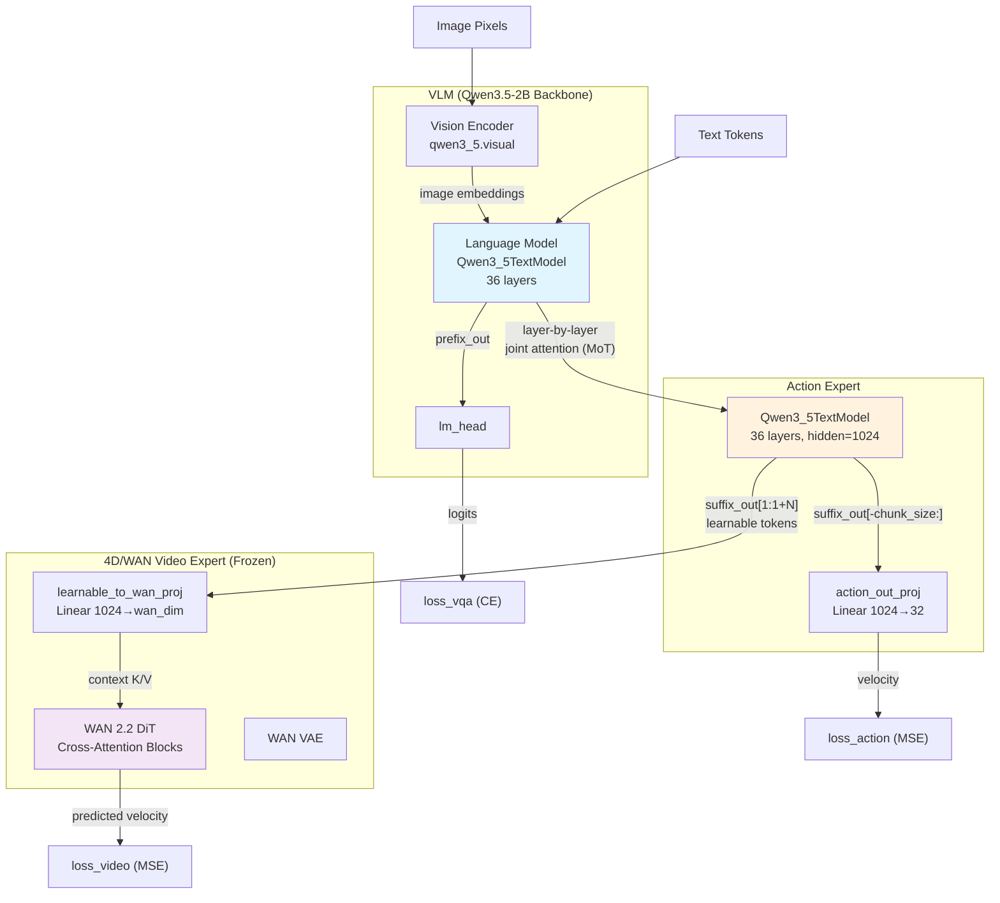
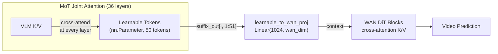
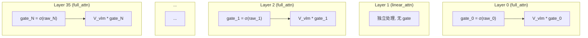
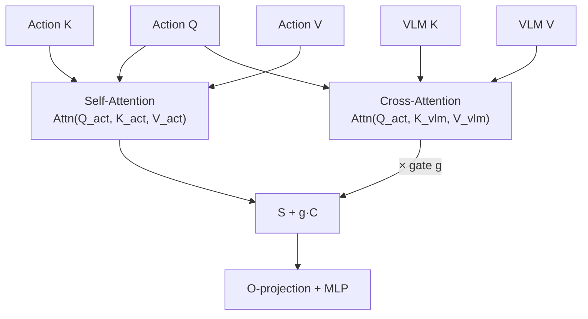

# VLM → Expert 影响路径分析 & 模态融合权重设计方案

> **文档目标**: 深入分析 InternVLA-A1.5 中 VLM 对 Action Expert 和 4D (WAN Video) Expert 的影响路径, 并设计可调节的模态融合权重 (modal fusion weight / gate), 提供多个方案并比较改动量, 影响面和风险.
>
> **代码基线**: 本文档基于 `src/lerobot/policies/internvla_a1_5/modeling_internvla_a1_5.py` (以下简称 "modeling.py") 和 `configuration_internvla_a1_5.py` (以下简称 "config.py") 的当前版本.

---

## 1. 架构概述: VLM 如何影响 Action Expert 和 4D Expert

### 1.1 整体架构图



### 1.2 VLM → Action Expert 的影响路径

VLM 对 Action Expert 的影响发生在**每一个 Transformer 层**中, 采用的是 **Mixture of Transformers (MoT)** 联合注意力机制, 而不是简单的 "先跑 VLM 再把隐藏层传给 Action Expert" 的两阶段范式.

#### 核心机制 (modeling.py `compute_layer_complete`, L124-341)

在每一层 `full_attention` 层中:

1. **独立计算 Q/K/V**: VLM 和 Action Expert 各自用自己的权重 ($W_Q^{vlm}, W_K^{vlm}, W_V^{vlm}$ 和 $W_Q^{act}, W_K^{act}, W_V^{act}$) 对各自的 hidden states 计算 Q/K/V (L194-215)

2. **Joint RoPE**: 将两路 Q/K/V **拼接**后统一应用旋转位置编码 (L222-237), 然后再 split 回来 (L240-245). 这确保了两个 expert 共享同一个位置空间.

3. **非对称注意力**:
   - **VLM prefix** 只 attend 到自己的 K/V (L254-271): $\text{Attn}_{vlm} = \text{softmax}(Q^{vlm} \cdot {K^{vlm}}^\top / \sqrt{d}) \cdot V^{vlm}$
   - **Action Expert suffix** attend 到 **VLM prefix 和自己的 K/V 的拼接** (L281-301):

$$\text{Attn}_{act} = \text{softmax}\left(\frac{Q^{act} \cdot [K^{vlm}; K^{act}]^\top}{\sqrt{d}}\right) \cdot [V^{vlm}; V^{act}]$$

4. **Q-gate 调制**: Qwen3.5 的 Q 投影输出 $2 \times d_{head}$ 维度, 一半做 query, 一半做 gate. 最终注意力输出通过 $\sigma(\text{gate}) \odot \text{attn\_output}$ 调制 (L320). **每个 expert 独立产生自己的 gate**.

5. **独立的 O-projection 和 MLP**: 各自通过自己的 $W_O$, layernorm, 和 MLP (L312-337).

**关键代码路径** (`compute_layer_complete` 中的 suffix 注意力):
```python
# L274-282: Action Expert queries attend to [VLM K/V, Action K/V]
if knowledge_insulation:
    prefix_key_for_suffix = prefix_key.detach()
    prefix_value_for_suffix = prefix_value.detach()
else:
    prefix_key_for_suffix = prefix_key
    prefix_value_for_suffix = prefix_value

k_for_suffix = torch.cat([prefix_key_for_suffix, suffix_key], dim=2)
v_for_suffix = torch.cat([prefix_value_for_suffix, suffix_value], dim=2)
```

> **核心观察**: VLM 对 Action Expert 的影响完全通过注意力机制中的 K/V 传递. Action Expert 的每一层都能 "看到" VLM 同一层产生的 K/V, 这意味着 VLM 的信息在**每一层**都在持续渗透到 Action Expert 中, 而不是只在某一个瓶颈点传递.

#### 对于 `linear_attention` 层 (L153-186)

VLM 和 Action Expert **完全独立处理**, 各自用自己的 `Qwen3_5GatedDeltaNet` 递归层. 这些层天然隔离, 不存在跨 expert 的信息流.

### 1.3 VLM → 4D/WAN Video Expert 的影响路径

VLM 对 WAN Video Expert 的影响是**间接**的, 通过 **learnable tokens** 作为中介:



**详细数据流**:

1. **Learnable Tokens 初始化**: `nn.Parameter` 形状 `[50, 1024]`, 通过 `learnable_tokens_in_proj` 线性投影后嵌入 action expert suffix (modeling.py L1029-1035, L1534-1540)

2. **MoT 中信息积累**: 在 36 层 MoT 联合注意力中, learnable tokens 作为 action expert suffix 的一部分, **每一层都 attend 到 VLM prefix 的 K/V**. 经过 36 层后, learnable tokens 已经融合了来自 VLM 的视觉-语言理解信息.

3. **输出提取与投影**: 从 suffix_out 中截取 learnable token 对应位置 (modeling.py L1634-1637):
   ```python
   def get_learnable_token_output(self, suffix_out):
       start = 1  # skip state token
       end = 1 + self.config.num_learnable_tokens
       return suffix_out[:, start:end]
   ```

4. **WAN Cross-Attention**: 投影后的 learnable token 作为 WAN DiT 每个 block 的 cross-attention **context** (K/V 来源), 替换 WAN 原本的 text embeddings (modeling.py L2039):
   ```python
   context = wan_context  # projected learnable tokens
   ```

   WAN DiT block 中 (wan/modules/model.py L356):
   ```python
   x = x + self.cross_attn(self.norm3(x), context, context_lens)
   ```
   其中 `WanCrossAttention` (L262-284) 做标准 cross-attention: video tokens 提供 Q, learnable tokens 提供 K/V.

### 1.4 三路 MoT (3-path, with Keypoint Expert)

当 `enable_keypoint_predictor=True` 时, 使用 `compute_layer_complete_3path` (L343-553), 注意力规则变为:

| Path | Attends to |
|---|---|
| VLM prefix | 仅自身 |
| Keypoint Expert | [VLM prefix (可detach), Keypoint] |
| Action Expert | [VLM prefix (可detach), Keypoint (可detach), Action] |

这形成了一个**层级信息流**: VLM → Keypoint Expert → Action Expert → WAN Video Expert.

### 1.5 现有梯度控制机制

| 机制 | 配置项 | 效果 | 代码位置 |
|---|---|---|---|
| Knowledge Insulation (KI) | `knowledge_insulation` | 对 VLM K/V 做 `.detach()`, 阻断 action loss → VLM 的梯度 | L274-279 |
| KI for Keypoint | `knowledge_insulation_kpt` | 同上, 针对 kpt expert | L499-500 |
| KI kpt→action | `kpt_to_action_detach` | 阻断 action loss → kpt expert 的梯度 | L509-510 |
| Block FAST tokens | `block_action_attend_fast_tokens` | 二值 mask, 禁止 action expert attend FAST tokens | L1243-1256 |
| 已定义未使用的 soft KI | `ki_gradient_scale`, `ki_kpt_gradient_scale` | config 中已定义 (L477-478) 但 forward 中未实现 | config.py L477-478 |

### 1.6 现有 Loss 权重

```python
# modeling.py L2517-2522 (InternVLAA15Policy.forward)
loss = (
    action_loss_weight * loss_fm_action    # 默认 10.0
    + lambda_vqa * loss_vlm                # 默认 1.0
    + video_loss_weight * video_loss        # 默认 1.0
    + loss_kpt                             # kpt_loss_weight * (loss_kpt_cur + kpt_future_loss_weight * loss_kpt_fut)
)
```

> **关键洞察**: 现有系统只在**梯度层面** (KI detach) 和 **loss 加权层面**控制 VLM 对 expert 的影响. **没有在 forward 数据流层面**对 VLM → expert 的信息量进行连续可调的控制. 这正是本文档要解决的问题.

---

## 2. 问题分析: 为什么需要模态融合权重

### 2.1 当前痛点

1. **VLM 信息全量灌入**: Action Expert 在每一层都通过注意力完全接收 VLM 的 K/V, 没有机制调节 "VLM 应该影响多少". 当 VLM 的理解出错(如场景误判, 指令误解)时, 错误信息无差别地传递给所有 expert.

2. **训练不同阶段需要不同融合强度**:
   - **Pre-training**: 需要较强的 VLM 影响, 让 action expert 学习利用视觉语言信息
   - **Fine-tuning**: 可能需要降低 VLM 影响, 让 action expert 更多依赖自身对动作空间的建模
   - **域迁移**: 当 VLM 预训练分布与目标域差异大时, 需要逐步增加 VLM 影响

3. **4D 和 Action 两路需要独立调节**: Video foresight 和 action prediction 对 VLM 信息的需求可能不同. 例如, video 预测需要更多的场景理解 (来自 VLM 的视觉信息), 而 action 预测在低层次运动控制时可能更依赖自身的运动先验.

4. **KI 太粗糙**: 现有的 knowledge_insulation 是 **binary** 的 (detach 或不 detach), 没有中间态. 已定义但未实现的 `ki_gradient_scale` 只控制梯度, 不控制 forward 方向的信息流.

### 2.2 设计目标

设计一个 **模态融合权重 (modal fusion weight / gate)**, 可以:

1. 在 **forward 方向**连续调节 VLM K/V 对 expert 注意力输出的贡献 (不仅仅是梯度)
2. 支持 **per-expert** 独立调节 (action expert 和 video expert 可以有不同的融合强度)
3. 尽可能保持推理效率, 不引入过多额外参数或计算
4. 与现有 KI 机制兼容
5. 支持从标量 (全局) 到向量 (per-layer / per-head) 的不同粒度

---

## 3. 方案设计

### 3.1 方案 A: 标量 Attention Scaling (最简方案)

#### 3.1.1 核心思想

在 Action Expert 的注意力计算中, 对来自 VLM prefix 的 K/V 施加一个**可学习的标量缩放因子** $\alpha \in [0, 1]$:

$$\text{Attn}_{act} = \text{softmax}\left(\frac{Q^{act} \cdot [\alpha \cdot K^{vlm}; K^{act}]^\top}{\sqrt{d}}\right) \cdot [\alpha \cdot V^{vlm}; V^{act}]$$

#### 3.1.2 实现细节

**配置变更** (config.py):
```python
@dataclass
class InternVLAA15Config(PreTrainedConfig):
    # ... existing fields ...

    # Modal fusion weight: controls VLM→ActionExpert information flow
    # 1.0 = full VLM influence (default, backward-compatible)
    # 0.0 = no VLM influence (action expert fully self-contained)
    vlm_to_action_fusion_weight: float = 1.0

    # Modal fusion weight: controls VLM→VideoExpert information flow (via learnable tokens)
    vlm_to_video_fusion_weight: float = 1.0

    # Whether fusion weights are learnable parameters (True) or fixed hyperparameters (False)
    learnable_fusion_weight: bool = False
```

**模型变更** (modeling.py):

在 `InternVLAA15` 的 `__init__` 中:
```python
if config.learnable_fusion_weight:
    # Raw value before sigmoid, initialized so sigmoid(raw) = config value
    raw_init = math.log(config.vlm_to_action_fusion_weight /
                        (1 - config.vlm_to_action_fusion_weight + 1e-7))
    self.vlm_to_action_fusion_weight_raw = nn.Parameter(torch.tensor(raw_init))

    raw_init_v = math.log(config.vlm_to_video_fusion_weight /
                          (1 - config.vlm_to_video_fusion_weight + 1e-7))
    self.vlm_to_video_fusion_weight_raw = nn.Parameter(torch.tensor(raw_init_v))
```

在 `compute_layer_complete` 中 (L273 之后):
```python
# --- suffix queries: attend to [prefix (maybe-detached, maybe-scaled) K/V, suffix K/V].
if knowledge_insulation:
    prefix_key_for_suffix = prefix_key.detach()
    prefix_value_for_suffix = prefix_value.detach()
else:
    prefix_key_for_suffix = prefix_key
    prefix_value_for_suffix = prefix_value

# NEW: apply fusion weight scaling
if fusion_weight is not None and fusion_weight != 1.0:
    prefix_key_for_suffix = prefix_key_for_suffix * fusion_weight
    prefix_value_for_suffix = prefix_value_for_suffix * fusion_weight

k_for_suffix = torch.cat([prefix_key_for_suffix, suffix_key], dim=2)
v_for_suffix = torch.cat([prefix_value_for_suffix, suffix_value], dim=2)
```

**对 learnable tokens → WAN 路径的控制**:

在 `_compute_video_loss` 中 (L2077 之后):
```python
wan_context = self.learnable_to_wan_proj(learnable_out)
# NEW: scale the context fed to WAN
if self.config.vlm_to_video_fusion_weight != 1.0:
    wan_context = wan_context * self.vlm_to_video_fusion_weight
```

#### 3.1.3 数学分析

对 Softmax 注意力, 缩放 K 等价于调节 logits 的幅度:

$$\alpha \cdot K^{vlm} \Rightarrow Q \cdot (\alpha K^{vlm})^\top = \alpha \cdot (Q \cdot {K^{vlm}}^\top)$$

当 $\alpha < 1$ 时, VLM prefix 对应的 attention logits 减小, softmax 分配给 VLM prefix 的权重降低; 当 $\alpha \to 0$ 时, VLM prefix 的注意力权重趋近均匀极小值, action expert 趋向于只 self-attend.

同时缩放 V 则进一步线性压缩来自 VLM 的value贡献.

#### 3.1.4 改动量, 影响面和风险

| 维度 | 评估 |
|---|---|
| **改动量** | **极小**. config 加 3 个字段, `compute_layer_complete` 改 ~5 行, `_compute_video_loss` 改 ~2 行. 函数签名增加 `fusion_weight` 参数并层层传递. 总计 ~40 行新增/修改. |
| **影响面** | 仅影响 `compute_layer_complete`, `compute_layer_complete_3path`, `InternVLAA15WithExpertModel.forward`, `_compute_video_loss`. 默认值 1.0 时行为与原代码完全一致 (乘 1.0 优化掉). |
| **推理开销** | 可忽略. 两次标量乘法 per layer (在 K/V tensor 上). |
| **风险** | **低**. 但有一个理论缺陷: 同时缩放 K 和 V 可能导致 softmax 分布过于平坦 (K 缩放) 同时 value 幅度也降低 (V 缩放), 两者叠加可能导致影响衰减过快. 建议只缩放 V 或只缩放 K (见 3.1.5). |

#### 3.1.5 变体: 只缩放 V (推荐)

只对 V 施加 $\alpha$, 保持 K 不变:

$$\text{Attn}_{act} = \text{softmax}\left(\frac{Q^{act} \cdot [K^{vlm}; K^{act}]^\top}{\sqrt{d}}\right) \cdot [\alpha \cdot V^{vlm}; V^{act}]$$

**优点**: 不影响 attention pattern (哪些位置被关注), 只调节信息融合的**强度**. 更加稳定, 不会破坏注意力分布的语义.

**实现**: 只改 V 的缩放那一行:

```python
if fusion_weight is not None and fusion_weight != 1.0:
    prefix_value_for_suffix = prefix_value_for_suffix * fusion_weight
    # prefix_key_for_suffix 保持不变
```

---

### 3.2 方案 B: Per-Layer Learnable Gate (中等方案)

#### 3.2.1 核心思想

为每一层 full_attention 层引入一个 **learnable per-layer gate** $g_l \in [0, 1]$, 控制该层 VLM → Action Expert 的信息流强度:

$$\text{Attn}_{act}^{(l)} = \text{softmax}\left(\frac{Q^{act} \cdot [K^{vlm}; K^{act}]^\top}{\sqrt{d}}\right) \cdot [g_l \cdot V^{vlm}; V^{act}]$$

#### 3.2.2 设计动机

不同层承载不同级别的语义:
- **浅层 (0-10)**: 低级视觉特征, 位置/形状信息 → Action Expert 可能需要较多
- **中层 (10-25)**: 中级语义, 物体关系 → Action Expert 适度需要
- **深层 (25-35)**: 高级语义, 任务理解 → Action Expert 可能需要更多

Per-layer gate 让模型自行学习每一层最优的融合强度.

#### 3.2.3 实现细节

**配置变更**:
```python
@dataclass
class InternVLAA15Config(PreTrainedConfig):
    # Per-layer fusion gate for VLM→ActionExpert
    enable_per_layer_fusion_gate: bool = False

    # Initialization strategy: "ones" (start fully open) or "linear" (linearly increasing)
    fusion_gate_init: str = "ones"
```

**模型变更** (modeling.py, `InternVLAA15.__init__`):
```python
if config.enable_per_layer_fusion_gate:
    num_full_attn_layers = sum(
        1 for lt in vlm_text_config.layer_types if lt == "full_attention"
    )
    if config.fusion_gate_init == "ones":
        init_val = torch.zeros(num_full_attn_layers)  # sigmoid(0) = 0.5, 但这里用 ones
    elif config.fusion_gate_init == "linear":
        init_val = torch.linspace(-2, 2, num_full_attn_layers)  # sigmoid(-2)≈0.12 → sigmoid(2)≈0.88

    self.fusion_gate_raw = nn.Parameter(init_val)  # [num_full_attn_layers]
```

在 `compute_layer_complete` 中:
```python
# 计算当前 full_attention 层的 index (跳过 linear_attention 层)
gate_value = torch.sigmoid(fusion_gate_raw[full_attn_layer_idx])

prefix_value_for_suffix = prefix_value_for_suffix * gate_value
```

#### 3.2.4 架构图



#### 3.2.5 改动量, 影响面和风险

| 维度 | 评估 |
|---|---|
| **改动量** | **小-中**. config 加 2 个字段, `InternVLAA15.__init__` 加 ~15 行, `compute_layer_complete` 改 ~5 行, 需要传递 gate 参数或改函数签名. 需要在 `InternVLAA15WithExpertModel.forward` 的 layer loop 中追踪 full_attn_layer_idx. 总计 ~60 行新增/修改. |
| **影响面** | 同方案 A, 但额外引入了 ~20 个可学习参数 (Qwen3.5-2B 有 ~20 个 full_attention 层). 参数量增加可忽略. |
| **推理开销** | 可忽略 (20 次标量-tensor 乘法). |
| **风险** | **低-中**. 如果 gate 学到极端值 (全 0 或全 1), 可能退化为无效或等价于 KI; 需要正则化 (如 L2 on raw values 或 clamp). 训练时 gate 的梯度可能与其他参数耦合导致不稳定, 但由于参数量极少, 影响有限. |
| **优点** | 模型可以自动学习最优的 per-layer 融合策略, 比全局标量更精细. |

---

### 3.3 方案 C: Attention Score Additive Bias (注意力分数偏置方案)

#### 3.3.1 核心思想

不修改 K/V 的值, 而是在 softmax 之前对 attention scores 添加一个**可学习的偏置** $b$, 控制 action expert query 对 VLM prefix key 的注意力分配:

$$\text{Attn}_{act} = \text{softmax}\left(\frac{Q^{act} \cdot [K^{vlm}; K^{act}]^\top}{\sqrt{d}} + [b; 0]\right) \cdot [V^{vlm}; V^{act}]$$

当 $b < 0$ 时, VLM prefix 的注意力权重降低; 当 $b > 0$ 时增大. $b = 0$ 时等价于原始行为.

#### 3.3.2 实现细节

这个方案的实现需要**修改注意力计算的内部逻辑**, 而不是简单地缩放 K/V.

**配置变更**:
```python
@dataclass
class InternVLAA15Config(PreTrainedConfig):
    # Attention bias for VLM→Expert attention (negative = suppress, positive = amplify)
    enable_fusion_attn_bias: bool = False
    fusion_attn_bias_init: float = 0.0
    fusion_attn_bias_per_layer: bool = False  # True: per-layer bias; False: global scalar
```

**模型变更**:

在 `compute_layer_complete` 中, 需要修改 attention 计算部分. 对于 eager attention:
```python
# 在 suffix attention mask 的 prefix 部分加上 bias
if fusion_attn_bias is not None:
    # suffix_attn_mask 的形状: [B, num_heads, suffix_len, prefix_len + suffix_len]
    # 我们只修改 [:, :, :, :prefix_len] 部分
    suffix_attn_mask = suffix_attn_mask.clone()
    suffix_attn_mask[:, :, :, :prefix_len] = suffix_attn_mask[:, :, :, :prefix_len] + fusion_attn_bias
```

对于 SDPA:
```python
# SDPA 的 attn_mask 是 additive bias
suffix_attn_mask[:, :, :, :prefix_len] += fusion_attn_bias
```

#### 3.3.3 改动量, 影响面和风险

| 维度 | 评估 |
|---|---|
| **改动量** | **中**. 需要在注意力计算的 mask 上做修改, 而当前代码中 mask 是 4D 张量 (L254, L283), 需要仔细处理. 需要 clone mask 以避免 in-place 修改影响 prefix 的自注意力. 总计 ~50 行新增/修改, 但修改位置更敏感. |
| **影响面** | 修改了注意力计算的核心路径, 影响所有使用 `compute_layer_complete` 的 forward 和 backward. |
| **推理开销** | 可忽略 (一次加法 on mask tensor, 但需要额外 clone 一次 mask). |
| **风险** | **中**. 修改 attention mask 是高风险操作: (1) 需要确保 bias 只加到 suffix→prefix 的 attention scores 上, 不影响 prefix self-attention; (2) `suffix_attn_mask` 同时包含了 padding 信息 (用 -inf 标记), 加上 bias 不能破坏这些 -inf 的语义; (3) 与 SDPA 和 eager attention 两条路径都需要兼容; (4) gradient checkpointing 下 mask clone 的内存开销. |
| **优点** | 理论上最"正交"的方案 — 直接在 softmax 的 logits 空间操作, 不改变 K/V 的表示, 对 VLM 的表示空间零侵入. |

---

### 3.4 方案 D: Residual Mixing Gate (残差混合门, 最灵活方案)

#### 3.4.1 核心思想

在 action expert 的 attention 输出中, 将来自 VLM 的 cross-attention 贡献和 self-attention 贡献**分离**, 然后用一个 gate 控制混合比例:

1. 先分别计算 action expert 对 VLM K/V 的 cross-attention 输出 $C$ 和对自身 K/V 的 self-attention 输出 $S$
2. 最终输出 = $g \cdot C + S$ (或 $g \cdot C + (1-g) \cdot S$)

#### 3.4.2 实现细节

这需要**显著修改** `compute_layer_complete` 中 suffix 的注意力计算, 将一次联合注意力拆成两次:

```python
# Step 1: self-attention (action expert K/V only)
self_attn_output = attention(suffix_query, suffix_key, suffix_value, self_attn_mask)

# Step 2: cross-attention to VLM (VLM K/V only)
cross_attn_output = attention(suffix_query, prefix_key_for_suffix, prefix_value_for_suffix, cross_attn_mask)

# Step 3: gated combination
gate = torch.sigmoid(self.fusion_gate[layer_idx])  # per-layer gate
suffix_att_output = self_attn_output + gate * cross_attn_output
```

**配置变更**:
```python
@dataclass
class InternVLAA15Config(PreTrainedConfig):
    enable_residual_mixing_gate: bool = False
    residual_mixing_gate_init: float = 1.0  # 初始值, 1.0 = 保持原始行为
    residual_mixing_gate_per_head: bool = False  # True: per-head gate; False: per-layer scalar
```

#### 3.4.3 架构图



#### 3.4.4 改动量, 影响面和风险

| 维度 | 评估 |
|---|---|
| **改动量** | **大**. 需要将联合注意力拆成两次独立计算, 改变了 `compute_layer_complete` 和 `compute_layer_complete_3path` 的核心逻辑. 总计 ~120-150 行新增/修改, 涉及所有 attention 计算路径. |
| **影响面** | 高. (1) 计算量翻倍: 从一次联合 attention 变成两次独立 attention; (2) 显存增加: 需要存储两份 attention output; (3) 推理路径也需要同步修改 (`denoise_step_full`, `denoise_step` 等). |
| **推理开销** | **显著**. Attention 计算量 ≈ 翻倍 (从 $O((L_{prefix}+L_{suffix}) \cdot L_{suffix})$ 变为 $O(L_{prefix} \cdot L_{suffix}) + O(L_{suffix}^2)$, 但常数更大因为需要两次独立调用). |
| **风险** | **高**. (1) 拆分联合 attention 破坏了 MoT 的设计哲学 — 原始 MoT 的 joint attention 允许 action expert 在考虑 VLM 上下文的同时也做 self-attention, 两者是**耦合**的 (softmax 归一化跨越两段 K/V). 拆分后变成**解耦**, 语义不同; (2) 初始化要精心调整以确保 $g=1$ 时与原始行为近似但不完全等价 (因为解耦了 softmax); (3) 与 gradient checkpointing 的交互可能产生额外内存峰值. |
| **优点** | 最灵活, 允许完全独立控制 cross-modal 和 self-modal 的贡献. 如果加上 per-head gate, 还能让不同的注意力头对 VLM 信息有不同的利用强度. |

---

### 3.5 方案 E: Soft Knowledge Insulation (Gradient Scaling, 仅影响梯度方向)

#### 3.5.1 核心思想

实现 config 中已定义但未使用的 `ki_gradient_scale` 和 `ki_kpt_gradient_scale`, 使用**梯度缩放 (gradient scaling)** 代替硬 detach:

$$\hat{K}^{vlm} = K^{vlm} \cdot s + K^{vlm}.\text{detach()} \cdot (1 - s)$$

其中 $s = \text{ki\_gradient\_scale}$. 当 $s = 0$ 时等价于完全 detach (硬 KI); $s = 1$ 时等价于完全不 detach (无 KI); $0 < s < 1$ 时, forward 方向 $\hat{K}^{vlm} = K^{vlm}$ (不影响前向计算), 但 backward 时梯度被缩放为 $s$ 倍.

#### 3.5.2 实现

使用 PyTorch 的自定义 autograd Function:

```python
class GradientScale(torch.autograd.Function):
    @staticmethod
    def forward(ctx, x, scale):
        ctx.scale = scale
        return x

    @staticmethod
    def backward(ctx, grad_output):
        return grad_output * ctx.scale, None

def gradient_scale(x, scale):
    if scale == 1.0:
        return x
    if scale == 0.0:
        return x.detach()
    return GradientScale.apply(x, scale)
```

在 `compute_layer_complete` 中:
```python
if knowledge_insulation:
    if ki_gradient_scale == 0.0:
        prefix_key_for_suffix = prefix_key.detach()
        prefix_value_for_suffix = prefix_value.detach()
    else:
        prefix_key_for_suffix = gradient_scale(prefix_key, ki_gradient_scale)
        prefix_value_for_suffix = gradient_scale(prefix_value, ki_gradient_scale)
else:
    prefix_key_for_suffix = prefix_key
    prefix_value_for_suffix = prefix_value
```

#### 3.5.3 改动量, 影响面和风险

| 维度 | 评估 |
|---|---|
| **改动量** | **极小**. 加一个 `GradientScale` 自定义 Function (~10 行), 修改 `compute_layer_complete` 中的 KI 分支 (~10 行). config 中的字段已经存在, 无需新增. 总计 ~25 行新增/修改. |
| **影响面** | 仅影响 backward, forward 完全不变 (数学等价). 默认值 `ki_gradient_scale=0.0` 时行为与当前硬 KI 完全一致. |
| **推理开销** | **零**. 推理时不涉及 backward. |
| **风险** | **极低**. 对 forward 零影响, 只改变梯度流的缩放. 但注意: (1) **这个方案不控制 forward 方向的信息流**, 只控制梯度. 如果目标是在 forward 中也调节 VLM 对 expert 的影响强度, 这个方案不满足需求; (2) 与现有 KI 逻辑无缝衔接, 向前兼容; (3) 可以与方案 A/B 组合使用. |

#### 3.5.4 局限性

**重要**: 方案 E 只控制**梯度流**, 不控制**前向数据流**. 在 forward 方向, VLM 的 K/V 仍然全量参与 action expert 的注意力计算. 如果目标是 "在推理时也减少 VLM 对 action expert 的影响", 则需要方案 A/B/C/D 之一. 方案 E 更适合作为**训练时梯度路由的微调工具**, 与其他方案组合使用.

---

## 4. 方案对比总结

| 维度 | 方案 A<br/>标量 V-Scaling | 方案 B<br/>Per-Layer Gate | 方案 C<br/>Attn Bias | 方案 D<br/>Residual Mixing | 方案 E<br/>Soft KI |
|---|---|---|---|---|---|
| **改动量** | ~40行 | ~60行 | ~50行 | ~150行 | ~25行 |
| **新增参数** | 1-2 标量 | ~20 标量 | 1-20 标量 | ~20-640 标量 | 0 |
| **影响 forward** | 是 (V缩放) | 是 (V缩放) | 是 (logits偏置) | 是 (拆分+混合) | 否 (仅梯度) |
| **影响推理** | 是 | 是 | 是 | 是 (性能影响大) | 否 |
| **推理开销** | 可忽略 | 可忽略 | 可忽略 | ~2x attention | 0 |
| **显存增加** | 无 | 无 | 微量 (clone mask) | 显著 | 无 |
| **风险等级** | 低 | 低-中 | 中 | 高 | 极低 |
| **粒度** | 全局 | Per-layer | 全局/per-layer | Per-layer/head | 全局 |
| **控制维度** | 信息强度 | 信息强度 | 注意力分配 | 信息来源 | 梯度流 |
| **与现有KI兼容** | 是 | 是 | 是 | 需要适配 | 是 (替代硬KI) |
| **向后兼容** | 是 (=1.0) | 是 (=False) | 是 (=False) | 是 (=False) | 是 (=0.0) |

---

## 5. 推荐实施策略

### 5.1 推荐组合: 方案 A-V-Only + 方案 E

分两步实施:

**Step 1: 方案 E (Soft KI)** — 改动最小, 风险最低, 实现已有 config 字段的功能:
- 实现 `ki_gradient_scale` 和 `ki_kpt_gradient_scale`
- 实验不同的梯度缩放值 (0.1, 0.3, 0.5, 1.0) 对训练稳定性和性能的影响
- 建立 baseline

**Step 2: 方案 A (V-Only Scaling)** — 在 forward 方向引入融合权重:
- 只缩放 V, 不缩放 K (3.1.5 变体)
- 引入 `vlm_to_action_fusion_weight` 和 `vlm_to_video_fusion_weight` 两个独立控制
- 先作为固定超参数实验, 再考虑是否需要 learnable

**可选 Step 3: 升级到方案 B** — 如果全局标量不够:
- 将方案 A 的全局标量扩展为 per-layer 可学习参数
- 通过 tensorboard 观察不同层的 gate 值, 理解 VLM 信息在不同层的利用模式

### 5.2 不推荐的路径

- **不推荐方案 D**: 除非有明确的实验证据表明 joint attention 语义需要被打破, 否则将联合注意力拆成两次独立注意力的改动过大, 风险过高, 且推理性能损失显著.
- **不推荐方案 C 单独使用**: 虽然理论上最"正交", 但修改 attention mask 的操作在 mixed-precision 训练中容易出错 (mask 包含 -inf, 加上一个小的 bias 在 float16 下可能被吞掉). 如果一定要用, 建议与方案 A 组合.

---

## 6. 方案 A + E 的具体代码设计 (参考实施)

### 6.1 Step 1: Soft KI 实现 (方案 E)

#### 6.1.1 新增 `GradientScale` autograd Function

文件: modeling.py, 在文件顶部 (helper 函数区域, L100 附近):

```python
class _GradientScale(torch.autograd.Function):
    """Scale gradients in backward while keeping forward unchanged."""

    @staticmethod
    def forward(ctx, x: Tensor, scale: float) -> Tensor:
        ctx.scale = scale
        return x

    @staticmethod
    def backward(ctx, grad_output: Tensor) -> tuple[Tensor, None]:
        return grad_output * ctx.scale, None


def gradient_scale(x: Tensor, scale: float) -> Tensor:
    if scale == 1.0:
        return x
    if scale == 0.0:
        return x.detach()
    return _GradientScale.apply(x, scale)
```

#### 6.1.2 修改 `compute_layer_complete` 中的 KI 逻辑

文件: modeling.py L274-279, 替换为:

```python
# --- suffix queries: attend to [prefix (maybe-detached/scaled) K/V, suffix K/V].
if knowledge_insulation:
    prefix_key_for_suffix = gradient_scale(prefix_key, ki_gradient_scale)
    prefix_value_for_suffix = gradient_scale(prefix_value, ki_gradient_scale)
else:
    prefix_key_for_suffix = prefix_key
    prefix_value_for_suffix = prefix_value
```

函数签名增加 `ki_gradient_scale: float = 0.0` 参数, 并层层传递.

#### 6.1.3 `compute_layer_complete_3path` 的对应修改

文件: modeling.py L498-510, 替换为:

```python
# --- keypoint expert: attends to [prefix (maybe scaled), keypoint]. ---
prefix_key_for_kpt = gradient_scale(prefix_key, ki_kpt_gradient_scale) if knowledge_insulation_kpt else prefix_key
prefix_value_for_kpt = gradient_scale(prefix_value, ki_kpt_gradient_scale) if knowledge_insulation_kpt else prefix_value

# --- action expert: attends to [prefix (maybe scaled), keypoint (maybe detached), action]. ---
prefix_key_for_action = gradient_scale(prefix_key, ki_gradient_scale) if knowledge_insulation else prefix_key
prefix_value_for_action = gradient_scale(prefix_value, ki_gradient_scale) if knowledge_insulation else prefix_value
kpt_key_for_action = kpt_key.detach() if kpt_to_action_detach else kpt_key
kpt_value_for_action = kpt_value.detach() if kpt_to_action_detach else kpt_value
```

### 6.2 Step 2: V-Only Scaling 实现 (方案 A 变体)

#### 6.2.1 Config 变更

文件: config.py, 在 KI 配置区域 (L429 附近) 之后加入:

```python
# Modal fusion weights: control VLM→Expert forward information flow.
# 1.0 = full influence (default, backward-compatible); 0.0 = no influence.
vlm_to_action_fusion_weight: float = 1.0
vlm_to_video_fusion_weight: float = 1.0
```

#### 6.2.2 `compute_layer_complete` 变更

在 KI 逻辑之后, prefix_value 缩放:

```python
if knowledge_insulation:
    prefix_key_for_suffix = gradient_scale(prefix_key, ki_gradient_scale)
    prefix_value_for_suffix = gradient_scale(prefix_value, ki_gradient_scale)
else:
    prefix_key_for_suffix = prefix_key
    prefix_value_for_suffix = prefix_value

# Modal fusion weight: scale VLM Value contribution in forward
if vlm_fusion_weight != 1.0:
    prefix_value_for_suffix = prefix_value_for_suffix * vlm_fusion_weight
```

#### 6.2.3 WAN 路径变更

文件: modeling.py `_compute_video_loss`, L2077 之后:

```python
wan_context = self.learnable_to_wan_proj(learnable_out)

# Scale learnable token context for WAN
if self.config.vlm_to_video_fusion_weight != 1.0:
    wan_context = wan_context * self.config.vlm_to_video_fusion_weight

wan_context = wan_context.to(dtype=wan_dtype, device=wan_device)
```

同样在 `generate_video` 中 (L1717):
```python
wan_context = self.learnable_to_wan_proj(learnable_out.to(proj_dtype))

if self.config.vlm_to_video_fusion_weight != 1.0:
    wan_context = wan_context * self.config.vlm_to_video_fusion_weight

wan_context = wan_context.to(dtype=wan_dtype, device=wan_device)
```

#### 6.2.4 函数签名变更汇总

```
compute_layer_complete(
    ...,
    knowledge_insulation: bool = False,
    ki_gradient_scale: float = 0.0,      # NEW
    vlm_fusion_weight: float = 1.0,      # NEW
    use_sdpa: bool = False,
    linear_attn_mask: torch.Tensor | None = None,
)

compute_layer_complete_3path(
    ...,
    knowledge_insulation: bool = False,
    knowledge_insulation_kpt: bool = False,
    kpt_to_action_detach: bool = False,
    ki_gradient_scale: float = 0.0,          # NEW
    ki_kpt_gradient_scale: float = 0.0,      # NEW
    vlm_fusion_weight: float = 1.0,          # NEW
    use_sdpa: bool = False,
    linear_attn_mask: torch.Tensor | None = None,
)

InternVLAA15WithExpertModel.forward(
    ...,
    knowledge_insulation: bool = False,
    knowledge_insulation_kpt: bool = False,
    kpt_to_action_detach: bool = False,
    ki_gradient_scale: float = 0.0,          # NEW
    ki_kpt_gradient_scale: float = 0.0,      # NEW
    vlm_fusion_weight: float = 1.0,          # NEW
    use_sdpa: bool = False,
    linear_attn_mask: torch.Tensor | None = None,
)
```

#### 6.2.5 调用链变更

在 `InternVLAA15.forward` (L1877-1914) 中, 将新参数传入:

```python
# 2-path
(prefix_out, suffix_out), _ = self.qwen3_5_with_expert.forward(
    attention_mask=att_2d_masks_4d,
    position_ids=position_ids,
    past_key_values=None,
    inputs_embeds=[prefix_embs, suffix_embs],
    use_cache=False,
    knowledge_insulation=self.config.knowledge_insulation,
    ki_gradient_scale=self.config.ki_gradient_scale,          # NEW
    vlm_fusion_weight=self.config.vlm_to_action_fusion_weight,  # NEW
    use_sdpa=self.config.use_sdpa,
    linear_attn_mask=pad_masks,
)

# 3-path
(prefix_out, kpt_out, suffix_out), _ = self.qwen3_5_with_expert.forward(
    attention_mask=att_2d_masks_4d,
    position_ids=position_ids,
    past_key_values=None,
    inputs_embeds=[prefix_embs, kpt_embs, suffix_embs],
    use_cache=False,
    knowledge_insulation=self.config.knowledge_insulation,
    knowledge_insulation_kpt=self.config.knowledge_insulation_kpt,
    kpt_to_action_detach=self.config.kpt_to_action_detach,
    ki_gradient_scale=self.config.ki_gradient_scale,              # NEW
    ki_kpt_gradient_scale=self.config.ki_kpt_gradient_scale,      # NEW
    vlm_fusion_weight=self.config.vlm_to_action_fusion_weight,      # NEW
    use_sdpa=self.config.use_sdpa,
    linear_attn_mask=pad_masks,
)
```

推理路径 (`denoise_step_full`, `denoise_step`) 也需要同步传递, 因为推理时 `vlm_to_action_fusion_weight` 也需要生效.

### 6.3 测试方案

#### 6.3.1 单元测试

```python
def test_fusion_weight_backward_compat():
    """Default values (1.0 / 0.0) should produce identical output."""
    config = InternVLAA15Config(
        vlm_to_action_fusion_weight=1.0,
        vlm_to_video_fusion_weight=1.0,
        ki_gradient_scale=0.0,
        knowledge_insulation=True,
    )
    # ... verify output matches baseline

def test_fusion_weight_zero_isolation():
    """fusion_weight=0 should make action expert self-contained."""
    config = InternVLAA15Config(vlm_to_action_fusion_weight=0.0)
    # ... verify action expert output doesn't depend on prefix content

def test_soft_ki_gradient_flow():
    """ki_gradient_scale=0.5 should halve gradients to VLM."""
    config = InternVLAA15Config(
        knowledge_insulation=True, ki_gradient_scale=0.5,
    )
    # ... compute loss, backward, check VLM param grad magnitudes

def test_fusion_weight_inference():
    """Fusion weight should affect inference output."""
    # ... compare denoise_step output with weight=1.0 vs weight=0.5
```

#### 6.3.2 集成验证

1. **Open-loop test**: 使用 `tests/openloop_internvla_a1_5.py`, 分别设置 `vlm_to_action_fusion_weight` = {0.0, 0.3, 0.5, 0.7, 1.0}, 观察 action loss 变化
2. **Training sanity check**: 短跑 100 步训练, 验证 loss 曲线合理且不 NaN
3. **Checkpoint 兼容性**: 加载不含新参数的旧 checkpoint, 验证新参数正确取默认值

#### 6.3.3 验收条件

- [ ] 默认配置 (weight=1.0, ki_scale=0.0) 下, 模型输出与修改前比特级一致
- [ ] `vlm_to_action_fusion_weight=0.0` 时, 修改 VLM prefix 输入不影响 action expert 输出
- [ ] `ki_gradient_scale=0.5` 时, VLM 参数的梯度约为 `ki_gradient_scale=1.0` 时的一半
- [ ] 推理路径 (`denoise_step`, `denoise_step_full`) 正确应用 fusion weight
- [ ] 3-path MoT 路径正确应用所有新参数
- [ ] 训练 100 步无 NaN/Inf, loss 下降趋势正常

---

## 7. 参考资料

1. **InternVLA-A1.5 论文**: [Unifying Understanding, Latent Foresight, and Action for Compositional Generalization](https://arxiv.org/abs/2607.04988), Figure 2 (MoT 架构)
2. **Mixture of Transformers (MoT)**: 原始 MoT 论文, 提出了 per-modality 独立权重 + joint attention 的设计
3. **Qwen3.5 架构**: Q-gate (sigmoid 门控注意力) 的设计, 见 transformers_replace/models/qwen3_5/modeling_qwen3_5.py
4. **WAN 2.2 DiT**: wan/modules/model.py, WanAttentionBlock 中的 cross-attention 机制
5. **Knowledge Insulation**: 本代码库 config.py L429, 475-478 中的梯度阻断设计
6. **代码基线**: `src/lerobot/policies/internvla_a1_5/modeling_internvla_a1_5.py` (compute_layer_complete L124-341, compute_layer_complete_3path L343-553, InternVLAA15 forward L1756-1988, InternVLAA15Policy forward L2405-2551)
