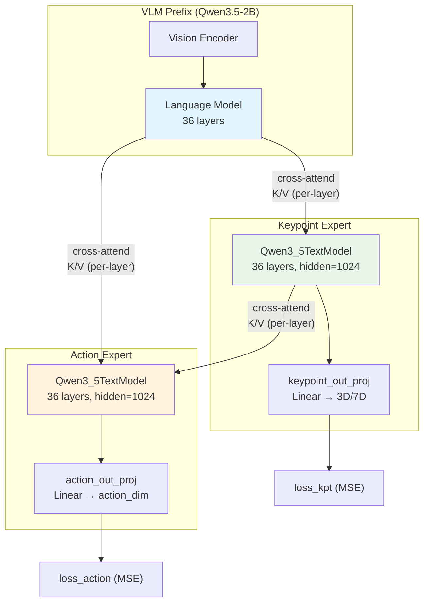
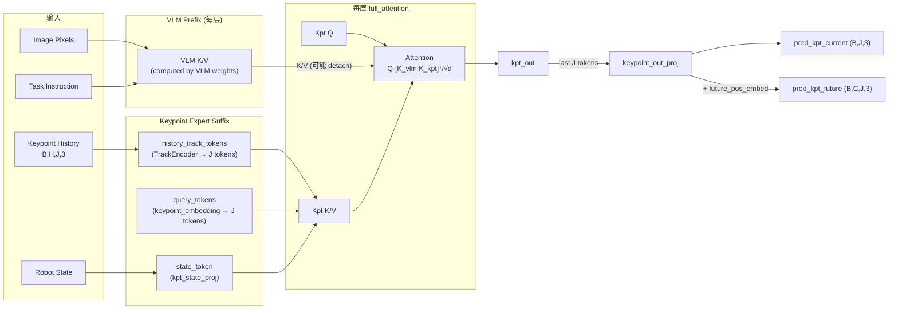
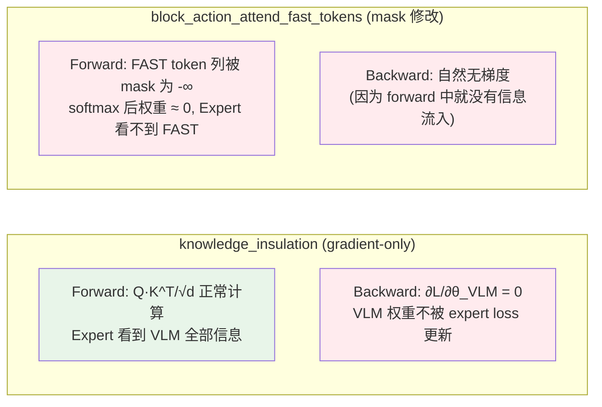

# VLM → Keypoint Expert / Action Expert 模态融合权重设计方案 (v2)

> **文档目标**: 深入分析 InternVLA-A1.5 三路 MoT 架构中 VLM 对 Keypoint Expert 和 Action Expert 的影响机制, 结合文献中的模态融合门控技术, 设计可学习/可配置的模态融合权重方案.
>
> **与 [modal_fusion_weight1.markdown](modal_fusion_weight1.markdown) 的关系**: v1 关注 VLM→Action Expert 和 VLM→4D/WAN Video Expert 两条路径. 本文档 (v2) **聚焦三路 MoT** (VLM → Keypoint Expert → Action Expert) 中各模态间的影响控制, 增加了文献调研、更精细的 per-layer/per-head 设计、以及针对 keypoint-action 信息流的专用方案.
>
> **代码基线**: `src/lerobot/policies/internvla_a1_5/modeling_internvla_a1_5.py` (下称 modeling.py), `configuration_internvla_a1_5.py` (下称 config.py), `modeling_internvla_a1_5_optimized.py` (下称 optimized.py).

---

## 目录

1. [三路 MoT 中 VLM 的影响路径深度分析](#1)
2. [文献调研: 模态融合门控技术](#2)
3. [设计目标与约束](#3)
4. [方案设计](#4)
   - [方案 A: Flamingo-Style Tanh Gate (零初始化门控)](#4a)
   - [方案 B: Per-Layer V-Scaling with Gradient Scale (V 缩放 + 梯度缩放)](#4b)
   - [方案 C: CFG-Inspired Dual-Forward Interpolation (类 CFG 双路插值)](#4c)
   - [方案 D: Per-Head Routed Gate (路由式注意力头门控)](#4d)
   - [方案 E: Modal Dropout (模态随机掩蔽)](#4e)
5. [方案对比与推荐](#5)
6. [推荐方案的完整实施规格](#6)
7. [测试方案与验收条件](#7)
8. [参考文献](#8)

---

<a id="1"></a>
## 1. 三路 MoT 中 VLM 的影响路径深度分析

### 1.1 三路 MoT 总体架构

InternVLA-A1.5 在启用 keypoint predictor (`enable_keypoint_predictor=True`) 时, 采用三路 Mixture of Transformers (MoT) 架构. 三路是指三个独立的 Transformer (共享层数但各自有独立权重) 在每一个 full_attention 层中通过**联合注意力** (joint attention) 进行信息交换:



### 1.2 三路注意力规则 (Block-Causal)

三路 MoT 使用严格的 **block-causal** 注意力规则 (modeling.py `compute_layer_complete_3path` L359-377):

| Path | Q 来源 | 可 attend 的 K/V | 注意力语义 |
|---|---|---|---|
| **VLM prefix** | VLM 自身 | 仅 VLM prefix | 自注意力 (不受任何 expert 影响) |
| **Keypoint Expert** | Kpt expert | VLM prefix + Kpt expert 自身 | 从 VLM 获取视觉-语言理解 |
| **Action Expert** | Action expert | VLM prefix + Kpt expert + Action expert 自身 | 从 VLM 和 Kpt 获取多模态信息 |

**关键代码** (`compute_layer_complete_3path`, L494-514):

```python
# prefix: self-attention only
prefix_att_output = _run_attn(prefix_query, prefix_key, prefix_value, prefix_attn_mask)

# keypoint expert: attends to [prefix (maybe detached), keypoint]
prefix_key_for_kpt = prefix_key.detach() if knowledge_insulation_kpt else prefix_key
prefix_value_for_kpt = prefix_value.detach() if knowledge_insulation_kpt else prefix_value
k_for_kpt = torch.cat([prefix_key_for_kpt, kpt_key], dim=2)
v_for_kpt = torch.cat([prefix_value_for_kpt, kpt_value], dim=2)
kpt_att_output = _run_attn(kpt_query, k_for_kpt, v_for_kpt, kpt_attn_mask)

# action expert: attends to [prefix (maybe detached), keypoint (maybe detached), action]
prefix_key_for_action = prefix_key.detach() if knowledge_insulation else prefix_key
prefix_value_for_action = prefix_value.detach() if knowledge_insulation else prefix_value
kpt_key_for_action = kpt_key.detach() if kpt_to_action_detach else kpt_key
kpt_value_for_action = kpt_value.detach() if kpt_to_action_detach else kpt_value
k_for_action = torch.cat([prefix_key_for_action, kpt_key_for_action, action_key], dim=2)
v_for_action = torch.cat([prefix_value_for_action, kpt_value_for_action, action_value], dim=2)
action_att_output = _run_attn(action_query, k_for_action, v_for_action, action_attn_mask)
```

### 1.3 VLM → Keypoint Expert 的影响路径

#### 1.3.1 全链路数据流



#### 1.3.2 Keypoint Expert Suffix 的构成

`embed_kpt_suffix` (modeling.py L1572-1627) 构建的 suffix 结构:

$$\text{kpt\_suffix} = [\underbrace{\text{state}(1)}_{\text{kpt\_state\_proj}}, \underbrace{\text{history\_track}(J)}_{\text{TrackEncoder}}, \underbrace{\text{query}(J)}_{\text{keypoint\_embedding}}]$$

- **state_token** (1 token): 与 action expert 使用相同的 robot state, 但通过独立的 `kpt_state_proj: Linear(max_state_dim, kpt_hidden)` 投影
- **history_track_tokens** (J tokens): `his_kpts [B, H, J, 3]` → `TrackEncoder` → `[B, J, kpt_hidden]`. TrackEncoder 对每个关节的历史轨迹做 patch embedding + self-attention + cross-attention query
- **query_tokens** (J tokens): `keypoint_embedding: nn.Embedding(J, kpt_hidden)` 的权重, 作为可学习的 query. 其输出经 `keypoint_out_proj` 投影为 3D/7D 坐标预测

**注意力 mask 模式**:
```python
att_masks = [1]                      # state: 新 block 起点
att_masks += [1] + [0] * (J - 1)     # history tracks: 一个 block
att_masks += [1] + [0] * (J - 1)     # queries: 一个 block
```
这意味着 `make_att_2d_masks` (L105-115, 使用 cumsum block-causal 逻辑) 产生的 mask 为: state 只看自己, history tracks 作为一个整体看 state + 自身, queries 看 state + tracks + 自身. 加上 VLM prefix 的全部可见 (因为三路 MoT 在 `compute_layer_complete_3path` 中的 mask slicing: kpt 的 mask 列范围是 `[:kpt_end]`, 包含了整个 prefix), 最终 keypoint expert 中:
- **每一个 history track token 和 query token 都能 attend 到全部 VLM prefix tokens**
- 这使得 VLM 的视觉理解 (物体位置、场景布局) 和语言理解 (任务指令) 能影响 keypoint 预测

**注意**: 在 3-path 训练 forward (L1823-1829) 中, `block_action_attend_fast_tokens` 的实现 `_block_suffix_attend_prefix_tokens` 会在 `att_2d_masks` 中 prefix_len 之后的**所有行**上 mask 掉 FAST token 列, 这包括 kpt expert 的行和 action expert 的行. 也就是说, **kpt expert 也被阻止 attend 到 FAST action tokens**, 这在语义上是合理的 (FAST tokens 是离散化的 action 信息, kpt expert 不应依赖它们).

#### 1.3.3 影响的量化估计

假设 VLM prefix 长度 $L_p \approx 200$ (image tokens ~196 + text tokens ~50, 减去 padding), keypoint suffix 长度 $L_k = 1 + 2J$ (J=8 时为 17), 则在每一层 full_attention 中:

- Keypoint Expert 的注意力分布: softmax 在 $L_p + L_k = 217$ 个 key 上
- VLM prefix keys 占比 $\approx 200 / 217 \approx 92\%$
- **VLM 对 keypoint expert 的注意力权重极大**, keypoint expert 几乎完全依赖 VLM 信息来做预测

### 1.4 VLM → Action Expert 的影响路径 (三路 MoT)

在三路模式下, Action Expert 的 K/V 来源为 `[VLM prefix, Keypoint Expert, Action Expert self]`:

$$\text{Attn}_{act}^{(l)} = \text{softmax}\left(\frac{Q_{act}^{(l)} \cdot [K_{vlm}^{(l)}; K_{kpt}^{(l)}; K_{act}^{(l)}]^\top}{\sqrt{d}}\right) \cdot [V_{vlm}^{(l)}; V_{kpt}^{(l)}; V_{act}^{(l)}]$$

这意味着 Action Expert 受到**双重影响**:
1. **直接影响**: VLM prefix 的 K/V 直接参与 action expert 的注意力
2. **间接影响 (经由 Keypoint Expert)**: Keypoint Expert 的输出已经融合了 VLM 信息, 当 action expert attend 到 kpt K/V 时, 间接获取了 VLM 信息

**信息流层级**:

```
VLM → [直接 K/V] → Action Expert  (第一通道)
VLM → Kpt Expert → [K/V] → Action Expert  (第二通道, 经过 kpt expert "加工")
```

Action Expert suffix 长度 $L_a = 1 + N + C$ (state + learnable_tokens(50) + action_time(50) = 101), 注意力分布在 $L_p + L_k + L_a \approx 318$ 个 key 上. VLM prefix 占 $\approx 63\%$, Kpt Expert 占 $\approx 5\%$, 自身占 $\approx 32\%$.

### 1.5 现有控制机制的不足

| 机制 | 控制的边 | 控制方式 | 不足 |
|---|---|---|---|
| `knowledge_insulation` | VLM→Action | 二值 detach (仅梯度) | 不控制 forward; 全有全无 |
| `knowledge_insulation_kpt` | VLM→Kpt | 二值 detach (仅梯度) | 同上 |
| `kpt_to_action_detach` | Kpt→Action | 二值 detach (仅梯度) | 同上 |
| `ki_gradient_scale` / `ki_kpt_gradient_scale` | VLM→Action / VLM→Kpt | config 中已定义 (L477-478), **forward 中未实现** | 完全未实现 |
| `block_action_attend_fast_tokens` | VLM FAST→Action | 二值 mask | 粒度太粗 |
| Loss 权重 (`action_loss_weight`, `kpt_loss_weight`, ...) | 间接影响梯度分配 | 标量 | 不控制信息流方向 |

**补充发现**:
- `ki_gradient_scale` 和 `ki_kpt_gradient_scale` 在 modeling.py 中**完全没有被引用** — 它们只在 config.py 中声明, 在 tests 中被断言默认值, forward/backward 中从未使用. 是未实现的占位符.
- `block_action_attend_fast_tokens` 在 3-path 模式下会同时影响 kpt expert 和 action expert (因为 `_block_suffix_attend_prefix_tokens` 操作的是 prefix_len 之后的**所有**行, 包含 kpt 和 action).
- `denoise_step_full` **不支持** keypoint expert (L1680 硬编码为 2-path `inputs_embeds=[None, suffix_embs]`). `predict_action_chunk_with_video` 因此无法与 keypoint predictor 同时使用.

**核心缺口**: **没有任何机制能在 forward 方向连续调节 VLM 信息流入 expert 的强度**, 所有现有机制要么是二值的, 要么只影响梯度.

### 1.5b `knowledge_insulation` 的精确机制: `.detach()` 而非 attention mask

> **重要澄清**: `knowledge_insulation` / `knowledge_insulation_kpt` **不是通过修改 attention mask 来阻止 expert attend 到 prefix 的**. 它们的作用机制是在 K/V tensor 上调用 `.detach()`, 这只影响 backward 梯度流, **forward 信息流完全不受影响**. Expert 在 forward 方向上始终能看到 VLM prefix 的全部信息.

#### 1.5b.1 调用链全景

完整的调用链如下 (以 3-path 训练模式为例):

```
InternVLAA15Policy.forward()           # 入口 (L2405)
  └→ InternVLAA15.forward()            # 训练 forward (L1756)
       ├─ embed_prefix() → prefix_embs, pad_masks, att_masks   (L1795)
       ├─ embed_suffix() → suffix_embs                          (L1798)
       ├─ embed_kpt_suffix() → kpt_embs                        (L1802)
       ├─ make_att_2d_masks(pad_masks, att_masks) → att_2d_masks (L1821)
       ├─ _block_suffix_attend_prefix_tokens()                   (L1823-1829, 仅 FAST token 列)
       ├─ _prepare_attention_masks_4d(att_2d_masks) → att_2d_masks_4d  (L1875)
       └─ qwen3_5_with_expert.forward(                          (L1880)
              inputs_embeds=[prefix_embs, kpt_embs, suffix_embs],
              attention_mask=att_2d_masks_4d,          # ← 传递的是 4D attention mask
              knowledge_insulation=config.knowledge_insulation,   # ← KI flags
              knowledge_insulation_kpt=config.knowledge_insulation_kpt,
              kpt_to_action_detach=config.kpt_to_action_detach,
          )
          └→ InternVLAA15WithExpertModel._forward_3path()  (L829)
               └─ for layer_idx in range(36):
                      compute_layer_complete_3path(       (L931)
                          attention_mask=att_2d_masks_4d,  # ← 同一个 mask, 一路传到底
                          knowledge_insulation=...,        # ← 作为独立的 bool 参数
                          knowledge_insulation_kpt=...,
                          kpt_to_action_detach=...,
                      )
```

关键观察: **`knowledge_insulation` flags 和 `attention_mask` 是完全独立的两条传递路径**. KI flags 作为 `bool` 参数逐层传递, 而 attention mask 是一个预先计算好的 4D tensor, 在整个 forward 过程中**不会被 KI flags 修改**.

#### 1.5b.2 Attention Mask 的构建过程 (与 KI 无关)

Attention mask 在 `InternVLAA15.forward()` 中 **KI 参与之前** 就已经构建完成:

**Step 1**: `embed_prefix` ([modeling.py L1200-1226](src/lerobot/policies/internvla_a1_5/modeling_internvla_a1_5.py#L1200)) 构建 prefix 的 `att_masks`:

```python
# L1224: prefix 的每个 valid position 都 att_mask=1, 产生标准 causal mask
att_masks = pad_masks.clone()
```

**Step 2**: `embed_suffix` 和 `embed_kpt_suffix` 各自构建 suffix 的 `att_masks` (使用 block-causal 编码: `[1,0,0,...,1,0,0,...]` 表示 block 边界).

**Step 3**: 三段 `att_masks` 拼接后, 通过 `make_att_2d_masks` ([modeling.py L105-115](src/lerobot/policies/internvla_a1_5/modeling_internvla_a1_5.py#L105)) 生成 2D block-causal mask:

```python
def make_att_2d_masks(pad_masks, att_masks):
    cumsum = torch.cumsum(att_masks, dim=1)          # [B, total_len]
    att_2d_masks = cumsum[:, None, :] <= cumsum[:, :, None]  # [B, total_len, total_len]
    pad_2d_masks = pad_masks[:, None, :] * pad_masks[:, :, None]
    return att_2d_masks & pad_2d_masks
```

`cumsum[:, None, :] <= cumsum[:, :, None]` 的效果: 如果 token $j$ 的 cumsum $\leq$ token $i$ 的 cumsum, 则 $i$ 可以 attend 到 $j$. 对 prefix (全 1 的 att_masks), 这恰好产生**标准 lower-triangular causal mask**. 对 suffix 中的 block-causal 编码, 同一 block 内的 token 共享相同的 cumsum, 因此 block 内可以互相 attend.

**关键**: 这个 2D mask 的构建**只依赖 `att_masks` (attention pattern 编码) 和 `pad_masks` (padding 标记)**, 完全不涉及 `knowledge_insulation`.

**Step 4**: 可选的 FAST token 阻断 — `_block_suffix_attend_prefix_tokens` ([modeling.py L1243-1256](src/lerobot/policies/internvla_a1_5/modeling_internvla_a1_5.py#L1243)):

```python
def _block_suffix_attend_prefix_tokens(self, att_2d_masks, prefix_len, blocked_prefix_mask):
    # 在 suffix 行 (prefix_len:), prefix 列 (:prefix_len) 范围内
    # 将 blocked_prefix_mask 指示的列置为 False
    att_2d_masks[:, prefix_len:, :prefix_len] &= ~blocked_prefix_mask[:, None, :]
    return att_2d_masks
```

这是**唯一修改 attention mask 的地方**, 而它只阻断 FAST action tokens (离散化 action 的 token), **不涉及 KI**. 注意 `prefix_len:` 包含 kpt expert 和 action expert 的全部行, 所以 kpt expert 和 action expert 都被阻止 attend 到 FAST tokens.

**Step 5**: 转换为 4D mask ([modeling.py L1162-1164](src/lerobot/policies/internvla_a1_5/modeling_internvla_a1_5.py#L1162)):

```python
def _prepare_attention_masks_4d(self, att_2d_masks):
    att_2d_masks_4d = att_2d_masks[:, None, :, :]  # [B, 1, total_len, total_len]
    return torch.where(att_2d_masks_4d, 0.0, OPENPI_ATTENTION_MASK_VALUE)  # True→0, False→-inf
```

这个 4D mask 被传入 `qwen3_5_with_expert.forward()`, 然后传入每层的 `compute_layer_complete_3path()`. **在整个传递过程中, mask 不再被修改**.

#### 1.5b.3 KI 的实际作用点: `compute_layer_complete_3path` 中的 `.detach()`

KI 的作用发生在 `compute_layer_complete_3path` 的 **full_attention 分支** 内 ([modeling.py L498-514](src/lerobot/policies/internvla_a1_5/modeling_internvla_a1_5.py#L498)), 且**只作用于 K/V tensor, 不作用于 attention mask**:

```python
# L498-504: Keypoint expert 的 K/V 构建
prefix_key_for_kpt = prefix_key.detach() if knowledge_insulation_kpt else prefix_key
prefix_value_for_kpt = prefix_value.detach() if knowledge_insulation_kpt else prefix_value
k_for_kpt = torch.cat([prefix_key_for_kpt, kpt_key], dim=2)  # 拼接: [VLM_K; Kpt_K]
v_for_kpt = torch.cat([prefix_value_for_kpt, kpt_value], dim=2)

# L506-514: Action expert 的 K/V 构建
prefix_key_for_action = prefix_key.detach() if knowledge_insulation else prefix_key
prefix_value_for_action = prefix_value.detach() if knowledge_insulation else prefix_value
kpt_key_for_action = kpt_key.detach() if kpt_to_action_detach else kpt_key
kpt_value_for_action = kpt_value.detach() if kpt_to_action_detach else kpt_value
k_for_action = torch.cat([prefix_key_for_action, kpt_key_for_action, action_key], dim=2)
v_for_action = torch.cat([prefix_value_for_action, kpt_value_for_action, action_value], dim=2)
```

`.detach()` 的语义:
- **Forward**: 返回一个与原 tensor **值完全相同**的新 tensor, 但从计算图中脱离. Expert 看到的 K/V 数值**完全不变**, 注意力计算结果**完全相同**.
- **Backward**: detached tensor 不参与梯度计算. 从 expert loss 回传的梯度到达 `.detach()` 处即停止, **不会继续传播到 VLM 的参数**.

这可以用一个简单的等式表达:

$$\text{output}_{\text{KI=True}} = \text{output}_{\text{KI=False}}$$

$$\frac{\partial \mathcal{L}_{\text{expert}}}{\partial \theta_{\text{VLM}}}\bigg|_{\text{KI=True}} = \mathbf{0}, \quad \frac{\partial \mathcal{L}_{\text{expert}}}{\partial \theta_{\text{VLM}}}\bigg|_{\text{KI=False}} \neq \mathbf{0}$$

即: **KI 不改变模型的 forward 行为 (推理输出完全一致), 只改变 backward 行为 (阻断梯度流)**. 这在 2-path 的 `compute_layer_complete` 中同理 ([modeling.py L274-279](src/lerobot/policies/internvla_a1_5/modeling_internvla_a1_5.py#L274)):

```python
if knowledge_insulation:
    prefix_key_for_suffix = prefix_key.detach()      # forward 值不变, backward 梯度截断
    prefix_value_for_suffix = prefix_value.detach()
else:
    prefix_key_for_suffix = prefix_key
    prefix_value_for_suffix = prefix_value
```

#### 1.5b.4 对比: KI (.detach) vs FAST-token blocking (mask 修改)



| 维度 | `knowledge_insulation` | `block_action_attend_fast_tokens` |
|---|---|---|
| **作用对象** | K/V tensor (`.detach()`) | attention mask tensor (列置 False) |
| **Forward 影响** | **无** — expert 仍然看到 VLM 全部信息 | **有** — expert 看不到被 block 的 token |
| **Backward 影响** | **有** — 梯度不流向 VLM | 间接有 (forward 无信息流 → 无梯度) |
| **修改时机** | 每层 attention 计算时 (L498-514) | Forward 前, 一次性修改 mask (L1823-1829) |
| **mask 是否被修改** | 否 | 是 |
| **代码位置** | `compute_layer_complete_3path` L499-510 | `_block_suffix_attend_prefix_tokens` L1255 |

#### 1.5b.5 推论与设计启示

1. **即使开启 KI, expert 在推理时仍然依赖 VLM 信息**: KI 只是训练时阻止 expert loss 影响 VLM 权重, 推理时 expert 仍然完整地 attend 到 VLM prefix. 因此 KI 不能用于 "隔离 expert 使其独立工作" — 它只是保护 VLM 预训练权重不被 expert 的 loss 破坏.

2. **KI 是一种非对称梯度流控制**: VLM 的 loss (VQA loss) 仍然正常更新 VLM 权重, VLM 权重的变化会通过 forward 影响 expert 的输出. KI 只阻断了 "expert loss → VLM 权重" 这条梯度通路, 没有阻断 "VLM loss → VLM 权重 → forward → expert output" 这条通路.

3. **Forward 方向的控制缺口**: 现有代码库中, **没有任何机制能在 forward 方向削弱 VLM 对 expert 的影响**. `block_action_attend_fast_tokens` 只阻断了 FAST tokens (prefix 中极少数的 action tokens), VLM 的 image tokens 和 task instruction tokens 始终可被 expert attend. 这正是本文档各方案要解决的问题.

4. **KI + Forward Gate 的互补性**: KI 控制梯度方向 (谁的 loss 影响谁的权重), Forward Gate 控制信息方向 (谁能看到谁的表示). 两者正交, 可以组合使用. 方案 B 的统一框架正是将这两个维度显式暴露为独立的配置旋钮.

### 1.6 Linear Attention 层的隔离特性

Qwen3.5-2B 的 36 层中, `full_attention` 和 `linear_attention` (GatedDeltaNet 递归层) 交替出现. 在 `linear_attention` 层中 (modeling.py L382-415):

- **三路完全独立**, 没有跨 expert 的信息交换
- 每个 expert 用自己的 GatedDeltaNet 层独立更新 hidden states
- 这些层天然实现了 "信息隔离", 提供了一种观察: **不是所有层都需要 VLM 信息**, 选择性门控的 per-layer 设计有自然的架构支撑

---

<a id="2"></a>
## 2. 文献调研: 模态融合门控技术

### 2.1 Flamingo 的 Gated Cross-Attention (零初始化门控)

**出处**: Alayrac et al., "Flamingo: a Visual Language Model for Few-Shot Learning", NeurIPS 2022 (arXiv: 2204.14198)

**机制**: Flamingo 在冻结的 LLM 层之间插入 gated cross-attention 层, 让 LLM attend 到视觉特征. 关键创新是使用 **tanh gate, 初始化为零**:

$$\text{output} = \text{FFW}(x) + \tanh(\alpha) \cdot \text{XAttn}(x, \text{visual\_features})$$

其中 $\alpha$ 是可学习标量, 初始化为 0. 这意味着:
- **训练开始时** $\tanh(0) = 0$, 视觉信息完全不流入 LLM, 保护预训练权重
- **训练过程中** $\alpha$ 逐渐增大, 模型学习如何利用视觉信息
- 每层有独立的 $\alpha$, per-layer 控制

**与本方案的相关性**: 高度相关. 可以在 MoT 的 cross-modal attention 输出上加类似的 tanh gate, 控制 VLM 信息融入 expert 的强度. 零初始化特别适合 fine-tuning 场景, 让 expert 从 "不依赖 VLM" 逐步学习利用 VLM.

### 2.2 π₀ (Physical Intelligence) 的 Action Expert 设计

**出处**: Black et al., "π₀: A Vision-Language-Action Flow Model for General Robot Control", 2024 ([arXiv:2410.24164](https://arxiv.org/abs/2410.24164))

**机制**: π₀ 使用 PaliGemma 2B VLM 作为 backbone, 附加 300M action expert (从零初始化). 采用 MoE 风格的路由, 但路由是**硬编码** (按 token 类型确定性分配) 而非 learned router:
- Block 1 (images+language): 只 self-attend
- Block 2 (proprioceptive state): attend to Block 1-2
- Block 3 (noisy actions): attend to all blocks
- VLM 和 action expert 共享注意力层但有**独立的 FFN/MLP 权重**

**关键**: π₀ **没有任何 gate** 来调节跨模态注意力强度. 路由完全确定性. 这表明在 VLA 社区, forward 方向的门控是一个**未被充分探索**的方向, 是我们的设计可以创新的地方.

### 2.2b Octo 的模块化设计

**出处**: Team et al., "Octo: An Open-Source Generalist Robot Policy", 2024 ([arXiv:2405.12213](https://arxiv.org/abs/2405.12213))

**机制**: Octo 将多模态输入 (images, language via T5-base, proprioception) 分别 tokenize 后拼接进标准 transformer. 使用 learned **readout tokens** 作为聚合点, 再由 diffusion action head 解码. 没有显式门控, 所有模态通过标准 self-attention 交互.

**与本方案的相关性**: Readout token 可以作为 bottleneck, 在其上施加 gate 控制 VLM 信息流入量. InternVLA-A1.5 的 learnable tokens 已经部分实现了这个思路 (作为 VLM→WAN 的瓶颈).

### 2.3 ControlNet 的 Conditioning Scale & DiT adaLN-Zero

**ControlNet 出处**: Zhang et al., "Adding Conditional Control to Text-to-Image Diffusion Models", ICCV 2023 ([arXiv:2302.05543](https://arxiv.org/abs/2302.05543))

**机制**: ControlNet 使用 **zero convolutions** (1×1 conv, 权重和 bias 初始化为 0) 在注入点, 加上一个 **conditioning_scale** (标量, 默认 1.0) 来缩放控制信号:

$$\text{output}_l = \text{original\_block}_l(x) + \text{conditioning\_scale} \cdot \mathcal{F}_{zero}(\text{control\_block}_l(x))$$

ControlNet 的 conditioning_scale 在推理时可调 (0.0-2.0), 用户可实时控制控制信号强度.

**DiT adaLN-Zero 出处**: Peebles & Xie, "Scalable Diffusion Models with Transformers", ICCV 2023

**机制**: DiT 不用 cross-attention, 而是用 adaptive LayerNorm, 其中条件信号预测 scale/shift/gate 参数 ($\alpha, \gamma, \beta$). Gate $\alpha$ **初始化为零**, 使每个 block 在训练开始时为恒等函数:

$$\text{output} = x + \alpha \cdot \text{Block}(\text{adaLN}(x, \gamma, \beta))$$

这个 "zero-init gate → identity at init → learn to incorporate" 的模式与 Flamingo 异曲同工, 且在图像生成中优于 cross-attention conditioning.

**与本方案的相关性**: 零初始化 gate 的两种变体 (Flamingo 的 tanh gate 和 DiT 的 adaLN-zero) 都被证明有效. 我们的方案 A 正是受此启发.

### 2.4 Classifier-Free Guidance (CFG) 的双路推理

**出处**: Ho & Salimans, "Classifier-Free Diffusion Guidance", NeurIPS Workshop 2021

**机制**: CFG 在推理时同时运行条件和无条件两路 forward, 对输出做线性插值:

$$\hat{\epsilon} = \epsilon_\theta(x_t, \emptyset) + w \cdot [\epsilon_\theta(x_t, c) - \epsilon_\theta(x_t, \emptyset)]$$

当 $w = 0$ 时等价于无条件生成, $w = 1$ 时为标准条件生成, $w > 1$ 为 "增强引导".

**与本方案的相关性**: 可以类比为 "有 VLM 信息" vs "无 VLM 信息" 的双路推理, 通过插值系数控制 VLM 的影响. 但计算量翻倍, 适合作为推理时的可选增强手段, 不适合训练.

### 2.5 DINO / BYOL 的 Stop-Gradient 与 Soft Gradient

**出处**: Caron et al., "Emerging Properties in Self-Supervised Vision Transformers", ICCV 2021; Grill et al., "Bootstrap Your Own Latent", NeurIPS 2020

**机制**:
- **BYOL**: Target encoder 通过 EMA 更新, stop-gradient 在 target 分支, 防止表征坍缩. EMA 率控制 target 的 "陈旧程度"
- **SimSiam**: 相同架构但无 EMA — 仅 stop-gradient 即可防止坍缩, 证明**非对称梯度流** (而非动量) 是关键
- **DINO**: stop-gradient + centering + sharpening on teacher

**与本方案的相关性**: 直接对应现有 `ki_gradient_scale` 字段的设计意图. 在 VLM→expert 路径上使用 soft gradient scaling (梯度乘以 $0 < \lambda < 1$ 而非 hard stop-gradient) 可以让 expert 从 VLM 学习特征但不干扰 VLM 的预训练稳定性.

### 2.5b GradAttn (注意力控制梯度路径)

**出处**: GradAttn, 2025 ([arXiv:2603.26756](https://arxiv.org/abs/2603.26756))

**机制**: 用 self-attention 动态加权不同网络深度的特征, 替代固定的残差连接, 创建可学习的梯度流路径. 在 ResNet-18 上实现 +11% 准确率提升, 80% 过拟合降低.

**与本方案的相关性**: Per-layer 注意力加权的梯度缩放, 可以自适应地控制每层 VLM 表示对 expert 梯度更新的影响. 不过实现复杂度较高, 不建议在第一版中采用.

### 2.6 MoE Router Gate 与 MoT 论文

**MoE 出处**: Shazeer et al., "Outrageously Large Neural Networks: The Sparsely-Gated Mixture-of-Experts Layer", ICLR 2017

**MoT 出处**: Liang et al., "Mixture of Transformers", 2024 ([arXiv:2411.04996](https://arxiv.org/abs/2411.04996))

**MoT 论文的关键发现** (与本代码库直接相关):
- MoT 解耦**所有**非 embedding 参数按模态: 独立的 $W_Q^m, W_K^m, W_V^m$, output projection, FFN, LayerNorm per modality. Global self-attention 是共享的 — 各模态的 Q/K/V 重新组装回原始序列顺序后做标准 softmax attention
- **无 learned routing**: 使用确定性的模态标签路由, 优于 learned MoE routing (因为避免了 router-expert 协同训练不稳定性)
- **消融排序**: FFN 解耦贡献最大, Q/K/V 解耦有意义, LayerNorm 解耦可忽略

**与本方案的相关性**: InternVLA-A1.5 已经实现了 MoT 模式. MoT 论文中**没有** per-layer cross-modal gate, 这是我们可以创新的方向. 但需要注意 MoT 论文发现确定性路由优于 learned routing, 暗示简单的固定/per-layer gate 可能优于 input-dependent router gate (方案 D).

### 2.7 Multi-Modal Transformer 中的 Modal Dropout

**出处**: Neverova et al., "Multimodal Fusion with Missing Information", NeurIPS Workshop 2018; Dai et al., "A Study of Dropout-Induced Modality Bias on Robustness to Missing Video Frames", CVPR 2024

**机制**: 训练时以一定概率随机丢弃 (zero-out) 某个模态的输入, 迫使模型学习在缺少某模态时仍能产生合理输出:

$$\tilde{x}_m = \begin{cases} x_m & \text{with prob } 1 - p_m \\ \mathbf{0} & \text{with prob } p_m \end{cases}$$

**进阶变体** (CVPR 2024, MICCAI 2025):
- (a) 用 learnable modality tokens 替换被 zero-out 的模态 (而非简单置零)
- (b) Masked Modality Projection (MMP): 存活模态投影到缺失模态的特征空间
- (c) 从完整模态的 teacher 做知识蒸馏, 防止 "modality laziness"

**与本方案的相关性**: Modal Dropout 是正则化技术, 与融合门控互补. 在训练中随机 zero-out VLM 的 K/V 对 expert 的影响, 可以增强 expert 的独立性和鲁棒性, 特别是在域迁移场景下. 更重要的是, 它是方案 C (CFG 推理) 的**必要前提** — 如果训练时从未见过 "无 VLM 信息" 的情况, CFG 的无条件路输出会很差.

### 2.8 总结: 文献方法对本问题的启示

| 文献方法 | 控制维度 | 控制方式 | 最适用场景 | 参考系统 |
|---|---|---|---|---|
| Flamingo tanh gate | Forward 信息流 | 可学习, 零初始化 | Fine-tuning (保护预训练) | Flamingo |
| DiT adaLN-Zero | Forward 信息流 | 可学习, 零初始化 | 条件生成 | DiT |
| ControlNet scale | Forward 信息流 | 固定超参 (推理可调) | 推理时的强度控制 | ControlNet |
| CFG 双路插值 | Forward (推理) | 双路插值 | 推理增强 | Diffusion 系列 |
| Soft Gradient | 梯度流 | 可学习/固定标量 | 训练稳定性 | BYOL/DINO |
| MoT 确定性路由 | 架构 | 硬编码 | 多模态 | MoT 论文 |
| MoE Router | Forward (input-dependent) | 可学习网络 | 条件依赖的动态门控 | MoE |
| Modal Dropout | Forward (随机) | 随机掩蔽 | 鲁棒性正则化 | CVPR 2024 |

**关键洞察**: Flamingo/DiT/ControlNet 三个系统都独立验证了 "zero-init gate" 范式的有效性. MoT 论文发现确定性路由优于 learned routing, 暗示简单 gate 可能优于复杂 router. 这些证据共同支持了我们的推荐: **per-layer V-scaling gate + gradient scale (方案 B)**, 简单且有充分的文献支撑.

---

<a id="3"></a>
## 3. 设计目标与约束

### 3.1 设计目标

1. **三路独立控制**: VLM→Kpt, VLM→Action, Kpt→Action 三条信息通道各自独立可调
2. **Forward + Backward 双向控制**: 既控制前向信息流强度, 也控制梯度回传比例
3. **粒度可选**: 从全局标量 (最简) 到 per-layer (中等) 到 per-head (最精细) 的不同粒度
4. **训练时可学习 + 推理时可调**: 权重可以是固定超参数, 也可以是可学习参数, 推理时可以 override
5. **向后兼容**: 默认配置下行为与当前代码完全一致
6. **与现有 KI 机制平滑统一**: 将现有的二值 KI 和未实现的 soft KI 纳入统一框架

### 3.2 约束

1. **推理性能**: 不引入超过 1-2% 的推理延迟增加
2. **显存**: 不增加超过 1% 的训练峰值显存
3. **代码改动量**: 核心修改集中在 `compute_layer_complete_3path` 和 config, 避免散弹式修改
4. **与 optimized backend 的兼容**: 至少提供退化路径 (不支持时 fallback 到默认行为)
5. **与 gradient checkpointing 兼容**: 新增参数必须能通过 `torch.utils.checkpoint`
6. **与 per-module LR 兼容**: 新增参数需要被正确分组到 `get_optim_params` 的参数组中

---

<a id="4"></a>
## 4. 方案设计

<a id="4a"></a>
### 4.1 方案 A: Flamingo-Style Tanh Gate (零初始化门控)

#### 4.1.1 核心思想

受 Flamingo 启发, 在三路 MoT 的每条跨模态注意力输出上加一个 **tanh 门控**, 零初始化:

对 keypoint expert:

$$\text{kpt\_attn}^{(l)} = \underbrace{\text{self\_component}^{(l)}}_{\text{kpt attend to kpt}} + \tanh(\alpha^{(l)}_{vlm \to kpt}) \cdot \underbrace{\text{cross\_component}^{(l)}}_{\text{kpt attend to VLM}}$$

对 action expert:

$$\text{act\_attn}^{(l)} = \underbrace{\text{self\_component}^{(l)}}_{\text{act attend to act}} + \tanh(\alpha^{(l)}_{vlm \to act}) \cdot \underbrace{\text{vlm\_cross}^{(l)}}_{\text{act attend to VLM}} + \tanh(\alpha^{(l)}_{kpt \to act}) \cdot \underbrace{\text{kpt\_cross}^{(l)}}_{\text{act attend to Kpt}}$$

#### 4.1.2 实现要点

**问题**: 当前 MoT 的注意力是**联合计算**的 — action expert 的 Q 同时 attend 到 `[K_vlm; K_kpt; K_act]` 的拼接. 要施加上面的公式, 需要**拆分**联合注意力为独立的 self-attention 和 cross-attention 计算.

> **关于 "三个 K 拼接" 的详细代码解释**
>
> 表面上看, 三路 MoT 的三个 expert 各有独立的 Q/K/V, 似乎不应该被拼接在一起. 但追溯代码会发现, **拼接发生了两次, 发生在不同阶段, 且目的不同**:
>
> **第一次拼接 (L445-447): 为了联合 RoPE**
>
> ```python
> # compute_layer_complete_3path, L445-447
> joint_query = torch.cat(query_states, dim=2)   # [B, H, L_p+L_k+L_a, d]
> joint_key   = torch.cat(key_states,   dim=2)   # [B, H_kv, L_p+L_k+L_a, d]
> joint_value = torch.cat(value_states, dim=2)   # [B, H_kv, L_p+L_k+L_a, d]
> ```
>
> 这里 `query_states` 是一个长度为 3 的列表, 每个元素是 `[B, num_heads, L_i, head_dim]`, 分别来自 VLM、kpt expert、action expert 三个模型的**独立 K projection**:
>
> ```python
> # L422-443: 遍历三个 model, 各自计算 Q/K/V/gate
> for i, hidden_states in enumerate(inputs_embeds):
>     layer = models[i].layers[layer_idx]  # 每个 model 用自己的 layer 权重
>     ...
>     key_state = layer.self_attn.k_norm(
>         layer.self_attn.k_proj(hidden_states).view(hidden_shape)  # 独立的 k_proj 权重
>     ).transpose(1, 2)
>     key_states.append(key_state)
> ```
>
> 拼接后, 对 `joint_query` 和 `joint_key` 施加联合 RoPE (L456-459), 使得三段的 position encoding 在一个统一的位置空间中:
>
> ```python
> cos, sin = qwen3_5.language_model.rotary_emb(dummy_tensor, position_ids)
> joint_query, joint_key = modeling_qwen3_5.apply_rotary_pos_emb(
>     joint_query, joint_key, cos, sin, unsqueeze_dim=1
> )
> ```
>
> **然后立即按位置范围拆回三段** (L461-477):
>
> ```python
> kpt_end = prefix_len + kpt_len
> prefix_key, kpt_key, action_key = (
>     joint_key[:, :, :prefix_len],          # VLM 的 K (已含 RoPE)
>     joint_key[:, :, prefix_len:kpt_end],   # Kpt expert 的 K (已含 RoPE)
>     joint_key[:, :, kpt_end:],             # Action expert 的 K (已含 RoPE)
> )
> ```
>
> 此时三段 K 是分开的独立 tensor.
>
> **第二次拼接 (L501, L511): 为了构建每个 expert 的注意力 K/V**
>
> 拆回之后, 按照 block-causal 规则**有选择地重新拼接**. 注意不是全部拼回去, 而是按每个 expert 的可见范围拼:
>
> ```python
> # L501: kpt expert 的 K = [VLM_K, Kpt_K]  (2段拼接)
> k_for_kpt = torch.cat([prefix_key_for_kpt, kpt_key], dim=2)
>
> # L511: action expert 的 K = [VLM_K, Kpt_K, Action_K]  (3段拼接)
> k_for_action = torch.cat([prefix_key_for_action, kpt_key_for_action, action_key], dim=2)
> ```
>
> **所以 "三个 K 拼接" 确实发生了** — 在 L511, `k_for_action` 是三段 K 的 `torch.cat`, 然后 action expert 的 Q 对这个拼接后的 K 做统一的 softmax attention:
>
> ```python
> # L514: action_query [B,H,L_a,d] × k_for_action [B,H_kv,L_p+L_k+L_a,d]
> action_att_output = _run_attn(action_query, k_for_action, v_for_action, action_attn_mask)
> ```
>
> 但有一个关键细节: 这三段 K **来自三个不同模型的独立权重**. `prefix_key` 是 VLM 的 `k_proj` 算的, `kpt_key` 是 kpt expert 的 `k_proj` 算的, `action_key` 是 action expert 的 `k_proj` 算的. 它们只是恰好共享相同的 `head_dim` (由 VLM config 继承), 所以能在 `dim=2` (序列长度维度) 上拼接. 这不同于标准 self-attention 中所有 K 由同一组权重计算.
>
> **完整数据流图**:
>
> ```mermaid
> flowchart TB
>     subgraph "Step 1: 独立计算 Q/K/V (L422-443)"
>         VLM_H["VLM hidden [B,L_p,D]"] -->|"VLM.k_proj"| VLM_K["prefix_key [B,H,L_p,d]"]
>         KPT_H["Kpt hidden [B,L_k,D]"] -->|"Kpt.k_proj"| KPT_K["kpt_key [B,H,L_k,d]"]
>         ACT_H["Act hidden [B,L_a,D]"] -->|"Act.k_proj"| ACT_K["action_key [B,H,L_a,d]"]
>     end
>     subgraph "Step 2: 联合 RoPE (L445-459)"
>         VLM_K --> CAT1["torch.cat dim=2"]
>         KPT_K --> CAT1
>         ACT_K --> CAT1
>         CAT1 --> ROPE["apply_rotary_pos_emb"]
>     end
>     subgraph "Step 3: 拆回三段 (L461-477)"
>         ROPE --> SPLIT["按 prefix_len, kpt_end 切分"]
>         SPLIT --> VK2["prefix_key"]
>         SPLIT --> KK2["kpt_key"]
>         SPLIT --> AK2["action_key"]
>     end
>     subgraph "Step 4: 按规则重新拼接 (L498-514)"
>         VK2 -->|"(可能 .detach)"| CAT_KPT["k_for_kpt = cat[VLM_K, Kpt_K]"]
>         KK2 --> CAT_KPT
>
>         VK2 -->|"(可能 .detach)"| CAT_ACT["k_for_action = cat[VLM_K, Kpt_K, Act_K]"]
>         KK2 -->|"(可能 .detach)"| CAT_ACT
>         AK2 --> CAT_ACT
>     end
>     subgraph "Step 5: 注意力计算 (L496-514)"
>         VK2 --> SELF_ATT["prefix_att = Attn(Q_vlm, K_vlm, V_vlm)"]
>         CAT_KPT --> KPT_ATT["kpt_att = Attn(Q_kpt, k_for_kpt, v_for_kpt)"]
>         CAT_ACT --> ACT_ATT["act_att = Attn(Q_act, k_for_action, v_for_action)"]
>     end
>
>     style CAT_ACT fill:#fff3e0
>     style ACT_ATT fill:#fff3e0
> ```
>
> **为什么不是简单的 self-attention?** 在标准 self-attention 中, Q/K/V 由同一组权重对同一段 hidden states 计算. 而这里 action expert 的注意力中, Q 来自 action expert 的 `q_proj`, 但 K/V 的前两段来自 VLM 和 kpt expert 的 `k_proj`/`v_proj`. 这在语义上更类似于 **cross-attention** (用 action expert 的 Q 查询 VLM/kpt 的 K/V), 只是在实现上通过拼接 + mask 统一成了一次 attention 调用, 而非分开计算 self-attention 和 cross-attention.

**这就是方案 D (Residual Mixing) 在 v1 中被标记为高风险的原因**: 拆分破坏了 softmax 跨越全部 K/V 的归一化语义.

**替代实现 (无需拆分)**: 在 softmax 归一化**之后**, 对注意力输出 (而非 logits) 做加权:

$$\hat{o}^{(l)}_{kpt} = \text{Attn}_{kpt \to \text{all}}^{(l)} + (\tanh(\alpha_{vlm \to kpt}^{(l)}) - 1) \cdot \text{Attn}_{kpt \to vlm\_only}^{(l)}$$

但这仍然需要额外计算一次 "只对 VLM prefix 的注意力", 代价较高.

**最终推荐的实现方式 — V-only scaling (保持联合 softmax 不变)**:

不拆分注意力, 而是对 VLM prefix 的 **V 值**施加 gate:

$$\text{Attn}_{kpt}^{(l)} = \text{softmax}\left(\frac{Q_{kpt} \cdot [K_{vlm}; K_{kpt}]^\top}{\sqrt{d}}\right) \cdot [g_{vlm \to kpt}^{(l)} \cdot V_{vlm}; V_{kpt}]$$

其中 $g_{vlm \to kpt}^{(l)} = \tanh(\alpha_{vlm \to kpt}^{(l)})$ (零初始化 → $g = 0$).

**为什么 tanh 比 sigmoid 更适合零初始化**: $\text{sigmoid}(0) = 0.5 \neq 0$, 无法实现 "训练初始不注入 VLM 信息" 的语义. $\tanh(0) = 0$ 完美实现这一点. 但需要注意 tanh 的范围是 $[-1, 1]$, 负值意味着 "反向注入", 可能导致不稳定. 可以用 $g = |\tanh(\alpha)|$ 或 $g = \tanh(\alpha)^2$ 约束为非负.

**推荐**: $g = \text{softplus}(\alpha) = \ln(1 + e^{\alpha})$, 初始化 $\alpha = -5$ (softplus(-5) ≈ 0.007 ≈ 0), 非负且无上界:

```python
# Per-layer gate for each cross-modal edge (3 edges × L full_attn layers)
# Initialized to -5.0 so softplus(-5) ≈ 0.007 ≈ "off"
self.gate_vlm_to_kpt = nn.Parameter(torch.full((num_full_attn_layers,), -5.0))
self.gate_vlm_to_action = nn.Parameter(torch.full((num_full_attn_layers,), -5.0))
self.gate_kpt_to_action = nn.Parameter(torch.full((num_full_attn_layers,), -5.0))
```

#### 4.1.3 Config 变更

```python
# Flamingo-style per-layer V-scaling gates (V 缩放门控).
# When enabled, each cross-modal edge (VLM→Kpt, VLM→Action, Kpt→Action) has a learnable
# per-layer gate controlling forward information flow. Initialized near-zero (softplus(-5)≈0).
enable_modal_gates: bool = False

# Override: use fixed gate values instead of learned ones
# (e.g., for ablation: set to 1.0 to reproduce original behavior)
fixed_gate_vlm_to_kpt: float | None = None   # None = use learned; float = fixed for all layers
fixed_gate_vlm_to_action: float | None = None
fixed_gate_kpt_to_action: float | None = None

# Gate activation function: "softplus" (default, non-negative, open-ended) or "sigmoid" (0-1 bounded)
modal_gate_activation: str = "softplus"

# Gate initialization value (raw, before activation). -5.0 for softplus ≈ off; 5.0 ≈ 5.0
modal_gate_init: float = -5.0
```

#### 4.1.4 `compute_layer_complete_3path` 变更

新增参数:
```python
def compute_layer_complete_3path(
    ...,
    gate_vlm_to_kpt: float | Tensor = 1.0,     # NEW
    gate_vlm_to_action: float | Tensor = 1.0,   # NEW
    gate_kpt_to_action: float | Tensor = 1.0,   # NEW
    ki_gradient_scale: float = 0.0,              # NEW (soft KI)
    ki_kpt_gradient_scale: float = 0.0,          # NEW (soft KI for kpt)
    ...
):
```

在 full_attention 分支中 (L498-512 区域):

```python
# --- keypoint expert: attends to [prefix (maybe detached/scaled), keypoint] ---
if knowledge_insulation_kpt:
    prefix_key_for_kpt = gradient_scale(prefix_key, ki_kpt_gradient_scale)
    prefix_value_for_kpt = gradient_scale(prefix_value, ki_kpt_gradient_scale)
else:
    prefix_key_for_kpt = prefix_key
    prefix_value_for_kpt = prefix_value
# Gate: scale VLM V contribution to kpt expert
if gate_vlm_to_kpt != 1.0:
    prefix_value_for_kpt = prefix_value_for_kpt * gate_vlm_to_kpt

k_for_kpt = torch.cat([prefix_key_for_kpt, kpt_key], dim=2)
v_for_kpt = torch.cat([prefix_value_for_kpt, kpt_value], dim=2)

# --- action expert: attends to [prefix (maybe detached/scaled), kpt (maybe detached/scaled), action] ---
if knowledge_insulation:
    prefix_key_for_action = gradient_scale(prefix_key, ki_gradient_scale)
    prefix_value_for_action = gradient_scale(prefix_value, ki_gradient_scale)
else:
    prefix_key_for_action = prefix_key
    prefix_value_for_action = prefix_value
# Gate: scale VLM V contribution to action expert
if gate_vlm_to_action != 1.0:
    prefix_value_for_action = prefix_value_for_action * gate_vlm_to_action

kpt_key_for_action = kpt_key.detach() if kpt_to_action_detach else kpt_key
kpt_value_for_action = kpt_value.detach() if kpt_to_action_detach else kpt_value
# Gate: scale Kpt V contribution to action expert
if gate_kpt_to_action != 1.0:
    kpt_value_for_action = kpt_value_for_action * gate_kpt_to_action

k_for_action = torch.cat([prefix_key_for_action, kpt_key_for_action, action_key], dim=2)
v_for_action = torch.cat([prefix_value_for_action, kpt_value_for_action, action_value], dim=2)
```

#### 4.1.5 改动量, 影响面和风险

| 维度 | 评估 |
|---|---|
| **改动量** | **中** (~80 行). Config 加 ~6 字段, `InternVLAA15.__init__` 加 gate 参数初始化 (~15行), `compute_layer_complete_3path` 修改 ~15 行, `_forward_3path` 传递 gate 值 (~10行), `InternVLAA15.forward` 计算并传递 gate (~15行), `get_optim_params` 加 gate 参数组 (~5行). 还需要实现 `gradient_scale` 辅助函数 (~15行). |
| **新增参数** | 3 × num_full_attn_layers ≈ 3 × 20 = **60 个标量** (可忽略) |
| **推理开销** | 3 次 V-tensor 标量乘法 per full_attn layer → **可忽略** |
| **显存** | 60 个 float32 标量 → **可忽略** |
| **风险** | **低-中**. (1) softplus gate 无上界, 值可能变得很大导致 V 幅度膨胀 → 可通过 clamp 或改用 sigmoid 缓解; (2) 零初始化意味着训练初期 expert 几乎不利用 VLM 信息, 如果从已经训好的 checkpoint 加载可能导致性能骤降 → 对已有 checkpoint 应使用 `fixed_gate_*=1.0` 或用大初始值; (3) 3-path 的 gate 参数需要在 gradient checkpointing 下正确传递 → 需要测试 |
| **向后兼容** | `enable_modal_gates=False` (默认) 时完全不影响原代码. 也可用 `fixed_gate_*=1.0` 实现等价行为. |

---

<a id="4b"></a>
### 4.2 方案 B: Per-Layer V-Scaling with Gradient Scale (V 缩放 + 梯度缩放统一框架)

#### 4.2.1 核心思想

将方案 A 的 per-layer V-scaling 和方案 E (v1) 的 soft gradient scaling **统一**到一个框架中. 每条跨模态边有两个参数:

- **Forward gate** $g_f$: 控制 V 值的前向缩放 (softplus/sigmoid)
- **Gradient scale** $g_b$: 控制反向梯度缩放 (0-1)

两者可以独立设置, 也可以绑定 ($g_b = g_f$).

#### 4.2.2 数学公式

对 VLM→Kpt 这条边在第 $l$ 层:

$$V_{vlm}' = \text{gradient\_scale}(V_{vlm}, g_b^{(l)}) \cdot g_f^{(l)}$$

即 forward 方向传递 $g_f \cdot V_{vlm}$, backward 方向传递 $g_b \cdot g_f \cdot \nabla V_{vlm}$.

当 $g_f = 1, g_b = 0$ 时等价于硬 KI (现有 detach).
当 $g_f = 1, g_b = 1$ 时等价于无 KI (现有默认).
当 $g_f = 0.5, g_b = 0.3$ 时, forward 中 VLM 贡献减半, backward 中梯度缩为 15%.

#### 4.2.3 实现: `GradientScale` + V-scaling 组合

```python
class _GradientScale(torch.autograd.Function):
    @staticmethod
    def forward(ctx, x, scale):
        ctx.scale = scale
        return x

    @staticmethod
    def backward(ctx, grad):
        return grad * ctx.scale, None

def apply_modal_gate(value: Tensor, forward_gate: float, gradient_scale: float) -> Tensor:
    """Apply forward gate (V-scaling) and backward gradient scale."""
    if gradient_scale != 1.0:
        value = _GradientScale.apply(value, gradient_scale)
    if forward_gate != 1.0:
        value = value * forward_gate
    return value
```

#### 4.2.4 Config 变更

```python
# Unified forward+backward gate per cross-modal edge.
# Forward gate: controls V-value scaling in attention (softplus/sigmoid/identity).
# Gradient scale: controls gradient scaling in backward (replaces hard KI detach).
vlm_to_kpt_forward_gate: float = 1.0
vlm_to_kpt_gradient_scale: float = 1.0  # 0=hard KI, 1=no KI (replaces knowledge_insulation_kpt + ki_kpt_gradient_scale)
vlm_to_action_forward_gate: float = 1.0
vlm_to_action_gradient_scale: float = 1.0  # replaces knowledge_insulation + ki_gradient_scale
kpt_to_action_forward_gate: float = 1.0
kpt_to_action_gradient_scale: float = 1.0  # replaces kpt_to_action_detach

# Whether gates are learnable (per-layer nn.Parameter) or fixed hyperparameters
learnable_modal_gates: bool = False
```

#### 4.2.5 改动量, 影响面和风险

| 维度 | 评估 |
|---|---|
| **改动量** | **中** (~70 行). 与方案 A 类似, 但增加了 gradient scale 逻辑 (~10 行). 可以同时**替换**现有的 `knowledge_insulation`, `knowledge_insulation_kpt`, `kpt_to_action_detach`, `ki_gradient_scale`, `ki_kpt_gradient_scale` 五个配置项, 统一为 3 × 2 = 6 个配置项. |
| **新增参数** | 固定模式: 0 参数; 可学习模式: 3 × 2 × num_full_attn_layers ≈ 120 标量 |
| **推理开销** | 可忽略 |
| **风险** | **低**. 统一框架减少了概念负担. 但**向后兼容需要更多 migration 代码**: 需要从旧的 `knowledge_insulation=True` 映射到 `vlm_to_action_gradient_scale=0.0`. 旧 checkpoint 的配置需要适配. |
| **优点** | 最整洁的接口 — 每条边恰好两个控制旋钮 (forward + backward), 没有多余的概念. |

---

<a id="4c"></a>
### 4.3 方案 C: CFG-Inspired Dual-Forward Interpolation (类 CFG 双路插值, 仅推理)

#### 4.3.1 核心思想

借鉴 Classifier-Free Guidance, 在**推理时**同时运行两路 forward:
- **条件路** (conditioned): 正常的 MoT, action expert attend 到 VLM K/V
- **无条件路** (unconditioned): action expert **不 attend** 到 VLM K/V (只自注意力)

最终速度预测为:

$$v = v_{uncond} + w \cdot (v_{cond} - v_{uncond})$$

$w = 1$ 时等价于正常推理, $w > 1$ 时 "增强 VLM 引导", $w = 0$ 时 action expert 完全自主.

#### 4.3.2 实现

在 `denoise_step` 中:

```python
def denoise_step(self, ..., cfg_scale: float = 1.0):
    if cfg_scale == 1.0:
        return self._denoise_step_conditioned(...)  # 原逻辑

    # Conditioned forward (normal)
    v_cond = self._denoise_step_conditioned(...)

    # Unconditioned forward (mask out VLM K/V)
    v_uncond = self._denoise_step_unconditioned(...)

    # CFG interpolation
    return v_uncond + cfg_scale * (v_cond - v_uncond)
```

`_denoise_step_unconditioned` 的实现: 修改 attention mask 将 VLM prefix 全部 mask 掉, 或者将 `past_key_values` 中的 VLM K/V 替换为零.

#### 4.3.3 改动量, 影响面和风险

| 维度 | 评估 |
|---|---|
| **改动量** | **小** (~40 行). 仅修改推理路径 (`denoise_step`, `sample_actions`), 不影响训练. |
| **推理开销** | **高 (2x)**. 每个 denoise step 需要两次 forward. 对于 `num_inference_steps=10`, 总推理时间约翻倍. |
| **风险** | **低** (不影响训练). 但 "无条件" 路的 action expert 质量取决于训练时是否有 modal dropout 配合. 如果训练时从未见过 "没有 VLM 信息" 的情况, 无条件路的输出可能很差, CFG 可能失效. |
| **优点** | 推理时实时可调, 不需要重新训练. 与训练时的方案 A/B 正交. |
| **局限** | 仅适用于推理; 需要配合训练时的 modal dropout (方案 E) 才能发挥最大效果. |

---

<a id="4d"></a>
### 4.4 方案 D: Per-Head Routed Gate (路由式注意力头门控)

#### 4.4.1 核心思想

为每一层的每个注意力头引入独立的 gate, 允许不同的头以不同程度利用 VLM 信息:

$$g_{h}^{(l)} = \sigma(W_{router}^{(l)} \cdot \bar{q}_h^{(l)} + b_{router}^{(l)})$$

其中 $\bar{q}_h^{(l)}$ 是第 $h$ 个 head 的 query states 的均值, $W_{router}$ 是一个小的路由网络. 这使得 gate **依赖于输入**, 不同的 token 和不同的输入可以有不同的 VLM 利用率.

#### 4.4.2 实现要点

```python
# Per-layer, per-head router
self.vlm_gate_router = nn.ModuleList([
    nn.Linear(head_dim, 1) for _ in range(num_full_attn_layers)
])

# In compute_layer_complete_3path, full_attention branch:
# After computing kpt_query [B, num_heads, L_kpt, head_dim]
query_mean = kpt_query.mean(dim=2)  # [B, num_heads, head_dim]
gate_logits = self.vlm_gate_router[full_attn_idx](query_mean)  # [B, num_heads, 1]
gate = torch.sigmoid(gate_logits).unsqueeze(-1)  # [B, num_heads, 1, 1]

# Scale VLM V per-head
prefix_value_for_kpt = prefix_value_for_kpt * gate  # broadcast over kv_len
```

#### 4.4.3 改动量, 影响面和风险

| 维度 | 评估 |
|---|---|
| **改动量** | **大** (~120 行). 需要 router 网络的初始化, per-head gate 的计算, V 值的 per-head 缩放 (需要确保 GQA/MQA 的 num_key_value_groups 的兼容性). 三条边各一套 router → 3 × num_full_attn_layers ≈ 60 个 Linear(head_dim, 1) 模块. |
| **新增参数** | 60 × (head_dim + 1) ≈ 60 × 65 = **3900 参数** (仍然极少, 但比方案 A/B 多 ~60x) |
| **推理开销** | **小但非零**: 60 次小线性投影 + broadcast 乘法. 约增加 0.5-1% 推理延迟. |
| **风险** | **中-高**. (1) Input-dependent gate 增加了训练的随机性和调参难度; (2) Router 的梯度与主 attention 的梯度交互复杂, 可能导致训练不稳定; (3) GQA (grouped-query attention) 中, K/V 的 head 数少于 Q 的 head 数, per-head gate 需要处理这种不对称; (4) 与 SDPA 的兼容性需要额外处理 (SDPA 不支持 per-head V scaling). |
| **优点** | 最精细的控制 — 不同头可以学习不同的 VLM 利用策略. 理论上可以发现 "某些头专门负责利用 VLM 位置信息, 某些头负责利用语义信息" 的模式. |

---

<a id="4e"></a>
### 4.5 方案 E: Modal Dropout (模态随机掩蔽, 训练时正则化)

#### 4.5.1 核心思想

训练时以概率 $p$ 随机 zero-out VLM 的 V 值对 expert 的贡献, 迫使 expert 学习在没有 VLM 信息时也能产生合理输出:

$$V_{vlm}' = \begin{cases} V_{vlm} & \text{with prob } 1 - p \\ \mathbf{0} & \text{with prob } p \end{cases}$$

#### 4.5.2 实现

```python
# In compute_layer_complete_3path, training mode only:
if self.training and modal_dropout_prob > 0:
    # Per-sample (not per-token) dropout — entire VLM V for one sample is zeroed
    drop_mask = torch.rand(batch_size, 1, 1, 1, device=V.device) > modal_dropout_prob
    prefix_value_for_kpt = prefix_value_for_kpt * drop_mask.float()
    # Scale up surviving samples to maintain expected value
    if modal_dropout_prob < 1.0:
        prefix_value_for_kpt = prefix_value_for_kpt / (1 - modal_dropout_prob)
```

三条边独立 dropout:

```python
# Config:
modal_dropout_vlm_to_kpt: float = 0.0   # probability of zeroing VLM V for kpt expert
modal_dropout_vlm_to_action: float = 0.0
modal_dropout_kpt_to_action: float = 0.0
```

#### 4.5.3 改动量, 影响面和风险

| 维度 | 评估 |
|---|---|
| **改动量** | **极小** (~30 行). Config 加 3 字段, `compute_layer_complete_3path` 加 ~20 行条件逻辑. |
| **新增参数** | 0 (纯超参数) |
| **推理开销** | 0 (仅训练时生效) |
| **风险** | **低**. 但 dropout 概率需要仔细调整: 太高 (如 p>0.5) 会导致 expert 过度独立, 无法充分利用 VLM 信息; 太低 (如 p<0.05) 则正则化效果不明显. 建议 p=0.1-0.2. |
| **优点** | (1) 增强 expert 对 VLM 信息缺失的鲁棒性, 对域迁移和 out-of-distribution 场景有利; (2) 是方案 C (CFG 推理) 的自然伴侣 — 训练时见过 "无 VLM" 情况, CFG 的无条件路才有意义; (3) 不改变推理行为. |

---

<a id="5"></a>
## 5. 方案对比与推荐

### 5.1 综合对比

| 维度 | A: Tanh Gate | B: V-Scale+GradScale | C: CFG | D: Per-Head Router | E: Modal Dropout |
|---|---|---|---|---|---|
| **改动量** | ~80行 | ~70行 | ~40行 | ~120行 | ~30行 |
| **新增参数** | 60 标量 | 0-120 标量 | 0 | ~3900 | 0 |
| **控制 forward** | 是 (per-layer) | 是 (global/per-layer) | 是 (推理only) | 是 (per-head) | 是 (随机) |
| **控制 backward** | 否 (需组合E from v1) | **是** (统一框架) | 否 | 否 | 否 |
| **推理开销** | ~0% | ~0% | ~+100% | ~+1% | 0% |
| **训练/推理** | 两者 | 两者 | 仅推理 | 两者 | 仅训练 |
| **Input-dependent** | 否 | 否 | 否 | 是 | 否 |
| **风险等级** | 低-中 | 低 | 低 | 中-高 | 低 |
| **适用阶段** | Fine-tuning (零初始化) | 所有阶段 | 推理时增强 | Pre-training | Pre-training 正则化 |

### 5.2 推荐实施路线

**推荐分阶段实施: B → E → C**

#### Phase 1: 方案 B (V-Scale + GradScale 统一框架)

这是**基础设施层**, 因为:
1. 统一了现有的 5 个 KI 配置项为 3×2=6 个直观的配置项
2. Forward gate + Backward scale 双维度控制
3. 可以从固定超参数开始实验, 再决定是否升级为可学习
4. 改动最少, 风险最低
5. 向后兼容: 旧 config 可以通过简单映射转换

**新旧 config 映射**:

| 旧配置 | 新配置 |
|---|---|
| `knowledge_insulation=True` | `vlm_to_action_gradient_scale=0.0` |
| `knowledge_insulation=False` | `vlm_to_action_gradient_scale=1.0` |
| `knowledge_insulation_kpt=True` | `vlm_to_kpt_gradient_scale=0.0` |
| `kpt_to_action_detach=True` | `kpt_to_action_gradient_scale=0.0` |
| `ki_gradient_scale=0.3` | `vlm_to_action_gradient_scale=0.3` |
| 无等价物 | `vlm_to_action_forward_gate=0.5` |

#### Phase 2: 方案 E (Modal Dropout, 正则化)

训练时的正则化, 与 Phase 1 完全正交, 可独立实施:
1. 增强 expert 的鲁棒性
2. 为 Phase 3 (CFG 推理) 做准备
3. 改动极小

#### Phase 3: 方案 C (CFG 推理, 可选)

仅当 Phase 2 的 modal dropout 训练完成后, CFG 推理才有意义:
1. 推理时可实时调节 VLM 影响强度
2. 不需要修改模型权重
3. 适合部署时的微调

#### 不推荐:

- **方案 A**: 与方案 B 功能重叠, 但方案 B 更统一 (包含了梯度控制). 如果不需要梯度控制, 方案 A 比 B 简洁, 但长远看方案 B 更有扩展性.
- **方案 D**: 实现复杂, 风险高, 且 per-head 粒度在当前阶段不确定是否有实际收益. 建议先用方案 B (per-layer) 做实验, 观察不同层的 gate 值分布后, 再决定是否需要 per-head 粒度.

---

<a id="6"></a>
## 6. 推荐方案 (B) 的完整实施规格

### 6.1 Config 变更

文件: `configuration_internvla_a1_5.py`, 在 KI 配置区域 (L474-478 附近):

```python
# ------------------------------------------------------------------
# Modal Fusion Gates: unified forward + backward control for each
# cross-modal edge in the 3-path MoT.  Replaces the binary KI flags
# (`knowledge_insulation`, `knowledge_insulation_kpt`,
# `kpt_to_action_detach`) and the previously unused soft-KI scalars
# (`ki_gradient_scale`, `ki_kpt_gradient_scale`).
#
# Forward gate: scales VLM/Kpt Value tensors in forward attention
#   1.0 = full influence (default); 0.0 = no influence
# Gradient scale: scales gradients in backward (soft KI)
#   1.0 = full gradient; 0.0 = hard stop-gradient (≡ old KI detach)
# ------------------------------------------------------------------
vlm_to_kpt_forward_gate: float = 1.0
vlm_to_kpt_gradient_scale: float = 1.0

vlm_to_action_forward_gate: float = 1.0
vlm_to_action_gradient_scale: float = 1.0

kpt_to_action_forward_gate: float = 1.0
kpt_to_action_gradient_scale: float = 1.0

# When True, forward gates become learnable per-layer parameters
# (initialized from the above fixed values). Gradient scales remain
# fixed hyperparameters (they control the optimizer, not the model).
learnable_forward_gates: bool = False
```

保留旧 config 字段以向后兼容, 但在 `__post_init__` 中做映射:

```python
def __post_init__(self):
    # ... existing validation ...

    # Legacy KI ↔ modal gate migration
    if self.knowledge_insulation and self.vlm_to_action_gradient_scale == 1.0:
        self.vlm_to_action_gradient_scale = self.ki_gradient_scale
    if self.knowledge_insulation_kpt and self.vlm_to_kpt_gradient_scale == 1.0:
        self.vlm_to_kpt_gradient_scale = self.ki_kpt_gradient_scale
    if self.kpt_to_action_detach and self.kpt_to_action_gradient_scale == 1.0:
        self.kpt_to_action_gradient_scale = 0.0
```

### 6.2 GradientScale 辅助函数

文件: modeling.py, 在 L100 附近 (helper 区域):

```python
class _GradientScale(torch.autograd.Function):
    """Scale gradients in backward while keeping forward unchanged."""
    @staticmethod
    def forward(ctx, x: Tensor, scale: float) -> Tensor:
        ctx.scale = scale
        return x

    @staticmethod
    def backward(ctx, grad_output: Tensor) -> tuple[Tensor, None]:
        return grad_output * ctx.scale, None


def apply_modal_gate(
    value: Tensor,
    forward_gate: float | Tensor,
    gradient_scale: float,
) -> Tensor:
    """Apply forward V-scaling and backward gradient scaling to a value tensor.

    Args:
        value: Value tensor [B, num_kv_heads, seq_len, head_dim]
        forward_gate: scalar or per-layer scalar to multiply V in forward
        gradient_scale: float in [0, 1] to scale gradients in backward
            (0.0 = hard stop-gradient, 1.0 = full gradient)
    """
    if gradient_scale == 0.0:
        value = value.detach()
    elif gradient_scale != 1.0:
        value = _GradientScale.apply(value, gradient_scale)

    if isinstance(forward_gate, (int, float)):
        if forward_gate != 1.0:
            value = value * forward_gate
    else:
        value = value * forward_gate

    return value
```

### 6.3 `compute_layer_complete_3path` 变更

修改函数签名:

```python
def compute_layer_complete_3path(
    layer_idx,
    inputs_embeds,
    attention_mask,
    position_ids,
    qwen3_5,
    keypoint_expert,
    action_expert,
    prefix_len: int,
    kpt_len: int,
    knowledge_insulation: bool = False,
    knowledge_insulation_kpt: bool = False,
    kpt_to_action_detach: bool = False,
    # --- NEW: modal fusion gates ---
    vlm_to_kpt_forward_gate: float | Tensor = 1.0,
    vlm_to_kpt_gradient_scale: float = 1.0,
    vlm_to_action_forward_gate: float | Tensor = 1.0,
    vlm_to_action_gradient_scale: float = 1.0,
    kpt_to_action_forward_gate: float | Tensor = 1.0,
    kpt_to_action_gradient_scale: float = 1.0,
    # --- END NEW ---
    use_sdpa: bool = False,
    linear_attn_mask: torch.Tensor | None = None,
):
```

修改 full_attention 分支中 L498-512:

```python
# --- keypoint expert: attends to [prefix (gated), keypoint] ---
prefix_value_for_kpt = apply_modal_gate(prefix_value, vlm_to_kpt_forward_gate, vlm_to_kpt_gradient_scale)
prefix_key_for_kpt = (
    prefix_key.detach() if vlm_to_kpt_gradient_scale == 0.0
    else (_GradientScale.apply(prefix_key, vlm_to_kpt_gradient_scale) if vlm_to_kpt_gradient_scale != 1.0 else prefix_key)
)
k_for_kpt = torch.cat([prefix_key_for_kpt, kpt_key], dim=2)
v_for_kpt = torch.cat([prefix_value_for_kpt, kpt_value], dim=2)
kpt_attn_mask = attention_mask[:, :, prefix_len:kpt_end, :kpt_end]
kpt_att_output = _run_attn(kpt_query, k_for_kpt, v_for_kpt, kpt_attn_mask)

# --- action expert: attends to [prefix (gated), kpt (gated), action] ---
prefix_value_for_action = apply_modal_gate(prefix_value, vlm_to_action_forward_gate, vlm_to_action_gradient_scale)
prefix_key_for_action = (
    prefix_key.detach() if vlm_to_action_gradient_scale == 0.0
    else (_GradientScale.apply(prefix_key, vlm_to_action_gradient_scale) if vlm_to_action_gradient_scale != 1.0 else prefix_key)
)
kpt_value_for_action = apply_modal_gate(kpt_value, kpt_to_action_forward_gate, kpt_to_action_gradient_scale)
kpt_key_for_action = (
    kpt_key.detach() if kpt_to_action_gradient_scale == 0.0
    else (_GradientScale.apply(kpt_key, kpt_to_action_gradient_scale) if kpt_to_action_gradient_scale != 1.0 else kpt_key)
)
k_for_action = torch.cat([prefix_key_for_action, kpt_key_for_action, action_key], dim=2)
v_for_action = torch.cat([prefix_value_for_action, kpt_value_for_action, action_value], dim=2)
```

### 6.4 `compute_layer_complete` (2-path) 的对应变更

在 2-path 函数 (L124-341) 中做类似修改, 但只有 VLM→Action 一条边:

```python
def compute_layer_complete(
    ...,
    vlm_to_action_forward_gate: float | Tensor = 1.0,
    vlm_to_action_gradient_scale: float = 1.0,
    ...
):
    # L273-279 替换为:
    prefix_value_for_suffix = apply_modal_gate(prefix_value, vlm_to_action_forward_gate, vlm_to_action_gradient_scale)
    prefix_key_for_suffix = (
        prefix_key.detach() if vlm_to_action_gradient_scale == 0.0
        else (_GradientScale.apply(prefix_key, vlm_to_action_gradient_scale) if vlm_to_action_gradient_scale != 1.0 else prefix_key)
    )
```

### 6.5 `InternVLAA15WithExpertModel.forward` 和 `_forward_3path` 变更

传递新参数到 layer 函数:

```python
# _forward_3path (L931-946):
inputs_embeds = compute_layer_complete_3path(
    layer_idx,
    inputs_embeds,
    attention_mask,
    position_ids,
    qwen3_5=self.qwen3_5,
    keypoint_expert=self.keypoint_expert,
    action_expert=self.action_expert,
    prefix_len=prefix_len,
    kpt_len=kpt_len,
    knowledge_insulation=knowledge_insulation,
    knowledge_insulation_kpt=knowledge_insulation_kpt,
    kpt_to_action_detach=kpt_to_action_detach,
    # NEW
    vlm_to_kpt_forward_gate=vlm_to_kpt_forward_gate,
    vlm_to_kpt_gradient_scale=vlm_to_kpt_gradient_scale,
    vlm_to_action_forward_gate=vlm_to_action_forward_gate,
    vlm_to_action_gradient_scale=vlm_to_action_gradient_scale,
    kpt_to_action_forward_gate=kpt_to_action_forward_gate,
    kpt_to_action_gradient_scale=kpt_to_action_gradient_scale,
    # END NEW
    use_sdpa=use_sdpa,
    linear_attn_mask=linear_attn_mask,
)
```

### 6.6 `InternVLAA15.forward` 变更

从 config 读取 gate 值并传递:

```python
# 如果 learnable_forward_gates, 用 learned 值; 否则用 config 中的固定值
if self.config.learnable_forward_gates:
    vlm_to_kpt_fwd = F.softplus(self.gate_vlm_to_kpt_raw[full_attn_idx])
    vlm_to_action_fwd = F.softplus(self.gate_vlm_to_action_raw[full_attn_idx])
    kpt_to_action_fwd = F.softplus(self.gate_kpt_to_action_raw[full_attn_idx])
else:
    vlm_to_kpt_fwd = self.config.vlm_to_kpt_forward_gate
    vlm_to_action_fwd = self.config.vlm_to_action_forward_gate
    kpt_to_action_fwd = self.config.kpt_to_action_forward_gate
```

对于 learnable mode, 在 `__init__` 中初始化:

```python
if config.learnable_forward_gates:
    num_full = sum(1 for lt in vlm_text_config.layer_types if lt == "full_attention")
    # inverse-softplus of config init value
    def inv_softplus(x):
        return math.log(math.exp(max(x, 1e-6)) - 1)
    self.gate_vlm_to_kpt_raw = nn.Parameter(
        torch.full((num_full,), inv_softplus(config.vlm_to_kpt_forward_gate))
    )
    self.gate_vlm_to_action_raw = nn.Parameter(
        torch.full((num_full,), inv_softplus(config.vlm_to_action_forward_gate))
    )
    self.gate_kpt_to_action_raw = nn.Parameter(
        torch.full((num_full,), inv_softplus(config.kpt_to_action_forward_gate))
    )
```

### 6.7 推理路径变更

#### Standard backend (`denoise_step`, `sample_actions`)

在 L1452-1470 的推理 forward 调用中添加 gate 参数:

```python
if use_kpt:
    outputs_embeds, _ = self.qwen3_5_with_expert.forward(
        ...
        kpt_to_action_detach=self.config.kpt_to_action_detach,
        # NEW
        kpt_to_action_forward_gate=self.config.kpt_to_action_forward_gate,
        kpt_to_action_gradient_scale=self.config.kpt_to_action_gradient_scale,
    )
```

在 L1324-1331 的 prefix priming 调用中添加:

```python
_, past_key_values = self.qwen3_5_with_expert.forward(
    ...
    knowledge_insulation=self.config.knowledge_insulation,
    vlm_to_action_forward_gate=self.config.vlm_to_action_forward_gate,
    vlm_to_action_gradient_scale=self.config.vlm_to_action_gradient_scale,
)
```

#### Optimized backend (`modeling_internvla_a1_5_optimized.py`)

在 `_full_attn_layer_sdpa` (L161-213) 中, L193-194 的 K/V 拼接处添加 gate:

```python
# L193-194 修改为:
key_states = torch.cat([prefix_key.to(key_states.dtype), key_states], dim=2)
if vlm_to_action_forward_gate != 1.0:
    gated_prefix_value = prefix_value * vlm_to_action_forward_gate
else:
    gated_prefix_value = prefix_value
value_states = torch.cat([gated_prefix_value.to(value_states.dtype), value_states], dim=2)
```

注意: optimized backend 使用 CUDA graph, `vlm_to_action_forward_gate` 如果是固定标量则可以在 graph capture 时固化; 如果是 per-layer learnable 则需要在 graph 之外计算后传入.

### 6.8 `get_optim_params` 变更

如果使用 learnable gates, 将 gate 参数分到自己的参数组:

```python
if self.config.learnable_forward_gates:
    gate_params = [
        self.model.gate_vlm_to_kpt_raw,
        self.model.gate_vlm_to_action_raw,
        self.model.gate_kpt_to_action_raw,
    ]
    groups.append({"params": gate_params, "lr": base_lr})  # 或用专门的 lr scale
```

### 6.9 变更文件清单

| 文件 | 修改内容 | 行数 (估计) |
|---|---|---|
| `configuration_internvla_a1_5.py` | 新增 6 个 gate config 字段 + `learnable_forward_gates` + `__post_init__` 迁移逻辑 | ~25 行 |
| `modeling_internvla_a1_5.py` | `_GradientScale` + `apply_modal_gate` 辅助函数 | ~25 行 |
| 同上 | `compute_layer_complete` 签名 + KI 替换 | ~10 行 |
| 同上 | `compute_layer_complete_3path` 签名 + KI 替换 | ~20 行 |
| 同上 | `InternVLAA15WithExpertModel.forward` 参数传递 | ~10 行 |
| 同上 | `InternVLAA15WithExpertModel._forward_3path` 参数传递 | ~10 行 |
| 同上 | `InternVLAA15.__init__` (learnable gates 初始化) | ~15 行 |
| 同上 | `InternVLAA15.forward` (gate 计算+传递) | ~15 行 |
| 同上 | `InternVLAA15.denoise_step` + `sample_actions` (推理传递) | ~10 行 |
| 同上 | `InternVLAA15Policy.get_optim_params` (参数组) | ~5 行 |
| `modeling_internvla_a1_5_optimized.py` | `_full_attn_layer_sdpa` V-scaling | ~8 行 |
| **总计** | | **~153 行** |

---

<a id="7"></a>
## 7. 测试方案与验收条件

### 7.1 单元测试

```python
# test_modal_fusion_gates.py

def test_default_config_backward_compat():
    """All gates=1.0, all gradient_scales=1.0 → identical to original behavior."""
    # 用小模型构建 2-path 和 3-path, 比较有/无 gate 参数时的输出 (应 bit-exact)

def test_forward_gate_zero_isolates_expert():
    """vlm_to_action_forward_gate=0.0 → action expert output independent of VLM prefix content."""
    # 固定 suffix input, 改变 prefix input, 验证 suffix output 不变

def test_gradient_scale_zero_equals_detach():
    """gradient_scale=0.0 → no grad flows to VLM from expert loss."""
    # 对比 knowledge_insulation=True 和 vlm_to_action_gradient_scale=0.0 的 VLM 参数梯度

def test_gradient_scale_partial():
    """gradient_scale=0.5 → VLM param grads are ~50% of gradient_scale=1.0."""
    # 计算两种设置下的 VLM 参数梯度, 验证比例关系

def test_three_edges_independent():
    """Each gate independently affects its own edge."""
    # vlm_to_kpt=0 不影响 vlm_to_action, etc.

def test_learnable_gates_gradient():
    """Learnable gate parameters receive gradients during training."""
    # 构建 learnable_forward_gates=True 的模型, 运行 forward+backward, 验证 gate.grad 非零

def test_optimized_backend_gate():
    """Optimized backend respects forward_gate config."""
    # 构建 optimized model, 验证 gate 影响推理输出

def test_checkpoint_compat():
    """Load checkpoint without gate params → gates use config defaults."""
    # 模拟旧 checkpoint (无 gate 参数), 验证 strict=False load 成功且 gate 取默认值
```

### 7.2 集成测试

1. **Open-loop test** (`tests/openloop_internvla_a1_5.py`): 用不同 gate 值跑 open-loop, 观察 loss 变化
2. **Training smoke test**: 100 步训练, 验证 loss 下降且无 NaN
3. **Gradient checkpointing**: 验证 `gradient_checkpointing=True` 下 gate 参数的梯度正确

### 7.3 验收条件

- [ ] 默认 config (所有 gate=1.0, scale=1.0) 下, 模型输出 bit-exact 等同于修改前
- [ ] `vlm_to_action_forward_gate=0.0` 时, 改变 VLM prefix 不影响 action expert 输出
- [ ] `vlm_to_kpt_forward_gate=0.0` 时, 改变 VLM prefix 不影响 keypoint expert 输出
- [ ] `vlm_to_action_gradient_scale=0.0` 等价于旧 `knowledge_insulation=True` 的梯度行为
- [ ] 旧 config (`knowledge_insulation=True`) 通过 `__post_init__` 正确映射到新 config
- [ ] `learnable_forward_gates=True` 时, gate 参数收到梯度, loss 正常下降
- [ ] `gradient_checkpointing=True` 下 gate 参数正确传递和反向传播
- [ ] Optimized backend 在固定 gate 值下正确应用 V-scaling
- [ ] 推理路径 (`denoise_step`, `sample_actions`) 正确应用 forward gate
- [ ] `get_optim_params` 正确将 gate 参数分配到参数组

---

<a id="8"></a>
## 8. 参考文献

### 直接相关 (VLA / MoT)

1. **InternVLA-A1.5**: [Unifying Understanding, Latent Foresight, and Action for Compositional Generalization](https://arxiv.org/abs/2607.04988). 本代码库的基础论文, MoT 架构设计.

2. **π₀**: Black et al., "π₀: A Vision-Language-Action Flow Model for General Robot Control", 2024. [arXiv:2410.24164](https://arxiv.org/abs/2410.24164). VLM+Action Expert MoT 架构, 硬编码 block-causal 路由, 无 gate.

3. **Octo**: Team et al., "Octo: An Open-Source Generalist Robot Policy", 2024. [arXiv:2405.12213](https://arxiv.org/abs/2405.12213). 模块化 tokenizer + readout tokens.

4. **MoT**: Liang et al., "Mixture of Transformers", 2024. [arXiv:2411.04996](https://arxiv.org/abs/2411.04996). Per-modality expert + joint attention, 确定性路由优于 learned routing.

### 门控机制

5. **Flamingo**: Alayrac et al., "Flamingo: a Visual Language Model for Few-Shot Learning", NeurIPS 2022. [arXiv:2204.14198](https://arxiv.org/abs/2204.14198). 零初始化 tanh gate 的开创性工作.

6. **DiT adaLN-Zero**: Peebles & Xie, "Scalable Diffusion Models with Transformers", ICCV 2023. 零初始化 adaptive LayerNorm gate.

7. **ControlNet**: Zhang et al., "Adding Conditional Control to Text-to-Image Diffusion Models", ICCV 2023. [arXiv:2302.05543](https://arxiv.org/abs/2302.05543). Zero-conv + conditioning_scale.

8. **Classifier-Free Guidance**: Ho & Salimans, "Classifier-Free Diffusion Guidance", NeurIPS Workshop 2021. 双路推理插值.

### 梯度控制

9. **DINO**: Caron et al., "Emerging Properties in Self-Supervised Vision Transformers", ICCV 2021. [arXiv:2104.14294](https://arxiv.org/abs/2104.14294). Stop-gradient in SSL.

10. **BYOL**: Grill et al., "Bootstrap Your Own Latent", NeurIPS 2020. 非对称梯度流防坍缩.

11. **SimSiam**: Chen & He, "Exploring Simple Siamese Representation Learning", CVPR 2021. 仅 stop-gradient 即可工作.

12. **GradAttn**: 2025. [arXiv:2603.26756](https://arxiv.org/abs/2603.26756). 注意力控制梯度路径, 动态加权不同深度特征.

13. **Gradient Surgery**: Yu et al., "Gradient Surgery for Multi-Task Learning", NeurIPS 2020. [arXiv:2001.06782](https://arxiv.org/abs/2001.06782). 多任务梯度冲突消解.

### 模态鲁棒性

14. **Modal Dropout**: Dai et al., "A Study of Dropout-Induced Modality Bias on Robustness to Missing Video Frames", CVPR 2024. 训练时随机模态掩蔽.

15. **MoE**: Shazeer et al., "Outrageously Large Neural Networks: The Sparsely-Gated Mixture-of-Experts Layer", ICLR 2017. Router-based gating.

### 视觉-语言模型

16. **InternVL**: Chen et al., "InternVL: Scaling up Vision Foundation Models and Aligning for Generic Visual-Linguistic Tasks", CVPR 2024. Deep cross-attention QLLaMA 中间层.

17. **WAN 2.2**: Wan-Video, [arXiv:2503.20314](https://arxiv.org/abs/2503.20314). DiT + cross-attention to umT5 text encoder.

### 代码参考

18. `src/lerobot/policies/internvla_a1_5/modeling_internvla_a1_5.py`: compute_layer_complete L124-341, compute_layer_complete_3path L343-553, InternVLAA15WithExpertModel forward L710-964, InternVLAA15 forward L1756-1988, denoise_step L1410-1475, sample_actions L1284-1408.

19. `configuration_internvla_a1_5.py`: L429-478 (KI 和 loss 权重配置), L477-478 (未实现的 ki_gradient_scale).

20. `modeling_internvla_a1_5_optimized.py`: L161-242 (optimized attention with prefix K/V concatenation at L193-194).
