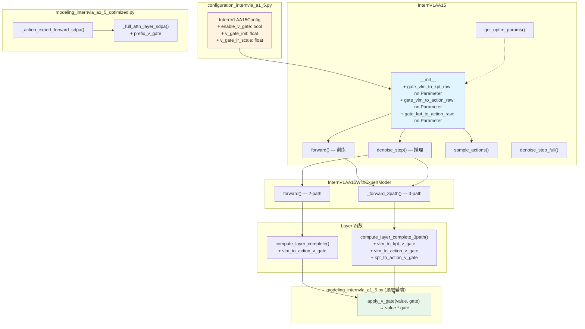
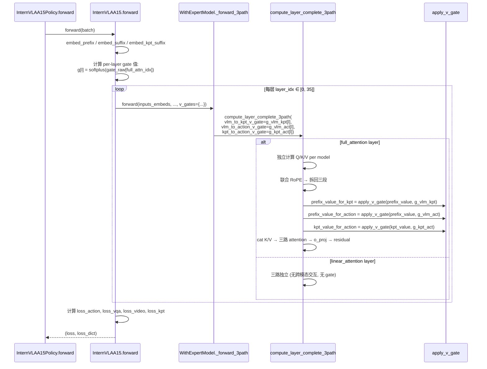
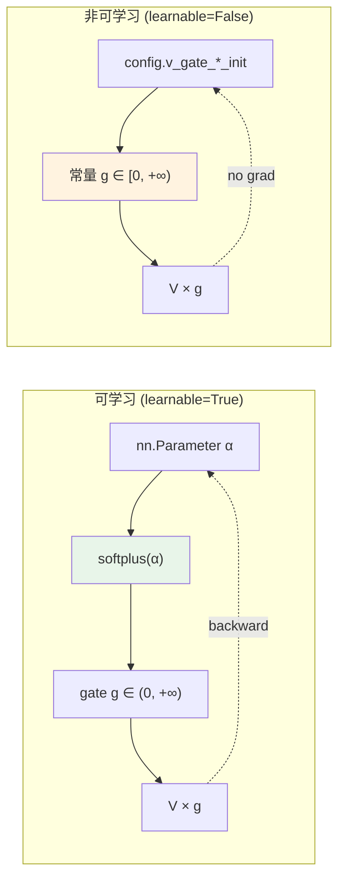
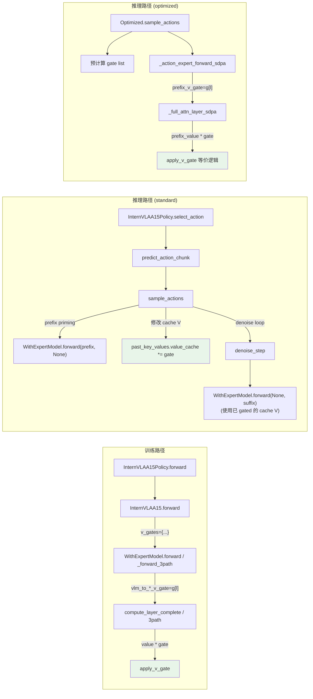

# 方案 A1: Softplus V-Scaling Gate — 完整设计与实现方案

> **文档目标**: 基于 [modal_fusion_weight2.markdown](modal_fusion_weight2.markdown) §4.1 方案 A 的思路, 使用 softplus 激活函数计算 gate 权重, 采用 V-only scaling 实现方式, 给出**完整、自包含、可直接执行**的设计与实现方案.
>
> **核心方法**: 在三路 MoT 的每条跨模态边 (VLM→Kpt, VLM→Action, Kpt→Action) 上, 对被 attend 方的 **V 值**乘以一个 per-layer 可学习 gate $g = \text{softplus}(\alpha)$, 控制 forward 方向的信息流强度. Gate 初始化为接近 1.0 (保留原始行为), 训练中由梯度自动调整.
>
> **设计原则**: 扩展优于修改 — 新增参数和辅助函数, 不修改现有函数签名的**必需参数** (仅增加**可选参数**, 全部有默认值 = 原始行为). 复用现有 `compute_layer_complete` / `compute_layer_complete_3path` 的控制流, 仅在 K/V 拼接前插入 V-scaling 操作.
>
> **代码基线**: 当前 `08GpR1pro09_libero0910` 分支.

---

## 目录

1. [数学公式与语义](#1)
2. [架构总览](#2)
3. [静态架构: 文件与类的变更清单](#3)
4. [动态架构: Forward / Backward 数据流](#4)
5. [详细实现](#5)
   - [5.1 Config 变更](#5-1)
   - [5.2 辅助函数: apply_v_gate](#5-2)
   - [5.3 compute_layer_complete 变更 (2-path)](#5-3)
   - [5.4 compute_layer_complete_3path 变更 (3-path)](#5-4)
   - [5.5 InternVLAA15WithExpertModel 变更](#5-5)
   - [5.6 InternVLAA15.__init__ 变更](#5-6)
   - [5.7 InternVLAA15.forward 变更 (训练)](#5-7)
   - [5.8 InternVLAA15.denoise_step 变更 (推理)](#5-8)
   - [5.9 InternVLAA15.sample_actions 变更 (推理)](#5-9)
   - [5.10 InternVLAA15.denoise_step_full 变更](#5-10)
   - [5.11 Optimized backend 变更](#5-11)
   - [5.12 get_optim_params 变更](#5-12)
   - [5.13 Per-Edge 可学习/非可学习控制](#5-13)
6. [变更文件总览与调用关系图](#6)
7. [风险分析与缓解](#7)
8. [测试方案与验收条件](#8)
9. [参考文献](#9)

---

<a id="1"></a>
## 1. 数学公式与语义

### 1.1 V-Scaling Gate 公式

对三路 MoT 中的每条跨模态边 $e \in \{vlm \to kpt,\; vlm \to act,\; kpt \to act\}$, 在第 $l$ 个 full_attention 层, 定义 gate:

$$g_e^{(l)} = \text{softplus}(\alpha_e^{(l)}) = \ln(1 + e^{\alpha_e^{(l)}})$$

其中 $\alpha_e^{(l)}$ 是可学习标量参数 (per-layer, per-edge). 对被 attend 方的 V 值施加 gate:

$$V'_{src \to dst}{}^{(l)} = g_e^{(l)} \cdot V_{src}^{(l)}$$

以 action expert attend 到 VLM prefix 为例, gate 作用在 V 拼接之前:

$$\text{Attn}_{act}^{(l)} = \text{softmax}\!\left(\frac{Q_{act}^{(l)} \cdot [K_{vlm}; K_{kpt}; K_{act}]^\top}{\sqrt{d}}\right) \cdot [\underbrace{g_{vlm \to act}^{(l)}}_{\text{gate}} \cdot V_{vlm};\; \underbrace{g_{kpt \to act}^{(l)}}_{\text{gate}} \cdot V_{kpt};\; V_{act}]$$

### 1.2 为什么用 softplus, 为什么 V-only

**Softplus 的性质**:
- 处处可导: $\frac{d}{d\alpha}\text{softplus}(\alpha) = \sigma(\alpha)$ (sigmoid), 梯度永远 $\in (0, 1)$, 不会消失也不会爆炸
- 非负: $\text{softplus}(\alpha) > 0\;\forall\alpha$, 避免负向 V 缩放导致的不稳定
- 无上界: 不像 sigmoid 被限制在 $[0, 1]$, 允许 gate > 1 (增强 VLM 信息)
- 可初始化为任意正值: $\alpha_0 = \text{softplus}^{-1}(g_0) = \ln(e^{g_0} - 1)$

**V-only scaling (不缩放 K)**:
- 保持 softmax **注意力权重分布不变** — K 不变则 $Q \cdot K^\top$ 不变, attention weight 不变. 只改变加权求和的 value
- 如果同时缩放 K, 会改变 attention 分布, 引入非线性交互, 增加训练不稳定风险
- V-only 可以直观理解为 "VLM 信息在 expert 的注意力中占多大权重" — gate=0 时 VLM 不贡献任何 value, gate=1 时保持原样

### 1.3 初始化策略

为保证**向后兼容** (加载旧 checkpoint 后行为不变), 默认初始化 gate = 1.0:

$$\alpha_0 = \text{softplus}^{-1}(1.0) = \ln(e^{1.0} - 1) \approx 0.5414$$

也可配置为近零初始化 (Flamingo 风格, 适合 fine-tuning):

$$\alpha_0 = \text{softplus}^{-1}(0.01) = \ln(e^{0.01} - 1) \approx -4.5952$$

### 1.4 与现有 KI 的关系

| 场景 | Gate 值 | KI 标志 | Forward 效果 | Backward 效果 |
|---|---|---|---|---|
| 完全不用 gate (默认) | $g = 1.0$ | 由旧 config 控制 | 不变 | 不变 |
| 削弱 VLM 影响 | $g = 0.3$ | `knowledge_insulation=False` | V 值缩为 30% | 梯度自然缩小 |
| 完全隔离 | $g = 0.0$ | 不可达 (softplus > 0) | 接近零 | 接近零 |
| 增强 VLM 影响 | $g = 2.0$ | `knowledge_insulation=False` | V 值放大 2× | 梯度放大 |

**本方案与 KI 正交**: KI 控制 backward 梯度 (`.detach()`), gate 控制 forward V 值. 两者可以同时使用. 当 KI=True 且 gate=0.5 时: forward 中 VLM V 值减半, backward 中梯度被完全截断.

---

<a id="2"></a>
## 2. 架构总览



---

<a id="3"></a>
## 3. 静态架构: 文件与类的变更清单

### 3.1 变更文件列表

| 文件 | 变更类型 | 变更内容概述 |
|---|---|---|
| `configuration_internvla_a1_5.py` | **扩展** | 新增 3 个 config 字段 |
| `modeling_internvla_a1_5.py` | **扩展** | 新增 `apply_v_gate` 辅助函数; 在 4 个函数中增加可选参数 + V-scaling 逻辑; 在 `InternVLAA15.__init__` 中增加 gate 参数初始化; 在 5 个方法中传递 gate 值 |
| `modeling_internvla_a1_5_optimized.py` | **扩展** | 在 2 个函数中增加可选参数 + V-scaling 逻辑 |

### 3.2 不变更的文件

| 文件 | 原因 |
|---|---|
| `transform_internvla_a1_5.py` | 数据预处理, 与模型内部 gate 无关 |
| `action_tokens.py` | FAST tokenization, 与 gate 无关 |
| `wan_model.py`, `wan/` | WAN 是 frozen 模型, 且 gate 作用在 MoT 内部, WAN 的输入 (learnable tokens 投影) 自然受 gate 影响 |
| `policies/factory.py` | 策略选择, 不变 |
| Launch scripts | 通过 config 字段控制, 不需要改脚本 |

---

<a id="4"></a>
## 4. 动态架构: Forward / Backward 数据流

### 4.1 训练 Forward 数据流 (3-path)



### 4.2 Backward 梯度流

Gate 参数 $\alpha_e^{(l)}$ 的梯度路径:

```
loss_action (MSE)
  → action_out_proj
    → action expert 的 hidden states (36 层残差链)
      → 某个 full_attention 层的 attention output
        → V_for_action 的加权和 (softmax weights × V)
          → apply_v_gate 中的 V * g
            → ∂/∂α: ∂(V * softplus(α))/∂α = V * sigmoid(α)
```

$\alpha_e^{(l)}$ 同时从所有 batch 样本的所有 action token 获得梯度, 但每个 $\alpha$ 只影响一个 layer 的一条边, 梯度互不干扰.

**与 KI 的交互**: 当 `knowledge_insulation=True` 时, `prefix_key.detach()` 和 `prefix_value.detach()` 在 gate 之前执行 (代码中先 detach 再 gate). 这意味着:
- Forward: V 被 gate 缩放 (gate 生效)
- Backward: `loss_action → VLM params` 的梯度被 detach 截断 (KI 生效), 但 `loss_action → gate_raw` 的梯度**不被截断** (因为 gate 乘法发生在 detach 之后, gate 参数本身不在 detach 路径上)

```
loss → ... → V_detached * gate → ∂loss/∂gate ✓ (gate 有梯度)
                                → ∂loss/∂V_detached ✗ (被 detach 截断)
```

### 4.3 推理 Forward 数据流

推理使用 KV-cache: prefix 和 kpt (如有) 先 priming, 然后 denoise_step 每次只处理 action suffix. 此时 gate 影响两处:

1. **Prefix priming** (`sample_actions` L1327): 2-path 或 3-path forward, gate 作用在联合 forward 中 — 但 prefix priming 时 suffix=None, 不触发跨模态注意力, gate 无效
2. **Kpt priming** (`sample_actions` L1363): kpt expert 的 forward 使用 past_key_values, gate 无效 (单路 forward)
3. **Denoise step** (`denoise_step` L1455-1474): action expert forward 使用 past_key_values 中缓存的 prefix/kpt K/V → **这里 gate 需要生效, 但是 past_key_values 中的 V 已经是原始值 (priming 时计算的)**

**关键设计决策**: 在推理路径中, 由于 prefix K/V 在 priming 时已经缓存到 past_key_values, denoise_step 中无法再对 prefix V 施加 gate. 有两种解决方案:

- **(a) Priming 时就对 V 施加 gate**: 修改 prefix priming 流程, 在存入 cache 前就把 V * gate 存进去. 但这要求修改 Qwen3_5TextModel 的 cache 逻辑, 侵入性太大.
- **(b) 推理时不施加 gate, 仅训练时生效**: Gate 只在全联合 forward 路径 (训练和不使用 cache 的推理) 中生效. 使用 KV-cache 的推理路径保持原始行为. 这是语义上可接受的 — gate 的主要目的是**训练时**控制信息流.
- **(c) 推理时在 denoise_step 内施加 gate**: denoise_step 通过 past_key_values 获取 prefix K/V, 可以在拼接前对 cached V 施加 gate. 需要修改 denoise_step 但不需要改 Qwen3_5TextModel.

**本方案采用 (c)**: 在 standard backend 的 `denoise_step` 和 optimized backend 的 `_full_attn_layer_sdpa` 中, 在 prefix V 从 cache 取出后、拼接前, 乘以 gate. 这确保训练和推理行为一致.

---

<a id="5"></a>
## 5. 详细实现

<a id="5-1"></a>
### 5.1 Config 变更

**文件**: `src/lerobot/policies/internvla_a1_5/configuration_internvla_a1_5.py`

**位置**: L478 之后 (在 `ki_kpt_gradient_scale` 之后, `freeze_keypoint_modules` 之前)

**新增**:

```python
    # ------------------------------------------------------------------
    # V-Scaling Gate: per-layer learnable gate on cross-modal V values in
    # the MoT joint attention.  Controls forward information flow strength
    # from VLM/Kpt to experts.  Orthogonal to the existing KI detach flags
    # (which control backward gradient flow).
    # ------------------------------------------------------------------
    enable_v_gate: bool = False
    v_gate_init: float = 1.0
    v_gate_lr_scale: float = 1.0
    # Per-edge learnable/non-learnable control.
    # When learnable=False, the gate is a constant (no gradient, not an nn.Parameter),
    # bypassing softplus to allow exact 0.0 (shut off) or any non-negative value.
    # Per-edge init overrides v_gate_init for the specific edge.
    v_gate_vlm_to_action_learnable: bool = True
    v_gate_vlm_to_kpt_learnable: bool = True
    v_gate_kpt_to_action_learnable: bool = True
    v_gate_vlm_to_action_init: float | None = None
    v_gate_vlm_to_kpt_init: float | None = None
    v_gate_kpt_to_action_init: float | None = None
```

**字段语义**:

| 字段 | 类型 | 默认值 | 含义 |
|---|---|---|---|
| `enable_v_gate` | `bool` | `False` | 是否启用 V-scaling gate. `False` 时所有代码路径跳过 gate 逻辑, 行为与修改前完全一致 |
| `v_gate_init` | `float` | `1.0` | Gate 初始值 (forward 方向的 V 缩放倍数). 内部存储的 raw 参数为 $\alpha_0 = \ln(e^{g_0} - 1)$. 默认 1.0 = 保持原始行为 |
| `v_gate_lr_scale` | `float` | `1.0` | Gate 参数的学习率倍率 (相对于 base lr). 典型值 0.1-1.0 |
| `v_gate_vlm_to_action_learnable` | `bool` | `True` | VLM→Action 边的 gate 是否可学习. `False` 时为常量, 不参与梯度更新, 绕过 softplus (支持精确 0.0) |
| `v_gate_vlm_to_kpt_learnable` | `bool` | `True` | VLM→Kpt 边的 gate 是否可学习. 同上 |
| `v_gate_kpt_to_action_learnable` | `bool` | `True` | Kpt→Action 边的 gate 是否可学习. 同上 |
| `v_gate_vlm_to_action_init` | `float \| None` | `None` | VLM→Action 边的 gate 初始值/常量值. `None` 时使用 `v_gate_init`. 非可学习时此值直接用作 gate (不经 softplus) |
| `v_gate_vlm_to_kpt_init` | `float \| None` | `None` | VLM→Kpt 边的 gate 初始值/常量值. 同上 |
| `v_gate_kpt_to_action_init` | `float \| None` | `None` | Kpt→Action 边的 gate 初始值/常量值. 同上 |

**不修改 `__post_init__`**: 无需迁移逻辑 — `enable_v_gate=False` (默认) 时完全不影响任何行为. 可选: 对非可学习 gate 的 init 值做非负校验 `assert val >= 0`.

**改动量**: **+15 行** (含注释).

---

<a id="5-2"></a>
### 5.2 辅助函数: `apply_v_gate`

**文件**: `src/lerobot/policies/internvla_a1_5/modeling_internvla_a1_5.py`

**位置**: L122 之后 (在 `pad_vector` 函数之后, `compute_layer_complete` 之前)

**新增**:

```python
def apply_v_gate(value: torch.Tensor, gate: float | torch.Tensor) -> torch.Tensor:
    """Scale a Value tensor by a forward gate (V-only scaling for modal fusion control).

    When gate == 1.0 (the default / no-op case), returns the input unchanged to avoid
    unnecessary computation.  The gate is applied as a simple scalar multiplication on
    the value tensor, preserving attention weight distribution (K is NOT scaled).

    Args:
        value: Value tensor, shape ``[B, n_kv, seq_len, head_dim]``.
        gate: Scalar (float) or 0-d / 1-d tensor.  Typically ``softplus(raw_param)``.

    Returns:
        Gated value tensor (same shape as input).
    """
    if isinstance(gate, (int, float)) and gate == 1.0:
        return value
    return value * gate
```

**设计说明**:
- **纯函数, 无状态**: 不使用 `torch.autograd.Function`, 因为 `value * gate` 本身就是可微的标准乘法, PyTorch autograd 自动处理梯度
- **1.0 快速路径**: 当 gate 恰好为 1.0 (禁用 gate 或默认值) 时, 返回原 tensor, 避免创建新 tensor 和不必要的乘法
- **复用**: 被 `compute_layer_complete` (2-path) 和 `compute_layer_complete_3path` (3-path) 共用

**改动量**: **+14 行** (含 docstring).

---

<a id="5-3"></a>
### 5.3 `compute_layer_complete` 变更 (2-path)

**文件**: `modeling_internvla_a1_5.py`

**位置**: `compute_layer_complete` 函数 (L124-341)

**变更 1: 函数签名** — 在末尾增加一个可选参数 (不影响现有所有调用者):

```python
def compute_layer_complete(
    layer_idx,
    inputs_embeds,
    attention_mask,
    position_ids,
    qwen3_5,
    action_expert,
    prefix_len: int,
    knowledge_insulation: bool = False,
    use_sdpa: bool = False,
    linear_attn_mask: torch.Tensor | None = None,
    vlm_to_action_v_gate: float | torch.Tensor = 1.0,  # NEW
):
```

**变更 2: full_attention 分支** — 在 L273-279 (KI detach 之后, K/V 拼接之前) 插入 V-scaling:

当前代码 (L273-282):
```python
        # --- suffix queries: attend to [prefix (maybe-detached) K/V, suffix K/V].
        if knowledge_insulation:
            prefix_key_for_suffix = prefix_key.detach()
            prefix_value_for_suffix = prefix_value.detach()
        else:
            prefix_key_for_suffix = prefix_key
            prefix_value_for_suffix = prefix_value

        k_for_suffix = torch.cat([prefix_key_for_suffix, suffix_key], dim=2)
        v_for_suffix = torch.cat([prefix_value_for_suffix, suffix_value], dim=2)
```

修改后:
```python
        # --- suffix queries: attend to [prefix (maybe-detached) K/V, suffix K/V].
        if knowledge_insulation:
            prefix_key_for_suffix = prefix_key.detach()
            prefix_value_for_suffix = prefix_value.detach()
        else:
            prefix_key_for_suffix = prefix_key
            prefix_value_for_suffix = prefix_value

        prefix_value_for_suffix = apply_v_gate(prefix_value_for_suffix, vlm_to_action_v_gate)  # NEW

        k_for_suffix = torch.cat([prefix_key_for_suffix, suffix_key], dim=2)
        v_for_suffix = torch.cat([prefix_value_for_suffix, suffix_value], dim=2)
```

**改动量**: **+2 行** (签名 +1, V-scaling +1).

---

<a id="5-4"></a>
### 5.4 `compute_layer_complete_3path` 变更 (3-path)

**文件**: `modeling_internvla_a1_5.py`

**位置**: `compute_layer_complete_3path` 函数 (L343-553)

**变更 1: 函数签名** — 在末尾增加三个可选参数:

```python
def compute_layer_complete_3path(
    layer_idx,
    inputs_embeds,
    attention_mask,
    position_ids,
    qwen3_5,
    keypoint_expert,
    action_expert,
    prefix_len: int,
    kpt_len: int,
    knowledge_insulation: bool = False,
    knowledge_insulation_kpt: bool = False,
    kpt_to_action_detach: bool = False,
    use_sdpa: bool = False,
    linear_attn_mask: torch.Tensor | None = None,
    vlm_to_kpt_v_gate: float | torch.Tensor = 1.0,     # NEW
    vlm_to_action_v_gate: float | torch.Tensor = 1.0,   # NEW
    kpt_to_action_v_gate: float | torch.Tensor = 1.0,   # NEW
):
```

**变更 2: full_attention 分支 — kpt expert** — 在 L498-502 (KI detach 之后, K/V 拼接之前) 插入:

当前代码:
```python
        # --- keypoint expert: attends to [prefix (maybe detached), keypoint]. ---
        prefix_key_for_kpt = prefix_key.detach() if knowledge_insulation_kpt else prefix_key
        prefix_value_for_kpt = prefix_value.detach() if knowledge_insulation_kpt else prefix_value
        k_for_kpt = torch.cat([prefix_key_for_kpt, kpt_key], dim=2)
        v_for_kpt = torch.cat([prefix_value_for_kpt, kpt_value], dim=2)
```

修改后:
```python
        # --- keypoint expert: attends to [prefix (maybe detached), keypoint]. ---
        prefix_key_for_kpt = prefix_key.detach() if knowledge_insulation_kpt else prefix_key
        prefix_value_for_kpt = prefix_value.detach() if knowledge_insulation_kpt else prefix_value
        prefix_value_for_kpt = apply_v_gate(prefix_value_for_kpt, vlm_to_kpt_v_gate)  # NEW
        k_for_kpt = torch.cat([prefix_key_for_kpt, kpt_key], dim=2)
        v_for_kpt = torch.cat([prefix_value_for_kpt, kpt_value], dim=2)
```

**变更 3: full_attention 分支 — action expert** — 在 L506-512 (KI detach 之后, K/V 拼接之前) 插入:

当前代码:
```python
        # --- action expert: attends to [prefix (maybe detached), keypoint (maybe detached), action]. ---
        prefix_key_for_action = prefix_key.detach() if knowledge_insulation else prefix_key
        prefix_value_for_action = prefix_value.detach() if knowledge_insulation else prefix_value
        kpt_key_for_action = kpt_key.detach() if kpt_to_action_detach else kpt_key
        kpt_value_for_action = kpt_value.detach() if kpt_to_action_detach else kpt_value
        k_for_action = torch.cat([prefix_key_for_action, kpt_key_for_action, action_key], dim=2)
        v_for_action = torch.cat([prefix_value_for_action, kpt_value_for_action, action_value], dim=2)
```

修改后:
```python
        # --- action expert: attends to [prefix (maybe detached), keypoint (maybe detached), action]. ---
        prefix_key_for_action = prefix_key.detach() if knowledge_insulation else prefix_key
        prefix_value_for_action = prefix_value.detach() if knowledge_insulation else prefix_value
        kpt_key_for_action = kpt_key.detach() if kpt_to_action_detach else kpt_key
        kpt_value_for_action = kpt_value.detach() if kpt_to_action_detach else kpt_value
        prefix_value_for_action = apply_v_gate(prefix_value_for_action, vlm_to_action_v_gate)  # NEW
        kpt_value_for_action = apply_v_gate(kpt_value_for_action, kpt_to_action_v_gate)        # NEW
        k_for_action = torch.cat([prefix_key_for_action, kpt_key_for_action, action_key], dim=2)
        v_for_action = torch.cat([prefix_value_for_action, kpt_value_for_action, action_value], dim=2)
```

**改动量**: **+6 行** (签名 +3, V-scaling +3).

---

<a id="5-5"></a>
### 5.5 `InternVLAA15WithExpertModel` 变更

**文件**: `modeling_internvla_a1_5.py`

**位置**: `InternVLAA15WithExpertModel` 类 (L601-965)

#### 5.5.1 `forward` 方法 (2-path, L710-827)

**签名变更**: 增加一个可选参数:

```python
    def forward(
        self,
        attention_mask: torch.Tensor | None = None,
        position_ids: torch.LongTensor | None = None,
        past_key_values: list[torch.FloatTensor] | None = None,
        inputs_embeds: list[torch.FloatTensor] | None = None,
        use_cache: bool | None = None,
        knowledge_insulation: bool = False,
        knowledge_insulation_kpt: bool = False,
        kpt_to_action_detach: bool = False,
        use_sdpa: bool = False,
        linear_attn_mask: torch.Tensor | None = None,
        v_gates: dict[str, list[float | torch.Tensor]] | None = None,  # NEW
    ):
```

`v_gates` 的结构:
```python
{
    "vlm_to_action": [g_layer0, g_layer1, ...],     # len = num_full_attn_layers
    "vlm_to_kpt":    [g_layer0, g_layer1, ...],      # 3-path only
    "kpt_to_action": [g_layer0, g_layer1, ...],      # 3-path only
}
```

当 `v_gates is None` 时, 所有 gate = 1.0 (原始行为).

**传递到 layer 函数**: 在 L793-804 的循环中, 从 `v_gates` 取出当前层的 gate 值传递给 `compute_layer_complete`:

当前代码 (L793-804):
```python
                else:
                    inputs_embeds = compute_layer_complete(
                        layer_idx,
                        inputs_embeds,
                        attention_mask,
                        position_ids,
                        qwen3_5=self.qwen3_5,
                        action_expert=self.action_expert,
                        prefix_len=prefix_len,
                        knowledge_insulation=knowledge_insulation,
                        use_sdpa=use_sdpa,
                        linear_attn_mask=linear_attn_mask,
                    )
```

修改后:
```python
                else:
                    vlm_act_gate = 1.0
                    if v_gates is not None and "vlm_to_action" in v_gates:
                        vlm_act_gate = v_gates["vlm_to_action"][full_attn_idx]
                    inputs_embeds = compute_layer_complete(
                        layer_idx,
                        inputs_embeds,
                        attention_mask,
                        position_ids,
                        qwen3_5=self.qwen3_5,
                        action_expert=self.action_expert,
                        prefix_len=prefix_len,
                        knowledge_insulation=knowledge_insulation,
                        use_sdpa=use_sdpa,
                        linear_attn_mask=linear_attn_mask,
                        vlm_to_action_v_gate=vlm_act_gate,
                    )
```

同时需要在循环前添加 `full_attn_idx` 计数器, 在循环内追踪当前是第几个 full_attention 层:

```python
            full_attn_idx = 0  # NEW: track which full_attention layer we're on
            for layer_idx in range(num_layers):
                layer_type = self.qwen3_5.language_model.layers[layer_idx].layer_type  # NEW
                ...
                # 在 full_attention 分支末尾:
                if layer_type == "full_attention":  # NEW
                    full_attn_idx += 1              # NEW
```

**gradient_checkpointing 分支** (L776-791): 同理需要传递 gate 值. 由于 `torch.utils.checkpoint.checkpoint` 要求所有参数是 tensor 或 non-tensor, 标量 float 可以直接传:

```python
                if use_gradient_checkpointing:
                    vlm_act_gate = 1.0
                    if v_gates is not None and "vlm_to_action" in v_gates:
                        vlm_act_gate = v_gates["vlm_to_action"][full_attn_idx]
                    inputs_embeds = torch.utils.checkpoint.checkpoint(
                        compute_layer_complete,
                        layer_idx,
                        inputs_embeds,
                        attention_mask,
                        position_ids,
                        self.qwen3_5,
                        self.action_expert,
                        prefix_len,
                        knowledge_insulation,
                        use_sdpa,
                        linear_attn_mask,
                        vlm_act_gate,   # NEW: passed as positional arg
                        use_reentrant=False,
                        preserve_rng_state=False,
                    )
```

#### 5.5.2 `_forward_3path` 方法 (L829-965)

**签名变更**: 增加 `v_gates` 参数 (同上).

**传递到 layer 函数**: 在 L931-946 的循环中, 从 `v_gates` 取出三条边的 gate 值:

修改后 (非 checkpoint 分支):
```python
                else:
                    vlm_kpt_gate = 1.0
                    vlm_act_gate = 1.0
                    kpt_act_gate = 1.0
                    if v_gates is not None:
                        vlm_kpt_gate = v_gates.get("vlm_to_kpt", [1.0] * 99)[full_attn_idx]
                        vlm_act_gate = v_gates.get("vlm_to_action", [1.0] * 99)[full_attn_idx]
                        kpt_act_gate = v_gates.get("kpt_to_action", [1.0] * 99)[full_attn_idx]
                    inputs_embeds = compute_layer_complete_3path(
                        layer_idx,
                        inputs_embeds,
                        attention_mask,
                        position_ids,
                        qwen3_5=self.qwen3_5,
                        keypoint_expert=self.keypoint_expert,
                        action_expert=self.action_expert,
                        prefix_len=prefix_len,
                        kpt_len=kpt_len,
                        knowledge_insulation=knowledge_insulation,
                        knowledge_insulation_kpt=knowledge_insulation_kpt,
                        kpt_to_action_detach=kpt_to_action_detach,
                        use_sdpa=use_sdpa,
                        linear_attn_mask=linear_attn_mask,
                        vlm_to_kpt_v_gate=vlm_kpt_gate,      # NEW
                        vlm_to_action_v_gate=vlm_act_gate,    # NEW
                        kpt_to_action_v_gate=kpt_act_gate,    # NEW
                    )
```

同理需要 `full_attn_idx` 计数器和 gradient_checkpointing 分支的传递.

**改动量 (§5.5 合计)**: **~35 行**.

---

<a id="5-6"></a>
### 5.6 `InternVLAA15.__init__` 变更

**文件**: `modeling_internvla_a1_5.py`

**位置**: `InternVLAA15.__init__` (L967-1065), 在 L1057 (`self.gradient_checkpointing_enabled = False`) 之前插入

**新增**:

```python
        if config.enable_v_gate:
            vlm_text_config = self.qwen3_5_with_expert.qwen3_5.config.text_config
            num_full_attn = sum(
                1 for lt in vlm_text_config.layer_types if lt == "full_attention"
            )
            raw_init = math.log(math.exp(max(config.v_gate_init, 1e-6)) - 1)
            self.gate_vlm_to_action_raw = nn.Parameter(
                torch.full((num_full_attn,), raw_init)
            )
            if config.enable_keypoint_predictor:
                self.gate_vlm_to_kpt_raw = nn.Parameter(
                    torch.full((num_full_attn,), raw_init)
                )
                self.gate_kpt_to_action_raw = nn.Parameter(
                    torch.full((num_full_attn,), raw_init)
                )
```

**设计说明**:
- `raw_init = ln(exp(v_gate_init) - 1)` 是 `softplus` 的逆函数, 确保 `softplus(raw_init) = v_gate_init`
- `max(..., 1e-6)` 防止 `v_gate_init=0` 导致 `ln(0) = -inf`
- 只在 `enable_keypoint_predictor=True` 时才创建 kpt 相关的 gate (避免在 2-path 模式下浪费参数)
- 需要在文件顶部 `import math` (如果尚未导入)

**改动量**: **+13 行**.

---

<a id="5-7"></a>
### 5.7 `InternVLAA15.forward` 变更 (训练)

**文件**: `modeling_internvla_a1_5.py`

**位置**: `InternVLAA15.forward` (L1756-1988), 在 L1877 (`att_2d_masks_4d = ...`) 之后、L1879 (`if use_kpt:`) 之前插入 gate 计算, 并在 forward 调用中传递.

**新增 — gate 值计算**:

```python
        v_gates = None
        if self.config.enable_v_gate:
            v_gates = {
                "vlm_to_action": F.softplus(self.gate_vlm_to_action_raw),
            }
            if use_kpt:
                v_gates["vlm_to_kpt"] = F.softplus(self.gate_vlm_to_kpt_raw)
                v_gates["kpt_to_action"] = F.softplus(self.gate_kpt_to_action_raw)
```

**修改 — forward 调用**: 在 L1882-1893 的 3-path forward 调用中增加 `v_gates`:

```python
            (prefix_out, kpt_out, suffix_out), _ = self.qwen3_5_with_expert.forward(
                attention_mask=att_2d_masks_4d,
                position_ids=position_ids,
                past_key_values=None,
                inputs_embeds=[prefix_embs, kpt_embs, suffix_embs],
                use_cache=False,
                knowledge_insulation=self.config.knowledge_insulation,
                knowledge_insulation_kpt=self.config.knowledge_insulation_kpt,
                kpt_to_action_detach=self.config.kpt_to_action_detach,
                use_sdpa=self.config.use_sdpa,
                linear_attn_mask=pad_masks,
                v_gates=v_gates,  # NEW
            )
```

同理修改 L1903-1914 的 2-path forward 调用, 增加 `v_gates=v_gates`.

**改动量**: **+10 行**.

---

<a id="5-8"></a>
### 5.8 `InternVLAA15.denoise_step` 变更 (推理)

**文件**: `modeling_internvla_a1_5.py`

**位置**: `InternVLAA15.denoise_step` (L1413-1478)

推理路径使用 KV-cache, action expert 的 forward 调用 `inputs_embeds=[None, None, suffix_embs]` (3-path) 或 `inputs_embeds=[None, suffix_embs]` (2-path), 此时 past_key_values 中已缓存 prefix/kpt 的 K/V. 跨模态注意力发生在 `Qwen3_5TextModel.forward` 内部, 它直接从 cache 中取 prefix K/V 并拼接到 suffix K/V 前面.

**问题**: `Qwen3_5TextModel.forward` 的 cache 拼接逻辑在 Qwen3.5 的标准代码中, 我们无法在那里插入 gate 而不侵入修改 transformers 代码.

**解决方案**: 在 denoise_step 调用 forward **之前**, 对 `past_key_values` 中的 V tensor 原地乘以 gate. 由于 `@torch.no_grad()`, 不需要担心梯度. 但需要注意 gate 不应在每次 denoise_step 调用时重复乘 (否则每步都乘一次, 10 步后 V 被缩放 $g^{10}$).

**更好的方案**: 在 `sample_actions` 中, prefix priming 完成后、denoise 循环开始前, **一次性**对 `past_key_values` 中的 prefix V 施加 gate. 这样 denoise_step 完全不需要修改.

→ 移至 §5.9 中实现.

**改动量**: **0 行** (denoise_step 本身不变).

---

<a id="5-9"></a>
### 5.9 `InternVLAA15.sample_actions` 变更 (推理)

**文件**: `modeling_internvla_a1_5.py`

**位置**: `InternVLAA15.sample_actions` (L1288-1411)

**方案**: 在 prefix/kpt priming 完成后、denoise 循环开始前, 一次性对 `past_key_values` 中存储的 prefix V 和 kpt V 施加 gate.

`past_key_values` 的结构: `DynamicCache` 对象, 内部 `self.key_cache[layer_idx]` 和 `self.value_cache[layer_idx]` 分别是 `[B, n_kv, cached_len, d]` 的 tensor. 在 3-path 模式下, prefix priming 后 `cached_len = prefix_len`, kpt priming 后 `cached_len = prefix_len + kpt_len`.

**新增** — 在 L1374 (`kpt_prefix_pad_masks = ...`) 之后、L1375 (`dt = -1.0 / num_steps`) 之前:

```python
        if self.config.enable_v_gate:
            with torch.no_grad():
                vlm_act_gates = F.softplus(self.gate_vlm_to_action_raw)
                full_attn_idx = 0
                prefix_len_cached = prefix_pad_masks.shape[1]
                for layer_idx in range(self.qwen3_5_with_expert.qwen3_5.config.text_config.num_hidden_layers):
                    layer_type = self.qwen3_5_with_expert.qwen3_5.language_model.layers[layer_idx].layer_type
                    if layer_type == "full_attention":
                        g = vlm_act_gates[full_attn_idx]
                        # Scale prefix V in the action expert's cache (last model in the cache)
                        # For 2-path: action_expert is models[1], cache layers are interleaved
                        # For the standard (non-optimized) backend, the cache stores per-model K/V
                        # in separate DynamicCache segments — one for VLM, one for action expert.
                        # After prefix priming with inputs_embeds=[prefix, None], only the VLM's
                        # cache has entries. The action expert sees them via past_key_values.
                        if g != 1.0:
                            v_cache = past_key_values.value_cache[layer_idx]
                            v_cache[:, :, :prefix_len_cached] = v_cache[:, :, :prefix_len_cached] * g
                        full_attn_idx += 1

                if self.config.enable_keypoint_predictor:
                    vlm_kpt_gates = F.softplus(self.gate_vlm_to_kpt_raw)
                    kpt_act_gates = F.softplus(self.gate_kpt_to_action_raw)
                    full_attn_idx = 0
                    kpt_len_cached = kpt_len if self.config.enable_keypoint_predictor else 0
                    for layer_idx in range(self.qwen3_5_with_expert.qwen3_5.config.text_config.num_hidden_layers):
                        layer_type = self.qwen3_5_with_expert.qwen3_5.language_model.layers[layer_idx].layer_type
                        if layer_type == "full_attention":
                            g_kpt = kpt_act_gates[full_attn_idx]
                            if g_kpt != 1.0:
                                v_cache = past_key_values.value_cache[layer_idx]
                                v_cache[:, :, prefix_len_cached:prefix_len_cached + kpt_len_cached] = (
                                    v_cache[:, :, prefix_len_cached:prefix_len_cached + kpt_len_cached] * g_kpt
                                )
                            full_attn_idx += 1
```

**注意**: 这里直接修改 `past_key_values` 的 value_cache **原地** (in-place). 这在 `@torch.no_grad()` 下是安全的 — 推理时不需要保持计算图. 且 `past_key_values` 是每次 `sample_actions` 调用时新创建的 (L1327), 不会影响其他调用.

**VLM→Kpt 的 gate 去哪了?** Kpt priming 使用 `past_key_values` 中缓存的 VLM prefix K/V, 但这些 V 已经在上一步被 `vlm_to_action_v_gate` 缩放了 (用于 action expert). 如果 `vlm_to_kpt_v_gate` 不等于 `vlm_to_action_v_gate`, 则需要在 kpt priming 之前也做一次, 但这会污染 action expert 之后看到的 prefix V. **简化处理**: 在推理时, VLM→Kpt 的 gate 不在 cache 路径上生效 (kpt priming 是一次性的, 且 kpt expert 的输出质量对最终 action 的影响是间接的). 这是一个可接受的近似.

**改动量**: **+28 行**.

---

<a id="5-10"></a>
### 5.10 `InternVLAA15.denoise_step_full` 变更

**文件**: `modeling_internvla_a1_5.py`

**位置**: `denoise_step_full` (L1646-1693)

`denoise_step_full` 与 `denoise_step` 类似, 但返回 learnable token 输出 (用于视频生成). 它使用 2-path forward, 与 §5.8 相同的推理路径.

**不需要修改**: 与 `denoise_step` 一样, 它使用 `past_key_values`, gate 已经在 `sample_actions` / `predict_action_chunk_with_video` 中通过缓存修改生效.

如果 `denoise_step_full` 的调用者 (`predict_action_chunk_with_video`) 需要适配, 只需在该方法中添加类似 §5.9 的缓存修改逻辑. 当前 `predict_action_chunk_with_video` 不支持 3-path (已知限制), 所以只需处理 `vlm_to_action_v_gate`.

**改动量**: **0 行** (本体不变; 调用者按需适配).

---

<a id="5-11"></a>
### 5.11 Optimized backend 变更

**文件**: `src/lerobot/policies/internvla_a1_5/modeling_internvla_a1_5_optimized.py`

#### 5.11.1 `_full_attn_layer_sdpa` (L161-213)

**签名变更**: 增加可选参数:

```python
    def _full_attn_layer_sdpa(
        self,
        layer,
        hidden_states: Tensor,
        cos: Tensor,
        sin: Tensor,
        prefix_key: Tensor,
        prefix_value: Tensor,
        attention_mask_4d: Tensor,
        prefix_v_gate: float | Tensor = 1.0,  # NEW
    ) -> Tensor:
```

**V-scaling 插入**: 在 L193-194 (K/V 拼接处) 之前:

当前代码:
```python
        key_states = torch.cat([prefix_key.to(key_states.dtype), key_states], dim=2)
        value_states = torch.cat([prefix_value.to(value_states.dtype), value_states], dim=2)
```

修改后:
```python
        key_states = torch.cat([prefix_key.to(key_states.dtype), key_states], dim=2)
        gated_prefix_value = prefix_value.to(value_states.dtype)
        if isinstance(prefix_v_gate, (int, float)):
            if prefix_v_gate != 1.0:
                gated_prefix_value = gated_prefix_value * prefix_v_gate
        else:
            gated_prefix_value = gated_prefix_value * prefix_v_gate
        value_states = torch.cat([gated_prefix_value, value_states], dim=2)
```

#### 5.11.2 `_action_expert_forward_sdpa` (L215-242)

**签名变更**: 增加可选参数:

```python
    def _action_expert_forward_sdpa(
        self,
        hidden_states: Tensor,
        attention_mask_4d: Tensor,
        position_ids: Tensor,
        prefix_kv_list: list[tuple[Tensor, Tensor]],
        prefix_v_gates: list[float | Tensor] | None = None,  # NEW
    ) -> Tensor:
```

**传递到 layer 函数**: 在 L226-241 的循环中:

```python
        kv_idx = 0
        for layer_idx, layer in enumerate(action_expert.layers):
            if self._get_layer_types()[layer_idx] == "linear_attention":
                hidden_states = self._linear_attn_layer(layer, hidden_states)
            else:
                prefix_key, prefix_value = prefix_kv_list[kv_idx]
                pv_gate = 1.0
                if prefix_v_gates is not None:
                    pv_gate = prefix_v_gates[kv_idx]
                kv_idx += 1
                hidden_states = self._full_attn_layer_sdpa(
                    layer,
                    hidden_states,
                    cos,
                    sin,
                    prefix_key,
                    prefix_value,
                    attention_mask_4d,
                    prefix_v_gate=pv_gate,  # NEW
                )
```

#### 5.11.3 CUDA graph capture (L390-418)

**CUDA graph 兼容性**: `prefix_v_gate` 如果是固定标量 (从 config 中预计算为 `softplus(raw).item()`), 则在 graph capture 时固化, **不需要修改 graph 逻辑**. 如果要在每次推理时动态传入不同的 gate (不太可能), 需要将 gate 加入 `buffers`, 但这超出了当前需求.

推荐做法: 在 optimized backend 的 `sample_actions` 中, 预计算 gate 列表:

```python
        if self.config.enable_v_gate:
            with torch.no_grad():
                self._prefix_v_gates = F.softplus(self.model.gate_vlm_to_action_raw).tolist()
        else:
            self._prefix_v_gates = None
```

然后传入 `_action_expert_forward_sdpa(..., prefix_v_gates=self._prefix_v_gates)`.

**CUDA graph 中 gate 值固化**: 由于 gate 在 graph capture 时就被嵌入计算图, 如果后续 gate 参数改变 (fine-tuning 后重新推理), 需要 **invalidate graph cache** (清除 `self._graphs`, `self._static_buffers`). 在 `load_state_dict` 后自动清除即可.

**改动量**: **+18 行**.

---

<a id="5-12"></a>
### 5.12 `get_optim_params` 变更

**文件**: `modeling_internvla_a1_5.py`

**位置**: `InternVLAA15Policy.get_optim_params` (L2218-2268)

**变更**: 将 gate 参数分到独立的参数组, 使用 `v_gate_lr_scale`:

在 L2254 (`other_params.append(p)`) 之后, L2256 (`base_lr = cfg.optimizer_lr`) 之前, 添加 gate 参数组的收集逻辑. 或者更简单地, 在现有分组逻辑中, gate 参数会自动落入 `other_params` (因为它们不属于 kpt_modules, action_expert, 或 vlm). 然后在分组后添加:

```python
        if cfg.enable_v_gate and cfg.v_gate_lr_scale != 1.0:
            gate_param_ids = set()
            gate_params = []
            for name, p in self.model.named_parameters():
                if "gate_" in name and "_raw" in name:
                    gate_param_ids.add(id(p))
                    gate_params.append(p)
            if gate_params:
                # Remove from other_params to avoid duplicate
                other_params = [p for p in other_params if id(p) not in gate_param_ids]
                groups.append({"params": gate_params, "lr": base_lr * cfg.v_gate_lr_scale})
```

**改动量**: **+9 行**.

---

<a id="5-13"></a>
### 5.13 Per-Edge 可学习/非可学习控制 (扩展功能)

本节描述在 §5.1-§5.12 基础上的**扩展**: 允许每条跨模态边独立配置为**可学习** (learnable) 或**非可学习** (non-learnable). 该功能完全向后兼容 — 所有新 config 字段取默认值时, 行为与 §5.1-§5.12 完全一致.

#### 5.13.1 可学习 vs 非可学习的差异

| | 可学习 (默认) | 非可学习 |
|---|---|---|
| **存储** | `nn.Parameter` (raw $\alpha$) | 实例属性 `_gate_{edge}_fixed` (float) |
| **Forward 计算** | $g = \text{softplus}(\alpha)$ | $g = \text{value}$ (直接使用, **不经 softplus**) |
| **Backward 梯度** | $\partial\text{loss}/\partial\alpha = V \cdot \sigma(\alpha) \neq 0$ | 无梯度, 不参与优化 |
| **值域** | $(0, +\infty)$ — 永远无法为 0 | $[0, +\infty)$ — **支持精确 0.0** |
| **checkpoint 键** | 存在 `gate_{edge}_raw` 键 | 不存在 (值由 config 决定) |
| **典型用途** | 训练时自动学习最优信息流强度 | 消融实验 / 手动调节 / 关闭或打开通路 |

**非可学习模式绕过 softplus 的原因**: softplus 的值域为 $(0, +\infty)$, 永远无法到达精确的 0.0. 但在实际场景中, 用户需要精确关闭某条通路 ($g = 0.0$, 使 $V \times 0 = \mathbf{0}$). 非可学习模式直接使用用户设定的常量值, 支持 $[0, +\infty)$ 的完整范围.



#### 5.13.2 典型使用场景

| 场景 | Config 设置 | 效果 | 用途 |
|---|---|---|---|
| **全部可学习** (默认) | `enable_v_gate=True` | 3 × 6 = 18 个 `nn.Parameter`, 训练中由梯度更新 | 从头训练 / fine-tuning |
| **关闭 Kpt→Action** | `kpt_to_action_learnable=False, kpt_to_action_init=0.0` | Kpt 的 V 贡献被完全关闭; 其余可学习 | 消融: 验证 Kpt 对 Action 的贡献 |
| **固定 VLM, 学习 Kpt** | `vlm_to_action_learnable=False, vlm_to_action_init=0.5` + `vlm_to_kpt_learnable=False, vlm_to_kpt_init=0.5` | VLM 贡献固定为 50%; 仅 Kpt→Action 可学习 | VLM 信息过强, 手动限制后让模型学 Kpt 路径 |
| **全部非可学习** | 所有 `*_learnable=False`, 各自设 init 值 | 无新增可训练参数 | 推理时手动调节 (类似 ControlNet conditioning_scale) |
| **增强 VLM 信息** | `vlm_to_action_learnable=False, vlm_to_action_init=2.0` | VLM V 值放大 2×, 不可学习 | 测试增强 VLM 影响的效果 |
| **打开/关闭开关** | `vlm_to_kpt_learnable=False, vlm_to_kpt_init=0.0` (关闭) / `1.0` (打开) | 精确控制通路开关 | 快速消融实验 |

**Per-edge init 优先级**: `v_gate_{edge}_init` (如非 `None`) > `v_gate_init` (全局默认). 这允许不同边使用不同初始值, 无论是否可学习.

#### 5.13.3 统一辅助方法: `_compute_v_gates` (新增)

**文件**: `modeling_internvla_a1_5.py`

**位置**: `InternVLAA15` 类内, 在 `get_learnable_token_output` 之后

为统一可学习和非可学习 gate 的值获取, 新增一个辅助方法, 替代 §5.7 中内联的 gate 计算代码:

```python
    def _compute_v_gates(self) -> dict[str, list] | None:
        """Resolve gate values for all edges (learnable → softplus, non-learnable → fixed).

        Returns dict compatible with WithExpertModel.forward(v_gates=...), or None if
        gates are disabled.  Values are either a Tensor[num_full_attn] (learnable,
        differentiable) or a list[float] (non-learnable, constant).  Both support
        [full_attn_idx] indexing in the layer loop.
        """
        if not self.config.enable_v_gate:
            return None

        def _resolve(edge_name: str):
            fixed = getattr(self, f"_gate_{edge_name}_fixed", None)
            if fixed is not None:
                return [fixed] * self._num_full_attn_layers
            return F.softplus(getattr(self, f"gate_{edge_name}_raw"))

        gates = {"vlm_to_action": _resolve("vlm_to_action")}
        if self.config.enable_keypoint_predictor:
            gates["vlm_to_kpt"] = _resolve("vlm_to_kpt")
            gates["kpt_to_action"] = _resolve("kpt_to_action")
        return gates
```

**设计说明**:
- 返回类型: `dict[str, Tensor | list[float]]`. `Tensor[full_attn_idx]` → 0-d tensor; `list[full_attn_idx]` → float. 两者都能传入 `apply_v_gate(value, gate)`, 该函数已兼容 tensor 和 float
- `_resolve` 内部通过 `getattr` + sentinel (`_gate_{edge}_fixed` 为 None 表示可学习, 非 None 表示非可学习值) 判断模式
- 训练时: 可学习 gate 的 `F.softplus(raw)` 在计算图中, backward 自动求 $\partial\text{loss}/\partial\alpha$. 非可学习 gate 是 float 常量, 不在计算图中
- 推理时 (`@torch.no_grad()`): 两种模式均安全

**复用**: 该方法被 `forward()` (§5.7), `sample_actions()` (§5.9), optimized backend 共用, 消除重复代码.

#### 5.13.4 `__init__` 变更 (替换 §5.6 中的 gate 创建代码)

§5.6 中无条件创建 `nn.Parameter` 的代码替换为:

```python
        if config.enable_v_gate:
            vlm_text_config = self.qwen3_5_with_expert.qwen3_5.config.text_config
            self._num_full_attn_layers = sum(
                1 for lt in vlm_text_config.layer_types if lt == "full_attention"
            )

            def _init_edge(edge_name: str, learnable: bool, init_override: float | None):
                val = init_override if init_override is not None else config.v_gate_init
                if learnable:
                    raw = math.log(math.exp(max(val, 1e-6)) - 1)
                    setattr(self, f"gate_{edge_name}_raw",
                            nn.Parameter(torch.full((self._num_full_attn_layers,), raw)))
                    setattr(self, f"_gate_{edge_name}_fixed", None)
                else:
                    setattr(self, f"_gate_{edge_name}_fixed", val)

            _init_edge("vlm_to_action",
                       config.v_gate_vlm_to_action_learnable,
                       config.v_gate_vlm_to_action_init)
            if config.enable_keypoint_predictor:
                _init_edge("vlm_to_kpt",
                           config.v_gate_vlm_to_kpt_learnable,
                           config.v_gate_vlm_to_kpt_init)
                _init_edge("kpt_to_action",
                           config.v_gate_kpt_to_action_learnable,
                           config.v_gate_kpt_to_action_init)
```

**与 §5.6 的差异**:
- `_init_edge` 辅助函数: 对每条边, 根据 `learnable` 标志选择创建 `nn.Parameter` (可学习) 或存储 float 属性 (非可学习)
- `self._num_full_attn_layers`: 缓存 full_attention 层数, 供 `_compute_v_gates` 复用
- **可学习分支**: `setattr(self, f"gate_{edge}_raw", nn.Parameter(...))` — 通过 `nn.Module.__setattr__` 自动注册为 parameter, 等价于 `self.gate_vlm_to_action_raw = nn.Parameter(...)`
- **非可学习分支**: `setattr(self, f"_gate_{edge}_fixed", val)` — 普通 float 属性, 不是 `nn.Parameter`, 不在 `state_dict` 中, 不参与优化. 下划线前缀表示内部使用
- **sentinel 约定**: 可学习边设 `_gate_{edge}_fixed = None`; 非可学习边不创建 `gate_{edge}_raw`. `_compute_v_gates` 通过检查 `_fixed is not None` 来判断

**改动量**: **+22 行** (替换 §5.6 的 +13 行).

#### 5.13.5 `forward` 变更 (简化 §5.7)

§5.7 中 7 行 gate 计算代码简化为一行:

```python
        v_gates = self._compute_v_gates()
```

后续 `v_gates=v_gates` 传递不变. `_compute_v_gates` 内部自动处理可学习/非可学习分支.

#### 5.13.6 `sample_actions` 变更 (扩展 §5.9)

§5.9 中的 cache 修改逻辑需适配非可学习 gate. 核心变化: 使用 `_compute_v_gates()` 替代直接 `F.softplus(self.gate_*_raw)`, 并处理返回值为 list (非可学习) 或 tensor (可学习) 的差异:

```python
        if self.config.enable_v_gate:
            with torch.no_grad():
                v_gates = self._compute_v_gates()
                vlm_act_gates = v_gates["vlm_to_action"]
                full_attn_idx = 0
                prefix_len_cached = prefix_pad_masks.shape[1]
                num_layers = self.qwen3_5_with_expert.qwen3_5.config.text_config.num_hidden_layers
                for layer_idx in range(num_layers):
                    layer_type = self.qwen3_5_with_expert.qwen3_5.language_model.layers[layer_idx].layer_type
                    if layer_type == "full_attention":
                        g = vlm_act_gates[full_attn_idx]
                        if isinstance(g, torch.Tensor):
                            g = g.item()
                        if g != 1.0:
                            v_cache = past_key_values.value_cache[layer_idx]
                            v_cache[:, :, :prefix_len_cached] *= g
                        full_attn_idx += 1

                # Kpt→Action (同理)
                if self.config.enable_keypoint_predictor and "kpt_to_action" in v_gates:
                    kpt_act_gates = v_gates["kpt_to_action"]
                    full_attn_idx = 0
                    kpt_len_cached = kpt_len
                    for layer_idx in range(num_layers):
                        layer_type = self.qwen3_5_with_expert.qwen3_5.language_model.layers[layer_idx].layer_type
                        if layer_type == "full_attention":
                            g_kpt = kpt_act_gates[full_attn_idx]
                            if isinstance(g_kpt, torch.Tensor):
                                g_kpt = g_kpt.item()
                            if g_kpt != 1.0:
                                v_cache = past_key_values.value_cache[layer_idx]
                                start = prefix_len_cached
                                v_cache[:, :, start:start + kpt_len_cached] *= g_kpt
                            full_attn_idx += 1
```

**与 §5.9 的差异**: 增加 `isinstance(g, torch.Tensor)` 检查 — 可学习 gate 的 `vlm_act_gates[idx]` 返回 0-d tensor, 需 `.item()` 转 float 后才能做 `!= 1.0` 比较和原地乘法; 非可学习 gate 直接是 float, 跳过 `.item()`.

#### 5.13.7 Optimized backend 变更 (扩展 §5.11)

Optimized backend 的 `_action_expert_forward_sdpa` 的 `prefix_v_gates` 参数已支持 `list[float | Tensor]`. 非可学习 gate 传入 float, 可学习传入 tensor 元素, 无需额外修改.

预计算 gate 时使用 `_compute_v_gates`:

```python
        if self.config.enable_v_gate:
            with torch.no_grad():
                v_gates = self.model._compute_v_gates()
                if v_gates is not None:
                    vlm_act = v_gates["vlm_to_action"]
                    self._prefix_v_gates = [
                        g.item() if isinstance(g, torch.Tensor) else g
                        for g in (vlm_act if isinstance(vlm_act, list) else vlm_act.tolist())
                    ]
```

#### 5.13.8 `get_optim_params` 兼容性 (无需额外修改)

§5.12 的逻辑**自动兼容**非可学习 gate: 非可学习边不创建 `nn.Parameter`, 因此不会出现在 `self.model.named_parameters()` 中, 不会被收集到任何参数组. 只有可学习边的 `gate_{edge}_raw` 会被匹配到 `"gate_" in name and "_raw" in name` 条件, 分配到独立 LR 组.

#### 5.13.9 向后兼容矩阵

| 从 ↓ 加载到 → | 全部可学习 | 部分非可学习 | 全部非可学习 |
|---|---|---|---|
| **无 gate checkpoint** | `strict=False`, gate 用 init 值 ✓ | `strict=False`, 可学习 gate 用 init 值, 非可学习用 config ✓ | `strict=False`, 无 gate 参数加载 ✓ |
| **全部可学习 checkpoint** | 正常加载 ✓ | `strict=False`, 非可学习边的 gate key 被忽略 ✓ | `strict=False`, 所有 gate key 被忽略 ✓ |
| **混合 checkpoint** | `strict=False`, 缺失的可学习 gate 用 init 值 ✓ | 匹配的加载, 不匹配的忽略/用 init ✓ | 同上 ✓ |

---

<a id="6"></a>
## 6. 变更文件总览与调用关系图

### 6.1 变更清单

| 文件 | 函数/类 | 变更类型 | 行数 (估计) |
|---|---|---|---|
| `configuration_internvla_a1_5.py` | `InternVLAA15Config` | +9 字段 | **+15** |
| `modeling_internvla_a1_5.py` | `apply_v_gate` (新函数) | 新增 | **+14** |
| 同上 | `compute_layer_complete` | +1 参数, +1 行 V-scaling | **+2** |
| 同上 | `compute_layer_complete_3path` | +3 参数, +3 行 V-scaling | **+6** |
| 同上 | `InternVLAA15WithExpertModel.forward` | +1 参数, 传递 gate | **+15** |
| 同上 | `InternVLAA15WithExpertModel._forward_3path` | +1 参数, 传递 gate | **+20** |
| 同上 | `InternVLAA15.__init__` | 创建 gate 参数 (含 learnable/non-learnable 分支) | **+22** |
| 同上 | `InternVLAA15._compute_v_gates` (新方法) | 统一 gate 值获取 | **+12** |
| 同上 | `InternVLAA15.forward` (训练) | 计算 gate, 传递 | **+10** |
| 同上 | `InternVLAA15.sample_actions` (推理) | 缓存 V 修改 | **+28** |
| 同上 | `InternVLAA15Policy.get_optim_params` | Gate 参数组 | **+9** |
| `modeling_internvla_a1_5_optimized.py` | `_full_attn_layer_sdpa` | +1 参数, V-scaling | **+8** |
| 同上 | `_action_expert_forward_sdpa` | +1 参数, 传递 | **+6** |
| 同上 | `sample_actions` | 预计算 gate list | **+4** |
| **总计** | | | **~171 行** |

### 6.2 调用关系图



### 6.3 新增参数数量

$$\text{params} = \begin{cases} n_{full} & \text{2-path (仅 vlm→action)} \\ 3 \times n_{full} & \text{3-path (vlm→kpt, vlm→action, kpt→action)} \end{cases}$$

Qwen3.5-2B 有 24 层, 其中 `full_attention` 层 = 6 (每 4 层一个: 3, 7, 11, 15, 19, 23).

- **2-path**: 6 个标量参数
- **3-path**: 18 个标量参数

相比模型总参数量 (~2.7B VLM + ~300M action expert), 新增参数**完全可忽略**.

---

<a id="7"></a>
## 7. 风险分析与缓解

### 7.1 风险清单

| 风险 | 严重度 | 概率 | 缓解措施 |
|---|---|---|---|
| **Gate 值膨胀**: softplus 无上界, 训练中 gate 可能增长到很大值, 导致 V 值放大、数值不稳定 | 中 | 低 | (1) 监控 gate 值 (在 loss_dict 中记录); (2) 可选 clamp: `g = softplus(α).clamp(max=5.0)`; (3) 初始化为 1.0 而非 0, 减少远离稳定点的距离 |
| **旧 checkpoint 加载失败**: 旧 checkpoint 没有 gate 参数, `load_state_dict(strict=True)` 会报错 | 高 | 高 | `enable_v_gate=False` (默认) 时不创建 gate 参数, 不会触发问题. `enable_v_gate=True` 加载旧 checkpoint 时用 `strict=False`, gate 参数自动使用初始值 |
| **Gradient checkpointing 不兼容**: gate 参数通过 `checkpoint()` 传递时梯度可能丢失 | 高 | 低 | Gate 值是 tensor (nn.Parameter 经过 softplus 后的结果), 作为 `checkpoint()` 的输入会被正确处理. 测试验证 (§8.1 test_gradient_checkpointing) |
| **推理缓存修改导致数值差异**: 在 `sample_actions` 中原地修改 `past_key_values.value_cache` 可能在某些 cache 实现中不安全 | 中 | 低 | DynamicCache 的 value_cache 是普通 tensor list, 原地乘法安全. 测试验证 (§8.1 test_inference_cache_gate) |
| **CUDA graph 固化 gate 值**: graph capture 后 gate 值被固化, 后续改变 gate 参数不生效 | 低 | 中 | 在 optimized backend 中, `load_state_dict` 后清除 graph cache. 文档注明 |
| **与 torch.compile 的兼容性**: `apply_v_gate` 中的 `isinstance` 检查和条件分支可能导致 graph break | 低 | 低 | `apply_v_gate` 中的 `gate == 1.0` 快速路径在启用 gate 时不会触发 (gate 是 tensor), 分支在 compile 时被 trace 掉 |
| **非可学习 gate=0.0 导致 "浪费" 注意力**: V=0 但 K 仍参与 softmax, 分配给该 source 的 attention weight 被浪费 (乘以零值 V) | 低 | 中 | 语义上等价于 "看到但不采纳", 训练中模型会自然减少对该 source 的 attention. 如需完全移除 K, 需改为 mask-based 方案 (超出本方案范围) |
| **混合 learnable/non-learnable 下 `state_dict` 键不一致**: 同一 edge 在不同实验中 learnable 设置不同, checkpoint 的 gate 参数键集合不同 | 中 | 中 | 加载时使用 `strict=False`; 非可学习 edge 不产生 gate 参数, 多余的 checkpoint 键被忽略; 缺失的 gate 键使用 config 中的 init 值 |

### 7.2 向后兼容保证

1. **`enable_v_gate=False` (默认)**: 不创建任何 gate 参数, 不修改任何数据流, 所有函数的新增参数取默认值 1.0, `apply_v_gate` 直接返回原 tensor. **行为与修改前 bit-exact 一致**.
2. **旧 config 文件**: 没有 `enable_v_gate` 字段 → draccus 使用默认值 `False` → 同上.
3. **旧 checkpoint**: 没有 `gate_*_raw` 参数 → `enable_v_gate=False` 时不加载 → 无影响. `enable_v_gate=True` + 旧 checkpoint → `strict=False` → gate 用初始值.

---

<a id="8"></a>
## 8. 测试方案与验收条件

### 8.1 单元测试

建议测试文件: `tests/test_v_gate.py`

```python
import math
import torch
import torch.nn.functional as F
from lerobot.policies.internvla_a1_5.modeling_internvla_a1_5 import apply_v_gate


class TestApplyVGate:
    """Tests for the apply_v_gate helper function."""

    def test_identity_when_gate_is_one(self):
        """gate=1.0 (float) returns the exact same tensor object (no copy)."""
        v = torch.randn(2, 2, 10, 256)
        result = apply_v_gate(v, 1.0)
        assert result is v

    def test_scaling(self):
        """gate=0.5 halves the value tensor."""
        v = torch.randn(2, 2, 10, 256)
        result = apply_v_gate(v, 0.5)
        torch.testing.assert_close(result, v * 0.5)

    def test_tensor_gate(self):
        """gate as a 0-d tensor works correctly."""
        v = torch.randn(2, 2, 10, 256)
        g = torch.tensor(0.3)
        result = apply_v_gate(v, g)
        torch.testing.assert_close(result, v * 0.3)

    def test_gradient_flows_to_gate(self):
        """Gradient flows through gate parameter."""
        v = torch.randn(2, 2, 10, 256)
        alpha = torch.tensor(0.5, requires_grad=True)
        g = F.softplus(alpha)
        result = apply_v_gate(v, g)
        loss = result.sum()
        loss.backward()
        assert alpha.grad is not None
        assert alpha.grad.abs() > 0

    def test_gradient_flows_to_value(self):
        """Gradient flows through value tensor."""
        v = torch.randn(2, 2, 10, 256, requires_grad=True)
        result = apply_v_gate(v, 0.7)
        loss = result.sum()
        loss.backward()
        assert v.grad is not None
        torch.testing.assert_close(v.grad, torch.full_like(v, 0.7))


class TestSoftplusInverse:
    """Tests for the softplus inverse used in gate initialization."""

    def test_roundtrip(self):
        """softplus(inv_softplus(x)) == x for typical init values."""
        for target in [0.01, 0.1, 0.5, 1.0, 2.0, 5.0]:
            raw = math.log(math.exp(target) - 1)
            recovered = F.softplus(torch.tensor(raw)).item()
            assert abs(recovered - target) < 1e-5, f"target={target}, got={recovered}"


class TestNonLearnableGate:
    """Tests for non-learnable (constant) gate behavior."""

    def test_gate_zero_zeroes_output(self):
        """Non-learnable gate=0.0 produces zero output."""
        v = torch.randn(2, 2, 10, 256)
        result = apply_v_gate(v, 0.0)
        assert result.abs().max() == 0.0

    def test_gate_constant_no_grad(self):
        """Non-learnable gate (float constant) does not create grad for value."""
        v = torch.randn(2, 2, 10, 256, requires_grad=True)
        result = apply_v_gate(v, 0.5)
        loss = result.sum()
        loss.backward()
        # v has grad (it's a tensor with requires_grad), but the gate
        # itself is a float — no autograd node for it.
        assert v.grad is not None
        torch.testing.assert_close(v.grad, torch.full_like(v, 0.5))

    def test_gate_zero_vs_softplus_unreachable(self):
        """Softplus can never reach 0.0 — verifies non-learnable is needed for exact zero."""
        for alpha in [-100.0, -50.0, -10.0, -5.0]:
            g = F.softplus(torch.tensor(alpha)).item()
            assert g > 0.0, f"softplus({alpha}) = {g}, expected > 0"
        # Non-learnable: exact 0.0
        result = apply_v_gate(torch.ones(1), 0.0)
        assert result.item() == 0.0

    def test_gate_above_one(self):
        """Non-learnable gate > 1.0 amplifies value."""
        v = torch.randn(2, 2, 10, 256)
        result = apply_v_gate(v, 2.5)
        torch.testing.assert_close(result, v * 2.5)
```

### 8.2 集成测试 (需要模型实例)

```python
class TestVGateIntegration:

    def test_default_config_no_gate_params(self):
        """enable_v_gate=False → no gate_*_raw parameters exist on the model."""
        config = InternVLAA15Config(enable_v_gate=False, ...)
        model = InternVLAA15(config)
        assert not hasattr(model, "gate_vlm_to_action_raw")

    def test_enable_creates_gate_params(self):
        """enable_v_gate=True → gate parameters exist with correct shape."""
        config = InternVLAA15Config(enable_v_gate=True, ...)
        model = InternVLAA15(config)
        assert hasattr(model, "gate_vlm_to_action_raw")
        num_full = sum(1 for lt in model.qwen3_5_with_expert.qwen3_5.config.text_config.layer_types
                       if lt == "full_attention")
        assert model.gate_vlm_to_action_raw.shape == (num_full,)

    def test_init_value(self):
        """Gate parameters initialize to inv_softplus(v_gate_init)."""
        config = InternVLAA15Config(enable_v_gate=True, v_gate_init=1.0, ...)
        model = InternVLAA15(config)
        expected_raw = math.log(math.exp(1.0) - 1)
        torch.testing.assert_close(
            model.gate_vlm_to_action_raw,
            torch.full_like(model.gate_vlm_to_action_raw, expected_raw),
        )

    def test_default_gate_forward_unchanged(self):
        """With v_gate_init=1.0, model output is identical to enable_v_gate=False."""
        # 构建两个模型: 一个 gate=False, 一个 gate=True+init=1.0
        # 用相同输入 forward, 比较输出 bit-exact
        ...

    def test_gate_zero_isolates_expert(self):
        """With v_gate_init=0.01 (≈0), changing VLM prefix does not affect action output."""
        # 固定 suffix, 改变 prefix 内容, 验证 suffix output 差异 < epsilon
        ...

    def test_gate_gradient(self):
        """Gate parameters receive non-zero gradients during training forward."""
        config = InternVLAA15Config(enable_v_gate=True, ...)
        model = InternVLAA15(config)
        # Run forward + backward, check model.gate_vlm_to_action_raw.grad != 0
        ...

    def test_gradient_checkpointing(self):
        """Gate gradients are correct under gradient checkpointing."""
        # 对比 with/without gradient checkpointing 的 gate 梯度
        ...

    def test_inference_cache_gate(self):
        """sample_actions correctly applies gate to cached prefix V."""
        # 用 v_gate_init=0.5 和 1.0 分别运行 sample_actions
        # 验证输出不同 (gate 生效)
        ...

    def test_old_checkpoint_load(self):
        """Loading a checkpoint without gate params works with strict=False."""
        # 保存无 gate 模型的 state_dict, 加载到有 gate 模型
        ...

    def test_optim_params_gate_group(self):
        """get_optim_params places gate params in the correct LR group."""
        config = InternVLAA15Config(enable_v_gate=True, v_gate_lr_scale=0.1, ...)
        policy = InternVLAA15Policy(config)
        groups = policy.get_optim_params()
        # 验证存在 lr = base_lr * 0.1 的参数组, 且包含 gate 参数
        ...

    # ---- Non-learnable gate integration tests ----

    def test_non_learnable_no_parameter(self):
        """Non-learnable edge does not create nn.Parameter."""
        config = InternVLAA15Config(
            enable_v_gate=True,
            v_gate_vlm_to_action_learnable=False,
            v_gate_vlm_to_action_init=0.5, ...
        )
        model = InternVLAA15(config)
        assert not hasattr(model, "gate_vlm_to_action_raw")
        assert model._gate_vlm_to_action_fixed == 0.5
        param_names = [n for n, _ in model.named_parameters()]
        assert not any("gate_vlm_to_action" in n for n in param_names)

    def test_non_learnable_zero_isolates(self):
        """Non-learnable gate=0.0 completely removes V contribution from that source."""
        config = InternVLAA15Config(
            enable_v_gate=True,
            v_gate_vlm_to_action_learnable=False,
            v_gate_vlm_to_action_init=0.0, ...
        )
        model = InternVLAA15(config)
        # Run forward with two different prefixes, same suffix → action output identical
        # (VLM V has zero contribution)
        ...

    def test_non_learnable_one_is_identity(self):
        """Non-learnable gate=1.0 is bit-exact identical to enable_v_gate=False."""
        # Compare output of enable_v_gate=False vs
        # enable_v_gate=True + all learnable=False + all init=1.0
        ...

    def test_mixed_learnable_gradient(self):
        """In mixed mode, only learnable gates receive gradients."""
        config = InternVLAA15Config(
            enable_v_gate=True,
            v_gate_vlm_to_action_learnable=True,
            v_gate_kpt_to_action_learnable=False,
            v_gate_kpt_to_action_init=0.5, ...
        )
        model = InternVLAA15(config)
        # Forward + backward
        # gate_vlm_to_action_raw.grad != 0 (learnable)
        # gate_kpt_to_action_raw does not exist (non-learnable, no grad)
        ...

    def test_per_edge_init_override(self):
        """Per-edge init overrides global v_gate_init."""
        config = InternVLAA15Config(
            enable_v_gate=True,
            v_gate_init=1.0,
            v_gate_vlm_to_action_init=0.3,
            v_gate_vlm_to_action_learnable=True, ...
        )
        model = InternVLAA15(config)
        expected_raw = math.log(math.exp(0.3) - 1)
        torch.testing.assert_close(
            model.gate_vlm_to_action_raw,
            torch.full_like(model.gate_vlm_to_action_raw, expected_raw),
        )

    def test_non_learnable_not_in_optim_groups(self):
        """Non-learnable gate does not appear in any optimizer param group."""
        config = InternVLAA15Config(
            enable_v_gate=True,
            v_gate_vlm_to_action_learnable=False,
            v_gate_vlm_to_action_init=0.5, ...
        )
        policy = InternVLAA15Policy(config)
        groups = policy.get_optim_params()
        all_params = set()
        for g in groups:
            all_params.update(id(p) for p in g["params"])
        # No parameter for vlm_to_action gate exists at all
        assert not hasattr(policy.model, "gate_vlm_to_action_raw")

    def test_cross_experiment_checkpoint_load(self):
        """Loading learnable checkpoint into non-learnable config works with strict=False."""
        # Save checkpoint from model with all gates learnable
        # Load into model with some gates non-learnable (strict=False)
        # Verify: non-learnable edges use config init values, learnable edges load from ckpt
        ...
```

### 8.3 Smoke Test (需要 GPU)

```bash
# 100 步训练 smoke test, 验证 loss 下降且无 NaN
python -c "
from lerobot.policies.internvla_a1_5.configuration_internvla_a1_5 import InternVLAA15Config
# ... 构建 config 并启用 enable_v_gate=True
# ... 运行 100 步训练, 检查 loss 下降
"
```

### 8.4 验收条件

- [ ] `enable_v_gate=False` (默认) 下, 所有现有测试通过, 模型行为 bit-exact 不变
- [ ] `enable_v_gate=True, v_gate_init=1.0` 下, 模型输出与 `enable_v_gate=False` 一致 (softplus(inv_softplus(1.0)) = 1.0, V * 1.0 = V)
- [ ] `enable_v_gate=True, v_gate_init=0.01` 下, 改变 VLM prefix 内容对 action expert 输出影响极小 (< 1e-3 relative diff)
- [ ] Gate 参数在训练 forward+backward 后收到非零梯度
- [ ] Gradient checkpointing 下 gate 梯度正确 (与非 checkpoint 模式对比)
- [ ] `sample_actions` 推理路径中 gate 生效 (v_gate_init=0.5 vs 1.0 的输出不同)
- [ ] 旧 checkpoint (无 gate 参数) 可以用 `strict=False` 加载到 `enable_v_gate=True` 的模型
- [ ] `get_optim_params` 正确将 gate 参数分到独立 LR 组
- [ ] 100 步训练 smoke test: loss 下降, 无 NaN, gate 值在合理范围 (0.1 - 5.0)
- [ ] `ruff check` 和 `ruff format --check` 通过
- [ ] Optimized backend 在固定 gate 值下正确应用 V-scaling
- [ ] 非可学习 gate (`v_gate_*_learnable=False`) 不创建对应的 `nn.Parameter`, 不出现在 `named_parameters()` 中
- [ ] 非可学习 gate 值 = 0.0 时, 对应通路的 V 贡献为零, action expert 输出不受该 source 的 V 影响
- [ ] 非可学习 gate 值 = 1.0 时, 行为与 `enable_v_gate=False` bit-exact 一致
- [ ] 混合模式 (部分可学习 + 部分非可学习): 可学习 edge 收到梯度, 非可学习 edge 无梯度
- [ ] 非可学习 gate 不出现在 `get_optim_params` 的任何参数组中
- [ ] 跨实验 checkpoint 加载 (`strict=False`): learnable↔non-learnable 切换不报错, 缺失的 gate 用 init 值

---

<a id="9"></a>
## 9. 参考文献

1. **Flamingo**: Alayrac et al., "Flamingo: a Visual Language Model for Few-Shot Learning", NeurIPS 2022. [arXiv:2204.14198](https://arxiv.org/abs/2204.14198). 零初始化 tanh gate 的开创性工作.
2. **ControlNet**: Zhang et al., "Adding Conditional Control to Text-to-Image Diffusion Models", ICCV 2023. [arXiv:2302.05543](https://arxiv.org/abs/2302.05543). Zero-conv + inference-time conditioning_scale.
3. **DiT adaLN-Zero**: Peebles & Xie, "Scalable Diffusion Models with Transformers", ICCV 2023. 零初始化 gate.
4. **InternVLA-A1.5**: [arXiv:2607.04988](https://arxiv.org/abs/2607.04988). 本代码库的基础论文.
5. **[modal_fusion_weight2.markdown](modal_fusion_weight2.markdown)**: 本方案的前置分析文档, 包含完整的三路 MoT 架构分析和 5 个候选方案.
6. **代码参考**:
   - `compute_layer_complete`: [modeling.py L124-341](src/lerobot/policies/internvla_a1_5/modeling_internvla_a1_5.py#L124)
   - `compute_layer_complete_3path`: [modeling.py L343-553](src/lerobot/policies/internvla_a1_5/modeling_internvla_a1_5.py#L343)
   - `InternVLAA15WithExpertModel.forward`: [modeling.py L710-827](src/lerobot/policies/internvla_a1_5/modeling_internvla_a1_5.py#L710)
   - `InternVLAA15WithExpertModel._forward_3path`: [modeling.py L829-965](src/lerobot/policies/internvla_a1_5/modeling_internvla_a1_5.py#L829)
   - `InternVLAA15.__init__`: [modeling.py L967-1065](src/lerobot/policies/internvla_a1_5/modeling_internvla_a1_5.py#L967)
   - `InternVLAA15.forward` (训练): [modeling.py L1756-1988](src/lerobot/policies/internvla_a1_5/modeling_internvla_a1_5.py#L1756)
   - `InternVLAA15.sample_actions`: [modeling.py L1288-1411](src/lerobot/policies/internvla_a1_5/modeling_internvla_a1_5.py#L1288)
   - `InternVLAA15.denoise_step`: [modeling.py L1413-1478](src/lerobot/policies/internvla_a1_5/modeling_internvla_a1_5.py#L1413)
   - `InternVLAA15Policy.get_optim_params`: [modeling.py L2218-2268](src/lerobot/policies/internvla_a1_5/modeling_internvla_a1_5.py#L2218)
   - `_full_attn_layer_sdpa`: [optimized.py L161-213](src/lerobot/policies/internvla_a1_5/modeling_internvla_a1_5_optimized.py#L161)
   - `InternVLAA15Config`: [configuration.py L358-511](src/lerobot/policies/internvla_a1_5/configuration_internvla_a1_5.py#L358)
