# ELAN4D 深度解析: 以机器人本体为中心的4D监督提升VLA策略

> **论文**: [ELAN4D: Embodiment-Centric 4D Supervision for Vision-Language-Action Models via Plug-and-Play Adaptation](https://arxiv.org/abs/2605.30484)
> **作者**: Zeyuan He (Oxford), Bowen Yang (SJTU), Zhirui Fang (Tsinghua, Project Lead), Keru Zhou (Tsinghua), Lei Jiang (UCL), Jingjing Qian (CUHK-SZ), Fan Mo (Cambridge), Junchi Yan (SJTU), Philip Torr (Oxford), Xiu Li (Tsinghua), Li Jiang (CUHK-SZ), Jialin Yu (Oxford, Corresponding)
> **投稿**: CoRL 2026 | arXiv: 2605.30484v1 [cs.RO], 2026年5月28日
> **关键词**: 机器人操作, 模仿学习, 视觉-语言-动作模型, 4D预测

---

## 目录

1. [论文概要](#1-论文概要)
2. [问题动机与设计原则](#2-问题动机与设计原则)
3. [方法深度解析](#3-方法深度解析)
4. [静态架构与动态架构分析](#4-静态架构与动态架构分析)
5. [纵向分析: 预测性监督的演进](#5-纵向分析-预测性监督的演进)
6. [横向分析: 同类方法对比](#6-横向分析-同类方法对比)
7. [实验分析](#7-实验分析)
8. [关键设计决策与理论分析](#8-关键设计决策与理论分析)
9. [优势、局限与未来方向](#9-优势局限与未来方向)
10. [与InternVLA-A1.5的关联讨论](#10-与internvla-a15的关联讨论)
11. [参考文献](#11-参考文献)

---

## 1. 论文概要

### 1.1 核心问题

当前的VLA (Vision-Language-Action) 策略大多是**反应式**的: 直接从当前观测回归动作, 而缺乏对未来动态的显式建模. 这导致在分布外(OOD)视觉和空间偏移下的泛化能力受限. 虽然近期方法(Pri4R, GeoPredict)通过3D点轨迹(即4D信号)提供预测性监督来缓解这一问题, 但它们要么依赖昂贵的外部空间追踪器(SpatialTracker, 处理1小时视频需>4 GPU小时), 要么将4D预测任务注入VLM内部导致预训练表征被破坏.

### 1.2 核心方案

ELAN4D提出了三大设计原则下的解决方案:

| 设计原则 | ELAN4D的实现 | 对比现有方法 |
|---|---|---|
| **信号紧凑且易获取** | 通过正向运动学(FK)从本体感受状态计算机器人关节+末端执行器的3D关键点轨迹 | vs. Pri4R需SpatialTracker (~4 GPU-hr/hr数据) |
| **注入时不破坏VLM** | ControlNet式残差分支 + stop-gradient梯度隔离 | vs. GeoPredict在VLM中添加track query, 导致CKA相似度显著下降 |
| **仅训练时使用** | Track Decoder在推理时丢弃, 策略接口完全不变 | 与Pri4R/GeoPredict一致, 但预处理成本更低 |

### 1.3 三大贡献

1. **框架**: 提出ELAN4D, 一个通过未来机器人关键点轨迹学习4D感知策略的VLA训练框架.
2. **方法**: 以机器人关键点轨迹作为紧凑的以本体为中心的4D监督信号, 通过ControlNet式分支注入, 保留策略推理接口.
3. **实验**: 在LIBERO、LIBERO-Plus、RoboTwin2.0和真实世界任务上展示了一致的改进, 尤其在OOD场景下.

---

## 2. 问题动机与设计原则

### 2.1 反应式策略的局限

操作任务本质上是动态过程: 成功不仅需要识别"做什么", 更需要预判"做的时候会发生什么". 但当前VLA策略(如 $\pi_0$, OpenVLA)的工作模式是:

$$\mathbf{A}_t = \pi(\mathbf{L}, \mathbf{I}_t, \mathbf{q}_t)$$

其中 $\mathbf{L}$ 为语言指令, $\mathbf{I}_t$ 为当前图像, $\mathbf{q}_t$ 为本体感受状态. 策略仅基于当前时刻的观测, **不显式建模动作引发的未来动态**. 这在以下场景中表现不佳:

- **视角变化**: 相机位置偏移后, 2D外观特征失效
- **背景干扰**: 模型依赖于训练时的背景模式, 而非几何推理
- **布局变化**: 物体位置改变时, 基于视觉模式匹配的策略无法泛化

### 2.2 现有预测性监督方案的不足

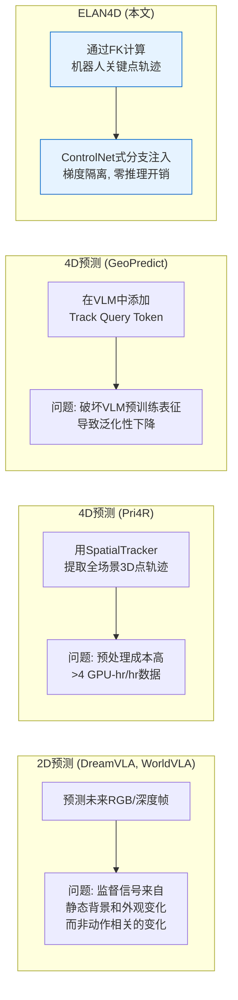

具体来说:

**2D预测 (WorldVLA, DreamVLA)** 预测未来RGB帧或深度图. 这些信号易于获取, 但固有地与**外观级别线索**绑定. 大量监督梯度流来自静态背景纹理或光照变化, 而非与操作相关的几何运动([Fei et al., 2025](https://arxiv.org/abs/2504.00956); [Chen et al., 2025](https://arxiv.org/abs/2409.18585)).

**Pri4R** ([Kim et al., 2026](https://arxiv.org/abs/2603.01549)) 使用SpatialTrackerV2提取全场景3D点轨迹(包括机器人+物体), 作为VLM backbone的辅助监督. 4D点轨迹信号本身非常强(LIBERO-Long +9.8%), 但处理管线成本极高: 需要对每帧视频运行SAM分割 + SpatialTracker追踪, 处理1小时数据约需4 GPU小时. 此外, Pri4R让4D损失梯度直接流经VLM backbone, 虽然在实验中有效, 但缺乏对VLM表征保护的显式机制.

**GeoPredict** ([Qian et al., 2025](https://arxiv.org/abs/2512.16811)) 在VLM的输入序列中添加learnable track query token, 让VLM自身承担3D轨迹预测任务. 这种设计将低级运动预测与高级视觉语言理解耦合在同一个transformer中, 导致VLM预训练表征被扰动(CKA分析表明显著的表征漂移), 在需要强泛化的OOD场景下反而降低性能(-6.8% on LIBERO-Plus).

### 2.3 三大设计原则的提出

基于上述分析, ELAN4D总结了实用4D监督的三大设计原则:

1. **紧凑且易获取**: 在桌面操作场景中, 场景大部分是静态的, 最可靠且密集的运动信号来自机器人本体. 通过正向运动学 $\mathrm{FK}(\mathbf{q}_t)$ 从本体感受状态直接计算, 成本约1 CPU分钟/小时数据.

2. **注入时不破坏VLM**: 使用轻量辅助路径并配合梯度隔离(stop-gradient), 确保4D监督信号仅影响动作生成路径, 不扰动预训练视觉-语言表征.

3. **仅训练时使用**: 推理时丢弃Track Decoder, 策略的输入输出接口与基线VLA完全一致, 零额外开销.

---

## 3. 方法深度解析

### 3.1 问题形式化

**VLA策略的输入输出**:

在每个时间步 $t$, 策略接收:
- **语言指令** $\mathbf{L}$: 描述任务的自然语言
- **多视角图像** $\mathbf{I}_t$: 当前时刻的相机观测
- **本体感受状态** $\mathbf{q}_t$: 机器人关节角度/位置

并输出**动作块 (action chunk)**:

$$\mathbf{A}_t = [\mathbf{a}_t, \mathbf{a}_{t+1}, \dots, \mathbf{a}_{t+H-1}]$$

其中 $H$ 为动作预测时间窗口(horizon). 每个动作 $\mathbf{a}_t \in \mathbb{R}^7$ 为7自由度末端执行器命令:

$$\mathbf{a}_t = [\Delta \mathbf{x}_t, \Delta \boldsymbol{\theta}_t, g_t]$$

- $\Delta \mathbf{x}_t \in \mathbb{R}^3$: 平移偏移量(x, y, z方向的位移)
- $\Delta \boldsymbol{\theta}_t \in \mathbb{R}^3$: 旋转偏移量(绕三个轴的旋转)
- $g_t \in \mathbb{R}$: 夹爪开合状态

**基础模型**: ELAN4D构建于OpenPI系列 ($\pi_0$ 和 $\pi_{0.5}$) 之上, 它们使用PaliGemma VLM backbone + action expert, 通过条件流匹配(conditional flow matching)预测连续动作块.

### 3.2 以机器人本体为中心的4D监督信号

这是ELAN4D最核心的创新之一: 用机器人自身的运动学信息构造监督信号, 而非依赖外部追踪器.

#### 3.2.1 轨迹构造 (Track Construction)

对于每条示教轨迹, 在每个控制步获取本体感受状态 $\mathbf{q}_t$. 设 $\mathcal{K} = \{1, \dots, K\}$ 为选定的机器人关键点集合(包括主要关节和末端执行器).

**正向运动学映射**: 利用已知的机器人运动学链(参见 [Craig, 2009](https://www.pearson.com/en-us/subject-catalog/p/introduction-to-robotics/P200000003540)), 将每个关键点 $k$ 映射到其在机器人基座坐标系下的笛卡尔位置:

$$\mathbf{p}_{t}^{k} = \mathrm{FK}_{k}(\mathbf{q}_{t}) \in \mathbb{R}^{3}$$

其中:
- $\mathrm{FK}_k(\cdot)$ 是第 $k$ 个关键点的正向运动学函数, 根据关节角度计算该关键点在3D空间中的位置
- $\mathbf{q}_t$ 是时刻 $t$ 的关节状态向量(关节角度)

记时刻 $\tau$ 的完整关键点集为:

$$\mathbf{P}_{\tau} = [\mathbf{p}_{\tau}^{1}, \dots, \mathbf{p}_{\tau}^{K}] \in \mathbb{R}^{K \times 3}$$

**关键优势**: 这个信号是:
- **无遮挡**: 不受相机视角或物体遮挡影响, 因为直接从关节角度计算
- **极低成本**: 处理1小时数据仅需约1 CPU分钟(vs. SpatialTracker的>4 GPU小时)
- **精确且无噪声**(在仿真中): 关节角度是精确测量的, 不存在追踪误差

> **直觉理解**: 想象你闭着眼睛伸手去拿桌上的杯子 -- 你知道自己手臂每个关节在哪里(本体感受), 不需要用眼睛(相机)去追踪. 正向运动学就是根据关节角度计算出每个关节和手的空间位置的数学函数.

#### 3.2.2 未来位移目标 (Future Displacement Target)

在时间步 $t$, 4D监督目标定义为**机器人关键点在动作时间窗口内的未来位移轨迹**:

$$\Delta \mathbf{P}_{t+h} = \mathbf{P}_{t+h} - \mathbf{P}_{t}, \quad h = 1, \dots, H$$

其中 $\Delta \mathbf{P}_{t+h} \in \mathbb{R}^{K \times 3}$ 表示从当前时刻 $t$ 到未来时刻 $t+h$, 所有 $K$ 个关键点的3D位移.

将所有时间步的位移收集为:

$$\mathbf{Y}_{t} = \left[\Delta \mathbf{P}_{t+1}, \Delta \mathbf{P}_{t+2}, \dots, \Delta \mathbf{P}_{t+H}\right] \in \mathbb{R}^{H \times K \times 3} \quad \text{(公式1)}$$

其中:
- $H$: 动作预测时间窗口长度 (horizon)
- $K$: 关键点数量 (LIBERO: 8 = 7关节+1末端, RoboTwin: 14 = 6+6关节+1+1末端, 真实世界: 7)
- $3$: 3D笛卡尔坐标 (x, y, z)

**为什么用位移而非绝对位置**: 使用相对于当前位置的位移 $\Delta \mathbf{P}$ 而非绝对位置 $\mathbf{P}$, 使得监督信号描述的是"机器人将要怎么动", 而不是"机器人在哪里". 这与动作空间 $\Delta \mathbf{x}_t$ (也是位移) 天然对齐, 且对初始构型具有更好的泛化性.

**成本对比**:

| 方法 | 信号来源 | 处理1小时数据所需时间 | 硬件需求 |
|---|---|---|---|
| ELAN4D (Robot Keypoints) | 正向运动学 FK($\mathbf{q}_t$) | ~1 CPU分钟 | CPU |
| Pri4R (Whole-scene Tracks) | SAM + SpatialTrackerV2 | ~4 GPU小时 | GPU |
| GeoPredict (Keypoint Trajectories) | Track Encoder + 3DGS | 需GPU处理 | GPU |

### 3.3 ControlNet式Action分支

#### 3.3.1 设计动机

将4D预测任务直接注入VLM会扰动预训练表征(GeoPredict的教训). ELAN4D的核心设计是: **将辅助监督限制在动作生成路径中, 通过可训练的残差分支附加到action expert上, 而非VLM backbone**.

这一设计借鉴了ControlNet ([Zhang et al., 2023](https://arxiv.org/abs/2302.05543)) 的思想: 在冻结的主干网络旁添加一个可训练的控制分支, 通过零初始化的投影层融合, 既能注入新的控制信号, 又能保留主干的预训练能力.

#### 3.3.2 残差控制分支 (Residual Control Branch)

设 $\mathbf{u}_t$ 为action expert从语言、图像和本体感受输入中产生的特征. ELAN4D添加一个ControlNet式分支, 并通过零初始化投影与主特征融合:

$$\widetilde{\mathbf{u}}_t = \mathbf{u}_t + \mathrm{Proj}(\mathbf{C}_t), \qquad \mathbf{C}_t = b_{\psi}(\mathrm{sg}(\mathbf{u}_t)) \quad \text{(公式2)}$$

各符号含义:
- $\mathbf{u}_t$: action expert的原始输出特征
- $b_{\psi}$: 可训练的控制分支(参数为 $\psi$), 与action expert结构相同(attention + FFN)
- $\mathrm{sg}(\cdot)$: **stop-gradient操作** -- 阻止梯度从控制分支反向传播回主干
- $\mathbf{C}_t$: 控制分支的输出token特征
- $\mathrm{Proj}(\cdot)$: **零初始化的线性投影** -- 训练初期, $\mathrm{Proj}$ 的权重全为零, 因此 $\mathrm{Proj}(\mathbf{C}_t) = \mathbf{0}$, 控制分支不贡献任何残差信号
- $\widetilde{\mathbf{u}}_t$: 融合后的增强特征

**两个关键机制的作用**:

1. **Stop-gradient ($\mathrm{sg}$)**: 防止4D辅助目标 $\mathcal{L}_\text{track}$ 的梯度回传到VLM backbone和原始action expert. 这确保预训练视觉-语言表征不被4D预测任务破坏.

2. **零初始化 (Zero-init)**: 训练开始时, 控制分支的贡献为零($\mathrm{Proj}$ 权重为0), 因此模型初始行为与基线VLA完全一致. 随着训练进行, 控制分支逐渐学习到有用的4D感知特征并通过投影层贡献给主路径. 这种"从零开始, 逐步注入"的方式保证了训练的稳定性.

> **直觉理解**: 想象一个经验丰富的厨师(VLM + action expert)在做菜, 旁边站了一个助手(control branch). 助手观察厨师的操作(stop-gradient: 助手不会干扰厨师的工作方式), 然后悄悄地提供辅助建议(零初始化: 一开始助手什么都不说, 随着助手学会了, 才逐渐提出有价值的建议). 厨师综合自己的判断和助手的建议来做菜(残差融合).

#### 3.3.3 Track Decoder (轨迹解码器)

Track Decoder是一个轻量的点条件解码器, 负责从控制分支特征预测未来4D位移. 它的结构是:

$$\hat{\mathbf{Y}}_t = \mathrm{MLP}_{\text{fusion}}\!\left(\mathrm{MLP}_{\text{ctrl}}(\mathbf{C}_t) \oplus \mathrm{MLP}_{\text{point}}(\mathbf{P}_t)\right) \in \mathbb{R}^{H \times K \times 3} \quad \text{(公式3)}$$

**详细的数据流**:

```
步骤1: Point MLP 编码当前关键点位置
   输入: P_t ∈ R^{K×3}  (K个关键点的当前3D坐标)
   输出: e_point ∈ R^{K×d_p}  (每个关键点的特征向量)

步骤2: Control MLP 编码控制分支特征
   输入: C_t ∈ R^{H×d}  (H个时间步的控制特征)
   输出: e_ctrl ∈ R^{H×d_c}  (每个时间步的控制特征)

步骤3: 广播 + 拼接
   广播e_ctrl到 R^{H×K×d_c}: 每个时间步的控制特征复制K次(对应K个关键点)
   广播e_point到 R^{H×K×d_p}: 每个关键点的特征复制H次(对应H个时间步)
   拼接: f ∈ R^{H×K×(d_c+d_p)}

步骤4: Fusion MLP (带残差块)
   输入: f ∈ R^{H×K×(d_c+d_p)}
   输出: Ŷ_t ∈ R^{H×K×3}  (预测的未来位移)
```

**设计逻辑**: 通过将控制特征(编码了"接下来要做什么动作")和关键点特征(编码了"当前机器人在哪里")交叉条件化, Track Decoder被训练来预测"从当前位置出发, 执行这些动作后, 机器人的各关键点会移动到哪里". 这迫使控制分支 $\mathbf{C}_t$ 学习到与未来机器人运动一致的动态特征.

### 3.4 训练与推理

#### 3.4.1 Track Prediction Loss (轨迹预测损失)

$$\mathcal{L}_{\text{track}} = \frac{1}{HK} \sum_{h=1}^{H} \sum_{k=1}^{K} \left\| \widehat{\Delta \mathbf{p}}_{t+h}^{k} - \Delta \mathbf{p}_{t+h}^{k} \right\|_1 \quad \text{(公式4)}$$

各符号:
- $\widehat{\Delta \mathbf{p}}_{t+h}^{k} \in \mathbb{R}^3$: 预测的第 $k$ 个关键点在时间步 $t+h$ 相对于 $t$ 的3D位移
- $\Delta \mathbf{p}_{t+h}^{k} \in \mathbb{R}^3$: 对应的真值位移
- $\|\cdot\|_1$: L1范数 (曼哈顿距离), 选择L1而非L2是为了对偶尔出现的噪声状态估计更鲁棒(L1对异常值的惩罚更小)
- $\frac{1}{HK}$: 对所有时间步和关键点取平均

#### 3.4.2 总训练目标

$$\mathcal{L} = \mathcal{L}_{\text{act}} + \lambda_{\text{track}} \cdot \mathcal{L}_{\text{track}}$$

- $\mathcal{L}_{\text{act}}$: 原始动作目标 (conditional flow matching loss, 来自 $\pi$ 系列基础模型)
- $\lambda_{\text{track}} = 0.1$: 平衡系数

**关键: 两个损失作用于不同的参数子集**:

| 损失 | 更新的参数 | 不更新的参数 |
|---|---|---|
| $\mathcal{L}_{\text{act}}$ | 主action pathway + 控制分支 | VLM backbone (冻结/LoRA) |
| $\mathcal{L}_{\text{track}}$ | 控制分支 + Track Decoder | VLM backbone, 原始action expert |

stop-gradient操作在控制分支输入处阻断 $\mathcal{L}_{\text{track}}$ 的梯度, 使其无法传播到VLM backbone和原始action branch.

#### 3.4.3 推理路径

推理时, Track Decoder被完全丢弃. 策略接收与基线VLA完全相同的输入(语言、图像、本体感受), 输出相同格式的动作块. 唯一的变化是action expert中保留了学习到的残差控制分支, 这个分支在训练中通过4D监督学会了有用的运动感知特征, 并在推理时通过残差连接贡献给动作预测.

---

## 4. 静态架构与动态架构分析

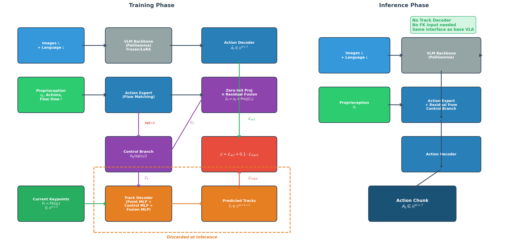

### 4.1 静态架构: 组件关系图

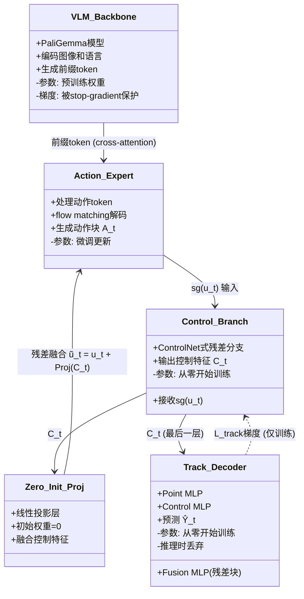

**组件职责总结**:

| 组件 | 职责 | 训练时 | 推理时 |
|---|---|---|---|
| VLM Backbone | 编码视觉和语言信息为token表征 | 前向传播, 梯度被隔离 | 正常使用 |
| Action Expert | 基于flow matching预测动作块 | 接收 $\mathcal{L}_\text{act}$ 梯度 | 正常使用 |
| Control Branch | 从action特征中提取4D感知表征 | 接收 $\mathcal{L}_\text{act}$ + $\mathcal{L}_\text{track}$ 梯度 | 保留(提供残差) |
| Zero-Init Proj | 零初始化投影, 融合控制信号 | 参数逐渐学习 | 保留 |
| Track Decoder | 预测未来关键点位移 | 提供 $\mathcal{L}_\text{track}$ | **丢弃** |

### 4.2 训练阶段数据流

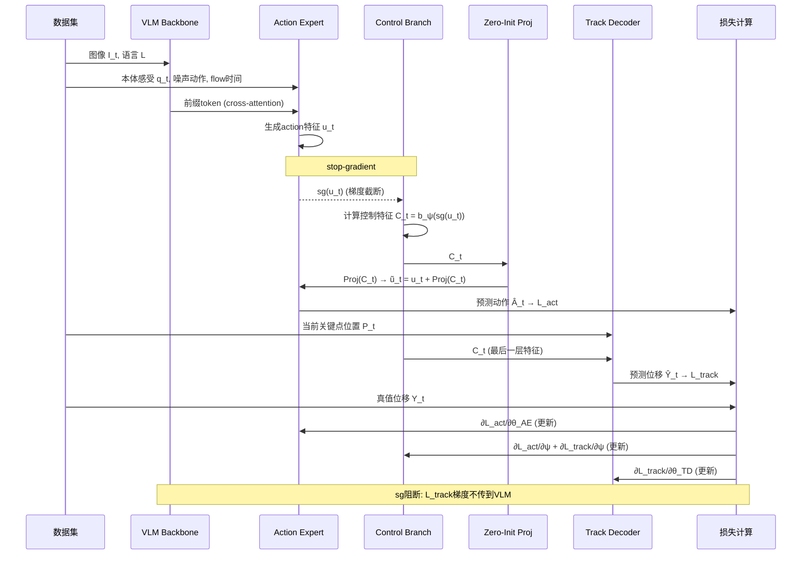

### 4.3 梯度流分析

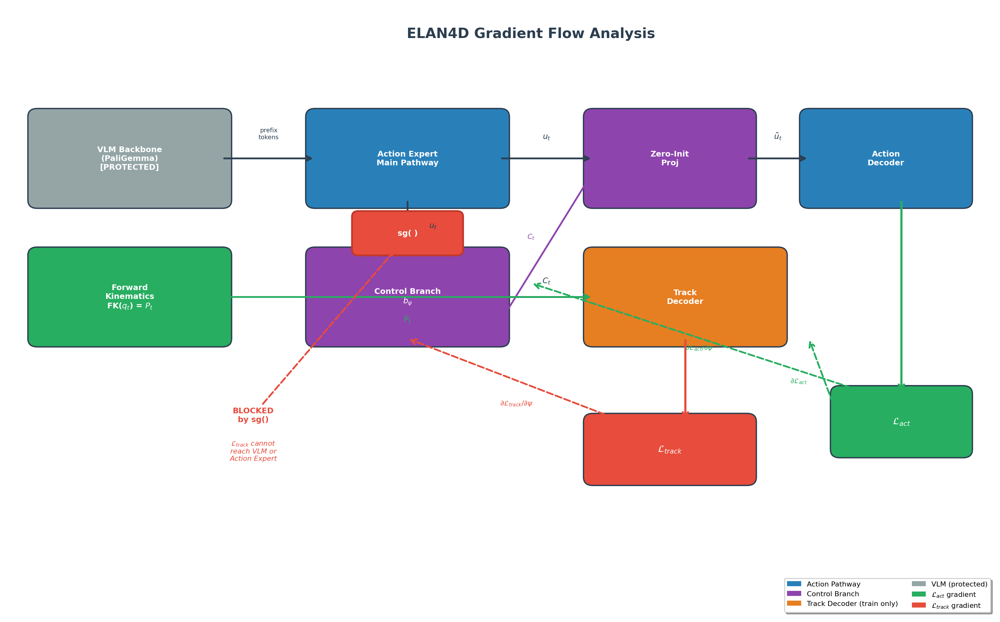

这是ELAN4D设计中最精妙的部分. 让我们详细追踪梯度如何在各组件间流动:

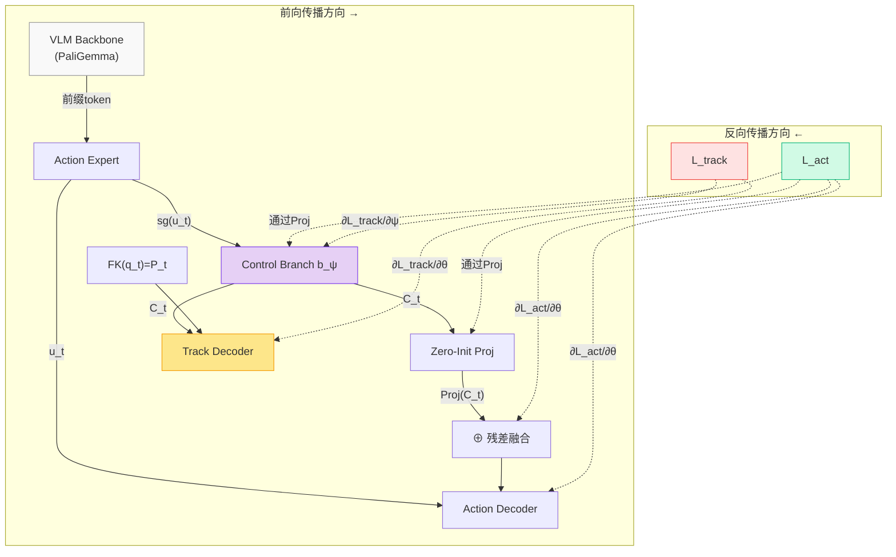

**梯度流细节**:

| 梯度来源 | → VLM | → Action Expert | → Control Branch | → Track Decoder |
|---|---|---|---|---|
| $\mathcal{L}_\text{act}$ | 有限 (取决于基线微调策略) | 完全更新 | 通过 $\mathrm{Proj}$ 更新 | 无 |
| $\mathcal{L}_\text{track}$ | **阻断** ($\mathrm{sg}$) | **阻断** ($\mathrm{sg}$) | 完全更新 | 完全更新 |

关键梯度路径:
1. $\mathcal{L}_\text{act} \to$ Action Decoder $\to$ $\widetilde{\mathbf{u}}_t$ $\to$ $\mathbf{u}_t$ (更新Action Expert)
2. $\mathcal{L}_\text{act} \to$ Action Decoder $\to$ $\widetilde{\mathbf{u}}_t$ $\to$ $\mathrm{Proj}(\mathbf{C}_t)$ $\to$ $\mathbf{C}_t$ (更新Control Branch)
3. $\mathcal{L}_\text{track} \to$ Track Decoder $\to$ $\mathbf{C}_t$ (更新Control Branch)
4. $\mathcal{L}_\text{track} \to$ Track Decoder (更新Track Decoder自身)
5. $\mathcal{L}_\text{track} \not\to$ $\mathrm{sg}(\mathbf{u}_t)$ $\not\to$ Action Expert / VLM (**被阻断**)

这种设计使得Control Branch同时受到两个信号的监督: 通过 $\mathcal{L}_\text{act}$ 学习对动作预测有用的特征, 通过 $\mathcal{L}_\text{track}$ 学习4D运动感知特征. 这两种信号的交汇使得Control Branch成为连接"运动预测"和"动作生成"的桥梁.

### 4.4 推理阶段数据流

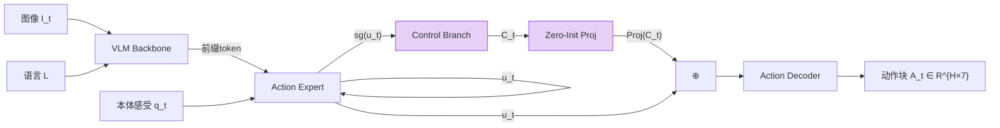

推理时的变化:
- **Track Decoder**: 完全移除, 不计算任何关键点位移
- **Control Branch**: 保留, 继续提供4D感知的残差特征
- **输入**: 与基线VLA完全一致 (不需要关键点位置 $\mathbf{P}_t$)
- **输出**: 与基线VLA完全一致 (标准7-DoF动作块)

---

## 5. 纵向分析: 预测性监督的演进

### 5.1 从反应式到预测式: VLA策略中辅助监督的演进谱系

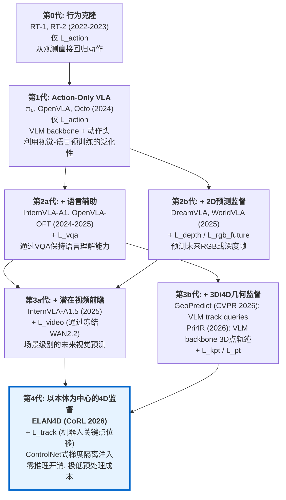

### 5.2 各代方法的信号类型与信息层次

| 演进阶段 | 代表方法 | 监督信号 | 信息空间 | 时间密度 | 对VLM的影响 |
|---|---|---|---|---|---|
| 仅动作 | $\pi_0$, OpenVLA | $\mathcal{L}_\text{act}$ | 动作空间 ($\mathbb{R}^7$) | 单步 | 无 |
| + VQA | InternVLA-A1 | + $\mathcal{L}_\text{vqa}$ | 语言空间 | 不适用 | 正向保持 |
| + 2D预测 | DreamVLA | + $\mathcal{L}_\text{depth}$ | 2D图像空间 | 单帧 | 耦合 |
| + 潜在视频 | InternVLA-A1.5 | + $\mathcal{L}_\text{video}$ | 视频潜在空间 | 多帧 | 通过foresight token隔离 |
| + 4D几何 (Pri4R) | Pri4R | + $\mathcal{L}_\text{pt}$ | 度量3D空间 | 每步 | 直接流经VLM |
| + 4D几何 (GeoPredict) | GeoPredict | + $\mathcal{L}_\text{kpt}$ + $\mathcal{L}_\text{depth}$ | 度量3D空间 | 每步 | VLM track query (破坏) |
| + 本体4D | **ELAN4D** | + $\mathcal{L}_\text{track}$ | 度量3D空间 | 每步 | ControlNet隔离 (保护) |

### 5.3 演进中的关键教训

1. **从2D到3D/4D**: 2D预测(RGB帧/深度)的监督信号大量来自静态背景和外观变化, 而非操作相关的几何运动. 3D点轨迹(4D信号)直接在度量空间中描述运动, 提供更聚焦和动作相关的监督.

2. **从全场景到以本体为中心**: 全场景3D点追踪(Pri4R)虽然信号最丰富, 但成本极高且大量信号来自静态背景. ELAN4D的消融实验表明, 在使用模拟器GT物体关键点的特权设置下, 全场景追踪仅比机器人关键点高1.1% (79.3% vs 78.2%), 但成本差异达**240倍**(4 GPU-hr vs 1 CPU-min).

3. **从耦合注入到梯度隔离**: GeoPredict的VLM track query方案导致CKA显著下降, LIBERO-Plus降低6.8%. 这证明了辅助4D监督应该通过隔离路径注入, 而非让VLM backbone承担额外的低级预测任务.

---

## 6. 横向分析: 同类方法对比

### 6.1 ELAN4D vs Pri4R

| 维度 | ELAN4D | Pri4R |
|---|---|---|
| **4D信号来源** | 正向运动学 FK($\mathbf{q}_t$) | SpatialTrackerV2 |
| **追踪的点** | 仅机器人关节+末端 (K=7~14) | 机器人+场景表面点 (N_p~1024) |
| **预处理成本** | ~1 CPU-min/hr数据 | ~4 GPU-hr/hr数据 |
| **注入位置** | ControlNet式action branch | VLM backbone (共享表征空间) |
| **梯度隔离** | 显式 stop-gradient | 无显式隔离 (梯度流经VLM) |
| **VLM表征保护** | 是 (CKA分析证实) | 无显式保护 |
| **base model** | $\pi_0$, $\pi_{0.5}$ | OpenVLA-OFT, $\pi_{0.5}$ |
| **LIBERO Overall** | 97.0% ($\pi_{0.5}$) | 96.3% (OpenVLA-OFT) |
| **推理开销** | 零 | 零 |

**分析**: ELAN4D与Pri4R的最大差异在于**信号来源**和**注入方式**. Pri4R追踪全场景1024个3D点(机器人+物体表面), 提供了更丰富的世界动态信息, 但代价是240倍的预处理成本. ELAN4D选择仅追踪机器人关键点, 信号虽然更稀疏但足够有效(消融实验: 79.3% vs 78.2%, 仅差1.1%). 在VLM保护方面, ELAN4D的stop-gradient设计优于Pri4R的直接梯度传播, 尤其在OOD泛化场景下(ELAN4D在LIBERO-Plus上表现更突出).

### 6.2 ELAN4D vs GeoPredict

| 维度 | ELAN4D | GeoPredict |
|---|---|---|
| **4D信号类型** | 机器人关键点位移 $\Delta \mathbf{P}$ | 关键点轨迹 + 3D高斯几何 + 深度 |
| **信号构造方式** | FK(本体感受) | Track Encoder + 3D Gaussian Splatting |
| **注入位置** | ControlNet式action branch | VLM (learnable track query tokens) |
| **对VLM的影响** | 保护 (CKA接近基线) | 破坏 (CKA显著下降) |
| **LIBERO-Plus** | 78.2% ($\pi_{0.5}$) | 未报告 |
| **LIBERO Overall** | 97.0% ($\pi_{0.5}$) | 96.6% ($\pi_{0.5}$) |
| **推理额外开销** | 零 | 需要额外track query tokens |

**分析**: GeoPredict的监督信号更为丰富(不仅预测轨迹, 还通过3D Gaussian Splatting预测深度和几何), 但这些额外信号需要通过VLM的track query token预测, 导致VLM预训练表征被显著扰动. ELAN4D论文中的CKA分析(Figure 5b)直观展示了这一点: 在VLM track query方案下, 层级CKA相似度显著低于控制分支方案, 表明VLM的内部表征发生了大幅漂移. 

此外, GeoPredict的一位共同作者(Jingjing Qian, CUHK-SZ)也是ELAN4D的作者, 这表明ELAN4D是GeoPredict团队反思VLM track query方案的局限后提出的改进方向.

### 6.3 ELAN4D vs InternVLA-A1.5

| 维度 | ELAN4D | InternVLA-A1.5 |
|---|---|---|
| **辅助监督类型** | 机器人关键点4D位移 | 潜在视频前瞻 (frozen WAN2.2-5B) |
| **预测的信息** | 机器人将要怎么动 (运动学) | 场景将来看起来像什么 (视觉) |
| **信息空间** | 度量3D ($\mathbb{R}^{H \times K \times 3}$) | 视频潜在空间 ($\mathbb{R}^{C \times T' \times H' \times W'}$) |
| **注入方式** | ControlNet式action branch | Foresight tokens in action expert |
| **VLM保护** | stop-gradient | 梯度不流回VLM (WAN2.2冻结) |
| **推理开销** | 零 (Track Decoder丢弃) | 零 (WAN2.2不加载) |
| **backbone** | PaliGemma ($\pi$ 系列) | Qwen3.5-2B VLM |
| **优势场景** | OOD空间/视觉扰动 | 组合泛化, VQA保持 |

**互补性分析**: ELAN4D的机器人关键点轨迹和InternVLA-A1.5的视频前瞻是**正交互补**的:

- **InternVLA-A1.5的视频前瞻** 捕获场景级别的视觉动态("场景未来看起来像什么"), 擅长处理外观变化和视觉推理, 但不直接编码度量3D运动.
- **ELAN4D的关键点轨迹** 捕获机器人级别的运动学动态("机器人将要怎么动"), 提供精确的3D空间推理, 但不包含场景外观信息.

两者的弱点不重叠, 理论上可以组合使用(参见 [第10节](#10-与internvla-a15的关联讨论)).

### 6.4 四种方法综合对比

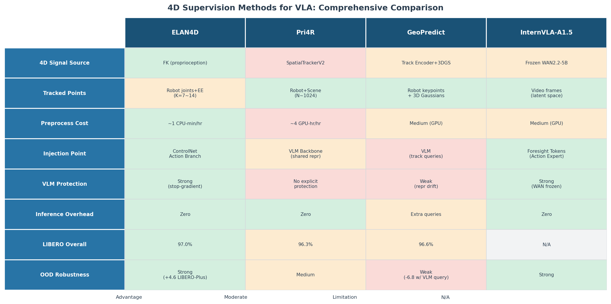

| 评估维度 | ELAN4D | Pri4R | GeoPredict | InternVLA-A1.5 |
|---|---|---|---|---|
| **预处理成本** | 极低 (~1 CPU-min) | 极高 (~4 GPU-hr) | 中等 | 中等 (需WAN编码) |
| **VLM保护** | 强 (stop-gradient) | 无显式保护 | 弱 (表征漂移) | 强 (WAN冻结) |
| **监督信号丰富度** | 中 (仅机器人运动) | 高 (机器人+场景) | 高 (轨迹+3D几何) | 高 (视频级场景) |
| **推理开销** | 零 | 零 | 有 (额外query) | 零 |
| **实现复杂度** | 低 | 高 (需SpatialTracker) | 高 (需3DGS) | 高 (需WAN2.2) |
| **OOD泛化** | 强 | 中 | 弱 (表征漂移) | 强 |
| **适用场景** | 通用操作, 尤其OOD | 精密操作, 接触推理 | 几何密集任务 | 长程规划, 组合泛化 |

---

## 7. 实验分析

### 7.1 Benchmark概览

ELAN4D在四个评估环境上进行了实验:

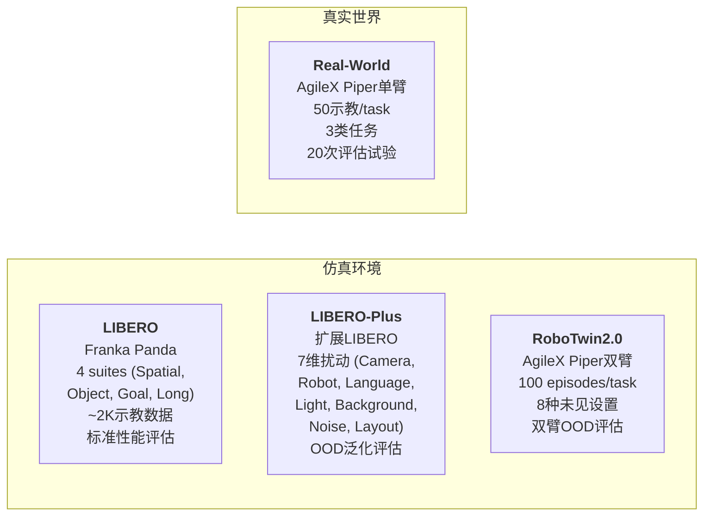

### 7.2 主要结果分析

#### 7.2.1 LIBERO (近饱和基准)

| 方法 | Spatial | Object | Goal | Long | Overall |
|---|---|---|---|---|---|
| $\pi_0$ | 96.8 | 98.8 | 95.8 | 85.2 | 94.2 |
| $\pi_{0.5}$ | **98.8** | 98.2 | 98.0 | 92.4 | 96.9 |
| Pri4R | 93.2 | 98.6 | **98.1** | **95.3** | 96.3 |
| GeoPredict | 98.0 | 98.2 | 95.7 | 94.0 | 96.6 |
| ELAN4D($\pi_0$) | 96.4 | 98.2 | 93.4 | 91.8 | 95.0 |
| **ELAN4D($\pi_{0.5}$)** | 98.2 | **98.8** | 96.8 | 94.2 | **97.0** |

*数据来源: ELAN4D论文 Table 2*

**分析**: LIBERO已近饱和(多种方法>96%), 但ELAN4D仍取得了最佳整体成绩:
- ELAN4D($\pi_0$): 94.2% → 95.0% (+0.8), **LIBERO-Long提升最大 (+6.6)**, 说明4D监督在需要时序一致性的长程任务上最有价值.
- ELAN4D($\pi_{0.5}$): 97.0%, 超过Pri4R (96.3%) 和 GeoPredict (96.6%), 以更低的预处理成本取得更好的结果.

#### 7.2.2 LIBERO-Plus (OOD鲁棒性基准)

这是ELAN4D最突出的实验结果, 也是其核心价值所在:

| 方法 | Camera | Robot | Lang | Light | BG | Noise | Layout | Spatial | Object | Goal | Long | **Overall** |
|---|---|---|---|---|---|---|---|---|---|---|---|---|
| $\pi_0$ | 13.8 | 6.0 | 58.8 | 85.0 | 81.4 | 79.0 | 68.8 | 60.7 | 61.4 | 44.9 | 48.4 | 53.6 |
| $\pi_{0.5}$ | 59.7 | 65.5 | 75.3 | 87.0 | 82.4 | 72.1 | 80.3 | 79.9 | 87.8 | 69.0 | 64.9 | 73.6 |
| GuidedVLA | **73.7** | 51.4 | 62.6 | **94.6** | 89.0 | **85.2** | 79.9 | 84.0 | 80.9 | 70.8 | 66.2 | 75.4 |
| ELAN4D($\pi_0$) | 61.8 | 38.4 | 60.6 | 89.1 | 84.1 | 77.8 | 72.1 | 78.8 | 74.0 | 62.6 | 55.9 | 67.6 |
| **ELAN4D($\pi_{0.5}$)** | 63.7 | **70.7** | 77.8 | 89.8 | 91.4 | 79.9 | **81.4** | **86.8** | 84.5 | **71.5** | **70.3** | **78.2** |

*数据来源: ELAN4D论文 Table 1*

**关键发现**:

1. **$\pi_0$ baseline上的巨大提升**: 53.6% → 67.6% (**+14.0**). 这表明对于较弱的基线模型, 4D监督带来的表征增强效果更为显著.

2. **$\pi_{0.5}$ baseline上的稳定提升**: 73.6% → 78.2% (**+4.6**), 取得所有方法中的最佳整体成绩.

3. **各维度扰动下的提升分析**:

| 扰动维度 | $\pi_{0.5}$ | ELAN4D($\pi_{0.5}$) | 提升 | 分析 |
|---|---|---|---|---|
| Camera | 59.7 | 63.7 | +4.0 | 4D位移是相机无关的(在机器人基座坐标系下) |
| Robot init | 65.5 | 70.7 | +5.2 | 位移目标对初始构型泛化 |
| Background | 82.4 | 91.4 | **+9.0** | 4D信号不含背景信息, 不受背景变化影响 |
| Layout | 80.3 | 81.4 | +1.1 | 物体布局变化对机器人运动学影响有限 |
| Noise | 72.1 | 79.9 | +7.8 | 运动学信号对观测噪声鲁棒 |
| Long | 64.9 | 70.3 | +5.4 | 4D轨迹提供时序一致性约束 |

最大的提升出现在**Background (+9.0)** 和 **Noise (+7.8)** 扰动上, 这完美印证了ELAN4D的设计动机: 以机器人本体为中心的4D信号天然不受视觉外观变化(背景、噪声)的影响, 因此学到的表征对这些扰动更鲁棒.

#### 7.2.3 RoboTwin2.0 (双臂OOD)

| 基础模型 | 基线 | + ELAN4D | 提升 |
|---|---|---|---|
| $\pi_0$ | 12% | 15% | +3% |
| $\pi_{0.5}$ | 32% | 37% | +5% |

**代表性任务**:
- Dump Bin: 37% → 49% (+12%)
- Lift Pot: 5% → 15% (+10%)

这些需要精确空间理解的双臂任务上改进最为明显, 进一步验证了4D监督对空间推理的增强作用.

#### 7.2.4 真实世界实验

| 任务 | $\pi_{0.5}$ | ELAN4D($\pi_{0.5}$) | 提升 | 测试的能力 |
|---|---|---|---|---|
| Visual Robustness (拾取水果+干扰物) | 50% | 80% | **+30%** | 对未见视觉干扰物的鲁棒性 |
| Spatial Generalization (堆叠杯子) | 15% | 65% | **+50%** | 对未见目标位置的空间泛化 |
| Temporal Reasoning (两阶段装配) | 5% | 45% | **+40%** | 减少长程操作中的误差累积 |

*每个任务: 50条示教轨迹训练, 20次试验评估*

**分析**: 真实世界的提升远超仿真环境, 尤其是:
- **空间泛化**: 从15%到65% (+50%), 说明4D运动学监督帮助策略学到了与位置无关的操作技能, 而非记忆特定的视觉-空间模式.
- **时序推理**: 从5%到45% (+40%), 说明多步任务中, 4D轨迹提供的时序一致性约束有效减少了误差在步骤间的累积.

### 7.3 消融实验深入分析

#### 7.3.1 4D监督 vs 额外参数

| 变体 | 成功率 | 与基线差 |
|---|---|---|
| Base VLA $\pi_{0.5}$ | 73.6% | -- |
| + Control branch (**无** 4D监督) | 73.3% | -0.3% |
| + Control branch (**有** 4D监督, ELAN4D) | 78.2% | **+4.6%** |

*数据来源: ELAN4D论文 Figure 5(a)*

**结论**: 仅添加控制分支(增加了参数)但不提供4D监督信号, 性能几乎不变甚至略降. ELAN4D的增益完全来自**4D监督信号本身**, 而非额外的模型容量. 这是一个干净的消融, 排除了"更多参数→更好性能"的简单解释.

#### 7.3.2 在哪里预测4D: Control Branch vs VLM Track Queries

| 预测位置 | 成功率 | 与基线差 |
|---|---|---|
| VLM + track queries (类GeoPredict) | 66.8% | **-6.8%** |
| Control branch (ELAN4D) | 78.2% | **+4.6%** |

**差异: 11.4个百分点**.

VLM track query方案不仅没有改善, 反而**严重损害**了性能. ELAN4D的CKA分析(Figure 5b)提供了解释:

**CKA (Centered Kernel Alignment) 分析**: CKA衡量两个表征空间的相似度. 论文比较了三种模型VLM各层的CKA相似度:
- **基线**: LIBERO微调后的 $\pi_{0.5}$ VLM (参考)
- **VLM track queries**: CKA显著降低, 表明VLM内部表征发生了大幅漂移
- **ELAN4D control branch**: CKA接近基线, 表明VLM表征被良好保护

> **解释**: 让VLM预测低级运动轨迹(一个与语言/视觉理解无关的任务), 迫使VLM的transformer层同时编码高级语义(如理解"把杯子放到盘子里")和低级运动学(如预测关节位移). 这两种信号的混合污染了VLM的预训练表征, 损害了其在OOD场景下的泛化能力.

#### 7.3.3 追踪什么: 全场景 vs 仅机器人关键点

| 追踪对象 | 成功率 | 与基线差 | 预处理成本/hr数据 |
|---|---|---|---|
| 全场景 (机器人+物体GT关键点) | 79.3% | +5.7% | ~4 GPU-hr |
| 仅机器人关键点 (ELAN4D) | 78.2% | +4.6% | ~1 CPU-min |

**差异仅1.1%, 但成本差异约240倍**.

这个消融实验的设计特别精巧: 全场景追踪使用了**仿真器的Ground Truth物体关键点**, 完全排除了追踪器误差的影响. 即使在这种特权设置下, 全场景追踪也仅比机器人关键点高1.1%. 这强有力地支持了ELAN4D的核心论点: **在大多数操作场景中, 机器人自身的运动学信号已经捕获了任务成功所需的绝大部分4D信息**.

> **直觉理解**: 在桌面操作中, 场景大部分是静态的(桌子、背景不动), 只有机器人和被操作的少数物体在运动. 而物体的运动与机器人的运动高度相关(物体是被机器人推/抓/放的). 因此, 仅监督机器人的运动已经隐含了大部分操作相关的动态信息.

#### 7.3.4 数据效率分析

ELAN4D论文(Figure 5c)展示了在不同数据量下的性能:

| 数据比例 | $\pi_{0.5}$ | ELAN4D | 差距 |
|---|---|---|---|
| 20% | ~65% | ~75% | **~10%** |
| 40% | ~72% | ~80% | ~8% |
| 60% | ~80% | ~85% | ~5% |
| 80% | ~86% | ~90% | ~4% |
| 100% | 96.9% | 97.0% | 0.1% |

*注: 20%-80%数据来自Figure 5(c)的视觉估读, 精确数字为: 20%数据时ELAN4D达到75.0%*

**关键发现**: 
- 数据越少, ELAN4D的优势越大. 在20%数据下, ELAN4D比 $\pi_{0.5}$ 高约10%, 其性能相当于 $\pi_{0.5}$ 用1.5倍数据训练的效果.
- 这表明4D监督信号提供了一种**数据高效的归纳偏置**: 即使在有限数据下, 模型也能学到更有泛化性的表征.

---

## 8. 关键设计决策与理论分析

### 8.1 为什么Stop-Gradient是必要的

**问题**: 如果让 $\mathcal{L}_\text{track}$ 的梯度自由流过VLM backbone, 会发生什么?

**GeoPredict的经验教训**: 当在VLM中添加track query token并让轨迹预测损失流经VLM时, CKA分析显示VLM表征发生显著漂移, LIBERO-Plus成功率从73.6%降至66.8% (-6.8%).

**理论解释**: VLM的预训练表征编码了丰富的视觉-语言语义(物体识别、空间关系、指令理解). 3D运动轨迹预测是一个低级的几何任务, 其梯度信号的方向可能与保持语义表征的方向冲突. 在有限的微调数据(~2K episodes)下, 这种冲突会导致VLM"忘记"预训练知识(灾难性遗忘的变体), 在OOD场景下尤为明显.

**ELAN4D的解决方案**: 在控制分支输入处设置stop-gradient:

$$\mathbf{C}_t = b_{\psi}(\mathrm{sg}(\mathbf{u}_t))$$

这确保了:
- $\mathcal{L}_\text{track}$ 只能更新控制分支 $b_\psi$ 和 Track Decoder 的参数
- VLM backbone 和 原始action expert 不受 $\mathcal{L}_\text{track}$ 影响
- VLM的预训练语义表征被完整保留

### 8.2 为什么零初始化有效

**ControlNet的零初始化原理** ([Zhang et al., 2023](https://arxiv.org/abs/2302.05543)):

投影层 $\mathrm{Proj}$ 初始化为零权重意味着:

$$\mathrm{Proj}(\mathbf{C}_t) = \mathbf{0} \quad (\text{训练初期})$$

因此:

$$\widetilde{\mathbf{u}}_t = \mathbf{u}_t + \mathrm{Proj}(\mathbf{C}_t) = \mathbf{u}_t + \mathbf{0} = \mathbf{u}_t$$

训练初期, 增强后的特征等于原始特征, 模型行为与基线VLA完全一致.

**为什么这很重要**:
1. **避免冷启动问题**: 如果Proj随机初始化, 控制分支会从第一步就注入随机噪声, 破坏基线VLA已学到的有用行为.
2. **平滑过渡**: 随着训练进行, Proj的权重从零逐渐增大, 控制分支的贡献平滑地从零增加到有意义的水平.
3. **保持基线性能下限**: 即使控制分支学到了无用的特征, 由于Proj权重小, 其影响也有限, 不会严重损害基线性能.

### 8.3 为什么L1优于L2

轨迹预测损失使用L1范数(曼哈顿距离)而非L2范数(欧几里得距离):

$$\|\mathbf{x}\|_1 = \sum_i |x_i| \quad \text{vs} \quad \|\mathbf{x}\|_2 = \sqrt{\sum_i x_i^2}$$

**原因**: L1对异常值更鲁棒. 在真实世界部署中, 本体感受状态 $\mathbf{q}_t$ 可能偶尔出现噪声估计(传感器抖动、通信延迟导致的跳变). L2会对这些异常值施加不成比例的大梯度(因为 $x^2$ 对大值的惩罚远大于 $|x|$), 可能导致训练不稳定. L1对这些偶发噪声更宽容.

### 8.4 为什么机器人关键点 ≈ 全场景追踪

消融实验显示全场景追踪仅比机器人关键点高1.1% (79.3% vs 78.2%). 这看似反直觉, 但可以从以下角度理解:

1. **场景静态性**: 桌面操作中, 绝大部分场景是静态的. 全场景追踪中的大量点(桌面、背景物体)的位移为零, 不提供有用的梯度信号.

2. **机器人-物体运动耦合**: 被操作物体的运动与机器人运动高度相关 -- 物体被机器人推/抓/放, 其轨迹可以从机器人轨迹中隐式推断.

3. **信噪比**: 机器人关键点位移是精确的(来自FK), 而全场景追踪(即使用GT)可能包含大量零位移的背景点, 稀释了有效梯度信号.

4. **本体感受的信息效率**: 8个关键点 × 3D坐标 = 24个标量/步, 而全场景可能需要追踪1000+个点. 更少的参数意味着更高效的学习.

### 8.5 $\lambda_\text{track} = 0.1$ 的选择

平衡系数 $\lambda_\text{track} = 0.1$ 使得4D监督损失对总损失的贡献约为动作损失的1/10. 这反映了一个设计哲学: **4D预测是辅助任务, 不应主导训练**. 过大的 $\lambda_\text{track}$ 可能导致模型过度关注轨迹预测而忽略实际动作生成.

---

## 9. 优势、局限与未来方向

### 9.1 核心优势

| 优势 | 说明 |
|---|---|
| **零推理开销** | Track Decoder在推理时丢弃, 策略接口完全不变 |
| **极低预处理成本** | ~1 CPU-min/hr数据 (vs Pri4R的~4 GPU-hr) |
| **VLM表征保护** | stop-gradient + 零初始化, CKA分析证实表征被保护 |
| **一致的改进** | 在4个benchmark (LIBERO, LIBERO-Plus, RoboTwin2.0, Real-world) 上均有提升 |
| **OOD泛化增强** | 在背景、相机、噪声等OOD扰动下提升最为显著 |
| **即插即用** | 可应用于任何基于action expert的VLA架构 ($\pi_0$, $\pi_{0.5}$) |
| **数据高效** | 20%数据下的ELAN4D ≈ 100%数据的基线 $\pi_{0.5}$ |

### 9.2 局限性

1. **仅监督机器人运动, 不覆盖物体动态**: 对于依赖外部物体运动(如可变形物体操作、复杂接触推理)的任务, 机器人关键点轨迹可能不足. 例如, 揉面团、折叠衣物等任务中, 关键的动态信息来自物体本身的形变, 而非机器人运动.

2. **依赖正向运动学的准确性**: FK假设已知精确的运动学模型. 在真实世界中, 机器人的物理参数(连杆长度、关节偏移)可能存在校准误差, 尤其对于消费级机器人.

3. **稀疏关键点可能遗漏接触信息**: 7-14个关键点主要位于关节和末端执行器, 可能无法充分编码指尖的微妙接触力和方向.

4. **基础模型依赖**: ELAN4D构建于 $\pi_0$/$\pi_{0.5}$ (PaliGemma + action expert) 之上. 对于使用不同架构的VLA(如autoregressive token prediction的OpenVLA), ControlNet式分支的适配可能需要重新设计.

5. **缺少对其他backbone的泛化实验**: 论文仅在 $\pi$ 系列上验证, 未展示在OpenVLA-OFT、InternVLA-A1.5等其他VLA backbone上的效果.

### 9.3 未来研究方向

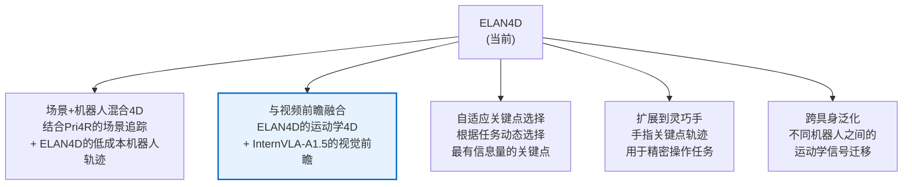

其中**与视频前瞻融合**(F2)是最有前景的方向, 因为ELAN4D和InternVLA-A1.5的监督信号在信息空间上正交互补(见下节).

---

## 10. 与InternVLA-A1.5的关联讨论

### 10.1 共同的设计哲学

ELAN4D和InternVLA-A1.5虽然使用不同的4D/前瞻信号, 但共享几个核心设计原则:

| 共同原则 | InternVLA-A1.5 | ELAN4D |
|---|---|---|
| **辅助训练监督** | 通过冻结WAN2.2的视频前瞻损失 | 通过ControlNet的4D轨迹预测损失 |
| **推理时丢弃** | WAN2.2不加载, foresight tokens保留 | Track Decoder丢弃, control branch保留 |
| **VLM保护** | WAN2.2冻结, 梯度不直接流入VLM | stop-gradient阻断 $\mathcal{L}_\text{track}$ |
| **action expert中注入** | 通过foresight tokens在suffix中注入 | 通过ControlNet式残差在action expert中注入 |

### 10.2 差异与互补性

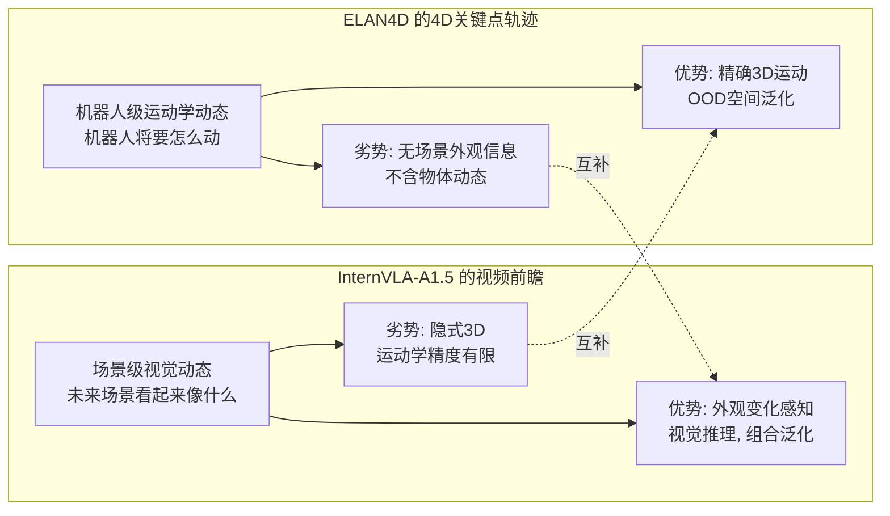

两者的**弱点不重叠**: InternVLA-A1.5在LIBERO-Plus Robot扰动上仅55.1%(运动学信息不足), 而ELAN4D在该维度提升+5.2. 反过来, ELAN4D不提供场景级视觉预测, 而InternVLA-A1.5的视频前瞻恰好填补这一空白.

### 10.3 潜在融合方案

借鉴本项目已有的 [InternVLA-A1.5 + GeoPredict](../itrnVLA15_GeoP_3dtrj_1.md) 和 [InternVLA-A1.5 + Pri4R](../itrnVLA15_Pri4Ronly_3dtrj_1.md) 融合设计, ELAN4D与InternVLA-A1.5的融合可以在**四个抽象层次**提供监督:

| 层次 | 损失 | 来源 | 教授的信息 |
|---|---|---|---|
| Token级 | $\mathcal{L}_\text{vqa}$ (cross-entropy) | InternVLA-A1.5 | 语言理解, 组合泛化 |
| 场景级 | $\mathcal{L}_\text{video}$ (flow matching MSE) | InternVLA-A1.5 (WAN2.2) | 未来视觉外观, 场景动态 |
| 运动学级 | $\mathcal{L}_\text{track}$ (L1 displacement) | ELAN4D | 机器人3D运动, 空间推理 |
| 动作级 | $\mathcal{L}_\text{action}$ (flow matching MSE) | 两者共有 | 连续运动控制 |

与前两个融合设计相比, ELAN4D方案具有独特优势:
- **比GeoPredict融合更简洁**: 不需要在VLM prefix中添加track query tokens或3DGS渲染管线, 只需一个ControlNet式分支附加在action expert上.
- **比Pri4R融合预处理更便宜**: 不需要SpatialTracker, FK计算几乎免费.
- **与InternVLA-A1.5架构天然兼容**: 两者都在action expert(suffix)中注入辅助信号, ControlNet式分支可以与foresight tokens并行工作, 互不干扰.

### 10.4 值得注意的人物关联

ELAN4D的共同作者Jingjing Qian (CUHK-SZ) 同时是GeoPredict的一作, Li Jiang (CUHK-SZ) 同时是GeoPredict和ELAN4D的共同监督人. 这表明ELAN4D可以看作GeoPredict团队在反思VLM track query方案局限后的演进之作: 从"在VLM中预测4D"转向"在action expert中通过梯度隔离分支预测4D".

---

## 11. 参考文献

1. **ELAN4D**: Zeyuan He et al., "ELAN4D: Embodiment-Centric 4D Supervision for Vision-Language-Action Models via Plug-and-Play Adaptation", arXiv:2605.30484, CoRL 2026. [Paper](https://arxiv.org/abs/2605.30484) | [HTML](https://arxiv.org/html/2605.30484v1)

2. **Pri4R**: Jisoo Kim et al., "Pri4R: Learning World Dynamics for Vision-Language-Action Models with Privileged 4D Representation", arXiv:2603.01549, 2026. [Paper](https://arxiv.org/abs/2603.01549) | [Project](https://jiiiisoo.github.io/Pri4R/)

3. **GeoPredict**: Jingjing Qian et al., "GeoPredict: Leveraging Predictive Kinematics and 3D Gaussian Geometry for Precise VLA Manipulation", CVPR 2026. [Paper](https://arxiv.org/abs/2512.16811) | [Code](https://github.com/jingjingqian75/GeoPredict)

4. **InternVLA-A1.5**: Zhu et al., "InternVLA-A1.5: Unifying Understanding, Latent Foresight, and Action for Compositional Generalization", arXiv:2607.04988, 2025. [Paper](https://arxiv.org/abs/2607.04988)

5. **ControlNet**: Lvmin Zhang et al., "Adding Conditional Control to Text-to-Image Diffusion Models", ICCV 2023. [Paper](https://arxiv.org/abs/2302.05543)

6. **$\pi_0$**: Kevin Black et al., "$\pi_0$: A Vision-Language-Action Flow Model for General Robot Control", arXiv:2410.24164, 2024. [Paper](https://arxiv.org/abs/2410.24164)

7. **$\pi_{0.5}$**: Kevin Black et al., "$\pi_{0.5}$: a Vision-Language-Action Model with Open-World Generalization", 2025. [Paper](https://arxiv.org/abs/2504.16054)

8. **PaliGemma**: Lucas Beyer et al., "PaliGemma: A versatile 3B VLM for transfer", arXiv:2407.07726, 2024. [Paper](https://arxiv.org/abs/2407.07726)

9. **LIBERO**: Bo Liu et al., "LIBERO: Benchmarking Knowledge Transfer for Lifelong Robot Learning", NeurIPS 2023. [Paper](https://arxiv.org/abs/2306.03310)

10. **LIBERO-Plus**: Fei et al., "LIBERO-Plus: A Large-Scale Robustness Benchmark for VLA Models", 2025. [Paper](https://arxiv.org/abs/2504.00956)

11. **RoboTwin2.0**: Chen et al., "RoboTwin: Dual-Arm Robot Benchmark with Generative Digital Twins", 2025. [Paper](https://arxiv.org/abs/2409.18585)

12. **SpatialTrackerV2**: Xiao et al., "SpatialTracker: Tracking Any 2D Pixels in 3D Space", CVPR 2024. [Paper](https://arxiv.org/abs/2404.04319)

13. **OpenVLA**: Kim et al., "OpenVLA: An Open-Source Vision-Language-Action Model", arXiv:2406.09246, 2024. [Paper](https://arxiv.org/abs/2406.09246)

14. **DreamVLA**: Zhang et al., "DreamVLA: Expanding the Capability Boundary of VLA Models via Dream Supervision", 2025. [Paper](https://arxiv.org/abs/2504.12255)

15. **WorldVLA**: Cen et al., "WorldVLA: Building World Model for VLA", 2025. [Paper](https://arxiv.org/abs/2503.18379)

16. **GuidedVLA**: Jia et al., "GuidedVLA: Guiding VLA Models with Spatial and Semantic Information", 2026. 

17. **VLM4VLA**: Zhang et al., "VLM4VLA: Are Foundation Models Good Foundations for VLA Models?", 2026.

18. **Craig, 2009**: John J. Craig, "Introduction to Robotics: Mechanics and Control", Pearson, 3rd edition.

19. **SAM**: Alexander Kirillov et al., "Segment Anything", ICCV 2023. [Paper](https://arxiv.org/abs/2304.02643)

---

> **文档信息**: 本分析基于ELAN4D论文 (arXiv:2605.30484v1) 及其TeX源码, 结合GeoPredict (CVPR 2026), Pri4R (arXiv:2603.01549), InternVLA-A1.5 (arXiv:2607.04988) 等相关工作的对比分析. 分析日期: 2026-07-30.
