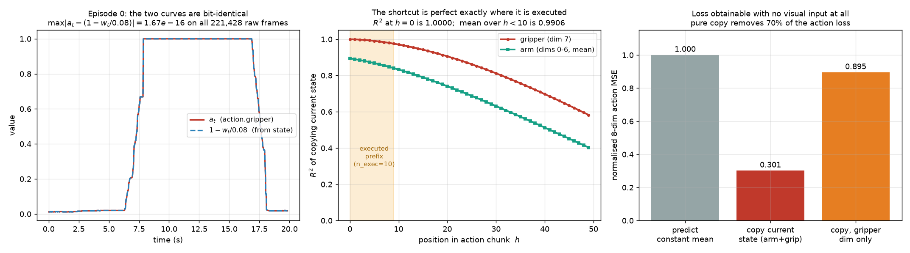
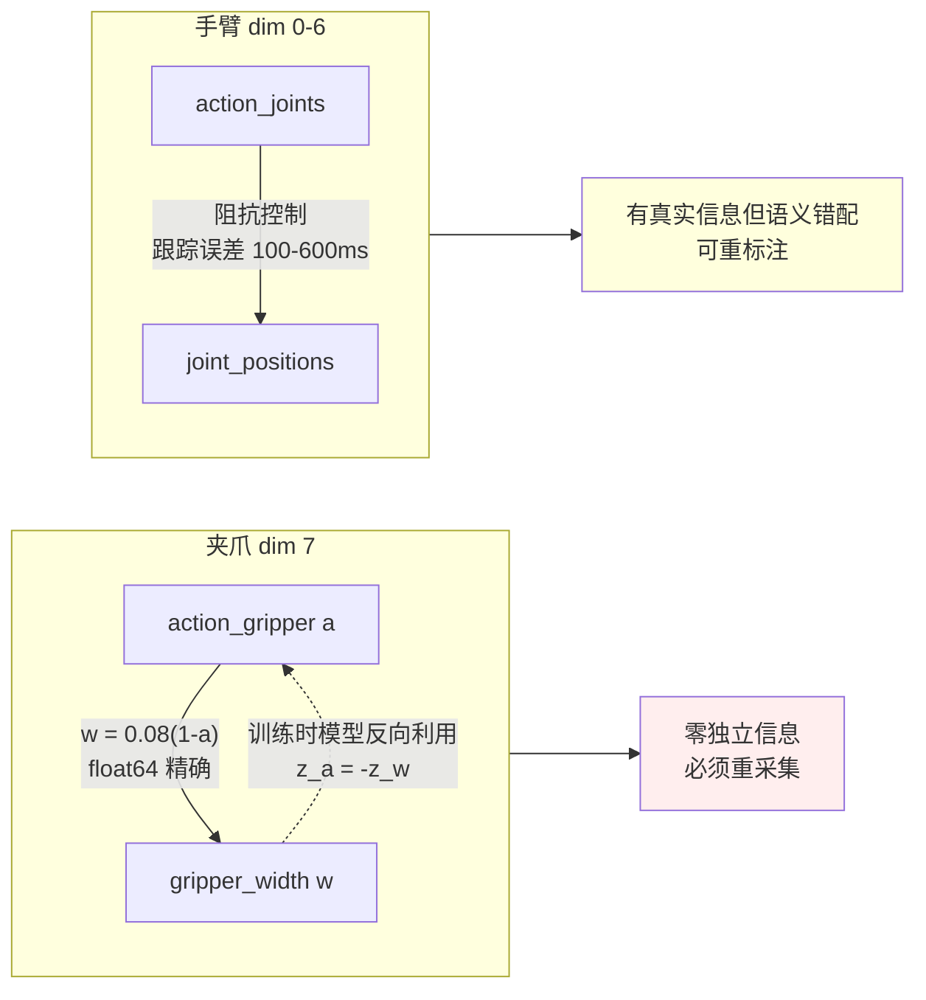
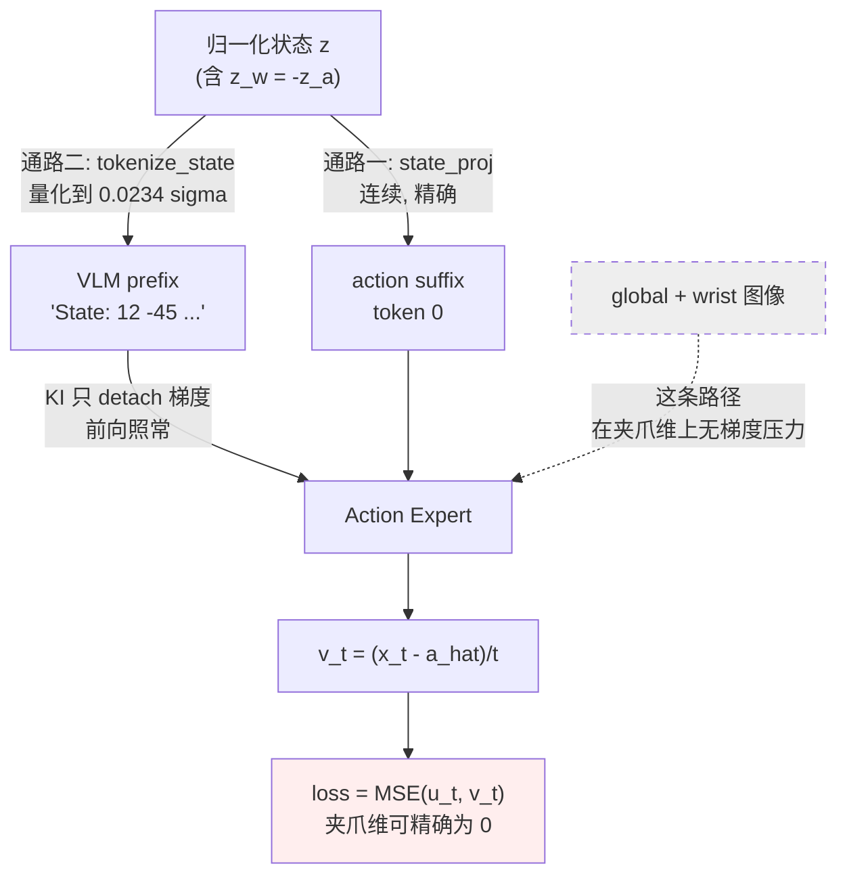
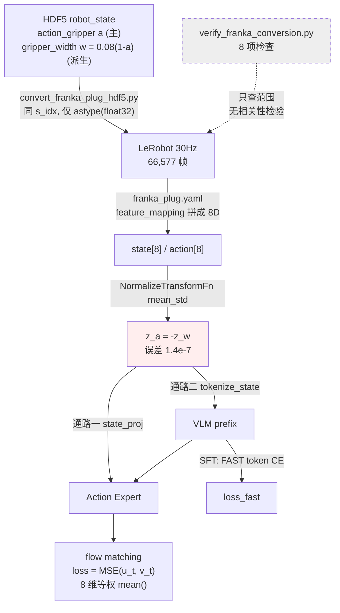
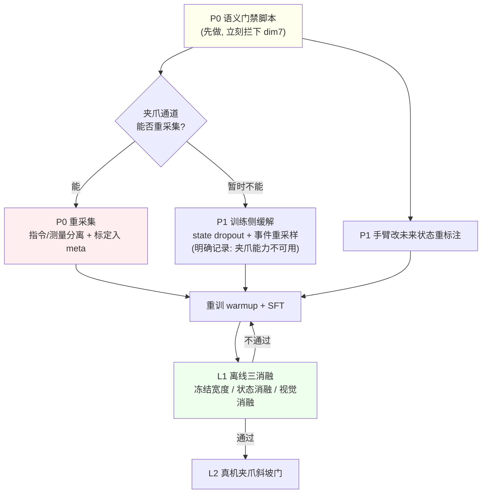

# 夹爪标注缺陷对 Franka 插插座微调模型的影响与整改方案

> **本文回答一个问题**：`/B/Dta/plug_into_socket_hdf5` 里「夹爪动作 = 同帧夹爪状态的仿射相反数」这一缺陷，经过 `b/d/Frk/` 记录的数据处理 → warmup → SFT 全链路之后，对最终微调出来的模型究竟造成了什么影响？应该怎么修？
>
> **证据等级**：每条结论标注来源，不可混用。
> - **【实测】** 本次在本机对 `/B/Dta/plug_into_socket_hdf5` 跑脚本得到，可用 `b/d/Frk/asset/analyze_gripper_leak.py` 复现。
> - **【代码】** 直接引用本仓库 `src/` 或 `b/s/Frk/` 的实现。
> - **【文档】** 引用 `b/d/Frk/` 下的方案或 LOG 文档。
> - **【卷宗】** 来自 `b/d/Frk2/realwrld_debug/` 的真机日志。
> - **【推断】** 无直接证据，属推理或建议，**不可当既有事实引用**。

---

## 0. 摘要

**一句话**：夹爪通道的监督目标 \(a_t\) 是同帧状态 \(w_t\) 的代数函数，而模型架构里有一条把 \(w_t\) 精确送进动作专家的通路，于是「预测夹爪动作」这个任务在训练集上退化成了一次线性变换；模型在这一维上从未被迫使用视觉，部署时因此表现为一个严格不动点。

五条核心结论：

| # | 结论 | 关键数字 | 等级 |
|:--:|:---|:---|:--:|
| 1 | 恒等式在**源头 HDF5** 就成立，且是 float64 机器精度 | \(\max\lvert a_t-(1-w_t/0.08)\rvert = 1.665\times10^{-16}\)，221,428 帧零违反 | 【实测】 |
| 2 | 因果方向与既有推测**相反**：`gripper_width` 是从 `action_gripper` 反算出来的派生量，不是测量 | `w == 0.08*(1-a)` 逐位成立 100%；\(\lvert\mathrm{unique}(a)\rvert=37857 > \lvert\mathrm{unique}(w)\rvert=36946\) | 【实测】 |
| 3 | 缺陷**只限夹爪**一维。手臂 7 维不是代数恒等，而是伺服滞后 | 手臂逐位相等 0.0000%；偏置与关节速度相关 +0.26~+0.79 | 【实测】 |
| 4 | 捷径在**实际被执行的 chunk 前缀上最完美**，这是最致命的一点 | \(R^2(h{=}0)=1.0000\)；\(n_{\mathrm{exec}}=10\) 前缀上 \(R^2=0.9906\)；整段 50 步才降到 0.8406 | 【实测】 |
| 5 | `knowledge_insulation` **挡不住**这个捷径，它只 detach 梯度，不阻断前向读取 | `prefix_key.detach()`，见 §4.3 | 【代码】 |



**对最终模型的影响，最重要的一条**：仅靠「抄当前状态」，8 维动作的归一化 MSE 就能从 1.0（预测常数均值）降到 **0.3012**，即**动作损失的 70% 可以在完全不看图像的情况下拿掉**；其中夹爪维贡献 10.51 个百分点，手臂 7 维贡献 59.38 个百分点。【实测】

---

## 1. 分析对象、方法与可复现性

### 1.1 分析对象

| 对象 | 路径 | 说明 |
|:---|:---|:---|
| 源 HDF5 | `/B/Dta/plug_into_socket_hdf5` | 100 集 / 221,428 状态帧 @100 Hz / 相机 @30 Hz |
| 转换脚本 | `b/s/Frk/convert_franka_plug_hdf5.py` | HDF5 → LeRobot |
| 关键点生成 | `b/s/Frk/generate_franka_keypoints.py` | pinocchio FK |
| 数据校验 | `b/s/Frk/verify_franka_conversion.py` | 8 项检查 |
| Schema | `b/s/Frk/cfg/franka_plug.yaml` | `action_mask_spec: [7, -1]` |
| 数据方案 | `b/d/Frk/dta_4dtrj_plan.md` + `_0904LOG.md` | |
| 统计分析 | `b/d/Frk/plug_data_stats.md` | |
| Warmup 方案 | `b/d/Frk/plug_p1warmup.md` + `_0907LOG.md` | |
| SFT 方案 | `b/d/Frk/plug_p2sft.md` + `_0907LOG.md` | |
| 启动脚本 | `launch/frk_plug_warmup_launch.sh`、`launch/frk_plug_sft_launch.sh`、`b/s/Frk/run_frk_plug_warmup.sh` | |
| 模型实现 | `src/lerobot/policies/internvla_a1_5/modeling_internvla_a1_5.py` | |
| 变换管线 | `src/lerobot/transforms/core.py`、`.../transform_internvla_a1_5.py` | |

> **注意**：训练实际使用的 30 Hz LeRobot 数据集 `/B/Dta/plug_into_socket_lrb_4D` **已不在本机磁盘上**（`/B/Dta/` 现仅存 `plug_into_socket_hdf5` 与 15 Hz 的第二版数据）。因此本文的 30 Hz 层面结论，全部通过**精确复现** `convert_franka_plug_hdf5.py` 的最近邻对齐逻辑从源 HDF5 重建得到。

### 1.2 复现方法的自我校验

复现是否忠实，用一个独立锚点验证：重建出的总帧数为 **66,577**，与 `b/d/Frk/dta_4dtrj_plan_0904LOG.md` 记录的转换结果 **66,577** 完全一致。【实测 vs 文档】这说明对齐逻辑（以 `camera_global` 时间戳为基准、`argmin|t_state - t_cam|`、保留最后一帧）被正确复现。

### 1.3 一键复现

```bash
cd /B/SRC/itvlaGpLibPlus
/B/VENV/itnvla15rbt20/bin/python b/d/Frk/asset/analyze_gripper_leak.py \
    --hdf5-dir /B/Dta/plug_into_socket_hdf5 \
    --outdir   b/d/Frk/asset
```

预期输出（本机已跑）：

```text
[raw 100Hz] frames=221428  max|a-(1-w/0.08)|=1.665e-16
[raw 100Hz] bit-exact w == 0.08*(1-a) : 100.0000%
[raw 100Hz] bit-exact a == 1-w/0.08   : 64.4995%
[raw 100Hz] |unique(a)|=37857  |unique(w)|=36946
[30Hz]      frames=66577 (conversion log records 66,577)
[chunk50]   gripper copy-MSE=0.1594  arm copy-MSE=0.3214
[chunk50]   8-dim action MSE by pure copy = 0.3012 (vs 1.0 for mean)
[n_exec=10] gripper copy-R2 over executed prefix = 0.9906
```

> **环境说明**：该脚本依赖 `h5py`。本次分析时 `/B/VENV/itnvla15rbt20` 中没有该包，已安装 `h5py==3.16.0`。这是唯一的环境变更。

---

## 2. 缺陷的精确刻画

### 2.1 符号约定

| 符号 | 含义 | 数据来源 |
|:---|:---|:---|
| \(w_t\) | 第 \(t\) 帧夹爪宽度，单位米 | HDF5 `robot_state/gripper_width` → `observation.state.gripper` |
| \(a_t\) | 第 \(t\) 帧夹爪动作目标（归一化） | HDF5 `robot_state/action_gripper` → `action.gripper` |
| \(w_{\max}\) | 归一化常数，硬编码 `0.08` m | `verify_franka_conversion.py` 的 `GRIPPER_MAX` |
| \(z_a, z_w\) | 用 `mean_std` 归一化后的 z 分数 | `NormalizeTransformFn` |
| \(h\) | 动作 chunk 内的位置，\(h \in [0, 49]\) | `chunk_size=50` |
| \(n_{\mathrm{exec}}\) | 推理时实际执行的 chunk 前缀长度 | 推理服务默认 10 |

### 2.2 恒等式在源头成立

在 `/B/Dta/plug_into_socket_hdf5` 全部 100 集、221,428 个 100 Hz 状态帧上：【实测】

$$
a_t = 1 - \frac{w_t}{0.08},\qquad
\max_t\left|a_t-\left(1-\frac{w_t}{0.08}\right)\right| = 1.665\times10^{-16}
$$

- 残差超过 \(10^{-12}\) 的帧数：**0**。
- 最小二乘拟合给出截距恰为 `1`、斜率恰为 `-12.5`，即 \(a = 1 - w/0.08\)，\(R^2 = 1.000000000000000\)。
- 这是 **float64 机器精度**。`b/d/Frk2/realwrld_debug/sumry0919_4trn.markdown` 在转换后的 float32 数据上测到的 \(8.9\times10^{-8}\)，只是 float32 截断的表现，本质误差比它小 8 个数量级。

### 2.3 不是「夹爪跟随得快」，也不是带前瞻的标注

错位对齐后残差立刻爆炸：【实测】

| 错位 \(k\) | 物理时延 | \(\max\lvert a_t-(1-w_{t+k}/0.08)\rvert\) |
|---:|---:|---:|
| 0 | 0 ms | \(1.665\times10^{-16}\) |
| 1 | 10 ms | 0.3671 |
| 2 | 20 ms | 0.3704 |
| 10 | 100 ms | 0.3892 |
| 100 | 1000 ms | 0.9821 |

对夹爪通道做「最佳超前」搜索（\(k=0..60\) 帧），最优值落在 \(k=0\) 且 \(R^2\) 恰为 1；作为对照，手臂各关节的最优超前落在 100–600 ms（见 §2.5）。**夹爪通道没有任何动力学，手臂通道有真实动力学。**

### 2.4 因果方向：`gripper_width` 才是派生量

这是本次分析相对既有文档的**新发现**，它推翻了一个此前只能猜测的点。

`b/d/Frk2/realwrld_debug/sumry0919_4trn.markdown` 的 D2b 把「`gripper_width` 记录的是指令而非测量」列为**开放问题**，原话是「要定论必须回到源 HDF5 看 `robot_state/gripper_width` 的写入来源」。现在可以定论，有两条独立且互相印证的证据：

**证据一：浮点舍入方向。**【实测】

| 检验 | 逐位成立比例 |
|:---|---:|
| `w == fl(0.08*fl(1-a))` | **100.0000%**（0 帧例外） |
| `a == fl(1-fl(w/0.08))` | 64.4995%（78,608 帧例外） |

IEEE-754 下，一次实际执行过的计算必然逐位可复现。100% 成立的那个方向就是真正跑过的那次计算。

**证据二：唯一值计数（信息论判据，更强）。**【实测】

$$
\lvert\mathrm{unique}(a)\rvert = 37{,}857 \;>\; \lvert\mathrm{unique}(w)\rvert = 36{,}946
$$

若 \(a\) 是 \(w\) 的确定性函数，其唯一值个数**不可能超过** \(w\) 的唯一值个数。实测有 **655 组**「同一个 \(w\) 对应多个不同 \(a\)」的情形，例如：

```text
w = 0.04006324404761905239  ->  a ∈ {0.49920944940476180696, 0.49920944940476186247}
```

映射 \(w \to a\) **非单射**，所以 \(a\) 不可能由 \(w\) 算出。只能是 \(w = 0.08(1-a)\) 这次计算发生过，并在舍入中丢失了精度。

**证据三：物理指纹佐证。**【实测】

| 指标 | `gripper_width`（声称是测量） | `joint_positions`（真实编码器测量） |
|:---|---:|---:|
| 相邻帧逐位不变的比例 | **71.69%** | q1 0.65% / q7 1.21% |
| 非零逐帧变化的中位绝对值 | \(1.66\times10^{-8}\) m | q1 \(2.25\times10^{-5}\) rad |
| 精确等于 0 的帧 | 16.52% | — |

Franka Hand 的宽度分辨率约 \(10^{-4}\) m，而这里的非零变化中位数比它小**四个数量级**；一个真实传感器几乎不可能连续 71.69% 的帧给出逐位相同的 float64。一个夹着 10 mm 插头的真实夹爪更不可能读出精确的 `0.000000` m。

**结论**：`robot_state/gripper_width` 不是 libfranka 的实测宽度，而是把归一化命令 \(a\) 换算回米制的显示量。`robot_state` 的全部字段是 `action_gripper`、`action_joints`、`ee_force`、`ee_pos`、`ee_quat`、`ee_torque`、`gripper_width`、`joint_positions`、`joint_torques`、`joint_torques_external`、`joint_velocities`、`timestamps`——**没有任何独立的夹爪实测宽度、夹持力或 `is_grasped` 通道**。

### 2.5 缺陷的边界：手臂不是同一个问题

必须把两件事分开，否则整改会用错药。【实测】

| 关节 | 逐位相等 | 同帧 \(R^2\) | \(\max\lvert a-s\rvert\) (rad) | corr(偏置, 关节速度) | 最佳超前 |
|:--|---:|---:|---:|---:|---:|
| q1 | 0.0000% | 0.991967 | 0.0852 | +0.3875 | 390 ms |
| q2 | 0.0000% | 0.970636 | 0.0861 | +0.7870 | 190 ms |
| q3 | 0.0000% | 0.998463 | 0.0461 | +0.6998 | 130 ms |
| q4 | 0.0000% | 0.990883 | 0.0524 | +0.5609 | 100 ms |
| q5 | 0.0000% | 0.565429 | 0.1256 | +0.2552 | 600 ms |
| q6 | 0.0000% | 0.928893 | 0.1571 | +0.6056 | 280 ms |
| q7 | 0.0000% | 0.881865 | 0.1361 | +0.2986 | 600 ms |
| **夹爪** | **100.0000%** | **1.000000** | **0** | — | **0 ms** |

手臂偏置与关节速度显著正相关，且最佳超前在 100–600 ms，这是**伺服滞后**的典型特征：示教时机器人在阻抗控制下从未真正到达指令值。这是一个真实存在、但**性质完全不同**的问题（语义错配，对应旧卷宗的 D3），本文 §8.5 单独给出整改，不与夹爪问题混为一谈。



---

## 3. 缺陷如何穿过数据处理管线

### 3.1 转换阶段：原样搬运，不做任何变换

`b/s/Frk/convert_franka_plug_hdf5.py` 对夹爪只做了**同索引拷贝 + float32 类型转换**：【代码】

```136:141:/B/SRC/itvlaGpLibPlus/b/s/Frk/convert_franka_plug_hdf5.py
                "observation.state.arm": joint_pos[s_idx].astype(np.float32),
                "observation.state.gripper": gripper_w[s_idx].astype(np.float32),
                "observation.state.ee_pos": ee_pos[s_idx].astype(np.float32),
                "observation.state.ee_quat": ee_quat[s_idx].astype(np.float32),
                "action.arm": action_j[s_idx].astype(np.float32),
                "action.gripper": action_g[s_idx].astype(np.float32),
```

注意 `observation.state.gripper` 与 `action.gripper` 取的是**同一个** `s_idx`。转换阶段既没有引入这个缺陷，也没有消除它——它忠实地把源头的代数恒等关系搬进了训练集。重建验证：转换后 float32 下 \(\max\lvert a-(1-w/0.08)\rvert = 5.215\times10^{-8}\)。【实测】

### 3.2 归一化阶段：恒等关系被放大成「差一个负号」

`franka_plug.yaml` 把分列特征拼成模型侧的 8 维向量：【代码】

```1:10:/B/SRC/itvlaGpLibPlus/b/s/Frk/cfg/franka_plug.yaml
robot_type: franka_plug
action_mask_spec: [7, -1]
# [7, -1] 含义: 前 7 维 (arm joints) 在 delta 模式下做差分, 最后 1 维 (gripper) 保持绝对值
feature_mapping:
  observation.state:
    - observation.state.arm
    - observation.state.gripper
  action:
    - action.arm
    - action.gripper
```

`NormalizeTransformFn` 默认 `mode="mean_std"`【代码 `src/lerobot/transforms/core.py:270`】，对每个通道做 \(z=(x-\mu)/(\sigma+10^{-8})\)。重建统计量：【实测】

| 量 | 实测值 | 由另一通道推出 |
|:---|---:|---:|
| `action.gripper` mean / std | 0.578538 / 0.404688 | — |
| `observation.state.gripper` mean | 0.033717 | \(0.08\times(1-0.578538)=0.033717\) |
| `observation.state.gripper` std | 0.032375 | \(0.08\times0.404688=0.032375\) |

代入 \(w = 0.08(1-a)\)：

$$
z_w = \frac{0.08(1-a) - 0.08(1-\mu_a)}{0.08\,\sigma_a} = -\frac{a-\mu_a}{\sigma_a} = -z_a
$$

实测 \(\max\lvert z_a + z_w\rvert = 1.407\times10^{-7}\)，是 float32 舍入量级。【实测】

**关键后果**：归一化把「米 vs 归一化值」这层单位差异彻底抹平。送进模型的 state 第 8 维和 action 第 8 维，在 z 分数层面**只差一个负号**。

### 3.3 为什么现有校验门禁没能拦下

`verify_franka_conversion.py` 的 8 项检查中，与夹爪相关的只有第 5 项，且只检查 `observation.state.gripper` 的**取值范围**：【代码】

```136:145:/B/SRC/itvlaGpLibPlus/b/s/Frk/verify_franka_conversion.py
def check_gripper_range(df: pd.DataFrame):
    ...
    gripper = np.stack(df["observation.state.gripper"].values).flatten()
    g_min, g_max = gripper.min(), gripper.max()
    print(f"  gripper_width range: [{g_min:.6f}, {g_max:.6f}] m")
    ...
    if g_min < -0.001 or g_max > GRIPPER_MAX + 0.001:
        print(f"  FAIL: out of physical range [0, {GRIPPER_MAX}]")
```

`b/d/Frk/dta_4dtrj_plan_0904LOG.md` 记录该项 **PASS**：`[0.000000, 0.079405] m, 在 [0, 0.08] 内`。**范围检查天然无法发现恒等关系**——一个完美的代数镜像同样落在合法范围内。

8 项检查里**没有任何一项**比较 action 与 state 的相关性或函数依赖。

### 3.4 数据分析文档为何也漏掉了

这一点值得单独记一笔，因为它是一个**认知陷阱**，很容易在下一个数据集上重演。

`b/d/Frk/plug_data_stats.md` 明确注意到了夹爪的「双语义」，并据此**主动放弃了对比**：

> 「gripper action/state 不同单位，不可直接对比」（§12.2）
> mean **0.579** vs **0.034**（§4.2「Gripper 双语义」表）

文档对 7 个关节给出了 `corr(action, state)` 表格，**唯独跳过了夹爪**。推理链是：单位不同 → 数值不可比 → 不做相关性检验。但恰恰是这个「单位不同」本身就是恒等式 \(a = 1 - w/0.08\) 的产物；两个均值 0.579 与 0.034 正是被同一个仿射完美互推的。**「量纲不同」被误当成了「独立」的理由。**【文档】

---

## 4. 缺陷如何进入模型：两条信息通路

这一节回答「为什么模型一定会学到这个捷径」。

### 4.1 flow matching 下，预测动作与预测速度是等价的

动作损失的实现：【代码】

```1791:1793:/B/SRC/itvlaGpLibPlus/src/lerobot/policies/internvla_a1_5/modeling_internvla_a1_5.py
        time_expanded = time[:, None, None]
        x_t = time_expanded * noise + (1 - time_expanded) * actions
        u_t = noise - actions
```

```1942:1943:/B/SRC/itvlaGpLibPlus/src/lerobot/policies/internvla_a1_5/modeling_internvla_a1_5.py
            v_t = self._apply_checkpoint(lambda x: self.action_out_proj(x), action_out)
            loss_action = F.mse_loss(u_t, v_t, reduction="none")
```

其中 \(x_t\) 是加噪后的动作、\(t\) 是流匹配时间、\(u_t\) 是目标速度、\(v_t\) 是模型预测。模型的输入里**包含** \(x_t\) 和 \(t\)（通过 `embed_suffix(state, x_t, time)`）。由 \(x_t = t\cdot\varepsilon + (1-t)\cdot a\) 解出 \(\varepsilon\) 并代入 \(u_t = \varepsilon - a\)：

$$
u_t = \frac{x_t - a}{t}
$$

其中 \(a\) 是归一化后的真实动作 chunk，\(\varepsilon\) 是高斯噪声。**这意味着：在已知 \((x_t, t)\) 的条件下，预测 \(u_t\) 与预测 \(a\) 是严格等价的**，误差按 \(1/t\) 放大。设模型对 \(a\) 的估计误差为 \(e\)，则该维的损失为 \(\mathbb{E}[e^2/t^2]\)。

训练时 \(t \sim 0.999\cdot\mathrm{Beta}(1.5,\,1.0) + 0.001\)【代码 `configuration_internvla_a1_5.py:379-382`】，\(t\in[0.001,1]\)，偏向大值。

**所以：只要模型能从条件信息里精确恢复 \(a\)，该维损失就可以压到 0。** 夹爪维恰好满足这个条件。

### 4.2 通路一：`state_proj`（连续、精确、在 suffix 内）

动作专家的 suffix 第一个 token 就是状态：【代码】

```1512:1523:/B/SRC/itvlaGpLibPlus/src/lerobot/policies/internvla_a1_5/modeling_internvla_a1_5.py
    def embed_suffix(self, state, noisy_actions, timestep):
        """Build suffix: [state(1)] [learnable(N)] [action_time(chunk_size)]."""
        embs = []
        pad_masks = []
        ...
            if self.state_proj.weight.dtype == torch.float32:
                state = state.to(torch.float32)
            state_emb = self._apply_checkpoint(lambda s: self.state_proj(s), state)
            embs.append(state_emb[:, None, :])
```

`self.state_proj = nn.Linear(config.max_state_dim, action_expert_hidden_size)`【代码 `modeling_internvla_a1_5.py:998`】接收的是**完整、连续、未量化**的归一化状态向量。动作 token 通过 suffix 内部的自注意力可以精确读到 \(z_w\)。

由于 \(z_a = -z_w\)（§3.2），动作专家只需要学会「把状态第 8 维取负号，写到动作第 8 维」——这是 `state_proj` 与 `action_out_proj` 两个线性层就能表达的映射，**不需要任何非线性、不需要任何视觉**。

### 4.3 通路二：`tokenize_state`（离散化进 prompt 文本）

两个阶段都开了 `tokenize_state=true`【文档/代码：`launch/frk_plug_warmup_launch.sh`、`launch/frk_plug_sft_launch.sh`】。状态被写成文本：【代码】

```95:102:/B/SRC/itvlaGpLibPlus/src/lerobot/policies/internvla_a1_5/transform_internvla_a1_5.py
    def _encode_state(self, data: DataDict) -> str:
        if not self.tokenize_state or OBS_STATE not in data:
            return ""
        state = deepcopy(data[OBS_STATE])
        state = pad_vector(state, self.max_state_dim)
        state_np = state.cpu().numpy() / 3
        discretized = np.digitize(state_np, bins=np.linspace(-1, 1, 257)[:-1]) - 1
        return "State: " + " ".join(map(str, discretized))
```

归一化状态先除以 3，再离散到 \([-1,1]\) 的 256 个 bin，即 z 分数在 \([-3,3]\) 上分 256 档，**量化步长 \(6/256 = 0.0234\,\sigma\)**。夹爪的 \(\sigma_a = 0.4047\)，折合原始动作单位 \(0.0234\times0.4047 = 0.0095\)，再折合宽度约 **0.76 mm**。

也就是说，**即使只看 prompt 文本**，模型也能把夹爪动作恢复到 ±0.005（归一化 0–1 单位）以内。

### 4.4 `knowledge_insulation` 挡不住（重要修正）

Warmup 开了 `knowledge_insulation=true`。一个自然的期待是：它会阻断动作专家读取 prompt。**实际不会。** 它只对 prefix 的 K/V 做梯度截断：【代码】

```273:283:/B/SRC/itvlaGpLibPlus/src/lerobot/policies/internvla_a1_5/modeling_internvla_a1_5.py
        # --- suffix queries: attend to [prefix (maybe-detached) K/V, suffix K/V].
        if knowledge_insulation:
            prefix_key_for_suffix = prefix_key.detach()
            prefix_value_for_suffix = prefix_value.detach()
        else:
            prefix_key_for_suffix = prefix_key
            prefix_value_for_suffix = prefix_value

        k_for_suffix = torch.cat([prefix_key_for_suffix, suffix_key], dim=2)
        v_for_suffix = torch.cat([prefix_value_for_suffix, suffix_value], dim=2)
```

docstring 说得很清楚：「suffix queries attend to the prefix keys/values **with gradient detached**, so gradients from the action branch cannot flow back into the VLM」。**前向读取照常**。

因此两条通路在 **warmup 和 SFT 两个阶段都完全畅通**，而 §4.2 的 `state_proj` 通路本就在 suffix 内部，`knowledge_insulation` 连它的梯度都不截。



---

## 5. 对训练过程的定量影响

### 5.1 损失预算：捷径值多少钱

8 个动作维在损失里是**等权平均**的：【代码】

```2536:2538:/B/SRC/itvlaGpLibPlus/src/lerobot/policies/internvla_a1_5/modeling_internvla_a1_5.py
            loss_fm_action = losses.mean()
            loss_vlm = zero
            loss = self.config.action_loss_weight * loss_fm_action + self.config.video_loss_weight * video_loss + loss_kpt
```

以归一化单位衡量（预测常数均值 = MSE 1.0）：【实测】

| 策略 | 8 维动作 MSE | 相对降幅 |
|:---|---:|---:|
| 预测常数均值 | 1.0000 | — |
| **纯复制当前状态** | **0.3012** | **−69.9%** |
| 其中夹爪维贡献 | — | −10.51 pp |
| 其中手臂 7 维贡献 | — | −59.38 pp |

**不看任何图像、只把状态向量抄一遍，就能拿掉 70% 的动作损失。** 夹爪维单独看更极端：它的 chunk 平均 copy-MSE 只有 **0.1594**，即 84% 的方差被一次复制解释掉。

### 5.2 最致命的一点：捷径在被执行的那段最完美

这是本文相对旧卷宗的第二个新发现。模型预测 50 步 chunk，但推理服务只执行前 \(n_{\mathrm{exec}}\) 步。捷径强度随 \(h\) 衰减：【实测】

| \(h\) | 夹爪 copy \(R^2\) | 夹爪逐位精确比例 | 手臂 copy \(R^2\) |
|---:|---:|---:|---:|
| 0 | **1.0000** | **100.0%** | 0.9397 |
| 1 | 0.9992 | 75.5% | 0.9348 |
| 2 | 0.9979 | 71.2% | 0.9294 |
| 5 | 0.9909 | 64.3% | 0.9113 |
| 10 | 0.9710 | 56.7% | 0.8760 |
| 20 | 0.9059 | 47.2% | 0.7924 |
| 30 | 0.8122 | 41.0% | 0.6988 |
| 49 | 0.5827 | 33.3% | 0.5112 |

按实际执行长度聚合：【实测】

| 配置 | 夹爪 copy-MSE | 夹爪 \(R^2\) |
|:---|---:|---:|
| \(n_{\mathrm{exec}}=1\) | 0.0000 | 1.0000 |
| **\(n_{\mathrm{exec}}=10\)（评测实际值）** | **0.0094** | **0.9906** |
| \(n_{\mathrm{exec}}=25\) | 0.0483 | 0.9517 |
| \(n_{\mathrm{exec}}=50\)（训练全长） | 0.1594 | 0.8406 |

**训练时 50 步的平均损失里，还留有 16% 的「真任务」逼着模型去看图像；但真正被下发到机器人的前 10 步，99.06% 都能靠复制拿到。** 换句话说，训练信号中那一点点非捷径成分，恰好集中在**永远不会被执行**的 chunk 尾部。这解释了为什么离线 loss 看起来健康、真机却完全不动。

### 5.3 决策点极度稀疏

夹爪真正需要「做决定」的时刻有多少？以 \(a\) 跨越 0.5 为事件：【实测】

- 全数据集跨越次数：**200 次** / 66,577 帧 = **0.30%**
- 每集平均 **2.00** 次（一次合、一次开）

在这 200 个决策帧上，复制捷径必然预测错——闭合前 1~10 帧，捷径对「该闭合了」这个目标的归一化误差中位数为 **0.165 σ**、均值 **0.200 σ**。但这些帧占比 0.30%，对平均损失的贡献微乎其微。

**梯度经济学**：模型面对的选择是「学一个零成本的线性映射拿走 84% 的方差」还是「学一个需要视觉、只在 0.30% 的帧上才有回报的时序判断」。在没有任何重采样或损失加权的情况下，前者必然胜出。

### 5.4 Warmup 与 SFT：谁更严重

两阶段的生效配置对比（均为 8 GPU × batch 16 = EBS 128、`action_mode=abs`、`tokenize_state=true`、`use_external_stats=true`）：【文档/代码】

| 项 | Warmup | SFT | 对捷径的影响 |
|:---|:---|:---|:---|
| 步数 / epoch | 3,126 / 6 | 52,100 / 100 | SFT 暴露 **16.7 倍** |
| `action_loss_weight` | 2.0 | **10.0** | SFT 强 5 倍 |
| Action Expert lr | \(5\times10^{-5}\times0.04 = 2\times10^{-6}\) | \(5\times10^{-5}\times1.0\) | SFT 快 **25 倍** |
| `train_expert_only` | true（VLM 冻结） | false（VLM 解冻） | SFT 连 VLM 都被拉去拟合捷径 |
| `knowledge_insulation` | true（仅 detach 梯度） | false | 两者都不阻断前向 |
| `use_fast_action_tokens` | false | **true** | SFT 多一条捷径通道，见 §5.5 |
| `enable_vqa_loss` | false | true | — |

**结论：SFT 阶段远比 warmup 严重。** 三个因素相乘——动作损失权重 ×5、动作专家学习率 ×25、训练步数 ×16.7——SFT 施加在这个捷径上的累计梯度压力比 warmup 高出约三个数量级。【推断，基于上表的乘性关系】

一个佐证：warmup 结束时 `loss_action = 0.029`【文档 `plug_p1warmup_0907LOG.md`】。作为参照，若模型完全不预测（\(v_t \equiv 0\)），损失约为 \(\mathbb{E}[u_t^2] = \mathbb{E}[(\varepsilon-a)^2] \approx 2\)。0.029 意味着 98.5% 的目标速度方差已被解释。在只训练了 6 个 epoch、动作专家学习率仅 \(2\times10^{-6}\) 的条件下达到这个水平，与「任务的主要成分是一个线性复制」高度一致。【推断】

### 5.5 SFT 多出来的 FAST token 捷径

SFT 开启 `use_fast_action_tokens=true`，动作 chunk 被离散成 FAST token，由 VLM 的 lm_head 用交叉熵预测：【代码】

```2469:2481:/B/SRC/itvlaGpLibPlus/src/lerobot/policies/internvla_a1_5/modeling_internvla_a1_5.py
            fast_tok_mask = (
                (labels_shifted >= self.config.action_token_min)
                & (labels_shifted <= self.config.action_token_max)
            )
            ...
            loss_fast = (fast_sum / fast_cnt) if fast_cnt > 0 else zero
```

FAST 分支的输入是 prefix，而 prefix 里有 `tokenize_state` 写进去的状态文本（§4.3）。所以**同一个捷径在 SFT 里被复制到了第二个分支上**：VLM 只要把 prompt 里 `State:` 后面第 8 个数字取负号映射成对应的 action token 即可。SFT 阶段 VLM 是解冻的，这个捷径会直接写进语言模型的权重。【推断，基于数据通路与代码结构】

### 5.6 训练侧数据流总览



---

## 6. 对最终微调模型的影响

本节区分「可由数据与代码严格推出的」与「已在真机上观察到的」。

### 6.1 夹爪通道退化为不动点（已观察到）

模型学到的策略近似为 \(\hat a_t = 1 - w_t/0.08\)。部署时：

$$
w_t \text{ 不变} \;\Longrightarrow\; \hat a_t \text{ 不变} \;\Longrightarrow\; \text{不触发闭合} \;\Longrightarrow\; w_{t+1} = w_t
$$

这是一个**严格不动点**。代入真机数字：【实测 + 卷宗】

| 手报宽度 | 模型按恒等式输出 \(a\) | 阈值 0.5 判定 |
|---:|---:|:---|
| 66.4 mm | 0.1700 | 保持张开 |
| 79.4 mm | 0.0075 | 保持张开 |
| 0.0 mm | 1.0000 | 闭合 |

卷宗记录真机两次 300 步、合计 1830 步**零次**越过 0.5，峰值 0.227。【卷宗】

一个此前未被指出的细节：训练集每集首帧宽度分布在 **[65.2, 79.4] mm**，对应「保持张开」标签 \(a \in [0.0074,\,0.1853]\)。【实测】**真机的 0.170 完全落在训练分布内部**。所以模型输出的并不是一个 OOD 的错误值——它输出的是在训练集语义下**完全正确**的标签。问题不在于模型答错了，而在于**这个标签本身不含任何闭合意图**。

### 6.2 夹爪维从未被迫使用视觉（可严格推出）

由 §4.1 的等价性和 §5.1 的损失预算：夹爪维的监督目标在训练集上可由条件信息中已有的 \(z_w\) 精确重构，因此该维对视觉编码器、对 wrist 相机、对任务语言，**都不产生有效梯度压力**。

这意味着：**无论 SFT 训练多少步、loss 降到多低，模型在夹爪维上都不会获得「看到插头对准了 → 该闭合了」这种能力。** 这不是欠拟合，是任务定义的退化。

### 6.3 手臂维的开环漂移（已观察到，另一根因）

手臂动作记录的是带 100–600 ms 伺服滞后的指令（§2.5）。示教时机器人在阻抗控制下从未到达该指令；评测时把同样数值当绝对目标下发，机器人**会**到达，于是测得状态被推出训练状态分布，下一步观测即 OOD。卷宗记录 q7 一路跌到 0.458/0.40，成为最主要的 OOD 维度。【卷宗】

这条与夹爪问题**独立**，修好夹爪不会修好它。

### 6.4 实际能力评估

| 能力 | 训练后是否具备 | 依据 |
|:---|:---|:---|
| 夹爪按视觉时机闭合 | **不具备** | §6.2，可严格推出 |
| 夹爪回显当前宽度 | 具备（但无用） | §6.1，真机已验证 |
| 手臂粗轨迹跟随 | 部分具备 | 手臂 copy-MSE 0.32，尚有 68% 需真实建模 |
| 手臂精确对准插座 | 存疑 | §6.3 开环漂移 + 场景多样性极低 |
| 关键点预测 | 具备 | `loss_kpt_cur=0.0019`【文档】，但关键点是关节的确定性函数，同属自指问题 |

> **重要限定**：`b/d/Frk/plug_p2sft_0907LOG.md` 只记录到 **step 100**（总计划 52,100 步），没有最终 loss、没有 `052100` checkpoint。因此「SFT 训完的模型」在本仓库文档中**并无完整记录**，上表关于 SFT 后模型的判断属于基于数据与架构的推断，而非对某个已验收 checkpoint 的实测。【文档】

### 6.5 为什么推理端的补丁全都无效

卷宗记录了大量在执行器语义上的尝试，逐一对照：【卷宗 + 本文分析】

| 补丁 | 为何无效 |
|:---|:---|
| 阈值 0.5 → 0.18 | \(w=66.4\) mm 时 \(a=0.170 < 0.18\)，仍不触发；若硬件回到 79.4 mm，标签变 0.0075，0.18 又会误判大量「不该合」 |
| \(\Delta w\) 滞回 | 目标宽度恒等于当前宽度，稳态下 \(\Delta w \equiv 0\)，不产生任何运动 |
| 连续宽度位置控制 | \(w\) 跟随 \(a\)，而 \(a\) 又跟随 \(w\)，把不动点换成零命令流 |
| 增大 `n_exec` | 由 §5.2，增大 \(n_{\mathrm{exec}}\) 反而进入捷径**较弱**的区段，但那部分本就没学好；且不改变函数依赖 |

**根本原因**：所有这些补丁都在试图从 \(a_t\) 里**解码出意图**，但 \(a_t\) 里没有意图，只有当前宽度。执行层无论怎么解码，都解不出一个不存在的信号。

---

## 7. 整改方案

### 7.1 设计原则

遵循「扩展优于修改」：所有整改以**新增独立脚本/配置**的方式落地，不改动 `convert_franka_plug_hdf5.py`、`verify_franka_conversion.py` 等已验证脚本的既有行为，以免破坏 RoboTwin / R1Pro / LIBERO 等既有流程。

| 变化维度 | 抽象为 | 落地形式 |
|:---|:---|:---|
| 机器人 / 夹爪硬件标定 | 会随硬件变 | `meta/gripper_calibration.json` |
| 数据准入阈值 | 会随数据集变 | `b/s/Frk/cfg/data_gate.yaml` |
| 训练侧缓解开关 | 会随实验变 | 新增 policy 配置项，默认关闭 |

### 7.2 P0-A：数据准入门禁（成本最低，立刻可做）

**新增** `b/s/Frk/verify_franka_semantics.py`（不修改现有 `verify_franka_conversion.py`，二者并列调用）。核心断言：

```python
# 门禁 1: 动作维不得是同帧状态的确定性函数（本数据集会在此被拦下）
for j in range(action_dim):
    r2_uni  = r2_score(action[:, j], linreg(state[:, j]))
    r2_multi = r2_score(action[:, j], linreg(state))          # 全状态多元回归
    assert max(r2_uni, r2_multi) < R2_MAX,  f"dim {j} 可被同帧状态线性重构"

# 门禁 2: 逐位恒等检测（比 R2 更硬，直接抓代数镜像）
assert (action[:, j] == state[:, j]).mean()      < 1e-3
assert np.abs(action[:, j] - (1 - state[:, j]/W_MAX)).max() > 1e-6

# 门禁 3: 通道是否为派生量（唯一值计数 + 舍入方向）
assert len(np.unique(state[:, j])) >= len(np.unique(action[:, j])), \
    f"dim {j}: state 唯一值少于 action, 疑为 action 的派生量"

# 门禁 4: chunk 内捷径强度（按实际 n_exec 评估，而不只看全 chunk 平均）
for n_exec in (1, N_EXEC_DEPLOY, CHUNK_SIZE):
    assert copy_r2(action_chunk[:n_exec], state) < COPY_R2_MAX

# 门禁 5: 动作分布须被状态分布包住（抓伺服滞后语义错配）
assert state_q01[j] <= action_q01[j] and action_q99[j] <= state_q99[j]

# 门禁 6: 传感器真实性（抓「派生量冒充测量」）
assert (np.diff(state[:, j]) == 0).mean() < ZERO_DIFF_MAX   # 本数据集 71.69% -> FAIL
assert np.median(np.abs(nonzero_diff)) > SENSOR_RESOLUTION  # 本数据集 1.66e-8 -> FAIL
```

**阈值配置**（`b/s/Frk/cfg/data_gate.yaml`，各数据集一份）：

| 参数 | 建议值 | 依据 |
|:---|---:|:---|
| `R2_MAX` | 0.90 | 旧卷宗 D9 建议值；本数据集夹爪 1.000、q3 0.998 均会被拦 |
| `COPY_R2_MAX` | 0.80 | 本数据集 \(n_{\mathrm{exec}}=10\) 处 0.9906 会被拦 |
| `ZERO_DIFF_MAX` | 0.10 | 真实编码器 0.6–1.2%，派生量 71.7% |
| `SENSOR_RESOLUTION` | \(10^{-5}\) | Franka Hand 宽度分辨率约 \(10^{-4}\) m，留一个数量级余量 |

**这套门禁在本数据集上的预期结果**：门禁 1、2、3、4、6 全部 FAIL（夹爪维），门禁 5 FAIL（q7）。总耗时约数秒。

**验收**：在 `/B/Dta/plug_into_socket_hdf5` 上运行必须 FAIL 且明确指出 dim 7；在一个人工构造的干净数据集上必须 PASS。

### 7.3 P0-B：夹爪通道必须重采集（唯一根治手段）

这是本文最重要、也最不受欢迎的一条结论。

**为什么不能靠重标注挽救**：旧卷宗 D1 建议「重标注为带前瞻的目标 \(a_t = 1 - w_{t+\Delta}/w_{\max}\)」。但由 §2.4，\(w\) 本身就是 \(a\) 的仿射像，所以

$$
1 - \frac{w_{t+\Delta}}{0.08} \;\equiv\; a_{t+\Delta}
$$

重标注只是把「抄同帧」变成「抄未来帧」，捷径依旧存在（§5.2 的表格已经给出这种标注下的 \(R^2\)：\(h=10\) 时仍有 0.9710）。**这份数据里不存在可供恢复的真实夹爪测量。**

**采集侧必须改的**：

1. **两条独立通道**：`action.gripper_cmd`（示教器扳机 / 主手开合量）与 `observation.gripper_width_measured`（libfranka 实测，必须来自 `franka::GripperState::width`）。当前 HDF5 的两个字段不满足独立性。
2. **补充夹持语义**：`is_grasped`、夹持力或电机电流，用于区分「合到 0」与「夹住 10 mm 插头」。
3. **标定入契约**：每次会话前 `gripper.homing()`，把 `reported_max_width`、指尖型号、被抓物厚度（卡尺）写入 `meta/gripper_calibration.json`。**禁止**代码里再出现字面量 `0.08`（当前 `verify_franka_conversion.py` 的 `GRIPPER_MAX`、推理端的 `W0` 各写了一遍）。
4. **记录空载开合阶跃**，用于标定命令到位延迟 \(\Delta\)。

**验收**：新采集数据在 §7.2 门禁上全项 PASS，特别是 \(R^2(a \sim s) < 0.90\)。

### 7.4 P1-A：训练侧缓解（在重采集完成前降低危害）

以下措施**不能根治**（数据里确实没有信息），但能阻止模型把捷径写进权重，为「数据到位后快速收敛」做准备。

**（1）State dropout。** 在 `tokenize_state` 与 `state_proj` 两条通路上，以概率 \(p\) 把状态的夹爪维替换为 mask/噪声。建议以**新增配置项**实现，默认关闭以保持向后兼容：

```python
# configuration_internvla_a1_5.py 新增，默认值保证既有行为不变
state_dropout_dims: tuple[int, ...] = ()     # 要做 dropout 的状态维索引
state_dropout_prob: float = 0.0              # 0.0 = 关闭, 与现状完全一致
```

Franka 插插座实验设 `state_dropout_dims=(7,)`、`state_dropout_prob=0.5`。**必须同时作用于两条通路**，只堵一条无效（§4.2/§4.3）。

**（2）夹爪维改用分类头。** 【推断】动作分布高度二值（\(a<0.1\) 占 29.06%、\(a\ge0.8\) 占 50.15%，中间的 0.2–0.4 只占 4.25%），用 MSE 回归会把概率质量压进两峰之间的谷里。改为 `{hold_open, closing, hold_closed, opening}` 四分类 + 交叉熵更合适。

**（3）按事件重采样 / 提高决策帧权重。** 决策帧只占 0.30%（§5.3），建议对 \(a\) 跨越 0.5 前后 ±15 帧的样本提高采样概率或损失权重。

**（4）打开已有的图像增广。** 仓库里已内置 brightness/contrast/saturation/hue/sharpness，但 `ImageTransformsConfig.enable` 默认 `False`，两个 launch 脚本都没开。加 `--dataset.image_transforms.enable=true` 是零成本的一行改动。

### 7.5 P1-B：手臂动作语义（独立问题，独立修）

由 §2.5，手臂动作是带 100–600 ms 伺服滞后的指令。建议提供**未来状态重标注**作为默认动作定义：

$$
\text{action}_t := \text{state}_{t+1..t+50}\quad(\text{绝对关节角})
$$

这样「执行动作」与「到达状态」同义，评测端按绝对目标下发不再引入系统性偏置。

**注意**：这条对夹爪维**不适用**（§7.3），必须分维度处理——这正是 `action_mask_spec: [7, -1]` 这套机制适合承载的语义。

**验收**：重标注后 `action.arm[j]` 的 q01/q99 落在 `state.arm[j]` 的 q01/q99 之内（§7.2 门禁 5）。

### 7.6 验收方案

| 层级 | 测试 | 通过条件 | 覆盖的问题 |
|:---|:---|:---|:---|
| L0 数据 | `verify_franka_semantics.py` | 6 项门禁全 PASS | §2 全部 |
| L1 离线 | **冻结宽度测试** | 固定 \(w=66.4\) mm 连喂 100 步，策略应在若干步后仍输出 \(a\ge0.8\) | §6.1 不动点 |
| L1 离线 | **状态消融测试** | 把状态第 8 维置零/加噪，夹爪预测的退化幅度应 < 20% | §4.2/§4.3 捷径依赖 |
| L1 离线 | **视觉消融测试** | 遮挡 wrist 相机，夹爪预测应显著退化 | §6.2 是否真用了视觉 |
| L1 离线 | `tests/openloop_internvla_a1_5.py` | 夹爪通道 chunk 级 MAE 优于「复制基线」（本数据集基线 copy-MSE 0.1594） | §5.1 是否超过捷径 |
| L2 真机 | 夹爪斜坡门 | 300 步内至少 1 次越过 0.5 且完成闭合 | §6.1 |

**L1 的三个消融测试是本方案的核心验收手段**，因为它们直接检验「模型是否只是在抄状态」，而这正是所有离线 loss 指标都无法区分的。

> **当前 checkpoint 在 L1 前两项下必然失败** —— 这恰恰是这两个测试的价值：它们能在不上真机的情况下，几分钟内复现卷宗里花了两整天真机时间才追出来的现象。

### 7.7 优先级与路线

| 级别 | 措施 | 理由 | 成本 |
|:--:|:---|:---|:---|
| **P0** | §7.2 数据准入门禁 | 一个脚本，防止后续所有回归 | 低 |
| **P0** | §7.3 夹爪重采集 | **唯一**根治手段，重标注无效 | 高（需重新采集） |
| **P1** | §7.4 训练侧缓解 | 阻止捷径写进权重 | 中 |
| **P1** | §7.5 手臂重标注 | 解释 q7 OOD，不需重采 | 中 |
| **P2** | §7.6 L1 消融测试固化 | 变成 CI，长期收益 | 低 |



---

## 8. 结论

1. 缺陷在**源头 HDF5** 就存在，是 float64 精度的代数恒等，且 `gripper_width` 是 `action_gripper` 的派生量而非测量——这一点本次给出了决定性证据，关闭了旧卷宗的开放问题 D2b。
2. 缺陷**只限夹爪一维**。「所有 action target 字段都有类似情况」这个说法在源数据上不成立：手臂 7 维是伺服滞后，性质不同，需分开整改。
3. 缺陷之所以必然被模型利用，是因为 flow matching 下「预测速度」与「预测动作」严格等价，而架构有两条通路把状态精确送进动作专家；`knowledge_insulation` 只 detach 梯度，**不阻断前向读取**，挡不住它。
4. 最致命的不是捷径存在，而是**捷径在真正被执行的 chunk 前缀上最完美**（\(n_{\mathrm{exec}}=10\) 处 \(R^2=0.9906\)），而训练损失里那点非捷径成分集中在永不执行的尾部。这解释了离线指标健康与真机完全失效之间的落差。
5. 重标注无法挽救，**必须重采集夹爪通道**。在重采集完成前，应当明确记录：该模型在夹爪维上不具备视觉触发能力。

---

## 9. 参考

**本仓库代码**

- `b/s/Frk/{convert_franka_plug_hdf5.py, generate_franka_keypoints.py, verify_franka_conversion.py, verify_franka_keypoints.py, run_frk_plug_warmup.sh, cfg/franka_plug.yaml}`
- `launch/{frk_plug_warmup_launch.sh, frk_plug_sft_launch.sh}`
- `src/lerobot/policies/internvla_a1_5/{modeling_internvla_a1_5.py, configuration_internvla_a1_5.py, transform_internvla_a1_5.py}`
- `src/lerobot/transforms/core.py`、`src/lerobot/dataset_schemas/schema.py`、`src/lerobot/transforms/utils.py`
- `tests/openloop_internvla_a1_5.py`

**本仓库文档**

- `b/d/Frk/{dta_4dtrj_plan.md, dta_4dtrj_plan_0904LOG.md, plug_data_stats.md, knowledge.md, plug_p1warmup.md, plug_p1warmup_0907LOG.md, plug_p2sft.md, plug_p2sft_0907LOG.md, prmp.md}`
- `b/d/Frk2/realwrld_debug/{sumry0919_4trn.markdown, grperr_1.markdown, grperr_1.1.markdown, grperr_1.2.markdown}`

**数据**

- `/B/Dta/plug_into_socket_hdf5`（100 集 / 221,428 状态帧 @100 Hz / `meta.json`）
- 训练用的 `/B/Dta/plug_into_socket_lrb_4D` 已不在本机，本文相关结论由源 HDF5 精确复现得到（§1.2）

**本文分析脚本**

- `b/d/Frk/asset/analyze_gripper_leak.py` —— 复现本文全部【实测】数字与 `asset/fig1_gripper_leak.png`

**模型背景**

- InternVLA-A1.5 论文 [arXiv:2607.04988](https://arxiv.org/abs/2607.04988)。仅用于说明模型设定；本文关于本任务的数据结论均来自上述本地数据与代码。
