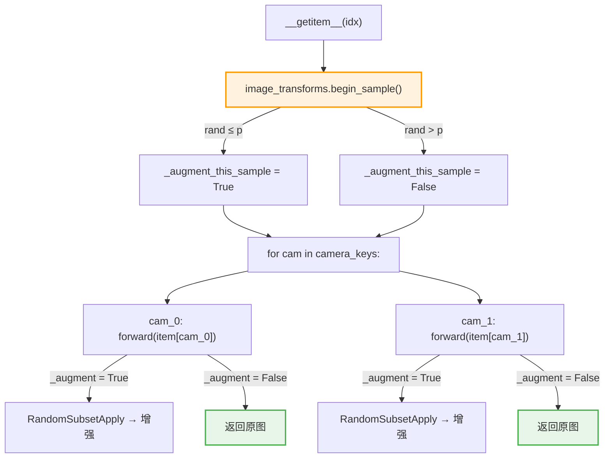

# 实施方案：ImageTransformsConfig 顶层概率门控 `p`（修订版）

> **目标**：为图像数据增强流水线增加一个顶层概率参数 `p`，控制"是否应用数据增强"的概率。`p=0.8` 表示 80% 的样本经过数据增强，20% 完全不增强。
> **一致性保证**：同一 sample 的所有相机、所有帧共享同一个增强/跳过决策。
> **基于**: 当前 dtaug2 实验（全部 6 种增强 + affine@0.2）的代码和配置
> **日期**: 2026-09-23

---

## 1. 问题分析

### 1.1 现状

当前 `RandomSubsetApply.forward()` 在 [`transforms.py:74-87`](src/lerobot/datasets/transforms.py#L74-L87) 中**无条件**采样并应用 `n_subset` 个变换，没有"跳过增强"的路径。只要 `enable=True` 且有可用变换，**每张图片 100% 被增强**。

### 1.2 帧内一致性的现状

**已有保证**：torchvision v2 的 `RandomAffine` 对 `[T, C, H, W]` batch tensor 生成**一组**参数并应用到**所有 T 帧**。实验验证如下：

```python
uniform = torch.ones(4, 3, 64, 64) * 0.5
tf = v2.RandomAffine(degrees=(-5, 5), translate=(0.05, 0.05))
out = tf(uniform)
torch.allclose(out[0], out[1])  # True — 所有帧同一变换
torch.allclose(out[0], out[3])  # True
```

因此，同一 `self.image_transforms(item[cam])` 调用中的所有帧（当前帧 + delta 帧）已经共享相同的 affine 参数。

**未保证**：多相机场景下，每个 camera 独立调用 `forward()`，增强决策独立。如果 `p` 门控放在 `forward()` 内，同一 sample 的不同相机可能一个增强一个不增强。

### 1.3 目标

引入参数 `p ∈ [0.0, 1.0]`，语义为 **per-sample 开关**：

- 在每个 sample 的 `__getitem__` 开始时，掷一次骰子决定"增强"或"跳过"
- 该决策对该 sample 的**所有相机、所有帧**生效
- 不同 sample 之间独立决策

**一致性矩阵**：

| 范围 | 一致性 | 由谁保证 |
|:---|:---|:---|
| 同一 camera 的多帧 | ✅ 相同 affine 参数 | torchvision v2 batch 行为 |
| 同一 sample 的多 camera | ✅ 相同增强/跳过决策 | **本方案 `begin_sample()` 机制** |
| 不同 sample | ❌ 独立随机 | 预期行为 |

### 1.4 为什么不做 per-batch

PyTorch DataLoader 中 `__getitem__` 由多个 worker 进程独立调用，每个 worker 不知道自己属于哪个 batch。真正的 per-batch 需要修改训练循环（在 collate 之后、forward 之前做增强），改动量大且侵入性强。

per-sample 已经满足核心需求：**同一 sample 内所有视觉数据的增强决策一致**。不同 sample 间的独立性反而有利于训练——如果整个 batch 统一跳过，会导致该 step 的梯度完全来自"无增强"分布，造成梯度信号不均匀。

---

## 2. 代码改动

### 2.1 涉及文件

| 文件 | 改动 | 性质 |
|:---|:---|:---|
| `src/lerobot/datasets/transforms.py` | 配置加字段 + `begin_sample()` + `forward()` 门控 | **核心** |
| `src/lerobot/datasets/lerobot_dataset.py` | `__getitem__` 中调用 `begin_sample()` | **适配** |
| `src/lerobot/datasets/streaming_dataset.py` | 同上 | **适配** |

共 **3 个文件**，总计 **约 12 行代码**。

### 2.2 改动详情

#### 改动 1：`ImageTransformsConfig` 加 `p` 字段

**位置**: [`transforms.py:165-216`](src/lerobot/datasets/transforms.py#L165-L216)

```python
@dataclass
class ImageTransformsConfig:
    enable: bool = False
    max_num_transforms: int = 3
    random_order: bool = False
+   p: float = 1.0
    disabled_tfs: list[str] = field(default_factory=list)
    tfs: dict[str, ImageTransformConfig] = field(
        default_factory=lambda: { ... }
    )
```

**默认值 `p=1.0`** → 完全向后兼容。

#### 改动 2：`ImageTransforms` 加 `begin_sample()` 和门控

**位置**: [`transforms.py:232-261`](src/lerobot/datasets/transforms.py#L232-L261)

```python
class ImageTransforms(Transform):
    def __init__(self, cfg: ImageTransformsConfig) -> None:
        super().__init__()
        self._cfg = cfg
+       self._p = cfg.p
+       self._augment_this_sample = True

        self.weights = []
        self.transforms = {}
        # ... 构建 self.tf 不变 ...

+   def begin_sample(self):
+       """Call once per sample before the camera loop.
+       Caches augment/skip decision for all subsequent forward() calls."""
+       self._augment_this_sample = (self._p >= 1.0) or (torch.rand(1).item() <= self._p)

    def forward(self, *inputs: Any) -> Any:
+       if not self._augment_this_sample:
+           return inputs[0] if len(inputs) == 1 else inputs
        return self.tf(*inputs)
```

**设计要点**：
- `begin_sample()` 掷骰子，结果缓存到 `self._augment_this_sample`
- 后续每次 `forward()` 调用（每个 camera 一次）都读取缓存值，不再重新掷骰子
- `p >= 1.0` 短路：默认值时完全不调用 `torch.rand`，零开销

#### 改动 3：`LeRobotDataset.__getitem__()` 调用 `begin_sample()`

**位置**: [`lerobot_dataset.py:1076-1079`](src/lerobot/datasets/lerobot_dataset.py#L1076-L1079)

```python
        if self.image_transforms is not None:
+           self.image_transforms.begin_sample()
            image_keys = self.meta.camera_keys
            for cam in image_keys:
                item[cam] = self.image_transforms(item[cam])
```

#### 改动 4：`StreamingLeRobotDataset` 同样适配

**位置**: [`streaming_dataset.py:338-341`](src/lerobot/datasets/streaming_dataset.py#L338-L341)

```python
            if self.image_transforms is not None:
+               self.image_transforms.begin_sample()
                image_keys = self.meta.camera_keys
                for cam in image_keys:
                    video_frames[cam] = self.image_transforms(video_frames[cam])
```

### 2.3 完整 diff

```diff
--- a/src/lerobot/datasets/transforms.py
+++ b/src/lerobot/datasets/transforms.py
@@ -173,6 +173,7 @@ class ImageTransformsConfig:
     enable: bool = False
     max_num_transforms: int = 3
     random_order: bool = False
+    p: float = 1.0
     disabled_tfs: list[str] = field(default_factory=list)
     tfs: dict[str, ImageTransformConfig] = field(
         default_factory=lambda: {
@@ -235,6 +236,8 @@ class ImageTransforms(Transform):
     def __init__(self, cfg: ImageTransformsConfig) -> None:
         super().__init__()
         self._cfg = cfg
+        self._p = cfg.p
+        self._augment_this_sample = True
 
         self.weights = []
         self.transforms = {}
@@ -258,5 +261,11 @@ class ImageTransforms(Transform):
             )
 
+    def begin_sample(self):
+        self._augment_this_sample = (self._p >= 1.0) or (torch.rand(1).item() <= self._p)
+
     def forward(self, *inputs: Any) -> Any:
+        if not self._augment_this_sample:
+            return inputs[0] if len(inputs) == 1 else inputs
         return self.tf(*inputs)
 
--- a/src/lerobot/datasets/lerobot_dataset.py
+++ b/src/lerobot/datasets/lerobot_dataset.py
@@ -1076,6 +1076,7 @@ class LeRobotDataset(torch.utils.data.Dataset):
         if self.image_transforms is not None:
+            self.image_transforms.begin_sample()
             image_keys = self.meta.camera_keys
             for cam in image_keys:
                 item[cam] = self.image_transforms(item[cam])
 
--- a/src/lerobot/datasets/streaming_dataset.py
+++ b/src/lerobot/datasets/streaming_dataset.py
@@ -338,6 +338,7 @@ class StreamingLeRobotDataset(torch.utils.data.IterableDataset):
             if self.image_transforms is not None:
+                self.image_transforms.begin_sample()
                 image_keys = self.meta.camera_keys
                 for cam in image_keys:
                     video_frames[cam] = self.image_transforms(video_frames[cam])
```

---

## 3. 调用链与一致性保证

### 3.1 数据流图



### 3.2 一致性总结

一个 sample 的处理流程（以双目 + 4帧为例）：

```
__getitem__(idx):
  begin_sample()          → 掷骰子一次: augment=True
  ┌─ cam_left  [4,C,H,W] → forward() → _augment=True → RandomSubsetApply
  │    ├─ frame_0: affine(θ=2.3°, tx=0.01)  ← RandomAffine 生成一组参数
  │    ├─ frame_1: affine(θ=2.3°, tx=0.01)  ← 同上，torchvision batch 保证
  │    ├─ frame_2: affine(θ=2.3°, tx=0.01)
  │    └─ frame_3: affine(θ=2.3°, tx=0.01)
  │
  └─ cam_right [4,C,H,W] → forward() → _augment=True → RandomSubsetApply
       ├─ frame_0: affine(θ=-1.7°, tx=0.03) ← 新一组参数（独立 forward 调用）
       ├─ frame_1: affine(θ=-1.7°, tx=0.03)
       ├─ frame_2: affine(θ=-1.7°, tx=0.03)
       └─ frame_3: affine(θ=-1.7°, tx=0.03)
```

| 保证 | 描述 | 机制 |
|:---|:---|:---|
| ✅ 同相机所有帧：相同 affine 参数 | torchvision v2 对 `[T,C,H,W]` 生成一组参数 | 已有 |
| ✅ 所有相机：相同增强/跳过决策 | `begin_sample()` 缓存决策 | **本方案** |
| ⚠️ 不同相机：affine 参数不同 | 独立的 `forward()` 调用，独立的随机参数 | 已有行为，未改变 |
| ✅ 不同 sample：独立随机 | 独立的 `begin_sample()` 调用 | 预期行为 |

**关于不同相机 affine 参数不同**：这是当前已有的行为（与 `p` 无关）。cam_left 和 cam_right 本身视角就不同，独立的 affine 参数在物理上是合理的（略微不同的抖动）。若需要跨相机同参数，需改 `RandomSubsetApply` 缓存随机种子，这是另一个独立改动。

---

## 4. 影响与风险分析

### 4.1 向后兼容性 ✅ 无风险

| 场景 | `p` 值 | `begin_sample()` 被调用? | 行为 | 与当前对比 |
|:---|:---|:---|:---|:---|
| 默认（不传 `p`） | `1.0` | 是，但 `p>=1.0` 短路 | 100% 增强 | **完全一致** |
| 现有 dtaug2 训练 | `1.0` | 是 | 100% 增强 | **完全一致** |
| 增强关闭 (`enable=false`) | 任意 | `image_transforms` 为 None | 不增强 | **完全一致** |
| 旧代码不调 `begin_sample()` | 任意 | 否 | `_augment_this_sample=True`（默认） | **完全一致** |

最后一行很重要：如果有其他地方直接调用 `ImageTransforms` 但没有调 `begin_sample()`，由于 `_augment_this_sample` 初始化为 `True`，行为与不加 `p` 完全一致——**绝不会意外跳过增强**。

### 4.2 性能影响 ✅ 可忽略

- `p=1.0` 时：`begin_sample()` 中 `self._p >= 1.0` 短路，不调用 `torch.rand`；`forward()` 中 `_augment_this_sample=True` 直达 `self.tf()`。零开销。
- `p<1.0` 时：每个 sample 多一次 `torch.rand(1).item()` (~1μs)，且跳过增强时反而更快。

### 4.3 DataLoader 多 worker 安全 ✅

每个 worker 有独立的 `ImageTransforms` 实例副本（`fork` 语义），`_augment_this_sample` 是实例变量，无跨 worker 竞争。`torch.rand` 在每个 worker 中有独立的 RNG 状态。

### 4.4 与 draccus CLI 兼容性 ✅

`p` 是 `float` 标量字段，draccus 直接解析：

```bash
--dataset.image_transforms.p=0.8    # ✅ 直接生效
```

### 4.5 训练稳定性 ⚠️ 需实验验证

- **推荐范围**: `p ∈ [0.7, 0.9]`
- `p=0.8`：每个 batch (16 samples) 平均 ~3.2 个 sample 不增强，~12.8 个增强
  - 梯度信号混合了"增强"和"原始"分布，比 per-batch 全开/全关更平滑
- `p` 过低（<0.5）：增强效果弱；过高（>0.95）：与 1.0 无区别

### 4.6 与其他增强参数的交互

| 参数组合 | 语义 | 每图增强概率 | 每图 affine 概率 |
|:---|:---|:---|:---|
| `p=0.8, max_num_transforms=3, 6 种变换, affine@0.2` | 80% sample 增强，其中 ~11.1% 含 affine | 80% | ≈ 8.9% |
| `p=1.0`（默认） | 与当前 dtaug2 完全一致 | 100% | ≈ 11.1% |

---

## 5. 训练脚本

### 5.1 新实验命名

`EXPR_NAME=itvlagpFrkPlug0907_dtaug2p`（在 dtaug2 基础上加 `p` 后缀）

### 5.2 启动脚本关键改动

基于 `b/d/Frk/expr/sftaug2/frk_plug_sft_dtaug2_launch.sh`，改动 3 处：

```bash
# ── (1) 实验名 ──
EXPR_NAME="${EXPR_NAME:-itvlagpFrkPlug0907_dtaug2p}"

# ── (2) 起点 checkpoint ──
# 方案 A: 从 dtaug2@20000 继续（若 dtaug2 训完）
PRETRAINED_CKPT="${PRETRAINED_CKPT:-${HOME}/b/Ckp/itvlagpFrkPlug0907_dtaug2/2026_09_22_20_04_17-internvla_a1_5-frk-plug-sft-dtaug2/checkpoints/020000/pretrained_model}"
# 方案 B: 从原始 SFT@10420 重新开始（控制变量实验）
# PRETRAINED_CKPT="${PRETRAINED_CKPT:-${HOME}/b/Ckp/itvlagpFrkPlug0907/2026_09_07_07_17_08-internvla_a1_5-frk-plug-sft/checkpoints/010420/pretrained_model}"

# ── (3) 增强概率参数 ──
AUGMENT_P="${AUGMENT_P:-0.8}"
```

### 5.3 训练参数数组中的关键新增

```bash
    # ── Image augmentation: ALL 6 transforms, affine@0.2, p=0.8 ──
    --dataset.image_transforms.enable=true
    --dataset.image_transforms.max_num_transforms=3
    --dataset.image_transforms.random_order=false
    --dataset.image_transforms.p="${AUGMENT_P}"
    '--dataset.image_transforms.disabled_tfs=[]'
    "--dataset.image_transforms.tfs=${TFS_CONFIG}"
```

相比 dtaug2 脚本，仅多了一行 `--dataset.image_transforms.p="${AUGMENT_P}"`。

### 5.4 echo 信息更新

```bash
echo "Image augmentation: ALL 6, affine@0.2, p=${AUGMENT_P} (per-sample gate)"
```

### 5.5 完整的启动脚本路径

```
b/d/Frk/expr/sftaug2/frk_plug_sft_dtaug2p_launch.sh
```

---

## 6. 实施步骤

### Step 1: 代码改动 (3 文件, ~12 行)

#### 1a. `src/lerobot/datasets/transforms.py`

`ImageTransformsConfig` 加字段：
```python
    p: float = 1.0
```

`ImageTransforms` 加 `begin_sample()` + 修改 `forward()`：
```python
class ImageTransforms(Transform):
    def __init__(self, cfg: ImageTransformsConfig) -> None:
        super().__init__()
        self._cfg = cfg
        self._p = cfg.p
        self._augment_this_sample = True
        # ... 后续不变 ...

    def begin_sample(self):
        self._augment_this_sample = (self._p >= 1.0) or (torch.rand(1).item() <= self._p)

    def forward(self, *inputs: Any) -> Any:
        if not self._augment_this_sample:
            return inputs[0] if len(inputs) == 1 else inputs
        return self.tf(*inputs)
```

#### 1b. `src/lerobot/datasets/lerobot_dataset.py` (L1076)

```python
        if self.image_transforms is not None:
            self.image_transforms.begin_sample()      # ← 新增
            image_keys = self.meta.camera_keys
            for cam in image_keys:
                item[cam] = self.image_transforms(item[cam])
```

#### 1c. `src/lerobot/datasets/streaming_dataset.py` (L338)

```python
            if self.image_transforms is not None:
                self.image_transforms.begin_sample()   # ← 新增
                image_keys = self.meta.camera_keys
                for cam in image_keys:
                    video_frames[cam] = self.image_transforms(video_frames[cam])
```

### Step 2: Smoke 测试

```bash
# (a) p=0 应完全不增强
SMOKE=1 AUGMENT_P=0.0 bash b/d/Frk/expr/sftaug2/frk_plug_sft_dtaug2p_launch.sh

# (b) p=1 应与 dtaug2 完全一致
SMOKE=1 AUGMENT_P=1.0 bash b/d/Frk/expr/sftaug2/frk_plug_sft_dtaug2p_launch.sh

# (c) WAN smoke: 确保 WAN 分支不受影响
WAN_SMOKE=1 AUGMENT_P=0.8 bash b/d/Frk/expr/sftaug2/frk_plug_sft_dtaug2p_launch.sh

# (d) 目标值 smoke
SMOKE=1 AUGMENT_P=0.8 bash b/d/Frk/expr/sftaug2/frk_plug_sft_dtaug2p_launch.sh
```

### Step 3: 验证 per-sample 一致性

```python
# 临时验证脚本 (不合入训练代码)
from lerobot.datasets.transforms import ImageTransformsConfig, ImageTransforms
import torch

cfg = ImageTransformsConfig(enable=True, p=0.5)
tf = ImageTransforms(cfg)

# Simulate: 2 cameras × 4 frames per camera
cam_left  = torch.rand(4, 3, 64, 64)
cam_right = torch.rand(4, 3, 64, 64)

both_aug, both_skip, inconsistent = 0, 0, 0
for _ in range(10000):
    tf.begin_sample()
    out_l = tf(cam_left)
    out_r = tf(cam_right)
    l_aug = not torch.equal(out_l, cam_left)
    r_aug = not torch.equal(out_r, cam_right)
    if l_aug and r_aug:
        both_aug += 1
    elif not l_aug and not r_aug:
        both_skip += 1
    else:
        inconsistent += 1

print(f"Both augmented: {both_aug}  Both skipped: {both_skip}  Inconsistent: {inconsistent}")
# 预期: p=0.5 → ~5000 augmented, ~5000 skipped, 0 inconsistent
```

### Step 4: 创建启动脚本

```bash
cp b/d/Frk/expr/sftaug2/frk_plug_sft_dtaug2_launch.sh \
   b/d/Frk/expr/sftaug2/frk_plug_sft_dtaug2p_launch.sh
```

修改 EXPR_NAME、PRETRAINED_CKPT、新增 AUGMENT_P 和 `--dataset.image_transforms.p`。

### Step 5: Production 训练

```bash
nvidia-smi  # 确认 GPU 空闲
nohup bash b/d/Frk/expr/sftaug2/frk_plug_sft_dtaug2p_launch.sh \
  > /tmp/frk_plug_sft_dtaug2p_wrapper.log 2>&1 &
echo "Wrapper PID: $!"
```

---

## 7. 微调训练操作手册

### 7.0 前提条件

- [ ] 代码改动已完成（`transforms.py` + `lerobot_dataset.py` + `streaming_dataset.py`）
- [ ] 启动脚本 `frk_plug_sft_dtaug2p_launch.sh` 已创建
- [ ] 当前 dtaug2 训练已完成或有可用 checkpoint
- [ ] GPU 空闲（`nvidia-smi` 无占用进程）

### 7.1 预飞检查

```bash
# 1. 确认 transforms.py 改动
grep -n "def begin_sample" src/lerobot/datasets/transforms.py
# 预期: "def begin_sample(self):"

grep -n "p: float" src/lerobot/datasets/transforms.py
# 预期: "p: float = 1.0"

# 2. 确认 dataset 调用
grep -n "begin_sample" src/lerobot/datasets/lerobot_dataset.py
# 预期: "self.image_transforms.begin_sample()"

grep -n "begin_sample" src/lerobot/datasets/streaming_dataset.py
# 预期: "self.image_transforms.begin_sample()"

# 3. 确认 checkpoint 存在
ls -lh <PRETRAINED_CKPT>/model.safetensors

# 4. GPU 空闲
nvidia-smi --query-compute-apps=pid --format=csv,noheader
```

### 7.2 Smoke 测试

```bash
WAN_SMOKE=1 bash b/d/Frk/expr/sftaug2/frk_plug_sft_dtaug2p_launch.sh 2>&1 | tail -20
# ✅ 无 error, 出现 loss 值

SMOKE=1 bash b/d/Frk/expr/sftaug2/frk_plug_sft_dtaug2p_launch.sh 2>&1 | tail -20
# ✅ 10 steps 完成, checkpoint 保存成功
```

### 7.3 Production 启动

```bash
nohup bash b/d/Frk/expr/sftaug2/frk_plug_sft_dtaug2p_launch.sh \
  > /tmp/frk_plug_sft_dtaug2p_wrapper.log 2>&1 &
WRAPPER_PID=$!
echo "Wrapper PID: ${WRAPPER_PID}"

sleep 120
tail -5 /tmp/frk_plug_sft_dtaug2p_wrapper.log
# ✅ 看到 "Training started (PID=...)"
```

### 7.4 监控 & Checkpoint 验证

```bash
tail -f /B/Log/itvlagpFrkPlug0907_dtaug2p/<TIMESTAMP>/train.log
grep 'step:' /B/Log/itvlagpFrkPlug0907_dtaug2p/<TIMESTAMP>/train.log | tail -3

# Checkpoint 完整性
ls -lh ~/b/Ckp/itvlagpFrkPlug0907_dtaug2p/<JOB>/checkpoints/<STEP>/pretrained_model/
cat ~/b/Ckp/itvlagpFrkPlug0907_dtaug2p/<JOB>/checkpoints/<STEP>/training_state/training_step.json
```

### 7.5 训练结束后

脚本内置自动监控会打包日志到 `~/b/Ckp/` 并启动 bigmatrix。

---

## 8. 与 dtaug2 的对比实验设计

### 8.1 控制变量

| 参数 | dtaug2 | dtaug2p |
|:---|:---|:---|
| `p` (增强概率) | `1.0` (隐式) | `0.8` |
| 6 种增强 | ✅ 全开 | ✅ 全开 |
| affine weight | 0.2 | 0.2 |
| max_num_transforms | 3 | 3 |
| per-sample 一致性 | N/A | ✅ begin_sample() |
| 起点 checkpoint | SFT@10420 | **待定** (见 5.2) |
| 训练步数 | 20000 | 20000 |
| 其余参数 | — | **完全一致** |

### 8.2 预期效果

- 20% 的 sample 不做任何增强，为模型提供"真实分布锚点"
- 同一 sample 内所有相机、所有帧的增强决策完全一致
- 验证指标：LIBERO / RoboTwin eval 成功率

### 8.3 消融方向

- `p=0.7` vs `p=0.8` vs `p=0.9`
- 组合方案 1+2：per-sample `p` 门控 + 可变 `n_subset`（`min_num_transforms=0`）

---

## 9. 参考

- 当前 dtaug2 启动脚本: [`b/d/Frk/expr/sftaug2/frk_plug_sft_dtaug2_launch.sh`](b/d/Frk/expr/sftaug2/frk_plug_sft_dtaug2_launch.sh)
- 数据增强核心代码: [`src/lerobot/datasets/transforms.py`](src/lerobot/datasets/transforms.py)
- 数据集增强调用: [`src/lerobot/datasets/lerobot_dataset.py:1076-1079`](src/lerobot/datasets/lerobot_dataset.py#L1076-L1079)
- 流式数据集增强调用: [`src/lerobot/datasets/streaming_dataset.py:338-341`](src/lerobot/datasets/streaming_dataset.py#L338-L341)
- 配置定义: [`src/lerobot/configs/default.py:37`](src/lerobot/configs/default.py#L37)
- torchvision v2 RandomAffine batch 行为验证: 本文档 §1.2 实验
