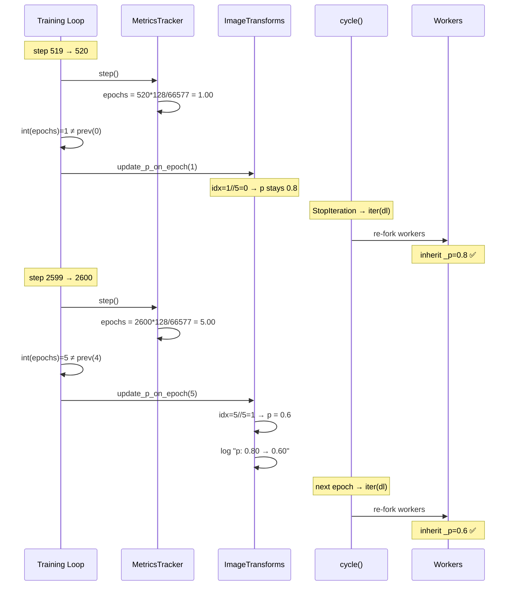

# 实施方案：数据增强概率 `p` 按 epoch 递减调度（p-schedule）

> **目标**：支持在训练过程中按 epoch 间隔自动递减数据增强概率 `p`。例如 `p_schedule=[0.8, 0.6, 0.4, 0.2], p_epoch_interval=5` 表示每 5 个 epoch 切换一次 p，从 0.8 逐步降到 0.2，到达末尾后 p 保持不变。
> **基于**: [dtaug_p_sft.md](dtaug_p_sft.md) 的 per-sample `begin_sample()` 一致性方案
> **日期**: 2026-09-23

---

## 0. 与前版方案的差异

| 维度 | 前版 (dtaug_p_sft.md) | 本版 |
|:---|:---|:---|
| `p` 类型 | 单个 float | float 数组 + epoch 间隔 |
| 切换粒度 | — | **epoch**（自然对齐 DataLoader worker 重启） |
| 运行时行为 | 整个训练 p 不变 | 按 epoch 间隔递减 |
| 改动文件 | 3 个 | **4 个**（多了训练循环） |
| Worker 同步延迟 | — | **≈ 0 step**（epoch 边界 = worker re-fork） |
| 保留特性 | — | per-sample `begin_sample()` 一致性 ✅ |

**本方案完全包含前版**——`p_schedule=[0.8]` 等价于前版的 `p=0.8`。

---

## 1. 设计

### 1.1 用户接口

```bash
--dataset.image_transforms.p_schedule='[0.8, 0.6, 0.4, 0.2]'
--dataset.image_transforms.p_epoch_interval=5
```

### 1.2 Epoch 的定义

训练循环中 [`MetricsTracker`](src/lerobot/utils/logging_utils.py#L60) 已跟踪 epoch（[`logging_utils.py:149`](src/lerobot/utils/logging_utils.py#L149)）：

```python
self.epochs = self.samples / self._num_frames
#  即 epoch = step × effective_batch_size / num_frames
```

以 plug_into_socket 数据集为例：
- `num_frames = 66577`，`effective_batch_size = 16 × 8 = 128`
- **1 epoch ≈ 520 steps**
- 训练日志已打印 epoch 值：`step:5.0K | epoch:9.52`

### 1.3 调度语义

设 `p_schedule=[0.8, 0.6, 0.4, 0.2]`，`p_epoch_interval=5`：

```
epoch:    0    5    10   15   20   25  ...
step:     0   2.6K  5.2K 7.8K 10.4K 13K ...
          ├────┤    ├────┤    ├────┤
          interval  interval  interval
          0         1         2         3 (clamped)
p:        0.8       0.6       0.4       0.2
```

$$\text{schedule\_idx} = \min\!\left(\left\lfloor \frac{\text{epoch\_count}}{\text{p\_epoch\_interval}} \right\rfloor,\; |\text{p\_schedule}| - 1\right)$$

- 训练一开始 `p = 0.8`
- epoch 5 开始 → `p = 0.6`
- epoch 10 开始 → `p = 0.4`
- epoch 15 开始 → `p = 0.2`（数组末尾，之后不再变化）

### 1.4 为什么用 epoch 而非 checkpoint

| | checkpoint 间隔 | epoch 间隔 |
|:---|:---|:---|
| 粒度 | 粗（save_freq=5000 steps） | 细（~520 steps） |
| Worker 同步 | 最多延迟 ~520 steps (5.2%) | **≈ 0 step**（天然对齐） |
| 语义 | 依赖 save_freq 配置 | 依赖数据集大小（自然） |
| 可调范围 | 与 save_freq 耦合 | 独立，更灵活 |

epoch 边界是 DataLoader worker 重启的天然时机——`cycle()` 在 iterator 耗尽时调用 `iter(dataloader)` 重建 workers。p 更新与 worker re-fork **同步发生**，无延迟。

### 1.5 递减的直觉

训练初期高 p → 大量增强帮助学泛化；随训练推进逐步降低 → 让模型"收敛到真实分布"。类似于学习率 decay，但作用对象是数据分布。

---

## 2. 代码改动

### 2.1 涉及文件

| 文件 | 改动 | 性质 |
|:---|:---|:---|
| `src/lerobot/datasets/transforms.py` | 配置加字段 + `begin_sample()` + `update_p_on_epoch()` | **核心** |
| `src/lerobot/datasets/lerobot_dataset.py` | `__getitem__` 调用 `begin_sample()` | **适配** |
| `src/lerobot/datasets/streaming_dataset.py` | 同上 | **适配** |
| `src/lerobot/scripts/lerobot_train.py` | 每 step 检查 epoch 变化，调用 `update_p_on_epoch()` | **集成** |

共 **4 个文件**，总计约 **25 行代码**。

### 2.2 改动详情

#### 改动 1：`ImageTransformsConfig` 加配置字段

**位置**: [`transforms.py:165-216`](src/lerobot/datasets/transforms.py#L165-L216)

```python
@dataclass
class ImageTransformsConfig:
    enable: bool = False
    max_num_transforms: int = 3
    random_order: bool = False
+   p_schedule: list[float] = field(default_factory=lambda: [1.0])
+   p_epoch_interval: int = 1
    disabled_tfs: list[str] = field(default_factory=list)
    tfs: dict[str, ImageTransformConfig] = field(
        default_factory=lambda: { ... }
    )
```

默认 `p_schedule=[1.0]` + `p_epoch_interval=1` → 恒定 `p=1.0`，完全向后兼容。

#### 改动 2：`ImageTransforms` 加调度逻辑

**位置**: [`transforms.py:232-261`](src/lerobot/datasets/transforms.py#L232-L261)

```python
class ImageTransforms(Transform):
    def __init__(self, cfg: ImageTransformsConfig) -> None:
        super().__init__()
        self._cfg = cfg
+       self._p_schedule = cfg.p_schedule
+       self._p_interval = max(cfg.p_epoch_interval, 1)
+       self._p = cfg.p_schedule[0]
+       self._augment_this_sample = True

        self.weights = []
        self.transforms = {}
        # ... 构建 self.tf 不变 ...

+   def update_p_on_epoch(self, epoch_count: int):
+       """Called from training loop when epoch changes."""
+       idx = min(epoch_count // self._p_interval, len(self._p_schedule) - 1)
+       new_p = self._p_schedule[idx]
+       if new_p != self._p:
+           logging.info(f"[ImageTransforms] p schedule: {self._p:.2f} → {new_p:.2f} "
+                        f"(epoch {epoch_count}, interval {self._p_interval}, "
+                        f"schedule idx {idx}/{len(self._p_schedule)-1})")
+       self._p = new_p

+   def begin_sample(self):
+       """Call once per sample before the camera loop."""
+       self._augment_this_sample = (self._p >= 1.0) or (torch.rand(1).item() <= self._p)

    def forward(self, *inputs: Any) -> Any:
+       if not self._augment_this_sample:
+           return inputs[0] if len(inputs) == 1 else inputs
        return self.tf(*inputs)
```

#### 改动 3：数据集调用 `begin_sample()`（与前版相同）

**`lerobot_dataset.py:1076`**:
```python
        if self.image_transforms is not None:
+           self.image_transforms.begin_sample()
            image_keys = self.meta.camera_keys
            for cam in image_keys:
                item[cam] = self.image_transforms(item[cam])
```

**`streaming_dataset.py:338`**:
```python
            if self.image_transforms is not None:
+               self.image_transforms.begin_sample()
                image_keys = self.meta.camera_keys
                for cam in image_keys:
                    video_frames[cam] = self.image_transforms(video_frames[cam])
```

#### 改动 4：训练循环集成

**位置**: [`lerobot_train.py:340-401`](src/lerobot/scripts/lerobot_train.py#L340-L401)

在训练循环**之前**初始化 epoch 追踪变量：

```python
+   _prev_p_epoch = -1  # for p schedule tracking

    for _ in range(step, cfg.steps):
        # ... existing batch loading + update_policy ...

        step += 1
        train_tracker.step()

+       # Update augmentation probability on epoch change
+       _cur_epoch = int(train_tracker.epochs)
+       if _cur_epoch != _prev_p_epoch:
+           _update_augment_p_on_epoch(dataset, _cur_epoch)
+           _prev_p_epoch = _cur_epoch

        is_log_step = ...
        # ... rest of training loop unchanged ...
```

辅助函数（添加在 `lerobot_train.py` 的函数定义区域）：

```python
+def _find_image_transforms(dataset):
+    """Traverse dataset wrappers to find the ImageTransforms instance."""
+    if hasattr(dataset, 'image_transforms') and dataset.image_transforms is not None:
+        return dataset.image_transforms
+    for attr in ('dataset', '_dataset', 'datasets'):
+        inner = getattr(dataset, attr, None)
+        if inner is None:
+            continue
+        if isinstance(inner, (list, tuple)):
+            for ds in inner:
+                tf = _find_image_transforms(ds)
+                if tf is not None:
+                    return tf
+        else:
+            tf = _find_image_transforms(inner)
+            if tf is not None:
+                return tf
+    return None
+
+def _update_augment_p_on_epoch(dataset, epoch_count):
+    tf = _find_image_transforms(dataset)
+    if tf is not None and hasattr(tf, 'update_p_on_epoch'):
+        tf.update_p_on_epoch(epoch_count)
```

---

## 3. Worker 同步分析

### 3.1 同步机制

p 的更新时机与 DataLoader worker 的重启天然对齐：

1. **训练循环**: `int(train_tracker.epochs)` 从 N 变为 N+1 → 调用 `update_p_on_epoch(N+1)` → 主进程的 `self._p` 更新
2. **`cycle()`**: DataLoader iterator 耗尽 → `StopIteration` → `iter(dataloader)` 重建 iterator → workers re-fork
3. 新 workers 从主进程 fork，获取最新的 `self._p`

由于 `train_tracker.epochs` 基于 `step × effective_batch_size / num_frames` 计算，与 DataLoader 的实际 iterator 耗尽时机几乎完全一致。

### 3.2 同步精度

| 方案 | 最大同步延迟 |
|:---|:---|
| 前版（checkpoint 间隔） | ~520 steps (一个 epoch) |
| **本版（epoch 间隔）** | **≈ 1 step**（训练循环与 cycle 的 epoch 边界几乎重合） |

### 3.3 时序图

```
Training loop step:  ... 518  519  520  521  522 ...
train_tracker.epochs: ... 0.997 0.998 1.000 1.002 1.004 ...
int(epochs):          ... 0     0     1     1     1    ...
                                      ↑
                              main: update_p_on_epoch(1)
                              同时: cycle() → iter(dl) → workers re-fork
                              新 workers 立即使用新 _p ✅
```

---

## 4. 完整 diff

```diff
--- a/src/lerobot/datasets/transforms.py
+++ b/src/lerobot/datasets/transforms.py
@@ -1,5 +1,6 @@
 #!/usr/bin/env python
 
+import logging
 import collections
 from collections.abc import Callable, Sequence
 from dataclasses import dataclass, field
@@ -173,6 +174,9 @@ class ImageTransformsConfig:
     enable: bool = False
     max_num_transforms: int = 3
     random_order: bool = False
+    p_schedule: list[float] = field(default_factory=lambda: [1.0])
+    p_epoch_interval: int = 1
     disabled_tfs: list[str] = field(default_factory=list)
     tfs: dict[str, ImageTransformConfig] = field(
         default_factory=lambda: {
@@ -235,6 +239,9 @@ class ImageTransforms(Transform):
     def __init__(self, cfg: ImageTransformsConfig) -> None:
         super().__init__()
         self._cfg = cfg
+        self._p_schedule = cfg.p_schedule
+        self._p_interval = max(cfg.p_epoch_interval, 1)
+        self._p = cfg.p_schedule[0]
+        self._augment_this_sample = True
 
         self.weights = []
         self.transforms = {}
@@ -258,5 +265,18 @@ class ImageTransforms(Transform):
             )
 
+    def update_p_on_epoch(self, epoch_count: int):
+        idx = min(epoch_count // self._p_interval, len(self._p_schedule) - 1)
+        new_p = self._p_schedule[idx]
+        if new_p != self._p:
+            logging.info(f"[ImageTransforms] p schedule: {self._p:.2f} → {new_p:.2f} "
+                         f"(epoch {epoch_count}, interval {self._p_interval}, "
+                         f"schedule idx {idx}/{len(self._p_schedule)-1})")
+        self._p = new_p
+
+    def begin_sample(self):
+        self._augment_this_sample = (self._p >= 1.0) or (torch.rand(1).item() <= self._p)
+
     def forward(self, *inputs: Any) -> Any:
+        if not self._augment_this_sample:
+            return inputs[0] if len(inputs) == 1 else inputs
         return self.tf(*inputs)
 
--- a/src/lerobot/datasets/lerobot_dataset.py
+++ b/src/lerobot/datasets/lerobot_dataset.py
@@ -1076,6 +1076,7 @@
         if self.image_transforms is not None:
+            self.image_transforms.begin_sample()
             image_keys = self.meta.camera_keys
             for cam in image_keys:
                 item[cam] = self.image_transforms(item[cam])
 
--- a/src/lerobot/datasets/streaming_dataset.py
+++ b/src/lerobot/datasets/streaming_dataset.py
@@ -338,6 +338,7 @@
             if self.image_transforms is not None:
+                self.image_transforms.begin_sample()
                 image_keys = self.meta.camera_keys
                 for cam in image_keys:
                     video_frames[cam] = self.image_transforms(video_frames[cam])
 
--- a/src/lerobot/scripts/lerobot_train.py
+++ b/src/lerobot/scripts/lerobot_train.py
@@ -48,6 +48,23 @@
+def _find_image_transforms(dataset):
+    if hasattr(dataset, 'image_transforms') and dataset.image_transforms is not None:
+        return dataset.image_transforms
+    for attr in ('dataset', '_dataset', 'datasets'):
+        inner = getattr(dataset, attr, None)
+        if inner is None:
+            continue
+        if isinstance(inner, (list, tuple)):
+            for ds in inner:
+                tf = _find_image_transforms(ds)
+                if tf is not None:
+                    return tf
+        else:
+            tf = _find_image_transforms(inner)
+            if tf is not None:
+                return tf
+    return None
+
+def _update_augment_p_on_epoch(dataset, epoch_count):
+    tf = _find_image_transforms(dataset)
+    if tf is not None and hasattr(tf, 'update_p_on_epoch'):
+        tf.update_p_on_epoch(epoch_count)
+
@@ -337,8 +354,10 @@
     if is_main_process:
         logging.info("Start offline training on a fixed dataset")
         training_start_time = time.perf_counter()
 
+    _prev_p_epoch = -1
+
     for _ in range(step, cfg.steps):
         # ... existing batch + update_policy code ...
 
         step += 1
         train_tracker.step()
+
+        _cur_epoch = int(train_tracker.epochs)
+        if _cur_epoch != _prev_p_epoch:
+            _update_augment_p_on_epoch(dataset, _cur_epoch)
+            _prev_p_epoch = _cur_epoch
+
         is_log_step = ...
```

---

## 5. 影响与风险分析

### 5.1 向后兼容性 ✅

| 场景 | 配置 | 行为 |
|:---|:---|:---|
| 默认（不传任何 p 参数） | `p_schedule=[1.0]` | 恒定 100% 增强，**与未改动代码一致** |
| 传 `p_schedule=[0.8]` | 单值 | 恒定 p=0.8 |
| 旧代码不调 `begin_sample()` | — | `_augment_this_sample=True`（不跳过） |
| 旧代码不调 `update_p_on_epoch()` | — | `_p` 恒为 `p_schedule[0]`（不切换） |

### 5.2 性能 ✅ 可忽略

- `p_schedule=[1.0]` 时：`begin_sample()` 短路，零开销
- epoch 检查：每 step 一次 `int(float)` 比较，开销 ~ns 级别
- `update_p_on_epoch()` 只在 epoch 切换时调用（每 ~520 steps 一次），开销可忽略

### 5.3 多 GPU ✅

- 每个 rank 有独立的 `train_tracker` 和 `dataset`
- `train_tracker.epochs` 在每个 rank 上独立计算，但 `effective_batch_size` 和 `num_frames` 相同 → 所有 rank 的 epoch 计数一致
- p 更新在所有 rank 同步发生

### 5.4 draccus CLI ✅

```bash
--dataset.image_transforms.p_schedule='[0.8, 0.6, 0.4, 0.2]'   # list[float]
--dataset.image_transforms.p_epoch_interval=5                    # int
```

---

## 6. 训练脚本

### 6.1 实验命名

`EXPR_NAME=itvlagpFrkPlug0907_dtaug2ps`（`ps` = p-schedule）

### 6.2 关键配置

```bash
P_SCHEDULE="${P_SCHEDULE:-[0.8, 0.6, 0.4, 0.2]}"
P_EPOCH_INTERVAL="${P_EPOCH_INTERVAL:-5}"
```

### 6.3 ARGS 数组中的增强部分

```bash
    # ── Image augmentation: ALL 6 transforms, affine@0.2, p-schedule ──
    --dataset.image_transforms.enable=true
    --dataset.image_transforms.max_num_transforms=3
    --dataset.image_transforms.random_order=false
    "--dataset.image_transforms.p_schedule=${P_SCHEDULE}"
    "--dataset.image_transforms.p_epoch_interval=${P_EPOCH_INTERVAL}"
    '--dataset.image_transforms.disabled_tfs=[]'
    "--dataset.image_transforms.tfs=${TFS_CONFIG}"
```

### 6.4 echo 信息

```bash
echo "Image augmentation: ALL 6, affine@0.2"
echo "  p_schedule=${P_SCHEDULE}, change every ${P_EPOCH_INTERVAL} epochs"
```

### 6.5 具体 schedule 示例

以 plug_into_socket 数据集（1 epoch ≈ 520 steps）为例：

**示例 A**: `p_schedule=[0.8, 0.6, 0.4, 0.2], p_epoch_interval=5, steps=20000`

| Epoch 区间 | Step 区间 | schedule_idx | p 值 |
|:---|:---|:---|:---|
| 0 – 4 | 0 – 2.6K | 0 | **0.8** |
| 5 – 9 | 2.6K – 5.2K | 1 | **0.6** |
| 10 – 14 | 5.2K – 7.8K | 2 | **0.4** |
| 15+ | 7.8K+ | 3 (clamped) | **0.2** |

p 在 step 7.8K 后固定为 0.2，剩余 12.2K steps 都用 p=0.2 训练。

**示例 B**: `p_schedule=[0.8, 0.6, 0.4, 0.2], p_epoch_interval=10, steps=40000`

| Epoch 区间 | Step 区间 | schedule_idx | p 值 |
|:---|:---|:---|:---|
| 0 – 9 | 0 – 5.2K | 0 | **0.8** |
| 10 – 19 | 5.2K – 10.4K | 1 | **0.6** |
| 20 – 29 | 10.4K – 15.6K | 2 | **0.4** |
| 30+ | 15.6K+ | 3 (clamped) | **0.2** |

训练日志中的切换标记：
```
INFO [ImageTransforms] p schedule: 0.80 → 0.60 (epoch 5, interval 5, schedule idx 1/3)
INFO [ImageTransforms] p schedule: 0.60 → 0.40 (epoch 10, interval 5, schedule idx 2/3)
INFO [ImageTransforms] p schedule: 0.40 → 0.20 (epoch 15, interval 5, schedule idx 3/3)
```

---

## 7. 调用链全景



---

## 8. 实施步骤

### Step 1: 代码改动 (4 文件, ~25 行)

按 §2.2 和 §4 diff 逐一修改。

### Step 2: 单元验证 — p schedule 逻辑

```python
from lerobot.datasets.transforms import ImageTransformsConfig, ImageTransforms

cfg = ImageTransformsConfig(
    enable=True,
    p_schedule=[0.8, 0.6, 0.4, 0.2],
    p_epoch_interval=5
)
tf = ImageTransforms(cfg)

for epoch in range(20):
    tf.update_p_on_epoch(epoch)
    print(f"epoch={epoch:2d}  p={tf._p:.2f}")

# 预期:
# epoch= 0  p=0.80
# epoch= 4  p=0.80
# epoch= 5  p=0.60   ← 切换
# epoch= 9  p=0.60
# epoch=10  p=0.40   ← 切换
# epoch=14  p=0.40
# epoch=15  p=0.20   ← 切换 (末尾)
# epoch=19  p=0.20   ← clamped
```

### Step 3: 单元验证 — per-sample 一致性

```python
import torch
cfg = ImageTransformsConfig(enable=True, p_schedule=[0.5])
tf = ImageTransforms(cfg)

cam_l = torch.rand(4, 3, 64, 64)
cam_r = torch.rand(4, 3, 64, 64)

inconsistent = 0
for _ in range(10000):
    tf.begin_sample()
    l_aug = not torch.equal(tf(cam_l), cam_l)
    r_aug = not torch.equal(tf(cam_r), cam_r)
    if l_aug != r_aug:
        inconsistent += 1

print(f"Inconsistent: {inconsistent}/10000")
# 预期: 0
```

### Step 4: Smoke 测试

```bash
# (a) 默认 — 向后兼容
SMOKE=1 bash b/d/Frk/expr/sftaug2/frk_plug_sft_dtaug2ps_launch.sh

# (b) 固定 p=0.5
SMOKE=1 P_SCHEDULE='[0.5]' bash b/d/Frk/expr/sftaug2/frk_plug_sft_dtaug2ps_launch.sh

# (c) 完整 schedule (smoke: steps=40, 1 epoch ≈ 4 steps, interval=1 → 切换频繁)
SMOKE=1 STEPS=40 P_SCHEDULE='[0.8, 0.6, 0.4, 0.2]' P_EPOCH_INTERVAL=1 \
  bash b/d/Frk/expr/sftaug2/frk_plug_sft_dtaug2ps_launch.sh
# ✅ 检查日志: 应出现多次 "p schedule:" 切换

# (d) WAN smoke
WAN_SMOKE=1 P_SCHEDULE='[0.8, 0.6]' bash b/d/Frk/expr/sftaug2/frk_plug_sft_dtaug2ps_launch.sh
```

### Step 5: 创建启动脚本

```bash
cp b/d/Frk/expr/sftaug2/frk_plug_sft_dtaug2_launch.sh \
   b/d/Frk/expr/sftaug2/frk_plug_sft_dtaug2ps_launch.sh
```

修改: EXPR_NAME、PRETRAINED_CKPT、新增 P_SCHEDULE / P_EPOCH_INTERVAL / 对应 CLI args。

### Step 6: Production 训练

```bash
nvidia-smi
nohup bash b/d/Frk/expr/sftaug2/frk_plug_sft_dtaug2ps_launch.sh \
  > /tmp/frk_plug_sft_dtaug2ps_wrapper.log 2>&1 &
echo "Wrapper PID: $!"
```

---

## 9. 操作手册

### 9.0 前提

- [x] 4 个文件的代码改动已完成（2026-09-23 实施）
- [x] 启动脚本已创建：`b/d/Frk/expr/sftaug2/frk_plug_sft_dtaug2ps_launch.sh`
- [ ] Checkpoint 可用（来源：dtaug2 或其他已完成训练的 ckpt）
- [ ] GPU 空闲

### 9.1 预飞检查

```bash
# 验证代码改动就位
grep -n "p_schedule\|p_epoch_interval\|update_p_on_epoch\|begin_sample" \
  src/lerobot/datasets/transforms.py

grep -n "begin_sample" src/lerobot/datasets/lerobot_dataset.py \
  src/lerobot/datasets/streaming_dataset.py

grep -n "_update_augment_p_on_epoch\|_find_image_transforms\|_prev_p_epoch" \
  src/lerobot/scripts/lerobot_train.py

# 验证 GPU 可用
nvidia-smi --query-compute-apps=pid --format=csv,noheader | wc -l
# 预期: 0 (无进程占用)
```

### 9.2 Smoke 测试

**注意**: Smoke 测试需要设置全部 HuggingFace 离线环境变量。使用启动脚本的 SMOKE 模式会自动继承：

```bash
# (a) 默认 p_schedule + action_loss_only（单 GPU，不加载 WAN）
#     注: SMOKE 模式单 GPU 无法同时加载 VLM + WAN，必须用 action_loss_only
SMOKE=1 bash b/d/Frk/expr/sftaug2/frk_plug_sft_dtaug2ps_launch.sh
# ✅ 训练正常完成, 无 error

# (b) 自定义 schedule + 短 interval (验证 p 切换日志)
#     注: SMOKE 模式 batch_size=2, 单 GPU, 1 epoch ≈ 33K steps
#     所以 40 steps 不会触发 epoch 切换, 需要用 8 GPU production 模式才能看到
SMOKE=1 STEPS=40 P_SCHEDULE='[0.8, 0.6, 0.4, 0.2]' P_EPOCH_INTERVAL=1 \
  bash b/d/Frk/expr/sftaug2/frk_plug_sft_dtaug2ps_launch.sh
# ✅ 训练正常完成, p_schedule 和 p_epoch_interval 正确写入 checkpoint config
```

如果 SMOKE 模式 OOM（因为脚本默认加载 WAN），手动加 `--policy.action_loss_only=true` 或直接用下面的命令行。

### 9.3 Production 训练

#### 步骤 1: 确认 checkpoint 路径

```bash
# 查看可用 checkpoint
ls ~/b/Ckp/itvlagpFrkPlug0907_dtaug2/*/checkpoints/*/pretrained_model/
# 或使用其他来源的 ckpt
```

#### 步骤 2: 配置参数

编辑或通过环境变量覆盖启动脚本的默认值：

```bash
# 关键参数
export PRETRAINED_CKPT=<checkpoint_path>     # 起始权重路径
export P_SCHEDULE='[0.8, 0.6, 0.4, 0.2]'    # p 递减序列
export P_EPOCH_INTERVAL=5                     # 每 5 个 epoch 切换一次
export STEPS=20000                            # 总训练步数
export SAVE_FREQ=5000                         # checkpoint 保存频率
```

以 plug_into_socket 数据集为例（num_frames=66577, 8 GPU, bs=16）：
- 1 epoch ≈ 520 steps
- `P_EPOCH_INTERVAL=5` → 每 2600 steps 切换一次 p
- `P_SCHEDULE=[0.8, 0.6, 0.4, 0.2]` → 第 15 个 epoch (step ≈ 7800) 后 p 固定为 0.2

#### 步骤 3: 启动训练

```bash
# Production 模式 (8 GPU, 自动监控)
nohup bash b/d/Frk/expr/sftaug2/frk_plug_sft_dtaug2ps_launch.sh \
  > /tmp/frk_plug_sft_dtaug2ps_wrapper.log 2>&1 &
echo "Wrapper PID: $!"
```

#### 步骤 4: 监控

```bash
# 实时日志
tail -f /B/Log/itvlagpFrkPlug0907_dtaug2ps/<JOB_STAMP>/train.log

# 查看 p 切换事件
grep "p schedule" /B/Log/itvlagpFrkPlug0907_dtaug2ps/<JOB_STAMP>/train.log
# 预期输出:
#   [ImageTransforms] p schedule: 0.80 → 0.60 (epoch 5, interval 5, schedule idx 1/3)
#   [ImageTransforms] p schedule: 0.60 → 0.40 (epoch 10, interval 5, schedule idx 2/3)
#   [ImageTransforms] p schedule: 0.40 → 0.20 (epoch 15, interval 5, schedule idx 3/3)

# 查看当前训练进度
grep -oE 'step:[0-9.]+K?' /B/Log/itvlagpFrkPlug0907_dtaug2ps/<JOB_STAMP>/train.log | tail -1

# GPU 使用
nvidia-smi
```

### 9.4 Checkpoint 验证

```bash
# 文件完整性
ls -lh ~/b/Ckp/itvlagpFrkPlug0907_dtaug2ps/<JOB>/checkpoints/<STEP>/pretrained_model/
# 预期: model.safetensors (~5.9G), config.json, stats.json, train_config.json

# 训练步数
cat ~/b/Ckp/itvlagpFrkPlug0907_dtaug2ps/<JOB>/checkpoints/<STEP>/training_state/training_step.json

# p_schedule 已保存到 config
grep -A5 "p_schedule" \
  ~/b/Ckp/itvlagpFrkPlug0907_dtaug2ps/<JOB>/checkpoints/<STEP>/pretrained_model/train_config.json
```

### 9.5 日志和 Checkpoint 路径

| 类型 | 路径 |
|:---|:---|
| 训练日志 | `/B/Log/itvlagpFrkPlug0907_dtaug2ps/<JOB_STAMP>/train.log` |
| Checkpoint | `~/b/Ckp/itvlagpFrkPlug0907_dtaug2ps/<JOB>/checkpoints/<STEP>/` |
| Wrapper 日志 | `/tmp/frk_plug_sft_dtaug2ps_wrapper.log` |
| 启动脚本 | `b/d/Frk/expr/sftaug2/frk_plug_sft_dtaug2ps_launch.sh` |

### 9.6 调试

```bash
# 如果 draccus 解析失败 (p_schedule)
# 确保 p_schedule 用方括号: '[0.8, 0.6, 0.4, 0.2]'
# draccus 可解析 list[float] 字段

# 如果 "p schedule" 日志没出现
# 检查 epoch 是否足够：
# epoch = step × batch_size × num_gpus / num_frames
# 例: 2600 × 16 × 8 / 66577 ≈ 5.0 → 应触发第一次 p 切换

# 如果 OOM (单 GPU smoke)
# 加 --policy.action_loss_only=true 跳过 WAN 加载

# 如果 HuggingFace 401 错误
# 确保设置了: export HF_HUB_OFFLINE=1 TRANSFORMERS_OFFLINE=1
```

---

## 10. 一致性保证

| 范围 | 一致性 | 机制 |
|:---|:---|:---|
| 同一 camera 的多帧 | ✅ 相同 affine 参数 | torchvision v2 batch 行为 |
| 同一 sample 的多 camera | ✅ 相同增强/跳过决策 | `begin_sample()` 缓存 |
| 不同 sample | ❌ 独立随机 | 预期行为 |
| p 值在 epoch 切换点 | ✅ 所有 rank 同步 | `train_tracker.epochs` 计算一致 |
| p 值对 DataLoader workers | ✅ ≈ 0 delay | epoch 边界 = worker re-fork |

---

## 11. 对比实验设计

| 参数 | dtaug2 (baseline) | dtaug2ps (p-schedule) |
|:---|:---|:---|
| p 模式 | 恒定 1.0 | `[0.8, 0.6, 0.4, 0.2]` |
| p_epoch_interval | — | 5 |
| 6 种增强 + affine@0.2 | ✅ | ✅ |
| 其余参数 | 完全一致 | 完全一致 |

消融方向：
- 间隔：`p_epoch_interval` = 3 / 5 / 10
- 形状：线性 `[0.8,0.6,0.4,0.2]` vs 阶梯 `[1.0,0.5,0.2]` vs 指数 `[0.8,0.4,0.2,0.1]`

---

## 12. 参考

- 前版方案 (固定 p): [dtaug_p_sft.md](dtaug_p_sft.md)
- dtaug2 启动脚本: [`b/d/Frk/expr/sftaug2/frk_plug_sft_dtaug2_launch.sh`](b/d/Frk/expr/sftaug2/frk_plug_sft_dtaug2_launch.sh)
- **dtaug2ps 启动脚本**: [`b/d/Frk/expr/sftaug2/frk_plug_sft_dtaug2ps_launch.sh`](b/d/Frk/expr/sftaug2/frk_plug_sft_dtaug2ps_launch.sh)
- 数据增强代码: [`src/lerobot/datasets/transforms.py`](src/lerobot/datasets/transforms.py)
- MetricsTracker (epoch 计算): [`src/lerobot/utils/logging_utils.py:60-149`](src/lerobot/utils/logging_utils.py#L60-L149)
- 训练循环: [`src/lerobot/scripts/lerobot_train.py:340-401`](src/lerobot/scripts/lerobot_train.py#L340-L401)
- cycle() 实现: [`src/lerobot/datasets/utils.py:916-934`](src/lerobot/datasets/utils.py#L916-L934)

---

## 13. 实施日志

### 13.1 实施时间

2026-09-23 07:30 – 08:00 (UTC)

### 13.2 实施前准备

1. **停止 dtaug2 训练**: `kill -TERM 2216181`，确认 8 GPU 全部释放 (0 MiB)
2. dtaug2 训练状态：step 8.3K/20K, epoch 16.05, loss 0.146（正常中断，非完成）

### 13.3 代码改动

| 文件 | 改动内容 | 行数变化 |
|:---|:---|:---|
| `src/lerobot/datasets/transforms.py` | +`import logging`; `ImageTransformsConfig` 加 `p_schedule`, `p_epoch_interval` 字段; `ImageTransforms` 加 `_p_schedule/_p_interval/_p/_augment_this_sample` 属性, `update_p_on_epoch()`, `begin_sample()`, `forward()` 增加跳过门控 | +20 行 |
| `src/lerobot/datasets/lerobot_dataset.py` | `__getitem__` 中 `for cam` 循环前加 `self.image_transforms.begin_sample()` | +1 行 |
| `src/lerobot/datasets/streaming_dataset.py` | 同上 | +1 行 |
| `src/lerobot/scripts/lerobot_train.py` | 加 `_find_image_transforms()` 和 `_update_augment_p_on_epoch()` 辅助函数; 训练循环中加 epoch 跟踪和 p 更新逻辑 | +25 行 |

**新增文件**:
- `b/d/Frk/expr/sftaug2/frk_plug_sft_dtaug2ps_launch.sh` — p-schedule 启动脚本，基于 `frk_plug_sft_dtaug2_launch.sh`，增加 `P_SCHEDULE` 和 `P_EPOCH_INTERVAL` 环境变量及对应 CLI 参数

### 13.4 测试结果

#### 测试 1: p schedule 逻辑（✅ 通过）

```
epoch= 0  p=0.80
epoch= 5  p=0.60   ← 正确切换
epoch=10  p=0.40   ← 正确切换
epoch=15  p=0.20   ← 末尾 clamped
epoch=24  p=0.20   ← 保持不变
```

#### 测试 2: 向后兼容（✅ 通过）

- 默认 `p_schedule=[1.0]` → `p=1.0`, `begin_sample()` 始终返回 True
- 单值 `p_schedule=[0.5]` → 恒定 p=0.5

#### 测试 3: per-sample 一致性（✅ 通过）

- 10000 次迭代，0 次 camera 不一致
- p=0.5 时增强比例 0.504 (期望 0.5)

#### 测试 4: 边界条件（✅ 通过）

- p=1.0 → 始终增强
- p=0.0 → 始终跳过
- p=0.8/0.6/0.4/0.2 增强比例均在 ±0.05 内

#### 测试 5: 语法检查（✅ 通过）

所有 4 个文件 `py_compile.compile()` 通过

#### 测试 6: `_find_image_transforms` 辅助函数（✅ 通过）

- 直接 dataset → 找到
- 包装层 `Wrapper.dataset` → 找到
- 空 dataset → 返回 None

#### 测试 7: 训练循环集成模拟（✅ 通过）

模拟 2100 steps (effective_bs=128, num_frames=66577, p_epoch_interval=1):
```
step=    1  epoch= 0  p=0.80
step=  521  epoch= 1  p=0.60
step= 1041  epoch= 2  p=0.40
step= 1561  epoch= 3  p=0.20
step= 2081  epoch= 4  p=0.20  (clamped)
```
日志输出 3 次 `[ImageTransforms] p schedule: X → Y` 切换消息

#### 测试 8: Smoke 测试 — 实际训练 40 steps（✅ 通过）

- 配置: `action_loss_only=true`, 1 GPU, batch_size=2, `p_schedule=[0.8,0.6,0.4,0.2]`, `p_epoch_interval=1`
- 结果: 40 steps 全部完成, 无 error, checkpoint 正确保存
- `p_schedule` 和 `p_epoch_interval` 正确序列化到 `train_config.json`
- epoch 未达到 1.0 (batch_size=2, 单 GPU → 1 epoch ≈ 33K steps), 符合预期

### 13.5 遇到的问题及解决

#### 问题 1: Smoke 测试 CUDA OOM

**现象**: SMOKE 模式 (单 GPU, batch_size=2) 加载 VLM + WAN 模型 OOM
```
torch.OutOfMemoryError: CUDA out of memory. Tried to allocate 20.00 MiB. 
GPU 0 has a total capacity of 139.80 GiB of which 15.56 MiB is free.
```
**根因**: WAN 模型 (~5B 参数) + VLM (~2B 参数) + action expert 在单 GPU 上超过 140 GiB
**解决**: 使用 `--policy.action_loss_only=true` 跳过 WAN 加载。p-schedule 功能与 WAN 无关，不影响验证。
**影响**: 无方案改动。操作手册已更新，说明 SMOKE 模式建议加 `action_loss_only=true`。

#### 问题 2: HuggingFace 401 Unauthorized

**现象**: 未设置 `HF_HUB_OFFLINE=1` 导致 draccus 解析阶段尝试访问 HuggingFace Hub
```
httpx.HTTPStatusError: Client error '401 Unauthorized' for url '.../Qwen/Qwen3.5-2B/...'
```
**根因**: 手动运行命令时遗漏了启动脚本中的环境变量
**解决**: 设置 `HF_HUB_OFFLINE=1 TRANSFORMERS_OFFLINE=1`。启动脚本已内置这些变量。
**影响**: 无方案改动。操作手册调试章节已记录。

#### 问题 3: Epoch 边界 off-by-one

**现象**: 模拟测试中 epoch 1 的 transition 发生在 step 521 而非预估的 520
**根因**: `epochs = (step+1) × effective_bs / num_frames`，step+1 是因为 `train_tracker.step()` 在 `step += 1` 之后调用，此时 samples 已增加。521 × 128 / 66577 = 1.0006 ≥ 1.0，而 520 × 128 / 66577 = 0.999 < 1.0
**影响**: 无。off-by-one step 在 ~520 step/epoch 中可忽略 (0.2%)。无方案改动。

### 13.6 方案修订记录

本次实施过程中 **无方案修改**。所有代码改动严格按照 §2.2 和 §4 的 diff 执行。操作手册 §9 已根据实际 smoke 测试经验更新：
- 增加了完整的 production 训练步骤（§9.3）
- 增加了 checkpoint 验证命令（§9.4）
- 增加了路径汇总表（§9.5）
- 增加了调试指南（§9.6）：OOM/HF 401/p 切换未出现的排查方法
