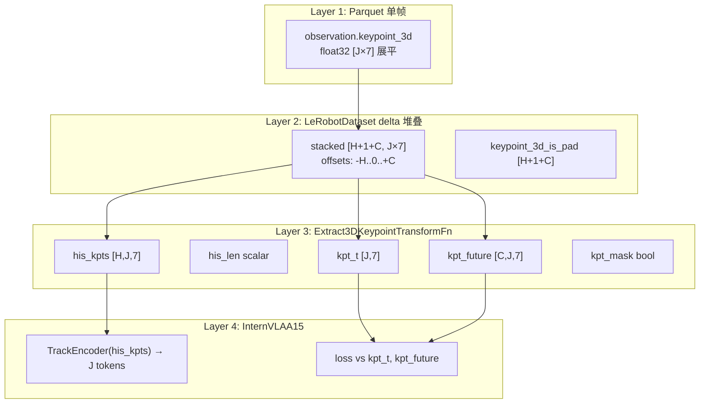

# link 的关键点在哪里

你的直觉对：**link 有物理长度，关键点并不是几何中心**。本方案取的是 URDF/Pinocchio 里该 **link 坐标系原点** 在 `base_link` 下的位姿，不是连杆网格的中点。

## 关键点在哪里？

FK 代码取的是：

```python
oMf = self.data.oMf[fid]   # fid = link 名对应的 frame
keypoints[i, :3] = oMf.translation      # 位置
keypoints[i, 3:7] = quaternion(oMf.rotation)  # 姿态
```

也就是 **link 坐标系原点** 的 7D 位姿，不是 mesh 质心，也不是连杆中点。

---

## 这个原点通常在哪？

URDF 约定（Pinocchio 同样遵循）：

```
parent_link ──[joint]──> child_link
                ↑
         child link 的坐标系原点 ≈ 这个 joint 的位置
```

对 `link1`–`link7`：

| 关键点 | 物理位置（近似） |
|--------|------------------|
| `link1` | **joint1** 处（link1 连到 link0 的那一端） |
| `link2` | **joint2** 处（link2 连到 link1 的那一端） |
| … | … |
| `link7` | **joint7** 处 |

更准确地说：每个 link 的关键点在 **把该 link 接到父 link 的那个 joint 上**，是连杆的 **近端（靠近基座一端）**，不是 distal 端，也不是中间。

示意（侧视）：

```
base/link0
    │
    ●─────── link1 物理段 ───────●─────── link2 物理段 ───────● ...
    ↑                            ↑
  kp(link1)                    kp(link2)
  = joint1 处                  = joint2 处
  (近端)                       (近端)
```

`cod_analyz_1.md` 也写了：在典型 URDF 里  
`oMf[link_i] ≈ oMi[joint_i]`，link frame 与 **parent joint frame 重合**。

所以：**不是「前一个 joint 的任意点」这种模糊说法，而是「该 link 所挂载的那个 parent joint 的坐标原点」**；对 `link_i` 就是 `joint_i`。

---

## 第 8 个点 `hand_tcp` 不同

TCP 不是某段连杆的近端，而是 URDF 里 **单独定义的 operational frame**，带固定偏移。Franka URDF 中：

```637:640:b/d/Frk/fr3v2_1_franka_hand.urdf
  <joint name="fr3v2_1_hand_tcp_joint" type="fixed">
    <origin rpy="0 0 0" xyz="0 0 0.1034"/>
    <parent link="fr3v2_1_hand"/>
    <child link="fr3v2_1_hand_tcp"/>
```

即在 `hand` 坐标系下沿 Z 偏移 **0.1034 m**，代表工具中心点，不是 link 中点。

---

## 为什么不用连杆中点或 distal 端？

1. **URDF 只保证 frame 定义一致**，mesh/visual/collision 相对 frame 可有任意偏移；中点没有统一、可复现的定义。
2. **沿运动链逐 joint 采样** 能稳定描述构型；同一 TCP 位姿对应多种臂形时，中间 link 姿态能消歧（E2 文档 §4.4）。
3. **与 joint 位置几乎等价**（无额外 frame 偏移时），实现简单、可验证。

---

## 小结

| 问题 | 答案 |
|------|------|
| 关键点是 joint 还是 link？ | 名义上是 **link frame**；对 link1–7 位置通常与对应 **parent joint** 重合 |
| 在连杆哪？ | **近端 joint 处**，不是中点，一般也不是 distal 端 |
| TCP？ | **URDF 指定的固定偏移点**（`hand_tcp`），不是某 link 几何中心 |

若把 mesh 画出来，关键点会落在 **各关节枢轴附近**，不会落在连杆圆柱/网格的几何中心。

# 4D关键点轨迹的输入格式

「4D 关键点轨迹」在代码里的命名有点绕，先澄清含义，再按 **存储 → 加载 → Transform → 模型** 四层说明输入格式。

## 「4D」指什么？

代码里 **4D ≠ 四维空间坐标**，而是 **3D 位置 + 4D 四元数姿态**：

```501:511:src/lerobot/policies/internvla_a1_5/configuration_internvla_a1_5.py
    kpt_4d_mode: str = "pos_only"  # "pos_only" (3D) or "pos_rot" (7D)
    kpt_rot_loss_weight: float = 1.0  # rotation MSE weight (pos_rot only)
    ...
    _KPT_4D_DIM: ClassVar[dict[str, int]] = {"pos_only": 3, "pos_rot": 7}
    ...
        self.keypoint_track_input_dim = self._KPT_4D_DIM[self.kpt_4d_mode]
```

| 模式 | 每关键点维度 | 含义 |
|------|-------------|------|
| `pos_only` | 3 | 仅 `(px, py, pz)`，GeoPredict 原版 |
| `pos_rot`（Franka/R1Pro E1） | **7** | `(px,py,pz,qx,qy,qz,qw)`，即「3D+4D」 |

Franka 方案里 `plug_into_socket_lrb_4D` 的 `_4D` 就是指这种 **带姿态的 7D 关键点**。

---

## 整体数据流



---

## Layer 1：Parquet 中单帧格式

离线 FK 脚本写入 `observation.keypoint_3d`，**每帧一个展平向量**：

| 字段 | Franka | R1Pro E1 |
|------|--------|----------|
| shape | `[56]` = 8×7 | `[112]` = 16×7 |
| dtype | `float32` | 同左 |
| 排列 | 按 link 顺序，每 link 7 维 | 左臂 8 点 → 右臂 8 点 |

单关键点 7 维布局（与 Pinocchio 一致）：

```
[px, py, pz, qx, qy, qz, qw]
 ↑ 位置(3)    ↑ 四元数 xyzw(4)，半球归一化 qw≥0
```

展平顺序（R1Pro 脚本）：

```55:59:util_scripts/generate_r1pro_keypoints_e1.py
KEYPOINT_FEATURE_NAMES: list[str] = [
    f"{link}_{comp}"
    for link in KEYPOINT_LINKS
    for comp in ("px", "py", "pz", "qx", "qy", "qz", "qw")
]
```

Reshape 规则：`[J×7] → [J, 7]`，**第 i 行 = 第 i 个 link 的 7D 位姿**。

坐标与归一化（写入 parquet 前已完成）：
- **位置**：`base_link` 下物理坐标 ÷ `R_pad`（各向同性，约 `[-1,1]`）
- **姿态**：单位四元数，强制 `qw ≥ 0`（半球约束）
- Transform **不再**做归一化

---

## Layer 2：训练时的时序窗口（轨迹从哪来）

启用 `enable_keypoint_predictor=True` 时，`factory.py` 对 `observation.keypoint_3d` 请求 **时间 delta 堆叠**：

```598:617:src/lerobot/policies/internvla_a1_5/configuration_internvla_a1_5.py
    def keypoint_3d_delta_indices(self) -> list[int] | None:
        ...
        h = self.keypoint_history_max_len   # H，如 200
        c = self.chunk_size                 # C，如 50
        return list(range(-h, c + 1))       # [-H, ..., -1, 0, 1, ..., C]
```

对当前训练帧 \(t\)，LeRobot 按相对偏移取：

| 偏移 | 物理帧 | 用途 |
|------|--------|------|
| `-H … -1` | \(t-H … t-1\) | 历史轨迹 |
| `0` | \(t\) | 当前帧 GT |
| `1 … C` | \(t+1 … t+C\) | 未来轨迹 GT |

堆叠结果：
- `observation.keypoint_3d`: `[H+1+C, J×7]`
- `observation.keypoint_3d_is_pad`: `[H+1+C]`，episode 边界外被 clamp 的帧为 `True`

**这就是「轨迹」的来源**：不是单独一列 trajectory，而是对单帧 `keypoint_3d` 做 **delta 时间索引** 得到的 \((H+1+C)\) 帧序列。

---

## Layer 3：Transform 拆成 5 个字段

`Extract3DKeypointTransformFn` 把堆叠窗口 reshape 并切片：

```705:733:src/lerobot/policies/internvla_a1_5/transform_internvla_a1_5.py
        stacked = stacked.reshape(h + 1 + c, j, d).float()
        ...
        hist_window = stacked[:h]
        ...
        his_kpts[:his_len] = hist_window[num_invalid:]   # 有效历史 packed 到前面
        data["observation.his_kpts"] = his_kpts          # [H, J, d]
        data["observation.his_len"] = torch.tensor(his_len)
        data["observation.kpt_t"] = stacked[h]           # [J, d]  offset=0
        data["observation.kpt_future"] = stacked[h + 1 : h + 1 + c]  # [C, J, d]
        data["observation.kpt_mask"] = torch.tensor(True)
```

Franka（`J=8, d=7, H=200, C=50`）时：

| Batch 键 | Shape | 角色 |
|----------|-------|------|
| `observation.his_kpts` | `[B, H, J, 7]` | **历史轨迹**（前面 `his_len` 帧有效，后面 zero-pad） |
| `observation.his_len` | `[B]` | 有效历史帧数 |
| `observation.kpt_t` | `[B, J, 7]` | 当前帧 GT（监督用） |
| `observation.kpt_future` | `[B, C, J, 7]` | 未来 C 步 GT（监督用） |
| `observation.kpt_mask` | `[B]` | 该样本是否有真实关键点（Phase 1 无 FK 时为 False） |

历史 packing 约定（与 GeoPredict 一致）：episode 开头不够 H 帧时，**无效帧在窗口前端**，有效 chronological 帧移到 `his_kpts` 前部，供 `TrackEncoder` 用 `points[i, :length]` 读取。

---

## Layer 4：模型实际「吃」什么

### 训练 `forward`

```2417:2423:src/lerobot/policies/internvla_a1_5/modeling_internvla_a1_5.py
            kpt_kwargs = {
                "his_kpts": batch.get("observation.his_kpts"),
                "his_len": batch.get("observation.his_len"),
                "kpt_t": batch.get("observation.kpt_t"),
                "kpt_future": batch.get("observation.kpt_future"),
                "kpt_mask": batch.get("observation.kpt_mask"),
            }
```

- **输入路径（条件）**：`his_kpts` + `his_len` → `TrackEncoder`
- **监督路径（loss）**：`kpt_t`、`kpt_future`（仅训练，推理不需要 GT）

### TrackEncoder 对历史轨迹的解读

```284:291:src/lerobot/policies/internvla_a1_5/keypoints.py
    def forward(self, points: torch.Tensor, lengths: torch.Tensor) -> torch.Tensor:
        """
        Args:
            points: ``[B, T, J, 3]`` history of 3D keypoint positions.
            ...
        Returns:
            ``[B, J * num_queries, output_dim]`` per-joint tokens.
```

文档注释仍写 3D，但 `in_dim=input_dim`，**7D 模式下 `points` 实为 `[B, H, J, 7]`**——每个 joint 一条 **时间序列轨迹**，Conv1d 沿时间维 patchify（`patch_size=4`），再 cross-attention 压成 **J 个 token** 送入 keypoint expert。

### Keypoint expert suffix 结构

```
[state(1)] + [history-track(J)] + [query(J)]
              ↑ TrackEncoder       ↑ 可学习 query
```

- `his_kpts`：编码 **过去怎么动**
- `query` token 输出经 `keypoint_out_proj` → 预测当前 + 未来关键点

### 推理

只传历史，不传 GT：

```2287:2290:src/lerobot/policies/internvla_a1_5/modeling_internvla_a1_5.py
            kpt_kwargs = {
                "his_kpts": batch.get("observation.his_kpts"),
                "his_len": batch.get("observation.his_len"),
            }
```

推理时 `his_kpts` 需由 **已观测帧的 FK 关键点** 或 **模型自己上一帧预测** 滚动填充（部署逻辑，训练时用 GT 窗口）。

---

## 7D 各分量在 loss 中的处理

`kpt_4d_mode="pos_rot"` 时：

```1987:1991:src/lerobot/policies/internvla_a1_5/modeling_internvla_a1_5.py
        if self.config.kpt_4d_mode == "pos_rot":
            loss_pos = F.mse_loss(pred[..., :3], gt[..., :3], ...)
            pred_rot = F.normalize(pred[..., 3:kpt_dim], p=2, dim=-1)
            loss_rot = F.mse_loss(pred_rot, gt[..., 3:kpt_dim], ...)
            return loss_pos + self.config.kpt_rot_loss_weight * loss_rot
```

- 位置：MSE on `[:3]`
- 姿态：预测四元数 L2 归一化后与 GT 做 MSE on `[3:7]`

---

## Franka 完整实例（一条样本）

假设 `H=200, C=50, J=8, d=7`：

```
Parquet 单帧:  keypoint_3d [56]
                    ↓ delta 堆叠 251 帧
Loader 输出:   keypoint_3d [251, 56]
                    ↓ reshape
Transform:     stacked [251, 8, 7]
                    ├─ his_kpts   [200, 8, 7]  ← 模型输入（历史轨迹）
                    ├─ his_len    scalar
                    ├─ kpt_t      [8, 7]       ← 当前 GT
                    └─ kpt_future [50, 8, 7]   ← 未来 GT
                    ↓ collate
Batch:         his_kpts [B,200,8,7] → TrackEncoder(Conv1d in=7)
               kpt_t    [B,8,7]     → loss_kpt_current
               kpt_future [B,50,8,7] → loss_kpt_future
```

---

## 要点总结

1. **「4D 轨迹」= 每个关键点 7D（3 位置 + 4 四元数）在时间上的序列**，不是 4 个空间坐标。
2. **存储**：parquet 里只有单帧 `[J×7]`；轨迹由 **delta_indices** 在 DataLoader 层拼出。
3. **模型输入**：主要是 `his_kpts [B,H,J,7]`；`kpt_t` / `kpt_future` 是 **训练监督**，不是推理条件。
4. **语义**：`J` 维是 **link 索引**（Franka 8 个 link frame），`7` 维是该 frame 在 `base_link` 下的归一化位姿。
5. **与 GeoPredict 原版差异**：原版 TrackEncoder 只吃 3D 位置轨迹；E1/Franka 在 `pos_rot` 模式下把 **四元数也作为轨迹通道** 一并编码（`input_dim=7`）。

若需要，我可以再补一节：**推理部署时如何从关节角在线 FK 构造 `his_kpts` 窗口**（与训练 GT 路径的对应关系）。

# Franka插拔插座数据集的hdf5里有什么

根据对 `/home/luogang/DATA/plug_into_socket_hdf5` 的实际扫描（100 个 `episode_*.hdf5`，合计约 **19.55 GB**），数据结构如下。

## 数据集整体

| 属性 | 值 |
|------|-----|
| 文件数 | **100** 条 episode（`episode_000000.hdf5` … `episode_000099.hdf5`） |
| 任务 | 根属性 `task = "plug into socket"`（插拔插座遥操作） |
| 机器人 | Franka 单臂 + 夹爪 |
| 状态采样 | **100 Hz**，共 **221,428** 帧 |
| 相机采样 | **30 Hz**，global **66,590** 帧 / wrist **66,596** 帧 |
| 单条时长 | **17.9 ~ 26.6 s**（均值约 22.2 s） |
| 单条大小 | 约 **150 ~ 214 MB** |

每条 episode **自包含**：该次演示的全部状态、动作、双相机 RGB/深度与时间戳，**没有**跨文件的 index 或全局 manifest。

---

## 单个 HDF5 文件结构

每个文件顶层 **3 个 Group** + 1 个根属性：

```
episode_XXXXXX.hdf5
├── @task = "plug into socket"
├── camera_global/          # 外部固定相机 @ 30Hz
├── camera_wrist/           # 腕部相机 @ 30Hz
└── robot_state/            # 机器人状态与动作 @ 100Hz
```

示意（以 `episode_000000.hdf5` 为例）：

```
episode_000000.hdf5 (~177 MB, ~19.9 s)
├── camera_global/     596 帧
├── camera_wrist/      596 帧
└── robot_state/      1981 帧
```

帧数随 episode 长度变化（例如中间一条约 2244 状态帧 / 675 相机帧）。

---

### 1. `robot_state/`（100 Hz）

Group 属性：`hz=100`, `num_frames=N`

| 数据集 | Shape | Dtype | 含义 |
|--------|-------|-------|------|
| `timestamps` | `[N]` | float64 | 秒，episode 内相对时间 |
| `joint_positions` | `[N, 7]` | float64 | 7 关节角 (rad) |
| `joint_velocities` | `[N, 7]` | float64 | 关节角速度 |
| `joint_torques` | `[N, 7]` | float64 | 关节力矩（含内部模型） |
| `joint_torques_external` | `[N, 7]` | float64 | 外部估计力矩 |
| `gripper_width` | `[N, 1]` | float64 | 夹爪开口宽度 (m)，约 0.08 |
| `ee_pos` | `[N, 3]` | float64 | 末端位置 (m) |
| `ee_quat` | `[N, 4]` | float64 | 末端四元数（方案文档记为 **wxyz**） |
| `ee_force` | `[N, 3]` | float64 | 末端力 |
| `ee_torque` | `[N, 3]` | float64 | 末端力矩 |
| `action_joints` | `[N, 7]` | float64 | **动作**：7 关节绝对位置目标 (rad) |
| `action_gripper` | `[N, 1]` | float64 | **动作**：夹爪指令（归一化，约 0.01~1.0） |

**示例**（`episode_000000` 首帧）：

- `joint_positions[0]` ≈ `[-0.075, 0.005, -0.060, -1.792, 0.079, 1.858, 0.487]` rad  
- `ee_pos[0]` ≈ `[0.574, -0.064, 0.439]` m  
- `gripper_width[0]` ≈ `0.079` m  

`action_joints` 与 `joint_positions` 在首帧不完全相等，说明 action 是 **控制器目标**，不是简单复制 state。

---

### 2. `camera_global/` 与 `camera_wrist/`（各 30 Hz）

两路结构相同，Group 属性：`hz=30`, `jpeg_quality=90`, `color_format=jpeg`, `num_frames=M`

| 数据集 | Shape | Dtype | 含义 |
|--------|-------|-------|------|
| `timestamps` | `[M]` | float64 | 相机时间戳 (s) |
| `color_image_jpeg` | `[M]` | object | 每帧 **JPEG 压缩字节**（变长） |
| `depth_image` | `[M, 480, 640]` | uint16 | 深度图 |

RGB：解码后为 **480×640**（H×W），JPEG quality=90。  
HDF5 里每元素是 `numpy` 字节数组（例如 global 首帧约 24 KB，wrist 约 30 KB）。

深度：`depth_image` 在抽样帧中 **几乎全 0**，可能未启用、无效或未标定；`dta_4dtrj_plan.md` 也写明 **LeRobot 转换不包含深度**。

---

## 时间对齐关系

同一条 episode 内，**状态 100 Hz、相机 30 Hz，时间戳独立**：

```
robot_state:     · · · · · · · · · ·   (100 Hz, ~1981 帧/episode)
camera_*:        ▼       ▼       ▼     (30 Hz, ~596 帧/episode)
```

转换 LeRobot 时以 **相机帧为基准**，对 `robot_state/timestamps` 做 **最近邻** 匹配，得到 30 Hz 训练样本。

---

## 方案中会用到 / 不用的字段

**会转换进 LeRobot**（见 `dta_4dtrj_plan.md` §3.3）：

| HDF5 来源 | LeRobot 目标 |
|-----------|-------------|
| `joint_positions` | `observation.state.arm` [7] |
| `gripper_width` | `observation.state.gripper` [1] |
| `ee_pos`, `ee_quat` | 可选辅助（FK 验证） |
| `action_joints` | `action.arm` [7] |
| `action_gripper` | `action.gripper` [1] |
| `camera_*/color_image_jpeg` | `observation.images.global/wrist` |

**HDF5 有但当前方案不转**：

- `depth_image`
- `joint_torques`, `joint_torques_external`
- `ee_force`, `ee_torque`
- 100 Hz 中间状态帧（对齐到 30 Hz 后丢弃）

**HDF5 里没有的**（需离线 FK 生成）：

- `observation.keypoint_3d`（7D link 关键点轨迹）

---

## 文件树小结

```
plug_into_socket_hdf5/
├── episode_000000.hdf5   # 一次完整插插座演示
├── episode_000001.hdf5
├── ...
└── episode_000099.hdf5

每个 episode_XXXXXX.hdf5:
  @task
  robot_state/     ← 100Hz 关节、EE、力/力矩、action
  camera_global/   ← 30Hz 外部 RGB + depth
  camera_wrist/    ← 30Hz 腕部 RGB + depth
```

如果你需要，我可以再写一段 **h5py 读取单 episode 并解码一帧 RGB 的示例脚本**（需在 `itvlaGp` conda 环境里跑，当前系统 Python 没有 `cv2`/`PIL`）。

