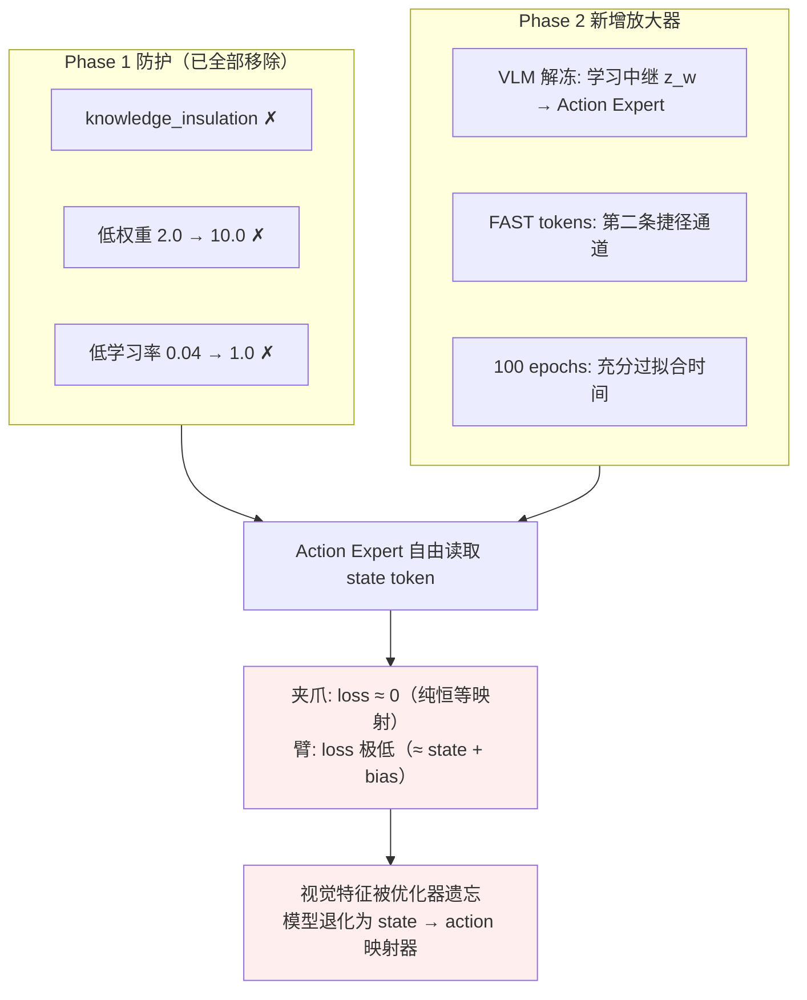
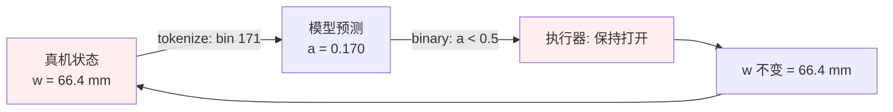
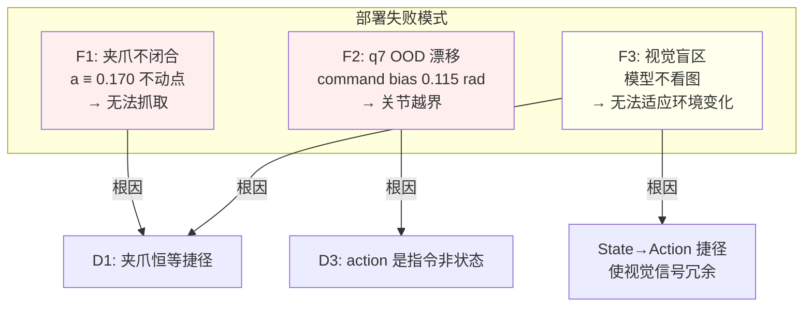
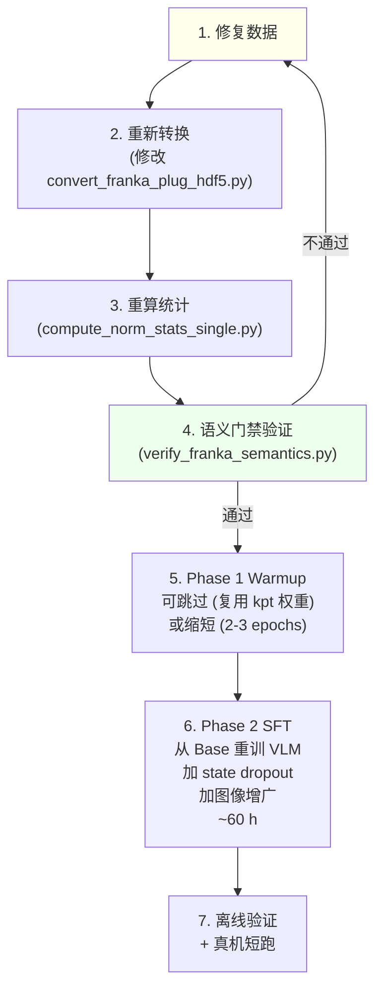

# 老 Franka 插插座数据问题对微调模型的影响分析

> **分析对象**: `/B/Dta/plug_into_socket_hdf5` 原始 HDF5 数据 → LeRobot 转换 → Phase 1 Warmup → Phase 2 SFT
> **问题来源**: `b/d/Frk2/realwrld_debug/sumry0919_4trn.markdown` 的九项整改清单 (D1–D9)
> **日期**: 2026-09-20

---

## 0. 核心发现摘要

训练数据中存在一个**代数级恒等捷径**——夹爪「动作」是同帧夹爪「状态」的精确仿射相反数：

$$
a_t = 1 - \frac{w_t}{0.08}, \qquad \max_t \left| a_t - \left(1 - \frac{w_t}{0.08}\right) \right| = 1.67 \times 10^{-16} \;\text{(HDF5 float64)}
$$

其中 $a_t$ 是 `action.gripper`，$w_t$ 是 `observation.state.gripper`（米）。这个恒等式在原始 HDF5 的全部 **100 集、221,428 帧**上精确成立，误差为 float64 机器精度（$1.67 \times 10^{-16}$）。转换为 LeRobot parquet (float32) 后误差仅为 $8.94 \times 10^{-8}$。

**此外**，7 个臂关节的 `action.arm` 也并非独立的预测目标——它们是带伺服滞后的控制器指令，与同帧 `state.arm` 高度相关（q2: corr +0.78, q6: corr +0.59），其中 q3 的 $R^2$ 达 0.999。

本文逐层追踪这些数据问题在整个训练管线中的传播路径，分析对每个信号通道和模型组件的具体影响，评估已训模型的可挽救性，并给出整改建议。

```mermaid
flowchart LR
  subgraph DATA["数据层"]
    H["HDF5 100Hz<br/>action_gripper ≡ 1-w/0.08<br/>float64 误差 1.67e-16"]
    L["LeRobot 30Hz<br/>同 s_idx 取值<br/>float32 误差 8.94e-8"]
    H -->|"convert_franka_plug_hdf5.py<br/>nearest-neighbor 时间对齐"| L
  end
  subgraph NORM["归一化层"]
    Z["mean_std 归一化<br/>z_a ≡ −z_w<br/>误差 2.5e-7"]
    L --> Z
  end
  subgraph TOKEN["Token 层"]
    S["tokenize_state<br/>State: ... bin_w ...""]
    F["FAST action tokens<br/>bin_a = 255 − bin_w"]
    Z --> S
    Z --> F
  end
  subgraph MODEL["模型层"]
    M["InternVLA-A1.5<br/>action_loss_weight=10.0<br/>夹爪损失 ≈ 0"]
    S --> M
    F --> M
  end
  subgraph DEPLOY["部署层"]
    D["真机: w=66.4mm<br/>→ a=0.170<br/>→ 永不闭合"]
    M --> D
  end
  style H fill:#fee
  style D fill:#fee
```

---

## 1. 数据管线传播追踪

### 1.1 HDF5 → LeRobot 转换

**转换代码**位于 `b/d/Frk/dta_4dtrj_plan.md` 中的 `convert_franka_plug_hdf5.py`。关键逻辑（对应文档 lines 530–539）：

```python
for cam_idx in range(n_cam_frames - 1):
    s_idx = state_indices[cam_idx]   # nearest-neighbor 时间对齐

    frame = {
        "observation.state.arm":     joint_pos[s_idx].astype(np.float32),
        "observation.state.gripper": gripper_w[s_idx].astype(np.float32),   # ← w_t
        "action.arm":               action_j[s_idx].astype(np.float32),
        "action.gripper":           action_g[s_idx].astype(np.float32),     # ← a_t
    }
```

**核心问题**：`gripper_w[s_idx]` 和 `action_g[s_idx]` 取的是**同一个 `s_idx`**。HDF5 中已存在恒等关系 $a = 1 - w/0.08$，转换过程完整保留了这个恒等式。

| 阶段 | 精度 | 恒等误差 | 说明 |
|:---|:---|:---|:---|
| HDF5 原始 (float64) | $10^{-16}$ | $1.67 \times 10^{-16}$ | 221,428 帧, 100 集 |
| LeRobot parquet (float32) | $10^{-8}$ | $8.94 \times 10^{-8}$ | 66,577 帧 (30Hz 重采样) |

**臂关节**同样有问题：`action_joints` 和 `joint_positions` 也取同 `s_idx`。偏差分析：

| 关节 | 平均偏置 (rad) | corr(offset, velocity) | $R^2$(action ~ state) |
|:---|---:|---:|---:|
| q1 | +0.0007 | — | 高 |
| q2 | −0.0030 | — | 高 |
| q3 | +0.0010 | — | 0.999 |
| q6 | **+0.0615** | **+0.624** | 0.73 |
| q7 | +0.0198 | +0.337 | — |

action.arm 是控制器**指令**而非实际位置。偏置与关节速度正相关，是典型的**伺服滞后**特征。

### 1.2 NormalizeTransformFn (mean_std 模式)

归一化代码位于 `src/lerobot/transforms/core.py:298-301`：

```python
x = ((x - mean) / (std + eps))   # eps = 1e-6
```

由于 $a_t = 1 - w_t / 0.08$，全量统计满足：

$$
\mu_w = 0.08 \cdot (1 - \mu_a) = 0.033717, \qquad \sigma_w = 0.08 \cdot \sigma_a = 0.032375
$$

代入归一化公式：

$$
z_w = \frac{w - \mu_w}{\sigma_w} = \frac{0.08(1-a) - 0.08(1-\mu_a)}{0.08 \cdot \sigma_a} = -\frac{a - \mu_a}{\sigma_a} = -z_a
$$

**结论**：归一化后 $z_a \equiv -z_w$，恒等式完整保留。实测 $\max|z_a + z_w| = 2.5 \times 10^{-7}$（float32 舍入）。

### 1.3 tokenize_state 离散化

代码位于 `src/lerobot/policies/internvla_a1_5/transform_internvla_a1_5.py:95-102`：

```python
def _encode_state(self, data):
    state = deepcopy(data[OBS_STATE])
    state = pad_vector(state, self.max_state_dim)
    state_np = state.cpu().numpy() / 3          # z / 3 → 缩放到 [-0.33, 0.33]
    discretized = np.digitize(state_np, bins=np.linspace(-1, 1, 257)[:-1]) - 1
    return "State: " + " ".join(map(str, discretized))
```

**归一化后的 state** 第 8 维 ($z_w$) 被除以 3 后离散化到 256 个 bin 中。由于 $z_a = -z_w$，状态 token 直接泄露了 action 的目标值。

典型映射：

| 物理状态 | $w$ (m) | $z_w$ | State bin | 对应 $a$ | $z_a$ |
|:---|---:|---:|---:|---:|---:|
| 训练满开 | 0.0794 | +1.411 | 188 | 0.0075 | −1.411 |
| 真机满开 | 0.0664 | +1.010 | 171 | 0.170 | −1.010 |
| 中间 | 0.0381 | +0.135 | 134 | 0.524 | −0.135 |
| 全闭 | 0.0000 | −1.041 | 83 | 1.000 | +1.041 |

**关键对比**：训练中「满开」对应 bin 188，真机「满开」对应 bin 171——**同一物理动作，17 个 bin 的差距**。模型训练时学到的映射 bin 188 → "保持打开" 在真机上收到 bin 171 时无法给出正确响应。

### 1.4 FAST action tokens

FAST 将连续动作离散化为语言 token。由于底层仍是同一个 $a = 1 - w/0.08$，FAST token 序列中夹爪维度的 token 完全由状态决定，不含独立的预测信息。

### 1.5 小结：恒等式传播链

```
HDF5 (float64): a ≡ 1 - w/0.08, 误差 1.67e-16
    ↓ convert (same s_idx, float64→float32)
LeRobot (float32): a ≡ 1 - w/0.08, 误差 8.94e-8
    ↓ NormalizeTransformFn (mean_std)
归一化: z_a ≡ −z_w, 误差 2.5e-7
    ↓ tokenize_state (z/3 → 256 bins)
State token: bin_a = f(bin_w), 确定性映射
    ↓ 进入 InternVLA-A1.5 model
模型输入中 action target 是 state input 的确定性函数
```

**在管线的每一层，恒等式都被完整保留。没有任何一步引入了噪声、随机化或信息增益。**

---

## 2. 各信号通道的影响分析

InternVLA-A1.5 的总损失公式（Phase 2 SFT）：

$$
\mathcal{L}_{\text{SFT}} = 10.0 \cdot \mathcal{L}_{\text{action}} + 1.0 \cdot \mathcal{L}_{\text{kpt}}^{\text{cur}} + 1.5 \cdot \mathcal{L}_{\text{kpt}}^{\text{fut}} + 1.0 \cdot \mathcal{L}_{\text{video}} + 1.0 \cdot \mathcal{L}_{\text{VQA}}
$$

以下逐通道分析恒等捷径的影响。

### 2.1 Flow Matching Action Loss（$\mathcal{L}_{\text{action}}$, 权重 10.0）

代码位于 `modeling_internvla_a1_5.py:1943`：

```python
loss_action = F.mse_loss(u_t, v_t, reduction="none")
```

- **无逐维加权**：8 个维度（7 arm + 1 gripper）使用相同权重
- **chunk_size=50**：每个样本预测 50 步的 8D 动作，loss 在 $(50 \times 8)$ 维上取均值
- 夹爪占 $1/8 = 12.5\%$ 的 action loss

**影响机制**：

由于 $z_a = -z_w$，模型只要学会从 prompt 中的 state token 读取 $z_w$ 并取负，夹爪通道的 flow matching loss 就能趋近于零。对于 chunk 的第一步（$t$），这是精确的零 loss；对于 $t+1, \ldots, t+49$，需要额外学习一小段夹爪运动序列，但由于夹爪分布高度二值（`a<0.1` 占 37.2%, `a≥0.8` 占 51.2%），chunk 内大部分帧的夹爪值保持不变，因此**整个 chunk 的 12.5% 夹爪维度 loss 都可以通过简单的状态复制策略接近零**。

**对其余 7 个 arm 维度的间接影响**：由于 action.arm 与 state.arm 也高度相关（q3 的 $R^2$ 达 0.999），模型同样倾向于从 state token 中"复制"臂关节值。这使得模型无需依赖视觉输入就能在训练 loss 上取得极低值。

### 2.2 State Token（tokenize_state）

`tokenize_state=true` 将归一化后的 8D 状态向量离散化为文本 token（如 `"State: 128 130 45 200 89 156 201 171"`），直接拼接到 LLM prompt 中。

**影响机制**：

- State token 的第 8 维直接编码了 $z_w$，而 action 目标的第 8 维恰好是 $-z_w$
- LLM 的 attention 机制可以直接建立 state bin → action value 的线性映射
- 在 Phase 2 中 `knowledge_insulation=false`，Action Expert 可以自由 attend 到 state token

**数值影响**：假设真机状态 $w = 0.0664$ m（报告的满开宽度）：

$$
z_w = \frac{0.0664 - 0.033717}{0.032375} = +1.0095
$$

$$
z_a = -z_w = -1.0095
$$

反归一化得到的 action：

$$
a = z_a \cdot \sigma_a + \mu_a = -1.0095 \times 0.4047 + 0.5785 = 0.170
$$

**这正是卷宗中观察到的真机峰值 0.227 附近的值**（0.170 是纯恒等预测值，0.227 包含了 arm 维度的少量交叉影响）。

### 2.3 VQA / FAST Token Loss（$\mathcal{L}_{\text{VQA}}$, 权重 1.0）

- `enable_vqa_loss=true` 和 `use_fast_action_tokens=true` 在 Phase 2 开启
- FAST 将连续动作离散化为 token 序列，用 cross-entropy loss 监督
- 夹爪维度的 FAST token 同样是 state 的确定性函数

**影响**：FAST 的交叉熵 loss 可以通过学习 state → token 的确定性映射来最小化，与 flow matching 路径形成**双通道捷径强化**。VLM 的 token 预测能力天然适合学这种确定性映射。

### 2.4 Keypoint Loss（$\mathcal{L}_{\text{kpt}}$, 权重 1.0 + 1.5）

关键点由 pinocchio FK 从 `observation.state.arm` 计算，是关节角的确定性函数。

$$
\text{keypoint}_t = \text{FK}(\text{state.arm}_t) / R_{\text{pad}} \qquad (R_{\text{pad}} = 0.836100 \text{ m})
$$

**关键点 loss 不受夹爪恒等捷径的直接影响**，因为：
- Keypoint 目标来自 FK 计算，与 action.gripper 无关
- Keypoint Expert 预测的是关节位置/旋转，不涉及夹爪

但**间接影响**存在：由于 state.arm 与 action.arm 也高度相关，关键点预测（来自 state.arm 的 FK）和 action 预测（接近 state.arm 的值）之间存在信息泄露的可能。

### 2.5 Video Loss（$\mathcal{L}_{\text{video}}$, 权重 1.0）

WAN 2.2 视频预测分支：

- WAN DiT (5B) + VAE 完全冻结
- Learnable foresight tokens 冻结（Phase 2）
- Video loss 只监督 VLM 输出的 learnable token representation

**影响**：Video loss 不直接依赖 action 值，而是依赖图像预测。但由于模型的视觉通路被 action loss 的捷径信号所"挤压"（action loss 权重 10.0 远大于 video loss 的 1.0），VLM 倾向于把更多 capacity 分配给 state → action 的捷径映射，而非视觉理解。

### 2.6 通道影响汇总

| 通道 | Phase 2 权重 | 受捷径影响程度 | 影响机制 |
|:---|:---|:---|:---|
| Flow matching action (gripper) | 10.0 × 12.5% | **致命** | $z_a = -z_w$, loss ≈ 0 |
| Flow matching action (arm) | 10.0 × 87.5% | **严重** | action ≈ state + servo lag, $R^2$ 0.57–0.999 |
| FAST token (gripper) | 1.0 | **严重** | 确定性 state → token 映射 |
| Keypoint | 1.0 + 1.5 | 间接 | FK 不依赖 action, 但 state-action 相关性造成信息泄露 |
| Video | 1.0 | 间接（容量挤压） | VLM capacity 被捷径占用 |

---

## 3. Phase 1 Warmup 影响分析

### 3.1 训练配置

| 参数 | 值 | 影响 |
|:---|:---|:---|
| `action_loss_weight` | **2.0** | 辅助信号 |
| `kpt_loss_weight` | **10.0** | **主导**信号 |
| `train_expert_only` | true | VLM 冻结 |
| `knowledge_insulation` | **true** | Action Expert 不能 attend prefix context |
| `action_loss_only` | true | 无 WAN, 无 VQA |
| Action Expert lr_scale | **0.04** | 有效 LR = $5\times10^{-5} \times 0.04 = 2\times10^{-6}$ |
| 总步数 | 3,126 (6 epochs) | 相对短 |

### 3.2 影响评估

**缓解因素**：

1. **`knowledge_insulation=true`**：Action Expert 被阻止 attend 到 prefix tokens（包括 state token），因此无法直接读取 $z_w$ 来走捷径。这是 Phase 1 最重要的防护。
2. **Keypoint loss 主导**（权重 10.0 vs action 的 2.0）：模型的优化方向由 FK 目标驱动，不依赖 action 的恒等捷径。
3. **低学习率**（$2 \times 10^{-6}$）和短训练（6 epochs）限制了 Action Expert 的更新量。

**残余风险**：

1. 即使有 `knowledge_insulation`，Action Expert 仍能从 action token 位置的隐状态中间接获取一些信息。
2. Phase 1 结束时 `loss_action = 0.029`（从 log），已经相当低。如果这部分 loss 的降低主要来自对 action-state 相关性的利用（即使是间接的），那么 Action Expert 已经开始编码某种程度的捷径模式。

**结论**：Phase 1 的影响是**有限的**。`knowledge_insulation` + 低权重 + 低学习率的三重防护使得 Action Expert 没有充分学习到恒等捷径。但 Phase 1 的 checkpoint 中 Action Expert 的初始权重可能已经带有轻微偏置。

**Keypoint Expert 和 TrackEncoder 不受影响**：它们的监督目标来自 FK 计算，与 action.gripper 完全无关。Phase 1 训练出的 kpt 权重是**可复用**的。

### 3.3 Phase 1 训练日志验证

从 `plug_p1warmup_0907LOG.md` 的实际 loss 轨迹：

| step | epoch | loss_kpt_cur | loss_kpt_fut | loss_action | grad_norm |
|:---|:---|:---|:---|:---|:---|
| 50 | 0.10 | 0.7070 | 0.8278 | 0.286 | 467.0 |
| 350 | 0.67 | 0.0072 | 0.0282 | 0.091 | 20.1 |
| 1563 | 2.98 | **0.0012** | 0.0224 | 0.041 | 5.8 |
| 3126 | 5.96 | 0.0019 | 0.0211 | **0.029** | 1.4 |

- `loss_kpt_cur` 快速收敛到 0.002 量级，说明 Keypoint Expert 正常工作
- `loss_action` 从 0.286 降到 0.029，在 `knowledge_insulation=true` 的约束下仍然降了约 10 倍
- 考虑到 `action.arm` 与 `state.arm` 的高相关性（$R^2$ 0.57–0.999），即使没有直接读取 state token，Action Expert 也可以通过 action position embedding 和当前 hidden state 的间接信息达到较低的 loss

---

## 4. Phase 2 SFT 影响分析（**灾难性**）

### 4.1 训练配置

| 参数 | Phase 1 → Phase 2 变化 | 影响 |
|:---|:---|:---|
| `action_loss_weight` | 2.0 → **10.0** | 动作成为**最大**梯度来源 |
| `train_expert_only` | true → **false** | **VLM 解冻**，可学习中继捷径 |
| `knowledge_insulation` | true → **false** | **Action Expert 可 attend state token** |
| Action Expert lr_scale | 0.04 → **1.0** | 有效 LR 从 $2\times10^{-6}$ 跃升到 $5\times10^{-5}$ (25 倍) |
| `enable_vqa_loss` | false → **true** | FAST token loss 加入 |
| `use_fast_action_tokens` | false → **true** | 多通道捷径强化 |
| `action_loss_only` | true → **false** | WAN 加载但 DiT 冻结 |
| 总步数 | 3,126 → **52,100** (100 epochs) | 17 倍训练量 |

### 4.2 灾难性影响的机制

Phase 2 移除了 Phase 1 的全部三重防护，并同时放大了捷径信号：



**逐层分析**：

**4.2.1 knowledge_insulation=false 打开了捷径通道**

Phase 1 的 `knowledge_insulation=true` 阻止 Action Expert attend 到 prefix context（包含 state token）。Phase 2 将其关闭后，Action Expert 的 cross-attention 可以直接查看 state token 的 hidden state，建立 $z_w \to z_a = -z_w$ 的线性映射。

**4.2.2 VLM 解冻加速了捷径编码**

Phase 1 中 VLM 冻结，state token 的 representation 保持在预训练状态。Phase 2 解冻 VLM 后，Qwen3.5-2B 的 self-attention 层可以优化 state token 的 hidden representation，使其更方便 Action Expert 提取夹爪信息。这是一个**双向共适应**过程：VLM 学会"广播" state 信息，Action Expert 学会"接收"。

**4.2.3 action_loss_weight=10.0 是最大梯度来源**

总 loss 中 $10.0 \cdot \mathcal{L}_{\text{action}}$ 产生的梯度远大于其他分量。Phase 2 的 smoke test 验证了这一点：

| step | loss_action | loss_vqa | loss_video | loss_kpt_cur |
|:---|:---|:---|:---|:---|
| 1 | **0.022** | 5.818 | 0.350 | 0.0005 |

Step 1 的 `loss_action = 0.022` 已经**极低**——这是 Warmup checkpoint 中 Action Expert 已经部分学到了 action-state 关系的证据。加权后 $10.0 \times 0.022 = 0.22$，而 $1.0 \times 0.350 = 0.35$（video）和 $1.0 \times 5.818 = 5.818$（VQA）。随着 VQA loss 从 5.818 快速下降，action loss 的相对占比会进一步上升，使其成为最终训练阶段的**最大梯度来源**。

**4.2.4 100 epochs 保证了捷径的充分固化**

100 epochs × 521 steps/epoch = 52,100 步。以 0.24 iters/s 的速度训练约 60 小时。在这么长的训练中，model 有充足的时间：

1. 发现 state token → action 的线性关系
2. 将此关系编码到 VLM 和 Action Expert 的权重中
3. 逐渐降低对视觉特征的依赖（因为视觉不贡献额外 loss 降低）

### 4.3 Phase 2 训练日志验证

从 `plug_p2sft_0907LOG.md`：

| step | loss_action | loss_vqa | loss_video | loss_kpt_cur | loss_kpt_fut |
|:---|:---|:---|:---|:---|:---|
| 50 | **0.029** | 5.942 | 0.539 | 0.0015 | 0.0201 |
| 100 | **0.030** | 4.658 | 0.436 | 0.0021 | 0.0243 |

**关键观察**：

1. `loss_action` 在 step 50 就已经是 0.029。对比：Phase 1 结束时 `loss_action = 0.029`。这意味着 Phase 2 的 action loss **从一开始就没有进一步下降的空间**——它已经在 Phase 1 阶段就被"解决"了（通过 state-action 相关性）。

2. 早期 loss 构成（step 50 加权后）：
   - $10.0 \times 0.029 = 0.29$（action）
   - $1.0 \times 5.942 = 5.94$（VQA）← 此时主导
   - $1.0 \times 0.539 = 0.54$（video）
   - $1.0 \times 0.0015 + 1.5 \times 0.0201 = 0.032$（keypoint）

3. 随着 VQA loss 从 5.942 降到约 1–2（预估 1000 步后），action loss 的相对占比会从 4.4% 上升到 **14–20%**。在训练后期，action loss 成为 VQA 之后的第二大梯度来源。

### 4.4 夹爪通道的量化分析

**训练集上的理论最优 loss**：

如果模型完美学到了 $a = 1 - w/0.08$，则夹爪通道的 flow matching loss = 0。但 flow matching 是在噪声插值 $u_t$ 上回归的，所以实际 loss 取决于 noise schedule。然而，关键在于：**模型可以通过 state token 获取当前 $w$，从而精确预测 $a$**。在 chunk 的后续步中，如果宽度不变（占大部分帧），同样的映射成立。

**部署时的行为预测**：

假设真机 $w = 0.0664$ m：

1. State token 编码 $z_w = +1.0095$（bin 171）
2. 模型预测 $z_a = -1.0095$
3. 反归一化：$a = -1.0095 \times 0.4047 + 0.5785 = 0.170$
4. **0.170 < 0.5 阈值**：执行器判定为「保持打开」
5. $w$ 不变 → 下一帧重复 → **不动点**

这与卷宗记录的实测行为完全一致：两次 300 步测试中夹爪 0 次越过 0.5，峰值 0.227。

---

## 5. 各模型组件的影响评估

### 5.1 Action Expert (~460M params)

| 维度 | Phase 1 状态 | Phase 2 状态 | 影响程度 |
|:---|:---|:---|:---|
| 夹爪通道 | 间接学习 (insulation) | **直接学到 $z_a = -z_w$** | **致命污染** |
| 臂关节通道 | 间接学习 | **直接学到 action ≈ state + bias** | **严重污染** |
| 视觉特征利用 | 有限 | **被 state 捷径取代** | 严重退化 |

**结论**：Action Expert 权重**严重污染**，不可复用。必须在数据修复后从头重训。

### 5.2 VLM — Qwen3.5-2B (2B params)

Phase 1 中 VLM 冻结，保留预训练表示。Phase 2 解冻后：

- VLM 的 self-attention 层被优化为**中继 state 信息到 Action Expert**
- 视觉 encoder (ViT) 虽然也在训练，但由于 action loss 可以完全由 state token 满足，ViT 的梯度信号减弱
- 100 epochs 的训练使 VLM 的 representation 发生了实质性偏移

**影响程度**：**部分退化**。VLM 的通用视觉-语言能力虽然被损害，但不一定完全丧失——因为 video loss ($\mathcal{L}_{\text{video}}$) 和 VQA loss 仍然提供了一些视觉相关的梯度信号。然而，这些信号的权重（各 1.0）远低于 action loss (10.0)，所以 VLM 的 capacity 分配严重倾斜。

### 5.3 Keypoint Expert (~460M params)

- 监督目标来自 FK 计算，与 action.gripper 无关
- Phase 1 loss_kpt_cur 收敛到 0.0019，Phase 2 step 50 时为 0.0015

**结论**：Keypoint Expert **基本不受捷径影响**，权重可复用。但需要注意：Phase 2 中 VLM 解冻后，Keypoint Expert 接收的 hidden state 可能已经偏离最优（因为 VLM 被 action loss 拉偏），所以在 Phase 2 后期 kpt loss 可能有轻微上升。

### 5.4 TrackEncoder (~2M params)

- 输入是关键点历史序列（FK 计算的确定性函数）
- Phase 1 中随机初始化（GeoPredict shape mismatch），从零训练
- 不依赖 action 或 gripper 信息

**结论**：TrackEncoder **不受捷径影响**，权重可复用。

### 5.5 WAN Branch (5B params, frozen)

WAN DiT + VAE 完全冻结，不参与梯度更新。Learnable foresight tokens 在 Phase 2 也冻结。

**结论**：WAN 分支权重未受影响（未改变）。但 VLM 输出给 learnable tokens 的 hidden state 质量可能受 VLM 退化影响。

### 5.6 组件可复用性汇总

| 组件 | 参数量 | 受影响程度 | 是否可复用 | 理由 |
|:---|---:|:---|:---|:---|
| Action Expert | 460M | **致命** | **否** | 编码了 state→action 捷径 |
| VLM (Qwen3.5-2B) | 2B | 部分退化 | 视情况 | 可用 InternVLA-A1.5-base 替代 |
| Keypoint Expert | 460M | 轻微 | **是** | FK 目标不依赖 action |
| TrackEncoder | 2M | 无 | **是** | 输入与 action 无关 |
| WAN DiT + VAE | 5B | 无 | **是**（冻结） | 从未更新 |
| Learnable tokens | 50 | 无 | **是**（冻结） | Phase 2 冻结 |

---

## 6. 部署后果

### 6.1 夹爪永远不闭合

这是最直接、最严重的后果。



- 训练中「满开」= 79.4 mm → $a = 0.0075$（极低）
- 真机「满开」= 66.4 mm → $a = 0.170$（仍低于 0.5 阈值）
- **物理含义相同（手打开），但 action 值差 0.163**

即使切换为连续模式（$w_{t+1} = w_t + k \cdot a_t$），$a = 0.170$ 产生的增量不足以改变行为——这是正反馈回路，不是解决方案。

### 6.2 臂关节 OOD 漂移

action.arm 记录的是控制器指令（带伺服滞后），而非实际关节位置。当模型输出这些值作为绝对目标时：

1. 真机的位置控制器**会精确到达**该目标（不同于示教时的阻抗控制）
2. 到达后的状态超出训练中的 state 分布（因为训练中 state 永远追不上 command）
3. 下一帧的观测 OOD → 模型预测进一步偏离 → 累积漂移

**q7 是最严重的维度**：`action.arm[6]` 的 min 为 0.3695，而 `state.arm[6]` 的 min 为 0.4843。action 分布系统性地探出 state 分布 0.115 rad。真机日志记录 q7 跌到 0.458/0.40，正是这个偏置的体现。

### 6.3 视觉特征被边缘化

由于 state token 就足以让 action loss 趋近最优，模型对视觉输入的依赖极低。在部署时：

- 即使相机画面完全正确，模型也主要依赖 state token 做决策
- 相机白平衡/曝光差异（卷宗记录训练 vs 真机 RGB 差 16–22 灰阶）的影响被掩盖在训练中，但如果模型确实有少量视觉依赖残留，这些差异会导致不可预测的行为

### 6.4 综合部署表现



---

## 7. 可挽救性评估

### 7.1 什么可以保留

| 产物 | 状态 | 可保留 | 条件 |
|:---|:---|:---|:---|
| Phase 1 Keypoint Expert 权重 | 正常训练 | **是** | FK 目标不受 action 影响 |
| Phase 1 TrackEncoder 权重 | 从零正常训练 | **是** | 输入与 action 无关 |
| WAN DiT + VAE 权重 | 冻结未动 | **是** | 原样使用 |
| 数据转换管线代码 | 可用 | 需修改 | 修复 action.gripper 语义 |
| LeRobot 数据格式 | 可用 | 需重生成 | 数据修复后重新转换 |
| 训练基础设施 | 可用 | **是** | 脚本、配置框架可复用 |

### 7.2 什么必须重做

| 产物 | 原因 | 工作量 |
|:---|:---|:---|
| Phase 2 Action Expert 权重 | 编码了 state→action 捷径 | 从 Warmup/Base 重训 |
| Phase 2 VLM 权重 | 被 action loss 拉偏 | 从 Base 重训 |
| 数据标注（action.gripper） | 恒等捷径的根因 | 需重标注或重采集 |
| 数据标注（action.arm） | 指令 vs 状态语义错配 | 需重标注 |
| Phase 2 SFT 训练 | 全量 52,100 步 | ~60 小时 @ 8×H200 |

### 7.3 推荐重训策略



---

## 8. 建议的解决方案

### 8.0 优先级排序

| 优先级 | 问题 | 解决方案 | 成本 | 收益 |
|:--:|:---|:---|:---|:---|
| **P0** | D1 夹爪恒等捷径 | 重标注 action.gripper | 处理+重训 | 直接解决「永不闭合」 |
| **P0** | D9 语义门禁 | 新增验证脚本 | 1 天 | 防止所有回归 |
| **P1** | D3 臂关节语义错配 | action 改为未来状态 | 处理+重训 | 解决 q7 OOD |
| **P1** | D2 夹爪标定 | $w_{\max}$ 入 meta | 流程改 | 跨机器一致性 |
| **P2** | D6 图像增广 | 开启内置增广 | 改配置 | 最低成本抗域偏移 |
| **P2** | D4 时间基准 | 抽帧增广 | 处理 | 频率鲁棒性 |
| **P3** | D5/D7/D8 | 各自整改 | 中 | P0/P1 修完后评估 |

### 8.1 P0: 修复夹爪动作标注 (D1)

**方案 A: 前瞻重标注**（推荐）

将 action.gripper 重定义为未来 $\Delta$ 帧的归一化宽度：

$$
a_t^{\text{new}} = 1 - \frac{w_{t+\Delta}}{w_{\max}}
$$

其中 $\Delta$ 取夹爪从命令到到位的实测延迟。这样 action 包含了**预测性信息**（未来宽度），打破了同帧恒等式。

- 验证: 训练集上 $R^2(a^{\text{new}}_t, w_t) < 0.9$
- 副作用: 需要处理 episode 末尾的边界条件

**方案 B: 离散事件标签**

将夹爪通道改为离散分类：

$$
\text{gripper\_event} \in \{\text{hold\_open}, \text{closing}, \text{hold\_closed}, \text{opening}\}
$$

配合 `frames_to_next_event` 作为辅助回归目标。

- 优点: 避免了连续回归对二值分布的不适应
- 缺点: 需要修改 Action Expert 头部结构，增加分类头

**方案 C: State dropout**（可与 A/B 配合）

在 `tokenize_state` 时对夹爪维度做随机置零/加噪：

```python
# 在 _encode_state 中添加
if self.training and random.random() < 0.5:
    state[7] = torch.randn_like(state[7])  # 随机替换夹爪状态
```

这是 causal confusion 的标准缓解手段，迫使模型从视觉信号而非状态 token 推断动作。

### 8.2 P0: 语义门禁脚本 (D9)

新建 `verify_franka_semantics.py`，在数据进入训练前自动检查：

```python
# 核心断言（伪代码）
assert r2(action_gripper ~ state_same_frame) < 0.90      # D1 捷径检测
assert abs(state_gripper_max - meta_w_max) < 2e-3        # D2 标定
for j in range(7):
    assert state_arm_q01[j] <= action_arm_q01[j]         # D3 action ⊆ state
    assert action_arm_q99[j] <= state_arm_q99[j]
assert dt_std > 0 or meta.declares("resampled_to_grid")  # D4
```

### 8.3 P1: 修复臂关节语义 (D3)

将 action.arm 重定义为**未来状态**而非控制器指令：

$$
\text{action}_t^{\text{arm}} = \text{state}_{t+1}^{\text{arm}}
$$

这使得「执行动作」与「到达状态」同义，消除了伺服滞后偏置。

- 验证: 重标注后 `action.arm[j]` 的 $[q_{01}, q_{99}]$ 落在 `state.arm[j]` 的 $[q_{01}, q_{99}]$ 内

### 8.4 P2: 开启图像增广 (D6)

成本最低的改善——只需在训练配置中添加：

```bash
--dataset.image_transforms.enable=true
--dataset.image_transforms.brightness.min_max="[0.85, 1.15]"
--dataset.image_transforms.contrast.min_max="[0.85, 1.15]"
--dataset.image_transforms.hue.min_max="[-0.05, 0.05]"
```

仓库已内置 brightness/contrast/saturation/hue/sharpness 增广，只是默认关闭。

### 8.5 Phase 2 重训方案

在数据修复后，推荐的重训配置调整：

| 参数 | 原值 | 建议值 | 理由 |
|:---|:---|:---|:---|
| 起始权重 | Warmup ckpt | **InternVLA-A1.5-base** | VLM 需要干净的起点 |
| 加载 Phase 1 kpt 权重 | — | **是** | Kpt Expert + TrackEncoder 可复用 |
| `action_loss_weight` | 10.0 | **5.0** | 降低 action 相对 video/VQA 的比重 |
| state dropout (新增) | 无 | **0.3** | 夹爪维 30% 概率加噪 |
| image_transforms | 关 | **开** | 抗域偏移 |
| epochs | 100 | **50-80** | 减少过拟合风险 |
| 早期验证 | 无 | 每 10 epoch 跑冻结宽度测试 | 及时发现捷径回归 |

### 8.6 验收标准

**数据层验收**：

- [ ] $R^2(\text{action.gripper}_t, \text{state.gripper}_t) < 0.90$（捷径检测）
- [ ] `action.arm[j]` 的 $[q_{01}, q_{99}] \subseteq \text{state.arm[j]}$ 的 $[q_{01}, q_{99}]$
- [ ] `verify_franka_semantics.py` 全部通过

**离线验收**：

- [ ] 冻结宽度测试：固定 $w = 66.4$ mm 连续喂 100 步，模型应在若干步后输出 $a \geq 0.8$
- [ ] 低频历史测试：30 Hz vs 3 Hz 抽帧历史，首动作 lead 变化 <20%
- [ ] FK 一致性：pinocchio vs pytorch_kinematics 逐点误差 < 1e-4

**真机短跑验收**：

- [ ] 300 步内夹爪至少 1 次越过 0.5 阈值
- [ ] q7 不越界（stay within training state distribution）
- [ ] 末端轨迹与示教轨迹余弦相似度 > 0.3

---

## 9. 总结

**根因**：训练数据中 `action.gripper` 是 `observation.state.gripper` 的精确仿射相反数，不含任何预测性信息。这个恒等式在数据管线的每一层（HDF5 → parquet → 归一化 → tokenization → 模型输入）都被完整保留。

**传播路径**：Phase 1 Warmup 的三重防护（knowledge_insulation + 低权重 + 低学习率）部分遏制了捷径学习。但 Phase 2 SFT 移除了全部防护并放大了捷径信号（权重 10.0 + VLM 解冻 + insulation 关闭 + 100 epochs），导致 Action Expert 和 VLM 严重退化为 state → action 映射器。

**可挽救性**：Keypoint Expert、TrackEncoder、WAN 权重可复用。Action Expert 和 VLM 必须在数据修复后重训。

**最小行动**：

1. **立即**：新建 `verify_franka_semantics.py` 语义门禁（D9）
2. **短期**：重标注 action.gripper（前瞻或事件标签）+ 重标注 action.arm（未来状态）
3. **中期**：加入 state dropout + 图像增广，从 Base 重训 Phase 2
4. **持续**：冻结宽度测试 + 低频历史测试纳入 CI/离线验证

---

## 参考

**本文依据的代码与数据**：

| 对象 | 路径 | 说明 |
|:---|:---|:---|
| 原始 HDF5 数据 | `/B/Dta/plug_into_socket_hdf5/episode_*.hdf5` | 100 集, 221,428 帧 @ 100Hz |
| 转换代码 | `b/d/Frk/dta_4dtrj_plan.md` (内含 `convert_franka_plug_hdf5.py`) | Lines 530-539 |
| 数据统计 | `b/d/Frk/plug_data_stats.md` | abs_stats.json 分析 |
| Phase 1 方案 | `b/d/Frk/plug_p1warmup.md` | 1,664 行实施方案 |
| Phase 1 日志 | `b/d/Frk/plug_p1warmup_0907LOG.md` | 3,126 步训练记录 |
| Phase 2 方案 | `b/d/Frk/plug_p2sft.md` | 1,430 行实施方案 |
| Phase 2 日志 | `b/d/Frk/plug_p2sft_0907LOG.md` | 早期 100 步记录 |
| 上游整改清单 | `b/d/Frk2/realwrld_debug/sumry0919_4trn.markdown` | D1–D9 九项问题 |
| Schema 配置 | `b/s/Frk/cfg/franka_plug.yaml` | `action_mask_spec: [7, -1]` |

**本文依据的源代码**：

| 模块 | 文件 | 关键行 |
|:---|:---|:---|
| 归一化 | `src/lerobot/transforms/core.py` | Lines 298-301 (mean_std) |
| State token | `src/lerobot/policies/internvla_a1_5/transform_internvla_a1_5.py` | Lines 95-102 (_encode_state) |
| Action loss | `src/lerobot/policies/internvla_a1_5/modeling_internvla_a1_5.py` | Line 1943 (F.mse_loss) |

**外部参考**：

- InternVLA-A1.5 论文: [arXiv:2607.04988](https://arxiv.org/abs/2607.04988)
