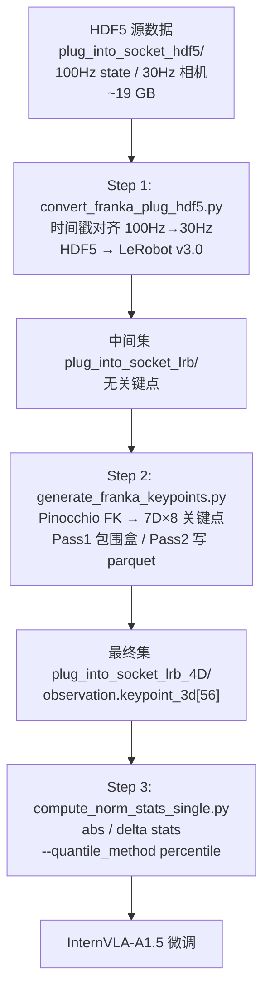
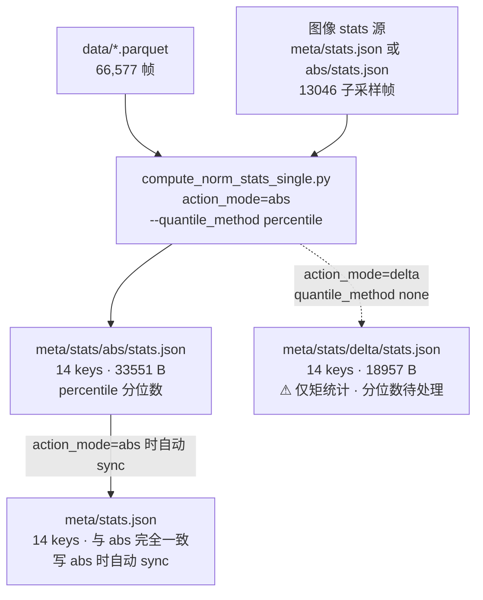
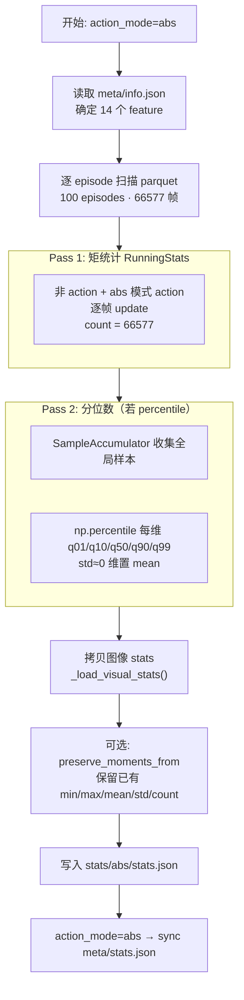
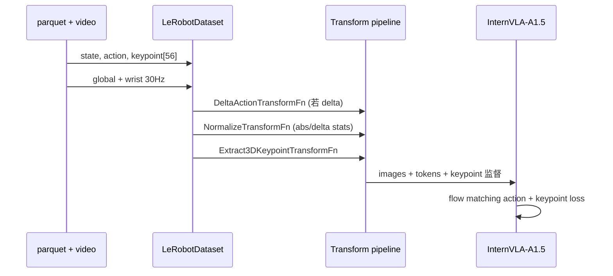

# Franka 单臂插插座数据集与归一化统计完整分析

> **数据集路径**: `/B/Dta/plug_into_socket_lrb_4D`  
> **LeRobot repo_id**: `plug_into_socket_lrb_4D`  
> **robot_type**: `franka_plug`  
> **文档融合来源**:
> - Franka 插插座数据集深入分析（2026-09-07）
> - `abs_stats_quantiles_global_vs_episode.md`（全局 histogram 重算实验）
> - `abs_stats_quantiles_three_way.md`（percentile / histogram / episode 三分法对比）
>
> **相关方案**: [dta_4dtrj_plan.md](dta_4dtrj_plan.md)、[dta_4dtrj_plan_0904LOG.md](dta_4dtrj_plan_0904LOG.md)

---

## 目录

1. [数据集定位与处理管道](#1-数据集定位与处理管道)
2. [规模、结构与文件布局](#2-规模结构与文件布局)
3. [观测空间（Observation）](#3-观测空间observation)
4. [动作空间（Action）](#4-动作空间action)
5. [任务与语言](#5-任务与语言)
6. [stats 文件生态：meta / abs / delta](#6-stats-文件生态meta--abs--delta)
7. [meta / abs 计算流程与使用指南（当前生产）](#7-meta--abs-计算流程与使用指南当前生产)
8. [分位数方法论演进](#8-分位数方法论演进)
9. [分位数实验：三分法完整对比数据](#9-分位数实验三分法完整对比数据)
10. [分位数分 feature 深入解读](#10-分位数分-feature-深入解读)
11. [训练集成与数据流](#11-训练集成与数据流)
12. [数据质量评估](#12-数据质量评估)
13. [与相关方法的横向对比](#13-与相关方法的横向对比)
14. [结论与推荐操作](#14-结论与推荐操作)
15. [待处理：delta/stats.json 分位数](#15-待处理deltastatsjson-分位数)

---

## 1. 数据集定位与处理管道

这是 **InternVLA-A1.5 GeoPredict（3D 轨迹 / 7D 关键点）** 管线下的 Franka **单臂**精细操作数据集，任务为 **将插头插入插座**（`plug into socket`）。

与 R1Pro 双臂方案的主要差异：

| 维度 | Franka 本数据集 | R1Pro E1/E2 |
|------|----------------|-------------|
| 臂数 | 单臂 | 双臂 |
| 关键点数 | **8**（7 link + hand_tcp） | 16 |
| 关键点总维度 | **56**（8×7D） | 112 |
| 源数据 | HDF5（需格式转换） | 通常已是 LeRobot |
| robot_type | `franka_plug` | `r1_pro` 等 |

### 1.1 三步处理管道



**Step 1** — `b/s/Frk/convert_franka_plug_hdf5.py`：对每个相机帧找最近 state 帧，输出 30Hz LeRobot parquet + MP4。

**Step 2** — `b/s/Frk/generate_franka_keypoints.py`：离线 FK，两趟扫描（全局 \(R_{\text{pad}}\) → 归一化写入）。

**Step 3** — `util_scripts/compute_norm_stats_single.py`：按 `action_mode` 计算矩统计；abs 模式分位数推荐 `--quantile_method percentile`。

---

## 2. 规模、结构与文件布局

### 2.1 规模概览

| 属性 | 值 |
|------|-----|
| 格式 | LeRobot **v3.0** |
| Episode 数 | **100** |
| 总帧数 | **66,577** |
| 帧率 | **30 Hz** |
| 任务数 | **1** |
| 磁盘占用 | **~432 MB** |
| 单 episode 长度 | min=538, max=798, mean=**665.8**, std=61.7 帧 |
| 单 episode 时长 | 约 **18–27 s**（538/30 ~ 26.6 s） |
| 长度校验 | `sum(episode.length) = 66577` ✓ |

### 2.2 目录结构

```
plug_into_socket_lrb_4D/
├── data/chunk-000/file-000.parquet    # 66,577 行 tabular 数据
├── videos/
│   ├── observation.images.global/     # 1 个 MP4 (~183 MB, AV1)
│   └── observation.images.wrist/      # 2 个 MP4 (~249 MB, AV1)
└── meta/
    ├── info.json                      # feature schema（14 个 feature）
    ├── keypoints_meta.json            # FK / 归一化元信息
    ├── tasks.parquet                  # 任务文本
    ├── episodes/chunk-000/file-000.parquet
    ├── stats.json                     # LeRobot 内置 stats（14 keys，与 abs 同步，percentile 分位数）
    └── stats/
        ├── abs/
        │   ├── stats.json             # 训练用 abs 统计（14 keys，percentile 分位数）
        │   ├── stats.json.bak_histogram    # 全局 histogram 分位数备份（审计）
        │   └── stats.json.bak_episode_agg  # episode 聚合分位数备份（审计）
        └── delta/
            └── stats.json             # 训练用 delta 统计（14 keys，⚠ 仅矩统计，分位数待处理）
```

### 2.3 Parquet 列与 dtype

| 列名 | dtype | 说明 |
|------|-------|------|
| `observation.state.arm` | object（内为 float32[7]） | 7 关节角 |
| `observation.state.gripper` | float32 | 夹爪物理宽度 (m) |
| `observation.state.ee_pos` | object[3] | 末端位置 |
| `observation.state.ee_quat` | object[4] | 末端四元数 [w,x,y,z] |
| `action.arm` | object[7] | 目标关节角 |
| `action.gripper` | float32 | 夹爪命令 0–1 |
| `observation.keypoint_3d` | object[56] | 8×7D 关键点 |
| `timestamp`, `frame_index`, `episode_index`, `index`, `task_index` | float/int | 元数据索引 |

---

## 3. 观测空间（Observation）

### 3.1 本体状态（Proprioception）

| Feature | 维 | 含义 | 典型范围 / 统计 |
|---------|-----|------|----------------|
| `observation.state.arm` | 7 | Franka 关节角 (rad) | j1∈[-0.48,0.05], j4∈[-2.20,-1.53]（肘大幅弯曲） |
| `observation.state.gripper` | 1 | 夹爪物理开度 (m) | [0, 0.079]，mean≈**0.034** |
| `observation.state.ee_pos` | 3 | 末端位置 (m) | x≈0.565±**0.007**, y std≈0.056, z std≈0.061 |
| `observation.state.ee_quat` | 4 | 四元数 **[w,x,y,z]** | w∈[0.993, 1.0]，mean(w)≈**0.999** |

工作空间紧凑：ee_pos 的 x 标准差仅 ~7 mm，任务以插座附近的**精细插入**为主，手臂整体位移不大。

### 3.2 视觉观测

| 相机 | 分辨率 | 编码 | 用途 |
|------|--------|------|------|
| `observation.images.global` | 480×640×3 | AV1 / yuv420p / 30fps | 第三人称 global |
| `observation.images.wrist` | 480×640×3 | 同上 | 腕部 eye-in-hand |

图像像素归一化到 [0,1]：

- global mean RGB ≈ [0.450, 0.457, 0.447]
- wrist mean RGB ≈ [0.478, 0.421, 0.392]（偏暗，近距离）

图像 stats 的 count = **13,046**（子采样帧，非 66,577 全帧）。

### 3.3 7D 关键点（GeoPredict 核心）

**Feature**: `observation.keypoint_3d`，**56 维** = 8 关键点 × 7D（px, py, pz, qx, qy, qz, qw）

**8 个 URDF link**（前缀 `fr3v2_1`）：

```
link1, link2, link3, link4, link5, link6, link7, hand_tcp
```

#### 生成与归一化（`keypoints_meta.json`）

| 参数 | 值 |
|------|-----|
| `bbox_radius` \(R_{\text{pad}}\) | **0.836100 m** |
| `bbox_margin` | 15% |
| `global_min_base_relative` | [-0.032, -0.140, 0.178] m |
| `global_max_base_relative` | [0.603, 0.062, 0.727] m |
| 坐标系 | base_link 原点，各向同性除以 \(R_{\text{pad}}\) |
| 四元数 | xyzw，半球归一化（qw ≥ 0） |
| URDF | `b/d/Frk/fr3v2_1_franka_hand.urdf` |
| 总帧数（meta 记录） | 66,577 |

#### 各 link 运动特征（全数据集统计）

| Link | \|pos\| 均值 | pos std | qw std | 解读 |
|------|-------------|---------|--------|------|
| link1 | 0.398 | 0.188 | 0.0072 | 肩部，位置近固定（仅旋转），px/py/pz std≈0 |
| link2 | 0.398 | 0.188 | 0.0034 | 近 link1 |
| link3 | 0.774 | 0.356 | 0.0029 | 随任务展开 |
| link4 | 0.773 | 0.334 | **0.0480** | 肘部，四元数变化大 |
| link5 | 0.810 | 0.290 | **0.0602** | 腕部区域 |
| link6 | 0.810 | 0.290 | 0.0140 | |
| link7 | 0.888 | 0.319 | 0.0118 | |
| hand_tcp | 0.754 | 0.299 | 0.0137 | 末端，承载插入轨迹主要空间变化 |

- link1 位置 mean≈[0, 0, 0.398]，std=0：**预期**（frame 原点在基座）
- 四元数范数 ≈ **1.0**
- 位置 OOB（\|pos\|>1.01）：**0 / 66,577 帧**

---

## 4. 动作空间（Action）

### 4.1 Schema（`b/s/Frk/cfg/franka_plug.yaml`）

```yaml
robot_type: franka_plug
action_mask_spec: [7, -1]   # arm 7 维可 delta；gripper 保持绝对值
feature_mapping:
  observation.state: [observation.state.arm, observation.state.gripper]
  action: [action.arm, action.gripper]
```

| Feature | 维 | 语义 |
|---------|-----|------|
| `action.arm` | 7 | 目标关节角 (rad) |
| `action.gripper` | 1 | 夹爪命令 **0–1**（非物理宽度） |

### 4.2 Action 与 State 的关系（66,577 帧实测）

| 关节 | corr(state, action) | mean(action − state) | 备注 |
|------|---------------------|----------------------|------|
| j1 | **0.9960** | +0.0024 | 高跟踪 |
| j2 | 0.9852 | −0.0041 | |
| j3 | **0.9992** | +0.0013 | |
| j4 | 0.9955 | +0.0040 | |
| j5 | **0.7519** | −0.0064 | 噪声相对较大 |
| j6 | 0.9639 | **+0.0627** | 系统性偏高 |
| j7 | 0.9390 | +0.0210 | |

- mean \|action−state\| 最大约 **0.08 rad**（j7）
- max \|action−state\| 最大约 **0.15 rad**（j6）
- `corr(action[t], state[t+1])` 与 `corr(action[t], state[t])` 几乎相同 → action 是**同帧目标角**，非简单下一帧 state

**Gripper 双语义**：

| | action.gripper | observation.state.gripper |
|--|----------------|---------------------------|
| 单位 | 0–1 命令 | 米（物理宽度） |
| mean | **0.579** | **0.034** |
| 含义 | 多数时间偏「张开/预备」 | 多数时间物理较闭 |

### 4.3 abs vs delta 动作统计语义

| 模式 | action.arm 统计对象 | action.arm count | action.arm mean（示例） |
|------|---------------------|------------------|------------------------|
| **abs** | 绝对关节角 | **66,577** | j1≈−0.238 |
| **delta** | chunk 差分 \(\Delta a = a_{t:t+50} - s_t\) | **3,083,850** | j1≈**+0.004**（≈0） |

delta count 公式：

\[
\text{count} = \sum_{\text{ep}} (L_{\text{ep}} - 49) \times 50 = (66577 - 100\times49)\times50 = 61677\times50 = 3{,}083{,}850
\]

gripper 在 delta 模式下 min/max 与 abs **相同**（mask 为 false，不做差分），但 mean/std 因重叠窗口加权而略有偏差（mean 0.579→0.622）。

---

## 5. 任务与语言

- 单一任务：`task_index = 0`，文本 **"plug into socket"**（`meta/tasks.parquet`）
- 无 per-frame 语言变化
- 适合**单任务精细操作微调**；组合泛化主要依赖视觉 / 关键点，而非语言多样性

---

## 6. stats 文件生态：meta / abs / delta

### 6.1 三份 stats 的角色（2026-09-07 当前状态）



| 文件 | 大小（约） | 当前状态 | 用途 |
|------|-----------|----------|------|
| `meta/stats.json` | **33,551 B** | ✅ 与 abs **完全一致**；percentile 分位数 | LeRobot `load_stats()` 默认路径；训练 bootstrap；图像 stats 源 |
| `stats/abs/stats.json` | **33,551 B** | ✅ percentile 生产版 | **abs 模式训练**（`external_stats_path`） |
| `stats/delta/stats.json` | 18,957 B | ⚠️ **待处理**：仅有 min/max/mean/std/count，**无 q01–q99** | delta 模式 mean_std 训练可用；q01_q99 未就绪 |
| `stats.json.bak_histogram` | 34,441 B | 审计备份 | histogram 分位数对照 |
| `stats.json.bak_episode_agg` | 34,441 B | 审计备份 | 旧 episode 聚合对照 |

> **历史说明**：最早 `meta/stats.json` 由 LeRobot 数据集创建流程生成（13 keys、episode 聚合分位数、无 `keypoint_3d`）。经 percentile 管线升级后，**写 abs 时会自动 sync 覆盖 meta**，现为 14 keys 完整版。

### 6.2 meta 与 abs 的关系（当前）

| 维度 | `meta/stats.json` | `stats/abs/stats.json` |
|------|-------------------|------------------------|
| 内容 | **byte-identical** | **byte-identical** |
| feature 数 | 14（含 `keypoint_3d`） | 14 |
| 分位数（非图像） | 全局 `np.percentile` | 全局 `np.percentile` |
| 写入时机 | abs 写入后自动 sync | 主输出 |
| 训练最终生效 | 被 `external_stats` 覆盖后相同 | `use_external_stats=true` 时直接使用 |

### 6.3 delta 与 abs/meta 的差异（摘要）

| 差异点 | abs / meta | delta |
|--------|-----------|-------|
| action.arm 语义 | 绝对关节角 | chunk 差分 \(\Delta a = a_{t:t+50} - s_t\) |
| action.arm count | 66,577 | **3,083,850** |
| 非 action feature 矩统计 | 逐帧 66,577 | 与 abs 相同（逐帧） |
| 分位数 | ✅ percentile | ❌ **未处理（待办）** |
| 验收 / 三分法对比 | ✅ 已完成 | ❌ **未做** |

详见 [§15 待处理：delta/stats.json 分位数](#15-待处理deltastatsjson-分位数)。

---

## 7. meta / abs 计算流程与使用指南（当前生产）

本节描述 **`util_scripts/compute_norm_stats_single.py`** 在当前代码库下的完整行为，以及各 stats 文件的用途与注意事项。

### 7.1 入口命令（生产版）

```bash
cd /B/SRC/itvlaGp
PYTHONPATH=src python3 util_scripts/compute_norm_stats_single.py \
  --repo_id plug_into_socket_lrb_4D \
  --dataset_root /B/Dta/plug_into_socket_lrb_4D \
  --action_mode abs \
  --chunk_size 50 \
  --quantile_method percentile \
  --preserve_moments_from /B/Dta/plug_into_socket_lrb_4D/meta/stats/abs/stats.json.bak_histogram \
  --output_path /B/Dta/plug_into_socket_lrb_4D/meta/stats/abs/stats.json
```

说明：

- 首次从 histogram 版升级时用了 `--preserve_moments_from bak_histogram` 以锁定矩统计；**日常重算可省略**该参数（会从 parquet 重算矩统计 + 分位数）。
- 写 abs 成功后脚本会打印 `synced meta stats: .../meta/stats.json`，**无需手动 cp**。
- **`--quantile_method none` 会清掉非图像分位数**，生产环境勿用（除非明确只想更新矩统计）。

### 7.2 计算流程（parquet 路径，推荐）

提供 `--dataset_root` 时走 **parquet 直读**，不依赖 PyAV / LeRobotDataset：



#### 7.2.1 矩统计（所有非图像 feature）

- **算法**：`RunningStats` 在线累积 min / max / mean / std / count（float32）。
- **样本构造（abs 模式）**：每个 feature **逐帧**原始值，\(N = 66{,}577\)。
- **覆盖 feature**：state、gripper、ee_pos、ee_quat、keypoint_3d、action.arm、action.gripper、index 等全部 tabular 列。
- **稳定性**：自最初 parquet 扫描以来矩统计**未变**（与 `bak_histogram`、`bak_episode_agg` 对照 max diff = 0）。

#### 7.2.2 分位数（非图像 feature）

- **算法**：`--quantile_method percentile` → 全局 `SampleAccumulator` + `np.percentile(..., method="linear")`。
- **样本总体**：与矩统计相同，66,577 逐帧样本（abs 语义）。
- **档位**：q01, q10, q50, q90, q99。
- **特殊处理**：某维 `std < 1e-12` 时，该维五档分位数均置为 `mean`。
- **生产选定原因**：
  - 比 episode 聚合**语义正确**（`index.q99` 等单调字段不再失真）；
  - 比 5000-bin histogram **精确**（robot feature 与 histogram 差 < 1.2×10⁻⁴）；
  - 66k 规模内存 ~200 MB，完全可行。

#### 7.2.3 图像 feature（两个相机）

- **不重算**。从已有 stats 文件**拷贝** min/max/mean/std/count/q01–q99：
  1. 优先 `meta/stats.json`
  2. fallback `meta/stats/abs/stats.json`
- **来源 population**：LeRobot 原始 **13,046** 子采样帧（≠ 66,577 全帧）。
- **原因**：图像 stats 计算需解码 MP4，代价高；子采样 stats 与 LeRobot 生态一致，且三份 abs 文件间图像部分**逐字段相同**。

#### 7.2.4 meta 自动 sync

```python
# compute_norm_stats_single.py · _maybe_sync_meta_stats()
# 仅 action_mode == "abs" 时触发
write_json(output_dict, dataset_root / "meta" / "stats.json")
```

**目的**：

1. 让 `load_stats()` 返回**完整 14 keys**（含 keypoint），避免 `use_imagenet_stats` 阶段 `meta.stats is None` 崩溃；
2. 与 `info.json` feature schema 对齐；
3. 作为后续重算时的图像 stats fallback 源；
4. 满足 LeRobot 数据集自包含约定。

**注意**：sync 仅在能解析 `dataset_root` 时发生（`--dataset_root`、LeRobotDataset.root、或从 `.../meta/stats/abs/stats.json` 推断）。

### 7.3 为何 abs 与 meta 要设计成「同内容、两路径」

| 问题 | 仅 meta | 仅 abs | 当前双写 + sync |
|------|---------|--------|-----------------|
| LeRobot `load_stats()` | ✅ | ❌ 非标准路径 | ✅ meta 满足框架 |
| 含 keypoint_3d | 旧版 ❌ | ✅ | ✅ 两者都有 |
| abs / delta 分目录 | ❌ | ✅ | ✅ `stats/abs` · `stats/delta` |
| 训练显式指定 stats | 易混淆 | ✅ external path | ✅ launch 指向 abs |
| 图像 stats /bootstrap | 需要 | 可拷贝 | ✅ 互为 fallback |

**训练时实际生效的是 external stats**（abs 或 delta），不是「裸 meta」；但 meta 必须在磁盘上存在且完整，否则 factory 在 `use_imagenet_stats=true`（默认）时会先于 external 加载而崩溃。

### 7.4 如何在训练 / 工具中使用

#### 7.4.1 InternVLA-A1.5 微调（abs，推荐）

```bash
# launch/frk_plug_warmup_launch.sh
--dataset.action_mode=abs
--dataset.use_external_stats=true
--dataset.external_stats_path=/B/Dta/plug_into_socket_lrb_4D/meta/stats/abs/stats.json
```

**加载顺序**（`src/lerobot/datasets/factory.py`）：

1. `LeRobotDataset` → `load_stats()` 读 `meta/stats.json`
2. `use_imagenet_stats=true`（默认）→ 覆写图像 mean/std 为 ImageNet（若 key 存在）
3. `use_external_stats=true` → `meta.stats.update(ext_stats)`，**abs 覆盖全部 key**
4. `NormalizeTransformFn.hydrate()` → 使用合并后的 `dataset.meta.stats`

因此：**归一化最终用的是 abs/stats.json**；meta 主要起 bootstrap 与 LeRobot 兼容作用。

#### 7.4.2 归一化模式与分位数

| Policy | `NormalizationMode` | 是否用到 q01–q99 |
|--------|---------------------|------------------|
| InternVLA-A1.5 | STATE/ACTION = **IDENTITY** | 否（仅 mean/std 备用） |
| Pi0 / Pi0.5 | 可配 **QUANTILES** | **是** → 必须 percentile 版 abs |

#### 7.4.3 各文件何时读/写

| 场景 | 读取 | 写入 |
|------|------|------|
| 训练（external stats） | abs + meta bootstrap | — |
| `compute_norm_stats_single.py` abs | parquet + 图像 stats 源 | abs + **meta sync** |
| `compute_norm_stats_single.py` delta | parquet + 图像 stats 源 | delta only（**不** sync meta） |
| HF / LeRobot 工具 `load_stats()` | meta | — |
| Open-loop 测试 | `dataset.meta.stats`（需先 external 注入） | — |

### 7.5 验收与版本稳定性

已对 **abs / meta（percentile 生产版）** 完成：

| 检查项 | 结果 |
|--------|------|
| `meta/stats.json` == `abs/stats.json` | ✅ byte-identical（33551 B） |
| 与 `info.json` 14 features 对齐 | ✅ |
| 矩统计 vs `bak_histogram` | ✅ max diff = 0 |
| percentile vs histogram（robot q） | ✅ < 1.2×10⁻⁴ |
| percentile vs episode（index q99） | ✅ 差 ~3.2×10⁴（证明已脱离 episode 版） |
| 03:44 percentile 版 vs 06:52 恢复版 | ✅ 重算 reproduce byte-identical |

审计备份保留于 `stats/abs/stats.json.bak_*`，**勿删**。

### 7.6 常见误操作

| 误操作 | 后果 | 正确做法 |
|--------|------|----------|
| `--quantile_method none` 写 abs | 非图像 q01–q99 被清空 | 生产用 `percentile` |
| 删 `meta/stats.json` 且未改 launch | `use_imagenet_stats` 崩溃 | 保留 meta，或设 `use_imagenet_stats=false` + external stats |
| 用 meta 做 delta 训练 | action 统计语义错误 | delta 训练用 `stats/delta/stats.json` |
| 从 abs 拷贝 action 分位数到 delta | delta 样本总体不同 | 见 §15 待办 |
| 手动只更新 meta 不更新 abs | 两者漂移 | 只跑 abs 脚本（自动 sync meta） |

---

## 8. 分位数方法论演进

### 8.1 三种分位数方法定义

| 代号 | 方法 | 实现 |
|------|------|------|
| **episode** | 逐 episode `RunningQuantileStats` (5000-bin) → `aggregate_stats` **对 q 值加权平均** | 旧 `augment_abs_stats_quantiles.py`；`meta/stats.json` 同款 |
| **histogram** | **全局**单 accumulator，`RunningQuantileStats` (5000-bin) | 曾写入 abs；备份 `stats.json.bak_histogram` |
| **percentile** | **全局**单遍样本 + `np.percentile`；std≈0 维置 mean | **当前生产**；`compute_norm_stats_single.py --quantile_method percentile` |

**重要概念澄清**：

- **全局 RunningQuantileStats = 全局 histogram 分位数**（同一类方法，5000-bin 近似）
- **全局 np.percentile** = 精确分位数（66k 规模完全可行）
- **episode 聚合** ≠ 全局分位数（对 q 做加权平均，数学上不等于全局 q）

### 8.2 为何 episode 聚合不可靠

`aggregate_stats` 对分位数的合并方式：

```python
weighted_quantiles = quantile_values * counts
aggregated[q_key] = weighted_quantiles.sum(axis=0) / total_count
```

这是对**各 episode 的分位数值**做加权平均，**不等于**在全数据集上直接计算的分位数。当各 episode 分布差异大或变量跨 episode 单调时，误差灾难性。

### 8.3 当前推荐 pipeline

```bash
PYTHONPATH=src python3 util_scripts/compute_norm_stats_single.py \
  --repo_id plug_into_socket_lrb_4D \
  --dataset_root /B/Dta/plug_into_socket_lrb_4D \
  --action_mode abs \
  --chunk_size 50 \
  --quantile_method percentile \
  --output_path /B/Dta/plug_into_socket_lrb_4D/meta/stats/abs/stats.json
# → 写入 abs/stats.json，并自动 sync meta/stats.json
```

可选 `--preserve_moments_from` 保留已有 min/max/mean/std/count，仅更新 q01–q99。

**图像 feature**：不重算，从 `meta/stats.json` 或 `abs/stats.json` 拷贝（13046 子采样帧 population 不同）。

完整流程说明见 [§7 meta / abs 计算流程与使用指南](#7-meta--abs-计算流程与使用指南当前生产)。

---

## 9. 分位数实验：三分法完整对比数据

实验数据集：`/B/Dta/plug_into_socket_lrb_4D`  
对比项：每个非图像 feature × 5 档分位数 = **60 项**

### 9.1 全局 histogram 重算实验（2026-09-07 UTC 03:04）

方法：全局 `RunningQuantileStats` (5000-bin)；保留原 min/max/mean/std/count。

**矩统计 preserved**：**通过** — 所有 feature 不变。

**内部一致性**：

- 分位数单调 q01≤…≤q99：**通过**
- 分位数在 [min, max] 内：**通过**

#### 9.1.1 全局 histogram vs episode 聚合（旧 abs 分位数）

| feature | quantile | max_abs_diff | max_rel_diff |
|---------|----------|--------------|--------------|
| **worst** | **index.q99** | **3.229347e+04** | **9.606292e-01** |
| `action.arm` | all q | 2.244932e-01 | — |
| `action.gripper` | all q | 7.420954e-02 | — |
| `episode_index` | all q | 4.975199e+01 | — |
| `frame_index` | all q | 4.987628e+01 | — |
| `index` | all q | 3.229347e+04 | — |
| `observation.keypoint_3d` | all q | 4.684914e-01 | — |
| `observation.state.arm` | all q | 2.237720e-01 | — |
| `observation.state.ee_pos` | all q | 5.809017e-02 | — |
| `observation.state.ee_quat` | all q | 2.280919e-02 | — |
| `observation.state.gripper` | all q | 5.944386e-03 | — |
| `task_index` | all q | 6.310887e-30 | — |
| `timestamp` | all q | 1.662543e+00 | — |

#### 9.1.2 全局 histogram vs meta/stats.json

与 9.1.1 **数值相同**（meta 亦用 episode 聚合分位数，且不含 keypoint_3d）。

#### 9.1.3 全局 histogram vs numpy.percentile（精确参考）

| feature | max_abs_diff | 备注 |
|---------|--------------|------|
| `action.arm` | 1.157071e-04 | histogram 近似误差 |
| `action.gripper` | 1.764549e-04 | histogram 近似误差 |
| `episode_index` | 9.579819e-03 | histogram 近似误差 |
| `frame_index` | 1.187188e-01 | 直方图近似 |
| `index` | 4.755429e-01 | 直方图近似 |
| `observation.keypoint_3d` | **2.445237e-04** | histogram 近似误差 |
| `observation.state.arm` | 4.429680e-04 | histogram 近似误差 |
| `observation.state.ee_pos` | 2.281690e-05 | histogram 近似误差 |
| `observation.state.ee_quat` | 2.385390e-05 | histogram 近似误差 |
| `observation.state.gripper` | 1.411791e-05 | histogram 近似误差 |
| `task_index` | 3.960000e-14 | 常数 0 |
| `timestamp` | 3.958094e-03 | histogram 近似误差 |

**keypoint_3d 细项（histogram vs numpy）**：

- 五档分位数最大 abs diff：**2.445237e-04**
- 旧 episode 聚合同指标：**4.684914e-01**

---

### 9.2 三分法对比实验（2026-09-07 UTC 03:44）

| 代号 | 来源文件 |
|------|----------|
| percentile | 当前 `stats/abs/stats.json` |
| histogram | `stats.json.bak_histogram` |
| episode | `stats.json.bak_episode_agg` |

**矩统计 preserved**（percentile 写入时保留 histogram 版的 min/max/mean/std/count）：**是**

#### 9.2.1 percentile vs histogram

- 对比项：60
- 平均 max_abs_diff：**3.195455e-02**
- 最差：`index.q50` = **4.755429e-01** (rel 1.428551e-05)

| feature | 五档 q 最大 abs diff |
|---------|---------------------|
| `action.arm` | 1.157071e-04 |
| `action.gripper` | 1.764549e-04 |
| `episode_index` | 9.579819e-03 |
| `frame_index` | 1.187188e-01 |
| `index` | 4.755429e-01 |
| `observation.keypoint_3d` | 2.445237e-04 |
| `observation.state.arm` | 4.429680e-04 |
| `observation.state.ee_pos` | 2.281690e-05 |
| `observation.state.ee_quat` | 2.385390e-05 |
| `observation.state.gripper` | 1.411791e-05 |
| `task_index` | 3.960000e-14 |
| `timestamp` | 3.958094e-03 |

**机器人相关 feature**（action / state / keypoint）：percentile vs histogram **< 1.2×10⁻⁴**。

#### 9.2.2 percentile vs episode

- 对比项：60
- 平均 max_abs_diff：**1.959089e+03**
- 最差：`index.q99` = **3.229324e+04** (rel 9.606222e-01)

| feature | 五档 q 最大 abs diff |
|---------|---------------------|
| `action.arm` | 2.244916e-01 |
| `action.gripper` | 7.432895e-02 |
| `episode_index` | 4.974407e+01 |
| `frame_index` | 4.978348e+01 |
| `index` | 3.229324e+04 |
| `observation.keypoint_3d` | 4.685054e-01 |
| `observation.state.arm` | 2.237893e-01 |
| `observation.state.ee_pos` | 5.806735e-02 |
| `observation.state.ee_quat` | 2.280525e-02 |
| `observation.state.gripper` | 5.944386e-03 |
| `task_index` | 3.960000e-14 |
| `timestamp` | 1.659449e+00 |

#### 9.2.3 histogram vs episode（参考）

- 对比项：60
- 平均 max_abs_diff：**1.959118e+03**
- 最差：`index.q99` = **3.229347e+04** (rel 9.606292e-01)

与 9.1.1 一致：histogram 全局法已远优于 episode，但尚未达到 percentile 在索引类字段上的精确度。

---

## 10. 分位数分 feature 深入解读

### 10.1 单调索引类（`index`, `frame_index`, `episode_index`）

| 字段 | percentile / histogram q99 | episode 聚合 q99 | numpy q99 |
|------|---------------------------|------------------|-----------|
| `index` | ~**65,910** | ~**33,617** | ~65,909 |
| `frame_index` | ~**787** | ~664 | ~787 |
| `episode_index` | ~**99** | ~50.7 | ~99 |

`index` 是跨 episode 单调递增的全局帧号 (0→66576)。episode 聚合 q99≈33617 约等于全局 **q50**——语义错误。

**训练提示**：这些 metadata 字段通常**不参与** `NormalizeTransformFn`；但若误用于 q01_q99 归一化，episode 版 stats 会产生灾难性错误。

### 10.2 机器人 state / action

- percentile vs episode：最大偏差 **0.02–0.22**（如 `action.arm`）
- percentile vs histogram：**< 1.2×10⁻⁴**
- histogram vs episode：与 percentile vs episode 量级相同（0.02–0.22）

### 10.3 `observation.keypoint_3d`

| 对比 | 最大 q 偏差 |
|------|------------|
| percentile / histogram vs numpy.percentile | **2.4×10⁻⁴** |
| episode vs numpy.percentile | **0.47** |

高方差四元数维（如 dim 45、52）是 episode 聚合失败的重灾区。

### 10.4 图像

- 三种方法的 abs 文件中图像分位数**相同**（均来自 `meta/stats.json` 拷贝）
- 不应与 parquet 66,577 帧混用同一 quantile 算法

### 10.5 `task_index`

- 恒为 0；三种方法分位数一致（差异 ~10⁻¹⁴）

---

## 11. 训练集成与数据流

### 11.1 推荐训练配置

```bash
--dataset.repo_id=plug_into_socket_lrb_4D
--dataset.action_mode=abs          # 或 delta
--dataset.use_external_stats=true
--dataset.external_stats_path=/B/Dta/plug_into_socket_lrb_4D/meta/stats/abs/stats.json
```

InternVLA-A1.5 GeoPredict 关键参数（Franka vs R1Pro）：

| 参数 | Franka 值 | R1Pro 参考 |
|------|-----------|-----------|
| `num_keypoint_joints` | **8** | 16 |
| `keypoint_dim` / `keypoint_out_dim` | **7** | 7 |
| `kpt_4d_mode` | `pos_rot` | `pos_rot`（电梯） |
| `geopredict_checkpoint_path` | Phase 1 可传；**7D 下 TrackEncoder 不加载**（整网随机 init + warning） | 3D 迁移可加载；7D 同 Franka |
| `enable_keypoint_predictor` | true | true |

> TrackEncoder 加载逻辑见 `keypoints.py::geopredict_track_encoder_input_compatible()`；详述见 `plug_p1warmup.md` §7.3、`r1pro_migration_design.md` §6.5。

### 11.2 训练时数据流



### 11.3 分位数与训练模式

- InternVLA-A1.5 默认 **`NormalizeTransformFn(mode="mean_std")`** → q01–q99 **不参与**训练
- 若切换 **`q01_q99`**（如 Pi0.5 风格）→ 必须使用 **percentile 版 abs stats**，不可用 episode 聚合 stats

---

## 12. 数据质量评估

### 12.1 优点

- LeRobot v3.0 标准格式；schema 已注册 `franka_plug`
- 关键点 100% 在归一化包围盒内；四元数范数 ≈ 1
- 100 episodes / 66k 帧，单任务微调规模合理
- action/state 高度相关，遥操作一致性好
- 双视角（global + wrist）适合精细插入
- abs 分位数经三分法验证，percentile 版生产就绪

### 12.2 局限与注意点

| 问题 | 影响 | 建议 |
|------|------|------|
| 单任务、无语言多样性 | 组合泛化弱 | 评估区分 in-distribution vs 扰动 |
| j5 corr(state,action)=0.75 | j5 噪声较大 | 关注 j5 误差 |
| gripper action/state 不同单位 | 不可直接对比 | delta mask 已对 gripper 保持 abs |
| 无 train/val split | 100 ep 全 train | 评估留 held-out 或仿真 |
| `meta/stats.json` 与 abs 已同步 | 两者内容相同 | 训练仍推荐 explicit external abs path |
| 100Hz→30Hz 对齐 | ~16ms 最大时间误差 | 30Hz 策略通常可接受 |
| **`stats/delta/stats.json` 无分位数** | **q01_q99 delta 训练未就绪** | **§15 待处理** |

---

## 13. 与相关方法的横向对比

| 维度 | 本数据集 | 典型 RL/BC 数据集 |
|------|----------|------------------|
| 动作表示 | 绝对关节角 + 0–1 gripper | 常见 delta EE pose |
| 3D 监督 | 8×7D FK 关键点 | 多数 VLA 无 |
| 相机 | 2×480p AV1 | 各异 |
| 下游模型 | InternVLA-A1.5 + GeoPredict | Diffusion / VLA |

**分位数方法横向**（abs 模式）：

| 方法 | 统计正确性 | 与 mean/std 自洽 | 本数据集推荐 |
|------|-----------|-----------------|-------------|
| episode + aggregate | 差 | 差 | **不推荐** |
| 全局 histogram | 高 | 高 | 可用 |
| **全局 np.percentile** | **最高** | **高** | **推荐** |

---

## 14. 结论与推荐操作

### 14.1 数据集结论

`plug_into_socket_lrb_4D` 是 **单任务、单臂 Franka 精细插插座** 的 LeRobot v3.0 数据集：

1. **66,577 帧 / 100 episodes / 30Hz**，双相机 + 7DoF + gripper  
2. **56D 7D 关键点**（8 link FK，\(R_{\text{pad}}\)≈0.836 m）  
3. **action 为同帧目标关节角**，与 state 高度相关  
4. **`meta/stats.json` 与 `stats/abs/stats.json` 已同步**（percentile 版）；训练通过 `use_external_stats` 指向 abs/delta  
5. **delta 分位数尚未处理** → 见 §15

### 14.2 分位数结论（abs / meta）

1. **episode 聚合分位数在索引类字段语义错误**，在 keypoint_3d 上偏差 0.47  
2. **全局 histogram** 显著优于 episode，与 numpy 偏差 ~10⁻⁴（robot feature）  
3. **全局 np.percentile** 为当前 **abs / meta 生产标准**；写 abs 时自动 sync meta  
4. 矩统计由 `RunningStats` 单次扫描；分位数由 `--quantile_method percentile` 追加  
5. 审计备份：`stats.json.bak_histogram`、`stats.json.bak_episode_agg`

### 14.3 常用命令

```bash
# 生成 / 更新 abs stats（percentile 分位数）+ 自动 sync meta/stats.json
cd /B/SRC/itvlaGp
PYTHONPATH=src python3 util_scripts/compute_norm_stats_single.py \
  --repo_id plug_into_socket_lrb_4D \
  --dataset_root /B/Dta/plug_into_socket_lrb_4D \
  --action_mode abs \
  --chunk_size 50 \
  --quantile_method percentile \
  --output_path /B/Dta/plug_into_socket_lrb_4D/meta/stats/abs/stats.json

# delta 矩统计（⚠ 分位数待处理，见 §15）
PYTHONPATH=src python3 util_scripts/compute_norm_stats_single.py \
  --repo_id plug_into_socket_lrb_4D \
  --dataset_root /B/Dta/plug_into_socket_lrb_4D \
  --action_mode delta \
  --chunk_size 50 \
  --quantile_method none \
  --output_path /B/Dta/plug_into_socket_lrb_4D/meta/stats/delta/stats.json
```

---

## 15. 待处理：delta/stats.json 分位数

> **状态**：🔶 **待处理（TODO）**  
> **最后更新**：2026-09-07  
> **当前文件**：`/B/Dta/plug_into_socket_lrb_4D/meta/stats/delta/stats.json`（18,957 B）

### 15.1 当前已完成 vs 未完成

| 项目 | abs / meta | delta |
|------|-----------|-------|
| min / max / mean / std / count | ✅ | ✅ |
| 非图像 q01–q99 | ✅ percentile | ❌ **无** |
| 图像 q01–q99 | ✅（拷贝） | ✅（拷贝） |
| 与训练 transform 对齐验证 | ✅ | ❌ **未做** |
| 三分法 / histogram 交叉验证 | ✅ | ❌ **未做** |
| meta sync | ✅（abs 写时 sync） | N/A（delta 不 sync meta） |

### 15.2 为何不能照搬 abs 分位数

delta 模式存在**两套样本总体**（详见前期分析摘要）：

| 分组 | feature | count | 能否复用 abs 分位数 |
|------|---------|-------|---------------------|
| 非 action | state、keypoint、index… | 66,577 | **可以**（与 abs 相同逐帧值） |
| action.arm | chunk 差分 | 3,083,850 | **不可以**（语义完全不同） |
| action.gripper | chunk 内绝对值 | 3,083,850 | **不可以**（总体 ≠ abs 逐帧 66577） |

`action.gripper` 示例：abs q50≈0.803，delta chunk 展开 q50≈0.824（mean 亦 0.579→0.622）。

### 15.3 推荐后续方案（待实施）

1. **非 action + 图像**：从当前 abs/meta **拷贝**分位数（或同脚本逐帧 percentile，结果应一致）。
2. **action.arm / action.gripper**：在 **delta 样本流**上跑 `--quantile_method percentile`（与 `DeltaActionTransformFn` + chunk unfold 对齐）。
3. **验收清单**（待执行）：
   - 非 action 分位数 vs abs：max diff < 1e-10
   - action 分位数单调性 q01≤…≤q99
   - action 分位数 ∈ [min, max]
   - percentile vs histogram 交叉验证（action 键）
   - 随机帧训练对齐 spot-check（transform 输出 == stats 构造）

### 15.4 预期命令（待跑）

```bash
# TODO: delta 分位数（待开发/验收通过后执行）
PYTHONPATH=src python3 util_scripts/compute_norm_stats_single.py \
  --repo_id plug_into_socket_lrb_4D \
  --dataset_root /B/Dta/plug_into_socket_lrb_4D \
  --action_mode delta \
  --chunk_size 50 \
  --quantile_method percentile \
  --preserve_moments_from /B/Dta/plug_into_socket_lrb_4D/meta/stats/delta/stats.json \
  --output_path /B/Dta/plug_into_socket_lrb_4D/meta/stats/delta/stats.json
```

> 可选增强：为 `compute_norm_stats_single.py` 增加 `--quantile_non_action_from stats/abs/stats.json`，仅对 action 键重算分位数。

### 15.5 对训练的影响

- **InternVLA-A1.5 + `NormalizationMode.IDENTITY`**：delta 无分位数**不影响**当前 mean_std 路径（若启用）。
- **Pi0.5 风格 `q01_q99` + delta**：**阻塞**，必须先完成本节待办。

---

*文档更新：2026-09-07 — 新增 §7 meta/abs 计算与使用指南；abs 写时自动 sync meta；§15 标注 delta 分位数待处理。abs/meta 当前为 global np.percentile 生产版（33551 B，byte-identical）。*
