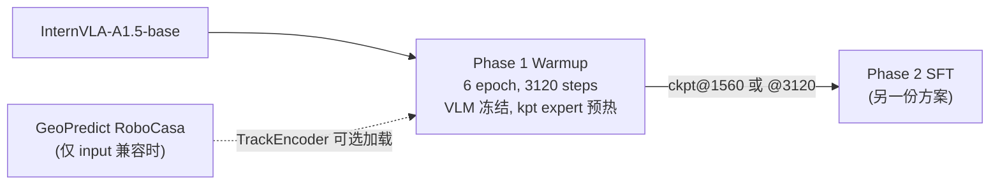
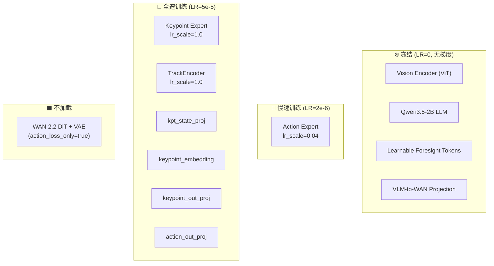
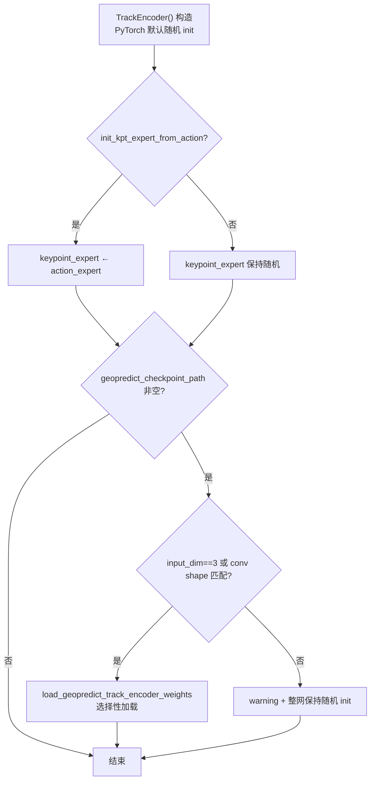
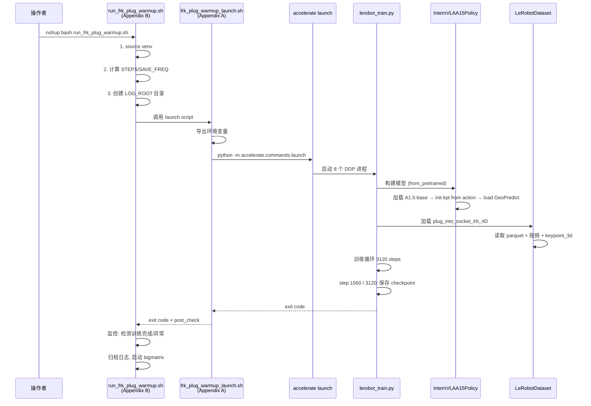
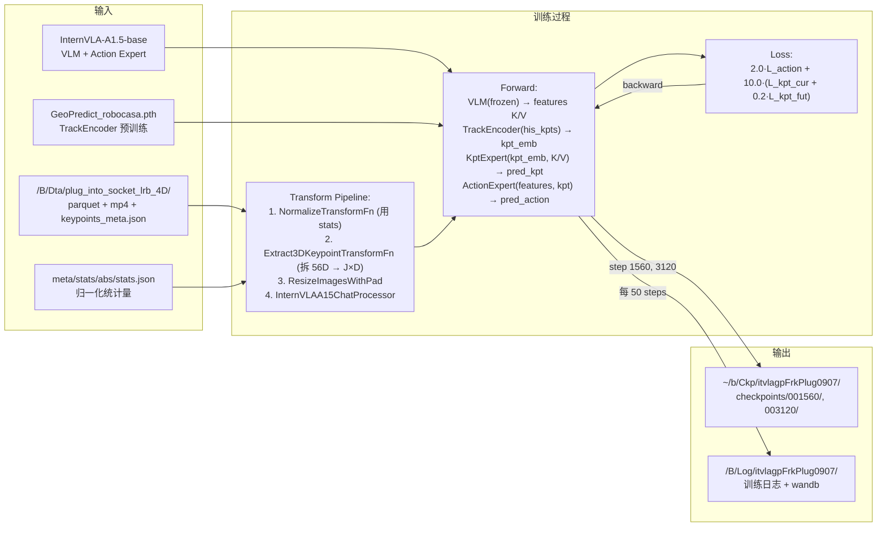

# Phase 1 Warmup 实施落地方案与操作手册 — Franka 插拔插座 7D 关键点

> **任务**: 在 `plug_into_socket_lrb_4D` 数据集上执行 GeoPredict Phase 1 Keypoint Expert Warmup
> **数据**: `/B/Dta/plug_into_socket_lrb_4D/` — 100 episodes, 66,577 frames, 30fps, 8 keypoints × 7D
> **机器**: 8× NVIDIA H200 (140GB)
> **虚拟环境**: `/B/VENV/itnvla15rbt20/`
> **代码库**: `/B/SRC/itvlaGp/`
> **日期**: 2026-09-07

---

## 目录

- [1. 概述与目标](#1-概述与目标)
- [2. 可配置变量总表（换机器必读）](#2-可配置变量总表换机器必读)
- [3. 服务器软硬件环境分析](#3-服务器软硬件环境分析)
- [4. 数据集深度分析](#4-数据集深度分析)
- [5. 训练步数与 Checkpoint 计算](#5-训练步数与-checkpoint-计算)
- [6. 有效超参详解](#6-有效超参详解)
- [7. 模块冻结与学习率策略](#7-模块冻结与学习率策略)
- [8. 数据流与脚本调用链](#8-数据流与脚本调用链)
- [9. 文件增删改清单](#9-文件增删改清单)
- [10. 操作手册 — Pre-flight 环境准备](#10-操作手册--pre-flight-环境准备)
- [11. 操作手册 — Smoke 测试](#11-操作手册--smoke-测试)
- [12. 操作手册 — 正式训练与监控](#12-操作手册--正式训练与监控)
- [13. 测试与验收](#13-测试与验收)
- [14. 故障排查](#14-故障排查)
- [Appendix A: Warmup Launch Script](#appendix-a-warmup-launch-script)
- [Appendix B: 训练编排与监控 Wrapper Script](#appendix-b-训练编排与监控-wrapper-script)

---

## 1. 概述与目标

### 1.1 什么是 Phase 1 Warmup

Phase 1 Warmup 是 InternVLA-A1.5 + GeoPredict 三阶段训练流程的第一步。目标是在冻结 VLM (Qwen3.5-2B) 的前提下，**预热 Keypoint Expert 和 TrackEncoder**，使其能从 7D 关键点轨迹 (位置 + 四元数旋转) 中提取出有用的空间表征，为后续 Phase 2 全模型 SFT 提供可靠的 kpt 分支起点。

Warmup 的核心动作:
1. **用 Action Expert 的权重初始化 Keypoint Expert** (`init_kpt_expert_from_action=true`)
2. **按输入维度兼容性决定是否加载 GeoPredict RoboCasa 预训练权重** 到 TrackEncoder（见 §7.3；Franka 7D 通常整网随机 init）
3. **以 kpt MSE loss 为主导、action flow-matching loss 为辅** 训练 6 个 epoch
4. **输出 checkpoint** 供 Phase 2 SFT 作为起点



### 1.2 为什么 Franka 需要 7D 关键点

Franka Panda 的插拔插座任务需要精确的末端姿态控制——插头必须以正确的角度和位置对准插座。仅用 3D 位置 (xyz) 描述关键点会丢失旋转信息，模型无法学习 "插头应该以什么角度插入"。

7D 关键点 (E1 scheme) 对每个关键点编码 `[px, py, pz, qx, qy, qz, qw]`:
- **位置** $[p_x, p_y, p_z]$: 除以 `bbox_radius`，归一化到 $[-1, 1]$ 附近
- **四元数** $[q_x, q_y, q_z, q_w]$: 半球归一化（$q_w \geq 0$），消除双覆盖歧义

> **出处**: 7D 关键点方案设计于 `b/d/R1Pro/dta_3dtrj_E2.md`，代码支持在 `src/lerobot/policies/internvla_a1_5/configuration_internvla_a1_5.py` 的 `kpt_4d_mode="pos_rot"` 实现（由 R1 Pro Phase 2 SFT 开发，见 `b/d/R1Pro/p2sft_planH200_0904LOG.md` §1）。

### 1.3 Franka vs RoboTwin/R1Pro 关键差异

| 维度 | RoboTwin (ALOHA) | R1 Pro | **Franka (本方案)** |
|:---|:---|:---|:---|
| 臂数 | 双臂 | 双臂 | **单臂** |
| DOF/臂 | 6 + 1 gripper | 7 | **7 + 1 gripper** |
| 关键点数 J | 14 | 16 | **8** |
| 关键点维度 D | 3 (xyz) | 7 (xyz+quat) | **7** (xyz+quat) |
| 总 kpt 维度 J×D | 42 | 112 | **56** |
| 坐标系 | kptsim 体素 | isotropic + hemisphere | **isotropic + hemisphere** |
| 相机数 | 3 (high/left/right) | 3 (head/wrist_l/wrist_r) | **2** (global/wrist) |
| FPS | 30 | 15 | **30** |
| State 维度 | 14 (joint+gripper) | 25 | **8** (arm7 + gripper1) |
| Action 维度 | 14 | 19 | **8** (arm7 + gripper1) |

### 1.4 出处总览

本方案的设计决策源自以下已验证的文档和代码:

| 内容 | 出处 |
|:---|:---|
| Warmup 训练策略、冻结矩阵、loss 权重 | `b/d/GpRbt/run_ech_rbt_p1.md` §2-4, `launch/internvla_a15_geop_phase1_kpt_warmup_kptsim_8g.sh` |
| 7D 关键点代码支持 (`kpt_4d_mode=pos_rot`) | `b/d/R1Pro/p2sft_planH200_0904LOG.md` §1 |
| Franka 数据集准备与验证 | `b/d/Frk/dta_4dtrj_plan_0904LOG.md` |
| Franka URDF 运动学 | `b/d/Frk/fr3v2_1_franka_hand.urdf` |
| 监控与 GPU 占用机制 | `b/d/GpRbt/run_ech_rbt_p1.md` §5-7, `b/d/GpRbt/run_ech_rbt_p1_0906LOG.md` |
| R1Pro 环境配置参考 | `b/d/R1Pro/p2sft_plan.md` §1, `b/d/R1Pro/p2sft_planH200.md` §⚡ |
| NCCL 插件修复 | `b/d/GpRbt/run_ech_rbt_p1_0906LOG.md` §2.2 |
| GeoPredict TrackEncoder 加载判定 | `src/lerobot/policies/internvla_a1_5/keypoints.py` §7.3 本方案 |

---

## 2. 可配置变量总表（换机器必读）

### 2.1 用户必须提供/确认的信息

在执行本方案前，操作者必须收集并确认以下信息:

| # | 信息 | 本机默认值 | 检查方式 |
|:---:|:---|:---|:---|
| 1 | Python 虚拟环境路径 | `/B/VENV/itnvla15rbt20` | `source <path>/bin/activate && python --version` |
| 2 | HF_HOME 路径 | `/B/VENV/hf_home` | `ls <path>/ckpts/InternVLA-A1.5-base` |
| 3 | GPU 数量与型号 | 8× H200 (140GB) | `nvidia-smi` |
| 4 | 数据集路径 | `/B/Dta/plug_into_socket_lrb_4D` | `cat <path>/meta/info.json \| grep total_frames` |
| 5 | 代码库路径 | `/B/SRC/itvlaGp` | `ls <path>/src/lerobot/scripts/lerobot_train.py` |
| 6 | InternVLA-A1.5-base 权重路径 | `${HF_HOME}/ckpts/InternVLA-A1.5-base` | `ls <path>/config.json` |
| 7 | GeoPredict RoboCasa 权重路径 | `${HF_HOME}/ckpts/GeoPredict_robocasa.pth` | `ls <path>` |
| 8 | Editable install 指向当前仓库 | `/B/SRC/itvlaGp/src` | `cat <venv>/lib/python3.11/site-packages/__editable__.internvla_a1_5-1.0.0.pth` |

### 2.2 静态配置变量

| 变量 | 默认值 | 含义 |
|:---|:---|:---|
| `EXPR_NAME` | **`itvlagpFrkPlug0907`** | 实验名，所有路径以此隔离 |
| `VENV_ROOT` | `/B/VENV/itnvla15rbt20` | Python 虚拟环境根目录 |
| `PROJ_ROOT` | 脚本推导 (代码库根) | InternVLA-A 代码库根目录 |
| `HF_HOME` | `/B/VENV/hf_home` | HuggingFace 缓存根 |
| `HF_LEROBOT_HOME` | `${HF_HOME}/lerobot` | LeRobot 数据根 |
| `DATA_SRC` | `/B/Dta/plug_into_socket_lrb_4D` | 原始数据集路径 |
| `DATA_REPO_ID` | `plug_into_socket_lrb_4D` | LeRobot 数据集 ID |
| `EXTERNAL_STATS_PATH` | `${DATA_SRC}/meta/stats/abs/stats.json` | abs 归一化统计量 |
| `PRETRAINED_PATH` | `${HF_HOME}/ckpts/InternVLA-A1.5-base` | 基础模型权重 |
| `GEOPREDICT_CKPT` | `${HF_HOME}/ckpts/GeoPredict_robocasa.pth` | GeoPredict TrackEncoder 预训练权重 |
| `CKPT_ROOT` | `~/b/Ckp/${EXPR_NAME}` | Checkpoint 输出根 |
| `LOG_ROOT` | `/B/Log/${EXPR_NAME}` | 日志 + wandb 输出根 |
| `PROC_PER_NODE` | `8` | 每节点 GPU 数 |
| `BATCH_SIZE` | `16` | 每 GPU batch size |
| `NODE_COUNT` | `1` | 节点数 |
| `NUM_EPOCHS` | `6` | Warmup 总 epoch 数 |
| `SAVE_EPOCH_INTERVAL` | `3` | 每几个 epoch 保存一次 checkpoint |
| `MASTER_PORT` | `36701` | DDP 通信端口 |
| `MONITOR_INTERVAL` | `900` | 监控检查间隔 (秒) |

### 2.3 动态计算变量 (由脚本自动推导)

| 变量 | 公式 | 本数据集的值 |
|:---|:---|:---|
| `TOTAL_FRAMES` | 从 `meta/info.json` 读取 | **66,577** |
| `EBS` | `PROC_PER_NODE × BATCH_SIZE × NODE_COUNT` | **128** |
| `STEPS_PER_EPOCH` | $\lceil\text{TOTAL\_FRAMES} / \text{EBS}\rceil$ | **520** |
| `TOTAL_STEPS` | `STEPS_PER_EPOCH × NUM_EPOCHS` | **3120** |
| `SAVE_FREQ` | `STEPS_PER_EPOCH × SAVE_EPOCH_INTERVAL` | **1560** |
| `SCHED_WARMUP_STEPS` | `STEPS_PER_EPOCH` (1 epoch warmup) | **520** |
| `SCHED_DECAY_STEPS` | `TOTAL_STEPS` | **3120** |
| `JOB_STAMP` | `$(date +'%Y_%m_%d_%H_%M_%S')` | 运行时生成 |

---

## 3. 服务器软硬件环境分析

### 3.1 硬件

| 项 | 规格 |
|:---|:---|
| GPU | **8× NVIDIA H200**, 每卡 ~140 GB HBM3 |
| GPU 总显存 | ~1,120 GB |
| 预估每卡 Warmup 显存 | ~25–35 GB (VLM 前向 only + kpt/action expert 训练, 无 WAN) |
| 显存余量 | 充裕 (Phase 1 不加载 WAN, 比 Phase 2 少用 ~40 GB/卡) |

### 3.2 软件

| 项 | 值 | 确认方式 |
|:---|:---|:---|
| Python 虚拟环境 | `/B/VENV/itnvla15rbt20/` (Python 3.11.9) | `source /B/VENV/itnvla15rbt20/bin/activate` |
| PyTorch | 2.10.0+cu128 | `python -c "import torch; print(torch.__version__)"` |
| CUDA 设备数 | 8 | `python -c "import torch; print(torch.cuda.device_count())"` |
| LeRobot 安装 | editable, 指向 `/B/SRC/itvlaGp/src` | 见 `.pth` 文件 |
| InternVLA-A1.5-base | `/B/VENV/hf_home/ckpts/InternVLA-A1.5-base/` | 已确认存在 |
| GeoPredict 权重 | `/B/VENV/hf_home/ckpts/GeoPredict_robocasa.pth` | 已确认存在 |

### 3.3 已知环境问题与修复

以下问题在 RoboTwin/R1Pro warmup 中已遇到并修复，本方案直接采用其修复方案:

| 问题 | 根因 | 修复 | 出处 |
|:---|:---|:---|:---|
| NCCL `ncclInternalError` | GCP NCCL 调优插件 `/usr/local/nvidia/lib64/libnccl-tuner.so` 自动加载但无配置文件 | `export NCCL_TUNER_PLUGIN="/dev/null"` | `run_ech_rbt_p1_0906LOG.md` §2.2 |
| Editable install 指向旧仓库 | `.pth` 文件内容为旧路径 | `.pth` 内容改为 `/B/SRC/itvlaGp/src` | `run_ech_rbt_p1_0906LOG.md` §0.4 |
| LD_LIBRARY_PATH 缺 NPP | `torchcodec` 需要 NVIDIA NPP 库 | 加入 `nvidia/npp/lib` 路径 | `b/d/GpRbt/sft0827LOG.md` |

这些修复已集成到本方案的 launch script 中 (Appendix A)。

---

## 4. 数据集深度分析

### 4.1 基本信息

| 项 | 值 |
|:---|:---|
| 数据集路径 | `/B/Dta/plug_into_socket_lrb_4D/` |
| LeRobot 版本 | v3.0 |
| robot_type | `franka_plug` |
| 总 episodes | 100 |
| 总帧数 | 66,577 |
| FPS | 30 Hz |
| 平均 episode 长度 | ~665 帧 (~22 秒) |

### 4.2 特征结构

| 特征 | 类型 | Shape | 说明 |
|:---|:---|:---:|:---|
| `observation.state.arm` | float32 | [7] | 7 个关节角 (joint1–joint7) |
| `observation.state.gripper` | float32 | [1] | 夹爪宽度 (0–0.08m) |
| `observation.state.ee_pos` | float32 | [3] | 末端位置 (x,y,z) |
| `observation.state.ee_quat` | float32 | [4] | 末端四元数 (w,x,y,z) |
| `action.arm` | float32 | [7] | 目标关节角 |
| `action.gripper` | float32 | [1] | 目标夹爪宽度 |
| `observation.images.global` | video | 480×640×3 | 全局相机, AV1 编码 |
| `observation.images.wrist` | video | 480×640×3 | 腕部相机, AV1 编码 |
| `observation.keypoint_3d` | float32 | **[56]** | 8 keypoints × 7D (px,py,pz,qx,qy,qz,qw) |

> **State 总维度**: 通过 `franka_plug.yaml` schema 的 `feature_mapping` 合并 `arm(7) + gripper(1) = 8D`
> **Action 总维度**: 合并 `arm(7) + gripper(1) = 8D`

### 4.3 关键点详情

| 项 | 值 |
|:---|:---|
| 关键点数 J | 8 |
| 每关键点维度 D | 7 (px,py,pz,qx,qy,qz,qw) |
| 总 kpt 维度 | 56 |
| 关键点 link 列表 | `fr3v2_1_link1`–`fr3v2_1_link7`, `fr3v2_1_hand_tcp` |
| 归一化方式 | base_link 原点, 各向同性 (isotropic), 位置除以 `bbox_radius` |
| `bbox_radius` | 0.836100 m |
| 旋转表示 | 四元数 xyzw, 半球归一化 ($q_w \geq 0$) |

> **出处**: 关键点由 `b/s/Frk/generate_franka_keypoints.py` 基于 URDF `b/d/Frk/fr3v2_1_franka_hand.urdf` 离线生成。验证结果见 `b/d/Frk/dta_4dtrj_plan_0904LOG.md` §5: FK reproducibility error = 0.0, 位置范围 $[-1, 1]$, 四元数范数误差 < $1.19 \times 10^{-7}$。

### 4.4 Schema 配置 (`franka_plug.yaml`)

文件位于 `b/s/Frk/cfg/franka_plug.yaml`:

```yaml
robot_type: franka_plug
action_mask_spec: [7, -1]
feature_mapping:
  observation.state:
    - observation.state.arm
    - observation.state.gripper
  action:
    - action.arm
    - action.gripper
image_mapping:
  observation.images.global: observation.images.image0
  observation.images.wrist: observation.images.image1
```

- `action_mask_spec: [7, -1]`: 前 7 维 (关节) 支持 delta 模式, 最后 1 维 (夹爪) 保持绝对值
- `image_mapping`: 2 个相机映射到标准键名 `image0`/`image1`
- `observation.keypoint_3d`: 不在 schema 中映射 — 训练管线的 `Extract3DKeypointTransformFn` 通过 `enable_keypoint_predictor=true` 直接从 parquet 读取

### 4.5 归一化统计量

abs 模式的归一化统计量位于 `/B/Dta/plug_into_socket_lrb_4D/meta/stats/abs/stats.json`，由 `util_scripts/compute_norm_stats_single.py` 生成（见 `dta_4dtrj_plan_0904LOG.md` §6）。包含 `observation.state.*`、`action.*`、`observation.keypoint_3d` 的 min/max/mean/std/count/quantiles。count = 66,577 与总帧数一致。

---

## 5. 训练步数与 Checkpoint 计算

### 5.1 计算公式

$$B_{\text{eff}} = G \times B \times M = 8 \times 16 \times 1 = 128$$

$$s_{\text{epoch}} = \left\lceil \frac{N}{B_{\text{eff}}} \right\rceil = \left\lceil \frac{66577}{128} \right\rceil = 520$$

$$S = s_{\text{epoch}} \times E = 520 \times 6 = 3120$$

$$\texttt{save\_freq} = s_{\text{epoch}} \times \texttt{SAVE\_EPOCH\_INTERVAL} = 520 \times 3 = 1560$$

其中: $N$ = 总帧数, $G$ = GPU 数, $B$ = 每 GPU batch size, $M$ = 节点数, $E$ = 总 epoch 数。

### 5.2 Checkpoint 保存点

| Step | Epoch | 保存条件 |
|:---:|:---:|:---|
| 1560 | 3 | `step % save_freq == 0` → `1560 % 1560 == 0` ✓ |
| 3120 | 6 | `step % save_freq == 0` ✓ 且 `step == steps` ✓ |

> `lerobot_train.py` 的保存条件: `step % save_freq == 0 or step == steps`（代码位于 `src/lerobot/scripts/lerobot_train.py`）。

### 5.3 Checkpoint 路径

```
~/b/Ckp/itvlagpFrkPlug0907/
└── <JOB_STAMP>-internvla_a1_5-frk-plug-warmup/
    └── checkpoints/
        ├── 001560/pretrained_model/     # epoch 3 (中间)
        │   ├── config.json
        │   ├── model-00001-of-*.safetensors
        │   ├── train_config.json
        │   └── stats.json
        └── 003120/pretrained_model/     # epoch 6 (最终)
            └── ...
```

### 5.4 预估墙钟时间

| 阶段 | 预计耗时 |
|:---|:---|
| 模型加载 (VLM + experts, 无 WAN) | 2–4 分钟 |
| 数据加载 | 1–2 分钟 |
| 训练 3120 steps (8× H200) | **20–40 分钟** |
| **合计** | **25–45 分钟** |

> 参考: RoboTwin Phase 1 warmup (288–366 steps, 8× H200) 耗时 19–23 分钟（`run_ech_rbt_p1_0906LOG.md` §3-4）。本数据集帧数更多 (66k vs 6–8k)，但 steps 仅为 3120（vs ~300），每 step 的 I/O 量类似，预计在同量级。

---

## 6. 有效超参详解

### 6.1 Loss 公式

Warmup 只开启 action loss 和 keypoint loss (`enable_vqa_loss=false`, `action_loss_only=true`):

$$\mathcal{L} = 2.0 \cdot \mathcal{L}_{\text{action}} + 10.0 \cdot \left(\mathcal{L}_{\text{kpt}}^{\text{cur}} + 0.2 \cdot \mathcal{L}_{\text{kpt}}^{\text{fut}}\right)$$

其中:
- $\mathcal{L}_{\text{action}}$: Flow matching 动作 chunk 预测 loss
- $\mathcal{L}_{\text{kpt}}^{\text{cur}}$: 当前帧 8 个关键点的 MSE
- $\mathcal{L}_{\text{kpt}}^{\text{fut}}$: 未来 chunk_size=50 帧的关键点 MSE
- 有效系数 $0.2 = \texttt{kpt\_future\_loss\_weight} / \texttt{kpt\_loss\_weight} = 2.0 / 10.0$

因为 `kpt_4d_mode=pos_rot` (7D), kpt loss 内部进一步分拆:

$$\mathcal{L}_{\text{kpt}} = \mathcal{L}_{\text{pos}} + \lambda_{\text{rot}} \cdot \mathcal{L}_{\text{rot}}$$

其中 $\lambda_{\text{rot}} = 1.0$ (`kpt_rot_loss_weight`), $\mathcal{L}_{\text{rot}}$ 在计算前对预测值做 L2 归一化（代码位于 `modeling_internvla_a1_5.py` 的 `_kpt_split_loss` 方法）。

### 6.2 超参配置总表

下表列出 **训练时实际生效** 的所有超参，其含义、取值理由和代码定义位置。

路径别名（相对仓库根目录）:
- **`IA15Cfg`** = `src/lerobot/policies/internvla_a1_5/configuration_internvla_a1_5.py`
  - `[DS]` = `InternVLAA15DatasetConfig`（第 23 行起）
  - `[PC]` = `InternVLAA15Config`（第 360 行起）
- **`DftCfg`** = `src/lerobot/configs/default.py`（`DatasetConfig` 基类，第 28 行起）
- **`PlcCfg`** = `src/lerobot/configs/policies.py`（`PreTrainedConfig` 基类，第 41 行起）
- **`TrnCfg`** = `src/lerobot/configs/train.py`（`TrainPipelineConfig`，第 40 行起）

| 超参 | 生效值 | 含义 | 取值理由 | 定义位置 |
|:---|:---:|:---|:---|:---|
| **模型起点** | | | | |
| `pretrained_path` | InternVLA-A1.5-base | 基础模型权重路径 | Warmup 从 base 开始，不从其他 ckpt | `PlcCfg:77` |
| `geopredict_checkpoint_path` | GeoPredict_robocasa.pth | GeoPredict TrackEncoder 预训练权重（**可选**） | CLI 传入路径；仅当 TrackEncoder 输入与 ckpt 兼容时才加载，否则整网随机 init + warning（§7.3） | `IA15Cfg[PC]:490` |
| `init_kpt_expert_from_action` | `true` | 用 Action Expert 权重初始化 Kpt Expert | Kpt Expert 从有意义的 attention 权重启动，比随机初始化收敛快 | `IA15Cfg[PC]:489` |
| **训练策略** | | | | |
| `train_expert_only` | `true` | 只训练 expert，冻结 VLM | Warmup 目标是预热 kpt 分支，VLM 的视觉特征在 Phase 2 再适配 | `IA15Cfg[PC]:417` |
| `action_loss_only` | `true` | 不加载 WAN 模型 | 节省 ~40 GB/卡显存，WAN 只在 Phase 2 使用 | `IA15Cfg[PC]:454` |
| `enable_vqa_loss` | `false` | 不开启 VQA/FAST token loss | VLM 冻结时 VQA loss 无意义 | `IA15Cfg[PC]:420` |
| `knowledge_insulation` | `true` | Action Expert 不从 VLM 前缀 context 获取梯度 | 防止被冻结的 VLM 产生无效梯度信号 | `IA15Cfg[PC]:429` |
| `knowledge_insulation_kpt` | `true` | Kpt Expert 不从 VLM 前缀 context 获取梯度 | 同上 | `IA15Cfg[PC]:475` |
| `freeze_learnable_tokens` | `true` | 冻结 foresight tokens | foresight tokens 在 Phase 2 才需要 | `IA15Cfg[PC]:455` |
| `freeze_keypoint_modules` | `false` | kpt 分支可训练 | Warmup 的核心目标就是训练 kpt 分支 | `IA15Cfg[PC]:480` |
| `kpt_to_action_detach` | `false` | kpt→action 特征传递时不 detach | 允许 action loss 的微量梯度通过 kpt 特征回流 | `IA15Cfg[PC]:476` |
| **关键点配置** | | | | |
| `enable_keypoint_predictor` | `true` | 开启 kpt 预测分支 | 本方案核心 | `IA15Cfg[PC]:462` / `IA15Cfg[DS]:38` |
| `num_keypoint_joints` | `8` | 关键点数 | Franka 单臂: link1–link7 + hand_tcp = 8 | `IA15Cfg[PC]:463` / `IA15Cfg[DS]:39` |
| `kpt_4d_mode` | `pos_rot` | 7D 关键点模式 (位置+四元数) | 需要旋转信息来学习插入角度 | `IA15Cfg[PC]:501` / `IA15Cfg[DS]:41` |
| `kpt_rot_loss_weight` | `1.0` | rotation MSE 的权重 | 位置与旋转 loss 等权 | `IA15Cfg[PC]:502` |
| `keypoint_history_max_len` | `200` | TrackEncoder 输入的历史帧上限 | 200 帧 @30fps ≈ 6.7 秒，覆盖足够的运动历史 | `IA15Cfg[PC]:499` / `IA15Cfg[DS]:40` |
| **Loss 权重** | | | | |
| `action_loss_weight` | `2.0` | action flow-matching loss 权重 | Warmup 中 action 为辅，kpt 为主导 | `IA15Cfg[PC]:466` |
| `kpt_loss_weight` | `10.0` | 当前帧 kpt MSE 权重 | 主导 loss，驱动 kpt expert 收敛 | `IA15Cfg[PC]:467` |
| `kpt_future_loss_weight` | `2.0` | 未来帧 kpt MSE 权重 | 有效系数 = 2.0/10.0 = 0.2，未来帧作为辅助 | `IA15Cfg[PC]:468` |
| **学习率** | | | | |
| `optimizer_lr` | `5e-5` | 全局学习率 | InternVLA-A1.5 标准微调 LR | `IA15Cfg[PC]:404` |
| `action_expert_lr_scale` | `0.04` | Action Expert LR 缩放 | $5\times10^{-5} \times 0.04 = 2\times10^{-6}$，慢更新 (kpt 为主) | `IA15Cfg[PC]:484` |
| `kpt_expert_lr_scale` | `1.0` | Kpt Expert LR 缩放 | 全速训练，$5\times10^{-5}$ | `IA15Cfg[PC]:485` |
| `track_encoder_lr_scale` | `1.0` | TrackEncoder LR 缩放 | 全速训练，$5\times10^{-5}$ | `IA15Cfg[PC]:486` |
| `scheduler_warmup_steps` | `520` (1 epoch) | LR warmup 步数 | 1 epoch 线性 warmup，让新初始化的 kpt 模块平稳起步 | `IA15Cfg[PC]:410` |
| `scheduler_decay_steps` | `3120` (= total) | cosine decay 总步数 | 对齐总训练步数 | `IA15Cfg[PC]:411` |
| `scheduler_decay_lr` | `5e-6` | 最终衰减 LR | 标准终止 LR | `IA15Cfg[PC]:412` |
| **数据** | | | | |
| `action_mode` | `abs` | 绝对动作模式 | 原始 action 为绝对关节角 | `DftCfg:47` |
| `tokenize_state` | `true` | 将 state 编码为 prompt token | 提供额外的状态信息 | `IA15Cfg[DS]:28` |
| `use_fast_action_tokens` | `false` | 不使用 FAST 离散 token | Phase 1 无 VQA loss，FAST token 无用 | `IA15Cfg[DS]:32` |
| `use_external_stats` | `true` | 使用外部统计量文件 | stats 路径不在 HF_LEROBOT_HOME 默认位置 | `DftCfg:40` |
| `external_stats_path` | `...stats/abs/stats.json` | abs 统计量路径 | 已由 `compute_norm_stats_single.py` 预先生成 | `DftCfg:41` |
| `dist_loading` | `false` | 不分片加载 | 单数据集无需分片 | `DftCfg:45` |
| **训练控制** | | | | |
| `batch_size` | `16` | 每 GPU batch size | 8 GPU × 16 = effective 128 | `TrnCfg:54` |
| `steps` | `3120` | 总训练步数 | 520 steps/epoch × 6 epochs | `TrnCfg:55` |
| `save_freq` | `1560` | checkpoint 保存间隔 | 每 3 epoch 保存一次 | `TrnCfg:60` |
| `log_freq` | `50` | 日志打印间隔 | 标准值 | `TrnCfg:57` |
| `num_workers` | `12` | DataLoader 工作进程数 | H200 有充足 CPU 核心 | `TrnCfg:53` |
| `seed` | `42` | 随机种子 | 可复现性 | `TrnCfg:51` |
| `gradient_checkpointing` | `false` | 梯度检查点 | Warmup 显存充足，不需要 | `IA15Cfg[PC]:398` |
| `dtype` | `bfloat16` | 训练精度 | H200 原生支持 bf16 | `IA15Cfg[PC]:368` |

### 6.3 不同超参取值的影响分析

| 超参 | 若减小 | 若增大 | 当前选择理由 |
|:---|:---|:---|:---|
| `action_loss_weight` (2.0) | action expert 更新更慢，kpt 更主导 | action 和 kpt 争夺 expert 容量 | 2.0 让 action expert 维持基本能力，不抢 kpt 的训练焦点 |
| `kpt_loss_weight` (10.0) | kpt 收敛变慢 | kpt 梯度过大，可能不稳定 | 10.0 已在 RoboTwin 14-kpt 和 R1Pro 16-kpt 上验证，收敛 < 0.005 在 6 epoch 内 |
| `action_expert_lr_scale` (0.04) | action expert 几乎不更新 | action expert 和 kpt expert 竞争更激烈 | 0.04 让 action expert 有微小更新以适配 kpt 特征，但不干扰 kpt 主导训练 |
| `keypoint_history_max_len` (200) | 时间上下文更短，可能丢失长程依赖 | 显存增加，TrackEncoder 计算量增大 | 200@30fps=6.7秒，覆盖一个完整操作动作 |
| `NUM_EPOCHS` (6) | kpt 可能未充分收敛 | 训练时间增加，过拟合风险 | 6 epoch 在 RoboTwin 上已验证 kpt_cur 降至 ~0.001，Franka 数据量更大应同等或更好 |

---

## 7. 模块冻结与学习率策略

### 7.1 冻结 / 训练矩阵



| 模块 | 参数量级 | 状态 | 实际 LR | 理由 |
|:---|:---|:---:|:---:|:---|
| Vision Encoder (ViT) | ~300M | ❄️冻结 | 0 | `train_expert_only=true` |
| Qwen3.5-2B LLM | ~2B | ❄️冻结 | 0 | `train_expert_only=true` |
| Learnable foresight tokens | ~12K | ❄️冻结 | 0 | `freeze_learnable_tokens=true` |
| VLM-to-WAN projection | ~130K | ❄️冻结 | 0 | `train_expert_only=true` |
| **Action Expert** | ~460M | 🐢慢训 | **2e-6** | `optimizer_lr × action_expert_lr_scale = 5e-5 × 0.04` |
| **Keypoint Expert** | ~460M | 🚀全速 | **5e-5** | `optimizer_lr × kpt_expert_lr_scale = 5e-5 × 1.0` |
| **TrackEncoder** | ~2M | 🚀全速 | **5e-5** | `optimizer_lr × track_encoder_lr_scale = 5e-5 × 1.0` |
| kpt_state_proj | ~4K | 🚀全速 | **5e-5** | 随 Keypoint Expert 训练 |
| keypoint_embedding | ~28K | 🚀全速 | **5e-5** | 随 Keypoint Expert 训练 |
| keypoint_out_proj | ~56K | 🚀全速 | **5e-5** | 输出维度 = 8×7=56，随 kpt 训练 |
| WAN 2.2 DiT + VAE | ~5B | ⬛不加载 | N/A | `action_loss_only=true`，Phase 1 不需要 |

### 7.2 LR Schedule

```
LR
5e-5 ┤──────────╮
     │          ╲                 Kpt Expert, TrackEncoder
     │           ╲                (lr_scale=1.0)
     │            ╲
5e-6 ┤─────────────╲──────────
     └──┬──┬──┬──┬──┬──┬──┬──
        0  520 1040 1560 2080 2600 3120 steps
           ↑   epoch2  ↑ckpt  epoch4 epoch5 ↑ckpt
         warmup       epoch3              epoch6
         1 epoch

2e-6 ┤──────────╮
     │          ╲                 Action Expert
     │           ╲                (lr_scale=0.04)
2e-7 ┤─────────────╲──────────
```

- **Warmup 阶段** (0–520 steps / epoch 0→1): LR 从 0 线性增至峰值
- **Cosine decay** (520–3120 steps / epoch 1→6): 从峰值衰减到终止 LR
- Kpt Expert 和 TrackEncoder 峰值 $5\times10^{-5}$，终止 $5\times10^{-6}$
- Action Expert 峰值 $2\times10^{-6}$ (= $5\times10^{-5} \times 0.04$)，终止 $2\times10^{-7}$ (= $5\times10^{-6} \times 0.04$)

### 7.3 GeoPredict TrackEncoder 权重加载行为

> **代码出处**: `src/lerobot/policies/internvla_a1_5/keypoints.py` — `geopredict_track_encoder_input_compatible()` + `load_geopredict_track_encoder_weights()`；由 `modeling_internvla_a1_5.py::load_geopredict_keypoint_weights()` 在 `__init__` 末尾调用（仅当 `config.geopredict_checkpoint_path` 非空时）。

#### 7.3.1 触发条件

Launch 脚本仍传 `--policy.geopredict_checkpoint_path="${GEOPREDICT_CKPT}"`，但**是否真正加载**由 TrackEncoder 输入维度与 checkpoint 的 shape 兼容性决定，**不是**只要传了路径就一定加载。

判断逻辑（`geopredict_track_encoder_input_compatible()`）：

| 条件 | 行为 |
|:---|:---|
| `TrackEncoder.input_dim == 3`（`kpt_4d_mode=pos_only`） | **加载** GeoPredict 权重（选择性加载，见下） |
| `input_dim != 3`，但 checkpoint 中 `point_patch_embed.conv.weight` shape 与当前 TrackEncoder **完全一致** | **加载**（例如将来有 7D GeoPredict ckpt 时） |
| 以上均不满足（**Franka 7D 典型情况**：ckpt 为 `(256,3,4)`，模型为 `(256,7,4)`） | **整网不加载**，TrackEncoder **全部保持随机初始化** |

不兼容时日志会出现 **warning**（即使用户已传入 `geopredict_checkpoint_path`）：

```text
GeoPredict TrackEncoder weights were NOT loaded from ...: TrackEncoder input shape is incompatible ...
The entire TrackEncoder will remain randomly initialized.
```

这是**预期行为**，不是错误。Franka 7D Warmup 仍依赖 `init_kpt_expert_from_action=true` + Warmup 训练步数让 kpt 分支收敛；TrackEncoder 在 Phase 1 从零学习 7D→embedding 映射。

#### 7.3.2 兼容时如何加载（3D / shape 匹配）

GeoPredict RoboCasa 预训练权重 (`GeoPredict_robocasa.pth`) 在**通过兼容性检查后**，对 TrackEncoder 做**选择性加载**：

- **加载**: `queries`、`point_patch_embed`、`cross_attention_block`、`linear_transform`、`final_norm`
- **不加载**: `track_fusion_layer`（GeoPredict 512→2048 vs 本仓库 512→1024，shape 不同，始终 skip）
- **逐层校验**: 每个可加载参数的 shape 必须与 checkpoint 一致，否则 `RuntimeError`

RoboTwin / R1Pro 3D 迁移（`input_dim=3`）走此路径，日志类似 `loaded 26 keys, skipped 2 (track_fusion_layer)`。

#### 7.3.3 Franka 7D 与 R1Pro 7D 的差异

| 场景 | `kpt_4d_mode` | GeoPredict 加载 | TrackEncoder 初始化 |
|:---|:---|:---|:---|
| RoboTwin / R1Pro 3D Phase 1 | `pos_only` | ✅ 选择性加载 | GeoPredict 中间层 + 随机 fusion |
| **Franka 插插座 Phase 1** | `pos_rot` | ❌ 输入不兼容 | **整网随机 init** + warning |
| R1Pro 电梯 7D Phase 1 | `pos_rot` | ❌ 同上 | **整网随机 init** + warning |
| Phase 2 SFT（任意） | — | 不设 `geopredict_checkpoint_path` | 从 Phase 1 ckpt 恢复 |

#### 7.3.4 初始化流水线（Stage 3 + Stage 4）



> **历史说明**: 2026-09-07 曾用「部分加载 + `strict_shape_check=False` + `shape_skipped_sub_keys`」绕过 7D shape 不匹配；该方案已废弃，统一为上述「兼容则加载 / 不兼容则整网随机 init」逻辑（见 `plug_p1warmup_0907LOG.md` §1.1 后续修订说明）。

---

## 8. 数据流与脚本调用链

### 8.1 训练启动调用链



### 8.2 数据流向



### 8.3 关键目录汇总

| 目录 | 用途 | 生命周期 |
|:---|:---|:---|
| `/B/Dta/plug_into_socket_lrb_4D/` | 训练数据 (只读) | 已有 |
| `/B/VENV/hf_home/lerobot/plug_into_socket_lrb_4D` | 数据集 symlink (LeRobot 定位用) | Pre-flight 创建 |
| `/B/VENV/hf_home/ckpts/InternVLA-A1.5-base/` | 基础模型权重 (只读) | 已有 |
| `/B/VENV/hf_home/ckpts/GeoPredict_robocasa.pth` | TrackEncoder 权重 (只读) | 已有 |
| `~/b/Ckp/itvlagpFrkPlug0907/<JOB_STAMP>-*/` | Checkpoint 输出 | 训练时创建 |
| `/B/Log/itvlagpFrkPlug0907/<JOB_STAMP>/` | wandb + 训练日志 | 训练时创建 |
| `~/b/Ckp/itvlagpFrkPlug0907_LOG_*` | 日志归档 tar | 训练后创建 |

### 8.4 复用的脚本和代码

| 脚本/代码 | 路径 | 复用内容 |
|:---|:---|:---|
| Warmup 8GPU launch | `launch/internvla_a15_geop_phase1_kpt_warmup_kptsim_8g.sh` | 模型训练参数结构 (本方案基于此重写为 Franka 专用版) |
| 训练入口 | `src/lerobot/scripts/lerobot_train.py` | 训练循环、checkpoint 保存 |
| 模型代码 | `src/lerobot/policies/internvla_a1_5/modeling_internvla_a1_5.py` | 7D kpt loss (`_kpt_split_loss`) |
| 配置 | `src/lerobot/policies/internvla_a1_5/configuration_internvla_a1_5.py` | `kpt_4d_mode`, `kpt_rot_loss_weight` |
| Transform | `src/lerobot/policies/internvla_a1_5/transform_internvla_a1_5.py` | `Extract3DKeypointTransformFn` (7D 支持) |
| Schema | `b/s/Frk/cfg/franka_plug.yaml` | state/action/image 映射 |
| bigmatrix 占用 | `b/d/GpRbt/bigmatrix_multiply_optimization.py` | GPU 占用脚本 |

---

## 9. 文件增删改清单

### 9.1 新增文件

| 文件 | 内容 | 理由 |
|:---|:---|:---|
| `launch/frk_plug_warmup_launch.sh` | Franka warmup 专用 launch script (见 Appendix A) | 基于 `internvla_a15_geop_phase1_kpt_warmup_kptsim_8g.sh` 重写: (1) `num_keypoint_joints=14→8`, (2) 新增 `kpt_4d_mode=pos_rot` + `kpt_rot_loss_weight=1.0`, (3) 路径适配 `/B/` 系列, (4) 输出路径分离 (ckpt vs log), (5) NCCL 修复, (6) Smoke 模式支持, (7) `keypoint_history_max_len=200` |
| `b/s/Frk/run_frk_plug_warmup.sh` | 训练编排与监控 wrapper (见 Appendix B) | 参考 `b/d/GpRbt/run_ech_rbt_p1.md` §5 的监控机制: (1) 自动计算 steps/save_freq, (2) 等待稳定后定时监控, (3) 异常/成功后自动归档+bigmatrix |
| `b/d/Frk/plug_p2warmup.md` | 本文档 | 实施方案与操作手册 |

### 9.2 修改文件

| 文件 | 修改内容 | 理由 |
|:---|:---|:---|
| `src/lerobot/dataset_schemas/configs/franka_plug.yaml` | **修复断裂的符号链接**: 原链接指向 `/home/luogang/SRC/Robot/itvlaGp/b/s/Frk/cfg/franka_plug.yaml` (另一台机器的路径)，改为指向本代码库的相对路径 `../../../../b/s/Frk/cfg/franka_plug.yaml` | 原 symlink 在数据处理阶段于另一台机器创建 (`dta_4dtrj_plan_0904LOG.md` §1.2)，迁移到当前机器后断裂 |

### 9.3 不需要修改的文件 (已有 7D 支持)

以下代码改动已在 R1Pro Phase 2 SFT 开发期间完成 (出处: `b/d/R1Pro/p2sft_planH200_0904LOG.md` §1)，当前代码已包含:

| 文件 | 已有功能 |
|:---|:---|
| `configuration_internvla_a1_5.py` | `kpt_4d_mode` 字段、`_KPT_4D_DIM` dict、`__post_init__` 派生 `keypoint_track_input_dim` |
| `modeling_internvla_a1_5.py` | `_kpt_split_loss` 方法 (pos MSE + normalized rot MSE)、`keypoint_out_proj` 输出维度适配 |
| `transform_internvla_a1_5.py` | `Extract3DKeypointTransformFn` 的 `keypoint_dim` 参数支持 |

### 9.4 新增文件详细内容

#### 9.4.1 `launch/frk_plug_warmup_launch.sh`

该文件是核心 launch script，完整内容见 [Appendix A](#appendix-a-warmup-launch-script)。与复用的 `internvla_a15_geop_phase1_kpt_warmup_kptsim_8g.sh` 的主要差异:

| 差异点 | 原始 (RoboTwin) | 本方案 (Franka) | 原因 |
|:---|:---|:---|:---|
| `num_keypoint_joints` | 14 | **8** | Franka 单臂 8 关键点 |
| `kpt_4d_mode` | 不设 (默认 pos_only=3D) | **pos_rot** (7D) | 需要旋转信息 |
| `kpt_rot_loss_weight` | 不设 (默认 1.0) | **1.0** (显式) | 明确设置 |
| `keypoint_history_max_len` | 不设 (默认 1000) | **200** | 匹配 30fps 数据的合理历史窗口 |
| `use_fast_action_tokens` | true | **false** | warmup 无 VQA loss，FAST 无用 |
| `NORM_STATS` 路径 | `${HF_LEROBOT_HOME}/.../norm_stat.json` | `${DATA_SRC}/meta/stats/abs/stats.json` | 使用 compute_norm_stats_single.py 生成的统计量 |
| OUTPUT_DIR | 写在代码库的 `outputs/` 下 | **`~/b/Ckp/${EXPR_NAME}/`** | checkpoint 与日志分离 |
| wandb dir | 跟随 OUTPUT_DIR | **`/B/Log/${EXPR_NAME}/`** | 日志独立存放 |
| NCCL 修复 | 部分脚本有 | **统一包含** | `NCCL_TUNER_PLUGIN="/dev/null"` |
| LD_LIBRARY_PATH | 部分路径 | **完整路径** (含 npp) | 防止 torchcodec 解码错误 |

#### 9.4.2 `b/s/Frk/run_frk_plug_warmup.sh`

该文件是训练编排与监控 wrapper，完整内容见 [Appendix B](#appendix-b-训练编排与监控-wrapper-script)。核心功能:

1. **自动计算**: 从 `info.json` 读取 `total_frames`，计算 `TOTAL_STEPS`、`SAVE_FREQ`、`SCHED_WARMUP_STEPS`
2. **Pre-flight 检查**: 验证 venv、GPU、数据、权重、symlink
3. **Smoke 测试**: 1 GPU × 10 step
4. **正式训练**: 调用 launch script
5. **监控**: 训练稳定后每 `MONITOR_INTERVAL` 秒检查一次
   - **异常判定**: GPU 连续 MONITOR_INTERVAL 秒空闲 + checkpoint 不完整
   - **成功判定**: GPU 连续 MONITOR_INTERVAL 秒空闲 + checkpoint 完整
6. **善后**: 清 GPU → 启动 bigmatrix → 归档日志

#### 9.4.3 符号链接修复

修复 `src/lerobot/dataset_schemas/configs/franka_plug.yaml`:

```bash
cd /B/SRC/itvlaGp
rm -f src/lerobot/dataset_schemas/configs/franka_plug.yaml
ln -sf ../../../../b/s/Frk/cfg/franka_plug.yaml \
  src/lerobot/dataset_schemas/configs/franka_plug.yaml
```

修复前: 指向 `/home/luogang/SRC/Robot/itvlaGp/b/s/Frk/cfg/franka_plug.yaml` (断裂)
修复后: 指向 `../../../../b/s/Frk/cfg/franka_plug.yaml` (相对路径，本仓库内)

---

## 10. 操作手册 — Pre-flight 环境准备

> **目标读者**: 对该项目一无所知的第三方工程师。按以下步骤逐项执行即可。

### Step 0: 收集信息

在开始前，确认以下信息 (如不确定，运行括号中的命令):

```bash
# 虚拟环境路径 (默认: /B/VENV/itnvla15rbt20)
echo "VENV_ROOT: ${VENV_ROOT:-/B/VENV/itnvla15rbt20}"

# HF_HOME (默认: /B/VENV/hf_home)
echo "HF_HOME: ${HF_HOME:-/B/VENV/hf_home}"

# 数据集路径 (默认: /B/Dta/plug_into_socket_lrb_4D)
ls /B/Dta/plug_into_socket_lrb_4D/meta/info.json

# GPU 数量
nvidia-smi --query-gpu=name --format=csv,noheader | wc -l

# 代码库路径
ls /B/SRC/itvlaGp/src/lerobot/scripts/lerobot_train.py
```

### Step 1: 激活虚拟环境

```bash
source /B/VENV/itnvla15rbt20/bin/activate

# 验证
python -c "import torch, lerobot; print('torch', torch.__version__, 'cuda', torch.cuda.device_count())"
# 期望: torch 2.10.0+cu128 cuda 8
```

### Step 2: 验证 editable install 指向正确仓库

```bash
cat /B/VENV/itnvla15rbt20/lib/python3.11/site-packages/__editable__.internvla_a1_5-1.0.0.pth
# 期望输出: /B/SRC/itvlaGp/src
```

如果输出是其他路径 (如 `/B/SRC/InternVLA-A-series/src`)，需要修复:

```bash
# 备份原文件
cp /B/VENV/itnvla15rbt20/lib/python3.11/site-packages/__editable__.internvla_a1_5-1.0.0.pth \
   /B/VENV/itnvla15rbt20/lib/python3.11/site-packages/__editable__.internvla_a1_5-1.0.0.pth.bak

# 修改为当前仓库
echo '/B/SRC/itvlaGp/src' > /B/VENV/itnvla15rbt20/lib/python3.11/site-packages/__editable__.internvla_a1_5-1.0.0.pth
```

### Step 3: 验证 kpt_4d_mode 支持

```bash
cd /B/SRC/itvlaGp
python -c "
from lerobot.policies.internvla_a1_5.configuration_internvla_a1_5 import InternVLAA15Config
c = InternVLAA15Config(kpt_4d_mode='pos_rot')
print('kpt_4d_mode:', c.kpt_4d_mode)
print('keypoint_track_input_dim:', c.keypoint_track_input_dim)
assert c.keypoint_track_input_dim == 7, f'Expected 7, got {c.keypoint_track_input_dim}'
print('7D keypoint support OK')
"
# 期望: kpt_4d_mode: pos_rot, keypoint_track_input_dim: 7
```

### Step 4: 验证模型权重

```bash
# InternVLA-A1.5-base
test -f /B/VENV/hf_home/ckpts/InternVLA-A1.5-base/config.json && echo "A1.5-base OK" || echo "A1.5-base MISSING"

# GeoPredict RoboCasa
test -f /B/VENV/hf_home/ckpts/GeoPredict_robocasa.pth && echo "GeoPredict OK" || echo "GeoPredict MISSING"
```

### Step 5: 修复 franka_plug.yaml 符号链接

```bash
cd /B/SRC/itvlaGp

# 检查当前状态
ls -la src/lerobot/dataset_schemas/configs/franka_plug.yaml
# 如果是断裂的 symlink (指向 /home/luogang/...), 需要修复

# 修复
rm -f src/lerobot/dataset_schemas/configs/franka_plug.yaml
ln -sf ../../../../b/s/Frk/cfg/franka_plug.yaml \
  src/lerobot/dataset_schemas/configs/franka_plug.yaml

# 验证
cat src/lerobot/dataset_schemas/configs/franka_plug.yaml
# 期望: 显示 robot_type: franka_plug ... image_mapping 等内容
```

### Step 6: 创建数据集 symlink

```bash
# LeRobot 通过 HF_LEROBOT_HOME/<repo_id> 找到数据集
ln -sfn /B/Dta/plug_into_socket_lrb_4D /B/VENV/hf_home/lerobot/plug_into_socket_lrb_4D

# 验证
test -f /B/VENV/hf_home/lerobot/plug_into_socket_lrb_4D/meta/info.json && echo "SYMLINK OK" || echo "SYMLINK FAIL"
```

### Step 7: 验证统计量

```bash
test -f /B/Dta/plug_into_socket_lrb_4D/meta/stats/abs/stats.json && echo "STATS OK" || echo "STATS MISSING"

# 验证内容含 keypoint_3d
python -c "
import json
s = json.load(open('/B/Dta/plug_into_socket_lrb_4D/meta/stats/abs/stats.json'))
assert 'observation.keypoint_3d' in s, 'keypoint_3d not in stats'
kpt_mean = s['observation.keypoint_3d']['mean']
assert len(kpt_mean) == 56, f'Expected 56D, got {len(kpt_mean)}D'
print(f'STATS OK: keypoint_3d mean has {len(kpt_mean)} dims, count={s[\"observation.keypoint_3d\"][\"count\"]}')
"
# 期望: STATS OK: keypoint_3d mean has 56 dims, count=66577
```

### Step 8: 验证 GPU 可用

```bash
# 检查是否有残留进程占用 GPU
nvidia-smi --query-compute-apps=pid,name --format=csv,noheader
# 如有进程，需要先清理 (训练前执行)
```

### Step 9: 部署脚本

将 Appendix A 和 Appendix B 的内容分别保存到:
- `launch/frk_plug_warmup_launch.sh`
- `b/s/Frk/run_frk_plug_warmup.sh`

```bash
chmod +x launch/frk_plug_warmup_launch.sh
chmod +x b/s/Frk/run_frk_plug_warmup.sh
```

### Step 10: Pre-flight 一键验证

```bash
cd /B/SRC/itvlaGp
source /B/VENV/itnvla15rbt20/bin/activate

echo "=== Preflight Franka Warmup ==="

# 1. Python
python -c "import torch; assert torch.cuda.device_count() >= 8; print(f'torch OK, GPUs={torch.cuda.device_count()}')"

# 2. editable install
PTH=$(cat /B/VENV/itnvla15rbt20/lib/python3.11/site-packages/__editable__.internvla_a1_5-1.0.0.pth)
[[ "$PTH" == */itvlaGp/src* ]] && echo "editable OK: $PTH" || echo "editable WRONG: $PTH"

# 3. kpt_4d_mode
python -c "from lerobot.policies.internvla_a1_5.configuration_internvla_a1_5 import InternVLAA15Config; c=InternVLAA15Config(kpt_4d_mode='pos_rot'); assert c.keypoint_track_input_dim==7; print('kpt_4d_mode OK')"

# 4. 模型权重
test -f /B/VENV/hf_home/ckpts/InternVLA-A1.5-base/config.json && echo "A1.5-base OK" || echo "A1.5-base MISSING"
test -f /B/VENV/hf_home/ckpts/GeoPredict_robocasa.pth && echo "GeoPredict OK" || echo "GeoPredict MISSING"

# 5. schema
test -f src/lerobot/dataset_schemas/configs/franka_plug.yaml && cat src/lerobot/dataset_schemas/configs/franka_plug.yaml | head -1 | grep -q 'robot_type' && echo "schema OK" || echo "schema BROKEN"

# 6. 数据 symlink
test -f /B/VENV/hf_home/lerobot/plug_into_socket_lrb_4D/meta/info.json && echo "data symlink OK" || echo "data symlink MISSING"

# 7. stats
test -f /B/Dta/plug_into_socket_lrb_4D/meta/stats/abs/stats.json && echo "stats OK" || echo "stats MISSING"

# 8. launch script
test -x launch/frk_plug_warmup_launch.sh && echo "launch script OK" || echo "launch script MISSING"

# 9. wrapper script
test -x b/s/Frk/run_frk_plug_warmup.sh && echo "wrapper script OK" || echo "wrapper script MISSING"

# 10. 无残留进程
pgrep -af lerobot_train > /dev/null && echo "WARNING: train process running" || echo "no train procs OK"

echo "=== Preflight done ==="
```

**所有项显示 OK 后才能继续下一步。**

---

## 11. 操作手册 — Smoke 测试

### Step 11: Smoke 测试 (1 GPU × 10 step)

```bash
cd /B/SRC/itvlaGp
source /B/VENV/itnvla15rbt20/bin/activate

# 清理 GPU (如有残留)
pkill -f bigmatrix_multiply_optimization || true
sleep 3

# 运行 smoke
SMOKE=1 bash launch/frk_plug_warmup_launch.sh
```

### 期望结果

| 判据 | 期望 |
|:---|:---|
| exit code | 0 |
| step 1–10 出现 `loss_action` | > 0 |
| step 1–10 出现 `loss_kpt_cur` | > 0 (通常 ~0.5–1.0 初期) |
| step 1–10 出现 `loss_kpt_fut` | > 0 |
| `video_decode_error` | 0 |
| `using_zeros` | 0 |
| 无 `RuntimeError` / `CUDA OOM` | ✓ |

### Smoke 失败处理

| 错误 | 原因 | 修复 |
|:---|:---|:---|
| `unrecognized arguments: --policy.kpt_4d_mode` | editable install 指向旧代码 | 执行 Step 2 修复 |
| `NCCL ncclInternalError` | NCCL 调优插件问题 | 确认 launch script 含 `NCCL_TUNER_PLUGIN="/dev/null"` |
| `FileNotFoundError: info.json` | 数据 symlink 未创建 | 执行 Step 6 |
| `FileNotFoundError: franka_plug.yaml` | schema symlink 断裂 | 执行 Step 5 |
| `pos_embedding size mismatch` | `keypoint_history_max_len` 与权重不匹配 | 确认 launch script 传 `--policy.keypoint_history_max_len=200` |
| CUDA OOM | 不应发生 (Phase 1 显存需求低) | 降 `BATCH_SIZE=8` 或开 `gradient_checkpointing=true` |

---

## 12. 操作手册 — 正式训练与监控

### Step 12: 清理 GPU

```bash
# 终止所有 GPU 进程
nvidia-smi --query-compute-apps=pid --format=csv,noheader | xargs -r kill -9 2>/dev/null || true
sleep 5

# 确认 GPU 空闲
nvidia-smi --query-compute-apps=pid --format=csv,noheader | wc -l
# 期望: 0
```

### Step 13: 启动训练 (使用 wrapper)

```bash
cd /B/SRC/itvlaGp
source /B/VENV/itnvla15rbt20/bin/activate

nohup bash b/s/Frk/run_frk_plug_warmup.sh \
  > /tmp/frk_plug_warmup_orchestrator.log 2>&1 &
echo "Orchestrator PID: $!"
disown
```

> Wrapper 会自动: Smoke → 正式 8 GPU 训练 → 监控 → 归档 → bigmatrix

### Step 14: 实时监控

```bash
# 查看编排器输出
tail -f /tmp/frk_plug_warmup_orchestrator.log

# 查看训练日志 (路径由 wrapper 打印)
tail -f /B/Log/itvlagpFrkPlug0907/*/train.log

# GPU 利用率
watch -n 5 nvidia-smi

# 最近 loss
grep -E 'step.*loss' /B/Log/itvlagpFrkPlug0907/*/train.log | tail -10
```

### Step 15: 训练完成后验证

训练完成后 wrapper 会自动:
1. 检测训练进程结束
2. 启动 `bigmatrix_multiply_optimization.py` 占用 GPU
3. 打包日志到 `~/b/Ckp/itvlagpFrkPlug0907_LOG_<时间戳>.tar`

手动验证 checkpoint:

```bash
# 检查 checkpoint 存在
ls ~/b/Ckp/itvlagpFrkPlug0907/*/checkpoints/
# 期望: 001560/ 和 003120/ 两个目录

# 验证最终 checkpoint 配置
CKPT=$(ls -d ~/b/Ckp/itvlagpFrkPlug0907/*/checkpoints/003120/pretrained_model/)
python -c "
import json
c = json.load(open('${CKPT}/config.json'))
assert c.get('enable_keypoint_predictor') == True, 'kpt not enabled'
assert c.get('num_keypoint_joints') == 8, f'joints={c.get(\"num_keypoint_joints\")}'
assert c.get('kpt_4d_mode') == 'pos_rot', f'mode={c.get(\"kpt_4d_mode\")}'
print('Checkpoint config OK: kpt=true, J=8, mode=pos_rot')
"
```

---

## 13. 测试与验收

### 13.1 验收清单

| # | 验收项 | 判据 | 检查方式 |
|:---:|:---|:---|:---|
| 1 | 训练正常完成 | exit code = 0 | 查看 wrapper 日志 |
| 2 | 2 个 checkpoint 保存 | `001560/` 和 `003120/` 均含 `pretrained_model/config.json` | `ls ~/b/Ckp/itvlagpFrkPlug0907/*/checkpoints/` |
| 3 | loss_kpt_cur 收敛 | 从 ~0.5–1.0 下降到 < 0.01 | `grep loss_kpt_cur /B/Log/.../train.log \| tail -5` |
| 4 | loss_kpt_fut 收敛 | 从 ~0.5–0.8 下降到 < 0.02 | 同上 |
| 5 | loss_action 稳定 | 维持在 ~0.05–0.2 范围 | 同上 |
| 6 | grad_norm 无爆炸 | 无持续 > 1000 的 grad_norm | 同上 |
| 7 | video_decode_error | = 0 | launch script post_check 输出 |
| 8 | using_zeros | = 0 | 同上 |
| 9 | checkpoint 配置正确 | `enable_keypoint_predictor=True, num_keypoint_joints=8, kpt_4d_mode=pos_rot` | Step 15 的 python 验证 |
| 10 | 日志归档完成 | `~/b/Ckp/itvlagpFrkPlug0907_LOG_*.tar` 存在 | `ls ~/b/Ckp/itvlagpFrkPlug0907_LOG_*` |
| 11 | bigmatrix 运行中 | GPU 被 bigmatrix 占用 | `nvidia-smi` |

### 13.2 Loss 收敛参考

参考同架构的 RoboTwin Phase 1 warmup 实测数据 (出处: `run_ech_rbt_p1_0906LOG.md` §3-4):

| Step | Epoch | loss_total | loss_action | loss_kpt_cur | loss_kpt_fut |
|:---:|:---:|:---:|:---:|:---:|:---:|
| ~10 | 0.02 | ~15–22 | ~0.22 | ~0.6–0.9 | ~0.5–0.8 |
| ~50 | 0.10 | ~3–5 | ~0.16 | ~0.05–0.10 | ~0.10–0.15 |
| ~200 | 0.38 | ~0.5–1.0 | ~0.12–0.14 | ~0.003–0.007 | ~0.009–0.05 |
| ~500 | 0.96 | ~0.3–0.5 | ~0.08–0.12 | ~0.001–0.004 | ~0.004–0.01 |
| ~3000 | 5.77 | ~0.2–0.4 | ~0.08–0.12 | **< 0.001** | **< 0.002** |

> Franka 数据量更大 (66k vs 6–8k) 但关键点更少 (8 vs 14)，loss 轨迹应在同量级。7D 关键点的初始 kpt_cur 可能略高于 3D (因为多了 4 个旋转分量)，但收敛速度不应有显著差异。

### 13.3 异常判定标准

| 异常 | 判定 | 应对 |
|:---|:---|:---|
| kpt_cur > 0.01 在 epoch 3 之后 | kpt expert 未收敛 | 检查 `init_kpt_expert_from_action=true`；7D 下 GeoPredict 不加载属正常，看 warning 而非 loaded keys |
| loss_action 持续 > 1.0 | action expert 异常 | 检查 `pretrained_path` 是否指向 A1.5-base |
| grad_norm 持续 > 1000 | 梯度爆炸 | 降低 `kpt_loss_weight` 到 5.0 或增大 `scheduler_warmup_steps` |
| 训练卡死 (日志 15 分钟无更新) | NCCL 或 I/O 挂起 | wrapper 自动检测并归档 |

---

## 14. 故障排查

| 现象 | 原因 | 处理 |
|:---|:---|:---|
| `unrecognized arguments: --policy.kpt_4d_mode` | editable install 指向旧代码，不含 7D 支持 | 修改 `.pth` 文件指向 `/B/SRC/itvlaGp/src` (见 Step 2) |
| `NCCL ncclInternalError: No NCCL_TUNER_CONFIG_PATH` | GCP NCCL 调优插件缺配置 | 确认 launch script 含 `export NCCL_TUNER_PLUGIN="/dev/null"` |
| `FileNotFoundError: .../plug_into_socket_lrb_4D/meta/info.json` | 数据 symlink 不存在 | `ln -sfn /B/Dta/plug_into_socket_lrb_4D /B/VENV/hf_home/lerobot/plug_into_socket_lrb_4D` |
| `FileNotFoundError: franka_plug.yaml` | schema symlink 断裂 | 执行 Step 5 修复 |
| `pos_embedding [50,256] vs [75,256]` | `keypoint_history_max_len` 与 GeoPredict 权重不匹配 | 确认 `--policy.keypoint_history_max_len=200` |
| `list<double> vs float32` | info.json dtype 与 parquet 不匹配 | 修改 info.json 中 dtype 为 float64 |
| `FileExistsError: Output directory already exists` | 事先 `mkdir` 了 OUTPUT_DIR | 不要预创建 OUTPUT_DIR，让训练脚本自动创建 |
| `video_decode_error > 0` | torchcodec / libnpp 缺失 | 检查 `LD_LIBRARY_PATH` 含 `nvidia/npp/lib` |
| Smoke 通过但 8 GPU 报 NCCL | `NCCL_TUNER_PLUGIN=""` 在某些 NCCL 版本不阻止自动检测 | 改为 `NCCL_TUNER_PLUGIN="/dev/null"` |
| loss_kpt_cur 不下降 | kpt expert 未正确初始化或 LR 不当 | 检查 `init_kpt_expert_from_action=true`；7D 下 TrackEncoder 随机 init 是预期，勿因无 GeoPredict loaded keys 误判为失败 |
| 日志出现 GeoPredict NOT loaded ... randomly initialized | Franka/R1Pro 7D + 3D GeoPredict ckpt | **预期 warning**，非故障；TrackEncoder 整网随机 init，Warmup 继续训练即可 |
| 训练后 checkpoint 配置中 kpt_4d_mode 缺失 | 代码版本错误 | 确认 editable install 指向含 7D 支持的代码 |
| bigmatrix 启动失败 | CUDA OOM 或 Python 版本不兼容 | 检查 GPU 是否真正空闲，用 `python3` 替代 `python` |

---

## Appendix A: Warmup Launch Script

> 保存为 `launch/frk_plug_warmup_launch.sh`

```bash
#!/usr/bin/env bash
set -euo pipefail

###############################################################################
# Phase 1 Warmup — Franka plug_into_socket 7D keypoints (kpt_4d_mode=pos_rot)
#
# 基于: launch/internvla_a15_geop_phase1_kpt_warmup_kptsim_8g.sh
# 差异: num_keypoint_joints=8, kpt_4d_mode=pos_rot, Franka 路径适配,
#        输出 ckpt/log 分离, NCCL 修复
#
# Usage:
#   bash launch/frk_plug_warmup_launch.sh           # 正式 8 GPU 训练
#   SMOKE=1 bash launch/frk_plug_warmup_launch.sh   # 1 GPU smoke test
###############################################################################

# ── 虚拟环境 ──────────────────────────────────────────────────────────────
VENV_ROOT="${VENV_ROOT:-/B/VENV/itnvla15rbt20}"
SCRIPT_DIR="$(cd "$(dirname "${BASH_SOURCE[0]}")" && pwd)"
PROJ_ROOT="${PROJ_ROOT:-$(cd "${SCRIPT_DIR}/.." && pwd)}"
PYTHON="${PYTHON:-${VENV_ROOT}/bin/python}"

# ── 环境变量 ──────────────────────────────────────────────────────────────
export HF_HOME="${HF_HOME:-/B/VENV/hf_home}"
export HF_LEROBOT_HOME="${HF_LEROBOT_HOME:-${HF_HOME}/lerobot}"
export WANDB_MODE="${WANDB_MODE:-offline}"
export USE_LIBUV="${USE_LIBUV:-0}"
export PYTHONUNBUFFERED=1
export OMP_NUM_THREADS="${OMP_NUM_THREADS:-1}"
export MKL_NUM_THREADS="${MKL_NUM_THREADS:-1}"
export TOKENIZERS_PARALLELISM=false

# NCCL: 禁用 GCP 调优插件 (无配置文件会导致 ncclInternalError)
export NCCL_TUNER_PLUGIN="${NCCL_TUNER_PLUGIN:-/dev/null}"

# LD_LIBRARY_PATH: 包含 NVIDIA NPP (torchcodec 依赖)
export LD_LIBRARY_PATH="/usr/local/nvidia/lib64:${VENV_ROOT}/lib:\
${VENV_ROOT}/lib/python3.11/site-packages/torch/lib:\
${VENV_ROOT}/lib/python3.11/site-packages/nvidia/cuda_runtime/lib:\
${VENV_ROOT}/lib/python3.11/site-packages/nvidia/cuda_nvrtc/lib:\
${VENV_ROOT}/lib/python3.11/site-packages/nvidia/npp/lib:${LD_LIBRARY_PATH:-}"

export MASTER_ADDR="${MASTER_ADDR:-127.0.0.1}"
export MASTER_PORT="${MASTER_PORT:-36701}"

# ── 实验名 ────────────────────────────────────────────────────────────────
EXPR_NAME="${EXPR_NAME:-itvlagpFrkPlug0907}"

# ── 模型与数据路径 ────────────────────────────────────────────────────────
POLICY="internvla_a1_5"
DATA_SRC="${DATA_SRC:-/B/Dta/plug_into_socket_lrb_4D}"
DATA_REPO_ID="${DATA_REPO_ID:-plug_into_socket_lrb_4D}"
EXTERNAL_STATS_PATH="${EXTERNAL_STATS_PATH:-${DATA_SRC}/meta/stats/abs/stats.json}"
PRETRAINED_PATH="${PRETRAINED_PATH:-${HF_HOME}/ckpts/InternVLA-A1.5-base}"
GEOPREDICT_CKPT="${GEOPREDICT_CKPT:-${HF_HOME}/ckpts/GeoPredict_robocasa.pth}"

# ── 输出路径 ──────────────────────────────────────────────────────────────
CKPT_ROOT="${CKPT_ROOT:-${HOME}/b/Ckp/${EXPR_NAME}}"
LOG_ROOT="${LOG_ROOT:-/B/Log/${EXPR_NAME}}"

# ── Smoke vs 正式 ────────────────────────────────────────────────────────
SMOKE="${SMOKE:-0}"
GRADIENT_CHECKPOINTING="${GRADIENT_CHECKPOINTING:-false}"

if [[ "${SMOKE}" == "1" ]]; then
  export CUDA_VISIBLE_DEVICES="${CUDA_VISIBLE_DEVICES:-0}"
  PROC_PER_NODE="${PROC_PER_NODE:-1}"
  BATCH_SIZE="${BATCH_SIZE:-2}"
  STEPS="${STEPS:-10}"
  NUM_WORKERS="${NUM_WORKERS:-2}"
  SAVE_FREQ="${SAVE_FREQ:-10}"
  LOG_FREQ="${LOG_FREQ:-1}"
  SCHED_WARMUP_STEPS="${SCHED_WARMUP_STEPS:-2}"
  WANDB_ENABLE="${WANDB_ENABLE:-false}"
  JOB_STAMP="${JOB_STAMP:-$(date +'%Y_%m_%d_%H_%M_%S')}"
  JOB_NAME="${JOB_NAME:-${JOB_STAMP}-${POLICY}-frk-plug-warmup-smoke}"
else
  export CUDA_VISIBLE_DEVICES="${CUDA_VISIBLE_DEVICES:-0,1,2,3,4,5,6,7}"
  PROC_PER_NODE="${PROC_PER_NODE:-8}"
  BATCH_SIZE="${BATCH_SIZE:-16}"
  STEPS="${STEPS:-3120}"
  NUM_WORKERS="${NUM_WORKERS:-12}"
  SAVE_FREQ="${SAVE_FREQ:-1560}"
  LOG_FREQ="${LOG_FREQ:-50}"
  SCHED_WARMUP_STEPS="${SCHED_WARMUP_STEPS:-520}"
  WANDB_ENABLE="${WANDB_ENABLE:-true}"
  JOB_STAMP="${JOB_STAMP:-$(date +'%Y_%m_%d_%H_%M_%S')}"
  JOB_NAME="${JOB_NAME:-${JOB_STAMP}-${POLICY}-frk-plug-warmup}"
fi

NODE_COUNT="${NODE_COUNT:-1}"
NODE_RANK="${NODE_RANK:-0}"
NUM_PROCESSES=$((NODE_COUNT * PROC_PER_NODE))

SCHED_DECAY_STEPS="${SCHED_DECAY_STEPS:-${STEPS}}"
SCHED_DECAY_LR="${SCHED_DECAY_LR:-5e-6}"

OUTPUT_DIR="${OUTPUT_DIR:-${CKPT_ROOT}/${JOB_NAME}}"
WANDB_DIR="${WANDB_DIR:-${LOG_ROOT}/${JOB_STAMP}}"
LOG_FILE="${LOG_FILE:-${LOG_ROOT}/${JOB_STAMP}/train.log}"

cd "${PROJ_ROOT}"

echo "=== Phase 1 Warmup: Franka plug_into_socket 7D (kpt_4d_mode=pos_rot) ==="
echo "VENV_ROOT=${VENV_ROOT}"
echo "PROJ_ROOT=${PROJ_ROOT}"
echo "HF_HOME=${HF_HOME}"
echo "HF_LEROBOT_HOME=${HF_LEROBOT_HOME}"
echo "PRETRAINED_PATH=${PRETRAINED_PATH}"
echo "GEOPREDICT_CKPT=${GEOPREDICT_CKPT}"
echo "DATA_REPO_ID=${DATA_REPO_ID}"
echo "EXTERNAL_STATS_PATH=${EXTERNAL_STATS_PATH}"
echo "OUTPUT_DIR=${OUTPUT_DIR}"
echo "LOG_FILE=${LOG_FILE}"
echo "WANDB_DIR=${WANDB_DIR}"
echo "SMOKE=${SMOKE} PROC=${NUM_PROCESSES} BS=${BATCH_SIZE} STEPS=${STEPS} SAVE_FREQ=${SAVE_FREQ}"
echo "kpt_4d_mode=pos_rot (7D), num_keypoint_joints=8"
echo "Loss: action=2.0, kpt=10.0, kpt_future=2.0"

# ── 创建输出目录 ──────────────────────────────────────────────────────────
mkdir -p "$(dirname "${LOG_FILE}")"
# 注意: 不要 mkdir OUTPUT_DIR，lerobot_train.py 自己创建

# ── accelerate 参数 ───────────────────────────────────────────────────────
LAUNCH_ARGS=()
if [[ "${NUM_PROCESSES}" -gt 1 ]]; then
  LAUNCH_ARGS+=(--multi_gpu)
fi
LAUNCH_ARGS+=(
  --num_processes="${NUM_PROCESSES}"
  --num_machines="${NODE_COUNT}"
  --machine_rank="${NODE_RANK}"
  --main_process_ip="${MASTER_ADDR}"
  --main_process_port="${MASTER_PORT}"
)

ARGS=(
  "${LAUNCH_ARGS[@]}"
  src/lerobot/scripts/lerobot_train.py
  --output_dir="${OUTPUT_DIR}"
  --job_name="${JOB_NAME}"
  --num_workers="${NUM_WORKERS}"

  # ── Policy: model & warmup strategy ──
  --policy.type="${POLICY}"
  --policy.repo_id=lerobot_lab/"${POLICY}"
  --policy.push_to_hub=false
  --policy.pretrained_path="${PRETRAINED_PATH}"
  --policy.gradient_checkpointing="${GRADIENT_CHECKPOINTING}"
  --policy.dtype=bfloat16
  --policy.vlm_model_name_or_path=Qwen/Qwen3.5-2B

  # ── Warmup: VLM frozen, experts only ──
  --policy.train_expert_only=true
  --policy.knowledge_insulation=true
  --policy.knowledge_insulation_kpt=true
  --policy.action_loss_only=true
  --policy.video_loss_only=false
  --policy.enable_vqa_loss=false
  --policy.tokenize_state=true
  --policy.freeze_learnable_tokens=true
  --policy.num_learnable_tokens=50

  # ── Keypoint: 7D (pos+quat), J=8 ──
  --policy.enable_keypoint_predictor=true
  --policy.num_keypoint_joints=8
  --policy.kpt_4d_mode=pos_rot
  --policy.kpt_rot_loss_weight=1.0
  --policy.keypoint_history_max_len=200
  --policy.init_kpt_expert_from_action=true
  --policy.geopredict_checkpoint_path="${GEOPREDICT_CKPT}"
  --policy.freeze_keypoint_modules=false
  --policy.kpt_to_action_detach=false

  # ── Loss weights ──
  --policy.action_loss_weight=2.0
  --policy.kpt_loss_weight=10.0
  --policy.kpt_future_loss_weight=2.0

  # ── Learning rate ──
  --policy.optimizer_lr=5e-5
  --policy.action_expert_lr_scale=0.04
  --policy.kpt_expert_lr_scale=1.0
  --policy.track_encoder_lr_scale=1.0
  --policy.scheduler_warmup_steps="${SCHED_WARMUP_STEPS}"
  --policy.scheduler_decay_steps="${SCHED_DECAY_STEPS}"
  --policy.scheduler_decay_lr="${SCHED_DECAY_LR}"

  # ── Dataset ──
  --dataset.type="${POLICY}"
  --dataset.repo_id="${DATA_REPO_ID}"
  --dataset.enable_keypoint_predictor=true
  --dataset.num_keypoint_joints=8
  --dataset.kpt_4d_mode=pos_rot
  --dataset.action_mode=abs
  --dataset.tokenize_state=true
  --dataset.use_fast_action_tokens=false
  --dataset.use_external_stats=true
  --dataset.external_stats_path="${EXTERNAL_STATS_PATH}"
  --dataset.dist_loading=false

  # ── Training ──
  --seed=42
  --batch_size="${BATCH_SIZE}"
  --steps="${STEPS}"
  --save_freq="${SAVE_FREQ}"
  --log_freq="${LOG_FREQ}"

  # ── WandB ──
  --wandb.enable="${WANDB_ENABLE}"
  --wandb.project="${POLICY}"
  --wandb.mode=offline
)

# ── 启动训练 ──────────────────────────────────────────────────────────────
set -o pipefail
"${PYTHON}" -m accelerate.commands.launch "${ARGS[@]}" 2>&1 | tee "${LOG_FILE}"
train_exit=$?

# ── post check ────────────────────────────────────────────────────────────
decode_err=$(grep -c '\[video_decode_error\]' "${LOG_FILE}" 2>/dev/null || echo 0)
zero_frames=$(grep -c 'using_zeros' "${LOG_FILE}" 2>/dev/null || echo 0)
echo "post_check: video_decode_error=${decode_err} using_zeros=${zero_frames} exit=${train_exit}"
if [[ "${decode_err}" -ne 0 || "${zero_frames}" -ne 0 ]]; then
  echo "WARNING: video decode failures detected" >&2
fi
exit "${train_exit}"
```

---

## Appendix B: 训练编排与监控 Wrapper Script

> 保存为 `b/s/Frk/run_frk_plug_warmup.sh`

```bash
#!/usr/bin/env bash
set -euo pipefail

###############################################################################
# Franka plug_into_socket Phase 1 Warmup — 编排与监控 Wrapper
#
# 功能:
#   1. 自动计算 steps/save_freq (基于数据集 info.json)
#   2. Pre-flight 检查
#   3. 可选 smoke test (--skip-smoke 跳过)
#   4. 8 GPU 正式训练
#   5. 等待训练稳定后定时监控 (默认每 15 分钟)
#   6. 异常/成功后: 清 GPU → bigmatrix → 归档
#
# Usage:
#   bash b/s/Frk/run_frk_plug_warmup.sh                 # 默认参数
#   bash b/s/Frk/run_frk_plug_warmup.sh --skip-smoke    # 跳过 smoke
#   MONITOR_INTERVAL=600 bash b/s/Frk/run_frk_plug_warmup.sh  # 10 分钟监控
#
# 出处: 监控机制参考 b/d/GpRbt/run_ech_rbt_p1.md §5-7
###############################################################################

SCRIPT_DIR="$(cd "$(dirname "${BASH_SOURCE[0]}")" && pwd)"
PROJ_ROOT="${PROJ_ROOT:-$(cd "${SCRIPT_DIR}/../../.." && pwd)}"

# ── 可配置变量 ────────────────────────────────────────────────────────────
EXPR_NAME="${EXPR_NAME:-itvlagpFrkPlug0907}"
VENV_ROOT="${VENV_ROOT:-/B/VENV/itnvla15rbt20}"
HF_HOME="${HF_HOME:-/B/VENV/hf_home}"
HF_LEROBOT_HOME="${HF_LEROBOT_HOME:-${HF_HOME}/lerobot}"
DATA_SRC="${DATA_SRC:-/B/Dta/plug_into_socket_lrb_4D}"
DATA_REPO_ID="${DATA_REPO_ID:-plug_into_socket_lrb_4D}"

PRETRAINED_PATH="${PRETRAINED_PATH:-${HF_HOME}/ckpts/InternVLA-A1.5-base}"
GEOPREDICT_CKPT="${GEOPREDICT_CKPT:-${HF_HOME}/ckpts/GeoPredict_robocasa.pth}"

CKPT_ROOT="${CKPT_ROOT:-${HOME}/b/Ckp/${EXPR_NAME}}"
LOG_ROOT="${LOG_ROOT:-/B/Log/${EXPR_NAME}}"
BACKUP_ROOT="${BACKUP_ROOT:-${HOME}/b/Ckp}"

PROC_PER_NODE="${PROC_PER_NODE:-8}"
BATCH_SIZE="${BATCH_SIZE:-16}"
NODE_COUNT="${NODE_COUNT:-1}"
NUM_EPOCHS="${NUM_EPOCHS:-6}"
SAVE_EPOCH_INTERVAL="${SAVE_EPOCH_INTERVAL:-3}"

MONITOR_INTERVAL="${MONITOR_INTERVAL:-900}"
MONITOR_STABLE_AFTER="${MONITOR_STABLE_AFTER:-180}"
BIGMATRIX_SCRIPT="${PROJ_ROOT}/b/d/GpRbt/bigmatrix_multiply_optimization.py"

SKIP_SMOKE=0

# ── 解析 CLI ──────────────────────────────────────────────────────────────
while [[ $# -gt 0 ]]; do
  case "$1" in
    --skip-smoke) SKIP_SMOKE=1; shift ;;
    --monitor-interval) MONITOR_INTERVAL="$2"; shift 2 ;;
    *) echo "Unknown: $1"; exit 1 ;;
  esac
done

# ── 激活虚拟环境 ──────────────────────────────────────────────────────────
echo "[$(date)] Activating venv: ${VENV_ROOT}"
source "${VENV_ROOT}/bin/activate"
PYTHON="${VENV_ROOT}/bin/python"

# ── 从 info.json 计算训练步数 ─────────────────────────────────────────────
INFO_JSON="${DATA_SRC}/meta/info.json"
if [[ ! -f "${INFO_JSON}" ]]; then
  echo "ERROR: ${INFO_JSON} not found" >&2
  exit 1
fi

TOTAL_FRAMES=$("${PYTHON}" -c "import json; print(json.load(open('${INFO_JSON}'))['total_frames'])")
EBS=$((PROC_PER_NODE * BATCH_SIZE * NODE_COUNT))
STEPS_PER_EPOCH=$(( (TOTAL_FRAMES + EBS - 1) / EBS ))
TOTAL_STEPS=$((STEPS_PER_EPOCH * NUM_EPOCHS))
SAVE_FREQ=$((STEPS_PER_EPOCH * SAVE_EPOCH_INTERVAL))
SCHED_WARMUP_STEPS="${STEPS_PER_EPOCH}"

echo "[$(date)] Dataset: ${DATA_REPO_ID}"
echo "  total_frames=${TOTAL_FRAMES}  EBS=${EBS}  steps/epoch=${STEPS_PER_EPOCH}"
echo "  epochs=${NUM_EPOCHS}  total_steps=${TOTAL_STEPS}  save_freq=${SAVE_FREQ}"
echo "  sched_warmup_steps=${SCHED_WARMUP_STEPS}"

# ── 时间戳与路径 ──────────────────────────────────────────────────────────
JOB_STAMP="$(date +'%Y_%m_%d_%H_%M_%S')"
JOB_NAME="${JOB_STAMP}-internvla_a1_5-frk-plug-warmup"
OUTPUT_DIR="${CKPT_ROOT}/${JOB_NAME}"
WANDB_DIR="${LOG_ROOT}/${JOB_STAMP}"
LOG_FILE="${LOG_ROOT}/${JOB_STAMP}/train.log"

echo "  JOB_NAME=${JOB_NAME}"
echo "  OUTPUT_DIR=${OUTPUT_DIR}"
echo "  LOG_ROOT=${LOG_ROOT}"
echo "  LOG_FILE=${LOG_FILE}"

mkdir -p "${LOG_ROOT}/${JOB_STAMP}" "${CKPT_ROOT}"

# ── Pre-flight ────────────────────────────────────────────────────────────
echo "[$(date)] === Pre-flight ==="

"${PYTHON}" -c "import torch; assert torch.cuda.device_count() >= ${PROC_PER_NODE}, f'Need ${PROC_PER_NODE} GPUs, got {torch.cuda.device_count()}'"
echo "  GPUs: OK (>=${PROC_PER_NODE})"

test -f "${PRETRAINED_PATH}/config.json" || { echo "ERROR: A1.5-base not found at ${PRETRAINED_PATH}" >&2; exit 1; }
echo "  A1.5-base: OK"

test -f "${GEOPREDICT_CKPT}" || { echo "ERROR: GeoPredict not found at ${GEOPREDICT_CKPT}" >&2; exit 1; }
echo "  GeoPredict: OK"

test -f "${HF_LEROBOT_HOME}/${DATA_REPO_ID}/meta/info.json" || { echo "ERROR: data symlink missing at ${HF_LEROBOT_HOME}/${DATA_REPO_ID}" >&2; exit 1; }
echo "  data symlink: OK"

STATS_PATH="${DATA_SRC}/meta/stats/abs/stats.json"
test -f "${STATS_PATH}" || { echo "ERROR: stats not found at ${STATS_PATH}" >&2; exit 1; }
echo "  stats: OK"

test -f "${PROJ_ROOT}/src/lerobot/dataset_schemas/configs/franka_plug.yaml" || { echo "ERROR: franka_plug.yaml schema missing" >&2; exit 1; }
echo "  schema: OK"

test -x "${PROJ_ROOT}/launch/frk_plug_warmup_launch.sh" || { echo "ERROR: launch script not found/executable" >&2; exit 1; }
echo "  launch script: OK"

echo "[$(date)] === Pre-flight passed ==="

# ── Helper: 启动 bigmatrix ────────────────────────────────────────────────
start_bigmatrix() {
  echo "[$(date)] Starting bigmatrix GPU occupation..."
  local max_retries=3
  for i in $(seq 1 ${max_retries}); do
    if nohup "${PYTHON}" -u "${BIGMATRIX_SCRIPT}" > /tmp/bigmatrix_multiply_optimization.log 2>&1 & then
      local bm_pid=$!
      disown
      sleep 10
      if kill -0 "${bm_pid}" 2>/dev/null; then
        echo "[$(date)] bigmatrix started (PID=${bm_pid})"
        return 0
      else
        echo "[$(date)] bigmatrix died after start (attempt ${i}/${max_retries})"
      fi
    fi
  done
  echo "[$(date)] WARNING: bigmatrix failed after ${max_retries} attempts"
  return 1
}

# ── Helper: 清理 GPU ──────────────────────────────────────────────────────
clear_gpu() {
  echo "[$(date)] Clearing GPU processes..."
  nvidia-smi --query-compute-apps=pid --format=csv,noheader 2>/dev/null | while read pid; do
    if [[ -n "${pid}" ]]; then
      kill -9 "${pid}" 2>/dev/null || true
    fi
  done
  sleep 5
}

# ── Helper: 归档日志 ──────────────────────────────────────────────────────
archive_logs() {
  local suffix="${1:-}"
  local ts
  ts="$(date +'%y%m%d%H')"
  local tar_name="${EXPR_NAME}_LOG_${ts}${suffix}"
  local tar_path="${BACKUP_ROOT}/${tar_name}.tar"

  mkdir -p "${BACKUP_ROOT}"

  if [[ -d "${LOG_ROOT}" ]]; then
    echo "[$(date)] Archiving ${LOG_ROOT} → ${tar_path}"
    tar -cf "${tar_path}" -C "$(dirname "${LOG_ROOT}")" "$(basename "${LOG_ROOT}")" 2>/dev/null || true
    echo "[$(date)] Archive done: ${tar_path}"
  else
    echo "[$(date)] WARNING: LOG_ROOT ${LOG_ROOT} not found, skipping archive"
  fi
}

# ── Helper: 检查 checkpoint 完整性 ────────────────────────────────────────
check_ckpt_complete() {
  local ckpt_dir="${OUTPUT_DIR}/checkpoints"
  if [[ ! -d "${ckpt_dir}" ]]; then
    return 1
  fi

  # 检查最终 checkpoint (应为 TOTAL_STEPS 对应的 step 号)
  local final_step
  final_step=$(printf "%06d" "${TOTAL_STEPS}")
  if [[ -f "${ckpt_dir}/${final_step}/pretrained_model/config.json" ]]; then
    return 0
  fi

  return 1
}

# ── Helper: 检查 GPU 是否空闲 ─────────────────────────────────────────────
gpus_idle() {
  local count
  count=$(nvidia-smi --query-compute-apps=pid --format=csv,noheader 2>/dev/null | grep -c '[0-9]' || echo 0)
  [[ "${count}" -eq 0 ]]
}

# ── Smoke test ────────────────────────────────────────────────────────────
if [[ "${SKIP_SMOKE}" -eq 0 ]]; then
  echo ""
  echo "[$(date)] === Smoke test (1 GPU × 10 steps) ==="
  clear_gpu

  if SMOKE=1 \
    EXPR_NAME="${EXPR_NAME}" \
    VENV_ROOT="${VENV_ROOT}" \
    PROJ_ROOT="${PROJ_ROOT}" \
    HF_HOME="${HF_HOME}" \
    HF_LEROBOT_HOME="${HF_LEROBOT_HOME}" \
    DATA_SRC="${DATA_SRC}" \
    DATA_REPO_ID="${DATA_REPO_ID}" \
    EXTERNAL_STATS_PATH="${STATS_PATH}" \
    PRETRAINED_PATH="${PRETRAINED_PATH}" \
    GEOPREDICT_CKPT="${GEOPREDICT_CKPT}" \
    CKPT_ROOT="${CKPT_ROOT}" \
    LOG_ROOT="${LOG_ROOT}" \
    bash "${PROJ_ROOT}/launch/frk_plug_warmup_launch.sh"; then
    echo "[$(date)] Smoke test PASSED"
  else
    echo "[$(date)] Smoke test FAILED (exit=$?)" >&2
    archive_logs "_err"
    clear_gpu
    start_bigmatrix || true
    exit 1
  fi
  echo ""
fi

# ── 正式训练 ──────────────────────────────────────────────────────────────
echo "[$(date)] === Production training: 8 GPU × ${TOTAL_STEPS} steps ==="
clear_gpu

export EXPR_NAME VENV_ROOT PROJ_ROOT HF_HOME HF_LEROBOT_HOME
export DATA_SRC DATA_REPO_ID
export PRETRAINED_PATH GEOPREDICT_CKPT
export CKPT_ROOT LOG_ROOT
export EXTERNAL_STATS_PATH="${STATS_PATH}"
export PROC_PER_NODE BATCH_SIZE NODE_COUNT
export STEPS="${TOTAL_STEPS}"
export SAVE_FREQ
export SCHED_WARMUP_STEPS
export SCHED_DECAY_STEPS="${TOTAL_STEPS}"
export JOB_STAMP JOB_NAME OUTPUT_DIR WANDB_DIR LOG_FILE
export CUDA_VISIBLE_DEVICES="0,1,2,3,4,5,6,7"

bash "${PROJ_ROOT}/launch/frk_plug_warmup_launch.sh" &
TRAIN_PID=$!
echo "[$(date)] Training started (PID=${TRAIN_PID})"

# ── 等待训练进入稳定期 ────────────────────────────────────────────────────
echo "[$(date)] Waiting ${MONITOR_STABLE_AFTER}s for training to stabilize..."
sleep "${MONITOR_STABLE_AFTER}"

# ── 定时监控 ──────────────────────────────────────────────────────────────
echo "[$(date)] Entering monitor loop (interval=${MONITOR_INTERVAL}s)"

idle_since=""

while true; do
  sleep "${MONITOR_INTERVAL}"

  if kill -0 "${TRAIN_PID}" 2>/dev/null; then
    # 训练进程仍在运行
    echo "[$(date)] [monitor] Training process ${TRAIN_PID} alive"

    # 检查日志活跃度
    if [[ -f "${LOG_FILE}" ]]; then
      local_mtime=$(stat -c %Y "${LOG_FILE}" 2>/dev/null || echo 0)
      now=$(date +%s)
      stale_seconds=$((now - local_mtime))
      if [[ "${stale_seconds}" -gt "${MONITOR_INTERVAL}" ]]; then
        echo "[$(date)] [monitor] WARNING: log stale for ${stale_seconds}s (threshold=${MONITOR_INTERVAL}s)"
        echo "[$(date)] [monitor] Training may be stuck. Killing PID ${TRAIN_PID}..."
        kill -9 "${TRAIN_PID}" 2>/dev/null || true
        wait "${TRAIN_PID}" 2>/dev/null || true
        echo "[$(date)] [monitor] Training killed (stuck)"
        clear_gpu
        start_bigmatrix || true
        archive_logs "_err"
        echo "[$(date)] RESULT: Training STUCK — archived with _err suffix"
        exit 1
      else
        echo "[$(date)] [monitor] Log active (last update ${stale_seconds}s ago)"
      fi
    fi
    idle_since=""
  else
    # 训练进程已退出
    wait "${TRAIN_PID}" 2>/dev/null
    train_exit=$?
    echo "[$(date)] [monitor] Training process exited (code=${train_exit})"

    if [[ "${train_exit}" -eq 0 ]] && check_ckpt_complete; then
      echo "[$(date)] RESULT: Training SUCCESS"
      clear_gpu
      start_bigmatrix || true
      archive_logs ""
      echo "[$(date)] Done. Checkpoint at: ${OUTPUT_DIR}/checkpoints/"
      exit 0
    else
      echo "[$(date)] RESULT: Training FAILED (exit=${train_exit}, ckpt_complete=$(check_ckpt_complete && echo yes || echo no))"
      clear_gpu
      start_bigmatrix || true
      archive_logs "_err"
      exit 1
    fi
  fi

  # 检查 GPU 是否空闲 (进程还在但 GPU 无活动)
  if gpus_idle; then
    if [[ -z "${idle_since}" ]]; then
      idle_since=$(date +%s)
      echo "[$(date)] [monitor] GPU idle detected, starting idle timer"
    else
      idle_duration=$(( $(date +%s) - idle_since ))
      echo "[$(date)] [monitor] GPU idle for ${idle_duration}s"
      if [[ "${idle_duration}" -ge "${MONITOR_INTERVAL}" ]]; then
        echo "[$(date)] [monitor] GPU idle for >=${MONITOR_INTERVAL}s"
        # 训练进程可能已经完成但还没退出
        if check_ckpt_complete; then
          echo "[$(date)] RESULT: Training SUCCESS (GPU idle, ckpt complete)"
          kill "${TRAIN_PID}" 2>/dev/null || true
          wait "${TRAIN_PID}" 2>/dev/null || true
          clear_gpu
          start_bigmatrix || true
          archive_logs ""
          exit 0
        else
          echo "[$(date)] RESULT: Training STUCK (GPU idle, ckpt incomplete)"
          kill -9 "${TRAIN_PID}" 2>/dev/null || true
          wait "${TRAIN_PID}" 2>/dev/null || true
          clear_gpu
          start_bigmatrix || true
          archive_logs "_err"
          exit 1
        fi
      fi
    fi
  else
    idle_since=""
  fi
done
```

---

*文档版本: warmup-v1.0 | 2026-09-07*
