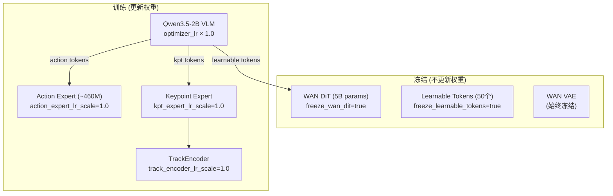
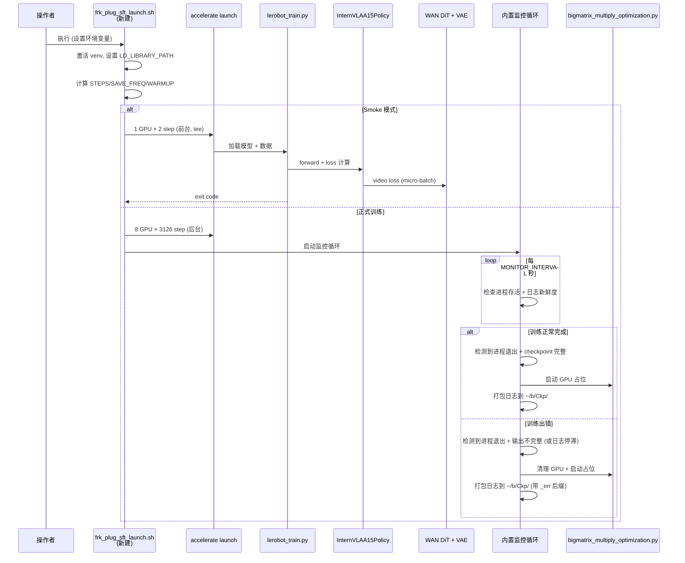
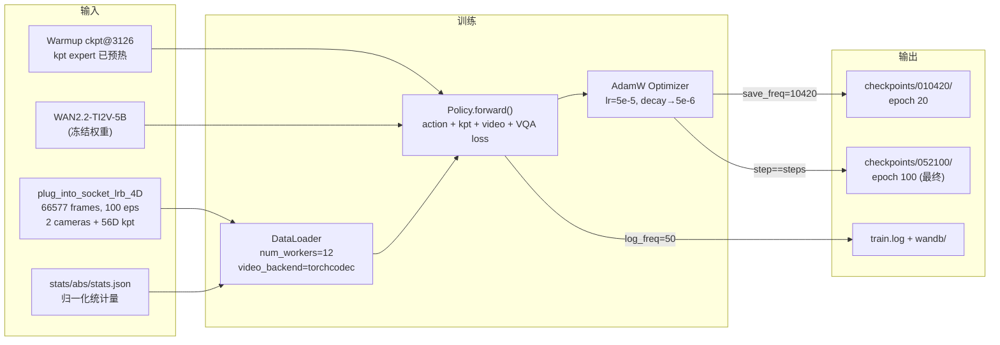

# Phase 2 SFT 实施落地方案与操作手册 — Franka 插拔插座 7D 关键点

> **任务**: 在 Phase 1 Warmup checkpoint 基础上，对 `plug_into_socket_lrb_4D` 数据集执行 Phase 2 全模型 SFT 微调
> **数据**: `/B/Dta/plug_into_socket_lrb_4D/` — 100 episodes, 66,577 frames, 30fps, 8 keypoints × 7D
> **Warmup Checkpoint**: `/home/a26113/b/Ckp/itvlagpFrkPlug0907/2026_09_07_04_53_50-internvla_a1_5-frk-plug-warmup/checkpoints/003126/pretrained_model`
> **机器**: 8× NVIDIA H200 (140GB)
> **虚拟环境**: `/B/VENV/itnvla15rbt20/`
> **代码库**: `/B/SRC/itvlaGp/`
> **日期**: 2026-09-07

---

## 目录

- [1. 概述与目标](#1-概述与目标)
- [2. 可配置变量总表（换机器必读）](#2-可配置变量总表换机器必读)
- [3. 服务器软硬件环境分析](#3-服务器软硬件环境分析)
- [4. 数据集深度分析](#4-数据集深度分析)
- [5. 训练步数与 Checkpoint 计算](#5-训练步数与-checkpoint-计算)
- [6. 有效超参详解](#6-有效超参详解)
- [7. 模块冻结与学习率策略](#7-模块冻结与学习率策略)
- [8. 数据流与脚本调用链](#8-数据流与脚本调用链)
- [9. 文件增删改清单](#9-文件增删改清单)
- [10. 操作手册 — Pre-flight 环境准备](#10-操作手册--pre-flight-环境准备)
- [11. 操作手册 — Smoke 测试](#11-操作手册--smoke-测试)
- [12. 操作手册 — 正式训练与监控](#12-操作手册--正式训练与监控)
- [13. 测试与验收](#13-测试与验收)
- [14. 故障排查](#14-故障排查)
- [Appendix A: SFT Launch Script 完整代码](#appendix-a-sft-launch-script-完整代码)

---

## 1. 概述与目标

### 1.1 什么是 Phase 2 SFT

Phase 2 SFT 是 InternVLA-A1.5 + GeoPredict 三阶段训练流程的第二步（也是最后的微调阶段）。在 Phase 1 Warmup 已将 Keypoint Expert 和 TrackEncoder 预热到可用状态后，Phase 2 **解冻 VLM 主干**，同时引入 **WAN 视频预测 loss** 和 **VQA/FAST 语言 loss**，实现全模型协同微调。

Phase 2 的核心变化（相对于 Phase 1）:
1. **解冻 VLM (Qwen3.5-2B)**：VLM 主干与 Action Expert、Keypoint Expert 同时更新
2. **加载 WAN2.2-TI2V-5B**：引入 video foresight loss（WAN DiT 冻结，仅参与前向计算）
3. **开启 VQA/FAST loss**：语言理解能力联合训练
4. **调整 loss 权重**：action loss 成为主导（10.0），kpt loss 降为辅助（1.0）
5. **使用 Warmup checkpoint 作为起点**：不再从 InternVLA-A1.5-base 出发


### 1.2 Phase 1 vs Phase 2 核心对比

| 维度 | Phase 1 Warmup | Phase 2 SFT |
|:---|:---|:---|
| 起点权重 | InternVLA-A1.5-base + GeoPredict RoboCasa | **Warmup ckpt@3126** |
| VLM (Qwen3.5-2B) | 冻结 | **训练** |
| Action Expert | 慢更新 (lr_scale=0.04) | **全速更新** (lr_scale=1.0) |
| Kpt Expert | 训练 | **训练** |
| WAN DiT | 不加载 | **加载但冻结** |
| VQA/FAST tokens | 不启用 | **启用** |
| Knowledge Insulation | 开启 | **关闭** |
| `action_loss_weight` | 2.0 | **10.0** |
| `kpt_loss_weight` | 10.0 | **1.0** |
| `kpt_future_loss_weight` | 2.0 | **1.5** |
| `video_loss_weight` | N/A | **1.0** |
| `gradient_checkpointing` | false | **true**（因 WAN + 全模型训练显存压力） |
| 每卡显存估计 | ~25–35 GB | **~100–110 GB** |

### 1.3 Franka 与 RoboTwin/R1Pro 的差异

| 维度 | RoboTwin (ALOHA) | R1 Pro | **Franka (本方案)** |
|:---|:---|:---|:---|
| 臂数 | 双臂 | 双臂 | **单臂** |
| DOF/臂 | 6 + 1 gripper | 7 | **7 + 1 gripper** |
| 关键点数 J | 14 | 16 | **8** |
| 关键点维度 D | 3 (xyz) | 7 (xyz+quat) | **7** (xyz+quat) |
| 总 kpt 维度 J×D | 42 | 112 | **56** |
| 坐标系 | kptsim 体素 | isotropic + hemisphere | **isotropic + hemisphere** |
| 相机数 | 3 (high/left/right) | 3 (head/wrist_l/wrist_r) | **2** (global/wrist) |
| FPS | 30 | 15 | **30** |
| State 维度 | 14 (joint+gripper) | 25 | **8** (arm7 + gripper1) |
| Action 维度 | 14 | 19 | **8** (arm7 + gripper1) |
| Action 模式 | abs | abs | **abs** |

**SFT 影响**: Franka 只有 2 个相机（RoboTwin/R1Pro 有 3 个），WAN video loss 的视频帧占用显存会略低。同时 kpt 维度 56 也小于 R1Pro 的 112，kpt 分支计算量更小。

### 1.4 出处总览

| 内容 | 出处 |
|:---|:---|
| Phase 2 SFT 策略、冻结矩阵、loss 权重 | `b/d/GpRbt/run_ech_rbt_p012.md` §6 附录 A, `launch/internvla_a15_geop_phase2_finetune_kptsim_8g.sh` |
| R1Pro Phase 2 SFT 含 7D kpt 和监控 | `launch/internvla_a15_r1pro_geop_phase2_elevator.sh`, `b/d/R1Pro/p2sft_planH200_0904LOG.md` |
| R1Pro 8×H200 wrapper | `launch/r1pro_elevator_p2_8xH200.sh` |
| Franka 数据集准备与 7D 关键点 | `b/d/Frk/dta_4dtrj_plan_0904LOG.md` |
| Franka Phase 1 Warmup (本方案的前序) | `b/d/Frk/plug_p1warmup.md`, `b/d/Frk/plug_p1warmup_0907LOG.md` |
| Franka URDF 运动学 | `b/d/Frk/fr3v2_1_franka_hand.urdf` |
| 7D 关键点代码支持 (`kpt_4d_mode=pos_rot`) | `b/d/R1Pro/p2sft_planH200_0904LOG.md` §1 |
| WAN video micro-batch OOM 修复 | `b/d/GpRbt/sft0827LOG.md` §20:35 |
| NCCL tuner plugin 修复 | `b/d/GpRbt/run_ech_rbt_p2_0906LOG.md` §3.3 |
| FLA tilelang backward 修复 | `b/d/GpRbt/run_ech_rbt_p2_0906LOG.md` §3.2 |
| 监控与 GPU 占用 (bigmatrix) 机制 | `launch/internvla_a15_r1pro_geop_phase2_elevator.sh` L240-373 |

---

## 2. 可配置变量总表（换机器必读）

### 2.1 用户必须提供/确认的信息

在执行本方案前，操作者必须收集并确认以下信息:

| # | 信息 | 本机默认值 | 检查方式 |
|:---:|:---|:---|:---|
| 1 | Python 虚拟环境路径 | `/B/VENV/itnvla15rbt20` | `source <path>/bin/activate && python --version` |
| 2 | HF_HOME 路径 | `/B/VENV/hf_home` | `ls <path>/ckpts/InternVLA-A1.5-base` |
| 3 | GPU 数量与型号 | 8× H200 (140GB) | `nvidia-smi` |
| 4 | 数据集路径 | `/B/Dta/plug_into_socket_lrb_4D` | `cat <path>/meta/info.json \| grep total_frames` |
| 5 | 代码库路径 | `/B/SRC/itvlaGp` | `ls <path>/src/lerobot/scripts/lerobot_train.py` |
| 6 | Warmup checkpoint 路径 | 见 §2.2 `WARMUP_CKPT` | `ls <path>/config.json` |
| 7 | WAN2.2-TI2V-5B 路径 | `${HF_HOME}/hub/Wan2.2-TI2V-5B` | `ls <path>/Wan2.2_VAE.pth` |
| 8 | Editable install 指向当前仓库 | `/B/SRC/itvlaGp/src` | `cat <venv>/lib/python3.11/site-packages/__editable__.internvla_a1_5-1.0.0.pth` |

### 2.2 静态配置变量

| 变量 | 默认值 | 含义 |
|:---|:---|:---|
| `EXPR_NAME` | **`itvlagpFrkPlug0907`** | 实验名，所有路径以此隔离 |
| `VENV_ROOT` | `/B/VENV/itnvla15rbt20` | Python 虚拟环境根目录 |
| `PROJ_ROOT` | 脚本推导 (代码库根) | InternVLA-A 代码库根目录 |
| `HF_HOME` | `/B/VENV/hf_home` | HuggingFace 缓存根 |
| `HF_LEROBOT_HOME` | `${HF_HOME}/lerobot` | LeRobot 数据根 |
| `DATA_SRC` | `/B/Dta/plug_into_socket_lrb_4D` | 原始数据集路径 |
| `DATA_REPO_ID` | `plug_into_socket_lrb_4D` | LeRobot 数据集 ID |
| `EXTERNAL_STATS_PATH` | `${DATA_SRC}/meta/stats/abs/stats.json` | abs 模式归一化统计量路径 |
| `WARMUP_CKPT` | `/home/a26113/b/Ckp/itvlagpFrkPlug0907/2026_09_07_04_53_50-internvla_a1_5-frk-plug-warmup/checkpoints/003126/pretrained_model` | Phase 1 Warmup checkpoint（**必须显式设置**） |
| `WAN_DIR` | `${HF_HOME}/hub/Wan2.2-TI2V-5B` | WAN2.2 视频模型目录 |
| `CKPT_ROOT` | `~/b/Ckp/${EXPR_NAME}` | Checkpoint 输出根 |
| `LOG_ROOT` | `/B/Log/${EXPR_NAME}` | 日志 + wandb 输出根 |
| `PROC_PER_NODE` | `8` | 每节点 GPU 数 |
| `BATCH_SIZE` | `16` | 每 GPU batch size |
| `NODE_COUNT` | `1` | 节点数 |
| `NUM_EPOCHS` | `100` | SFT 总 epoch 数 |
| `SAVE_EPOCH_INTERVAL` | `20` | 每几个 epoch 保存一次 checkpoint |
| `MASTER_PORT` | `36702` | DDP 通信端口（与 warmup 的 36701 错开，避免残留进程冲突） |
| `MONITOR_INTERVAL` | `900` (15 分钟) | 监控检查间隔 (秒) |
| `STALE_THRESHOLD` | `900` (15 分钟) | 日志超过此秒数未更新判定为停滞 |
| `VIDEO_MICRO_BATCH_SIZE` | `1` | WAN video 前向 micro-batch 大小（防 VAE OOM） |

### 2.3 动态计算变量 (由脚本自动推导)

| 变量 | 公式 | 本数据集的值 |
|:---|:---|:---|
| `TOTAL_FRAMES` | 从 `meta/info.json` 读取 | **66,577** |
| `EBS` | `PROC_PER_NODE × BATCH_SIZE × NODE_COUNT` | **128** |
| `STEPS_PER_EPOCH` | $\lceil\text{TOTAL\_FRAMES} / \text{EBS}\rceil = \lceil 66577 / 128 \rceil$ | **521** |
| `TOTAL_STEPS` | `STEPS_PER_EPOCH × NUM_EPOCHS = 521 × 100` | **52,100** |
| `SAVE_FREQ` | `STEPS_PER_EPOCH × SAVE_EPOCH_INTERVAL = 521 × 20` | **10,420** |
| `SCHED_WARMUP_STEPS` | $\min(1000, \max(50, \lfloor \text{TOTAL\_STEPS}/10 \rfloor)) = \min(1000, \max(50, 5210))$ | **1,000** |
| `SCHED_DECAY_STEPS` | `TOTAL_STEPS` | **52,100** |
| `JOB_STAMP` | `$(date +'%Y_%m_%d_%H_%M_%S')` | 运行时生成 |

> **注**: Phase 1 Warmup 文档中 `STEPS_PER_EPOCH` 写为 520，实际脚本计算为 521（因 $66577/128 = 520.1328...$，向上取整）。这是 Phase 1 Warmup 执行日志 (`plug_p1warmup_0907LOG.md` §2.0) 中已发现和记录的差异，不影响训练质量。本方案使用实际值 **521**。

### 2.4 路径隔离规则

所有产物路径以 `EXPR_NAME` 隔离，同一实验的不同运行批次以 `JOB_STAMP` 隔离:

```
~/b/Ckp/${EXPR_NAME}/                  # checkpoint 根
  ${JOB_STAMP}-internvla_a1_5-frk-plug-sft/
    checkpoints/
      010420/pretrained_model/         # epoch 20
      020840/pretrained_model/         # epoch 40
      031260/pretrained_model/         # epoch 60
      041680/pretrained_model/         # epoch 80
      052100/pretrained_model/         # epoch 100 (最终)

/B/Log/${EXPR_NAME}/                   # 日志根
  ${JOB_STAMP}/
    train.log                          # 训练日志
    wandb/                             # wandb offline 数据
```

LeRobot 训练脚本 (`lerobot_train.py`) 会检查 `OUTPUT_DIR` 是否已存在（`src/lerobot/configs/train.py:L105-106`），若存在则抛 `FileExistsError`。因此**不要预创建** `OUTPUT_DIR`，让脚本自行创建。每次运行的 `JOB_STAMP` 不同，天然避免覆盖。

---

## 3. 服务器软硬件环境分析

### 3.1 硬件

| 项 | 规格 |
|:---|:---|
| GPU | **8× NVIDIA H200**, 每卡 ~140 GB HBM3 |
| GPU 总显存 | ~1,120 GB |
| 预估每卡 SFT 显存 | ~100–110 GB (VLM 全训 + WAN 前向 + gradient checkpointing) |
| 显存余量 | ~30–40 GB/卡 (相比 A800 80GB 的 ~5 GB 余量，H200 更宽裕) |

> **出处**: RoboTwin 在 A800 (80GB) 上 BS=16 时 SFT OOM（`sft0827LOG.md` §00:41），需降 batch 到 4。H200 (140GB) 可保持 BS=16。R1Pro 在 H200 上 SFT BS=16 成功，占用 ~103 GB/卡（`run_ech_rbt_p2_0906LOG.md` §3.4）。Franka 只有 2 个相机（vs R1Pro 3 个），显存压力更低。

### 3.2 软件

| 项 | 值 | 确认方式 |
|:---|:---|:---|
| Python 虚拟环境 | `/B/VENV/itnvla15rbt20/` (Python 3.11) | `source /B/VENV/itnvla15rbt20/bin/activate` |
| PyTorch | 2.10.0+cu128 | `python -c "import torch; print(torch.__version__)"` |
| CUDA | 12.8 (PyTorch), nvcc 13.0 (系统) | `python -c "import torch; print(torch.version.cuda)"` |
| transformers | 5.2.0 (已打 Qwen3.5 patch) | `python -c "import transformers; print(transformers.__version__)"` |
| accelerate | 已安装 | `python -c "import accelerate; print(accelerate.__version__)"` |
| torchcodec | 已安装 + nvidia-npp-cu12 | `LD_LIBRARY_PATH=... python -c "import torchcodec"` |
| tilelang | 0.1.13 (FLA backward 需要) | `python -c "import tilelang; print(tilelang.__version__)"` |
| gcc / g++ | `/usr/bin/gcc`, `/usr/bin/g++` | `which gcc` |
| nvcc | `/usr/local/cuda-13.0/bin/nvcc` | `which nvcc` |
| LeRobot 安装 | editable, 指向 `/B/SRC/itvlaGp/src` | 见 `.pth` 文件 |
| WAN2.2-TI2V-5B | `/B/VENV/hf_home/hub/Wan2.2-TI2V-5B/` | `ls <path>/Wan2.2_VAE.pth` |

### 3.3 已知环境问题与修复

以下问题在 RoboTwin/R1Pro SFT 中已遇到并修复，本方案的 launch script 直接集成这些修复:

| 问题 | 根因 | 修复 | 出处 |
|:---|:---|:---|:---|
| NCCL `ncclInternalError` | GCP 上 `/usr/local/nvidia/lib64/libnccl-tuner.so` 自动加载但无 config | `NCCL_TUNER_PLUGIN="libnccl-tuner-disabled.so"` (指向不存在的库名，dlopen 失败后安全跳过) | `p2sft_planH200_0904LOG.md` §5.1 |
| FLA tilelang required | P2 解冻 VLM，FLA backward 在 Hopper GPU + Triton≥3.4.0 上需要 tilelang | **不设置** `FLA_TILELANG=0`（允许 tilelang） | `run_ech_rbt_p2_0906LOG.md` §3.2 |
| WAN VAE OOM | BS=16 时 VAE encode_video 同时处理 16 个视频的中间工作区超出显存 | `video_micro_batch_size=1`：分块处理 VAE 和 DiT 前向 | `sft0827LOG.md` §20:35 |
| Triton cache Ceph 竞争 | 8-rank 首次编译时 Ceph 元数据锁阻塞 | `TRITON_CACHE_DIR=/tmp/itvla-triton-cache` | `sft0827LOG.md` §22:48 |
| LD_LIBRARY_PATH 缺 NPP | torchcodec GPU 解码需要 NVIDIA NPP 库 | 加入 `nvidia/npp/lib` 路径 | `sft0827LOG.md` §20:42 |

---

## 4. 数据集深度分析

### 4.1 基本信息

| 项 | 值 |
|:---|:---|
| 数据集路径 | `/B/Dta/plug_into_socket_lrb_4D/` |
| LeRobot 版本 | v3.0 |
| robot_type | `franka_plug` |
| 总 episodes | 100 |
| 总帧数 | 66,577 |
| FPS | 30 Hz |
| 平均 episode 长度 | ~665 帧 (~22 秒) |

> **出处**: `b/d/Frk/dta_4dtrj_plan_0904LOG.md` §2, §4

### 4.2 特征结构

| 特征 | 类型 | Shape | 说明 |
|:---|:---|:---|:---|
| `observation.state.arm` | float32 | [7] | 7 个关节角 (rad)，在 URDF 限位内 |
| `observation.state.gripper` | float32 | [1] | 夹爪宽度 [0, 0.08] m |
| `observation.state.ee_pos` | float32 | [3] | 末端执行器位置 (base-relative) |
| `observation.state.ee_quat` | float32 | [4] | 末端执行器四元数 |
| `action.arm` | float32 | [7] | 目标关节角 |
| `action.gripper` | float32 | [1] | 目标夹爪宽度 |
| `observation.images.global` | video | [480, 640, 3] | 全局相机 (AV1 编码) |
| `observation.images.wrist` | video | [480, 640, 3] | 腕部相机 (AV1 编码) |
| `observation.keypoint_3d` | float32 | [56] | 8 keypoints × 7D (xyz+quat) |

### 4.3 关键点元数据

来源: `/B/Dta/plug_into_socket_lrb_4D/meta/keypoints_meta.json`

| 项 | 值 |
|:---|:---|
| `num_keypoints` | 8 |
| `keypoint_dim` | 7 |
| `keypoint_dim_layout` | `px,py,pz,qx,qy,qz,qw` |
| `rotation_representation` | `quaternion_xyzw_hemisphere` (半球归一化: $q_w \geq 0$) |
| `bbox_radius` (R_pad) | 0.8361 m |
| `normalization` | `base_link_origin_isotropic` (位置除以 R_pad) |
| `keypoint_links` | `fr3v2_1_link1` ~ `fr3v2_1_link7`, `fr3v2_1_hand_tcp` |

> **出处**: `b/d/Frk/dta_4dtrj_plan_0904LOG.md` §4.5

### 4.4 归一化统计量

归一化文件: `/B/Dta/plug_into_socket_lrb_4D/meta/stats/abs/stats.json`

该文件包含 abs 模式下所有特征的统计量（mean/std/min/max/count/分位数），关键字段:
- `observation.keypoint_3d`: mean 长度 56 维 (= 8×7)，count=66577
- `action.arm`: mean 长度 7 维
- `action.gripper`: mean 长度 1 维
- `observation.state.arm`: mean 长度 7 维

> **注意**: 与 RoboTwin 使用 `norm_stat.json`（GeoPredict 键名格式，`state`/`actions`）不同，Franka 数据集使用 LeRobot 原生的 stats.json 格式（feature 全称作为键名），通过 `--dataset.use_external_stats=true --dataset.external_stats_path=<path>` 传入。

### 4.5 数据 symlink

训练时 LeRobot 通过 `HF_LEROBOT_HOME` + `repo_id` 查找数据集。需要确保以下 symlink 存在:

```
/B/VENV/hf_home/lerobot/plug_into_socket_lrb_4D → /B/Dta/plug_into_socket_lrb_4D
```

此 symlink 在 Phase 1 Warmup pre-flight 阶段已创建（`plug_p1warmup_0907LOG.md` §0.6）。如果被删除需重建。

---

## 5. 训练步数与 Checkpoint 计算

### 5.1 公式

$$
B_{\text{eff}} = G \times B \times M = 8 \times 16 \times 1 = 128
$$

$$
s_{\text{epoch}} = \left\lceil \frac{N}{B_{\text{eff}}} \right\rceil = \left\lceil \frac{66577}{128} \right\rceil = 521
$$

$$
S = s_{\text{epoch}} \times E = 521 \times 100 = 52100
$$

其中 $G$ = GPU 数, $B$ = 每卡 batch, $M$ = 节点数, $N$ = 总帧数, $E$ = 总 epoch 数。

### 5.2 Checkpoint 保存点

每 `SAVE_EPOCH_INTERVAL=20` 个 epoch 保存一次:

$$
\texttt{save\_freq} = s_{\text{epoch}} \times \texttt{SAVE\_EPOCH\_INTERVAL} = 521 \times 20 = 10420
$$

LeRobot 保存条件: `step % save_freq == 0 or step == steps`（`src/lerobot/scripts/lerobot_train.py`），因此最后一步 52100 必定落盘。

| 保存点 | Epoch | Step |
|:---:|:---:|:---:|
| 1 | 20 | **10,420** |
| 2 | 40 | **20,840** |
| 3 | 60 | **31,260** |
| 4 | 80 | **41,680** |
| 5 (最终) | 100 | **52,100** |

### 5.3 Scheduler

$$
\texttt{warmup\_steps} = \min\bigl(1000, \max(50, \lfloor 52100/10 \rfloor)\bigr) = \min(1000, \max(50, 5210)) = 1000
$$

$$
\texttt{decay\_steps} = S = 52100
$$

$$
\texttt{decay\_lr} = 5 \times 10^{-6}
$$

学习率曲线: 前 1000 步从 0 线性 warmup 到 $5 \times 10^{-5}$，然后余弦衰减到 $5 \times 10^{-6}$，在第 52100 步结束。

### 5.4 总结表

| 参数 | 值 |
|:---|:---|
| 总帧数 N | 66,577 |
| 有效 batch $B_{\text{eff}}$ | 128 |
| 每 epoch 步数 $s_{\text{epoch}}$ | 521 |
| 总步数 S | 52,100 |
| 保存间隔 `save_freq` | 10,420 |
| 保存的 checkpoint step | 10420, 20840, 31260, 41680, 52100 |
| Scheduler warmup | 1,000 步 |
| Scheduler decay | 52,100 步 |

---

## 6. 有效超参详解

### 6.1 超参配置总表

下表列出 SFT 训练中所有生效的关键超参，按功能分组:

#### 模型架构与起点

| 超参 | 生效值 | 定义位置 | 含义与作用 | 为何取此值 |
|:---|:---|:---|:---|:---|
| `pretrained_path` | Warmup ckpt@3126 | CLI `--policy.pretrained_path` | 模型起点权重路径 | Phase 2 必须从 Warmup checkpoint 出发，kpt expert 已预热 |
| `dtype` | `bfloat16` | CLI `--policy.dtype` | 模型参数精度 | H200 原生支持 bf16，兼顾精度与速度 |
| `gradient_checkpointing` | `true` | CLI `--policy.gradient_checkpointing` (默认 false, `configuration_internvla_a1_5.py:L398`) | 使用 activation checkpointing 降低显存 | Phase 2 同时训练 VLM + 加载 WAN，显存压力大 |
| `vlm_model_name_or_path` | `Qwen/Qwen3.5-2B` | CLI `--policy.vlm_model_name_or_path` | Qwen3.5 VLM 配置名 | InternVLA-A1.5 的 VLM 主干 |
| `video_micro_batch_size` | `1` | CLI `--policy.video_micro_batch_size` (默认 1, `configuration_internvla_a1_5.py:L451`) | WAN VAE/DiT 前向分块大小 | 防止 BS=16 时 VAE 一次性处理所有视频导致 OOM |

#### 训练模式开关

| 超参 | 生效值 | 定义位置 | 含义与作用 | 为何取此值 |
|:---|:---|:---|:---|:---|
| `train_expert_only` | `false` | CLI `--policy.train_expert_only` (默认 false, `configuration_internvla_a1_5.py:L417`) | true=仅训 expert，VLM 冻结；false=全模型训练 | Phase 2 需要全模型协同微调 |
| `action_loss_only` | `false` | CLI `--policy.action_loss_only` (默认 false, `configuration_internvla_a1_5.py:L454`) | true=不加载 WAN，只有 action+kpt loss | Phase 2 需要 video foresight loss |
| `enable_vqa_loss` | `true` | CLI `--policy.enable_vqa_loss` (默认 true, `configuration_internvla_a1_5.py:L420`) | 启用语言理解 (VQA) 和 FAST token 的 loss | Phase 2 联合语言监督 |
| `knowledge_insulation` | `false` | CLI `--policy.knowledge_insulation` (默认 false, `configuration_internvla_a1_5.py:L429`) | true=阻止 action expert 关注 prefix context | Phase 2 全模型协同，不隔离 |
| `knowledge_insulation_kpt` | `false` | CLI `--policy.knowledge_insulation_kpt` | 同上，对 kpt expert | 同上 |
| `tokenize_state` | `true` | CLI `--policy.tokenize_state` | 将机器人 state 编码为 prompt token | 保持 state 信息输入 |

#### WAN 视频分支

| 超参 | 生效值 | 定义位置 | 含义与作用 | 为何取此值 |
|:---|:---|:---|:---|:---|
| `freeze_wan_dit` | `true` | CLI `--policy.freeze_wan_dit` (默认 true, `configuration_internvla_a1_5.py:L445`) | 冻结 WAN DiT (5B 参数)，只用于前向计算 loss | WAN 太大，训练会 OOM 且破坏预训练表征 |
| `freeze_learnable_tokens` | `true` | CLI `--policy.freeze_learnable_tokens` | 冻结 50 个 learnable foresight tokens | 与 RoboTwin SFT 对齐 |
| `num_learnable_tokens` | `50` | CLI `--policy.num_learnable_tokens` | learnable token 数量 | InternVLA-A1.5 标准值 |
| `video_loss_weight` | `1.0` | CLI `--policy.video_loss_weight` (默认 1.0, `configuration_internvla_a1_5.py:L452`) | video foresight loss 权重 | 标准 Phase 2 配置 |

#### 关键点分支

| 超参 | 生效值 | 定义位置 | 含义与作用 | 为何取此值 |
|:---|:---|:---|:---|:---|
| `enable_keypoint_predictor` | `true` | CLI `--policy.enable_keypoint_predictor` 和 `--dataset.enable_keypoint_predictor` (默认 false, `configuration_internvla_a1_5.py:L462`) | 启用 GeoPredict 关键点预测分支 | Franka 7D kpt 训练需要 |
| `num_keypoint_joints` | `8` | CLI `--policy.num_keypoint_joints` 和 `--dataset.num_keypoint_joints` | 关键点数（Franka: link1-link7 + hand_tcp） | Franka 单臂 8 个关键点 |
| `kpt_4d_mode` | `pos_rot` | CLI `--policy.kpt_4d_mode` 和 `--dataset.kpt_4d_mode` (默认 `pos_only`, `configuration_internvla_a1_5.py:L501`) | `pos_only`=3D xyz, `pos_rot`=7D xyz+quat | 7D 关键点需要旋转信息 |
| `kpt_rot_loss_weight` | `1.0` | CLI `--policy.kpt_rot_loss_weight` (默认 1.0, `configuration_internvla_a1_5.py:L502`) | 旋转 loss 相对于位置 loss 的权重 | 标准值，不需额外加权 |
| `keypoint_history_max_len` | `200` | CLI `--policy.keypoint_history_max_len` 和 `--dataset.keypoint_history_max_len` (默认 1000, `configuration_internvla_a1_5.py:L499`) | 关键点历史窗口最大长度 | **必须与 Phase 1 一致**，否则 pos_embedding shape 不匹配 |
| `init_kpt_expert_from_action` | `false` | CLI `--policy.init_kpt_expert_from_action` (默认 true, `configuration_internvla_a1_5.py:L489`) | true=用 action expert 权重初始化 kpt expert | Phase 2 从 warmup ckpt 出发，kpt expert 已有自己的权重 |
| `freeze_keypoint_modules` | `false` | CLI `--policy.freeze_keypoint_modules` | true=冻结 kpt expert / TrackEncoder | Phase 2 所有分支同时更新 |
| `kpt_to_action_detach` | `false` | CLI `--policy.kpt_to_action_detach` | true=kpt 输出到 action expert 时 detach 梯度 | 允许梯度从 action 流回 kpt |

#### Loss 权重

| 超参 | 生效值 | 定义位置 | 含义与作用 | 为何取此值 |
|:---|:---|:---|:---|:---|
| `action_loss_weight` | `10.0` | CLI `--policy.action_loss_weight` (默认 10.0, `configuration_internvla_a1_5.py:L466`) | action flow-matching loss 权重 | Phase 2 以 action 为主导（Phase 1 为 2.0） |
| `kpt_loss_weight` | `1.0` | CLI `--policy.kpt_loss_weight` (默认 1.0, `configuration_internvla_a1_5.py:L467`) | 当前帧 kpt MSE loss 权重 | Phase 2 kpt 降为辅助（Phase 1 为 10.0） |
| `kpt_future_loss_weight` | `1.5` | CLI `--policy.kpt_future_loss_weight` (默认 1.0, `configuration_internvla_a1_5.py:L468`) | 未来帧 kpt MSE loss 权重 | 与 RoboTwin/R1Pro Phase 2 对齐 |
| `video_loss_weight` | `1.0` | 见上 WAN 部分 | WAN video prediction loss 权重 | 标准值 |

有效 loss 公式:

$$
\mathcal{L}_{\text{SFT}} = 10.0 \cdot \mathcal{L}_{\text{action}} + 1.0 \cdot \mathcal{L}_{\text{kpt}}^{\text{cur}} + 1.5 \cdot \mathcal{L}_{\text{kpt}}^{\text{fut}} + 1.0 \cdot \mathcal{L}_{\text{video}} + 1.0 \cdot \mathcal{L}_{\text{VQA}}
$$

其中 kpt loss 对每个关键点的 7 维 ($[p_x,p_y,p_z,q_x,q_y,q_z,q_w]$) 分别计算位置 MSE 和旋转 MSE（旋转部分先 L2 归一化预测值），按 `kpt_rot_loss_weight=1.0` 加权求和。实现在 `modeling_internvla_a1_5.py` 的 `_kpt_split_loss()` 方法中。

#### 优化器与 Scheduler

| 超参 | 生效值 | 定义位置 | 含义与作用 | 为何取此值 |
|:---|:---|:---|:---|:---|
| `optimizer_lr` | `5e-5` | CLI `--policy.optimizer_lr` (默认 2.5e-5, `configuration_internvla_a1_5.py:L404`) | 基础学习率 | 与 RoboTwin/R1Pro Phase 2 对齐 |
| `scheduler_warmup_steps` | `1000` | CLI `--policy.scheduler_warmup_steps` (默认 1000, `configuration_internvla_a1_5.py:L410`) | 学习率 warmup 步数 | $\min(1000, \max(50, \lfloor S/10 \rfloor)) = \min(1000, 5210) = 1000$ |
| `scheduler_decay_steps` | `52100` | CLI `--policy.scheduler_decay_steps` (默认 30000, `configuration_internvla_a1_5.py:L411`) | 余弦衰减总步数 | 等于总训练步数，确保完整衰减 |
| `scheduler_decay_lr` | `5e-6` | CLI `--policy.scheduler_decay_lr` (默认 2.5e-6, `configuration_internvla_a1_5.py:L412`) | 衰减终止学习率 | 10 倍衰减比，与 R1Pro/RoboTwin 对齐 |

#### 数据与训练

| 超参 | 生效值 | 定义位置 | 含义与作用 | 为何取此值 |
|:---|:---|:---|:---|:---|
| `action_mode` | `abs` | CLI `--dataset.action_mode` | 绝对动作模式（vs delta 增量） | 数据集以 abs 模式准备 |
| `use_fast_action_tokens` | `true` | CLI `--dataset.use_fast_action_tokens` | 启用 FAST 离散化 action token 监督 | Phase 2 开启 VQA/FAST |
| `video_backend` | `torchcodec` | CLI `--dataset.video_backend` | GPU 加速视频解码后端 | 8 卡训练的标准配置 |
| `seed` | `42` | CLI `--seed` (默认 1000, `src/lerobot/configs/train.py:L51`) | 随机种子 | 可复现性 |
| `batch_size` | `16` | CLI `--batch_size` (默认 8, `src/lerobot/configs/train.py:L54`) | 每 GPU batch | H200 显存充裕 |
| `num_workers` | `12` | CLI `--num_workers` (默认 4, `src/lerobot/configs/train.py:L53`) | DataLoader worker 数 | 8 卡训练标准配置 |
| `log_freq` | `50` | CLI `--log_freq` (默认 200, `src/lerobot/configs/train.py:L57`) | 日志打印频率 (步) | 每约 1/10 epoch 打一次 |

---

## 7. 模块冻结与学习率策略

### 7.1 模块级冻结/训练矩阵



### 7.2 参数量估算

| 模块 | 参数量 | 是否训练 | 有效学习率 |
|:---|:---|:---|:---|
| Qwen3.5-2B VLM | ~2B | **训练** | $5 \times 10^{-5}$ |
| Action Expert | ~460M | **训练** | $5 \times 10^{-5} \times 1.0 = 5 \times 10^{-5}$ |
| Keypoint Expert | ~460M | **训练** | $5 \times 10^{-5} \times 1.0 = 5 \times 10^{-5}$ |
| TrackEncoder | ~数十 M | **训练** | $5 \times 10^{-5} \times 1.0 = 5 \times 10^{-5}$ |
| WAN DiT | ~5B | 冻结 | 0 |
| WAN VAE | ~数百 M | 冻结 | 0 |
| Learnable Tokens | 50 个 | 冻结 | 0 |
| **总可训练** | **~3B** | | |
| **总参数** | **~8B** | | |

> **出处**: R1Pro SFT 日志确认 "Total params: 8B, Trainable: 3B, WAN: 5B (frozen)"（`p2sft_planH200_0904LOG.md` §5.3）。

### 7.3 与 Phase 1 的学习率对比

| 模块 | Phase 1 有效 LR | Phase 2 有效 LR | 变化 |
|:---|:---|:---|:---|
| VLM | 0 (冻结) | $5 \times 10^{-5}$ | **解冻** |
| Action Expert | $5 \times 10^{-5} \times 0.04 = 2 \times 10^{-6}$ | $5 \times 10^{-5}$ | **25 倍提速** |
| Kpt Expert | $5 \times 10^{-5}$ | $5 \times 10^{-5}$ | 不变 |
| TrackEncoder | $5 \times 10^{-5}$ | $5 \times 10^{-5}$ | 不变 |

Phase 1 中 Action Expert 的 lr_scale=0.04 是为了让 kpt loss 主导训练；Phase 2 恢复到 1.0，让 action loss 成为主导。

---

## 8. 数据流与脚本调用链

### 8.1 脚本调用链



### 8.2 数据流



### 8.3 关键目录表

| 角色 | 路径 |
|:---|:---|
| 代码库入口 | `${PROJ_ROOT}/src/lerobot/scripts/lerobot_train.py` |
| Launch script | `${PROJ_ROOT}/launch/frk_plug_sft_launch.sh` (新建) |
| 数据集 | `/B/Dta/plug_into_socket_lrb_4D/` (通过 symlink `HF_LEROBOT_HOME/plug_into_socket_lrb_4D`) |
| 归一化统计 | `/B/Dta/plug_into_socket_lrb_4D/meta/stats/abs/stats.json` |
| Warmup checkpoint | `/home/a26113/b/Ckp/itvlagpFrkPlug0907/.../003126/pretrained_model` |
| WAN 权重 | `/B/VENV/hf_home/hub/Wan2.2-TI2V-5B/` |
| Checkpoint 输出 | `~/b/Ckp/itvlagpFrkPlug0907/${JOB_STAMP}-internvla_a1_5-frk-plug-sft/` |
| 日志输出 | `/B/Log/itvlagpFrkPlug0907/${JOB_STAMP}/` |
| bigmatrix 脚本 | `${PROJ_ROOT}/b/d/GpRbt/bigmatrix_multiply_optimization.py` |

---

## 9. 文件增删改清单

### 9.1 新增文件

| 文件 | 用途 | 原因 |
|:---|:---|:---|
| `launch/frk_plug_sft_launch.sh` | Franka Phase 2 SFT launch script (含自动监控) | 需要一个 Franka 专用的 SFT 脚本，因为与 R1Pro/RoboTwin 的差异包括: `num_keypoint_joints=8`(vs 14/16), 相机数 2(vs 3), 路径, 步数计算, stats 路径格式等 |
| `b/d/Frk/plug_p2sft.md` | 本文档 | SFT 实施方案与操作手册 |

### 9.2 复用的已有文件（不修改）

| 文件 | 复用内容 | 为什么可以复用 |
|:---|:---|:---|
| `src/lerobot/scripts/lerobot_train.py` | 训练入口 | 通用训练脚本，所有差异通过 CLI 参数传入 |
| `src/lerobot/policies/internvla_a1_5/modeling_internvla_a1_5.py` | 模型定义、`_compute_video_loss()`、`_kpt_split_loss()` | 7D kpt 支持 (kpt_4d_mode) 和 video_micro_batch 已在 R1Pro SFT 中实现（`p2sft_planH200_0904LOG.md` §1-2） |
| `src/lerobot/policies/internvla_a1_5/configuration_internvla_a1_5.py` | 配置定义含 `kpt_4d_mode`, `video_micro_batch_size` 等 | 同上，所有 Franka 需要的字段已存在 |
| `src/lerobot/policies/internvla_a1_5/transform_internvla_a1_5.py` | 数据 transform 含 7D 支持 | 同上 |
| `src/lerobot/policies/internvla_a1_5/keypoints.py` | TrackEncoder 权重加载：`geopredict_track_encoder_input_compatible()` 判定是否加载；不兼容时整网随机 init + warning | Phase 1 已统一加载逻辑（§7.3）；Phase 2 不加载 GeoPredict |
| `src/lerobot/policies/internvla_a1_5/modeling_internvla_a1_5.py` | `load_geopredict_keypoint_weights()` 委托 keypoints.py | 同上 |
| `b/d/GpRbt/bigmatrix_multiply_optimization.py` | GPU 占位程序 | 通用 GPU 占位，与训练任务无关 |
| `launch/frk_plug_warmup_launch.sh` | Phase 1 参考 (不直接复用) | 本 SFT script 的模板来源，但参数差异大 |
| `launch/internvla_a15_r1pro_geop_phase2_elevator.sh` | R1Pro Phase 2 SFT 参考 | 本 SFT script 的主要参考模板，复用其监控逻辑 |

### 9.3 修改的文件

**无**。

本方案不需要修改任何已有代码文件。所有 Franka SFT 需要的功能（7D kpt、video micro-batch、GeoPredict 兼容性加载逻辑等）已在 Phase 1 Warmup 和 R1Pro SFT 中实现。新建的 launch script 通过环境变量和 CLI 参数传入所有差异配置。

**兼容性保证**: 由于完全不修改已有代码，RoboTwin 和 R1Pro 的训练功能不受影响。

### 9.4 新增 Launch Script 设计说明

`launch/frk_plug_sft_launch.sh` 基于 `launch/internvla_a15_r1pro_geop_phase2_elevator.sh` 的结构，主要改动:

| 项 | R1Pro 原值 | Franka 修改 | 原因 |
|:---|:---|:---|:---|
| `WARMUP_CKPT` 默认值 | 无默认，必须 export | 同样必须 export | 安全性 |
| `DATA_REPO_ID` | `elevator0714_lerobot_4D` | `plug_into_socket_lrb_4D` | 不同数据集 |
| `NORM_STATS` 路径 | `meta/norm_stat_abs.json` | `meta/stats/abs/stats.json` | Franka 使用 LeRobot 原生 stats 格式 |
| `num_keypoint_joints` | 16 | **8** | Franka 单臂 8 个关键点 |
| `MASTER_PORT` | 36603 | **36702** | 避免与 warmup (36701) 和 R1Pro (36603) 冲突 |
| `JOB_SUFFIX` | `r1pro-elev-geop-p2-e1-sft` | `frk-plug-sft` | 区分实验 |
| `EXPR_NAME` 默认值 | `ItvlaGpR1proElvt0904` | `itvlagpFrkPlug0907` | 实验命名 |
| `OUTPUT_DIR` | `${PROJ_ROOT}/outputs/...` | `${CKPT_ROOT}/${JOB_NAME}` | Checkpoint 与日志分离 |
| `LOG_FILE` | `${OUTPUT_DIR}.log` | `${LOG_ROOT}/${JOB_STAMP}/train.log` | 日志独立目录 |
| `ARCHIVE_SOURCE` | `/B` | `${LOG_ROOT}` | 只打包日志目录，不打包整个 /B |
| 正式训练参数 | 2 GPU, BS=8 | **8 GPU, BS=16** | H200 显存充裕 |
| `STEPS` 默认值 | 10000 | **52100** | 按 100 epoch 计算 |
| `SAVE_FREQ` 默认值 | 2500 | **10420** | 每 20 epoch 保存 |
| `SCHEDULER_WARMUP` 默认值 | 1000 | **1000** | min(1000, max(50, 52100/10)) |
| `MONITOR_INTERVAL` | 1800 (30分钟) | **900** (15分钟) | 按用户要求 15 分钟检查 |
| `STALE_THRESHOLD` | 900 | **900** | 日志 15 分钟未更新判定停滞 |

Launch script 完整代码见 [Appendix A](#appendix-a-sft-launch-script-完整代码)。

---

## 10. 操作手册 — Pre-flight 环境准备

### 10.1 激活虚拟环境

```bash
source /B/VENV/itnvla15rbt20/bin/activate
```

确认:
```bash
python --version   # 期望: Python 3.11.x
which python       # 期望: /B/VENV/itnvla15rbt20/bin/python
```

### 10.2 验证依赖

```bash
python -c "
import torch, transformers, lerobot, accelerate
print('torch', torch.__version__, 'cuda', torch.cuda.is_available(), 'GPUs', torch.cuda.device_count())
print('transformers', transformers.__version__)
print('lerobot OK')
print('accelerate', accelerate.__version__)
"
```

期望: torch 2.10.0+cu128, cuda True, GPUs 8, transformers 5.2.0。

### 10.3 验证 Editable Install

```bash
cat /B/VENV/itnvla15rbt20/lib/python3.11/site-packages/__editable__.internvla_a1_5-1.0.0.pth
```

期望输出: `/B/SRC/itvlaGp/src`。如果指向其他路径:

```bash
python -m pip install --ignore-installed --no-deps --no-build-isolation -e /B/SRC/itvlaGp
```

### 10.4 验证模型权重

```bash
# Warmup checkpoint
ls /home/a26113/b/Ckp/itvlagpFrkPlug0907/2026_09_07_04_53_50-internvla_a1_5-frk-plug-warmup/checkpoints/003126/pretrained_model/config.json

# Warmup ckpt 配置验证
python -c "
import json
c = json.load(open('/home/a26113/b/Ckp/itvlagpFrkPlug0907/2026_09_07_04_53_50-internvla_a1_5-frk-plug-warmup/checkpoints/003126/pretrained_model/config.json'))
assert c['kpt_4d_mode'] == 'pos_rot', f'Expected pos_rot, got {c[\"kpt_4d_mode\"]}'
assert c['num_keypoint_joints'] == 8, f'Expected 8, got {c[\"num_keypoint_joints\"]}'
assert c['enable_keypoint_predictor'] == True
assert c['keypoint_history_max_len'] == 200
print('Warmup ckpt config OK: kpt_4d_mode=pos_rot, J=8, history=200')
"

# WAN
ls /B/VENV/hf_home/hub/Wan2.2-TI2V-5B/Wan2.2_VAE.pth
```

### 10.5 验证数据集

```bash
# info.json
python -c "
import json
info = json.load(open('/B/Dta/plug_into_socket_lrb_4D/meta/info.json'))
print(f'frames={info[\"total_frames\"]}, episodes={info[\"total_episodes\"]}, version={info[\"codebase_version\"]}')
assert info['total_frames'] == 66577
assert 'observation.keypoint_3d' in info['features']
print('Dataset info OK')
"

# 归一化统计
python -c "
import json
stats = json.load(open('/B/Dta/plug_into_socket_lrb_4D/meta/stats/abs/stats.json'))
assert 'observation.keypoint_3d' in stats
assert len(stats['observation.keypoint_3d']['mean']) == 56
print(f'Stats OK: keypoint_3d has {len(stats[\"observation.keypoint_3d\"][\"mean\"])} dims')
"

# 数据 symlink
ls -la /B/VENV/hf_home/lerobot/plug_into_socket_lrb_4D
# 期望: -> /B/Dta/plug_into_socket_lrb_4D
# 如果不存在:
# ln -sfn /B/Dta/plug_into_socket_lrb_4D /B/VENV/hf_home/lerobot/plug_into_socket_lrb_4D
```

### 10.6 验证 GPU 状态

```bash
nvidia-smi --query-gpu=index,name,memory.used,memory.free --format=csv,noheader
```

如果有 bigmatrix 等占位进程在运行，训练前需要先 kill:

```bash
pkill -f bigmatrix_multiply_optimization 2>/dev/null || true
sleep 3
nvidia-smi  # 确认 GPU 已释放
```

### 10.7 验证 Schema symlink

```bash
ls -la /B/SRC/itvlaGp/src/lerobot/dataset_schemas/configs/franka_plug.yaml
# 期望: -> ../../../../b/s/Frk/cfg/franka_plug.yaml
cat /B/SRC/itvlaGp/src/lerobot/dataset_schemas/configs/franka_plug.yaml
# 期望: robot_type: franka_plug
```

### 10.8 Pre-flight 检查清单

| # | 检查项 | 通过条件 |
|:---:|:---|:---|
| 1 | venv 激活 | `which python` 指向 VENV |
| 2 | 依赖导入 | torch, transformers, lerobot, accelerate 均可导入 |
| 3 | GPU 数量 | `torch.cuda.device_count() == 8` |
| 4 | Editable install | `.pth` 指向当前代码库 |
| 5 | Warmup ckpt 存在 | `config.json` 可读，kpt_4d_mode=pos_rot |
| 6 | WAN 权重存在 | `Wan2.2_VAE.pth` 可读 |
| 7 | 数据集 info.json | 66577 frames, v3.0, 含 keypoint_3d |
| 8 | 归一化统计 | stats.json 含 56 维 keypoint_3d |
| 9 | 数据 symlink | `HF_LEROBOT_HOME/plug_into_socket_lrb_4D` 存在 |
| 10 | GPU 空闲 | 无占位进程 |
| 11 | Schema symlink | franka_plug.yaml 可读 |

**全部通过后方可进入 Smoke 测试。**

---

## 11. 操作手册 — Smoke 测试

### 11.1 WAN Smoke (1 GPU × 2 step)

目的: 验证 WAN 加载、video loss 计算、全模型前向/反向无异常。

```bash
source /B/VENV/itnvla15rbt20/bin/activate
cd /B/SRC/itvlaGp

export WARMUP_CKPT="/home/a26113/b/Ckp/itvlagpFrkPlug0907/2026_09_07_04_53_50-internvla_a1_5-frk-plug-warmup/checkpoints/003126/pretrained_model"

WAN_SMOKE=1 bash launch/frk_plug_sft_launch.sh
```

验收:
- exit=0
- 日志中出现 `loss_action`, `loss_video`, `loss_vqa`, `loss_kpt_cur`, `loss_kpt_fut` 五个分量
- 无 OOM、无 NCCL error、无 `video_decode_error`

### 11.2 100-step Smoke (1 GPU × 100 step)

目的: 验证训练循环、checkpoint 保存、数据遍历无异常。

```bash
source /B/VENV/itnvla15rbt20/bin/activate
cd /B/SRC/itvlaGp

export WARMUP_CKPT="/home/a26113/b/Ckp/itvlagpFrkPlug0907/2026_09_07_04_53_50-internvla_a1_5-frk-plug-warmup/checkpoints/003126/pretrained_model"

SMOKE=1 bash launch/frk_plug_sft_launch.sh
```

验收:
- exit=0
- checkpoint 在 `checkpoints/000100/` 保存
- loss 各分量正常下降
- 无 `video_decode_error`、`using_zeros`

### 11.3 Smoke 通过后清理

Smoke 产生的 checkpoint 在临时目录 (`/tmp/sft_smoke_frk_plug`)，不影响正式训练。确认通过后即可进入正式训练。

---

## 12. 操作手册 — 正式训练与监控

### 12.1 启动正式训练

```bash
source /B/VENV/itnvla15rbt20/bin/activate
cd /B/SRC/itvlaGp

# 确保 GPU 空闲
pkill -f bigmatrix_multiply_optimization 2>/dev/null || true
sleep 3

export WARMUP_CKPT="/home/a26113/b/Ckp/itvlagpFrkPlug0907/2026_09_07_04_53_50-internvla_a1_5-frk-plug-warmup/checkpoints/003126/pretrained_model"

nohup bash launch/frk_plug_sft_launch.sh > /tmp/frk_plug_sft_wrapper.log 2>&1 &
disown
echo "Wrapper PID: $!"
```

### 12.2 监控行为说明

launch script 在正式训练模式下会:

1. **后台启动训练**: `accelerate launch` 在后台运行，PID 记录
2. **定时监控** (默认每 15 分钟):
   - 检查训练进程是否存活
   - 检查日志文件是否在更新（STALE_THRESHOLD=900 秒）
3. **训练结束后自动处理**:
   - **成功**: 进程正常退出 (exit=0) + 最终 checkpoint 存在 → 启动 bigmatrix 占位 → 打包日志到 `~/b/Ckp/`
   - **失败**: 进程异常退出 或 日志停滞 → 清理 GPU → 启动 bigmatrix → 打包日志到 `~/b/Ckp/` (文件名带 `_err` 后缀)

### 12.3 手动监控

训练运行中可随时查看:

```bash
# 训练日志 (实时)
tail -f /B/Log/itvlagpFrkPlug0907/*/train.log

# GPU 使用
watch -n 5 nvidia-smi

# 最新 step
grep -oE 'step:[0-9]+' /B/Log/itvlagpFrkPlug0907/*/train.log | tail -5

# Loss 趋势
grep 'step:' /B/Log/itvlagpFrkPlug0907/*/train.log | tail -20

# Checkpoint 保存
ls ~/b/Ckp/itvlagpFrkPlug0907/*/checkpoints/
```

### 12.4 预估时间

| 阶段 | 预估耗时 |
|:---|:---|
| 模型加载 (含 WAN) | ~3–5 分钟 |
| Triton 首次编译 | ~5–10 分钟 (已有缓存则更快) |
| 训练 52100 步 | ~70–100 小时 (含 WAN video forward) |
| 总计 | **~70–100 小时 (~3–4 天)** |

> **参考**: R1Pro 在 8×H200 上 2130 步 SFT 耗时 ~3 小时（`p2sft_planH200_0904LOG.md` §5.3），按 52100/2130 比例估算约 73 小时。RoboTwin `pick_dual_bottles` 3648 步 SFT 耗时 4h47m（`run_ech_rbt_p2_0906LOG.md` §3.4），按 52100/3648 比例估算约 68 小时。Franka 只有 2 个相机（vs 3），实际可能更快。

### 12.5 自定义参数覆盖

如需覆盖默认参数，通过环境变量传入:

```bash
# 示例: 仅跑 2 epoch 做验证
export WARMUP_CKPT="..."
STEPS=1042 SAVE_FREQ=1042 SCHEDULER_WARMUP=104 \
  nohup bash launch/frk_plug_sft_launch.sh > /tmp/frk_plug_sft_wrapper.log 2>&1 &
disown
```

---

## 13. 测试与验收

### 13.1 训练成功判定标准

| # | 验收项 | 通过条件 |
|:---:|:---|:---|
| 1 | 训练正常完成 | 日志中出现 `End of training`，exit=0 |
| 2 | 5 个 checkpoint | `checkpoints/010420/`, `020840/`, `031260/`, `041680/`, `052100/` 均存在 |
| 3 | 每个 checkpoint 文件完整 | 含 `config.json`, `model.safetensors`, `stats.json`, `train_config.json` |
| 4 | `loss_action` 收敛 | 最终 loss_action < 初始值的 20% |
| 5 | `loss_vqa` 收敛 | 最终 loss_vqa < 1.0 |
| 6 | `loss_video` 收敛或稳定 | 最终 loss_video < 0.3 (通常在 0.06–0.15 范围) |
| 7 | `loss_kpt_cur` 稳定 | 最终 loss_kpt_cur < 0.01 |
| 8 | `grad_norm` 无爆炸 | 始终 < 100，最终稳定在个位数 |
| 9 | `video_decode_error = 0` | 日志中无视频解码错误 |
| 10 | `using_zeros = 0` | 无全零帧替代 |
| 11 | 最终 checkpoint 配置正确 | kpt_4d_mode=pos_rot, J=8, history=200, enable_vqa_loss=true, action_loss_only=false |
| 12 | bigmatrix 运行中 | GPU 被占位程序占用 |
| 13 | 日志已打包 | `~/b/Ckp/itvlagpFrkPlug0907_LOG_<timestamp>.tar` 存在 |

### 13.2 训练后验收命令

```bash
# 找到最新 run 的 output dir
LATEST_RUN=$(ls -dt ~/b/Ckp/itvlagpFrkPlug0907/*-frk-plug-sft 2>/dev/null | head -1)
echo "Latest run: ${LATEST_RUN}"

# 检查 checkpoint 完整性
for step in 010420 020840 031260 041680 052100; do
  CKPT_DIR="${LATEST_RUN}/checkpoints/${step}/pretrained_model"
  if [[ -f "${CKPT_DIR}/config.json" && -f "${CKPT_DIR}/model.safetensors" ]]; then
    echo "ckpt@${step}: OK"
  else
    echo "ckpt@${step}: MISSING"
  fi
done

# 验证最终 checkpoint 配置
python -c "
import json
import sys
ckpt = '${LATEST_RUN}/checkpoints/052100/pretrained_model/config.json'
c = json.load(open(ckpt))
checks = [
    ('kpt_4d_mode', c.get('kpt_4d_mode'), 'pos_rot'),
    ('num_keypoint_joints', c.get('num_keypoint_joints'), 8),
    ('enable_keypoint_predictor', c.get('enable_keypoint_predictor'), True),
    ('keypoint_history_max_len', c.get('keypoint_history_max_len'), 200),
    ('enable_vqa_loss', c.get('enable_vqa_loss'), True),
    ('action_loss_only', c.get('action_loss_only'), False),
    ('train_expert_only', c.get('train_expert_only'), False),
]
ok = True
for name, actual, expected in checks:
    if actual != expected:
        print(f'FAIL: {name} = {actual}, expected {expected}')
        ok = False
    else:
        print(f'OK: {name} = {actual}')
if ok:
    print('→ Checkpoint config PASS')
else:
    print('→ Checkpoint config FAIL')
    sys.exit(1)
"

# 检查日志中的错误
LOG_FILE=$(ls /B/Log/itvlagpFrkPlug0907/*/train.log 2>/dev/null | tail -1)
decode_err=$(grep -c '\[video_decode_error\]' "${LOG_FILE}" 2>/dev/null) || decode_err=0
zero_frames=$(grep -c 'using_zeros' "${LOG_FILE}" 2>/dev/null) || zero_frames=0
echo "video_decode_error=${decode_err}, using_zeros=${zero_frames}"

# 检查 bigmatrix
pgrep -f bigmatrix_multiply_optimization && echo "bigmatrix running" || echo "bigmatrix NOT running"

# 检查日志打包
ls -la ~/b/Ckp/itvlagpFrkPlug0907_LOG_*.tar 2>/dev/null
```

### 13.3 Loss 参考值

根据 R1Pro 和 RoboTwin SFT 经验，预期的 loss 轨迹:

| 阶段 | loss (total) | loss_action | loss_vqa | loss_video | loss_kpt_cur |
|:---|:---|:---|:---|:---|:---|
| Step 50 (初始) | ~5–7 | ~0.05–0.15 | ~3–5 | ~0.5–1.0 | ~0.002–0.005 |
| Epoch 20 (早期) | ~0.3–0.6 | ~0.005–0.01 | ~0.1–0.5 | ~0.1–0.15 | ~0.002–0.004 |
| Epoch 60 (中期) | ~0.15–0.3 | ~0.002–0.005 | ~0.01–0.1 | ~0.06–0.13 | ~0.002–0.003 |
| Epoch 100 (最终) | ~0.10–0.25 | ~0.001–0.003 | ~0.005–0.05 | ~0.05–0.12 | ~0.001–0.002 |

> **注**: `loss_video` 通常在最终 loss 中占主导（60–80%），这是正常现象——WAN DiT 冻结，video prediction task 对 learnable tokens 的优化空间有限。

---

## 14. 故障排查

| 现象 | 可能原因 | 处理 |
|:---|:---|:---|
| `请先 export WARMUP_CKPT=...` | 未设置 WARMUP_CKPT 环境变量 | `export WARMUP_CKPT=/home/a26113/b/Ckp/itvlagpFrkPlug0907/.../003126/pretrained_model` |
| `FileExistsError: Output directory ... already exists` | 预创建了 OUTPUT_DIR，或 JOB_STAMP 撞车 | 不要预创建 OUTPUT_DIR；重跑会自动生成新 JOB_STAMP |
| NCCL `ncclInternalError` | NCCL tuner plugin 加载失败 | 确认 launch script 中 `NCCL_TUNER_PLUGIN="libnccl-tuner-disabled.so"` |
| FLA `Triton >= 3.4.0 on Hopper GPUs produces incorrect results` | P2 解冻 VLM 触发 FLA backward，需要 tilelang | 确保 tilelang 已安装 (`pip install tilelang`)，**不要** 设 `FLA_TILELANG=0` |
| `torch.OutOfMemoryError` | 显存不足 | 确认 `gradient_checkpointing=true`，降 `BATCH_SIZE` 到 12 或 8 |
| WAN VAE OOM | video_micro_batch_size 未生效或为大于 1 的值 | 确认 `VIDEO_MICRO_BATCH_SIZE=1` |
| `pos_embedding shape mismatch [50,256] vs [75,256]` | `keypoint_history_max_len` 与 Phase 1 不一致 | 必须设为 200（policy 和 dataset 都要设） |
| `video_decode_error` / `using_zeros` | torchcodec / NPP 未正确配置 | 检查 LD_LIBRARY_PATH 含 `nvidia/npp/lib` |
| 训练进程存活但日志 15 分钟不更新 | Ceph I/O 阻塞 或 DDP 同步卡住 | 监控自动处理：kill + bigmatrix + 打包。可能需要将数据拷贝到本机 XFS |
| Loss 不收敛（VQA loss 不下降） | 起点错误（从 base 而非 warmup ckpt 出发） | 检查 `pretrained_path` 指向 warmup ckpt |
| `BackwardCompatibilityError` | 数据集为 v2.1 | 数据集必须是 v3.0 |
| 找不到 `info.json` | `--dataset.root` 直指数据集 | 只用 `HF_LEROBOT_HOME` + `repo_id` |
| `ModuleNotFoundError: No module named 'lerobot'` | Editable install 未指向当前仓库 | `python -m pip install --ignore-installed --no-deps -e /B/SRC/itvlaGp` |
| 监控没有启动 bigmatrix | bigmatrix 脚本路径错误或 Python 找不到 | 检查 `BIGMATRIX_SCRIPT` 路径和 GPU 空闲状态 |

---

## Appendix A: SFT Launch Script 完整代码

文件: `launch/frk_plug_sft_launch.sh`

```bash
#!/usr/bin/env bash
set -euo pipefail

###############################################################################
# Phase 2 SFT — Franka plug_into_socket 7D keypoints (kpt_4d_mode=pos_rot)
#
# 基于: launch/internvla_a15_r1pro_geop_phase2_elevator.sh (R1Pro P2 SFT)
# 差异: num_keypoint_joints=8 (vs 16), 相机数 2 (vs 3), Franka 路径,
#       ckpt/log 分离, 步数/保存点按 100 epoch 计算, stats 路径格式
#
# Usage (正式, 8-GPU):
#   export WARMUP_CKPT=/path/to/warmup/checkpoints/003126/pretrained_model
#   bash launch/frk_plug_sft_launch.sh
#
# Usage (WAN smoke, 1GPU 2steps):
#   WAN_SMOKE=1 WARMUP_CKPT=... bash launch/frk_plug_sft_launch.sh
#
# Usage (smoke 100 steps):
#   SMOKE=1 WARMUP_CKPT=... bash launch/frk_plug_sft_launch.sh
#
# 正式训练自带 post-training 监控 (错误/成功检测 + 自动打包 + bigmatrix)
# 监控配置: MONITOR_INTERVAL, STALE_THRESHOLD
###############################################################################

SCRIPT_DIR="$(cd "$(dirname "${BASH_SOURCE[0]}")" && pwd)"
PROJ_ROOT="${PROJ_ROOT:-$(cd "${SCRIPT_DIR}/.." && pwd)}"
EXPR_NAME="${EXPR_NAME:-itvlagpFrkPlug0907}"
VENV_ROOT="${VENV_ROOT:-/B/VENV/itnvla15rbt20}"
PYTHON="${PYTHON:-${VENV_ROOT}/bin/python}"

# ── Environment variables ─────────────────────────────────────────────────
export HF_HOME="${HF_HOME:-/B/VENV/hf_home}"
export HF_LEROBOT_HOME="${HF_LEROBOT_HOME:-${HF_HOME}/lerobot}"
export WANDB_MODE="${WANDB_MODE:-offline}"
export USE_LIBUV="${USE_LIBUV:-0}"
export PYTHONUNBUFFERED=1
export OMP_NUM_THREADS="${OMP_NUM_THREADS:-1}"
export MKL_NUM_THREADS="${MKL_NUM_THREADS:-1}"
export TOKENIZERS_PARALLELISM=false

# NCCL: disable GCP tuner plugin (no config → ncclInternalError)
export NCCL_TUNER_PLUGIN="${NCCL_TUNER_PLUGIN:-libnccl-tuner-disabled.so}"

# Triton cache on local XFS (avoid Ceph multi-rank file lock)
export TRITON_CACHE_DIR="${TRITON_CACHE_DIR:-/tmp/itvla-triton-cache}"

# LD_LIBRARY_PATH: include NVIDIA NPP (torchcodec dependency)
export LD_LIBRARY_PATH="/usr/local/nvidia/lib64:${VENV_ROOT}/lib:\
${VENV_ROOT}/lib/python3.11/site-packages/torch/lib:\
${VENV_ROOT}/lib/python3.11/site-packages/nvidia/cuda_runtime/lib:\
${VENV_ROOT}/lib/python3.11/site-packages/nvidia/cuda_nvrtc/lib:\
${VENV_ROOT}/lib/python3.11/site-packages/nvidia/npp/lib:${LD_LIBRARY_PATH:-}"

# WARMUP_CKPT must be set externally
WARMUP_CKPT="${WARMUP_CKPT:?请先 export WARMUP_CKPT=<Phase1 Warmup checkpoint 路径>}"

# ── Model & data paths ───────────────────────────────────────────────────
POLICY="internvla_a1_5"
DATA_SRC="${DATA_SRC:-/B/Dta/plug_into_socket_lrb_4D}"
DATA_REPO_ID="${DATA_REPO_ID:-plug_into_socket_lrb_4D}"
EXTERNAL_STATS_PATH="${EXTERNAL_STATS_PATH:-${DATA_SRC}/meta/stats/abs/stats.json}"
WAN_DIR="${WAN_DIR:-${HF_HOME}/hub/Wan2.2-TI2V-5B}"
VIDEO_MICRO_BATCH_SIZE="${VIDEO_MICRO_BATCH_SIZE:-1}"

export MASTER_ADDR="${MASTER_ADDR:-127.0.0.1}"
export MASTER_PORT="${MASTER_PORT:-36702}"

# ── Output paths ──────────────────────────────────────────────────────────
CKPT_ROOT="${CKPT_ROOT:-${HOME}/b/Ckp/${EXPR_NAME}}"
LOG_ROOT="${LOG_ROOT:-/B/Log/${EXPR_NAME}}"

# ── Post-training monitoring ─────────────────────────────────────────────
MONITOR_INTERVAL="${MONITOR_INTERVAL:-900}"
STALE_THRESHOLD="${STALE_THRESHOLD:-900}"
BIGMATRIX_SCRIPT="${BIGMATRIX_SCRIPT:-${PROJ_ROOT}/b/d/GpRbt/bigmatrix_multiply_optimization.py}"
BIGMATRIX_MAX_RETRIES="${BIGMATRIX_MAX_RETRIES:-5}"

# ── Smoke vs production ──────────────────────────────────────────────────
WAN_SMOKE="${WAN_SMOKE:-0}"
SMOKE="${SMOKE:-0}"

if [[ "${WAN_SMOKE}" == "1" ]]; then
    export CUDA_VISIBLE_DEVICES="${CUDA_VISIBLE_DEVICES:-0}"
    PROC_PER_NODE="${PROC_PER_NODE:-1}"
    BATCH_SIZE="${BATCH_SIZE:-2}"
    STEPS="${STEPS:-2}"
    NUM_WORKERS="${NUM_WORKERS:-2}"
    SAVE_FREQ="${SAVE_FREQ:-2}"
    LOG_FREQ="${LOG_FREQ:-1}"
    SCHEDULER_WARMUP="${SCHEDULER_WARMUP:-1}"
    WANDB_ENABLE="${WANDB_ENABLE:-false}"
    JOB_SUFFIX="frk-plug-wan-smoke"
elif [[ "${SMOKE}" == "1" ]]; then
    export CUDA_VISIBLE_DEVICES="${CUDA_VISIBLE_DEVICES:-0}"
    PROC_PER_NODE="${PROC_PER_NODE:-1}"
    BATCH_SIZE="${BATCH_SIZE:-2}"
    STEPS="${STEPS:-100}"
    NUM_WORKERS="${NUM_WORKERS:-2}"
    SAVE_FREQ="${SAVE_FREQ:-100}"
    LOG_FREQ="${LOG_FREQ:-10}"
    SCHEDULER_WARMUP="${SCHEDULER_WARMUP:-50}"
    WANDB_ENABLE="${WANDB_ENABLE:-false}"
    JOB_SUFFIX="frk-plug-sft-smoke"
else
    export CUDA_VISIBLE_DEVICES="${CUDA_VISIBLE_DEVICES:-0,1,2,3,4,5,6,7}"
    PROC_PER_NODE="${PROC_PER_NODE:-8}"
    BATCH_SIZE="${BATCH_SIZE:-16}"
    STEPS="${STEPS:-52100}"
    NUM_WORKERS="${NUM_WORKERS:-12}"
    SAVE_FREQ="${SAVE_FREQ:-10420}"
    LOG_FREQ="${LOG_FREQ:-50}"
    SCHEDULER_WARMUP="${SCHEDULER_WARMUP:-1000}"
    WANDB_ENABLE="${WANDB_ENABLE:-true}"
    JOB_SUFFIX="frk-plug-sft"
fi

NODE_COUNT="${NODE_COUNT:-1}"
NODE_RANK="${NODE_RANK:-0}"
NUM_PROCESSES=$((NODE_COUNT * PROC_PER_NODE))

cd "${PROJ_ROOT}"

JOB_STAMP="${JOB_STAMP:-$(date +'%Y_%m_%d_%H_%M_%S')}"
JOB_NAME="${JOB_NAME:-${JOB_STAMP}-${POLICY}-${JOB_SUFFIX}}"

if [[ "${WAN_SMOKE}" == "1" || "${SMOKE}" == "1" ]]; then
    OUTPUT_DIR="${OUTPUT_DIR:-/tmp/sft_smoke_frk_plug_${JOB_STAMP}}"
    LOG_FILE="${LOG_FILE:-${OUTPUT_DIR}.log}"
else
    OUTPUT_DIR="${OUTPUT_DIR:-${CKPT_ROOT}/${JOB_NAME}}"
    LOG_FILE="${LOG_FILE:-${LOG_ROOT}/${JOB_STAMP}/train.log}"
fi

echo "=== Phase 2 SFT: Franka plug_into_socket 7D (kpt_4d_mode=pos_rot) ==="
echo "EXPR_NAME=${EXPR_NAME}"
echo "WARMUP_CKPT=${WARMUP_CKPT}"
echo "DATA_REPO_ID=${DATA_REPO_ID}"
echo "EXTERNAL_STATS_PATH=${EXTERNAL_STATS_PATH}"
echo "WAN_DIR=${WAN_DIR}"
echo "OUTPUT_DIR=${OUTPUT_DIR}"
echo "LOG_FILE=${LOG_FILE}"
echo "SMOKE=${SMOKE} WAN_SMOKE=${WAN_SMOKE} PROC=${NUM_PROCESSES} BS=${BATCH_SIZE} STEPS=${STEPS} SAVE_FREQ=${SAVE_FREQ}"
echo "kpt_4d_mode=pos_rot (7D), num_keypoint_joints=8"
echo "Loss weights: action=10.0, kpt=1.0, kpt_future=1.5, video=1.0, vqa=on"

mkdir -p "$(dirname "${LOG_FILE}")"

# ── accelerate args ───────────────────────────────────────────────────────
LAUNCH_ARGS=()
if [[ "${NUM_PROCESSES}" -gt 1 ]]; then
    LAUNCH_ARGS+=(--multi_gpu)
fi
LAUNCH_ARGS+=(
    --num_processes="${NUM_PROCESSES}"
    --num_machines="${NODE_COUNT}"
    --machine_rank="${NODE_RANK}"
    --main_process_ip="${MASTER_ADDR}"
    --main_process_port="${MASTER_PORT}"
)

ARGS=(
    "${LAUNCH_ARGS[@]}"
    src/lerobot/scripts/lerobot_train.py

    --output_dir="${OUTPUT_DIR}"
    --num_workers="${NUM_WORKERS}"
    --job_name="${JOB_NAME}"

    # ── 模型与起点 ──
    --policy.type="${POLICY}"
    --policy.repo_id=lerobot_lab/"${POLICY}"
    --policy.push_to_hub=false
    --policy.pretrained_path="${WARMUP_CKPT}"
    --policy.gradient_checkpointing=true
    --policy.dtype=bfloat16
    --policy.vlm_model_name_or_path=Qwen/Qwen3.5-2B

    # ── 优化器 ──
    --policy.optimizer_lr=5e-5
    --policy.scheduler_warmup_steps="${SCHEDULER_WARMUP}"
    --policy.scheduler_decay_steps="${STEPS}"
    --policy.scheduler_decay_lr=5e-6

    # ── 全量微调开关（Phase 2: VLM 解冻）──
    --policy.train_expert_only=false
    --policy.knowledge_insulation=false
    --policy.knowledge_insulation_kpt=false
    --policy.freeze_vision_encoder=false
    --policy.enable_vqa_loss=true
    --policy.tokenize_state=true

    # ── WAN video foresight ──
    --policy.action_loss_only=false
    --policy.video_loss_weight=1
    --policy.video_loss_only=false
    --policy.freeze_wan_dit=true
    --policy.freeze_learnable_tokens=true
    --policy.num_learnable_tokens=50
    --policy.wan_checkpoint_path="${WAN_DIR}"
    --policy.wan_config_path="${WAN_DIR}"
    --policy.vae_path="${WAN_DIR}/Wan2.2_VAE.pth"
    --policy.video_micro_batch_size="${VIDEO_MICRO_BATCH_SIZE}"

    # ── 7D 关键点 (Franka 8 joints) ──
    --policy.enable_keypoint_predictor=true
    --policy.num_keypoint_joints=8
    --policy.kpt_4d_mode=pos_rot
    --policy.kpt_rot_loss_weight=1.0
    --policy.keypoint_history_max_len=200

    # ── Phase 2 loss 权重 ──
    --policy.action_loss_weight=10.0
    --policy.kpt_loss_weight=1.0
    --policy.kpt_future_loss_weight=1.5
    --policy.kpt_to_action_detach=false

    # ── Phase 2: 不再初始化 kpt expert / 不加载 GeoPredict ──
    --policy.init_kpt_expert_from_action=false

    # ── 学习率分组 ──
    --policy.freeze_keypoint_modules=false
    --policy.action_expert_lr_scale=1.0
    --policy.kpt_expert_lr_scale=1.0
    --policy.track_encoder_lr_scale=1.0

    # ── 数据集 ──
    --dataset.type="${POLICY}"
    --dataset.repo_id="${DATA_REPO_ID}"
    --dataset.enable_keypoint_predictor=true
    --dataset.num_keypoint_joints=8
    --dataset.kpt_4d_mode=pos_rot
    --dataset.keypoint_history_max_len=200
    --dataset.action_mode=abs
    --dataset.use_external_stats=true
    --dataset.external_stats_path="${EXTERNAL_STATS_PATH}"
    --dataset.dist_loading=false
    --dataset.tokenize_state=true
    --dataset.use_fast_action_tokens=true
    --dataset.video_backend=torchcodec

    --seed=42
    --batch_size="${BATCH_SIZE}"
    --steps="${STEPS}"
    --save_freq="${SAVE_FREQ}"
    --log_freq="${LOG_FREQ}"

    --wandb.enable="${WANDB_ENABLE}"
    --wandb.project="${POLICY}"
    --wandb.mode=offline
)

###############################################################################
# Monitoring helpers (reused from R1Pro launch script)
###############################################################################

_monitor_ts() { date +'%y%m%d%H'; }
_monitor_log() {
    local msg="[monitor $(date +'%H:%M:%S')] $*"
    echo "${msg}"
    echo "${msg}" >> "${LOG_FILE}" 2>/dev/null || true
}

_is_log_stale() {
    [[ ! -f "${LOG_FILE}" ]] && return 0
    local age=$(( $(date +%s) - $(stat -c %Y "${LOG_FILE}") ))
    [[ ${age} -gt ${STALE_THRESHOLD} ]]
}

_are_outputs_complete() {
    local final_step
    final_step=$(printf "%06d" "${STEPS}")
    [[ -d "${OUTPUT_DIR}/checkpoints/${final_step}/pretrained_model" ]]
}

_kill_gpu_processes() {
    _monitor_log "Killing GPU processes..."
    [[ -n "${TRAIN_PID:-}" ]] && kill "${TRAIN_PID}" 2>/dev/null || true
    pkill -f "lerobot_train" 2>/dev/null || true
    pkill -f "accelerate.commands.launch" 2>/dev/null || true
    sleep 5
    pkill -9 -f "lerobot_train" 2>/dev/null || true
    pkill -9 -f "accelerate.commands.launch" 2>/dev/null || true
    sleep 2
}

_start_bigmatrix() {
    _monitor_log "Starting bigmatrix_multiply_optimization.py..."
    local retry=0
    while [[ ${retry} -lt ${BIGMATRIX_MAX_RETRIES} ]]; do
        nohup "${PYTHON}" -u "${BIGMATRIX_SCRIPT}" \
            > /tmp/bigmatrix_multiply_optimization.log 2>&1 &
        local bg_pid=$!
        disown "${bg_pid}" 2>/dev/null || true
        sleep 15
        if kill -0 "${bg_pid}" 2>/dev/null; then
            _monitor_log "bigmatrix started (PID=${bg_pid})"
            return 0
        fi
        _monitor_log "bigmatrix attempt $((retry + 1))/${BIGMATRIX_MAX_RETRIES} failed, retrying..."
        retry=$((retry + 1))
        sleep 5
    done
    _monitor_log "ERROR: bigmatrix failed after ${BIGMATRIX_MAX_RETRIES} attempts"
    return 1
}

_archive_and_cleanup() {
    local suffix="$1"

    _kill_gpu_processes
    _start_bigmatrix || true

    local ts
    ts=$(_monitor_ts)
    local archive_name="${EXPR_NAME}_LOG_${ts}${suffix}"
    local archive_dest="${HOME}/b/Ckp"
    mkdir -p "${archive_dest}"
    _monitor_log "Archiving ${LOG_ROOT} → ${archive_dest}/${archive_name}.tar"

    tar -cf "${archive_dest}/${archive_name}.tar" \
        -C "$(dirname "${LOG_ROOT}")" "$(basename "${LOG_ROOT}")" 2>/dev/null || true
    _monitor_log "Archive done: ${archive_dest}/${archive_name}.tar ($(du -sh "${archive_dest}/${archive_name}.tar" 2>/dev/null | cut -f1))"
}

###############################################################################
# Training execution
###############################################################################

if [[ "${WAN_SMOKE}" == "1" || "${SMOKE}" == "1" ]]; then
    # ── Smoke mode: blocking execution, no monitoring ──
    set -o pipefail
    "${PYTHON}" -m accelerate.commands.launch "${ARGS[@]}" 2>&1 | tee "${LOG_FILE}"
    train_exit=${PIPESTATUS[0]}
    decode_err=$(grep -c '\[video_decode_error\]' "${LOG_FILE}" 2>/dev/null) || decode_err=0
    zero_frames=$(grep -c 'using_zeros' "${LOG_FILE}" 2>/dev/null) || zero_frames=0
    echo "post_check: video_decode_error=${decode_err} using_zeros=${zero_frames} exit=${train_exit}"
    exit "${train_exit}"
fi

# ── Formal training: background execution + automated monitoring ──
set +e

_monitor_log "=== Franka SFT automated monitoring enabled ==="
_monitor_log "EXPR_NAME=${EXPR_NAME}  INTERVAL=${MONITOR_INTERVAL}s  STALE=${STALE_THRESHOLD}s"
_monitor_log "OUTPUT_DIR=${OUTPUT_DIR}"
_monitor_log "CKPT_ROOT=${CKPT_ROOT}  LOG_ROOT=${LOG_ROOT}"

"${PYTHON}" -m accelerate.commands.launch "${ARGS[@]}" >> "${LOG_FILE}" 2>&1 &
TRAIN_PID=$!
_monitor_log "Training started (PID=${TRAIN_PID})"
_monitor_log "Log: tail -f ${LOG_FILE}"

_poll_sec=60
_elapsed=0

while true; do
    sleep ${_poll_sec}
    _elapsed=$((_elapsed + _poll_sec))

    if ! kill -0 "${TRAIN_PID}" 2>/dev/null; then
        wait "${TRAIN_PID}" 2>/dev/null
        train_exit=$?
        _monitor_log "Training exited (code=${train_exit})"
        sleep 10

        if [[ "${train_exit}" -eq 0 ]] && _are_outputs_complete; then
            _monitor_log "SUCCESS: Training completed normally"
            _archive_and_cleanup ""
        else
            _monitor_log "ERROR: exit=${train_exit}, outputs_complete=$(_are_outputs_complete && echo yes || echo no)"
            _archive_and_cleanup "_err"
        fi
        break
    fi

    if [[ ${_elapsed} -ge ${MONITOR_INTERVAL} ]]; then
        _elapsed=0
        if _is_log_stale; then
            _monitor_log "ERROR: Log stale >${STALE_THRESHOLD}s while PID=${TRAIN_PID} alive"
            _archive_and_cleanup "_err"
            break
        fi
        cur_step=$(grep -oE 'step:[0-9]+' "${LOG_FILE}" 2>/dev/null | tail -1 | grep -oE '[0-9]+$')
        _monitor_log "Healthy: step=${cur_step:-?}/${STEPS}"
    fi
done

_monitor_log "Monitoring finished"
```

---

*文档版本: 2026-09-07*
*对应 Launch Script: `launch/frk_plug_sft_launch.sh`*
*前序方案: `b/d/Frk/plug_p1warmup.md` (Phase 1 Warmup)*
