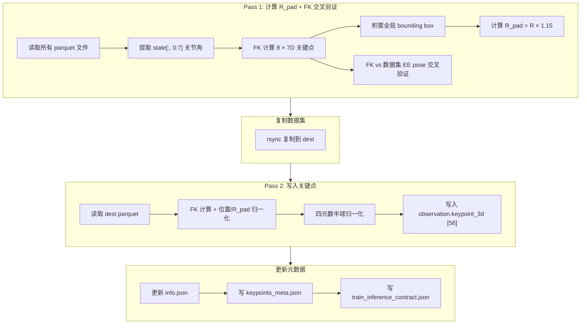
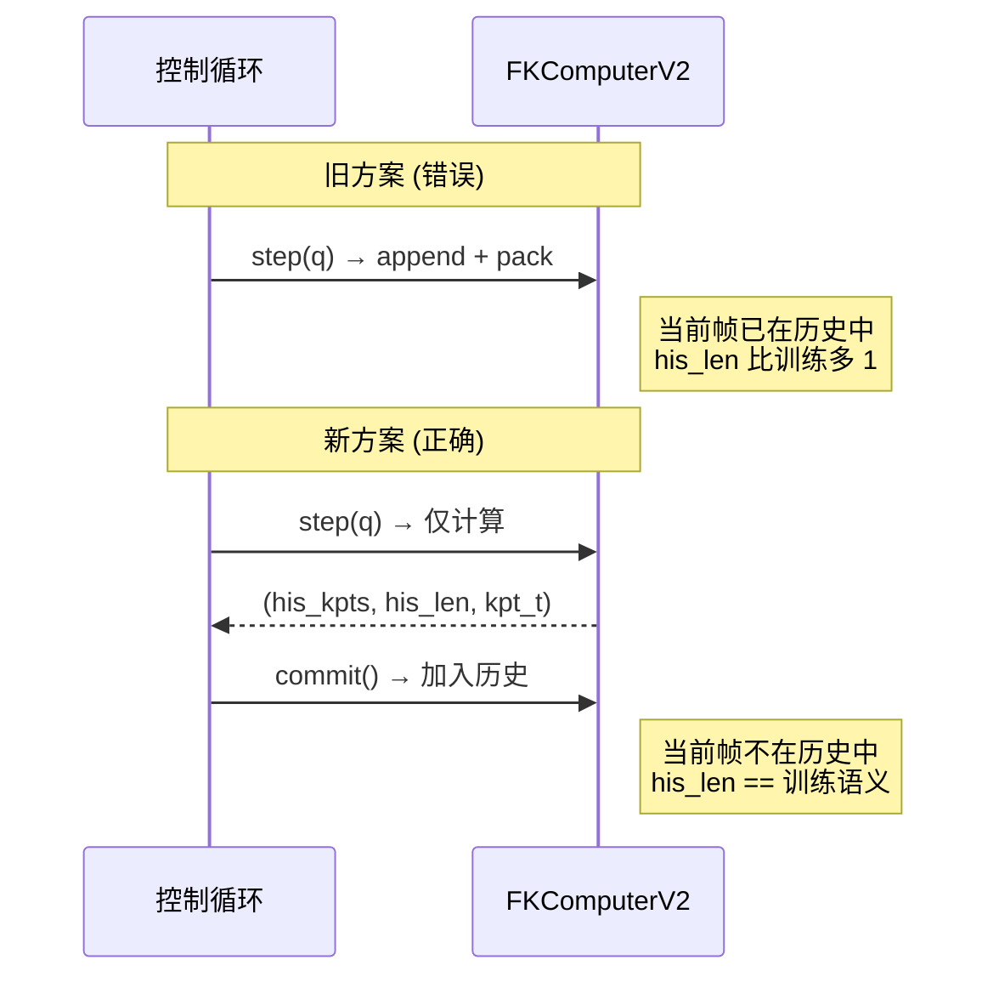
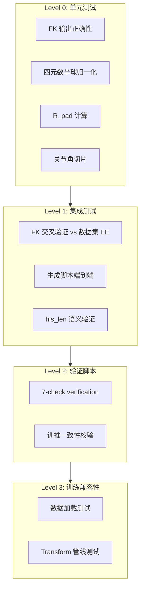

# Franka 插插座数据集 3D 关键点与 4D 信息生成实施方案

> **数据集**: `/B/Dta/plug_into_socket_franka3_15hz_lerobot/` (100 episodes, 33308 frames, 15Hz)  
> **目标**: 生成 `observation.keypoint_3d` 列, 使训练后的模型在真实 Franka 插插座实验上取得更好的评估分数  
> **代码输出目录**: `b/s/Frk2/`  
> **Python 环境**: `/B/VENV/itnvla15rbt20/`  
> **参考分析报告**: [ds2_analyz.md](ds2_analyz.md)  
> **URDF**: [fr3v2_1_franka_hand.urdf](fr3v2_1_franka_hand.urdf)  
> **版本**: v1 · 2026-09-19

---

## 目录

1. [背景与动机](#1-背景与动机)
2. [新旧数据集差异分析](#2-新旧数据集差异分析)
3. [训推一致性设计 (核心)](#3-训推一致性设计-核心)
4. [FK 关键点生成方案](#4-fk-关键点生成方案)
5. [实施细节与代码](#5-实施细节与代码)
6. [配置体系](#6-配置体系)
7. [测试与验收](#7-测试与验收)
8. [已知风险与开放问题](#8-已知风险与开放问题)

---

## 1. 背景与动机

### 1.1 为什么需要 3D 关键点

InternVLA-A1.5 的 GeoPredict 融合路径通过 3D 关键点轨迹为 action expert 提供显式的几何先验. 关键点由 FK (Forward Kinematics) 从关节角度计算得到, 附着在机器人连杆上, 随机器人运动形成 3D 轨迹. TrackEncoder 将这条轨迹编码后与 VLM 前缀和动作专家做三路 MoT (Mixture of Tokens) attention, 使策略拥有对机器人自身几何状态的显式感知.

配置入口:
- `enable_keypoint_predictor=True` 开启 GeoPredict
- `kpt_4d_mode="pos_rot"` 使用 7D (3D 位置 + 4D 四元数) 关键点
- `kpt_4d_mode="pos_only"` 使用 3D (仅位置) 关键点

### 1.2 旧方案的教训

旧方案 (`b/s/Frk/generate_franka_keypoints.py`) 在真机实验中暴露了严重的训推不一致性问题 (详见 `b/d/Frk2/realwrld_debug/grperr_1*.markdown`):

| 问题编号 | 描述 | 后果 |
|:---:|---|---|
| R1 | `his_len` 每次推理 +1, 而训练每帧 +1, 差 `n_exec` 倍 | 策略锁死在抓取前悬停 |
| R2 | 阻塞 `Robot.move()` 导致实际频率 2.49 Hz vs 训练 30 Hz | 轨迹时间语义完全失真 |
| R3 | q7 越界后 FK 关键点也越界, 形成自我强化闭环 | 模型输入离开流形 |
| P1-b | `his_len` 差一帧且每周期重复计数 | 历史时钟快约 10% |
| P0-c | 夹爪 `0.0 or 0.04` 假值 bug | 闭合状态被伪造 |

**本方案的核心设计原则: 在离线生成阶段就确保与推理阶段完全一致的 FK 计算路径, 并在方案文档中明确记录所有训推对齐约束.**

### 1.3 新数据集概况

(详见 [ds2_analyz.md](ds2_analyz.md))

- 100 episodes, 33308 帧, 15 Hz
- `observation.state` (15D): 7 关节角 + 1 夹爪宽度 + 3 EE 位置 + 4 EE 四元数
- `action` (8D): 7 关节目标 + 1 夹爪目标, 绝对关节位置命令
- 附带 `observation.wrench` (6D) 和 `observation.force` (24D) 力感知
- 视频: global + wrist, 640×480, H.264

---

## 2. 新旧数据集差异分析

### 2.1 列名映射

这是最关键的结构差异. 旧数据集拆分为多个子列, 新数据集合并为统一向量:

| 语义 | 旧列名 | 旧维度 | 新列名 | 新维度 / 切片 |
|---|---|---|---|---|
| 关节角度 | `observation.state.arm` | (7,) | `observation.state` | [0:7] |
| 夹爪宽度 | `observation.state.gripper` | (1,) | `observation.state` | [7] |
| EE 位置 | `observation.state.ee_pos` | (3,) | `observation.state` | [8:11] |
| EE 四元数 | `observation.state.ee_quat` | (4,) | `observation.state` | [11:15] |
| 关节动作 | `action.arm` | (7,) | `action` | [0:7] |
| 夹爪动作 | `action.gripper` | (1,) | `action` | [7] |

**对 FK 关键点生成的影响**: 旧脚本 `_read_arm_joints()` 直接读 `observation.state.arm`, 新脚本必须从 `observation.state[:, 0:7]` 切片.

### 2.2 采样频率

| 项目 | 旧数据集 | 新数据集 |
|---|---|---|
| FPS | 30 Hz | **15 Hz** |
| 平均 episode 帧数 | ~666 | ~333 |
| 平均 episode 时长 | ~22s | ~22s |

**对训推一致性的影响**:
- `keypoint_history_max_len` 的含义改变: 200 帧在 30Hz 下 = 6.67 秒, 在 15Hz 下 = 13.33 秒
- 推理时 FK 步进频率必须与 15Hz 对齐
- `his_len` 的增长速率与训练一致需要每个推理步前做 `n_exec` 次 FK 插值

### 2.3 夹爪约定

```
旧数据集:
  observation.state.gripper = 物理宽度 w (米), 范围 [0, 0.0794]
  action.gripper = 1 - w/0.08, 范围 [0.0074, 1.0], 1.0 = 闭合

新数据集:
  observation.state[7] = gripper_width, 范围 [0.0074, 1.0]
  action[7] = action_gripper, 范围 [0.0074, 1.0]
  约定: 0.01 ≈ 闭合, 1.0 = 全开
  验证: action[7] == state[7] (完全同步)
```

**极性相反**: 旧数据集 `action=1.0` 表示闭合, 新数据集 `action=1.0` 表示全开. 这个差异不影响 FK 关键点 (关键点仅依赖关节角度), 但影响推理时的夹爪控制逻辑. 需要在推理配置中明确设定:

```python
GRIPPER_CLOSE_IF_ABOVE = False  # 新数据集: 值越小 = 越闭合
GRIPPER_CLOSE_THRESHOLD = 0.5   # 低于此值视为闭合命令
```

### 2.4 EE 位姿四元数约定

> **[2026-09-19 实测修正]** info.json 的 feature names 声称 `["ee_quat_w", "ee_quat_x", "ee_quat_y", "ee_quat_z"]` (wxyz 顺序), 但经 FK 交叉验证确认, 实际数据存储顺序为 **[qx, qy, qz, qw]** (xyzw 顺序). 按 wxyz 解读旋转误差 175°, 按 xyzw 解读旋转误差 0.011°.

新数据集的 `observation.state[11:15]` 实际存储顺序为 `[qx, qy, qz, qw]`, 与 Pinocchio FK 输出一致. **info.json 的 names 有误.**

在 7D 关键点中, 我们统一使用 `[px, py, pz, qx, qy, qz, qw]` 格式 (与旧方案和 pinocchio 一致).

**重要**: 数据集内自带的 EE 位姿可以作为 FK 计算结果的**交叉验证基准**, 用于检测 URDF 或 FK 库的系统性偏差 (见 §7.2).

---

## 3. 训推一致性设计 (核心)

这是本方案最重要的章节. 基于 `grperr_1*.markdown` 系列的教训, 列出所有必须满足的训推对齐约束.

### 3.1 对齐约束表

| 编号 | 约束 | 训练侧 | 推理侧 | 验证方式 |
|:---:|---|---|---|---|
| C1 | FK 库与 URDF 必须相同 | Pinocchio + `fr3v2_1_franka_hand.urdf` | **相同 URDF + 相同 Pinocchio** | 单元测试: 固定关节角, 对比输出 |
| C2 | 关键点 link 集合相同 | `link1..link7 + hand_tcp` | 相同 | 配置文件固化 |
| C3 | 四元数半球归一化 | $q_w \geq 0$, 否则取反 | 相同 | 验证脚本 Check 4 |
| C4 | `R_pad` 值相同 | 离线计算, 写入 `keypoints_meta.json` | 从同一文件读取 | 配置验证 |
| C5 | 关节角度来源一致 | `observation.state[0:7]` | 真机 `robot.state.q[0:7]` | FK 交叉验证 (§7.2) |
| C6 | `his_len` 语义: 严格早于当前帧的帧数 | `min(frame_index, H)` | 推理时**每控制步**推进一格 (不是每推理步) | 集成测试 |
| C7 | `kpt_t` 是当前帧 (不在历史中) | `stacked[H]` | 当前观测的 FK | 集成测试 |
| C8 | `his_kpts` 填充: 有效帧在前, 零填充在后 | `his_kpts[:his_len] = valid` | 相同 | 单元测试 |
| C9 | 位置归一化: 除以 `R_pad` | `kpts[:,:,:3] /= r_pad` | 相同 | 单元测试 |
| C10 | 数据帧率一致 | 15 Hz | 推理时 FK 以 15 Hz 等效积累 | 频率匹配 |

### 3.2 `his_len` 训推对齐详解

训练时, `his_len` 由 `Extract3DKeypointTransformFn` 计算:

```python
# 训练侧语义 (transform_internvla_a1_5.py L719-730)
hist_window = stacked[:h]           # 偏移 [-H, ..., -1]
hist_is_pad = is_pad[:h].bool()     # 超出 episode 边界的帧
num_invalid = int(hist_is_pad.sum().item())
his_len = h - num_invalid           # = min(frame_index, H)
```

$$\text{his\_len}(t) = \min(t, H), \quad H = \text{keypoint\_history\_max\_len}$$

Episode 第 0 帧: `his_len = 0`, 第 1 帧: `his_len = 1`, ..., 第 $H$ 帧后饱和.

**推理侧的正确实现**:

```python
class FKKeypointComputer:
    def step(self, arm_q7):
        """每个控制步调用一次, 不是每个推理步."""
        kpt = self.compute(arm_q7)   # FK 计算
        kpt[:, :3] /= self.r_pad     # 位置归一化
        # 四元数半球归一化在 compute() 内完成
        
        # 当前帧不入历史 (C7), 留给 kpt_t
        self._kpt_t = kpt
        return self._pack()
    
    def commit(self):
        """在取完 kpt_t 后, 把它加入历史. 每控制步调一次."""
        self._history.append(self._kpt_t.copy())
    
    def _pack(self):
        his_len = len(self._history)  # 严格早于当前帧的帧数
        his_kpts = np.zeros((self.H, self.J, self.D))
        actual = min(his_len, self.H)
        if actual > 0:
            his_kpts[:actual] = np.array(self._history[-actual:])
        return his_kpts, actual, self._kpt_t
```

**旧方案的 bug**: `step()` 里先 append 再 pack, 导致当前帧被算进 `his_len`, 比训练多 1. 且服务端每次推理对同一帧重复调用一次 `step()`, 使得 `his_len` 每推理步 +(`n_exec`+1) 而非 +`n_exec`.

### 3.3 控制频率与数据帧率对齐

训练数据是 15 Hz. 推理时如果 `n_exec=10`, 控制频率为 15 Hz, 则每推理步消耗 10/15 ≈ 0.667 秒. 要使 `his_len` 以正确速率增长:

```
方案 A (推荐): 每个控制步做一次 FK, 推进一格历史
  - 控制步 0:  step() -> commit() -> his_len = 0 -> 1
  - 控制步 1:  step() -> commit() -> his_len = 1 -> 2
  - ...
  - 控制步 9:  step() -> commit() -> his_len = 9 -> 10
  → 一个推理周期 (10 控制步) 后 his_len = 10
  → 等价于训练的 10 帧 = 0.667 秒 ✓

方案 B (仅在控制频率 ≠ 数据帧率时使用): 
  插值使 his_len 按数据帧率增长
```

**15 Hz 数据集 + 15 Hz 控制频率**: 一对一映射, 直接用方案 A.
**15 Hz 数据集 + 30 Hz 控制频率**: 每两个控制步积累一格历史 (按时间对齐而非步数对齐).

### 3.4 FK 交叉验证: 利用数据集内置 EE 位姿

新数据集的 `observation.state[8:14]` 包含采集时的 EE 位姿 (位置 + 四元数). 这是一个宝贵的交叉验证信号:

$$\text{err}_{\text{pos}} = \| \text{FK}(q)_{\text{hand\_tcp,pos}} - \text{state}_{8:11} \|_2$$
$$\text{err}_{\text{rot}} = 2 \cdot \arccos(|\langle q_{\text{FK}}, q_{\text{state}} \rangle|)$$

如果 $\text{err}_{\text{pos}}$ 超过 1 mm 或 $\text{err}_{\text{rot}}$ 超过 0.5°, 则说明:
- URDF 参数与真机存在标定偏差 (DH 参数差异)
- FK 库版本问题
- 坐标系约定不一致

此验证在旧方案中**完全缺失** (旧数据集也有 `ee_pos`/`ee_quat`, 但未被用于交叉验证).

---

## 4. FK 关键点生成方案

### 4.1 关键点定义

从 URDF `fr3v2_1_franka_hand.urdf` 中提取 8 个关键点:

| 编号 | Link 名称 | 物理含义 |
|:---:|---|---|
| 0 | `fr3v2_1_link1` | 肩关节 (J1 输出) |
| 1 | `fr3v2_1_link2` | 肩关节 (J2 输出) |
| 2 | `fr3v2_1_link3` | 肘关节 (J3 输出) |
| 3 | `fr3v2_1_link4` | 肘弯 (J4 输出) |
| 4 | `fr3v2_1_link5` | 腕关节 (J5 输出) |
| 5 | `fr3v2_1_link6` | 腕旋转 (J6 输出) |
| 6 | `fr3v2_1_link7` | 法兰 (J7 输出) |
| 7 | `fr3v2_1_hand_tcp` | 工具中心点 (TCP) |

```mermaid
graph LR
    base["base<br/>(固定)"] --> L0["link0"] --> L1["link1<br/>KP0"] --> L2["link2<br/>KP1"]
    L2 --> L3["link3<br/>KP2"] --> L4["link4<br/>KP3"] --> L5["link5<br/>KP4"]
    L5 --> L6["link6<br/>KP5"] --> L7["link7<br/>KP6"] --> L8["link8"] --> hand["hand"]
    hand --> tcp["hand_tcp<br/>KP7"]
    
    style L1 fill:#4C72B0,color:white
    style L2 fill:#4C72B0,color:white
    style L3 fill:#4C72B0,color:white
    style L4 fill:#4C72B0,color:white
    style L5 fill:#4C72B0,color:white
    style L6 fill:#4C72B0,color:white
    style L7 fill:#4C72B0,color:white
    style tcp fill:#C44E52,color:white
```



### 4.2 每个关键点的信息

每个关键点输出 7 维:

$$\text{keypoint}_i = [p_x, p_y, p_z, q_x, q_y, q_z, q_w]$$

- $[p_x, p_y, p_z]$: 相对于 base_link 原点的 3D 位置 (米), 除以 $R_{\text{pad}}$ 归一化到 $[-1, 1]$
- $[q_x, q_y, q_z, q_w]$: 相对于 base_link 的旋转四元数, 半球归一化 ($q_w \geq 0$)

总维度: $8 \times 7 = 56$.

### 4.3 位置归一化: `R_pad` 计算

两遍扫描法:

**Pass 1**: 遍历所有帧, 对所有关键点位置计算全局 bounding box:

$$R = \max\big(\max_i |x_{\min,i}|, \max_i |x_{\max,i}|\big), \quad i \in \{x, y, z\}$$

$$R_{\text{pad}} = R \times (1 + \text{margin}), \quad \text{margin} = 0.15$$

**Pass 2**: 所有位置除以 $R_{\text{pad}}$:

$$\hat{p} = p / R_{\text{pad}}$$

使得 $\hat{p} \in [-1, 1]$ (理论上, 实际可能因 margin 不足而略微超出).

### 4.4 四元数半球归一化

Pinocchio 输出的四元数可能在单位球面上任意半球. 为保证唯一性:

$$q' = \begin{cases} q & \text{if } q_w \geq 0 \\ -q & \text{if } q_w < 0 \end{cases}$$

这保证 $q_w \geq 0$, 消除了四元数 $q$ 与 $-q$ 表示同一旋转的歧义.

### 4.5 与旧方案的对比

| 项目 | 旧方案 (`b/s/Frk/`) | 新方案 (`b/s/Frk2/`) |
|---|---|---|
| 输入列 | `observation.state.arm` (7D) | `observation.state[:, 0:7]` (15D 切片) |
| URDF 路径 | `b/d/Frk/fr3v2_1_franka_hand.urdf` | `b/d/Frk2/fr3v2_1_franka_hand.urdf` |
| 数据帧率 | 30 Hz | 15 Hz |
| FK 交叉验证 | **无** | **有**: 与 `state[8:14]` 对比 |
| 输出列 | `observation.keypoint_3d` [56] | `observation.keypoint_3d` [56] (相同) |
| 元数据 | `keypoints_meta.json` | 增强版, 含 FK 交叉验证结果 |
| 训推一致性文档 | 无显式记录 | `keypoints_meta.json` 中明确记录所有约束 |

---

## 5. 实施细节与代码

### 5.1 生成脚本: `b/s/Frk2/generate_franka2_keypoints.py`

核心逻辑:

```python
"""Offline FK-based 7D keypoint generation for Franka arm (v2 dataset format).

Handles the unified observation.state (15D) column format.
Includes FK cross-validation against dataset's built-in EE pose.

Usage:
    source /B/VENV/itnvla15rbt20/bin/activate
    export HF_HOME=/B/VENV/hf_home
    python b/s/Frk2/generate_franka2_keypoints.py \
        --source /B/Dta/plug_into_socket_franka3_15hz_lerobot \
        --dest /B/Dta/plug_into_socket_franka3_15hz_lerobot_4D \
        --urdf b/d/Frk2/fr3v2_1_franka_hand.urdf
"""
```

**关键改动点**:

1. **关节角读取**: 从 `observation.state[:, 0:7]` 切片, 不再依赖 `observation.state.arm`
2. **FK 交叉验证**: 利用 `observation.state[:, 8:14]` (EE pose) 做自动验证
3. **元数据增强**: `keypoints_meta.json` 记录 FK 交叉验证结果和训推约束

```python
# 核心差异: 读取关节角度
STATE_COLUMN = "observation.state"  # 不再是 "observation.state.arm"
ARM_SLICE = slice(0, 7)             # 关节角在前 7 维
EE_POS_SLICE = slice(8, 11)         # EE 位置
EE_QUAT_SLICE = slice(11, 15)       # EE 四元数 [qw, qx, qy, qz]

def _read_arm_joints(df, pq_path=None):
    state = np.stack(df[STATE_COLUMN].values).astype(np.float64)
    arm = state[:, ARM_SLICE]
    if np.any(np.isnan(arm)):
        raise ValueError(f"NaN in joint angles in {pq_path}")
    return arm, state  # 返回完整 state 用于交叉验证

def _cross_validate_fk(extractor, arm, state, pq_path):
    """验证 FK 的 hand_tcp 输出与数据集内置 EE 位姿的一致性."""
    kpts = extractor.compute_batch(arm)
    # hand_tcp 是最后一个关键点 (index 7)
    fk_tcp_pos = kpts[:, 7, :3]  # FK 计算的 TCP 位置
    ds_ee_pos = state[:, EE_POS_SLICE].astype(np.float32)  # 数据集的 EE 位置
    
    pos_err = np.linalg.norm(fk_tcp_pos - ds_ee_pos, axis=1)
    
    # 四元数对比 (注意约定差异: 数据集 [qw,qx,qy,qz], FK [qx,qy,qz,qw])
    fk_tcp_quat = kpts[:, 7, 3:7]  # [qx, qy, qz, qw]
    ds_ee_quat_wxyz = state[:, EE_QUAT_SLICE].astype(np.float32)  # [qw, qx, qy, qz]
    # 转换数据集四元数为 [qx, qy, qz, qw] 格式进行对比
    ds_ee_quat_xyzw = np.concatenate([ds_ee_quat_wxyz[:, 1:4], ds_ee_quat_wxyz[:, 0:1]], axis=1)
    
    # 四元数距离: 2*arccos(|dot|)
    dots = np.abs(np.sum(fk_tcp_quat * ds_ee_quat_xyzw, axis=1))
    dots = np.clip(dots, 0, 1)
    rot_err_rad = 2 * np.arccos(dots)
    
    return {
        "pos_err_mean_mm": float(pos_err.mean() * 1000),
        "pos_err_max_mm": float(pos_err.max() * 1000),
        "rot_err_mean_deg": float(np.degrees(rot_err_rad.mean())),
        "rot_err_max_deg": float(np.degrees(rot_err_rad.max())),
    }
```

### 5.2 生成流程



### 5.3 `train_inference_contract.json`

在生成的数据集中额外写入一个训推一致性契约文件, 供推理侧加载和校验:

```json
{
  "version": "2.0",
  "dataset_fps": 15,
  "urdf_sha256": "<URDF文件的SHA256>",
  "pinocchio_version": "3.x.x",
  "keypoint_links": ["fr3v2_1_link1", ..., "fr3v2_1_hand_tcp"],
  "keypoint_dim": 7,
  "keypoint_dim_layout": "px,py,pz,qx,qy,qz,qw",
  "r_pad": 0.xxxxxx,
  "hemisphere_convention": "qw >= 0",
  "position_normalization": "divide_by_r_pad",
  "arm_joint_source": "observation.state[0:7]",
  "his_len_semantics": "count of frames strictly before current frame",
  "kpt_t_semantics": "current frame FK, not included in history",
  
  "inference_constraints": {
    "fk_must_use_same_urdf": true,
    "fk_must_use_same_library": "pinocchio",
    "his_len_increment_per_control_step": 1,
    "kpt_t_is_current_frame": true,
    "history_fill_convention": "valid_front_zero_back",
    "control_step_fk_required": true,
    "note": "每个控制步必须调 FK 并 commit 到历史, 而非每个推理步"
  },
  
  "fk_cross_validation": {
    "tcp_vs_dataset_ee_pos_err_mean_mm": 0.xxx,
    "tcp_vs_dataset_ee_pos_err_max_mm": 0.xxx,
    "tcp_vs_dataset_ee_rot_err_mean_deg": 0.xxx,
    "tcp_vs_dataset_ee_rot_err_max_deg": 0.xxx
  }
}
```

### 5.4 推理侧 FK 计算器: `b/s/Frk2/fk_keypoints_v2.py`

```python
"""Train-inference aligned FK keypoint computer for Franka (v2).

This module computes 7D keypoints from joint angles at inference time,
matching the exact semantics of the offline generation pipeline.

Key invariants (see train_inference_contract.json):
  - his_len = number of frames strictly before current frame
  - kpt_t = current frame (not in history)
  - history fill: valid frames at front, zero-pad at back
  - FK uses the same URDF and Pinocchio as training data generation
"""

class FKKeypointComputerV2:
    def __init__(self, urdf_path, meta_path, link_prefix="fr3v2_1"):
        # Load meta
        meta = json.load(open(meta_path))
        self.r_pad = meta["bbox_radius"]
        self.H = meta.get("keypoint_history_max_len", 200)
        self.J = meta["num_keypoints"]
        self.D = meta["keypoint_dim"]
        
        # Verify URDF hash
        contract_path = Path(meta_path).parent / "train_inference_contract.json"
        if contract_path.exists():
            contract = json.load(open(contract_path))
            import hashlib
            actual_hash = hashlib.sha256(open(urdf_path, "rb").read()).hexdigest()
            expected_hash = contract.get("urdf_sha256")
            if expected_hash and actual_hash != expected_hash:
                logger.warning("URDF hash mismatch! Train=%s Infer=%s",
                               expected_hash[:16], actual_hash[:16])
        
        # Build FK extractor
        self._extractor = FrankaFKExtractor7D(urdf_path, link_prefix)
        self._history = []
        self._kpt_t = None
    
    def compute_and_normalize(self, arm_q7):
        """Compute FK, normalize position by R_pad, hemisphere-normalize quats."""
        kpt = self._extractor.compute(arm_q7)
        kpt[:, :3] /= self.r_pad
        return kpt
    
    def step(self, arm_q7):
        """Call once per control step. Returns (his_kpts, his_len, kpt_t).
        
        Does NOT add current frame to history yet — call commit() after.
        This matches training semantics where his_len = min(t, H) and
        kpt_t is the current frame NOT included in history.
        """
        self._kpt_t = self.compute_and_normalize(arm_q7)
        his_kpts, his_len = self._pack_history()
        return his_kpts, his_len, self._kpt_t
    
    def commit(self):
        """Add current kpt_t to history. Call after step() and after
        the inference server has consumed the results."""
        if self._kpt_t is not None:
            self._history.append(self._kpt_t.copy())
            # Trim to max history length
            if len(self._history) > self.H:
                self._history = self._history[-self.H:]
    
    def _pack_history(self):
        his_len = len(self._history)
        his_kpts = np.zeros((self.H, self.J, self.D), dtype=np.float32)
        actual = min(his_len, self.H)
        if actual > 0:
            his_kpts[:actual] = np.array(self._history[-actual:])
        return his_kpts, actual
    
    def reset(self):
        """Call at the start of each episode."""
        self._history = []
        self._kpt_t = None
```

**与旧方案的关键差异**:



### 5.5 推理侧集成: 控制循环中的 FK 调用

```python
# 推理循环伪代码 (每个控制步)
for control_step in range(max_steps):
    # 1. 获取当前状态
    arm_q7 = robot.get_joint_positions()[:7]
    
    # 2. FK 计算 (每个控制步都做)
    his_kpts, his_len, kpt_t = fk_computer.step(arm_q7)
    
    # 3. 判断是否需要推理 (每 n_exec 步推理一次)
    if control_step % n_exec == 0:
        action_chunk = model.infer(
            images=..., state=...,
            his_kpts=his_kpts, his_len=his_len, kpt_t=kpt_t
        )
        action_ptr = 0
    
    # 4. 执行动作
    action = action_chunk[action_ptr]
    robot.move(action[:7])
    action_ptr += 1
    
    # 5. 提交当前帧到历史 (在消费后!)
    fk_computer.commit()
```

---

## 6. 配置体系

### 6.1 生成配置: `b/s/Frk2/cfg/franka2_plug_kpt.yaml`

```yaml
# Franka plug-into-socket 关键点生成配置
source: /B/Dta/plug_into_socket_franka3_15hz_lerobot
dest: /B/Dta/plug_into_socket_franka3_15hz_lerobot_4D
urdf: b/d/Frk2/fr3v2_1_franka_hand.urdf
link_prefix: fr3v2_1
bbox_margin: 0.15
num_keypoints: 8
keypoint_dim: 7

# 新数据集列名
state_column: observation.state
arm_slice: "0:7"
ee_pos_slice: "8:11"
ee_quat_slice: "11:15"  # [qw, qx, qy, qz] in dataset

# FK 交叉验证阈值
fk_cross_val_pos_thresh_mm: 2.0
fk_cross_val_rot_thresh_deg: 1.0

# 训推契约参数
dataset_fps: 15
keypoint_history_max_len: 200
```

### 6.2 训练配置要点

在 InternVLA-A1.5 训练配置中需要设置:

```yaml
dataset:
  type: internvla_a1_5
  repo_id: plug_into_socket_franka3_15hz_lerobot_4D
  action_mode: abs
  enable_keypoint_predictor: true
  num_keypoint_joints: 8
  kpt_4d_mode: pos_rot  # 7D: pos + quaternion
  keypoint_history_max_len: 200  # 在 15Hz 下覆盖 13.3 秒

policy:
  type: internvla_a1_5
  enable_keypoint_predictor: true
  num_keypoint_joints: 8
  kpt_4d_mode: pos_rot
  keypoint_history_max_len: 200
```

### 6.3 推理配置要点

```yaml
# 推理时的关键参数
inference:
  urdf_path: fr3v2_1_franka_hand.urdf
  kpt_meta_path: keypoints_meta.json
  n_exec: 10
  control_hz: 15  # 必须与数据集 FPS 一致!
  fk_per_control_step: true  # 每控制步做 FK
  gripper_close_if_above: false  # 新数据集极性
  gripper_close_threshold: 0.5
```

---

## 7. 测试与验收

### 7.1 测试层次



### 7.2 测试脚本: `b/s/Frk2/test_franka2_keypoints.py`

```python
"""Comprehensive test suite for Franka v2 keypoint generation.

Tests:
  1. FK basic: fixed joint angles -> known positions
  2. Joint slice: observation.state[0:7] matches expected
  3. Quaternion hemisphere: qw >= 0 for all frames
  4. Quaternion norm: |q| = 1 ± 1e-3
  5. Position bounds: |pos/R_pad| <= 1.01
  6. FK cross-validation: FK TCP vs dataset EE pose
  7. Temporal smoothness: frame-to-frame quaternion change < 0.5
  8. FK reproducibility: recompute random samples
  9. his_len semantics: verify step/commit pattern
 10. EE quaternion convention: dataset [qw,qx,qy,qz] vs FK [qx,qy,qz,qw]
"""
```

#### Test 1: FK 基本正确性

```python
def test_fk_home_position():
    """Franka home position (all zeros) -> known TCP position."""
    extractor = FrankaFKExtractor7D(URDF_PATH)
    kpt = extractor.compute(np.zeros(7))
    tcp = kpt[7, :3]  # hand_tcp position
    
    # Franka at home: TCP approximately at (0, 0, 0.107+offset) from link8
    # link8 is at (0, 0, 0.107) from link7
    # hand is at (0, 0, 0) from link8
    # hand_tcp is at (0, 0, 0.1034) from hand
    # Total Z from base: 0.333 + 0 + 0.316 + 0.0825 + 0 + 0.384 + ... ≈ 1.033 m
    
    assert tcp[2] > 0.9, f"TCP Z at home should be > 0.9m, got {tcp[2]}"
    assert abs(tcp[0]) < 0.01, f"TCP X at home should be ~0, got {tcp[0]}"
    assert abs(tcp[1]) < 0.01, f"TCP Y at home should be ~0, got {tcp[1]}"
```

#### Test 6: FK 交叉验证 (最关键的新测试)

```python
def test_fk_cross_validation(dataset_path, urdf_path):
    """Verify FK output matches dataset's built-in EE pose."""
    extractor = FrankaFKExtractor7D(urdf_path)
    
    parquet_files = sorted(Path(dataset_path).glob("data/**/*.parquet"))
    total_pos_err = []
    total_rot_err = []
    
    for pq in parquet_files[:10]:  # Sample 10 episodes
        df = pd.read_parquet(pq)
        state = np.stack(df["observation.state"].values)
        arm = state[:, 0:7].astype(np.float64)
        
        kpts = extractor.compute_batch(arm)
        fk_tcp_pos = kpts[:, 7, :3]
        fk_tcp_quat = kpts[:, 7, 3:7]  # [qx, qy, qz, qw]
        
        ds_ee_pos = state[:, 8:11].astype(np.float32)
        ds_ee_quat = state[:, 11:15].astype(np.float32)  # [qw, qx, qy, qz]
        # Convert to [qx, qy, qz, qw]
        ds_ee_quat_xyzw = np.concatenate(
            [ds_ee_quat[:, 1:4], ds_ee_quat[:, 0:1]], axis=1
        )
        
        pos_err = np.linalg.norm(fk_tcp_pos - ds_ee_pos, axis=1)
        total_pos_err.extend(pos_err.tolist())
        
        dots = np.abs(np.sum(fk_tcp_quat * ds_ee_quat_xyzw, axis=1))
        dots = np.clip(dots, 0, 1)
        rot_err = 2 * np.arccos(dots)
        total_rot_err.extend(rot_err.tolist())
    
    pos_err = np.array(total_pos_err)
    rot_err = np.array(total_rot_err)
    
    print(f"FK Cross-Validation:")
    print(f"  Position error: mean={pos_err.mean()*1000:.3f}mm "
          f"max={pos_err.max()*1000:.3f}mm")
    print(f"  Rotation error: mean={np.degrees(rot_err.mean()):.4f}° "
          f"max={np.degrees(rot_err.max()):.4f}°")
    
    # Acceptance criteria
    assert pos_err.max() < 0.002, \
        f"FK position error too large: {pos_err.max()*1000:.3f}mm > 2mm"
    assert np.degrees(rot_err.max()) < 1.0, \
        f"FK rotation error too large: {np.degrees(rot_err.max()):.4f}° > 1°"
```

#### Test 9: `his_len` 语义验证

```python
def test_hislen_semantics():
    """Verify step/commit pattern produces correct his_len sequence."""
    fk = FKKeypointComputerV2(URDF_PATH, META_PATH)
    q_home = np.zeros(7)
    
    # Episode start: his_len should be 0
    his_kpts, his_len, kpt_t = fk.step(q_home)
    assert his_len == 0, f"Episode start: his_len should be 0, got {his_len}"
    
    # After commit: his_len should still be 0 until next step()
    fk.commit()
    
    # Next step: his_len should be 1
    his_kpts, his_len, kpt_t = fk.step(q_home)
    assert his_len == 1, f"After 1 commit: his_len should be 1, got {his_len}"
    
    fk.commit()
    
    # After 2 commits: his_len should be 2
    his_kpts, his_len, kpt_t = fk.step(q_home)
    assert his_len == 2, f"After 2 commits: his_len should be 2, got {his_len}"
    
    # Simulate n_exec=10 control steps
    fk.reset()
    for t in range(100):
        _, his_len, _ = fk.step(q_home)
        assert his_len == t, f"Step {t}: expected his_len={t}, got {his_len}"
        fk.commit()
```

### 7.3 验证脚本: `b/s/Frk2/verify_franka2_keypoints.py`

扩展旧方案的 7-check 框架, 增加以下检查:

| Check | 描述 | 通过条件 |
|:---:|---|---|
| 1 | Shape: `observation.keypoint_3d` = [56] | 维度正确 |
| 2 | Position bounds: `|pos| <= 1.01` | 归一化后在 [-1.01, 1.01] 内 |
| 3 | Quaternion norm: `|q| = 1 ± 0.001` | 单位四元数 |
| 4 | Hemisphere: `qw >= 0` | 半球归一化 |
| 5 | Temporal smoothness: 帧间四元数变化 < 0.5 | 无跳变 |
| 6 | FK reproducibility: 重算随机样本 | 最大误差 < 1e-5 |
| 7 | Per-dimension statistics | 输出统计信息 |
| **8** | **FK cross-validation vs dataset EE** | **位置误差 < 2mm, 角度误差 < 1°** |
| **9** | **`keypoints_meta.json` 完整性** | **所有必需字段存在** |
| **10** | **`train_inference_contract.json` 完整性** | **训推约束记录完整** |

### 7.4 训练兼容性测试: `b/s/Frk2/test_training_compat.py`

```python
"""Test that the generated dataset can be loaded by the training pipeline."""

def test_dataset_loads():
    """Verify LeRobotDataset can load the generated dataset."""
    from lerobot.datasets.lerobot_dataset import LeRobotDataset
    ds = LeRobotDataset(
        repo_id="plug_into_socket_franka3_15hz_lerobot_4D",
        root="/B/Dta/plug_into_socket_franka3_15hz_lerobot_4D",
    )
    assert "observation.keypoint_3d" in ds.meta.features
    sample = ds[0]
    assert "observation.keypoint_3d" in sample
    kpt = sample["observation.keypoint_3d"]
    assert kpt.shape == (56,)

def test_transform_pipeline():
    """Verify Extract3DKeypointTransformFn works with the dataset."""
    from lerobot.policies.internvla_a1_5.transform_internvla_a1_5 import (
        Extract3DKeypointTransformFn,
    )
    transform = Extract3DKeypointTransformFn(
        num_joints=8,
        history_max_len=200,
        chunk_size=50,
        keypoint_dim=7,  # pos_rot mode
    )
    # ... load sample with delta indices and verify transform outputs
```

### 7.5 验收标准

| 层级 | 标准 | 通过条件 |
|:---:|---|---|
| L0 | 所有单元测试通过 | `pytest b/s/Frk2/test_*.py` 全绿 |
| L1 | FK 交叉验证 | 位置误差 < 2mm, 旋转误差 < 1° |
| L2 | 验证脚本 10 项全 PASS | `verify_franka2_keypoints.py --dataset <dest>` |
| L3 | 训练管线可加载 | `test_training_compat.py` 通过 |
| L4 | 训练不报错 | 至少跑 100 步训练无异常 |

---

## 8. 已知风险与开放问题

### 8.1 URDF 标定偏差

URDF 文件 `fr3v2_1_franka_hand.urdf` 是从 `xacro` 自动生成的, 使用的是出厂 DH 参数. 真机可能经过标定 (Franka Research 3 支持 `franka::Model` 实时标定参数). 如果 FK 交叉验证 (Test 6) 发现系统性偏差 > 2mm, 可能需要:

1. 从 Franka Desk 导出标定后的 DH 参数
2. 更新 URDF 或使用 Franka 的 `libfranka` C++ API 做 FK (保证标定一致)

### 8.2 `keypoint_history_max_len` 的选择

15 Hz 下, `H=200` 覆盖 13.3 秒, 超过了平均 episode 时长 22.2 秒的一半. 这意味着:
- Episode 后半段 `his_len` 可能尚未饱和 (大约在第 200 帧 = 13.3 秒时饱和)
- 对于较短的 episode (269 帧 = 17.9 秒), 饱和发生在 74% 位置
- 对于较长的 episode (399 帧 = 26.6 秒), 饱和发生在 50% 位置

如果需要在整个 episode 中保持历史增长, 可以将 `H` 设为 400 (覆盖 26.7 秒, 超过所有 episode). 但这会增加 TrackEncoder 的计算量. 建议先用 `H=200` 实验, 根据结果调整.

### 8.3 力信号是否应纳入

新数据集包含 `observation.wrench` (6D) 和 `observation.force` (24D). 对于插插座这种力敏感任务, 力信号可能是关键的. 但当前 InternVLA-A1.5 的 GeoPredict 路径只处理 3D/7D 关键点, 不支持力信号. 可能的扩展方向:
- 将力信号编码为额外的 state 维度
- 将力信号作为 TrackEncoder 的额外通道

### 8.4 夹爪极性差异

新数据集的夹爪极性 (0=闭, 1=开) 与旧数据集相反 (1=闭, 0=开). 推理侧必须正确设置:

```python
# 新数据集
GRIPPER_CLOSE_IF_ABOVE = False  # 值低于阈值 = 闭合
# 或者使用增量判据 (grperr_1.2.md §4)
```

### 8.5 `n_exec` 与 chunk 的关系

旧方案暴露了 `n_exec=10` 截断 50 步 chunk 的问题 (只执行前 10 步, 丢弃后 40 步). 对于 15 Hz 数据集:
- `chunk_size=50` 覆盖 50/15 = 3.33 秒
- `n_exec=10` 只执行前 10/15 = 0.67 秒
- 夹爪闭合斜坡约 17 帧 ≈ 1.13 秒, 中位在第 8.5 步

建议在 15 Hz 下将 `n_exec` 降低到 5 或更少, 以覆盖夹爪斜坡的关键部分.

---

## 附录 A: 执行命令速查

```bash
# 激活环境
source /B/VENV/itnvla15rbt20/bin/activate
export HF_HOME=/B/VENV/hf_home

# Step 1: 运行 FK 交叉验证 (无副作用, 先确认 URDF 正确)
python b/s/Frk2/test_franka2_keypoints.py \
    --source /B/Dta/plug_into_socket_franka3_15hz_lerobot \
    --urdf b/d/Frk2/fr3v2_1_franka_hand.urdf

# Step 2: 生成关键点
python b/s/Frk2/generate_franka2_keypoints.py \
    --source /B/Dta/plug_into_socket_franka3_15hz_lerobot \
    --dest /B/Dta/plug_into_socket_franka3_15hz_lerobot_4D \
    --urdf b/d/Frk2/fr3v2_1_franka_hand.urdf

# Step 3: 验证生成结果
python b/s/Frk2/verify_franka2_keypoints.py \
    --dataset /B/Dta/plug_into_socket_franka3_15hz_lerobot_4D \
    --urdf b/d/Frk2/fr3v2_1_franka_hand.urdf

# Step 4: 训练兼容性测试
python b/s/Frk2/test_training_compat.py \
    --dataset /B/Dta/plug_into_socket_franka3_15hz_lerobot_4D
```

## 附录 B: 文件清单

| 路径 | 用途 |
|---|---|
| `b/s/Frk2/generate_franka2_keypoints.py` | 离线关键点生成脚本 |
| `b/s/Frk2/fk_keypoints_v2.py` | 推理侧 FK 计算器 (供推理服务端导入) |
| `b/s/Frk2/verify_franka2_keypoints.py` | 10-check 验证脚本 |
| `b/s/Frk2/test_franka2_keypoints.py` | 单元测试 + FK 交叉验证 |
| `b/s/Frk2/test_training_compat.py` | 训练管线兼容性测试 |
| `b/s/Frk2/cfg/franka2_plug_kpt.yaml` | 生成配置文件 |
| `b/d/Frk2/fr3v2_1_franka_hand.urdf` | Franka URDF (已存在) |
| `b/d/Frk2/ds2_analyz.md` | 数据集分析报告 (已存在) |
| `b/d/Frk2/3d4d_gen_1.md` | 本方案文档 |

## 附录 C: 参考资料

- 旧方案代码: `b/s/Frk/generate_franka_keypoints.py`, `b/s/Frk/verify_franka_keypoints.py`
- 真机调试日志: `b/d/Frk2/realwrld_debug/grperr_1.markdown`, `grperr_1.1.markdown`, `grperr_1.2.markdown`
- 训练配置: `src/lerobot/policies/internvla_a1_5/configuration_internvla_a1_5.py`
- Transform 管线: `src/lerobot/policies/internvla_a1_5/transform_internvla_a1_5.py` (L660-737)
- 数据集分析: `b/d/Frk2/ds2_analyz.md`
- Pinocchio FK 文档: https://gepettoweb.laas.fr/doc/stack-of-tasks/pinocchio/master/doxygen-html/
- Franka Research 3 URDF: https://github.com/frankaemika/franka_description
