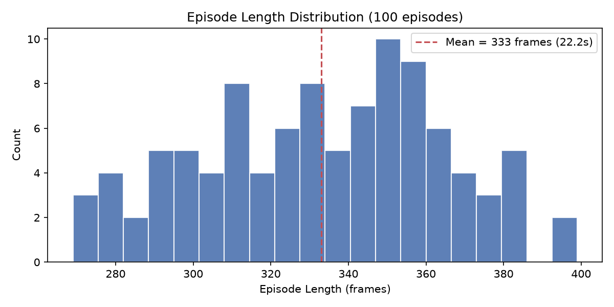
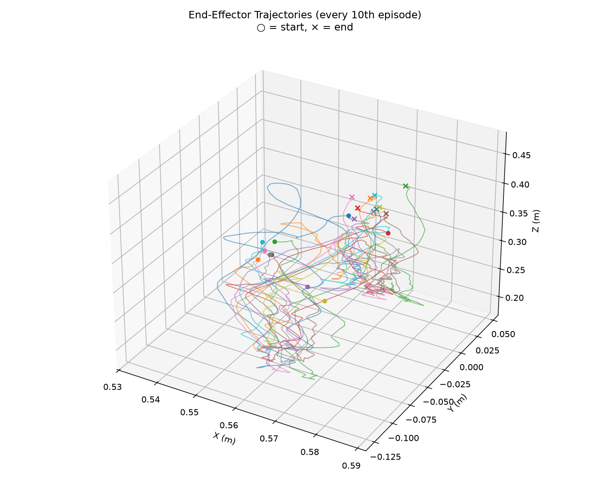
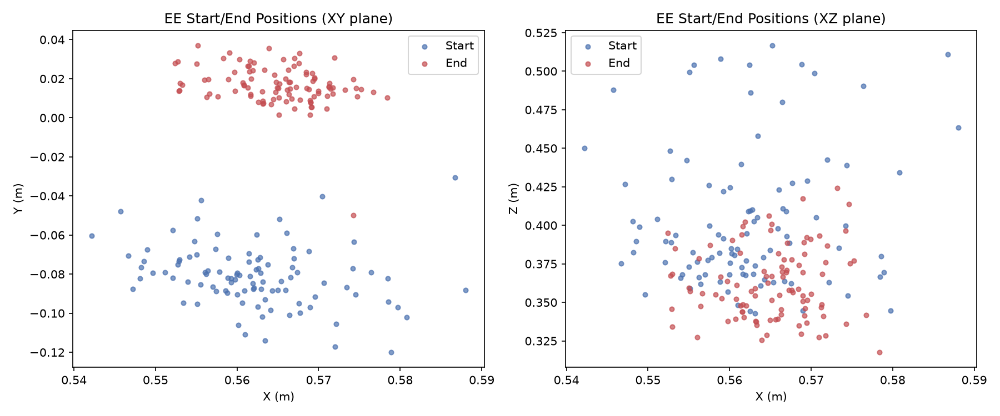
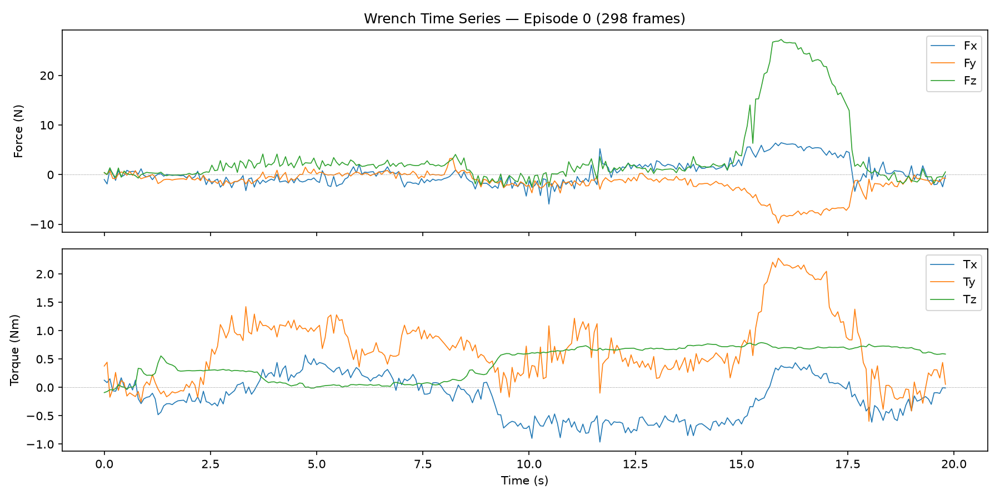
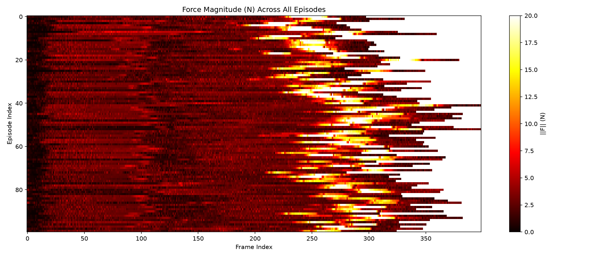
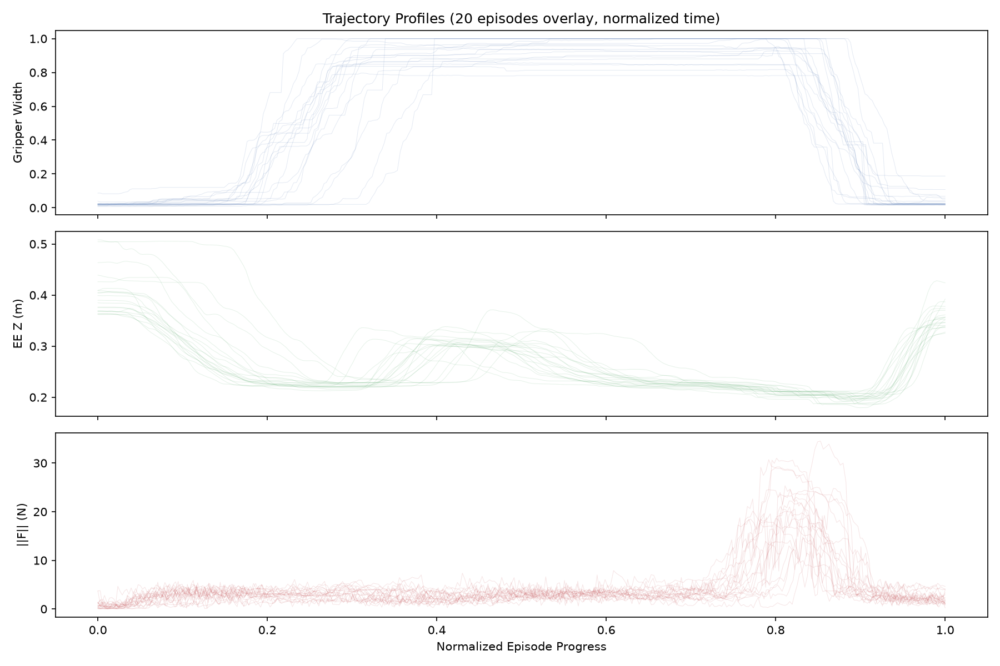
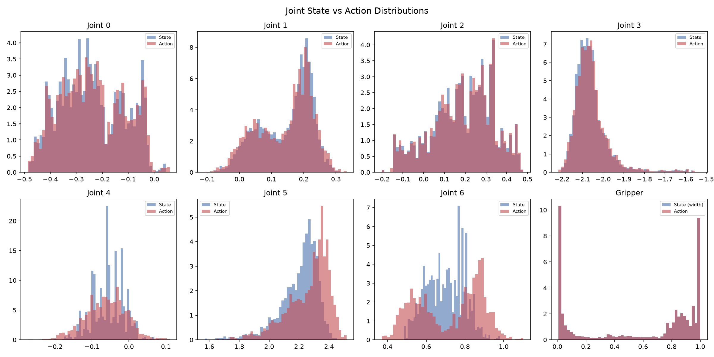

# Franka "Plug Into Socket" 数据集深入分析

> **数据集路径**: `/B/Dta/plug_into_socket_franka3_15hz_lerobot/`  
> **LeRobot格式版本**: v2.1  
> **分析日期**: 2026-09-19  
> **可视化脚本**: [analyze_plug_socket_ds2.py](asset/analyze_plug_socket_ds2.py)

---

## 1. 数据集概览

| 项目 | 值 |
|---|---|
| 机器人类型 | Franka Emika Panda (franka3) |
| 任务描述 | `plug into socket` (插插座) |
| Episode 数量 | 100 |
| 总帧数 | 33,308 |
| 采样频率 | 15 Hz |
| 总时长 | 2,220.5 秒 (≈37.0 分钟) |
| 视觉流 | 2 路: `global` (全局相机) + `wrist` (腕部相机) |
| 视频分辨率 | 480×640, H.264 编码, yuv420p |
| 数据集大小 | ~196 MB (视频 186 MB + 数据 9.7 MB) |
| 任务数量 | 1 (单任务数据集) |
| 划分 | train: 0:100 (全部用于训练) |
| 数据来源 | HDF5 → LeRobot 转换 (source: `/home/a25431/my-dataset/plug_into_socket_hdf5`) |

---

## 2. 数据特征 (Features) 详解

### 2.1 观测空间 (Observation Space)

#### 2.1.1 `observation.state` — 机器人状态 (15D, float32)

| 维度 | 名称 | 含义 | 全局范围 | 全局均值 | 全局标准差 |
|:---:|---|---|---|---|---|
| 0–6 | `joint_0` ~ `joint_6` | 7个关节角度 (rad) | 详见下表 | — | — |
| 7 | `gripper_width` | 夹爪宽度 (归一化) | [0.0074, 1.0] | 0.5787 | 0.4047 |
| 8 | `ee_pos_x` | 末端执行器 X 坐标 (m) | [0.5334, 0.6021] | 0.5653 | 0.0068 |
| 9 | `ee_pos_y` | 末端执行器 Y 坐标 (m) | [-0.1402, 0.0525] | -0.0356 | 0.0559 |
| 10 | `ee_pos_z` | 末端执行器 Z 坐标 (m) | [0.1782, 0.5166] | 0.2647 | 0.0614 |
| 11 | `ee_quat_w` | 末端姿态四元数 w | [0.9929, 1.0] | 0.9989 | 0.0008 |
| 12 | `ee_quat_x` | 末端姿态四元数 x | [-0.0602, 0.1117] | 0.0312 | 0.0214 |
| 13 | `ee_quat_y` | 末端姿态四元数 y | [-0.1098, 0.0613] | -0.0007 | 0.0176 |
| 14 | `ee_quat_z` | 末端姿态四元数 z | [-0.0529, 0.0798] | 0.0084 | 0.0205 |

**关节角度全局统计**:

| 关节 | 最小值 (rad) | 最大值 (rad) | 均值 (rad) | 标准差 | 运动范围 |
|:---:|---|---|---|---|---|
| j0 | -0.4842 | 0.0449 | -0.2406 | 0.1206 | 0.529 |
| j1 | -0.1030 | 0.3120 | 0.1458 | 0.0805 | 0.415 |
| j2 | -0.2025 | 0.4790 | 0.1871 | 0.1464 | 0.682 |
| j3 | -2.2043 | -1.5347 | -2.0599 | 0.0856 | 0.670 |
| j4 | -0.2041 | 0.0806 | -0.0553 | 0.0429 | 0.285 |
| j5 | 1.5702 | 2.4536 | 2.2011 | 0.1286 | 0.883 |
| j6 | 0.4843 | 0.9807 | 0.6997 | 0.0968 | 0.496 |

**姿态分析**: 四元数 $w$ 分量始终接近 1.0 ($w \in [0.993, 1.0]$), 表明末端执行器在整个任务过程中姿态变化很小, 基本保持近乎竖直向下的朝向. 这与插插座任务的特性一致 — 插头需保持对准方向进行插入, 不需要大幅转动姿态.

#### 2.1.2 `observation.wrench` — 力/力矩传感 (6D, float32)

直接的力/力矩读数, 已经过去皮 (tare) 处理:

| 通道 | 含义 | 全局范围 | 全局均值 | 全局标准差 |
|:---:|---|---|---|---|
| fx | X方向力 (N) | [-7.43, 14.81] | 0.31 | 2.12 |
| fy | Y方向力 (N) | [-15.39, 3.69] | -1.23 | 1.90 |
| fz | Z方向力 (N) | [-6.42, 34.31] | 2.61 | 4.88 |
| tx | X轴力矩 (Nm) | [-1.62, 1.15] | -0.37 | 0.37 |
| ty | Y轴力矩 (Nm) | [-2.04, 2.39] | 0.39 | 0.66 |
| tz | Z轴力矩 (Nm) | [-0.51, 0.81] | 0.32 | 0.27 |

**去皮参数** (来自 `force_meta.json`):
- 去皮时长: 1.0 秒 (每个 episode 开头静止期用于标定零点)
- 去皮均值 $\text{tare} = [-0.519, 0.708, -3.589, -0.050, 0.276, -0.249]$

$$\text{wrench}_{\text{tared}}(t) = \text{wrench}_{\text{raw}}(t) - \text{tare}$$

#### 2.1.3 `observation.force` — 聚合力特征 (24D, float32)

对 6 个力/力矩通道 $(f_x, f_y, f_z, \tau_x, \tau_y, \tau_z)$, 每个通道在控制周期内 ($1/15$ 秒) 的高频力信号上计算 4 个统计量:

$$\text{force}_{6i+j} = \text{stat}_j(\text{wrench}_i), \quad i \in \{0,...,5\}, \quad j \in \{\text{mean}, \text{std}, \text{maxabs}, \text{last}\}$$

| 统计量 | 含义 | 说明 |
|---|---|---|
| `mean` | 窗口内均值 | 平滑后的力信号 |
| `std` | 窗口内标准差 | 反映力信号振动/不稳定性 |
| `maxabs` | 窗口内最大绝对值 | 捕获瞬时峰值 |
| `last` | 窗口末尾值 | 即时力读数 |

**验证**: `force[:, 3]` (fx_last) 与 `wrench[:, 0]` (fx) 相关系数为 **1.0000**, 均差为 **0.0000**, 证实 `last` 通道与 `wrench` 完全一致.

此外, `force_meta.json` 中还记录了 **signed-log 归一化参数** $f_0$:

$$\text{slog}(x) = \text{sign}(x) \cdot \log(1 + |x| / f_0)$$

| 通道 | $f_0$ 值 |
|:---:|---|
| fx | 1.100 |
| fy | 0.989 |
| fz | 1.969 |
| tx | 0.373 |
| ty | 0.579 |
| tz | 0.416 |

$f_0$ 的物理意义是使 signed-log 变换在低力区域保持近似线性的尺度因子.

#### 2.1.4 视觉观测 (Video)

| 相机 | 分辨率 | 编码 | 像素格式 | FPS | 总视频数 | 总大小 |
|---|---|---|---|---|---|---|
| `observation.images.global` | 640×480 | H.264 | yuv420p | 15 | 100 | 84 MB |
| `observation.images.wrist` | 640×480 | H.264 | yuv420p | 15 | 100 | 102 MB |

两路相机均以 640×480 分辨率、15fps H.264 编码存储. 腕部相机视频略大 (102 MB vs 84 MB), 可能因为腕部视图中近距离物体纹理更丰富, 压缩率略低.

### 2.2 动作空间 (Action Space)

`action` — 8D, float32, **绝对关节位置命令**:

| 维度 | 名称 | 含义 | 全局范围 | 全局均值 | 全局标准差 |
|:---:|---|---|---|---|---|
| 0–6 | `action_joint_0` ~ `action_joint_6` | 目标关节角度 (rad) | 见下 | — | — |
| 7 | `action_gripper` | 目标夹爪宽度 | [0.0074, 1.0] | 0.5787 | 0.4047 |

**动作模式验证 (Absolute vs Delta)**:

通过对 20 个 episode 的统计验证:

$$|\text{action}(t)_{0:7} - \text{state}(t+1)_{0:7}| = 0.0278 \quad \text{(绝对模式, 低残差)}$$
$$|\text{action}(t)_{0:7} - (\text{state}(t+1) - \text{state}(t))_{0:7}| = 0.819 \quad \text{(增量模式, 高残差)}$$

结论: **动作为绝对关节位置命令** (`action_mode=abs`), 即 $\text{action}(t)$ 是 $t+1$ 时刻的期望关节位置. 两者间约 0.028 rad 的残差来自控制跟踪误差.

**夹爪动作与状态完全同步** ($|\text{action}(t)_{\text{grip}} - \text{state}(t)_{\text{grip}}| = 0.000$), 说明夹爪命令即时生效.

---

## 3. Episode 长度分析



| 统计量 | 值 |
|---|---|
| 最小长度 | 269 帧 (17.9 秒) |
| 最大长度 | 399 帧 (26.6 秒) |
| 平均长度 | 333.1 帧 (22.2 秒) |
| 中位长度 | 335.5 帧 (22.4 秒) |
| 标准差 | 30.9 帧 (2.1 秒) |

**分布特征**: 近似正态分布, 集中在 300–350 帧区间 (51 episodes). 没有极端异常值, 说明采集过程稳定、操作者执行任务的节奏较为一致.

| 区间 (帧) | Episode 数 | 比例 |
|---|---|---|
| [250, 300) | 16 | 16% |
| [300, 350) | 51 | 51% |
| [350, 400) | 33 | 33% |

---

## 4. 轨迹与工作空间分析

### 4.1 末端执行器工作空间



| 轴 | 范围 (m) | 跨度 (m) | 说明 |
|---|---|---|---|
| X | [0.533, 0.602] | 0.069 | 前后方向, 变化很小 |
| Y | [-0.140, 0.053] | 0.193 | 左右方向, 中等变化 |
| Z | [0.178, 0.517] | 0.339 | 垂直方向, 变化最大 |

工作空间呈**窄长的竖向走廊**, X 方向几乎不变 (仅 6.9 cm), Y 方向有 19.3 cm 的横向调整, Z 方向有 33.9 cm 的大幅升降. 这反映了插插座任务的运动特征: 末端主要在**竖直方向做接近-插入运动**, 水平面上做少量对准调整.

### 4.2 起止位置一致性



**起始位置**:

| 维度 | 均值 | 标准差 | 说明 |
|---|---|---|---|
| EE X | 0.562 m | 0.009 m | 非常一致 |
| EE Y | -0.081 m | 0.016 m | 一致, 略偏左 |
| EE Z | 0.403 m | 0.045 m | 有一定变异 |
| Gripper | 0.025 | 0.023 | 起始时已闭合 (持有插头) |

**终止位置**:

| 维度 | 均值 | 标准差 | 说明 |
|---|---|---|---|
| EE X | 0.565 m | 0.006 m | 非常一致 |
| EE Y | 0.016 m | 0.010 m | 一致, 到达插座位置 |
| EE Z | 0.362 m | 0.023 m | 一致, 下降了 ~4 cm |
| Gripper | 0.032 | 0.030 | 终止时仍闭合 |

**关键发现**: 
- 起始时夹爪已闭合 (均值 0.025, 远低于 0.5), 说明每个 episode 开始时机器人已经抓住了插头
- 终止时夹爪仍闭合, 说明数据没有记录释放动作
- Y 方向平均位移 +9.7 cm (从左到右), Z 方向平均位移 -4.1 cm (向下)
- 起始位置的 Z 标准差 (4.5 cm) 大于终止位置 (2.3 cm), 说明不同 episode 的起始高度有差异, 但都收敛到接近的终止位置

### 4.3 关节速度分析

| 关节 | 最大速度 (rad/s) | 平均速度 (rad/s) |
|:---:|---|---|
| j0 | 0.285 | 0.007 |
| j1 | 0.404 | 0.037 |
| j2 | 0.321 | 0.013 |
| j3 | 0.541 | 0.026 |
| j4 | 0.441 | 0.005 |
| j5 | 0.618 | 0.049 |
| j6 | 0.680 | 0.012 |

末端线速度: 最大 0.329 m/s, 平均 0.034 m/s.

整体运动速度较慢 (平均 EE 线速度仅 3.4 cm/s), 最大速度也远低于 Franka 的额定速度. 这符合插插座任务需要精确对准的特性 — 操作者采取了**保守的低速策略**以确保精度.

---

## 5. 力/力矩信号分析

### 5.1 力信号全局特征



**力幅值统计**:

| 指标 | 力 (N) | 力矩 (Nm) |
|---|---|---|
| 最小幅值 | 0.01 | 0.00 |
| 最大幅值 | 35.08 | 2.56 |
| 平均幅值 | 4.19 | 0.93 |
| 标准差 | 4.77 | 0.42 |

- 9.0% 的帧力幅值超过 10N, 15.0% 超过 5N
- 这些高力帧集中在 episode 末尾的插入阶段

### 5.2 力信号时间模式



上图中每行代表一个 episode, 颜色深浅代表力幅值. 可以清晰看到:

1. **Episode 前段 (0–60%)**: 力信号较低 (~2N), 对应接近和对准阶段
2. **Episode 后段 (60–100%)**: 力信号急剧增大, 对应插入阶段

**逐季度力幅值分析** (5个代表性 episode):

| Episode | Q1 (0-25%) | Q2 (25-50%) | Q3 (50-75%) | Q4 (75-100%) | 峰值 |
|:---:|---|---|---|---|---|
| 000 | 2.0 N | 2.6 N | 2.9 N | **12.7 N** | 29.2 N |
| 025 | 1.1 N | 2.3 N | 1.8 N | **5.1 N** | 14.6 N |
| 050 | 2.5 N | 2.2 N | 3.0 N | **7.9 N** | 22.2 N |
| 075 | 2.0 N | 2.7 N | 2.4 N | **6.4 N** | 14.1 N |
| 099 | 2.7 N | 2.3 N | 2.9 N | **7.2 N** | 19.6 N |

**规律**: 所有 episode 的 Q4 (最后 25%) 力幅值都显著高于前三季, 力峰值统一出现在 episode 的 **81.0% ± 2.8%** 位置, 一致性非常高.

### 5.3 力感知阶段识别

通过自动检测获得的三个关键时间节点:

| 阶段 | 触发条件 | 归一化位置 (均值 ± 标准差) |
|---|---|---|
| 夹爪闭合 | gripper 从 >0.5 跳到 <0.1 | 2.0% ± 14.0% |
| 力接触起始 | 力幅值持续 >3N | 18.1% ± 14.2% |
| 力峰值 | 力幅值最大值 | 81.0% ± 2.8% |

```mermaid
gantt
    title 典型 Episode 阶段示意 (以 333 帧 / 22.2 秒平均时长为例)
    dateFormat X
    axisFormat %s
    
    section 阶段
    夹爪已闭合 (持有插头)       :done, 0, 7
    接近与对准 (~18%)           :active, 7, 60
    触觉引导插入 (~63%)         :crit, 60, 270
    力峰值区域 (~19%)           :crit, 270, 333
```



---

## 6. 轨迹剖面叠加分析



将所有 episode 的三个关键信号 (夹爪宽度、EE高度、力幅值) 在归一化时间轴上叠加, 可以观察到:

1. **夹爪 (上图)**: 大部分 episode 全程保持闭合 (≈0), 少数 episode 在开头有短暂的打开-关闭过程
2. **EE Z 高度 (中图)**: 从约 0.35–0.45m 高度逐渐下降到 0.2–0.35m, 呈现平滑的下降曲线
3. **力幅值 (下图)**: 前 60–70% 时间内力信号平稳 (2–3N), 最后 30% 急剧上升, 体现插入接触力

这三个信号共同描绘了一个清晰的**"持物下移→精准插入"**任务模式.

---

## 7. 关节与动作分布



**观察**:
- 所有关节的 action 分布与 state 分布高度重叠, 进一步验证了绝对位置控制模式
- Joint 3 集中在 [-2.2, -1.5] rad 的窄区间, 这是 Franka 肘关节的典型工作范围
- Gripper 呈明显的**双峰分布** (≈0 和 ≈1), 反映了二值开/关特性. 大部分时间闭合 (60.6% 帧开, 29.1% 帧 <0.1)

**注**: 上面"60.6% 帧开"与"大部分时间闭合"看似矛盾, 实际上 gripper_width 的阈值定义导致: 0.5 附近的过渡帧被归入"开", 而约 29% 的帧完全闭合 (<0.1). 结合起始/终止状态分析 (两端均闭合), 可以推断夹爪在episode中间可能有一个短暂的调整过程.

---

## 8. 异常检测与数据质量

### 8.1 力异常 Episode

以每 episode 最大力幅值为指标, 均值 22.6N, 标准差 5.4N:

| Episode | 最大力 (N) | 偏差 | 可能原因 |
|:---:|---|---|---|
| 6 | 35.0 | +2.3σ | 插入过程中插头与插座轻微错位, 产生较大接触力 |
| 15 | 34.5 | +2.2σ | 同上 |
| 69 | 35.1 | +2.3σ | 同上 |

这些 episode 的最大力 (≈35N) 仍在 Franka 的安全工作范围内, 不构成安全问题, 但表明部分插入操作的对准精度略低.

### 8.2 数据完整性

| 检查项 | 结果 |
|---|---|
| NaN 检测 | ✅ 无 NaN |
| Inf 检测 | ✅ 无 Inf |
| 帧数一致性 (parquet vs info.json) | ✅ 33,308 = 33,308 |
| 视频文件完整性 | ✅ 200 个视频文件 (100 × 2 cameras) |
| Episode 索引连续性 | ✅ 0–99 连续 |
| 时间戳间隔 | ✅ 均匀 1/15 ≈ 0.0667 秒 |

---

## 9. 任务特征总结

### 9.1 任务描述

"Plug into socket" 是一个典型的 **peg-in-hole** (轴孔装配) 类操作任务. 机器人需要:
1. 持有插头 (episode 开始时已抓取)
2. 调整末端位置, 将插头对准插座
3. 沿竖直方向精确插入

### 9.2 任务难度分析

| 难点 | 量化证据 |
|---|---|
| **精度要求高** | EE 工作空间仅 6.9cm × 19.3cm × 33.9cm, 末端需精确对准 |
| **姿态稳定性** | 四元数 w ≈ 1.0 (std=0.0008), 几乎无姿态变化 |
| **力控精细** | 插入阶段力高达 35N, 需要力感知引导避免损坏 |
| **速度保守** | 平均 EE 速度仅 3.4 cm/s, 操作者刻意放慢 |
| **起始变异** | 起始位置 Z 标准差 4.5 cm, 需要自适应的接近策略 |

### 9.3 与训练流水线的兼容性

结合 InternVLA-A1.5 训练框架:

| 参数 | 推荐值 | 说明 |
|---|---|---|
| `action_mode` | `abs` | 数据集采用绝对关节位置命令 |
| `action_dim` | 8 | 7 关节 + 1 夹爪 |
| `state_dim` | 15 | 7 关节 + 1 夹爪宽度 + 3 EE 位置 + 4 EE 四元数 |
| `fps` | 15 | 采样频率 |
| `n_obs_steps` | 按需 | 建议 ≥ 2 以捕捉速度信息 |
| `n_action_steps` | 按需 | 考虑到慢速运动, chunk 大小可适当增大 |

**关于力特征**: 该数据集包含 `observation.force` (24D) 和 `observation.wrench` (6D) 两种力表示. 若训练时需要力感知:
- `observation.wrench` (6D) 足以提供原始力/力矩信息
- `observation.force` (24D) 提供了更丰富的统计特征 (含 std 和 maxabs), 适合需要感知力变化率的场景
- `force_meta.json` 中的 `signed_log_f0` 参数可用于 signed-log 归一化

---

## 10. 存储格式说明

```
plug_into_socket_franka3_15hz_lerobot/
├── meta/
│   ├── info.json              # 数据集元信息 (features schema, fps, splits)
│   ├── episodes.jsonl         # 每个 episode 的长度和任务
│   ├── episodes_stats.jsonl   # 每个 episode 的逐特征统计 (min/max/mean/std)
│   └── tasks.jsonl            # 任务列表 (仅 1 个: "plug into socket")
├── force_meta.json            # 力传感器标定参数 (tare, signed-log f0)
├── data/
│   └── chunk-000/
│       ├── episode_000000.parquet   # 每个 episode 一个 parquet 文件
│       ├── ...                      # 包含 state, force, wrench, action, timestamp 等
│       └── episode_000099.parquet
└── videos/
    └── chunk-000/
        ├── observation.images.global/   # 100 个全局相机 MP4
        │   ├── episode_000000.mp4
        │   └── ...
        └── observation.images.wrist/    # 100 个腕部相机 MP4
            ├── episode_000000.mp4
            └── ...
```

Parquet 文件 schema (Arrow 格式):
```
observation.state:  fixed_size_list<float>[15]
observation.force:  fixed_size_list<float>[24]
observation.wrench: fixed_size_list<float>[6]
action:             fixed_size_list<float>[8]
timestamp:          float
frame_index:        int64
episode_index:      int64
index:              int64
task_index:         int64
```

---

## 参考

- 数据集源路径: `/B/Dta/plug_into_socket_franka3_15hz_lerobot/`
- 原始 HDF5 数据: `/home/a25431/my-dataset/plug_into_socket_hdf5`
- 可视化脚本: [analyze_plug_socket_ds2.py](asset/analyze_plug_socket_ds2.py)
- LeRobot 数据集格式: [LeRobot v2.1 Dataset Format](https://github.com/huggingface/lerobot)
- Franka Emika Panda 规格: 7-DOF, 最大负载 3 kg, 关节力矩传感器内置
