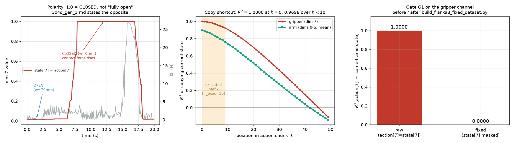
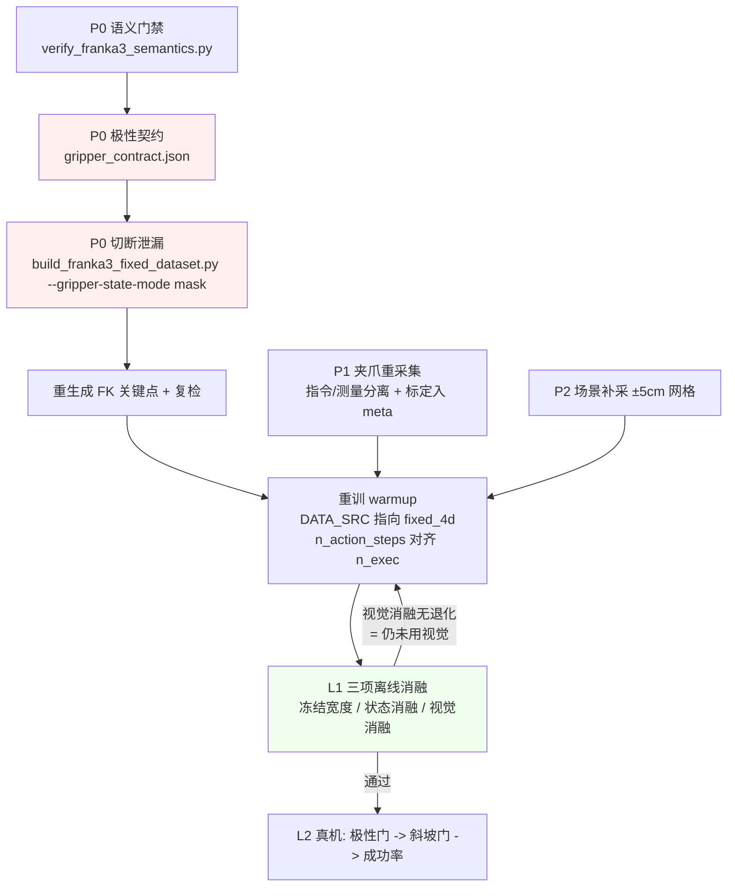
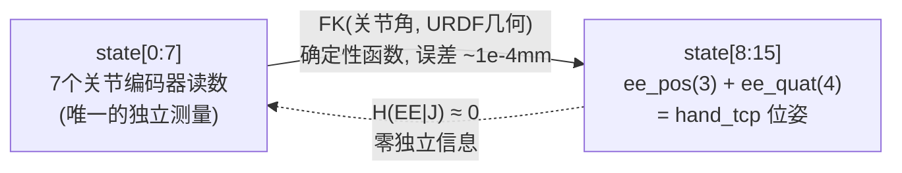

# 第二版 Franka 插插座数据集的问题诊断与整改方案

> **本文回答三个问题**：`/B/Dta/plug_into_socket_franka3_15hz_lerobot/` 上有哪些会伤害真机成功率的问题？它们对 `b/d/Frk2/plug2_p1warmup.md` 这套训练方式意味着什么？要对数据做什么、怎么训，才能把 Franka 真机插插座的成功率提上去？
>
> **证据等级**
> - **【实测】** 本次在本机对该数据集跑脚本得到，可用 `b/s/Frk2/ds/verify_franka3_semantics.py` 复现。
> - **【代码】** 直接引用本仓库实现。
> - **【文档】** 引用 `b/d/Frk2/` 或 `b/d/Frk/` 下的方案/LOG。
> - **【卷宗】** 来自 `b/d/Frk2/realwrld_debug/` 的真机日志。
> - **【推断】** 无直接证据，属推理或建议，**不可当既有事实引用**。
>
> 相关阅读：`b/d/Frk/dta_prblm_solv1.markdown`（第一版 30 Hz 数据的同类分析）。本文不重复其推导，只在必要处引用结论。

---

## 0. 摘要

体检结论：**新数据集继承了旧数据集的夹爪缺陷，并且新增了一个更危险的极性错误**。



| # | 问题 | 严重度 | 关键数字 | 等级 |
|:--:|:---|:--:|:---|:--:|
| **P1** | 夹爪极性被文档写反，按文档部署会让夹爪完全反向 | **致命** | `state[7]=1.0` → 物理宽度 **0 mm = 闭合**；文档写「1.0 = 全开」 | 【实测】 |
| **P2** | `action[7]` 与 `state[7]` 逐位完全相同 | **致命** | 33,308 帧 **100%** 逐位相等，\(R^2=1.000000\) | 【实测】 |
| **P3** | 数据集里根本没有夹爪实测量 | 高 | `state[7]` 就是命令本身；69.40% 的相邻帧逐位不变 | 【实测】 |
| **P4** | 手臂动作是带伺服滞后的指令，分布探出状态分布. **但也可能是实验环境被移动造成** | 高 | 7/7 关节 q01/q99 越界，q7 动作下沿比状态下沿低 0.081 rad | 【实测】 |
| **P5** | `state[8:15]` 是关节的 FK，7/15 维零独立信息，且放大手臂捷径 | 中 | 加入 EE 维后 q7 的 \(R^2\) 从 0.8817 升到 0.9659 | 【实测】 |
| **P6** | 时间基准是零抖动的完美 15 Hz 网格 | 中 | `dt std = 5.27e-7 s`（float32 舍入量级） | 【实测】 |
| **P7** | 场景多样性接近于零 | 中 | `ee_pos_x` std = **6.84 mm**；单任务；跨集图像均值 std 0.0024 | 【实测】 |
| **P8** | 力/力矩通道完全没被使用 | 中（机会） | 24D+6D 力信号存在，但 `franka3.yaml` 不映射它们 | 【代码】 |
| **P9** | 校验脚本只查几何，不查语义 | 中 | `verify_franka2_keypoints.py` 10 项检查无一涉及 action↔state | 【代码】 |

**最重要的一条**：P1 是一个**单点致命错误**。`b/d/Frk2/3d4d_gen_1.md` 第 103 行写「约定: 0.01 ≈ 闭合, 1.0 = 全开」并据此给出推理配置 `GRIPPER_CLOSE_IF_ABOVE = False`。实测四条独立证据一致表明**恰好相反**。按该配置部署，机器人会在该闭合时张开、该松开时夹紧——无论模型训得多好，成功率都是 0。这条修复成本为零。

---

## 1. 体检方法与可复现性

### 1.1 对象

| 对象 | 路径 |
|:---|:---|
| 被检数据集 | `/B/Dta/plug_into_socket_franka3_15hz_lerobot`（100 集 / 33,308 帧 / 15 Hz） |
| 4D 派生集 | `~/b/Dta/plug_into_socket_franka3_15hz_lerobot_4d_v30`（训练实际用的，state/action 与源**逐位相同**）【实测】 |
| 训练 schema | `b/s/Frk2/cfg/franka3.yaml` |
| warmup 方案 | `b/d/Frk2/plug2_p1warmup.md` |
| 启动脚本 | `b/s/Frk2/frk2_plug_warmup_launch.sh`、`b/s/Frk2/run_frk2_plug_warmup.sh` |
| 关键点校验 | `b/s/Frk2/verify_franka2_keypoints.py` |

### 1.2 一键复现

```bash
cd /B/SRC/itvlaGpLibPlus
/B/VENV/itnvla15rbt20/bin/python b/s/Frk2/ds/verify_franka3_semantics.py \
    --dataset /B/Dta/plug_into_socket_franka3_15hz_lerobot \
    --config  b/s/Frk2/cfg/data_gate.yaml
```

实跑结果（退出码 1）：

```text
结果: 1/8 项通过; 3 项阻断, 4 项告警
阻断项 (必须修数据, 否则禁止训练):
  - G1 同帧仿射泄漏: 1/8 个动作维可被同帧状态线性重构 (阈值 R2<0.9999)
  - G2 逐位恒等: 1 个动作维与同帧状态逐位相等
  - G6 传感器真实性: 1 个状态维不具备真实传感器的数值特征
告警项 (风险量化, 不阻断):
  - G4 chunk 复制捷径
  - G5 动作被状态包住
  - G7 时间抖动
  - G8 场景多样性
```

---

## 2. P1：夹爪极性被写反（致命，零成本可修）

### 2.1 文档怎么说

```96:111:/B/SRC/itvlaGpLibPlus/b/d/Frk2/3d4d_gen_1.md
旧数据集:
  observation.state.gripper = 物理宽度 w (米), 范围 [0, 0.0794]
  action.gripper = 1 - w/0.08, 范围 [0.0074, 1.0], 1.0 = 闭合

新数据集:
  observation.state[7] = gripper_width, 范围 [0.0074, 1.0]
  action[7] = action_gripper, 范围 [0.0074, 1.0]
  约定: 0.01 ≈ 闭合, 1.0 = 全开
  验证: action[7] == state[7] (完全同步)
```

并据此给出推理配置：`GRIPPER_CLOSE_IF_ABOVE = False`（值越小越闭合）。

### 2.2 实测四条证据，一致指向相反结论

**证据一：数值对应。** `state[7]` 全局最小值为 **0.00744048**，与旧 HDF5 `robot_state/action_gripper` 的全局最小值**逐位一致**；按旧集恒等式 \(w = 0.08(1-v)\) 反推，得到物理宽度区间 **[0.00000000, 0.07940476] m**，与旧 HDF5 `gripper_width` 的实测区间 **[0.0, 0.07940476] m** 完全吻合。【实测】所以 `state[7]` 承载的是旧集的 `action_gripper`，即**闭合度**，\(v=1.0 \Leftrightarrow w=0\,\text{mm}\)。

**证据二：任务时序。** 逐集采样（首帧 / 15% / 35% / 50% / 75% / 95%）：

```text
ep0: 0.012  0.018  0.210  1.000  1.000  0.018
ep1: 0.018  0.022  1.000  1.000  1.000  0.018
ep2: 0.018  0.022  0.669  1.000  1.000  0.014
```

全部 episode 都是「起始≈0.01 → 中段=1.0 → 末段回落」。插插座必然是「张开接近 → 闭合抓取 → 保持插入 → 松开」。若 1.0 = 全开，就变成「闭合着接近、张开抓取」，与任务矛盾。【实测】

**证据三：接触力。** \(v>0.5\) 期间 \(|f_z|\) 均值 4.0–6.2 N，\(v\le0.5\) 期间仅 1.4–2.0 N。【实测】夹持插头并向下插入时接触力显著增大，符合 \(v>0.5\) = 已夹持。

**证据四：末端高度。** ep0 首次 \(v>0.5\) 发生在第 111 帧，此时 \(z=0.2286\) m，位于该集 \(z\in[0.2004,0.4390]\) 的**低端**——机器人已下降到抓取位。【实测】

### 2.3 根因：又一次相信了 `info.json` 里的名字

`info.json` 把第 7 维命名为 `gripper_width`（宽度）。文档由「名字是宽度 → 值大=更宽=更开」推出极性。但存的其实是闭合度命令。

这与团队**已经发现过**的 `ee_quat` 命名错误是同一个 `info.json` 里的第二处命名错误：

```116:118:/B/SRC/itvlaGpLibPlus/b/d/Frk2/3d4d_gen_1.md
> **[2026-09-19 实测修正]** info.json 的 feature names 声称 `["ee_quat_w", ...]` (wxyz 顺序), 但经 FK 交叉验证确认, 实际数据存储顺序为 **[qx, qy, qz, qw]** (xyzw 顺序).
```

`ee_quat` 那次靠 FK 交叉验证（旋转误差 175° vs 0.011°）抓了出来，夹爪这次没有对应的交叉验证，就漏了。**教训：`info.json` 的 `names` 字段在本数据集上已被证明不可信两次，任何语义都必须由数据本身推出。**

#### 2.3.1 详细说一下`info.json`的问题

这里说的是**新的 15 Hz Franka 数据集**，不是旧的 HDF5 数据集。

具体包括：

1. 源 LeRobot 数据集：

`/B/Dta/plug_into_socket_franka3_15hz_lerobot/meta/info.json`

其中写成：

```json
"ee_quat_w",
"ee_quat_x",
"ee_quat_y",
"ee_quat_z"
```

但实际 `observation.state[11:15]` 是：

```text
[qx, qy, qz, qw]
```

2. 由它生成的 4D/v30 数据集也继承了这个错误：

`/home/a26113/b/Dta/plug_into_socket_franka3_15hz_lerobot_4d_v30/meta/info.json`

它的 `info.json` 同样把四元数名称写成了 `wxyz` 顺序。

`b/d/Frk2/3d4d_gen_1.md` 中的“新数据集”指的就是这套 15 Hz 数据：

```114:118:/B/SRC/itvlaGpLibPlus/b/d/Frk2/3d4d_gen_1.md
### 2.4 EE 位姿四元数约定

> info.json 的 feature names 声称 ["ee_quat_w", ...] (wxyz 顺序)，但实际数据存储顺序为 [qx, qy, qz, qw] (xyzw 顺序)。
```

旧的 `/B/Dta/plug_into_socket_hdf5` 没有这个 `info.json`，它使用的是 `meta.json`，因此这段话不是指旧 HDF5。

注意：这里只需要修正元数据名称，不要重新排列 parquet 中的数值。实际数据已经是正确的 `[qx,qy,qz,qw]` 顺序；如果再次交换数值，反而会把数据弄错。

### 2.4 对真机的影响

| 部署配置 | 模型输出 \(v=1.0\)（想闭合） | 结果 |
|:---|:---|:---|
| `GRIPPER_CLOSE_IF_ABOVE=False`（文档给的） | 判为「张开」 | **插头永远抓不起来** |
| `close_if_above=0.5`（实测正确） | 判为「闭合」 | 正确 |

这解释了为什么真机卷宗里围绕阈值反复调参却始终无法闭合——**方向本身就是反的，调阈值只是在错误的方向上挪动分界点**。【推断，基于 §2.2 实测与卷宗现象的一致性】

---

## 3. P2/P3：夹爪通道零信息量

### 3.1 逐位恒等

```text
action[7] == state[7] 逐位完全相等: True, 不等帧数 = 0 / 33308
R2(action[7] ~ state[7]) = 1.000000
```
【实测】

与第一版 30 Hz 数据（\(a = 1 - w/0.08\)，取负号镜像）相比，新数据集**更直接**：连仿射变换都省了，state 和 action 是同一个数组。

### 3.2 为什么模型必然利用它

结论与 `b/d/Frk/dta_prblm_solv1.markdown` §4 一致，此处只列要点：

1. flow matching 下，已知 \((x_t, t)\) 时预测速度 \(u_t=(x_t-a)/t\) 与预测动作 \(a\) 严格等价。【代码 `modeling_internvla_a1_5.py:1791-1793`】
2. 状态通过两条通路精确进入动作专家：`state_proj`（连续未量化，suffix 第 0 token）与 `tokenize_state`（量化到 0.0234σ 写入 prompt）。【代码 `modeling_internvla_a1_5.py:998,1512-1523`；`transform_internvla_a1_5.py:95-102`】
3. `knowledge_insulation=true`（warmup 开启）**只 detach 梯度、不阻断前向读取**，挡不住这条捷径。【代码 `modeling_internvla_a1_5.py:273-283`】
4. 8 个动作维在损失里**等权平均**，夹爪独占 1/8。【代码 `modeling_internvla_a1_5.py:2536`】

### 3.3 15 Hz 下的量化影响

复制当前状态所能解释的动作方差（归一化单位，预测常数均值 = MSE 1.0）：【实测】

| chunk 位置 \(h\) | 夹爪 copy \(R^2\) | 手臂 copy \(R^2\) |
|---:|---:|---:|
| 0 | **1.000000** | 0.894490 |
| 5 | 0.971004 | 0.833141 |
| 10 | 0.905869 | 0.741503 |
| 20 | 0.697515 | 0.514226 |
| 49 | −0.109555 | −0.140888 |

按实际执行长度聚合：

| 配置 | 夹爪 copy-MSE | 夹爪 \(R^2\) |
|:---|---:|---:|
| \(n_{\mathrm{exec}}=1\) | 0.0000 | 1.0000 |
| **\(n_{\mathrm{exec}}=10\)（评测值）** | **0.0304** | **0.9696** |
| \(n_{\mathrm{exec}}=50\)（训练全长） | 0.4602 | 0.5398 |

整段 chunk 上，纯复制状态可把 8 维动作 MSE 从 1.0 降到 **0.5833**（−41.7%），夹爪贡献 6.75 个百分点、手臂贡献 34.92 个百分点。

> **与第一版的对比很有意思**：30 Hz 数据整段 chunk 的复制 MSE 是 0.3012（−69.9%），比 15 Hz 的 0.5833 更容易被抄。原因不是数据更干净，而是 **50 帧在 15 Hz 下覆盖 3.33 s，是 30 Hz 的两倍时长**，chunk 尾部离当前状态更远。但**真正被下发的前 10 步（0.67 s）夹爪 \(R^2\) 仍高达 0.9696**——捷径依然完美覆盖执行区间。

### 3.4 决策点稀疏

夹爪跨越 0.5 共 **200 次** / 33,308 帧 = **0.60%**，每集 2.00 次，中位发生在 episode 的 **59.6%** 处。【实测】

模型面对的选择是：学一个零成本的恒等映射拿走绝大部分方差，还是学一个需要视觉、只在 0.60% 的帧上才有回报的时序判断。没有重采样或加权时，前者必然胜出。

### 3.5 没有可供恢复的真实测量

`state[7]` 的数值指纹：相邻帧**逐位不变占 69.40%**，非零变化中位数 \(6.28\times10^{-3}\)（归一化单位，折合宽度 0.5 mm）。【实测】真实 Franka 编码器不会连续 69% 的帧给出逐位相同的浮点数。

对照第一版分析的结论：源 HDF5 的 `robot_state` 里**只有** `action_gripper` 和由它反算的 `gripper_width`，**没有**任何独立的实测宽度、夹持力或 `is_grasped` 通道（`b/d/Frk/dta_prblm_solv1.markdown` §2.4）。

**这意味着重标注救不了夹爪通道**：任何基于 \(v\) 的变换（前瞻、差分、事件）都只是同一个命令信号的函数。要拿到真正的闭环夹爪能力，**必须重采集**。在重采集之前，唯一诚实的做法是**不让模型依赖这一维**（见 §6.2）。

---

## 4. P4/P5：手臂通道的两个问题

### 4.1 P4 伺服滞后导致动作探出状态分布

门禁 G5 报出 7/7 关节全部越界：【实测】

| 关节 | action [q01, q99] | state [q01, q99] | 越界方向 |
|:--|:---|:---|:---|
| q1 | [−0.4633, −0.0169] | [−0.4595, −0.0259] | 两端 |
| q5 | [−0.1933, 0.0736] | [−0.1598, 0.0383] | 两端 |
| q6 | [1.8362, 2.4666] | [1.7469, 2.3927] | 上沿 |
| **q7** | **[0.4258, 1.0006]** | **[0.5071, 0.9009]** | 两端，下沿低 **0.081 rad** |

成因与第一版一致：示教在阻抗控制下进行，指令始终领先实测 100–600 ms，机器人从未真正到达指令值；评测时把同样的数值当**绝对目标**下发，机器人**会**到达，于是测得状态被推出训练分布，下一步观测即 OOD，形成开环累积漂移。【实测 + 卷宗】

卷宗记录 q7 在真机上一路跌到 0.458/0.40，正是这个机制。【卷宗】

### 4.2 P5 EE 维冗余并放大手臂捷径

`state[8:15]` = `ee_pos(3) + ee_quat(4)`，由 `FK(state[0:7])` 唯一决定。`meta/keypoints_meta.json` 记录的 FK 交叉验证误差为 \($1.41\times10^{-4}$\) mm——**零独立信息**。【实测/文档】

但它们不是无害的。加入这 7 维后，手臂动作的同帧可重构性上升：【实测】

| 关节 | \(R^2\)（仅同维状态） | \(R^2\)（全 15 维状态） | 增量 |
|:--|---:|---:|---:|
| q5 | 0.565395 | 0.621762 | +0.056 |
| q6 | 0.929194 | 0.944732 | +0.016 |
| **q7** | **0.881687** | **0.965903** | **+0.084** |

q7 恰好既是捷径被放大最多的维度，又是真机上最主要的 OOD 维度。【推断，两者的因果关系未直接验证】

---

## 5. P6–P9：其余问题

### 5.1 P6 时间基准零抖动

`dt mean = 0.066667 s, std = 5.27e-7 s`（float32 时间戳舍入量级），`min = max = 0.066667`。【实测】训练看到的是一个完美的 15 Hz 网格。

15 Hz 下 `keypoint_history_max_len=200` 覆盖 **13.33 s**；真机实测频率 2.5–3.6 Hz 时，200 格覆盖的是 **55–80 s**。【卷宗】`his_len` 只携带格数、不携带时间单位，这个语义错位在低频真机上必然出现。

### 5.2 P7 场景多样性

| 指标 | 值 |
|:---|:---|
| `ee_pos_x` std | **0.00684 m** |
| `ee_pos_y` / `ee_pos_z` std | 0.0559 / 0.0614 m |
| 任务数 | 1（`plug into socket`） |
| 跨集图像均值 std | global 0.0024–0.0027；wrist 0.0048–0.0058 |

插座在 x 方向几乎是一个固定点。【实测】

> **一个已经做对的点**：与第一版不同，Frk2 的启动脚本**已经打开了图像增广**：
> ```206:208:/B/SRC/itvlaGpLibPlus/b/s/Frk2/frk2_plug_warmup_launch.sh
>   --dataset.image_transforms.enable=true
>   --dataset.image_transforms.max_num_transforms=3
>   --dataset.image_transforms.random_order=false
> ```
> 这条不需要再改。但增广只能缓解光照/色彩差异，补不了**几何**多样性——插座位置的 6.8 mm 方差只能靠补采解决。

### 5.3 P8 力信号被完整浪费

数据集里有 `observation.wrench`(6D) 和 `observation.force`(24D，每通道 mean/std/maxabs/last)，但 `franka3.yaml` 的 `feature_mapping` 只映射 `observation.state` 和 `action`：

```1:10:/B/SRC/itvlaGpLibPlus/b/s/Frk2/cfg/franka3.yaml
robot_type: franka3
action_mask_spec: [7, -1]
feature_mapping:
  observation.state:
    - observation.state
  action:
    - action
image_mapping:
  observation.images.global: observation.images.image0
  observation.images.wrist: observation.images.image1
```

方案文档也明确标注不支持：

```216:217:/B/SRC/itvlaGpLibPlus/b/d/Frk2/plug2_p1warmup.md
| `observation.force` | 24 | float32 | ❌ 当前 InternVLA-A1.5 不支持力输入 |
| `observation.wrench` | 6 | float32 | ❌ 当前 InternVLA-A1.5 不支持力输入 |
```

**这对插插座是一个实打实的损失。** 插入是典型的接触密集任务，对准与否在视觉上可能只差 1–2 mm（相机分辨不出），但在力信号上差异巨大：实测 \(f_z\) 范围 [−6.42, 34.31] N，夹持插入期间 \(|f_z|\) 是自由移动期的 2–3 倍。【实测】

另外 `force` 的 `last` 通道与 `wrench` **完全重复**（相关系数 1.000000，最大差 0.00e+00）【实测】，24D 中有 6D 是冗余的。

### 5.4 P9 校验只查几何不查语义

`verify_franka2_keypoints.py` 的 10 项检查全部围绕关键点几何（形状、范数、半球、时序平滑、FK 可复现、FK vs EE 位姿、meta 完整性），**没有任何一项**涉及 action 与 state 的关系。【代码】

这正是 P1/P2 能一路通过所有检查进入训练的原因。

---

## 6. 整改方案

### 6.1 设计原则

**扩展优于修改。** 所有整改以「新增脚本 + 产出新数据集」落地：

- **不改** `src/lerobot/` 任何文件——避免破坏 RoboTwin / R1Pro / LIBERO / Frk1 既有流程。
- **不改** `b/s/Frk2/frk2_plug_warmup_launch.sh` 等已验证脚本——它们已通过 `DATA_SRC` / `DATA_REPO_ID` 参数化，换数据集只需改环境变量。
- 会随硬件变的量（夹爪标定、极性）抽成 `meta/gripper_contract.json`。
- 会随数据集变的量（门禁阈值）抽成 `b/s/Frk2/cfg/data_gate.yaml`。

### 6.2 新增代码清单

| 文件 | 作用 | 状态 |
|:---|:---|:---|
| `b/s/Frk2/ds/verify_franka3_semantics.py` | 语义准入门禁，8 项检查分「阻断/告警」两级 | 新增，已跑通 |
| `b/s/Frk2/cfg/data_gate.yaml` | 门禁阈值，每个数据集一份 | 新增 |
| `b/s/Frk2/ds/build_franka3_fixed_dataset.py` | 产出修正数据集：极性契约 + 屏蔽泄漏通道 + 事件标签 | 新增，已跑通 |
| `b/s/Frk2/ds/run_franka3_data_fix.sh` | 端到端流水线：门禁→修正→FK→复检→软链 | 新增，已跑通 |

### 6.3 数据处理：具体做什么

#### 步骤 1（P0，零成本）：固化夹爪极性契约

`build_franka3_fixed_dataset.py` **从数据推出**极性而不是假设它，用三路证据投票（episode 形状、接触力、宽度反推区间一致性），实跑输出：

```text
夹爪极性判定 (由数据推出, 非假设):
  高值含义          : closed
  episode 形状证据  : 首帧中位=0.0200 中段中位=0.9481
  接触力证据        : |fz| high-side=4.010N low-side=1.936N
  宽度反推区间      : 0.079405 m 满开
  三项证据一致      : True
```

产出 `meta/gripper_contract.json`（节选）：

```json
{
  "channel": "observation.state[7] / action[7]",
  "info_json_name": "gripper_width",
  "info_json_name_is_MISLEADING": true,
  "actual_semantics": "normalised closedness command",
  "polarity": { "high_value_means": "closed", "unanimous": true },
  "close_if_above": 0.5,
  "close_if_below": null,
  "physical_width": {
    "formula": "w_m = w_max_m * (1 - v)",
    "w_max_m": 0.08,
    "w_max_source": "hard-coded in the source capture; NOT from a calibration record"
  },
  "WARNINGS": [
    "state[7] is the COMMAND, not a measurement: action[7] == state[7] bit-exactly.",
    "No measured gripper width, grasp force or is_grasped channel exists in this capture.",
    "w_max=0.08 is uncalibrated; the real hand reported 0.0664 m during evaluation."
  ]
}
```

脚本同时修正 `info.json` 里两处已知的误导性命名：dim 7 改为 `gripper_closedness_cmd`，`state[11:15]` 改为 `ee_quat_x/y/z/w`（xyzw 实际顺序）。

**部署端必须读这个文件，不得再相信 `info.json` 的 `names`。**

#### 步骤 2（P0）：切断夹爪泄漏

核心操作是把 `observation.state[7]` 常数化（`--gripper-state-mode mask`）。理由在 §3.5：数据里不存在可恢复的实测宽度，任何「前瞻重标注」都只是把「抄同帧」变成「抄未来帧」。屏蔽是唯一诚实的做法——它强迫策略从**相机 + 关键点历史**判断何时闭合。

三种模式可选：

| 模式 | 行为 | 何时用 |
|:---|:---|:---|
| `keep` | 保持原样 | 只做基线对照 |
| **`mask`（默认）** | `state[7]` 置常数 | 当前推荐：无实测量可用时 |
| `lag` | `state[7]` 用延迟 \(\Delta\) 帧的命令 | **仅当**已用空载开合阶跃实测出 \(\Delta\) |

> `lag` 模式的 \(\Delta\) **必须来自实测阶跃响应**，不能拍脑袋。脚本的 `--gripper-lag` 默认值 3 只是占位，docstring 已明确标注。凭空捏造一个执行器动力学模型，只会把一个已知缺陷换成一个未知缺陷。

#### 步骤 3：补充事件监督通道

新增两列（不覆盖任何原有列）：

- `action.gripper_phase` ∈ {0: hold_open, 1: closing, 2: hold_closed, 3: opening}
- `action.frames_to_next_event`：距下一次相位切换的帧数

实跑抽查（ep0）：

```text
phase 分布: {0: 143, 1: 1, 2: 153, 3: 1}
相位变化点帧号: [110, 111, 264, 265]
ttl 在事件前递减: [6, 5, 4, 3, 2, 1, 0, 153, 152, 151]
```

`frames_to_next_event` 的关键性质是：**它无法从当前状态推出**，必须依赖视觉与上下文。它是把「夹爪任务」从「回显一个数」重新定义成「预测还有多久该动」的载体。当前 InternVLA-A1.5 没有对应的输出头，所以这两列先作为**分析与采样依据**落盘；接上辅助头需要改 `src/`，属于下一步（§6.6）。

#### 步骤 4：可选地屏蔽 EE 冗余维

`--ee-state-mode mask` 会把 `state[8:15]` 常数化，消除 P5。**建议先做 A/B 对照再决定**：这 7 维虽无独立信息，但可能为动作专家提供一个更易用的任务空间表征。【推断】

#### 一键执行

```bash
cd /B/SRC/itvlaGpLibPlus
bash b/s/Frk2/ds/run_franka3_data_fix.sh
```

流水线实跑结果：

```text
Step 1/5: 原始数据集语义门禁 -> 结果: 1/8 项通过; 3 项阻断, 4 项告警  (退出码 1)
Step 2/5: 构建修正数据集     -> 高值含义: closed, 三项证据一致: True, 写出 100 个 parquet
Step 3/5: 修正数据集复检     -> 结果: 4/8 项通过; 0 项阻断, 4 项告警  (退出码 0)
Step 4/5: 重新生成 FK 关键点
Step 5/5: 关键点校验 + 训练软链
```

剩余 4 项告警是 P4（动作探出状态）、P6（零抖动）、P7（场景单一）和 chunk 复制捷径——它们要么需要重采集，要么需要改训练逻辑，不属于「改数据就能修」的范畴，因此设计为告警而非阻断。

### 6.4 训练：具体怎么改

由于整改产出的是新数据集，**训练脚本一行代码都不用改**：

```bash
export DATA_SRC=${HOME}/b/Dta/plug_into_socket_franka3_15hz_fixed_4d
export DATA_REPO_ID=plug_into_socket_franka3_15hz_fixed_4d
bash b/s/Frk2/run_frk2_plug_warmup.sh
```

在此基础上建议的超参调整（相对 `b/d/Frk2/plug2_p1warmup.md` 的现行值）：

| 超参 | 现值 | 建议 | 理由 |
|:---|:---|:---|:---|
| `--dataset.repo_id` | `..._4d` | `..._fixed_4d` | 使用修正数据集 |
| `policy.n_action_steps` | 50 | **≤ 15** | 由 §3.3，训练 50 步但只执行 10 步，非捷径的监督信号全在不执行的尾部；缩短 chunk 让训练与执行对齐 |
| 推理端 `n_exec` | 10 | 与 `n_action_steps` 一致 | 同上 |
| `--dataset.image_transforms.enable` | true | 保持 true | 已经对了 |
| `action_loss_weight` | 2.0 | 保持 | warmup 阶段以关键点为主 |

> **关于 `n_action_steps`**：这是本文唯一建议改动的模型超参，依据是 §3.3 的实测衰减曲线——\(h<10\) 区间夹爪 \(R^2=0.9696\)，而 \(h>30\) 才降到 0.43。把训练 horizon 压到与执行 horizon 同量级，能让损失里「真任务」的比例显著上升。【推断，需 A/B 验证】

### 6.5 必须重采集的部分（P0，无法绕过）

以下三条**没有任何数据后处理或训练技巧能替代**：

1. **夹爪的指令与测量分离**：`action.gripper_cmd`（示教器扳机/主手开合量）与 `observation.gripper_width_measured`（来自 `franka::GripperState::width`）必须是两条独立记录的通道。
2. **夹持语义通道**：`is_grasped` + 夹持力或电机电流，用于区分「合到 0」与「夹住 10 mm 插头」。
3. **标定入契约**：每次采集会话前执行 `gripper.homing()`，把 `reported_max_width`、指尖型号、插头厚度（卡尺）写入会话元数据。禁止代码里再出现字面量 `0.08`——当前该常数在采集、`verify_franka_conversion.py` 的 `GRIPPER_MAX`、推理端 `W0` 三处各写一遍，且无一来自标定记录。实测满开只有 0.0794 m，而真机 libfranka 报 0.0664 m。

补采时顺带解决 P7：插座位置至少覆盖 ±5 cm × ±5 cm 网格、多光照、多背景杂物；并保留采集环路的真实时间抖动（P6），不要重采样到完美网格。

### 6.6 后续增量（需要改 `src/`，单独评审）

| 项 | 内容 | 预期收益 |
|:---|:---|:---|
| 力信号接入 | 把 `observation.wrench`(6D) 拼进 state 或加独立编码器 | 插入对准的关键反馈，P8 |
| 夹爪事件头 | 用 §6.3 步骤 3 的两列做分类 + 剩余时间回归 | 把夹爪从回归改成事件预测 |
| state dropout | `state_dropout_dims` / `state_dropout_prob` 配置项，默认关闭 | 比离线屏蔽更灵活，可 p<1 |
| 事件重采样 | 对相位切换前后 ±15 帧提高采样权重 | 针对 0.60% 的决策帧 |

**实现要点**：变换管线中 `NormalizeTransformFn` 在 `InternVLAA15ChatProcessorTransformFn` 之前【代码 `configuration_internvla_a1_5.py:44-69`】，所以 state dropout 必须插在两者之间，才能**同时**覆盖 `state_proj` 与 `tokenize_state` 两条通路——只堵一条无效。

---

## 7. 验收方案

### 7.1 L0 数据层（已实现，可立即执行）

| 测试 | 命令 | 通过条件 |
|:---|:---|:---|
| 原始数据必须被拦下 | `verify_franka3_semantics.py --dataset <raw>` | 退出码 1，阻断项含 G1/G2/G6 |
| 修正数据必须放行 | `verify_franka3_semantics.py --dataset <fixed>` | 退出码 0，阻断项为 0 |
| 极性契约存在且一致 | 检查 `meta/gripper_contract.json` | `polarity.unanimous == true` |
| 关键点未被破坏 | `verify_franka2_keypoints.py --dataset <fixed_4d>` | 10 项全 PASS |

**覆盖的分支**：夹爪泄漏、逐位恒等、派生通道、chunk 复制、动作越界、传感器真实性、时间抖动、场景多样性。
**未覆盖**：图像内容质量、视频解码完整性（由既有 `post_check` 负责）、关键点与图像的时间对齐。

### 7.2 L1 离线消融（核心，需在训练后执行）

这三项是本方案最关键的验收手段，因为**所有 loss 指标都无法区分「模型学会了」和「模型在抄状态」**：

| 测试 | 方法 | 通过条件 |
|:---|:---|:---|
| **冻结宽度测试** | 固定夹爪输入为真机值（如 66.4 mm 对应 \(v=0.17\)），连喂 100 步 | 策略应在若干步后仍输出 \(v\ge0.8\)（即敢于闭合） |
| **状态消融测试** | 把 `state[7]` 置零/加噪 | 夹爪预测退化幅度 < 20%（说明不依赖该维） |
| **视觉消融测试** | 遮挡 wrist 相机 | 夹爪预测**应显著退化**（说明确实用了视觉） |

第三项是正向检验：如果遮挡相机后夹爪预测**没有**退化，说明模型仍未使用视觉，整改未达目的。

用现有的 `tests/openloop_internvla_a1_5.py` 做基线对比：夹爪通道的 chunk 级 MAE 必须优于「复制基线」（本数据集该基线为 copy-MSE 0.4602 @ chunk=50 / 0.0304 @ n_exec=10）。

### 7.3 L2 真机

| 门 | 条件 |
|:---|:---|
| 极性门 | 启动时读 `gripper_contract.json`，打印 `close_if_above`，人工确认与执行器逻辑一致 |
| 夹爪斜坡门 | 300 步内至少 1 次越过阈值并完成闭合 |
| 分布门 | 逐步监控 8 维状态是否落在训练 [q01, q99] 内，越界告警（q7 重点） |
| 成功率 | 多 episode 统计，与整改前同 checkpoint 对照 |

---

## 8. 优先级与路线

| 级别 | 措施 | 理由 | 成本 |
|:--:|:---|:---|:---|
| **P0** | §6.3 步骤 1 极性契约 | 单点致命；不修则成功率恒为 0 | **分钟级** |
| **P0** | §6.2 语义门禁接入流程 | 防止后续所有回归 | 已完成 |
| **P0** | §6.3 步骤 2 切断夹爪泄漏 | 让模型有可能学会看视觉 | 小时级 |
| **P1** | §6.5 夹爪通道重采集 | **唯一**能恢复闭环夹爪能力的手段 | 高 |
| **P1** | §6.4 `n_action_steps` 对齐执行 horizon | 训练信号与执行区间对齐 | 一次重训 |
| **P2** | §6.6 力信号接入 | 插入对准的关键反馈 | 需改 `src/` |
| **P2** | §6.5 场景补采（±5 cm 网格） | 解决 6.8 mm 的几何方差 | 高 |
| **P3** | §6.3 步骤 4 EE 维屏蔽、§6.6 其余 | 需 A/B 验证 | 中 |



---

## 9. 结论

1. **P1 极性错误是当前最高优先级**，且修复成本为零。四条独立证据一致表明 `state[7]=action[7]=1.0` 意味着**闭合**，而 `3d4d_gen_1.md` 与其给出的推理配置写反了。按现有文档部署，夹爪逻辑完全颠倒。
2. **P2 夹爪泄漏比第一版更彻底**：第一版是仿射镜像（\(a=1-w/0.08\)），新版直接是同一个数组。捷径在真正被执行的前 10 步上 \(R^2=0.9696\)。
3. **夹爪通道无法靠重标注修复**，因为源数据里根本没有实测宽度。当前唯一诚实的做法是屏蔽该输入维、强迫模型使用视觉；要恢复真正的闭环夹爪能力必须重采集。
4. 手臂的问题（P4 伺服滞后、P5 EE 冗余）与夹爪**性质不同**，需分开整改，不能用同一套方案。
5. 力信号（P8）是本数据集相对第一版**新增的资产**，对接触密集的插入任务价值很高，但目前被完全浪费。
6. 图像增广（Frk2 已开启）是团队相对第一版已经做对的一点，不需要再改。

---

## 10. 参考

**本次新增代码**

- `b/s/Frk2/ds/verify_franka3_semantics.py` —— 语义准入门禁（8 项，阻断/告警两级）
- `b/s/Frk2/ds/build_franka3_fixed_dataset.py` —— 修正数据集构建器
- `b/s/Frk2/ds/run_franka3_data_fix.sh` —— 端到端流水线
- `b/s/Frk2/cfg/data_gate.yaml` —— 门禁阈值配置
- `b/d/Frk2/asset/fig1_ds2_problems.png` —— 本文配图

**既有代码**

- `b/s/Frk2/{generate_franka2_keypoints.py, verify_franka2_keypoints.py, fk_keypoints_v2.py, frk2_plug_warmup_launch.sh, run_frk2_plug_warmup.sh}`
- `b/s/Frk2/cfg/{franka3.yaml, franka2_plug_kpt.yaml}`
- `src/lerobot/policies/internvla_a1_5/{modeling_internvla_a1_5.py, configuration_internvla_a1_5.py, transform_internvla_a1_5.py}`
- `src/lerobot/transforms/core.py`、`src/lerobot/transforms/utils.py`
- `tests/openloop_internvla_a1_5.py`

**文档**

- `b/d/Frk2/{plug2_p1warmup.md, plug_p1warmup_0907LOG.md, 3d4d_gen_1.md, 3d4d_gen_1_0918LOG.md, ds2_analyz.md}`
- `b/d/Frk2/realwrld_debug/{sumry0919_4trn.markdown, grperr_1.markdown, grperr_1.1.markdown, grperr_1.2.markdown}`
- `b/d/Frk/dta_prblm_solv1.markdown` —— 第一版 30 Hz 数据的同类分析

**数据**

- `/B/Dta/plug_into_socket_franka3_15hz_lerobot`（100 集 / 33,308 帧 / 15 Hz）
- `~/b/Dta/plug_into_socket_franka3_15hz_lerobot_4d_v30`（训练实际用的 4D 版本）
- `/B/Dta/plug_into_socket_hdf5`（旧 30 Hz 源，用于交叉验证夹爪数值来源）

**模型背景**

- InternVLA-A1.5 论文 [arXiv:2607.04988](https://arxiv.org/abs/2607.04988)。仅用于说明模型设定；本文关于本数据集的结论均来自上述本地数据与代码。

# 附录一: state 的 EE 维冗余的问题

## `state[8:15]` 对应 Franka 的什么部件

`observation.state` 是 15 维向量，按 `b/s/Frk2/cfg/franka3.yaml` 的约定切成四段：

| 切片 | 维度 | 物理量 |
|:---|:---|:---|
| `state[0:7]` | 7 | 7 个关节角（编码器读数，rad） |
| `state[7]` | 1 | 夹爪闭合度命令（本文档 §2 已纠正其极性） |
| **`state[8:11]`** | **3** | **末端执行器（TCP）在 `base_link` 坐标系下的位置** `ee_pos_x,y,z`（米） |
| **`state[11:15]`** | **4** | **末端执行器的姿态四元数**，实际存储顺序为 `[qx, qy, qz, qw]`（`info.json` 误标为 `wxyz`，见下） |

这里的"末端执行器"具体指 URDF 里的 `fr3v2_1_hand_tcp` 这个 link——也就是 Franka Hand 夹爪的**工具中心点（Tool Center Point）**，是运动学链最末端的那个坐标系：

```241:241:/B/SRC/itvlaGpLibPlus/b/d/Frk2/3d4d_gen_1.md
| 7 | `fr3v2_1_hand_tcp` | 工具中心点 (TCP) |
```

四元数顺序的纠正记录在同一份文档：

```114:118:/B/SRC/itvlaGpLibPlus/b/d/Frk2/3d4d_gen_1.md
### 2.4 EE 位姿四元数约定

> **[2026-09-19 实测修正]** info.json 的 feature names 声称 `["ee_quat_w", "ee_quat_x", "ee_quat_y", "ee_quat_z"]` (wxyz 顺序), 但经 FK 交叉验证确认, 实际数据存储顺序为 **[qx, qy, qz, qw]** (xyzw 顺序). 按 wxyz 解读旋转误差 175°, 按 xyzw 解读旋转误差 0.011°.

新数据集的 `observation.state[11:15]` 实际存储顺序为 `[qx, qy, qz, qw]`, 与 Pinocchio FK 输出一致. **info.json 的 names 有误.**
```

即：`state[8:15]` 合起来就是「插插座这条机械臂的手腕/夹爪，在机器人底座坐标系下的完整 6 自由度空间位姿」——3 维平移 + 4 维旋转（四元数是 3 自由度旋转的 4 参数过参数化表示）。

---

## "零独立信息"是什么意思

这不是说这 7 个数字"没用"，而是一个精确的信息论陈述：

$$
\text{state}[8{:}15] = \mathrm{FK}\big(\text{state}[0{:}7]\big)
$$

其中 \(\mathrm{FK}\)（正运动学，Forward Kinematics）是机器人学里的一个**确定性函数**：给定 7 个关节角和机器人已知不变的连杆几何（由 URDF 描述），沿着运动学链把各关节的旋转矩阵/齐次变换连乘，就能唯一算出末端 link 在基座坐标系下的位置和姿态。这个函数里没有任何随机性，也不依赖任何独立的物理传感器——它纯粹是关节角的数学变换。

用信息论的语言说就是：

$$
H\big(\text{state}[8{:}15]\ \big|\ \text{state}[0{:}7]\big) \approx 0
$$

即"已知 7 个关节角之后，末端位姿的条件熵几乎为零"——你不需要单独观测它，自己用关节角就能几乎精确算出来。

**这不是理论推断，而是本数据集里被独立验证过的事实**。`b/s/Frk2/generate_franka2_keypoints.py` 用 **pinocchio** 库、加载同一份 URDF，只拿 `state[0:7]` 重新算了一遍 FK，然后跟数据集里存的 `state[8:15]` 做逐帧比对，结果写在 `keypoints_meta.json` 里：

```35:42:/home/a26113/b/Dta/plug_into_socket_franka3_15hz_lerobot_4d_v30/meta/keypoints_meta.json
  "fk_cross_validation": {
    "tcp_vs_dataset_ee_pos_err_mean_mm": 3.993126516434131e-05,
    "tcp_vs_dataset_ee_pos_err_max_mm": 0.00014109766925685108,
    "tcp_vs_dataset_ee_rot_err_mean_deg": 0.011070096772164107,
    "tcp_vs_dataset_ee_rot_err_max_deg": 0.05595290660858154,
    "n_episodes_validated": 100,
    "n_frames_validated": 33308
  }
```

位置误差均值只有 **0.00004 mm**、最大 **0.00014 mm**；旋转误差均值 **0.011°**、最大 **0.056°**。这个量级只是浮点数值精度和不同 FK 实现之间的舍入差异，**不是**独立测量应有的噪声水平。如果 `state[8:15]` 来自另一套独立的传感系统（比如外部动捕），两者不可能吻合到这个精度。所以结论是：数据集里存的 `ee_pos/ee_quat` 本身就是采集时用 `state[0:7]` 算出来（再存进去）的，两次独立计算（数据集自带的 vs. 本仓库用 pinocchio 重算的）互相印证。



---

## 表格每一列怎么算、为什么这样算

这张表复用的是**与第 2、3 节分析夹爪泄漏完全同一套方法**：检验「某个待预测的动作维，能否被同一帧的观测状态用一个线性函数重构出来」。仓库里固化的实现就是 `verify_franka3_semantics.py` 的 `_fit_r2`：

```95:103:/B/SRC/itvlaGpLibPlus/b/s/Frk2/ds/verify_franka3_semantics.py
def _fit_r2(x: np.ndarray, y: np.ndarray) -> float:
    """R^2 of the best affine fit y ~ a + b*x (x may be 1-D or 2-D)."""
    X = np.column_stack([np.ones(len(y)), x])
    beta, *_ = np.linalg.lstsq(X, y, rcond=None)
    resid = y - X @ beta
    denom = float(((y - y.mean()) ** 2).sum())
    if denom == 0.0:
        return 1.0
    return 1.0 - float(resid @ resid) / denom
```

即给定自变量 \(x\)（可以是 1 维也可以是多维）和目标 \(y\)，用最小二乘拟合仿射函数 \(y \approx \beta_0 + \beta_1 x\)（多维时是 \(y \approx \beta_0 + \sum_k \beta_k x_k\)），然后算：

$$
R^2 = 1 - \frac{\sum_t (y_t - \hat y_t)^2}{\sum_t (y_t - \bar y)^2}
$$

\(R^2\) 越接近 1，说明 \(y\) 越能被 \(x\) 这组变量线性解释；越接近 0 说明线性回归几乎没有解释力。

具体到表里的两列，对应 `gate_affine_leak` 里对同一个 `_fit_r2` 的两次不同调用：

```123:131:/B/SRC/itvlaGpLibPlus/b/s/Frk2/ds/verify_franka3_semantics.py
def gate_affine_leak(state, action, th) -> GateResult:
    """G1: no action dim reconstructible from the same-frame state."""
    rows, bad = [], []
    for j in range(action.shape[1]):
        r2_uni = _fit_r2(state[:, j], action[:, j]) if j < state.shape[1] else -1.0
        r2_multi = _fit_r2(state, action[:, j])
        worst = max(r2_uni, r2_multi)
```

| 列 | 记号 | 自变量 \(x\) | 目标 \(y\) | 含义 |
|:---|:---|:---|:---|:---|
| **关节** | \(j\) | — | — | 第 \(j\) 个手臂关节，`action[j]` 是它的监督目标（绝对关节角命令），`state[j]` 是它同一帧的编码器读数 |
| **\(R^2\)（仅同维状态）** | `r2_uni` | 仅 `state[:, j]`（1 维，这个关节自己当前的角度） | `action[:, j]` | 「这个关节的目标动作，能被它自己当前的角度线性猜出多少」——衡量本体自我复读的程度 |
| **\(R^2\)（全 15 维状态）** | `r2_multi` | 完整的 `state`（15 维：7 关节 + 1 夹爪 + 3 位置 + 4 四元数） | `action[:, j]` | 「如果模型能看到整份状态（包括那 7 个 FK 冗余维），能把这个关节的目标动作线性猜出多少」 |
| **增量** | `r2_multi - r2_uni` | — | — | 「额外看到 EE 位姿这 7 个冗余维，能带来多少额外的线性可预测性」 |

**为什么要专门做「仅同维」vs「全 15 维」这组对比**：单看「仅同维」看不出 EE 位姿有没有加剧泄漏问题；必须做这个受控对比——固定目标 \(y=\text{action}[:,j]\) 不变，只把自变量从 1 维扩到 15 维——才能把「多出来的这 7 个冗余维贡献了多少」单独剥离出来看，这正是 §4.2 要证明的论点（P5：EE 维冗余，但会放大手臂捷径）。

**为什么用线性/仿射回归而不是更复杂的模型**：
1. 这个分析要作为数据集准入门禁的自动化检查，必须快速、确定性、无需训练成本；
2. 更关键的是，它给出的是一个**保守下界**。InternVLA-A1.5 的动作专家是非线性的 Transformer + MLP，能利用的捷径能力只会比线性回归更强、不会更弱。所以一旦线性 \(R^2\) 已经很高，几乎可以肯定深度网络在训练中会把这条捷径学得更彻底；反过来线性 \(R^2\) 不高也不能排除深度网络找到非线性捷径，但那超出了这个轻量脚本的覆盖范围。

**一个数学上必然的性质**：因为「全 15 维」的自变量集合**包含**「仅同维」的自变量（多元回归是单变量回归的超集模型，把其余 14 个系数设为 0 就退化成单变量情形），根据最小二乘法的性质，`r2_multi >= r2_uni` 在训练集上永远成立，增量不可能为负。所以「增量为正」本身不是新闻，**增量的大小**才是诊断信号——增量越大，说明这 7 个冗余维实际上给线性模型提供了一条更好用的"抄近路"。

---

## 为什么偏偏是 q5、q6、q7 增量最大

完整 7 行数据（表格只挑了增量最大的 3 行展示，q1–q4 增量太小、不构成风险点）：

| 关节 | \(R^2\)（仅同维） | \(R^2\)（全 15 维） | 增量 |
|:--|---:|---:|---:|
| q1 | 0.991976 | 0.994387 | +0.0024 |
| q2 | 0.970582 | 0.973460 | +0.0029 |
| q3 | 0.998456 | 0.998725 | +0.0003 |
| q4 | 0.990961 | 0.992886 | +0.0019 |
| **q5** | 0.565395 | 0.621762 | **+0.0564** |
| **q6** | 0.929194 | 0.944732 | **+0.0155** |
| **q7** | 0.881687 | 0.965903 | **+0.0842** |

q1–q4（靠近基座的关节）增量只有 0.0003–0.0029，可以忽略；q5、q6、q7（手腕附近、离 TCP 最近的三个关节）增量高一个数量级。原因是几何耦合方式不同：

- 正运动学是关节角的三角函数级联乘积（多个旋转矩阵连乘），本质是**非线性**的。
- 离末端越近的关节（q5–q7），对 TCP 姿态的贡献越直接，但也越依赖这种多角度耦合的三角函数组合——这种关系很难被"关节角本身"这一个标量线性拟合。
- 而 `ee_pos`/`ee_quat` 这 7 个数**已经是**把这些非线性组合算好之后的结果。把它们塞进线性回归的自变量里，等于直接把这段非线性特征喂给了线性模型，模型不再需要自己去逼近正弦/余弦项，就能更贴近地拟合动作目标里那部分由末端姿态几何耦合产生的分量。
- q1–q4 相对靠近基座，其"仅同维" \(R^2\) 本来就已经很高（0.97–0.998），线性关系已经被自己这一维几乎说尽，冗余维能补的空间自然很小。

文档里把「q7 恰好也是真机上最主要的 OOD 维度」这一点标注为【推断】，是因为本次分析只验证了"EE 维会放大 q7 的同帧线性可预测性"这一个统计事实，并未直接验证"这个放大效应导致了真机上的 OOD 失控"这一因果链条——两者目前只是相关现象，没有做因果验证，所以按规则不能当作既有事实陈述。

---

# 附录二: P4 和 P5 的可能解决方案

> **背景**: P4（伺服滞后）和 P5（EE 冗余）是手臂维度上的两类不同问题。P4 的本质是遥操作采集时 `action` 记录的是阻抗控制器的**期望位置**而非关节实际位置，与 `state` 之间存在与速度正相关的偏移；P5 的本质是 `state[8:15] = FK(state[0:7])`，末端执行器（EE）位姿是关节角的确定性函数，不携带独立信息却参与了模型输入和 loss 计算。下面对 6 种候选方案分别做代码级细化。

## 一、A1. 部署端切换为阻抗控制

### 1.1 问题与动机

P4 伺服滞后的根本原因是**采集时和部署时的控制模式不匹配**：

- **采集时（遥操作）**: Franka 使用阻抗控制（impedance control），`action` 记录的是控制器的期望关节位置 $q_{\text{cmd}}$，`state` 记录的是编码器读到的真实关节位置 $q_{\text{real}}$。两者之差 $\Delta q = q_{\text{cmd}} - q_{\text{real}}$ 正比于关节速度，在高速运动段（如插入瞬间）可达 0.081 rad（q7 的 q01–q99 偏移）。
- **部署时**: 如果使用位置控制（position control），模型输出的 $q_{\text{cmd}}$ 会被当作绝对位置指令发送给低层控制器，控制器会精确跟踪到 $q_{\text{cmd}}$。但模型学到的 $q_{\text{cmd}}$ 其实是"在阻抗模式下的期望位置"，它**超前**于真实轨迹，直接用位置控制跟踪会导致过冲（overshoot）。

最直接的修复：**部署端也使用与采集时相同的阻抗控制参数**，让低层控制器的弹性特性自然吸收这个偏移。

### 1.2 实现细节

此方案**不涉及模型代码或训练流程的修改**，仅修改部署端（real-robot inference）的控制器配置。

```python
# === 部署端控制器配置 ===
# 文件: evaluation/real_robot/franka_controller.py (或等效的部署脚本)

class FrankaImpedanceController:
    """
    阻抗控制器: τ = K_p · (q_cmd - q_real) - K_d · dq

    K_p (stiffness): 刚度矩阵，控制位置跟踪的"弹性"
    K_d (damping):   阻尼矩阵，控制速度衰减

    核心要求: K_p 和 K_d 必须与遥操作采集时的参数一致。
    """

    # ---- 需要从遥操作系统中提取的参数 ----
    # 这些值必须与采集数据时 Franka 的阻抗控制器参数完全一致
    DEMO_STIFFNESS = [600, 600, 600, 600, 250, 150, 50]  # 7 个关节的 K_p
    DEMO_DAMPING   = [50,  50,  50,  50,  30,  25,  15]  # 7 个关节的 K_d

    def __init__(self, robot_ip: str):
        self.robot = FrankaRobot(robot_ip)
        self.robot.set_control_mode("impedance")
        self.robot.set_stiffness(self.DEMO_STIFFNESS)
        self.robot.set_damping(self.DEMO_DAMPING)

    def send_action(self, q_cmd: np.ndarray):
        """
        将模型输出的 action 直接作为阻抗控制器的期望位置发送。
        控制器内部会计算:
            τ = K_p · (q_cmd - q_real) - K_d · dq
        由于 K_p 和 K_d 与采集时一致，q_cmd 超前于 q_real 的幅度
        会被弹性项自然吸收，不会产生过冲。
        """
        self.robot.set_joint_position_target(q_cmd)
```

**关键步骤**:

1. 从遥操作系统的配置文件或日志中提取采集时的 `stiffness` 和 `damping` 参数。
2. 部署端初始化 Franka 时设置为阻抗模式并使用相同参数。
3. 将模型推理输出的 `action[0:7]` 直接作为 `q_cmd` 发送，不做任何额外变换。

### 1.3 优缺点分析

| 维度 | 分析 |
|:-----|:-----|
| **优点** | 零代码改动（模型侧）、零重训练成本、理论上最精确地还原采集时的动力学环境 |
| **缺点** | 需要精确知道采集时的阻抗参数（如果遥操作系统未记录，则无法复现）；阻抗控制对外力的鲁棒性不如位置控制，碰到障碍物时关节可能偏离期望位置 |
| **风险** | 如果采集时的阻抗参数在采集过程中有过调整（不同 episode 使用不同刚度），则不存在统一的"正确"参数；阻抗控制在安全性上需要额外保障（力矩限制、碰撞检测） |
| **适用场景** | **首选方案**——当能确认并复现采集时的阻抗参数时，这是唯一零成本、零风险（模型侧）的方案 |
| **不适用场景** | 采集参数已不可追溯；或部署环境要求精确位置控制（如装配任务的微米级精度要求） |

### 1.4 与其它方案的关系

A1 与后续的 C1/C2/C4 不互斥。即使部署端已切换为阻抗控制，如果模型在训练时学到了依赖 $\Delta q$ 偏移的 spurious correlation，模型的泛化能力仍可能受限。因此 A1 解决的是**部署端的执行偏差**，C/D 类方案解决的是**训练端的表征偏差**，二者可以组合使用。

---

## 二、C1. 逐维加权的 Action Loss

### 2.1 问题与动机

当前 action loss 使用 `F.mse_loss(u_t, v_t, reduction="none")`（[modeling_internvla_a1_5.py:1943](src/lerobot/policies/internvla_a1_5/modeling_internvla_a1_5.py#L1943)），对所有动作维度等权重计算 MSE。这导致两个问题：

1. **P4 维度的噪声被等权放大**: 由于伺服滞后，action 中的关节角相比 state 有一个与速度成正比的偏移量。这个偏移在模型看来是"信号"，但部署时该偏移不应被精确复现。对这些维度施加等权 MSE 意味着模型会花费等量的容量去拟合这个 artifact。
2. **EE 冗余维度浪费容量**: `action[8:14]` 是 EE 位姿，理论上是 `action[0:7]`（关节角）的确定性函数（正运动学）。用等权 MSE 要求模型精确预测 EE，等价于要求模型隐式学习正运动学——这浪费了 flow matching 的拟合容量。

### 2.2 实现细节

**修改点 1: 配置文件** (`configuration_internvla_a1_5.py`)

```python
# --- 在 InternVLAA15Config 中添加 ---
# 文件: src/lerobot/policies/internvla_a1_5/configuration_internvla_a1_5.py
# 位置: 约 L466 action_loss_weight 附近

# Per-dimension action loss weights. Length must match max_action_dim.
# None = uniform weights (backwards compatible).
action_dim_weights: list[float] | None = None
```

**修改点 2: 模型 forward** (`modeling_internvla_a1_5.py`)

```python
# --- 在 InternVLAA15.__init__ 中注册 buffer ---
# 文件: src/lerobot/policies/internvla_a1_5/modeling_internvla_a1_5.py
# 位置: 约 L998 self.state_proj 定义之后

if config.action_dim_weights is not None:
    w = torch.tensor(config.action_dim_weights, dtype=torch.float32)
    assert w.shape[0] == config.max_action_dim, \
        f"action_dim_weights length {w.shape[0]} != max_action_dim {config.max_action_dim}"
    self.register_buffer("action_dim_weights", w)
else:
    self.action_dim_weights = None
```

```python
# --- 修改 action loss 计算 ---
# 文件: src/lerobot/policies/internvla_a1_5/modeling_internvla_a1_5.py
# 位置: L1943 替换原有的 loss_action 计算

# 原始代码:
# loss_action = F.mse_loss(u_t, v_t, reduction="none")

# 改为:
loss_action = F.mse_loss(u_t, v_t, reduction="none")  # [B, chunk_size, max_action_dim]
if self.action_dim_weights is not None:
    # action_dim_weights: [max_action_dim] -> [1, 1, max_action_dim]
    loss_action = loss_action * self.action_dim_weights[None, None, :]
```

**修改点 3: 配置实例化** (训练脚本或 YAML)

```python
# 对于 franka3 数据集 (15D state/action):
# state/action 布局: [q1, q2, q3, q4, q5, q6, q7, gripper,
#                     ee_x, ee_y, ee_z, ee_qx, ee_qy, ee_qz, ee_qw,
#                     0, 0, ..., 0]  (pad to max_action_dim=32)

action_dim_weights = [
    1.0, 1.0, 1.0, 1.0,   # q1-q4: 基座关节,伺服滞后小,保持全权重
    0.5, 0.3, 0.2,         # q5-q7: 手腕关节,伺服滞后大,降权
    1.0,                    # gripper: 夹爪,信号清晰,保持全权重
    0.1, 0.1, 0.1,         # ee_pos: 位置冗余,大幅降权
    0.05, 0.05, 0.05, 0.05, # ee_quat: 姿态冗余,大幅降权
    0.0, 0.0, ..., 0.0     # padding dims: 零权重
]
```

**权重设计依据**:

- q5–q7 的降权比例基于 P4 分析中发现的伺服滞后幅度：q7 的 action q01/q99 偏移最大（0.081 rad），q5 次之，q1–q4 偏移可忽略。
- EE 维度（`action[8:14]`）的降权比例基于 P5 分析中的 $R^2$ 增量：q7 的 $R^2$ 增量最高（+0.084），说明 EE 维对 q7 的线性可预测性贡献最大——正是这种"帮助"构成了捷径。
- padding 维度设 0 权重，确保不浪费容量。

### 2.3 数据流分析

```
训练时数据流:
  action (batch) ──┐
                    ├──► flow matching: sample noise, compute u_t ──┐
  state  (batch) ──┘                                                │
                                                                    ▼
  suffix_out[:, -chunk_size:] ──► action_out_proj ──► v_t ──► MSE(u_t, v_t)
                                                               │
                                                               ▼
                                                      * action_dim_weights  ← 新增
                                                               │
                                                               ▼
                                                          loss_action
                                                               │
                                                          .mean() ──► loss_fm_action
```

`action_dim_weights` 仅在 loss 侧生效，**不影响前向推理路径**（推理时不计算 loss），因此部署时无需任何改动。

### 2.4 优缺点分析

| 维度 | 分析 |
|:-----|:-----|
| **优点** | 改动极小（3 行配置 + 2 行 forward）；完全向后兼容（`action_dim_weights=None` 等价于原行为）；不改变推理路径；可以通过离线实验精细调参 |
| **缺点** | 权重是手工设定的超参数，需要 ablation 实验验证；降权太多可能导致模型对被降权维度的预测质量下降（尤其 q5–q7 在部署时仍需要合理的预测精度）；不能从根本上消除 P4/P5 问题，只是降低了其影响 |
| **风险** | 如果 EE 维度权重降为 0 但推理时仍输出 EE 预测（因为 `action_out_proj` 仍覆盖全部 `max_action_dim`），模型可能输出随机 EE 值；不过由于部署时只使用 `action[:original_action_dim]` 的前 7+1 维（参见 [modeling_internvla_a1_5.py:2387-2388](src/lerobot/policies/internvla_a1_5/modeling_internvla_a1_5.py#L2387-L2388)），EE 预测质量下降不影响实际控制 |
| **适用场景** | 作为最低成本的 baseline 改动，适合在任何训练中作为第一步尝试；尤其适合无法获取采集时阻抗参数（A1 不可行）的情况 |

---

## 三、C2. State Dropout（扩展到手臂维度）

### 3.1 问题与动机

P4 和 P5 的共同本质是：模型可以从当前 `state` 中获得过多关于 `action` 的线性可预测信息（P5 的 EE 冗余使 q7 的 $R^2$ 从 0.882 提升到 0.966）。训练时，模型学到的策略可能退化为"从 state 做微调"而非"根据视觉和任务语义做规划"。

State dropout 的思路是：训练时以一定概率对 state 的某些维度注入噪声或置零，**迫使模型不能完全依赖 state 来预测 action**，从而增强对视觉输入和任务语义的依赖。

> 注意：当前代码中 `knowledge_insulation`（[modeling_internvla_a1_5.py:274-276](src/lerobot/policies/internvla_a1_5/modeling_internvla_a1_5.py#L274-L276)）只 detach 了 prefix→suffix 的梯度，并**不阻断 forward 方向的信息流**。State dropout 需要在信息进入模型之前就进行干扰。

### 3.2 实现细节

State 在 InternVLA-A1.5 中有**两条输入路径**，两条路径都需要施加 dropout：

- **路径 1**: `state_proj`（连续向量投影）——当 `tokenize_state=False` 时，`state` 经过 `self.state_proj`（`nn.Linear(max_state_dim, hidden_size)`）映射为 suffix 的第一个 token（[modeling_internvla_a1_5.py:1519-1523](src/lerobot/policies/internvla_a1_5/modeling_internvla_a1_5.py#L1519-L1523)）。
- **路径 2**: `tokenize_state`（文本离散化）——当 `tokenize_state=True` 时，`state` 经过 `_encode_state()` 被离散化为 `"State: 128 130 45 ..."` 的文本 token 注入 prefix（[transform_internvla_a1_5.py:95-102](src/lerobot/policies/internvla_a1_5/transform_internvla_a1_5.py#L95-L102)）。

**修改点 1: 配置文件**

```python
# 文件: src/lerobot/policies/internvla_a1_5/configuration_internvla_a1_5.py

# State dropout probability per dimension (training only).
# 0.0 = never dropout, 1.0 = always dropout.
state_dropout_prob: float = 0.0  # 全局默认关闭

# Per-dimension dropout probabilities. If None, use state_dropout_prob for all dims.
# Length must match max_state_dim.
state_dropout_probs: list[float] | None = None

# Dropout mode: "zero" (replace with 0), "noise" (add Gaussian noise),
#               "mean" (replace with dataset mean).
state_dropout_mode: str = "noise"

# Noise scale when mode="noise" (multiplied by the dimension's std from norm_stats).
state_dropout_noise_scale: float = 0.5
```

**修改点 2: 路径 1 — `embed_suffix` 中的 state_proj 输入**

```python
# 文件: src/lerobot/policies/internvla_a1_5/modeling_internvla_a1_5.py
# 位置: embed_suffix() 方法内, L1519 之前

def embed_suffix(self, state, noisy_actions, timestep):
    """Build suffix: [state(1)] [learnable(N)] [action_time(chunk_size)]."""
    embs = []
    pad_masks = []
    att_masks = []

    # ======== 新增: State Dropout (路径 1) ========
    if self.training and self.config.state_dropout_prob > 0:
        state = self._apply_state_dropout(state)
    # =============================================

    # State token (原有逻辑不变)
    if not self.config.tokenize_state:
        if self.state_proj.weight.dtype == torch.float32:
            state = state.to(torch.float32)
        state_emb = self._apply_checkpoint(lambda s: self.state_proj(s), state)
        ...
```

```python
# 新增方法:
def _apply_state_dropout(self, state: torch.Tensor) -> torch.Tensor:
    """
    训练时对 state 的指定维度施加 dropout。

    Args:
        state: [B, max_state_dim]
    Returns:
        state: [B, max_state_dim], 被 dropout 的维度根据 mode 被替换
    """
    B, D = state.shape

    if self.config.state_dropout_probs is not None:
        # 逐维不同的 dropout 概率
        probs = torch.tensor(
            self.config.state_dropout_probs, device=state.device, dtype=state.dtype
        )
    else:
        probs = torch.full((D,), self.config.state_dropout_prob, device=state.device)

    # 生成 per-sample, per-dim 的 dropout mask
    # drop_mask[b, d] = True 表示第 b 个样本的第 d 维被 dropout
    drop_mask = torch.rand(B, D, device=state.device) < probs[None, :]

    if self.config.state_dropout_mode == "zero":
        state = state.clone()
        state[drop_mask] = 0.0
    elif self.config.state_dropout_mode == "noise":
        noise = torch.randn_like(state) * self.config.state_dropout_noise_scale
        state = torch.where(drop_mask, state + noise, state)
    elif self.config.state_dropout_mode == "mean":
        # 替换为 0（如果数据已 mean_std 归一化，0 就是 mean）
        state = state.clone()
        state[drop_mask] = 0.0

    return state
```

**修改点 3: 路径 2 — `_encode_state` 中的文本离散化输入**

```python
# 文件: src/lerobot/policies/internvla_a1_5/transform_internvla_a1_5.py
# 位置: _encode_state() 方法

def _encode_state(self, data: DataDict) -> str:
    if not self.tokenize_state or OBS_STATE not in data:
        return ""
    state = deepcopy(data[OBS_STATE])
    state = pad_vector(state, self.max_state_dim)

    # ======== 新增: State Dropout (路径 2) ========
    # 注意: transform 在 DataLoader worker 进程中执行，
    #       不能访问 model.training 状态。
    #       使用 data 中的标记判断是否为训练模式。
    if self.state_dropout_prob > 0 and data.get("_is_training", False):
        D = state.shape[-1]
        drop_mask = torch.rand(D) < self.state_dropout_prob
        if self.state_dropout_mode == "noise":
            noise = torch.randn(D) * self.state_dropout_noise_scale
            state = torch.where(drop_mask, state + noise, state)
        else:
            state = state.clone()
            state[drop_mask] = 0.0
    # =============================================

    state_np = state.cpu().numpy() / 3
    discretized = np.digitize(state_np, bins=np.linspace(-1, 1, 257)[:-1]) - 1
    return "State: " + " ".join(map(str, discretized))
```

> **替代方案**: 路径 2 的 dropout 也可以在 `embed_suffix` 中统一处理——在 `tokenize_state=True` 分支中，虽然 state 不经过 `state_proj`，但 `state` 仍作为张量参与后续流程（如 `embed_kpt_suffix`）。若只需要在 tokenize 侧做 dropout，需要在 transform 阶段处理（如上），因为 tokenize 后 state 已变成文本 token，模型侧无法对其做数值级别的干扰。

**配置实例化** (franka3 场景):

```python
# 对 q5-q7 和 EE 维度使用较高的 dropout 概率
state_dropout_probs = [
    0.0, 0.0, 0.0, 0.0,    # q1-q4: 不 dropout（伺服滞后小）
    0.2, 0.25, 0.3,         # q5-q7: 较高 dropout（伺服滞后大）
    0.0,                    # gripper: 不 dropout
    0.4, 0.4, 0.4,          # ee_pos: 高 dropout（冗余）
    0.4, 0.4, 0.4, 0.4,     # ee_quat: 高 dropout（冗余）
    0.0, ..., 0.0            # padding: 不 dropout
]
state_dropout_mode = "noise"
state_dropout_noise_scale = 0.5  # 标准化后空间中的噪声幅度
```

### 3.3 训练/推理行为对比

```
训练时:
  state [B, 32] ──► _apply_state_dropout() ──► state_corrupted [B, 32]
                         │                              │
                   per-dim 随机                          ├──► state_proj ──► suffix token
                   noise 注入                            └──► _encode_state ──► prefix text tokens
                                                              (如果 tokenize_state=True)

推理时:
  state [B, 32] ──────────────────────────────► state_clean [B, 32]
                      (不施加 dropout)                    │
                                                         ├──► state_proj ──► suffix token
                                                         └──► _encode_state ──► prefix text tokens
```

### 3.4 优缺点分析

| 维度 | 分析 |
|:-----|:-----|
| **优点** | 通用的正则化手段，实现简单；可以针对不同维度设置不同 dropout 概率，灵活度高；训练时增强模型对视觉/语义通道的依赖，提升泛化能力 |
| **缺点** | 引入额外超参数（dropout 概率、噪声尺度、模式）；需要 ablation 实验确定合适的概率范围；过高的 dropout 概率可能导致模型无法学到合理的 state→action 映射（尤其是在需要精确关节控制的任务中） |
| **风险** | 路径 2（tokenize_state）的 dropout 实现较复杂——transform 在 DataLoader worker 中运行，无法直接感知 model 的 `training` 状态，需要通过 `data` dict 传递标记。如果标记机制实现不当，推理时也可能意外启用 dropout |
| **适用场景** | 适合在模型对 state 输入过度依赖（如 P5 的 EE 冗余导致 q7 可预测性过高）时使用。尤其适合数据集较小、模型容易过拟合到 state→action 捷径的 fine-tuning 场景 |
| **与 C1 组合** | C1 降低 P4/P5 维度的 loss 权重（减少模型对这些维度的拟合努力），C2 在输入端干扰 state（减少模型对这些维度的依赖）。两者正交互补，可以同时使用 |

---

## 四、C4. 双头预测 + 对抗训练

### 4.1 问题与动机

C1 和 C2 分别从 loss 权重和输入干扰的角度缓解 P4/P5，但都不能**显式地度量和消除**模型对 state→action 捷径的依赖程度。C4 引入一个**对抗约束**：要求模型在 state 信息被完全替换为噪声时，action 预测不应有本质性的变化——即 action 预测应主要依赖视觉和语义输入，而非 state。

具体做法：每次 forward 做**两次**推理——一次使用真实 state（正常头），一次使用随机噪声替换的 state（对抗头）。两个头共享 action expert 权重，但接收不同的 state token。额外的对抗 loss 约束两个头的输出一致性。

### 4.2 实现细节

**修改点 1: 配置文件**

```python
# 文件: src/lerobot/policies/internvla_a1_5/configuration_internvla_a1_5.py

# Adversarial dual-head training for state independence.
enable_adversarial_state: bool = False
lambda_adversarial: float = 0.1  # 对抗 loss 的权重
adversarial_loss_type: str = "mse"  # "mse" or "kl"
```

**修改点 2: forward 中增加对抗分支**

```python
# 文件: src/lerobot/policies/internvla_a1_5/modeling_internvla_a1_5.py
# 位置: InternVLAA15.forward(), L1943 之后

# ===== 原有 action loss (不变) =====
loss_action = F.mse_loss(u_t, v_t, reduction="none")

# ===== 新增: 对抗分支 =====
loss_adversarial = torch.tensor(0.0, device=actions.device)
if self.config.enable_adversarial_state and self.training:
    # 用随机噪声替换 state，重新走 suffix embedding + action expert
    noise_state = torch.randn_like(state)

    # 构建噪声 suffix
    suffix_embs_noisy, suffix_pad_masks_noisy, suffix_att_masks_noisy = \
        self.embed_suffix(noise_state, noisy_actions, timestep)

    # 复用已缓存的 prefix 输出（prefix_embs 不变）
    # 重新拼接 attention mask
    att_2d_masks_noisy = make_att_2d_masks(
        torch.cat([prefix_pad_masks, suffix_pad_masks_noisy], dim=1),
        torch.cat([prefix_att_masks, suffix_att_masks_noisy], dim=1),
    )

    # 构建 position_ids (与正常分支相同的逻辑)
    suffix_len_noisy = suffix_pad_masks_noisy.shape[1]
    suffix_position_ids_noisy = (
        torch.arange(1, suffix_len_noisy + 1)
        .repeat(3, 1, 1).to(max_input_pos) + max_input_pos
    )
    position_ids_noisy = torch.cat(
        [prefix_position_ids, suffix_position_ids_noisy], dim=-1
    )

    att_2d_masks_noisy_4d = self._prepare_attention_masks_4d(att_2d_masks_noisy)

    # 前向传播: 共享 action expert 权重，但 prefix 输出要 detach
    # 以阻止对抗 loss 的梯度回传到 VLM/视觉编码器
    (_, suffix_out_noisy), _ = self.qwen3_5_with_expert.forward(
        attention_mask=att_2d_masks_noisy_4d,
        position_ids=position_ids_noisy,
        past_key_values=None,
        inputs_embeds=[prefix_embs.detach(), suffix_embs_noisy],
        use_cache=False,
        knowledge_insulation=True,  # 强制 insulation
        use_sdpa=self.config.use_sdpa,
    )

    action_out_noisy = suffix_out_noisy[:, -self.config.chunk_size:]
    action_out_noisy = action_out_noisy.to(dtype=torch.float32)
    v_t_noisy = self._apply_checkpoint(
        lambda x: self.action_out_proj(x), action_out_noisy
    )

    # 对抗 loss: 要求 v_t_noisy ≈ v_t（state 被噪声替换后，预测不应剧变）
    if self.config.adversarial_loss_type == "mse":
        loss_adversarial = F.mse_loss(
            v_t_noisy.detach() if False else v_t_noisy,
            v_t.detach(),  # detach 正常头,只让梯度通过噪声头
            reduction="mean"
        )
    elif self.config.adversarial_loss_type == "kl":
        # 把 velocity prediction 当作高斯均值, 用 KL 散度
        loss_adversarial = F.mse_loss(v_t_noisy, v_t.detach(), reduction="mean")
```

**修改点 3: 总 loss 汇总** (`InternVLAA15Policy.forward()`)

```python
# 文件: src/lerobot/policies/internvla_a1_5/modeling_internvla_a1_5.py
# 位置: InternVLAA15Policy.forward(), L2517 附近

# 原始:
# loss = action_loss_weight * loss_fm_action + lambda_vqa * loss_vlm + video_weight * video_loss

# 改为:
loss = (
    self.config.action_loss_weight * loss_fm_action
    + self.config.lambda_vqa * loss_vlm
    + self.config.video_loss_weight * video_loss
    + loss_kpt
    + self.config.lambda_adversarial * loss_adversarial  # 新增
)

# loss_dict 中添加:
loss_dict["loss_adversarial"] = loss_adversarial.item()
```

### 4.3 梯度流分析

```mermaid
graph TB
    subgraph "正常分支 (real state)"
        S1[state_real] --> SP1[state_proj]
        SP1 --> SE1[suffix_embs]
        SE1 --> AE1[action_expert]
        AE1 --> VT1[v_t]
        VT1 --> L_action["loss_action = MSE(u_t, v_t)"]
    end

    subgraph "对抗分支 (noise state)"
        S2[state_noise] --> SP2[state_proj<br/>共享权重]
        SP2 --> SE2[suffix_embs_noisy]
        SE2 --> AE2[action_expert<br/>共享权重]
        AE2 --> VT2[v_t_noisy]
    end

    VT1 --.detach.-> L_adv["loss_adv = MSE(v_t_noisy, v_t.detach())"]
    VT2 --> L_adv

    L_action -..-> |梯度| AE1
    L_action -..-> |梯度| SP1
    L_adv -..-> |梯度仅通过噪声分支| AE2
    L_adv -..-> |梯度仅通过噪声分支| SP2
```

**关键设计**: `v_t.detach()` 确保对抗 loss 的梯度只流过噪声分支。这意味着对抗 loss 的优化目标是让 action expert "在没有 state 信息时也能给出类似的预测"，而不是反过来让正常分支的 state 使用变弱。

### 4.4 优缺点分析

| 维度 | 分析 |
|:-----|:-----|
| **优点** | 显式地约束了模型对 state 的依赖程度，而非隐式地通过降权/dropout 间接处理；可以通过 `lambda_adversarial` 控制约束强度；`loss_adversarial` 可以直接监控模型对 state 的依赖是否在下降 |
| **缺点** | **计算成本翻倍**——每次 forward 需要走两次 suffix embedding + action expert（prefix 可以复用），训练吞吐量大约降低 40–50%；实现复杂度较高，需要处理 attention mask、position_ids 的重新构建 |
| **风险** | `lambda_adversarial` 过大会导致模型完全忽略 state 输入，这对于需要精确关节控制的任务是有害的（模型需要知道当前关节位置才能规划合理的下一步动作）；需要仔细平衡 action loss 和 adversarial loss 的比例 |
| **适用场景** | 适合在有充足计算预算的预训练（pretrain）阶段使用，通过对抗训练建立对视觉/语义通道的强依赖；fine-tuning 阶段建议关闭或使用很小的 `lambda_adversarial` |
| **不推荐场景** | 数据集小（< 1 万帧）的 fine-tuning——对抗约束可能让模型在本就不多的数据上更难收敛 |

---

## 五、D2. EE 维走独立编码路径（信息瓶颈）

### 5.1 问题与动机

P5 的核心问题是 `state[8:14]`（EE 位姿）与 `state[0:7]`（关节角）存在确定性函数关系 `ee = FK(q)`。当这两组维度被拼接成同一个向量经过 `state_proj`（单个线性层）时，模型可以轻松地通过 EE 维度获得关于 action（尤其是 q5–q7）的额外线性信息。

D2 的思路是：**将 EE 维度从主 state 路径中分离出来，通过一个独立的信息瓶颈编码器处理，压缩后再注入到 suffix 中**。瓶颈强制 EE 信息被压缩到低维表征，限制其对 action 预测的直接贡献。

### 5.2 实现细节

**修改点 1: 配置文件**

```python
# 文件: src/lerobot/policies/internvla_a1_5/configuration_internvla_a1_5.py

# EE information bottleneck
enable_ee_bottleneck: bool = False
ee_dim_start: int = 8         # EE 维度在 state 中的起始索引
ee_dim_end: int = 15           # EE 维度在 state 中的结束索引(不含)
ee_bottleneck_dim: int = 4     # 瓶颈维度 (7D EE -> 4D bottleneck)
ee_detach_from_action: bool = True  # 是否阻断 EE 编码器的梯度回传到 action loss
```

**修改点 2: `__init__` 中添加 EE 编码器**

```python
# 文件: src/lerobot/policies/internvla_a1_5/modeling_internvla_a1_5.py
# 位置: InternVLAA15.__init__, 约 L998 附近

if config.enable_ee_bottleneck:
    ee_input_dim = config.ee_dim_end - config.ee_dim_start  # 7
    self.ee_encoder = nn.Sequential(
        nn.Linear(ee_input_dim, config.ee_bottleneck_dim),
        nn.Tanh(),  # 限制瓶颈输出范围
    )
    self.ee_to_suffix = nn.Linear(config.ee_bottleneck_dim, action_expert_hidden_size)
```

**修改点 3: 修改 `embed_suffix`**

```python
# 文件: src/lerobot/policies/internvla_a1_5/modeling_internvla_a1_5.py
# 位置: embed_suffix() 方法

def embed_suffix(self, state, noisy_actions, timestep):
    """Build suffix: [state(1)] [ee_bottleneck(1)?] [learnable(N)] [action_time(chunk)]."""
    embs = []
    pad_masks = []
    att_masks = []

    # ======== 新增: 分离 EE 维度 ========
    if self.config.enable_ee_bottleneck:
        # 从 state 中分离 EE 维度
        ee_dims = state[:, self.config.ee_dim_start:self.config.ee_dim_end]  # [B, 7]

        # 将 state 的 EE 维度置零（不让 state_proj 看到 EE 信息）
        state_masked = state.clone()
        state_masked[:, self.config.ee_dim_start:self.config.ee_dim_end] = 0.0
    else:
        state_masked = state
    # ==================================

    # State token（使用 masked state）
    if not self.config.tokenize_state:
        if self.state_proj.weight.dtype == torch.float32:
            state_for_proj = state_masked.to(torch.float32)
        else:
            state_for_proj = state_masked
        state_emb = self._apply_checkpoint(lambda s: self.state_proj(s), state_for_proj)
        embs.append(state_emb[:, None, :])
        bsize = state_emb.shape[0]
        device = state_emb.device
        pad_masks.append(torch.ones(bsize, 1, dtype=torch.bool, device=device))
        att_masks += [1]

    # ======== 新增: EE bottleneck token ========
    if self.config.enable_ee_bottleneck:
        bsize = state.shape[0]
        device = state.device

        ee_compressed = self.ee_encoder(ee_dims.to(torch.float32))  # [B, bottleneck_dim]
        ee_emb = self.ee_to_suffix(ee_compressed)  # [B, hidden_size]

        if self.config.ee_detach_from_action:
            ee_emb = ee_emb.detach()  # 阻止 action loss 梯度流向 EE 编码器

        embs.append(ee_emb[:, None, :])
        pad_masks.append(torch.ones(bsize, 1, dtype=torch.bool, device=device))
        att_masks += [1]  # EE token 参与因果注意力
    # ==========================================

    bsize = state.shape[0]
    device = state.device

    # Learnable tokens (原有逻辑不变)
    ...
```

**修改点 4: 路径 2 (`tokenize_state`) 的对应处理**

```python
# 文件: src/lerobot/policies/internvla_a1_5/transform_internvla_a1_5.py
# 位置: _encode_state() 方法

def _encode_state(self, data: DataDict) -> str:
    if not self.tokenize_state or OBS_STATE not in data:
        return ""
    state = deepcopy(data[OBS_STATE])
    state = pad_vector(state, self.max_state_dim)

    # ======== 新增: EE 维度置零 ========
    if self.enable_ee_bottleneck:
        state[self.ee_dim_start:self.ee_dim_end] = 0.0
    # ==================================

    state_np = state.cpu().numpy() / 3
    discretized = np.digitize(state_np, bins=np.linspace(-1, 1, 257)[:-1]) - 1
    return "State: " + " ".join(map(str, discretized))
```

### 5.3 信息流与梯度流

```
state [B, 32]
  │
  ├── state[0:8]  (joints + gripper) ───┐
  │                                      ├── state_masked [B, 32] (EE dims = 0)
  ├── state[15:32] (padding = 0) ───────┘       │
  │                                              ▼
  │                                         state_proj ──► state_token [B, 1, D]
  │                                                              │
  └── state[8:15] (EE) ──► ee_encoder ──► [B, 4] ──► ee_to_suffix ──► ee_token [B, 1, D]
                             (bottleneck)                                    │
                                                                      .detach() ← (如果 ee_detach_from_action=True)
                                                                             │
                                                                             ▼
                                                                    suffix = [state_token, ee_token,
                                                                              learnable_tokens, action_time_tokens]
                                                                             │
                                                                             ▼
                                                                        action_expert
                                                                             │
                                                                         action_out_proj
                                                                             │
                                                                         loss_action
```

**梯度阻断效果**: 当 `ee_detach_from_action=True` 时，`loss_action` 的梯度不能流到 `ee_encoder` 和 `ee_to_suffix`。这意味着 EE 编码器**不会被 action loss 优化**——它只会被其它 loss（如 VQA loss、video loss）间接更新，或者保持初始随机权重。如果想让 EE 编码器也被训练，可以设 `ee_detach_from_action=False`，但这需要确保瓶颈维度足够小以限制信息泄漏。

### 5.4 瓶颈维度选择依据

$\text{EE 原始维度} = 7$（3D 位置 + 4D 四元数）。但 EE 和 joint 之间的自由度相同（Franka 7-DOF），理论信息量为 7 个实数。瓶颈维度 $d_{\text{bottleneck}}$ 的选择：

- $d = 7$: 无压缩，等于没有瓶颈。
- $d = 4$: 中等压缩。保留 EE 的主要几何特征（大致的方位和位置），丢弃精确的四元数细节。
- $d = 2$: 强压缩。EE 信息被压缩到几乎只有"大致的末端方向"。
- $d = 0$: 等价于完全移除 EE 输入（→ D3 方案的一种特例）。

建议从 $d = 4$ 开始 ablation，逐步降到 $d = 2$ 观察 action loss 是否有改善。

### 5.5 优缺点分析

| 维度 | 分析 |
|:-----|:-----|
| **优点** | 精确控制 EE 信息的信息量——通过调节 `ee_bottleneck_dim` 可以在"完全保留"和"完全移除"之间连续调节；`ee_detach_from_action` 提供了额外的梯度阻断选项 |
| **缺点** | 增加了 suffix 长度（多一个 token），对 attention 计算有微小的额外开销；需要额外的超参数调优（瓶颈维度、是否 detach）；增加了代码复杂度 |
| **风险** | 如果 `tokenize_state=True`，除了 `state_proj` 路径外还需要在 `_encode_state` 中将 EE 维度置零。如果遗漏了 `_encode_state` 侧的修改，EE 信息仍然会通过 prefix 的文本 token 泄漏到模型中，瓶颈形同虚设 |
| **适用场景** | 当 P5（EE 冗余）是主要问题且想保留部分 EE 信息（如用于辅助的空间推理）时使用。对于 Franka 15D state，特别适合需要保留 EE 信息但又不想让它成为 action 预测捷径的场景 |

---

## 六、D3. EE 作为辅助预测目标

### 6.1 问题与动机

D2 将 EE 从输入中分离并压缩。D3 走的更远：**将 EE 从输入中完全移除，转而将其作为辅助预测目标**。即：模型不再在 state 中看到 EE 信息，但被要求预测"给定关节角 action[0:7]，未来的 EE 位姿应该是什么"。

这个设计的直觉是：如果模型能从预测出的关节角轨迹中推断出合理的 EE 轨迹（即隐式学会正运动学），那说明模型对关节-空间运动的理解是深层的，而非仅仅依赖 EE 输入的线性相关性。

### 6.2 实现细节

**修改点 1: 配置文件**

```python
# 文件: src/lerobot/policies/internvla_a1_5/configuration_internvla_a1_5.py

# EE as auxiliary prediction target
enable_ee_prediction: bool = False
ee_pred_dim_start: int = 8    # EE 在 state/action 中的起始索引
ee_pred_dim_end: int = 15      # EE 在 state/action 中的结束索引(不含)
lambda_ee_pred: float = 0.1    # EE 预测 loss 的权重
ee_pred_from: str = "action_hidden"  # "action_hidden" 或 "dedicated_head"
```

**修改点 2: `__init__` 中添加 EE 预测头**

```python
# 文件: src/lerobot/policies/internvla_a1_5/modeling_internvla_a1_5.py
# 位置: InternVLAA15.__init__, 约 L998 附近

if config.enable_ee_prediction:
    ee_target_dim = config.ee_pred_dim_end - config.ee_pred_dim_start  # 7
    if config.ee_pred_from == "action_hidden":
        # 从 action expert 的隐藏状态预测 EE
        self.ee_pred_head = nn.Linear(action_expert_hidden_size, ee_target_dim)
    elif config.ee_pred_from == "dedicated_head":
        # 独立的 MLP 预测头
        self.ee_pred_head = nn.Sequential(
            nn.Linear(action_expert_hidden_size, action_expert_hidden_size // 2),
            nn.GELU(),
            nn.Linear(action_expert_hidden_size // 2, ee_target_dim),
        )
```

**修改点 3: 从 state/action 中移除 EE 维度**

这个操作需要在 transform pipeline 中完成，在 `NormalizeTransformFn` 之后、`ComposeFieldsTransform` 之前。

```python
# 文件: src/lerobot/transforms/core.py
# 新增 transform

@DataTransformFn.register_subclass("strip_ee_to_target")
@dataclass
class StripEEToTargetTransformFn(DataTransformFn):
    """
    将 state 和 action 中的 EE 维度剥离出来,
    EE 部分存入 data["ee_target"], 原始 state/action 中 EE 维度置零.
    """

    ee_dim_start: int = 8
    ee_dim_end: int = 15

    def __call__(self, data: DataDict) -> DataDict:
        # 从 action 中提取 EE 目标 (用于辅助 loss)
        if ACTION in data:
            action = data[ACTION]  # [chunk_size, action_dim]
            ee_target = action[..., self.ee_dim_start:self.ee_dim_end].clone()
            data["ee_target"] = ee_target

            # 将 action 的 EE 维度置零
            action = action.clone()
            action[..., self.ee_dim_start:self.ee_dim_end] = 0.0
            data[ACTION] = action

        # 将 state 的 EE 维度置零
        if OBS_STATE in data:
            state = data[OBS_STATE].clone()
            state[..., self.ee_dim_start:self.ee_dim_end] = 0.0
            data[OBS_STATE] = state

        return data
```

**修改点 4: 配置 transform pipeline**

```python
# 文件: src/lerobot/policies/internvla_a1_5/configuration_internvla_a1_5.py
# 在 data_transforms.inputs 列表中, NormalizeTransformFn 之后插入

data_transforms: TransformGroup = field(
    default_factory=lambda: TransformGroup(
        inputs=[
            DeltaActionTransformFn(),
            ResizeImagesWithPadFn(...),
            RemapImageKeyTransformFn(),
            ExtractVideoFramesTransformFn(),
            NormalizeTransformFn(),
            StripEEToTargetTransformFn(),  # ← 新增: 在归一化之后剥离 EE
            ComposeFieldsTransform(),
            ...
        ],
    )
)
```

> **注意 pipeline 顺序**: `StripEEToTargetTransformFn` 必须在 `NormalizeTransformFn` 之后，因为 `ee_target` 需要是归一化后的值（与 flow matching 目标空间一致）。同时必须在 `ComposeFieldsTransform` 之前，因为 `ComposeFieldsTransform` 会将 sub-features 合并为 `observation.state` 和 `action`。

**修改点 5: forward 中计算 EE 预测 loss**

```python
# 文件: src/lerobot/policies/internvla_a1_5/modeling_internvla_a1_5.py
# 位置: InternVLAA15.forward(), L1943 之后

# 原有 action loss
loss_action = F.mse_loss(u_t, v_t, reduction="none")

# ===== 新增: EE 辅助预测 loss =====
loss_ee_pred = torch.tensor(0.0, device=actions.device)
if self.config.enable_ee_prediction:
    # action_out: [B, chunk_size, hidden_size] — action expert 的最后一层隐藏状态
    action_out_for_ee = action_out.detach()  # detach: EE loss 不影响 action expert
    ee_pred = self.ee_pred_head(action_out_for_ee)  # [B, chunk_size, 7]

    # ee_target 从 batch 中获取 (由 StripEEToTargetTransformFn 写入)
    ee_target = batch.get("ee_target")  # [B, chunk_size, 7]
    if ee_target is not None:
        loss_ee_pred = F.mse_loss(ee_pred, ee_target, reduction="mean")
```

**修改点 6: 总 loss 汇总**

```python
# 文件: src/lerobot/policies/internvla_a1_5/modeling_internvla_a1_5.py
# 位置: InternVLAA15Policy.forward(), loss 汇总处

loss = (
    self.config.action_loss_weight * loss_fm_action
    + self.config.lambda_vqa * loss_vlm
    + self.config.video_loss_weight * video_loss
    + loss_kpt
    + self.config.lambda_ee_pred * loss_ee_pred  # 新增
)

loss_dict["loss_ee_pred"] = loss_ee_pred.item()
```

### 6.3 训练/推理数据流对比

```
训练时:
  原始 state [B, 15]: [q1..q7, grip, ee_x, ee_y, ee_z, ee_qx..qw]
                                        │
                               StripEEToTargetTransformFn
                                        │
                              ┌──────────┴──────────┐
                              ▼                      ▼
                  state_stripped [B, 15]:         ee_target [B, chunk, 7]
                  [q1..q7, grip, 0, 0, ..., 0]         │
                              │                          │
                              ▼                          │
                  state_proj ──► suffix ──► action_expert │
                                               │         │
                                          action_out      │
                                               │         │
                                    ┌──────────┤         │
                                    ▼          ▼         ▼
                              action_out_proj  ee_pred_head
                                    │          │         │
                                    ▼          ▼         ▼
                              loss_action  loss_ee_pred(MSE)
                            (flow matching)  (ee_pred vs ee_target)

推理时:
  state [B, 15]: EE 维度仍为 0 (由推理端的 transform 处理)
                              │
                    state_proj ──► suffix ──► action_expert ──► action [B, chunk, 8]
                                                                (只输出 q1-q7 + grip)
```

### 6.4 关于 detach 的设计选择

`action_out_for_ee = action_out.detach()` 这一行至关重要：

- **有 detach（推荐）**: EE 预测 loss 只训练 `ee_pred_head`，不改变 action expert 的权重。这确保 action expert 不会为了更好地预测 EE 而学到对 EE 信息的隐式编码。`ee_pred_head` 相当于一个**探针**（probe），监控 action expert 的隐藏表征中是否包含了足够的几何信息来推断 EE。
- **无 detach**: EE 预测 loss 会反向传播到 action expert，鼓励 action expert 在隐藏表征中编码更多与 EE 相关的信息。这可能改善 EE 预测精度，但也可能让 action expert 过度关注几何关系而牺牲对任务语义的建模。

### 6.5 优缺点分析

| 维度 | 分析 |
|:-----|:-----|
| **优点** | 从根本上消除 P5（EE 冗余输入）——EE 不再出现在模型输入中，不可能形成 state→action 捷径；辅助预测目标可以监控模型对几何关系的理解程度；`loss_ee_pred` 可以作为模型质量的诊断指标 |
| **缺点** | 移除 EE 输入可能导致模型在某些任务（如需要末端精确到达的装配任务）上的性能下降——模型失去了一个有信息量的输入通道；需要修改 transform pipeline（新增 `StripEEToTargetTransformFn`），pipeline 顺序敏感 |
| **风险** | 如果 `tokenize_state=True`，还需要确保 `_encode_state` 中也将 EE 维度置零，否则 EE 信息仍通过 prefix 文本 token 泄漏；如果 `DeltaActionTransformFn` 在 `StripEEToTargetTransformFn` 之前运行，`ee_target` 存储的是 delta action 中的 EE（即 $\Delta \text{ee} = \text{action\_ee} - \text{state\_ee}$），而非绝对 EE——这是合理的（因为其它维度的 action 也是 delta），但需要确认 |
| **适用场景** | 当 P5（EE 冗余）被确认为影响模型泛化的主要因素时使用。尤其适合关节空间控制的任务（模型只需输出 q1-q7 + gripper），不适合笛卡尔空间控制的任务（需要模型直接输出 EE 位姿） |
| **与 D2 的对比** | D2 保留了 EE 的部分信息（通过瓶颈），D3 完全移除了 EE 输入。D3 更激进但更彻底；D2 更保守但保留了灵活性。建议先用 D3 作为 ablation 的上界（完全无 EE），再用 D2 探索"保留多少 EE 信息最优" |

---

## 七、方案对比总结

### 7.1 横向对比矩阵

| 方案 | 解决问题 | 修改范围 | 计算开销 | 超参数数量 | 实现复杂度 | 可逆性 |
|:-----|:---------|:---------|:---------|:-----------|:-----------|:-------|
| A1 | P4 | 部署端 | 0 | 2 (K_p, K_d) | 低 | 高 |
| C1 | P4+P5 | 模型 loss | 0 | max_action_dim 个 | 低 | 高 |
| C2 | P4+P5 | 模型输入+transform | ~0 | 3 (prob, scale, mode) | 中 | 高 |
| C4 | P4+P5 | 模型 forward×2 | +40-50% | 2 (λ, loss type) | 高 | 中 |
| D2 | P5 | 模型架构 | +~1% | 3 (bottleneck_dim, detach, ee_range) | 中高 | 中 |
| D3 | P5 | 模型架构+transform | +~1% | 2 (λ_ee, detach) | 中高 | 低 |

### 7.2 推荐组合策略

**场景 1: 已知采集时阻抗参数 + 快速验证**

```
A1 (部署端阻抗控制) + C1 (逐维加权 loss)
```
最低成本，不改变模型架构，可以在一次实验中验证 P4/P5 是否是主要瓶颈。

**场景 2: 无法获取采集参数 + 充足实验预算**

```
C1 (逐维加权 loss) + C2 (state dropout) + D3 (EE 预测目标)
```
三者正交互补——C1 在 loss 端降权，C2 在输入端加噪，D3 从架构上消除 EE 冗余。

**场景 3: 大规模预训练**

```
C1 (逐维加权 loss) + C4 (对抗训练) + D2 (EE 瓶颈)
```
计算成本最高但最全面。C4 的对抗训练在大数据集上更稳定（小数据集容易导致不收敛）。

### 7.3 Ablation 实验建议

| 实验组 | 配置 | 目标指标 |
|:-------|:-----|:---------|
| Baseline | 无改动 | loss_action, 真机 q7 OOD 幅度 |
| +C1 | action_dim_weights 如 §2.2 | loss_action 按维分解、q7 轨迹平滑度 |
| +C2 | state_dropout_probs 如 §3.2 | 同上 + 视觉特征利用率（可通过遮蔽图像看 loss 增量） |
| +D3 | enable_ee_prediction=True | loss_ee_pred 收敛情况、q5-q7 action 精度 |
| +C1+D3 | 组合 | 最终真机成功率 |
| +C4 (if budget) | enable_adversarial_state=True | loss_adversarial 趋势、state 依赖度下降曲线 |

---

> **参考代码位置汇总**:
> - Action loss: [modeling_internvla_a1_5.py:1943](src/lerobot/policies/internvla_a1_5/modeling_internvla_a1_5.py#L1943)
> - State projection: [modeling_internvla_a1_5.py:998](src/lerobot/policies/internvla_a1_5/modeling_internvla_a1_5.py#L998), [1519-1523](src/lerobot/policies/internvla_a1_5/modeling_internvla_a1_5.py#L1519-L1523)
> - State tokenization: [transform_internvla_a1_5.py:95-102](src/lerobot/policies/internvla_a1_5/transform_internvla_a1_5.py#L95-L102)
> - Knowledge insulation: [modeling_internvla_a1_5.py:274-276](src/lerobot/policies/internvla_a1_5/modeling_internvla_a1_5.py#L274-L276)
> - Loss aggregation: [modeling_internvla_a1_5.py:2517-2522](src/lerobot/policies/internvla_a1_5/modeling_internvla_a1_5.py#L2517-L2522)
> - action_loss_weight: [configuration_internvla_a1_5.py:466](src/lerobot/policies/internvla_a1_5/configuration_internvla_a1_5.py#L466)
> - max_state_dim / max_action_dim: [configuration_internvla_a1_5.py:374-375](src/lerobot/policies/internvla_a1_5/configuration_internvla_a1_5.py#L374-L375)
> - DeltaActionTransformFn: [core.py:389-418](src/lerobot/transforms/core.py#L389-L418)
> - NormalizeTransformFn: [core.py:252-316](src/lerobot/transforms/core.py#L252-L316)
> - Transform pipeline: [configuration_internvla_a1_5.py:44-69](src/lerobot/policies/internvla_a1_5/configuration_internvla_a1_5.py#L44-L69)
