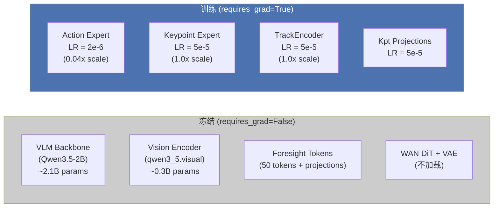
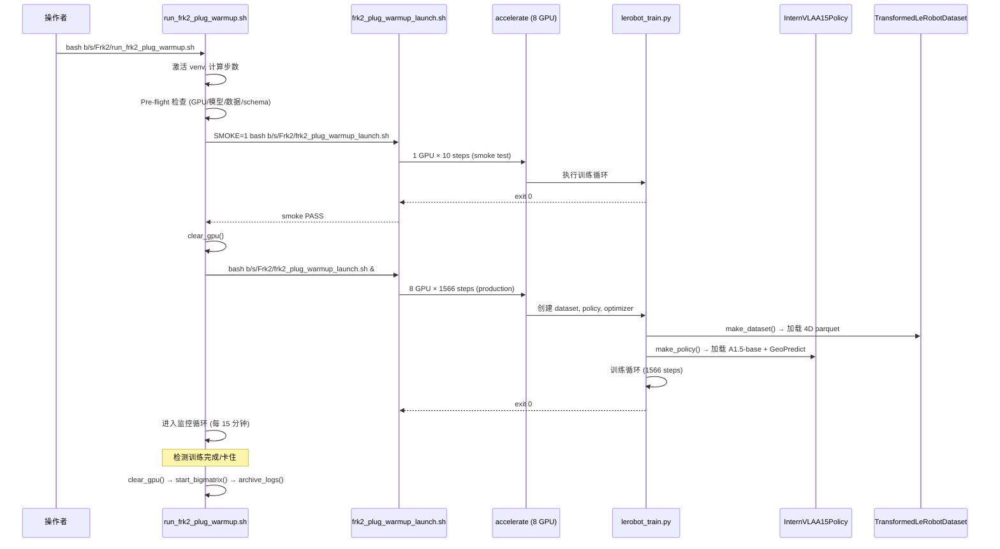
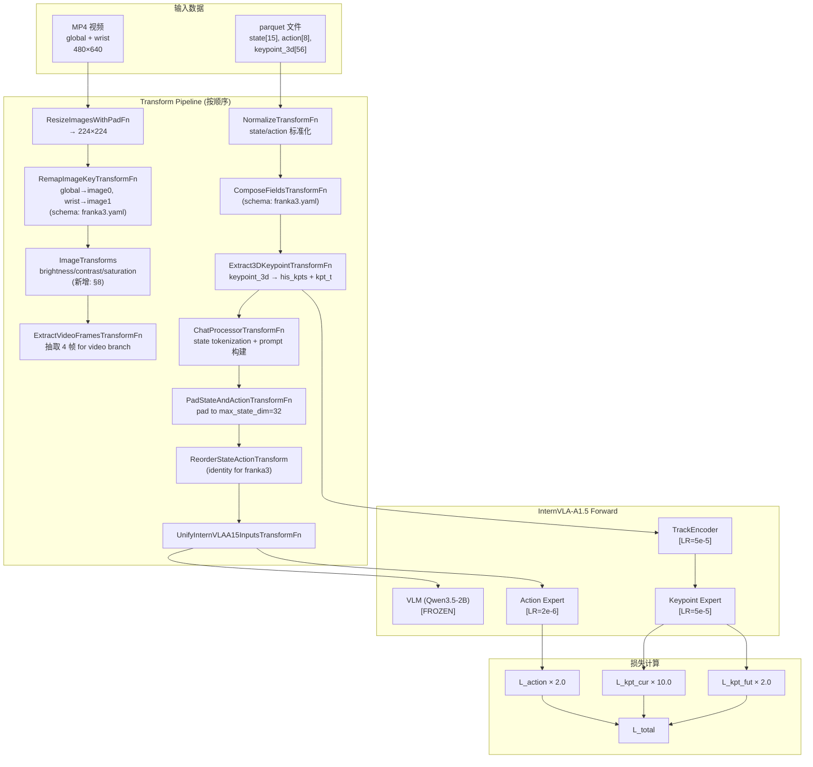
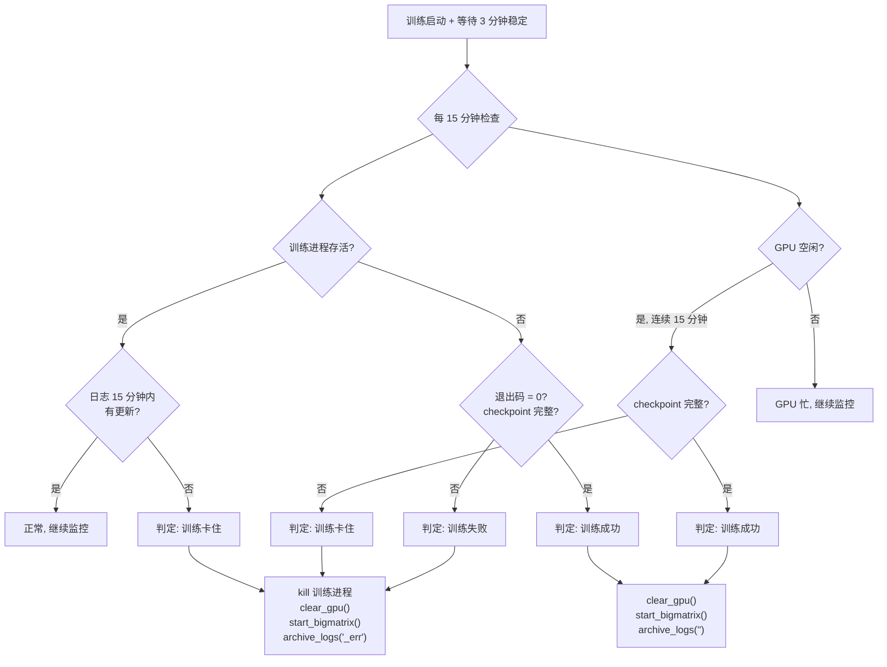

# Phase 1 Warmup 实施落地方案与操作手册 — Franka 第二版插插座 7D 关键点

> **实验名**: `itvlagpFrkPlug2_0918`  
> **数据集**: `~/b/Dta/plug_into_socket_franka3_15hz_lerobot_4d/` (100 episodes, 33308 frames, 15 Hz)  
> **数据集 repo_id**: `plug_into_socket_franka3_15hz_lerobot_4d`  
> **代码仓库根目录**: 由脚本自动推导 (`PROJ_ROOT`)  
> **Python 环境**: `VENV_ROOT` (默认 `/B/VENV/itnvla15rbt20`)  
> **参考文档**:  
> - 数据集分析: [ds2_analyz.md](ds2_analyz.md)  
> - 3D/4D 关键点生成方案: [3d4d_gen_1.md](3d4d_gen_1.md)  
> - 生成执行日志: [3d4d_gen_1_0918LOG.md](3d4d_gen_1_0918LOG.md)  
> - 旧版 Franka warmup 方案: `b/d/Frk/plug_p1warmup.md` (版本 v1, itvlagpFrkPlug0907)  
> - 旧版 warmup 执行日志: `b/d/Frk/plug_p1warmup_0907LOG.md`  
> - 训练优化策略: `b/d/p/itvla_trn_strategy.markdown` (§6.6 图像增强, §8.2 Route B)  
> **版本**: v1 · 2026-09-20

---

## 目录

1. [概述与目标](#1-概述与目标)
2. [可配置变量总表](#2-可配置变量总表)
3. [服务器软硬件环境分析](#3-服务器软硬件环境分析)
4. [数据集深入分析](#4-数据集深入分析)
5. [训练步数与 Checkpoint 计算](#5-训练步数与-checkpoint-计算)
6. [生效超参详解](#6-生效超参详解)
7. [模块冻结与学习率策略](#7-模块冻结与学习率策略)
8. [数据增强配置](#8-数据增强配置)
9. [数据流与脚本调用链](#9-数据流与脚本调用链)
10. [文件增删改清单](#10-文件增删改清单)
11. [操作手册 — 飞行前检查](#11-操作手册--飞行前检查)
12. [操作手册 — 冒烟测试](#12-操作手册--冒烟测试)
13. [操作手册 — 生产训练与监控](#13-操作手册--生产训练与监控)
14. [测试与验收](#14-测试与验收)
15. [故障排查](#15-故障排查)
- [附录 A: 启动脚本 frk2_plug_warmup_launch.sh](#附录-a-启动脚本)
- [附录 B: 编排监控脚本 run_frk2_plug_warmup.sh](#附录-b-编排监控脚本)

---

## 1. 概述与目标

### 1.1 什么是 Phase 1 Warmup

Phase 1 Warmup 是 InternVLA-A1.5 GeoPredict 关键点预测器的 **结构初始化训练**. 其核心目的是:

1. 将 GeoPredict TrackEncoder 从 RoboCasa 3D 预训练权重适配到 Franka 7D (pos+rot) 关键点空间
2. 让 keypoint expert (初始化自 action expert 权重) 学会预测 Franka 关键点的当前帧和未来轨迹
3. Action expert 以极低学习率 (0.04x) 微调, 保持从 base checkpoint 继承的动作生成能力

**Warmup 不是最终微调**. 它的产出 checkpoint 将作为后续 Phase 2 SFT (全参微调) 的初始化基础.

(出处: `b/d/p/itvla_trn_strategy.markdown` §8.2 Route B-B1)

### 1.2 本方案与旧方案的关键差异

本方案 (EXPR_NAME=`itvlagpFrkPlug2_0918`) 基于 **第二版 Franka 插插座数据集**, 与旧方案 (EXPR_NAME=`itvlagpFrkPlug0907`, 文档 `b/d/Frk/plug_p1warmup.md`) 相比有以下关键差异:

| 项目 | 旧方案 (0907) | 本方案 (0918) | 影响 |
|---|---|---|---|
| 数据集帧率 | 30 Hz | **15 Hz** | 步数减半, `keypoint_history_max_len=200` 覆盖 13.3s (非 6.67s) |
| 总帧数 | 66,577 | **33,308** | 步数更少 (1566 vs 3120), 训练更快 |
| 列格式 | 拆分列 (`observation.state.arm` + `.gripper`) | **统一列** (`observation.state` 15D) | 需要新 schema YAML |
| 数据集 robot_type | `franka_plug` | **`franka3`** | 需要 `franka3.yaml` schema 配置 |
| EE 四元数约定 | wxyz (info.json 声称) | **xyzw** (实测, 详见 3d4d_gen_1_0918LOG.md E3) | 不影响 FK 关键点 (仅用关节角), 但影响 EE 位姿解读 |
| 夹爪极性 | 1.0=闭合 | **0.01≈闭合, 1.0=全开** | 不影响 warmup (warmup 不控制夹爪), 但影响推理 |
| 数据增强 | **未开启** | **开启 brightness/contrast/saturation** | 按训练策略 §6.6 P1 建议 |
| 外部 stats | `use_external_stats=true` | **`use_external_stats=false`** | 使用数据集内置 `episodes_stats.jsonl` |

### 1.3 兼容性声明

本方案 **不修改任何现有源代码文件**, 仅新增以下文件:

- `b/s/Frk2/frk2_plug_warmup_launch.sh` (新启动脚本, 基于旧 `launch/frk_plug_warmup_launch.sh` 适配)
- `b/s/Frk2/run_frk2_plug_warmup.sh` (新编排监控脚本, 基于旧 `b/s/Frk/run_frk_plug_warmup.sh` 适配)
- `b/s/Frk2/cfg/franka3.yaml` (新 schema 配置, 参考旧 `b/s/Frk/cfg/franka_plug.yaml` 格式)
- `src/lerobot/dataset_schemas/configs/franka3.yaml` (symlink → `b/s/Frk2/cfg/franka3.yaml`)

所有新增脚本集中在 `b/s/Frk2/` 目录下, 与同目录的关键点生成 (`generate_franka2_keypoints.py`)、验证 (`verify_franka2_keypoints.py`)、FK 计算 (`fk_keypoints_v2.py`) 等脚本组织在一起, 构成完整的 Franka v2 工具链.

**复用关系**: 新脚本复用旧脚本的环境设置 (NCCL fix、LD_LIBRARY_PATH、accelerate 调用方式)、监控逻辑 (bigmatrix、archive_logs、check_ckpt_complete)、pre-flight 检查结构. 训练管线代码 (`lerobot_train.py`、`InternVLAA15Policy`、Transform 链、`SchemaRegistry`) 均不修改, 仅通过 CLI 参数和新 schema YAML 配置差异化行为.

因此与现有的 RoboTwin 2.0 SFT 训练、R1Pro SFT 训练、以及旧版 Franka warmup 功能完全兼容, 不存在破坏风险.

---

## 2. 可配置变量总表

### 2.1 用户提供信息

执行前用户需确认以下信息:

| 变量 | 含义 | 当前值 |
|---|---|---|
| `EXPR_NAME` | 实验名, 隔离所有路径 | `itvlagpFrkPlug2_0918` |
| `VENV_ROOT` | Python 虚拟环境根目录 | `/B/VENV/itnvla15rbt20` |
| `DATA_SRC` | 4D 数据集绝对路径 | `~/b/Dta/plug_into_socket_franka3_15hz_lerobot_4d` |
| `PROC_PER_NODE` | 使用 GPU 数量 | `8` |
| `BATCH_SIZE` | 每 GPU batch size | `16` |
| `NUM_EPOCHS` | 训练轮数 | `6` |
| `SAVE_EPOCH_INTERVAL` | 每 N 个 epoch 保存 checkpoint | `3` |

### 2.2 静态配置变量

以下变量在脚本中有默认值, 支持环境变量覆盖:

| 变量 | 默认值 | 说明 |
|---|---|---|
| `PROJ_ROOT` | 由脚本位置自动推导 | 代码仓库根目录 |
| `PYTHON` | `${VENV_ROOT}/bin/python` | Python 解释器路径 |
| `HF_HOME` | `/B/VENV/hf_home` | HuggingFace 缓存根目录 |
| `HF_LEROBOT_HOME` | `${HF_HOME}/lerobot` | LeRobot 数据集根目录 |
| `DATA_REPO_ID` | `plug_into_socket_franka3_15hz_lerobot_4d` | 数据集 repo 名称 |
| `PRETRAINED_PATH` | `${HF_HOME}/ckpts/InternVLA-A1.5-base` | 预训练模型路径 |
| `GEOPREDICT_CKPT` | `${HF_HOME}/ckpts/GeoPredict_robocasa.pth` | GeoPredict 预训练权重 |
| `CKPT_ROOT` | `~/b/Ckp/${EXPR_NAME}` | Checkpoint 保存根目录 |
| `LOG_ROOT` | `/B/Log/${EXPR_NAME}` | 训练日志/wandb 根目录 |
| `BACKUP_ROOT` | `~/b/Ckp` | 日志归档目标目录 |
| `MONITOR_INTERVAL` | `900` (秒 = 15 分钟) | 监控检查间隔 |
| `BIGMATRIX_SCRIPT` | `${PROJ_ROOT}/b/d/GpRbt/bigmatrix_multiply_optimization.py` | GPU 占位脚本 |

### 2.3 动态计算变量

以下变量在运行时从 `info.json` 和上述配置自动计算:

| 变量 | 公式 | 当前值 |
|---|---|---|
| `TOTAL_FRAMES` | `info.json["total_frames"]` | 33,308 |
| `EBS` | `PROC_PER_NODE × BATCH_SIZE × NODE_COUNT` | 8 × 16 × 1 = **128** |
| `STEPS_PER_EPOCH` | `⌈TOTAL_FRAMES / EBS⌉` | ⌈33308/128⌉ = **261** |
| `TOTAL_STEPS` | `STEPS_PER_EPOCH × NUM_EPOCHS` | 261 × 6 = **1566** |
| `SAVE_FREQ` | `STEPS_PER_EPOCH × SAVE_EPOCH_INTERVAL` | 261 × 3 = **783** |
| `SCHED_WARMUP_STEPS` | `STEPS_PER_EPOCH` (1 epoch warmup) | **261** |
| `SCHED_DECAY_STEPS` | `TOTAL_STEPS` | **1566** |
| `JOB_STAMP` | `$(date +'%Y_%m_%d_%H_%M_%S')` | 运行时生成 |

---

## 3. 服务器软硬件环境分析

### 3.1 硬件配置

| 组件 | 规格 |
|---|---|
| **GPU** | 8 × NVIDIA H200 (140 GB HBM3e / 卡) |
| **GPU 总显存** | ~1.12 TB |
| **GPU 互连** | NVLink 18 全网格拓扑 (GPU 0-3 NUMA0, GPU 4-7 NUMA1) |
| **CPU** | 2 × Intel Xeon Platinum 8581C @ 2.10 GHz (Emerald Rapids) |
| **CPU 线程** | 224 逻辑核 (2 × 56 核 × 2 线程) |
| **内存** | 2.8 TiB DDR5 |
| **磁盘** | 12 TB overlay (已用 ~292 GB, 可用 ~11 TB) |
| **网络** | 8 × NIC (InfiniBand/RoCE) |
| **虚拟化** | KVM 云实例 |

**训练瓶颈分析**: 8 × H200 + NVLink 18 的 all-reduce 带宽远超 3B 模型的梯度同步需求. 瓶颈在视频解码 (CPU) 和数据加载 (I/O). 但本数据集仅 204 MB, 完全装入内存, I/O 不构成瓶颈.

### 3.2 软件环境

| 组件 | 版本 |
|---|---|
| NVIDIA Driver | 580.159.04 |
| CUDA (Driver) | 13.0 |
| CUDA (PyTorch) | 12.8 (cu128) |
| Python | 3.11.9 |
| PyTorch | 2.10.0+cu128 |
| TorchVision | 0.25.0+cu128 |
| Transformers | 5.2.0 |
| Accelerate | 1.14.0 |
| flash-attn | 2.8.3 |
| flash-linear-attention | 0.5.0 |
| causal-conv1d | 1.6.1 |
| WandB | 0.30.0 |
| cuDNN | 9.1.002 |

### 3.3 已知环境问题及修复

以下问题已在旧方案 (`b/d/Frk/plug_p1warmup_0907LOG.md`) 中发现并修复, 本方案继承这些修复:

| 问题 | 原因 | 修复 | 在哪里生效 |
|---|---|---|---|
| `ncclInternalError` at init | GCP NCCL tuner plugin 无配置文件 | `export NCCL_TUNER_PLUGIN=/dev/null` | 启动脚本环境变量 |
| torchcodec 找不到 libnpp | NVIDIA NPP 不在默认 `LD_LIBRARY_PATH` | 在 `LD_LIBRARY_PATH` 中添加 nvidia npp 路径 | 启动脚本环境变量 |
| `accelerate` CLI 不在 PATH | venv bin 目录未正确配置 | 使用 `${PYTHON} -m accelerate.commands.launch` 调用 | 启动脚本 |

---

## 4. 数据集深入分析

(详见 [ds2_analyz.md](ds2_analyz.md) 的完整分析)

### 4.1 基本信息

| 项目 | 值 |
|---|---|
| 路径 | `~/b/Dta/plug_into_socket_franka3_15hz_lerobot_4d/` |
| 大小 | 204 MB |
| Episode 数 | 100 |
| 总帧数 | 33,308 |
| 帧率 | 15 Hz |
| 平均 Episode 长度 | 333.1 帧 (22.2 秒) |
| 机器人 | Franka Emika Research 3 (FR3 v2.1) |
| robot_type (info.json) | `franka3` |
| 任务 | `plug into socket` (插插座) |
| 视频 | 2 路: `global` (640×480) + `wrist` (640×480), H.264, 15fps |
| LeRobot 版本 | v2.1 |

### 4.2 特征结构

| 特征列 | 维度 | 类型 | 训练中使用 |
|---|---|---|---|
| `observation.state` | 15 | float32 | ✅ 关节角[0:7]用于 state tokenization, [0:7]被 FK 提取关键点 |
| `observation.keypoint_3d` | 56 | float32 | ✅ 8 关键点 × 7D (pos+quat), 已归一化 |
| `action` | 8 | float32 | ✅ 7 关节目标 + 1 夹爪, 绝对关节位置命令 |
| `observation.images.global` | 480×640×3 | video | ✅ VLM 视觉输入 |
| `observation.images.wrist` | 480×640×3 | video | ✅ VLM 视觉输入 |
| `observation.force` | 24 | float32 | ❌ 当前 InternVLA-A1.5 不支持力输入 |
| `observation.wrench` | 6 | float32 | ❌ 当前 InternVLA-A1.5 不支持力输入 |

### 4.3 `observation.state` 15D 布局

| 维度 | 名称 | 含义 | 训练中的用途 |
|:---:|---|---|---|
| 0–6 | `joint_0` ~ `joint_6` | 7 关节角度 (rad) | FK 关键点计算, state tokenization |
| 7 | `gripper_width` | 夹爪宽度 (0.01≈闭合, 1.0=全开) | state tokenization |
| 8–10 | `ee_pos_{x,y,z}` | EE 位置 (m) | state tokenization |
| 11–14 | `ee_quat_{w,x,y,z}` | EE 四元数 (**注意**: 实际存储为 xyzw 而非 wxyz, 详见 [3d4d_gen_1_0918LOG.md](3d4d_gen_1_0918LOG.md) E3) | state tokenization |

### 4.4 `observation.keypoint_3d` 56D 布局

8 个关键点 (link1..link7 + hand_tcp), 每个 7D: `[px, py, pz, qx, qy, qz, qw]`

- 位置: 已除以 $R_{\text{pad}} = 0.836100$ m 归一化到 $[-1, 1]$
- 四元数: 单位四元数, 半球归一化 ($q_w \geq 0$)
- R_pad 和 FK 交叉验证结果记录在 `meta/keypoints_meta.json`
- 训推一致性约束记录在 `meta/train_inference_contract.json`

(出处: [3d4d_gen_1.md](3d4d_gen_1.md) §4, [3d4d_gen_1_0918LOG.md](3d4d_gen_1_0918LOG.md))

### 4.5 action mode

本数据集为 **绝对关节位置命令** (`action_mode=abs`):

$$|\text{action}(t)_{0:7} - \text{state}(t+1)_{0:7}| \approx 0.028 \text{ rad (tracking error)}$$

(出处: [ds2_analyz.md](ds2_analyz.md) §2.2)

---

## 5. 训练步数与 Checkpoint 计算

### 5.1 有效批大小

$$\text{EBS} = \underbrace{8}_{\text{GPU数}} \times \underbrace{16}_{\text{每GPU batch}} \times \underbrace{1}_{\text{梯度累积}} \times \underbrace{1}_{\text{节点数}} = 128$$

### 5.2 每 Epoch 步数

$$\text{steps\_per\_epoch} = \lceil 33308 / 128 \rceil = \lceil 260.22 \rceil = 261$$

### 5.3 总步数

$$\text{total\_steps} = 261 \times 6 = 1566$$

### 5.4 Checkpoint 保存计划

**规则**: 每 3 个 epoch 保存一次 + 最后一步保存一次.

$$\text{save\_freq} = 261 \times 3 = 783$$

| Checkpoint | 步数 | Epoch | 说明 |
|:---:|:---:|:---:|---|
| 1 | 783 | 3 | 中间 checkpoint (epoch 3 结束) |
| 2 | 1566 | 6 | 最终 checkpoint (epoch 6 结束, 也是最后一步) |

**注**: 训练脚本的保存条件为 `step % save_freq == 0 or step == total_steps`. 由于 $1566 = 783 \times 2$, 两个条件恰好都命中步骤 1566, 所以刚好保存 2 个 checkpoint.

### 5.5 Checkpoint 路径

```
~/b/Ckp/itvlagpFrkPlug2_0918/
  <JOB_STAMP>-internvla_a1_5-frk2-plug-warmup/
    checkpoints/
      000783/pretrained_model/   ← epoch 3 中间 checkpoint
        config.json
        model.safetensors
        stats.json
        train_config.json
      001566/pretrained_model/   ← epoch 6 最终 checkpoint
        config.json
        model.safetensors
        stats.json
        train_config.json
```

### 5.6 日志路径

```
/B/Log/itvlagpFrkPlug2_0918/
  <JOB_STAMP>/
    train.log                    ← 训练主日志
    wandb/                       ← WandB 离线日志
```

### 5.7 挂钟时间估算

旧方案在 8× H200 上 3126 步耗时约 30 分钟 (含数据加载和初始化), 约 2.0 iter/s.

本方案 1566 步, 数据量减半 (15 Hz vs 30 Hz) 但增加了图像增强开销. 保守估算:

$$\text{wall\_clock} \approx \frac{1566}{2.0} + 120 \text{ (初始化)} \approx 15 \text{ 分钟}$$

---

## 6. 生效超参详解

### 6.1 损失函数

Warmup 模式下总损失:

$$\mathcal{L}_{\text{total}} = \underbrace{2.0}_{\lambda_a} \cdot \mathcal{L}_{\text{action}} + \underbrace{10.0}_{\lambda_k} \cdot \mathcal{L}_{\text{kpt\_cur}} + \underbrace{2.0}_{\lambda_{kf}} \cdot \mathcal{L}_{\text{kpt\_fut}}$$

- $\mathcal{L}_{\text{action}}$: Flow matching action loss (预测 action chunk 与真值的匹配)
- $\mathcal{L}_{\text{kpt\_cur}}$: 当前帧关键点预测 MSE
- $\mathcal{L}_{\text{kpt\_fut}}$: 未来帧关键点轨迹预测 MSE

**不包含的损失** (warmup 模式下关闭):
- VQA loss (`enable_vqa_loss=false`)
- Video foresight loss (`action_loss_only=true`, WAN 模型不加载)
- FAST action token loss (`use_fast_action_tokens=false`)

### 6.2 完整超参表

| 超参 | 生效值 | 定义位置 | 含义 | 为何设此值 |
|---|---|---|---|---|
| **模型与推理** | | | | |
| `policy.type` | `internvla_a1_5` | 启动脚本 CLI | 策略类型 | 使用 InternVLA-A1.5 策略 |
| `policy.pretrained_path` | `${HF_HOME}/ckpts/InternVLA-A1.5-base` | 启动脚本 CLI | 预训练权重路径 | 官方发布的 base checkpoint |
| `policy.vlm_model_name_or_path` | `Qwen/Qwen3.5-2B` | 启动脚本 CLI | VLM 主干 | 必须与 pretrained_path 匹配 |
| `policy.dtype` | `bfloat16` | 启动脚本 CLI | 训练精度 | H200 原生支持 BF16, 兼顾精度和速度 |
| `policy.chunk_size` | `50` | `configuration_internvla_a1_5.py` L88 默认值 | 动作 chunk 长度 | 覆盖 50/15=3.3 秒的预测窗口 |
| `policy.n_action_steps` | `50` | `configuration_internvla_a1_5.py` L89 默认值 | 动作步数 | 与 chunk_size 一致 |
| **关键点** | | | | |
| `policy.enable_keypoint_predictor` | `true` | 启动脚本 CLI | 开启 GeoPredict | Warmup 核心功能 |
| `policy.num_keypoint_joints` | `8` | 启动脚本 CLI | 关键点数量 | Franka 8 个 link 关键点 |
| `policy.kpt_4d_mode` | `pos_rot` | 启动脚本 CLI | 关键点维度模式 | 7D=3D 位置+4D 四元数, 提供旋转信息 |
| `policy.kpt_rot_loss_weight` | `1.0` | 启动脚本 CLI | 四元数 loss 权重 | 位置和旋转等权 |
| `policy.keypoint_history_max_len` | `200` | 启动脚本 CLI | 关键点历史最大长度 | 15Hz 下覆盖 13.3 秒 |
| `policy.init_kpt_expert_from_action` | `true` | 启动脚本 CLI | 从 action expert 初始化 kpt expert | 继承已训练的 Transformer 结构 |
| `policy.geopredict_checkpoint_path` | `${GEOPREDICT_CKPT}` | 启动脚本 CLI | GeoPredict 预训练权重 | RoboCasa 预训练 TrackEncoder |
| `policy.freeze_keypoint_modules` | `false` | 启动脚本 CLI | 不冻结关键点模块 | Warmup 需要训练 kpt 相关模块 |
| `policy.kpt_to_action_detach` | `false` | 启动脚本 CLI | kpt→action 不 detach | 允许 action loss 梯度流过关键点表示 |
| **损失权重** | | | | |
| `policy.action_loss_weight` | `2.0` | 启动脚本 CLI | Action loss 系数 | Warmup 阶段 action 非主角, 较低权重 |
| `policy.kpt_loss_weight` | `10.0` | 启动脚本 CLI | 当前帧 kpt loss 系数 | Warmup 主目标: 学好当前关键点 |
| `policy.kpt_future_loss_weight` | `2.0` | 启动脚本 CLI | 未来帧 kpt loss 系数 | 未来预测次要于当前预测 |
| **冻结控制** | | | | |
| `policy.train_expert_only` | `true` | 启动脚本 CLI | 冻结 VLM, 仅训练 expert | Warmup 不动 VLM 主干 |
| `policy.action_loss_only` | `true` | 启动脚本 CLI | 不加载 WAN 模型 | 减少显存占用, warmup 不需视频 loss |
| `policy.freeze_learnable_tokens` | `true` | 启动脚本 CLI | 冻结可学习前瞻 token | Warmup 不训练前瞻 token |
| `policy.knowledge_insulation` | `true` | 启动脚本 CLI | Action expert 不看 VLM 前缀 | 隔离 action expert 和冻结的 VLM |
| `policy.knowledge_insulation_kpt` | `true` | 启动脚本 CLI | Kpt expert 不看 VLM 前缀 | 隔离 kpt expert 和冻结的 VLM |
| `policy.enable_vqa_loss` | `false` | 启动脚本 CLI | 关闭语言 token loss | Warmup 不训练语言生成 |
| **学习率** | | | | |
| `policy.optimizer_lr` | `5e-5` | 启动脚本 CLI | 基础学习率 | 标准 warmup LR |
| `policy.action_expert_lr_scale` | `0.04` | 启动脚本 CLI | Action expert LR 缩放 | 有效 LR = 5e-5 × 0.04 = **2e-6** (微调) |
| `policy.kpt_expert_lr_scale` | `1.0` | 启动脚本 CLI | Kpt expert LR 缩放 | 有效 LR = 5e-5 × 1.0 = **5e-5** (全速) |
| `policy.track_encoder_lr_scale` | `1.0` | 启动脚本 CLI | TrackEncoder LR 缩放 | 有效 LR = 5e-5 × 1.0 = **5e-5** (全速) |
| `policy.scheduler_warmup_steps` | `261` | 启动脚本 CLI (动态) | LR warmup 步数 | 1 epoch warmup |
| `policy.scheduler_decay_steps` | `1566` | 启动脚本 CLI (动态) | LR decay 步数 | 全程余弦衰减 |
| `policy.scheduler_decay_lr` | `5e-6` | 启动脚本 CLI | 衰减终止 LR | 最终 LR = base LR 的 10% |
| **优化器** | | | | |
| `optimizer_betas` | `(0.9, 0.95)` | `configuration_internvla_a1_5.py` L125 | AdamW β1, β2 | 标准 LLM 训练配置 |
| `optimizer_eps` | `1e-8` | `configuration_internvla_a1_5.py` L126 | AdamW ε | 标准值 |
| `optimizer_weight_decay` | `0.01` | `configuration_internvla_a1_5.py` L127 | 权重衰减 | 标准 L2 正则化 |
| `optimizer_grad_clip_norm` | `1.0` | `configuration_internvla_a1_5.py` L128 | 梯度裁剪范数 | 防止梯度爆炸 |
| **数据集** | | | | |
| `dataset.type` | `internvla_a1_5` | 启动脚本 CLI | 数据集配置类型 | 使用 InternVLA-A1.5 数据处理管线 |
| `dataset.repo_id` | `plug_into_socket_franka3_15hz_lerobot_4d` | 启动脚本 CLI | 数据集名称 | 第二版 Franka 4D 数据集 |
| `dataset.action_mode` | `abs` | 启动脚本 CLI | 动作模式 | 数据集为绝对关节位置命令 |
| `dataset.tokenize_state` | `true` | 启动脚本 CLI | 将 state 编码到 prompt | 提供显式的机器人状态信息 |
| `dataset.use_fast_action_tokens` | `false` | 启动脚本 CLI | 不使用 FAST token | Warmup 仅关注 flow matching + kpt |
| `dataset.use_external_stats` | `false` | 启动脚本 CLI | 使用数据集内置统计量 | 新数据集无外部 stats 文件 |
| `dataset.enable_keypoint_predictor` | `true` | 启动脚本 CLI | 数据集侧开启关键点 | 必须与 policy 侧一致 |
| `dataset.num_keypoint_joints` | `8` | 启动脚本 CLI | 数据集侧关键点数 | 必须与 policy 侧一致 |
| `dataset.kpt_4d_mode` | `pos_rot` | 启动脚本 CLI | 数据集侧 kpt 模式 | 必须与 policy 侧一致 |
| `dataset.keypoint_history_max_len` | `200` | 启动脚本 CLI | 数据集侧历史长度 | **必须与 policy 侧一致** (旧方案 E2 教训) |
| `dataset.image_transforms.enable` | `true` | 启动脚本 CLI | 开启图像增强 | 训练策略 §6.6 P1 建议 |
| **训练控制** | | | | |
| `seed` | `42` | 启动脚本 CLI | 随机种子 | 可复现 |
| `batch_size` | `16` | 启动脚本 CLI | 每 GPU batch size | 经验最优 (H200 显存充裕) |
| `steps` | `1566` | 启动脚本 CLI (动态) | 总训练步数 | 6 epochs |
| `save_freq` | `783` | 启动脚本 CLI (动态) | 保存间隔 | 3 epochs |
| `log_freq` | `50` | 启动脚本 CLI | 日志频率 | 每 50 步记录一次 loss |
| `num_workers` | `12` | 启动脚本 CLI | DataLoader 工作线程 | 充分利用 224 CPU 核 |
| **WandB** | | | | |
| `wandb.enable` | `true` (生产) / `false` (smoke) | 启动脚本 CLI | WandB 开关 | 生产训练开启记录 |
| `wandb.mode` | `offline` | 启动脚本 CLI | WandB 模式 | 离线记录, 不需网络 |

### 6.3 损失权重灵敏度说明

| 参数 | 增大效果 | 减小效果 |
|---|---|---|
| `action_loss_weight` (当前 2.0) | action expert 学得更快, 但可能干扰 kpt 学习 | kpt 有更多优化空间, action 学得慢 |
| `kpt_loss_weight` (当前 10.0) | 当前帧 kpt 更精确, warmup 收敛更快 | kpt 精度降低 |
| `kpt_future_loss_weight` (当前 2.0) | 未来轨迹预测更好, 但 warmup 阶段可能不稳 | warmup 阶段更稳定 |

当前设置遵循旧方案经验: kpt=10 >> action=2 ≥ kpt_future=2, 使 warmup 集中于学好当前帧关键点.

---

## 7. 模块冻结与学习率策略

### 7.1 冻结/训练矩阵



**冻结逻辑** (定义于 `src/lerobot/policies/internvla_a1_5/modeling_internvla_a1_5.py` 的 `set_requires_grad()` 方法):

| 配置标志 | 冻结的模块 | 备注 |
|---|---|---|
| `train_expert_only=true` | 整个 `qwen3_5` (含 VLM backbone + vision encoder) | 设为 eval 模式 |
| `freeze_learnable_tokens=true` | `learnable_tokens`, `learnable_tokens_in_proj`, `learnable_to_wan_proj` | — |
| `action_loss_only=true` | WAN DiT + VAE **不加载** | 节省约 5B 参数的显存 |
| `freeze_keypoint_modules=false` | (不冻结 kpt 模块) | Warmup 需要训练它们 |

**参数量估算** (来自旧方案执行日志 `b/d/Frk/plug_p1warmup_0907LOG.md`):

| 类别 | 参数量 |
|---|---|
| 总参数 | ~3B |
| 可训练参数 | ~927M (action expert + kpt expert + TrackEncoder + projections) |
| 冻结参数 | ~2.1B (VLM + vision encoder + foresight tokens) |
| WAN 参数 | 0 (不加载) |

### 7.2 学习率策略

**调度器**: `CosineDecayWithWarmupSchedulerConfig`

```
LR
 ↑
5e-5 │        ╭──────╮
     │      ╱          ╲
     │    ╱              ╲
     │  ╱                  ╲
5e-6 │╱                      ╲───────
     └───────────────────────────────→ steps
     0    261            1566
       warmup   cosine decay
      (1 epoch)  (全程)
```

**各模块有效学习率**:

| 模块 | 基础 LR × scale | 有效 LR | warmup 起始 | 衰减终止 |
|---|---|---|---|---|
| TrackEncoder | 5e-5 × 1.0 | **5e-5** | ~1.9e-7 | 5e-6 |
| Keypoint Expert | 5e-5 × 1.0 | **5e-5** | ~1.9e-7 | 5e-6 |
| Kpt Projections | 5e-5 × 1.0 | **5e-5** | ~1.9e-7 | 5e-6 |
| Action Expert | 5e-5 × 0.04 | **2e-6** | ~7.6e-9 | 2e-7 |

**LR scale 机制** (定义于 `configuration_internvla_a1_5.py` 的 `get_optim_params()` 方法):

当 `enable_keypoint_predictor=true` 且 LR scale 不全为 1.0 时, `get_optim_params()` 返回多个参数组:

```python
param_groups = [
    {"params": track_encoder_params, "lr": base_lr * track_encoder_lr_scale},
    {"params": kpt_expert_params, "lr": base_lr * kpt_expert_lr_scale},
    {"params": action_expert_params, "lr": base_lr * action_expert_lr_scale},
    {"params": vlm_params, "lr": base_lr * vlm_lr_scale},
    {"params": other_params, "lr": base_lr},
]
```

### 7.3 GeoPredict 权重加载

GeoPredict RoboCasa 预训练权重 (`GeoPredict_robocasa.pth`) 的 TrackEncoder 输入维度为 3 (仅 3D 位置). 但本方案使用 `kpt_4d_mode=pos_rot` 即 7D (3D 位置 + 4D 四元数), 导致 TrackEncoder 的 `point_patch_embed.conv` 层维度不匹配:

- 预训练: `Conv1d(in_channels=3, ...)`
- 目标: `Conv1d(in_channels=7, ...)`

**处理逻辑** (定义于 `src/lerobot/policies/internvla_a1_5/keypoints.py` 的 `geopredict_track_encoder_input_compatible()` 函数):

当检测到维度不兼容时, **整个 TrackEncoder 随机初始化**, 并打印 WARNING:

```
WARNING: GeoPredict TrackEncoder input dim incompatible (3 vs 7), random init
```

这是预期行为. Warmup 的目的正是从随机初始化训练 TrackEncoder 到适配 7D 关键点.

(出处: 旧方案执行日志 `b/d/Frk/plug_p1warmup_0907LOG.md` Error #1)

---

## 8. 数据增强配置

### 8.1 启用依据

按训练策略文档 (`b/d/p/itvla_trn_strategy.markdown`) §6.6 P1 的建议:

> 图像增强默认关闭 ... 开启同步 brightness/contrast/saturation

这三种颜色变换是最安全的增强手段:
- **不改变几何**: 不影响机器人位姿语义
- **不改变空间关系**: 不会破坏左右/上下方向
- **增加颜色鲁棒性**: 提高对光照变化的泛化能力

### 8.2 配置详情

以下通过启动脚本 CLI 传递给 `InternVLAA15DatasetConfig.image_transforms` (定义于 `src/lerobot/datasets/transforms.py` L166-215):

| 变换 | 权重 | 类型 | 参数范围 | 状态 |
|---|---|---|---|---|
| brightness | 1.0 (默认) | ColorJitter | (0.8, 1.2) | ✅ 启用 |
| contrast | 1.0 (默认) | ColorJitter | (0.8, 1.2) | ✅ 启用 |
| saturation | 1.0 (默认) | ColorJitter | (0.5, 1.5) | ✅ 启用 |
| hue | **0.0** | ColorJitter | (-0.05, 0.05) | ❌ 禁用 |
| sharpness | **0.0** | SharpnessJitter | (0.5, 1.5) | ❌ 禁用 |
| affine | **0.0** | RandomAffine | degrees=±5°, translate=5% | ❌ 禁用 |

**效果**: 每张图像最多同时应用 3 种变换 (brightness + contrast + saturation), 每种按均匀分布在参数范围内采样.

**启动脚本中的 CLI 参数**:

```bash
--dataset.image_transforms.enable=true
--dataset.image_transforms.max_num_transforms=3
--dataset.image_transforms.random_order=false
--dataset.image_transforms.tfs.hue.weight=0.0
--dataset.image_transforms.tfs.sharpness.weight=0.0
--dataset.image_transforms.tfs.affine.weight=0.0
```

### 8.3 已知局限

当前代码 (`src/lerobot/datasets/lerobot_dataset.py` L1072-1075) 对每个相机 **独立** 应用增强. 这意味着同一帧的 `global` 和 `wrist` 相机可能得到不同的颜色变换. 对于纯颜色变换, 这不会产生严重问题 (每个相机独立看到不同光照是合理的). 但如果未来启用 affine 几何变换, **必须** 保证跨相机同步.

(出处: `b/d/p/itvla_trn_strategy.markdown` §6.6, L1072-1075 的代码分析)

---

## 9. 数据流与脚本调用链

### 9.1 训练启动序列



### 9.2 数据流图



### 9.3 关键目录总览

| 目录 | 内容 | 生命周期 |
|---|---|---|
| `~/b/Dta/plug_into_socket_franka3_15hz_lerobot_4d/` | 源数据集 (含 4D 关键点) | 只读 |
| `/B/VENV/hf_home/lerobot/plug_into_socket_franka3_15hz_lerobot_4d` | 数据 symlink | 只读 |
| `/B/VENV/hf_home/ckpts/InternVLA-A1.5-base/` | 预训练模型权重 | 只读 |
| `/B/VENV/hf_home/ckpts/GeoPredict_robocasa.pth` | GeoPredict 预训练权重 | 只读 |
| `/B/Log/itvlagpFrkPlug2_0918/<JOB_STAMP>/` | 训练日志 + wandb | 训练时写入 |
| `~/b/Ckp/itvlagpFrkPlug2_0918/<JOB_NAME>/checkpoints/` | 模型 checkpoint | 训练时写入 |
| `~/b/Ckp/itvlagpFrkPlug2_0918_LOG_<TS>.tar` | 日志归档 | 训练后归档 |

### 9.4 复用的脚本/代码

| 文件 | 来源 | 复用方式 |
|---|---|---|
| `src/lerobot/scripts/lerobot_train.py` | 现有代码 | 训练入口, 不修改 |
| `src/lerobot/policies/internvla_a1_5/modeling_internvla_a1_5.py` | 现有代码 | 模型定义, 不修改. 7D kpt 支持已在 R1Pro Phase 2 开发时加入 |
| `src/lerobot/policies/internvla_a1_5/configuration_internvla_a1_5.py` | 现有代码 | 配置类, 不修改. 已有 `kpt_4d_mode`, `pos_rot` 支持 |
| `src/lerobot/policies/internvla_a1_5/transform_internvla_a1_5.py` | 现有代码 | Transform 管线, 不修改. 已有 `Extract3DKeypointTransformFn` |
| `src/lerobot/policies/internvla_a1_5/keypoints.py` | 现有代码 | 关键点加载/兼容性检查, 不修改. 已有 `geopredict_track_encoder_input_compatible()` |
| `src/lerobot/datasets/transforms.py` | 现有代码 | 图像增强配置类, 不修改. 通过 CLI 参数控制 |
| `src/lerobot/datasets/factory.py` | 现有代码 | 数据集工厂, 不修改 |
| `src/lerobot/dataset_schemas/registry.py` | 现有代码 | Schema 注册表, 不修改 |
| `b/d/GpRbt/bigmatrix_multiply_optimization.py` | 现有脚本 | GPU 占位, 不修改 |

---

## 10. 文件增删改清单

### 10.1 新增文件

| 文件 | 用途 | 内容概述 |
|---|---|---|
| `b/s/Frk2/frk2_plug_warmup_launch.sh` | Franka v2 warmup 启动脚本 | 基于旧 `launch/frk_plug_warmup_launch.sh` 适配: 更新 EXPR_NAME, 数据路径, 步数, 新增图像增强 CLI, `use_external_stats=false`. 复用旧脚本的环境设置、accelerate 调用方式和 post_check 逻辑 |
| `b/s/Frk2/run_frk2_plug_warmup.sh` | 编排监控脚本 | 基于旧 `b/s/Frk/run_frk_plug_warmup.sh` 适配: 更新变量, 调用同目录启动脚本, schema 检查改为 `franka3.yaml`. 复用旧脚本的监控循环、bigmatrix 占位、日志归档逻辑 |
| `b/s/Frk2/cfg/franka3.yaml` | 数据集 schema 配置 | 定义 `franka3` robot_type 的列映射和图像映射 |
| `src/lerobot/dataset_schemas/configs/franka3.yaml` | ← symlink | 相对路径 symlink 到 `../../../../b/s/Frk2/cfg/franka3.yaml` |

### 10.2 新增文件的详细内容

#### `b/s/Frk2/cfg/franka3.yaml`

此 schema 配置告诉训练管线如何处理 `robot_type: franka3` 的数据集. 由 `src/lerobot/dataset_schemas/registry.py` 的 `load_from_directory()` 自动加载.

```yaml
robot_type: franka3
action_mask_spec: [7, -1]
# [7, -1] 含义: 前 7 维 (arm joints) 在 delta 模式下做差分, 最后 1 维 (gripper) 保持绝对值
feature_mapping:
  observation.state:
    - observation.state
  action:
    - action
image_mapping:
  observation.images.global: observation.images.image0
  observation.images.wrist: observation.images.image1
```

**与旧 `franka_plug.yaml` 的区别**:

| 项目 | 旧 (`franka_plug`) | 新 (`franka3`) |
|---|---|---|
| robot_type | `franka_plug` | `franka3` |
| feature_mapping.observation.state | `[observation.state.arm, observation.state.gripper]` (拼接两列) | `[observation.state]` (直接使用统一列) |
| feature_mapping.action | `[action.arm, action.gripper]` (拼接两列) | `[action]` (直接使用统一列) |
| image_mapping | 相同 | 相同 |

**为什么不复用旧 schema**: 旧数据集的 `observation.state` 被拆分为 `observation.state.arm` (7D) 和 `observation.state.gripper` (1D) 两个子列. 新数据集采用统一的 `observation.state` (15D) 单列. 如果复用旧 schema, `ComposeFieldsTransform` 会去找不存在的 `observation.state.arm` 列而报错.

**两个 schema 共存**: `franka_plug.yaml` (旧数据集用) 和 `franka3.yaml` (新数据集用) 同时存在于 `dataset_schemas/configs/`, 各自注册不同的 `robot_type`, 互不干扰.

#### 启动脚本和编排监控脚本

完整代码见 [附录 A](#附录-a-启动脚本) 和 [附录 B](#附录-b-编排监控脚本). 与旧版的主要改动:

**`frk2_plug_warmup_launch.sh` 相对于 `frk_plug_warmup_launch.sh` 的改动**:

| 改动项 | 旧值 | 新值 | 原因 |
|---|---|---|---|
| `EXPR_NAME` | `itvlagpFrkPlug0907` | `itvlagpFrkPlug2_0918` | 新实验 |
| `DATA_SRC` | `/B/Dta/plug_into_socket_lrb_4D` | `${HOME}/b/Dta/plug_into_socket_franka3_15hz_lerobot_4d` | 新数据集路径 |
| `DATA_REPO_ID` | `plug_into_socket_lrb_4D` | `plug_into_socket_franka3_15hz_lerobot_4d` | 新 repo ID |
| `STEPS` (production) | `3120` | `1566` | 新步数 |
| `SAVE_FREQ` (production) | `1560` | `783` | 新保存频率 |
| `SCHED_WARMUP_STEPS` (production) | `520` | `261` | 新 warmup 步数 |
| `JOB_NAME` suffix | `frk-plug-warmup` | `frk2-plug-warmup` | 区分新旧 |
| `EXTERNAL_STATS_PATH` | `${DATA_SRC}/meta/stats/abs/stats.json` | (已删除) | 使用内置 stats |
| `--dataset.use_external_stats` | `true` | `false` | 使用内置 stats |
| `--dataset.external_stats_path` | 设置 | (已删除) | 不需要 |
| 新增图像增强 | 无 | 6 行 CLI args | 按 §6.6 建议开启 |
| schema 检查 | `franka_plug.yaml` | `franka3.yaml` | 新 schema |

**`run_frk2_plug_warmup.sh` 相对于 `run_frk_plug_warmup.sh` 的改动**:

| 改动项 | 旧值 | 新值 | 原因 |
|---|---|---|---|
| `EXPR_NAME` | `itvlagpFrkPlug0907` | `itvlagpFrkPlug2_0918` | 新实验 |
| `DATA_SRC` | `/B/Dta/plug_into_socket_lrb_4D` | `${HOME}/b/Dta/plug_into_socket_franka3_15hz_lerobot_4d` | 新数据集 |
| `DATA_REPO_ID` | `plug_into_socket_lrb_4D` | `plug_into_socket_franka3_15hz_lerobot_4d` | 新 repo ID |
| 启动脚本路径 | `launch/frk_plug_warmup_launch.sh` | `b/s/Frk2/frk2_plug_warmup_launch.sh` | 调用新脚本, 与其他 Frk2 脚本统一放在 `b/s/Frk2/` |
| schema 检查 | `franka_plug.yaml` | `franka3.yaml` | 新 schema |
| stats 检查 | `${DATA_SRC}/meta/stats/abs/stats.json` | (已删除) | 不需外部 stats |
| `JOB_NAME` suffix | `frk-plug-warmup` | `frk2-plug-warmup` | 区分新旧 |

### 10.3 未修改的文件

| 文件 | 原因 |
|---|---|
| `src/lerobot/policies/internvla_a1_5/configuration_internvla_a1_5.py` | 7D kpt 支持已存在 |
| `src/lerobot/policies/internvla_a1_5/modeling_internvla_a1_5.py` | 冻结逻辑已存在 |
| `src/lerobot/policies/internvla_a1_5/transform_internvla_a1_5.py` | Extract3DKeypointTransformFn 已存在 |
| `src/lerobot/policies/internvla_a1_5/keypoints.py` | 7D/3D 兼容性处理已存在 |
| `src/lerobot/datasets/transforms.py` | 图像增强通过 CLI 控制 |
| `src/lerobot/datasets/factory.py` | 数据集加载无需修改 |
| `src/lerobot/dataset_schemas/configs/franka_plug.yaml` | 旧 schema 保留给旧数据集 |
| `launch/frk_plug_warmup_launch.sh` | 旧启动脚本保留 |
| `b/s/Frk/run_frk_plug_warmup.sh` | 旧编排脚本保留 |

---

## 11. 操作手册 — 飞行前检查

> **前提**: 操作者已拥有 SSH 登录到训练服务器的权限, 并知道 Python 虚拟环境路径 (`VENV_ROOT`, 默认 `/B/VENV/itnvla15rbt20`).

### Step 0: 收集并确认信息

在开始前, 操作者需确认以下信息 (如与默认值不同, 需设置对应环境变量):

```bash
# 以下为默认值, 如需修改请设置环境变量
EXPR_NAME=itvlagpFrkPlug2_0918
VENV_ROOT=/B/VENV/itnvla15rbt20
DATA_SRC=~/b/Dta/plug_into_socket_franka3_15hz_lerobot_4d
PROC_PER_NODE=8
```

### Step 1: 激活虚拟环境

```bash
source /B/VENV/itnvla15rbt20/bin/activate
```

验证:

```bash
python -c "import torch, lerobot; print('torch', torch.__version__, 'cuda', torch.cuda.device_count())"
# 期望: torch 2.10.0+cu128 cuda 8
```

### Step 2: 验证 editable install 指向本代码库

```bash
cat /B/VENV/itnvla15rbt20/lib/python3.11/site-packages/__editable__.internvla_a1_5-0.1.0.pth
# 期望输出包含本代码库的 src/ 路径
```

### Step 3: 验证 7D kpt_4d_mode=pos_rot 支持

```bash
python -c "
from lerobot.policies.internvla_a1_5.configuration_internvla_a1_5 import InternVLAA15Config
cfg = InternVLAA15Config()
cfg.kpt_4d_mode = 'pos_rot'
print('kpt_4d_mode:', cfg.kpt_4d_mode)
print('OK: pos_rot supported')
"
```

### Step 4: 验证预训练模型权重

```bash
test -f /B/VENV/hf_home/ckpts/InternVLA-A1.5-base/config.json && echo "A1.5-base: OK"
test -f /B/VENV/hf_home/ckpts/GeoPredict_robocasa.pth && echo "GeoPredict: OK"
```

### Step 5: 部署 schema 配置

```bash
# 设置项目根目录
PROJ_ROOT=$(cd "$(dirname "$(readlink -f "$0")")" 2>/dev/null && pwd)
# 如果上面不工作, 手动设置:
# PROJ_ROOT=/B/SRC/itvlaGpLibPlus

# 创建 franka3.yaml schema (如果不存在)
mkdir -p "${PROJ_ROOT}/b/s/Frk2/cfg"
cat > "${PROJ_ROOT}/b/s/Frk2/cfg/franka3.yaml" << 'EOF'
robot_type: franka3
action_mask_spec: [7, -1]
feature_mapping:
  observation.state:
    - observation.state
  action:
    - action
image_mapping:
  observation.images.global: observation.images.image0
  observation.images.wrist: observation.images.image1
EOF

# 创建 symlink
ln -sfn ../../../../b/s/Frk2/cfg/franka3.yaml \
  "${PROJ_ROOT}/src/lerobot/dataset_schemas/configs/franka3.yaml"

# 验证
ls -la "${PROJ_ROOT}/src/lerobot/dataset_schemas/configs/franka3.yaml"
cat "${PROJ_ROOT}/src/lerobot/dataset_schemas/configs/franka3.yaml"
# 期望: 显示 franka3.yaml 的内容
```

### Step 6: 创建数据集 symlink

```bash
HF_LEROBOT_HOME=/B/VENV/hf_home/lerobot
DATA_SRC=~/b/Dta/plug_into_socket_franka3_15hz_lerobot_4d
DATA_REPO_ID=plug_into_socket_franka3_15hz_lerobot_4d

# 创建 symlink
ln -sfn "${DATA_SRC}" "${HF_LEROBOT_HOME}/${DATA_REPO_ID}"

# 验证
test -f "${HF_LEROBOT_HOME}/${DATA_REPO_ID}/meta/info.json" && echo "data symlink: OK"
```

### Step 7: 验证数据集完整性

```bash
python -c "
import json
info = json.load(open('${HF_LEROBOT_HOME}/${DATA_REPO_ID}/meta/info.json'))
assert info['total_frames'] == 33308, f'frames: {info[\"total_frames\"]}'
assert info['fps'] == 15, f'fps: {info[\"fps\"]}'
assert info['robot_type'] == 'franka3', f'robot_type: {info[\"robot_type\"]}'
assert 'observation.keypoint_3d' in info['features'], 'keypoint_3d missing'
kpt_dim = info['features']['observation.keypoint_3d']['shape'][0]
assert kpt_dim == 56, f'kpt dim: {kpt_dim}'
print(f'Dataset OK: {info[\"total_frames\"]} frames, {info[\"fps\"]} Hz, robot_type={info[\"robot_type\"]}')
print(f'Keypoint: {kpt_dim}D (8 x 7D)')
"
```

### Step 8: 验证 episodes_stats.jsonl 存在

```bash
test -f "${HF_LEROBOT_HOME}/${DATA_REPO_ID}/meta/episodes_stats.jsonl" && echo "episodes_stats: OK"

# 验证含有 observation.state 和 action 统计
python -c "
import json
with open('${HF_LEROBOT_HOME}/${DATA_REPO_ID}/meta/episodes_stats.jsonl') as f:
    first_line = json.loads(f.readline())
keys = list(first_line.keys())
assert 'observation.state' in keys, f'Missing observation.state, keys: {keys}'
assert 'action' in keys, f'Missing action, keys: {keys}'
print(f'Stats keys: {keys}')
print('episodes_stats: OK')
"
```

### Step 9: 检查 GPU 可用性

```bash
nvidia-smi --query-gpu=index,name,memory.used --format=csv
# 期望: 8 个 H200, 显存使用接近 0
```

### Step 10: 部署启动脚本和编排脚本

```bash
PROJ_ROOT=/B/SRC/itvlaGpLibPlus  # 按实际路径设置

# 验证脚本存在且可执行
test -f "${PROJ_ROOT}/b/s/Frk2/frk2_plug_warmup_launch.sh" && echo "launch script: OK"
test -f "${PROJ_ROOT}/b/s/Frk2/run_frk2_plug_warmup.sh" && echo "wrapper script: OK"

# 如果脚本不可执行, 添加执行权限
chmod +x "${PROJ_ROOT}/b/s/Frk2/frk2_plug_warmup_launch.sh"
chmod +x "${PROJ_ROOT}/b/s/Frk2/run_frk2_plug_warmup.sh"
```

### Step 10b: 一站式预检验证

```bash
python -c "
import torch
assert torch.cuda.device_count() >= 8, f'Need 8 GPUs, got {torch.cuda.device_count()}'
import lerobot
from lerobot.dataset_schemas import get_schema
schema = get_schema('franka3')
print(f'Schema: robot_type={schema.robot_type}')
print(f'  feature_mapping: {schema.feature_mapping}')
print(f'  image_mapping: {schema.image_mapping}')
print('All pre-flight checks PASS')
"
```

---

## 12. 操作手册 — 冒烟测试

### Step 11: 运行 Smoke Test

Smoke test 在 **1 个 GPU** 上跑 **10 步**, 验证整个训练管线能跑通:

```bash
cd /B/SRC/itvlaGpLibPlus  # 进入项目根目录
source /B/VENV/itnvla15rbt20/bin/activate
SMOKE=1 bash b/s/Frk2/frk2_plug_warmup_launch.sh
```

**期望输出** (关键行):

```
=== Phase 1 Warmup: Franka v2 plug_into_socket 7D (kpt_4d_mode=pos_rot) ===
SMOKE=1 PROC=1 BS=2 STEPS=10 SAVE_FREQ=10
...
step:     1/10  loss: 0.xxxx  loss_action: 0.xxxx  loss_kpt_current: 0.xxxx  loss_kpt_future: 0.xxxx
...
step:    10/10  ...
post_check: video_decode_error=0 using_zeros=0 exit=0
```

**Smoke Test 期望结果表**:

| 检查项 | 期望 |
|---|---|
| 退出码 | 0 |
| `loss_action` 初始值 | 0.2–0.5 |
| `loss_kpt_current` 初始值 | 0.5–1.5 |
| `loss_kpt_future` 初始值 | 0.5–1.5 |
| `video_decode_error` | 0 |
| `using_zeros` | 0 |
| GeoPredict 加载 WARNING | 预期出现 "input dim incompatible (3 vs 7), random init" |

**Smoke Test 失败处理**:

| 错误 | 可能原因 | 处理 |
|---|---|---|
| `ModuleNotFoundError` | venv 未正确激活 | 检查 Step 1 |
| `FileNotFoundError: info.json` | 数据 symlink 未创建 | 检查 Step 6 |
| `Unknown robot_type 'franka3'` | schema 未部署 | 检查 Step 5 |
| `Shape mismatch` | kpt_4d_mode/keypoint_history_max_len 不匹配 | 检查 policy 和 dataset 侧参数一致性 |
| `ncclInternalError` | NCCL 问题 | 检查 NCCL_TUNER_PLUGIN 环境变量 |

---

## 13. 操作手册 — 生产训练与监控

### Step 12: 清理 GPU 并启动训练

使用编排监控脚本一键完成 (包含 smoke test + 生产训练 + 监控):

```bash
cd /B/SRC/itvlaGpLibPlus
source /B/VENV/itnvla15rbt20/bin/activate

# 方式 A: 完整流程 (smoke test → production → monitor)
nohup bash b/s/Frk2/run_frk2_plug_warmup.sh > /tmp/frk2_plug_warmup_orchestrator.log 2>&1 &
disown

# 方式 B: 跳过 smoke test (已在 Step 11 手动验证过)
nohup bash b/s/Frk2/run_frk2_plug_warmup.sh --skip-smoke > /tmp/frk2_plug_warmup_orchestrator.log 2>&1 &
disown
```

### Step 13: 实时监控 (可选)

```bash
# 查看编排脚本日志
tail -f /tmp/frk2_plug_warmup_orchestrator.log

# 查看训练日志 (JOB_STAMP 需替换为实际值)
tail -f /B/Log/itvlagpFrkPlug2_0918/*/train.log

# 监控 GPU 使用
watch -n 5 nvidia-smi

# 查看 loss 趋势
grep "loss:" /B/Log/itvlagpFrkPlug2_0918/*/train.log | tail -20
```

### Step 14: 监控机制说明

编排脚本 `run_frk2_plug_warmup.sh` 在训练启动后自动进入监控循环. 默认每 15 分钟 (`MONITOR_INTERVAL=900` 秒) 检查一次:



**训练完成时的善后**:
1. `clear_gpu()`: 杀死所有 GPU 进程
2. `start_bigmatrix()`: 启动 `bigmatrix_multiply_optimization.py` 后台占用 GPU (最多重试 3 次)
3. `archive_logs()`: 将 `/B/Log/${EXPR_NAME}` 打包为 `{EXPR_NAME}_LOG_<精确到小时的时间戳>.tar`, 拷贝到 `~/b/Ckp/`

**时间戳格式**: `YYMMDDHH`, 例如 `26092013` 表示 2026 年 09 月 20 日 13 时.

**归档命名规则**:
- 成功: `itvlagpFrkPlug2_0918_LOG_26092013.tar`
- 失败/卡住: `itvlagpFrkPlug2_0918_LOG_26092013_err.tar`

### Step 15: 训练后验证

训练完成后执行以下检查:

```bash
EXPR_NAME=itvlagpFrkPlug2_0918
CKPT_ROOT=~/b/Ckp/${EXPR_NAME}

# 1. 检查 checkpoint 目录
ls -la ${CKPT_ROOT}/*/checkpoints/
# 期望: 000783/ 和 001566/ 两个子目录

# 2. 检查最终 checkpoint 文件完整性
ls -la ${CKPT_ROOT}/*/checkpoints/001566/pretrained_model/
# 期望: config.json, model.safetensors, stats.json, train_config.json

# 3. 验证 checkpoint config
python -c "
import json
import glob
ckpt_dir = glob.glob('${CKPT_ROOT}/*/checkpoints/001566/pretrained_model/')[0]
cfg = json.load(open(ckpt_dir + '/config.json'))
assert cfg.get('enable_keypoint_predictor') == True, 'enable_keypoint_predictor should be True'
assert cfg.get('num_keypoint_joints') == 8, 'num_keypoint_joints should be 8'
assert cfg.get('kpt_4d_mode') == 'pos_rot', 'kpt_4d_mode should be pos_rot'
print('Checkpoint config: OK')
print(f'  enable_keypoint_predictor={cfg[\"enable_keypoint_predictor\"]}')
print(f'  num_keypoint_joints={cfg[\"num_keypoint_joints\"]}')
print(f'  kpt_4d_mode={cfg[\"kpt_4d_mode\"]}')
"

# 4. 检查日志归档
ls -la ~/b/Ckp/${EXPR_NAME}_LOG_*.tar
# 期望: 存在且不以 _err 结尾

# 5. 检查 bigmatrix 运行
nvidia-smi --query-compute-apps=pid,name --format=csv
# 期望: bigmatrix_multiply_optimization.py 进程在运行
```

---

## 14. 测试与验收

### 14.1 验收清单

| 编号 | 检查项 | 通过条件 | 验证方法 |
|:---:|---|---|---|
| A1 | 训练退出码 | 0 | 编排脚本日志最后一行 |
| A2 | Checkpoint 数量 | 2 个 (000783, 001566) | `ls checkpoints/` |
| A3 | `loss_kpt_current` 收敛 | epoch 3 后 < 0.01 | `grep loss_kpt_current train.log` |
| A4 | `loss_kpt_future` 收敛 | epoch 3 后 < 0.03 | `grep loss_kpt_future train.log` |
| A5 | `loss_action` 稳定 | 最终范围 0.01–0.1 | `grep loss_action train.log` |
| A6 | `grad_norm` 无爆炸 | 不持续 > 1000 | `grep grad_norm train.log` |
| A7 | `video_decode_error` | 0 | 启动脚本 post_check |
| A8 | `using_zeros` | 0 | 启动脚本 post_check |
| A9 | Checkpoint config 正确 | `enable_keypoint_predictor=True`, `kpt_4d_mode=pos_rot`, `num_keypoint_joints=8` | Step 15.3 |
| A10 | 日志归档存在 | `~/b/Ckp/{EXPR_NAME}_LOG_*.tar` 且不以 `_err` 结尾 | `ls ~/b/Ckp/` |
| A11 | bigmatrix 运行中 | GPU 被 bigmatrix 占用 | `nvidia-smi` |

### 14.2 Loss 收敛参考

基于旧方案实际训练结果 (`b/d/Frk/plug_p1warmup_0907LOG.md`), 给出 loss 收敛的参考区间:

| 阶段 | 步数 (新, 约) | `loss_kpt_cur` | `loss_kpt_fut` | `loss_action` | `grad_norm` |
|---|---|---|---|---|---|
| 初始 | ~10 | 0.5–1.0 | 0.5–0.8 | 0.2–0.4 | 100–600 |
| Epoch 1 结束 | ~261 | 0.01–0.05 | 0.03–0.10 | 0.05–0.15 | 5–50 |
| Epoch 3 结束 | ~783 | < 0.005 | 0.015–0.03 | 0.03–0.08 | 1–5 |
| Epoch 6 结束 | ~1566 | < 0.002 | 0.01–0.025 | 0.02–0.05 | 0.5–2 |

**注**: 由于新数据集帧率不同 (15 Hz vs 30 Hz) 且新增了图像增强, 实际 loss 值可能与旧方案略有差异. 上表仅作参考, 关键是看 **趋势** (单调下降) 而非绝对值.

### 14.3 异常判定标准

| 异常 | 判定条件 | 可能原因 |
|---|---|---|
| kpt 不收敛 | epoch 3 后 `loss_kpt_cur` > 0.01 | schema 错误, keypoint_3d 数据异常, 或 kpt_loss_weight 过低 |
| action 不稳定 | `loss_action` > 1.0 持续存在 | action_expert_lr_scale 过高, 数据 action_mode 不匹配 |
| 梯度爆炸 | `grad_norm` > 1000 持续存在 | LR 过大, 数据异常, 或 dtype 问题 |
| 日志停滞 | 15 分钟无更新 | 数据加载死锁, GPU 错误, 或 OOM |

---

## 15. 故障排查

| 编号 | 症状 | 可能原因 | 解决方法 |
|:---:|---|---|---|
| T1 | `Unknown robot_type 'franka3'` | schema YAML 未部署或 symlink 断裂 | 重做 Step 5, 检查 `ls -la src/lerobot/dataset_schemas/configs/franka3.yaml` |
| T2 | `ncclInternalError` | NCCL tuner plugin 问题 | 确认 `NCCL_TUNER_PLUGIN=/dev/null` 已设置 |
| T3 | `FileNotFoundError: info.json` | 数据 symlink 缺失 | 重做 Step 6 |
| T4 | `Shape mismatch ... (256, 3, 4) vs (256, 7, 4)` | GeoPredict 3D/7D 不兼容 | **预期行为**, TrackEncoder 会随机初始化. 若报错而非 WARNING, 检查 `keypoints.py` 兼容逻辑 |
| T5 | `RuntimeError: shape invalid for input of size` | `keypoint_history_max_len` policy/dataset 不一致 | 确认 `--policy.keypoint_history_max_len=200` 和 `--dataset.keypoint_history_max_len=200` 都已设置 |
| T6 | `KeyError: 'observation.state.arm'` | 使用了旧 schema (`franka_plug.yaml`) | 检查数据集 info.json 的 `robot_type` 是否为 `franka3`, 对应 schema 是否正确 |
| T7 | `video_decode_error > 0` | MP4 文件损坏或 torchcodec 问题 | 检查 LD_LIBRARY_PATH 含 libnpp; 检查视频文件完整性 |
| T8 | `using_zeros > 0` | 视频帧解码返回全零 | 同 T7 |
| T9 | OOM (CUDA out of memory) | batch_size 过大 | 减小 `BATCH_SIZE` (如 12 或 8), 或启用 `GRADIENT_CHECKPOINTING=true` |
| T10 | bigmatrix 启动失败 | Python 环境或脚本问题 | 手动运行 `python b/d/GpRbt/bigmatrix_multiply_optimization.py`, 查看报错 |
| T11 | `Unrecognized arguments` | draccus 不识别某个 CLI 参数 | 检查参数名拼写, 尤其图像增强参数的嵌套路径 |
| T12 | `GeoPredict NOT loaded` WARNING | GeoPredict ckpt 路径错误或文件不存在 | 检查 `GEOPREDICT_CKPT` 路径, 旧方案中此 WARNING 在 7D 模式下是预期的 |

---

## 附录 A: 启动脚本

**文件**: `b/s/Frk2/frk2_plug_warmup_launch.sh`

```bash
#!/usr/bin/env bash
set -euo pipefail

###############################################################################
# Phase 1 Warmup — Franka v2 plug_into_socket 7D keypoints (kpt_4d_mode=pos_rot)
#
# Based on: launch/frk_plug_warmup_launch.sh (v1, itvlagpFrkPlug0907)
# Changes:  new dataset (15Hz, unified columns, franka3), data augmentation,
#           use_external_stats=false, updated step counts
#
# Usage:
#   bash b/s/Frk2/frk2_plug_warmup_launch.sh           # production 8 GPU
#   SMOKE=1 bash b/s/Frk2/frk2_plug_warmup_launch.sh   # 1 GPU smoke test
###############################################################################

# ── Virtual environment ───────────────────────────────────────────────────
VENV_ROOT="${VENV_ROOT:-/B/VENV/itnvla15rbt20}"
SCRIPT_DIR="$(cd "$(dirname "${BASH_SOURCE[0]}")" && pwd)"
PROJ_ROOT="${PROJ_ROOT:-$(cd "${SCRIPT_DIR}/../../.." && pwd)}"
PYTHON="${PYTHON:-${VENV_ROOT}/bin/python}"

# ── Environment variables ─────────────────────────────────────────────────
export HF_HOME="${HF_HOME:-/B/VENV/hf_home}"
export HF_LEROBOT_HOME="${HF_LEROBOT_HOME:-${HF_HOME}/lerobot}"
export WANDB_MODE="${WANDB_MODE:-offline}"
export USE_LIBUV="${USE_LIBUV:-0}"
export PYTHONUNBUFFERED=1
export OMP_NUM_THREADS="${OMP_NUM_THREADS:-1}"
export MKL_NUM_THREADS="${MKL_NUM_THREADS:-1}"
export TOKENIZERS_PARALLELISM=false

# NCCL: disable GCP tuner plugin (no config file causes ncclInternalError)
export NCCL_TUNER_PLUGIN="${NCCL_TUNER_PLUGIN:-/dev/null}"

# LD_LIBRARY_PATH: include NVIDIA NPP (torchcodec dependency)
export LD_LIBRARY_PATH="/usr/local/nvidia/lib64:${VENV_ROOT}/lib:\
${VENV_ROOT}/lib/python3.11/site-packages/torch/lib:\
${VENV_ROOT}/lib/python3.11/site-packages/nvidia/cuda_runtime/lib:\
${VENV_ROOT}/lib/python3.11/site-packages/nvidia/cuda_nvrtc/lib:\
${VENV_ROOT}/lib/python3.11/site-packages/nvidia/npp/lib:${LD_LIBRARY_PATH:-}"

export MASTER_ADDR="${MASTER_ADDR:-127.0.0.1}"
export MASTER_PORT="${MASTER_PORT:-36702}"

# ── Experiment name ───────────────────────────────────────────────────────
EXPR_NAME="${EXPR_NAME:-itvlagpFrkPlug2_0918}"

# ── Model & data paths ───────────────────────────────────────────────────
POLICY="internvla_a1_5"
DATA_SRC="${DATA_SRC:-${HOME}/b/Dta/plug_into_socket_franka3_15hz_lerobot_4d}"
DATA_REPO_ID="${DATA_REPO_ID:-plug_into_socket_franka3_15hz_lerobot_4d}"
PRETRAINED_PATH="${PRETRAINED_PATH:-${HF_HOME}/ckpts/InternVLA-A1.5-base}"
GEOPREDICT_CKPT="${GEOPREDICT_CKPT:-${HF_HOME}/ckpts/GeoPredict_robocasa.pth}"

# ── Output paths ──────────────────────────────────────────────────────────
CKPT_ROOT="${CKPT_ROOT:-${HOME}/b/Ckp/${EXPR_NAME}}"
LOG_ROOT="${LOG_ROOT:-/B/Log/${EXPR_NAME}}"

# ── Smoke vs production ──────────────────────────────────────────────────
SMOKE="${SMOKE:-0}"
GRADIENT_CHECKPOINTING="${GRADIENT_CHECKPOINTING:-false}"

if [[ "${SMOKE}" == "1" ]]; then
  export CUDA_VISIBLE_DEVICES="${CUDA_VISIBLE_DEVICES:-0}"
  PROC_PER_NODE="${PROC_PER_NODE:-1}"
  BATCH_SIZE="${BATCH_SIZE:-2}"
  STEPS="${STEPS:-10}"
  NUM_WORKERS="${NUM_WORKERS:-2}"
  SAVE_FREQ="${SAVE_FREQ:-10}"
  LOG_FREQ="${LOG_FREQ:-1}"
  SCHED_WARMUP_STEPS="${SCHED_WARMUP_STEPS:-2}"
  WANDB_ENABLE="${WANDB_ENABLE:-false}"
  JOB_STAMP="${JOB_STAMP:-$(date +'%Y_%m_%d_%H_%M_%S')}"
  JOB_NAME="${JOB_NAME:-${JOB_STAMP}-${POLICY}-frk2-plug-warmup-smoke}"
else
  export CUDA_VISIBLE_DEVICES="${CUDA_VISIBLE_DEVICES:-0,1,2,3,4,5,6,7}"
  PROC_PER_NODE="${PROC_PER_NODE:-8}"
  BATCH_SIZE="${BATCH_SIZE:-16}"
  STEPS="${STEPS:-1566}"
  NUM_WORKERS="${NUM_WORKERS:-12}"
  SAVE_FREQ="${SAVE_FREQ:-783}"
  LOG_FREQ="${LOG_FREQ:-50}"
  SCHED_WARMUP_STEPS="${SCHED_WARMUP_STEPS:-261}"
  WANDB_ENABLE="${WANDB_ENABLE:-true}"
  JOB_STAMP="${JOB_STAMP:-$(date +'%Y_%m_%d_%H_%M_%S')}"
  JOB_NAME="${JOB_NAME:-${JOB_STAMP}-${POLICY}-frk2-plug-warmup}"
fi

NODE_COUNT="${NODE_COUNT:-1}"
NODE_RANK="${NODE_RANK:-0}"
NUM_PROCESSES=$((NODE_COUNT * PROC_PER_NODE))

SCHED_DECAY_STEPS="${SCHED_DECAY_STEPS:-${STEPS}}"
SCHED_DECAY_LR="${SCHED_DECAY_LR:-5e-6}"

OUTPUT_DIR="${OUTPUT_DIR:-${CKPT_ROOT}/${JOB_NAME}}"
WANDB_DIR="${WANDB_DIR:-${LOG_ROOT}/${JOB_STAMP}}"
LOG_FILE="${LOG_FILE:-${LOG_ROOT}/${JOB_STAMP}/train.log}"

cd "${PROJ_ROOT}"

echo "=== Phase 1 Warmup: Franka v2 plug_into_socket 7D (kpt_4d_mode=pos_rot) ==="
echo "VENV_ROOT=${VENV_ROOT}"
echo "PROJ_ROOT=${PROJ_ROOT}"
echo "HF_HOME=${HF_HOME}"
echo "HF_LEROBOT_HOME=${HF_LEROBOT_HOME}"
echo "PRETRAINED_PATH=${PRETRAINED_PATH}"
echo "GEOPREDICT_CKPT=${GEOPREDICT_CKPT}"
echo "DATA_REPO_ID=${DATA_REPO_ID}"
echo "OUTPUT_DIR=${OUTPUT_DIR}"
echo "LOG_FILE=${LOG_FILE}"
echo "WANDB_DIR=${WANDB_DIR}"
echo "SMOKE=${SMOKE} PROC=${NUM_PROCESSES} BS=${BATCH_SIZE} STEPS=${STEPS} SAVE_FREQ=${SAVE_FREQ}"
echo "kpt_4d_mode=pos_rot (7D), num_keypoint_joints=8"
echo "Loss: action=2.0, kpt=10.0, kpt_future=2.0"
echo "Image augmentation: brightness/contrast/saturation enabled"

# ── Create output directories ────────────────────────────────────────────
mkdir -p "$(dirname "${LOG_FILE}")"

# ── accelerate args ───────────────────────────────────────────────────────
LAUNCH_ARGS=()
if [[ "${NUM_PROCESSES}" -gt 1 ]]; then
  LAUNCH_ARGS+=(--multi_gpu)
fi
LAUNCH_ARGS+=(
  --num_processes="${NUM_PROCESSES}"
  --num_machines="${NODE_COUNT}"
  --machine_rank="${NODE_RANK}"
  --main_process_ip="${MASTER_ADDR}"
  --main_process_port="${MASTER_PORT}"
)

ARGS=(
  "${LAUNCH_ARGS[@]}"
  src/lerobot/scripts/lerobot_train.py
  --output_dir="${OUTPUT_DIR}"
  --job_name="${JOB_NAME}"
  --num_workers="${NUM_WORKERS}"

  # ── Policy: model & warmup strategy ──
  --policy.type="${POLICY}"
  --policy.repo_id=lerobot_lab/"${POLICY}"
  --policy.push_to_hub=false
  --policy.pretrained_path="${PRETRAINED_PATH}"
  --policy.gradient_checkpointing="${GRADIENT_CHECKPOINTING}"
  --policy.dtype=bfloat16
  --policy.vlm_model_name_or_path=Qwen/Qwen3.5-2B

  # ── Warmup: VLM frozen, experts only ──
  --policy.train_expert_only=true
  --policy.knowledge_insulation=true
  --policy.knowledge_insulation_kpt=true
  --policy.action_loss_only=true
  --policy.video_loss_only=false
  --policy.enable_vqa_loss=false
  --policy.tokenize_state=true
  --policy.freeze_learnable_tokens=true
  --policy.num_learnable_tokens=50

  # ── Keypoint: 7D (pos+quat), J=8 ──
  --policy.enable_keypoint_predictor=true
  --policy.num_keypoint_joints=8
  --policy.kpt_4d_mode=pos_rot
  --policy.kpt_rot_loss_weight=1.0
  --policy.keypoint_history_max_len=200
  --policy.init_kpt_expert_from_action=true
  --policy.geopredict_checkpoint_path="${GEOPREDICT_CKPT}"
  --policy.freeze_keypoint_modules=false
  --policy.kpt_to_action_detach=false

  # ── Loss weights ──
  --policy.action_loss_weight=2.0
  --policy.kpt_loss_weight=10.0
  --policy.kpt_future_loss_weight=2.0

  # ── Learning rate ──
  --policy.optimizer_lr=5e-5
  --policy.action_expert_lr_scale=0.04
  --policy.kpt_expert_lr_scale=1.0
  --policy.track_encoder_lr_scale=1.0
  --policy.scheduler_warmup_steps="${SCHED_WARMUP_STEPS}"
  --policy.scheduler_decay_steps="${SCHED_DECAY_STEPS}"
  --policy.scheduler_decay_lr="${SCHED_DECAY_LR}"

  # ── Dataset ──
  --dataset.type="${POLICY}"
  --dataset.repo_id="${DATA_REPO_ID}"
  --dataset.enable_keypoint_predictor=true
  --dataset.num_keypoint_joints=8
  --dataset.kpt_4d_mode=pos_rot
  --dataset.keypoint_history_max_len=200
  --dataset.action_mode=abs
  --dataset.tokenize_state=true
  --dataset.use_fast_action_tokens=false
  --dataset.use_external_stats=false
  --dataset.dist_loading=false

  # ── Image augmentation (§6.6 P1: brightness/contrast/saturation only) ──
  --dataset.image_transforms.enable=true
  --dataset.image_transforms.max_num_transforms=3
  --dataset.image_transforms.random_order=false
  --dataset.image_transforms.tfs.hue.weight=0.0
  --dataset.image_transforms.tfs.sharpness.weight=0.0
  --dataset.image_transforms.tfs.affine.weight=0.0

  # ── Training ──
  --seed=42
  --batch_size="${BATCH_SIZE}"
  --steps="${STEPS}"
  --save_freq="${SAVE_FREQ}"
  --log_freq="${LOG_FREQ}"

  # ── WandB ──
  --wandb.enable="${WANDB_ENABLE}"
  --wandb.project="${POLICY}"
  --wandb.mode=offline
)

# ── Launch training ───────────────────────────────────────────────────────
set -o pipefail
"${PYTHON}" -m accelerate.commands.launch "${ARGS[@]}" 2>&1 | tee "${LOG_FILE}"
train_exit=$?

# ── Post check ────────────────────────────────────────────────────────────
decode_err=$(grep -c '\[video_decode_error\]' "${LOG_FILE}" 2>/dev/null) || decode_err=0
zero_frames=$(grep -c 'using_zeros' "${LOG_FILE}" 2>/dev/null) || zero_frames=0
echo "post_check: video_decode_error=${decode_err} using_zeros=${zero_frames} exit=${train_exit}"
if [[ "${decode_err}" -ne 0 || "${zero_frames}" -ne 0 ]]; then
  echo "WARNING: video decode failures detected" >&2
fi
exit "${train_exit}"
```

---

## 附录 B: 编排监控脚本

**文件**: `b/s/Frk2/run_frk2_plug_warmup.sh`

```bash
#!/usr/bin/env bash
set -euo pipefail

###############################################################################
# Franka v2 plug_into_socket Phase 1 Warmup — Orchestration & Monitoring
#
# Based on: b/s/Frk/run_frk_plug_warmup.sh (v1, itvlagpFrkPlug0907)
# Changes:  updated paths for v2 dataset, uses frk2_plug_warmup_launch.sh,
#           franka3 schema, no external stats
#
# Features:
#   1. Auto-compute steps/save_freq (from dataset info.json)
#   2. Pre-flight checks
#   3. Optional smoke test (--skip-smoke to skip)
#   4. 8 GPU production training
#   5. Post-stabilization periodic monitoring (default every 15 min)
#   6. On completion/failure: clear GPU -> bigmatrix -> archive
#
# Usage:
#   bash b/s/Frk2/run_frk2_plug_warmup.sh                 # defaults
#   bash b/s/Frk2/run_frk2_plug_warmup.sh --skip-smoke    # skip smoke
#   MONITOR_INTERVAL=600 bash b/s/Frk2/run_frk2_plug_warmup.sh  # 10 min
###############################################################################

SCRIPT_DIR="$(cd "$(dirname "${BASH_SOURCE[0]}")" && pwd)"
PROJ_ROOT="${PROJ_ROOT:-$(cd "${SCRIPT_DIR}/../../.." && pwd)}"

# ── Configurable variables ────────────────────────────────────────────────
EXPR_NAME="${EXPR_NAME:-itvlagpFrkPlug2_0918}"
VENV_ROOT="${VENV_ROOT:-/B/VENV/itnvla15rbt20}"
HF_HOME="${HF_HOME:-/B/VENV/hf_home}"
HF_LEROBOT_HOME="${HF_LEROBOT_HOME:-${HF_HOME}/lerobot}"
DATA_SRC="${DATA_SRC:-${HOME}/b/Dta/plug_into_socket_franka3_15hz_lerobot_4d}"
DATA_REPO_ID="${DATA_REPO_ID:-plug_into_socket_franka3_15hz_lerobot_4d}"

PRETRAINED_PATH="${PRETRAINED_PATH:-${HF_HOME}/ckpts/InternVLA-A1.5-base}"
GEOPREDICT_CKPT="${GEOPREDICT_CKPT:-${HF_HOME}/ckpts/GeoPredict_robocasa.pth}"

CKPT_ROOT="${CKPT_ROOT:-${HOME}/b/Ckp/${EXPR_NAME}}"
LOG_ROOT="${LOG_ROOT:-/B/Log/${EXPR_NAME}}"
BACKUP_ROOT="${BACKUP_ROOT:-${HOME}/b/Ckp}"

PROC_PER_NODE="${PROC_PER_NODE:-8}"
BATCH_SIZE="${BATCH_SIZE:-16}"
NODE_COUNT="${NODE_COUNT:-1}"
NUM_EPOCHS="${NUM_EPOCHS:-6}"
SAVE_EPOCH_INTERVAL="${SAVE_EPOCH_INTERVAL:-3}"

MONITOR_INTERVAL="${MONITOR_INTERVAL:-900}"
MONITOR_STABLE_AFTER="${MONITOR_STABLE_AFTER:-180}"
BIGMATRIX_SCRIPT="${PROJ_ROOT}/b/d/GpRbt/bigmatrix_multiply_optimization.py"

SKIP_SMOKE=0

# ── Parse CLI ─────────────────────────────────────────────────────────────
while [[ $# -gt 0 ]]; do
  case "$1" in
    --skip-smoke) SKIP_SMOKE=1; shift ;;
    --monitor-interval) MONITOR_INTERVAL="$2"; shift 2 ;;
    *) echo "Unknown: $1"; exit 1 ;;
  esac
done

# ── Activate venv ─────────────────────────────────────────────────────────
echo "[$(date)] Activating venv: ${VENV_ROOT}"
source "${VENV_ROOT}/bin/activate"
PYTHON="${VENV_ROOT}/bin/python"

# ── Compute training steps from info.json ─────────────────────────────────
INFO_JSON="${DATA_SRC}/meta/info.json"
if [[ ! -f "${INFO_JSON}" ]]; then
  echo "ERROR: ${INFO_JSON} not found" >&2
  exit 1
fi

TOTAL_FRAMES=$("${PYTHON}" -c "import json; print(json.load(open('${INFO_JSON}'))['total_frames'])")
EBS=$((PROC_PER_NODE * BATCH_SIZE * NODE_COUNT))
STEPS_PER_EPOCH=$(( (TOTAL_FRAMES + EBS - 1) / EBS ))
TOTAL_STEPS=$((STEPS_PER_EPOCH * NUM_EPOCHS))
SAVE_FREQ=$((STEPS_PER_EPOCH * SAVE_EPOCH_INTERVAL))
SCHED_WARMUP_STEPS="${STEPS_PER_EPOCH}"

echo "[$(date)] Dataset: ${DATA_REPO_ID}"
echo "  total_frames=${TOTAL_FRAMES}  EBS=${EBS}  steps/epoch=${STEPS_PER_EPOCH}"
echo "  epochs=${NUM_EPOCHS}  total_steps=${TOTAL_STEPS}  save_freq=${SAVE_FREQ}"
echo "  sched_warmup_steps=${SCHED_WARMUP_STEPS}"

# ── Timestamps & paths ───────────────────────────────────────────────────
JOB_STAMP="$(date +'%Y_%m_%d_%H_%M_%S')"
JOB_NAME="${JOB_STAMP}-internvla_a1_5-frk2-plug-warmup"
OUTPUT_DIR="${CKPT_ROOT}/${JOB_NAME}"
WANDB_DIR="${LOG_ROOT}/${JOB_STAMP}"
LOG_FILE="${LOG_ROOT}/${JOB_STAMP}/train.log"

echo "  JOB_NAME=${JOB_NAME}"
echo "  OUTPUT_DIR=${OUTPUT_DIR}"
echo "  LOG_ROOT=${LOG_ROOT}"
echo "  LOG_FILE=${LOG_FILE}"

mkdir -p "${LOG_ROOT}/${JOB_STAMP}" "${CKPT_ROOT}"

# ── Pre-flight ────────────────────────────────────────────────────────────
echo "[$(date)] === Pre-flight ==="

"${PYTHON}" -c "import torch; assert torch.cuda.device_count() >= ${PROC_PER_NODE}, f'Need ${PROC_PER_NODE} GPUs, got {torch.cuda.device_count()}'"
echo "  GPUs: OK (>=${PROC_PER_NODE})"

test -f "${PRETRAINED_PATH}/config.json" || { echo "ERROR: A1.5-base not found at ${PRETRAINED_PATH}" >&2; exit 1; }
echo "  A1.5-base: OK"

test -f "${GEOPREDICT_CKPT}" || { echo "ERROR: GeoPredict not found at ${GEOPREDICT_CKPT}" >&2; exit 1; }
echo "  GeoPredict: OK"

test -f "${HF_LEROBOT_HOME}/${DATA_REPO_ID}/meta/info.json" || { echo "ERROR: data symlink missing at ${HF_LEROBOT_HOME}/${DATA_REPO_ID}" >&2; exit 1; }
echo "  data symlink: OK"

test -f "${HF_LEROBOT_HOME}/${DATA_REPO_ID}/meta/episodes_stats.jsonl" || { echo "ERROR: episodes_stats.jsonl not found" >&2; exit 1; }
echo "  episodes_stats: OK"

test -f "${PROJ_ROOT}/src/lerobot/dataset_schemas/configs/franka3.yaml" || { echo "ERROR: franka3.yaml schema missing" >&2; exit 1; }
echo "  schema: OK"

test -f "${PROJ_ROOT}/b/s/Frk2/frk2_plug_warmup_launch.sh" || { echo "ERROR: launch script not found" >&2; exit 1; }
echo "  launch script: OK"

echo "[$(date)] === Pre-flight passed ==="

# ── Helper: start bigmatrix ───────────────────────────────────────────────
start_bigmatrix() {
  echo "[$(date)] Starting bigmatrix GPU occupation..."
  if [[ ! -f "${BIGMATRIX_SCRIPT}" ]]; then
    echo "[$(date)] WARNING: bigmatrix script not found at ${BIGMATRIX_SCRIPT}"
    return 1
  fi
  local max_retries=3
  for i in $(seq 1 ${max_retries}); do
    nohup "${PYTHON}" -u "${BIGMATRIX_SCRIPT}" > /tmp/bigmatrix_multiply_optimization.log 2>&1 &
    local bm_pid=$!
    disown
    sleep 10
    if kill -0 "${bm_pid}" 2>/dev/null; then
      echo "[$(date)] bigmatrix started (PID=${bm_pid})"
      return 0
    else
      echo "[$(date)] bigmatrix died after start (attempt ${i}/${max_retries})"
    fi
  done
  echo "[$(date)] WARNING: bigmatrix failed after ${max_retries} attempts"
  return 1
}

# ── Helper: clear GPU ────────────────────────────────────────────────────
clear_gpu() {
  echo "[$(date)] Clearing GPU processes..."
  nvidia-smi --query-compute-apps=pid --format=csv,noheader 2>/dev/null | while read -r pid; do
    if [[ -n "${pid}" ]]; then
      kill -9 "${pid}" 2>/dev/null || true
    fi
  done
  sleep 5
}

# ── Helper: archive logs ─────────────────────────────────────────────────
archive_logs() {
  local suffix="${1:-}"
  local ts
  ts="$(date +'%y%m%d%H')"
  local tar_name="${EXPR_NAME}_LOG_${ts}${suffix}"
  local tar_path="${BACKUP_ROOT}/${tar_name}.tar"

  mkdir -p "${BACKUP_ROOT}"

  if [[ -d "${LOG_ROOT}" ]]; then
    echo "[$(date)] Archiving ${LOG_ROOT} -> ${tar_path}"
    tar -cf "${tar_path}" -C "$(dirname "${LOG_ROOT}")" "$(basename "${LOG_ROOT}")" 2>/dev/null || true
    echo "[$(date)] Archive done: ${tar_path}"
  else
    echo "[$(date)] WARNING: LOG_ROOT ${LOG_ROOT} not found, skipping archive"
  fi
}

# ── Helper: check checkpoint completeness ─────────────────────────────────
check_ckpt_complete() {
  local ckpt_dir="${OUTPUT_DIR}/checkpoints"
  if [[ ! -d "${ckpt_dir}" ]]; then
    return 1
  fi

  local final_step
  final_step=$(printf "%06d" "${TOTAL_STEPS}")
  if [[ -f "${ckpt_dir}/${final_step}/pretrained_model/config.json" ]]; then
    return 0
  fi

  return 1
}

# ── Helper: check if GPUs are idle ────────────────────────────────────────
gpus_idle() {
  local count
  count=$(nvidia-smi --query-compute-apps=pid --format=csv,noheader 2>/dev/null | grep -c '[0-9]' || echo 0)
  [[ "${count}" -eq 0 ]]
}

# ── Smoke test ────────────────────────────────────────────────────────────
if [[ "${SKIP_SMOKE}" -eq 0 ]]; then
  echo ""
  echo "[$(date)] === Smoke test (1 GPU x 10 steps) ==="
  clear_gpu

  if SMOKE=1 \
    EXPR_NAME="${EXPR_NAME}" \
    VENV_ROOT="${VENV_ROOT}" \
    PROJ_ROOT="${PROJ_ROOT}" \
    HF_HOME="${HF_HOME}" \
    HF_LEROBOT_HOME="${HF_LEROBOT_HOME}" \
    DATA_SRC="${DATA_SRC}" \
    DATA_REPO_ID="${DATA_REPO_ID}" \
    PRETRAINED_PATH="${PRETRAINED_PATH}" \
    GEOPREDICT_CKPT="${GEOPREDICT_CKPT}" \
    CKPT_ROOT="${CKPT_ROOT}" \
    LOG_ROOT="${LOG_ROOT}" \
    bash "${PROJ_ROOT}/b/s/Frk2/frk2_plug_warmup_launch.sh"; then
    echo "[$(date)] Smoke test PASSED"
  else
    echo "[$(date)] Smoke test FAILED (exit=$?)" >&2
    archive_logs "_err"
    clear_gpu
    start_bigmatrix || true
    exit 1
  fi
  echo ""
fi

# ── Production training ──────────────────────────────────────────────────
echo "[$(date)] === Production training: ${PROC_PER_NODE} GPU x ${TOTAL_STEPS} steps ==="
clear_gpu

export EXPR_NAME VENV_ROOT PROJ_ROOT HF_HOME HF_LEROBOT_HOME
export DATA_SRC DATA_REPO_ID
export PRETRAINED_PATH GEOPREDICT_CKPT
export CKPT_ROOT LOG_ROOT
export PROC_PER_NODE BATCH_SIZE NODE_COUNT
export STEPS="${TOTAL_STEPS}"
export SAVE_FREQ
export SCHED_WARMUP_STEPS
export SCHED_DECAY_STEPS="${TOTAL_STEPS}"
export JOB_STAMP JOB_NAME OUTPUT_DIR WANDB_DIR LOG_FILE
export CUDA_VISIBLE_DEVICES="0,1,2,3,4,5,6,7"

bash "${PROJ_ROOT}/b/s/Frk2/frk2_plug_warmup_launch.sh" &
TRAIN_PID=$!
echo "[$(date)] Training started (PID=${TRAIN_PID})"

# ── Wait for training to stabilize ───────────────────────────────────────
echo "[$(date)] Waiting ${MONITOR_STABLE_AFTER}s for training to stabilize..."
sleep "${MONITOR_STABLE_AFTER}"

# ── Monitoring loop ──────────────────────────────────────────────────────
echo "[$(date)] Entering monitor loop (interval=${MONITOR_INTERVAL}s)"

idle_since=""

while true; do
  sleep "${MONITOR_INTERVAL}"

  if kill -0 "${TRAIN_PID}" 2>/dev/null; then
    # Training process still running
    echo "[$(date)] [monitor] Training process ${TRAIN_PID} alive"

    # Check log activity
    if [[ -f "${LOG_FILE}" ]]; then
      local_mtime=$(stat -c %Y "${LOG_FILE}" 2>/dev/null || echo 0)
      now=$(date +%s)
      stale_seconds=$((now - local_mtime))
      if [[ "${stale_seconds}" -gt "${MONITOR_INTERVAL}" ]]; then
        echo "[$(date)] [monitor] WARNING: log stale for ${stale_seconds}s (threshold=${MONITOR_INTERVAL}s)"
        echo "[$(date)] [monitor] Training may be stuck. Killing PID ${TRAIN_PID}..."
        kill -9 "${TRAIN_PID}" 2>/dev/null || true
        wait "${TRAIN_PID}" 2>/dev/null || true
        echo "[$(date)] [monitor] Training killed (stuck)"
        clear_gpu
        start_bigmatrix || true
        archive_logs "_err"
        echo "[$(date)] RESULT: Training STUCK — archived with _err suffix"
        exit 1
      else
        echo "[$(date)] [monitor] Log active (last update ${stale_seconds}s ago)"
      fi
    fi
    idle_since=""
  else
    # Training process has exited
    wait "${TRAIN_PID}" 2>/dev/null
    train_exit=$?
    echo "[$(date)] [monitor] Training process exited (code=${train_exit})"

    if [[ "${train_exit}" -eq 0 ]] && check_ckpt_complete; then
      echo "[$(date)] RESULT: Training SUCCESS"
      clear_gpu
      start_bigmatrix || true
      archive_logs ""
      echo "[$(date)] Done. Checkpoint at: ${OUTPUT_DIR}/checkpoints/"
      exit 0
    else
      ckpt_status="incomplete"
      check_ckpt_complete && ckpt_status="complete"
      echo "[$(date)] RESULT: Training FAILED (exit=${train_exit}, ckpt=${ckpt_status})"
      clear_gpu
      start_bigmatrix || true
      archive_logs "_err"
      exit 1
    fi
  fi

  # Check if GPUs are idle (process alive but GPU not active)
  if gpus_idle; then
    if [[ -z "${idle_since}" ]]; then
      idle_since=$(date +%s)
      echo "[$(date)] [monitor] GPU idle detected, starting idle timer"
    else
      idle_duration=$(( $(date +%s) - idle_since ))
      echo "[$(date)] [monitor] GPU idle for ${idle_duration}s"
      if [[ "${idle_duration}" -ge "${MONITOR_INTERVAL}" ]]; then
        echo "[$(date)] [monitor] GPU idle for >=${MONITOR_INTERVAL}s"
        if check_ckpt_complete; then
          echo "[$(date)] RESULT: Training SUCCESS (GPU idle, ckpt complete)"
          kill "${TRAIN_PID}" 2>/dev/null || true
          wait "${TRAIN_PID}" 2>/dev/null || true
          clear_gpu
          start_bigmatrix || true
          archive_logs ""
          exit 0
        else
          echo "[$(date)] RESULT: Training STUCK (GPU idle, ckpt incomplete)"
          kill -9 "${TRAIN_PID}" 2>/dev/null || true
          wait "${TRAIN_PID}" 2>/dev/null || true
          clear_gpu
          start_bigmatrix || true
          archive_logs "_err"
          exit 1
        fi
      fi
    fi
  else
    idle_since=""
  fi
done
```
