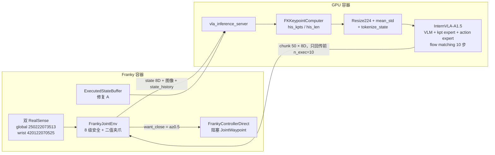
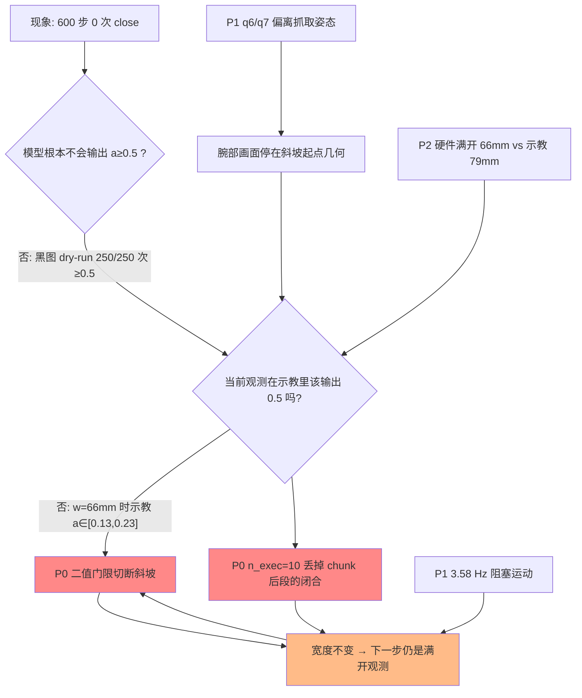
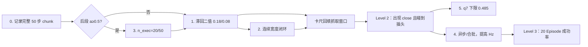

# 夹爪最终不闭合：A–F 之后的剩余原因与解决方案

> 版本 v1 · 2026-09-18
> 本文是 [`grperr_1.md`](grperr_1.md) 的续篇，但**自包含**：不读前篇也能跟上证据链、机制和实验方案。
> 对象：InternVLA-A1.5（仓库内称 4DWVLA）在 Franka FR3v2.1 上做 `plug into socket` 真机评估；checkpoint `4wvlaFrkPlugCkp041680`。
> 任务场景（操作员确认）：插头放在右侧白色泡沫存放台上，机械臂先取插头，再插入左侧插座。夹爪为带橙色 3D 打印指面的 Franka Hand。

---

## 1. 结论速览

**工程层 bug（`his_len` 慢 10 倍、q7 静默越界、Episode 串场、相机映射）已经在 `grperr_1.md` 的修复 A–F 里被真机验证关掉了。夹爪仍然不闭合，是因为评测把一条「连续宽度斜坡」误当成了「0.5 二值开关」。**

训练里 `action.gripper` 不是「现在要不要咬合」的离散开关，而是下一时刻开口宽度的仿射编码：

$$
a_{\text{grip}} = 1 - \frac{w}{w_{\max}},\qquad w_{\max}=0.08\,\text{m}.
$$

示教中一次闭合是 **13–19 帧（中位 17 帧，约 0.57 s @ 30 Hz）的连续斜坡**。斜坡走完一半、`a` 第一次越过 0.5 的时候，物理宽度已经是 **~38 mm**，不是满开的 79 mm。真机执行器却是：

```text
want_close = (action_grip >= 0.5)     # franky_joint_env.py
若否：夹爪保持当前开口（本次全程锁在 66.4 mm）
```

于是形成死锁：

1. 观测始终是「满开」\(w=66.4\,\text{mm}\)（硬件 `max_width=0.066\,\text{m}`，比示教满开 79 mm 还窄一截）。
2. 示教里 **同一宽度对应的动作就是 \(a\in[0.13,0.23]\)**，均值 0.174。
3. 真机峰值 0.227 正好落在这个区间——模型在「当前开口」下给出的是**正确的「斜坡起点」命令**，不是「咬合」。
4. 因为二值门限是 0.5，这 4 mm 量级的收拢意图被丢掉，宽度不变，下一步仍是满开观测，斜坡永远无法走完。

对照实验把「模型会不会闭合」和「在这套视觉/状态下该不该闭合」拆开了：

| 条件 | `action.gripper` | ≥0.5 次数 | 含义 |
|:---|---:|---:|:---|
| Dry-run，黑图 + 冻结 HOME + 假宽度 0.04 m | 0.72–0.77 | **250/250** | 模型**会**发出闭合；0.5 阈值本身挡不住 |
| 真机 Level 2，真实双目 + 宽度 0.066 m（两次 300 步） | 0.03–0.23 | **0/600** | 真实观测把输出钉在「斜坡起点」 |

所以：**不是执行层拒绝闭合，也不是极性反了，更不是 A–F 没修好。是「连续斜坡策略 × 0.5 二值执行 × 只跑 chunk 前 10 步」三件事叠在一起，结构上走不到示教里 `a≥0.5` 的那一帧。**

| 优先级 | 剩余原因 | 判定 | 一句话 |
|:--:|:---|:--:|:---|
| **P0** | 0.5 二值门限切断闭合斜坡 | **主因** | 示教 `a≥0.5` 时 \(w\approx38\,\text{mm}\)；真机 \(w\) 从未离开 66 mm |
| **P0** | `n_exec=10` 截断 50 步未来计划 | **主因（并列）** | 示教里闭合落在 chunk 第 25 步附近；前 10 步 80% 仍张开 |
| **P1** | 阻塞 `Robot.move()` → 实测 3.58 Hz（请求 10 Hz） | **重要诱因** | 斜坡在墙钟上被拉长 8 倍，闭环看到的是「一直满开」 |
| **P1** | q6 偏 +0.16 rad、q7 被裁在 0.434（示教抓取 ≥0.485） | **重要诱因** | 空间上已到插头上方，腕部姿态仍偏离抓取流形 |
| **P2** | 硬件满开 66 mm vs 示教 79 mm | **次要** | 状态 token 差 17 档；把「满开」编码成示教的「已经开始收」 |
| **P2** | `his_len` 格数对了、格间距仍是 0.28 s 而非 1/30 s | **次要** | 修复 A 的剩余时间语义 |
| — | 极性 / IPC / stats / 相机映射 / `his_len` 走慢 10 倍 | **已排除** | 见 §2 |

不建议做的事：**不要**再翻转 `VLA_GRIPPER_CLOSE_IF_ABOVE`；**不要**在没有滞回的情况下把阈值从 0.5 降到 0.2（会抖动开合）；**不要**把「再 fine-tune 一轮」当成第一步——当前 checkpoint 在黑图下已经会闭合，缺的是执行语义对齐。

---

## 2. 问题界定：A–F 修好了什么、没修好什么

### 2.1 评估链路（静态）



推理时的输入：

* 两路 RGB \(480\times640\)，resize-pad 到 \(224\times224\)；
* `observation.state` = 7 关节角（rad）+ 夹爪宽度（m），mean_std 归一化；
* `tokenize_state=True`：归一化状态再 `/3` 后编成 256 档文本 token，拼进 prompt（动作专家**没有**连续 state 向量，连续状态只进 keypoint 专家的 `kpt_state_proj`）；
* `observation.his_kpts` / `his_len`：由当前与历史关节角经 URDF FK 得到，窗口最长 200；
* 语言：`Task: plug into socket; Control Mode: <joint>; Output: <Subtask, Action>`。

推理时的输出：

* flow matching 从噪声积出 50 步 × 32D，截 8D（7 关节绝对角 + 夹爪），mean_std 反归一化；
* 服务端只把前 `n_exec=10` 步发给客户端；
* 关节走安全裁剪后的绝对目标；夹爪走 §3.2 的二值规则。

Checkpoint 关键开关（`config.json` / `train_config.json`）：`action_mode=abs`、`tokenize_state=true`、`enable_keypoint_predictor=true`、`chunk_size=50`、`n_action_steps=50`、`num_inference_steps=10`、`freeze_learnable_tokens=true`、`knowledge_insulation=false`。官方 RoboTwin 评估默认 `infer_horizon=20`（`evaluation/RoboTwin/inference.py`），本系统用 10。

### 2.2 前篇已经关掉、且被真机验证的原因

详见 [`grperr_1.md`](grperr_1.md) §8–§9。这里只保留判定，避免把旧账再算一遍：

| 修复 | 内容 | 真机结果 |
|:--:|:---|:---|
| A | 每步关节角回放到 `FKKeypointComputer`，`his_len` 按控制步 +1 | Level 0/2：`his_len` 1→12→…→200 饱和，越过示教最早闭合门槛 120 |
| B | 只观测实测 Hz，**未**改成异步运动 | 请求 5–10 Hz，实测 **2.5–3.6 Hz** |
| C | q7 训练外余量 0.15→0.05，下限 0.334→**0.4343 rad** | 91% 步触发 `OUT-OF-TRAIN` 并裁到 0.4344；不再静默滑到 0.39 |
| D | 抓取窗口仍是未用卡尺验证的 `0.015±0.010 m`，只加告警 | 闭合指令从未发出，窗口尚未被打到 |
| E | 每次 `reset` 向服务端发 `reset` | 日志出现 `Reset command received` |
| F | 相机序列号与画面肉眼核对 | global=工作台俯视，wrist=腕部 |

修复前：700 步 `his_len` 只到 70，夹爪指令贴地在 0.01–0.09。修复后：夹爪通道**有方向性起伏**（0.03→0.23→0.11），空间轨迹进到插头存放台上方，但 **0/600 步越过 0.5**。两次独立 300 步（重新摆景、回 HOME）终态关节相差 <0.02 rad、峰值相差 <0.01——这是可复现的系统行为，不是噪声。

### 2.3 本次用到的数据

| 来源 | 路径 | 用途 |
|:---|:---|:---|
| 示教 8 回合 | `/home/nvidia/bt/dt/plug_into_socket_lrb_4D_8sml`（4777 帧，30 Hz） | 闭合斜坡、\(a\)–\(w\) 关系、chunk 内延迟、抓取关节 |
| 全量统计 | `4wvlaFrkPlugCkp041680/stats.json`（100 ep / 66577 帧） | 极性、q7 训练范围 |
| Level 2 真机 | `logs/client_20260918_035441_1926.log`、`…040708_3189.log` | 修复后的夹爪/关节/图像统计 |
| Dry-run | `logs/client_20260918_034208_376.log`（250 步，黑图） | 对照「模型会不会闭合」 |
| 运行后照片 | `asset/eval_postL2_{global,wrist}.png` | 与示教腕部画面对比 |
| 示教抽帧 | `asset/demo_wrist_ep0_f199/221/236_*.png` | 斜坡起点 / 中点 / 闭合 |

分析脚本与中间结果：`asset/grperr_1_1_extract.py`、`asset/grperr_1_1_figs.py`、`asset/grperr_1_1_summary.json`、`asset/grperr_1_1_data.npz`。

---

## 3. 夹爪在训练里是什么、在评测里被当成了什么

### 3.1 训练：连续宽度，闭环斜坡

示教满足（[`grperr_1.md`](grperr_1.md) §2.2 已用 66577 帧交叉验证，最大绝对误差 \(5.2\times10^{-8}\)）：

$$
a_{\text{grip}}(t) = 1 - \frac{w(t)}{0.08}.
$$

因此 \(a=1\) 表示完全闭合，\(a\approx0.01\) 表示完全张开。**它是宽度本身，不是独立的 grasp/release 比特。** 一次抓取在 8 个示教回合里都是同一条斜坡：

| 事件 | 各回合帧号（ep0–ep7） | 当时的物理宽度 \(w\) |
|:---|:---|:---|
| \(a\) 首次 ≥ 0.15（斜坡起点） | 199, 124, 178, 100, 133, 157, 156, 247 | **65.5–67.9 mm** |
| \(a\) 首次 ≥ 0.20 | 再过 1–7 帧 | 61.5–63.7 mm |
| \(a\) 首次 ≥ 0.50（评测门限） | 再过约 17 帧 | **36.9–39.9 mm** |
| \(a\) 首次 ≥ 0.80 | 再过约 15 帧 | 0–16 mm |

斜坡长度 13–19 帧，中位 **17 帧 ≈ 0.57 s**（30 Hz）。直方图是双峰的：37% 的帧 \(a<0.1\)（张开段），51% 的帧 \(a≥0.8\)（持握+插入段），**0.2–0.4 的谷底几乎没有质量**——评测峰值 0.227 正好坐在这个谷里。


图 1：示教 `action.gripper` 的 20 档直方图。黑虚线是评测门限 0.5；红线是真机峰值 0.227，落在开/闭两峰之间的稀疏区。

**关键对照。** 把示教里「宽度接近真机满开」的帧单独切出来：

| 条件 | 帧数 | \(a_{\text{grip}}\) 均值 / 中位 / 范围 |
|:---|---:|:---|
| \(w\in[62,70]\,\text{mm}\)（≈ 真机 66.4 mm） | 72 | **0.174 / 0.173 / [0.131, 0.225]** |
| \(a\in[0.18,0.28]\)（≈ 真机峰值） | 55 | 对应 \(w\) 均值 **62.2 mm**（范围 58–66 mm） |

真机峰值 0.227 不是「差一点点到 0.5」，而是**与「宽度仍为 66 mm」的示教标签同一分布的上沿**。模型没有拒绝闭合；它在当前观测下给出了训练里该给的数。


图 2：横轴观测宽度 \(w\)，纵轴 `action.gripper`。黑线是 \(a=1-w/0.08\)。红虚线是真机硬件满开 66.4 mm；红星是真机峰值。0.5 水平线与示教云的交点在 \(w\approx38\,\text{mm}\)，真机从未到过那里。

这是闭环模仿学习里的典型「动作–状态一致性」：策略在 \(t\) 预测的 \(a_t\) 会改变 \(w_{t+1}\)，下一步的输入是新的 \(w\)。斜坡能走完，是因为执行器真的在收拢。评测把这条反馈剪断了。

### 3.2 评测：0.5 二值 +「已经是目标就跳过」

`b/x/4dwvla_ext/franky_joint_env.py`：

```python
GRIPPER_CLOSE_THRESHOLD = float(os.environ.get("VLA_GRIPPER_CLOSE_THRESHOLD", "0.5"))

def want_gripper_close(action_grip: float) -> bool:
    if GRIPPER_CLOSE_IF_ABOVE:
        return float(action_grip) >= GRIPPER_CLOSE_THRESHOLD
    return float(action_grip) < GRIPPER_CLOSE_THRESHOLD
```

`a=0.23` 被翻译成 `open`，然后：

* `want_close=False` 且 `gripper_is_open()=True`（宽度 66 mm ≥ `_OPEN_WIDTH_M=0.06`）→ **什么都不做**；
* 物理宽度保持 66.4 mm；
* 下一步观测仍是「满开」，模型再次输出斜坡起点。

即便把 0.227 按仿射式执行成连续宽度，目标也只是

$$
w_{\text{cmd}} = 0.08\times(1-0.227) = 61.8\,\text{mm},
$$

相对 66.4 mm 只收 4.6 mm，夹不住插头。所以「只改成连续宽度、不改闭环」不够；必须让斜坡在多步里**累积**，或者在斜坡起点就用 `grasp()` 咬合（二值，但门限对齐 0.15–0.20，且要有滞回）。

同一套 InternVLA-A1.5 在 LIBERO 仿真里也把夹爪二值化，但那边训练标签本身就是开/关（`evaluation/LIBERO/model2libero_interface.py`，门限 0.5 且极性相反）。**Franka 插头数据不是这种标签**，把 LIBERO 的门限原样搬过来是分布错配。π0 / OpenVLA 一类工作里，夹爪经常是单独的离散头或在仿真里二值化；连续宽度 + 二值执行的组合，正是 Diffusion Policy / ACT 文献里「action chunking 遇到离散事件」要小心的点（Chi et al., 2023；Zhao et al., 2023）。

### 3.3 动作专家实际吃到的夹爪信息

`tokenize_state=True` 时 `embed_suffix` **不**建连续 state token（`modeling_internvla_a1_5.py`）。夹爪宽度进入模型的路径只有：

1. 文本 `"State: …"`：mean_std 之后 `/3` 再 `digitize` 到 256 档；
2. keypoint 专家的 `kpt_state_proj`（连续 32D，含宽度）。

真机满开 66.4 mm 与示教满开 79.4 mm 的 token 差 17 档（171 vs 188）。Dry-run 假宽度 0.04 m 的 token 是 136，更靠近训练集均值（128）。黑图 + 「半开」状态 token，模型退回到数据集的多数类——闭合（55.9% 的示教帧 \(a≥0.5\)）。这解释了 dry-run 为什么稳定输出 0.74，而不能理解成「权重坏了、根本不会闭」。

---

## 4. 分析过程与其余证据

### 4.1 Dry-run 对照：闭合能力与条件闭合是两件事

Dry-run（`client_20260918_034208_376.log`）用全零图像、关节锁在 HOME、宽度锁在 0.04 m。250 步里夹爪通道 **0.719–0.770，250 次都会越过 0.5**。真机两次 300 步峰值 0.227 / 0.216，0 次越过。


图 3：左=8 条示教（每条都有开→闭→开）；中=修复 A–F 后两次 Level 2（起伏但贴在 0.2 以下，绿点线 0.18 是斜坡起点）；右=黑图 dry-run（全程在 0.74，会闭合）。

结论：VLM + 动作专家在这个 checkpoint 上**具备**发出闭合的能力。卡住它的是真实图像 + 真实宽度，不是权重、不是 0.5 门限「太高到模型永远到不了」（黑图一下就到）。

### 4.2 视觉：不是换了手指、也不是曝光崩了

示教腕部抽帧（ep0）与 Level 2 结束后的腕部照片并排看：

| 示教 ep0 f199（\(a≥0.15\), \(w=67.7\,\text{mm}\)） | 示教 ep0 f221（\(a≥0.5\), \(w=38\,\text{mm}\)） | 示教 ep0 f236（\(a≥0.8\)） | 真机 300 步后 |
|:---:|:---:|:---:|:---:|
|  |  |  |  |

橙色格子指面、插头上的橙红缝、白色泡沫台，两边是同一套硬件。全局亮度也对齐：示教腕部均值 107–125、真机 119；示教全局 116–119、真机 118。**不是「换了夹爪外观」或「相机暗到模型瞎了」。**

差别是几何：真机结束后指面之间的空隙、插头在画面里的大小，更接近示教 **f199（斜坡起点）**，而不是 f221/f236（门限 0.5 / 几乎咬住）。全局图同样是「停在泡沫台上方」，与示教抓取瞬间同一阶段：

| 示教 ep0 f221 全局 | 真机 300 步后全局 |
|:---:|:---:|
|  |  |

空间策略已经把胳膊开到「该抓了」。缺的是让手指沿斜坡走完的执行语义。

### 4.3 `n_exec=10`：把闭合留在未执行的未来里

模型一次预测 50 步未来（训练里 50 帧 = 1.67 s @ 30 Hz）。服务端只执行前 10 步。在示教上做「若从抓取前的帧做 receding-horizon，闭合落在 chunk 第几步」：

| 统计（抓取前 80 帧窗口，8 回合合计） | 值 |
|:---|---:|
| 未来 50 步内会出现 \(a≥0.5\) 的帧 | 400 |
| 其中闭合落在前 10 步（现有 `n_exec` 会执行到） | **80（20%）** |
| 落在第 10 步之后（现有实现丢掉） | **320（80%）** |
| 闭合在 chunk 内的延迟：中位 / p10 / p90 | **24.5 / 4.9 / 44.1** |


图 4：示教中「闭合」落在 50 步计划的第几拍。红线是当前 `n_exec=10`。大多数计划把咬合放在第 20–40 拍；前缀执行完后状态几乎没变（夹爪仍满开），下一步重新计划，闭合再次被排到未来。这是 action chunking 对延迟离散事件的经典「拖延」（Chi et al., 2023；Zhao et al., 2023）。

真机日志里**只记了前 10 步**，看不到 10–49。就这 10 步，夹爪通道已经沿 chunk **单调变大**：

| chunk 槽位 | 0 | 3 | 6 | 9 |
|:---|---:|---:|---:|---:|
| 30 次推理的均值 | 0.107 | 0.118 | 0.126 | **0.138** |
| 30 次推理的最大 | 0.152 | 0.174 | 0.192 | **0.227** |
| 槽位 9 > 槽位 0 的比例 |  |  |  | **87%** |


图 5：被执行的 10 步前缀上，闭合意图随槽位上升。后面 40 步被丢弃。按槽位最大的斜率外推，第 ~40 步才可能靠近 0.5——而这仍是「当前观测为满开」时的**开环计划**，不是已经被执行的宽度。

两个机制叠在一起才是死锁：

* 二值门限丢掉前缀里 0.15–0.23 的收拢；
* 即便改成连续宽度，前 10 步也只走完斜坡的开头，后面被 receding-horizon 丢掉；下一步观测若仍接近满开，计划再次从开头写起。

连续执行 + 每步把宽度真的收一点，闭环才有机会在几次重计划后走进 \(a≥0.5\) 的区域。这是 §7 的实验 2。

官方 RoboTwin 用 `infer_horizon=20` 而不是 10，会多吃到斜坡的一部分，但按图 4 的中位延迟 24.5，20 仍偏短。`n_action_steps=50` 与 `n_exec=10` 的缺口本身就是配置错误，不是超参数微调问题。

### 4.4 腕部姿态：q6 / q7 仍偏离抓取流形

Level 2 第一次结束关节

\[
q = [-0.087,\ 0.193,\ -0.125,\ -2.078,\ 0.068,\ 2.396,\ 0.434]
\]

与示教 ep0 首次 \(a≥0.5\) 的关节

\[
q^{\text{ep0}} = [-0.092,\ 0.215,\ -0.135,\ -2.055,\ 0.066,\ 2.238,\ 0.485]
\]

q1–q5 已经非常接近（逐关节 <0.03 rad）。剩下两处：

* **q6（腕部点头）+0.158 rad ≈ 9°**，落在示教闭合云的右外侧（示教闭合时 q6 ∈ [2.24, 2.37]）；
* **q7（腕部自转）被修复 C 裁在 0.434**，而示教闭合时 q7 ∈ **[0.485, 0.620]**，命令中位 0.407、最低 0.385，274/300 步都在喊「再往下」。


图 6：左=示教闭合帧的 q6 分布 vs 真机终点；右=q7。绿虚线是示教最小值 0.485，红线是现裁剪 0.434，橙线是模型命令中位 0.407。

修复 C 的本意是挡住训练外的腕部自转。它做到了，也把策略锁在「想要的 q7 永远拿不到」的边界上。末端指面相对插头的滚转差 ~3–9°，腕部画面里插头还能居中，但并爪时接触面可能发飘。这不是「不闭合」的第一性原因（即使 q7 完美，0.5 门限仍然切斜坡），但会降低「斜坡一旦开始就能咬住」的成功率。

q7 命令稳定在 0.40 而示教抓取在 0.49–0.62：方向是从 HOME 0.64 往下，但走过了头。可能来自视觉里插头yaw与示教不完全一致，或 8 回合子集里 ep0 的 q7=0.485 本身就贴着训练下沿。把 L2 下限从 0.434 再抬到 **0.485（示教最小）或 0.507（q01）** 更合理——现在的 0.05 余量仍然允许出界。

### 4.5 时间语义：格数对齐之后，格间距还是错的

修复 A 让 `his_len` 按控制步增长，不再慢 10 倍。仍剩两层失真：

1. **控制频率 3.58 Hz vs 训练 30 Hz。** 根因是 `franky.Robot.move()` 默认阻塞（`grperr_1.md` R2），`relative_dynamics_factor=0.2` 让每个 waypoint 都走完加速–减速。`--control-hz 10` 里的 `sleep` 不是瓶颈。50 步 chunk 在训练里是 1.67 s 的未来；在真机前缀 10 步就要 2.8 s 墙钟，整段 50 步会变成 14 s。绝对关节目标「慢放」仍能走到附近，但斜坡的**时间条件**和视觉变化率对不上。
2. **历史窗口里相邻两格的 \(\Delta t\)。** 训练是 1/30 s；真机是一次阻塞运动 ≈ 0.28 s。200 格在训练里覆盖 6.7 s 接近过程，在真机里覆盖 ~56 s，后半段往往是在插头上方微抖。TrackEncoder 看到的是「几乎静止的轨迹」，而 `his_len=200` 在示教里 76.4% 对应**已经握住**（`grperr_1.md` §2.5）。视觉仍显示没握住 → 语言/关键点说「回合后段该握住了」、图像说「没有」→ 夹爪通道折中在 0.11–0.23，然后回落。这与 Level 2「峰值在 step 159 / `his_len≈150`，饱和到 200 之后反而下降」一致。

异步下发或把 10 个 waypoint 合成一条 `JointWaypointMotion`（`grperr_1.md` 修复 B 明确没做，因为改变运动特征）仍然是 P1。没有它，P0 的连续斜坡在墙钟上也会拖成数秒，闭环更容易在中途重计划。

### 4.6 硬件满开 66 mm，不是 80 mm

启动日志：

```text
FrankaLibfrankaGripper connected (max_width=0.066m, ... width=0.0664m)
```

驱动 `open()` 目标是 `_MAX_WIDTH_M=0.09`，被硬件截在 0.066。示教满开 79.4 mm。差 13 mm，对应 \(a\) 已经是 0.17 而不是 0.01。状态 token 171 vs 188。模型从第一步起看到的就是「略收拢的满开」，和示教 HOME 不完全同分布。这解释了真机第一步就是 \(a\approx0.036\) 而不是更低，以及峰值容易顶在 0.17–0.23：那是「当前宽度」的回归目标。

3D 打印指面加厚行程，是这个差的物理来源。外观已在示教里（§4.2），**外观 OOD 不是主因**；行程 OOD 是。

### 4.7 其它已核对、不构成主因的项

* **Flow matching 把双峰平均成 0.23？** 形态不像。真机轨迹平滑上升再回落，没有在 0.02 与 1.0 之间闪烁；dry-run 稳定在 0.74。给定当前视觉，速度场是单峰的「保持近乎张开」。0.23 是斜坡起点，不是两个模态的期望。
* **极性反了？** 否。\(a=1-w/0.08\) 在全量统计上精确成立。翻转 `VLA_GRIPPER_CLOSE_IF_ABOVE` 会在 dry-run 下把 0.74 当成「开着」。
* **IPC / stats 拼接 / 8D 截取？** 每次回 `[10,8]`，延迟 ~300 ms。前篇已排除。
* **相机左右眼对调？** 修复 F 肉眼确认，画面与示教同构。
* **`his_len` 仍不到 120？** 否，真机已到 200。
* **TCP 围栏？** 两次 Level 2 无 `MOTION GUARD`。示教抓取 TCP \(z\in[0.221,0.232],\ y\in[-0.124,-0.096]\)，在围栏内。
* **R4 抓取窗口 15±10 mm。** 仍未用卡尺验证。**当前没被打到**（没有 `close()` 调用）。一旦 P0 修好，空爪合死会被判 `holding=True` 而跳过后续 grasp（Level 1 已复现 width=0.0097 m 的误判）。必须在 P0 方案落地前用卡尺回填 `FRANKA_CUBE_WIDTH_M`。
* **只训了 8 回合子集？** checkpoint 统计是 100 回合 / 66577 帧。本地 8 回合是抽检。斜坡结构在 8 回合上完全一致，像是采集协议本身（遥操作连续收拢），不大像子集巧合。
* **任务指令？** 示教与评测都是 `plug into socket`。无证据表明漏了「pick the plug first」。

---

## 5. 机制合成



闭环方程（评测）：

$$
w_{t+1} = w_t \qquad \text{unless } a_t \ge 0.5.
$$

训练：

$$
w_{t+1} \approx 0.08\,(1-a_t).
$$

只要 \(a_t\) 在满开附近的支撑集 \([0.01,0.25]\) 里，评测的 \(w\) 就不动，策略就一直呆在这个支撑集里。这是动力学上的吸收态，不是「再跑 700 步就会闭」。两次 300 步已经给出相同吸收态。

---

## 6. 纵向、横向与消融

### 6.1 纵向：夹爪在 VLA 里怎么被表示

| 世代 | 代表 | 夹爪怎么进模型 | 推理时怎么执行 | 适合 |
|:---|:---|:---|:---|:---|
| 行为克隆 + 连续关节 | 早期 ACT / Diffusion Policy | 与关节同一条回归头 | 连续或对夹爪单独二值 | 示教是连续宽度时要用连续或「斜坡起点」门限 |
| 离散动作 token | RT-1, OpenVLA | 夹爪常是开/关 token | 直接离散 | 标签本身是比特；迁移到连续宽度会错 |
| 流匹配连续动作 | π0, InternVLA-A1.5 | 8D 连续，夹爪是其中一维 | 仿真里常再二值化 | **必须核对此维在数据里是宽度还是比特** |
| 混合 | π0.5 / FAST 辅助 | 连续 FM + 离散 FAST | 本 checkpoint `inference_action_type=fm`，FAST 只在训练 | 推理没用上 FAST 的离散夹爪 |

InternVLA-A1.5 论文（[arXiv:2607.04988](https://arxiv.org/abs/2607.04988)）把动作交给 flow matching 的 action expert，用 FAST token 做辅助监督。本 checkpoint 推理走 FM，夹爪是连续维。把 LIBERO 的 0.5 二值套到 Franka 宽度标签上，等于把「连续控制」当成了「离散技能触发」。

Action chunking（ACT、Diffusion Policy）的本意是用短开环平滑抖动。副作用是：**延迟的离散事件会被排到 chunk 后段，receding-horizon 若截得太短，事件永远不发生。** 本例中位延迟 24.5 步、`n_exec=10`，是教科书式发作。

### 6.2 横向：和本仓库其它评测栈比

| 栈 | 夹爪 | 计划长度 | 备注 |
|:---|:---|:---|:---|
| 本系统 Franka 真机 | 宽度编码 + **0.5 二值** | 10 / 50 | 本文 |
| InternVLA LIBERO | 开/关标签 + 0.5 二值（极性相反） | `replan_steps` | 标签匹配，门限合理 |
| InternVLA RoboTwin | 仿真夹爪 | **20** / 50 | 比本系统多一倍前缀 |
| RLinf `realworld` Franky | `_binary_gripper_action`，同样 skip-if-already | 依配置 | 本环境有意复用；对宽度数据不友好 |
| OpenVLA-OFT 等离散 VLA | token | 常 1 步或短 chunk | 不会出现「斜坡被二值切断」 |

### 6.3 消融（已发生的自然实验，不是新跑的训练消融）

| 变化 | 夹爪峰值 | ≥0.5 | 说明 |
|:---|---:|:--:|:---|
| 修复前，`his_len` 最高 70 | 0.09 | 否 | 时钟未到抓取段 |
| 修复 A–F，真机 300 步 ×2 | 0.22 | 否 | 时钟到了，执行语义仍错 |
| 同一服务端，黑图 dry-run | 0.77 | **是** | 模型能闭；视觉/宽度条件把它按下 |
| 真机 `his_len` 过 120 之后 | 升到 0.23 再回落到 0.11 | 否 | 视觉「没握住」压过历史时钟先验 |
| chunk 槽位 0→9 | 均值 0.11→0.14 | 否 | 计划在往闭合走，前缀太短 |

还没有做、但能一锤定音的消融见 §7：全量记下 50 步 chunk、连续宽度闭环、`n_exec∈{10,20,50}`、q7 下限抬到 0.485。这些都不必重新训练。

---

## 7. 解决方案（按优先级，带验收）

原则与 [`grperr_1.md`](grperr_1.md) 相同：先改可观测性，再改不改变运动特征的执行语义，最后才改运动（异步 / 合批 waypoint），并走 Level 0→3。配置入口已有 `b/x/4dwvla_ext/configs/franka_plug_eval.env` 和 `VLA_GRIPPER_*` 环境变量，**不要**把新语义写死在代码常量里。

### 7.1 实验 0（必须先做，不碰机器人运动）：把 50 步 chunk 全部打进日志

**目的。** 现在无法知道未执行的 40 步里 \(a\) 会不会到 0.5。图 5 的前 10 步在涨，图 4 说示教闭合在第 25 步附近。这是最便宜的判决。

**改动。** `vla_inference_server.py` 在 `action_pred[:n_exec]` 之外，把 `action_pred[:50, :8]` 的物理值打一行 `full_chunk_grip=`。客户端不必执行它们。

**验收。** 一次 Level 0 dry-run + 一次 Level 1 真机 30 步即可。看峰值请求里槽位 20–40 的 \(a_{\text{grip}}\)：

* 若后段已经 ≥0.5：主因更偏向 P0 的 `n_exec` 截断，实验 3 优先；
* 若整段 50 步仍 <0.3：主因更偏向「当前观测下计划本身就不闭」，实验 1–2 优先。

### 7.2 实验 1（P0，改执行语义，运动特征几乎不变）：斜坡起点二值 + 滞回

把「0.5 = 已经收了一半」改成「0.18 ≈ 示教斜坡起点」，并加上滞回，避免图 3 中段在门限附近来回跳。

建议默认（写入 `franka_plug_eval.env`，可用环境变量覆盖）：

```text
VLA_GRIPPER_CLOSE_THRESHOLD=0.18
VLA_GRIPPER_OPEN_THRESHOLD=0.08
VLA_GRIPPER_CLOSE_IF_ABOVE=1
```

语义：

* \(a≥0.18\) → `close()`（libfranka `grasp` 到校准宽度）；
* 已闭合后仅当 \(a≤0.08\) 才 `open()`；
* 中间带来粘滞，对应示教双峰之间的谷。

真机 Level 2 上 \(a≥0.18\) 的统计（第一次 300 步）：23 步、9 次穿越、最早 step 128。没有滞回会开合抖动；有滞回则大约在插头上方第一次越过 0.18 后保持闭合——腕部画面显示那时手指已经在插头两侧。

**必须先做的前置：** 卡尺量插头厚度，回填 `FRANKA_CUBE_WIDTH_M` / `FRANKA_HOLD_TOL_M`（修复 D）。否则 `grasp(0.015±0.010)` 会把空爪合死判成 holding，之后再也不合（Level 1 已发生）。

**验收。**

* Level 0：dry-run 仍应闭合（0.74≥0.18）。
* Level 1：30 步内不应在 HOME 处闭合（HOME 的 \(a\approx0.03\)）。
* Level 2：300 步内应出现至少一次 `gripper_cmd=close`；腕部画面里手指应碰到插头。允许抓偏，不允许全程无 close。
* 失败模式：过早在空中合拢 → 把 0.18 调到 0.20–0.22，或加「腕部画面里插头足够大」之类的几何门（后者不要第一轮就上）。

### 7.3 实验 2（P0，更贴近训练）：连续宽度闭环

把夹爪当位置环，而不是 grasp 开关：

$$
w_{\text{cmd}} = \mathrm{clip}\bigl(0.08\,(1-a),\ 0,\ w_{\text{hw max}}\bigr).
$$

每步（或 \(a\) 变化超过 2 mm 时）`gripper.move(w_cmd)`。这样 \(a=0.23\) 会收到 62 mm，下一步观测变为 62 mm，示教里对应 \(a\approx0.22\)–\(0.30\)，斜坡可以在多次重计划后走完。

注意：

* libfranka 的 `grasp()` 是力控咬合，`move()` 是位置。斜坡阶段用 `move`，\(a≥0.8\) 或 \(w\) 低于插头厚度再切 `grasp`，以免在泡沫台上打滑。
* `n_exec=10` 仍然短，但每步宽度会变，吸收态被打破。可与实验 3 合用。
* 真机 `max_width=0.066`，\(a<0.175\) 的「再张开」无法执行，应 clamp 并打日志，避免无意义的 open 命令。

**验收。** 日志里 `state.gripper` 必须随 \(a\) 下降；若 \(a\) 在 0.2 附近徘徊而 \(w\) 降到 ~50 mm 后不再降，再叠加实验 1 的滞回咬合。

### 7.4 实验 3：加大 `n_exec`（20 或 50）

与官方 RoboTwin 的 20 对齐，或直接用 config 里的 `n_action_steps=50`。

风险：开环变长。3.58 Hz 下 50 步 = 14 s 不看新图像。应与实验 4（提高实测 Hz）一起做。若仍阻塞，先试 `n_exec=20`（约 5.6 s）。

**验收。** 实验 0 的日志里若后段已 ≥0.5，本实验应在真机第一次执行到该槽位时发出 close。若后段仍 <0.3，加大 `n_exec` **不会**救人，不要在这条上耗真机时间。

### 7.5 实验 4（P1，改变运动特征，必须走四级渐进）：去掉逐步阻塞

`grperr_1.md` §4 修复 B 已写过、§8 明确没做：

* `Robot.move(..., asynchronous=True)`，或
* 把 10 个目标合成一条 `JointWaypointMotion`。

目标是把实测 Hz 从 3.6 拉到 ≥10（理想靠近 15–30，与训练 30 仍有差距但斜坡墙钟从数秒降到 1 s 量级）。只在实验 1 或 2 已经能发出 close 之后再做，否则无法分离「频率」和「门限」。

**验收。** 日志 `achieved_control_hz` ≥ 0.5 × 请求值；TCP 不抖出围栏；闭合一旦出现，斜坡墙钟应接近示教的 0.6 s 而不是数秒。

### 7.6 实验 5（P1）：q7 下限贴示教，而不是「训练最小 − 0.05」

`SAFETY_MARGIN_RAD[6] = 0.05` 给出 0.4343，仍比示教最小 0.4843 低 0.05。改为：

```text
q7_lower = TRAIN_ARM_MIN[6]   # 0.4843，零余量
# 或更严：stats q01 = 0.507
```

模型命令 0.40 会被裁到 0.485，腕部滚转进入示教抓取云。这比现在「允许出界 3°」更像安全层该做的事。

**验收。** `OUT-OF-TRAIN` 仍可出现（命令仍想出界），但 `state_after[q7]` ≥ 0.484；腕部画面里插头相对指面的倾斜应接近示教 f221。

### 7.7 实验 6（P2，数据 / 训练，最后才做）

仅当实验 1–5 仍抓不住时：

* 用同一套橙色手指、满开以硬件 66 mm 为准，再采若干回合，让 \(w_{\max}\) 与评测一致；
* 或在训练里把夹爪改成真正的开/关比特（与 LIBERO 一致），再在评测用 0.5；
* 或加一个小的离散 grasp 头，FM 只负责关节。

不要把「再训 5 万步」当成第一反应：dry-run 已经证明闭合模态在权重里。

### 7.8 建议的实施顺序



实验 0 可以今天就做（改一行日志）。实验 1+卡尺是最短能让夹爪动起来的路径。实验 2 更「正确」，但要改 libfranka 调用，回归面比改两个阈值大。

### 7.9 测试与验收脚本（落地时要补的）

现有离线测试不够覆盖 P0：

| 测试 | 位置 | 覆盖 |
|:---|:---|:---|
| 斜坡一致性 | `tests_au/` 或 `b/x/4dwvla_ext/tests/` | 示教 parquet：\(a≥0.5\) 的帧 \(w<0.045\)；\(w>0.062\) 的帧 \(a<0.25\) |
| 滞回 | 单测 `want_gripper_close` | 0.17→开，0.19→关，降到 0.10 仍关，0.07→开 |
| 连续宽度 | mock gripper | \(a=0.23\) → `move(0.0616)`，不调用 `grasp` |
| chunk 日志 | IPC 单测 | 响应含 50 步，执行仍 10 步 |
| 回归 | `tests/test_safety_offline.py` | q7 下限改动不放宽其它关节 |

真机验收门（Level 2 通过才许 Level 3）：

1. 日志出现 `gripper_cmd: close`；
2. `observation.state.gripper` 降到 < 40 mm 或 `holding=True` 且宽度落在校准窗口；
3. 腕部事后照片中插头被指面夹住（允许没插入插座）；
4. 无 `MOTION GUARD`，E-stop 未用。

---

## 8. 明确不要做的事

1. **不要翻转极性。** 全量统计上 \(a=1-w/0.08\)。Dry-run 的 0.74 在正确极性下就是闭合。
2. **不要无滞回地把 0.5 改成 0.2。** 第一次 Level 2 在 0.20 上有 3 次穿越、0.15 上有 15 次。夹爪会在插头上方反复开合。
3. **不要在 P0 未验证时做 Level 3（20 Episode）。** 吸收态可复现，加次数不会改变。
4. **不要把异步运动当第一刀。** 它改变轨迹密度，且即使用 30 Hz，0.5 门限仍然切斜坡。
5. **不要先重训。** 黑图已经会闭。优先执行器与 chunk 长度。
6. **不要忽略卡尺。** 一旦开始 `close()`，未验证的 15 mm 窗口会把成功/失败全部测错。

---

## 9. 输入–输出对照（给后续改代码的人）

**训练一步（30 Hz 一帧）。**

* 输入：双目 224、归一化 8D 状态、最多 200 格 30 Hz 关键点、任务文本。
* 监督：未来 50 帧绝对关节 + 连续 \(a=1-w/0.08\)（FAST 文本只在训练）。
* 夹爪监督在闭合段是 17 帧斜坡，不是单帧比特。

**评测一步（现实现，~3.6 Hz）。**

* 输入：同上，但关键点格间距 ≈0.28 s，宽度锁在 66.4 mm。
* 输出：50 步计划，执行 10 步关节 waypoint（阻塞），夹爪仅当 \(a≥0.5\) 才 `grasp`。
* 结果：\(a\) 停留在示教「满开」条件分布 \([0.03,0.23]\)，宽度不变。

把评测的夹爪映射改成与训练同一条仿射式（实验 2），或把二值门限移到斜坡起点并加滞回（实验 1），吸收态才会消失。

---

## 10. 参考

1. 前篇诊断（已修复的工程 bug）：本目录 [`grperr_1.md`](grperr_1.md)。
2. InternVLA-A1.5：Team, “Unifying Understanding, Latent Foresight, and Action for Compositional Generalization,” arXiv:2607.04988, 2026. 项目页 https://internrobotics.github.io/internvla-a15.github.io/ ；权重 https://huggingface.co/InternRobotics/InternVLA-A1.5-base 。
3. Chi et al., “Diffusion Policy: Visuomotor Policy Learning via Action Diffusion,” RSS 2023. Action chunking 与 receding-horizon。
4. Zhao et al., “Learning Fine-Grained Bimanual Manipulation with Low-Cost Hardware” (ACT), RSS 2023. 开环 chunk 平滑与离散事件延迟。
5. Black et al., “π0: A Vision-Language-Action Flow Model for General Robot Control,” 2024. 流匹配连续动作；夹爪在部署时常另行离散化。
6. Kim et al., “OpenVLA,” 2024. 离散动作 token，夹爪为开/关。
7. Lipman et al., “Flow Matching for Generative Modeling,” ICLR 2023.
8. 本仓库代码（以本地为准）：
   * `b/x/4dwvla_ext/franky_joint_env.py`（二值门限）
   * `b/x/4dwvla_ext/vla_inference_server.py`（`n_exec`、只回传前 10 步）
   * `b/x/franky_ext/franka_libfranka_gripper.py`（`max_width`、`open`/`grasp`、`_OPEN_WIDTH_M=0.06`）
   * `4WVLA/src/lerobot/policies/internvla_a1_5/modeling_internvla_a1_5.py`（`tokenize_state`、`sample_actions`）
   * `4WVLA/src/lerobot/policies/internvla_a1_5/transform_internvla_a1_5.py`（`_encode_state`）
   * `4WVLA/evaluation/RoboTwin/inference.py`（`infer_horizon` 默认 20）
   * `4WVLA/evaluation/LIBERO/model2libero_interface.py`（仿真夹爪二值，极性相反）
9. 示教与统计：`/home/nvidia/bt/dt/plug_into_socket_lrb_4D_8sml`；`4wvlaFrkPlugCkp041680/stats.json`。
10. 图与可复现数字：`asset/grperr_1_1_extract.py`、`asset/grperr_1_1_figs.py`、`asset/grperr_1_1_summary.json`。

---

## 11. 一句话

修复 A–F 之后，策略已经站在插头上方，并且给出了与「66 mm 开口」匹配的示教动作 0.13–0.23。评测却在等 0.5，而 0.5 在示教里只出现在夹爪已经收到 38 mm 之后。把执行器改回连续斜坡（或把门限移到斜坡起点并加滞回），再决定要不要加长 chunk、加快控制、收紧 q7——这是剩下真正该做的事。
