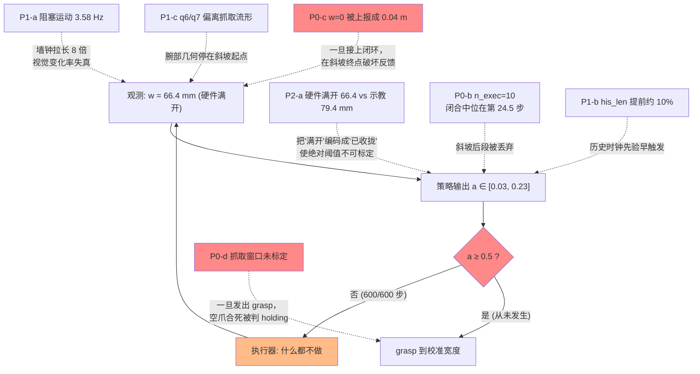
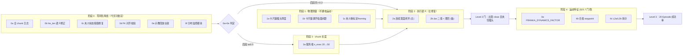

# 夹爪不闭合：最终综合解决方案

> 版本 v1 · 2026-09-18
> 对象：InternVLA-A1.5（仓库内称 4DWVLA）在 Franka FR3v2.1 上做 `plug into socket` 真机评估；checkpoint `4wvlaFrkPlugCkp041680`。
>
> **本文的定位。** 综合三条来源：
> 1. [`grperr_1.md`](grperr_1.md)（下称 **1.0**）——工程 bug 诊断 R1–R6 与修复 A–F，已在真机 Level 0→2 验证通过；
> 2. [`grperr_1.1.md`](grperr_1.1.md)（下称 **1.1**）——A–F 之后仍不闭合的机制分析，定位到「连续宽度斜坡被 0.5 二值门限切断」+「`n_exec=10` 截断 50 步 chunk」；
> 3. 本文新增的三项独立代码核对结果（§3），其中两项是会直接破坏 1.1 所提方案的前置缺陷。
>
> 本文是**自包含的实施方案**：结论、机制、代码改动、配置抽象、测试与验收、以及尚需实验定论的开放问题。与 1.0/1.1 重复的证据链只保留判定，不重复推导。

---

## 1. 结论速览

1.1 的主因判定我认为是对的，且证据链闭合：**策略已经站在插头上方，并且在「开口 66.4 mm」这一条件下给出了与示教同分布的动作 0.13–0.23；评测却在等 0.5，而示教里 $a\ge 0.5$ 只出现在夹爪已经收到约 38 mm 之后。** 宽度不变 → 下一步观测仍是满开 → 输出仍是斜坡起点，构成动力学吸收态。

本文在此基础上做三件事：

**（一）把"绝对阈值"换成"宽度增量"判据。** 1.1 提议把门限从 0.5 降到 0.18。方向对，但 0.18 不可标定：在真机满开 66.4 mm 下，示教对应的"保持张开"命令本身就是 $a\approx0.174$，门限 0.18 只比它高 0.006，会在噪声上误触发；而一旦硬件满开恢复到示教的 79 mm，0.174 会掉到 0.008，0.18 又变得过于不灵敏。改用"命令宽度比当前实测宽度窄多少"这个增量判据，可以把**硬件满开偏差这个混淆项完整解耦**，无需随硬件重新标定（§4）。

**（二）先修掉两个会让 1.1 的方案失效的前置缺陷。** 1.1 的实验 2（连续宽度闭环）依赖"夹爪宽度进状态 → 模型看到变窄 → 继续收"这条反馈。但当前 `_get_observation()` 里 `g = state["gripper_width"] or 0.04`，Python 的 `or` 把 `0.0` 也当假值，**完全闭合会被上报成 0.04 m** ——恰好在斜坡终点破坏这条反馈。另外修复 A 之后 `his_len` 的格数仍然不等于训练语义（差一帧且每周期重复计数一格），1.1 §4.5 关于"格数对了、格间距还错"的判断只说对了后半句（§3）。

**（三）指出安全层在 q7 上的目标冲突。** 1.1 实验 5 建议把 q7 下限从 0.4343 抬到示教观测最小值 0.4843。但安全层裁剪的是**动作**，而 0.4843 来自**观测**分布；训练的 `action.arm[6]` 实际低到 0.3695（$q_{01}=0.4258$）。抬到 0.4843 会裁掉约 10% 的训练动作分布，是"更不像训练"而不是"更像"。正确做法是把"动作分布守卫"和"状态分布监控"拆成两件事（§3.3）。

### 综合优先级表

| 优先级 | 原因 | 来源 | 判定 | 一句话 |
|:--:|:---|:--:|:--:|:---|
| **P0-a** | 0.5 二值门限切断连续闭合斜坡 | 1.1 | 主因 | 示教 $a\ge0.5$ 时 $w\approx38$ mm；真机 $w$ 从未离开 66.4 mm |
| **P0-b** | `n_exec=10` 截断 50 步 chunk | 1.1 | 主因（并列） | 闭合中位落在 chunk 第 24.5 步；前 10 步只覆盖 20% |
| **P0-c** | 夹爪状态 `or 0.04` 假值 bug | **本文** | 前置阻塞 | 完全闭合被上报成 0.04 m，破坏宽度反馈闭环 |
| **P0-d** | 抓取窗口 $0.015\pm0.010$ m 未经卡尺验证 | 1.0 R4 | 前置阻塞 | 空爪合死会被判 holding，之后永久跳过 grasp |
| **P1-a** | 阻塞 `Robot.move()` → 实测 3.58 Hz | 1.0 R2 / 1.1 | 重要诱因 | 斜坡墙钟被拉长 8 倍 |
| **P1-b** | `his_len` 差一帧 + 每周期重复计数 | **本文** | 中等 | 真机 `1→12→23`，训练语义应为 `0→10→20`，历史时钟先验提前约 10% 触发 |
| **P1-c** | q6 偏 +0.16 rad；q7 裁剪目标冲突 | 1.1 / **本文** | 中等 | 抬到 0.4843 会裁掉训练动作分布的下 10% |
| **P2-a** | 硬件满开 66.4 mm vs 示教 79.4 mm | 1.1 | 次要但是混淆源 | 使绝对阈值不可标定；Δw 判据可免疫 |
| **P2-b** | 历史窗口格间距 0.28 s vs 1/30 s | 1.1 | 次要 | 需 P1-a 才能改善 |
| — | 极性 / IPC / stats / 相机映射 / `his_len` 慢 10 倍 | 1.0 / 1.1 | **已排除** | 见 1.1 §2.2、§4.7 |

### 已核对确认无误、不要再花时间的项

我独立核对了训练侧 transform 与 checkpoint config，以下链路**确认对齐**，可以从怀疑列表里划掉：

| 项 | 训练侧 | 评测侧 | 结论 |
|:---|:---|:---|:--:|
| 关键点维度 | `kpt_4d_mode=pos_rot` → `keypoint_dim=7` | `FKKeypointComputer` 输出 7D（pos+quat） | ✅ |
| 关键点历史长度 | `keypoint_history_max_len=200` | `history_max_len=200` | ✅ |
| 关键点关节数 | `num_keypoint_joints=8` | `keypoints_meta.json` 8 个 link | ✅ |
| 推理消费的键 | `his_kpts` / `his_len`（`kpt_t`/`kpt_future` 是训练标签） | 服务端只送前两个 | ✅ |
| 图像分辨率 | 视频 $480\times640$ → resize-pad $224\times224$ | RealSense `640x480 rgb8` → `RESIZE_SIZE=224` | ✅ |
| 动作反归一化 | `mean_std` | `UnNormalizeTransformFn(mode="mean_std")` | ✅ |
| 推理精度 | bf16 训练 | `--dtype bfloat16` | ✅ |

---

## 2. 机制：为什么是吸收态

### 2.1 训练侧的夹爪语义

示教数据上恒等式在 66577 帧上精确成立（1.0 §2.2，最大绝对误差 $5.2\times10^{-8}$）：

$$
a_{\text{grip}}(t) \;=\; 1 - \frac{w(t+1)}{w_0},\qquad w_0 = 0.08\ \text{m}
$$

其中 $a_{\text{grip}}\in[0.0074,\,1]$ 是模型输出的夹爪通道，$w$ 是夹爪两指开口宽度（米），$w_0=0.08$ 是仿射式的归一化常数（示教观测到的最大宽度为 $0.0794$ m，对应 $a_{\min}=0.0074$）。注意右侧是 $w(t+1)$ 而非 $w(t)$：动作是**下一时刻的目标宽度**，这一点对 §4 的增量判据至关重要。

所以 $a$ 不是 grasp/release 比特，而是**目标开口宽度的仿射编码**。一次抓取是 13–19 帧（中位 17 帧 ≈ 0.57 s @ 30 Hz）的连续斜坡；$a$ 首次越过 0.5 时物理宽度已是 36.9–39.9 mm（1.1 §3.1）。

由恒等式可得示教斜坡阶段的**每帧宽度收拢量**：

$$
\Delta w_{\text{demo}} \;=\; w(t) - w(t+1) \;\approx\; \frac{67.7 - 38.0}{17}\ \text{mm} \;\approx\; 1.75\ \text{mm/frame}
$$

而"保持张开"阶段 $w(t+1)=w(t)$，故 $\Delta w \equiv 0$。**示教里"保持"与"收拢"在 $\Delta w$ 上是干净可分的（0 vs ≥1.75 mm），在 $a$ 的绝对值上则完全不可分（都落在 $[0.13,0.23]$）。** 这是 §4 的全部依据。

### 2.2 评测侧的执行语义与吸收态

```python
# b/x/4dwvla_ext/franky_joint_env.py
want_close = (action_grip >= 0.5)
if want_close:
    if self._controller.gripper_is_open():
        self._controller.close_gripper()      # libfranka grasp 到校准宽度
elif not self._controller.gripper_is_open():
    self._controller.open_gripper()           # 全开
```

评测的闭环方程是

$$
w_{t+1} = \begin{cases}
w_{\text{calib}}, & a_t \ge 0.5\\[2pt]
w_t, & \text{否则}
\end{cases}
$$

训练的闭环方程是

$$
w_{t+1} = w_0\,(1 - a_t)
$$

只要 $a_t$ 落在"满开"条件下的支撑集 $[0.03,\,0.25]$ 内，评测的 $w$ 就**恒定不动**，观测不变，策略就永远停在这个支撑集里。这不是"再跑久一点就会闭"，而是动力学上的吸收态——1.1 用两次独立 300 步（重新摆景、重回 HOME，终态关节相差 <0.02 rad、峰值相差 <0.01）证明了它可复现。

### 2.3 综合因果图



虚线是"诱因/前置缺陷"，实线闭环是吸收态本身。图中 P0-c 与 P0-d 现在还没发作，**只因为闭合分支从未被执行**；它们会在 P0-a 修好的当天变成下一个故障点。

---

## 3. 本文新增的三项发现

### 3.1 P1-b：`his_len` 差一帧，且每周期重复计数一格

训练侧的窗口定义在 `configuration_internvla_a1_5.py`：

```python
@property
def keypoint_3d_delta_indices(self) -> list[int] | None:
    h = self.keypoint_history_max_len
    c = self.chunk_size
    return list(range(-h, c + 1))   # [-H, ..., -1, 0, 1, ..., C]
```

切分在 `transform_internvla_a1_5.py::Extract3DKeypointTransformFn`：

```python
hist_window = stacked[:h]          # 偏移 -H..-1：严格早于当前帧
his_len = h - num_invalid          # = min(t, H)
his_kpts[:his_len] = hist_window[num_invalid:]
...
data["observation.kpt_t"] = stacked[h]   # 偏移 0 = 当前帧，单独走 kpt_t
```

**训练语义：第 $t$ 帧的 `his_len` $= \min(t,\,H)$，历史内容是严格早于当前帧的那些帧；当前帧不在历史里。** Episode 首帧 `his_len = 0`。

评测侧两处偏差：

1. `FKKeypointComputer.step()` 是"先 append 再 pack"，把**当前帧算进了历史**；
2. 客户端 drain 出 `n_exec` 条 `state_after`，服务端重放完之后**又**对当前 `arm_q` 调一次 `step()`，而 `arm_q` 就是最后一条 `state_after` —— **重复计数**。

真机日志证据（1.0 §9.2）：`history_len` 走 `1 → 12 → 23`，即每次请求 $+11$；离线单测 `test_fk_keypoints_offline.py::test_history_replay_matches_per_control_step_rate` 按正确语义写的是"重放 $n_{\text{exec}}-1$ 个 + 当前帧"，实现却 drain 了全部，所以**单测与实现不一致，单测通过不代表实现正确**。

| 控制步 $t$ | 训练语义 `his_len` | 当前实现 | 偏差 |
|---:|---:|---:|---:|
| 0 | 0 | 1 | +1 |
| 10 | 10 | 12 | +2 |
| 100 | 100 | 111 | +11 |
| 180 | 180 | 199 | +19 |
| 200 | 200 | 200（第 ~180 步就饱和） | 提前 20 步 |

影响：历史时钟比训练**快约 10%**，且历史内容里每周期夹一个重复姿态。这修正了 1.1 §4.5 的表述——不是"格数对了、只有格间距错"，而是**格数也还差 10%**。这一点对解读 1.1 §4.5 的"峰值出现在 `his_len≈150`（step 159）、饱和到 200 后回落"有直接影响：按训练语义，那个峰值实际对应的是 `his_len≈145`。

### 3.2 P0-c：完全闭合时夹爪状态被伪造成 0.04 m

```python
# b/x/4dwvla_ext/franky_joint_env.py::_get_observation
g = state["gripper_width"] or 0.04
```

`or` 的本意是兜 `gripper_width() is None`，但 Python 里 `0.0` 也是假值，于是 `0.0 or 0.04 == 0.04`。训练的 `observation.state.gripper` 是双峰分布（$\min=0$、$q_{10}=0$、$q_{50}=0.0158$、$q_{90}=0.0784$、$\max=0.0794$），示教 87% 的闭合帧宽度 <1 mm —— **闭合模态就在 0 附近**。

所以这个 bug 只在夹爪真正闭合时发作，把状态第 8 维从 0 篡改成 0.04 m（落在训练双峰之间的谷底，`tokenize_state` 下对应 token 136 而非 0 附近）。现在看不出来，因为从未闭合过；**一旦 1.1 的实验 1/2 落地，它就会在斜坡终点切断反馈**——模型会看到"夹爪还开着 40 mm"，从而不给出 $a\ge0.8$ 的持握命令。

顺带：dry-run 分支 `np.concatenate([HOME_JOINTS, [0.04]])` 里的 0.04 也是这个来源。1.1 §3.3 用"dry-run 假宽度 0.04 m → token 136 靠近训练均值 128 → 退回多数类（闭合）"解释了 dry-run 为什么稳定输出 0.74，这个解释是对的，但也说明**这个魔数本身就是分布外的**：episode 起始应该是张开模态 0.078。

### 3.3 P1-c：安全层用观测分布裁剪动作分布

`franky_joint_env.py` 的 L2 层：

```python
TRAIN_ARM_MIN = np.array([...,  0.4843])        # 来自 observation.state.arm
SAFETY_MARGIN_RAD = np.array([0.15]*6 + [0.05])
ACTION_LIMIT_LOWER = np.maximum(TRAIN_ARM_MIN - SAFETY_MARGIN_RAD, JOINT_LIMITS_LOWER)
```

被裁的是 `action_arm`，但界来自**观测**统计。两个分布在 q7 上差别很大：

| 统计量（q7，rad） | `observation.state.arm[6]` | `action.arm[6]` |
|:---|---:|---:|
| min | **0.4843** | **0.3695** |
| $q_{01}$ | 0.5071 | 0.4258 |
| $q_{10}$ | 0.5719 | 0.4913 |
| $q_{50}$ | 0.7047 | 0.7771 |
| max | 0.9807 | 1.1021 |

现行下限 0.4343 ≈ 动作分布的 $q_{01}$ 附近，模型命令的 0.398–0.408 落在动作支撑集内（min 0.3695）但在 $q_{01}$ 之下。**1.1 实验 5 建议抬到 0.4843，会裁掉约 10% 的训练动作分布（介于 $q_{01}$ 与 $q_{10}$ 之间），方向上是"更不像训练"。**

这里有一个真实的目标冲突：

- **动作分布保真** → 应按 `action.arm` 统计裁剪，下限约 0.4258（比现在还松）；
- **状态分布保真** → 应保证测得的 $q_7 \ge 0.4843$（FK 关键点由状态算出，状态出界会污染模型输入），这要求裁得更紧。

两者不能同时满足，因为训练里动作是**超前的位置目标**（阻抗控制下机械臂未完全跟到），所以动作分布比观测分布宽。我的建议是把安全层现在混在一起的两个职责拆开（§6.4 给出代码）：

- **L2a 动作分布守卫（裁剪）**：界取 `action.arm` 的 $[q_{01},q_{99}]$ 加余量；
- **L2b 状态分布监控（只告警，不裁剪）**：界取 `observation.state.arm` 的 $[\min,\max]$，越界时打印并计入分布监控报表。

至于到底该用哪个界做裁剪，属于需要实验定论的开放问题（§8 Q4）。

---

## 4. 方案核心：用"宽度增量"取代绝对阈值

### 4.1 为什么 0.5 和 0.18 都不可标定

评测硬件满开是 66.4 mm（启动日志 `max_width=0.066m`），示教满开 79.4 mm。由 §2.1 的恒等式，"保持当前开口不动"这个命令的数值是

$$
a_{\text{hold}}(w) = 1 - \frac{w}{0.08}
$$

| 场景 | 满开 $w$ | $a_{\text{hold}}$ | 1.1 建议的门限 0.18 相对 $a_{\text{hold}}$ 的余量 |
|:---|---:|---:|---:|
| 示教硬件 | 79.4 mm | 0.0075 | +0.173（过于不灵敏：要求 13.8 mm 的收拢才触发） |
| 当前评测硬件 | 66.4 mm | **0.170** | **+0.010（razor-thin，噪声即误触发）** |

也就是说，**绝对阈值必须随硬件满开宽度重新标定**，而 66.4 mm 这个值本身还是个未解之谜（§8 Q1）。这里还有一个印证：1.1 §3.1 统计"$w\in[62,70]$ mm 的示教帧 $a$ 均值 0.174"，与 $a_{\text{hold}}(66.4)=0.170$ 几乎重合——说明那个窗口里的 $a$ 分布主要由**宽度自身的变化**解释，而不是"闭合意图"的强度。在这个量上划一条 0.18 的线，是在用一个混淆变量当信号。

### 4.2 增量判据

定义**命令宽度**与**收拢量**：

$$
w_{\text{cmd}}(a) = w_0\,(1-a),\qquad
\Delta w = w_{\text{meas}} - w_{\text{cmd}}(a)
$$

其中 $w_{\text{meas}}$ 是本步实测开口宽度（米），$w_0=0.08$ 同 §2.1。$\Delta w>0$ 表示策略要求比现在更窄（收拢意图），$\Delta w<0$ 表示要求更宽。

由 §2.1 的推导，训练里这个量有干净的分离：保持阶段 $\Delta w \equiv 0$，斜坡阶段 $\Delta w \approx 1.75$ mm/帧，$a\ge0.8$ 的持握段约 2.5 mm/帧。

在真机 Level 2 数据上代入 $w_{\text{meas}}=0.0664$：

| 真机观测到的 $a$ | 含义 | $w_{\text{cmd}}$ | $\Delta w$ | 增量判据（$\delta=1.0$ mm） |
|---:|:---|---:|---:|:--:|
| 0.036（step 0） | 想更张开（硬件已到顶） | 77.1 mm | **−10.7 mm** | 不闭合 ✅ |
| 0.131（示教同宽度下沿） | 保持 | 69.5 mm | −3.1 mm | 不闭合 ✅ |
| **0.174**（示教同宽度均值，$\approx a_{\text{hold}}=0.170$） | **保持** | 66.1 mm | **+0.3 mm** | 不闭合 ✅ |
| 0.200 | 收拢 | 64.0 mm | +2.4 mm | 闭合 ✅ |
| 0.216（第二次峰值） | 收拢 | 62.7 mm | +3.7 mm | 闭合 ✅ |
| **0.227（第一次峰值）** | **收拢** | 61.8 mm | **+4.6 mm** | 闭合 ✅ |
| 0.500（旧门限） | 收拢 | 40.0 mm | +26.4 mm | 闭合 |

**关键结论：真机峰值 0.227 不是"差一点点到 0.5 的保持命令"，而是一个 4.6 mm 的明确收拢命令——比示教斜坡里任何单帧的 1.75 mm 都要大 2.6 倍。** 策略一直在喊"收拢"，只是执行器把它翻译成了"保持"。这比 1.1 的表述（"0.227 是保持分布的上沿"）更强，也更乐观：不需要等策略"再自信一点"，它已经足够自信了。

### 4.3 对硬件满开偏差的免疫性

$\Delta w$ 的定义里 $w_{\text{meas}}$ 与 $w_{\text{cmd}}$ 取的是同一把尺（都是 $w_0=0.08$ 归一化下的物理宽度），所以**满开宽度是 66.4 还是 79.4 完全不影响判据的阈值**。这把 1.1 列为 P2-a 的混淆项从"需要另外补偿的偏差"降级成"不影响判定的观测事实"。这也是我建议把 §5 阶段 2 的主路径定为连续宽度（其本质就是 $\Delta w$ 的连续版本）而不是二值门限的根本原因。

### 4.4 定量预测：闭环接上之后需要多少步

假设示教的条件分布 $a\mid w$ 可迁移（这是可检验的，见 §8 Q3），从 66.4 mm 出发：

$$
w_{k+1} = w_0\bigl(1 - a(w_k)\bigr),\qquad \Delta w_k \approx 3\text{–}5\ \text{mm}
$$

从 66.4 mm 收到示教"$a\ge0.5$ 对应宽度" 38 mm，需要 $28.4 / 4 \approx 7$ 步；继续到 16 mm（$a\ge0.8$）再约 6 步。**总计约 13–20 个控制步，在 3.6 Hz 下是 4–6 s。** 这是一个可落地验收的量化预期：如果接上连续闭环后 20 步内宽度没有单调下降到 50 mm 以下，说明条件分布不可迁移，要回到 §8 Q3。

---

## 5. 实施方案

原则沿用 1.0 §8 与 1.1 §7：**先改可观测性，再改不改变运动特征的执行语义，最后才改运动**；所有新语义走配置入口，不写死成代码常量；运动相关改动必须过 `4wvla_rlinf_eval_3A3.md` §15.7 的 Level 0→3 四级渐进。



### 阶段 0：零风险离线（必须全部完成再上真机）

#### 0a 把完整 50 步 chunk 打进日志

采纳 1.1 实验 0。`vla_inference_server.py` 在 `action_pred[:n_exec]` 之外，额外把 `action_pred[:50, :8]` 反归一化后的夹爪通道打一行：

```python
full_chunk = unnormalize_fn({ACTION: action_pred[:, :actual_action_dim]})[ACTION]
full_grip = full_chunk.detach().float().cpu().numpy()[:, 7]
logger.info(
    "[request %d] full_chunk_grip=%s (executing first %d)",
    request_index, format_array(full_grip), n_exec,
)
```

**这是最便宜的判决点**：若槽位 20–40 已经 $\ge0.5$，P0-b（`n_exec` 截断）权重更高，阶段 3 优先；若整段 50 步仍 <0.3，P0-a（执行语义）是唯一主因，阶段 2 优先。

#### 0b 修正 `his_len` 语义（P1-b）

三处改动，逻辑上是一处修正。`fk_keypoints.py` 把"记历史"与"取快照"拆开，`step()` 保留为两者组合以兼容既有调用：

```python
def append(self, arm_q7: np.ndarray) -> int:
    """Record a frame into history without treating it as the current frame."""
    self._history.append(self.compute(arm_q7))
    return len(self._history)

def snapshot(self) -> tuple[np.ndarray, int]:
    """Pack history as-is: training's his_kpts excludes the current frame."""
    return self._pack()

def step(self, arm_q7):                    # 向后兼容
    self.append(arm_q7)
    return self.snapshot()
```

`franka_vla_client.py` 改成记录**执行前**的观测（即"严格早于下次推理当前帧"的那些帧），删掉现有两处 `record(state_after[:7])`：

```python
state_before = np.asarray(obs["state"], dtype=np.float64)
self._state_history.record(state_before[:7])     # 移到 env.step() 之前
```

`vla_inference_server.py` 不再对当前帧 `step()`，并加协议版本以免旧客户端退化成 `his_len ≡ 0`：

```python
if msg.get("protocol", 1) >= 2:
    for executed_q in msg.get("state_history", ()):
        fk_computer.append(np.asarray(executed_q, dtype=np.float32))
    kpt_data = fk_computer.snapshot()
else:
    for executed_q in msg.get("state_history", ()):
        fk_computer.step(np.asarray(executed_q, dtype=np.float32))
    kpt_data = fk_computer.step(arm_q)           # 旧行为
```

改完后第 $t$ 个控制步 `his_len` $=\min(t,200)$，日志应为 `0 → 10 → 20 → …`，第 200 控制步整饱和。同时要把 `test_fk_keypoints_offline.py` 里那个断言从"$n_{\text{exec}}-1$ 重放 + 当前帧"改成对新 API 的直接断言，否则单测继续与实现脱节。

#### 0c 修掉夹爪状态假值（P0-c）

```python
g = state["gripper_width"]
if g is None:
    raise RuntimeError(
        "gripper width unavailable; refusing to fabricate observation state"
    )
return {"state": np.concatenate([q, [float(g)]])}
```

dummy 分支的 `0.04` 改成 `0.078`（示教 episode 起始的张开模态，$q_{90}=0.0784$）。注意这会改变 dry-run 的行为——1.1 §4.1 那个"黑图 250/250 闭合"的对照实验建立在 `0.04` 之上，**改完之后要重跑一次并在文档里记新数**，不要直接沿用旧结论。

#### 0d FK 与训练关键点的逐帧对齐校验（新增）

这个校验谁都没做过，成本极低但能一次性排除整条 FK/归一化/半球链路：直接把示教 parquet 里的 `observation.state.arm` 喂 `FKKeypointComputer.compute()`，与同帧的 `observation.keypoint_3d`（56D = 8×7）逐元素比对。

```python
# b/x/4dwvla_ext/tests/test_fk_matches_dataset.py
kpt_pred = fk.compute(df["observation.state.arm"][i])          # [8, 7]
kpt_gt = np.asarray(df["observation.keypoint_3d"][i]).reshape(8, 7)
assert np.abs(kpt_pred - kpt_gt).max() < 1e-4
```

**通过标准**：位置分量最大绝对误差 $<10^{-4}$（`bbox_radius` 归一化后的无量纲量），四元数分量在半球归一化后同号且误差 $<10^{-4}$。任何系统性偏差（例如 link 顺序错、`bbox_radius` 取值不同、半球约定相反）都会在这里暴露。

#### 0e 示教回放台架（升级为必做）

1.0 §6 把 V1 列为"可选"。在 1.1 定位到执行语义之后，它变成**唯一能在不上真机的前提下判定"连续宽度闭环是否真能走完斜坡"的实验**，必须做。

做法：从 `/home/nvidia/bt/dt/plug_into_socket_lrb_4D_8sml` 逐帧取真实图像（`videos/*.mp4` 解码）+ 真实 8D 状态（含**真实宽度**）+ 按 30 Hz 推进的历史，喂服务端，记录每帧预测的 $a$ 与 $\Delta w$。

两个对照组：

| 组 | 状态第 8 维（宽度）喂什么 | 检验什么 |
|:---|:---|:---|
| **A 忠实回放** | 示教真实 $w(t)$ | 模型能否复现斜坡：首次 $a\ge0.5$ 的帧应落在示教首次 $a\ge0.5$ 帧 ±30 帧内 |
| **B 宽度冻结** | 恒为 66.4 mm（模拟当前真机） | 若 A 通过而 B 不闭合，则**直接证明**吸收态是执行语义造成的，与视觉/策略能力无关 |

**通过标准**：A 组首次闭合帧在 ±30 帧内；B 组全程 $a<0.3$。这组 A/B 是整套方案的理论基础，若 A 组都不闭合，说明问题在视觉域差或策略本身，阶段 2 的收益会大幅下降，应转向 §8 Q3/Q6。

#### 0f 在线分布监控模块

新增 `b/x/4dwvla_ext/distribution_monitor.py`，加载 `abs_stats.json`，每步把 8 维状态与 8 维动作分别与 `observation.state.*` / `action.*` 的 $[q_{01},q_{99}]$ 比对，输出逐通道 z-score 与越界比例，episode 结束打汇总表。理由：1.1 §4.4 里 q7 那种"274/300 步越界"的事实现在要翻几百条 warning 才看得出来；换场景、换 checkpoint 时需要立刻知道是哪一维先跑偏。这是"扩展优于修改"——只读，不影响控制路径。

### 阶段 1：物理测量（不通电运动）

| # | 测量 | 回填到 | 为什么必须先做 |
|:--:|:---|:---|:---|
| 1a | 卡尺量插头在夹持方向的厚度 $w_{\text{plug}}$ | `FRANKA_CUBE_WIDTH_M` / `FRANKA_HOLD_TOL_M` | 1.0 R4：不测就无法区分"空爪合死"和"握住"，一旦发出 grasp 会把成功/失败全部测错（Level 1 已复现 `holding=True width=0.0097m` 的误判） |
| 1b | **卡尺量满开时两指面的物理间距**，与 `gripper.position` 读数对比 | 决定 §8 Q1 | 这是 P2-a 的唯一判据。若物理间距是 79 mm 而读数 66 mm → 标定/上报问题，可软件修正；若物理间距真是 66 mm → 示教硬件不同，需要解释示教的 79.4 mm |
| 1c | 尝试 `franka_gripper` homing / 重新标定 | 可能直接消除 P2-a | 成本 5 分钟，值得在 1b 之后立刻试 |

1.1 §4.2 已经用示教抽帧确认了指面外观相同（同一套橙色 3D 打印指面），这使 1b 的结果更值得关注：**同样的指面为什么满开差 13 mm**，目前没有解释。

### 阶段 2：执行语义（主修复）

引入一个配置选择器，三种模式共存，默认仍是现有行为，这样回归面可控：

```text
VLA_GRIPPER_MODE = binary_abs | binary_delta | continuous
```

#### 2a 连续宽度闭环（推荐主路径）

对应 1.1 实验 2，但基于 §4.3 的论证把它定为主路径而非备选。每步计算 $w_{\text{cmd}}=w_0(1-a)$，带死区地下发位置命令；当 $w_{\text{cmd}}$ 低于插头厚度加余量、或 $a\ge0.8$ 时切换到力控 `grasp`：

```python
# 伪代码，落点：franky_joint_env.py 的夹爪分支
w_meas = self._controller.gripper_width()
w_cmd = float(np.clip(W0 * (1.0 - action_grip), 0.0, self._gripper_max_width))
if action_grip >= GRASP_HANDOFF_A or w_cmd <= plug_width + GRASP_HANDOFF_MARGIN_M:
    self._controller.close_gripper()                  # 力控咬合
elif abs(w_meas - w_cmd) >= GRIPPER_DEADBAND_M:       # 默认 1.5 mm
    self._controller.move_gripper_width(w_cmd)        # 位置控制，见下
```

**必须新增一个方法而不是复用现有 `move()`。** 现有 `FrankaLibfrankaGripper.move(position, speed)` 的入参是 `BaseGripper` 继承下来的 0–255 整数（`width = position / 2550`），而且当 `_hardware_holding()` 为真且目标比当前宽 2 mm 以上时会**直接抛异常**。在斜坡过程中一旦 `_hardware_holding()` 因未标定窗口误判为真，任何"回宽"命令都会炸。按"扩展优于修改"，新增：

```python
def move_width_m(self, width_m: float, speed: float = 0.05) -> None:
    """Position-control the fingers to a width in meters (ramp tracking).

    Unlike move(), takes SI meters and does not refuse widening -- ramp
    tracking legitimately needs both directions. Callers must not use this
    to release a genuinely held object; use open() for that.
    """
    w = max(0.0, min(float(width_m), _MAX_WIDTH_M))
    self._call("move_width", self._gripper.move, w, _close_speed_m_s(speed))
```

已知约束（读 `franka_libfranka_gripper.py` 确认）：所有调用都是**阻塞的 libfranka 往返**，经单 worker 线程池，超时 6 s；速度被 clamp 到 $[0.01,\,0.08]$ m/s。4.6 mm 的行程在 0.08 m/s 下是 0.06 s，加往返开销估计 0.1–0.2 s。这会叠加到本已 0.28 s 的控制步上 —— **具体延迟必须实测**（§8 Q2），这是 2a 能否成立的唯一工程风险。死区 1.5 mm 的作用就是在 $a$ 平稳时不发命令。

#### 2b $\Delta w$ 二值 + 滞回（备选）

若 §8 Q2 的实测表明 `move_width_m` 延迟不可接受，退回二值执行，但判据用 §4.2 的增量而不是绝对值：

```python
def want_gripper_close(action_grip: float, w_meas: float, currently_closed: bool) -> bool:
    delta_w = w_meas - W0 * (1.0 - action_grip)
    if currently_closed:
        return delta_w > -GRIPPER_OPEN_DELTA_M     # 滞回：要求明确"更宽"才松开
    return delta_w >= GRIPPER_CLOSE_DELTA_M        # 默认 +1.0 mm
```

默认 `GRIPPER_CLOSE_DELTA_M = 0.001`、`GRIPPER_OPEN_DELTA_M = 0.004`。按 §4.2 的表，这在真机数据上会让 $a\ge0.20$（$\Delta w\ge2.4$ mm）触发闭合，而 $a=0.174$ 的保持命令（$\Delta w=+0.3$ mm）不触发。等效绝对阈值约 0.187，与 1.1 的 0.18 数值接近 —— **但它是推导出来的，而且换硬件不用重标定**。

同时必须把现有的 `elif not gripper_is_open(): open_gripper()` 分支改成走同一个滞回判据，否则斜坡中途 $a$ 一抖就会触发全开（注意 `_OPEN_WIDTH_M = 0.06`，宽度一旦降到 60 mm 以下 `is_open` 就变 False，这个分支会持续开火）。

#### 阶段 2 验收

| 级别 | 检查点 | 通过标准 |
|:---|:---|:---|
| Level 0 | dry-run | 不在 HOME 处闭合（HOME 的 $a\approx0.03$，$\Delta w<0$） |
| Level 1 | 真机 30 步 | 无 `MOTION GUARD`；无空中合拢 |
| Level 2 | 真机 300 步 | 至少一次 `gripper_cmd=close`；`observation.state.gripper` 单调下降到 <50 mm（2a）或降到校准窗口内（2b）；20 步内应看到宽度下降（§4.4 的定量预期） |
| 事后 | 腕部照片 | 指面夹住插头（允许没插进插座） |

### 阶段 3：chunk 长度

采纳 1.1 实验 3，但有一个**会导致假阴性的操作陷阱必须先说清楚**：

> `franka_vla_client.py` 的 `--n-exec` **只用于打启动日志**。客户端把服务端返回的动作全部入队（`self._action_queue.extend(actions)`），真正决定每次返回多少步的是服务端的 `action_pred[:n_exec]`。**只给客户端传 `--n-exec 50` 不会有任何效果**，会得到"加长 chunk 无用"的错误结论。两端必须同时设置，否则日志也会说谎。

建议顺序：先 `n_exec=20`（对齐官方 RoboTwin `infer_horizon=20`），再按阶段 0a 的结果决定是否上 50。若上 50，则等于完全开环执行一整个 chunk（3.6 Hz 下 14 s 不看新图），必须与阶段 4 一起做，且全程守 E-stop。

### 阶段 4：运动特征（§15.7 门控）

| # | 改动 | 说明 |
|:--:|:---|:---|
| 4a | `relative_dynamics_factor` 抽成 `FRANKA_DYNAMICS_FACTOR`（默认仍 0.2） | 现在硬编码在 `FrankyControllerDirect.__init__`。这是决定实测 Hz 的真正旋钮，应该可配置、可记录在实验配置里，而不是改代码 |
| 4b | 合批 waypoint（1.0 修复 B 的 B2） | 把 $n_{\text{exec}}$ 个目标组成一条 `JointWaypointMotion`，由 franky 连续插值，省掉 $n_{\text{exec}}-1$ 次起停。代价：L1–L3 要改成整块预检（逐 waypoint 裁剪 + 相邻 delta 检查），执行期间只剩 50 Hz watchdog 兜底，且读不到中间状态（`state_history` 需改为回读实际轨迹或按 waypoint 近似） |
| 4c | L2a / L2b 拆分（§3.3） | 动作分布守卫用 `action.arm` 统计裁剪；状态分布监控用 `observation.state.arm` 统计只告警。这既解决 q7 的目标冲突，也把"安全"与"分布诊断"两个职责分开 |

另外提醒一个反直觉点：客户端 `--control-hz` 只决定阻塞运动**之后**的 `time.sleep(1/control_hz)`，不限制机器人速度。所以 `--control-hz 5` 会每步额外空等 0.2 s，把实测频率推得离训练的 30 Hz **更远**。1.1 §4.5 说"sleep 不是瓶颈"是对的，但在 Level 1 保守起步之外，不应该再用 5 —— 安全等级过了之后设 30 让 sleep 变成可忽略项。

4b 只应在阶段 2 已经能发出 close 之后再做，否则无法分离"频率"和"执行语义"两个变量。

---

## 6. 配置抽象

会随硬件/机器人/工装变化的点，和会随实验变化的点，都收敛到配置文件，不写死在代码里。

### 6.1 `configs/franka_plug_eval.env` 的完整化

```bash
# ── 硬件/工装相关（随机器人与指面变化）────────────────────────────
export FRANKA_CUBE_WIDTH_M=0.003        # 阶段 1a 卡尺回填（示例值，未测勿用）
export FRANKA_HOLD_TOL_M=0.008          # 阶段 1a 卡尺回填
export FRANKA_GRASP_FORCE=20            # N
export FRANKA_GRIPPER_MAX_WIDTH_M=0.066 # 阶段 1b 实测；用于 w_cmd 的 clamp
export FRANKA_DYNAMICS_FACTOR=0.2       # 阶段 4a；>0.2 需过 §15.7

# ── 相机（1.0 修复 F，2026-09-18 肉眼确认）─────────────────────────
export RS_GLOBAL_SERIAL=250222073513
export RS_WRIST_SERIAL=420122070525

# ── 夹爪执行语义（本文阶段 2）──────────────────────────────────────
export VLA_GRIPPER_MODE=continuous      # binary_abs | binary_delta | continuous
export VLA_GRIPPER_DEADBAND_M=0.0015    # continuous 模式：不发命令的死区
export VLA_GRIPPER_CLOSE_DELTA_M=0.001  # binary_delta 模式：收拢触发阈值
export VLA_GRIPPER_OPEN_DELTA_M=0.004   # binary_delta 模式：松开滞回阈值
export VLA_GRIPPER_GRASP_HANDOFF_A=0.8  # a 超过此值切力控 grasp
# 兼容旧行为（binary_abs 模式才生效）
export VLA_GRIPPER_CLOSE_THRESHOLD=0.5
export VLA_GRIPPER_CLOSE_IF_ABOVE=1
```

### 6.2 实验维度（随实验变化，建议独立文件或命令行）

| 参数 | 落点 | 阶段 0 后的推荐值 | 说明 |
|:---|:---|:---|:---|
| 服务端 `--n-exec` | `vla_inference_server.py` | 20（权威值） | 阶段 3；客户端必须同步 |
| 客户端 `--n-exec` | `franka_vla_client.py` | 与服务端一致 | 仅影响日志，但不同步会误导 |
| `--control-hz` | 客户端 | Level 1 用 5；之后 30 | 只影响 sleep，越大循环越快 |
| `--max-steps` | 客户端 | 600 | 示教 `frame_index` $q_{90}=604$、$\max=797$；300 步只够 `his_len` 刚饱和 |
| `--dtype` | 服务端 | bfloat16 | 与训练一致，不要改 float32 |
| `VLA_GRIPPER_MODE` | env | continuous（Q2 允许时） | 否则 binary_delta |

### 6.3 不要做成配置的东西

`keypoint_history_max_len`（200）、`chunk_size`（50）、`num_keypoint_joints`（8）、`kpt_4d_mode`（pos_rot）、`RESIZE_SIZE`（224）都来自 checkpoint config，**不要提供覆盖入口**——覆盖它们只会静默地产生分布外输入。服务端应该在启动时把这几个值和 `keypoints_meta.json` 的对应字段做一次断言，不一致就拒绝启动。

---

## 7. 测试与验收方案

### 7.1 离线测试矩阵

| # | 测试 | 落点 | 覆盖 | 前提 |
|:--:|:---|:---|:---|:---|
| T1 | 斜坡一致性 | `tests/test_gripper_semantics_offline.py` | 示教 parquet：$a\ge0.5$ 的帧 $w<0.045$；$w>0.062$ 的帧 $a<0.25$；恒等式 $a=1-w_{t+1}/0.08$ 最大误差 $<10^{-6}$ | 示教数据集可读 |
| T2 | $\Delta w$ 判据 | 同上 | $(w=0.0664,a=0.174)\to$ 不闭合；$(0.0664,0.227)\to$ 闭合；滞回：闭合后 $a$ 降到 0.15 仍保持闭合 | 纯函数，无硬件 |
| T3 | 连续宽度映射 | mock gripper | $a=0.227 \to$ `move_width_m(0.0618)`，不调 `grasp`；$a=0.85\to$ 调 `grasp`；$w_{\text{cmd}}$ 被 clamp 到 `FRANKA_GRIPPER_MAX_WIDTH_M` | mock 需实现 `width` 属性 |
| T4 | `his_len` 语义 | `tests/test_fk_keypoints_offline.py`（改写） | 第 $t$ 控制步 `his_len` $=\min(t,200)$；`0→10→20`；无重复帧 | — |
| T5 | FK 对齐 | `tests/test_fk_matches_dataset.py`（新增，0d） | FK 输出 vs 数据集 `observation.keypoint_3d` 最大误差 $<10^{-4}$ | 需 `pytorch_kinematics`（GPU 容器 venv） |
| T6 | 夹爪状态直通 | `tests/test_obs_state_offline.py`（新增） | `gripper_width()` 返回 0.0 时状态第 8 维必须是 0.0，不得是 0.04；返回 `None` 时抛异常 | — |
| T7 | 全 chunk 日志 | `tests/test_ipc_offline.py`（扩充） | 响应含 50 步日志，执行仍 `n_exec` 步；`protocol` 字段新旧互操作 | — |
| T8 | 安全层回归 | `tests/test_safety_offline.py` | L2a/L2b 拆分后不放宽任何既有关节的裁剪 | 36 项现有断言必须全绿 |
| T9 | 示教回放 A/B | `tests/accept_demo_replay.py` + `.sh`（新增，0e） | A 组首次闭合帧在示教 ±30 帧内；B 组全程 $a<0.3$ | 需 GPU 容器 + 显存 ≥14 GB |

T1/T2/T4/T6/T7 可在宿主机 `python3` 直跑；T3/T5/T9 需 GPU 容器的 `4dwvla` venv。脚本与图输出统一放 `b/d/frk1/asset/`。

### 7.2 真机分级验收门

沿用 §15.7 四级，每级不过不许进下一级：

| 级别 | 内容 | 通过标准 |
|:---|:---|:---|
| L0 | dry-run 250 步 | `his_len` 走 `0→10→20…`，第 200 步饱和；`full_chunk_grip` 50 个值都出现在日志；不在 HOME 处闭合 |
| L1 | 真机 30 步 @ 5 Hz | 0 次 `MOTION GUARD` / `HARD LIMIT`；无空中合拢；`achieved_control_hz` 如实汇报 |
| L2 | 真机 300 步 @ 30 Hz | ① 至少一次 `gripper_cmd=close`；② `observation.state.gripper` 单调下降到 <50 mm；③ 事后腕部照片显示指面夹住插头；④ 分布监控报表里状态各维越界率可解释 |
| L3 | 20 Episode 正式评估 | 插入成功率作为最终指标；**L2 未过不得进入**（1.1 §8 第 3 条） |

### 7.3 明确未覆盖的分支（如实说明）

- 本方案**未**验证视觉域差（示教走 AV1 有损编码、评测是 RealSense 原始 RGB）。若 0e 的 A 组通过而真机 L2 仍失败，这是下一个怀疑对象。
- 本方案**未**解决 q6 偏 +0.16 rad（1.1 §4.4）。它落在训练范围内，安全层不会介入，属于策略/场景问题，需要独立分析。
- 本方案**未**在真机上验证任何改动；所有阶段 0 的结论都只有离线论证。
- 阶段 4b 的合批 waypoint 会削弱逐步安全检查粒度，其风险**未**经真机评估。

---

## 8. 需要进一步实验才能定论的开放问题

| # | 问题 | 当前证据 | 判定实验 | 通过/分支判据 |
|:--:|:---|:---|:---|:---|
| **Q1** | 硬件满开为什么是 66.4 mm 而示教是 79.4 mm？同一套指面为什么差 13 mm？ | 1.1 §4.2 肉眼确认指面外观相同；启动日志 `max_width=0.066m`；示教 `observation.state.gripper` $\max=0.0794$ | 阶段 1b：卡尺量满开时两指面物理间距，与 `gripper.position` 读数对比；再试 1c homing | 物理 79 / 读数 66 → 标定问题，homing 或软件仿射修正即可；物理确实 66 → 示教硬件不同，需重新解释示教数据，并考虑对状态第 8 维做仿射映射（注意：指面加厚是**偏移**而非**缩放**，两种映射形式不同，必须靠这次测量区分） |
| **Q2** | `move_width_m()` 的单次往返延迟是否允许逐步连续控制？ | 所有 libfranka 夹爪调用都是阻塞往返，经单 worker 线程池，超时 6 s，速度 clamp 到 $\le0.08$ m/s | 台架：对 2/5/10 mm 三种行程各测 20 次 `move` 的墙钟耗时（机械臂静止、不通电运动） | 中位 $<0.15$ s → 阶段 2a（连续宽度）可行；$>0.3$ s → 退 2b（$\Delta w$ 二值），并在 2b 里把 grasp 调用频率降到最低 |
| **Q3** | 示教的条件分布 $a\mid w$ 能否迁移到真机视觉？即宽度真的开始收之后，策略会继续沿斜坡走吗？ | 只有 $w=66.4$ 这一个点的证据（真机峰值 0.227 落在示教同宽度条件分布上沿） | 阶段 0e 的 A 组（忠实回放）+ L2 的前 20 步宽度轨迹 | 20 步内 $w$ 单调降到 <50 mm → 迁移成立，§4.4 的预期有效；$w$ 降到 55–60 mm 后停滞 → 条件分布不迁移，需叠加 2b 的力控咬合或转向 Q6 |
| **Q4** | 安全层该按动作分布还是观测分布裁剪 q7？ | `action.arm[6]` $\in[0.3695,1.1021]$、$q_{01}=0.4258$；`observation.state.arm[6]` $\in[0.4843,0.9807]$；模型稳定命令 0.398–0.408 | 三组各 100 步真机：下限取 0.4258（动作 $q_{01}$）/ 0.4343（现行）/ 0.4843（观测 min），比较 `action_grip` 峰值与腕部几何 | 若 0.4258 组的 $a$ 峰值更高 → 说明裁剪本身在压制策略，按动作分布放宽；若三组无差异 → q7 不是瓶颈，保持现行并只做 L2b 监控 |
| **Q5** | 闭合落在 chunk 的哪一段？`n_exec` 截断的权重有多大？ | 示教统计：中位延迟 24.5 步，80% 落在第 10 步之后；真机前 10 步槽位 0→9 均值 0.107→0.138 单调上升 | 阶段 0a：把 50 步全打进日志，看槽位 20–40 | 后段已 $\ge0.5$ → 阶段 3 优先，`n_exec` 是并列主因；后段仍 $<0.3$ → `n_exec` 只是次要因素，不要在真机上耗时间验证它 |
| **Q6** | 是否需要补采数据或改训练标签？ | dry-run（黑图 + 假宽度 0.04）250/250 步 $a\ge0.5$，说明闭合模态在权重里 | 仅当阶段 0–3 全部落地后 L2 仍无法夹住插头时才启动 | 优先级最低。候选方案：以评测硬件的满开为准补采若干回合；或把夹爪改成真正的开/关比特（与 LIBERO 一致）；或加独立离散 grasp 头 |
| **Q7** | `his_len` 修正后，1.1 §4.5 观察到的"峰值在 `his_len≈150` 后回落"会怎么变？ | 当前实现的 `his_len` 快约 10%，那个峰值实际对应 $\approx145$ | 阶段 0b 修完后重跑一次 300 步，对比峰值位置 | 峰值位置随修正右移约 10% → 历史时钟确实在驱动该通道；位置不变 → 该回落由视觉主导，与历史时钟无关 |
| **Q8** | 示教里的"空手闭合"到底夹的是什么？闭合宽度 ≈0 与插头厚度矛盾吗？ | 示教 87% 闭合帧宽度 <1 mm（均值 2.6 mm），而插头应该有物理厚度 | 看示教视频抓取时刻（ep0 第 ~221 帧、ep7 第 ~269 帧，30 Hz）+ 阶段 1a 卡尺 | 若插头厚度确实 ≈0（薄片状）→ 宽度无法作为握持判据，`gripper_holding()` 必须改用抓取力 / `is_grasped`；若插头有 10+ mm 厚 → 示教场景与当前场景不是同一个，先解决场景复现 |

**Q1、Q2、Q5 是三个卡点**：Q5 决定阶段 2 和阶段 3 的先后，Q2 决定阶段 2 走 2a 还是 2b，Q1 决定是否需要对状态第 8 维做域适配。三者都能在一天内完成，且都不需要机械臂做运动。

---

## 9. 明确不要做的事

合并 1.0 §8、1.1 §8 与本文的结论：

1. **不要翻转夹爪极性。** $a=1-w/0.08$ 在 66577 帧上精确成立（误差 $5.2\times10^{-8}$）；`VLA_GRIPPER_CLOSE_IF_ABOVE=1` 是对的。
2. **不要无滞回地把绝对阈值从 0.5 降到 0.2。** 1.1 统计：第一次 Level 2 在 0.20 上有 3 次穿越、0.15 上有 15 次，夹爪会在插头上方反复开合。
3. **不要把 0.18 当成可移植的阈值。** 它等价于"$\Delta w \ge 0.5$ mm @ $w=66.4$ mm"，一旦 Q1 解决、满开恢复到 79 mm，它会变成"$\Delta w\ge13.8$ mm"，从"过于灵敏"直接翻转成"几乎不可能触发"。用 §4.2 的增量判据。
4. **不要在阶段 0c 修完之前接连续宽度闭环。** `or 0.04` 会在斜坡终点伪造状态，把闭环反馈变成噪声。
5. **不要在未用卡尺回填抓取窗口之前发出任何 `grasp`。** 未验证的 $0.015\pm0.010$ m 窗口会把空爪合死判成 holding，之后 `close()` 永久走 skip 分支（Level 1 已复现）。
6. **不要只给客户端传 `--n-exec` 就断言"加长 chunk 无效"。** 权威值在服务端（§5 阶段 3）。
7. **不要把异步/合批运动当第一刀。** 它改变轨迹密度、削弱安全粒度，而且即使到 30 Hz，绝对阈值仍然切斜坡。
8. **不要先重训。** dry-run 已证明闭合模态在权重里；缺的是执行语义对齐（Q6 优先级最低）。
9. **不要在 L2 未过时做 L3（20 Episode）。** 吸收态可复现，加次数不会改变结论。
10. **不要覆盖 checkpoint 里的 `keypoint_history_max_len` / `chunk_size` / `kpt_4d_mode`。** 覆盖只会静默产生分布外输入（§6.3）。

---

## 10. 输入–输出对照表

### 训练一步（30 Hz 一帧）

| 项 | 内容 |
|:---|:---|
| 图像 | 两路 $480\times640$ RGB（AV1 解码）→ resize-pad $224\times224$ |
| 状态 | 7 关节角（rad）+ 夹爪宽度（m，$\in[0,0.0794]$），`mean_std` 归一化；`tokenize_state=True` 下再 $/3$ 编成 256 档文本 token |
| 关键点 | `his_kpts` $[200,8,7]$（pos/`bbox_radius` + 半球归一化四元数），`his_len` $=\min(t,200)$，**严格早于当前帧**；当前帧走 `kpt_t`（训练标签） |
| 语言 | `Task: plug into socket; Control Mode: <joint>; Output: <Subtask, Action>` |
| 监督 | 未来 50 帧 $\times$ 8D 绝对关节 + 连续 $a=1-w_{t+1}/0.08$；闭合段是 17 帧斜坡，不是单帧比特 |

### 评测一步（现状 vs 本方案）

| 项 | 现状（A–F 之后） | 本方案落地后 |
|:---|:---|:---|
| 图像 | 同训练 ✅ | 不变 |
| 状态·关节 | 同训练 ✅ | 不变（L2a/L2b 拆分后裁剪界可能调整） |
| 状态·夹爪 | 锁在 66.4 mm；$w=0$ 会被伪造成 0.04 m ❌ | 真实宽度直通；随斜坡下降 ✅ |
| `his_len` 格数 | $t + \lceil t/n_{\text{exec}}\rceil + 1$（快约 10%，含重复帧）❌ | $\min(t,200)$ ✅ |
| `his_len` 格间距 | 0.28 s（训练 1/30 s）⚠️ | 阶段 4b 后改善，仍有差距 |
| 执行的 chunk 长度 | 前 10 / 50 步 ❌ | 20 或 50（阶段 3，依 Q5） |
| 夹爪执行 | $a\ge0.5$ 才 `grasp`，否则不动 ❌ | $w_{\text{cmd}}=0.08(1-a)$ 连续跟踪 + 力控交接 ✅ |
| 实测控制频率 | 2.5–3.6 Hz（训练 30）⚠️ | 阶段 4a/4b 后目标 $\ge10$ Hz |
| 闭环方程 | $w_{t+1}=w_t$（吸收态）❌ | $w_{t+1}\approx 0.08(1-a_t)$，与训练同式 ✅ |

---

## 11. 一句话

策略已经站在插头上方，并且在给出**每步 4.6 mm 的明确收拢命令**——比示教斜坡里任何单帧都更强；评测把这条命令翻译成了"什么都不做"。把执行器改回与训练同一条仿射式（或至少用宽度增量而不是绝对阈值做判据），先修掉会在斜坡终点伪造状态的 `or 0.04`，再按 Q5 决定要不要加长 chunk、按 Q2 决定连续还是二值——这是剩下真正该做的事。

---

## 12. 参考

1. 前篇诊断与已验证的工程修复：[`grperr_1.md`](grperr_1.md)（R1–R6、修复 A–F、真机 Level 0→2 记录）。
2. 机制分析与首次定位执行语义：[`grperr_1.1.md`](grperr_1.1.md)（连续斜坡 vs 二值门限、chunk 内闭合延迟统计、dry-run 对照）。
3. 四级渐进真机流程与安全规范：[`4wvla_rlinf_eval_3A3.md`](4wvla_rlinf_eval_3A3.md) §15.7。
4. InternVLA-A1.5：*Unifying Understanding, Latent Foresight, and Action for Compositional Generalization*, arXiv:2607.04988, 2026. 项目页 <https://internrobotics.github.io/internvla-a15.github.io/>；权重 <https://huggingface.co/InternRobotics/InternVLA-A1.5-base>。
5. Chi et al., *Diffusion Policy: Visuomotor Policy Learning via Action Diffusion*, RSS 2023 —— action chunking 与 receding-horizon，离散事件被排到 chunk 后段的机制。
6. Zhao et al., *Learning Fine-Grained Bimanual Manipulation with Low-Cost Hardware* (ACT), RSS 2023 —— 开环 chunk 平滑与离散事件延迟。
7. Black et al., *π0: A Vision-Language-Action Flow Model for General Robot Control*, 2024 —— 流匹配连续动作；夹爪部署时常另行离散化。
8. Kim et al., *OpenVLA*, 2024 —— 离散动作 token，夹爪为开/关比特。
9. 本仓库代码（以本地为准）：
   * `b/x/4dwvla_ext/franky_joint_env.py` —— 二值门限（§2.2）、夹爪状态 `or 0.04`（§3.2）、L2 裁剪界（§3.3）
   * `b/x/4dwvla_ext/franka_vla_client.py` —— `--n-exec` 仅用于日志（§5 阶段 3）、`state_history` 记录点（§5 阶段 0b）
   * `b/x/4dwvla_ext/vla_inference_server.py` —— `action_pred[:n_exec]`、关键点历史重放（§3.1）
   * `b/x/4dwvla_ext/fk_keypoints.py` —— `step()` 的 append+pack 语义（§3.1）
   * `b/x/4dwvla_ext/franky_controller_direct.py` —— 阻塞 `JointWaypointMotion`、硬编码 `relative_dynamics_factor=0.2`（§5 阶段 4a）
   * `b/x/franky_ext/franka_libfranka_gripper.py` —— `_MAX_WIDTH_M=0.09`、`_OPEN_WIDTH_M=0.06`、`move()` 的 0–255 入参与"拒绝变宽"分支、阻塞往返与 6 s 超时（§5 阶段 2a）
   * `b/x/4dwvla_ext/configs/franka_plug_eval.env` —— 配置入口（§6.1）
10. 训练侧（以本地 `4WVLA` 为准）：
    * `src/lerobot/policies/internvla_a1_5/configuration_internvla_a1_5.py` —— `keypoint_3d_delta_indices`、`kpt_4d_mode`→`keypoint_dim`（§3.1、§1 核对表）
    * `src/lerobot/policies/internvla_a1_5/transform_internvla_a1_5.py` —— `Extract3DKeypointTransformFn` 的 `his_len = h - num_invalid` 与 `kpt_t = stacked[h]`（§3.1）
    * `src/lerobot/policies/internvla_a1_5/modeling_internvla_a1_5.py` —— 推理只消费 `his_kpts`/`his_len`（§1 核对表）
    * `evaluation/RoboTwin/inference.py` —— `infer_horizon` 默认 20（§5 阶段 3）
    * `evaluation/LIBERO/model2libero_interface.py` —— 仿真夹爪二值、极性相反（1.1 §3.2 的对照）
11. 数据与统计：示教 `/home/nvidia/bt/dt/plug_into_socket_lrb_4D_8sml`（4777 帧 / 8 回合 / 30 Hz）；全量统计 `b/d/frk1/plug/abs_stats.json` 与 `4wvlaFrkPlugCkp041680/stats.json`（100 回合 / 66577 帧）；关键点元数据 `b/d/frk1/plug/keypoints_meta.json`；URDF `b/d/frk1/fr3v2_1_franka_hand.urdf`。
12. 图与可复现数字（1.1 生成）：`asset/grperr_1_1_extract.py`、`asset/grperr_1_1_figs.py`、`asset/grperr_1_1_summary.json`、`asset/grperr_1_1_data.npz`。本文新增脚本的建议落点同目录。
