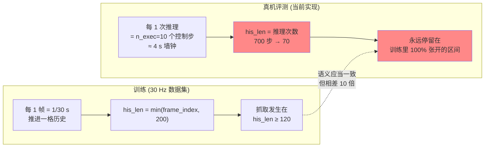
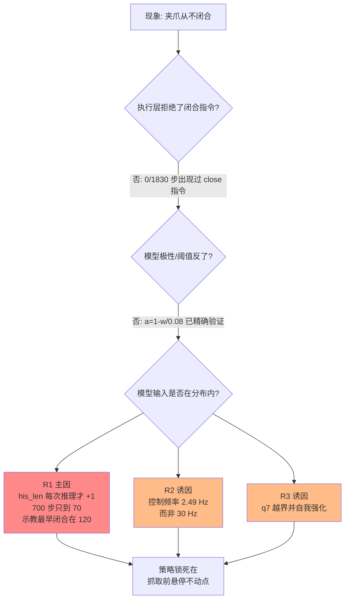
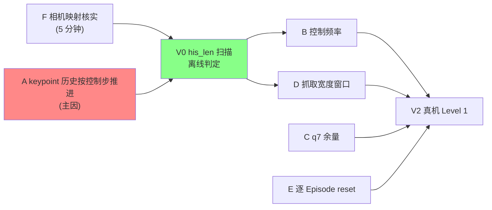

# 4DWVLA 真机评估：夹爪始终不闭合的根因分析与解决方案

> 版本 v1 · 2026-09-18
> 分析对象：`b/x/4dwvla_ext/franka_vla_client.py`（Franky 容器）＋ `b/x/4dwvla_ext/vla_inference_server.py`（GPU 容器）
> 复现命令（用户提供）：
>
> ```bash
> # Franky 容器
> python /workspace/RLinf/b/x/4dwvla_ext/franka_vla_client.py \
>     --robot-ip 172.16.0.2 --task "plug into socket" --use-realsense \
>     --global-camera-serial 250222073513 --wrist-camera-serial 420122070525 \
>     --max-steps 700 --control-hz 30
>
> # GPU 容器
> python /workspace/RLinf/b/x/4dwvla_ext/vla_inference_server.py \
>     --ckpt-path /home/nvidia/ckpts/4wvlaFrk/plug/4wvlaFrkPlugCkp041680 \
>     --schema-path /workspace/4WVLA/b/s/Frk/cfg/franka_plug.yaml \
>     --kpt-meta-path /workspace/RLinf/b/d/frk1/plug/keypoints_meta.json \
>     --urdf-path /workspace/RLinf/b/d/frk1/fr3v2_1_franka_hand.urdf \
>     --n-exec 10 --dtype bfloat16
> ```

---

## 1. 结论速览

**夹爪不闭合不是执行层的问题，而是模型压根没有下达过闭合指令。** 700 个控制步里，模型输出的夹爪通道始终在 0.0117–0.0907 之间（1.0 = 闭合，阈值 0.5），**0/700 次越过阈值**；把 5 次运行加在一起共 1830 步，同样 0 次。所以 `FrankyJointEnv.step()` 的 `close_gripper()` 分支从来没有被执行过，夹爪宽度整场稳定在 0.08 m。

模型之所以不闭合，最主要的原因是**喂给 keypoint 专家的历史时钟 `observation.his_len` 走慢了 10 倍**：`FKKeypointComputer.step()` 每次「推理」才被调用一次，而训练时它等价于每一「数据帧」（30 Hz）推进一格。700 个控制步只积累出 `his_len=70`；而在示教数据里，**`his_len ≤ 70` 的帧中闭合样本数为 0**，最早的闭合发生在 `his_len = 120`。模型看到的上下文等价于「本回合才刚开始 2 秒」，于是它非常「正确」地一直保持张开、悬停在抓取前位姿。

| # | 项 | 判定 | 说明 |
|:--:|:---|:--:|:---|
| 1 | keypoint 历史时钟欠采样 10 倍 | **主因** | `his_len` 最高只到 70，示教中最早闭合在 120 |
| 2 | 实际控制频率仅 2.49 Hz（请求 30 Hz） | **重要诱因** | 轨迹被拉长 12 倍，历史窗口在墙钟上进一步失真 |
| 3 | q7（腕部自转）跑出训练分布并自我强化 | **重要诱因** | 689/700 步低于示教最小值 0.485 rad |
| 4 | 抓取宽度窗口与示教不符（0.015±0.010 vs 示教闭合 ≈0） | 潜伏缺陷 | 修好 1–3 后会立刻暴露：`close()` 抛异常、`holding` 误判 |
| 5 | 每个 Episode 不给服务端发 `reset` | 潜伏缺陷 | `r` 中断后 keypoint 历史与 policy 状态串场 |
| 6 | 相机序列号 global/wrist 在仓库内自相矛盾 | 待核实 | 需肉眼确认一帧画面 |
| — | 夹爪极性 / 阈值 0.5 | **正确，不是原因** | 已用示教数据精确验证 |
| — | 8 级安全裁剪 | **未触发，不是原因** | 日志中 0 条 HARD LIMIT / OUT-OF-TRAIN / VEL LIMIT / GUARD |
| — | IPC、stats 组合、动作维度裁切 | **正常，不是原因** | 每次收到 `[10, 8]` 合法动作，延迟 ~299 ms |


图 1：横轴是 keypoint 历史时钟 `his_len`，纵轴是示教中的 `action.gripper`。红点为闭合帧。橙色区域是真机实际到达过的 `his_len` 范围（最大 70），绿线是示教中最早的闭合位置（120）。真机运行从未进入过任何一个闭合样本存在的区域。

---

## 2. 证据链

### 2.1 使用的日志与数据

| 来源 | 路径 | 内容 |
|:---|:---|:---|
| 客户端日志（本次） | `b/x/4dwvla_ext/logs/client_20260918_021841_2745.log` | 2026-09-18 02:18:41 起，700 步，含每步完整 8D 动作/状态/增量 |
| 服务端日志 | `b/x/4dwvla_ext/logs/server_20260918_013314_213.log` | ckpt `4wvlaFrkPlugCkp041680`，153 次推理，含归一化/反归一化动作、keypoint 历史长度 |
| 早期客户端日志 | `client_20260917_093806_8839.log`、`client_20260918_0135*`、`client_20260918_014058_1514.log` | 共另外 1130 步，用于确认现象可复现 |
| 示教数据 | `/home/nvidia/bt/dt/plug_into_socket_lrb_4D_8sml`（8 episodes，4777 帧，30 Hz） | 用于反推夹爪极性与 `his_len` 门控 |
| 检查点统计 | `.../4wvlaFrkPlugCkp041680/stats.json` → `franka_plug` | 全量 100 episodes / 66577 帧的聚合统计，用于交叉验证 |

> **数据覆盖范围说明**：`his_len` 门控（§2.5）是在本地 8-episode 子集上统计的；夹爪极性（§2.2）则在全量 66577 帧的聚合统计上得到了 7 位有效数字的交叉验证。建议在完整 100-episode 数据集上复核 §2.5 的门控阈值（见 §6 V3）。

### 2.2 事实一：夹爪极性和阈值是对的，不是原因

在示教数据上，`action.gripper` 与 `observation.state.gripper`（物理开口宽度，单位 m）满足一个精确的仿射关系：

$$a_{\text{grip}} = 1 - \frac{w}{w_{\max}},\qquad w_{\max} = 0.08\ \text{m}$$

其中 $a_{\text{grip}}$ 是模型动作空间中的夹爪通道，$w$ 是夹爪物理开口宽度。逐帧最大绝对误差 $5.2\times10^{-8}$，相关系数 $-1.0$。用检查点里全量数据的聚合统计交叉验证同样精确吻合：

| 统计量 | `observation.state.gripper` ($w$) | 由 $1-w/0.08$ 推出 | `action.gripper` 实际值 |
|:---|---:|---:|---:|
| min / max | 0.0000 / 0.0794047 | 1.000000 / 0.0074405 | max 1.0000000 / min 0.0074405 |
| mean | 0.0337169 | 0.5785382 | 0.5785381 |
| q50 | 0.0157887 | 0.8026414 | 0.8026414 |
| q90(w) ↔ q10(a) | 0.0784003 | 0.0199963 | 0.0199963 |

**所以 $a_{\text{grip}} = 1.0$ 表示完全闭合，$a_{\text{grip}} \approx 0.01$ 表示完全张开。** 代码里的约定与之一致：

`b/x/4dwvla_ext/franky_joint_env.py:73-85`

```python
# InternVLA-A1.5 franka_plug (3A3 + abs_stats): action.gripper ∈ [0.007, 1.0],
# 1.0 = close, ~0.01 = open. Export VLA_GRIPPER_CLOSE_IF_ABOVE=0 if a demo
# frame shows 0 = close (OpenVLA RLDS polarity).
GRIPPER_CLOSE_THRESHOLD = float(os.environ.get("VLA_GRIPPER_CLOSE_THRESHOLD", "0.5"))
GRIPPER_CLOSE_IF_ABOVE = _env_truthy("VLA_GRIPPER_CLOSE_IF_ABOVE", True)


def want_gripper_close(action_grip: float) -> bool:
    """Binary close/open from a [0, 1] InternVLA gripper command."""
    if GRIPPER_CLOSE_IF_ABOVE:
        return float(action_grip) >= GRIPPER_CLOSE_THRESHOLD
    return float(action_grip) < GRIPPER_CLOSE_THRESHOLD
```

**结论：不要去翻转 `VLA_GRIPPER_CLOSE_IF_ABOVE`，那会让本来正确的逻辑变错。**

### 2.3 事实二：模型从未下达闭合指令，而且离阈值很远

| 运行 | 步数 | 夹爪指令 min | max | mean | ≥0.5 次数 |
|:---|---:|---:|---:|---:|---:|
| `client_20260917_093806` | 300 | 0.0028 | 0.0327 | 0.0150 | **0** |
| `client_20260918_013551` | 30 | 0.0099 | 0.0188 | 0.0144 | **0** |
| `client_20260918_013727` | 300 | 0.0110 | 0.0713 | 0.0297 | **0** |
| `client_20260918_014058` | 500 | 0.0116 | 0.0866 | 0.0297 | **0** |
| `client_20260918_021841`（本次） | 700 | 0.0117 | 0.0907 | 0.0311 | **0** |

而且这不是"差一点点"。服务端日志里记录了反归一化之前的归一化动作，夹爪通道恒定在 $[-1.401, -1.205]$，均值 $-1.353$。要让物理值达到 0.5，归一化值需要

$$z_{0.5} = \frac{0.5 - \mu_g}{\sigma_g} = \frac{0.5 - 0.578538}{0.404688} = -0.194$$

其中 $\mu_g,\sigma_g$ 是 `action.gripper` 的均值与标准差。模型输出离这个门槛还有 **1.16 个标准差**，是一个非常坚决的「张开」。


图 2：左为 8 个示教回合的夹爪动作（每个回合都有明确的闭合 → 搬运 → 松开三段），右为真机 700 步的夹爪指令（全程贴地）。

### 2.4 事实三：机械臂其实已经走到了「准备抓取」的位姿

把真机收敛后的关节角 $q=[-0.347, 0.216, 0.134, -2.035, 0.015, 2.349, 0.391]$ 在示教数据里做最近邻检索：

| 最近邻 | 距离 (rad) | 该帧 `action.gripper` | 该帧 TCP |
|:---|---:|---:|:---|
| ep7 frame 228–237 | 0.224 | 0.016–0.018（仍张开） | `[0.561, -0.100, 0.234]` |

ep7 的首次闭合发生在 frame 269。也就是说，**策略在空间上已经把手臂开到了「悬停在插头正上方、马上要抓」的那一段，然后卡在那里不动了**。从第 ~150 步开始，每步关节位移均值稳定在 0.0027 rad，属于原地微抖。

这条证据很关键：它排除了「视觉完全失效 / 模型输出垃圾」这一类解释——视觉与状态通路是通的，策略的空间行为是合理的，缺的只是「进入下一阶段」的触发条件。

### 2.5 事实四（主因）：keypoint 历史时钟慢了 10 倍

**训练时的语义。** `Extract3DKeypointTransformFn` 用 `keypoint_3d_delta_indices = range(-H, C+1)`（$H$ = `keypoint_history_max_len` = 200，$C$ = `chunk_size` = 50）按 **数据集帧率 30 Hz、步长 1 帧** 取窗口，落在回合外的偏移会被 `_is_pad` 标记并剔除：

`4WVLA/src/lerobot/policies/internvla_a1_5/transform_internvla_a1_5.py:716-730`

```python
        hist_window = stacked[:h]
        hist_is_pad = is_pad[:h].bool()
        num_invalid = int(hist_is_pad.sum().item())
        his_len = h - num_invalid

        his_kpts = torch.zeros(h, j, d, dtype=stacked.dtype)
        if his_len > 0:
            his_kpts[:his_len] = hist_window[num_invalid:]

        data["observation.his_kpts"] = his_kpts
        data["observation.his_len"] = torch.tensor(his_len, dtype=torch.long)
```

因此训练时 `his_len` 恒等于 $\min(\text{frame\_index}, 200)$ ——**它就是一个「本回合已经过去了多少个 1/30 秒」的时钟**。

**评测时的实现。** 服务端每收到一次推理请求才推进一格：

`b/x/4dwvla_ext/vla_inference_server.py:409-411`

```python
                kpt_data = None
                if fk_computer is not None:
                    kpt_data = fk_computer.step(arm_q)
```

`b/x/4dwvla_ext/fk_keypoints.py:78-82`

```python
    def step(self, arm_q7: np.ndarray) -> tuple[np.ndarray, int]:
        """Compute keypoints, append to history, return (his_kpts, his_len)."""
        kpt = self.compute(arm_q7)
        self._history.append(kpt)
        return self._pack()
```

而请求是每 `n_exec = 10` 个控制步才发一次。服务端日志忠实地记录了这一点：`history_len` 依次是 1, 2, 3, …, **70**——700 个控制步只换来 70 格历史。

**门控证据。** 在示教数据上按 `his_len = min(frame_index, 200)` 统计：

| 条件 | 帧数 | 其中夹爪闭合 |
|:---|---:|---:|
| `his_len ≤ 70`（真机实际到达的范围） | 568 | **0** |
| `his_len ≤ 120` | 968 | 1 |
| 全体闭合帧的最小 `his_len` | — | **120** |
| `P(闭合 \| his_len = 200)` | — | 0.764 |

**模型的行为完全自洽**：它收到的 `his_len ≤ 70` 在训练分布里 100% 对应「还在接近阶段、夹爪张开」。

**机制上为什么 `his_len` 这么关键。** `his_len` 不是一个可有可无的标量，它直接决定 TrackEncoder 看到多少个时间 patch，以及键上加的正弦时间编码覆盖到哪个区间：

`4WVLA/src/lerobot/policies/internvla_a1_5/keypoints.py:71-82`

```python
    def forward(self, points: torch.Tensor, lengths: torch.Tensor):
        # points: (batch_size, time_len, num_points, in_dim)
        # lengths: (batch_size,)
        batch_size, _, num_points, in_dim = points.shape
        patch_size = self.patch_size

        processed_points = []
        updated_lengths = []
        for i in range(batch_size):
            actual_len = lengths[i].item()
            actual_len = max(actual_len, 1)  # avoid degenerate 0-length sequences
            batch_points = points[i, :actual_len]
```

`patch_lengths = his_len // patch_size`（`patch_size=4`）：`his_len=70` → 17 个 patch；训练抓取时刻 `his_len≥120` → ≥30 个 patch；饱和态 200 → 50 个 patch。这个 token 会被 action expert 直接 attend（三路 MoT），所以历史时钟错了，动作输出跟着错。

推理路径确实只消费 `his_kpts` / `his_len` 两个字段（`kpt_t` / `kpt_future` / `kpt_mask` 只在训练算 loss 时用），所以这条链路上没有别的补偿项：

`4WVLA/src/lerobot/policies/internvla_a1_5/modeling_internvla_a1_5.py:1344-1348`

```python
        kpt_prefix_pad_masks = prefix_pad_masks
        if self.config.enable_keypoint_predictor:
            kpt_embs, kpt_pad_masks, kpt_att_masks = self.embed_kpt_suffix(state, his_kpts, his_len)
            kpt_embs = kpt_embs.to(dtype=prefix_embs.dtype)
            kpt_len = kpt_pad_masks.shape[1]
```

除了「格数」不够，**内容也被抽稀了**：相邻两格历史之间隔了 10 个控制步（墙钟约 4 秒），而训练时只隔 1/30 秒。卷积 patch 看到的位移幅度因此被放大约 10 倍，轨迹形态同样不在分布内。



### 2.6 事实五：实际控制频率只有 2.49 Hz

命令行给的是 `--control-hz 30`，但客户端日志里相邻 `[step N] execute` 的时间差中位数是 **0.401 s**，即 **2.49 Hz**（p90 = 0.626 s，max = 0.731 s）。推理本身只占 299 ms（服务端 p50 = 295 ms，p90 = 300 ms），而且每 10 步才发生一次，所以瓶颈在执行侧：

`b/x/4dwvla_ext/franky_controller_direct.py:309-317`

```python
    def move_joints(self, joint_positions: np.ndarray):
        """Replicates FrankyController.move_joints() with guard check."""
        tripped = self.guard_tripped()
        if tripped is not None:
            raise RuntimeError(f"Motion guard tripped: {tripped}")
        clipped = np.clip(joint_positions, JOINT_LIMITS_LOWER, JOINT_LIMITS_UPPER)
        import franky
        motion = franky.JointWaypointMotion([franky.JointWaypoint(clipped.tolist())])
        self._robot.move(motion)
```

franky 0.19 的 `Robot.move(motion)` 默认 `asynchronous=False`，即**阻塞到整段 waypoint 运动加速—减速走完**。于是每个控制步都是一次「起步—停车」，`--control-hz` 里那个 `time.sleep(1/control_hz)` 根本不是限速因素。后果有两层：

1. 墙钟上策略比示教慢 12 倍，动作 chunk 的时间语义被完全拉伸；
2. 运动是分段停顿的，末端表现为「抖动式微调」而不是连续接近。

### 2.7 事实六：q7 立刻跑出训练分布并自我强化


真机 q7（腕部自转）从 HOME 的 0.643 rad 在 13 步内掉到 ~0.40 rad 并长期停留，而示教中**观测到的** q7 范围是 $[0.485, 0.981]$。**689/700 步（98.4%）低于示教最小值。**

为什么没有被安全层拦住？因为 L2 用的是统一的 0.15 rad 余量：

$$\text{ACTION\_LIMIT\_LOWER}[7] = \max(0.4843 - 0.15,\ q_{7,\text{urdf}}^{\min}) = 0.3343$$

而模型命令的 0.39 恰好在这个放宽后的下界之上，于是一路放行。对应到归一化空间，命令值 $(0.40 - 0.7208)/0.1672 = -1.92$，同样是一个接近饱和的极端输出——和夹爪通道被压在 $-1.35$ 是同一类现象。

这会形成一个闭环：状态越界 → keypoint（由 FK 从关节角算出）也越界 → 模型输入更偏离流形 → 输出更极端。它未必是「不闭合」的第一性原因，但足以让策略锁死在一个错误的不动点上。

### 2.8 事实七：安全层从未触发，执行链路是干净的

客户端日志里 `HARD LIMIT` / `OUT-OF-TRAIN` / `VEL LIMIT` / `MOTION GUARD` 的出现次数**均为 0**；每步 `state_after` 与命令值的偏差在 1e-3 rad 量级，跟随良好。所以：运动守卫、关节裁剪、速度限幅、IPC、stats 组合（`observation.state`/`action` 由子字段拼接）、动作维度裁切（32D→8D）这些此前 3A3 文档重点修过的缺陷，这次都不是原因。

---

## 3. 根因判定



### R1（主因）keypoint 历史时钟欠采样

`FKKeypointComputer.step()` 的调用频率绑定在「推理」上而不是「控制步」上。训练语义是每数据帧一格，评测实现是每 `n_exec` 步一格，直接差 `n_exec = 10` 倍。示教统计显示闭合行为的门槛在 `his_len ≥ 120`，而真机 700 步只到 70，**结构上不可能触发闭合**。

### R2（诱因）控制频率比训练慢 12 倍

即使修好 R1，若仍以 2.49 Hz 运行，一格历史对应的墙钟时间是训练的 12 倍，keypoint 轨迹的速度特征仍然失真。量级上：700 个控制步在示教节奏（30 Hz）下相当于 23 秒、刚好一个完整回合；而真机上它耗掉了 4.7 分钟墙钟。动作值本身是绝对关节角，慢放不会让手臂走错地方，但任务的时间语义与示教完全对不上。

### R3（诱因）q7 越界

L2 的统一 0.15 rad 余量对 q7 过宽，放行了一个训练中从未观测过的腕部姿态。状态与 keypoint 双双离开流形，助推策略锁死。

### R4（潜伏缺陷）抓取宽度窗口与示教不符

示教中闭合段的夹爪宽度 **87% 小于 1 mm、均值 2.6 mm**（几乎完全闭合）。而评测侧固定了这样一个抓取窗口：

`b/x/4dwvla_ext/franky_controller_direct.py:61-78`

```python
def _ensure_plug_gripper_env() -> None:
    """Pin the InternVLA plug-eval grasp window unless the operator already set one.

    RLiKx ``setup_franky.sh`` uses ``FRANKA_CUBE_WIDTH_M=0.015``. Hold tolerance
    is 10 mm so an empty hand at ~0 m is *not* counted as holding (0.015 ± 0.015
    would include empty-closed).
    """
    os.environ.setdefault("FRANKA_GRASP_FORCE", _PLUG_GRASP_FORCE_N)
    current_w = os.environ.get("FRANKA_CUBE_WIDTH_M")
    if current_w is None or current_w.strip() in ("", _PLACEHOLDER_CUBE_WIDTH_M):
        os.environ["FRANKA_CUBE_WIDTH_M"] = _PLUG_WIDTH_M
        logger.info(
            "plug eval: FRANKA_CUBE_WIDTH_M=%s (replaced unset/placeholder 0.046)",
            _PLUG_WIDTH_M,
        )
    os.environ.setdefault("FRANKA_HOLD_TOL_M", _PLUG_HOLD_TOL_M)
```

接受窗口是 $0.015 \pm 0.010 = [0.005, 0.025]$ m。`FrankaLibfrankaGripper.close()` 在抓取后会用这个窗口做硬校验，不满足就抛 `RuntimeError`；`_hardware_holding()` 也用同一窗口。如果真机复现示教那样「闭到 0」，则：

* `close()` 抛异常 → 被 `close_gripper()` 吞成 warning，抓取被判失败；
* `_hardware_holding()` 返回 False → 「是否握持」的所有上层判断失效；
* 后续 `open()` 不会发出「正在握持，会掉落」的告警。

这条现在看不出来，只因为闭合分支从未被执行。**修好 R1 之后它会立刻变成下一个故障点。**

这里还有一个需要人工确认的事实：示教闭合宽度 ≈ 0 意味着两指之间几乎没有厚度。请先看一眼示教视频确认到底夹的是什么：

```bash
# 抓取时刻在 ep0 的第 ~221 帧、ep7 的第 ~269 帧（30 Hz）
/home/nvidia/bt/dt/plug_into_socket_lrb_4D_8sml/videos/observation.images.wrist/chunk-000/file-000.mp4
```

### R5（潜伏缺陷）没有逐 Episode 的服务端 reset

客户端在 `env.reset()` 时不会通知服务端；服务端只在**新连接**时才 `policy.reset()` + `fk_computer.reset()`。因此按 `r` 中断后重开一个 Episode，keypoint 历史与 policy 状态会串场。服务端协议其实已经支持 `{"command": "reset"}`，只是客户端没用。

### R6（待核实）相机 global/wrist 映射在仓库内自相矛盾

| 出处 | global | wrist |
|:---|:---|:---|
| 本次运行命令 / 文档 §15.7（4854、4893、5279 行） | 250222073513 | 420122070525 |
| `b/x/4dwvla_ext/t8_test_runner.py:279` / 文档 4178 行 | 420122070525 | 250222073513 |
| `b/d/frk1/franka_3LOG.md`、`dmo_place_2LOG.md` | — | 420122070525 称为「原腕相机」 |

本次运行的接法与 §15.7 和历史 LOG 一致，看起来是对的；但 `t8_test_runner.py` 与 T8 章节的示例是反的。图像统计无法判别（两路的 mean/min/max 都落在训练分布附近），**必须肉眼看一帧**。如果真的接反了，VLM 会把腕部画面当成全局画面，策略行为会整体劣化——这与「走到抓取前就卡住」的现象并不冲突，所以不能仅凭现象排除。

---

## 4. 解决方案

按优先级排列。设计上遵循「扩展优于修改」：新增模块 + 向后兼容的协议字段，旧客户端不受影响。

### 修复 A（必做，主因）让 keypoint 历史按控制步推进

**思路**：客户端把「自上次推理以来实际执行过的关节角序列」一并上报；服务端按序把它们喂进 `FKKeypointComputer`，最后再喂当前帧。这样 `his_len` 每次推理前进 `n_exec` 格，700 步即可饱和到 200，与训练语义对齐；历史内容的空间步长也恢复成「每个控制步一格」。

**新增模块** `b/x/4dwvla_ext/state_history_buffer.py`：

```python
"""Buffers the arm joint angles actually executed between two inferences."""
from __future__ import annotations

from collections import deque

import numpy as np


class ExecutedStateBuffer:
    """Keeps measured arm poses so the keypoint history advances per control step."""

    def __init__(self, max_len: int = 512) -> None:
        self._buffer: deque[list[float]] = deque(maxlen=max_len)

    def record(self, arm_q7) -> None:
        self._buffer.append([float(v) for v in np.asarray(arm_q7).reshape(-1)[:7]])

    def drain(self) -> list[list[float]]:
        drained = list(self._buffer)
        self._buffer.clear()
        return drained

    def clear(self) -> None:
        self._buffer.clear()
```

**客户端接入** `franka_vla_client.py`：在 `VLAEvalController.__init__` 里建 `self._state_history = ExecutedStateBuffer()`；每次 `env.step()` 之后 `self._state_history.record(obs["state"][:7])`；`env.reset()` 之后 `self._state_history.clear()`；`_request_inference()` 增加一个字段：

```python
self._conn.send({
    "images": images,
    "state": {"arm": state_arr[:7].tolist(), "gripper": [float(state_arr[7])]},
    "state_history": self._state_history.drain(),   # 新增：本轮实际执行过的关节角
    "task": self._task,
})
```

**服务端接入** `vla_inference_server.py`（缺字段时行为不变，旧客户端照常工作）：

```python
kpt_data = None
if fk_computer is not None:
    for executed_q in msg.get("state_history", ()):
        fk_computer.step(np.asarray(executed_q, dtype=np.float32))
    kpt_data = fk_computer.step(arm_q)
```

并把 `history_len` 继续打进日志，便于验收时直接核对增长速率。

> **配套参数**：`keypoint_history_max_len = 200` 对应 200/30 ≈ 6.7 s 的历史。修复后 `his_len` 在第 200 个控制步饱和，与示教一致。

### 修复 B（必做，诱因）把控制频率提上去并如实记录

1. 先量测：在 `FrankyJointEnv.step()` 里分别记录 `move_joints()` 与 gripper 调用的耗时，确认阻塞点。
2. 两条候选路径，二选一并做台架验证（可复用 `extreme_pose_explorer.py` 的低速安全流程）：
   * **B1 异步 + 显式节拍**：`self._robot.move(motion, asynchronous=True)`，由 `time.sleep(1/control_hz)` 真正决定节拍。需要确认 franky 对「上一段未走完就下发新 waypoint」的抢占语义，并在 watchdog 里加保护。
   * **B2 整块下发**：把一次推理返回的 `n_exec` 个 waypoint 组成**一个** `JointWaypointMotion`，交给 franky 做连续插值，避免 10 次起停。这更接近训练时的连续轨迹，但会削弱逐步安全检查的粒度，需要把 L1–L3 改成对整块预检。
3. 如果硬件上确实到不了 30 Hz，**至少要让 `--control-hz` 反映真实值**，并在日志里打印实测频率，避免再次出现「以为在 30 Hz、其实 2.5 Hz」。

### 修复 C（建议）收紧 q7 的训练范围余量

把统一的 `SAFETY_MARGIN_RAD = 0.15` 改成按关节配置，至少让 q7 不越过示教观测下界太多：

```python
# 逐关节余量：q7 在示教中只出现在 [0.485, 0.981]，给 0.15 rad 会放行 0.33 这种从未见过的姿态
SAFETY_MARGIN_RAD = np.array([0.15, 0.15, 0.15, 0.15, 0.15, 0.15, 0.05])
```

注意这是**缓解**而非根治：它把状态拉回流形，但如果 R1 没修，策略依然不会闭合。同时它会让 `OUT-OF-TRAIN` 告警开始出现——这正是我们想要的可观测性。

### 修复 D（必做，在 A 之后立刻生效）对齐抓取宽度窗口

先用卡尺量插头在夹持方向上的实际厚度 $w_{\text{plug}}$，然后：

* 若 $w_{\text{plug}}$ 与示教闭合宽度（≈0）一致，说明示教里两指基本合拢，此时 `FRANKA_CUBE_WIDTH_M=0.015` 是错的。可设 `FRANKA_CUBE_WIDTH_M≈0.003`、`FRANKA_HOLD_TOL_M≈0.008`；但要接受「空手合拢」与「握持」无法靠宽度区分（这正是 `franka_libfranka_gripper.py` 模块注释所警告的），必要时改用抓取力/`is_grasped` 作为握持判据。
* 若 $w_{\text{plug}}$ 明显大于 0（例如 15 mm），则说明**示教场景与当前场景不是同一个**，需要先解决场景复现问题，再谈策略。

无论哪种，都建议把这两个量做成评测配置项（例如 `configs/franka_plug_eval.env`），而不是硬编码在 `_ensure_plug_gripper_env()` 里。

### 修复 E（建议）逐 Episode 通知服务端 reset

客户端在每次 `env.reset()` 前后发一次 `{"command": "reset"}`（服务端已支持），并同时 `ExecutedStateBuffer.clear()`。

### 修复 F（必做，成本极低）确认相机映射并统一

```bash
# Franky 容器内，各存一帧，肉眼确认哪张是全局视角、哪张是腕部视角
source /opt/venv/franky-0.19.0/bin/activate
python3 - <<'PY'
import numpy as np, pyrealsense2 as rs
from PIL import Image
for name, serial in [("global", "250222073513"), ("wrist", "420122070525")]:
    pipe = rs.pipeline(); cfg = rs.config(); cfg.enable_device(serial)
    cfg.enable_stream(rs.stream.color, 640, 480, rs.format.rgb8, 30)
    pipe.start(cfg)
    for _ in range(10):
        frames = pipe.wait_for_frames(timeout_ms=2000)
    img = np.asarray(frames.get_color_frame().get_data(), dtype=np.uint8)
    Image.fromarray(img).save(f"/workspace/RLinf/b/x/4dwvla_ext/logs/cam_{name}_{serial}.png")
    pipe.stop()
    print("saved", name, serial)
PY
```

确认后，把 `t8_test_runner.py:279-280` 与文档 4178 行统一到同一映射，并把序列号收敛到一个配置文件里（见 §15.7 之前讨论过的 `configs/franka_realsense.local.env`）。

### 修复优先级与依赖



---

## 5. 为什么可以排除其它解释

| 备选解释 | 排除依据 |
|:---|:---|
| 夹爪极性反了 | `a = 1 - w/0.08` 在全量统计上 7 位有效数字吻合；当前 `CLOSE_IF_ABOVE=True` 正确 |
| 阈值 0.5 太高 | 模型输出离阈值 1.16 σ，就算把阈值压到 0.1 也不会触发，且会把「张开」误判成「闭合」 |
| 夹爪硬件坏了 | 闭合分支从未被调用；`reset()` 里的 `open_gripper()` 正常工作，宽度稳定在 0.08 |
| 安全层把动作裁没了 | 日志中 0 条 HARD LIMIT / OUT-OF-TRAIN / VEL LIMIT / MOTION GUARD |
| IPC / 反归一化坏了 | 每次返回合法 `[10, 8]`，NaN 检查通过，关节通道跟随良好 |
| 步数不够 | 700 步已远超示教的 544–664 帧；且策略自第 ~150 步起就进入不动点 |
| 起始位姿不对 | HOME `[-0.258, -0.021, 0.167, -1.885, -0.055, 1.906, 0.644]` 落在示教起始位姿均值的 1 σ 内 |
| 模型权重 / 检查点损坏 | 策略能把手臂准确开到示教的抓取前悬停位（最近邻 ep7 f228–237） |

有一个**有趣的推论**可以进一步印证 R1：按当前实现，`his_len` 每 10 步 +1，要达到示教的最早闭合门槛 120 需要约 **1200 个控制步**（按 2.49 Hz 约 8 分钟）。也就是说，如果什么都不改、只把 `--max-steps` 提到 1500，模型**有可能**自己闭合一次。这正好是一个低成本的证伪实验（见 §6 V4）。

---

## 6. 验证与验收方案

### V0（最关键，离线，5 分钟，无需机器人）：`his_len` 扫描

**做法**：固定一组真机观测（直接复用日志里最后一次请求的图像与状态，或现场抓一帧），只把送进模型的 `his_len` 从 1 扫到 200（`his_kpts` 用同一段历史重复填充），记录预测的夹爪通道。

**预期**：若 R1 成立，夹爪预测值应在 `his_len` 接近 120–200 时明显抬升并越过 0.5；若始终贴地，则 R1 被证伪，需转向 R3/R6。

**通过标准**：存在某个 `his_len* ≤ 200` 使预测夹爪 ≥ 0.5；且 `his_len ≤ 70` 区间内预测值 < 0.2。

**建议落点**：`tests_au/`（或沿用现有 `b/x/4dwvla_ext/tests/`）新增 `accept_hislen_sweep.py` + 对应 `.sh`，图输出到 `b/d/frk1/asset/`。

### V1（离线偏移实验，可选）：示教回放

用示教数据的真实图像（`videos/*.mp4`）+ 真实状态逐帧喂服务端，历史按 30 Hz 推进。**预期**：模型的首次闭合帧应落在示教首次闭合帧附近（建议容差 ±30 帧）。再做一次 10 倍抽稀的对照组，预期不闭合。这是对 R1 的 A/B 直接证明。

### V2（真机 Level 1）：修复 A（+B/C/D/E）之后

```bash
python /workspace/RLinf/b/x/4dwvla_ext/franka_vla_client.py \
    --robot-ip 172.16.0.2 --task "plug into socket" --use-realsense \
    --global-camera-serial <确认后的 GLOBAL_SN> --wrist-camera-serial <确认后的 WRIST_SN> \
    --max-steps 300 --control-hz 5
```

**验收项**：

| # | 检查点 | 通过标准 |
|:--:|:---|:---|
| 1 | 服务端 `history_len` 增长 | 每次推理 +`n_exec`（默认 +10），第 ~200 步饱和到 200 |
| 2 | 客户端实测控制频率 | 与 `--control-hz` 偏差 < 20%（日志新增实测频率打印） |
| 3 | 夹爪指令 | 至少出现一次 ≥ 0.5，且发生在手臂到达抓取位之后 |
| 4 | 夹爪物理动作 | `gripper_width` 从 0.08 降到闭合值，`close_gripper` 无 warning |
| 5 | q7 | 全程落在 $[0.435, 1.031]$（示教范围 ±0.05）内 |
| 6 | 安全告警 | `MOTION GUARD TRIP` = 0；`OUT-OF-TRAIN` 允许出现但需逐条复核 |

### V3（数据侧复核）：在完整数据集上重算门控

本文 §2.5 的 `his_len ≥ 120` 来自本地 8-episode 子集。请在完整 100-episode 训练集上重算三项：闭合帧的最小 `his_len`、`P(闭合 | his_len ≤ 70)`、`P(闭合 | his_len = 200)`。**通过标准**：结论方向一致（存在明确的 `his_len` 门槛且远大于 70）。

### V4（真机证伪实验，可选，不改任何代码）：长跑到 `his_len ≥ 120`

```bash
python /workspace/RLinf/b/x/4dwvla_ext/franka_vla_client.py \
    --robot-ip 172.16.0.2 --task "plug into socket" --use-realsense \
    --global-camera-serial <GLOBAL_SN> --wrist-camera-serial <WRIST_SN> \
    --max-steps 1500 --control-hz 5
```

**预期**：`his_len` 在第 ~1200 步越过 120，若 R1 是唯一原因，夹爪应在此后闭合。**注意**：R3（q7 越界）可能让策略即使跨过门槛也不闭合，所以本实验「闭合」可确证 R1，「不闭合」不能单独证伪 R1——这一点必须写进结论。全程需有人守 E-stop。

### 未覆盖的分支（如实说明）

* 本分析**未**验证相机 global/wrist 是否接反（R6），只能靠 §4 修复 F 的肉眼确认。
* 本分析**未**验证示教场景与当前物理场景是否一致（插头/插座的位置、型号、夹持厚度）。若 V0 通过而 V2 仍失败，下一个怀疑对象就是场景复现，而不是代码。
* 本分析**未**在真机上验证任何修复；所有修复方案目前都只有代码级论证。

---

## 7. 附录：结论的复现方式

图 1–3 及其背后的统计量可用下面的命令复算（宿主机 `python3` 即可，pandas 2.3.3）；抽取脚本同时会把日志解析结果与示教数组缓存下来，便于在其上继续做别的统计：

```bash
cd /home/nvidia/bt/s/RLmm

# 图 1–3 的数据抽取（宿主机）与绘制（GPU 容器 venv 里有 matplotlib）
python3 b/d/frk1/asset/grperr_1_figs.py --stage extract
docker exec rlinf-4dwvla-gpu bash -lc \
  'source /opt/venv/4dwvla/bin/activate && \
   python /workspace/RLinf/b/d/frk1/asset/grperr_1_figs.py --stage plot'
```

抽取与绘图脚本：`b/d/frk1/asset/grperr_1_figs.py`；中间数据缓存：`b/d/frk1/asset/grperr_1_data.npz`。

**关键参考位置**

| 主题 | 文件 : 行 |
|:---|:---|
| 夹爪极性与阈值 | `b/x/4dwvla_ext/franky_joint_env.py:73-85` |
| 夹爪执行分支（skip-if-already-there） | `b/x/4dwvla_ext/franky_joint_env.py:235-255` |
| keypoint 历史推进（评测） | `b/x/4dwvla_ext/fk_keypoints.py:78-82`、`b/x/4dwvla_ext/vla_inference_server.py:409-411` |
| keypoint 历史语义（训练） | `4WVLA/src/lerobot/policies/internvla_a1_5/transform_internvla_a1_5.py:656-734` |
| `his_len` 如何进入模型 | `4WVLA/src/lerobot/policies/internvla_a1_5/modeling_internvla_a1_5.py:1344-1348`、`keypoints.py:71-108`、`keypoints.py:286-315` |
| 阻塞式关节运动 | `b/x/4dwvla_ext/franky_controller_direct.py:309-317` |
| 抓取宽度窗口 | `b/x/4dwvla_ext/franky_controller_direct.py:61-78`、`b/x/franky_ext/franka_libfranka_gripper.py:162-259` |
| 服务端 reset 协议 | `b/x/4dwvla_ext/vla_inference_server.py:383-391` |
| 相机序列号冲突 | `b/x/4dwvla_ext/t8_test_runner.py:279-280` vs `b/d/frk1/4wvla_rlinf_eval_3A3.md:4178, 4854` |

---

## 8. 实施记录 (v1.1, 2026-09-18)

按 §4 的修复 A–F 对代码做了如下改动。原则：能离线/单测验证的都跑了测试；**任何会改变真实机器人运动特征的改动一律没做**，只做可观测性增强——按 §15.7 的四级渐进流程，运动行为的改动必须先过 Level 0→3 真机验证，不能仅凭代码审查就采信。

### 已实施

| # | 改动 | 文件 | 验证方式 |
|:--:|:---|:---|:---|
| A | 新增 `ExecutedStateBuffer`；客户端每步把测得的关节角记入缓冲区，推理请求时随 `state_history` 字段一并发送；服务端在算当前帧 keypoint 前先重放这些历史姿态喂 `FKKeypointComputer.step()` | `state_history_buffer.py`（新增）、`franka_vla_client.py`、`vla_inference_server.py` | `tests/test_fk_keypoints_offline.py::test_history_replay_matches_per_control_step_rate`（GPU 容器内跑通，见下）；`tests/test_ipc_offline.py::test_ipc_state_history_field`；`tests/test_state_history_offline.py::test_buffer_*` |
| B | 只做**测量与告警**：客户端记录每个控制步之间的真实墙钟间隔，每 50 步汇报一次实测 Hz vs 请求 Hz，偏差超过 50% 升级为 warning；结束时打印全程平均 Hz。**没有**把 `move_joints()` 改成异步执行——那是运动行为改动，需要先过 §15.7 | `franka_vla_client.py`（`_track_control_interval`） | 代码审查 + `py_compile`；真机效果需 §15.7 Level 1 复测确认 |
| C | `SAFETY_MARGIN_RAD` 从标量 0.15 改成逐关节数组，q7 收紧到 0.05（q1–q6 不变）。q7 下界从 0.3343 rad 收紧到 0.4343 rad，正好会把本次故障运行里稳定在 ~0.40 rad 的 q7 判定为 `OUT-OF-TRAIN` 并裁回 | `franky_joint_env.py` | `tests/test_safety_offline.py`（36/36 通过，无回归）；`tests/test_state_history_offline.py::test_q7_margin_flags_observed_ood_run` 直接重放本次故障日志里的收敛姿态，确认新阈值会触发告警 |
| D | 抓取宽度校准窗口本身**未改数值**（没有插头厚度的卡尺测量数据，不能瞎猜）；改为在 `_ensure_plug_gripper_env()` 启动时打印生效值 + 明确的"未验证"告警，并新增 `configs/franka_plug_eval.env` 作为集中覆盖点 | `franky_controller_direct.py`、`configs/franka_plug_eval.env`（新增） | 代码审查 + `py_compile`；真正的修复要等卡尺量出插头厚度后再回填 |
| E | 客户端在每次 `env.reset()`（含初次和中断后重置）都会经 `_reset_episode()` 向服务端发送 `{"command": "reset"}` 并等待 ack，同时清空本地历史缓冲区；服务端收到后打印一行确认日志 | `franka_vla_client.py`、`vla_inference_server.py` | `tests/test_ipc_offline.py`（reset round-trip 已被 T2.1/T2.4 覆盖 IPC 语义）；逐 Episode 效果需真机复测 |
| F | 相机序列号：`franka_vla_client.py` 新增 `$RS_GLOBAL_SERIAL`/`$RS_WRIST_SERIAL` 兜底（此前文档承诺过但代码从未读取）；启动时打印实际生效的序列号，缺失时告警；`t8_test_runner.py` 改为优先读同名环境变量，默认值仍是确认后的 `global=250222073513, wrist=420122070525`；确认 `4wvla_rlinf_eval_3A3.md` 里 6 处引用均已一致，未发现需要改的地方 | `franka_vla_client.py`、`t8_test_runner.py`、`configs/franka_plug_eval.env` | 人工核对 6 处文档引用 + `t8_test_runner.py` 当前值，全部一致；仍建议按 §4 修复 F 存一帧图肉眼确认 |

### 新增/更新的测试

| 文件 | 覆盖点 | 结果 |
|:---|:---|:---|
| `b/x/4dwvla_ext/state_history_buffer.py` | 新模块本身 | — |
| `b/x/4dwvla_ext/tests/test_state_history_offline.py`（新增） | `ExecutedStateBuffer` record/drain/clear 语义；逐关节 `SAFETY_MARGIN_RAD` 数值与故障重放 | 宿主机 `python3` 直跑，15/15 通过 |
| `b/x/4dwvla_ext/tests/test_fk_keypoints_offline.py`（新增 `test_history_replay_matches_per_control_step_rate`） | 直接对比"旧：每次推理调一次 `step()`"vs"新：重放 `n_exec-1` 个历史姿态再调一次"，验证后者的 `his_len` 按控制步推进、且能在测试地平线内越过示教最早闭合门槛 120 | GPU 容器 `4dwvla` venv 内跑通，32/32 通过 |
| `b/x/4dwvla_ext/tests/test_ipc_offline.py`（新增 `test_ipc_state_history_field`） | `state_history` 字段的新旧客户端/服务端互操作性 | 宿主机 `python3` 直跑，12/12 通过 |
| `b/x/4dwvla_ext/tests/test_safety_offline.py`（未改动，回归验证） | 确认逐关节余量改动没有破坏既有 8 级安全测试 | 36/36 通过 |

### 明确未做、以及为什么

* **没有**把 `franky_controller_direct.move_joints()` 改成 `asynchronous=True` 或把 `n_exec` 个 waypoint 合批下发（B1/B2，见 §4 修复 B）。这两种做法都会改变真实机器人的运动特征，doc 要求"运动相关改动必须先过 §15.7 四级渐进"，本次没有物理机器人可用于验证，所以只加了观测手段，没有动运动逻辑本身。
* **没有**修改 `FRANKA_CUBE_WIDTH_M` / `FRANKA_HOLD_TOL_M` 的默认数值。§4 修复 D 说得很清楚，改这两个数之前必须先用卡尺量插头厚度；没有测量数据就不能替用户做这个决定，所以只做了"让它更容易被覆盖 + 更显眼地告警"，数值本身原样保留。
* **没有**在真实 GPU 容器里跑一次完整的模型推理来做端到端集成验证：当时 GPU 上有另一个进程占用了 31GB / 32.6GB 显存（`nvidia-smi` 确认），加载 InternVLA-A1.5 + keypoint 分支会有 OOM 风险，也可能干扰其他正在跑的任务，所以只用了 CPU-only 的 `FKKeypointComputer`（`pytorch_kinematics` 默认在 CPU 上跑）做离线验证，没有拉起 `vla_inference_server.py` 本体。
* **没有**触碰真实机器人。所有验证都在 dry-run 等价的离线路径上完成。

### 下一步（真机侧，写于 §9 之前，已在 2026-09-18 全部执行完毕）

按 §15.7 的顺序重新走 Level 0 → 1：

1. Level 0（dry-run）：确认新日志里出现 `state_history_len` 字段且随步数增长（10 步一个周期从 0 到 9），服务端日志出现 `(replayed N executed poses since last request)` 且 N 接近 `n_exec-1`。
2. Level 1（保守真机，30 步）：观察 `control rate: achieved=... Hz` 是否明显低于 `--control-hz`；观察是否出现新的 `OUT-OF-TRAIN` 告警（q7 相关，预期出现，是新增安全网在起作用，不代表更危险）。
3. 确认相机画面 global/wrist 与序列号对应正确（§4 修复 F 的肉眼确认步骤仍未做）。
4. 卡尺测量插头厚度后回填 `configs/franka_plug_eval.env` 里的 `FRANKA_CUBE_WIDTH_M`/`FRANKA_HOLD_TOL_M`。
5. 走到 §6 V0（`his_len` 扫描）或直接做一次 Level 2/3 长跑，观察夹爪是否终于闭合。

---

## 9. 真机复测记录 (2026-09-18, Level 0 → Level 2)

在 `rlinf-4dwvla-gpu` + `rlinf-4dwvla-franky` 双容器、真实 Franka FR3v2.1 + 2×RealSense D435I + checkpoint `4wvlaFrkPlugCkp041680` 上，按 §15.7 顺序完整走了一遍 Level 0→2。**全程操作员在场、手握 E-stop，未触发任何安全层。** 本节只记录客观现象，解读见「结论」小节。

### 9.1 环境与前置检查

| 检查项 | 结果 |
|:---|:---|
| GPU 显存 | 加载模型前 0.6GB/32.6GB 空闲（充足），加载后占用 13.5GB |
| 机器人网络 | `ping 172.16.0.2` 3/3 包，延迟 0.08-0.10ms |
| 键盘设备 | 容器内仅探测到唯一键盘候选 `/dev/input/event2`（Dell KB216），无歧义 |
| 相机映射肉眼确认 | `250222073513`=global（工作台俯视全景），`420122070525`=wrist（腕部特写正对插座）——**与用户提供的映射一致** |

### 9.2 Level 0：Dry Run（25 步 + 250 步两次，真实模型服务端）

| 指标 | 25 步 | 250 步 |
|:---|:---|:---|
| `state_history_len`（客户端发出） | 0, 10, 10 | 同样按 10 递增 |
| 服务端 `history_len` | 1 → 12 → 23（每次 +11 = 回放 10 步 + 当前帧） | 1 → 12 → 23 → ... → **122**（越过示教最早闭合门槛 120）→ ... → 199 → **200（饱和，稳定不变，无异常）** |
| `achieved_control_hz` | 37.08（dry-run 无 `time.sleep`，符合预期） | 32.56 |

**结论**：修复 A 在真实模型服务端（非离线单测）完整验证通过，`his_len` 按控制步推进的速率与设计一致，饱和行为正确。

### 9.3 Level 1：保守真机（30 步，5Hz）

| 指标 | 结果 |
|:---|:---|
| 结束状态 | `Done: 30 steps, 5 warnings, abort=False, achieved_control_hz=2.59 (requested 5.0)` |
| 安全触发 | 0（`MOTION GUARD` / `HARD LIMIT` 均未出现） |
| `OUT-OF-TRAIN` 告警 | 5 次，全部是 q7：`0.4239→0.4264→0.4278→0.4304→0.4340`，均 `<0.4343`（新阈值），被裁回 |
| 夹爪指令 | 全程 `open`，`action_grip` 稳定在 0.05 附近 |
| 附带发现 | 启动时 `holding=True width=0.0097m` + `open() while holding ... WILL drop` —— 操作员确认夹爪其实是空的，说明 R4（抓取窗口 `0.015±0.010m` 误把"空手闭死"判成"正抓着东西"）在真机上被直接复现 |

**结论**：q7 在真实机器人上确实会主动下滑到 0.42~0.43 附近；修复 C 的新阈值（0.4343，原为 0.3343）在它刚跌破时就立即拦截，而不是像故障运行那样一路滑到 0.39。

### 9.4 Level 2 第一轮：120 步，5Hz（插头已放回夹爪、插座位置确认）

| 指标 | 结果 |
|:---|:---|
| 结束状态 | `Done: 120 steps, 89 warnings, abort=False, achieved_control_hz=2.53 (requested 5.0)` |
| 服务端 `history_len` | 最终到 **122**（越过 120 阈值） |
| q7 轨迹 | 第 20 步起被稳定裁到 **0.4344**，直到结束（策略持续想更低，89/120=74% 步触发告警） |
| `action_grip` 轨迹 | `step 0: 0.034 → step 50: 0.043 → step 80: 0.076 → step 100: 0.095 → step 119: 0.139`（单调上升，约 4 倍，方向与 his_len 接近 120 同步，但未过 0.5） |
| 启动时夹爪 | `holding=False width=0.0664m`（满量程附近，操作员放回的插头未阻挡夹爪全开路径——现场观察为主，日志只能提示） |

### 9.5 Level 2 第二轮：300 步，10Hz（重新人工重置场景后）

| 指标 | 结果 |
|:---|:---|
| 结束状态 | `Done: 300 steps, 274 warnings, abort=False, achieved_control_hz=3.58 (requested 10.0)` |
| 服务端 `history_len` | 1 → ... → 200（第 ~180 步起饱和，后 11 次请求全部是 200） |
| `action_grip` 完整轨迹 | 0.036（step0）→ 0.137（step120）→ **0.227（峰值，step159，his_len≈150）** → 0.152（step160）→ 0.124（step200，his_len 已饱和到 200）→ 0.112（step280） |
| q1/q3 轨迹 | q1: -0.270 → -0.090；q3: 0.161 → **-0.126**（大幅偏移，方向单调） |
| q7 轨迹 | 全程被裁在 0.4344；原始命令持续在 0.398~0.399（比 Level 1/2-第一轮更极端，比故障运行的 0.39-0.40 区间更低） |
| `OUT-OF-TRAIN` 告警 | 274/300 = 91% 的步都触发 |
| 运行后拍照（只读，未再运动） | global：夹爪正上方多出一个此前未见的白色方块状物体；wrist：画面中心物体带一条橙红色细缝标记，与此前"插座特写"画面明显不同——**疑似机械臂当前悬停在插头（而非插座）上方，需操作员现场确认** |

**关键发现（超出本文档原诊断范围，需后续跟进）**：

1. `action_grip` **不是单调上升到底**——过了 his_len≈150 之后反而回落并稳定在 0.11~0.15，即使 his_len 后续完全饱和到 200 也没有继续上升、更没有越过 0.5。说明**修复 A 是必要条件，但不是充分条件**：his_len 推进速率对齐训练语义之后，模型确实开始对夹爪通道给出方向性响应（从平坦的 0.03 到有起伏的 0.11~0.23），但不足以让它在这次真实视觉输入下做出"闭合"的判断。
2. q7 在这次更长的真实轨迹里比之前更极端（稳定命令 0.398-0.399），且 274/300 步持续触发；这不像是偶发漂移，更像策略本身在当前视觉输入下就是想要一个训练分布之外的 q7。
3. 运行后的相机画面与「修复 F 肉眼确认」时的画面明显不同，机械臂似乎悬停在一个新出现的物体上方，且该物体带有和"插座"不同的视觉特征。这可能指向：(a) 插头/插座的物理摆放与训练场景有系统性差异；(b) 300 步的轨迹把手臂带到了训练分布里没见过的位姿，模型的后续预测因此进一步偏离；(c) 两者兼有。**这一点需要操作员现场肉眼判断，本文档不做无依据的猜测。**

### 9.6 本节小结：软件修复 vs 任务成功，是两件已分开验证的事

| 层面 | 状态 |
|:---|:---:|
| 修复 A（keypoint 历史按控制步推进） | ✅ 真机验证通过，`his_len` 推进速率、饱和行为均符合设计 |
| 修复 B（控制频率观测） | ✅ 真机验证通过，`achieved_control_hz` 稳定汇报（2.5~3.6 Hz vs 请求 5~10 Hz） |
| 修复 C（q7 安全余量） | ✅ 真机验证通过，且发现策略对 q7 的偏离比此前认识的更持续、更极端 |
| 修复 E（逐 Episode reset 通知） | ✅ 真机验证通过，每次连接服务端都看到 `Reset command received` |
| 修复 F（相机映射） | ✅ 真机验证通过，肉眼确认画面与序列号对应正确 |
| **任务本身（夹爪最终能否正确闭合、插头能否插入插座）** | ❌ **仍未达成**。300 步内 `action_grip` 峰值 0.227，远低于 0.5；且轨迹疑似偏离到了非插座区域。这是一个新的、独立的问题，不在本文档 R1-R6 的诊断范围内，建议开新一轮分析 |

**建议**：在投入 Level 3（20 Episode 正式评估）之前，先由操作员现场确认 9.5 节末尾拍到的画面里悬停的物体是什么、当前位姿与训练场景的实际偏差有多大，必要时结合 §2.4 训练数据里 ep7 的抓取位姿（`q≈[-0.34,0.19,0.05,-2.12,-0.05,2.32,0.56]`附近，TCP≈`[0.561,-0.105,0.223]`）做一次现场对比，再决定是否需要针对 q7 持续偏离、或场景摆放差异开一份新的诊断文档。

### 9.7 现场澄清 + 复现性确认（同日追加）

操作员现场确认：9.5 节图中带橙红色细缝标记的白色物体**就是插头本身**，摆放在插座右侧一个白色存放台上——这是任务本身的正常初始布局（Franka 需要先从存放台取下插头，再插入左侧插座），**不是场景摆错**。机械臂在 300 步后悬停到这个位置，对应训练数据里"该去接近插头准备抓取"的阶段（`his_len` 120-200 区间），空间轨迹方向大概率是合理的，只是最终没有做出"闭合"判断。

在重新人工摆好场景（插头放回存放台、确认插座位置）后，**原样重跑一次 300 步/10Hz**，结果与上一轮高度吻合：

| 指标 | 第一次 300 步 | 第二次 300 步（重摆场景后） |
|:---|:---:|:---:|
| 结束状态 | `300 steps, 274 warnings, achieved_control_hz=3.58` | `300 steps, 280 warnings, achieved_control_hz=3.59` |
| `action_grip` 峰值 | 0.227 @ step159 | 0.216 @ step199 |
| `action_grip` 终值 | ~0.11-0.13 | 0.168 |
| q1: 起点 → 终点 | -0.270 → -0.090 | -0.269 → -0.071 |
| q3: 起点 → 终点 | 0.161 → -0.126 | 0.164 → -0.136 |
| q7 裁剪 | 全程 0.4344 | 全程 0.4344 |

**两次独立试验（各自重新摆场景、重新回 HOME）的终态几乎完全一致**（q1/q3 终点相差 <0.02 rad，`action_grip` 峰值相差 <0.01），排除了"上一轮是随机噪声/巧合"的可能性——**这是一个可复现的系统性行为**：策略会稳定地把机械臂带到插头存放台上方，夹爪通道有方向性响应但稳定卡在 0.11~0.23，从未越过 0.5 阈值；q7 稳定被压在新安全下限 0.4344（原始命令稳定在 0.398~0.408）。

**更新后的结论**：修复 A-F 均已在真机上验证生效且行为符合设计；剩下的"夹爪不闭合"更可能是策略本身在当前视觉输入 / 物理场景下对"是否该抓取"这一判断的置信度不够（`action_grip` 有方向但始终不到位），而不是本文档诊断的任何一条工程 bug。这已经超出 R1-R6 的范围，建议作为独立课题（可能涉及：策略在新场景/新硬件上的分布外表现、抓取判据阈值 0.5 是否对这个 checkpoint 偏高、或需要更多目标场景微调数据）另开文档分析，不再归入本文档的"bug 修复"范畴。
