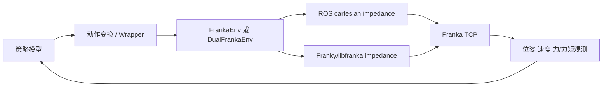

# RLiKx 中的阻抗(关注b/x那个)
结论：RLiKx 中真正用于操控 Franka 的阻抗控制主要有两套真机实现，另有一套仿真 PD 控制。模型本身没有直接输出关节力矩，而是输出 TCP 位姿、TCP 增量或关节目标；阻抗控制器再把这些目标转换成力矩。



## 1. ROS 笛卡尔阻抗控制

主要代码：

- `rlinf/envs/realworld/franka/franka_controller.py:119-126`
- `:180-201`
- `:233-235`
- `:255-344`
- `rlinf/envs/realworld/franka/franka_env.py:923-926`

关键逻辑：

- `FrankaController.__init__()` 调用 `start_impedance()`。
- `start_impedance()` 执行：

```text
roslaunch serl_franka_controllers impedance.launch
```

- `move_arm()` 不直接控制关节，而是向：

```text
/cartesian_impedance_controller/equilibrium_pose
```

发布 TCP 平衡位姿。
- `FrankaEnv.step()` 将模型输出转换为目标 TCP 位姿，再调用 `move_arm()`。
- `reset()` 调用 `reconfigure_compliance_params()` 修改 ROS 动态参数。
- `reset_joint()` 会临时停止笛卡尔阻抗，使用关节控制器回零，再重新启动阻抗控制。

因此，模型控制的是“期望 TCP 位姿”，不是实际 TCP 位姿，也不是力矩。

## 2. Franky/libfranka 阻抗控制

主要代码：

`rlinf/envs/realworld/franka/franky_controller.py`

### 关节阻抗

`_ensure_tracking_motion()` 创建：

```text
JointImpedanceTracker
```

参数：

```text
_JOINT_STIFFNESS = [103.75, 265.734, 227.273, 221.445, 13.5, 12.818, 5.134]
_JOINT_DAMPING   = [16.7, 40.263, 25.0, 12.862, 1.5, 2.0, 1.331]
```

`move_joints()` 接收 7 个关节目标，并根据连续目标差分计算速度前馈。

使用位置：

- `DualFrankaJointEnv._dispatch_arm_motion()`
- `DualGelloJointIntervention._stream_loop()`
- `FrankyController.move_joints()`

效果是：模型输出关节角目标，底层用关节 PD/阻抗跟踪，而非瞬间把关节硬切到目标。

### 笛卡尔阻抗

`_ensure_cart_tracking_motion()` 创建：

```text
CartesianImpedanceTracker
```

默认参数：

```text
K_t = 500 N/m
K_r = 40 Nm/rad
K_nullspace = 5 Nm/rad
max_delta_tau = 0.3 Nm / 1 kHz
```

`move_tcp_pose()` 通过 `set_target(Affine(T))` 更新 TCP 目标。

使用位置：

- `FrankaEnv._move_action()`
- `DualFrankaTCPEnv._dispatch_arm_motion()`
- `FrankyController.move_tcp_pose()`

关节阻抗和笛卡尔阻抗是互斥的：

- `move_joints()` 会停止 Cartesian tracker；
- `move_tcp_pose()` 会停止 Joint tracker；
- `reset_joint()` 使用一次性的 `JointMotion`，不属于持续阻抗跟踪。

## 3. b/x 中的增强阻抗控制

主要代码：

- `b/x/franky_ext/controller_extended.py`
- `b/x/franky_ext/franky_single_franka_env.py`
- `b/x/franky_ext/motion_limits.py`

它在基础 `FrankyController` 上增加了：

### 力和力矩上限

`motion_limits.py:642-686` 根据：

```text
K × error_clip
```

推导误差截断范围，而不是让刚度增大时同时无限增大弹簧力。

默认上限大致为：

- 平移：20 N/轴，三轴最坏约 40 N；
- 旋转：6 Nm/轴，三轴最坏约 12 Nm；
- 刚度范围：平移 50～3000 N/m，旋转 5～300 Nm/rad。

注意：阻尼项没有被这个弹簧力上限截断。

### 软关节限位

`controller_extended.py:1180-1209` 给 Cartesian tracker 传入关节限位排斥参数。如果 franky 版本不支持这些参数，会退化为没有软关节排斥的 tracker。

### 运动保护

`controller_extended.py:256-350, 750-950` 和 `franky_single_franka_env.py:136-210` 实现：

- TCP 工作空间围栏；
- 姿态角围栏；
- TCP 跟踪滞后检测；
- 关节速度检测；
- watchdog 线程；
- 超限后刹车、停止 tracker、锁存故障；
- 环境侧将故障转换为截断 episode。

这会直接改变模型动作：模型输出的动作可能被限速、缩小、拒绝或导致 episode 提前截断。

## 4. 哪些配置真正生效

单臂 ROS 路径中，以下任务配置会通过 `FrankaEnv.reset()` 传给 ROS 控制器：

- `PegInsertionConfig`
- `DexpnpConfig`
- `BottleConfig`
- `BinEnvConfig`
- `examples/embodiment/config/env/realworld_franka_sft_env.yaml`

其中当前代码中的平移刚度分别大约是：

- Peg/Dex/Bottle：1000 N/m；
- Bin：2800 N/m；
- SFT YAML：2000 N/m。

需要特别注意：

1. `precision_param` 在当前代码中只有定义，没有实际读取逻辑，当前不会自动切换到“精细控制参数”。
2. Franky 扩展只接受 `translational_stiffness` 和 `rotational_stiffness`。
3. Franky 扩展会忽略 ROS 风格的：
   - `translational_damping`
   - `rotational_damping`
   - `translational_clip_*`
   - `rotational_clip_*`
   - `Ki`
4. `DualFrankaRobotConfig` 虽然定义了 `compliance_param`，但 `DualFrankaEnv` 没有调用 `reconfigure_compliance_params()`，因此双臂 Cartesian 控制通常使用 `FrankyController` 的默认参数 500/40。

## 5. 对模型操控效果的影响

### 1. 模型输出不是实际位姿

近似可以理解为：

\[
F = K_t e_x + D_t \dot e_x
\]

\[
\tau = K_r e_R + D_r \dot e_R
\]

其中：

- \(e_x\)：TCP 位置误差；
- \(e_R\)：姿态误差；
- \(K_t,K_r\)：平移和旋转刚度；
- \(D_t,D_r\)：阻尼；
- \(F,\tau\)：控制器产生的恢复力和恢复力矩。

所以模型输出的是目标，实际位姿取决于：

- 刚度；
- 阻尼；
- 摩擦；
- 重力补偿；
- 接触力；
- 当前关节位形；
- Jacobian 条件数；
- 控制频率。

同一个动作在不同控制器参数下可能产生完全不同的 TCP 轨迹。

### 2. 刚度越大，跟踪越准，但接触越硬

较大刚度：

- TCP 跟踪误差小；
- 动作响应更快；
- 插入、定位更精确；
- 接触时产生更大的力；
- 对动作跳变、奇异位形和碰撞更敏感。

较小刚度：

- 更柔顺、更容易被环境或人推开；
- 接触更安全；
- 但会出现明显滞后、下垂和稳态误差；
- 小动作可能无法克服静摩擦。

代码日志中已经记录过：较低平移刚度下，TCP 可能存在约毫米级到厘米级的稳态误差，而奖励是按实测 TCP 位置计算的。

### 3. 默认单臂动作是“基于实测位姿的增量”

`FrankaEnv.step()` 默认执行：

```text
next_position = measured_tcp_pose + action * action_scale
```

这会产生两个影响：

- 如果机器人没有完全执行上一步动作，下一步又基于落后的位置计算，模型可能需要反复补偿；
- 如果小动作不足以克服静摩擦，动作可能被“吃掉”。

`use_persistent_desired_pose=True` 才会让未执行的位移累积起来，但默认值是 `False`。

### 4. 模型动作会被多重截断

动作可能依次被：

1. `action_space` 截断；
2. TCP 安全盒截断；
3. `action_scale` 缩放；
4. 单步平移/旋转限速；
5. Jacobian 反解后的关节速度需求限制；
6. impedance error clip；
7. motion guard 拒绝或刹车。

因此，训练数据中的 action 与实际机械臂执行的 action 可能不一致，尤其是在工作空间边缘和近奇异位形处。

### 5. TCP 模型看不到全部影响因素

单臂 `FrankaEnv` 的观测主要包括：

- TCP 位姿；
- TCP 速度；
- TCP 力；
- TCP 力矩；
- 图像；
- 夹爪状态。

但没有把 7 个关节位置作为标准观测输出。Cartesian impedance 通过 null-space 控制影响冗余关节，而模型看不到完整关节位形和 Jacobian 条件数。

结果是：

- 同一个 TCP 动作，在不同肘部位形下可能需要完全不同的关节速度；
- 近奇异位形时，动作会被大幅缩小或触发 watchdog；
- 对模型而言，环境动力学可能表现为部分可观测。

### 6. 低层控制器会改变奖励分布

环境奖励依据实测 TCP，而不是模型发出的目标 TCP：

```text
target_delta = measured_tcp - target_ee_pose
```

因此，阻抗滞后会导致：

- 模型已经输出正确目标，但奖励仍然为 0；
- 模型可能学会过度补偿；
- 高刚度和低刚度训练得到的策略不能直接互换；
- 换控制器参数后，checkpoint 性能可能明显下降。

### 7. 训练动作语义存在潜在不一致

`rlinf/models/embodiment/openpi/policies/franka_policy.py` 的注释将输出描述为绝对 TCP action；但 `FrankaEnv` 默认把 action 当作 TCP delta，除非设置：

```text
use_absolute_action=True
```

同时，`realworld_franka_sft_env.yaml` 设置：

```text
action_scale: [1.0, 1.0, 1.0]
```

如果没有额外 wrapper 做转换，那么这会使每个模型动作对应非常大的位移/旋转，最终频繁撞上安全盒边界。这个配置需要重点核对。

## 6. 仿真中的类似控制

`rlinf/envs/maniskill/tasks/panda_table_agent.py:37-85` 使用：

- `PDEEPoseControllerConfig`
- `PDJointPosMimicControllerConfig`
- stiffness
- damping
- force limit

这属于仿真中的 PD/力控制，效果类似阻抗控制，但不等价于真实 Franky 的 1 kHz torque impedance tracker。

`frankasim` 和 IsaacLab 路径中没有发现本地显式 `CartesianImpedanceTracker` 或 `JointImpedanceTracker`；它们主要依赖仿真环境自身的控制器或 IK 控制。

## 最重要的判断

当前模型实际学习的是：

> “在某一套刚度、阻尼、控制频率、动作缩放、限位和机器人位形下，如何产生目标动作使实测 TCP 达到目标。”

因此，以下内容必须保持一致，否则会出现明显 sim-to-real 或 checkpoint 迁移问题：

- ROS 与 Franky 控制栈；
- Cartesian 与 joint impedance 模式；
- 刚度、阻尼、error clip；
- action 是 absolute 还是 delta；
- `action_scale`；
- 控制频率；
- 安全盒和关节需求限制；
- 是否启用 persistent desired pose；
- 是否包含关节状态/Jacobian 信息。

另外，`b/x/scripts/step3_test_controller.py`、`test_franky_controller_ext.py`、`diag_franky_motion.py` 是阻抗测试和诊断代码，不是模型推理本身；`toolkits/realworld_check/test_franky_controller.py` 仍调用基础 `FrankyController` 的旧式 `reconfigure_compliance_params`，与当前 Franky 实现不完全匹配，不能作为当前阻抗控制行为的可靠依据。

# RLmm 中出问题时的阻抗(关注b/x那个)
但阻抗好像4DWVLA没用上

检查 `/home/nvidia/bt/RLiKx/` 后，可以明确分成三套 Franka 控制路径：

1. **ROS Cartesian Impedance 控制**
2. **franky Joint/Cartesian Impedance Tracker 控制**
3. **`4dwvla_ext` 的关节 waypoint 控制，不是显式阻抗控制**

## 一、明确使用阻抗控制的代码

### 1. ROS 版 `FrankaController`

文件：

`rlinf/envs/realworld/franka/franka_controller.py`

初始化时直接启动 ROS impedance controller：

```python
self.start_impedance()
```

具体执行：

```python
self._impedance = psutil.Popen(
    [
        "roslaunch",
        self._ros_pkg,
        "impedance.launch",
        "robot_ip:=" + self._robot_ip,
        f"load_gripper:={load_gripper}",
    ],
    stdout=sys.stdout,
    stderr=sys.stdout,
)
```

它还通过 ROS equilibrium channel 发送目标 TCP 位姿：

```python
self._ros.put_channel(self._arm_equilibrium_channel, pose_msg)
```

因此这条路径是明确的：

```text
模型 action
  → FrankaEnv.step()
  → 生成目标 TCP pose
  → ROS equilibrium channel
  → Cartesian impedance controller
  → 机器人实际运动
```

`FrankaEnv` 默认会创建这个控制器：

```python
self._controller = FrankaController.launch_controller(...)
```

每次环境 reset 时还会重新设置 compliance 参数：

```python
self._controller.reconfigure_compliance_params(
    self.config.compliance_param
).wait()
```

在 `PegInsertionConfig` 中，例如：

```python
self.compliance_param = {
    "translational_stiffness": 1000,
    "translational_damping": 89,
    "rotational_stiffness": 150,
    "rotational_damping": 7,
    ...
}
```

这个控制器的 `reset_joint()` 会暂时停止阻抗控制，使用 joint controller 回 HOME，之后重新启动 impedance：

```python
self.stop_impedance()
...
roslaunch joint.launch ...
...
self.start_impedance()
```

所以对于使用标准 `FrankaEnv` 的任务，例如：

- `PegInsertionEnv`
- `FrankaEnv` 的其他子类
- 使用 ROS Franka 控制链路的任务

模型输出的不是“机器人必须精确到达的关节角”，而是通过阻抗控制器解释的目标 TCP 位姿。

---

### 2. `JointImpedanceTracker`

文件：

`rlinf/envs/realworld/franka/franky_controller.py`

创建代码：

```python
self._tracker = self._franky.JointImpedanceTracker(
    self._robot,
    stiffness=np.array(_JOINT_STIFFNESS, dtype=np.float64),
    damping=np.array(_JOINT_DAMPING, dtype=np.float64),
    compensate_coriolis=True,
)
```

相关参数：

```python
_JOINT_STIFFNESS = [
    103.75, 265.734, 227.273,
    221.445, 13.5, 12.818, 5.134
]

_JOINT_DAMPING = [
    16.7, 40.263, 25.0,
    12.862, 1.5, 2.0, 1.331
]
```

每次模型给出关节动作时：

```python
self._tracker.set_target(q, dq=dq_ff)
```

这里的 `q` 是阻抗控制的 equilibrium target，不是一个立即强制到达的位置。控制器根据：

- 目标关节位置；
- 目标速度 feed-forward；
- 刚度；
- 阻尼；
- Coriolis 补偿；

持续产生控制力矩。

这条路径主要用于：

`rlinf/envs/realworld/franka/tasks/dual_franka_joint_env.py`

其中两个 Franka 机械臂分别调用：

```python
ctrls[0].move_joints(...)
ctrls[1].move_joints(...)
```

而这些 controller 的 `move_joints()` 实际使用 `JointImpedanceTracker`。

---

### 3. `CartesianImpedanceTracker`

同一个文件中还创建了笛卡尔阻抗控制器：

```python
self._cart_tracker = self._franky.CartesianImpedanceTracker(
    self._robot,
    translational_stiffness=_CART_TRANS_STIFFNESS,
    rotational_stiffness=_CART_ROT_STIFFNESS,
    nullspace_target=nullspace_target,
    nullspace_stiffness=_CART_NULLSPACE_STIFFNESS,
    translational_error_clip=trans_clip,
    rotational_error_clip=rot_clip,
    max_delta_tau=_CART_MAX_DELTA_TAU,
    gains_time_constant=_CART_GAINS_TC,
)
```

默认参数：

```python
_CART_TRANS_STIFFNESS = 500.0
_CART_ROT_STIFFNESS = 40.0
_CART_NULLSPACE_STIFFNESS = 5.0
_CART_MAX_DELTA_TAU = 0.3
_CART_TRANS_ERROR_CLIP_M = 0.05
_CART_ROT_ERROR_CLIP_RAD = 0.3
_CART_GAINS_TC = 0.1
```

模型给出的 TCP pose 通过：

```python
self._cart_tracker.set_target(self._franky.Affine(T))
```

发送给控制器。

这条路径用于：

`rlinf/envs/realworld/franka/tasks/dual_franka_tcp_env.py`

代码注释也明确写着：

> Each step pushes `(xyz, quat)` into a per-arm `CartesianImpedanceTracker`.

因此 Dual TCP 任务的链路是：

```text
模型 TCP action
  → xyz + rot6d 转 quaternion
  → move_tcp_pose()
  → CartesianImpedanceTracker.set_target()
  → 1 kHz torque-level impedance tracking
```

---

### 4. 本地扩展 `FrankyControllerExtended`

文件：

`b/x/franky_ext/controller_extended.py`

这个控制器同样明确使用：

```python
self._franky.CartesianImpedanceTracker(...)
```

初始化时使用：

```python
self._ensure_cart_tracking_motion()
```

实际创建：

```python
self._cart_tracker = self._franky.CartesianImpedanceTracker(
    self._robot,
    **kwargs,
    **limit_kwargs,
)
```

它额外增加了：

- TCP motion guard；
- 50 Hz watchdog；
- 笛卡尔力误差限制；
- 关节极限排斥力；
- torque slew limit；
- tracker 崩溃检测；
- 运动异常后的制动。

这个控制器由：

`b/x/franky_ext/franky_single_franka_env.py`

替换标准 ROS 控制器：

```python
self._controller = FrankyControllerExtended.launch_controller(...)
```

因此使用 `FrankySingleFrankaEnvMixin` 的任务会采用 Cartesian impedance。

---

## 二、没有显式使用阻抗控制的代码

### `4dwvla_ext` 真机评测路径

文件：

`b/x/4dwvla_ext/franka_vla_client.py`

实际调用：

```text
franka_vla_client.py
  → FrankyJointEnv.step()
  → FrankyControllerDirect.move_joints()
  → franky.Robot.move()
  → JointWaypointMotion
```

`FrankyControllerDirect.move_joints()`：

```python
motion = franky.JointWaypointMotion(
    [franky.JointWaypoint(clipped.tolist())]
)
self._robot.move(motion)
```

这条路径没有调用：

```python
JointImpedanceTracker
CartesianImpedanceTracker
```

所以它不是本仓库显式实现的阻抗控制。

它使用的是：

- 关节空间绝对 waypoint；
- 阻塞式 `Robot.move()`；
- `relative_dynamics_factor = 0.2`；
- collision behavior；
- motion guard；
- watchdog。

其中：

```python
self._robot.relative_dynamics_factor = 0.2
```

是轨迹动力学缩放，不是阻抗刚度或阻尼参数。

因此此前 4DWVLA 真机实验应描述为：

> 使用 `JointWaypointMotion` 的关节空间 waypoint 执行路径，而不是显式创建 Franka impedance tracker。

但是，Franka/libfranka 底层仍然存在机器人自身的伺服控制。当前代码无法仅凭 `Robot.move()` 判断机器人内部具体采用了哪一种低层控制模式。

---

## 三、阻抗控制会如何影响模型控制

### 1. 模型输出不再等于真实状态

对于理想绝对位置控制：

\[
q_{t+1}=q^{cmd}_t
\]

但阻抗控制更接近：

\[
\tau =
K(q^{target}-q)
+
D(\dot q^{target}-\dot q)
+
\tau_{\mathrm{coriolis}}
+
\tau_{\mathrm{null}}
\]

其中：

- \(q^{target}\)：模型输出的目标；
- \(q\)：当前实际关节角；
- \(K\)：刚度；
- \(D\)：阻尼；
- \(\tau\)：最终控制力矩。

所以实际状态满足：

\[
q_{t+1}\neq q^{target}_t
\]

而是逐渐逼近目标。

这会造成：

- action 和下一帧 state 存在系统性差异；
- 模型输出的绝对目标可能长期无法完全达到；
- 观测历史会记录“目标”和“实际运动”的差异；
- 下一步模型看到的是实际状态，而不是自己期望的状态。

---

### 2. 刚度较低时会有跟踪滞后

低刚度下，模型发出较大的动作，机械臂可能只运动一部分：

```text
模型目标：q + 0.08 rad
实际状态：q + 0.02 rad
```

如果训练数据记录的是实际状态，但 action 记录的是目标，那么模型会学习到一种隐含关系：

> action 通常比 state 的实际变化更大。

如果评测时把该 action 当作高刚度绝对 waypoint，机器人实际走得更接近目标，就可能出现：

```text
训练状态：q + 0.02 rad
评测状态：q + 0.08 rad
```

下一次观测就可能离训练分布较远。

这正是 `sumry0919_4trn.markdown:217` 所描述机制可能成立的地方，但目前还缺示教 command/state 的直接对比，不能直接断言。

---

### 3. 阻尼会改变动作的时间响应

阻尼较大时：

- 动作更平滑；
- overshoot 减少；
- 但目标跟踪更慢；
- 快速动作被滤掉。

阻尼较小时：

- 反应更快；
- 但可能振荡；
- 对高频 action chunk 更敏感。

因此，同一个 VLA action 序列，在不同的：

- stiffness；
- damping；
- gains time constant；
- dynamics factor；

下，可能产生完全不同的真实轨迹。

---

### 4. Cartesian impedance 会引入冗余关节漂移

笛卡尔阻抗只直接约束末端位姿：

\[
x \rightarrow \tau_{\mathrm{task}}
\]

7 自由度机械臂还有一个冗余自由度。当前代码通过：

```python
nullspace_target = np.asarray(
    self._robot.state.q,
    dtype=np.float64
).copy()
```

以及：

```python
nullspace_stiffness = 5.0
```

约束冗余关节。

但如果 nullspace stiffness 较低，可能出现：

- TCP 位姿看起来正确；
- q7、肘部或腕部逐渐漂移；
- 关节姿态离训练分布越来越远；
- FK keypoint 输入发生 OOD；
- 模型动作方向发生变化。

这与当前诊断中 q7 越过训练下沿的问题是同一类风险。需要注意：q7 的实际漂移是否由 impedance nullspace 造成，当前没有直接实验区分。

---

### 5. 误差 clip 会让模型的大动作变成有限力动作

`CartesianImpedanceTracker` 使用：

```python
translational_error_clip
rotational_error_clip
max_delta_tau
```

这意味着即使模型输出很大的 TCP 位姿差异，控制器也不会无限增加力矩。

例如：

\[
F = K_t e
\]

但代码会限制：

\[
e \leftarrow \operatorname{clip}(e,e_{\max})
\]

因此模型动作可能被执行器变成：

- 目标没有完全跟随；
- 运动速度受限；
- 接触时柔顺；
- 大动作被截断；
- 任务中的动作间隔和训练不同。

`controller_extended.py` 还把 stiffness 和 error clip 绑定，以限制最大弹簧力。这是安全上正确的，但会进一步改变模型 action 到真实运动的映射。

---

### 6. persistent desired pose 会改变 action 的积分方式

`FrankaRobotConfig` 中有：

```python
use_persistent_desired_pose: bool = False
```

开启后，动作不是每次以当前实际 TCP 为基准，而是累积到一个持久的 desired pose：

```python
desired_xyz = self._desired_xyz + scaled_xyz_delta
```

未开启时则是：

```python
self.next_position[:3] = self.next_position[:3] + scaled_xyz_delta
```

两者差异很重要：

- 以实际位置 rebase：跟踪误差不会无限累积，但小动作可能被阻抗死区吞掉；
- 持久目标积分：未执行的动作会累积，最终可能形成更大的目标误差和力矩。

这个配置会直接改变模型 action 的控制语义，不能在训练和评测间随意切换。

---

## 四、对不同模型 action 类型的影响

### A. 关节绝对 action

使用 `JointImpedanceTracker` 时：

```python
tracker.set_target(q, dq=dq_ff)
```

模型输出是关节 equilibrium target，不是立即状态。

使用 `JointWaypointMotion` 时：

```python
Robot.move(JointWaypointMotion(...))
```

模型输出是 waypoint target，机器人通过运动生成器执行。

这两者都不是完全相同的执行语义。切换控制器后，同一个模型可能出现：

- 运动幅度变化；
- 到达时间变化；
- q7 漂移变化；
- chunk 接缝变化；
- 历史轨迹变化。

### B. TCP delta action

标准 `FrankaEnv` 默认 action 是：

```text
[x_delta, y_delta, z_delta,
 rx_delta, ry_delta, rz_delta,
 gripper]
```

然后：

1. 对位置 delta 乘 `action_scale`；
2. 加到当前 TCP；
3. 对姿态 delta 做旋转合成；
4. 通过 impedance controller 跟踪新 TCP target。

模型实际学习的是一种“增量目标 → 阻抗运动”的关系。

### C. TCP absolute action

如果：

```python
use_absolute_action = True
```

则动作直接解释为绝对 TCP 位置和姿态。此时对跟踪误差、clip、刚度、阻尼更加敏感，因为每个动作都是全局目标。

---

## 五、代码路径与阻抗状态总结

| 路径 | 是否显式阻抗 | 控制方式 | 对模型 action 的含义 |
|:---|:---:|:---|:---|
| `rlinf/envs/realworld/franka/franka_controller.py` | 是 | ROS Cartesian impedance | TCP equilibrium pose |
| `rlinf/envs/realworld/franka/franky_controller.py::move_joints` | 是 | `JointImpedanceTracker` | 关节 equilibrium target |
| `rlinf/envs/realworld/franka/franky_controller.py::move_tcp_pose` | 是 | `CartesianImpedanceTracker` | TCP pose target |
| `DualFrankaJointEnv` | 是 | 双臂 Joint impedance | 双臂关节目标 |
| `DualFrankaTCPEnv` | 是 | 双臂 Cartesian impedance | 双臂 TCP waypoint |
| `b/x/franky_ext/controller_extended.py` | 是 | Cartesian impedance + safety | TCP target with force/error limits |
| `b/x/4dwvla_ext/franky_controller_direct.py` | 否（显式层面） | Joint waypoint `Robot.move()` | 关节绝对 waypoint |
| `b/x/4dwvla_ext/franka_vla_client.py` | 间接调用 | 通过 `FrankyJointEnv` 控制 | 8D 关节绝对 action |
| gripper 相关代码 | 否 | libfranka gripper position/grasp | 夹爪宽度或 grasp 命令 |

## 六、对当前 4DWVLA 问题最重要的结论

对于当前 `4dwvla_ext` 真机实验，不能简单说：

> “模型训练使用阻抗控制，而评测没有阻抗控制。”

目前能确定的是：

1. RLinf 标准 Franka 路径确实大量使用显式阻抗控制；
2. `4dwvla_ext` 真机评测路径使用的是关节 waypoint；
3. 二者的动作执行动力学不同；
4. 但“示教数据本身是否由阻抗控制产生”仍需查看示教采集端的实际控制器；
5. 必须比较示教的 action 与实际 state，才能证明那 0.06–0.08 rad 是阻抗跟踪误差；
6. 当前 4DWVLA 的 q7 OOD、动作振荡、历史轨迹偏离，可能来自控制器语义差异，但不能仅凭“仓库存在 impedance 代码”确定因果。

最严谨的表述应是：

> RLinf 中存在 ROS Cartesian impedance、JointImpedanceTracker 和 CartesianImpedanceTracker 三类显式阻抗控制路径；它们会使模型输出的目标与实际机器人状态之间产生由刚度、阻尼、误差裁剪、nullspace 和执行延迟决定的动态偏差。当前 4DWVLA `franka_vla_client.py` 使用的是 `JointWaypointMotion`，没有显式创建 impedance tracker。因此，当前问题首先应被表述为“训练/示教控制语义与 4DWVLA 评测 waypoint 执行语义可能不一致”，而不是直接断言“示教阻抗、评测非阻抗”。