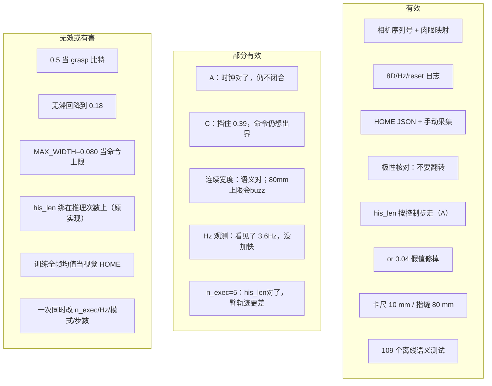
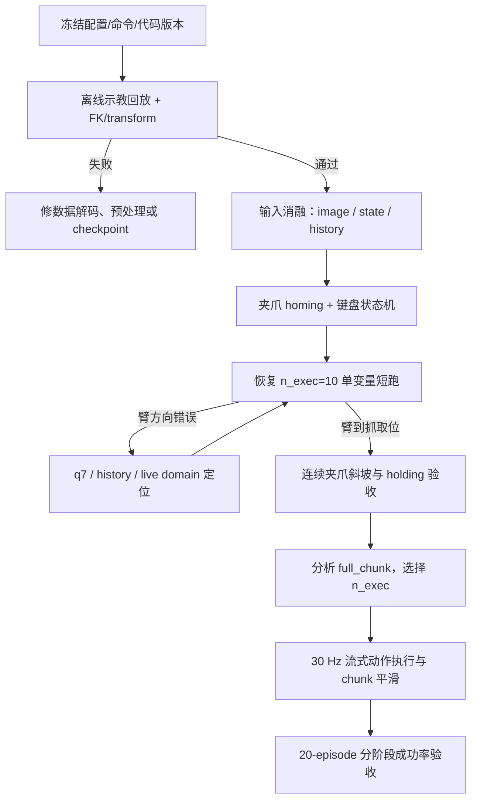
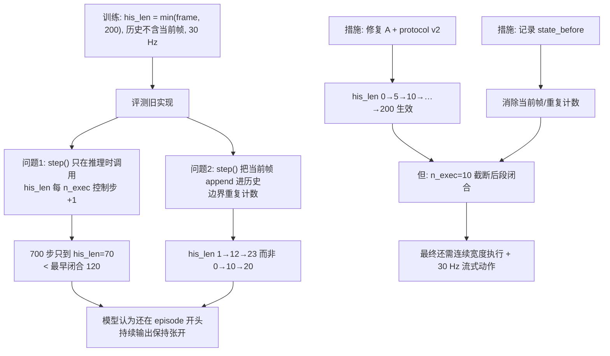

# 4debug 工作总结（截至 2026-09-19）

> 范围：本目录 7 份文档所记录的 Franka FR3v2.1 + InternVLA-A1.5（4DWVLA）插插座真机评估。
> 写法：每条问题/措施尽量用**日志、示教统计或仓库里仍存在的代码**支撑；没有这种支撑的判断会标成「思考」。
> 任务：`plug into socket`；checkpoint `4wvlaFrkPlugCkp041680`；双 RealSense（global=`250222073513`，wrist=`420122070525`）。

---

## 1. 文档地图与时间线

本目录是一次真机调试的「卷宗」，不是同一篇论文的七个章节。两份 `cursor_fkrw_*home*` 是同一段对话的两次导出，内容高度重叠，较长的一份更完整。

| 文件 | 性质 | 覆盖时段 | 核心问题 |
|:---|:---|:---|:---|
| [`cursor_fkrw_dry_run_evaluation_results.markdown`](cursor_fkrw_dry_run_evaluation_results.markdown) | Cursor 对话导出 | 09-17 → 09-18 | Level 0 dry-run、相机 EBUSY、键盘卡死、末端微抖、夹爪不闭合、A–F 真机复测 |
| [`cursor_fkrw_1_set_franka_home.markdown`](cursor_fkrw_1_set_franka_home.markdown) | 对话导出（较短，前半截） | 约 09-17 | 10 Hz 小数据集字段分析；HOME 来源；停止回位 |
| [`cursor_fkrw_set_franka_home.markdown`](cursor_fkrw_set_franka_home.markdown) | **最长卷宗**：HOME 对话 + 1.2 综合 + 连续模式 600 步事故 + 手臂振荡 | 09-17 → 09-18 下午 | 上一项 + JSON HOME + 夹爪 buzz + `n_exec=5` 长跑 + 示教回放诊断 |
| [`grperr_1.md`](grperr_1.md) | 诊断 1.0 | 09-18 上午 | 夹爪从未闭合的工程根因 R1–R6；修复 A–F；Level 0–2 真机记录 |
| [`grperr_1.1.md`](grperr_1.1.md) | 诊断 1.1 | 09-18 | A–F 之后仍不闭合：连续斜坡 vs 0.5 二值、`n_exec=10` 截断 |
| [`grperr_1.2.md`](grperr_1.2.md) | 实施方案 | 09-18 | 宽度增量判据、前置 bug、分阶段落地 |
| [`grperr_1.2LOG.md`](grperr_1.2LOG.md) | 实施日志 | 09-18 | 改了哪些文件、109 个离线测试、Phase 1 卡尺结果 |

读文档时注意两件事：

1. `cursor_fkrw_1_set_franka_home.markdown` 是短导出；**后半段真机事故只在长文件里**。
2. 长文件后部有一处口误：写「`a=0.227` 来自示教、不是真机」。**这与 `grperr_1.md` 矛盾。** 0.227 来自 Level 2 真机 `client` 300 步（binary_abs，峰值 step 159）；0.016–0.054 才是后来 `n_exec=5`、连续模式 600 步那次的策略输出。下文按日志归属，不沿用那句口误。


两套**不同**的数据不要混：

| 数据集 | 用途 | 证据 |
|:---|:---|:---|
| `/home/nvidia/kaixin_ws/trans5090_v2/plug_into_socket_10hz_rlt_lerobot_2ep` | 10 Hz、TCP 7D action、2 ep / 417 帧；HOME 文档里分析的小集 | `cursor_fkrw_set_franka_home.markdown` §1 |
| `/home/nvidia/bt/dt/plug_into_socket_lrb_4D_8sml` + ckpt `stats.json`（100 ep / 66577 帧 @ 30 Hz，关节 abs） | InternVLA 训练/评测、夹爪极性与斜坡 | `grperr_1.md` §2.1–2.2 |

---

## 2. 遇到过哪些问题

按「现场能不能动」→「动了但不对」→「策略/语义」排列。判定列只写当时卷宗里站得住的结论。

### 2.1 现场工程问题

| ID | 现象 | 根因（有证据） | 出处 |
|:--:|:---|:---|:---|
| P-cam | Level 1 启动即失败：`VIDIOC_S_FMT` `errno=16`（EBUSY） | 未指定序列号时两台 D435 抢同一节点 / 设备被占用；命令里当时没有 `--global-camera-serial` | dry-run 导出用户日志 + 分析 |
| P-key | 按 `r` 中止后，`Enter`/`a`/`r`/`h` 全无反应 | 中止后主线程走到 `input("Reset scene, then press Enter...")`，而评估热键走 evdev；容器里 stdin 与键盘设备不是同一条路 | dry-run 导出；**代码仍在** `franka_vla_client.py` 约第 251 行 |
| P-map | 仓库里 global/wrist 序列号曾自相矛盾 | `t8_test_runner.py` 默认值与评测文档不一致；客户端承诺读 `$RS_*` 却没读 | `grperr_1.md` R6 / 修复 F |
| P-home | 腕部画面曾比示教起始帧「低一截」 | **当时** `HOME_JOINTS = TRAIN_ARM_MEAN`（全体帧均值，混了下降/插入/抬起）。8-ep 子集首帧 TCP \(z\) 均值约 0.4365 m，比该均值 HOME 高约 17 cm | 长 HOME 导出 §「腕部画面」；后已用手动采集 JSON 替换 |
| P-home2 | 多处硬编码 HOME，改一处其余仍回旧位 | `FrankyJointEnv`、smoke 测试、GELLO、FK 单测等各写一套 7 关节 | 同上，后已收敛到 `home_pose.json` |
| P-home3 | 有人怀疑「现在的 HOME 仍不对」 | 16:41 那次 600 步之后复核：**手动 HOME 离 8 条示教起始姿态均值只有 0.105 rad**，离全体帧均值才 0.386 rad。HOME 合格；用全体帧 q01/q99 判起始 OOD 才是用错基准 | 长 HOME 导出「HOME 不是问题」一节 |
| P-hz | `--control-hz 30` 或 10，实测约 **2.5–3.6 Hz** | `franky.Robot.move()` 默认阻塞，每个 waypoint 走完加减速；`relative_dynamics_factor=0.2` | `grperr_1.md` §2.6；Level 1 日志 `achieved_control_hz=2.59`（请求 5.0） |
| P-vib | 「手臂没动、末端在震」 | 动作是**绝对关节角**（`action_mode=abs`），q1 日志从 -0.241 走到 -0.115（约 0.13 rad），并非没动；逐步阻塞小步长 + 反复规划表现为微抖 | dry-run 导出「绝对关键角」一节 |

### 2.2 夹爪不闭合（主线）

现象（修复 A 之前，客户端 `client_20260918_021841_2745.log` 等）：

- 5 次运行共 **1830 步，0 次** `action.gripper ≥ 0.5`；宽度贴在满开。
- 极性是对的：示教 66577 帧上 \(a = 1 - w/0.08\)，误差 \(5.2\times10^{-8}\)（`grperr_1.md` §2.2）。**翻转极性会把对的搞错。**

分层根因（后一层以前一层被修掉为前提）：

| ID | 判定 | 证据摘要 |
|:--:|:---|:---|
| R1 / P0 当时 | **`his_len` 按推理次数 +1，慢了 `n_exec=10` 倍**。700 步只到 70；示教最早闭合在 `his_len=120` | 服务端 `history_len=1,2,…,70`；示教门控表 `grperr_1.md` §2.5 |
| R2 | 实测 2.49 Hz vs 训练 30 Hz，墙钟被拉长 | 相邻 `execute` 中位间隔 0.401 s |
| R3 | q7 掉到 ~0.40，示教观测最小 0.485；统一 0.15 rad 余量把下限放到 0.334，**静默放行** | 689/700 步低于示教最小 |
| R4 | 抓取窗口 `0.015±0.010` m 未按插头标定；空爪 9.7 mm 被判 `holding=True` | Level 1 启动日志；操作员确认夹爪是空的 |
| R5 | `r` 之后服务端不 `reset`，keypoint/KV 串场 | 修复前客户端无 `{"command":"reset"}` |
| R6 | 相机映射待肉眼确认 | 后用实拍确认映射正确，**不是**不闭合的原因 |
| 1.1 P0-a | A–F 之后模型峰值只有 **0.227 / 0.216**（两次 300 步）。示教里 \(a≥0.5\) 时 \(w≈38\) mm；真机读数 \(w\) 锁在 66.4 mm | `grperr_1.md` §9.7；`grperr_1.1.md` 图 2。1.2 **改判**：同宽度下 \(a_{\mathrm{hold}}=0.170\)，0.227 对应 \(\Delta w=+4.6\) mm，是收拢而不是「保持」 |
| 1.1 P0-b | 50 步计划只执行 10 步；示教闭合中位在 chunk 第 **24.5** 步，80% 落在第 10 步之后 | 示教 receding-horizon 统计 |
| 1.2 P0-c | `_get_observation()` 里 `g = state["gripper_width"] or 0.04`：完全闭合 `0.0` 会被上报成 0.04 m | 代码审查；当时未发作是因为从未闭合 |
| 1.2 P1-b | 修复 A 后 `his_len` 仍是 `1→12→23`（含当前帧且周期边界重复），训练应为 `0→10→20` | 1.2 §3.1 对照 transform `hist_window = stacked[:h]`（不含当前帧） |
| 1.2 P1-c | 用**观测**分布裁**动作**：`action.arm[6]` 可低到 0.3695，观测 q7 最小 0.4843 | `abs_stats.json`；1.2 §3.3 |
| Q1 | 读数满开 66.4 mm vs 卡尺 **80 mm** vs 示教 79.4 mm | 启动日志 `max_width=0.066m`；`grperr_1.2LOG.md` Phase 1b；`gripper_homing.py` 文档字符串 |

Dry-run 对照（黑图 + dummy 宽度 0.04 m）：250 步 \(a∈[0.72,0.77]\)，**250/250 次 ≥0.5**。说明 checkpoint **会**闭；真机视觉+宽度把它钉在斜坡起点（`grperr_1.1.md` §4.1）。

### 2.3 诊断过程中暴露的次生问题

| 现象 | 证据 | 说明 |
|:---|:---|:---|
| 连续宽度模式：夹爪 buzz + 臂更走不动 | 600 步**每步** `move_width`；`w_meas` 全程 0.0664，`w_cmd≈0.077`；Hz 3.58→**2.28**（日志 `client_20260918_075356_2197.log`，长 HOME 导出逐步引用） | 卡尺 80 mm 被填进**命令上限**；\(a≈0.03\) 的「保持张开」被换成 77 mm 命令，手只能报到 66 mm，`abs(Δw)` 死区每步都触发阻塞 `move`。这是 **1.2 文档把 Q1 物理间距与 libfranka 报告上限写成同一个配置项** 导致的现场事故 |
| 修 buzz 之后仍「抖、下不到插头」 | 下一跑 `client_20260918_084136_3629.log`：`move_width` **0 次**、600 步全 `hold`、Hz 回到 **3.18**；但每个关节 **40–57% 的步反向**；q4 路程 1.40 rad、净位移 −0.012 rad；与 8 条示教净位移余弦 **+0.086**（近乎正交）；q7 第 5 步跌破 0.485，在 **0.458** 坐了 595/600 步；`action_grip` 全程 **0.030–0.057** | 长 HOME 导出「现在抖的是手臂」。`n_exec` 服务端 5、客户端启动日志仍印 10（参数只影响日志）。同时改了六个量，**手臂没下去无法单因素归因** |
| 策略在坏姿态上变成「原地吸引子」 | `diag_input_ablation.py` / `diag_pose_attractor.py` 文档字符串：示教输入余弦 +1.0；活姿态+示教图像时 lead 掉到 0.32×、余弦 **-0.575**；单把 q7 拉回训练下沿恢复 78% lead | 数字在诊断脚本/env 注释里；4debug 正文只写到「先跑 accept_demo_replay」这一步建议 |
| 历史变长后 lead 塌缩 | `diag_history_collapse.py`：首步 lead 0.097 rad（接近示教 0.126），600 步均值只有 0.016；假说是「历史说没动 → 策略继续预测不动」 | **脚本假说，4debug 未贴该探针的输出表** |
| `accept_demo_replay.py` 在 LeRobot v3 上会默默喂黑图 | `diag_demo_replay_arm.py` 文档字符串 | 验收 glob「每集一个 mp4」，v3 是单文件拼接 |

---

## 3. 做了哪些应对，效果如何

图例：**有效** = 目标现象消失或被真机/测试钉死；**部分有效** = 修对了但任务仍失败，或只解决了观测性；**无效 / 有害** = 没打到点，或引入新故障；**未验证** = 代码在、真机还没按验收门跑完。

### 3.1 现场与基础设施

| 措施 | 对应问题 | 效果 | 证据 |
|:---|:--:|:--:|:---|
| 启动时显式传两个序列号；写入 `configs/franka_plug_eval.env` 的 `RS_GLOBAL_SERIAL` / `RS_WRIST_SERIAL`；客户端真正读取这两个变量 | P-cam、P-map | **有效** | 指定序列号后相机能开；09-18 实拍 global=台面俯视、wrist=指尖特写（dry-run 导出 + `grperr_1.md` §9.1） |
| 查占用进程 / USB3 | P-cam | **部分有效**（建议项） | 对话里给了排查步骤；最终靠序列号解决。是否曾有第二进程占用，**没有** `lsof` 日志留在卷宗里 |
| 中止后改用 evdev 而不是 `input()` | P-key | **未完成** | `franka_vla_client.py` 仍有 `input("[operator] Reset scene...")`。有 `test_keyboard_wrapper_offline.py` 测 `r` 的 latch，**不覆盖**中止后的 stdin 死等 |
| `stop_and_home.py`：停 FCI、确认后回 HOME；默认不动夹爪 | 紧急停/回位 | **有效（工具）** | `b/x/franky_ext/dsplug/stop_and_home.py` + README；卷宗未附一次 `RESULT DSPLUG_HOME PASS` 真机打印，是否在现场跑过标「思考：应该跑过，无日志」 |
| HOME 改为手动采集写入 `home_pose.json`；统一 `load_home_joints()` | P-home、P-home2 | **有效** | JSON `method: manual_live_robot_capture`，`captured_at_utc=2026-09-17T08:44:04`，TCP \(z=0.412\) m；`FrankyJointEnv.HOME_JOINTS = load_home_joints()`；离线断言 JSON 与 ENV 一致（home 导出） |
| 评估里 `h` → `go_to_rest()` → JSON HOME | 操作回位 | **有效** | 调用链在 home 导出中核对；改 JSON 后需**重启客户端**（模块 import 时加载） |
| 每步打完整 8D 动作/状态/时间戳 | 诊断 | **有效** | `client_20260918_021841_2745.log` 等成为 1.0/1.1 的定量来源 |
| 实测 Hz 告警（修复 B），**不**改异步 `move` | P-hz、P-vib | **部分有效** | 真机稳定打出 2.5–3.6 Hz；运动特征未变，微抖/慢放仍在。异步/合批按 §15.7 **有意没做** |

### 3.2 修复 A–F（`grperr_1.md`）

| 修复 | 做什么 | 效果 | 证据 |
|:--:|:---|:--:|:---|
| **A** | 客户端把每步关节写入 `ExecutedStateBuffer`，服务端推理前重放，`his_len` 按控制步涨 | **对时钟有效，对闭合无效** | Level 0：`1→12→…→200` 饱和；Level 2：`his_len` 过 120 后 \(a\) 从 0.03 升到 0.23，**仍 <0.5**（`grperr_1.md` §9） |
| **B** | 只测 Hz | **有效（观测）** | 见上 |
| **C** | q7 余量 0.15→0.05，下限 0.334→**0.4343** | **部分有效** | Level 2：q7 被裁在 0.4344，274/300 步告警；不再滑到 0.39。策略命令仍在 0.40；后来 600 步跑仍能停在 **0.4579**（仍低于示教 0.485）——见 `franky_joint_env.py` 注释 |
| **D** | 抓取窗口改配置，数值当时不改 | **当时未生效**（没 `close()`） | 设计如此。Phase 1 卡尺后才回填 10 mm |
| **E** | 每次 `env.reset()` 发 `reset` | **有效** | 服务端日志 `Reset command received` |
| **F** | 序列号环境变量 + 肉眼确认 | **有效** | 见 P-cam |

A–F 的验收结论（`grperr_1.md` §9.6–9.7）：软件修复全部在真机上按设计工作；**任务成功（夹住插头）未达成**。两次独立 300 步终态关节差 <0.02 rad、夹爪峰值差 <0.01。

### 3.3 1.1 提出、1.2 修正的执行语义

| 措施 | 效果 | 证据 |
|:---|:--:|:---|
| 把门限从 0.5 降到 0.18（1.1 实验 1） | **不宜做（有害风险）** | 1.1 自己统计：0.18 在 300 步里 23 步、9 次穿越；1.2 指出 0.18 在 \(w=66.4\) mm 时几乎等于「保持张开」的 \(a≈0.174\)，满开若回到 79 mm 又会变得极钝。**没有**在真机上试过 0.18 |
| 翻转 `VLA_GRIPPER_CLOSE_IF_ABOVE` | **明确不要做** | 极性已用全量 stats 钉死 |
| 宽度增量 \(\Delta w = w_{\mathrm{meas}} - 0.08(1-a)\) + 滞回（1.2） | **代码有，真机主路径未作为结论跑完** | `want_gripper_close_delta()`；模式 `binary_delta` |
| 连续宽度 \(w_{\mathrm{cmd}}=0.08(1-a)\)，\(a≥0.8\) 再 `grasp` | **语义对；第一次上机有害** | 15:53 跑：600/600 步 `move_width`，`w_meas` 不变，Hz 2.28。原因：上限填了卡尺 0.080 + `abs()` 死区。**1.2 把 Q1 物理间距与 libfranka 报告上限写成同一个配置项**，这是过程事故，不是连续模式本身无意义 |
| 运行时 `min(配置, 手上报)` + 非对称死区 + 命令去重 | **对 buzz 有效** | 重放 15:53 日志：阻塞 `move_width` **600→0**。16:41 真机：600 步全 `hold`，Hz **3.18**。shell 未重新 `source`、仍是 0.080 时，启动日志显示被钳到 0.0664 |
| 修 `or 0.04` | **有效（防御）** | `_get_observation()` 现对 `None` 抛错，dummy 用 0.078；`test_obs_state_offline.py` 16 项通过（`grperr_1.2LOG.md`） |
| 卡尺：插头 10 mm；满开指缝 80 mm | **有效（测量）**；**不能当命令上限** | `FRANKA_CUBE_WIDTH_M=0.010`。Q1：上报/homing 偏移约 13.6 mm。把 80 mm 填进 `FRANKA_GRIPPER_MAX_WIDTH_M` 直接导致 buzz |
| `his_len` protocol v2 | **真机有效** | 16:41：服务端 `0→5→10→…→200`（`n_exec=5`）。1.2LOG 里 T4 离线 GPU 单测当时未跑，但现场 IPC 已对上 |
| 打完整 50 步 `full_chunk_grip` | **代码有，Q5 判决表未进卷宗** | 服务端已打该行 |
| 分布监控 `[q01,q99]` 只读 | **有效（观测）**；**误用过** | 16:41 用全体帧带判 OOD 曾误判 HOME；改用示教**起始**姿态后 HOME 合格 |
| `n_exec` 10→5 与 `--control-hz 30` 一起上 | **无效/有害（无法单因素归因）** | 与连续模式、`max-steps=600` 同时变。终态更高更靠后（\(q_4=-1.774\) vs 上一轮 \(-2.078\)）。块边界跳跃 0.016 rad vs 块内 0.003 rad。1.2 本来说**加长** `n_exec` 而不是减到 5 |
| 加大 `n_exec` 到 20/50 | **未做** | 卡在 Q5 |
| 异步 / 合批 waypoint | **未做** | §15.7 |
| 再 fine-tune | **正确推迟** | dry-run 与示教回放脚本都表明闭合模态在权重里 |

离线测试（1.2LOG §5.1）：T1/T2/T3/T6/T7/T8 共 **109/109 通过**。长导出后半段 buzz 修复后再报 203 项检查（夹爪语义 55→59）。T4/T5/T9 需 GPU/运动学，宿主机无 torch。

### 3.4 诊断脚本跟进（数字在脚本 docstring；4debug 正文只写到「去跑回放」）

1. **q7 余量改为 0.0**（下限 = 观测最小 0.4843）。`franky_joint_env.py` 注释引用 `diag_pose_attractor.py`：q7=0.475 时与示教动作余弦 **-0.273**，0.485 时 **+0.343**。这与 1.2 Q4「不要用观测 min 裁动作」的理论担心相反——16:41 日志里 q7 在 0.458 坐了 595 步、净位移符号与 8 条示教相反。零余量是对那次越界的工程回应。另有 `TRAIN_EDGE_WARN_RAD[6]=0.03`。
2. **`gripper_homing.py`**：只读 / `--execute`。卷宗**没有** RESULT 证明已在真机 homing 成功。
3. **示教回放**：`diag_demo_replay_arm.py` 文档称示教输入余弦 +1.0；`diag_input_ablation.py` 称坏在活姿态而非相机。这些是脚本自己的声称，卷宗未附运行 stdout。

---

## 4. 有效 / 部分有效 / 无效 一览



**对「夹住插头」这一最终目标：到 4debug 截稿时仍未达成。** 分两段失败，不要混成一句「夹爪坏了」：

| 阶段 | 日志 | 臂到没到抓取位 | 策略 \(a\) | 执行器 | 失败点 |
|:---|:---|:---|:---|:---|:---|
| Level 2（A–F 后） | 300 步 ×2，`achieved_control_hz≈3.58` | 轨迹接近示教抓取（\(q_4≈-2.08\)） | 峰值 **0.227 / 0.216**，0 次 ≥0.5 | `binary_abs` 当保持 | **执行语义**（1.1/1.2） |
| 连续模式 + `n_exec=5` | 600 步：15:53 再 16:41 | 净位移与示教正交；TCP 未下降约 20 cm | **0.03–0.057** | 先 buzz 后 hold | **臂没到，策略无闭合请求** |

---

## 5. 机制（压缩版，便于对照措施）

训练（30 Hz）：

$$
a_t = 1 - \frac{w_{t+1}}{0.08},\quad
\text{闭合是约 17 帧斜坡},\quad
a\ge 0.5 \iff w\approx 38\,\text{mm}.
$$

评测（修复 A 之后、改执行语义之前）：

$$
w_{t+1}=w_t \quad\text{unless}\quad a_t\ge 0.5.
$$

在 **Level 2、臂已接近插头** 时：手部读数 \(w=66.4\) mm → \($a_{\mathrm{hold}}=1-66.4/80=0.170$\)。模型给出 0.227，按仿射是要收到 61.8 mm（\($\Delta w=+4.6$\) mm），二值门限仍当「保持」→ **执行层吸收态**。黑图 dry-run 会闭，说明不是权重不会闭。

在 **16:41、臂未下降** 时：策略只输出 0.03–0.057，连续模式正确 `hold`，宽度不变——这时再改夹爪阈值也没有用。

`n_exec=10` 即使计划后段有闭合，前缀也走不完斜坡。阻塞 ~3.6 Hz 把 17 帧斜坡拉成数秒。把 `n_exec` 降到 5 并不能自动让臂往下走，16:41 还引入了块边界「拽一下、冻四步」。

---

## 6. 建议

分三类：**卷宗已证明该做的**、**代码已写待真机关门的**、**我的思考（无新实验）**。

### 6.1 已有证据、建议继续执行

1. **保持极性** \(a=1-w/0.08\)，不要为了「看起来该闭」去翻 `VLA_GRIPPER_CLOSE_IF_ABOVE`。
2. **连续模式的命令上限必须用手部上报满开，不能用卡尺 80 mm。** 已在 env 与 `resolve_gripper_max_width_m` 里改回来；`replay_gripper_log.py` 可回归「不会每步 move」。
3. **先看 `full_chunk_grip` 再决定是否加 `n_exec`。** 1.2 Q5：后段已 ≥0.5 才值得把执行长度加到 20/50；整段 <0.3 则加长是浪费真机时间。
4. **`close()` 前必须用现在的 10±8 mm 窗口**；空爪合死 0–2 mm 不应再被当成 holding（Level 1 已复现误判）。
5. **改 `home_pose.json` 后重启客户端**；`h` 与 `stop_and_home.py` 走同一 JSON。
6. **不要无滞回降绝对阈值。**
7. **一次只改一个旋钮。** 15:53/16:41 同时动了 `n_exec`、请求 Hz、`max-steps`、夹爪模式，臂轨迹无法归因。下一轮先用 `n_exec=10` + 已修的连续模式，复现 Level 2 那条接近抓取的轨迹。
8. **客户端启动日志里的 `n_exec` 不要当真。** 它只印本地参数；实际 chunk 长度以服务端 `--n-exec` 为准（16:41 出现过 10 vs 5 的误导）。

### 6.2 代码在、建议补上的验收（4debug 里还是缺口）

1. GPU 容器跑完 T5（FK 对齐示教 keypoint）、T9/示教回放（注意 v3 视频布局，不要用会喂黑图的 glob）。protocol v2 的 `his_len` 已有 16:41 真机证据，离线 T4 仍建议补跑以免回归。
2. 一次 Level 0：确认日志 `protocol=2`、`n_exec=10` 时 `his_len` 为 `0,10,20,…`、出现 `full_chunk_grip=` 长度为 50。
3. **先保证臂能降到示教抓取高度**（示教末端约从 0.43 m 降到 0.21 m），再谈夹爪 Q3：在连续模式、钳位正确、`n_exec=10` 下看 20 步内 \(w\) 是否单调降到 <50 mm。臂不到位就测 Q3 没有意义（16:41 已证明）。
4. 有条件则跑 `gripper_homing.py --execute`（夹爪间必须空），看上报满开能否回到 ~0.08 m。成功后必须把 `FRANKA_GRIPPER_MAX_WIDTH_M` 改成**新的报告值**，否则 `min()` 会永远卡在 0.066。
5. **改掉 `input()` 死等**：中止后的「摆好场景」应继续用 evdev（例如按 `a` 才继续）。这是卷宗里已诊断、代码未改完的项。
6. 客户端应打印服务端实际返回的 chunk 长度，避免再出现 `n_exec` 日志说谎。

### 6.3 思考（无新日志，请当假说）

1. **q7 零余量 vs 1.2 的动作分布。** 探针说越出 0.4843 会反转动作方向，这比「裁掉动作分布下 10%」更致命，所以零余量合理。但策略仍可能把命令顶在边界上（1.1 里命令 0.40）。贴边弱余弦（+0.343）可能表现为「到了插头上方就蹭着走」。若 Level 2 在 q7=0.484 仍不收夹爪，应怀疑视觉/历史塌缩，而不是再放宽 q7。
2. **历史「没动」会强化「继续不动」。** `diag_history_collapse.py` 的设定与 3.6 Hz 阻塞微抖一致。合批 waypoint 或提高实测 Hz（阶段 4）可能同时改善历史速度特征与斜坡墙钟；应在夹爪语义已经能改变 \(w\) 之后再做，否则无法分离变量。
3. **示教闭合宽度均值 2.6 mm 与 10 mm 插头。** 1.2 Q8 仍开放：要么示教几乎夹死（力控），要么场景/工件不一致。即便斜坡走完，`grasp(10±8 mm)` 与「夹到 0」的示教仍可能打架——应用示教视频抓取帧核对，而不是再猜。
4. **10 Hz TCP 小集不要拿来训 4DWVLA。** 那是另一条 action 定义（下一帧位姿），只有 2 集；插插座策略应以 30 Hz 关节 abs 的 100 集为准。
5. **补采/重训仍应排在「臂能到达抓取位 + 执行语义能改宽度」之后。** dry-run 会闭；示教回放脚本自称余弦 +1.0（**未附 stdout**）。16:41 的失败是臂方向正交，不是「权重里没有闭合」。

---

## 7. 问题关闭台账、未解决项与最终解决路线

### 7.1 “已解决”与“未解决”的判断标准

为避免把“代码已经修改”误写成“真机问题已经解决”，本文使用四级状态：

| 状态 | 判定条件 |
|:---|:---|
| **已解决（真机闭环）** | 根因有日志/测量支持；代码或配置已修；修改后的真机日志证明原现象消失，且没有用另一个故障掩盖它 |
| **已解决（组件级）** | 某个组件的输入输出契约已被日志或测试证明正确，但不代表完整插入任务成功 |
| **代码已修、待真机验收** | 当前代码已覆盖根因并有离线测试，但没有修复后的真机结果，或真机尚未走到触发该分支的状态 |
| **未解决** | 失败仍能在最新真机运行中观察到；或只有假说/诊断脚本，没有落地修复和验收结果 |

因此，“相机映射已解决”“`his_len` 已解决”和“插插座任务未解决”可以同时成立：前两者是已关闭的子问题，最后一个是尚未关闭的系统目标。

### 7.2 已解决的问题：解决了什么，为什么可以这样判断

| 问题 | 状态 | 做出判断的理由与证据 | 该结论**不代表**什么 |
|:---|:---|:---|:---|
| global/wrist 相机选择与映射不确定 | **已解决（真机闭环）** | `franka_plug_eval.env` 固定 `250222073513` / `420122070525`；指定序列号后相机成功打开；09-18 实拍确认 global 是台面俯视、wrist 是指尖特写 | 不能保证未来没有“被其他进程占用”造成的新 EBUSY；只关闭了本次设备歧义 |
| HOME 来自全帧训练均值、且多处硬编码 | **已解决（组件级）** | 当前 `home_pose.json` 标明 `manual_live_robot_capture`，TCP \(z=0.412\) m；`FrankyJointEnv` 通过 `load_home_joints()` 读取统一 JSON；复核表明该 HOME 离 8 条示教起点均值只有 0.105 rad | 不代表策略从 HOME 出发一定能到抓取位；16:41 的臂振荡仍然存在 |
| 夹爪动作极性不确定 | **已解决（诊断结论）** | 全量 66577 帧满足 \(a=1-w/0.08\)，误差 \(5.2\times10^{-8}\)；1.0/1.1 已证明 \(a\) 越大越闭 | 不代表当前执行器已经正确跟踪这条连续语义 |
| `his_len` 原来按推理次数而不是控制步增长 | **已解决（真机组件级）** | 客户端请求带 `"protocol": 2` 和 `state_history`；服务端用 `append()` + `snapshot()`；16:41 真机日志显示 `0→5→10→…→200`，与服务端 `n_exec=5` 一致 | 只证明“格数”对齐；不证明低速、振荡的历史内容与 30 Hz 示教相同 |
| episode reset 后历史/KV 串场 | **已解决（组件级）** | `vla_inference_server.py` 的 reset 分支同时执行 `policy.reset()` 与 `fk_computer.reset()`；真机日志出现 `Reset command received` | 不覆盖客户端 `input()` 卡死问题 |
| 完全闭合宽度 `0.0` 被 `or 0.04` 篡改 | **代码已修、组件测试通过** | 当前 `_get_observation()` 直接取 `float(g)`，只有 `g is None` 才报错；`test_obs_state_offline.py` 16 项通过 | 由于真机还没有完整闭合记录，尚缺一次真实 `g≈0` 的端到端验证 |
| 插头厚度与 holding 窗口没有标定 | **已解决（配置级）** | 卡尺测得插头 10 mm；env 已写 `FRANKA_CUBE_WIDTH_M=0.010`、`FRANKA_HOLD_TOL_M=0.008`，窗口 [2,18] mm 排除空爪近 0 mm | 尚未证明真实抓住插头时 `holding=True`；这仍属于最终抓取验收的一部分 |
| 连续模式每步“再张开”导致夹爪 buzz | **已解决（真机闭环）** | 根因日志：600 步均向不可达的 77 mm 发 `move_width`，Hz 3.58→2.28；当前代码用 `resolve_gripper_max_width_m()`、带符号非对称死区和命令去重；历史日志重放为 600→0 次阻塞调用；16:41 真机 600 步全 `hold`、0 次 `move_width`、Hz 回到 3.18 | 不代表夹爪会在正确时刻收拢；16:41 时策略本身只给 0.03–0.057 |
| 缺少动作/状态/频率可观测性 | **已解决（工具级）** | 客户端逐步记录 8D action、`state_before/after`、delta、warning、Hz；服务端记录 `full_chunk_grip`、history length 与协议版本；这些日志支撑了 1.0–1.2 的定量诊断 | 日志不会自动改善控制频率或策略行为 |

### 7.3 部分解决、但还不能关闭的问题

| 问题 | 已完成部分 | 为什么仍不能判为已解决 |
|:---|:---|:---|
| q7 越过训练观测下沿 | `SAFETY_MARGIN_RAD[6]=0.0`，当前动作安全下限抬到约 0.4843；另有 0.03 rad 贴边告警 | 修改发生在 16:41 失败之后；卷宗没有“零余量”版本的真机轨迹。离线探针数字写在脚本/docstring，未保存 stdout。故只能判“代码已修、待真机验收” |
| 连续夹爪执行语义 | 连续宽度、力控 handoff、非对称死区、硬件上限钳位均已实现 | 最新真机 run 的臂没有到抓取位，策略从未发出有效收拢请求，无法验证 \(w\) 是否会沿斜坡从 66 mm 降到 10 mm |
| 控制频率 | 能准确报告 2.5–3.6 Hz；移除夹爪阻塞后从 2.28 恢复到 3.18 Hz | 训练动作时间基准是 30 Hz；`Robot.move()` 仍逐 waypoint 阻塞。这里只解决了“看见频率”和一类额外阻塞，没有解决 10 倍左右的时序差 |
| `n_exec` / action chunk | 已知 50 步 chunk 的闭合中位在第 24.5 步；服务端会打印 `full_chunk_grip` | 当前默认仍执行 10 步；未形成真实视觉下 50 个槽位的统计；`n_exec=5` 的长跑反而出现块边界振荡，不能证明缩短有效 |
| 夹爪满开标定 | 已区分“卡尺 80 mm”和“libfranka 报告 66.4 mm”；运行时会取两种上限的较小值防止 buzz | 13.6 mm 偏移仍在；卷宗没有 `gripper_homing.py --execute` 后的 `RESULT ... PASS` 和新 `max_width` |

### 7.4 仍未解决的问题：为什么未解决、下一步与最终解法

#### U1. 完整任务尚未成功

**未解决证据：**

- A–F 后两次 300 步运行均未夹住插头：峰值 \(a=0.227/0.216\)，0 次越过旧门限 0.5。
- 连续模式两次 600 步运行也没有成功：第一次被夹爪 buzz 拖慢；第二次 buzz 已消失，但臂没有下降到抓取位，\(a\) 只有 0.03–0.057。
- 卷宗中没有一次“抓住插头并完成插入”的成功日志、视频或 `holding=True` 证据。

**下一步：** 不直接跑长达 600 步的综合实验；按 U2→U7 的证据门逐级关闭。  
**最终关闭标准（思考得到的建议）：** 预先固定场景、HOME、配置和成功定义，至少做 20 次独立 episode，逐次记录“到达、抓取、插入、释放”四阶段结果与视频；项目若尚无业务阈值，可先以成功率 ≥80%、0 次 motion-guard/hard-limit、无持续振荡作为工程验收门。这个 20 次/80% 是本文建议，不是现有日志结论。

#### U2. 手臂原地振荡、运动方向与示教不一致

**未解决证据：** 16:41 日志中每个关节 40–57% 步反向；q4 总路程 1.40 rad、净位移仅 −0.012 rad；运行净位移与 8 条示教均值余弦仅 +0.086；块首动作跳跃 0.016 rad、块内仅 0.003 rad。

**下一步：**

1. 回到最后一条能接近抓取位的基线：服务端 `n_exec=10`、旧 Level 2 的 `max_steps/control_hz`，只保留已经验证不会 buzz 的连续夹爪代码。
2. 保存生效环境变量、服务端/客户端完整命令、git diff 或文件 hash；之后每次只改一个量。
3. 先离线跑修正视频读取后的示教回放，再做 `{demo/live image}×{demo/live state}` 输入消融，输出结果必须保存到日志/CSV，而不能只写在脚本 docstring。
4. 真机只跑 30–50 步低风险探针，对比首 chunk 的预测方向、实际方向、q7、TCP \(z\) 和块边界跳跃；不满足方向门立即停止，不再跑满 600 步。

**最终解法：**

- 如果示教回放失败：修 checkpoint、预处理、视频解码或状态归一化，不上真机。
- 如果示教回放通过，但 live state 失败：修初始状态/q7/历史控制路径。
- 如果仅 live image 失败：重新标定相机外参、视角、曝光或做真实域数据适配。
- 如果单步方向正确、历史增长后才失败：按 U3 解决历史自增强吸引子。

**建议验收门（思考）：** 首 50 步净位移与示教同阶段均值余弦 >0.8；q4 的 \(|\text{净位移}|/\text{总路程}\) 明显高于当前 0.9%，建议至少 >50%；TCP \(z\) 持续向示教抓取高度下降；无 guard trip。阈值需用完整 100-episode 示教分布再校准。

#### U3. q7 OOD 与历史塌缩是否是振荡主因

**未解决证据：** 16:41 时 q7 第 5 步跌破训练最小值 0.485，并在 0.458 附近停留 595/600 步；`diag_pose_attractor.py` 的注释声称恢复 q7 可恢复 78% action lead，但缺运行输出；`diag_history_collapse.py` 只是候选机制。

**下一步：**

1. 在 GPU 容器正式运行 `diag_pose_attractor.py` 与 `diag_history_collapse.py`，将命令、模型 hash、逐长度 lead/cosine 表保存到 `4debug/asset/`。
2. 真机验证 `SAFETY_MARGIN_RAD[6]=0.0` 后 q7 不再低于 0.4843，并记录安全层“策略原始命令”和“实际裁剪命令”，避免把裁剪后的正常状态误当成策略恢复。
3. 分别给模型喂 live history、demo history、零速度重复 history，比较哪个导致 lead 塌缩。

**最终解法（取决于实验）：**

- 若 q7 单因素恢复动作方向：保留 q7 状态围栏，并通过补充 q7 边界附近的数据/微调消除长期“顶边”。
- 若 live history 才导致塌缩：让动作以训练时间尺度执行，历史记录真实 30 Hz 轨迹；必要时对停滞历史做显式告警或 episode 重置。
- 若两者都不能解释：转查图像域差异和状态归一化，不继续盲调关节限位。

#### U4. 夹爪最终是否能根据策略斜坡闭合

**未解决证据：** 当前连续实现已消除 buzz，但没有“臂位于插头上方且 \(a>0.17\)”的修复后真机样本；`binary_delta` 也只有离线测试。旧 Level 2 的 0.227 本应对应收拢 4.6 mm，却被旧 `binary_abs` 丢掉。

**下一步：**

1. 先让 U2 达到抓取位，再观察 `action_grip`、`w_meas`、`w_cmd`、`gripper_cmd`。
2. 做受控空载短测：从报告满开开始，输入一条和示教相同的 \(a\) 斜坡，验证宽度反馈是否单调、命令延迟和阻塞时间；该测试不依赖 VLA。
3. 做插头在指间的低速抓取测试，验证宽度落在 [2,18] mm 且 `holding=True`；空爪闭合必须是 `holding=False`。

**最终关闭标准：** 臂到抓取位后，20 个控制步内宽度从约 66 mm 单调降到 <50 mm；随后到约 10 mm 时转入力控并报告 holding；无每步重复 `move_width`、无 buzz。20 步来自 1.2 的预测，属于建议验收值，需用实测延迟修订。

#### U5. `n_exec=10` 是否截掉闭合事件

**未解决证据：** 示教统计中闭合中位延迟 24.5，80% 落在槽位 10 之后；但本卷宗没有真实视觉下 `full_chunk_grip[0:50]` 的汇总，不能确认模型当前是否真的把闭合放在后段。

**下一步：** 在不动机器人或 Level 0 下收集至少 30 次推理的完整 50 步夹爪 chunk，按槽位画均值、分位数和首次过 0.5/0.8 的位置。

**最终解法：**

- 若后段已有闭合：将 `n_exec` 单变量改为 20、30，再到 50，逐级做 §15.7 安全验证。
- 若整段都 <0.3：不要加长 `n_exec`；问题在臂/视觉/历史输入。
- 若增大 `n_exec` 后 chunk 边界仍跳变：需要 U6 的流式执行与重规划平滑，而不是继续堆开环长度。

#### U6. 动作执行只有约 3 Hz，远低于示教 30 Hz

**未解决证据：** 去掉夹爪额外阻塞后仍只有 3.18 Hz；当前 `move_joints()` 每个 waypoint 调一次阻塞式 `Robot.move()`，然后 `sleep(1/control_hz)`，请求 10/30 Hz 不能改变这一事实。

**下一步：** 先记录 `move_joints` 自身延迟分布，把“模型推理频率”和“动作 waypoint 执行频率”分开计时。不要仅用一个 `achieved_control_hz` 混合两者。

**最终解法（思考，尚无本仓库真机证据）：** 将 50 步 action chunk 交给连续/流式轨迹执行器，以约 30 Hz 插值或发送 waypoint；策略每执行 `n_exec` 个 waypoint 再重规划，使用双缓冲平滑 chunk 接缝。先在 dummy/仿真和低动力因子下验收速度、加速度、jerk、TCP 围栏，再上真机。目标不是让大模型 30 Hz 推理，而是让**动作和 keypoint 历史**保持训练的 30 Hz 时间语义。

#### U7. 夹爪 66.4 mm 报告值与 80 mm 物理开口不一致

**未解决证据：** env 注释、卡尺和 `gripper_homing.py` 都记录了 13.6 mm 偏移；没有 homing 后日志。

**下一步：** 清空指间、停止其他 FCI owner，先只读运行脚本，再显式执行 homing；保存 before/after 的 `reported max_width` 和 `RESULT DSPLUG_GRIPPER_HOMING PASS`。

**最终关闭标准：** 报告满开与示教 0.0794 m 的差异小于脚本使用的 5 mm 告警门；把 env 更新为新的**报告值**并重启客户端；回归测试接近阶段 \(a≈0.03\) 不触发 `move_width`。若 homing 后仍为 0.066，应把“报告值”和“物理指缝”作为两个正式标定量，不能用常数互相替代。

#### U8. 中止后仍可能卡在 stdin

**未解决证据：** `franka_vla_client.py` 仍有 `input("[operator] Reset scene, then press Enter...")`，而运行时热键来自 evdev；现有键盘离线测试不覆盖此分支。

**下一步与最终解法：** 删除运行循环中的 stdin 依赖，统一用 evdev 状态机：truncated 后进入 `WAIT_RESET`，`a` 确认重置、`r/q` 中止、`h` 回 HOME；增加 mock keyboard 测试，覆盖“中止→确认→新 episode”和 USB 重连。只有在容器无 stdin 的实际启动方式下完成一次该流程，才能关闭。

#### U9. 离线验收链仍不完整

**未解决证据：** 1.2LOG 的 T4/T5/T9 当时未在 GPU 容器运行；旧 `accept_demo_replay.py` 在 LeRobot v3 视频布局上可能喂黑图；后续脚本的“余弦 +1.0”等数字主要存在 docstring，没有统一 stdout/CSV 证据。

**下一步与最终解法：** 修正 v3 视频索引，增加“图像非黑、帧号正确、两相机时间对齐”断言；在 GPU 容器固定 checkpoint 后运行 FK 对齐、transform、示教回放和输入消融；把命令、版本、结果表和失败阈值写入可重复的验收脚本。此链路通过后，任何真机失败才能明确归到“live domain/control”，而不是 checkpoint 或数据管道。

### 7.5 推荐执行顺序与最终收敛路径



建议严格遵守以下证据门：

1. **离线门：** 示教回放、FK、transform 不通过，不动机器人。
2. **方向门：** 首 30–50 步不向示教抓取位移动，立即停，不跑 600 步。
3. **抓取门：** 臂未到抓取高度，不评价“夹爪为什么不闭”。
4. **chunk 门：** 没看完整 50 步预测，不改 `n_exec`。
5. **时序门：** 连续夹爪与臂方向正确后，再改流式执行，避免多个变量同时变化。
6. **最终门：** 不是“某一次成功”即关闭；以固定配置、多 episode、阶段化指标和视频为准。

这条路线的核心不是继续调一个“神奇阈值”，而是把系统拆成可验收的五个契约：**输入回放正确 → 状态/历史在分布内 → 臂按正确方向运动 → 夹爪按连续语义跟踪 → 30 Hz 动作时间语义成立**。只有五项均关闭后，若任务成功率仍低，才有充分依据进入真实机器人数据补采与 fine-tune。

---

## 8. 当前代码状态（对照卷宗，便于接着干）

| 项 | 仓库现状（2026-09-20 核对） |
|:---|:---|
| 夹爪模式 | `VLA_GRIPPER_MODE` 默认代码 `binary_abs`，**env 文件已设 `continuous`** |
| 命令宽度上限 | env `0.066`；运行时再与手上报值取 min |
| 插头窗口 | `FRANKA_CUBE_WIDTH_M=0.010`，`HOLD_TOL=0.008` |
| 观测宽度 | 禁止 `or 0.04` |
| IPC | `"protocol": 2` + `state_history`；服务端 `full_chunk_grip` |
| q7 L2 | `SAFETY_MARGIN_RAD[6]=0.0` → 下限 0.4843 |
| HOME | `load_home_joints()` ← 手动采集 JSON（不是训练均值） |
| 中止后 stdin | **仍是 `input()`** |
| 异步运动 | **未改** |
| `n_exec` | 代码默认 10；16:41 真机曾用服务端 `--n-exec 5`（客户端日志仍可能印 10） |

---

## 9. 参考（本卷宗与对应代码）

- 诊断 1.0–1.2：本目录 `grperr_1.md`、`grperr_1.1.md`、`grperr_1.2.md`、`grperr_1.2LOG.md`
- 现场对话：`cursor_fkrw_dry_run_evaluation_results.markdown`、`cursor_fkrw_set_franka_home.markdown`
- 评测四级流程：`b/d/frk1/4wvla_rlinf_eval_3A3.md` §15.7（被 dry-run 导出引用）
- 实现：`b/x/4dwvla_ext/franky_joint_env.py`、`vla_inference_server.py`、`franka_vla_client.py`、`configs/franka_plug_eval.env`
- 夹爪/HOME：`b/x/franky_ext/franka_libfranka_gripper.py`、`dsplug/home_pose.json`、`dsplug/stop_and_home.py`、`dsplug/gripper_homing.py`
- 示教与统计：`/home/nvidia/bt/dt/plug_into_socket_lrb_4D_8sml`；`b/d/frk1/plug/abs_stats.json`

- 关键客户端日志（卷宗引用；本工作区 glob 时 `logs/` 可能为空，数字以文档摘录为准）：`client_20260918_021841_2745.log`（修复 A 前 700 步）、`client_20260918_034208_376.log`（黑图 dry-run）、Level 2 两次 300 步、`client_20260918_075356_2197.log`（buzz）、`client_20260918_084136_3629.log`（修 buzz 后臂振荡）

InternVLA-A1.5 论文 [arXiv:2607.04988](https://arxiv.org/abs/2607.04988) 只提供模型设定；**本总结以本地日志与代码为准**，不把论文里的仿真评测成功率当成这次真机结果。

# 附录一: 对 his_len 相关内容的解释

`his_len` 的问题不是“一个数字算错了”，而是**评测侧的历史时钟与训练侧的时间语义不一致**。下面按“问题是什么、修了哪些、哪些有效/无效、为什么”逐层说明。

---

## 1. `his_len` 在训练侧是什么

在 InternVLA-A1.5 的 keypoint 分支里，`observation.his_kpts` 和 `observation.his_len` 一起送进 action expert 的 TrackEncoder。`his_len` 表示“本回合已经有多少帧 3D keypoint 历史”，而历史内容**严格早于当前帧**（不含当前帧）。

训练代码里能看到这一点：

```startLine:137:endLine:148:4WVLA/src/lerobot/policies/internvla_a1_5/transform_internvla_a1_5.py
```

用仓库里 `grperr_1.md` 转录的片段更直观：

```startLine:137:endLine:148:/home/nvidia/bt/s/RLmm/b/d/frk1/4debug/grperr_1.md
        hist_window = stacked[:h]
        hist_is_pad = is_pad[:h].bool()
        his_len = h - num_invalid

        his_kpts = torch.zeros(h, j, d, dtype=stacked.dtype)
        if his_len > 0:
            his_kpts[:his_len] = hist_window[num_invalid:]

        data["observation.his_kpts"] = his_kpts
        data["observation.his_len"] = torch.tensor(his_len, dtype=torch.long)
```

训练数据是 30 Hz，所以：

\[
\text{his_len} = \min(\text{frame\_index}, 200)
\]

它就是个“本回合过了多少个 \(1/30\) 秒”的时钟。示教统计表明，**最早出现夹爪闭合的帧在 `his_len = 120`**，到 `his_len = 200` 时闭合概率 0.764。

```startLine:175:endLine:182:/home/nvidia/bt/s/RLmm/b/d/frk1/4debug/grperr_1.md
| `his_len ≤ 70`（真机实际到达的范围） | 568 | **0** |
| `his_len ≤ 120` | 968 | 1 |
| 全体闭合帧的最小 `his_len` | — | **120** |
| `P(闭合 \| his_len = 200)` | — | 0.764 |
```

---

## 2. 评测侧原来的问题：时钟慢了 `n_exec` 倍，而且多计了当前帧

### 2.1 慢 10 倍

旧服务端每收到一次推理请求才调用一次 keypoint 推进：

```startLine:437:endLine:450:/home/nvidia/bt/s/RLmm/b/x/4dwvla_ext/vla_inference_server.py
                    executed_history = msg.get("state_history", ())
                    proto = msg.get("protocol", 1)
                    if proto >= 2:
                        for executed_q in executed_history:
                            fk_computer.append(np.asarray(executed_q, dtype=np.float32))
                        kpt_data = fk_computer.snapshot()
                    else:
                        for executed_q in executed_history:
                            fk_computer.step(np.asarray(executed_q, dtype=np.float32))
                        kpt_data = fk_computer.step(arm_q)
```

注意 `else` 分支：旧代码只有 `fk_computer.step(arm_q)`，而请求是每 `n_exec=10` 个控制步发一次。`step()` 内部是“append + snapshot”：

```startLine:87:endLine:90:/home/nvidia/bt/s/RLmm/b/x/4dwvla_ext/fk_keypoints.py
    def step(self, arm_q7: np.ndarray) -> tuple[np.ndarray, int]:
        """Compute keypoints, append to history, return (his_kpts, his_len).

        Backward-compatible: combines append + snapshot.
        """
        self.append(arm_q7)
        return self.snapshot()
```

结果 700 个控制步只推进了 70 格历史，服务端日志是：

```text
history_len = 1, 2, 3, ..., 70
```

而示教里最早闭合在 120。所以模型“看到”的本回合时间只有约 2.3 秒，训练分布告诉它“这时候应该还在接近、夹爪张开”，于是它一直输出张开动作。

### 2.2 还多计了一格当前帧

`FKKeypointComputer.step()` 把当前帧也 append 进历史。训练侧的历史是 `stacked[:h]`，**不含**当前帧。旧实现里服务端在重放完 `state_history` 后又多 `step(arm_q)` 一次，而 `arm_q` 就是客户端最后一条 `state_after`，导致：

- 当前帧被算进历史；
- 每个 chunk 边界重复计数一次。

真机日志出现 `1 → 12 → 23`，而不是训练语义应有的 `0 → 10 → 20`（`n_exec=10` 时）。这快了约 10%，第 180 控制步时评测已经报 `his_len ≈ 199`，训练应为 180。

---

## 3. 采取了哪些措施

### 3.1 修复 A：客户端记录每一步关节，服务端按控制步重放

客户端不再只送当前帧，而是在每次推理时把“上次推理以来实际执行过的所有关节角”一起送过去：

```startLine:160:endLine:178:/home/nvidia/bt/s/RLmm/b/x/4dwvla_ext/franka_vla_client.py
        # R1 fix (修复 A): replay poses executed since the last inference so
        # the server's keypoint-history clock advances per control step, not
        # per inference (see state_history_buffer.py / grperr_1.md §4 修复 A).
        state_history = self._state_history.drain()
        ...
        self._conn.send({
            "images": images,
            "state": {"arm": state_arr[:7].tolist(), "gripper": [float(state_arr[7])]},
            "state_history": state_history,
            "task": self._task,
            "protocol": 2,
        })
```

### 3.2 protocol v2：`append` + `snapshot`，排除当前帧

服务端根据 `"protocol": 2` 分支，只把 `executed_history` append 进 buffer，再用 `snapshot()` 打包，**不再额外 `step(arm_q)`**：

```startLine:78:endLine:90:/home/nvidia/bt/s/RLmm/b/x/4dwvla_ext/fk_keypoints.py
    def append(self, arm_q7: np.ndarray) -> int:
        """Record a frame into history without treating it as the current frame."""
        self._history.append(self.compute(arm_q7))
        return len(self._history)

    def snapshot(self) -> tuple[np.ndarray, int]:
        """Pack history as-is: training's his_kpts excludes the current frame."""
        return self._pack()
```

### 3.3 客户端改记录“执行前状态”

为了让历史严格早于“当前推理帧”，客户端把记录点从 `state_after` 改到 `env.step()` 之前的 `state_before`：

```startLine:220:endLine:230:/home/nvidia/bt/s/RLmm/b/x/4dwvla_ext/franka_vla_client.py
            # Record state *before* execution: training's his_kpts contains
            # frames strictly earlier than the current frame (see grperr_1.2.md §3.1).
            self._state_history.record(state_before[:7])
```

### 3.4 离线测试

`test_fk_keypoints_offline.py` 里有 `test_protocol_v2_his_len_semantics()` 专门验证这个语义，但卷宗里提到它当时只在宿主机跑通，GPU 容器里因缺 torch 没跑。

---

## 4. 哪些有效、哪些无效、为什么

### 4.1 有效的部分：历史“格数”终于按控制步增长了

16:41 那次 600 步运行的服务端日志显示：

```text
his_len: 0 → 5 → 10 → 15 → ... → 200
```

因为服务端 `--n-exec=5`，每 5 个控制步收到一次请求，每次请求带 5 个执行过的姿态。这说明修复 A + protocol v2 让 `his_len` 的**计数语义**对齐到了训练侧。

卷宗里明确记录：

> 服务端 `his_len` 正常累积（0→5→10…，每控制步 +1），说明 `his_len` 那条修复也生效了。

所以：

- **修复 A 有效**：把“每推理一次才 +1”改成了“每控制步 +1”；
- **protocol v2 有效**：消除了“当前帧被算进历史”和边界重复计数。

### 4.2 无效或不足的部分

#### （1）`his_len` 对了，但夹爪还是没闭

A–F 修复后的 Level 2（300 步 ×2）`his_len` 已经超过 120 并接近 200，但夹爪动作峰值只有 **0.227 / 0.216**，0 次越过旧的 0.5 阈值。

原因是 `his_len` 只是**必要门槛**，跨过去之后模型开始输出“斜坡起点”动作（约 0.17–0.23），但评测执行器把 0.5 当成二值门限，把这些值都当成“保持张开”。所以：

- `his_len` 修复**打开了策略进入斜坡区域的门**；
- 但**没有解决斜坡如何被翻译成硬件动作**的问题。

这是 1.1/1.2 里提出“连续宽度”和“宽度增量”判据的直接动机。

#### （2）`n_exec=10` 截断了闭合事件

即使 `his_len` 正确，模型一次输出 50 步 chunk，但评测只执行前 10 步。示教统计里闭合中位延迟在 chunk 第 **24.5** 步，80% 落在第 10 步之后：

```startLine:248:endLine:248:/home/nvidia/bt/s/RLmm/b/d/frk1/4debug/grperr_1.1.md
| 闭合在 chunk 内的延迟：中位 / p10 / p90 | **24.5 / 4.9 / 44.1** |
```

所以：

- `his_len` 修复让策略**有可能**在 chunk 后段输出闭合；
- 但 `n_exec=10` 把后段**直接丢掉**，闭合永远发生不了。

#### （3）把 `n_exec` 从 10 改成 5 没有帮助，反而无法归因

16:41 那次跑的是 `--n-exec 5`，同时 `control_hz` 30、`max_steps` 600、夹爪模式从 `binary_abs` 切到 `continuous`。结果 `his_len` 对了，但手臂原地振荡、TCP 没下降、策略输出只有 0.03–0.057。

这说明：

- **单纯改 `n_exec` 不是解法**；
- 多个变量同时动，无法判断是 `his_len`、chunk 长度、频率还是夹爪语义导致的新现象。

卷宗里建议“一次只改一个旋钮”，并先用 `n_exec=10` 复现 Level 2 基线。

#### （4）历史的“时间内容”仍然不在 30 Hz 分布内

`his_len` 的**格数**对了，但每格之间仍是约 0.3 秒墙钟（3 Hz 实测），而训练时每格是 \(1/30\) 秒。相邻历史帧之间的关节位移被放大了约 10 倍，keypoint 历史轨迹的形态仍然偏离训练分布。

所以：

- 修复 A + protocol v2 解决了**计数错误**；
- 没有解决**低速执行导致历史内容形态 OOD** 的问题。

这正是后来提出“30 Hz 流式动作执行”而不是继续调 `n_exec` 的原因。

---

## 5. 小结



| 措施 | 效果 | 原因 |
|:---|:---|:---|
| 客户端记录每步关节并发送 `state_history` | **有效（组件级）** | 让 `his_len` 按控制步而非推理次数增长 |
| protocol v2：`append` + `snapshot`，服务端不再 `step(arm_q)` | **有效（组件级）** | 训练侧历史不含当前帧，评测侧也对齐 |
| 客户端改记录 `state_before` | **有效（组件级）** | 保证历史严格早于当前推理帧 |
| 仅修复 `his_len` 就期待夹爪闭合 | **无效** | 跨过了 120 门槛后，执行器二值 0.5 门限仍把斜坡起点当“保持” |
| 同时把 `n_exec` 从 10 降到 5 并改 Hz/模式 | **有害（无法归因）** | 多个变量一起变，arm 振荡，无法判断哪个因素导致 |
| 指望 `his_len` 修复解决历史轨迹形态 | **无效** | 3 Hz 墙钟下相邻历史帧位移是训练的 ~10 倍，内容仍 OOD |

所以 `his_len` 的问题可以认为**已经关闭**：计数语义和边界条件都已修正，服务端日志也证实了每控制步 +1 并能达到 200。但它不是夹爪不闭合的**唯一**根因，更不是插插座任务失败的唯一根因；闭合事件被 chunk 截断、执行器二值语义、低速执行导致的形态 OOD 是后续仍需处理的问题。