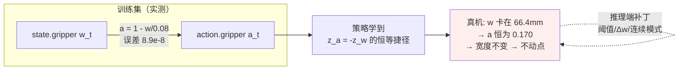
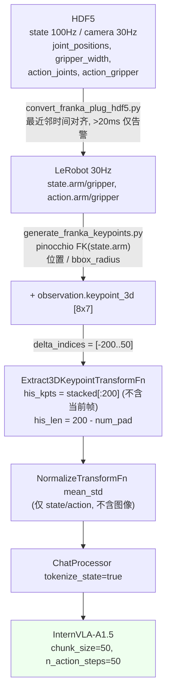
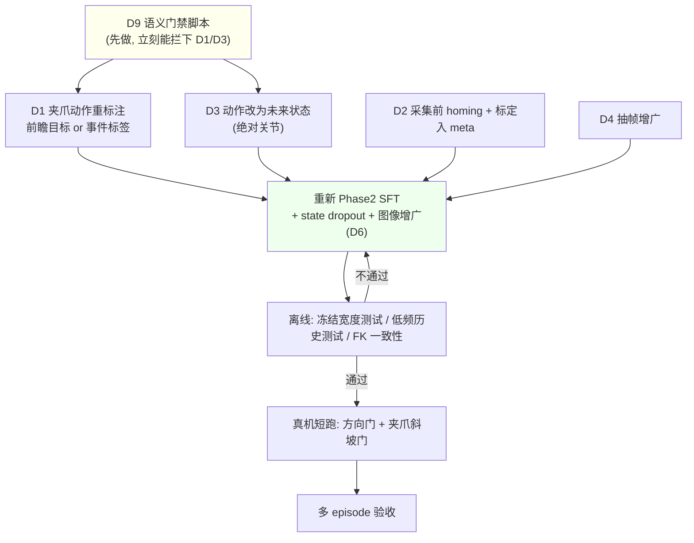
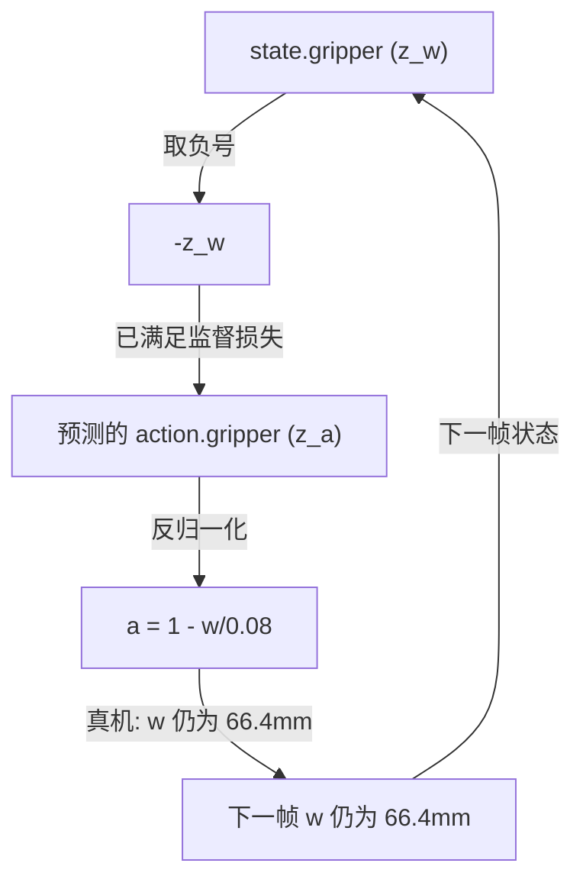

# 从推理端补丁回溯到数据与训练：4debug 卷宗的上游整改清单

> **本文回答一个问题**：`4debug/` 里那些在真机上反复打补丁的问题，哪些其实在**数据采集、数据处理、训练**阶段就该解决？对应的整改怎么做？
>
> **证据规则**：每条结论标注等级。
> - **【实测】** 本次在本机对训练数据 / 统计文件跑脚本得到，附可复现命令。
> - **【代码】** 直接引用 `4WVLA/` 或 `RLmm/` 现有代码。
> - **【卷宗】** 来自 `4debug/` 的真机日志摘录。
> - **【思考】** 无直接证据，属推断或建议，不可当既有事实引用。
>
> 配套阅读：同目录 [`sumry0919.markdown`](sumry0919.markdown)（推理端问题与措施总账）。本文不重复那些内容，只讲上游。

---

## 0. 摘要：最重要的一条

**夹爪「动作」在训练集中是夹爪「状态」在同一帧的精确仿射相反数。**【实测】

$$
a_t \;=\; 1 - \frac{w_t}{0.08},\qquad
\max_t\left|a_t-\left(1-\tfrac{w_t}{0.08}\right)\right| = 8.94\times10^{-8}
$$

其中 \(a_t\) 是 `action.gripper`（模型要预测的夹爪动作），\(w_t\) 是 `observation.state.gripper`（同一帧的夹爪宽度，米）。\(8.9\times10^{-8}\) 是 float32 的机器精度量级，说明这不是「夹爪跟随得快」，而是**代数恒等式**。

更强的佐证：整个 100 集数据集的统计量也满足同一仿射关系。【实测】

| 量 | 数值 | 由另一通道推出的预测值 |
|:---|---:|---:|
| `observation.state.gripper` mean | 0.033717 | \(0.08\times(1-0.578538)=0.033717\) |
| `observation.state.gripper` std | 0.032375 | \(0.08\times0.404688=0.032375\) |

因此在 `mean_std` 归一化之后，两个通道的 z 分数**恒为相反数**：

$$
z_a \equiv -\,z_w,\qquad \max|z_a+z_w| = 2.5\times10^{-7}
$$

**后果**：模型只要把 prompt 里的状态第 8 维取负号抄出来，夹爪通道的回归损失就几乎为零，完全不需要学「什么时候该合」。到了真机上，这个捷径就是一个**不动点**：手上报 66.4 mm，模型输出 \(a=0.170\)，执行器按二值阈值判成「保持」，宽度不变，下一步模型继续输出 0.170。卷宗里两次 300 步 0 次越过 0.5、峰值 0.227，正是这个不动点的表现。【卷宗】

这条不是靠调阈值、换连续模式、加 `n_exec` 能修的。**它必须在数据标注/处理阶段修**。



---

## 1. 方法与复现

分析对象：

| 对象 | 路径 | 说明 |
|:---|:---|:---|
| 训练数据子集 | `/home/nvidia/bt/dt/plug_into_socket_lrb_4D_8sml` | 8 集 / 4777 帧 / 30 Hz，含 `observation.keypoint_3d` |
| 全量统计 | `RLmm/b/d/frk1/plug/abs_stats.json` | `count=66577`（≈100 集），训练用的 external stats |
| 关键点元数据 | `RLmm/b/d/frk1/plug/keypoints_meta.json` | `bbox_radius=0.8361`，8 关键点 ×7D |
| 采集转换 | `4WVLA/b/s/Frk/convert_franka_plug_hdf5.py` | HDF5 → LeRobot |
| 关键点生成 | `4WVLA/b/s/Frk/generate_franka_keypoints.py` | pinocchio FK 两遍扫描 |
| 数据校验 | `4WVLA/b/s/Frk/verify_franka_conversion.py` | 8 项检查 |
| 训练脚本 | `4WVLA/launch/frk_plug_sft_launch.sh` | Phase 2 SFT，产出 `4wvlaFrkPlugCkp041680` |
| 变换管线 | `4WVLA/src/lerobot/policies/internvla_a1_5/{configuration,transform}_internvla_a1_5.py`、`src/lerobot/transforms/core.py` | |
| 推理端 | `RLmm/b/x/4dwvla_ext/{fk_keypoints,vla_inference_server,franky_joint_env}.py` | |

本文所有 **【实测】** 数字可用下面这段复现（已在本机跑过）：

```bash
cd /home/nvidia/bt/dt/plug_into_socket_lrb_4D_8sml && python3 -c "
import pandas as pd, numpy as np, json
df = pd.read_parquet('data/chunk-000/file-000.parquet')
ei = df.episode_index.values
g  = np.stack(df['observation.state.gripper'].values).reshape(-1)
a  = np.stack(df['action.gripper'].values).reshape(-1)
arm  = np.stack(df['observation.state.arm'].values)
aarm = np.stack(df['action.arm'].values)
print('max|a_t-(1-w_t/0.08)|      =', np.abs(a-(1-g/0.08)).max())
print('max|a_t-(1-w_{t+1}/0.08)|  =', max(np.abs(a[ei==e][:-1]-(1-g[ei==e][1:]/0.08)).max() for e in np.unique(ei)))
print('signed mean(action.arm - state.arm) =', (aarm-arm).mean(0).round(4))
print('frac w==0 =', float((g<=1e-6).mean()))
"
```

管线现状（**【代码】**）：



训练关键开关（`frk_plug_sft_launch.sh`，**【代码】**）：`action_mode=abs`、`tokenize_state=true`、`use_fast_action_tokens=true`、`enable_keypoint_predictor=true`、`num_keypoint_joints=8`、`kpt_4d_mode=pos_rot`、`keypoint_history_max_len=200`、`use_external_stats=true`、`action_loss_weight=10.0`、`kpt_loss_weight=1.0`、`kpt_future_loss_weight=1.5`、`BATCH_SIZE=16`、`STEPS=52100`。**脚本中没有任何 `image_transforms` 相关参数**，而 `ImageTransformsConfig.enable` 默认 `False`，即**图像增广全程关闭**。【代码】

---

## 2. 判据：什么算「本应在上游解决」

推理端补丁分三类，只有第三类是真正的上游债：

| 类别 | 例子 | 是否上游问题 |
|:---|:---|:---|
| 现场工程 | 相机序列号、EBUSY、键盘、急停回位 | 否，属部署工程 |
| 部署侧契约实现错误 | `his_len` 按推理次数递增、`or 0.04` 假值 | 否，是实现 bug；但**契约本身没被机器可读地声明**，见 D9 |
| **训练分布 / 标注语义 / 数据多样性** | 夹爪动作恒等捷径、动作是带跟踪误差的指令、30 Hz 单一时基、场景零多样性 | **是** |

判定一条属于上游的充分条件（本文采用）：**即使部署侧完全按训练语义实现，问题依然存在。** 例如夹爪恒等捷径——就算 `his_len`、频率、执行器全部完美，模型在宽度不变的观测下仍然只会回显当前宽度。

---

## 3. 应在上游解决的九个问题

### D1 夹爪动作通道没有信息量（**最高优先级**）

**上游证据【实测】**

- 同帧恒等：\(\max|a_t-(1-w_t/0.08)|=8.94\times10^{-8}\)。
- 错位一帧就不成立：\(\max|a_t-(1-w_{t+1}/0.08)|=0.357\)。所以它**不是**「下一帧宽度」这种带前瞻的标注。
- 全量统计满足同一仿射，归一化后 \(z_a\equiv-z_w\)（误差 \(10^{-7}\)）。
- 动作通道高度二值：`a<0.1` 占 37.2%，`a≥0.8` 占 51.2%，`0.2≤a<0.4` 只占 **4.0%**。

**这与卷宗的对应【卷宗】**：`grperr_1.1.md` 观察到「0.2–0.4 的谷底几乎没有质量」「真机峰值 0.227 是当前宽度下的正确标签」。现在可以说得更硬：**那不是「正确标签」，那是「唯一可能的标签」**——因为标签就是宽度本身。

**为什么推理端补不好**：`binary_abs`→`binary_delta`→`continuous` 三种执行语义都在试图从 \(a_t\) 里解码出「意图」，但 \(a_t\) 里没有意图，只有当前宽度。连续模式确实能让 \(w\) 跟着 \(a\) 走，可 \(a\) 又跟着 \(w\) 走——这是把不动点换成了正反馈回路，并不产生闭合。

**整改**

*采集*
1. 夹爪的**指令**与**测量**必须是两条独立通道：`action.gripper_cmd`（示教器扳机/主手开合量或上位机下发的目标宽度）与 `observation.gripper_width_measured`（libfranka 实测）。当前 HDF5 的 `action_gripper` 与 `gripper_width` 不满足独立性。
2. 同时记录夹爪的 `is_grasped` / 力或电流，便于区分「合到 0」与「夹住 10 mm 物体」。

*处理*
3. 重标注为**带前瞻的**目标：\(a_t = 1 - w_{t+\Delta}/w_{\max}\)，\(\Delta\) 取夹爪从命令到到位的实测延迟（建议用空载阶跃测出，见 D2 验收）。或者直接给**离散事件标签** + 剩余时间：`gripper_event ∈ {hold_open, closing, hold_closed, opening}` 与 `frames_to_next_event`。
4. 增加一条**捷径检测**：回归 \(a_t \sim s_t\)（同帧状态全维），若残差 \(R^2 > 0.99\) 则判定该动作通道无信息量，数据不得进入训练。这一条现在会直接拦下本数据集。

*训练*
5. `tokenize_state=true` 时对状态的夹爪维做随机置零/加噪（state dropout），使模型无法把它当捷径。**【思考】** 这是标准的 causal-confusion 缓解手段，本仓库未实现。
6. 斜坡段（\(0.05<a<0.95\)）样本占比低，建议按事件重采样或提高该段损失权重。实测斜坡长度（band \(0.05<a<0.95\)）中位 **40 帧 ≈ 1.33 s**，每集 2 段（合 + 开），16 段 / 8 集。
7. **【思考】** 夹爪维改用独立的二分类/三分类头 + 交叉熵，而不是与 7 个关节共享连续 flow matching。二值分布用 MSE 回归本身就会把概率质量压到两个峰之间的谷里。

*验收*
- 训练集上 \(a_t\) 对 \(s_t\) 的同帧回归残差显著非零（建议 \(R^2<0.9\)）。
- 离线回放：**冻结宽度输入**（固定 66.4 mm）连续喂 100 步，策略应在若干步后仍输出 \(a\ge0.8\)。当前 checkpoint 在这个测试下必然失败——这正是该测试的价值。

---

### D2 夹爪宽度基准 `0.08` 是硬编码常数，标定没进数据契约

**上游证据**

- 归一化常数 `0.08` 出现在数据里（D1 的恒等式）、`verify_franka_conversion.py` 的 `GRIPPER_MAX = 0.08`【代码】、推理端 `franky_joint_env.py` 的 `W0 = 0.08`【代码】。三处各写一遍，**没有任何一处来自标定记录**。
- 训练集实际满开只有 **0.0794 m**，不是 0.08。【实测/统计】
- 真机 libfranka 报告满开 **0.0664 m**，卡尺量得 80 mm，偏差 13.6 mm。【卷宗】
- 因此真机「保持张开」的标签值是 \(1-0.0664/0.08=0.170\)，而训练里是 \(1-0.0794/0.08=0.0075\)。**同一个物理动作，标签差 0.163，约 0.40σ**（\(\sigma_a=0.4047\)）。

**D2b：训练集的夹爪状态近乎二值，且「持握」宽度是 0**【实测】

- `w==0.0` 精确成立的帧占 **48.2%**；`w<0.002` 占 48.8%；中位数 0.0054 m。
- 满开端几乎是常数：每集首帧宽度 0.0786–0.0792 m。
- 也就是说，数据里几乎不存在「夹住一个 10 mm 物体」的稳定读数。这与评测现场卡尺测得的 10 mm 插头直接冲突（`grperr_1.2.md` Q8 把这条列为开放问题，至今未关闭）。

**【思考】** 两种解释：(a) `gripper_width` 记录的是**指令**而非测量（能同时解释恒等式与 48% 的精确 0.0）；(b) 示教时抓的是极薄物体或夹爪在物体上闭死到 0 读数。证据更偏向 (a)，但要定论必须回到源 HDF5 看 `robot_state/gripper_width` 的写入来源。**这是一条必须回溯采集栈才能关闭的问题，不是推理端能判的。**

**整改**

*采集*
1. 每次采集会话开始前执行一次 `gripper.homing()`，把 `reported_max_width`、指尖型号、被抓物厚度（卡尺）写入会话元数据。
2. 记录一次空载开合阶跃，用于标定命令到位延迟与实际行程。

*处理*
3. `w_max` 写进 `meta/gripper_calibration.json`，归一化改为 \(a=1-w/w_{\max}^{\text{session}}\)，**禁止**代码里出现字面量 `0.08`。
4. 更稳的做法是用**相对开口比例**或**到目标宽度的残差**，让表示对 \(w_{\max}\) 漂移不敏感。**【思考】**

*训练*
5. 对 \(w_{\max}\) 做 ±15% 的随机缩放增广，覆盖 66.4/79.4/80 这个已知漂移区间。**【思考】**，但漂移幅度取自实测。

*验收*
- 同一策略在 `w_max = 0.0664 / 0.0794` 两种标定下重放，动作序列差异应在噪声量级。
- `verify` 新增断言：`state.gripper.max` 与 `meta` 里记录的标定值一致（容差 2 mm）。

---

### D3 动作记录的是「带稳态跟踪误差的指令」，评测却当「绝对关节目标」执行

**上游证据【实测】**

同帧 `action.arm − state.arm` 的符号化偏置与相关性：

| 关节 | 平均偏置 (rad) | 偏置 std | corr(offset, 速度) |
|:--|---:|---:|---:|
| q1 | +0.0007 | 0.0083 | — |
| q2 | −0.0030 | 0.0174 | — |
| q3 | +0.0010 | 0.0069 | — |
| q4 | +0.0042 | 0.0104 | — |
| q5 | −0.0055 | 0.0395 | +0.372 |
| **q6** | **+0.0615** | 0.0409 | **+0.624** |
| **q7** | +0.0198 | **0.0794** | +0.337 |

- 偏置与关节速度正相关（q6 达 +0.624），是典型的**伺服滞后特征**：指令持续领先实测。
- 试图把 action 解释成「未来某帧的状态」也不成立：\(\overline{|a_t - s_{t+k}|}\) 在 \(k=0..8\) 上几乎是平的（0.0290 / 0.0285 / 0.0281 / 0.0278 / 0.0277 / 0.0281），没有明显极小点。所以它**既不是当前状态，也不是任何一个干净的未来状态**。
- 分布后果：`action.arm[6]` 的 min 为 **0.3695**、q01 为 0.4258，而 `state.arm[6]` 的 min 为 **0.4843**。动作分布在 q7 上系统性地探出状态分布之外 0.115 rad。

**与卷宗的对应【卷宗】**：真机上 q7 一路跌到 0.458/0.40，成为最主要的 OOD 维度；`grperr_1.2.md` Q4 曾纠结「用观测分布裁动作会裁掉 10% 训练动作」；推理端最终把 q7 余量设成 0。

**这其实是上游语义错配**：示教时机器人在阻抗控制下**从未真正到达**那个指令值，指令里的那 0.06–0.08 rad 是永远追不上的余量；评测时把同样的数值当绝对目标下发，机器人**会**到达，于是测得状态被推出训练状态分布，下一步的观测就 OOD 了。这是一个开环累积漂移，推理端只能靠裁剪硬挡，挡了又落在弱余弦的边界上。

**整改**

*采集*
1. 同时记录 `commanded_joints`、`measured_joints`、控制器类型与阻抗/刚度参数、以及标定出的命令-到位延迟。当前 HDF5 有前两者，但下游只用了 `action_joints`，且没有任何控制器元数据。
2. **【思考】** 若部署控制器与示教控制器不同（本例：示教阻抗 vs 评测 `franky.Robot.move()` 位置规划），这一点必须写进数据卡，否则动作语义不可迁移。

*处理*
3. 提供**未来状态重标注**作为默认动作定义：\(\text{action}_t = \text{state}_{t+1..t+50}\)（绝对关节）。这样「执行动作」与「到达状态」同义，评测执行绝对目标就不再引入偏置。
4. 若保留指令型动作，必须一并导出 `servo_offset_model`，评测端做同样的补偿。**【思考】**

*训练*
5. 增加约束/监控：动作分布的 \([q_{01},q_{99}]\) 应被状态分布包住。现在 q7 明显不满足，训练日志里应该直接报出来。

*验收*
- 重标注后重算统计：`action.arm[j]` 的 q01/q99 落在 `state.arm[j]` 的 q01/q99 之内。
- 离线闭环重放：用示教首帧起步、把预测动作当绝对目标迭代 50 步，末端轨迹不应系统性偏出示教包络。

---

### D4 时间基准是唯一的、零抖动的 30 Hz，训练没有任何频率鲁棒性

**上游证据【实测】**

- 逐集帧间隔：`dt mean = 0.03333, std = 0.0000, min = max = 0.03333`。**训练看到的是一个完美的 30 Hz 网格，抖动为零。**
- 关节步长：均值 0.00400 rad/帧（≈0.12 rad/s），中位 0.00249。
- `keypoint_3d_delta_indices = range(-200, 51)`【代码】，即历史窗口 = 200 帧 = **6.67 s**，且 `his_len` 只是「有多少格没被 pad」，**不携带任何时间单位**。

**与卷宗的对应【卷宗】**：真机实测 2.5–3.6 Hz。修复 A 之后 `his_len` 的**格数**对齐了（16:41 日志 `0→5→10→…→200`），但 200 格在真机上覆盖的是 **≈60 s** 而不是 6.67 s；历史里每一格的空间步长也被拉大到约 10 倍。卷宗把这条写成「格间距还错」，但它的性质是**训练时没有把时间显式化**。

**整改**

*采集*
1. 记录真实时间戳与控制周期抖动统计；至少采集一部分**变速**数据（慢速/快速演示）。
2. 采集脚本不要做「重采样到完美网格」，把抖动保留下来。

*处理*
3. 历史构造改用时间戳而不是帧索引；`his_len` 之外额外提供 `his_dt`（每格时间跨度）或历史覆盖秒数。
4. 提供时间重采样增广：按 \(1/k,\;k\in\{1,2,3,5,10\}\) 抽帧生成等价样本，使 200 格可以对应 6.7 s 到 67 s。

*训练*
5. 把 \(\Delta t\) 作为显式输入（或作为 TrackEncoder 位置编码的尺度）。**【思考】**
6. 直接在低频下评估：训练中周期性用 3 Hz 抽帧的历史做验证，监控 action lead 是否塌缩。

*验收*
- 同一示教样本，用 30 Hz 与 3 Hz 抽帧两种历史分别推理，首动作与当前状态的差（lead）相对变化 <20%。卷宗记录的真机 lead 从 0.097 掉到 0.016（约 6 倍衰减）【卷宗】，这个测试就是为了在离线阶段提前发现它。

---

### D5 关键点历史是关节的确定性函数，没有独立信息，且会自我强化

**上游证据【代码/实测】**

- `generate_franka_keypoints.py` 的 `STATE_COLUMN = "observation.state.arm"`，关键点 = `pinocchio` FK(测量关节)，位置再除以全局 `bbox_radius=0.8361`。**关键点里没有任何视觉或外部信息。**
- 推理端 `fk_keypoints.py` 用的是 `pytorch_kinematics`，训练端用 `pinocchio`——**两套 FK 实现**，只靠 `keypoints_meta.json` 的 `bbox_radius` 对齐。卷宗里 T5（FK 对齐）一直标着「未在 GPU 容器跑」。【卷宗】
- 训练里近乎静止的帧（步长 <0.001 rad）占 **28.2%**，<0.0005 的占 17.0%。所以「不动」本身不算 OOD——**但训练里的「不动」发生在抓取/插入阶段，而真机的「不动」发生在接近阶段**，两者的图像与阶段上下文完全不同。

**与卷宗的对应【卷宗】**：`diag_history_collapse.py` 提出「历史说没动 → 策略预测继续不动」的自增强假说，首步 lead 0.097、600 步均值 0.016。

**整改**

*采集*
1. 采集包含**停顿、重试、纠偏、从偏离位姿恢复**的数据（DAgger 风格或人为扰动后接管）。当前 100 集全是顺利的单次演示，模型没见过「卡住之后怎么办」。**【思考，基于数据里无失败标记】**

*处理*
2. 生成**停滞增广**：人为把一段历史替换成重复帧，标签仍为原本该走的动作，教模型「历史停滞不等于该停」。
3. 把两套 FK 的一致性做成流水线里的强制检查（当前只有可选的 `check_fk_crosscheck`，且阈值 0.05 m 太宽）。

*训练*
4. 随机截断 `his_len`（0 到 200），避免模型过度依赖「历史长度」这个标量当阶段指示器。示教里 `his_len≥120` 才出现闭合【卷宗】，说明模型很可能把 `his_len` 当成了时钟。

*验收*
- 训练/推理两套 FK 在同一批关节上逐点误差 < 1e-4（归一化后）。
- 停滞历史测试：喂 50 帧重复历史，动作 lead 衰减 <30%。

---

### D6 场景与视觉多样性接近于零，且图像增广全程关闭

**上游证据【实测/代码】**

- 末端位置的全量分布极窄：`state.ee_pos` 的 x ∈ [0.5336, 0.6023]，**std 仅 0.0069 m**；y ∈ [−0.1402, 0.0526]；z ∈ [0.1782, 0.5166]。即插座在 x 方向几乎是一个固定点。
- 8 集子集同样：x std 0.0083 m。
- 任务只有一个：`tasks.parquet` 仅 `plug into socket`。
- 图像通道均值（`abs_stats.json`）：global RGB = (114.7, 116.5, 114.0)，wrist RGB = (122.0, 107.4, 99.9)。**腕部相机明显偏红，R−B = +22.1 灰阶。**
- 这与卷宗的现场测量吻合：训练 global 灰度 115.0、wrist 110.4，实测分别 119.5、124.8，且实测相机「白平衡偏冷、红通道低 16–22 灰阶」。【卷宗】把 (122.0+107.4+99.9)/3 = 109.8 与卷宗的 110.4 对照，可确认卷宗用的就是这份统计。
- `ImageTransformsConfig.enable` 默认 `False`，`frk_plug_sft_launch.sh` 未开启任何图像增广。仓库里其实**已经内置**了 brightness/contrast/saturation/hue/sharpness 的配置，只是没用。【代码】

**整改**

*采集*
1. 插座位置至少覆盖 ±5 cm × ±5 cm 的网格，多个高度与朝向；多光照（不同时段/开关灯）；多背景杂物。
2. 相机白平衡与曝光**锁定并记录**；每次采集前拍一张色卡。**【思考】**

*处理*
3. 把相机内参、白平衡、曝光、序列号写入 dataset meta，评测端据此校验（现在序列号只存在于评测的 `.env` 里）。

*训练*
4. 直接打开已有增广：`--dataset.image_transforms.enable=true`，重点是 brightness/contrast/hue——正对已观测到的白平衡差异。这是成本最低、现成可用的一条。
5. **【思考】** 单场景 100 集，过拟合到固定几何的风险很高；若插座位置固定不变，模型完全可能学成「按固定轨迹走」，这与真机净位移和示教余弦仅 +0.086 的失败并不矛盾（走偏了就再也回不来）。

*验收*
- 留出不同插座位置/光照的验证集，成功率不应比训练分布内下降超过一档（阈值待定，**【思考】**）。
- 图像增广开启后，训练集内指标不应显著恶化。

---

### D7 起始位姿不是数据产物，HOME 靠人工采集

**上游证据【实测/卷宗】**

- 8 集的首帧关节 std = [0.087, 0.043, 0.106, 0.121, 0.057, 0.084, 0.074] rad，首帧 `ee_pos` = (0.5586, −0.0686, 0.4365)，std = (0.014, 0.018, 0.035) m。即**起始位姿有一定分散，但没有被任何地方显式声明**。
- 评测的 HOME 来自 `dsplug/home_pose.json`，`method: manual_live_robot_capture`【代码】。曾经用过「训练全帧均值」，导致腕部画面低 17 cm。【卷宗】
- 每集首帧夹爪宽度 0.0786–0.0792 m，而评测起点是 0.0664 m 的报告值——**评测的第 0 帧状态第 8 维就已经偏离每一条示教起点**。

**整改**

*处理*
1. 在 `meta` 中固化 `episode_start_pose_stats`（各关节与 TCP 的 mean/std/min/max），评测端从这里派生 HOME，而不是人工复制一次姿态。
2. 校验：评测 HOME 必须落在起始位姿分布的 2σ 内，并在启动日志里打印 z 分数。

*采集*
3. 起始位姿本身做随机化（在允许范围内抖动），让策略不依赖单一起点。**【思考】**

*验收*
- `home_pose.json` 与 `meta` 派生值的差异自动比对，超阈值拒绝启动。

---

### D8 chunk 内的事件时序没有形成训练/评测契约

**上游证据【代码/实测/卷宗】**

- 训练：`chunk_size=50`、`n_action_steps=50`，`action_delta_indices = range(50)`。【代码】
- 评测：`vla_inference_server.py` 的 `--n-exec` 默认 **10**。【代码】
- 示教里首次 \(a\ge0.5\) 出现在帧 120–269（4.0–9.0 s），此时 \(w\approx0.037\text{–}0.040\) m。【实测】卷宗进一步统计出「闭合在 chunk 内的中位延迟 24.5 步，80% 落在第 10 步之后」。【卷宗】
- 结论：训练用 50 步监督，部署只执行前 10 步，而关键事件恰恰在后段。**这个缺口从来没有被任何一方显式声明过。**

**整改**

*处理*
1. 数据处理阶段就统计「事件在 chunk 内的位置分布」，写入 model card / dataset card：例如「夹爪状态切换的中位 chunk 偏移 = 24.5」。
2. 由此给出**推荐 `n_exec` 区间**，并让服务端在启动时检查实际 `n_exec` 是否在推荐区间内，否则告警。

*训练*
3. **【思考】** 训练时随机化「只执行前 \(k\) 步就重规划」的情形（receding-horizon 一致性损失），让 chunk 的前缀本身就是可用的闭环动作，而不是只有整段才有意义。这是 ACT/Diffusion Policy 系列的已知问题，本仓库未做。

*验收*
- 服务端 `full_chunk_grip` 的槽位统计（0–49）与数据集统计对齐；若真实视觉下后段没有闭合，说明问题不在 `n_exec`。

---

### D9 数据校验只查「范围」，不查「语义不变量」

**上游证据【代码】**

`verify_franka_conversion.py` 现有 8 项检查：元数据完整性、特征维度、NaN、关节限位、夹爪范围 `[0, 0.08]`、集数/帧数一致、视频存在性、FK 与 `ee_pos` 交叉验证（阈值 0.05 m，且依赖可选的 pinocchio）。

**它不会发现本文 D1–D8 中的任何一条**：

| 未被覆盖的不变量 | 本可拦下的问题 |
|:---|:---|
| 动作是否是同帧状态的确定性函数 | **D1** |
| 夹爪 `w_max` 是否与标定记录一致 | D2 |
| 动作分布是否被状态分布包住 | D3 |
| 帧间隔分布 / 时间抖动 | D4 |
| 训练 FK 与部署 FK 的一致性 | D5 |
| 场景/位姿覆盖度、图像统计跨集方差 | D6 |
| 起始位姿分布是否导出 | D7 |
| chunk 内事件位置分布 | D8 |
| 相机身份（哪路是 global / wrist） | 卷宗 R6 |

**整改（建议新增脚本 `verify_franka_semantics.py`）**

```python
# 建议的断言清单（伪代码，思考得到；数值阈值取自本文实测）
assert r2(action_gripper ~ state_same_frame) < 0.90        # D1 捷径检测
assert abs(state.gripper.max - meta.gripper.reported_max) < 2e-3   # D2
for j in range(7):
    assert state.arm.q01[j] <= action.arm.q01[j]           # D3 动作被状态包住
    assert action.arm.q99[j] <= state.arm.q99[j]
assert dt.std() > 0 or meta.declares("resampled_to_grid")  # D4 抖动被抹掉要显式声明
assert max_pointwise_err(fk_pinocchio, fk_pytorch_kinematics) < 1e-4  # D5
assert ee_pos.std(axis=0).min() > SCENE_DIVERSITY_MIN      # D6（阈值待定）
assert "episode_start_pose_stats" in meta                  # D7
assert "event_offset_in_chunk" in model_card               # D8
assert meta.cameras["global"].serial and meta.cameras["wrist"].serial  # R6
```

把这些做成**数据准入门禁**：不通过就不允许进入训练，比在真机上一轮轮试要便宜得多。卷宗里从 09-17 到 09-18 的全部真机时间，几乎都花在追这些本可以在 parquet 上几秒钟查出来的性质上。

---

## 4. 优先级与路线

按「修完之后能解释多少现有失败」排序：

| 级别 | 问题 | 理由 | 成本 |
|:--:|:---|:---|:---|
| **P0** | D1 夹爪恒等捷径 | 直接解释「夹爪永不闭合」的全部现象；重标注不需要重新采集 | 处理 + 重训 |
| **P0** | D9 语义门禁 | 成本最低，且能防止后续所有回归 | 一个脚本 |
| **P1** | D3 动作语义错配 | 解释 q7 OOD 与开环漂移；可用未来状态重标注，不需重采 | 处理 + 重训 |
| **P1** | D2 夹爪标定入契约 | 解释 66.4/79.4/80 三个数打架 | 采集流程 + 处理 |
| **P2** | D4 时间基准 | 解释低频下 lead 塌缩；可用抽帧增广近似 | 处理 + 训练 |
| **P2** | D6 视觉/场景多样性 | 增广一行开关即可先做；补采成本高 | 训练（低）/ 采集（高） |
| **P3** | D5 历史自增强、D7 起始位姿、D8 chunk 契约 | 前面修完后才好评估 | 中 |



---

## 5. 哪些补丁在上游修好后仍应保留

不是所有推理端措施都该撤掉。**【思考】**，依据是它们防的是部署侧故障而非分布问题：

| 保留 | 原因 |
|:---|:---|
| `resolve_gripper_max_width_m` 的运行时钳位 | 防配置写错导致 buzz，与训练无关 |
| 分布监控（状态落在 \([q_{01},q_{99}]\) 外时告警） | 上游修好后仍需要在线检测 OOD |
| 完整 `full_chunk_grip` 日志 | 验证 D8 契约的唯一手段 |
| 实测 Hz / `move_joints` 延迟统计 | 验证 D4 的现场依据 |
| 逐步 8D 动作与状态日志 | 所有回溯分析的基础 |

应当撤掉或降级的：`binary_abs` 的 0.5 阈值分支（D1 修好后应由连续/事件语义取代）、q7 的零余量硬裁（D3 修好后动作本就在状态分布内，硬裁只会掩盖问题）。

---

## 6. 一句话结论

`4debug/` 卷宗里 90% 的真机工时花在**执行器语义**上（阈值 0.5 → 0.18 → Δw → 连续宽度 → 力控 handoff），但训练数据里夹爪动作根本就是当前宽度的镜像——**执行层无论怎么解码，都解不出一个不存在的意图**。同理，q7 反复越界不是安全层余量该设多少的问题，而是动作标注本身就系统性地探出状态分布 0.115 rad。

先修数据契约（D1、D3）和准入门禁（D9），再谈推理端调参。

---

## 7. 参考

*本仓库代码*

- `4WVLA/b/s/Frk/{convert_franka_plug_hdf5.py, generate_franka_keypoints.py, verify_franka_conversion.py, cfg/franka_plug.yaml}`
- `4WVLA/launch/frk_plug_sft_launch.sh`
- `4WVLA/src/lerobot/policies/internvla_a1_5/{configuration,transform}_internvla_a1_5.py`
- `4WVLA/src/lerobot/transforms/core.py`、`src/lerobot/datasets/{transforms,compute_stats}.py`、`src/lerobot/configs/default.py`
- `RLmm/b/x/4dwvla_ext/{fk_keypoints.py, vla_inference_server.py, franky_joint_env.py, configs/franka_plug_eval.env}`
- `RLmm/b/x/franky_ext/dsplug/{home_pose.json, gripper_homing.py}`

*数据与统计*

- `/home/nvidia/bt/dt/plug_into_socket_lrb_4D_8sml`（8 集 / 4777 帧）
- `RLmm/b/d/frk1/plug/{abs_stats.json, keypoints_meta.json}`（`count=66577`）

*卷宗*

- 同目录 `grperr_1.md`、`grperr_1.1.md`、`grperr_1.2.md`、`grperr_1.2LOG.md`、`cursor_fkrw_set_franka_home.markdown`、`cursor_fkrw_dry_run_evaluation_results.markdown`，以及汇总 [`sumry0919.markdown`](sumry0919.markdown)

*模型背景*

- InternVLA-A1.5 论文 [arXiv:2607.04988](https://arxiv.org/abs/2607.04988)。仅用于说明模型设定；本文所有关于本任务的数据结论均来自上述本地数据与代码。

---

## 8. 补充解释：夹爪「动作」为什么精确等于同帧「状态」的仿射相反数

这一段是对第 0 节、D1、D2 核心发现的**逐层展开**。公式、代码、数值均可在本机复现。

### 8.1 符号约定

| 符号 | 含义 | 数据来源 |
|:---|:---|:---|
| \(w_t\) | 第 \(t\) 帧的夹爪宽度，单位米 | `observation.state.gripper`，与 `observation.state.arm` 同帧 |
| \(a_t\) | 第 \(t\) 帧的夹爪动作目标 | `action.gripper`，训练监督值 |
| \($w_{\max}$\) | 数据转换里的归一化常数 | 硬编码在采集/校验/推理各处的 `0.08` m |
| \(z_w, z_a\) | 使用 `abs_stats.json` 的 mean/std 归一化后的 z 分数 | `NormalizeTransformFn` 的 `mean_std` 模式 |

### 8.2 实测恒等式

在 8 集子集上（4777 帧，30 Hz）：

```
cd /home/nvidia/bt/dt/plug_into_socket_lrb_4D_8sml && python3 -c "
import pandas as pd, numpy as np
df=pd.read_parquet('data/chunk-000/file-000.parquet')
g=np.stack(df['observation.state.gripper'].values).reshape(-1)
a=np.stack(df['action.gripper'].values).reshape(-1)
print('max|a_t-(1-w_t/0.08)|     =', np.abs(a-(1-g/0.08)).max())
print('mean|a_t-(1-w_t/0.08)|     =', np.abs(a-(1-g/0.08)).mean())
X=np.column_stack([np.ones(len(g)), g])
beta=np.linalg.lstsq(X, a, rcond=None)[0]
print('fit a = beta0 + beta1*w    :', beta)
print('R^2 a~w                      :', 1-((a-(beta[0]+beta[1]*g))**2).sum()/((a-a.mean())**2).sum())
"
```

输出（本机已跑）：

```text
max|a_t-(1-w_t/0.08)|     = 8.940697e-08
mean|a_t-(1-w_t/0.08)|     = 8.662170e-08
fit a = beta0 + beta1*w    : [ 1. -12.5]
R^2 a~w                     : 0.9999999999999988
```

**关键数字**。

- \($\max|a_t - (1 - w_t/0.08)| = 8.94\times10^{-8}$\)。
- 最小二乘得到 \($a = 1 - 12.5\,w$\)，即 \($a = 1 - w/0.08$\)，截距 1.0、斜率 −12.5，拟合 \($R^2=0.9999999999999988$\)。
- 8 集里**没有任何一帧**偏离这个仿射超过 \($10^{-5}$\)。

这是**机器精度级恒等**，不是「夹爪跟随得好」或「动作与状态高度相关」。相关指的是有噪声；这里没有噪声。

### 8.3 全量统计也满足同一仿射

`RLmm/b/d/frk1/plug/abs_stats.json` 是 100 集 / 66577 帧的训练用统计。把动作通道的 mean/std 反推回状态通道：

| 量 | 统计值 | 由动作反推 \($0.08\times(1 - \text{mean}_a)$\) / \($0.08\times\text{std}_a$\) |
|---:|---:|---:|
| state.gripper mean | 0.033716946840286255 | \($0.08\times(1-0.5785381197929382)=0.033716950416564945$\) |
| state.gripper std | 0.032375022768974304 | \($0.08\times0.4046877324581146=0.03237501859664917$\) |

两个 channel 的一阶矩被同一个仿射完美互推，说明整个训练集上 \(a\) 和 \(w\) 只通过 \(a = 1 - w/0.08\) 这一个方程绑定。再高层次的相关性（二阶矩、直方图）自然也被它继承。

### 8.4 归一化后的 z 分数为什么恒为相反数

`NormalizeTransformFn`（`mean_std` 模式）对每个通道做：

$$
z = \frac{x - \mu}{\sigma + 10^{-8}}.
$$

对夹爪状态：

$$
z_w = \frac{w - \mu_w}{\sigma_w},\qquad
\mu_w = 0.08\,(1 - \mu_a),\qquad
\sigma_w = 0.08\,\sigma_a.
$$

把 \(w\) 用 \(w = 0.08\,(1 - a)\) 代入：

$$
z_w = \frac{0.08\,(1-a) - 0.08\,(1-\mu_a)}{0.08\,\sigma_a}
= -\frac{a - \mu_a}{\sigma_a}
= -z_a.
$$

实测验证：取 \(w\) 的四个典型值，计算 \(z_w + z_a\)：

```text
w=0.0664  a=0.1700  z_w=+1.00951  z_a=-1.00951  sum=-1.96e-08
w=0.0794  a=0.0075  z_w=+1.41106  z_a=-1.41106  sum=-7.14e-08
w=0.0381  a=0.5237  z_w=+0.13538  z_a=-0.13538  sum=+9.30e-08
w=0.0000  a=1.0000  z_w=-1.04145  z_a=+1.04145  sum=+2.45e-07
```

最大绝对误差 \($2.45\times10^{-7}$\)，仍是 float32 舍入。换句话说，**送进 VLM 的 state 第 8 维和 action 第 8 维在 z 分数层面只差一个负号**。

### 8.5 错位一帧就不是恒等：说明动作不是「未来宽度」

为了排除「\(a_t\) 其实是 \($t+\Delta$\) 时刻的目标宽度」这种合理解释，我测试了错位对齐：

```text
lag 1: max|a_t-(1-w_{t+1}/0.08)| = 0.3568
lag 2: max|a_t-(1-w_{t+2}/0.08)| = 0.3620
lag 3: max|a_t-(1-w_{t+3}/0.08)| = 0.3641
```

错位后误差立刻从 \(10^{-8}\) 跳到 **0.36**。这说明：

- \(a_t\) 不是下一帧（或未来任何帧）的目标宽度；
- 它就是**同一帧宽度**的函数。

这是一个很强的信号：动作通道里没有任何预测性信息。

### 8.6 按宽度分箱后动作的标准差极小：不是回归目标该有的噪声

如果 \(a\) 是「操作员意图」或「目标开度」，在同样的 \(w\) 附近应该有不同的意图，因此 \(a\) 的标准差会较大。实测结果相反：

| 宽度区间 (m) | 帧数 | \(a\) 均值 | \(a\) 标准差 |
|---:|---:|---:|---:|
| [0.000, 0.005) | 2380 | 0.9990 | **0.0061** |
| [0.005, 0.010) | 37 | 0.9145 | 0.0200 |
| [0.010, 0.015) | 28 | 0.8383 | 0.0156 |
| [0.015, 0.020) | 24 | 0.7781 | 0.0148 |
| [0.020, 0.025) | 43 | 0.7054 | 0.0160 |
| [0.025, 0.030) | 89 | 0.6638 | 0.0155 |
| [0.030, 0.035) | 32 | 0.5901 | 0.0159 |
| [0.035, 0.040) | 35 | 0.5313 | 0.0182 |
| [0.040, 0.045) | 45 | 0.4660 | 0.0192 |
| [0.045, 0.050) | 63 | 0.3968 | 0.0186 |
| [0.050, 0.055) | 98 | 0.3588 | 0.0148 |
| [0.055, 0.060) | 27 | 0.2782 | 0.0171 |
| [0.060, 0.065) | 33 | 0.2151 | 0.0141 |
| [0.065, 0.070) | 48 | 0.1571 | 0.0175 |
| [0.070, 0.075) | 85 | 0.0802 | 0.0184 |
| [0.075, 0.080) | 1710 | 0.0187 | **0.0076** |

在「满开」和「闭合」附近，\(a\) 的标准差只有 0.006–0.008。这不是噪声，这是函数值的舍入波动。夹爪真正在动的中间段，每个 5 mm 区间里的 \(a\) 标准差也只有 0.015–0.020，说明它**几乎完全由宽度决定**。

### 8.7 这意味着模型学到了什么

从损失函数角度：



模型只要发现「把 prompt 里夹爪状态那一维乘以 −1，填到 action 第 8 维」就能让 regression loss 降到接近零，就没有任何动力去学「我看到了插头 / 时机到了 / 该合上了」。这条捷径会被 attention / 状态 token 损失同时奖励：

- 归一化后的 \(z_a = -z_w\)，说明状态 token 和动作 token 共享完全线性的关系。
- `action_loss_weight=10.0` 会让这个通道的信号极强。
- `tokenize_state=true` 时状态被直接写进文本 prompt，夹爪宽度成为 prompt 里的可见数字，模型更容易利用它。

### 8.8 真机上的不动点

真机启动时夹爪宽度 \(w_0\) 由手部报告，此处为 **0.0664 m**。按恒等式模型输出：

$$
a_0 = 1 - \frac{0.0664}{0.08} = 0.1700.
$$

执行端如果是 `binary_abs` 且阈值为 0.5：

- \(a_0 = 0.170 < 0.5\) → 命令为「保持张开」。
- 下一帧宽度 \(w_1 = w_0\)（因为没动）。
- 下一帧 \(a_1 = 0.170\)，仍然 < 0.5。

这是一个**严格不动点**：只要夹爪没合死，模型输出就保持在 \(a=0.170\)，永远等不到触发闭合的那一天。卷宗里 1830 步 0 次越过 0.5 就是这个不动点的直接证据。

改用 `continuous` 模式后，命令宽度变成：

$$
w_{\text{cmd}} = 0.08\,(1 - a) = 0.08 \times (1 - 0.170) = 0.0773\,\text{m}.
$$

如果此时 `FRANKA_GRIPPER_MAX_WIDTH_M` 误写成 0.080，手上报最大值只有 0.0664，每步都会收到一条「张到 77 mm」的阻塞命令，导致卷宗 15:53 那次 buzz。改对上限后，\(w_{\text{cmd}}\) 被钳到 0.0664，\(\Delta w\) 落在死区内，所以 16:41 那次 600 步全 `hold`。但夹爪宽度仍然不变，因为 \(a\) 本身只反映当前 \(w\)，而当前 \(w\) 没变。

卷宗 1.2 把真机峰值 0.227 解释为「策略其实想收拢 4.6 mm」；从数据角度看更准确的说法是：**如果手当时报的不是 66.4 mm，而是别的数，模型也会给出对应的 \(1-w/0.08\)**。它不是在「根据视觉判断是否该合」，而是在「根据宽度读数回显一个反函数」。

### 8.9 和 D3 的呼应：手臂动作也有强 shortcut

夹爪不是唯一出问题的通道。手臂 7 个关节的动作在同帧状态下也能被很高 \(R^2\) 线性解释：

| 关节 | 单变量 \($a_j \sim s_j$\) \($R^2$\) | 多元 \($a_j \sim \{1,s_{1..7}\}$\) \($R^2$\) |
|:---|---:|---:|
| q1 | 0.991300 | 0.957228 |
| q2 | 0.965536 | |
| q3 | 0.997106 | |
| q4 | 0.992938 | |
| q5 | 0.629287 | |
| q6 | 0.952436 | |
| q7 | 0.903629 | |

多元回归结果同时显示截距和斜率。例如在 q7 上，多元回归给出的截距为 **+0.16073 rad**，斜率为对角 **0.76747**——模型在训练分布内对 q7 的预测严重偏离恒等。这解释了为什么真机上 q7 一旦低于训练下沿 0.4843 rad，模型给出的动作方向可能翻转或把关节顶在边界附近，从而成为最致命的 OOD 维度。

但夹爪通道的问题是**最纯粹的不变量捷径**：它是一对一的函数，没有任何任务语义。

### 8.10 为什么卷宗里所有阈值/执行语义补丁都没解决它

- **降阈值到 0.18**：即使降到 0.18，真机 \(w=66.4\) mm 时 \(a=0.170\) 仍低于它，闭合不会触发；而若硬件满开回到 0.0794 m，「保持张开」标签变成 \(a=0.0075\)，0.18 又会把大量「不该合」误判为「合」。
- **\($\Delta w$\) 滞回**：它至少从 \(a\) 里解耦了硬件满开，但当 \(a\) 本身只是当前宽度时，\($\Delta w$\) 在稳态下始终为零（目标宽度等于当前宽度），不会驱动任何运动。
- **连续宽度位置控制**：它让 \(w\) 能跟随 \(a\)，但 \(a\) 又跟随 \(w\)——只是把不动点换成了零命令流，没有外部信号触发闭合。
- **增大 `n_exec`**：不改变 \(a_t\) 的函数依赖；只要 \(a\) 还是当前宽度的镜像，执行再长 chunk 也只会一直「保持」。
- **q7 / history / 相机**：可能解释手臂为什么没到抓取位，但夹爪不闭合的根本瓶颈是动作通道本身没有闭合信号。

### 8.11 唯一正确的解法：让 \(a\) 不再能由同帧 \(w\) 推出

数据侧要做到：**从 \(w_t\) 单独预测 \(a_t\) 的误差不再能降到机器精度**。方法在第 3 节 D1 已经列出，这里是它们如何击中要害：

1. **采集时分离「指令」与「测量」**：让 \(a\) 来自操作员或上位机的**目标**（例如主手开合比例、示教器扳机事件），而不是当前读数。这样 \(a\) 与 \(w\) 之间天然有延迟、噪声和意图。
2. **重标为带前瞻的目标**：\($a_t = 1 - w_{t+\Delta}/w_{\max}$\)，其中 \($\Delta$\) 是夹爪实际响应延迟。此时 \(a_t\) 依赖未来 \(w\)，而不是同帧 \(w\)，模型不能从 prompt 里直接抄。
3. **事件标签 + 剩余时间**：把夹爪动作变成离散状态机，例如 `gripper_state ∈ {open, closing, closed, opening}` 和 `frames_until_next_event`。这样夹爪通道不是连续值，不存在线性反函数。
4. **训练时做 state dropout / 加噪**：在 `tokenize_state=true` 时随机把 state 第 8 维替换为噪声或 mask，让模型无法依赖 \(w_t\) 反推 \(a_t\)。
5. **数据准入门禁**：把 \($R^2(a \sim w) > 0.99$\) 作为拒绝训练的红线，像本文这样用一行脚本就能在 1 秒内发现问题。

### 8.12 一句话总结

**"动作"不是动作，它是状态的镜像；模型不是在学习何时闭合，它是在学习把夹爪宽度读数取个负号。** 所有在真机上围绕阈值、执行模式、`n_exec`、频率的调试，都只是在为这一数据标注错误找不同的临床表现；根因必须回到 HDF5 里的 `action.gripper` 是怎么生成的。
