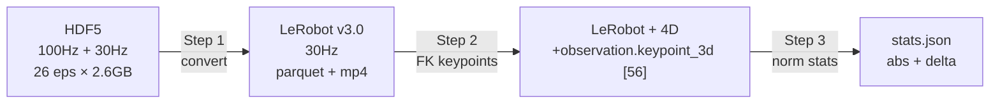
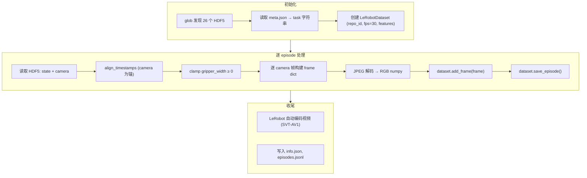
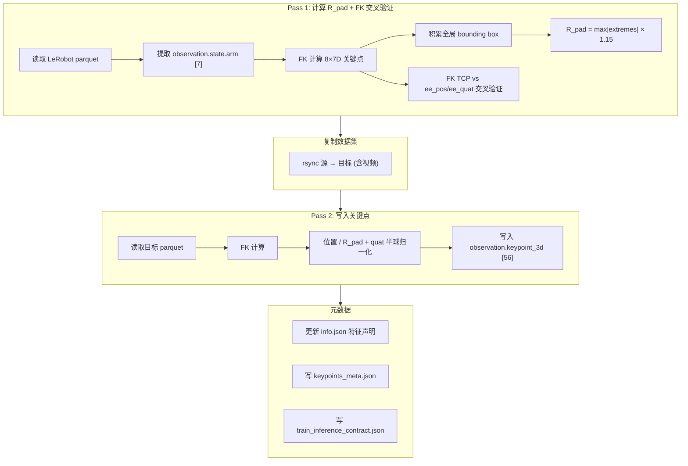
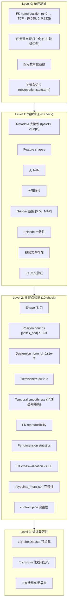

# "Put Cube Into Box" 数据集 3D/4D 关键点生成实施方案

> **源数据**: `/B/Dta/put_cube_into_box/put_cube_into_box_hdf5/` (26 episodes, 100Hz state + 30Hz camera)
> **目标**: 生成包含 `observation.keypoint_3d` [56] 的 LeRobot v3.0 数据集, 可直接用于 InternVLA-A1.5 GeoPredict 训练
> **代码输出目录**: `b/s/Frk3/`
> **Python 环境**: `/B/VENV/itnvla15rbt20/`
> **URDF**: `b/d/Frk2/fr3v2_1_franka_hand.urdf` (与插插座数据集共用, 同一台 Franka FR3 v2.1)
> **参考**: [dsanalyz2.markdown](dsanalyz2.markdown) (数据质量分析), [3d4d_gen_1.md](../../Frk2/3d4d_gen_1.md) (插插座 v2 方案), [dta_4dtrj_plan.md](../../Frk/dta_4dtrj_plan.md) (插插座 v1 方案)
> **版本**: v1 · 2026-09-24

---

## 目录

1. [背景与动机](#1-背景与动机)
2. [源数据结构与特性](#2-源数据结构与特性)
3. [与插插座管线的差异分析](#3-与插插座管线的差异分析)
4. [整体管线设计](#4-整体管线设计)
5. [Step 1: HDF5 → LeRobot 格式转换](#5-step-1-hdf5--lerobot-格式转换)
6. [Step 2: FK 关键点生成](#6-step-2-fk-关键点生成)
7. [Step 3: 归一化统计量](#7-step-3-归一化统计量)
8. [训推一致性设计](#8-训推一致性设计)
9. [配置体系](#9-配置体系)
10. [测试与验收](#10-测试与验收)
11. [已知风险与开放问题](#11-已知风险与开放问题)

---

## 1. 背景与动机

### 1.1 GeoPredict 对 3D 关键点的依赖

InternVLA-A1.5 的 GeoPredict 融合路径通过 FK (Forward Kinematics) 从关节角度计算机器人连杆上的 3D 关键点, 形成轨迹后经 TrackEncoder 编码, 与 VLM 前缀和动作专家做三路 MoT attention. 配置入口:

- `enable_keypoint_predictor=True` → 开启 GeoPredict
- `kpt_4d_mode="pos_rot"` → 7D 关键点 (3D 位置 + 4D 四元数)
- `kpt_4d_mode="pos_only"` → 3D 关键点 (仅位置)

数据集必须包含 `observation.keypoint_3d` [56] 列 (= 8 关键点 × 7 维) 才能启用.

### 1.2 已有管线的经验

| 批次 | 数据集 | 管线 | 文档 |
|:---|:---|:---|:---|
| v1 | `plug_into_socket_hdf5` (100eps, 100Hz→30Hz) | HDF5→LeRobot→4D | `b/d/Frk/dta_4dtrj_plan.md`, `b/d/Frk/dta_4dtrj_plan_0904LOG.md` |
| v2 | `plug_into_socket_franka3_15hz_lerobot` (100eps, 15Hz) | 已是 LeRobot→4D | `b/d/Frk2/3d4d_gen_1.md`, `b/d/Frk2/3d4d_gen_1_0918LOG.md` |
| **v3** | **`put_cube_into_box_hdf5` (26eps, 100Hz→30Hz)** | **HDF5→LeRobot→4D** | **本文档** |

v3 与 v1 的源格式相同 (Franka HDF5, 100Hz state + 30Hz camera), 但数据语义存在关键差异 (见 §3). 本方案基于 v1 转换 + v2 关键点生成的最佳实践, 同时针对 `put_cube_into_box` 数据集的特性做适配.

### 1.3 数据质量前置分析

[dsanalyz2.markdown](dsanalyz2.markdown) 对本数据集做了深入验证, 核心发现:

| 发现 | 影响 | 本方案对策 |
|:---|:---|:---|
| 夹爪恒等捷径**不存在** (R²=0.78, copy-R²=-2.77) | 夹爪通道健康, 模型必须从视觉学习 | 无需 state dropout |
| 臂关节伺服滞后 (q4: 740ms, q6: 440ms) | action 超出 state 包络, 部署 OOD 风险 | §5.7 讨论是否在转换阶段做 action 重标注 |
| `gripper_width` 有负值 (11.18%, min -1.4e-6) | 传感器零漂 | 转换时 clamp 到 [0, W_MAX] |
| 空间多样性低 (夹取位置 std < 5mm) | 对 R_pad 计算无影响, 但影响模型泛化 | 建议开启图像增广 |

---

## 2. 源数据结构与特性

### 2.1 文件布局

```
/B/Dta/put_cube_into_box/put_cube_into_box_hdf5/
├── meta.json
├── episode_000001.hdf5
├── episode_000007.hdf5
├── episode_000008.hdf5
├── ...                        # 非连续编号, 共 26 个
└── episode_000055.hdf5
```

Episode 编号: `[1, 7, 8, 11, 13, 15, 16, 17, 19, 20, 21, 24, 27, 29, 33, 34, 38, 43, 44, 45, 46, 47, 50, 51, 52, 55]` (26 个, meta.json 声称 56 个, 30 个已被过滤).

### 2.2 HDF5 结构

```
episode_XXXXXX.hdf5
├── camera_global/
│   ├── color_image_jpeg    (N_cam,)     object     # JPEG RGB, 480×640
│   ├── depth_image         (N_cam, 480, 640)  uint16
│   └── timestamps          (N_cam,)     float64
├── camera_wrist/           (同上)
└── robot_state/
    ├── timestamps          (N_state,)   float64    # 100 Hz
    ├── joint_positions     (N_state, 7)  float64   # 关节角 (rad)
    ├── joint_velocities    (N_state, 7)  float64
    ├── joint_torques       (N_state, 7)  float64   # ★ 插插座数据无此字段
    ├── joint_torques_external (N_state, 7) float64 # ★ 插插座数据无此字段
    ├── ee_pos              (N_state, 3)  float64   # EE 位置 (m)
    ├── ee_quat             (N_state, 4)  float64   # EE 四元数 [w,x,y,z]
    ├── ee_force            (N_state, 3)  float64   # ★ 插插座数据无此字段
    ├── ee_torque           (N_state, 3)  float64   # ★ 插插座数据无此字段
    ├── gripper_width       (N_state, 1)  float64   # 夹爪宽度 (m)
    ├── action_joints       (N_state, 7)  float64   # 关节动作指令
    └── action_gripper      (N_state, 1)  float64   # 夹爪动作指令
```

### 2.3 关键数值

| 指标 | 值 |
|:---|:---|
| Episodes | 26 |
| State 帧总数 | 54,984 |
| Camera 帧总数 | 16,545 (global), 16,545 (wrist) |
| 总时长 | 551.7 秒 ≈ 9.2 分钟 |
| 平均时长 | 21.2 秒 (范围 [15.8, 29.4]s) |
| State 频率 | 99.6 Hz (实测) |
| Camera 频率 | 30 Hz |
| 数据总大小 | 2,687 MB ≈ 2.6 GB |

### 2.4 夹爪语义

| 信号 | 张开 (Open) | 闭合 (Closed) | 数据范围 |
|:---|:---|:---|:---|
| `action_gripper` | ≈ 0 (0.003–0.010) | = 1.0 | [0.0, 1.0] |
| `gripper_width` | ≈ 0.079 m | ≈ 0 m (含微量负值) | [-1.4e-6, 0.0801] |

**极性**: `action_gripper=0` 张开, `=1` 闭合. 与 v1 插插座数据相同 (a = 1 - w/0.08, 所以 a=1 时闭合).

> **关键区别**: 插插座数据中 `action_gripper ≡ 1 - gripper_width/0.08` 是精确恒等 (float64 精度), `gripper_width` 是派生量. 本数据集中二者是**独立信号**, `action_gripper` 领先 `gripper_width` 约 700–900ms (见 [dsanalyz2 §2](dsanalyz2.markdown)). **这是数据质量优势.**

### 2.5 EE 四元数列序

HDF5 中 `ee_quat` 的存储顺序为 **[w, x, y, z]**. 验证方法: 机器人在 home 位置时, `ee_quat[0]` ≈ 0.9997 (接近恒等旋转 w=1), 与 wxyz 约定吻合.

> **注意**: v2 插插座 LeRobot 数据集的 `info.json` 声称 wxyz 但实际存储为 xyzw (见 `3d4d_gen_1_0918LOG.md` Error 3). 本数据集从 HDF5 直接读取, **确认为 wxyz**. 转换脚本中需在 FK 交叉验证时做 wxyz→xyzw 重排以匹配 Pinocchio 输出格式.

---

## 3. 与插插座管线的差异分析

### 3.1 结构差异

| 维度 | v1 插插座 HDF5 | 本数据集 (put_cube_into_box) | 影响 |
|:---|:---|:---|:---|
| Episode 数 | 100 | **26** | 处理时间短, 但统计量样本少 |
| Episode 编号 | 连续 000–099 | **非连续** (1,7,8,11,...,55) | 转换脚本需 glob 发现, 不能假设连续 |
| 额外字段 | 无 | `joint_torques`, `joint_torques_external`, `ee_force`, `ee_torque` | 可选纳入 LeRobot; FK 不需要 |
| 夹爪恒等 | $a \equiv 1 - w/0.08$ (致命) | **不成立** (R²=0.78) | 夹爪通道健康, 无需特殊处理 |
| EE quat 列序 | wxyz (HDF5 原始) | **wxyz** (同) | 转换逻辑相同 |
| 任务字符串 | "plug into socket" | **"put cube into box"** | meta.json 中读取 |

### 3.2 语义差异

| 维度 | v1 插插座 | 本数据集 | 影响 |
|:---|:---|:---|:---|
| 夹爪事件 | ~0 次/集 (采集时已抓住) | **2 次/集** (抓+放) | 任务更复杂, 夹爪时机是关键学习目标 |
| 伺服滞后关节 | q5/q7 | **q4/q6** | OOD 风险集中在不同关节 |
| 工作空间 | 紧凑 (6.9×19.3×33.9 cm) | **更大** (16.0×33.3×41.0 cm) | R_pad 可能不同 |
| `gripper_width` 性质 | 派生量 (100% bit-exact) | **真实传感器** (阶梯量化) | 有负值需 clamp |

### 3.3 管线方案选择

本数据集源格式为 HDF5 (100Hz state + 30Hz camera), 与 v1 插插座相同. 因此管线结构沿用 **v1 三步流程** (HDF5→LeRobot→4D→stats), 但关键点生成脚本采用 **v2 增强版** (含 FK 交叉验证 + `train_inference_contract.json`).



---

## 4. 整体管线设计

### 4.1 管线总览

| Step | 脚本 | 输入 | 输出 | 耗时估算 |
|:---|:---|:---|:---|:---|
| 1 | `b/s/Frk3/convert_cube_into_box_hdf5.py` | `/B/Dta/put_cube_into_box/put_cube_into_box_hdf5/` | `~/b/Dta/put_cube_into_box_lrb/` | ~15 min (JPEG 解码 + AV1 编码) |
| 验证 | `b/s/Frk3/verify_cube_conversion.py` | 上述输出 | 8 项检查报告 | ~30s |
| 2 | `b/s/Frk3/generate_cube_keypoints.py` | 上述输出 | `~/b/Dta/put_cube_into_box_lrb_4D/` | ~1 min |
| 验证 | `b/s/Frk3/verify_cube_keypoints.py` | 上述输出 | 10 项检查报告 | ~30s |
| 3 | `util_scripts/compute_norm_stats_single.py` | 上述输出 | `stats/abs/...json`, `stats/delta/...json` | ~10s |

### 4.2 目录结构

```
b/s/Frk3/                                      # 代码
├── convert_cube_into_box_hdf5.py               # Step 1: HDF5 → LeRobot
├── generate_cube_keypoints.py                  # Step 2: FK 关键点生成
├── verify_cube_conversion.py                   # Step 1 验证
├── verify_cube_keypoints.py                    # Step 2 验证
└── cfg/
    └── franka_cube.yaml                        # LeRobot schema 配置

b/d/Frk3/ds/cubinbx/                           # 文档
├── dsanalyz2.markdown                          # 数据分析 (已有)
└── 3d4d_gen_1.markdown                         # 本文档

~/b/Dta/                                        # 输出数据 (不入 git)
├── put_cube_into_box_lrb/                      # Step 1 输出
├── put_cube_into_box_lrb_4D/                   # Step 2 输出 (最终)
└── ...
```

### 4.3 代码复用策略

| 组件 | 来源 | 改动 |
|:---|:---|:---|
| `FrankaFKExtractor7D` | v2 `generate_franka2_keypoints.py` 内联 | 无改动 (同一 URDF, 同一 Pinocchio) |
| FK 交叉验证 | v2 `_cross_validate_fk()` | 调整 quat 列序处理 (HDF5 原始为 wxyz, v2 LeRobot 为 xyzw) |
| HDF5→LeRobot 转换 | v1 `convert_franka_plug_hdf5.py` | 适配任务字符串、非连续编号、额外字段 (force/torque)、gripper_width clamp |
| R_pad + Pass1/Pass2 | v2 `generate_franka2_keypoints.py` | 输入列名适配 (separate columns vs unified) |
| 10-check 验证 | v2 `verify_franka2_keypoints.py` | 无改动 |
| `train_inference_contract.json` | v2 模板 | 更新 dataset_fps、URDF hash |

---

## 5. Step 1: HDF5 → LeRobot 格式转换

### 5.1 脚本: `b/s/Frk3/convert_cube_into_box_hdf5.py`

基于 v1 `convert_franka_plug_hdf5.py`, 核心改动:

#### 5.1.1 非连续 Episode 编号处理

```python
# v1: 假设 episode_000000.hdf5 ~ episode_000099.hdf5 连续
# v3: glob 发现, 按文件名排序
hdf5_files = sorted(Path(source).glob("episode_*.hdf5"))
# → [episode_000001.hdf5, episode_000007.hdf5, ..., episode_000055.hdf5]
```

LeRobot 内部 episode index 从 0 开始连续编号. HDF5 文件名中的编号仅用于排序, 不保留到 LeRobot.

#### 5.1.2 Feature 布局

采用与 v1 **相同的分离式列名** (而非 v2 的统一 15D 列), 保持与现有训练管线的兼容性:

| LeRobot 列名 | 来源 HDF5 字段 | 维度 | dtype |
|:---|:---|:---|:---|
| `observation.state.arm` | `robot_state/joint_positions` | [7] | float32 |
| `observation.state.gripper` | `robot_state/gripper_width` | [1] | float32 |
| `observation.state.ee_pos` | `robot_state/ee_pos` | [3] | float32 |
| `observation.state.ee_quat` | `robot_state/ee_quat` | [4] | float32 |
| `action.arm` | `robot_state/action_joints` | [7] | float32 |
| `action.gripper` | `robot_state/action_gripper` | [1] | float32 |
| `observation.images.global` | `camera_global/color_image_jpeg` | video | — |
| `observation.images.wrist` | `camera_wrist/color_image_jpeg` | video | — |

> **可选纳入** (取决于是否需要力感知):
> - `observation.wrench` ← `[ee_force(3), ee_torque(3)]` 拼接为 [6]
> - `observation.force` ← `[joint_torques(7), joint_torques_external(7), ee_force(3), ee_torque(3)]` 拼接为 [20] 或分别存储

初期不纳入力/力矩字段, 仅保留核心的关节+夹爪+EE+视觉. 如需力信号, 可后续扩展.

#### 5.1.3 频率对齐

与 v1 相同: 以 **30Hz camera 帧** 为锚点, 对每个 camera 时间戳找最近的 state 时间戳:

```python
def align_timestamps(state_ts, camera_ts):
    """返回每个 camera 帧对应的最近 state 帧索引."""
    indices = np.searchsorted(state_ts, camera_ts)
    indices = np.clip(indices, 1, len(state_ts) - 1)
    left_dist = np.abs(camera_ts - state_ts[indices - 1])
    right_dist = np.abs(camera_ts - state_ts[indices])
    return np.where(left_dist < right_dist, indices - 1, indices)
```

100Hz state vs 30Hz camera: 最大对齐误差约 5ms (半个 100Hz 周期), 远低于 33ms (一个 30Hz 周期).

#### 5.1.4 `gripper_width` 负值 Clamp

```python
W_MAX = 0.0808  # 从数据中观测的最大宽度 (dsanalyz2 §7.3)
gripper_width = np.clip(gripper_width, 0.0, W_MAX)
```

影响 11.18% 的帧 (最大幅度 -1.4e-6 m, 可忽略), 但消除了下游归一化时的负值异常.

#### 5.1.5 任务字符串

从 `meta.json` 读取 `task` 字段 (值为 `"put cube into box"`), 传递给 LeRobot dataset.

### 5.2 Schema 配置: `b/s/Frk3/cfg/franka_cube.yaml`

```yaml
# Franka "put cube into box" 数据集 schema
robot_type: franka_cube
fps: 30
features:
  observation.state.arm:
    shape: [7]
    dtype: float32
    names: [joint1, joint2, joint3, joint4, joint5, joint6, joint7]
  observation.state.gripper:
    shape: [1]
    dtype: float32
    names: [gripper_width]
  observation.state.ee_pos:
    shape: [3]
    dtype: float32
    names: [ee_x, ee_y, ee_z]
  observation.state.ee_quat:
    shape: [4]
    dtype: float32
    names: [ee_quat_w, ee_quat_x, ee_quat_y, ee_quat_z]
  action.arm:
    shape: [7]
    dtype: float32
    names: [joint1, joint2, joint3, joint4, joint5, joint6, joint7]
  action.gripper:
    shape: [1]
    dtype: float32
    names: [gripper_action]
  observation.images.global:
    shape: [480, 640, 3]
    dtype: video
    names: [height, width, channel]
  observation.images.wrist:
    shape: [480, 640, 3]
    dtype: video
    names: [height, width, channel]
```

Schema 注册:

```bash
ln -sf /B/SRC/itvlaGpLibPlus/b/s/Frk3/cfg/franka_cube.yaml \
       /B/SRC/itvlaGpLibPlus/src/lerobot/dataset_schemas/configs/franka_cube.yaml
```

### 5.3 转换流程



### 5.4 关键帧数估算

| 维度 | 值 |
|:---|:---|
| 输入帧总数 (camera) | 16,545 |
| 输出帧总数 (LeRobot, 30Hz) | ≈ 16,545 |
| 输出 episodes | 26 (连续编号 0–25) |
| 预计输出大小 | ~110 MB (parquet + MP4, 参考 v1 压缩比 ~44x) |

### 5.5 Action 构造

直接使用 HDF5 中的 `action_joints` 和 `action_gripper` 作为 `action.arm` 和 `action.gripper`, **不做任何变换**:

```python
frame["action.arm"] = action_joints[state_idx].astype(np.float32)
frame["action.gripper"] = action_gripper[state_idx].astype(np.float32)
```

action 的语义是**绝对关节位置命令** (abs mode), 与 v1 插插座数据集相同.

### 5.6 EE 四元数处理

HDF5 中 `ee_quat` 存储顺序为 **[w, x, y, z]** (在 home 位置第 0 分量 ≈ 0.9997 ≈ 1.0, 符合 wxyz 约定). 直接写入 LeRobot:

```python
frame["observation.state.ee_quat"] = ee_quat[state_idx].astype(np.float32)
# [w, x, y, z] 顺序, 与 schema names 一致
```

### 5.7 关于 Action 重标注的讨论

[dsanalyz2 §3](dsanalyz2.markdown) 建议对臂关节做"未来状态重标注" ($\text{action}_t := \text{state}_{t+1}$) 以消除伺服滞后. **本方案 Step 1 不做 action 重标注**, 原因:

1. **可逆性**: 重标注是不可逆操作 (丢失原始 action 信息). 先保留原始数据, 可在训练阶段通过 `DeltaActionTransformFn` 或自定义 transform 实现等效效果.
2. **训推对称**: 如果重标注 action 为未来状态, 推理时的 action 定义也必须改变 — 预测的不再是控制器指令, 而是期望的下一状态. 这需要推理端配合修改, 复杂度高.
3. **现有实验**: v1 插插座数据集在有同等程度伺服滞后的情况下仍完成了真机实验 (虽然 q7 有漂移), 说明模型有一定的鲁棒性.

如需尝试, 可在 Step 1 额外输出一个 `_relabeled` 版本, 但默认管线保留原始 action.

---

## 6. Step 2: FK 关键点生成

### 6.1 脚本: `b/s/Frk3/generate_cube_keypoints.py`

基于 v2 `generate_franka2_keypoints.py`, 核心改动:

#### 6.1.1 输入列名适配

v2 脚本读取统一的 `observation.state` [15D] 列; 本数据集使用分离式列名:

```python
# v2:
STATE_COLUMN = "observation.state"
ARM_SLICE = slice(0, 7)
EE_POS_SLICE = slice(8, 11)
EE_QUAT_SLICE = slice(11, 15)

# v3 (本脚本):
ARM_COLUMN = "observation.state.arm"          # [7]
EE_POS_COLUMN = "observation.state.ee_pos"    # [3]
EE_QUAT_COLUMN = "observation.state.ee_quat"  # [4], wxyz 顺序
```

#### 6.1.2 EE 四元数列序处理

本数据集的 `ee_quat` 为 wxyz, Pinocchio 输出为 xyzw. FK 交叉验证时需做重排:

```python
def _cross_validate_fk(extractor, arm, ee_pos, ee_quat_wxyz):
    kpts = extractor.compute_batch(arm)
    fk_tcp_pos = kpts[:, 7, :3]
    fk_tcp_quat_xyzw = kpts[:, 7, 3:7]

    pos_err = np.linalg.norm(fk_tcp_pos - ee_pos, axis=1)

    # wxyz → xyzw 重排
    ds_quat_xyzw = np.concatenate(
        [ee_quat_wxyz[:, 1:4], ee_quat_wxyz[:, 0:1]], axis=1
    )

    dots = np.abs(np.sum(fk_tcp_quat_xyzw * ds_quat_xyzw, axis=1))
    dots = np.clip(dots, 0, 1)
    rot_err_rad = 2 * np.arccos(dots)

    return {
        "pos_err_mean_mm": float(pos_err.mean() * 1000),
        "pos_err_max_mm": float(pos_err.max() * 1000),
        "rot_err_mean_deg": float(np.degrees(rot_err_rad.mean())),
        "rot_err_max_deg": float(np.degrees(rot_err_rad.max())),
    }
```

> **与 v2 的关键差异**: v2 脚本因为实际数据已是 xyzw 所以**去除**了重排 (见 `3d4d_gen_1_0918LOG.md` Error 3). 本脚本因为原始 HDF5 是 wxyz, **必须做重排**. 如果不做, FK 交叉验证旋转误差将达 ~175°.

#### 6.1.3 其余逻辑不变

- `FrankaFKExtractor7D` 类: 同一 URDF (`fr3v2_1_franka_hand.urdf`), 同一 Pinocchio 版本, 8 个关键点 (link1–link7 + hand_tcp), 7D 输出 (px,py,pz,qx,qy,qz,qw)
- R_pad: 两遍扫描, margin=0.15, 各向同性归一化
- 四元数半球归一化: $q_w < 0$ 时取反
- `keypoints_meta.json` + `train_inference_contract.json`: 与 v2 格式相同

### 6.2 关键点定义

与 v1/v2 完全一致, 8 个关键点:

```mermaid
graph LR
    base["base<br/>(固定)"] --> L0["link0"] --> L1["link1<br/>KP0"] --> L2["link2<br/>KP1"]
    L2 --> L3["link3<br/>KP2"] --> L4["link4<br/>KP3"] --> L5["link5<br/>KP4"]
    L5 --> L6["link6<br/>KP5"] --> L7["link7<br/>KP6"] --> L8["link8"] --> hand["hand"]
    hand --> tcp["hand_tcp<br/>KP7"]

    style L1 fill:#4C72B0,color:white
    style L2 fill:#4C72B0,color:white
    style L3 fill:#4C72B0,color:white
    style L4 fill:#4C72B0,color:white
    style L5 fill:#4C72B0,color:white
    style L6 fill:#4C72B0,color:white
    style L7 fill:#4C72B0,color:white
    style tcp fill:#C44E52,color:white
```



每个关键点 7 维: $[p_x, p_y, p_z, q_x, q_y, q_z, q_w]$

位置除以 $R_{\text{pad}}$ 归一化到 $[-1, 1]$; 四元数半球归一化 ($q_w \geq 0$).

总输出维度: $8 \times 7 = 56$, 写入 `observation.keypoint_3d`.

### 6.3 R_pad 预估

v1/v2 插插座数据集的 R_pad = 0.836 m. 本数据集的工作空间更大 (EE 跨度 16.0×33.3×41.0 cm vs 6.9×19.3×33.9 cm), 预计 R_pad 可能略大. 但由于两个任务在同一台机器人上执行, 基座坐标系相同, R_pad 主要由最远关键点 (link1 在基座高度 0.333m, hand_tcp 可能到 ~0.9m) 决定, 不会有数量级差异.

准确值将由 Pass 1 计算得出.

### 6.4 生成流程



---

## 7. Step 3: 归一化统计量

使用现有的 `util_scripts/compute_norm_stats_single.py` 计算 abs 和 delta 两种模式的归一化统计量:

```bash
HF_HOME=/B/VENV/hf_home HF_LEROBOT_HOME=~/b/Dta \
    python util_scripts/compute_norm_stats_single.py \
    --repo_id put_cube_into_box_lrb_4D \
    --action_mode abs --chunk_size 50

HF_HOME=/B/VENV/hf_home HF_LEROBOT_HOME=~/b/Dta \
    python util_scripts/compute_norm_stats_single.py \
    --repo_id put_cube_into_box_lrb_4D \
    --action_mode delta --chunk_size 50
```

输出到 `~/b/Dta/stats/{abs,delta}/put_cube_into_box_lrb_4D/stats.json`. 包含每个 feature 列的 mean、std、min、max (各 56 维对于 keypoint_3d).

---

## 8. 训推一致性设计

沿用 v2 方案 (`b/d/Frk2/3d4d_gen_1.md` §3) 的训推对齐约束, 完整列表:

### 8.1 对齐约束表

| 编号 | 约束 | 训练侧 | 推理侧 | 验证方式 |
|:---|:---|:---|:---|:---|
| C1 | FK 库 + URDF 相同 | Pinocchio + `fr3v2_1_franka_hand.urdf` | 同 | 单元测试 |
| C2 | 关键点 link 集合相同 | `link1..link7 + hand_tcp` | 同 | 配置文件固化 |
| C3 | 四元数半球归一化 | $q_w \geq 0$, 否则取反 | 同 | Check 4 |
| C4 | R_pad 值相同 | 写入 `keypoints_meta.json` | 读取同一文件 | 配置验证 |
| C5 | 关节角来源一致 | `observation.state.arm` [7] | 真机 `robot.state.q[0:7]` | FK 交叉验证 |
| C6 | `his_len` = 严格早于当前帧的帧数 | `min(frame_index, H)` | 每**控制步**推进一格 | 集成测试 |
| C7 | `kpt_t` 是当前帧 (不在历史中) | `stacked[H]` | 当前观测的 FK | 集成测试 |
| C8 | 历史填充: 有效帧在前, 零填充在后 | `his_kpts[:his_len] = valid` | 同 | 单元测试 |
| C9 | 位置归一化: 除以 R_pad | `kpts[:,:,:3] /= r_pad` | 同 | 单元测试 |
| C10 | 数据帧率一致 | 30 Hz (camera 锚定) | 推理控制频率 30Hz 或等效积累 | 频率匹配 |

### 8.2 推理侧 FK 计算器

直接复用 v2 的 `FKKeypointComputerV2` (`b/s/Frk2/fk_keypoints_v2.py`), 仅需更新 `meta_path` 指向本数据集的 `keypoints_meta.json` (R_pad 可能不同).

```python
from b.s.Frk2.fk_keypoints_v2 import FKKeypointComputerV2

fk_computer = FKKeypointComputerV2(
    urdf_path="b/d/Frk2/fr3v2_1_franka_hand.urdf",
    meta_path="~/b/Dta/put_cube_into_box_lrb_4D/meta/keypoints_meta.json",
)
```

### 8.3 `his_len` 语义: 30Hz vs 15Hz

v2 数据集为 15Hz, H=200 → 覆盖 13.3 秒. 本数据集为 30Hz, H=200 → 覆盖 **6.67 秒**. 平均 episode 时长 21.2 秒, 所以 `his_len` 在第 200/637 帧 ≈ 31% 位置饱和.

如需更长历史, 可将 H 增至 400 (覆盖 13.3 秒) 或 600 (覆盖 20 秒), 但会增加 TrackEncoder 计算量. 建议先用 H=200 实验.

### 8.4 夹爪推理适配

本数据集的夹爪极性:

| 信号 | 值 = 0 | 值 = 1 |
|:---|:---|:---|
| `action_gripper` | **张开** | **闭合** |

推理侧配置:

```python
GRIPPER_CLOSE_IF_ABOVE = True   # 值高于阈值 = 闭合
GRIPPER_CLOSE_THRESHOLD = 0.5
```

> **与 v2 插插座 LeRobot 数据集相反**: v2 `action[7]=1.0` 表示全开, 本数据集 `action.gripper=1.0` 表示闭合. 推理代码必须根据数据集切换极性.

### 8.5 `train_inference_contract.json`

```json
{
  "version": "3.0",
  "dataset_name": "put_cube_into_box_lrb_4D",
  "dataset_fps": 30,
  "source_format": "franka_hdf5",
  "urdf_sha256": "<与 v2 相同, 同一 URDF>",
  "pinocchio_version": "4.1.0",
  "keypoint_links": [
    "fr3v2_1_link1", "fr3v2_1_link2", "fr3v2_1_link3", "fr3v2_1_link4",
    "fr3v2_1_link5", "fr3v2_1_link6", "fr3v2_1_link7", "fr3v2_1_hand_tcp"
  ],
  "keypoint_dim": 7,
  "keypoint_dim_layout": "px,py,pz,qx,qy,qz,qw",
  "r_pad": "<Pass 1 计算>",
  "hemisphere_convention": "qw >= 0",
  "position_normalization": "divide_by_r_pad",
  "arm_joint_source": "observation.state.arm",
  "his_len_semantics": "count of frames strictly before current frame",
  "kpt_t_semantics": "current frame FK, not included in history",

  "gripper_convention": {
    "action_column": "action.gripper",
    "close_value": 1.0,
    "open_value": 0.0,
    "close_if_above": true,
    "close_threshold": 0.5
  },

  "ee_quat_convention": {
    "source": "HDF5 robot_state/ee_quat",
    "order": "wxyz",
    "note": "raw HDF5 stores wxyz; FK cross-validation converts to xyzw for comparison"
  },

  "inference_constraints": {
    "fk_must_use_same_urdf": true,
    "fk_must_use_same_library": "pinocchio",
    "his_len_increment_per_control_step": 1,
    "kpt_t_is_current_frame": true,
    "history_fill_convention": "valid_front_zero_back",
    "control_step_fk_required": true
  },

  "data_quality_notes": {
    "gripper_identity_shortcut": "NOT_PRESENT (R²=0.78, copy-R²=-2.77)",
    "arm_servo_lag": "q4: 740ms, q6: 440ms — OOD risk at deployment",
    "gripper_width_negative_values": "11.18% clamped to 0 during conversion"
  },

  "fk_cross_validation": {
    "tcp_vs_dataset_ee_pos_err_mean_mm": "<计算>",
    "tcp_vs_dataset_ee_pos_err_max_mm": "<计算>",
    "tcp_vs_dataset_ee_rot_err_mean_deg": "<计算>",
    "tcp_vs_dataset_ee_rot_err_max_deg": "<计算>"
  }
}
```

---

## 9. 配置体系

### 9.1 训练配置

```yaml
dataset:
  type: internvla_a1_5
  repo_id: put_cube_into_box_lrb_4D
  root: ~/b/Dta/put_cube_into_box_lrb_4D
  action_mode: abs
  enable_keypoint_predictor: true
  num_keypoint_joints: 8
  kpt_4d_mode: pos_rot
  keypoint_history_max_len: 200

policy:
  type: internvla_a1_5
  enable_keypoint_predictor: true
  num_keypoint_joints: 8
  kpt_4d_mode: pos_rot
  keypoint_history_max_len: 200
  tokenize_state: true
  # 夹爪通道无恒等捷径, 不需要 state dropout
  # knowledge_insulation 可以保持默认
```

### 9.2 推理配置

```yaml
inference:
  urdf_path: b/d/Frk2/fr3v2_1_franka_hand.urdf
  kpt_meta_path: ~/b/Dta/put_cube_into_box_lrb_4D/meta/keypoints_meta.json
  n_exec: 10
  control_hz: 30
  fk_per_control_step: true
  gripper_close_if_above: true
  gripper_close_threshold: 0.5
```

### 9.3 环境变量

```bash
export HF_HOME=/B/VENV/hf_home
export HF_LEROBOT_HOME=~/b/Dta
```

---

## 10. 测试与验收

### 10.1 测试层次



### 10.2 验收标准

| 层级 | 标准 | 通过条件 |
|:---|:---|:---|
| L0 | FK 单元测试 | `test_franka_cube_keypoints.py` 全绿 |
| L1 | 转换 8 check | `verify_cube_conversion.py` 全 PASS |
| L1 | FK 交叉验证 | 位置误差 < 2mm, 旋转误差 < 1° |
| L2 | 关键点 10 check | `verify_cube_keypoints.py` 全 PASS |
| L2 | 四元数跳变 | 半球感知距离 max < 0.5 |
| L3 | 数据集可加载 | `LeRobotDataset(repo_id)` 成功, `observation.keypoint_3d` [56] 存在 |
| L3 | 训练 100 步 | `lerobot_train.py` 无异常退出 |

### 10.3 FK 交叉验证预期

基于 v1/v2 经验 (同一 URDF, 同一 Franka):

| 指标 | v1 结果 | v2 结果 | 预期 |
|:---|:---|:---|:---|
| Position error max | 0.000 mm | 0.000 mm | < 0.01 mm |
| Rotation error max | — | 0.056° | < 0.1° |

如果误差显著偏大 (> 2mm), 说明 URDF 与采集时的机器人标定不一致, 需要从 Franka Desk 导出标定后的 DH 参数.

### 10.4 测试脚本

#### `b/s/Frk3/verify_cube_conversion.py` (转换验证)

```python
"""8-check verification for HDF5 → LeRobot conversion.

Checks:
  1. Metadata integrity (robot_type=franka_cube, fps=30, 26 eps)
  2. Feature shapes (arm=[7], gripper=[1], action.arm=[7], ...)
  3. No NaN values
  4. Joint limits within URDF bounds
  5. Gripper range [0, 0.0808]
  6. Episode count consistency
  7. Video files exist
  8. FK cross-check (EE pos from state vs FK)
"""
```

#### `b/s/Frk3/verify_cube_keypoints.py` (关键点验证)

```python
"""10-check verification for FK keypoint generation.

Checks 1-7: identical to v2 verify_franka2_keypoints.py
Check 5: uses hemisphere-aware distance min(‖q1-q2‖, ‖q1+q2‖)
Check 8: FK cross-validation vs dataset EE pose (wxyz → xyzw reorder)
Check 9: keypoints_meta.json completeness
Check 10: train_inference_contract.json completeness
"""
```

---

## 11. 已知风险与开放问题

### 11.1 臂关节伺服滞后 → FK 关键点偏差

FK 关键点从 `observation.state.arm` (实际关节角度) 计算, 不受伺服滞后影响 (滞后存在于 action 与 state 之间, 不在 state 本身). 因此 FK 关键点始终反映**真实的机器人几何状态**, 不会像 action 那样超出训练分布.

**但**: 推理时如果 action 预测值导致机器人进入 OOD 状态, 该状态的 FK 关键点也会是 OOD 的 — 形成自我强化闭环 (见 v1 真机调试 `grperr_1.markdown` 中 q7 越界的案例). 这不是关键点生成的问题, 而是 action 本身的问题.

### 11.2 R_pad 是否与插插座共用

两个任务在同一台 Franka 上执行, 工作空间可能部分重叠. 如果计划**混合训练**两个数据集, 需要确保使用**相同的 R_pad** (取两个数据集的 max):

```python
r_pad_shared = max(r_pad_plug, r_pad_cube)
```

否则同一关节角度在两个数据集中归一化后的位置值不同, TrackEncoder 看到的是不一致的几何空间.

**建议**: 先各自独立计算 R_pad, 如需混合训练再统一.

### 11.3 30Hz vs 15Hz 的 `keypoint_history_max_len`

| 参数 | 30Hz (本数据集) | 15Hz (v2 插插座) | 说明 |
|:---|:---|:---|:---|
| H=200 覆盖 | 6.67 秒 | 13.33 秒 | 本数据集覆盖时间短一半 |
| 饱和位置 | 31% (episode 均长 21.2s) | 60% | 本数据集大部分 episode 还在增长 |
| H=400 覆盖 | 13.33 秒 | — | 与 v2 的 H=200 等效 |
| H=637 覆盖 | 21.2 秒 (均长) | — | 恰好覆盖平均 episode |

如果混合训练两个数据集且希望历史覆盖时间一致, 应在 30Hz 数据集上用 H=400.

### 11.4 力/力矩数据的潜在价值

本数据集包含 `ee_force` [3], `ee_torque` [3], `joint_torques` [7], `joint_torques_external` [7], 共 20 维力感知数据. 对于抓取任务, 接触力是判断夹取成功的关键信号. 当前管线不纳入力数据, 但预留了扩展接口:

- 如需纳入, 在 Step 1 转换时添加 `observation.wrench` [6] 列 (ee_force + ee_torque)
- 在 schema 中注册该列
- 模型侧需要对应的 state 编码器扩展

### 11.5 深度图的潜在价值

HDF5 中包含 `depth_image` (uint16, 480×640), 当前管线不使用. 如需 3D 点云或深度条件化, 可在 Step 1 纳入 `observation.images.global_depth` 列.

---

## 附录 A: 执行命令速查

```bash
# 0. 激活环境
source /B/VENV/itnvla15rbt20/bin/activate
export HF_HOME=/B/VENV/hf_home
export HF_LEROBOT_HOME=~/b/Dta

# 1. HDF5 → LeRobot 转换
python b/s/Frk3/convert_cube_into_box_hdf5.py \
    --source /B/Dta/put_cube_into_box/put_cube_into_box_hdf5 \
    --dest ~/b/Dta/put_cube_into_box_lrb \
    --robot-type franka_cube \
    --fps 30 \
    --force

# 1v. 转换验证
python b/s/Frk3/verify_cube_conversion.py \
    --dataset ~/b/Dta/put_cube_into_box_lrb \
    --urdf b/d/Frk2/fr3v2_1_franka_hand.urdf

# 2. FK 关键点生成
python b/s/Frk3/generate_cube_keypoints.py \
    --source ~/b/Dta/put_cube_into_box_lrb \
    --dest ~/b/Dta/put_cube_into_box_lrb_4D \
    --urdf b/d/Frk2/fr3v2_1_franka_hand.urdf \
    --link-prefix fr3v2_1 \
    --force

# 2v. 关键点验证
python b/s/Frk3/verify_cube_keypoints.py \
    --dataset ~/b/Dta/put_cube_into_box_lrb_4D \
    --urdf b/d/Frk2/fr3v2_1_franka_hand.urdf

# 3. 归一化统计量
python util_scripts/compute_norm_stats_single.py \
    --repo_id put_cube_into_box_lrb_4D \
    --action_mode abs --chunk_size 50

python util_scripts/compute_norm_stats_single.py \
    --repo_id put_cube_into_box_lrb_4D \
    --action_mode delta --chunk_size 50
```

## 附录 B: 文件清单

### 新增文件 (代码)

| 路径 | 用途 |
|:---|:---|
| `b/s/Frk3/convert_cube_into_box_hdf5.py` | HDF5 → LeRobot 格式转换 |
| `b/s/Frk3/generate_cube_keypoints.py` | FK 关键点离线生成 |
| `b/s/Frk3/verify_cube_conversion.py` | 转换验证 (8 check) |
| `b/s/Frk3/verify_cube_keypoints.py` | 关键点验证 (10 check) |
| `b/s/Frk3/cfg/franka_cube.yaml` | LeRobot schema |

### 新增文件 (数据, 不入 git)

| 路径 | 用途 |
|:---|:---|
| `~/b/Dta/put_cube_into_box_lrb/` | Step 1 中间输出 |
| `~/b/Dta/put_cube_into_box_lrb_4D/` | Step 2 最终输出 |
| `~/b/Dta/put_cube_into_box_lrb_4D/meta/keypoints_meta.json` | R_pad + FK 验证 |
| `~/b/Dta/put_cube_into_box_lrb_4D/meta/train_inference_contract.json` | 训推一致性契约 |
| `~/b/Dta/stats/{abs,delta}/put_cube_into_box_lrb_4D/stats.json` | 归一化统计量 |

### 复用文件

| 路径 | 用途 |
|:---|:---|
| `b/d/Frk2/fr3v2_1_franka_hand.urdf` | Franka URDF (同一台机器人) |
| `b/s/Frk2/fk_keypoints_v2.py` | 推理侧 FK 计算器 (直接复用) |
| `util_scripts/compute_norm_stats_single.py` | 归一化统计量计算 (直接复用) |

### 文档

| 路径 | 用途 |
|:---|:---|
| `b/d/Frk3/ds/cubinbx/3d4d_gen_1.markdown` | 本文档 |
| `b/d/Frk3/ds/cubinbx/dsanalyz2.markdown` | 数据质量分析 (已有) |

## 附录 C: 参考资料

- v1 管线代码: `b/s/Frk/convert_franka_plug_hdf5.py`, `b/s/Frk/generate_franka_keypoints.py`
- v2 管线代码: `b/s/Frk2/generate_franka2_keypoints.py`, `b/s/Frk2/fk_keypoints_v2.py`
- v1 方案文档: `b/d/Frk/dta_4dtrj_plan.md` + `dta_4dtrj_plan_0904LOG.md`
- v2 方案文档: `b/d/Frk2/3d4d_gen_1.md` + `3d4d_gen_1_0918LOG.md`
- 真机调试记录: `b/d/Frk2/realwrld_debug/grperr_1.markdown` (his_len bug, 夹爪退化)
- 数据分析: `b/d/Frk3/ds/cubinbx/dsanalyz2.markdown`
- InternVLA-A1.5 训练入口: `src/lerobot/scripts/lerobot_train.py`
- GeoPredict 配置: `src/lerobot/policies/internvla_a1_5/configuration_internvla_a1_5.py` (`enable_keypoint_predictor`, `kpt_4d_mode`, `keypoint_history_max_len`)
- Transform 管线: `src/lerobot/policies/internvla_a1_5/transform_internvla_a1_5.py` (L660-737, `Extract3DKeypointTransformFn`)
- Pinocchio 文档: https://gepettoweb.laas.fr/doc/stack-of-tasks/pinocchio/master/doxygen-html/
- Franka URDF 源: https://github.com/frankaemika/franka_description
