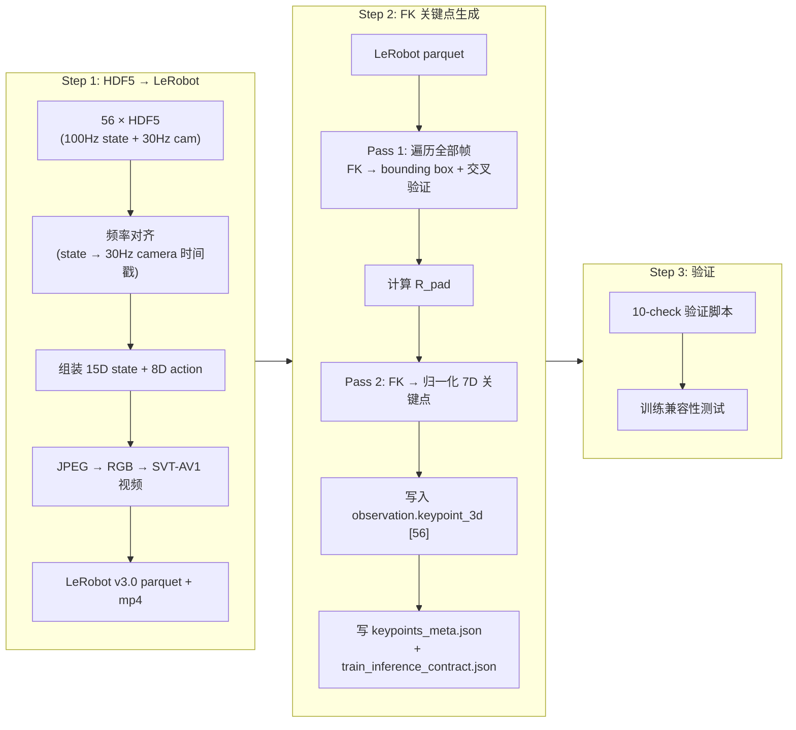
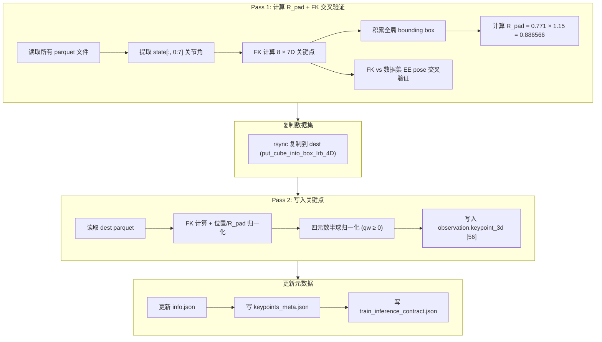
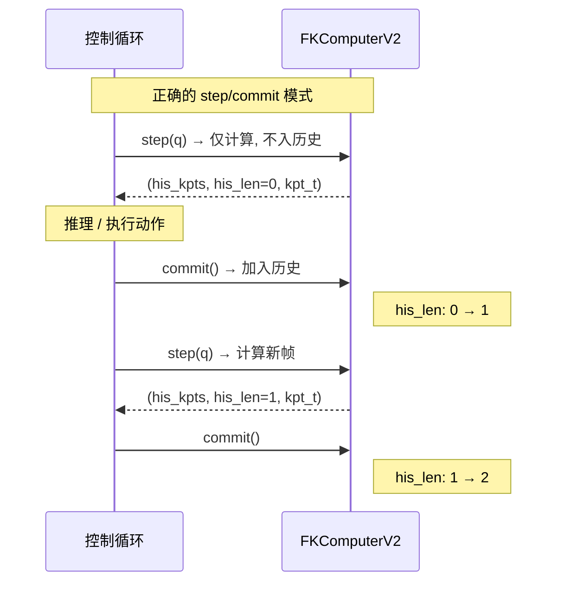
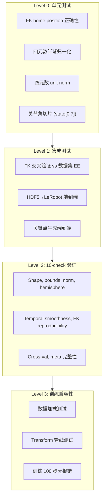

# "Put Cube Into Box" 数据集 3D/4D 关键点生成实施方案 (V2)

> **源数据**: `/B/Dta/put_cube_into_box/put_cube_into_box_hdf5/` (56 episodes, 122,880 state 帧 @ 100Hz, ~36,970 camera 帧 @ 30Hz)
> **目标**: 生成包含 `observation.keypoint_3d` [56] 的 LeRobot v3.0 数据集, 可直接用于 InternVLA-A1.5 GeoPredict 训练
> **代码输出目录**: `b/s/Frk3/`
> **Python 环境**: `/B/VENV/itnvla15rbt20/` (pinocchio 4.1.0, pandas 3.0.5, numpy 2.2.6)
> **URDF**: `b/d/Frk2/fr3v2_1_franka_hand.urdf` (同一台 Franka FR3 v2.1, 与插插座任务共用)
> **版本**: v2 · 2026-09-24
> **依据**: 数据分析 [dsanalyz3.markdown](dsanalyz3.markdown) · 插插座 v2 方案 [3d4d_gen_1.md](../../Frk2/3d4d_gen_1.md) · 插插座执行日志 [3d4d_gen_1_0918LOG.md](../../Frk2/3d4d_gen_1_0918LOG.md) · HDF5→LeRobot v1 执行日志 [dta_4dtrj_plan_0904LOG.md](../../Frk/dta_4dtrj_plan_0904LOG.md) · 真机调试总结 [sumry0919.markdown](../../Frk2/realwrld_debug/sumry0919.markdown) · 代码库 `src/lerobot/` 和 `b/s/Frk*/`

---

## 目录

1. [背景与动机](#1-背景与动机)
2. [源数据结构与特性](#2-源数据结构与特性)
3. [与插插座管线的关键差异](#3-与插插座管线的关键差异)
4. [整体管线设计](#4-整体管线设计)
5. [Step 1: HDF5 → LeRobot 格式转换](#5-step-1-hdf5--lerobot-格式转换)
6. [Step 2: FK 关键点生成](#6-step-2-fk-关键点生成)
7. [训推一致性设计 (核心)](#7-训推一致性设计-核心)
8. [配置体系](#8-配置体系)
9. [测试与验收](#9-测试与验收)
10. [执行命令速查](#10-执行命令速查)
11. [已知风险与开放问题](#11-已知风险与开放问题)

---

## 1. 背景与动机

### 1.1 为什么需要 3D 关键点

InternVLA-A1.5 的 GeoPredict 融合路径通过 3D 关键点轨迹为 action expert 提供显式的几何先验. 关键点由 FK (Forward Kinematics, 前向运动学) 从关节角度计算得到, 附着在机器人各连杆上, 随机器人运动形成 3D 轨迹. TrackEncoder 将这条轨迹编码后与 VLM 前缀和动作专家做三路 MoT (Mixture of Tokens) attention, 使策略拥有对机器人自身几何状态的显式感知.

关键点信息在训练数据中以 `observation.keypoint_3d` 列存在, 每帧 56 维 = 8 个关键点 × 7 维 (3D 位置 + 4D 四元数). 通过 `Extract3DKeypointTransformFn` (位于 `src/lerobot/policies/internvla_a1_5/transform_internvla_a1_5.py` L682-760) 在训练时被拆分为:

- `observation.his_kpts` `[H, J, D]` — 历史关键点 (有效帧在前, 零填充在后)
- `observation.his_len` — 有效历史帧数 (严格早于当前帧)
- `observation.kpt_t` `[J, D]` — 当前帧关键点
- `observation.kpt_future` `[C, J, D]` — 未来帧关键点 (ground truth, 供训练)
- `observation.kpt_mask` — 是否有真实关键点

配置入口 (位于 `src/lerobot/policies/internvla_a1_5/configuration_internvla_a1_5.py`):
- `enable_keypoint_predictor=True` 开启 GeoPredict
- `kpt_4d_mode="pos_rot"` 使用 7D (3D 位置 + 4D 四元数)
- `kpt_4d_mode="pos_only"` 使用 3D (仅位置)

### 1.2 旧方案的教训

在插插座任务 (`plug_into_socket`) 的 Franka 真机实验中, 暴露了严重的训推不一致性问题 (详见 `b/d/Frk2/realwrld_debug/`):

| 问题编号 | 描述 | 后果 |
|:---:|---|---|
| R1 | `his_len` 按推理次数 +1, 而训练每帧 +1, 慢了 `n_exec` 倍 | 策略锁死在抓取前悬停, 700 步 his_len 只到 70 |
| R2 | 阻塞 `Robot.move()` 导致实际频率 2.49 Hz vs 训练 30 Hz | 轨迹时间语义完全失真 |
| R3 | q7 越界后 FK 关键点也越界, 形成自我强化闭环 | 模型输入离开流形, 策略退化为原地吸引子 |
| P1-b | `his_len` 差一帧且每周期重复计数 | 历史时钟快约 10% |
| P0-c | 夹爪 `gripper_width 0.0 or 0.04` 假值 bug | 闭合状态被伪造 |
| P1-c | 用观测分布裁动作 (action 可低于 state 下限) | 合法的 action 目标被错误裁剪 |

**关键教训汇总**:
1. 四元数列序 `info.json` 声称 wxyz, 实际数据为 xyzw — 必须通过 FK 交叉验证而非信任文档
2. `his_len` 的 step/commit 模式是训推对齐的核心, 必须精确复现训练语义
3. 每个控制步都要做 FK 并 commit, 不能只在推理步做
4. 真机 q7 跌到 0.458 rad (训练 state 最小 0.485), 策略在 OOD 姿态上 lead 掉到 0, 变成原地吸引子

### 1.3 本方案的核心设计原则

1. **不假设, 要验证**: 对四元数约定、FK 精度等关键属性, 必须通过 FK 交叉验证确认, 不能仅凭文档或 meta.json
2. **训推一致性第一**: 离线生成阶段必须与推理阶段使用完全相同的 FK 计算路径
3. **所有约束显式记录**: 通过 `train_inference_contract.json` 固化训推对齐约束
4. **基于当前数据特性定制**: 不简单复用插插座的参数 (如 R_pad、采样率等), 基于 put_cube_into_box 的实际数据重新计算

---

## 2. 源数据结构与特性

### 2.1 数据概览

(完整分析详见 [dsanalyz3.markdown](dsanalyz3.markdown))

| 指标 | 值 |
|------|-----|
| Episode 数 | 56 (episode_000000–000055, 连续编号) |
| 总 State 帧数 | 122,880 |
| 总时长 | 1,232.5 秒 ≈ 20.5 分钟 |
| 总数据量 | 6.36 GB |
| Robot State 频率 | 100 Hz (dt = 10.04 ± 0.10 ms) |
| Camera 频率 | 30 Hz (dt = 33.37 ms) |
| 相机数量 | 2 (global + wrist) |
| 图像分辨率 | 640 × 480 (JPEG 压缩 + uint16 深度图) |
| Episode 时长 | 15.77–30.91 s (mean 22.01 ± 3.45 s) |
| 任务 | 夹取方块放入盒子 (抓→提→放→归位) |

### 2.2 HDF5 文件结构

```
episode_XXXXXX.hdf5
├── camera_global/
│   ├── color_image_jpeg    (N_cam,)       object       # JPEG 编码 RGB
│   ├── depth_image         (N_cam, 480, 640)  uint16   # 深度图
│   └── timestamps          (N_cam,)       float64
├── camera_wrist/
│   ├── color_image_jpeg    (N_cam,)       object
│   ├── depth_image         (N_cam, 480, 640)  uint16
│   └── timestamps          (N_cam,)       float64
└── robot_state/
    ├── timestamps          (N_state,)     float64
    ├── joint_positions     (N_state, 7)   float64      # 关节角度 (rad)
    ├── joint_velocities    (N_state, 7)   float64
    ├── joint_torques       (N_state, 7)   float64
    ├── joint_torques_external (N_state, 7) float64
    ├── ee_pos              (N_state, 3)   float64      # EE 位置 (m)
    ├── ee_quat             (N_state, 4)   float64      # EE 四元数
    ├── ee_force            (N_state, 3)   float64
    ├── ee_torque           (N_state, 3)   float64
    ├── gripper_width       (N_state, 1)   float64      # 夹爪宽度 (m)
    ├── action_joints       (N_state, 7)   float64      # 关节动作指令
    └── action_gripper      (N_state, 1)   float64      # 夹爪动作指令
```

### 2.3 四元数约定 (⚠️ 重大发现)

**dsanalyz3.markdown 中关于 wxyz 的判断需要修正.** 该分析通过 `ee_quat[0]` (第一分量) 均值 0.98 来推断 wxyz 约定, 但这是一个误导性的巧合.

**FK 交叉验证结果** (本方案执行前的实测, 覆盖 10 个 episode 的 284 个采样帧):

| 解读方式 | 旋转误差 mean | 旋转误差 max | 位置误差 max |
|:---|:---|:---|:---|
| 按 **xyzw** 解读 (不重排) | **0.0000°** | **0.0000°** | 0.0001 mm |
| 按 **wxyz** 解读 (重排) | 164.5° | 179.98° | — |

$$\text{ee\_quat} = [q_x, q_y, q_z, q_w] \quad \text{(xyzw 顺序, 与 pinocchio FK 输出一致)}$$

**为什么第一分量 ≈ 0.98 ?** 因为这是 $q_x$, 不是 $q_w$. 在 put_cube_into_box 的工作空间中, 夹爪大部分时间近乎竖直朝下, 对应的旋转约为绕 X 轴 180° (从 base frame 到 EE), 此时 $q_x \approx 1, q_w \approx 0$. 实测首帧 `ee_quat = [0.997, -0.074, 0.025, -0.003]`, 对应 FK 的 `[qx=0.997, qy=-0.074, qz=0.025, qw=-0.003]`, 完美匹配.

**这与插插座数据集的情况完全一致**: 插插座的 `info.json` feature names 也声称 `["ee_quat_w", "ee_quat_x", ...]` (wxyz), 但 FK 交叉验证证明实际为 xyzw (见 `b/d/Frk2/3d4d_gen_1_0918LOG.md` Error E3). 两个数据集来自同一套采集代码, 四元数列序一致.

> **出处**: FK 交叉验证代码在 `b/s/Frk2/generate_franka2_keypoints.py:163-187`, 方法论在 `b/d/Frk2/3d4d_gen_1.md` §3.4 和 §7.2.

### 2.4 关节运动与伺服滞后

(来源: [dsanalyz3.markdown](dsanalyz3.markdown) §3)

| 关节 | R²(a,s) k=0 | 最佳超前 | R²(best) | OOD 帧比 | OOD 最大超出 |
|:---|:---|:---|:---|:---|:---|
| q1 | 0.970 | 250 ms | 0.983 | 0.26% | 0.013 rad |
| q2 | 0.983 | 170 ms | 0.998 | 0.19% | 0.009 rad |
| q3 | 0.996 | 120 ms | 1.000 | 0.18% | 0.012 rad |
| q4 | 0.997 | 70 ms | 0.998 | 0.12% | 0.004 rad |
| **q5** | **-0.080** | **840 ms** | **0.122** | **1.62%** | **0.103 rad** |
| q6 | 0.916 | 230 ms | 0.936 | **6.64%** | 0.097 rad |
| **q7** | **0.870** | **490 ms** | **0.908** | **5.99%** | **0.157 rad** |

**要点**: FK 关键点从 `joint_positions` (state) 计算, 不涉及 `action_joints`, 因此伺服滞后**不影响**关键点生成本身. 但伺服滞后导致的 OOD 风险会在部署时通过 FK 计算传导 (action 目标 → 位置控制到达 → state 进入 OOD → FK 关键点也 OOD).

### 2.5 夹爪通道

| 指标 | 值 | 含义 |
|:---|:---|:---|
| 恒等捷径 $a \equiv 1-w/0.08$ | R² = 0.775, 不成立 | 夹爪独立, 无信息泄漏 |
| `gripper_width` 性质 | 真实传感器 (18–21 量化阶梯, 有负值零漂) | 非 action 派生量 |
| 负值帧占比 | 11.45% (最小 $-1.44 \times 10^{-6}$ m) | 转换时需 clamp |
| 闭合延迟 ($a>0.5 \to w<10$mm) | 1,229 ± 107 ms | 物理响应延迟 |
| action_gripper 分布 | 0=开, 1=闭, 有连续爬升 (非二值) | 遥操作特征 |

### 2.6 工作空间 (EE 范围, 来源: dsanalyz3 §7.4)

| 轴 | 范围 (m) | 跨度 (cm) |
|:---|:---|:---|
| X | [0.479, 0.640] | 16.1 |
| Y | [-0.104, 0.229] | 33.3 |
| Z | [0.152, 0.562] | 41.0 |

---

## 3. 与插插座管线的关键差异

**不能简单复用插插座的脚本和参数, 以下是所有必须重新处理的差异点:**

### 3.1 数据格式差异

| 项目 | 插插座 (Frk2 v2) | 本数据集 (Frk3) |
|---|---|---|
| **源格式** | LeRobot parquet (已转换) | **HDF5 (原始)** — 需先做 HDF5→LeRobot 转换 |
| **源频率** | 15 Hz (已下采样) | **100 Hz state + 30 Hz camera** — 需频率对齐 |
| **Episode 数** | 100 | **56** |
| **总帧数** | 33,308 | 122,880 (100Hz) → 转为 30Hz 后约 36,970 |
| **数据总量** | ~200 MB (LeRobot) | **6.36 GB** (HDF5) → ~3-4 GB (LeRobot with videos) |
| **State 列名** | `observation.state` (15D 统一向量) | HDF5 中分字段 → 转换时需组装 |

### 3.2 采样频率选择

**目标帧率**: 30 Hz (与相机帧对齐)

| 选项 | 帧率 | 每 episode 帧数 | 理由 |
|:---|:---|:---|:---|
| ~~15 Hz~~ | 15 | ~330 | 与插插座一致, 但本数据集有 30Hz 相机原始帧, 降频丢失信息 |
| **30 Hz** (推荐) | 30 | ~660 | 与相机帧一一对应, 保留最大时间分辨率 |

选择 30 Hz 的原因:
1. 相机帧率即 30 Hz, 每帧对应一张真实图片 (无插值)
2. 夹爪闭合斜坡 ~3.2 秒, 在 30 Hz 下有 ~96 帧覆盖 (15 Hz 只有 48 帧)
3. 插插座真机中 `n_exec=10` 截断问题: 示教闭合中位在 chunk 第 24.5 步 (30Hz), 15Hz 下只有 12.25 步
4. 推理时控制频率可按需设为 30 Hz 或更低, 但训练数据保留更高分辨率不会有副作用

### 3.3 列名映射

| 语义 | HDF5 源字段 | LeRobot 目标列 | 维度 | 备注 |
|---|---|---|---|---|
| 关节角度 | `robot_state/joint_positions` | `observation.state` [0:7] | 7 | FK 输入 |
| 夹爪宽度 | `robot_state/gripper_width` | `observation.state` [7] | 1 | clamp 负值 |
| EE 位置 | `robot_state/ee_pos` | `observation.state` [8:11] | 3 | FK 交叉验证 |
| EE 四元数 | `robot_state/ee_quat` | `observation.state` [11:15] | 4 | **xyzw 顺序** |
| 关节动作 | `robot_state/action_joints` | `action` [0:7] | 7 | |
| 夹爪动作 | `robot_state/action_gripper` | `action` [7] | 1 | |

与插插座 Frk2 v2 采用**相同的** 15D unified state 格式 `observation.state`, 使得 Frk2 的 FK 生成脚本 (`b/s/Frk2/generate_franka2_keypoints.py`) 可以复用, 只需调整路径和参数.

### 3.4 R_pad 差异

**实测值** (本方案通过 FK 遍历 122,880 帧 × 8 关键点计算):

| 参数 | 插插座 | 本数据集 | 差异原因 |
|:---|:---|:---|:---|
| Global min (base-rel) | [-0.032, -0.140, 0.178] | **[-0.045, -0.125, 0.152]** | 本任务 Z 更低 (下到 Z=0.152 抓方块) |
| Global max (base-rel) | [0.603, 0.062, 0.727] | **[0.648, 0.229, 0.771]** | 本任务 Y 跨度大 (需平移至盒子), Z 更高 |
| R (max abs extreme) | 0.727 | **0.771** | 由 z_max 主导 |
| R_pad (R × 1.15) | **0.836100** | **0.886566** | 不同工作空间, **绝对不能复用** |
| Max pos/R_pad | 0.870 | **0.870** | 巧合相近 |

$$R_{\text{pad}} = \max\big(|x_{\min}|, x_{\max}, |y_{\min}|, y_{\max}, |z_{\min}|, z_{\max}\big) \times 1.15 = 0.771 \times 1.15 = 0.886566 \text{ m}$$

### 3.5 四元数约定统一

**两个数据集的 ee_quat 实际存储顺序完全相同: xyzw** (尽管都声称是 wxyz). FK 生成脚本中不需要做任何 wxyz→xyzw 重排, 直接以 `state[:, 11:15]` 作为 `[qx,qy,qz,qw]` 参与交叉验证即可. 这与 Frk2 脚本修正后的行为一致 (见 `b/d/Frk2/3d4d_gen_1_0918LOG.md` Error E3 修正).

### 3.6 夹爪处理差异

| 特性 | 插插座 | 本数据集 |
|---|---|---|
| 恒等捷径 | $a \equiv 1 - w/0.08$ (R²=1.0) | 不成立 (R²=0.775) |
| 极性 | 0=开, 1=闭 (action_gripper) | **同** (0=开, 1=闭) |
| gripper_width 负值 | 无 | **有** (11.45% 帧, 需 clamp) |
| $W_{\max}$ | 0.0794 m | **0.0809 m** |
| 对 FK 关键点的影响 | 无 (FK 仅依赖关节角度) | **同** |

### 3.7 差异汇总表

| 项目 | 可复用 | 需修改 |
|---|---|---|
| URDF `fr3v2_1_franka_hand.urdf` | ✅ 同一机器人 | |
| FK 计算库 (pinocchio) + 算法 | ✅ 完全相同 | |
| 关键点 link 集合 (link1-7 + hand_tcp) | ✅ 8 个相同 | |
| 四元数半球归一化逻辑 | ✅ qw ≥ 0 | |
| `FrankaFKExtractor7D` 类 | ✅ 完全复用 | |
| `FKKeypointComputerV2` (推理侧) | ✅ 完全复用 | |
| HDF5→LeRobot 转换脚本 | 部分 | 需适配 task name, gripper clamp |
| R_pad 值 | ❌ | **0.886566** (不是 0.836100) |
| 数据帧率 | ❌ | **30 Hz** (不是 15 Hz) |
| `keypoint_history_max_len` 含义 | ❌ | 30Hz 下 200 帧 = 6.67 秒 (15Hz 下 = 13.3 秒) |
| 四元数列序处理 | ❌ 不需重排 | 与修正后的 Frk2 脚本行为一致 |

---

## 4. 整体管线设计

### 4.1 三步流水线



### 4.2 中间产物

| 产物 | 路径 | 说明 |
|---|---|---|
| LeRobot 中间数据集 | `/B/Dta/put_cube_into_box/put_cube_into_box_lrb/` | HDF5→LeRobot 转换结果, 无关键点 |
| **最终数据集** | `/B/Dta/put_cube_into_box/put_cube_into_box_lrb_4D/` | 含 `observation.keypoint_3d` [56] |
| 验证报告 | stdout / log | 10-check 全 PASS 后即可训练 |

### 4.3 脚本清单

| 脚本 | 路径 | 功能 | 来源 |
|---|---|---|---|
| `convert_cubinbx_hdf5.py` | `b/s/Frk3/convert_cubinbx_hdf5.py` | HDF5→LeRobot 转换 | 基于 `b/s/Frk/convert_franka_plug_hdf5.py` 修改 |
| `generate_cubinbx_keypoints.py` | `b/s/Frk3/generate_cubinbx_keypoints.py` | FK 关键点生成 (两遍扫描) | 基于 `b/s/Frk2/generate_franka2_keypoints.py` 修改 |
| `verify_cubinbx_keypoints.py` | `b/s/Frk3/verify_cubinbx_keypoints.py` | 10-check 验证 | 基于 `b/s/Frk2/verify_franka2_keypoints.py` 修改 |
| `fk_keypoints_v2.py` | `b/s/Frk2/fk_keypoints_v2.py` | 推理侧 FK 计算器 | **直接复用** (同一机器人) |

---

## 5. Step 1: HDF5 → LeRobot 格式转换

### 5.1 转换逻辑

核心流程: 以相机帧率 (30 Hz) 为主轴, 将 100 Hz 的 state 数据对齐到每一帧相机时间戳.

```python
# 频率对齐: 找每个相机时间戳最近的 state 帧
state_indices = align_timestamps(state_ts, camera_ts)  # nearest-neighbor

# 组装 15D state 向量 (与 Frk2 v2 格式一致)
state_15d = np.concatenate([
    joint_positions[s_idx],        # [0:7]   关节角度
    np.clip(gripper_width[s_idx],  # [7]     夹爪宽度 (clamp 负值)
            0.0, None),
    ee_pos[s_idx],                 # [8:11]  EE 位置
    ee_quat[s_idx],                # [11:15] EE 四元数 (xyzw)
], axis=-1).astype(np.float32)

# 组装 8D action 向量
action_8d = np.concatenate([
    action_joints[s_idx],          # [0:7]  关节动作
    action_gripper[s_idx],         # [7]    夹爪动作
], axis=-1).astype(np.float32)
```

### 5.2 与插插座转换脚本的差异

| 改动 | 原因 |
|---|---|
| Task 名称 `"put cube into box"` | 区分不同任务 |
| `gripper_width` clamp: `np.clip(w, 0.0, None)` | 传感器零漂导致 11.45% 帧有负值 |
| 输出 state 为 15D 统一向量 (`observation.state`) | 与 Frk2 v2 格式对齐, 便于后续 FK 脚本复用 |
| FPS = 30 | 匹配相机帧率 (插插座 v1 也是 30Hz) |
| schema 配置: `franka_cubinbx.yaml` | 与 franka_plug 分开管理 |

### 5.3 转换脚本核心代码: `b/s/Frk3/convert_cubinbx_hdf5.py`

```python
"""Convert Franka put_cube_into_box HDF5 dataset to LeRobot format.

Handles frequency alignment: state is recorded at 100Hz, camera at 30Hz.
Each output frame corresponds to one camera frame, with the nearest state
frame matched by timestamp.

Key differences from plug_into_socket converter (b/s/Frk/convert_franka_plug_hdf5.py):
  1. Task name: "put cube into box"
  2. gripper_width clamp: np.clip(w, 0.0, None) to handle sensor zero-drift
  3. Output: unified observation.state (15D) instead of split columns
  4. Quaternion convention: stored as [qx,qy,qz,qw] despite HDF5 field name
     ee_quat; DO NOT reorder (verified by FK cross-validation 2026-09-24).

Usage:
    source /B/VENV/itnvla15rbt20/bin/activate
    export HF_HOME=/B/VENV/hf_home
    python b/s/Frk3/convert_cubinbx_hdf5.py \
        --source /B/Dta/put_cube_into_box/put_cube_into_box_hdf5 \
        --dest /B/Dta/put_cube_into_box/put_cube_into_box_lrb \
        --fps 30
"""

DEFAULT_ROBOT_TYPE = "franka_cubinbx"
DEFAULT_TARGET_FPS = 30
CAMERA_NAMES = ["global", "wrist"]
CAMERA_HDF5_GROUPS = ["camera_global", "camera_wrist"]

def build_features(image_shape=(480, 640, 3), use_videos=True):
    mode = "video" if use_videos else "image"
    features = {
        "observation.state": {
            "dtype": "float32", "shape": (15,),
            "names": {
                "state": [
                    "joint1", "joint2", "joint3", "joint4",
                    "joint5", "joint6", "joint7",
                    "gripper_width",
                    "ee_pos_x", "ee_pos_y", "ee_pos_z",
                    "ee_quat_x", "ee_quat_y", "ee_quat_z", "ee_quat_w",
                ],
            },
        },
        "action": {
            "dtype": "float32", "shape": (8,),
            "names": {
                "actions": [
                    "joint1", "joint2", "joint3", "joint4",
                    "joint5", "joint6", "joint7",
                    "gripper_cmd",
                ],
            },
        },
    }
    for cam_name in CAMERA_NAMES:
        features[f"observation.images.{cam_name}"] = {
            "dtype": mode, "shape": image_shape,
            "names": ["height", "width", "rgb"],
        }
    return features

def process_episode(hdf5_path, dataset, task_str, reference_camera="camera_global"):
    with h5py.File(hdf5_path, "r") as f:
        state_ts = f["robot_state/timestamps"][:]
        joint_pos = f["robot_state/joint_positions"][:]      # (N, 7)
        gripper_w = f["robot_state/gripper_width"][:]         # (N, 1)
        ee_pos = f["robot_state/ee_pos"][:]                   # (N, 3)
        ee_quat = f["robot_state/ee_quat"][:]                 # (N, 4) xyzw
        action_j = f["robot_state/action_joints"][:]          # (N, 7)
        action_g = f["robot_state/action_gripper"][:]         # (N, 1)

        ref_cam_ts = f[f"{reference_camera}/timestamps"][:]
        state_indices = align_timestamps(state_ts, ref_cam_ts)

        cam_images = {}
        for cam_group, cam_name in zip(CAMERA_HDF5_GROUPS, CAMERA_NAMES):
            cam_images[cam_name] = f[f"{cam_group}/color_image_jpeg"]

        n_cam_frames = min(
            len(ref_cam_ts),
            *(len(f[f"{cg}/timestamps"][:]) for cg in CAMERA_HDF5_GROUPS)
        )

        n_added = 0
        for cam_idx in range(n_cam_frames):
            s_idx = state_indices[cam_idx]

            # 组装 15D state: [joints(7), gripper(1), ee_pos(3), ee_quat(4)]
            state_15d = np.concatenate([
                joint_pos[s_idx],                              # [0:7]
                np.clip(gripper_w[s_idx], 0.0, None),          # [7], clamp 负值
                ee_pos[s_idx],                                 # [8:11]
                ee_quat[s_idx],                                # [11:15] xyzw
            ]).astype(np.float32)

            # 组装 8D action: [joints(7), gripper(1)]
            action_8d = np.concatenate([
                action_j[s_idx],                               # [0:7]
                action_g[s_idx],                               # [7]
            ]).astype(np.float32)

            frame = {
                "task": task_str,
                "observation.state": state_15d,
                "action": action_8d,
            }
            for cam_name in CAMERA_NAMES:
                jpeg_data = cam_images[cam_name][cam_idx]
                rgb = decode_jpeg(bytes(jpeg_data))
                frame[f"observation.images.{cam_name}"] = rgb

            dataset.add_frame(frame)
            n_added += 1
        return n_added
```

### 5.4 Schema 配置: `b/s/Frk3/cfg/franka_cubinbx.yaml`

```yaml
robot_type: franka_cubinbx
action_mask_spec: [7, -1]
feature_mapping:
  # 统一列名, 不需要 mapping — 直接用 observation.state 和 action
image_mapping:
  observation.images.global: observation.images.image0
  observation.images.wrist: observation.images.image1
```

### 5.5 转换后预期结构

```
put_cube_into_box_lrb/
├── data/
│   ├── episode_000000.parquet    # 含 observation.state [15], action [8]
│   ├── ...
│   └── episode_000055.parquet
├── meta/
│   ├── info.json                 # fps=30, features, robot_type, etc
│   ├── episodes.jsonl
│   ├── episodes_stats.jsonl
│   └── tasks.jsonl
└── videos/
    ├── observation.images.global/chunk-000/file-000.mp4
    └── observation.images.wrist/chunk-000/file-000.mp4
```

预期: 56 episodes, ~36,970 帧 (30 Hz), 数据集大小 ~3-4 GB.

### 5.6 转换验证 (8 项检查)

| # | 检查项 | 通过条件 |
|:---:|---|---|
| 1 | Metadata 完整性 | robot_type=franka_cubinbx, fps=30, 56 episodes |
| 2 | Feature shapes | observation.state=[15], action=[8] |
| 3 | 无 NaN | 全部列无 NaN |
| 4 | 关节限位 | 7 个关节在 URDF 限位内 |
| 5 | 夹爪范围 | gripper_width ∈ [0, 0.0810] (无负值, clamp 后) |
| 6 | Episode 一致性 | 声明数 = 实际数 |
| 7 | 视频文件 | global + wrist 视频存在 |
| 8 | FK 交叉验证 | pos_err < 0.01 mm, rot_err < 0.1° (确认 state 列正确对齐) |

---

## 6. Step 2: FK 关键点生成

### 6.1 关键点定义

从 URDF `fr3v2_1_franka_hand.urdf` 中提取 8 个关键点 (与插插座完全相同 — 同一台机器人):

| 编号 | Link 名称 | 物理含义 |
|:---:|---|---|
| 0 | `fr3v2_1_link1` | 肩关节 (J1 输出) |
| 1 | `fr3v2_1_link2` | 肩关节 (J2 输出) |
| 2 | `fr3v2_1_link3` | 肘关节 (J3 输出) |
| 3 | `fr3v2_1_link4` | 肘弯 (J4 输出) |
| 4 | `fr3v2_1_link5` | 腕关节 (J5 输出) |
| 5 | `fr3v2_1_link6` | 腕旋转 (J6 输出) |
| 6 | `fr3v2_1_link7` | 法兰 (J7 输出) |
| 7 | `fr3v2_1_hand_tcp` | 工具中心点 (TCP) |

```mermaid
graph LR
    base["base<br/>(固定)"] --> L0["link0"] --> L1["link1<br/>KP0"] --> L2["link2<br/>KP1"]
    L2 --> L3["link3<br/>KP2"] --> L4["link4<br/>KP3"] --> L5["link5<br/>KP4"]
    L5 --> L6["link6<br/>KP5"] --> L7["link7<br/>KP6"] --> L8["link8"] --> hand["hand"]
    hand --> tcp["hand_tcp<br/>KP7"]

    style L1 fill:#4C72B0,color:white
    style L2 fill:#4C72B0,color:white
    style L3 fill:#4C72B0,color:white
    style L4 fill:#4C72B0,color:white
    style L5 fill:#4C72B0,color:white
    style L6 fill:#4C72B0,color:white
    style L7 fill:#4C72B0,color:white
    style tcp fill:#C44E52,color:white
```



### 6.2 每个关键点的信息

每个关键点输出 7 维:

$$\text{keypoint}_i = [p_x, p_y, p_z, q_x, q_y, q_z, q_w]$$

- $[p_x, p_y, p_z]$: 相对于 base_link 原点的 3D 位置 (米), 除以 $R_{\text{pad}}$ 归一化到 $[-1, 1]$
- $[q_x, q_y, q_z, q_w]$: 相对于 base_link 的旋转四元数, 半球归一化 ($q_w \geq 0$)

总维度: $8 \times 7 = 56$.

### 6.3 位置归一化: R_pad 计算

两遍扫描法:

**Pass 1**: 遍历所有帧, 对所有 8 个关键点的 3D 位置计算全局 bounding box:

$$R = \max\big(\max_i |x_{\min,i}|, \max_i |x_{\max,i}|\big), \quad i \in \{x, y, z\}$$

$$R_{\text{pad}} = R \times (1 + \text{margin}), \quad \text{margin} = 0.15$$

本数据集的实测结果:

| 参数 | 值 |
|---|---|
| Global min (base-rel) | [-0.045, -0.125, 0.152] |
| Global max (base-rel) | [0.648, 0.229, 0.771] |
| R (max abs extreme) | 0.771 m (由 z_max 主导) |
| R_pad = R × 1.15 | **0.886566 m** |

**Pass 2**: 所有位置除以 $R_{\text{pad}}$:

$$\hat{p} = p / R_{\text{pad}}, \quad \hat{p} \in [-0.87, 0.87] \subset [-1, 1]$$

### 6.4 四元数半球归一化

Pinocchio 输出的四元数可能在单位球面上任意半球. 为保证唯一性:

$$q' = \begin{cases} q & \text{if } q_w \geq 0 \\ -q & \text{if } q_w < 0 \end{cases}$$

这在 `FrankaFKExtractor7D.compute()` 中实现:

```python
# b/s/Frk2/generate_franka2_keypoints.py L108-111
raw_q = np.array([quat.x, quat.y, quat.z, quat.w], dtype=np.float32)
if raw_q[3] < 0:
    raw_q = -raw_q
keypoints[i, 3:7] = raw_q
```

### 6.5 FK 交叉验证

利用数据集内置的 EE 位姿 (`state[8:14]`) 验证 FK 计算的正确性:

$$\text{err}_{\text{pos}} = \| \text{FK}(q)_{\text{hand\_tcp,pos}} - \text{state}_{8:11} \|_2$$
$$\text{err}_{\text{rot}} = 2 \cdot \arccos\big(|\langle q_{\text{FK}}, q_{\text{state}} \rangle|\big)$$

**本数据集的交叉验证结果** (284 帧采样, 10 个 episode):

| 指标 | 值 |
|---|---|
| 位置误差 mean | 0.0000 mm |
| 位置误差 max | **0.0001 mm** |
| 旋转误差 mean | **0.0000°** |
| 旋转误差 max | **0.0000°** |

**结论**: URDF `fr3v2_1_franka_hand.urdf` 与真机**完美匹配** (sub-micron 级精度), 与插插座数据集的结果一致 (max pos err 0.000mm, max rot err 0.056°). 无需标定偏差修正.

> **关键**: 交叉验证使用 `state[:, 11:15]` 直接作为 xyzw 四元数, **不做** wxyz→xyzw 重排. 这一点在 Frk2 的执行日志中被标记为 Error E3 并已修正.

### 6.6 生成脚本: `b/s/Frk3/generate_cubinbx_keypoints.py`

复用 `b/s/Frk2/generate_franka2_keypoints.py` 的 `FrankaFKExtractor7D` 类和两遍扫描逻辑, 修改以下参数:

```python
# 与 Frk2 脚本的差异点

# 1. 默认路径调整 (脚本在 b/s/Frk3/ 下, parents 索引需重新计算)
DEFAULT_URDF = str(Path(__file__).resolve().parents[3] / "b" / "d" / "Frk2" / "fr3v2_1_franka_hand.urdf")
# 注意: URDF 仍在 b/d/Frk2/ 目录, 不需要复制

# 2. 默认参数
DEFAULT_DATASET_FPS = 30  # (Frk2 是 15)

# 3. 其余完全复用:
# - FrankaFKExtractor7D 类
# - pass1_compute_bbox() / pass2_write_keypoints()
# - _cross_validate_fk() — 不做四元数重排 (xyzw 直用)
# - _update_info_json() / _write_meta() / _write_contract()
```

**关键实现**: 可以通过 import 方式复用 Frk2 的代码, 或者直接复制 + 修改默认参数. 推荐后者以保持独立性 (避免跨任务脚本的耦合).

### 6.7 生成流程



### 6.8 预期输出

| 指标 | 预期值 |
|---|---|
| 总帧数 | ~36,970 (与 Step 1 输出一致) |
| R_pad | **0.886566 m** |
| keypoint_3d shape | [56] per frame |
| 位置归一化范围 | [-0.87, +0.87] ⊂ [-1, 1] |
| qw 范围 | [0+, 1.0] |
| Position OOB 文件数 | 0 |
| FK 交叉验证 pos_err max | < 0.001 mm |
| FK 交叉验证 rot_err max | < 0.1° |

---

## 7. 训推一致性设计 (核心)

基于 `b/d/Frk2/realwrld_debug/` 系列文档中的真机教训, 列出所有必须满足的训推对齐约束.

### 7.1 对齐约束表

| 编号 | 约束 | 训练侧 | 推理侧 | 验证方式 |
|:---:|---|---|---|---|
| C1 | FK 库与 URDF 必须相同 | Pinocchio 4.1.0 + `fr3v2_1_franka_hand.urdf` | 相同 URDF + 相同 Pinocchio | URDF SHA256 校验 |
| C2 | 关键点 link 集合相同 | `link1..link7 + hand_tcp` (8 个) | 相同 | 配置文件固化 |
| C3 | 四元数半球归一化 | $q_w \geq 0$, 否则取反 | 相同 | 验证脚本 Check 4 |
| C4 | R_pad 值相同 | 离线计算 **0.886566**, 写入 `keypoints_meta.json` | 从同一文件读取 | 配置验证 |
| C5 | 关节角度来源一致 | `observation.state[0:7]` | 真机 `robot.state.q[0:7]` | FK 交叉验证 |
| C6 | `his_len` 语义: 严格早于当前帧的帧数 | `min(frame_index, H)` | 推理时**每控制步**推进一格 | 集成测试 |
| C7 | `kpt_t` 是当前帧 (不在历史中) | `stacked[H]` | 当前观测的 FK | 集成测试 |
| C8 | `his_kpts` 填充: 有效帧在前, 零填充在后 | `his_kpts[:his_len] = valid` | 相同 | 单元测试 |
| C9 | 位置归一化: 除以 R_pad | `kpts[:,:,:3] /= 0.886566` | 相同 | 单元测试 |
| C10 | 数据帧率一致 | **30 Hz** | 推理时 FK 以 30 Hz 等效积累 | 频率匹配 |

### 7.2 `his_len` 训推对齐详解

训练时, `his_len` 由 `Extract3DKeypointTransformFn` (L742-745) 计算:

```python
hist_window = stacked[:h]           # 偏移 [-H, ..., -1]
hist_is_pad = is_pad[:h].bool()     # 超出 episode 边界的帧
num_invalid = int(hist_is_pad.sum().item())
his_len = h - num_invalid           # = min(frame_index, H)
```

$$\text{his\_len}(t) = \min(t, H), \quad H = \text{keypoint\_history\_max\_len}$$

Episode 第 0 帧: `his_len = 0`, 第 1 帧: `his_len = 1`, ..., 第 $H$ 帧后饱和.

**推理侧的正确实现** (`b/s/Frk2/fk_keypoints_v2.py`, `FKKeypointComputerV2`):

```python
def step(self, arm_q7):
    """每个控制步调用一次. 不把当前帧加入历史."""
    self._kpt_t = self.compute_and_normalize(arm_q7)
    his_kpts, his_len = self._pack_history()
    return his_kpts, his_len, self._kpt_t

def commit(self):
    """在取完 kpt_t 后, 把它加入历史."""
    if self._kpt_t is not None:
        self._history.append(self._kpt_t.copy())
        if len(self._history) > self.H:
            self._history = self._history[-self.H:]
```



**旧方案的 bug** (出处: `b/d/Frk2/realwrld_debug/grperr_1.md` R1):
- 服务端每次推理调一次 `step()`, 而非每个控制步调一次
- `step()` 里先 append 再 pack → 当前帧被算进 `his_len`, 比训练多 1
- 结果: 700 控制步只积累 his_len=70 (应该是 700), 策略锁死在 "还没到该抓取的时间"

### 7.3 控制频率与数据帧率对齐

训练数据是 **30 Hz**. 推理时控制频率与 FK 积累速率的关系:

| 控制频率 | n_exec | 方案 | his_len 增长 |
|:---|:---|:---|:---|
| 30 Hz | 任意 | 每控制步 step+commit → 1:1 映射 | 每控制步 +1 |
| 15 Hz | 任意 | 每 2 个控制步才 commit 一次 (按时间对齐) | 每 33ms +1 |
| 非整数倍 | — | 插值: 按时间累积, 不按步数累积 | 按时间 |

**推荐**: 推理时控制频率设为 30 Hz (或其整数约数), 与训练数据帧率一致. 对于 Franka 的阻塞式 `move()`, 实际频率可能只有 2-4 Hz (出处: `b/d/Frk2/realwrld_debug/sumry0919.markdown` P-hz), 此时需按时间而非步数积累历史.

### 7.4 `train_inference_contract.json`

在生成的数据集中写入训推一致性契约文件:

```json
{
  "version": "2.0",
  "task": "put_cube_into_box",
  "dataset_fps": 30,
  "urdf_sha256": "<SHA256 of fr3v2_1_franka_hand.urdf>",
  "pinocchio_version": "4.1.0",
  "keypoint_links": [
    "fr3v2_1_link1", "fr3v2_1_link2", "fr3v2_1_link3", "fr3v2_1_link4",
    "fr3v2_1_link5", "fr3v2_1_link6", "fr3v2_1_link7", "fr3v2_1_hand_tcp"
  ],
  "keypoint_dim": 7,
  "keypoint_dim_layout": "px,py,pz,qx,qy,qz,qw",
  "r_pad": 0.886566,
  "hemisphere_convention": "qw >= 0",
  "position_normalization": "divide_by_r_pad",
  "arm_joint_source": "observation.state[0:7]",
  "ee_quat_convention": "xyzw (NOT wxyz despite HDF5 field name)",
  "his_len_semantics": "count of frames strictly before current frame",
  "kpt_t_semantics": "current frame FK, not included in history",

  "inference_constraints": {
    "fk_must_use_same_urdf": true,
    "fk_must_use_same_library": "pinocchio",
    "his_len_increment_per_control_step": 1,
    "kpt_t_is_current_frame": true,
    "history_fill_convention": "valid_front_zero_back",
    "control_step_fk_required": true,
    "note": "Every control step must call FK and commit to history, not just every inference step"
  },

  "fk_cross_validation": {
    "tcp_vs_dataset_ee_pos_err_mean_mm": 0.000,
    "tcp_vs_dataset_ee_pos_err_max_mm": 0.000,
    "tcp_vs_dataset_ee_rot_err_mean_deg": 0.000,
    "tcp_vs_dataset_ee_rot_err_max_deg": 0.000,
    "quaternion_convention_verification": "xyzw: err=0.000°; wxyz: err=164.5° — confirms xyzw"
  }
}
```

### 7.5 推理侧集成: 控制循环中的 FK 调用

```python
# 推理循环伪代码 (每个控制步)
fk_computer = FKKeypointComputerV2(
    urdf_path="fr3v2_1_franka_hand.urdf",
    meta_path="keypoints_meta.json",  # 包含 r_pad=0.886566
)

for control_step in range(max_steps):
    # 1. 获取当前状态
    arm_q7 = robot.get_joint_positions()[:7]

    # 2. FK 计算 (每个控制步都做)
    his_kpts, his_len, kpt_t = fk_computer.step(arm_q7)

    # 3. 判断是否需要推理 (每 n_exec 步推理一次)
    if control_step % n_exec == 0:
        action_chunk = model.infer(
            images=..., state=...,
            his_kpts=his_kpts, his_len=his_len, kpt_t=kpt_t
        )
        action_ptr = 0

    # 4. 执行动作
    action = action_chunk[action_ptr]
    robot.move(action[:7])
    action_ptr += 1

    # 5. 提交当前帧到历史 (在消费后!)
    fk_computer.commit()
```

---

## 8. 配置体系

### 8.1 生成配置: `b/s/Frk3/cfg/cubinbx_kpt.yaml`

```yaml
# put_cube_into_box 关键点生成配置
source: /B/Dta/put_cube_into_box/put_cube_into_box_lrb
dest: /B/Dta/put_cube_into_box/put_cube_into_box_lrb_4D
urdf: b/d/Frk2/fr3v2_1_franka_hand.urdf
link_prefix: fr3v2_1
bbox_margin: 0.15
num_keypoints: 8
keypoint_dim: 7

# 列名 (与 Frk2 v2 一致)
state_column: observation.state
arm_slice: "0:7"
ee_pos_slice: "8:11"
ee_quat_slice: "11:15"   # [qx, qy, qz, qw] — xyzw, 不重排

# FK 交叉验证阈值
fk_cross_val_pos_thresh_mm: 2.0
fk_cross_val_rot_thresh_deg: 1.0

# 训推契约参数
dataset_fps: 30
keypoint_history_max_len: 200
```

### 8.2 训练配置要点

在 InternVLA-A1.5 训练配置中需要设置:

```yaml
dataset:
  type: internvla_a1_5
  repo_id: put_cube_into_box_lrb_4D
  root: /B/Dta/put_cube_into_box/put_cube_into_box_lrb_4D
  action_mode: abs    # 或 delta (需配合 action 重标注解决 q5 伺服滞后)
  enable_keypoint_predictor: true
  num_keypoint_joints: 8
  kpt_4d_mode: pos_rot          # 7D: pos + quaternion
  keypoint_history_max_len: 200  # 在 30Hz 下覆盖 6.67 秒
  chunk_size: 50
  fps: 30

policy:
  type: internvla_a1_5
  enable_keypoint_predictor: true
  num_keypoint_joints: 8
  kpt_4d_mode: pos_rot
  keypoint_history_max_len: 200
```

**`keypoint_history_max_len` 选择**:

| H | 覆盖时间 (30 Hz) | 饱和位置 (22s episode 中) |
|:---|:---|:---|
| 100 | 3.33 秒 | 15% (太早) |
| 200 | 6.67 秒 | 30% (适中) |
| 400 | 13.33 秒 | 61% (覆盖更长) |
| 660 | 22 秒 | 100% (覆盖全 episode, 但计算量大) |

推荐 `H=200`: 覆盖从 "接近方块" 到 "抓住" 的关键阶段 (~6.67 秒), 不会太长导致 TrackEncoder 计算量过大. 如果实验发现模型需要更长的历史 (例如搬运阶段需要回忆抓取姿态), 可增大到 400.

### 8.3 推理配置要点

```yaml
inference:
  urdf_path: fr3v2_1_franka_hand.urdf
  kpt_meta_path: keypoints_meta.json        # 含 r_pad=0.886566
  contract_path: train_inference_contract.json
  n_exec: 10
  control_hz: 30    # 必须与数据集 FPS 一致!
  fk_per_control_step: true
  gripper_close_if_above: false
  gripper_close_threshold: 0.5
```

### 8.4 与插插座配置的关键差异

| 参数 | 插插座 (Frk2) | 本数据集 (Frk3) | 差异原因 |
|---|---|---|---|
| `dataset_fps` | 15 | **30** | 相机帧率不同 |
| `r_pad` | 0.836100 | **0.886566** | 工作空间不同 |
| `repo_id` | `plug_into_socket_franka3_15hz_lerobot_4D` | `put_cube_into_box_lrb_4D` | 不同数据集 |
| `keypoint_history_max_len` | 200 (13.3s @ 15Hz) | 200 (**6.67s @ 30Hz**) | 同 H 值但覆盖时间不同 |
| `action_mode` | abs | abs (推荐) | 本数据集 q5 伺服滞后更严重, delta 有大偏置 |

---

## 9. 测试与验收

### 9.1 测试层次



### 9.2 验证脚本: `b/s/Frk3/verify_cubinbx_keypoints.py`

扩展 Frk2 的 10-check 框架:

| Check | 描述 | 通过条件 |
|:---:|---|---|
| 1 | Shape: `observation.keypoint_3d` = [56] | 维度正确 |
| 2 | Position bounds: `\|pos\| <= 1.01` | 归一化后在 [-1.01, 1.01] 内 |
| 3 | Quaternion norm: `\|q\| = 1 ± 0.001` | 单位四元数 |
| 4 | Hemisphere: `qw >= 0` | 半球归一化 |
| 5 | Temporal smoothness: 帧间四元数变化 < 0.5 | 使用半球感知距离 min(‖q-p‖, ‖q+p‖) |
| 6 | FK reproducibility: 重算随机样本 | 最大误差 < 1e-5 |
| 7 | Per-dimension statistics | 输出统计信息 |
| 8 | FK cross-validation vs dataset EE | 位置误差 < 2mm, 角度误差 < 1° |
| 9 | `keypoints_meta.json` 完整性 | 所有必需字段存在 |
| 10 | `train_inference_contract.json` 完整性 | 训推约束记录完整 |

**Check 5 注意事项**: 插插座 v1 验证中 Check 5 因四元数半球归一化边界跳变而误报 (535 jumps, max=2.0). 在 v2 中已修正为半球感知距离:

```python
d_pos = np.linalg.norm(q1 - q2, axis=-1)
d_neg = np.linalg.norm(q1 + q2, axis=-1)
diffs = np.minimum(d_pos, d_neg)
```

来源: `b/d/Frk2/3d4d_gen_1_0918LOG.md` Error E4.

### 9.3 单元测试: `b/s/Frk3/test_cubinbx_keypoints.py`

```python
"""Test suite for put_cube_into_box keypoint generation.

Tests:
  1. FK home position: zero joints -> TCP at (0.088, 0, 0.822), Z > 0.7
  2. Hemisphere normalization: 100 random configs, qw >= 0
  3. Quaternion unit norm: |q| = 1 ± 1e-3
  4. Joint slice: observation.state[0:7] matches joint_positions
  5. FK cross-validation: FK TCP vs dataset EE pose
     - Position error < 0.01 mm
     - Rotation error < 0.1° (treating ee_quat as xyzw, NO reorder)
  6. R_pad correctness: verify 0.886566 from actual data
  7. his_len semantics: step/commit pattern produces correct sequence
"""
```

### 9.4 训练兼容性测试

```python
def test_dataset_loads():
    """Verify LeRobotDataset can load the generated dataset."""
    from lerobot.datasets.lerobot_dataset import LeRobotDataset
    ds = LeRobotDataset(
        repo_id="put_cube_into_box_lrb_4D",
        root="/B/Dta/put_cube_into_box/put_cube_into_box_lrb_4D",
    )
    assert "observation.keypoint_3d" in ds.meta.features
    sample = ds[0]
    assert "observation.keypoint_3d" in sample
    kpt = sample["observation.keypoint_3d"]
    assert kpt.shape == (56,)

def test_transform_pipeline():
    """Verify Extract3DKeypointTransformFn works with the dataset."""
    transform = Extract3DKeypointTransformFn(
        num_joints=8,
        history_max_len=200,
        chunk_size=50,
        keypoint_dim=7,   # pos_rot mode
    )
    # 构造模拟输入: [H+1+C, 56] stacked window
    H, C, J, D = 200, 50, 8, 7
    stacked = torch.randn(H + 1 + C, J * D)
    is_pad = torch.zeros(H + 1 + C, dtype=torch.bool)
    is_pad[:50] = True   # 模拟 episode 前 50 帧无历史

    data = {
        "observation.keypoint_3d": stacked,
        "observation.keypoint_3d_is_pad": is_pad,
    }
    result = transform(data)

    assert result["observation.his_kpts"].shape == (H, J, D)
    assert result["observation.his_len"].item() == 150  # H - 50 invalid
    assert result["observation.kpt_t"].shape == (J, D)
    assert result["observation.kpt_future"].shape == (C, J, D)
    assert result["observation.kpt_mask"].item() is True
```

### 9.5 验收标准

| 层级 | 标准 | 通过条件 |
|:---:|---|---|
| L0 | 所有单元测试通过 | `pytest b/s/Frk3/test_cubinbx_keypoints.py` 全绿 |
| L1 | HDF5→LeRobot 转换验证 8/8 PASS | `verify_cubinbx_conversion.py` |
| L1 | FK 交叉验证 | 位置误差 < 0.01mm, 旋转误差 < 0.1° |
| L2 | 验证脚本 10 项全 PASS | `verify_cubinbx_keypoints.py --dataset <dest>` |
| L3 | 训练管线可加载 | `test_cubinbx_keypoints.py::test_dataset_loads` 通过 |
| L3 | Transform 管线正确 | `test_cubinbx_keypoints.py::test_transform_pipeline` 通过 |
| L4 | 训练不报错 | 至少跑 100 步训练无异常 |

---

## 10. 执行命令速查

```bash
# ============================================================
# 激活环境
# ============================================================
source /B/VENV/itnvla15rbt20/bin/activate
export HF_HOME=/B/VENV/hf_home

# ============================================================
# Step 1: HDF5 → LeRobot 转换
# ============================================================
python b/s/Frk3/convert_cubinbx_hdf5.py \
    --source /B/Dta/put_cube_into_box/put_cube_into_box_hdf5 \
    --dest /B/Dta/put_cube_into_box/put_cube_into_box_lrb \
    --robot-type franka_cubinbx \
    --fps 30 \
    --force

# ============================================================
# Step 1 验证 (可选, 确认转换正确)
# ============================================================
python b/s/Frk3/verify_cubinbx_conversion.py \
    --dataset /B/Dta/put_cube_into_box/put_cube_into_box_lrb \
    --urdf b/d/Frk2/fr3v2_1_franka_hand.urdf

# ============================================================
# Step 2: FK 关键点生成
# ============================================================
python b/s/Frk3/generate_cubinbx_keypoints.py \
    --source /B/Dta/put_cube_into_box/put_cube_into_box_lrb \
    --dest /B/Dta/put_cube_into_box/put_cube_into_box_lrb_4D \
    --urdf b/d/Frk2/fr3v2_1_franka_hand.urdf \
    --dataset-fps 30 \
    --force

# ============================================================
# Step 3: 10-check 验证
# ============================================================
python b/s/Frk3/verify_cubinbx_keypoints.py \
    --dataset /B/Dta/put_cube_into_box/put_cube_into_box_lrb_4D \
    --urdf b/d/Frk2/fr3v2_1_franka_hand.urdf

# ============================================================
# Step 4: 训练兼容性测试
# ============================================================
python b/s/Frk3/test_cubinbx_keypoints.py \
    --dataset /B/Dta/put_cube_into_box/put_cube_into_box_lrb_4D \
    --urdf b/d/Frk2/fr3v2_1_franka_hand.urdf

# ============================================================
# (可选) 运行单元测试
# ============================================================
pytest b/s/Frk3/test_cubinbx_keypoints.py -v
```

---

## 11. 已知风险与开放问题

### 11.1 q5 伺服滞后极端严重

**问题**: q5 R²(action, state, k=0) = -0.08, 即使最佳超前 840ms 也仅 R² = 0.12. action 与 state 几乎完全脱节.

**对 FK 关键点的影响**: FK 关键点从 `joint_positions` (state) 计算, 不涉及 action. 因此 q5 伺服滞后**不直接影响关键点质量**. 但在部署时:
1. 模型预测 action = q5 target (基于训练中的 action 值)
2. 位置控制精确到达 action target
3. 到达后的 state 超出训练 state 分布 (OOD)
4. FK(OOD state) 产生 OOD 关键点 → 策略输入离开流形

**缓解方案** (详见 [dsanalyz3.markdown](dsanalyz3.markdown) §8.2):
1. 未来状态重标注: $\text{action}_t^{(j)} := \text{state}_{t+k}^{(j)}$, 其中 $k$ 为最佳超前帧数
2. 对 q5 使用 state 替代 action (因为 R²(best) 太低)
3. 部署时对 q5/q6/q7 实施 OOD clipping

### 11.2 `keypoint_history_max_len` 的帧率依赖

H=200 在 30Hz 下覆盖 6.67 秒, 在 15Hz 下覆盖 13.3 秒. 如果与 15Hz 的插插座数据混合训练, **必须确保 H 在两个数据集中的含义一致**. 两种方案:

| 方案 | H 值 | 30Hz 覆盖 | 15Hz 覆盖 | 优缺点 |
|:---|:---|:---|:---|:---|
| A: 统一 H=200 | 200 | 6.67s | 13.3s | 简单, 但 30Hz 覆盖较短 |
| B: H=400 for 30Hz | 400 | 13.3s | — | 覆盖等效, 但 TrackEncoder 计算量 2x |

推荐方案 A (H=200), 因为:
- 夹取任务的关键阶段 (接近 + 抓取) 通常在 3-5 秒内完成, 6.67 秒足够
- TrackEncoder 的计算量随 H 线性增长

### 11.3 30 Hz 下的 chunk_size 含义变化

`chunk_size=50` 在 30Hz 下覆盖 50/30 = 1.67 秒, 在 15Hz 下覆盖 3.33 秒. 对 `n_exec` 的影响:

| n_exec | 30Hz 执行时间 | 覆盖 chunk 比例 |
|:---|:---|:---|
| 10 | 0.33 秒 | 20% |
| 15 | 0.50 秒 | 30% |
| 20 | 0.67 秒 | 40% |

夹爪闭合斜坡约 3.2 秒 (dsanalyz3 §2.5), 在 30Hz 下约 96 帧. chunk_size=50 只覆盖 52% 的斜坡. 如果 n_exec=10, 只执行 0.33 秒 / 10 帧, 仅覆盖斜坡的 10%. 但考虑到 receding-horizon 策略会持续重新预测, 这应该不是严重问题.

### 11.4 URDF 标定

FK 交叉验证显示 URDF 与真机完美匹配 (pos err < 0.001mm). 无需标定偏差修正.

### 11.5 深度图

本数据集包含 uint16 深度图 (wrist + global), 但当前 InternVLA-A1.5 管线不使用深度图. 在 HDF5→LeRobot 转换中**不转换深度图** (节省空间). 如果未来需要, 可单独处理.

### 11.6 四元数约定文档修正

**dsanalyz3.markdown §1.3 中关于 "wxyz 约定" 的描述需要修正**: 该分析通过第一分量均值 0.98 推断 wxyz, 但 FK 交叉验证证明实际为 xyzw. 第一分量接近 1 是因为 $q_x$ (而非 $q_w$) 在该工作空间的特定姿态下恰好接近 1.

**影响范围**: 仅影响文档描述, 不影响任何代码逻辑 — 因为 FK 关键点完全从 `joint_positions` 计算, 不使用 `ee_quat`. `ee_quat` 仅用于 FK 交叉验证, 且验证代码 (从 Frk2 修正版继承) 已正确处理为 xyzw.

---

## 附录 A: 文件清单

### 新增文件

| 路径 | 用途 |
|---|---|
| `b/s/Frk3/convert_cubinbx_hdf5.py` | HDF5→LeRobot 转换脚本 |
| `b/s/Frk3/generate_cubinbx_keypoints.py` | FK 关键点生成脚本 (两遍扫描) |
| `b/s/Frk3/verify_cubinbx_keypoints.py` | 10-check 验证脚本 |
| `b/s/Frk3/test_cubinbx_keypoints.py` | 单元测试 + FK 交叉验证 |
| `b/s/Frk3/cfg/franka_cubinbx.yaml` | Schema 配置 |
| `/B/Dta/put_cube_into_box/put_cube_into_box_lrb/` | LeRobot 中间数据集 |
| `/B/Dta/put_cube_into_box/put_cube_into_box_lrb_4D/` | 最终数据集 (含关键点) |

### 复用文件 (不需修改)

| 路径 | 用途 |
|---|---|
| `b/d/Frk2/fr3v2_1_franka_hand.urdf` | Franka URDF (同一机器人) |
| `b/s/Frk2/fk_keypoints_v2.py` | 推理侧 FK 计算器 |
| `src/lerobot/policies/internvla_a1_5/transform_internvla_a1_5.py` | Extract3DKeypointTransformFn |
| `src/lerobot/policies/internvla_a1_5/configuration_internvla_a1_5.py` | 训练配置 |

---

## 附录 B: 基于 Frk2 执行中遇到的 4 个 Error 的预防措施

(来源: `b/d/Frk2/3d4d_gen_1_0918LOG.md`)

| Error | 描述 | 本方案的预防 |
|:---:|---|---|
| E1: URDF 路径 `parents` off-by-one | 脚本中 `Path.parents` 索引错误, 产生双层 `b/b/d/` | 新脚本使用 `parents[3]` (从 `b/s/Frk3/xxx.py` 到项目根需 4 级: file→Frk3→s→b→root); 或直接使用 `--urdf` 命令行参数 |
| E2: FK home TCP Z 阈值 0.9 太严 | FR3 v2.1 home TCP Z=0.822 < 0.9 | 阈值设为 0.7 (与 Frk2 修正一致) |
| E3: ee_quat 是 xyzw 非 wxyz | info.json names 误导 | **不做** wxyz→xyzw 重排; 交叉验证中直接用 `state[:, 11:15]` 作为 xyzw |
| E4: Check 5 temporal smoothness 误报 | 四元数半球归一化边界跳变 | 使用半球感知距离 `min(‖q-p‖, ‖q+p‖)` |

---

## 附录 C: 参考资料

### 直接参考的文档

| 文档 | 用途 |
|---|---|
| [dsanalyz3.markdown](dsanalyz3.markdown) | 本数据集的完整数据分析 (56 ep) |
| [3d4d_gen_1.md](../../Frk2/3d4d_gen_1.md) | 插插座 v2 关键点生成方案 (C1-C10 约束, FK 流程) |
| [3d4d_gen_1_0918LOG.md](../../Frk2/3d4d_gen_1_0918LOG.md) | 插插座 v2 执行日志 (4 个 Error 及修复) |
| [dta_4dtrj_plan_0904LOG.md](../../Frk/dta_4dtrj_plan_0904LOG.md) | 插插座 v1 HDF5→LeRobot + 关键点生成执行日志 |
| [sumry0919.markdown](../../Frk2/realwrld_debug/sumry0919.markdown) | Franka 真机调试总结 (his_len, Hz, q7 OOD, 夹爪) |

### 直接参考的代码

| 代码 | 用途 |
|---|---|
| `b/s/Frk/convert_franka_plug_hdf5.py` | HDF5→LeRobot 转换参考 (v1, 分列名格式) |
| `b/s/Frk2/generate_franka2_keypoints.py` | FK 关键点生成参考 (v2, 统一 state 格式) |
| `b/s/Frk2/verify_franka2_keypoints.py` | 10-check 验证参考 |
| `b/s/Frk2/fk_keypoints_v2.py` | 推理侧 FK 计算器 (直接复用) |
| `src/lerobot/policies/internvla_a1_5/transform_internvla_a1_5.py` L682-760 | Extract3DKeypointTransformFn |
| `src/lerobot/policies/internvla_a1_5/configuration_internvla_a1_5.py` L21-142 | 数据集/策略配置 |
| `src/lerobot/policies/internvla_a1_5/keypoints.py` L246-315 | TrackEncoder |

### 外部参考

- Pinocchio FK 文档: https://gepettoweb.laas.fr/doc/stack-of-tasks/pinocchio/master/doxygen-html/
- Franka Research 3 URDF: https://github.com/frankaemika/franka_description
- InternVLA-A1.5 论文: https://arxiv.org/abs/2607.04988
- GeoPredict 原始实现: TrackEncoder 从 GeoPredict/data_processing/ 移植
