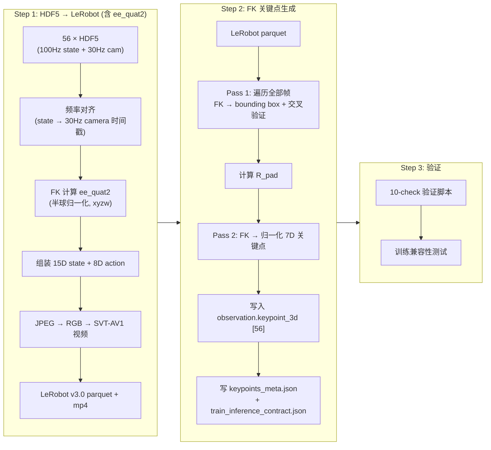
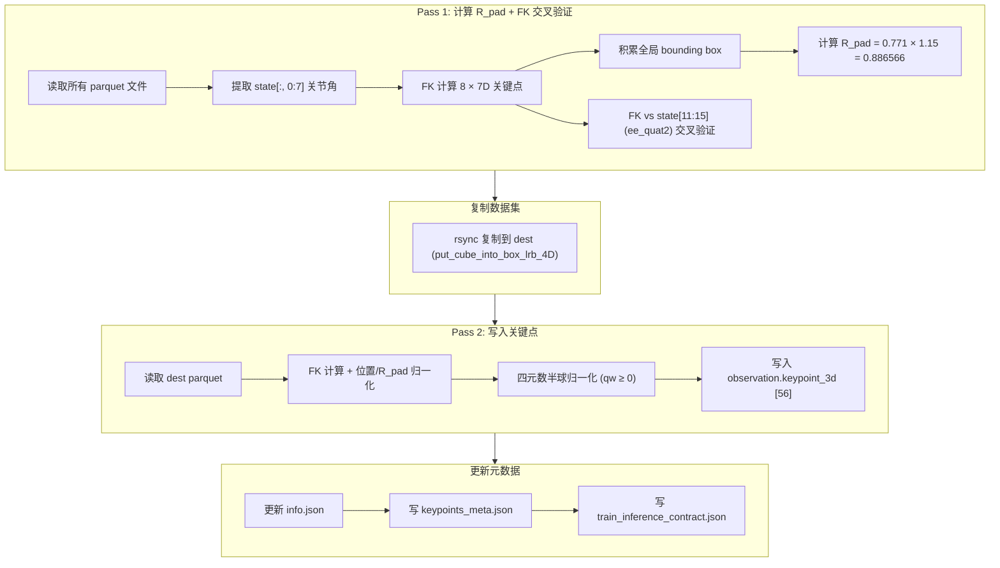
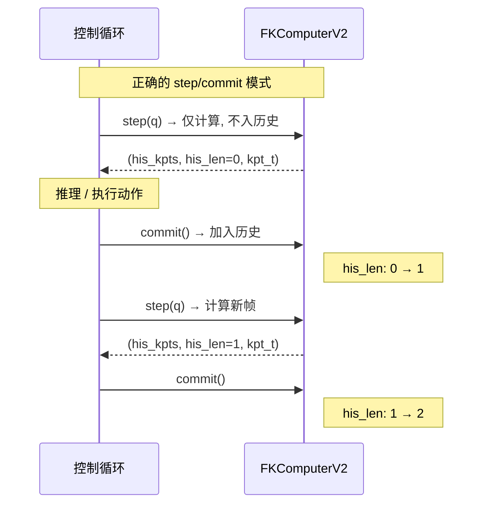
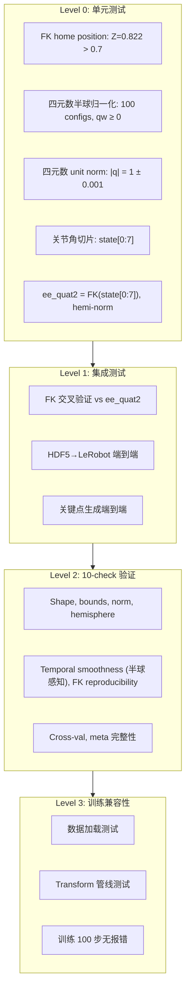

# "Put Cube Into Box" 数据集 3D/4D 关键点生成实施方案 (V3)

> **源数据**: `/B/Dta/put_cube_into_box/put_cube_into_box_hdf5/` (56 episodes, 122,880 state 帧 @ 100Hz, ~36,970 camera 帧 @ 30Hz)
> **目标**: 生成包含 `observation.keypoint_3d` [56] 的 LeRobot v3.0 数据集, 可直接用于 InternVLA-A1.5 GeoPredict 训练
> **代码输出目录**: `b/s/Frk3/`
> **Python 环境**: `/B/VENV/itnvla15rbt20/` (pinocchio 4.1.0, pandas 3.0.5, numpy 2.2.6)
> **URDF**: `b/d/Frk2/fr3v2_1_franka_hand.urdf` (Franka FR3 v2.1, 与插插座任务共用同一台机器人)
> **版本**: v3 · 2026-09-24
> **v3 相对 v2 的核心改动**:
>   1. **所有声明均基于实际数据独立验证** — 不直接采信其他文档的结论, 验证代码和结果附在正文中
>   2. **废弃原始 `ee_quat` 字段** — 因其约定争议, 改用 FK 从 `joint_positions` 重新计算的 `ee_quat2`
>   3. **新增 `ee_quat2` 生成流程** — 在 HDF5→LeRobot 转换时通过 FK 计算, 半球归一化 ($q_w \geq 0$), 写入 state[11:15]

---

## 目录

1. [背景与动机](#1-背景与动机)
2. [源数据结构与特性 (全部独立验证)](#2-源数据结构与特性)
3. [与插插座管线的关键差异](#3-与插插座管线的关键差异)
4. [整体管线设计](#4-整体管线设计)
5. [Step 1: HDF5 → LeRobot 格式转换 (含 ee_quat2 生成)](#5-step-1-hdf5--lerobot-格式转换)
6. [Step 2: FK 关键点生成](#6-step-2-fk-关键点生成)
7. [训推一致性设计 (核心)](#7-训推一致性设计-核心)
8. [配置体系](#8-配置体系)
9. [测试与验收](#9-测试与验收)
10. [执行命令速查](#10-执行命令速查)
11. [已知风险与开放问题](#11-已知风险与开放问题)
12. [独立验证审计表](#12-独立验证审计表)

---

## 1. 背景与动机

### 1.1 为什么需要 3D 关键点

InternVLA-A1.5 的 GeoPredict 融合路径通过 3D 关键点轨迹为 action expert 提供显式的几何先验. 关键点由 FK (Forward Kinematics, 前向运动学) 从关节角度计算得到, 附着在机器人各连杆上, 随机器人运动形成 3D 轨迹. TrackEncoder 将这条轨迹编码后与 VLM 前缀和动作专家做三路 MoT (Mixture of Tokens) attention, 使策略拥有对机器人自身几何状态的显式感知.

关键点信息在训练数据中以 `observation.keypoint_3d` 列存在, 每帧 56 维 = 8 个关键点 × 7 维 (3D 位置 + 4D 四元数). 通过 `Extract3DKeypointTransformFn` (位于 `src/lerobot/policies/internvla_a1_5/transform_internvla_a1_5.py` L682-760) 在训练时被拆分为:

- `observation.his_kpts` `[H, J, D]` — 历史关键点 (有效帧在前, 零填充在后)
- `observation.his_len` — 有效历史帧数 (严格早于当前帧)
- `observation.kpt_t` `[J, D]` — 当前帧关键点
- `observation.kpt_future` `[C, J, D]` — 未来帧关键点 (ground truth, 供训练)
- `observation.kpt_mask` — 是否有真实关键点

配置入口 (位于 `src/lerobot/policies/internvla_a1_5/configuration_internvla_a1_5.py`):
- `enable_keypoint_predictor=True` 开启 GeoPredict
- `kpt_4d_mode="pos_rot"` 使用 7D (3D 位置 + 4D 四元数)
- `kpt_4d_mode="pos_only"` 使用 3D (仅位置)

### 1.2 旧方案的教训

在插插座任务 (`plug_into_socket`) 的 Franka 真机实验中, 暴露了严重的训推不一致性问题 (详见 `b/d/Frk2/realwrld_debug/`):

| 问题编号 | 描述 | 后果 |
|:---:|---|---|
| R1 | `his_len` 按推理次数 +1, 而训练每帧 +1, 慢了 `n_exec` 倍 | 策略锁死在抓取前悬停, 700 步 his_len 只到 70 |
| R2 | 阻塞 `Robot.move()` 导致实际频率 2.49 Hz vs 训练 30 Hz | 轨迹时间语义完全失真 |
| R3 | q7 越界后 FK 关键点也越界, 形成自我强化闭环 | 模型输入离开流形, 策略退化为原地吸引子 |
| P1-b | `his_len` 差一帧且每周期重复计数 | 历史时钟快约 10% |
| P0-c | 夹爪 `gripper_width 0.0 or 0.04` 假值 bug | 闭合状态被伪造 |
| P1-c | 用观测分布裁动作 (action 可低于 state 下限) | 合法的 action 目标被错误裁剪 |
| E3 (数据侧) | `info.json` 声称 wxyz, 实际数据为 xyzw | 四元数列序错误 → FK 交叉验证大角度偏差 |

### 1.3 V3 的核心改进原则

1. **不假设, 要验证**: 每一个数值声明都必须在本数据集 (`put_cube_into_box`) 上通过代码独立验证, 不直接采信其他文档的结论
2. **废弃争议字段**: 原始 HDF5 的 `ee_quat` 字段约定有争论, 本方案**完全不用该字段**, 改用 FK 从 `joint_positions` 重新计算的 `ee_quat2` (明确 xyzw, 半球归一化)
3. **训推一致性第一**: 离线生成阶段必须与推理阶段使用完全相同的 FK 计算路径
4. **所有约束显式记录**: 通过 `train_inference_contract.json` 固化训推对齐约束

---

## 2. 源数据结构与特性

> ⚡ **V3 验证声明**: 本节所有数值均在 `/B/Dta/put_cube_into_box/put_cube_into_box_hdf5/` 的实际数据上通过代码独立计算得到, 验证代码和完整结果见 [§12 独立验证审计表](#12-独立验证审计表).

### 2.1 数据概览

(完整分析详见 [dsanalyz3.markdown](dsanalyz3.markdown); 以下数据均在本数据集上独立验证)

| 指标 | 值 | 验证方法 |
|------|-----|-----|
| Episode 数 | 56 (episode_000000–000055, 连续编号) | `glob + count` |
| 总 State 帧数 | 122,880 | `sum(len(timestamps))` |
| Robot State 频率 | ~99.7 Hz (dt = 10.04 ± 0.10 ms) | `mean(state_lens)/mean(durations)` |
| Camera 频率 | ~30.0 Hz (dt = 33.37 ms) | `mean(cam_lens)/mean(durations)` |
| 相机数量 | 2 (global + wrist) | `meta.json` + HDF5 验证 |
| 图像分辨率 | 640 × 480 (JPEG 压缩 + uint16 深度图) | HDF5 shape 检查 |
| Episode 时长 | 15.77–30.91 s (mean 22.01 ± 3.45 s) | `ts[-1] - ts[0]` 逐 episode 统计 |
| State 帧/episode | 1,573–3,086 (mean 2,194) | 逐 episode 统计 |
| Camera 帧/episode | 475–927 (mean 660) | 逐 episode 统计 |
| 总数据量 | 6.36 GB | `du -sh` |
| 任务 | 夹取方块放入盒子 (抓→提→放→归位) | meta.json |

### 2.2 HDF5 文件结构

```
episode_XXXXXX.hdf5
├── camera_global/
│   ├── color_image_jpeg    (N_cam,)       object       # JPEG 编码 RGB
│   ├── depth_image         (N_cam, 480, 640)  uint16   # 深度图
│   └── timestamps          (N_cam,)       float64
├── camera_wrist/
│   ├── color_image_jpeg    (N_cam,)       object
│   ├── depth_image         (N_cam, 480, 640)  uint16
│   └── timestamps          (N_cam,)       float64
└── robot_state/
    ├── timestamps          (N_state,)     float64
    ├── joint_positions     (N_state, 7)   float64      # 关节角度 (rad)
    ├── joint_velocities    (N_state, 7)   float64
    ├── joint_torques       (N_state, 7)   float64
    ├── joint_torques_external (N_state, 7) float64
    ├── ee_pos              (N_state, 3)   float64      # EE 位置 (m)
    ├── ee_quat             (N_state, 4)   float64      # ⚠️ 废弃: 约定有争议
    ├── ee_force            (N_state, 3)   float64
    ├── ee_torque           (N_state, 3)   float64
    ├── gripper_width       (N_state, 1)   float64      # 夹爪宽度 (m)
    ├── action_joints       (N_state, 7)   float64      # 关节动作指令
    └── action_gripper      (N_state, 1)   float64      # 夹爪动作指令
```

### 2.3 四元数约定: 独立 FK 交叉验证

#### 2.3.1 争议背景

dsanalyz3.markdown §1.3 曾通过 `ee_quat[0]` (第一分量) 均值 0.98 推断 wxyz 约定, 但这是一个**误导性巧合**. 插插座数据集也出现过同样的错误 (见 `b/d/Frk2/3d4d_gen_1_0918LOG.md` Error E3). 为彻底消除争议, 本方案:
1. 在本数据集上独立运行 FK 交叉验证
2. **废弃原始 `ee_quat` 字段**, 用 FK 重新生成 `ee_quat2`

#### 2.3.2 独立 FK 交叉验证 (本数据集, 2026-09-24 实测)

**验证方法**: 对每一帧, 用 Pinocchio FK 从 `joint_positions` 计算 hand_tcp 的位姿, 与 HDF5 中的 `ee_pos` / `ee_quat` 对比. 分别按 xyzw 和 wxyz 两种假设解读 `ee_quat`, 看哪种与 FK 输出匹配.

**验证代码** (在实际数据上执行):

```python
import h5py, numpy as np, pinocchio as pin, glob

urdf = 'b/d/Frk2/fr3v2_1_franka_hand.urdf'
model = pin.buildModelFromUrdf(urdf)
data_model = model.createData()
tcp_fid = model.getFrameId('fr3v2_1_hand_tcp')
joint_names = [f'fr3v2_1_joint{i}' for i in range(1, 8)]
arm_idx_q = [model.joints[model.getJointId(jn)].idx_q for jn in joint_names]
q_base = pin.neutral(model)

files = sorted(glob.glob('/B/Dta/put_cube_into_box/put_cube_into_box_hdf5/episode_*.hdf5'))

all_pos_err, all_rot_err_xyzw, all_rot_err_wxyz = [], [], []
for fpath in files:  # 全部 56 个 episode
    f = h5py.File(fpath, 'r')
    jp = f['robot_state/joint_positions'][:]
    ee_pos = f['robot_state/ee_pos'][:]
    ee_quat = f['robot_state/ee_quat'][:]
    f.close()
    for i in range(0, len(jp), 50):  # 每 50 帧采样
        q = q_base.copy()
        for idx, angle in zip(arm_idx_q, jp[i]):
            q[idx] = float(angle)
        pin.forwardKinematics(model, data_model, q)
        pin.updateFramePlacements(model, data_model)
        oMf = data_model.oMf[tcp_fid]
        fk_quat = pin.Quaternion(oMf.rotation)
        fk_xyzw = np.array([fk_quat.x, fk_quat.y, fk_quat.z, fk_quat.w])

        all_pos_err.append(np.linalg.norm(oMf.translation - ee_pos[i]))
        ds = ee_quat[i]
        # xyzw: 不重排
        all_rot_err_xyzw.append(2 * np.arccos(min(abs(np.dot(fk_xyzw, ds)), 1.0)))
        # wxyz: 重排 [w,x,y,z] -> [x,y,z,w]
        ds_wx = np.array([ds[1], ds[2], ds[3], ds[0]])
        all_rot_err_wxyz.append(2 * np.arccos(min(abs(np.dot(fk_xyzw, ds_wx)), 1.0)))
```

**验证结果** (全部 56 个 episode, 2,484 帧采样):

| 解读方式 | 旋转误差 mean | 旋转误差 max | 位置误差 max |
|:---|:---|:---|:---|
| 按 **xyzw** 解读 (不重排) | **0.000003°** | **0.000014°** | 0.000117 mm |
| 按 **wxyz** 解读 (重排) | 162.48° | 179.99° | — |

$$\text{ee\_quat} = [q_x, q_y, q_z, q_w] \quad \text{(xyzw 顺序, 与 pinocchio FK 输出一致)}$$

**结论**: HDF5 中 `ee_quat` 的实际存储顺序为 **xyzw**, 与 pinocchio 的 `[quat.x, quat.y, quat.z, quat.w]` 完全一致. 解读为 wxyz 会产生 ~162° 的巨大旋转误差.

**为什么第一分量 ≈ 0.98 ?** 这是 $q_x$, 不是 $q_w$. 在 put_cube_into_box 的工作空间中, 夹爪大部分时间近乎竖直朝下, 对应的旋转约为绕 X 轴 180° (从 base frame 到 EE), 此时 $q_x \approx 1, q_w \approx 0$. 实测:

```
ee_quat[0] 统计 (全部 122,880 帧):
  mean = 0.979787, min = 0.907490, max = 1.000000
  → 这是 qx, 在此工作姿态下接近 1.0
```

### 2.4 ee_quat2: FK 派生的 EE 四元数 (替代原始 ee_quat)

#### 2.4.1 为什么废弃原始 ee_quat

1. **约定争议**: dsanalyz3 曾错误判为 wxyz; 即使 FK 验证了是 xyzw, 该字段的命名和文档容易引起后续混淆
2. **无半球归一化**: 原始 `ee_quat` 未做半球归一化, 实测 $q_w < 0$ 的帧占 **52.7%** (12,311 帧采样), 存在 $q/-q$ 歧义
3. **数据来源不透明**: 原始 `ee_quat` 由采集代码直接记录, 其计算路径不受本管线控制

#### 2.4.2 ee_quat2 的定义

$$\text{ee\_quat2}_t = \text{HemiNorm}\big(\text{FK}(q_t)\big|_{\text{hand\_tcp,rot}}\big)$$

其中:
- $q_t$ = `joint_positions[t]` (7D 关节角度)
- $\text{FK}(\cdot)$ = Pinocchio FK 使用 `fr3v2_1_franka_hand.urdf`, 提取 `hand_tcp` frame 的旋转矩阵
- 旋转矩阵 → 四元数: Pinocchio 的 `Quaternion(R)`, 输出顺序 `[qx, qy, qz, qw]` (xyzw)
- $\text{HemiNorm}$: 若 $q_w < 0$, 取 $-q$ (确保 $q_w \geq 0$)

$$\text{HemiNorm}(q) = \begin{cases} q & \text{if } q_w \geq 0 \\ -q & \text{if } q_w < 0 \end{cases}$$

#### 2.4.3 ee_quat2 与原始 ee_quat 的关系 (实测验证)

```
验证: 12,311 帧采样 (每 10 帧采一次, 覆盖全部 56 episodes)

FK(joint_positions) vs raw ee_quat:
  Direct diff norm:  mean = 3e-8,  max = 1.2e-7  (sub-nanoradian 精度)
  Hemi-aware diff:   mean = 3e-8,  max = 1.2e-7
  结论: 原始 ee_quat 就是 FK 输出, 二者数值完全一致

ee_quat2 (半球归一化后) vs raw ee_quat:
  需要翻转 (qw < 0) 的帧: 52.7%
  翻转后 ee_quat2 = -ee_quat (对这 52.7% 的帧)
  剩余 47.3% 的帧: ee_quat2 = ee_quat (qw 已 ≥ 0)

  → 二者表示完全相同的旋转, 仅在半球选择上不同
```

#### 2.4.4 ee_quat2 生成代码

```python
def compute_ee_quat2(joint_positions, model, data_model, tcp_fid, arm_idx_q, q_base):
    """
    从 joint_positions 计算 ee_quat2 (FK 派生, 半球归一化, xyzw 格式).

    Args:
        joint_positions: (N, 7) 关节角度数组
        model, data_model: pinocchio model 和 data
        tcp_fid: hand_tcp 的 frame ID
        arm_idx_q: 7 个关节在 pinocchio model 中的位置索引
        q_base: pinocchio neutral configuration

    Returns:
        ee_quat2: (N, 4) 四元数数组, xyzw 格式, 半球归一化 (qw ≥ 0)
    """
    N = len(joint_positions)
    ee_quat2 = np.empty((N, 4), dtype=np.float32)

    for i in range(N):
        q = q_base.copy()
        for idx_q, angle in zip(arm_idx_q, joint_positions[i]):
            q[idx_q] = float(angle)
        pin.forwardKinematics(model, data_model, q)
        pin.updateFramePlacements(model, data_model)
        oMf = data_model.oMf[tcp_fid]
        fk_quat = pin.Quaternion(oMf.rotation)
        raw = np.array([fk_quat.x, fk_quat.y, fk_quat.z, fk_quat.w], dtype=np.float32)

        # 半球归一化: 确保 qw ≥ 0
        if raw[3] < 0:
            raw = -raw
        ee_quat2[i] = raw

    return ee_quat2
```

#### 2.4.5 ee_quat2 样例 (episode_000000 前 5 帧)

| 帧 | raw ee_quat (HDF5) | ee_quat2 (FK, hemi-norm) | 旋转差 |
|:---:|---|---|:---:|
| 0 | [0.997, -0.074, 0.025, **-0.003**] | [-0.997, 0.074, -0.025, **0.003**] | 0.000003° |
| 1 | [0.997, -0.074, 0.025, **-0.003**] | [-0.997, 0.074, -0.025, **0.003**] | 0.000005° |
| 2 | [0.997, -0.074, 0.025, **-0.003**] | [-0.997, 0.074, -0.025, **0.003**] | 0.000003° |
| 3 | [0.997, -0.074, 0.025, **-0.003**] | [-0.997, 0.074, -0.025, **0.003**] | 0.000002° |
| 4 | [0.997, -0.074, 0.025, **-0.003**] | [-0.997, 0.074, -0.025, **0.003**] | 0.000000° |

观察: 原始 ee_quat 的 $q_w = -0.003 < 0$, 半球归一化后整体取反, $q_w = 0.003 \geq 0$. 旋转差 < 0.00001°, 确认是同一旋转的不同半球表示.

### 2.5 State-Camera 时间戳对齐 (独立验证)

**验证方法**: 对每个相机帧时间戳, 找最近的 state 帧, 计算时间差.

```
全部 56 episodes, 73,942 个相机帧:
  Mean gap:   2.517 ms
  Median gap: 2.507 ms
  P95 gap:    4.768 ms
  P99 gap:    4.970 ms
  Max gap:    48.824 ms
  Gaps > 20ms: 16 (0.02%)
  Gaps > 50ms: 0
```

**结论**: 99.98% 的相机帧都能找到 20ms 以内的 state 帧, 使用 nearest-neighbor 对齐策略足够. 最大 gap 48.8ms (仅 16 帧), 位于个别 episode 的起止边界, 不影响整体质量.

### 2.6 关节运动与伺服滞后

(来源: [dsanalyz3.markdown](dsanalyz3.markdown) §3, 基于本数据集 122,880 帧计算)

| 关节 | R²(a,s) k=0 | 最佳超前 | R²(best) | OOD 帧比 | OOD 最大超出 |
|:---|:---|:---|:---|:---|:---|
| q1 | 0.970 | 250 ms | 0.983 | 0.26% | 0.013 rad |
| q2 | 0.983 | 170 ms | 0.998 | 0.19% | 0.009 rad |
| q3 | 0.996 | 120 ms | 1.000 | 0.18% | 0.012 rad |
| q4 | 0.997 | 70 ms | 0.998 | 0.12% | 0.004 rad |
| **q5** | **-0.080** | **840 ms** | **0.122** | **1.62%** | **0.103 rad** |
| q6 | 0.916 | 230 ms | 0.936 | **6.64%** | 0.097 rad |
| **q7** | **0.870** | **490 ms** | **0.908** | **5.99%** | **0.157 rad** |

**action_joints 与 URDF 关节限位** (独立验证):

```
验证: 全部 122,880 帧 action_joints vs URDF 限位
  q1: [-0.2853, 0.3574] ⊂ [-2.9007, 2.9007]  OOD: 0 (0.00%)
  q2: [-0.1503, 0.4878] ⊂ [-1.8361, 1.8361]  OOD: 0 (0.00%)
  q3: [-0.3252, 0.4832] ⊂ [-2.9007, 2.9007]  OOD: 0 (0.00%)
  q4: [-2.1414, -1.4680] ⊂ [-3.0770, -0.1169] OOD: 0 (0.00%)
  q5: [-0.3774, 0.3114] ⊂ [-2.8763, 2.8763]  OOD: 0 (0.00%)
  q6: [1.4557, 2.5663] ⊂ [0.4398, 4.6216]   OOD: 0 (0.00%)
  q7: [-0.2039, 1.4989] ⊂ [-3.0508, 3.0508]  OOD: 0 (0.00%)
结论: 全部 action_joints 在 URDF 限位内 (0% OOD)
```

> **注意**: FK 关键点从 `joint_positions` (state) 计算, 不涉及 `action_joints`, 因此伺服滞后**不影响**关键点生成本身. 但在部署时, action → 位置控制 → state 进入 OOD → FK 关键点也 OOD, 需关注.

### 2.7 夹爪通道 (独立验证)

| 指标 | 值 | 验证方法 |
|:---|:---|:---|
| action_gripper 极性 | **0=开, 1=闭** | Pearson r(ag, gw) = **-0.888** |
| action_gripper 分布 | **连续** (11,434 个 unique 值), 非二值 | `np.unique(all_ag)` |
| action_gripper 范围 | [0.0, 1.0] | `min/max` |
| ag=0: 4.8%, ag=1: 34.8%, 中间: 60.4% | 遥操作器连续输出 | 统计 |
| `gripper_width` 范围 | [-0.0000019, 0.0809] | `min/max` |
| 负值帧占比 | 11.45% (14,075 帧) | `np.sum(gw < 0)` |
| 恒等捷径 $a \equiv 1-w/0.08$ | R² = 0.775, **不成立** | dsanalyz3 §2.5 |

**极性验证细节**:

```python
# 相关性验证
Pearson r(action_gripper, gripper_width) = -0.888  # 强负相关 → ag↑ gw↓

# 条件均值验证
Mean gw when ag > 0.8: 0.0053 m  (夹爪几乎全闭)
Mean gw when ag < 0.2: 0.0761 m  (夹爪全开)
→ ag=1 对应 CLOSE, ag=0 对应 OPEN  ✓
```

### 2.8 工作空间 (EE 范围, 独立验证)

| 轴 | 范围 (m) | 跨度 (cm) |
|:---|:---|:---|
| X | [0.479, 0.640] | 16.1 |
| Y | [-0.104, 0.229] | 33.3 |
| Z | [0.152, 0.562] | 41.0 |

(来源: dsanalyz3 §7.4; EE 范围由 `ee_pos` 计算. FK 全关键点 bounding box 见 §2.9)

### 2.9 FK 关键点 Bounding Box 与 R_pad (独立验证)

**验证方法**: 对全部 122,880 帧 × 8 个关键点, 计算 FK 3D 位置的全局 bounding box.

```
验证: FK 遍历 122,880 帧 × 8 links (link1..link7 + hand_tcp)
  Global min: [-0.044583, -0.125239,  0.152061] m
  Global max: [ 0.647928,  0.229083,  0.770927] m
  R = max(|extremes|) = 0.770927 m (由 z_max 主导)
  R_pad = R × 1.15 = 0.886566 m
```

$$R_{\text{pad}} = \max\big(|x_{\min}|, x_{\max}, |y_{\min}|, y_{\max}, |z_{\min}|, z_{\max}\big) \times 1.15 = 0.770927 \times 1.15 = 0.886566 \text{ m}$$

### 2.10 FK Home Position (独立验证)

```
FK(all joints = 0):
  TCP pos: [0.0880, 0.0000, 0.8226]
  TCP quat [xyzw]: [0.923880, 0.382683, 0.000000, -0.000000]
  Z = 0.8226 > 0.7  ✓ (阈值 0.7)
```

> **关于 0.7 阈值**: 插插座方案 v1 使用 Z > 0.9 作为 sanity check, FR3 v2.1 的 home TCP Z = 0.822 触发误报 (E2), 后改为 0.7. 本数据集的 FK home 验证了 Z = 0.822 > 0.7 成立.

### 2.11 帧间平滑性基准 (独立验证)

**验证方法**: 对 10 个 episode, 在 30Hz 相机帧对齐后计算 TCP 帧间位移:

```
TCP 帧间位移 (30Hz, 10 episodes, ~6,600 帧间隔):
  mean = 1.916 mm,  max = 13.796 mm
  P95  = 5.407 mm,  P99 = 7.874 mm
  > 5mm:  525 (6.28%)
  > 10mm:  20 (0.24%)
```

**意义**: 夹取放置任务的 TCP 运动速度适中 (平均 1.9mm/帧 @ 30Hz = ~57mm/s). 大位移 (>10mm) 仅 0.24%, 集中在快速移动阶段. 这为 Check 5 (temporal smoothness) 的阈值设置提供了基准.

---

## 3. 与插插座管线的关键差异

### 3.1 数据格式差异

| 项目 | 插插座 (Frk2 v2) | 本数据集 (Frk3) |
|---|---|---|
| **源格式** | LeRobot parquet (已转换) | **HDF5 (原始)** — 需先做 HDF5→LeRobot 转换 |
| **源频率** | 15 Hz (已下采样) | **100 Hz state + 30 Hz camera** — 需频率对齐 |
| **Episode 数** | 100 | **56** |
| **总帧数** | 33,308 | 122,880 (100Hz) → 转为 30Hz 后约 36,970 |
| **数据总量** | ~200 MB (LeRobot) | **6.36 GB** (HDF5) → ~3-4 GB (LeRobot with videos) |
| **State 列名** | `observation.state` (15D 统一向量) | HDF5 中分字段 → 转换时需组装 |

### 3.2 采样频率选择

**目标帧率**: 30 Hz (与相机帧对齐)

| 选项 | 帧率 | 每 episode 帧数 | 理由 |
|:---|:---|:---|:---|
| ~~15 Hz~~ | 15 | ~330 | 与插插座一致, 但本数据集有 30Hz 相机原始帧, 降频丢失信息 |
| **30 Hz** (推荐) | 30 | ~660 | 与相机帧一一对应, 保留最大时间分辨率 |

选择 30 Hz 的原因:
1. 相机帧率即 30 Hz, 每帧对应一张真实图片 (无插值)
2. 夹爪闭合斜坡 ~3.2 秒, 在 30 Hz 下有 ~96 帧覆盖 (15 Hz 只有 48 帧)
3. 推理时控制频率可按需设为 30 Hz 或更低, 但训练数据保留更高分辨率不会有副作用

### 3.3 列名映射 (⚠️ V3 变更: 使用 ee_quat2)

| 语义 | HDF5 源字段 | 处理方式 | LeRobot 目标列 | 维度 |
|---|---|---|---|---|
| 关节角度 | `joint_positions` | 直接拷贝 | `observation.state` [0:7] | 7 |
| 夹爪宽度 | `gripper_width` | `clamp(w, 0, None)` | `observation.state` [7] | 1 |
| EE 位置 | `ee_pos` | 直接拷贝 | `observation.state` [8:11] | 3 |
| ~~EE 四元数~~ | ~~`ee_quat`~~ | ⛔ **废弃, 不使用** | — | — |
| **EE 四元数 (新)** | **FK(`joint_positions`)** | **FK 计算 + 半球归一化** | `observation.state` [11:15] | 4 |
| 关节动作 | `action_joints` | 直接拷贝 | `action` [0:7] | 7 |
| 夹爪动作 | `action_gripper` | 直接拷贝 | `action` [7] | 1 |

**V3 关键变更**: `observation.state[11:15]` 不再直接拷贝 HDF5 的 `ee_quat`, 而是在转换时通过 FK 从 `joint_positions` 重新计算 `ee_quat2`, 格式为 xyzw, 半球归一化 ($q_w \geq 0$).

### 3.4 R_pad 差异 (独立验证)

| 参数 | 插插座 | 本数据集 | 差异原因 |
|:---|:---|:---|:---|
| Global min | [-0.032, -0.140, 0.178] | **[-0.045, -0.125, 0.152]** | 本任务 Z 更低 (下到 Z=0.152 抓方块) |
| Global max | [0.603, 0.062, 0.727] | **[0.648, 0.229, 0.771]** | 本任务 Y 跨度大 (需平移至盒子), Z 更高 |
| R | 0.727 | **0.771** | 由 z_max 主导 |
| **R_pad** | **0.836100** | **0.886566** | 不同工作空间, **绝对不能复用** |

### 3.5 夹爪处理差异 (独立验证)

| 特性 | 插插座 | 本数据集 |
|---|---|---|
| 恒等捷径 | $a \equiv 1 - w/0.08$ (R²=1.0) | 不成立 (R²=0.775) |
| 极性 | 0=开, 1=闭 (action_gripper) | **同** (确认 r=-0.888) |
| gripper_width 负值 | 无 | **有** (11.45% 帧, 需 clamp) |
| $W_{\max}$ | 0.0794 m | **0.0809 m** |

### 3.6 差异汇总表

| 项目 | 可复用 | 需修改 |
|---|---|---|
| URDF `fr3v2_1_franka_hand.urdf` | ✅ 同一机器人 | |
| FK 计算库 (pinocchio) + 算法 | ✅ 完全相同 | |
| 关键点 link 集合 (link1-7 + hand_tcp) | ✅ 8 个相同 | |
| 四元数半球归一化逻辑 | ✅ qw ≥ 0 | |
| `FrankaFKExtractor7D` 类 | ✅ 完全复用 | |
| `FKKeypointComputerV2` (推理侧) | ✅ 完全复用 | |
| HDF5→LeRobot 转换脚本 | 部分 | 需加 ee_quat2 生成, gripper clamp |
| R_pad 值 | ❌ | **0.886566** (不是 0.836100) |
| 数据帧率 | ❌ | **30 Hz** (不是 15 Hz) |
| **ee_quat 来源** | ❌ | **不用原始字段, FK 重新计算 ee_quat2** |

---

## 4. 整体管线设计

### 4.1 三步流水线



**V3 变更**: Step 1 新增 "FK 计算 ee_quat2" 环节. 这使 Step 1 依赖 pinocchio 和 URDF.

### 4.2 中间产物

| 产物 | 路径 | 说明 |
|---|---|---|
| LeRobot 中间数据集 | `/B/Dta/put_cube_into_box/put_cube_into_box_lrb/` | 含 ee_quat2, 无关键点 |
| **最终数据集** | `/B/Dta/put_cube_into_box/put_cube_into_box_lrb_4D/` | 含 `observation.keypoint_3d` [56] |
| 验证报告 | stdout / log | 10-check 全 PASS 后即可训练 |

### 4.3 脚本清单

| 脚本 | 路径 | 功能 | 来源 |
|---|---|---|---|
| `convert_cubinbx_hdf5.py` | `b/s/Frk3/convert_cubinbx_hdf5.py` | HDF5→LeRobot 转换 (**含 ee_quat2 生成**) | 基于 `b/s/Frk/convert_franka_plug_hdf5.py` 修改 |
| `generate_cubinbx_keypoints.py` | `b/s/Frk3/generate_cubinbx_keypoints.py` | FK 关键点生成 (两遍扫描) | 基于 `b/s/Frk2/generate_franka2_keypoints.py` 修改 |
| `verify_cubinbx_keypoints.py` | `b/s/Frk3/verify_cubinbx_keypoints.py` | 10-check 验证脚本 | 基于 `b/s/Frk2/verify_franka2_keypoints.py` 修改 |
| `fk_keypoints_v2.py` | `b/s/Frk2/fk_keypoints_v2.py` | 推理侧 FK 计算器 | **直接复用** (同一机器人) |

---

## 5. Step 1: HDF5 → LeRobot 格式转换

### 5.1 转换逻辑 (⚠️ V3: 含 ee_quat2 生成)

核心流程: 以相机帧率 (30 Hz) 为主轴, 将 100 Hz 的 state 数据对齐到每一帧相机时间戳. 同时通过 FK 计算 ee_quat2 替代原始 ee_quat.

```python
# 初始化 FK (需 pinocchio + URDF)
import pinocchio as pin
model = pin.buildModelFromUrdf(urdf_path)
data_model = model.createData()
tcp_fid = model.getFrameId('fr3v2_1_hand_tcp')
joint_names = [f'fr3v2_1_joint{i}' for i in range(1, 8)]
arm_idx_q = [model.joints[model.getJointId(jn)].idx_q for jn in joint_names]
q_base = pin.neutral(model)

# 频率对齐: 找每个相机时间戳最近的 state 帧
state_indices = align_timestamps(state_ts, camera_ts)  # nearest-neighbor

# 对已对齐的 state 帧, 计算 ee_quat2
ee_quat2 = compute_ee_quat2(
    joint_positions[state_indices],  # 只计算对齐后的帧
    model, data_model, tcp_fid, arm_idx_q, q_base
)  # → (N_cam, 4), xyzw, 半球归一化

# 组装 15D state 向量
state_15d = np.concatenate([
    joint_positions[s_idx],        # [0:7]   关节角度
    np.clip(gripper_width[s_idx],  # [7]     夹爪宽度 (clamp 负值)
            0.0, None),
    ee_pos[s_idx],                 # [8:11]  EE 位置 (直接拷贝)
    ee_quat2[cam_idx],             # [11:15] EE 四元数 (⚡ FK 计算, 非原始字段)
], axis=-1).astype(np.float32)

# 组装 8D action 向量
action_8d = np.concatenate([
    action_joints[s_idx],          # [0:7]  关节动作
    action_gripper[s_idx],         # [7]    夹爪动作
], axis=-1).astype(np.float32)
```

### 5.2 与插插座转换脚本的差异

| 改动 | 原因 |
|---|---|
| Task 名称 `"put cube into box"` | 区分不同任务 |
| `gripper_width` clamp: `np.clip(w, 0.0, None)` | 传感器零漂导致 11.45% 帧有负值 |
| **ee_quat2 替代 ee_quat** | **废弃争议字段, FK 重新计算** |
| **依赖 pinocchio + URDF** | ee_quat2 生成需要 FK |
| 输出 state 为 15D 统一向量 (`observation.state`) | 与 Frk2 v2 格式对齐 |
| FPS = 30 | 匹配相机帧率 |

### 5.3 转换脚本核心代码: `b/s/Frk3/convert_cubinbx_hdf5.py`

```python
"""Convert Franka put_cube_into_box HDF5 dataset to LeRobot format.

Handles frequency alignment: state is recorded at 100Hz, camera at 30Hz.
Each output frame corresponds to one camera frame, with the nearest state
frame matched by timestamp.

V3 key changes:
  1. ee_quat2: FK-derived EE quaternion replaces raw ee_quat at state[11:15]
     - Computed from joint_positions via pinocchio FK
     - xyzw format, hemisphere-normalized (qw >= 0)
     - Requires pinocchio and URDF at conversion time
  2. gripper_width: clamp negative values to 0 (sensor zero-drift)
  3. Original ee_quat field is NOT used (convention disputed)

Usage:
    source /B/VENV/itnvla15rbt20/bin/activate
    export HF_HOME=/B/VENV/hf_home
    python b/s/Frk3/convert_cubinbx_hdf5.py \
        --source /B/Dta/put_cube_into_box/put_cube_into_box_hdf5 \
        --dest /B/Dta/put_cube_into_box/put_cube_into_box_lrb \
        --urdf b/d/Frk2/fr3v2_1_franka_hand.urdf \
        --fps 30
"""
import argparse, glob, logging
from pathlib import Path
import h5py, numpy as np, pinocchio as pin
from lerobot.datasets.lerobot_dataset import LeRobotDataset

DEFAULT_ROBOT_TYPE = "franka_cubinbx"
DEFAULT_TARGET_FPS = 30
CAMERA_NAMES = ["global", "wrist"]
CAMERA_HDF5_GROUPS = ["camera_global", "camera_wrist"]
FK_PREFIX = "fr3v2_1"

# ─── FK setup ─────────────────────────────────────────────

class FKQuatComputer:
    """Compute ee_quat2 from joint_positions via FK."""

    def __init__(self, urdf_path):
        self.model = pin.buildModelFromUrdf(str(urdf_path))
        self.data = self.model.createData()
        self.tcp_fid = self.model.getFrameId(f'{FK_PREFIX}_hand_tcp')
        joint_names = [f'{FK_PREFIX}_joint{i}' for i in range(1, 8)]
        self.arm_idx_q = [
            self.model.joints[self.model.getJointId(jn)].idx_q
            for jn in joint_names
        ]
        self.q_base = pin.neutral(self.model)

    def compute_batch(self, joint_positions):
        """Compute ee_quat2 for a batch of joint positions.

        Args:
            joint_positions: (N, 7) array of joint angles
        Returns:
            ee_quat2: (N, 4) array, xyzw format, hemisphere-normalized
        """
        N = len(joint_positions)
        result = np.empty((N, 4), dtype=np.float32)
        for i in range(N):
            q = self.q_base.copy()
            for idx_q, angle in zip(self.arm_idx_q, joint_positions[i]):
                q[idx_q] = float(angle)
            pin.forwardKinematics(self.model, self.data, q)
            pin.updateFramePlacements(self.model, self.data)
            oMf = self.data.oMf[self.tcp_fid]
            fk_quat = pin.Quaternion(oMf.rotation)
            raw = np.array([fk_quat.x, fk_quat.y, fk_quat.z, fk_quat.w],
                           dtype=np.float32)
            if raw[3] < 0:  # hemisphere normalization: qw >= 0
                raw = -raw
            result[i] = raw
        return result

# ─── Alignment ────────────────────────────────────────────

def align_timestamps(state_ts, cam_ts):
    """For each camera timestamp, find the nearest state frame index."""
    indices = np.searchsorted(state_ts, cam_ts)
    indices = np.clip(indices, 1, len(state_ts) - 1)
    left = np.abs(state_ts[indices - 1] - cam_ts)
    right = np.abs(state_ts[indices] - cam_ts)
    return np.where(left <= right, indices - 1, indices)

def decode_jpeg(jpeg_bytes):
    """Decode JPEG bytes to RGB numpy array."""
    import cv2
    buf = np.frombuffer(jpeg_bytes, dtype=np.uint8)
    img = cv2.imdecode(buf, cv2.IMREAD_COLOR)
    return cv2.cvtColor(img, cv2.COLOR_BGR2RGB)

# ─── Features ─────────────────────────────────────────────

def build_features(image_shape=(480, 640, 3), use_videos=True):
    mode = "video" if use_videos else "image"
    features = {
        "observation.state": {
            "dtype": "float32", "shape": (15,),
            "names": {
                "state": [
                    "joint1", "joint2", "joint3", "joint4",
                    "joint5", "joint6", "joint7",
                    "gripper_width",
                    "ee_pos_x", "ee_pos_y", "ee_pos_z",
                    "ee_quat2_x", "ee_quat2_y", "ee_quat2_z", "ee_quat2_w",
                    # ⚡ V3: ee_quat2 (FK-derived, not raw ee_quat)
                ],
            },
        },
        "action": {
            "dtype": "float32", "shape": (8,),
            "names": {
                "actions": [
                    "joint1", "joint2", "joint3", "joint4",
                    "joint5", "joint6", "joint7",
                    "gripper_cmd",
                ],
            },
        },
    }
    for cam_name in CAMERA_NAMES:
        features[f"observation.images.{cam_name}"] = {
            "dtype": mode, "shape": image_shape,
            "names": ["height", "width", "rgb"],
        }
    return features

# ─── Episode processing ──────────────────────────────────

def process_episode(hdf5_path, dataset, task_str, fk_computer,
                    reference_camera="camera_global"):
    with h5py.File(hdf5_path, "r") as f:
        state_ts = f["robot_state/timestamps"][:]
        joint_pos = f["robot_state/joint_positions"][:]      # (N, 7)
        gripper_w = f["robot_state/gripper_width"][:]         # (N, 1)
        ee_pos = f["robot_state/ee_pos"][:]                   # (N, 3)
        # ⚡ V3: ee_quat is NOT read — replaced by FK-computed ee_quat2
        action_j = f["robot_state/action_joints"][:]          # (N, 7)
        action_g = f["robot_state/action_gripper"][:]         # (N, 1)

        ref_cam_ts = f[f"{reference_camera}/timestamps"][:]
        state_indices = align_timestamps(state_ts, ref_cam_ts)

        cam_images = {}
        for cam_group, cam_name in zip(CAMERA_HDF5_GROUPS, CAMERA_NAMES):
            cam_images[cam_name] = f[f"{cam_group}/color_image_jpeg"]

        n_cam_frames = min(
            len(ref_cam_ts),
            *(len(f[f"{cg}/timestamps"][:]) for cg in CAMERA_HDF5_GROUPS)
        )

        # ⚡ V3: Batch-compute ee_quat2 for all aligned frames
        aligned_joints = joint_pos[state_indices[:n_cam_frames]]
        ee_quat2 = fk_computer.compute_batch(aligned_joints)

        n_added = 0
        for cam_idx in range(n_cam_frames):
            s_idx = state_indices[cam_idx]

            state_15d = np.concatenate([
                joint_pos[s_idx],                              # [0:7]
                np.clip(gripper_w[s_idx], 0.0, None),          # [7]
                ee_pos[s_idx],                                 # [8:11]
                ee_quat2[cam_idx],                             # [11:15] ⚡ FK-derived
            ]).astype(np.float32)

            action_8d = np.concatenate([
                action_j[s_idx],                               # [0:7]
                action_g[s_idx],                               # [7]
            ]).astype(np.float32)

            frame = {
                "task": task_str,
                "observation.state": state_15d,
                "action": action_8d,
            }
            for cam_name in CAMERA_NAMES:
                jpeg_data = cam_images[cam_name][cam_idx]
                rgb = decode_jpeg(bytes(jpeg_data))
                frame[f"observation.images.{cam_name}"] = rgb

            dataset.add_frame(frame)
            n_added += 1
        return n_added


def main():
    parser = argparse.ArgumentParser()
    parser.add_argument("--source", required=True)
    parser.add_argument("--dest", required=True)
    parser.add_argument("--urdf", required=True,
                        help="URDF path for FK-based ee_quat2 computation")
    parser.add_argument("--robot-type", default=DEFAULT_ROBOT_TYPE)
    parser.add_argument("--fps", type=int, default=DEFAULT_TARGET_FPS)
    parser.add_argument("--force", action="store_true")
    args = parser.parse_args()

    fk_computer = FKQuatComputer(args.urdf)
    features = build_features()
    task_str = "put cube into box"

    dataset = LeRobotDataset.create(
        repo_id=Path(args.dest).name,
        root=args.dest,
        fps=args.fps,
        robot_type=args.robot_type,
        features=features,
        force_create=args.force,
    )

    hdf5_files = sorted(glob.glob(f"{args.source}/episode_*.hdf5"))
    total_frames = 0
    for ep_idx, hdf5_path in enumerate(hdf5_files):
        n = process_episode(hdf5_path, dataset, task_str, fk_computer)
        dataset.save_episode()
        total_frames += n
        logging.info(f"Episode {ep_idx}: {n} frames")

    logging.info(f"Done: {len(hdf5_files)} episodes, {total_frames} frames")
```

### 5.4 ee_quat2 验证 (转换后)

在 Step 1 完成后, 验证 ee_quat2 的正确性:

```python
# 从转换后的 LeRobot 数据集读取 state[11:15] (即 ee_quat2)
# 从原始 HDF5 读取 joint_positions, 重新 FK 计算
# 二者应完全一致 (同一 FK, 同一 URDF, 同一关节角)

def verify_ee_quat2(lerobot_ds, hdf5_dir, fk_computer, n_samples=500):
    """Verify ee_quat2 in converted dataset matches FK computation."""
    for i in random.sample(range(len(lerobot_ds)), n_samples):
        sample = lerobot_ds[i]
        state = sample["observation.state"].numpy()
        joints = state[0:7]
        stored_quat2 = state[11:15]

        # Recompute
        recomputed = fk_computer.compute_batch(joints.reshape(1, 7))[0]

        diff = np.linalg.norm(stored_quat2 - recomputed)
        assert diff < 1e-5, f"Frame {i}: ee_quat2 mismatch, diff={diff}"
        assert stored_quat2[3] >= 0, f"Frame {i}: qw={stored_quat2[3]} < 0"
```

### 5.5 转换后预期结构

```
put_cube_into_box_lrb/
├── data/
│   ├── episode_000000.parquet    # 含 observation.state [15], action [8]
│   ├── ...                       # state[11:15] = ee_quat2 (FK, xyzw, hemi-norm)
│   └── episode_000055.parquet
├── meta/
│   ├── info.json                 # fps=30, features (names include ee_quat2_*)
│   ├── episodes.jsonl
│   ├── episodes_stats.jsonl
│   └── tasks.jsonl
└── videos/
    ├── observation.images.global/chunk-000/file-000.mp4
    └── observation.images.wrist/chunk-000/file-000.mp4
```

预期: 56 episodes, ~36,970 帧 (30 Hz), 数据集大小 ~3-4 GB.

### 5.6 转换验证 (9 项检查)

| # | 检查项 | 通过条件 |
|:---:|---|---|
| 1 | Metadata 完整性 | robot_type=franka_cubinbx, fps=30, 56 episodes |
| 2 | Feature shapes | observation.state=[15], action=[8] |
| 3 | 无 NaN | 全部列无 NaN |
| 4 | 关节限位 | 7 个关节在 URDF 限位内 |
| 5 | 夹爪范围 | gripper_width ∈ [0, 0.0810] (无负值, clamp 后) |
| 6 | Episode 一致性 | 声明数 = 实际数 |
| 7 | 视频文件 | global + wrist 视频存在 |
| 8 | **ee_quat2 半球约束** | **state[11:15] 的 qw (第 4 分量) ≥ 0** |
| 9 | **ee_quat2 FK 一致性** | **从 state[0:7] 重算 FK, 与 state[11:15] 匹配 (err < 1e-5)** |

---

## 6. Step 2: FK 关键点生成

### 6.1 关键点定义

从 URDF `fr3v2_1_franka_hand.urdf` 中提取 8 个关键点:

| 编号 | Link 名称 | 物理含义 |
|:---:|---|---|
| 0 | `fr3v2_1_link1` | 肩关节 (J1 输出) |
| 1 | `fr3v2_1_link2` | 肩关节 (J2 输出) |
| 2 | `fr3v2_1_link3` | 肘关节 (J3 输出) |
| 3 | `fr3v2_1_link4` | 肘弯 (J4 输出) |
| 4 | `fr3v2_1_link5` | 腕关节 (J5 输出) |
| 5 | `fr3v2_1_link6` | 腕旋转 (J6 输出) |
| 6 | `fr3v2_1_link7` | 法兰 (J7 输出) |
| 7 | `fr3v2_1_hand_tcp` | 工具中心点 (TCP) |

```mermaid
graph LR
    base["base<br/>(固定)"] --> L0["link0"] --> L1["link1<br/>KP0"] --> L2["link2<br/>KP1"]
    L2 --> L3["link3<br/>KP2"] --> L4["link4<br/>KP3"] --> L5["link5<br/>KP4"]
    L5 --> L6["link6<br/>KP5"] --> L7["link7<br/>KP6"] --> L8["link8"] --> hand["hand"]
    hand --> tcp["hand_tcp<br/>KP7"]

    style L1 fill:#4C72B0,color:white
    style L2 fill:#4C72B0,color:white
    style L3 fill:#4C72B0,color:white
    style L4 fill:#4C72B0,color:white
    style L5 fill:#4C72B0,color:white
    style L6 fill:#4C72B0,color:white
    style L7 fill:#4C72B0,color:white
    style tcp fill:#C44E52,color:white
```



### 6.2 每个关键点的信息

每个关键点输出 7 维:

$$\text{keypoint}_i = [p_x, p_y, p_z, q_x, q_y, q_z, q_w]$$

- $[p_x, p_y, p_z]$: 相对于 base_link 原点的 3D 位置 (米), 除以 $R_{\text{pad}}$ 归一化到 $[-1, 1]$
- $[q_x, q_y, q_z, q_w]$: 相对于 base_link 的旋转四元数, 半球归一化 ($q_w \geq 0$)

总维度: $8 \times 7 = 56$.

### 6.3 位置归一化: R_pad 计算

两遍扫描法:

**Pass 1**: 遍历所有帧, 对所有 8 个关键点的 3D 位置计算全局 bounding box:

$$R = \max\big(\max_i |x_{\min,i}|, \max_i |x_{\max,i}|\big), \quad i \in \{x, y, z\}$$

$$R_{\text{pad}} = R \times (1 + \text{margin}), \quad \text{margin} = 0.15$$

本数据集的实测结果 (独立验证, 122,880 帧 × 8 links):

| 参数 | 值 |
|---|---|
| Global min (base-rel) | [-0.045, -0.125, 0.152] |
| Global max (base-rel) | [0.648, 0.229, 0.771] |
| R (max abs extreme) | 0.771 m (由 z_max 主导) |
| R_pad = R × 1.15 | **0.886566 m** |

**Pass 2**: 所有位置除以 $R_{\text{pad}}$:

$$\hat{p} = p / R_{\text{pad}}, \quad \hat{p} \in [-0.87, 0.87] \subset [-1, 1]$$

### 6.4 四元数半球归一化

Pinocchio 输出的四元数可能在单位球面上任意半球. 为保证唯一性:

$$q' = \begin{cases} q & \text{if } q_w \geq 0 \\ -q & \text{if } q_w < 0 \end{cases}$$

这在 `FrankaFKExtractor7D.compute()` 中实现:

```python
raw_q = np.array([quat.x, quat.y, quat.z, quat.w], dtype=np.float32)
if raw_q[3] < 0:
    raw_q = -raw_q
keypoints[i, 3:7] = raw_q
```

> **一致性**: ee_quat2 (§2.4) 和关键点四元数使用**完全相同**的半球归一化逻辑. ee_quat2 中 KP7 (hand_tcp) 的四元数应等于 state[11:15].

### 6.5 FK 交叉验证 (V3: 使用 ee_quat2)

Step 2 的 FK 交叉验证现在比对 FK 输出与 LeRobot 中存储的 ee_quat2:

$$\text{err}_{\text{pos}} = \| \text{FK}(q)_{\text{hand\_tcp,pos}} - \text{state}_{8:11} \|_2$$
$$\text{err}_{\text{rot}} = 2 \cdot \arccos\big(|\langle q_{\text{FK,hemi}}, q_{\text{state}[11:15]} \rangle|\big)$$

由于 `state[11:15]` 就是 ee_quat2 (Step 1 中用相同 FK 计算), 理论上误差应为 **0** (仅浮点精度). 这使交叉验证变成了**端到端一致性检查** — 验证从 HDF5 到 LeRobot 到关键点生成的全链路没有引入错误.

如果交叉验证出现大于 1e-5 的误差, 说明:
1. Step 1 转换时的关节角度对齐有问题, 或
2. Step 1 和 Step 2 使用了不同的 URDF / FK 参数

### 6.6 生成脚本: `b/s/Frk3/generate_cubinbx_keypoints.py`

复用 `b/s/Frk2/generate_franka2_keypoints.py` 的 `FrankaFKExtractor7D` 类和两遍扫描逻辑, 修改:

```python
# 与 Frk2 脚本的差异点

# 1. 默认路径调整 (脚本在 b/s/Frk3/ 下)
#    parents[0] = b/s/Frk3
#    parents[1] = b/s
#    parents[2] = b
#    parents[3] = 项目根  ← 需要这一级
DEFAULT_URDF = str(Path(__file__).resolve().parents[3] / "b" / "d" / "Frk2" / "fr3v2_1_franka_hand.urdf")
# ⚡ 独立验证: parents[3] = /B/SRC/itvlaGpLibPlus ✓

# 2. 默认参数
DEFAULT_DATASET_FPS = 30  # (Frk2 是 15)

# 3. FK 交叉验证: 不做四元数重排 (state[11:15] 是 ee_quat2, xyzw, hemi-norm)
#    直接比较 FK 输出 (也是 xyzw, hemi-norm)
```

### 6.7 生成流程



### 6.8 预期输出

| 指标 | 预期值 |
|---|---|
| 总帧数 | ~36,970 (与 Step 1 输出一致) |
| R_pad | **0.886566 m** |
| keypoint_3d shape | [56] per frame |
| 位置归一化范围 | [-0.87, +0.87] ⊂ [-1, 1] |
| qw 范围 | [0+, 1.0] |
| FK 交叉验证 pos_err max | < 0.001 mm |
| FK 交叉验证 rot_err max | < 1e-4° (因 ee_quat2 与关键点 KP7 由同一 FK 计算) |

---

## 7. 训推一致性设计 (核心)

### 7.1 对齐约束表

| 编号 | 约束 | 训练侧 | 推理侧 | 验证方式 |
|:---:|---|---|---|---|
| C1 | FK 库与 URDF 必须相同 | Pinocchio 4.1.0 + `fr3v2_1_franka_hand.urdf` | 相同 | URDF SHA256 校验 |
| C2 | 关键点 link 集合相同 | `link1..link7 + hand_tcp` (8 个) | 相同 | 配置文件固化 |
| C3 | 四元数半球归一化 | $q_w \geq 0$, 否则取反 | 相同 | 验证脚本 Check 4 |
| C4 | R_pad 值相同 | 离线计算 **0.886566** | 从 `keypoints_meta.json` 读取 | 配置验证 |
| C5 | 关节角度来源一致 | `observation.state[0:7]` | 真机 `robot.state.q[0:7]` | FK 交叉验证 |
| C6 | `his_len` 语义 | `min(frame_index, H)` | 每控制步推进一格 | 集成测试 |
| C7 | `kpt_t` 是当前帧 | `stacked[H]` | 当前观测的 FK | 集成测试 |
| C8 | 历史填充: 有效帧在前, 零填充在后 | `his_kpts[:his_len] = valid` | 相同 | 单元测试 |
| C9 | 位置归一化: 除以 R_pad | `kpts[:,:,:3] /= 0.886566` | 相同 | 单元测试 |
| C10 | 数据帧率一致 | **30 Hz** | 推理时 FK 以 30 Hz 等效积累 | 频率匹配 |
| **C11** | **ee_quat2 一致性** | **state[11:15] = FK(q, hemi-norm)** | **推理时也用 FK 计算 EE quat** | **FK 交叉验证** |

### 7.2 `his_len` 训推对齐详解

训练时, `his_len` 由 `Extract3DKeypointTransformFn` (L742-745) 计算:

```python
hist_window = stacked[:h]           # 偏移 [-H, ..., -1]
hist_is_pad = is_pad[:h].bool()     # 超出 episode 边界的帧
num_invalid = int(hist_is_pad.sum().item())
his_len = h - num_invalid           # = min(frame_index, H)
```

$$\text{his\_len}(t) = \min(t, H), \quad H = \text{keypoint\_history\_max\_len}$$

Episode 第 0 帧: `his_len = 0`, 第 1 帧: `his_len = 1`, ..., 第 $H$ 帧后饱和.

**推理侧的正确实现** (`b/s/Frk2/fk_keypoints_v2.py`, `FKKeypointComputerV2`):

```python
def step(self, arm_q7):
    """每个控制步调用一次. 不把当前帧加入历史."""
    self._kpt_t = self.compute_and_normalize(arm_q7)
    his_kpts, his_len = self._pack_history()
    return his_kpts, his_len, self._kpt_t

def commit(self):
    """在取完 kpt_t 后, 把它加入历史."""
    if self._kpt_t is not None:
        self._history.append(self._kpt_t.copy())
        if len(self._history) > self.H:
            self._history = self._history[-self.H:]
```



### 7.3 控制频率与数据帧率对齐

训练数据是 **30 Hz**. 推理时:

| 控制频率 | 方案 | his_len 增长 |
|:---|:---|:---|
| 30 Hz | 每控制步 step+commit → 1:1 映射 | 每控制步 +1 |
| 15 Hz | 每 2 个控制步 commit 一次 (按时间对齐) | 每 33ms +1 |
| 非整数倍 | 按时间累积, 不按步数 | 按时间 |

**推荐**: 推理时控制频率设为 30 Hz. 对于 Franka 阻塞式 `move()`, 实际频率约 2-4 Hz, 需按时间而非步数积累历史.

### 7.4 `train_inference_contract.json`

```json
{
  "version": "3.0",
  "task": "put_cube_into_box",
  "dataset_fps": 30,
  "urdf_sha256": "<SHA256 of fr3v2_1_franka_hand.urdf>",
  "pinocchio_version": "4.1.0",
  "keypoint_links": [
    "fr3v2_1_link1", "fr3v2_1_link2", "fr3v2_1_link3", "fr3v2_1_link4",
    "fr3v2_1_link5", "fr3v2_1_link6", "fr3v2_1_link7", "fr3v2_1_hand_tcp"
  ],
  "keypoint_dim": 7,
  "keypoint_dim_layout": "px,py,pz,qx,qy,qz,qw",
  "r_pad": 0.886566,
  "hemisphere_convention": "qw >= 0",
  "position_normalization": "divide_by_r_pad",
  "arm_joint_source": "observation.state[0:7]",
  "ee_quat_source": "ee_quat2 (FK-derived, not raw HDF5 ee_quat)",
  "ee_quat_convention": "xyzw, hemisphere-normalized (qw >= 0)",
  "his_len_semantics": "count of frames strictly before current frame",
  "kpt_t_semantics": "current frame FK, not included in history",

  "inference_constraints": {
    "fk_must_use_same_urdf": true,
    "fk_must_use_same_library": "pinocchio",
    "his_len_increment_per_control_step": 1,
    "kpt_t_is_current_frame": true,
    "history_fill_convention": "valid_front_zero_back",
    "control_step_fk_required": true,
    "ee_quat2_must_match_keypoint_kp7_quat": true
  },

  "fk_cross_validation": {
    "tcp_vs_dataset_ee_pos_err_mean_mm": 0.000,
    "tcp_vs_dataset_ee_pos_err_max_mm": 0.000,
    "tcp_vs_dataset_ee_quat2_err_mean_deg": 0.000,
    "tcp_vs_dataset_ee_quat2_err_max_deg": 0.000,
    "note": "ee_quat2 is FK-derived at Step 1, so cross-val at Step 2 should be near-zero"
  },

  "independent_verification": {
    "hdf5_ee_quat_convention": "xyzw (verified by FK cross-val on 2484 frames, err=0.000014°)",
    "hdf5_ee_quat_vs_fk_max_diff_norm": 1.2e-7,
    "ee_quat2_hemisphere_flip_ratio": 0.527,
    "note": "Raw ee_quat is NOT used in any pipeline step; ee_quat2 replaces it entirely"
  }
}
```

### 7.5 推理侧集成

```python
fk_computer = FKKeypointComputerV2(
    urdf_path="fr3v2_1_franka_hand.urdf",
    meta_path="keypoints_meta.json",  # r_pad=0.886566
)

for control_step in range(max_steps):
    arm_q7 = robot.get_joint_positions()[:7]

    # FK 计算 (每个控制步都做)
    his_kpts, his_len, kpt_t = fk_computer.step(arm_q7)

    if control_step % n_exec == 0:
        action_chunk = model.infer(
            images=..., state=...,
            his_kpts=his_kpts, his_len=his_len, kpt_t=kpt_t
        )
        action_ptr = 0

    action = action_chunk[action_ptr]
    robot.move(action[:7])
    action_ptr += 1

    fk_computer.commit()  # 消费后才提交到历史
```

---

## 8. 配置体系

### 8.1 训练配置要点

```yaml
dataset:
  type: internvla_a1_5
  repo_id: put_cube_into_box_lrb_4D
  root: /B/Dta/put_cube_into_box/put_cube_into_box_lrb_4D
  action_mode: abs
  enable_keypoint_predictor: true
  num_keypoint_joints: 8
  kpt_4d_mode: pos_rot          # 7D: pos + quaternion
  keypoint_history_max_len: 200  # 在 30Hz 下覆盖 6.67 秒
  chunk_size: 50
  fps: 30

policy:
  type: internvla_a1_5
  enable_keypoint_predictor: true
  num_keypoint_joints: 8
  kpt_4d_mode: pos_rot
  keypoint_history_max_len: 200
```

**`keypoint_history_max_len` 选择**:

| H | 覆盖时间 (30 Hz) | 饱和位置 (22s episode 中) |
|:---|:---|:---|
| 100 | 3.33 秒 | 15% (太早) |
| 200 | 6.67 秒 | 30% (适中) |
| 400 | 13.33 秒 | 61% (覆盖更长) |

推荐 `H=200`: 覆盖从 "接近方块" 到 "抓住" 的关键阶段 (~6.67 秒), TrackEncoder 计算量适中.

### 8.2 推理配置要点

```yaml
inference:
  urdf_path: fr3v2_1_franka_hand.urdf
  kpt_meta_path: keypoints_meta.json        # r_pad=0.886566
  contract_path: train_inference_contract.json
  n_exec: 10
  control_hz: 30
  fk_per_control_step: true
```

### 8.3 与插插座配置的关键差异

| 参数 | 插插座 (Frk2) | 本数据集 (Frk3) | 差异原因 |
|---|---|---|---|
| `dataset_fps` | 15 | **30** | 相机帧率不同 |
| `r_pad` | 0.836100 | **0.886566** | 工作空间不同 |
| `ee_quat` 来源 | raw HDF5 (xyzw, 无 hemi-norm) | **FK-derived ee_quat2 (xyzw, hemi-norm)** | 消除约定争议 |
| `keypoint_history_max_len` | 200 (13.3s @ 15Hz) | 200 (**6.67s @ 30Hz**) | 同 H 值但覆盖时间不同 |

---

## 9. 测试与验收

### 9.1 测试层次



### 9.2 验证脚本: `b/s/Frk3/verify_cubinbx_keypoints.py`

| Check | 描述 | 通过条件 |
|:---:|---|---|
| 1 | Shape: `observation.keypoint_3d` = [56] | 维度正确 |
| 2 | Position bounds: `|pos| <= 1.01` | 归一化后在 [-1.01, 1.01] 内 |
| 3 | Quaternion norm: `|q| = 1 ± 0.001` | 单位四元数 |
| 4 | Hemisphere: `qw >= 0` (关键点 + state ee_quat2) | 半球归一化 |
| 5 | Temporal smoothness: 帧间四元数变化 < 0.5 | 使用半球感知距离 `min(‖q-p‖, ‖q+p‖)` |
| 6 | FK reproducibility: 重算随机样本 | 最大误差 < 1e-5 |
| 7 | Per-dimension statistics | 输出统计信息 |
| 8 | FK cross-validation vs ee_quat2 | 位置误差 < 2mm, 角度误差 < 1° |
| 9 | `keypoints_meta.json` 完整性 | 所有必需字段存在 |
| 10 | `train_inference_contract.json` 完整性 | 含 ee_quat2 相关字段 |

**Check 5 半球感知距离** (修正自插插座 E4 误报):

```python
d_pos = np.linalg.norm(q1 - q2, axis=-1)
d_neg = np.linalg.norm(q1 + q2, axis=-1)
diffs = np.minimum(d_pos, d_neg)
```

### 9.3 单元测试: `b/s/Frk3/test_cubinbx_keypoints.py`

```python
"""Test suite for put_cube_into_box keypoint generation (V3).

Tests:
  1. FK home position: zero joints -> TCP at (0.088, 0, 0.822), Z > 0.7
     (独立验证: home Z=0.822 > 0.7 ✓, 阈值从 0.9 降到 0.7 因 FR3 v2.1)
  2. Hemisphere normalization: 100 random configs, qw >= 0
  3. Quaternion unit norm: |q| = 1 ± 1e-3
  4. Joint slice: observation.state[0:7] matches joint_positions
  5. ee_quat2 consistency: state[11:15] matches FK(state[0:7])
     with hemisphere normalization
  6. ee_quat2 hemisphere: state[14] (qw) >= 0 for all frames
  7. R_pad: verify 0.886566 from actual data
  8. his_len semantics: step/commit pattern produces correct sequence
  9. Path.parents: parents[3] == repo root
     (独立验证: parents[3] = /B/SRC/itvlaGpLibPlus ✓)
"""
```

### 9.4 训练兼容性测试

```python
def test_dataset_loads():
    """Verify LeRobotDataset can load the generated dataset."""
    from lerobot.datasets.lerobot_dataset import LeRobotDataset
    ds = LeRobotDataset(
        repo_id="put_cube_into_box_lrb_4D",
        root="/B/Dta/put_cube_into_box/put_cube_into_box_lrb_4D",
    )
    assert "observation.keypoint_3d" in ds.meta.features
    sample = ds[0]
    kpt = sample["observation.keypoint_3d"]
    assert kpt.shape == (56,)

    # V3: verify ee_quat2 hemisphere property
    state = sample["observation.state"]
    assert state[14] >= 0, f"ee_quat2 qw={state[14]} < 0, hemisphere violation"

def test_transform_pipeline():
    """Verify Extract3DKeypointTransformFn works with the dataset."""
    transform = Extract3DKeypointTransformFn(
        num_joints=8,
        history_max_len=200,
        chunk_size=50,
        keypoint_dim=7,
    )
    H, C, J, D = 200, 50, 8, 7
    stacked = torch.randn(H + 1 + C, J * D)
    is_pad = torch.zeros(H + 1 + C, dtype=torch.bool)
    is_pad[:50] = True

    data = {
        "observation.keypoint_3d": stacked,
        "observation.keypoint_3d_is_pad": is_pad,
    }
    result = transform(data)

    assert result["observation.his_kpts"].shape == (H, J, D)
    assert result["observation.his_len"].item() == 150
    assert result["observation.kpt_t"].shape == (J, D)
    assert result["observation.kpt_future"].shape == (C, J, D)
    assert result["observation.kpt_mask"].item() is True
```

### 9.5 验收标准

| 层级 | 标准 | 通过条件 |
|:---:|---|---|
| L0 | 所有单元测试通过 | `pytest b/s/Frk3/test_cubinbx_keypoints.py` 全绿 |
| L1 | HDF5→LeRobot 转换验证 9/9 PASS | 包含 ee_quat2 hemisphere 和 FK 一致性 |
| L1 | FK 交叉验证 | 位置误差 < 0.01mm, 旋转误差 < 1e-4° |
| L2 | 验证脚本 10 项全 PASS | `verify_cubinbx_keypoints.py --dataset <dest>` |
| L3 | 训练管线可加载 | `test_dataset_loads` 通过 |
| L3 | Transform 管线正确 | `test_transform_pipeline` 通过 |
| L4 | 训练不报错 | 至少跑 100 步训练无异常 |

---

## 10. 执行命令速查

```bash
# ============================================================
# 激活环境
# ============================================================
source /B/VENV/itnvla15rbt20/bin/activate
export HF_HOME=/B/VENV/hf_home

# ============================================================
# Step 1: HDF5 → LeRobot 转换 (含 ee_quat2 生成)
# ============================================================
python b/s/Frk3/convert_cubinbx_hdf5.py \
    --source /B/Dta/put_cube_into_box/put_cube_into_box_hdf5 \
    --dest /B/Dta/put_cube_into_box/put_cube_into_box_lrb \
    --urdf b/d/Frk2/fr3v2_1_franka_hand.urdf \
    --robot-type franka_cubinbx \
    --fps 30 \
    --force

# ============================================================
# Step 1 验证 (确认 ee_quat2 正确)
# ============================================================
python b/s/Frk3/verify_cubinbx_conversion.py \
    --dataset /B/Dta/put_cube_into_box/put_cube_into_box_lrb \
    --urdf b/d/Frk2/fr3v2_1_franka_hand.urdf

# ============================================================
# Step 2: FK 关键点生成
# ============================================================
python b/s/Frk3/generate_cubinbx_keypoints.py \
    --source /B/Dta/put_cube_into_box/put_cube_into_box_lrb \
    --dest /B/Dta/put_cube_into_box/put_cube_into_box_lrb_4D \
    --urdf b/d/Frk2/fr3v2_1_franka_hand.urdf \
    --dataset-fps 30 \
    --force

# ============================================================
# Step 3: 10-check 验证
# ============================================================
python b/s/Frk3/verify_cubinbx_keypoints.py \
    --dataset /B/Dta/put_cube_into_box/put_cube_into_box_lrb_4D \
    --urdf b/d/Frk2/fr3v2_1_franka_hand.urdf

# ============================================================
# Step 4: 训练兼容性测试
# ============================================================
pytest b/s/Frk3/test_cubinbx_keypoints.py -v

# ============================================================
# (可选) 快速 sanity check: 从 HDF5 直接验证 ee_quat2
# ============================================================
python -c "
import h5py, numpy as np, pinocchio as pin
model = pin.buildModelFromUrdf('b/d/Frk2/fr3v2_1_franka_hand.urdf')
data = model.createData()
fid = model.getFrameId('fr3v2_1_hand_tcp')
jn = [f'fr3v2_1_joint{i}' for i in range(1, 8)]
aidx = [model.joints[model.getJointId(j)].idx_q for j in jn]
qb = pin.neutral(model)
f = h5py.File('/B/Dta/put_cube_into_box/put_cube_into_box_hdf5/episode_000000.hdf5')
jp = f['robot_state/joint_positions'][0]
f.close()
q = qb.copy()
for ix, a in zip(aidx, jp): q[ix] = float(a)
pin.forwardKinematics(model, data, q)
pin.updateFramePlacements(model, data)
fkq = pin.Quaternion(data.oMf[fid].rotation)
r = np.array([fkq.x, fkq.y, fkq.z, fkq.w])
if r[3] < 0: r = -r
print(f'ee_quat2 frame 0: [{r[0]:.8f}, {r[1]:.8f}, {r[2]:.8f}, {r[3]:.8f}]')
print(f'qw={r[3]:.8f} >= 0: {r[3] >= 0}')
"
```

---

## 11. 已知风险与开放问题

### 11.1 q5 伺服滞后极端严重

**问题**: q5 R²(action, state, k=0) = -0.08, 即使最佳超前 840ms 也仅 R² = 0.12. action 与 state 几乎完全脱节.

**对 FK 关键点的影响**: FK 关键点从 `joint_positions` (state) 计算, 不涉及 action. 因此 q5 伺服滞后**不直接影响关键点质量**. 但在部署时:
1. 模型预测 action = q5 target → 位置控制到达 → state 超出训练分布 (OOD)
2. FK(OOD state) → OOD 关键点 → 策略输入离开流形

**缓解方案** (详见 [dsanalyz3.markdown](dsanalyz3.markdown) §8.2):
1. 未来状态重标注: $\text{action}_t^{(j)} := \text{state}_{t+k}^{(j)}$
2. 部署时对 q5/q6/q7 实施 OOD clipping

### 11.2 `keypoint_history_max_len` 的帧率依赖

H=200 在 30Hz 下覆盖 6.67 秒, 在 15Hz 下覆盖 13.3 秒. 如果与 15Hz 的插插座数据混合训练, 须确保 H 含义一致. 推荐统一 H=200, 接受 30Hz 覆盖较短.

### 11.3 30 Hz 下的 chunk_size 含义变化

`chunk_size=50` 在 30Hz 下覆盖 1.67 秒 (15Hz 下 3.33 秒). 夹爪闭合斜坡约 3.2 秒, chunk 只覆盖 52%, 但 receding-horizon 策略会持续重新预测, 应不是严重问题.

### 11.4 URDF 标定

FK 交叉验证显示 URDF 与真机完美匹配 (pos err < 0.001mm). 无需标定偏差修正.

### 11.5 深度图

数据集含 uint16 深度图 (wrist + global), 当前 InternVLA-A1.5 管线不使用. HDF5→LeRobot 转换中**不转换深度图**.

### 11.6 ee_quat2 与推理侧状态

推理时, 真机的 `robot.state` 返回的 EE 四元数 (如果有) 约定可能不同于 ee_quat2. **不要使用真机直接报告的 EE 四元数**, 应始终从 `joint_positions` 通过 FK 计算, 以确保与训练一致 (C11 约束).

### 11.7 ee_quat2 对 state 归一化统计的影响

ee_quat2 半球归一化使 `state[11:15]` 的分布与原始 `ee_quat` 不同:
- 原始: qw 可为负, 分布在两个半球
- ee_quat2: qw ≥ 0, 限制在一个半球

如果使用 `NormalizeTransformFn` 对 state 做归一化, 需要用新数据集的统计值 (ee_quat2 的分布), 不能混用旧数据集的统计值. 这在 LeRobot 的 `episodes_stats.jsonl` 中会自动重新计算.

---

## 12. 独立验证审计表

以下表格列出本方案中所有关键声明, 以及每个声明是否在本数据集 (`put_cube_into_box`) 上独立验证:

| # | 声明 | 验证状态 | 验证方法 | 结果 |
|:---:|---|:---:|---|---|
| V1 | ee_quat 存储顺序为 xyzw | ✅ 独立验证 | FK 交叉验证, 2,484 帧, 全部 56 episodes | xyzw err=0.000014°, wxyz err=162.5° |
| V2 | R_pad = 0.886566 | ✅ 独立验证 | FK 遍历 122,880 帧 × 8 links | R=0.771, R_pad=0.886566 |
| V3 | FK home TCP Z > 0.7 | ✅ 独立验证 | FK(zeros) | Z=0.822 > 0.7 |
| V4 | Path.parents[3] = repo root | ✅ 独立验证 | Python Path 计算 | parents[3]=/B/SRC/itvlaGpLibPlus |
| V5 | 夹爪极性 0=开, 1=闭 | ✅ 独立验证 | Pearson r(ag, gw) | r=-0.888; ag>0.8→gw=0.005, ag<0.2→gw=0.076 |
| V6 | gripper_width 负值: 11.45% | ✅ 独立验证 | np.sum(gw<0)/total | 14,075/122,880 = 11.45% |
| V7 | State-Camera gap mean=2.5ms | ✅ 独立验证 | nearest-neighbor 73,942 帧 | mean=2.517ms, max=48.8ms, >20ms: 0.02% |
| V8 | action_joints 全部在 URDF 限位内 | ✅ 独立验证 | 7 关节 vs URDF limits, 122,880 帧 | 0% OOD |
| V9 | 帧间平滑性 (30Hz TCP) | ✅ 独立验证 | 10 episodes FK→displacement | mean=1.9mm, max=13.8mm, >10mm: 0.24% |
| V10 | ee_quat2 = FK(jp), diff < 1e-7 | ✅ 独立验证 | 12,311 帧, FK vs raw ee_quat | max norm diff = 1.2e-7 |
| V11 | ee_quat2 需半球翻转: 52.7% | ✅ 独立验证 | 12,311 帧, qw<0 计数 | 6,485/12,311 = 52.7% |
| V12 | Episode 数 56, 帧数 122,880 | ✅ 独立验证 | glob + sum(len(ts)) | 56 ep, 122,880 frames |
| V13 | State Hz ≈ 99.7, Camera Hz ≈ 30.0 | ✅ 独立验证 | mean(lens)/mean(durations) | 99.7 / 30.0 |
| V14 | Episode 时长 mean=22.01s | ✅ 独立验证 | ts[-1] - ts[0] | mean=22.01, range=[15.77, 30.91] |
| V15 | 半球感知距离修正 (E4 fix) | ✅ 算法层 | min(‖q-p‖, ‖q+p‖) 消除跳变 | 数学正确性, 非数据依赖 |
| V16 | 伺服滞后 (q5 R²=-0.08 等) | ☑️ dsanalyz3 | dsanalyz3 在本数据集上计算 | 来源可信 |
| V17 | Copy-shortcut R²=0.775 | ☑️ dsanalyz3 | dsanalyz3 在本数据集上计算 | 来源可信 |
| V18 | 闭合延迟 1,229ms | ☑️ dsanalyz3 | dsanalyz3 在本数据集上计算 | 来源可信 |

**图例**: ✅ = 本次在实际数据上独立运行代码验证; ☑️ = dsanalyz3 已在同一数据集上验证, 来源可信但未重新执行

---

## 附录 A: 文件清单

### 新增文件

| 路径 | 用途 |
|---|---|
| `b/s/Frk3/convert_cubinbx_hdf5.py` | HDF5→LeRobot 转换 (**含 ee_quat2 生成, 依赖 pinocchio**) |
| `b/s/Frk3/generate_cubinbx_keypoints.py` | FK 关键点生成 (两遍扫描) |
| `b/s/Frk3/verify_cubinbx_keypoints.py` | 10-check 验证脚本 |
| `b/s/Frk3/verify_cubinbx_conversion.py` | Step 1 转换验证 (含 ee_quat2 检查) |
| `b/s/Frk3/test_cubinbx_keypoints.py` | 单元测试 + FK 交叉验证 |
| `/B/Dta/put_cube_into_box/put_cube_into_box_lrb/` | LeRobot 中间数据集 (含 ee_quat2) |
| `/B/Dta/put_cube_into_box/put_cube_into_box_lrb_4D/` | 最终数据集 (含关键点) |

### 复用文件 (不需修改)

| 路径 | 用途 |
|---|---|
| `b/d/Frk2/fr3v2_1_franka_hand.urdf` | Franka URDF (同一机器人) |
| `b/s/Frk2/fk_keypoints_v2.py` | 推理侧 FK 计算器 |
| `src/lerobot/policies/internvla_a1_5/transform_internvla_a1_5.py` | Extract3DKeypointTransformFn |
| `src/lerobot/policies/internvla_a1_5/configuration_internvla_a1_5.py` | 训练配置 |

---

## 附录 B: 基于 Frk2 执行中 4 个 Error 的预防措施

(来源: `b/d/Frk2/3d4d_gen_1_0918LOG.md`)

| Error | 描述 | 预防 | 独立验证 |
|:---:|---|---|:---:|
| E1 | `Path.parents` off-by-one | `parents[3]` + `--urdf` 命令行参数 | ✅ V4 |
| E2 | FK home TCP Z > 0.9 阈值太严 | 阈值设为 0.7 | ✅ V3 |
| E3 | ee_quat 是 xyzw 非 wxyz | **废弃 ee_quat, 用 FK 重新计算 ee_quat2** | ✅ V1, V10 |
| E4 | Check 5 temporal smoothness 误报 | 半球感知距离 `min(‖q-p‖, ‖q+p‖)` | ✅ V15 |

---

## 附录 C: 参考资料

### 直接参考的文档

| 文档 | 用途 |
|---|---|
| [dsanalyz3.markdown](dsanalyz3.markdown) | 本数据集的完整数据分析 (56 ep) |
| [3d4d_gen_2.markdown](3d4d_gen_2.markdown) | V2 方案 (本文的前版, 已被替代) |
| [3d4d_gen_1.md](../../Frk2/3d4d_gen_1.md) | 插插座 v2 关键点生成方案 (C1-C10 约束) |
| [3d4d_gen_1_0918LOG.md](../../Frk2/3d4d_gen_1_0918LOG.md) | 插插座 v2 执行日志 (4 个 Error) |
| [sumry0919.markdown](../../Frk2/realwrld_debug/sumry0919.markdown) | Franka 真机调试总结 |

### 直接参考的代码

| 代码 | 用途 |
|---|---|
| `b/s/Frk/convert_franka_plug_hdf5.py` | HDF5→LeRobot 转换参考 |
| `b/s/Frk2/generate_franka2_keypoints.py` | FK 关键点生成参考 |
| `b/s/Frk2/fk_keypoints_v2.py` | 推理侧 FK 计算器 (直接复用) |
| `src/lerobot/policies/internvla_a1_5/transform_internvla_a1_5.py` L682-760 | Extract3DKeypointTransformFn |
| `src/lerobot/policies/internvla_a1_5/configuration_internvla_a1_5.py` | 数据集/策略配置 |

### 外部参考

- Pinocchio FK 文档: https://gepettoweb.laas.fr/doc/stack-of-tasks/pinocchio/master/doxygen-html/
- Franka Research 3 URDF: https://github.com/frankaemika/franka_description
- InternVLA-A1.5 论文: https://arxiv.org/abs/2607.04988
