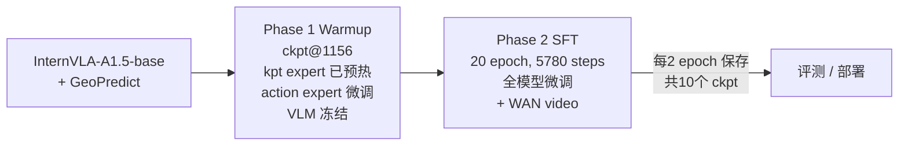
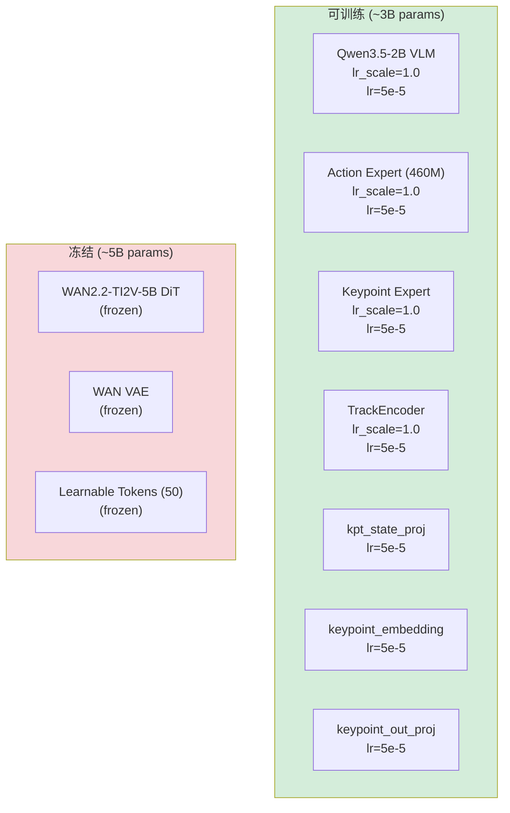
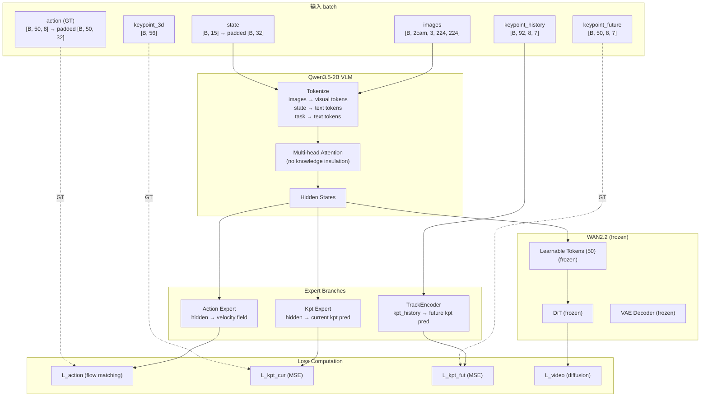

# Phase 2 SFT 实施落地方案与操作手册 — Franka 夹取方块入盒 (CubInBx) 4D

> **任务**: 在 Phase 1 Warmup checkpoint 基础上，对 `put_cube_into_box_lrb3_4D` 数据集执行 Phase 2 全模型 SFT 微调
> **数据**: `/B/Dta/put_cube_into_box_lrb3_4D/` — 56 episodes, 36,953 frames, 30fps, 8 keypoints × 7D
> **Warmup Checkpoint**: `/home/a26113/b/Ckp/4dwvlaFrkCubBx0924/2026_09_25_01_12_18-internvla_a1_5-frk3-cubbx-warmup/checkpoints/001156/pretrained_model`
> **机器**: 8× NVIDIA H200 (140GB)
> **虚拟环境**: `/B/VENV/itnvla15rbt20/`
> **代码库**: `/B/SRC/itvlaGpLibPlus/`
> **EXPR_NAME**: `4dwvlaFrkCubBx0924`
> **日期**: 2026-09-25

---

## 目录

- [1. 概述与目标](#1-概述与目标)
- [2. 可配置变量总表（换机器必读）](#2-可配置变量总表换机器必读)
- [3. 数据集详情](#3-数据集详情)
- [4. 训练步数与 Checkpoint 计算](#4-训练步数与-checkpoint-计算)
- [5. Phase 1 Warmup → Phase 2 SFT 配置对比](#5-phase-1-warmup--phase-2-sft-配置对比)
- [6. 有效超参详解](#6-有效超参详解)
- [7. 模块冻结与学习率策略](#7-模块冻结与学习率策略)
- [8. 损失函数](#8-损失函数)
- [9. 数据增强](#9-数据增强)
- [10. 数据流与脚本调用链](#10-数据流与脚本调用链)
- [11. 文件增删改清单](#11-文件增删改清单)
- [12. 关键路径汇总](#12-关键路径汇总)
- [13. 操作手册 — Pre-flight 环境准备](#13-操作手册--pre-flight-环境准备)
- [14. 操作手册 — Smoke 测试](#14-操作手册--smoke-测试)
- [15. 操作手册 — 正式训练与监控](#15-操作手册--正式训练与监控)
- [16. 测试与验收](#16-测试与验收)
- [17. 故障排查](#17-故障排查)
- [Appendix A: SFT Launch Script 完整代码](#appendix-a-sft-launch-script-完整代码)

---

## 1. 概述与目标

### 1.1 什么是 Phase 2 SFT

Phase 2 SFT 是 InternVLA-A1.5 + GeoPredict 训练流程的第二步。在 Phase 1 Warmup 已将 Keypoint Expert 和 TrackEncoder 在模态隔离条件下预热到可用状态后，Phase 2 **解冻 VLM 主干**，同时引入 **WAN 视频预测 loss**，实现全模型协同微调。

Phase 2 的核心变化（相对于 Phase 1）:

1. **解冻 VLM (Qwen3.5-2B)**: VLM 主干与 Action Expert、Keypoint Expert 同时更新
2. **加载 WAN2.2-TI2V-5B**: 引入 video foresight loss（WAN DiT 冻结，仅参与前向计算）
3. **关闭 Knowledge Insulation**: 允许 experts 访问 prefix context（图像 + 文本 + 状态）
4. **调整 loss 权重**: action loss 成为主导（10.0），kpt loss 降为辅助（1.0/1.5）
5. **使用 Warmup checkpoint 作为起点**: 不再从 InternVLA-A1.5-base 出发
6. **keypoint_history_max_len 从 90 改为 92**: 更长的关键点历史窗口



### 1.2 Phase 1 vs Phase 2 核心对比

| 维度 | Phase 1 Warmup | Phase 2 SFT |
|:---|:---|:---|
| 起点权重 | InternVLA-A1.5-base + GeoPredict RoboCasa | **Warmup ckpt@1156** |
| VLM (Qwen3.5-2B) | 冻结 (`train_expert_only=true`) | **训练** (`train_expert_only=false`) |
| Action Expert | 慢更新 (`lr_scale=0.04`) | **全速更新** (`lr_scale=1.0`) |
| Kpt Expert + TrackEncoder | 全速训练 | **继续训练** |
| WAN DiT | 不加载 (`action_loss_only=true`) | **加载但冻结** (`action_loss_only=false`) |
| VQA/FAST tokens | 不启用 | **不启用** (`enable_vqa_loss=false`, `use_fast_action_tokens=true` 仅数据准备) |
| Knowledge Insulation | 开启（模态隔离） | **关闭**（允许跨模态注意力） |
| `action_loss_weight` | 2.0 | **10.0** |
| `kpt_loss_weight` | 10.0 | **1.0** |
| `kpt_future_loss_weight` | 12.0 | **1.5** |
| `video_loss_weight` | N/A | **1.0** |
| `gradient_checkpointing` | false | **true**（因 WAN + 全模型训练显存压力） |
| `keypoint_history_max_len` | 90 | **92** |
| 数据增强 | 7 种（含 blackout@2.0），p=0.8 | **7 种（blackout@1.0），p_schedule** |
| Epoch | 4 | **20** |
| 每卡显存估计 | ~25–35 GB | **~100–110 GB** |

### 1.3 CubInBx 任务特征

| 维度 | 值 |
|:---|:---|
| 任务 | 用 Franka 机械臂夹取方块放入盒子 |
| 臂数 | 单臂 |
| DOF | 7 (arm) + 1 (gripper) |
| 关键点数 J | 8 (link1 ~ hand_tcp) |
| 关键点维度 D | 7 (px,py,pz,qx,qy,qz,qw) |
| 总 kpt 维度 J×D | 56 |
| 相机数 | 2 (global + wrist) |
| FPS | 30 |
| State 维度 | 15 (7 joints + gripper_width + ee_pos 3D + ee_quat 4D) |
| Action 维度 | 8 (7 joints + gripper_cmd) |
| Action 模式 | abs (绝对关节角) |

### 1.4 与 Franka plug_into_socket SFT 的差异

| 维度 | plug_into_socket SFT | **CubInBx SFT (本方案)** |
|:---|:---|:---|
| 数据集 | 100 episodes, 66577 frames | **56 episodes, 36953 frames** |
| 1 epoch | ~520 steps | **~289 steps** |
| 总步数 | 52100 (100 epoch) | **5780 (20 epoch)** |
| save_freq | 10420 (每 20 epoch) | **578 (每 2 epoch)** |
| keypoint_history_max_len | 200 | **92** |
| tokenize_state | false | **true** |
| knowledge_insulation (warmup) | true | **true** |
| 数据增强 | 无 (原始 SFT) | **有 (7 种 + p_schedule)** |
| EXPR_NAME | itvlagpFrkPlug0907 | **4dwvlaFrkCubBx0924** |

### 1.5 出处总览

| 内容 | 出处 |
|:---|:---|
| Phase 2 SFT 策略、冻结矩阵、loss 权重 | [`b/d/Frk/plug_p2sft.md`](../../../Frk/plug_p2sft.md) §1, §6, §7 |
| Franka plug SFT 执行日志 | [`b/d/Frk/plug_p2sft_0907LOG.md`](../../../Frk/plug_p2sft_0907LOG.md) |
| 数据增强 + p-schedule 方案 | [`b/d/Frk/expr/sftaug2/dtaug_p_sft2.md`](../../../Frk/expr/sftaug2/dtaug_p_sft2.md) |
| p-schedule 训练验证日志 | [`b/d/Frk/expr/sftaug2/dtaug_p_sft2ps0923LOG.md`](../../../Frk/expr/sftaug2/dtaug_p_sft2ps0923LOG.md) |
| SFT + dtaug 执行日志 | [`b/d/Frk/plug_p2sft_0907_dtaugLOG.md`](../../../Frk/plug_p2sft_0907_dtaugLOG.md) |
| CubInBx Phase 1 Warmup 方案 | [`b/d/Frk3/ds/cubinbx/cubbx_warmup1.md`](cubbx_warmup1.md) |
| CubInBx Phase 1 Warmup 执行日志 | [`b/d/Frk3/ds/cubinbx/cubbx_warmup1_0924LOG.md`](cubbx_warmup1_0924LOG.md) |
| FAST tokenizer 离线加载修复 | [`plug_p2sft_0907_dtaugLOG.md`](../../../Frk/plug_p2sft_0907_dtaugLOG.md) §1 E1 |
| TrackEncoder 天花板除法修复 | [`cubbx_warmup1_0924LOG.md`](cubbx_warmup1_0924LOG.md) Error 3 |
| bfloat16 keypoint 模块修复 | [`cubbx_warmup1_0924LOG.md`](cubbx_warmup1_0924LOG.md) Error 4 |

---

## 2. 可配置变量总表（换机器必读）

### 2.1 用户必须提供/确认的信息

| # | 信息 | 本机默认值 | 检查方式 |
|:---:|:---|:---|:---|
| 1 | Python 虚拟环境路径 | `/B/VENV/itnvla15rbt20` | `source <path>/bin/activate && python --version` |
| 2 | HF_HOME 路径 | `/B/VENV/hf_home` | `ls <path>/ckpts/InternVLA-A1.5-base` |
| 3 | GPU 数量与型号 | 8× H200 (140GB) | `nvidia-smi` |
| 4 | 数据集路径 | `/B/Dta/put_cube_into_box_lrb3_4D` | `cat <path>/meta/info.json \| jq .total_frames` |
| 5 | 代码库路径 | `/B/SRC/itvlaGpLibPlus` | `ls <path>/src/lerobot/scripts/lerobot_train.py` |
| 6 | Warmup checkpoint 路径 | 见 §2.2 | `ls <path>/model.safetensors` |
| 7 | WAN2.2-TI2V-5B 路径 | `${HF_HOME}/hub/Wan2.2-TI2V-5B` | `ls <path>/Wan2.2_VAE.pth` |

### 2.2 Launch Script 环境变量

| 变量 | 默认值 | 说明 |
|:---|:---|:---|
| `PRETRAINED_CKPT` | (见下方完整路径) | Warmup checkpoint 的 `pretrained_model/` 目录 |
| `STEPS` | 5780 | 总训练步数 (20 epochs) |
| `SAVE_FREQ` | 578 | 每 2 epoch 保存一次 |
| `LR` | 5e-5 | 峰值学习率 |
| `DECAY_LR` | 5e-6 | 最终学习率 |
| `SCHEDULER_WARMUP` | 289 | LR warmup 步数 (1 epoch) |
| `BATCH_SIZE` | 16 | 每 GPU batch size |
| `NUM_WORKERS` | 12 | DataLoader workers |
| `MASTER_PORT` | 36705 | DDP 通信端口 |
| `P_SCHEDULE` | `[0.2, 0.4, 0.6, 0.5, 0.3]` | 数据增强概率调度 |
| `P_EPOCH_INTERVAL` | 2 | p 切换 epoch 间隔 |
| `SMOKE` | (空) | 设为 1 进入 smoke 模式 |
| `WAN_SMOKE` | (空) | 设为 1 进入 WAN smoke 模式 |

Warmup checkpoint 完整路径:
```
/home/a26113/b/Ckp/4dwvlaFrkCubBx0924/2026_09_25_01_12_18-internvla_a1_5-frk3-cubbx-warmup/checkpoints/001156/pretrained_model
```

---

## 3. 数据集详情

### 3.1 数据集元信息

| 字段 | 值 |
|:---|:---|
| 路径 | `/B/Dta/put_cube_into_box_lrb3_4D/` |
| `repo_id` | `put_cube_into_box_lrb3_4D` |
| `codebase_version` | v3.0 |
| `robot_type` | `franka_cubinbx` |
| `total_episodes` | 56 |
| `total_frames` | 36,953 |
| `fps` | 30 |
| 平均 episode 长度 | ~660 frames (~22 秒) |

### 3.2 Features

| Feature | dtype | shape | 说明 |
|:---|:---|:---|:---|
| `observation.state` | float32 | [15] | joint1-7 + gripper_width + ee_pos_xyz + ee_quat_xyzw |
| `action` | float32 | [8] | joint1-7 + gripper_cmd |
| `observation.keypoint_3d` | float32 | [56] | 8 joints × 7D (px,py,pz,qx,qy,qz,qw) |
| `observation.images.global` | video | [480,640,3] | AV1 codec, 30fps, 全局相机 |
| `observation.images.wrist` | video | [480,640,3] | AV1 codec, 30fps, 手腕相机 |

### 3.3 Schema 映射

Schema 文件: [`src/lerobot/dataset_schemas/configs/franka_cubinbx.yaml`](../../../../src/lerobot/dataset_schemas/configs/franka_cubinbx.yaml)

```yaml
robot_type: franka_cubinbx
action_mask_spec: [7, -1]    # 7 arm joints (flow matching) + 1 gripper (独立处理)
feature_mapping:
  observation.state:
    - observation.state       # [15] → 内部 padded 到 [32]
  action:
    - action                  # [8]  → 内部 padded 到 [32]
image_mapping:
  observation.images.global: observation.images.image0   # 映射到 image0
  observation.images.wrist: observation.images.image1    # 映射到 image1
  # image2 自动填充为全 1 (mask=False)，模型默认支持 3 views
```

### 3.4 Stats

Stats 文件: `/B/Dta/put_cube_into_box_lrb3_4D/meta/stats.json`

在 Phase 1 Warmup 阶段计算生成（见 [`cubbx_warmup1_0924LOG.md`](cubbx_warmup1_0924LOG.md) Error 2），覆盖:
- `observation.state` (15D): 包含关节角、gripper 宽度、末端位姿
- `action` (8D): 7 关节角 + gripper 命令
- `observation.keypoint_3d` (56D): 8 关键点的位置和旋转四元数
- `observation.images.*`: 默认 [0,1] 范围

### 3.5 HF 数据集 Symlink

```
/B/VENV/hf_home/lerobot/put_cube_into_box_lrb3_4D → /B/Dta/put_cube_into_box_lrb3_4D
```

在 Warmup 阶段已创建。

---

## 4. 训练步数与 Checkpoint 计算

### 4.1 核心计算

$$\text{steps\_per\_epoch} = \left\lceil \frac{N_{\text{frames}}}{\text{EBS}} \right\rceil = \left\lceil \frac{36953}{128} \right\rceil = 289$$

其中 $\text{EBS} = \text{batch\_size} \times \text{num\_gpus} = 16 \times 8 = 128$.

| 参数 | 公式 | 值 |
|:---|:---|:---|
| 1 epoch | ceil(36953 / 128) | **289 steps** |
| 总步数 (20 epoch) | 289 × 20 | **5,780 steps** |
| save_freq (每 2 epoch) | 289 × 2 | **578 steps** |
| scheduler_warmup (1 epoch) | 289 × 1 | **289 steps** |
| scheduler_decay | 总步数 | **5,780 steps** |

### 4.2 Checkpoint 保存点

| # | Step | Epoch | 备注 |
|:---:|:---:|:---:|:---|
| 1 | 578 | 2 | |
| 2 | 1,156 | 4 | |
| 3 | 1,734 | 6 | |
| 4 | 2,312 | 8 | |
| 5 | 2,890 | 10 | 半程 |
| 6 | 3,468 | 12 | |
| 7 | 4,046 | 14 | |
| 8 | 4,624 | 16 | |
| 9 | 5,202 | 18 | |
| 10 | 5,780 | 20 | **最终** |

### 4.3 资源估算

| 项目 | 估算 |
|:---|:---|
| 训练速度 | ~0.22–0.24 it/s @ 8×H200（参考 plug SFT 实测 0.23 it/s） |
| 预计耗时 | 5780 / 0.23 / 3600 ≈ **7 小时** |
| 每卡显存 | ~100–110 GB / 143 GB ≈ **71%**（参考 plug SFT 实测 101.6 GB/卡） |
| 单个 checkpoint 大小 | ~18 GB（model 5.9G + training_state ~12G） |
| 总 checkpoint 占用 | 10 × 18 GB ≈ **180 GB** |

---

## 5. Phase 1 Warmup → Phase 2 SFT 配置对比

### 5.1 Warmup Checkpoint 关键配置（起点）

以下值来自 Warmup checkpoint 的 `config.json`:

```
train_expert_only: true              → SFT 改为 false
action_loss_only: true               → SFT 改为 false
enable_vqa_loss: false               → SFT 保持 false
knowledge_insulation: true           → SFT 改为 false
knowledge_insulation_kpt: true       → SFT 改为 false
gradient_checkpointing: false        → SFT 改为 true
action_expert_lr_scale: 0.04         → SFT 改为 1.0
action_loss_weight: 2.0              → SFT 改为 10.0
kpt_loss_weight: 10.0                → SFT 改为 1.0
kpt_future_loss_weight: 12.0         → SFT 改为 1.5
use_fast_action_tokens: false        → SFT 改为 true (dataset 配置)
init_kpt_expert_from_action: true    → SFT 改为 false (已初始化)
keypoint_history_max_len: 90         → SFT 改为 92
tokenize_state: true                 → SFT 不变 (保持 true)
freeze_learnable_tokens: true        → SFT 不变
freeze_wan_dit: true                 → SFT 不变
kpt_4d_mode: pos_rot                 → SFT 不变
num_keypoint_joints: 8               → SFT 不变
```

### 5.2 keypoint_history_max_len: 90 → 92 兼容性分析

`keypoint_history_max_len` 影响 TrackEncoder 中 CrossAttentionBlock 的 TimeEmbedding 大小:

- **Warmup (90)**: PointPatchEmbedding 将 90 帧 pad 到 92 (下一个 patch_size=4 的倍数)，产生 23 个 patch。天花板除法: $(90+4-1)//4 = 23$。TimeEmbedding 表大小: `[23, embed_dim]`。
- **SFT (92)**: 92 本身是 patch_size=4 的倍数，不需要 padding，同样产生 23 个 patch。天花板除法: $(92+4-1)//4 = 23$。TimeEmbedding 表大小: `[23, embed_dim]`。

**两者 patch 数完全一致 (23)，权重形状无变化，Warmup 权重可直接加载。**

改为 92 的好处: 避免 PointPatchEmbedding 内部的隐式 padding (90→92)，使配置值与实际行为一致，减少混淆。

---

## 6. 有效超参详解

### 6.1 完整超参表

下表列出 SFT 训练涉及的 **所有** 有效超参，包括值、原因和设置位置。

| # | 参数 | 值 | 原因 | 设置位置 |
|:---:|:---|:---|:---|:---|
| **训练控制** | | | | |
| 1 | `steps` | 5780 | 20 epochs × 289 steps/epoch | Launch script `STEPS` |
| 2 | `batch_size` | 16 | 每 GPU batch; EBS=16×8=128 | Launch script `BATCH_SIZE` |
| 3 | `save_freq` | 578 | 每 2 epoch 保存 | Launch script `SAVE_FREQ` |
| 4 | `log_freq` | 50 | 日志打印间隔 | Launch script `LOG_FREQ` |
| 5 | `num_workers` | 12 | DataLoader 并行度 | Launch script `NUM_WORKERS` |
| 6 | `seed` | 42 | 可复现性 | Launch script 固定值 |
| **优化器** | | | | |
| 7 | `optimizer_lr` | 5e-5 | 峰值 LR，沿用 plug SFT | CLI `--policy.optimizer_lr` |
| 8 | `optimizer_betas` | [0.9, 0.95] | AdamW 默认 | Checkpoint 继承 |
| 9 | `optimizer_eps` | 1e-8 | AdamW 默认 | Checkpoint 继承 |
| 10 | `optimizer_weight_decay` | 0.01 | 标准正则化 | CLI `--policy.optimizer_weight_decay` |
| 11 | `optimizer_grad_clip_norm` | 1.0 | 梯度裁剪，防止爆炸 | CLI `--policy.optimizer_grad_clip_norm` |
| **调度器** | | | | |
| 12 | `scheduler_warmup_steps` | 289 | 1 epoch LR warmup | CLI `--policy.scheduler_warmup_steps` |
| 13 | `scheduler_decay_steps` | 5780 | cosine 衰减到 `decay_lr` | CLI `--policy.scheduler_decay_steps` |
| 14 | `scheduler_decay_lr` | 5e-6 | 最终 LR (峰值的 1/10) | CLI `--policy.scheduler_decay_lr` |
| **模型架构** | | | | |
| 15 | `policy.type` | `internvla_a1_5` | 策略选择 | CLI |
| 16 | `pretrained_path` | Warmup ckpt | 从 Warmup 继续 | CLI `--policy.pretrained_path` |
| 17 | `vlm_model_name_or_path` | `Qwen/Qwen3.5-2B` | VLM backbone (从 HF 缓存加载 tokenizer) | Checkpoint 继承 |
| 18 | `dtype` | `bfloat16` | 混合精度训练 | Checkpoint 继承 |
| 19 | `image_resolution` | [224, 224] | 输入图像尺寸 | Checkpoint 继承 |
| 20 | `chunk_size` / `n_action_steps` | 50 | 预测 50 步未来动作 | Checkpoint 继承 |
| 21 | `max_state_dim` / `max_action_dim` | 32 | 内部 padding 维度 | Checkpoint 继承 |
| 22 | `num_learnable_tokens` | 50 | Foresight tokens 数量 | Checkpoint 继承 |
| 23 | `tokenizer_max_length` | 48 | Tokenizer padding 长度 | Checkpoint 继承 |
| **训练模式** | | | | |
| 24 | `train_expert_only` | **false** | 解冻 VLM | CLI `--policy.train_expert_only=false` |
| 25 | `action_loss_only` | **false** | 加载 WAN，启用 video loss | CLI `--policy.action_loss_only=false` |
| 26 | `enable_vqa_loss` | **false** | 不启用 VQA/FAST token loss | CLI `--policy.enable_vqa_loss=false` |
| 27 | `gradient_checkpointing` | **true** | 全模型+WAN 需要节省显存 | CLI `--policy.gradient_checkpointing=true` |
| **Knowledge Insulation** | | | | |
| 28 | `knowledge_insulation` | **false** | SFT 允许 action expert 看 prefix | CLI `--policy.knowledge_insulation=false` |
| 29 | `knowledge_insulation_kpt` | **false** | SFT 允许 kpt expert 看 prefix | CLI `--policy.knowledge_insulation_kpt=false` |
| **Loss 权重** | | | | |
| 30 | `action_loss_weight` | **10.0** | 主导 loss (flow matching) | CLI `--policy.action_loss_weight=10.0` |
| 31 | `kpt_loss_weight` | **1.0** | 辅助 (warmup 已预热) | CLI `--policy.kpt_loss_weight=1.0` |
| 32 | `kpt_future_loss_weight` | **1.5** | 辅助 (稍高于当前 kpt) | CLI `--policy.kpt_future_loss_weight=1.5` |
| 33 | `video_loss_weight` | **1.0** | WAN 视频预测 loss | CLI `--policy.video_loss_weight=1.0` |
| 34 | `lambda_vqa` | **1.0** | VQA/FAST token loss 系数 (enable_vqa_loss=false 时无效) | CLI `--policy.lambda_vqa=1.0` |
| **学习率缩放** | | | | |
| 35 | `vlm_lr_scale` | **1.0** | VLM 全速学习 | CLI `--policy.vlm_lr_scale=1.0` |
| 36 | `action_expert_lr_scale` | **1.0** | action expert 全速 (warmup 为 0.04) | CLI `--policy.action_expert_lr_scale=1.0` |
| 37 | `kpt_expert_lr_scale` | **1.0** | kpt expert 全速 | CLI `--policy.kpt_expert_lr_scale=1.0` |
| 38 | `track_encoder_lr_scale` | **1.0** | TrackEncoder 全速 | CLI `--policy.track_encoder_lr_scale=1.0` |
| **关键点配置** | | | | |
| 39 | `enable_keypoint_predictor` | true | 启用 kpt 分支 | CLI |
| 40 | `num_keypoint_joints` | 8 | 8 个关键点 | CLI |
| 41 | `kpt_4d_mode` | `pos_rot` | 7D (位置 + 旋转四元数) | CLI |
| 42 | `keypoint_history_max_len` | **92** | 关键点历史窗口 (改自 warmup 的 90) | CLI (policy + dataset) |
| 43 | `keypoint_track_patch_size` | 4 | TrackEncoder patch 大小 | Checkpoint 继承 |
| 44 | `keypoint_track_embed_dim` | 256 | TrackEncoder 嵌入维度 | Checkpoint 继承 |
| 45 | `keypoint_track_input_dim` | 7 | 每关键点 7D 输入 | Checkpoint 继承 |
| 46 | `init_kpt_expert_from_action` | **false** | 已在 warmup 初始化 | CLI |
| 47 | `freeze_keypoint_modules` | **false** | 继续训练 kpt 模块 | CLI |
| 48 | `kpt_rot_loss_weight` | 1.0 | 旋转 loss 与位置 loss 等权 | Checkpoint 继承 |
| **冻结模块** | | | | |
| 49 | `freeze_wan_dit` | true | WAN DiT 始终冻结 | CLI |
| 50 | `freeze_learnable_tokens` | true | Foresight tokens 冻结 | CLI |
| **视频分支** | | | | |
| 51 | `num_video_frames` | 4 | WAN 视频预测帧数 | CLI |
| 52 | `video_height` / `video_width` | 224 / 224 | WAN 视频分辨率 | Checkpoint 继承 |
| 53 | `video_micro_batch_size` | 1 | WAN 每次处理 1 个样本 (防 OOM) | Checkpoint 继承 |
| 54 | `video_precision` | `bfloat16` | WAN 计算精度 | Checkpoint 继承 |
| **数据集** | | | | |
| 55 | `dataset.type` | `internvla_a1_5` | 数据集处理类型 | CLI |
| 56 | `dataset.repo_id` | `put_cube_into_box_lrb3_4D` | HF repo ID | CLI |
| 57 | `dataset.action_mode` | `abs` | 绝对关节角 | CLI |
| 58 | `dataset.tokenize_state` | **true** | 状态离散化为文本 token | CLI |
| 59 | `dataset.use_fast_action_tokens` | **true** | 启用 FAST 动作 token 监督 | CLI |
| 60 | `dataset.use_external_stats` | false | 使用数据集自带 stats | CLI |
| 61 | `dataset.video_backend` | `torchcodec` | 视频解码后端 | CLI |
| **数据增强** | | | | |
| 62 | `image_transforms.enable` | true | 启用图像增强 | CLI |
| 63 | `image_transforms.max_num_transforms` | 3 | 每帧最多应用 3 种 | CLI |
| 64 | `image_transforms.p_schedule` | `[0.2,0.4,0.6,0.5,0.3]` | 增强概率调度 (见 §9) | CLI |
| 65 | `image_transforms.p_epoch_interval` | 2 | 每 2 epoch 切换 p | CLI |

---

## 7. 模块冻结与学习率策略

### 7.1 SFT 冻结矩阵



### 7.2 学习率时间线

```
LR
5e-5 ┤                 ╭─────────╮
     │               ╱             ╲
     │             ╱                 ╲
     │           ╱                     ╲
     │         ╱                         ╲
5e-6 ┤───────╱                             ╲──────
     ├─────┬─────┬─────┬─────┬─────┬─────┬──────
     0    289   1K    2K    3K    4K    5K   5780
         warm              steps
         up
```

- **Warmup**: 0 → 5e-5 (线性, 289 steps = 1 epoch)
- **Decay**: 5e-5 → 5e-6 (cosine, 289 → 5780 steps)

### 7.3 与 Warmup 的 LR 策略差异

| 维度 | Warmup | SFT |
|:---|:---|:---|
| VLM | 冻结 (lr=0) | **lr=5e-5** × vlm_lr_scale=1.0 |
| Action Expert | lr=5e-5 × 0.04 = **2e-6** | lr=5e-5 × 1.0 = **5e-5** (×25 提速) |
| Kpt Expert | lr=5e-5 × 1.0 = **5e-5** | lr=5e-5 × 1.0 = **5e-5** (不变) |
| TrackEncoder | lr=5e-5 × 1.0 = **5e-5** | lr=5e-5 × 1.0 = **5e-5** (不变) |

---

## 8. 损失函数

### 8.1 SFT 总 loss 公式

$$L_{\text{SFT}} = 10.0 \cdot L_{\text{action}} + 1.0 \cdot L_{\text{kpt\_cur}} + 1.5 \cdot L_{\text{kpt\_fut}} + 1.0 \cdot L_{\text{video}}$$

> **注意**: 本方案 `enable_vqa_loss=false`，不启用 VQA/FAST 语言 token loss。

各分量:

| 分量 | 计算方式 | 权重 | 输出层 |
|:---|:---|:---|:---|
| $L_{\text{action}}$ | Flow matching (MSE on velocity field) | 10.0 | action_expert → flow head |
| $L_{\text{kpt\_cur}}$ | MSE (当前 kpt 预测 vs GT) + rot loss | 1.0 | kpt_expert → keypoint_out_proj |
| $L_{\text{kpt\_fut}}$ | MSE (未来 kpt trajectory 预测 vs GT) + rot loss | 1.5 | TrackEncoder → kpt_out_proj |
| $L_{\text{video}}$ | WAN DiT diffusion loss (frozen DiT, learnable tokens 梯度) | 1.0 | VLM → learnable tokens → WAN DiT |

### 8.2 与 Warmup loss 权重的对比

| 分量 | Warmup 权重 | SFT 权重 | 变化原因 |
|:---|:---|:---|:---|
| action | 2.0 | **10.0** | SFT 阶段 action 成为主导目标 |
| kpt_cur | 10.0 | **1.0** | kpt 已在 warmup 预热好，降为辅助 |
| kpt_fut | 12.0 | **1.5** | 同上 |
| video | N/A (未加载) | **1.0** | SFT 引入视频预测 |
| VQA | N/A (未启用) | **N/A (未启用)** | `enable_vqa_loss=false` |

### 8.3 7D Keypoint Loss 计算细节

当 `kpt_4d_mode=pos_rot` 时，keypoint loss 分为位置分量和旋转分量:

$$L_{\text{kpt}} = \text{MSE}(p_{\text{pred}}, p_{\text{gt}}) + \text{kpt\_rot\_loss\_weight} \cdot \text{MSE}(q_{\text{pred}}, q_{\text{gt}})$$

其中 $p \in \mathbb{R}^{3}$ 是位置，$q \in \mathbb{R}^{4}$ 是旋转四元数，`kpt_rot_loss_weight=1.0` 表示位置和旋转等权。

**keypoint_out_proj 的精度**: `keypoint_out_proj` 的输入在 loss 计算前被显式 cast 为 float32（[`modeling_internvla_a1_5.py:1965`](../../../../src/lerobot/policies/internvla_a1_5/modeling_internvla_a1_5.py#L1965)），因此 `keypoint_out_proj` 不包含在 bfloat16 cast 中（见 [`cubbx_warmup1_0924LOG.md`](cubbx_warmup1_0924LOG.md) Error 4）。

### 8.4 预期 loss 范围

参考 plug SFT 早期 loss（从 warmup checkpoint 启动，本方案不含 VQA loss）:

| 分量 | step 50 参考 | step 100 参考 | 说明 |
|:---|:---|:---|:---|
| loss (total) | ~0.5–1.5 | ~0.5–1.0 | 无 VQA loss，主要由 action + video 贡献 |
| loss_action | ~0.02–0.03 | ~0.03–0.04 | warmup 已学好 action，SFT 初始很低 |
| loss_video | ~0.3–0.5 | ~0.3–0.5 | WAN video loss 相对稳定 |
| loss_kpt_cur | ~0.001–0.003 | ~0.002–0.004 | warmup 已预热，初始很低 |
| loss_kpt_fut | ~0.01–0.03 | ~0.02–0.04 | 同上 |
| grad_norm | ~5–20 | ~5–15 | 无 VQA 梯度，初始梯度较小 |

---

## 9. 数据增强

### 9.1 增强策略

SFT 阶段使用 7 种增强（与 warmup 相同的 transform 种类），但调整了参数:

| Transform | 类型 | weight | 参数 | 与 warmup 差异 |
|:---|:---|:---:|:---|:---|
| brightness | ColorJitter | 1.0 | [0.8, 1.2] | 更温和（warmup: [0.6,1.4]） |
| contrast | ColorJitter | 1.0 | [0.8, 1.2] | 更温和（warmup: [0.6,1.4]） |
| saturation | ColorJitter | 1.0 | [0.5, 1.5] | 更温和（warmup: [0.4,1.6]） |
| hue | ColorJitter | 1.0 | [-0.05, 0.05] | 不变 |
| sharpness | SharpnessJitter | 1.0 | [0.5, 1.5] | 不变 |
| affine | RandomAffine | 0.2 | degrees=[-5,5], translate=[0.05,0.05], scale=[0.95,1.05] | 不变 |
| blackout | RandomBlackout | 1.0 | noise_scale=0.01 | 降权（warmup: 2.0） |

总权重 = 6.2。各 transform 被选中的归一化概率:
- 标准 transform: $1.0 / 6.2 \approx 16.1\%$
- affine: $0.2 / 6.2 \approx 3.2\%$
- blackout: $1.0 / 6.2 \approx 16.1\%$ (warmup 为 ~30%)

`max_num_transforms=3`: 每帧根据权重随机选 3 种 transform 应用。

### 9.2 p-schedule (增强概率调度)

使用 [`dtaug_p_sft2.md`](../../../Frk/expr/sftaug2/dtaug_p_sft2.md) 中实现的 p-schedule 机制:

$$\text{schedule\_idx} = \min\!\left(\left\lfloor \frac{\text{epoch\_count}}{\text{p\_epoch\_interval}} \right\rfloor,\; |\text{p\_schedule}| - 1\right)$$

配置: `p_schedule=[0.2, 0.4, 0.6, 0.5, 0.3]`, `p_epoch_interval=2`

| Epoch 区间 | Step 区间 | schedule_idx | p 值 | 说明 |
|:---|:---|:---:|:---:|:---|
| 0 – 1 | 0 – 578 | 0 | **0.2** | 低增强，模型适应新 loss 配置 |
| 2 – 3 | 578 – 1,156 | 1 | **0.4** | 逐步加强 |
| 4 – 5 | 1,156 – 1,734 | 2 | **0.6** | 峰值增强，强化泛化 |
| 6 – 7 | 1,734 – 2,312 | 3 | **0.5** | 回落 |
| 8 – 19 | 2,312 – 5,780 | 4 | **0.3** | 低增强，收敛到真实分布 |

p_schedule 切换日志示例:
```
INFO [ImageTransforms] p schedule: 0.20 → 0.40 (epoch 2, interval 2, schedule idx 1/4)
INFO [ImageTransforms] p schedule: 0.40 → 0.60 (epoch 4, interval 2, schedule idx 2/4)
INFO [ImageTransforms] p schedule: 0.60 → 0.50 (epoch 6, interval 2, schedule idx 3/4)
INFO [ImageTransforms] p schedule: 0.50 → 0.30 (epoch 8, interval 2, schedule idx 4/4)
```

### 9.3 增强一致性

通过 `begin_sample()` 机制保证同一 sample 的所有 camera 视角获得一致的增强/跳过决策:

| 范围 | 一致性 | 机制 |
|:---|:---|:---|
| 同一 camera 的多帧 | ✅ 相同 affine 参数 | torchvision v2 batch 行为 |
| 同一 sample 的多 camera | ✅ 相同增强/跳过 | `begin_sample()` 缓存 |
| 不同 sample | ❌ 独立随机 | 预期行为 |
| p 在 epoch 切换点 | ✅ 所有 rank 同步 | `train_tracker.epochs` 一致 |

### 9.4 TFS_CONFIG 格式

数据增强配置通过 draccus 的原子 dict 字段传递，必须写成单行 YAML 字符串:

```bash
TFS_CONFIG='{brightness: {type: ColorJitter, weight: 1.0, kwargs: {brightness: [0.8, 1.2]}}, contrast: {type: ColorJitter, weight: 1.0, kwargs: {contrast: [0.8, 1.2]}}, saturation: {type: ColorJitter, weight: 1.0, kwargs: {saturation: [0.5, 1.5]}}, hue: {type: ColorJitter, weight: 1.0, kwargs: {hue: [-0.05, 0.05]}}, sharpness: {type: SharpnessJitter, weight: 1.0, kwargs: {sharpness: [0.5, 1.5]}}, affine: {type: RandomAffine, weight: 0.2, kwargs: {degrees: [-5, 5], translate: [0.05, 0.05], scale: [0.95, 1.05]}}, blackout: {type: RandomBlackout, weight: 1.0, kwargs: {noise_scale: 0.01}}}'
```

**重要**: draccus 的 `tfs` 字段类型为 `dict[str, ImageTransformConfig]`，是原子字段——只能整体替换。Launch script 中用 `"--dataset.image_transforms.tfs=${TFS_CONFIG}"` 传入。

---

## 10. 数据流与脚本调用链

### 10.1 训练启动调用链

```
bash b/s/Frk3/frk3_cubbx_sft_launch.sh
  └─ python -m accelerate.commands.launch --num_processes=8 --main_process_port=36705
       └─ src/lerobot/scripts/lerobot_train.py  (entry point)
            ├─ draccus.wrap(TrainPipelineConfig)  → CLI 解析
            ├─ make_dataset(cfg)                   → TransformedLeRobotDataset
            │    ├─ LeRobotDataset(repo_id="put_cube_into_box_lrb3_4D")
            │    ├─ load_stats() → meta/stats.json
            │    └─ ImageTransforms(cfg.image_transforms) → 7 transforms + p_schedule
            ├─ make_policy(cfg)                    → InternVLAA15Policy
            │    ├─ InternVLAA15(config)
            │    │    ├─ Qwen3.5-2B VLM (from pretrained_path)
            │    │    ├─ InternVLAA15WithExpertModel
            │    │    │    ├─ action_expert (from pretrained_path)
            │    │    │    └─ kpt_expert (from pretrained_path)
            │    │    ├─ TrackEncoder (from pretrained_path)
            │    │    ├─ WAN2.2 DiT + VAE (from wan_checkpoint_path, frozen)
            │    │    └─ bfloat16 cast for [track_encoder, kpt_state_proj, keypoint_embedding]
            │    └─ set_requires_grad()
            └─ training loop
                 ├─ for step in range(0, 5780):
                 │    ├─ batch = next(dataloader)
                 │    │    └─ TransformedLeRobotDataset.__getitem__()
                 │    │         ├─ begin_sample()  ← p_schedule gate
                 │    │         ├─ ImageTransforms(global_cam)
                 │    │         └─ ImageTransforms(wrist_cam)
                 │    ├─ loss, output = policy.forward(batch)
                 │    ├─ loss.backward()
                 │    ├─ optimizer.step()
                 │    ├─ train_tracker.step()
                 │    ├─ _update_augment_p_on_epoch(dataset, epoch)  ← p 切换
                 │    └─ if step % 578 == 0: save_checkpoint()
                 └─ save_final_checkpoint()
```

### 10.2 Forward Pass 数据流



### 10.3 Backward Pass 梯度流

| 模块 | 是否接收梯度 | 梯度来源 |
|:---|:---|:---|
| VLM (Qwen3.5-2B) | ✅ | L_action + L_kpt + L_video 的全部梯度 (无 L_vqa) |
| Action Expert | ✅ | L_action |
| Kpt Expert | ✅ | L_kpt_cur |
| TrackEncoder | ✅ | L_kpt_fut |
| kpt_state_proj | ✅ | L_kpt_cur + L_kpt_fut |
| keypoint_embedding | ✅ | L_kpt_cur + L_kpt_fut |
| keypoint_out_proj | ✅ (float32) | L_kpt_cur + L_kpt_fut |
| WAN DiT | ❌ (frozen) | — |
| WAN VAE | ❌ (frozen) | — |
| Learnable Tokens | ❌ (frozen) | — |

`gradient_checkpointing=true` 在 VLM 的 attention layers 上启用，以 ~30% 的计算换取 ~40% 的显存节省。

### 10.4 关键代码位置

| 功能 | 文件 | 行号区间 |
|:---|:---|:---|
| 训练入口 | `src/lerobot/scripts/lerobot_train.py` | 全文件 |
| 策略 forward | `src/lerobot/policies/internvla_a1_5/modeling_internvla_a1_5.py` | ~L800–L1200 |
| Loss 计算 | 同上 | ~L1900–L2100 |
| bfloat16 cast | 同上 | ~L1064–L1071 |
| TrackEncoder | `src/lerobot/policies/internvla_a1_5/keypoints.py` | ~L200–L300 |
| 天花板除法修复 | 同上 | L274 |
| 数据增强 | `src/lerobot/datasets/transforms.py` | ~L165–L280 |
| p_schedule | 同上 | `update_p_on_epoch()`, `begin_sample()` |
| FAST tokenizer 离线加载 | `src/lerobot/policies/internvla_a1_5/transform_internvla_a1_5.py` | `_resolve_fast_local_dir()` |
| Dataset __getitem__ | `src/lerobot/datasets/lerobot_dataset.py` | ~L1076 |
| p_schedule 训练循环集成 | `src/lerobot/scripts/lerobot_train.py` | `_find_image_transforms()`, `_update_augment_p_on_epoch()` |

---

## 11. 文件增删改清单

### 11.1 新增文件

| 文件 | 内容 | 原因 |
|:---|:---|:---|
| `b/s/Frk3/frk3_cubbx_sft_launch.sh` | SFT 启动脚本 (含 smoke/production 模式、监控、bigmatrix) | 本方案的启动入口 |
| `b/d/Frk3/ds/cubinbx/cubbx_sft1.md` | 本实施落地方案文档 | 文档 |

### 11.2 已有修改（无需再改）

以下文件已在之前的 session 中修改完成，SFT 直接使用:

| 文件 | 修改内容 | 修改时间 | 相关日志 |
|:---|:---|:---|:---|
| `src/lerobot/policies/internvla_a1_5/keypoints.py` L274 | 天花板除法修复: `max_seq_len // patch_size` → `(max_seq_len + patch_size - 1) // patch_size` | Warmup session | [`cubbx_warmup1_0924LOG.md`](cubbx_warmup1_0924LOG.md) E3 |
| `src/lerobot/policies/internvla_a1_5/modeling_internvla_a1_5.py` L1064-1071 | bfloat16 cast: `track_encoder`, `kpt_state_proj`, `keypoint_embedding` | Warmup session | [`cubbx_warmup1_0924LOG.md`](cubbx_warmup1_0924LOG.md) E4 |
| `src/lerobot/policies/internvla_a1_5/transform_internvla_a1_5.py` | FAST tokenizer 离线加载: `_resolve_fast_local_dir()` + `local_files_only=True` | dtaug session | [`plug_p2sft_0907_dtaugLOG.md`](../../../Frk/plug_p2sft_0907_dtaugLOG.md) E1 |
| `src/lerobot/datasets/transforms.py` | p_schedule: `ImageTransformsConfig` 加 `p_schedule`/`p_epoch_interval` 字段; `ImageTransforms` 加 `update_p_on_epoch()`/`begin_sample()`/forward 门控; `disabled_tfs` 字段; `RandomBlackout` transform | dtaug/dtaug2ps/warmup sessions | [`dtaug_p_sft2.md`](../../../Frk/expr/sftaug2/dtaug_p_sft2.md) §2 |
| `src/lerobot/datasets/lerobot_dataset.py` L1076 | `begin_sample()` 调用 | dtaug2ps session | 同上 §2.2 |
| `src/lerobot/datasets/streaming_dataset.py` L338 | `begin_sample()` 调用 | dtaug2ps session | 同上 |
| `src/lerobot/scripts/lerobot_train.py` | `_find_image_transforms()` + `_update_augment_p_on_epoch()` + epoch 跟踪 | dtaug2ps session | 同上 §2.2 |

### 11.3 数据文件（已就绪）

| 文件 | 状态 | 修改时间 |
|:---|:---|:---|
| `/B/Dta/put_cube_into_box_lrb3_4D/meta/stats.json` | 已创建 | Warmup session |
| `/B/Dta/put_cube_into_box_lrb3_4D/meta/episodes/chunk-000/file-000.parquet` | 已修补 (加 index 列) | Warmup session |
| `src/lerobot/dataset_schemas/configs/franka_cubinbx.yaml` | 已创建 | Warmup session |
| `/B/VENV/hf_home/lerobot/put_cube_into_box_lrb3_4D` → symlink | 已创建 | Warmup session |

### 11.4 SFT 不需要修改的代码

本 SFT 方案 **不需要修改任何已有源码**。所有必要的代码修改（天花板除法、bfloat16 cast、FAST 离线加载、p_schedule、RandomBlackout、begin_sample）均已在之前的 session 中完成并验证。

唯一需要新建的是 launch script (`b/s/Frk3/frk3_cubbx_sft_launch.sh`)。

---

## 12. 关键路径汇总

### 12.1 输入路径

| 类型 | 路径 |
|:---|:---|
| 代码库 | `/B/SRC/itvlaGpLibPlus/` |
| 虚拟环境 | `/B/VENV/itnvla15rbt20/` |
| 数据集 | `/B/Dta/put_cube_into_box_lrb3_4D/` |
| 数据集 stats | `/B/Dta/put_cube_into_box_lrb3_4D/meta/stats.json` |
| HF symlink | `/B/VENV/hf_home/lerobot/put_cube_into_box_lrb3_4D` |
| Schema | `src/lerobot/dataset_schemas/configs/franka_cubinbx.yaml` |
| Warmup checkpoint | `/home/a26113/b/Ckp/4dwvlaFrkCubBx0924/2026_09_25_01_12_18-internvla_a1_5-frk3-cubbx-warmup/checkpoints/001156/pretrained_model` |
| WAN 权重 | `/B/VENV/hf_home/hub/Wan2.2-TI2V-5B/` |
| WAN VAE | `/B/VENV/hf_home/hub/Wan2.2-TI2V-5B/Wan2.2_VAE.pth` |
| FAST tokenizer (缓存) | `/B/VENV/hf_home/hub/models--physical-intelligence--fast/snapshots/...` |
| Qwen3.5-2B (缓存) | HF 缓存自动解析 |

### 12.2 输出路径

| 类型 | 路径模板 | 说明 |
|:---|:---|:---|
| Checkpoint 根目录 | `~/b/Ckp/4dwvlaFrkCubBx0924/<JOB_NAME>/` | `<JOB_NAME>` = `<STAMP>-internvla_a1_5-frk3-cubbx-sft` |
| 单个 checkpoint | `~/b/Ckp/4dwvlaFrkCubBx0924/<JOB>/checkpoints/<STEP>/` | 含 `pretrained_model/` + `training_state/` |
| 模型权重 | `.../checkpoints/<STEP>/pretrained_model/model.safetensors` | ~5.9 GB |
| 模型配置 | `.../checkpoints/<STEP>/pretrained_model/config.json` | 含所有超参 |
| 训练配置 | `.../checkpoints/<STEP>/pretrained_model/train_config.json` | 含完整训练配置 |
| 归一化 stats | `.../checkpoints/<STEP>/pretrained_model/stats.json` | 数据集 stats 副本 |
| 训练日志 | `/B/Log/4dwvlaFrkCubBx0924/<JOB_STAMP>/train.log` | 含 loss、lr、grad_norm |
| Wrapper 日志 | `/tmp/frk3_cubbx_sft_wrapper.log` | launch script 的 stdout/stderr |
| WandB 离线日志 | `~/b/Ckp/4dwvlaFrkCubBx0924/<JOB>/wandb/` | 离线模式 |
| 日志归档 | `~/b/Ckp/4dwvlaFrkCubBx0924_sft_LOG_<ts>.tar` | 训练完成后自动打包 |

### 12.3 Launch Script 路径

| 文件 | 路径 |
|:---|:---|
| SFT launch script | `b/s/Frk3/frk3_cubbx_sft_launch.sh` |
| Warmup launch script (参考) | `b/s/Frk3/frk3_cubbx_warmup_launch.sh` |
| SFT 方案文档 | `b/d/Frk3/ds/cubinbx/cubbx_sft1.md` |

---

## 13. 操作手册 — Pre-flight 环境准备

### 13.1 激活虚拟环境

```bash
source /B/VENV/itnvla15rbt20/bin/activate
python --version  # 预期: 3.11.x
```

### 13.2 验证依赖

```bash
python -c "import torch; print(f'torch {torch.__version__} cuda {torch.cuda.is_available()} GPUs {torch.cuda.device_count()}')"
# 预期: torch 2.10.0+cu128 cuda True GPUs 8

python -c "import transformers; print(f'transformers {transformers.__version__}')"
# 预期: transformers 5.2.0

python -c "import lerobot; print('lerobot OK')"
# 预期: lerobot OK
```

### 13.3 验证 Editable Install

```bash
python -c "import importlib.util; spec=importlib.util.find_spec('lerobot'); print(spec.submodule_search_locations)"
# 预期: 包含 /B/SRC/itvlaGpLibPlus/src
```

### 13.4 验证 GPU 状态

```bash
nvidia-smi --query-compute-apps=pid --format=csv,noheader | wc -l
# 预期: 0 (无进程占用)
# 如果有 bigmatrix 进程: kill $(nvidia-smi --query-compute-apps=pid --format=csv,noheader | sort -u)
```

### 13.5 验证 Warmup Checkpoint

```bash
CKPT="/home/a26113/b/Ckp/4dwvlaFrkCubBx0924/2026_09_25_01_12_18-internvla_a1_5-frk3-cubbx-warmup/checkpoints/001156/pretrained_model"
ls -lh "$CKPT/model.safetensors"
# 预期: ~5.9 GB

python -c "
import json
with open('$CKPT/config.json') as f:
    cfg = json.load(f)
for k in ['kpt_4d_mode','num_keypoint_joints','enable_keypoint_predictor',
          'keypoint_history_max_len','action_loss_only','train_expert_only',
          'knowledge_insulation','tokenize_state']:
    print(f'{k}: {cfg.get(k)}')
"
# 预期:
# kpt_4d_mode: pos_rot
# num_keypoint_joints: 8
# enable_keypoint_predictor: True
# keypoint_history_max_len: 90   ← SFT 将改为 92
# action_loss_only: True          ← SFT 将改为 False
# train_expert_only: True         ← SFT 将改为 False
# knowledge_insulation: True      ← SFT 将改为 False
# tokenize_state: True
```

### 13.6 验证数据集

```bash
python -c "
import json
with open('/B/Dta/put_cube_into_box_lrb3_4D/meta/info.json') as f:
    info = json.load(f)
print(f'frames={info[\"total_frames\"]}, episodes={info[\"total_episodes\"]}, version={info[\"codebase_version\"]}')
print(f'robot_type={info[\"robot_type\"]}')
"
# 预期: frames=36953, episodes=56, version=v3.0, robot_type=franka_cubinbx
```

### 13.7 验证 Stats

```bash
python -c "
import json
with open('/B/Dta/put_cube_into_box_lrb3_4D/meta/stats.json') as f:
    stats = json.load(f)
for k in stats:
    shape = len(stats[k].get('mean', []))
    print(f'{k}: {shape} dims')
"
# 预期: observation.state: 15, action: 8, observation.keypoint_3d: 56
```

### 13.8 验证 HF Symlink

```bash
ls -la /B/VENV/hf_home/lerobot/put_cube_into_box_lrb3_4D
# 预期: symlink → /B/Dta/put_cube_into_box_lrb3_4D
```

### 13.9 验证 Schema

```bash
cat src/lerobot/dataset_schemas/configs/franka_cubinbx.yaml
# 预期: robot_type: franka_cubinbx, action_mask_spec: [7, -1]
```

### 13.10 验证 WAN 权重

```bash
ls /B/VENV/hf_home/hub/Wan2.2-TI2V-5B/Wan2.2_VAE.pth
# 预期: 文件存在
```

### 13.11 验证 FAST Tokenizer 缓存

```bash
ls /B/VENV/hf_home/hub/models--physical-intelligence--fast/snapshots/*/tokenizer.json
# 预期: 至少一个 tokenizer.json
```

### 13.12 验证代码修改就位

```bash
# 天花板除法修复
grep -n "patch_size - 1" src/lerobot/policies/internvla_a1_5/keypoints.py
# 预期: max_seq_len=(max_seq_len + patch_size - 1) // patch_size

# bfloat16 cast
grep -n "to(dtype=torch.bfloat16)" src/lerobot/policies/internvla_a1_5/modeling_internvla_a1_5.py
# 预期: 至少一处 bfloat16 cast

# FAST 离线加载
grep -n "_resolve_fast_local_dir" src/lerobot/policies/internvla_a1_5/transform_internvla_a1_5.py
# 预期: 函数定义存在

# p_schedule 支持
grep -n "p_schedule\|begin_sample\|update_p_on_epoch" src/lerobot/datasets/transforms.py
# 预期: 多处匹配

# 训练循环集成
grep -n "_update_augment_p_on_epoch\|_prev_p_epoch" src/lerobot/scripts/lerobot_train.py
# 预期: 匹配

# RandomBlackout
grep -n "RandomBlackout\|random_blackout" src/lerobot/datasets/transforms.py
# 预期: 匹配
```

### 13.13 Pre-flight 总结

全部 12 项检查通过后，进入 Smoke 测试。

---

## 14. 操作手册 — Smoke 测试

### 14.1 Smoke 模式 1: Action-only (1 GPU, 10 steps)

验证基本 forward/backward 链路，不加载 WAN（单 GPU 显存不够加载全模型）:

```bash
source /B/VENV/itnvla15rbt20/bin/activate
SMOKE=1 bash b/s/Frk3/frk3_cubbx_sft_launch.sh
```

SMOKE 模式自动设置: 1 GPU, BS=2, 10 steps, `action_loss_only=true`, 2 workers.

**验证**:
```bash
# 检查 exit code = 0
# 检查日志中出现 loss_action 和 loss_kpt_cur
# 检查无 error/exception
```

预期输出:
```
step:10.0 | epoch:0.0 | loss:... | loss_action:... | loss_kpt_cur:... | loss_kpt_fut:...
```

### 14.2 Smoke 模式 2: WAN Smoke (8 GPUs, 2 steps)

验证完整模型（含 WAN）能正常 forward/backward:

```bash
source /B/VENV/itnvla15rbt20/bin/activate
WAN_SMOKE=1 bash b/s/Frk3/frk3_cubbx_sft_launch.sh
```

WAN_SMOKE 模式: 8 GPUs, BS=2, 2 steps, 完整模型.

**验证**:
```bash
# 检查所有 4 个 loss 分量均有值:
# loss_action, loss_video, loss_kpt_cur, loss_kpt_fut
# (enable_vqa_loss=false，不会输出 loss_vqa)
# 检查无 OOM
# 检查无 NCCL error
# 检查 video_decode_error=0, using_zeros=0
```

预期输出:
```
loss_action:0.0xx | loss_video:0.xxx | loss_kpt_cur:0.00xx | loss_kpt_fut:0.0xxx
```

### 14.3 Smoke 后清理

```bash
# 清理 smoke 输出 (自动保存到 /tmp/sft_smoke_*)
ls /tmp/sft_smoke_frk3_cubbx_*
# 确认 GPU 已释放
nvidia-smi --query-compute-apps=pid --format=csv,noheader | wc -l
# 预期: 0
```

---

## 15. 操作手册 — 正式训练与监控

### 15.1 启动正式训练

```bash
source /B/VENV/itnvla15rbt20/bin/activate

# (可选) 覆盖默认参数
# export P_SCHEDULE='[0.2, 0.4, 0.6, 0.5, 0.3]'
# export P_EPOCH_INTERVAL=2

nohup bash b/s/Frk3/frk3_cubbx_sft_launch.sh \
  > /tmp/frk3_cubbx_sft_wrapper.log 2>&1 &
disown
echo "Wrapper PID: $!"
```

### 15.2 确认启动成功

```bash
# 等待 ~2 分钟让模型加载完成，然后检查:

# 1. 确认训练进程存在
ps aux | grep lerobot_train | grep -v grep

# 2. 确认 GPU 占用
nvidia-smi --query-gpu=index,memory.used --format=csv,noheader
# 预期: 每卡 ~100-110 GB

# 3. 检查日志路径
ls /B/Log/4dwvlaFrkCubBx0924/
# 应看到 <JOB_STAMP>/ 目录

# 4. 确认首条 loss 日志 (等待 step 50)
JOB_STAMP=$(ls -t /B/Log/4dwvlaFrkCubBx0924/ | head -1)
grep "step:50" /B/Log/4dwvlaFrkCubBx0924/$JOB_STAMP/train.log
```

### 15.3 监控训练进度

```bash
JOB_STAMP=$(ls -t /B/Log/4dwvlaFrkCubBx0924/ | head -1)
LOG="/B/Log/4dwvlaFrkCubBx0924/$JOB_STAMP/train.log"

# 实时日志
tail -f "$LOG"

# 最新 5 条 step 日志
grep 'step:' "$LOG" | tail -5

# 查看 p_schedule 切换事件
grep "p schedule" "$LOG"

# GPU 显存
nvidia-smi --query-gpu=index,memory.used --format=csv,noheader

# 已保存的 checkpoints
JOB_NAME=$(ls -t ~/b/Ckp/4dwvlaFrkCubBx0924/ | grep sft | head -1)
ls ~/b/Ckp/4dwvlaFrkCubBx0924/$JOB_NAME/checkpoints/
```

### 15.4 关键里程碑

| Step | Epoch | 事件 | 预计时间 (从启动) |
|:---:|:---:|:---|:---|
| 50 | 0.17 | 首条 loss 日志 | ~4 min |
| 289 | 1 | LR warmup 结束 | ~21 min |
| 578 | 2 | **ckpt@578 + p: 0.2→0.4** | ~42 min |
| 1,156 | 4 | **ckpt@1156 + p: 0.4→0.6** | ~1.4 h |
| 1,734 | 6 | **ckpt@1734 + p: 0.6→0.5** | ~2.1 h |
| 2,312 | 8 | **ckpt@2312 + p: 0.5→0.3** | ~2.8 h |
| 2,890 | 10 | **ckpt@2890 (半程)** | ~3.5 h |
| 5,780 | 20 | **训练完成 + 最终 ckpt** | ~7.0 h |

### 15.5 训练完成后自动动作

Launch script 内置的自动后处理 (训练成功时):
1. 打印 "TRAINING COMPLETED SUCCESSFULLY"
2. 启动 `bigmatrix_multiply_optimization.py` 占 GPU
3. 打包日志到 `~/b/Ckp/4dwvlaFrkCubBx0924_sft_LOG_<ts>.tar`

### 15.6 手动验证 Checkpoint

```bash
JOB_NAME=$(ls -t ~/b/Ckp/4dwvlaFrkCubBx0924/ | grep sft | head -1)
CKPT_DIR="$HOME/b/Ckp/4dwvlaFrkCubBx0924/$JOB_NAME/checkpoints"

# 检查最终 checkpoint 完整性
ls -lh "$CKPT_DIR/005780/pretrained_model/"
# 预期: model.safetensors (~5.9G), config.json, stats.json, train_config.json

# 检查 training state
ls "$CKPT_DIR/005780/training_state/"
# 预期: training_step.json, optimizer/, scheduler/

# 验证 config 中的关键参数
python -c "
import json
with open('$CKPT_DIR/005780/pretrained_model/config.json') as f:
    cfg = json.load(f)
for k in ['action_loss_only','train_expert_only','knowledge_insulation',
          'enable_vqa_loss','keypoint_history_max_len','action_loss_weight']:
    print(f'{k}: {cfg.get(k)}')
"
# 预期:
# action_loss_only: False
# train_expert_only: False
# knowledge_insulation: False
# enable_vqa_loss: False
# keypoint_history_max_len: 92
# action_loss_weight: 10.0
```

---

## 16. 测试与验收

### 16.1 A 级验收标准（必须全部通过）

| # | 标准 | 验证方法 |
|:---:|:---|:---|
| A1 | 训练正常退出 (exit=0) | Wrapper log 中 "TRAINING COMPLETED SUCCESSFULLY" |
| A2 | 最终 checkpoint 存在且完整 | `ls $CKPT/005780/pretrained_model/model.safetensors` (~5.9G) |
| A3 | 训练过程中无 CUDA error | `grep -i "cuda\|cublas\|device-side" $LOG` 无匹配 |
| A4 | 无 video decode error | `grep "video_decode_error" $LOG` 均为 =0 |
| A5 | 无 zero-padding 异常 | `grep "using_zeros" $LOG` 均为 =0 |
| A6 | grad_norm 无 NaN/Inf | `grep "nan\|inf" $LOG` 无梯度异常 |
| A7 | 所有 10 个 checkpoint 已保存 | `ls $CKPT/` 含 578, 1156, ..., 5780 共 10 个目录 |

### 16.2 B 级验收标准（建议达标）

| # | 标准 | 预期值 | 说明 |
|:---:|:---|:---|:---|
| B1 | 最终 loss_action | < 0.1 | 参考 plug SFT 在 20 epoch 时 ~0.09 |
| B2 | 训练耗时 | < 10 小时 | 预期 ~7 小时 |
| B3 | p_schedule 切换 4 次 | 日志中出现 4 条 "p schedule:" | epoch 2, 4, 6, 8 |
| B4 | GPU 显存 | < 120 GB/卡 | 预期 ~100-110 GB |

---

## 17. 故障排查

### 17.1 常见问题

| 问题 | 现象 | 排查 | 解决 |
|:---|:---|:---|:---|
| OOM (单 GPU smoke) | `CUDA out of memory` | VLM+WAN 超过 140 GB | 使用 `SMOKE=1` (自动 action_loss_only) |
| HF 401 Unauthorized | `httpx.HTTPStatusError: 401` | 忘记设 offline 模式 | Launch script 已内置 `HF_HUB_OFFLINE=1` |
| FAST tokenizer 加载失败 | `OSError: couldn't connect to HF` | `_resolve_fast_local_dir()` 未生效 | 检查 FAST 缓存目录是否存在 (§13.11) |
| NCCL error | `NCCL communicator abort` | 多 GPU 通信问题 | 检查 `NCCL_TUNER_PLUGIN=/dev/null` 已设置 |
| p_schedule 未切换 | 日志中无 "p schedule:" | epoch 不够或 interval 太大 | 检查 `epoch = step × 128 / 36953` |
| CUDA assert (TimeEmbedding) | `device-side assert triggered` | 天花板除法修复未生效 | 检查 `keypoints.py:274` |
| mat1/mat2 dtype mismatch | `Float and BFloat16` | bfloat16 cast 未生效 | 检查 `modeling_internvla_a1_5.py:1064-1071` |
| 训练挂起 | log 停止更新 | GPU 进程存在但不输出 | 检查 NCCL hang; kill + 重启 |

### 17.2 从 checkpoint 恢复

如果训练中断（如机器重启），可从最近的 checkpoint 恢复:

```bash
# 找到最新 checkpoint
JOB_NAME=$(ls -t ~/b/Ckp/4dwvlaFrkCubBx0924/ | grep sft | head -1)
LATEST=$(ls ~/b/Ckp/4dwvlaFrkCubBx0924/$JOB_NAME/checkpoints/ | sort -n | tail -1)
echo "Resume from step $LATEST"

# 修改 launch script 添加 --resume=true --checkpoint_path=...
# 或在环境变量中指定:
# export RESUME_CKPT="~/b/Ckp/4dwvlaFrkCubBx0924/$JOB_NAME/checkpoints/$LATEST"
```

### 17.3 调试模式

```bash
# 启用 CUDA 详细错误报告
CUDA_LAUNCH_BLOCKING=1 SMOKE=1 bash b/s/Frk3/frk3_cubbx_sft_launch.sh

# 查看完整 Python traceback
cat /tmp/frk3_cubbx_sft_wrapper.log | tail -50
```

---

## Appendix A: SFT Launch Script 完整代码

文件: `b/s/Frk3/frk3_cubbx_sft_launch.sh`

```bash
#!/usr/bin/env bash
set -euo pipefail

# ============================================================
# Franka CubInBx Phase 2 SFT Launch Script
# ============================================================
# EXPR_NAME: 4dwvlaFrkCubBx0924
# Dataset:   put_cube_into_box_lrb3_4D (56 ep, 36953 frames)
# Starting:  Warmup ckpt@1156
# Training:  20 epochs = 5780 steps, save every 2 epochs
# Features:  WAN video + data augmentation + p_schedule
# ============================================================

EXPR_NAME="4dwvlaFrkCubBx0924"
DATASET_REPO_ID="put_cube_into_box_lrb3_4D"

# ── Warmup checkpoint ──
PRETRAINED_CKPT="${PRETRAINED_CKPT:-/home/a26113/b/Ckp/4dwvlaFrkCubBx0924/2026_09_25_01_12_18-internvla_a1_5-frk3-cubbx-warmup/checkpoints/001156/pretrained_model}"

# ── Training parameters ──
STEPS="${STEPS:-5780}"
SAVE_FREQ="${SAVE_FREQ:-578}"
LOG_FREQ="${LOG_FREQ:-50}"
LR="${LR:-5e-5}"
DECAY_LR="${DECAY_LR:-5e-6}"
SCHEDULER_WARMUP="${SCHEDULER_WARMUP:-289}"
SCHEDULER_DECAY="${SCHEDULER_DECAY:-$STEPS}"
MASTER_PORT="${MASTER_PORT:-36705}"

# ── Data augmentation ──
P_SCHEDULE="${P_SCHEDULE:-[0.2, 0.4, 0.6, 0.5, 0.3]}"
P_EPOCH_INTERVAL="${P_EPOCH_INTERVAL:-2}"

TFS_CONFIG='{brightness: {type: ColorJitter, weight: 1.0, kwargs: {brightness: [0.8, 1.2]}}, contrast: {type: ColorJitter, weight: 1.0, kwargs: {contrast: [0.8, 1.2]}}, saturation: {type: ColorJitter, weight: 1.0, kwargs: {saturation: [0.5, 1.5]}}, hue: {type: ColorJitter, weight: 1.0, kwargs: {hue: [-0.05, 0.05]}}, sharpness: {type: SharpnessJitter, weight: 1.0, kwargs: {sharpness: [0.5, 1.5]}}, affine: {type: RandomAffine, weight: 0.2, kwargs: {degrees: [-5, 5], translate: [0.05, 0.05], scale: [0.95, 1.05]}}, blackout: {type: RandomBlackout, weight: 1.0, kwargs: {noise_scale: 0.01}}}'

# ── WAN paths ──
WAN_PATH="${WAN_PATH:-/B/VENV/hf_home/hub/Wan2.2-TI2V-5B}"

# ── Environment ──
source /B/VENV/itnvla15rbt20/bin/activate
export HF_HOME="/B/VENV/hf_home"
export HF_HUB_OFFLINE=1
export TRANSFORMERS_OFFLINE=1
export NCCL_TUNER_PLUGIN=/dev/null
VENV_ROOT="/B/VENV/itnvla15rbt20"
export LD_LIBRARY_PATH="/usr/local/nvidia/lib64:${VENV_ROOT}/lib:\
${VENV_ROOT}/lib/python3.11/site-packages/torch/lib:\
${VENV_ROOT}/lib/python3.11/site-packages/nvidia/cuda_runtime/lib:\
${VENV_ROOT}/lib/python3.11/site-packages/nvidia/cuda_nvrtc/lib:\
${VENV_ROOT}/lib/python3.11/site-packages/nvidia/npp/lib:${LD_LIBRARY_PATH:-}"

# ── Mode selection ──
if [[ "${WAN_SMOKE:-}" == "1" ]]; then
    MODE="WAN_SMOKE"
    PROC_PER_NODE=8
    BATCH_SIZE=2
    STEPS=2
    SAVE_FREQ=2
    NUM_WORKERS=2
    ACTION_LOSS_ONLY=false
elif [[ "${SMOKE:-}" == "1" ]]; then
    MODE="SMOKE"
    PROC_PER_NODE=1
    BATCH_SIZE=2
    STEPS=10
    SAVE_FREQ=10
    NUM_WORKERS=2
    ACTION_LOSS_ONLY=true
else
    MODE="PRODUCTION"
    PROC_PER_NODE="${PROC_PER_NODE:-8}"
    BATCH_SIZE="${BATCH_SIZE:-16}"
    NUM_WORKERS="${NUM_WORKERS:-12}"
    ACTION_LOSS_ONLY=false
fi

# ── Paths ──
JOB_STAMP=$(date +%Y_%m_%d_%H_%M_%S)

if [[ "$MODE" == "SMOKE" || "$MODE" == "WAN_SMOKE" ]]; then
    OUTPUT_DIR="/tmp/sft_smoke_frk3_cubbx_${JOB_STAMP}"
    JOB_NAME="${JOB_STAMP}-internvla_a1_5-frk3-cubbx-sft-smoke"
    LOG_DIR="/tmp"
else
    OUTPUT_DIR="$HOME/b/Ckp/${EXPR_NAME}/${JOB_STAMP}-internvla_a1_5-frk3-cubbx-sft"
    JOB_NAME="${JOB_STAMP}-internvla_a1_5-frk3-cubbx-sft"
    LOG_DIR="/B/Log/${EXPR_NAME}/${JOB_STAMP}"
    mkdir -p "$LOG_DIR"
fi

LOG_FILE="${LOG_DIR}/train.log"

# ── Print config ──
echo "============================================================"
echo "  Franka CubInBx Phase 2 SFT"
echo "============================================================"
echo "Mode:           $MODE"
echo "EXPR_NAME:      $EXPR_NAME"
echo "PRETRAINED_CKPT: $PRETRAINED_CKPT"
echo "DATASET:        $DATASET_REPO_ID"
echo "GPUs:           $PROC_PER_NODE"
echo "Batch size:     $BATCH_SIZE (EBS=$(($BATCH_SIZE * $PROC_PER_NODE)))"
echo "Steps:          $STEPS"
echo "Save freq:      $SAVE_FREQ"
echo "LR:             $LR → $DECAY_LR (warmup=$SCHEDULER_WARMUP)"
echo "Action loss only: $ACTION_LOSS_ONLY"
echo "Data augmentation: 7 transforms, p_schedule=$P_SCHEDULE, interval=$P_EPOCH_INTERVAL"
echo "Output:         $OUTPUT_DIR"
echo "Log:            $LOG_FILE"
echo "============================================================"

# ── Build ARGS ──
ARGS=(
    --policy.type=internvla_a1_5
    --policy.pretrained_path="$PRETRAINED_CKPT"
    --policy.repo_id=lerobot_lab/internvla_a1_5
    --policy.push_to_hub=false

    # ── SFT: Unfreeze VLM + load WAN ──
    --policy.train_expert_only=false
    --policy.action_loss_only=$ACTION_LOSS_ONLY
    --policy.enable_vqa_loss=false
    --policy.gradient_checkpointing=true

    # ── Disable knowledge insulation ──
    --policy.knowledge_insulation=false
    --policy.knowledge_insulation_kpt=false

    # ── Loss weights ──
    --policy.action_loss_weight=10.0
    --policy.kpt_loss_weight=1.0
    --policy.kpt_future_loss_weight=1.5
    --policy.video_loss_weight=1.0
    --policy.lambda_vqa=1.0

    # ── LR scales (all 1.0 for SFT) ──
    --policy.vlm_lr_scale=1.0
    --policy.action_expert_lr_scale=1.0
    --policy.kpt_expert_lr_scale=1.0
    --policy.track_encoder_lr_scale=1.0

    # ── Keypoint config ──
    --policy.enable_keypoint_predictor=true
    --policy.num_keypoint_joints=8
    --policy.kpt_4d_mode=pos_rot
    --policy.keypoint_history_max_len=92
    --policy.init_kpt_expert_from_action=false
    --policy.freeze_keypoint_modules=false

    # ── Frozen modules ──
    --policy.freeze_wan_dit=true
    --policy.freeze_learnable_tokens=true

    # ── Video branch ──
    --policy.num_video_frames=4
    --policy.video_height=224
    --policy.video_width=224
    --policy.video_micro_batch_size=1

    # ── WAN paths ──
    --policy.wan_checkpoint_path="$WAN_PATH"
    --policy.wan_config_path="$WAN_PATH"
    --policy.vae_path="$WAN_PATH/Wan2.2_VAE.pth"

    # ── Optimizer / Scheduler ──
    --policy.optimizer_lr=$LR
    --policy.optimizer_weight_decay=0.01
    --policy.optimizer_grad_clip_norm=1.0
    --policy.scheduler_warmup_steps=$SCHEDULER_WARMUP
    --policy.scheduler_decay_steps=$SCHEDULER_DECAY
    --policy.scheduler_decay_lr=$DECAY_LR

    # ── Dataset ──
    --dataset.type=internvla_a1_5
    --dataset.repo_id=$DATASET_REPO_ID
    --dataset.action_mode=abs
    --dataset.use_external_stats=false
    --dataset.tokenize_state=true
    --dataset.use_fast_action_tokens=true
    --dataset.video_backend=torchcodec

    # ── Keypoint data config ──
    --dataset.enable_keypoint_predictor=true
    --dataset.num_keypoint_joints=8
    --dataset.kpt_4d_mode=pos_rot
    --dataset.keypoint_history_max_len=92

    # ── Image augmentation ──
    --dataset.image_transforms.enable=true
    --dataset.image_transforms.max_num_transforms=3
    --dataset.image_transforms.random_order=false
    "--dataset.image_transforms.p_schedule=${P_SCHEDULE}"
    "--dataset.image_transforms.p_epoch_interval=${P_EPOCH_INTERVAL}"
    '--dataset.image_transforms.disabled_tfs=[]'
    "--dataset.image_transforms.tfs=${TFS_CONFIG}"

    # ── Training ──
    --steps=$STEPS
    --batch_size=$BATCH_SIZE
    --save_freq=$SAVE_FREQ
    --log_freq=$LOG_FREQ
    --num_workers=$NUM_WORKERS
    --seed=42

    # ── WandB ──
    --wandb.enable=true
    --wandb.project=$EXPR_NAME
    --wandb.mode=offline

    # ── Output ──
    --output_dir=$OUTPUT_DIR
    --job_name=$JOB_NAME
)

# SMOKE mode overrides
if [[ "$ACTION_LOSS_ONLY" == "true" ]]; then
    ARGS+=(--policy.action_loss_only=true)
    ARGS+=(--policy.enable_vqa_loss=false)
fi

# ── Launch training ──
echo "[$(date)] Starting training..."

python -m accelerate.commands.launch \
    --num_processes=$PROC_PER_NODE \
    --num_machines=1 \
    --main_process_port=$MASTER_PORT \
    src/lerobot/scripts/lerobot_train.py \
    "${ARGS[@]}" \
    2>&1 | tee "$LOG_FILE"

TRAIN_EXIT=$?

echo "[$(date)] Training exited with code: $TRAIN_EXIT"

# ── Post-check ──
if [[ "$MODE" == "SMOKE" || "$MODE" == "WAN_SMOKE" ]]; then
    echo "[Post-check] Smoke mode — checking results..."
    if grep -q "video_decode_error" "$LOG_FILE"; then
        VDE=$(grep "video_decode_error" "$LOG_FILE" | tail -1 | grep -oP 'video_decode_error:\K[0-9.]+' || echo "?")
        echo "  video_decode_error: $VDE"
    fi
    if grep -q "using_zeros" "$LOG_FILE"; then
        UZ=$(grep "using_zeros" "$LOG_FILE" | tail -1 | grep -oP 'using_zeros:\K[0-9.]+' || echo "?")
        echo "  using_zeros: $UZ"
    fi
    echo "[$(date)] Smoke test done. Exit=$TRAIN_EXIT"
    exit $TRAIN_EXIT
fi

# ── Production post-processing ──
if [[ $TRAIN_EXIT -eq 0 ]]; then
    echo "============================================================"
    echo "  TRAINING COMPLETED SUCCESSFULLY"
    echo "============================================================"

    # Start GPU placeholder
    if [[ -f "b/d/GpRbt/bigmatrix_multiply_optimization.py" ]]; then
        echo "Starting bigmatrix GPU placeholder..."
        nohup python b/d/GpRbt/bigmatrix_multiply_optimization.py > /dev/null 2>&1 &
        disown
        echo "bigmatrix PID: $!"
    fi

    # Archive logs
    TAR_NAME="${HOME}/b/Ckp/${EXPR_NAME}_sft_LOG_$(date +%Y%m%d_%H%M%S).tar"
    tar -cf "$TAR_NAME" \
        -C "$(dirname "$LOG_FILE")" "$(basename "$LOG_FILE")" \
        2>/dev/null || true
    echo "Logs archived to: $TAR_NAME"

else
    echo "============================================================"
    echo "  TRAINING FAILED (exit=$TRAIN_EXIT)"
    echo "============================================================"

    # Clean up GPU processes
    pkill -f lerobot_train || true
    sleep 5

    # Start GPU placeholder
    if [[ -f "b/d/GpRbt/bigmatrix_multiply_optimization.py" ]]; then
        nohup python b/d/GpRbt/bigmatrix_multiply_optimization.py > /dev/null 2>&1 &
        disown
    fi

    # Archive logs with _err suffix
    TAR_NAME="${HOME}/b/Ckp/${EXPR_NAME}_sft_LOG_$(date +%Y%m%d_%H%M%S)_err.tar"
    tar -cf "$TAR_NAME" \
        -C "$(dirname "$LOG_FILE")" "$(basename "$LOG_FILE")" \
        2>/dev/null || true
    echo "Error logs archived to: $TAR_NAME"
fi

exit $TRAIN_EXIT
```

---

## Appendix B: 参考文档

| 文档 | 路径 | 关系 |
|:---|:---|:---|
| Franka plug SFT 方案 | `b/d/Frk/plug_p2sft.md` | 主要参考（结构和参数选择） |
| Franka plug SFT 日志 | `b/d/Frk/plug_p2sft_0907LOG.md` | 参考（实测数据和监控模式） |
| Franka plug SFT+dtaug 日志 | `b/d/Frk/plug_p2sft_0907_dtaugLOG.md` | 参考（数据增强 + offline fix） |
| p-schedule 方案 | `b/d/Frk/expr/sftaug2/dtaug_p_sft2.md` | 参考（p_schedule 实现细节） |
| p-schedule 训练日志 | `b/d/Frk/expr/sftaug2/dtaug_p_sft2ps0923LOG.md` | 参考（p_schedule 实测验证） |
| CubInBx Warmup 方案 | `b/d/Frk3/ds/cubinbx/cubbx_warmup1.md` | 前序文档 |
| CubInBx Warmup 日志 | `b/d/Frk3/ds/cubinbx/cubbx_warmup1_0924LOG.md` | 前序日志（含 4 个 bug fix） |
