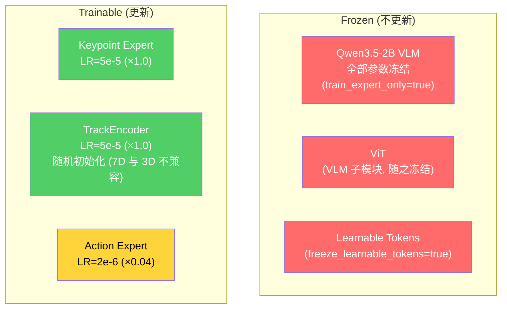
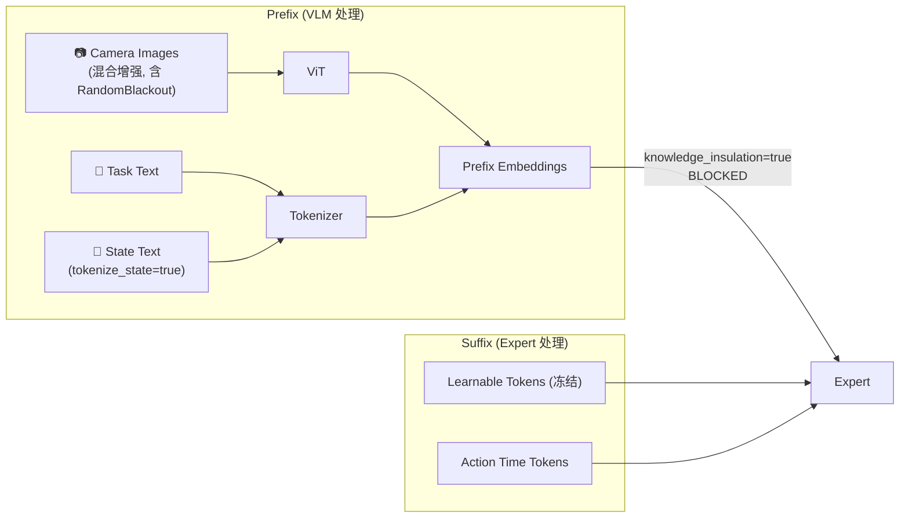

# Phase 1 Warmup — Franka put_cube_into_box (4D Keypoint 模态隔离训练)

> **EXPR_NAME**: `4dwvlaFrkCubBx0924`  
> **数据集**: `/B/Dta/put_cube_into_box_lrb3_4D/` — 30Hz, 56 episodes, 36,953 frames  
> **特殊模式**: 混合增强 (含 RandomBlackout) · knowledge_insulation · tokenize_state=true — 隔离图文模态, 专注训练 4D 模态 (keypoint_expert)  
> **基线参考**: `b/d/Frk2/plug2_p1warmup.md` (itvlagpFrkPlug2_0918)  
> **日期**: 2026-09-24

---

## 目录

1. [概述](#1-概述)
2. [可配置变量汇总](#2-可配置变量汇总)
3. [硬件 & 软件前提](#3-硬件--软件前提)
4. [数据集概况](#4-数据集概况)
5. [训练步数计算](#5-训练步数计算)
6. [超参数 & 冻结矩阵](#6-超参数--冻结矩阵)
7. [模态隔离设计](#7-模态隔离设计)
8. [数据流与 Transform Pipeline](#8-数据流与-transform-pipeline)
9. [文件清单](#9-文件清单)
10. [操作步骤](#10-操作步骤)
11. [冒烟测试](#11-冒烟测试)
12. [生产训练](#12-生产训练)
13. [验收标准](#13-验收标准)
14. [异常判定](#14-异常判定)
15. [故障排查](#15-故障排查)
16. [附录 A: Schema YAML](#附录-a-schema-yaml)
17. [附录 B: 启动脚本](#附录-b-启动脚本)
18. [附录 C: 编排监控脚本](#附录-c-编排监控脚本)
19. [附录 D: 模态隔离代码变更](#附录-d-模态隔离代码变更)
20. [附录 E: 超参/配置汇总](#附录-e-超参配置汇总)
21. [附录 F: 文件增删改汇总](#附录-f-文件增删改汇总)
22. [附录 G: 关键路径汇总](#附录-g-关键路径汇总)

---

## 1. 概述

本实验为 InternVLA-A1.5 的 **Phase 1 Warmup** (阶段 1 预热训练), 使用 Franka 机器臂"夹取方块到盒子中" (`put_cube_into_box`) 数据集, 在 3D/4D keypoint 维度进行 warmup. 训练目标是从零训练 **keypoint_expert** 和 **TrackEncoder**, 同时以极低学习率微调 action_expert, VLM 骨干完全冻结.

### 1.1 与标准 warmup 的关键区别

本实验与之前 Franka 插插座 warmup (`itvlagpFrkPlug0907`, `itvlagpFrkPlug2_0918`) 的核心差异在于**模态隔离**:

| 维度 | 标准 warmup | 本实验 (模态隔离) |
|------|------------|------------------|
| 图片输入 | 真实摄像头图像 | 混合增强 (7 种, blackout weight=2.0, 80% 概率应用) |
| 文本 prompt | `"Task: put cube into box; Control Mode: <joint>; State: ..."` | 含 State text 的 prompt; knowledge_insulation 阻断 suffix→prefix attention |
| `tokenize_state` | `true` (state 离散化为文本 token) | `true` (state 离散化为文本 token, 在 prefix 中; 被 knowledge_insulation 阻断) |
| 图像增强 | brightness/contrast/saturation | 开启; 7 种增强含 `RandomBlackout` (weight=2.0, 概率最高) |
| 训练目标 | 4D kpt + action | 4D kpt + action (不变) |

**设计原理**: 模态隔离通过多层机制实现:

1. **注意力阻断** (最关键): `knowledge_insulation=true` + `knowledge_insulation_kpt=true` 修改 attention mask, 使 suffix 中的 experts **无法注意到** prefix 中的图片/文本 token. 这是阻止图文信息进入 experts 的核心机制 — 即使 `enable_vqa_loss=false`, 没有 knowledge_insulation 的话文本和图片信息仍会通过 causal attention 流入 experts.
2. **图片混合增强 (含 RandomBlackout)**: 通过图像增强 pipeline 中的 7 种增强类型 (brightness, contrast, saturation, hue, sharpness, affine, blackout) 对图像进行数据增强, 其中 `RandomBlackout` 权重最高 (weight=2.0), 概率性地将图像替换为近黑噪声. `p_schedule=[0.8]` 控制 80% 的 sample 应用增强, 20% 保留原图. 在 knowledge_insulation 的基础上, blackout 提供额外保险 — 即使未来某些路径绕过了 attention mask, 多数时候也无有意义的视觉信息可泄漏.
3. **State 文本化但被阻断**: `tokenize_state=true` 将 state 离散化为文本 token, 附加到 prompt 中 (prefix). 但由于 `knowledge_insulation=true` 阻断了 suffix→prefix 的 attention, state 文本信息**无法到达** experts. 这意味着 experts 在训练时完全不依赖 state 信息.
4. **VLM 冻结**: `train_expert_only=true` 冻结 VLM 全部参数, 无梯度从 prefix 反传.
5. **文本损失关闭**: `enable_vqa_loss=false` 关闭文本预测损失, 避免文本监督信号影响 expert 权重更新.

最终效果: keypoint_expert 和 TrackEncoder 只能依赖 suffix 中的 learnable_tokens (冻结) 和 keypoint history 来学习 3D/4D 关节轨迹预测. 由于 `tokenize_state=true` + `knowledge_insulation=true`, state 信息在 prefix 中被阻断, experts 无法获取; 不创建 `state_proj` 层.

---

## 2. 可配置变量汇总

| 变量 | 默认值 | 说明 |
|------|--------|------|
| `EXPR_NAME` | `4dwvlaFrkCubBx0924` | 实验名, 决定 checkpoint/log 路径 |
| `VENV_ROOT` | `/B/VENV/itnvla15rbt20` | Python 虚拟环境 |
| `HF_HOME` | `/B/VENV/hf_home` | HuggingFace cache 根目录 |
| `HF_LEROBOT_HOME` | `${HF_HOME}/lerobot` | LeRobot 数据 symlink 根 |
| `DATA_SRC` | `/B/Dta/put_cube_into_box_lrb3_4D` | 数据集物理路径 |
| `DATA_REPO_ID` | `put_cube_into_box_lrb3_4D` | LeRobot repo id (symlink 名) |
| `PRETRAINED_PATH` | `${HF_HOME}/ckpts/InternVLA-A1.5-base` | A1.5-base 预训练权重 |
| `GEOPREDICT_CKPT` | `${HF_HOME}/ckpts/GeoPredict_robocasa.pth` | GeoPredict 权重 (7D 模式下仅部分加载) |
| `CKPT_ROOT` | `${HOME}/b/Ckp/${EXPR_NAME}` | checkpoint 输出根目录 |
| `LOG_ROOT` | `/B/Log/${EXPR_NAME}` | 训练日志根目录 |
| `PROC_PER_NODE` | `8` | GPU 数 |
| `BATCH_SIZE` | `16` | per-GPU batch size |
| `NODE_COUNT` | `1` | 节点数 |
| `NUM_EPOCHS` | `4` | 训练 epoch 数 |
| `SAVE_EPOCH_INTERVAL` | `4` | 训练结束时保存 (= NUM_EPOCHS, 仅保存最终 checkpoint) |
| `MONITOR_INTERVAL` | `900` | 监控轮询间隔 (秒) |

---

## 3. 硬件 & 软件前提

### 3.1 硬件

| 项目 | 要求 |
|------|------|
| GPU | 8× NVIDIA GPU, 每卡 ≥ 40 GB VRAM (A100/H100) |
| 内存 | ≥ 128 GB RAM |
| 磁盘 | checkpoint ≈ 12 GB/save, log ≈ 0.5 GB |

### 3.2 软件

| 组件 | 版本 |
|------|------|
| Python | 3.11 |
| PyTorch | 2.10.0 (cu128) |
| transformers | 5.2.0 (含 Qwen3.5 patch) |
| flash-attn | 2.8.3 |
| accelerate | ≥ 1.6.0 |
| pinocchio | 4.1.0 |

### 3.3 前置条件

1. 虚拟环境 `/B/VENV/itnvla15rbt20` 已安装完整依赖
2. Transformers Qwen3.5 patch 已部署
3. InternVLA-A1.5-base 权重已下载
4. GeoPredict 权重已下载
5. 数据集 `/B/Dta/put_cube_into_box_lrb3_4D/` 已通过 `verify_cubinbx_keypoints.py` 全部 10 项验证 (参见 `b/d/Frk3/ds/cubinbx/3d4d_gen_3_0924LOG.markdown`)

---

## 4. 数据集概况

| 属性 | 值 |
|------|-----|
| 任务 | `put cube into box` |
| robot_type | `franka_cubinbx` |
| FPS | 30 |
| 总 episodes | 56 |
| 总 frames | 36,953 |
| 平均 episode 长度 | 659.9 frames (22.0 秒) |
| 图像分辨率 | 640×480 (原始), 训练时 resize 到 224×224 |
| 摄像头 | 2 (global + wrist) → image0, image1 |
| State 维度 | 15D: [joint×7, gripper_width, ee_pos×3, ee_quat2×4] |
| Action 维度 | 8D: [joint×7, gripper_cmd] |
| Action mode | `abs` (绝对关节角) |
| Keypoint 维度 | 7D (px,py,pz,qx,qy,qz,qw) × 8 joints = 56D |
| Keypoint joints | link1–link7 + hand_tcp |
| R_pad | 0.886566 |
| 旋转表示 | quaternion xyzw, hemisphere-normalized (qw ≥ 0) |
| kpt_4d_mode | `pos_rot` (7D) |
| ee_quat2 | FK-derived (pinocchio), 非原始 HDF5 ee_quat |

### 4.1 State 布局

```
Index  [0:7]       joint1..joint7        (arm joint positions, rad)
Index  [7]         gripper_width         (m, clipped ≥ 0)
Index  [8:11]      ee_pos_x/y/z          (m, from HDF5 ee_pos)
Index  [11:15]     ee_quat2_x/y/z/w      (FK-derived, xyzw, hemisphere-normalized)
```

### 4.2 Action 布局

```
Index  [0:7]       joint1..joint7        (target arm joint positions, rad)
Index  [7]         gripper_cmd           (target gripper command)
```

### 4.3 Keypoint 布局

每个 keypoint = 7D: `[px, py, pz, qx, qy, qz, qw]`
- 位置 `px,py,pz` 已除以 `R_pad=0.886566` 归一化, 范围约 [-1, 1]
- 旋转 `qx,qy,qz,qw` 为 hemisphere-normalized quaternion (qw ≥ 0)
- 8 个 keypoints 依次: link1, link2, ..., link7, hand_tcp
- 总维度: 8 × 7 = 56

---

## 5. 训练步数计算

$$
\text{EBS} = \text{PROC\_PER\_NODE} \times \text{BATCH\_SIZE} \times \text{NODE\_COUNT} = 8 \times 16 \times 1 = 128
$$

$$
\text{steps\_per\_epoch} = \lceil \frac{\text{total\_frames}}{\text{EBS}} \rceil = \lceil \frac{36{,}953}{128} \rceil = 289
$$

$$
\text{total\_steps} = \text{steps\_per\_epoch} \times \text{NUM\_EPOCHS} = 289 \times 4 = 1{,}156
$$

$$
\text{save\_freq} = \text{steps\_per\_epoch} \times \text{SAVE\_EPOCH\_INTERVAL} = 289 \times 4 = 1{,}156
$$

> **注意**: `SAVE_EPOCH_INTERVAL = NUM_EPOCHS = 4`, 即 `save_freq = total_steps = 1,156`. 训练期间不保存中间 checkpoint, 仅在最后一步保存.

$$
\text{warmup\_steps} = \text{steps\_per\_epoch} = 289
$$

| 指标 | 值 |
|------|-----|
| EBS | 128 |
| steps/epoch | 289 |
| total epochs | 4 |
| total steps | 1,156 |
| save freq | 1,156 (仅最终, = total_steps) |
| warmup steps | 289 (1 epoch cosine warmup) |
| 预计训练时间 | ~25–35 min (8×A100) |

### 5.1 Checkpoint 保存点

| Step | Epoch | 说明 |
|------|-------|------|
| 1156 | 4.0 | 最终 checkpoint (唯一保存点) |

---

## 6. 超参数 & 冻结矩阵

### 6.1 超参数

| 参数 | 值 | 说明 |
|------|-----|------|
| `optimizer_lr` | 5e-5 | 基础学习率 |
| `action_expert_lr_scale` | 0.04 | action_expert 有效 LR = 5e-5 × 0.04 = 2e-6 |
| `kpt_expert_lr_scale` | 1.0 | kpt_expert 有效 LR = 5e-5 |
| `track_encoder_lr_scale` | 1.0 | TrackEncoder 有效 LR = 5e-5 |
| `action_loss_weight` | 2.0 | action flow-matching 损失权重 |
| `kpt_loss_weight` | 10.0 | 当前帧 keypoint 预测损失权重 |
| `kpt_future_loss_weight` | 12.0 | 未来帧 keypoint 预测损失权重 (提高未来帧预测优先级) |
| `kpt_rot_loss_weight` | 1.0 | 旋转分量损失权重 (pos_rot 模式) |
| `scheduler` | cosine warmup + decay | warmup=289 steps, decay to 5e-6 at step 1156 |
| `dtype` | bfloat16 | 混合精度 |
| `seed` | 42 | 随机种子 |

### 6.2 冻结矩阵



> **注意**: `tokenize_state=true` 时, state 离散化为文本 token 附加到 prompt (prefix). 模型**不创建** `state_proj` 层. 由于 `knowledge_insulation=true` 阻断了 suffix→prefix 的 attention, state 文本信息无法到达 experts — experts 只能依赖 keypoint history 和 learnable_tokens (冻结) 进行预测.

### 6.3 关键训练标志

| 标志 | 值 | 说明 |
|------|-----|------|
| `train_expert_only` | `true` | 冻结 VLM 骨干 |
| `knowledge_insulation` | `true` | 阻止 action_expert 注意力触达 prefix |
| `knowledge_insulation_kpt` | `true` | 阻止 kpt_expert 注意力触达 prefix |
| `action_loss_only` | `true` | 不加载 WAN 视频分支 |
| `video_loss_only` | `false` | 不单独训练视频分支 |
| `enable_vqa_loss` | `false` | 不计算 VQA/文本损失 |
| `tokenize_state` | `true` | state 离散化为文本 token (prefix); 被 knowledge_insulation 阻断 |
| `freeze_learnable_tokens` | `true` | 冻结前瞻 token |
| `enable_keypoint_predictor` | `true` | 启用 3D/4D keypoint 预测 |
| `kpt_4d_mode` | `pos_rot` | 7D keypoint (位置 + 旋转) |
| `init_kpt_expert_from_action` | `true` | kpt_expert 权重从 action_expert 初始化 |
| `use_fast_action_tokens` | `false` | 不使用 FAST action tokenization |
| (图像增强) | 通过 `image_transforms` | 见 §7.3: 7 种增强含 `RandomBlackout` (weight=2.0), p_schedule=[0.8] |

---

## 7. 模态隔离设计

### 7.1 信息流分析

在标准 InternVLA-A1.5 训练中, 信息通过以下路径流入 experts:



**模态隔离策略**:

1. **图片模态 → 混合增强 (含 RandomBlackout)**: 通过图像增强 pipeline 中的 7 种增强类型对图像进行数据增强, 其中 `RandomBlackout` 权重最高 (weight=2.0), 概率性地将图像替换为 `torch.rand_like() × 0.01` 近黑噪声. `p_schedule=[0.8]` 控制 80% 的 sample 应用增强. ViT 仍然处理增强后的图像 (保持序列长度不变). 加之 `knowledge_insulation=true` 阻断 prefix → suffix 注意力, 图片信息无法到达 experts — 即使偶尔有未涂黑的图像, experts 也无法访问.

2. **文本模态 → 最小 prompt**: 文本信息的隔离分两层:
   - **注意力阻断** (核心): `knowledge_insulation=true` + `knowledge_insulation_kpt=true` 修改 attention mask, 使 suffix 中的 action_expert 和 kpt_expert 都**无法注意到** prefix 中的文本 token. 这是阻止文本信息流入 experts 的关键机制. 若不设置 knowledge_insulation, 即使不计算 VQA loss, 文本信息仍会通过 causal attention 进入 experts.
   - **损失关闭** (辅助): `enable_vqa_loss=false` 使 `labels=None`, 不计算文本预测损失, 避免文本监督信号反向传播影响 expert 权重.
   - Task text 仍来自数据集 ("put cube into box"), VLM 仍然处理它 (prefix 内部的 self-attention 正常工作), 但由于 knowledge_insulation 阻断了 suffix→prefix 的 attention, 文本信息**无法到达**任何 expert.

3. **State text → 保留但被阻断**: `tokenize_state=true` 保持 state 文本离散化 ("State: 128 45 ...") 附加到 prompt. State 文本在 prefix 中由 VLM 正常处理, 但由于 knowledge_insulation 阻断, 无法到达 suffix 中的 experts.

### 7.2 `tokenize_state=true` + `knowledge_insulation=true` 的效果

| 层面 | 效果 |
|------|------|
| **Transform (Dataset)** | state → "State: 128 45 ..." 附加到 prompt 文本 (prefix) |
| **Model** | 无 `state_proj` 层 (tokenize_state=true 时不创建) |
| **Suffix 结构** | `[learnable_tokens(50)] [action_time(chunk)]` |
| **State 信息路径** | state → text → VLM → prefix → **被 knowledge_insulation 阻断** → experts 无法获取 |

> ⚡ **重要**: `tokenize_state=true` + `knowledge_insulation=true` 意味着 state 信息在 prefix 中被 attention mask 阻断, **无法到达 experts**. 与 `tokenize_state=false` (state 通过 `state_proj` 直接进入 suffix) 不同, 本配置下 experts **完全不依赖 state 信息**, 只能依赖 keypoint history 和 learnable_tokens (冻结) 进行预测.

### 7.3 `RandomBlackout` 图像增强实现

与之前版本中独立的 `BlackoutImageTransformFn` (位于 data transform pipeline) 不同, 本方案将涂黑操作实现为 **图像增强 pipeline** (`image_transforms`) 中的一种增强类型. 这样做的理由:

1. **与 warmup 增强流程一致**: warmup 训练会开启 `image_transforms.enable=true`, 涂黑操作作为其中一种增强, 不需要额外的 transform pipeline 修改或新 config 字段
2. **复用已有基础设施**: 利用 `ImageTransformsConfig` 的 weight/type/kwargs 配置、`RandomSubsetApply` 采样、`p_schedule` 调度等机制
3. **灵活性**: 可以通过 CLI 控制 blackout 的权重. 本实验中 blackout weight=2.0 (其他增强 weight=0.2~1.0), 使涂黑概率最高; 也可设为唯一增强实现 100% 涂黑, 或设为 0 不涂黑

**实现位置**: `src/lerobot/datasets/transforms.py` — 与 `SharpnessJitter`, `RandomSubsetApply` 等同文件

**增强类**: `RandomBlackout(Transform)` — 继承 `torchvision.transforms.v2.Transform`, 与 `SharpnessJitter` 同级

**工厂注册**: 在 `make_transform_from_config()` 中新增 `"RandomBlackout"` 分支

**默认配置**: 在 `ImageTransformsConfig.tfs` 中新增 `"blackout"` 条目, `weight=0.0` (默认不启用)

**CLI 激活**: draccus 将 `tfs` 字典视为原子类型, **不支持** `--dataset.image_transforms.tfs.blackout.weight=1.0` 这样的逐字段覆盖 (参见 `b/d/Frk/expr/sftaug2/frk_plug_sft_dtaug2ps_launch.sh:84-86`). 必须将整个 `tfs` 字典作为 YAML 字符串一次性传入: `"--dataset.image_transforms.tfs=${TFS_CONFIG}"`, 其中 `TFS_CONFIG` 包含完整的 7 种增强配置 (含 blackout weight=2.0)

详见 [附录 D: 模态隔离代码变更](#附录-d-模态隔离代码变更) 的完整代码和逐行解释.

---

## 8. 数据流与 Transform Pipeline

### 8.1 Transform 链

```
raw dataset item
  │
  ├── observation.state  [15]
  ├── action             [8]
  ├── observation.images.global  [480×640×3]  (video decode)
  ├── observation.images.wrist   [480×640×3]  (video decode)
  ├── observation.keypoint_3d    [56]         (from parquet)
  ├── task               "put cube into box"
  └── ...
  │
  ▼
① ResizeImagesWithPadFn   →  images → 224×224
  │
  ▼
② RemapImageKeyTransformFn →  global→image0, wrist→image1, image2=ones(mask=False)
  │
  ▼
③ ExtractVideoFramesTransformFn  →  video frames (WAN 分支, action_loss_only=true 时无效)
  │  ⚡ 注: 涂黑操作不在此 data transform pipeline 中,
  │     而是在 LeRobotDataset.__getitem__ 的 image_transforms 增强阶段,
  │     在 data transform pipeline 之前执行 (见下方 §8.3)
  │
  ▼
④ NormalizeTransformFn    →  state/action 无 stats → skip; images 用 ImageNet stats
  │
  ▼
⑤ Extract3DKeypointTransformFn →  keypoint_3d → kpt_t, kpt_history, kpt_future, kpt_mask
  │
  ▼
⑥ ComposeFieldsTransform  →  合并 schema 字段
  │
  ▼
⑦ InternVLAA15ChatProcessorTransformFn (tokenize_state=true)
  │  → user_text = "Task: put cube into box; Control Mode: <joint>; State: 128 45 ..."
  │  → State 离散化文本附加到 prompt (prefix)
  │  → label_mode = NONE (enable_vqa_loss=false, use_fast=false)
  │  → 增强后图像送入 Qwen3VLProcessor (mask=True), attention 正常
  │
  ▼
⑧ PadStateAndActionTransformFn →  state pad to 32D, action pad to 32D
  │
  ▼
⑨ ReorderStateActionTransform  →  确保 state/action 维度对齐
  │
  ▼
⑩ UnifyInternVLAA15InputsTransformFn →  统一 robot/VQA sample 格式; 组装 kpt 字段
  │
  ▼
final batch → policy.forward()
```

### 8.2 Model Forward 流

```
  [Prefix: frozen VLM]
    input_ids (含增强图 token + State text + task text) → Qwen3.5 → prefix_hidden_states
    (knowledge_insulation=true → prefix 对 suffix 不可见)

  [Suffix: trainable experts]
    learnable_tokens(50)           ←── 冻结
    action_time_tokens(chunk=50)   ←── action expert
    (无 state_proj — tokenize_state=true, state 在 prefix 中)

  → action_expert(suffix) → flow matching → loss_action × 2.0
  → kpt_expert(suffix + kpt_history) → kpt prediction → loss_kpt × 10.0 + loss_kpt_future × 12.0
```

### 8.3 图像增强阶段 (image_transforms)

图像增强发生在 data transform pipeline **之前**, 位于 `LeRobotDataset.__getitem__` 中 (`src/lerobot/datasets/lerobot_dataset.py:1076-1080`):

```python
# LeRobotDataset.__getitem__ (简化)
item = self._load_raw_item(index)       # 读取 parquet + decode video

if self.image_transforms is not None:   # ← 增强阶段: 这里执行 RandomBlackout
    self.image_transforms.begin_sample()
    for cam in self.meta.camera_keys:
        item[cam] = self.image_transforms(item[cam])

item = self.transforms(item)            # ← data transform pipeline (§8.1)
```

本实验的增强配置 (通过 `TFS_CONFIG` YAML 字符串传入, 7 种增强含 blackout):

| 增强类型 | type | weight | 效果 |
|---------|------|--------|------|
| `brightness` | `ColorJitter` | 1.0 | 亮度 [0.8, 1.2] |
| `contrast` | `ColorJitter` | 1.0 | 对比度 [0.8, 1.2] |
| `saturation` | `ColorJitter` | 1.0 | 饱和度 [0.5, 1.5] |
| `hue` | `ColorJitter` | 1.0 | 色调 [-0.05, 0.05] |
| `sharpness` | `SharpnessJitter` | 1.0 | 锐度 [0.5, 1.5] |
| `affine` | `RandomAffine` | 0.2 | 旋转 ±5°, 平移 5% |
| `blackout` | `RandomBlackout` | **2.0** | 像素 → `rand() × 0.01` (近黑噪声) |

> **注**: 由于 draccus 将 `tfs` 字典视为原子类型, CLI 传入 `TFS_CONFIG` 时会**完全替换**默认 `tfs` 字典. 本实验的 `TFS_CONFIG` 包含完整的 7 种增强配置.

总权重 = 1.0+1.0+1.0+1.0+1.0+0.2+2.0 = **7.2**. `max_num_transforms=3` 时, `RandomSubsetApply` 通过加权 multinomial 无放回采样 3 个 transform. `blackout` 归一化权重 = 2.0/7.2 ≈ **27.8%** (最高), 每次采样中被选中的概率较高. 配合 `p_schedule=[0.8]` (80% 概率应用增强, 20% 保留原图), 多数 sample 的多数 camera 会被涂黑, 但并非 100%.

---

## 9. 文件清单

### 9.1 新增文件

| 文件 | 用途 |
|------|------|
| `src/lerobot/dataset_schemas/configs/franka_cubinbx.yaml` | 数据集 schema |
| `b/s/Frk3/frk3_cubbx_warmup_launch.sh` | accelerate launch 脚本 |
| `b/s/Frk3/run_frk3_cubbx_warmup.sh` | 编排监控脚本 |

### 9.2 修改文件

| 文件 | 变更 |
|------|------|
| `src/lerobot/datasets/transforms.py` | 新增 `RandomBlackout` 类 + `make_transform_from_config()` 分支 + `ImageTransformsConfig.tfs` 默认条目 |

### 9.3 已有文件 (不修改)

| 文件 | 说明 |
|------|------|
| `/B/Dta/put_cube_into_box_lrb3_4D/` | 数据集 (gen_3 pipeline 已生成) |
| `${HF_HOME}/ckpts/InternVLA-A1.5-base/` | 预训练权重 |
| `${HF_HOME}/ckpts/GeoPredict_robocasa.pth` | GeoPredict 权重 |

---

## 10. 操作步骤

### Step 0: 激活虚拟环境

```bash
source /B/VENV/itnvla15rbt20/bin/activate
cd /B/SRC/itvlaGpLibPlus
```

### Step 1: 验证数据集完整性

```bash
python b/s/Frk3/verify_cubinbx_keypoints.py \
  --dataset /B/Dta/put_cube_into_box_lrb3_4D \
  --urdf b/d/Frk2/fr3v2_1_franka_hand.urdf
```

> **预期**: 10 项检查全部 PASS. 若有 FAIL, 参见 `b/d/Frk3/ds/cubinbx/3d4d_gen_3_0924LOG.markdown` 排查.

### Step 2: 验证前置模型文件

```bash
# A1.5-base 权重
test -f /B/VENV/hf_home/ckpts/InternVLA-A1.5-base/config.json && echo "A1.5-base OK" || echo "MISSING"

# GeoPredict 权重
test -f /B/VENV/hf_home/ckpts/GeoPredict_robocasa.pth && echo "GeoPredict OK" || echo "MISSING"
```

### Step 3: 创建数据集 symlink

```bash
HF_LEROBOT_HOME=/B/VENV/hf_home/lerobot
mkdir -p "${HF_LEROBOT_HOME}"
ln -sfn /B/Dta/put_cube_into_box_lrb3_4D \
  "${HF_LEROBOT_HOME}/put_cube_into_box_lrb3_4D"

# 验证
test -f "${HF_LEROBOT_HOME}/put_cube_into_box_lrb3_4D/meta/info.json" \
  && echo "symlink OK" || echo "BROKEN"
```

### Step 4: 部署 `franka_cubinbx.yaml` schema

```bash
cat > src/lerobot/dataset_schemas/configs/franka_cubinbx.yaml << 'EOF'
robot_type: franka_cubinbx
action_mask_spec: [7, -1]
feature_mapping:
  observation.state:
    - observation.state
  action:
    - action
image_mapping:
  observation.images.global: observation.images.image0
  observation.images.wrist: observation.images.image1
EOF

# 验证
python -c "
from lerobot.dataset_schemas import get_schema
s = get_schema('franka_cubinbx')
print(f'robot_type={s.robot_type}')
print(f'action_mask_spec={s.action_mask_spec}')
print(f'image_mapping={s.image_mapping}')
print('schema OK')
"
```

> `franka_cubinbx.yaml` 与 `franka3.yaml` 内容相同, 仅 `robot_type` 名不同. `action_mask_spec: [7, -1]` 表示 7 个 arm joint + 1 个 gripper (独立处理). `image_mapping` 将 global→image0, wrist→image1.

### Step 5: 部署 `RandomBlackout` 图像增强

只需修改 **一个文件**: `src/lerobot/datasets/transforms.py`. 详细代码见 [附录 D](#附录-d-模态隔离代码变更).

修改内容 (3 处):

1. **新增 `RandomBlackout` 类** (在 `SharpnessJitter` 类之后、`ImageTransformConfig` 之前)
2. **在 `make_transform_from_config()` 中新增分支** (在 `RandomAffine` 分支之后)
3. **在 `ImageTransformsConfig.tfs` 默认字典中新增 `"blackout"` 条目** (`weight=0.0`, 默认不启用)

**验证**:

```bash
python -c "
from lerobot.datasets.transforms import ImageTransformsConfig, ImageTransforms
cfg = ImageTransformsConfig(enable=True)
# 验证 blackout 在默认 tfs 中
assert 'blackout' in cfg.tfs, 'blackout not in default tfs'
assert cfg.tfs['blackout'].weight == 0.0, 'default weight should be 0.0'
print(f'blackout config: {cfg.tfs[\"blackout\"]}')

# 验证启用后能正常构建
cfg.tfs['blackout'].weight = 1.0
for k in ['brightness','contrast','saturation','hue','sharpness','affine']:
    cfg.tfs[k].weight = 0.0
it = ImageTransforms(cfg)
print(f'transforms: {list(it.transforms.keys())}')
assert list(it.transforms.keys()) == ['blackout'], f'Expected only blackout, got {list(it.transforms.keys())}'

# 验证 transform 效果
import torch
img = torch.ones(3, 224, 224)
it.begin_sample()
out = it(img)
assert out.max() < 0.02, f'Blackout output should be near-zero, got max={out.max()}'
print(f'Blackout test passed: input max={img.max():.1f}, output max={out.max():.4f}')
print('All checks OK')
"
```

### Step 6: 部署启动脚本和编排脚本

```bash
# 复制并编辑 (见附录 B、C)
# 启动脚本
cp b/s/Frk2/frk2_plug_warmup_launch.sh b/s/Frk3/frk3_cubbx_warmup_launch.sh
# 编排脚本
cp b/s/Frk2/run_frk2_plug_warmup.sh b/s/Frk3/run_frk3_cubbx_warmup.sh
```

然后按附录 B、C 的内容修改两个脚本. 关键修改点:

| 项目 | Frk2 原值 | Frk3 新值 |
|------|----------|----------|
| `EXPR_NAME` | `itvlagpFrkPlug2_0918` | `4dwvlaFrkCubBx0924` |
| `DATA_SRC` | `plug_into_socket_franka3_15hz_lerobot_4d` | `put_cube_into_box_lrb3_4D` |
| `DATA_REPO_ID` | `plug_into_socket_franka3_15hz_lerobot_4d` | `put_cube_into_box_lrb3_4D` |
| `--policy.tokenize_state` | `true` | `true` |
| `--dataset.tokenize_state` | `true` | `true` |
| `--dataset.image_transforms.enable` | `true` | `true` |
| `--dataset.image_transforms.tfs` | 6 种增强 (YAML 字符串) | 7 种增强含 `blackout` weight=2.0 (YAML 字符串, 见附录 B) |
| schema 检查 | `franka3.yaml` | `franka_cubinbx.yaml` |
| `episodes_stats.jsonl` 检查 | 检查 | **移除** (数据集无此文件, `use_external_stats=false` 不需要) |
| JOB_NAME suffix | `frk2-plug-warmup` | `frk3-cubbx-warmup` |

### Step 7: 清理 GPU 并启动 bigmatrix (可选)

如需先释放 GPU:

```bash
nvidia-smi --query-compute-apps=pid --format=csv,noheader | xargs -r kill -9
sleep 5
```

---

## 11. 冒烟测试

### 11.1 手动冒烟

```bash
SMOKE=1 bash b/s/Frk3/frk3_cubbx_warmup_launch.sh
```

冒烟测试参数: 1 GPU, BS=2, 10 steps, 2 workers.

### 11.2 预期输出

1. 模型加载:
   - `Loading InternVLA-A1.5-base from ...`
   - `GeoPredict checkpoint loaded` (或 `WARNING: GeoPredict shape mismatch ... (256, 3, 4) vs (256, 7, 4)` — 7D 模式下 TrackEncoder 随机初始化, 这是**预期行为**)
   - `train_expert_only=True → freezing VLM`
   - `tokenize_state=True` (state 离散化为文本, 无 state_proj 创建)

2. 数据加载:
   - `[NormalizeTransformFn] No normalization stats found for key 'observation.state' — skipping.` (预期 WARNING, state 不做 normalization)
   - `[NormalizeTransformFn] No normalization stats found for key 'action' — skipping.` (预期 WARNING)

3. 训练:
   - 10 个 step 正常完成, 无 crash
   - `loss_action`, `loss_kpt_cur`, `loss_kpt_future` 有输出
   - 无 `video_decode_error` 或 `using_zeros`

### 11.3 可能的冒烟错误

| 编号 | 症状 | 解决方法 |
|:---:|------|---------|
| S1 | `Unknown robot_type 'franka_cubinbx'` | Step 4 schema 未部署, 重新执行 |
| S2 | `FileNotFoundError: info.json` | Step 3 symlink 未创建, 重新执行 |
| S3 | `Transform 'RandomBlackout' is not valid` | Step 5 代码未部署 (transforms.py 未修改), 重新执行 |
| S4 | GeoPredict shape mismatch → crash (非 WARNING) | 检查 `keypoints.py` 中的 7D 兼容逻辑 |
| S5 | `RuntimeError: shape invalid for input of size` | 确认 `--policy.keypoint_history_max_len=90 --dataset.keypoint_history_max_len=90` 一致 |
| S6 | OOM | 减小 `BATCH_SIZE` (如 1) |

---

## 12. 生产训练

### 12.1 通过编排脚本启动

```bash
bash b/s/Frk3/run_frk3_cubbx_warmup.sh
```

编排脚本会自动:
1. 计算训练步数 (从 info.json 读取 total_frames)
2. 执行 pre-flight 检查
3. 运行冒烟测试 (可用 `--skip-smoke` 跳过)
4. 启动 8 GPU 生产训练
5. 每 15 分钟监控训练状态
6. 训练完成/失败后: 清理 GPU → 启动 bigmatrix → 归档日志

### 12.2 直接启动 (跳过编排)

```bash
export CUDA_VISIBLE_DEVICES=0,1,2,3,4,5,6,7
bash b/s/Frk3/frk3_cubbx_warmup_launch.sh
```

### 12.3 预期训练日志

```
Step  50: loss_action=0.85  loss_kpt_cur=0.25   loss_kpt_future=1.5   grad_norm=12.5
Step 100: loss_action=0.60  loss_kpt_cur=0.08   loss_kpt_future=0.8   grad_norm=8.2
Step 200: loss_action=0.45  loss_kpt_cur=0.015  loss_kpt_future=0.5   grad_norm=5.1
Step 500: loss_action=0.35  loss_kpt_cur=0.004  loss_kpt_future=0.25  grad_norm=3.5
Step 800: loss_action=0.30  loss_kpt_cur=0.002  loss_kpt_future=0.15  grad_norm=2.8
Step 1156: [SAVE] checkpoint 001156 (FINAL)
```

> 以上为预估值. `loss_kpt_future` 由于 `kpt_future_loss_weight=12.0` (较高), 初始值和收敛过程中的绝对值会更大. 由于混合增强 (含 RandomBlackout) 且 knowledge_insulation 阻断了图文信息, experts 只能依赖 keypoint history 进行预测, `loss_kpt_cur` 的收敛可能比标准 warmup 略慢 (但最终应收敛到 < 0.005). `loss_action` 可能稍高于标准 warmup (因为 action_expert 只有 0.04x LR).

---

## 13. 验收标准

### 13.1 必须通过

| 编号 | 条件 | 检查方法 |
|:---:|------|---------|
| A1 | 训练 exit code = 0 | `echo $?` |
| A2 | 最终 checkpoint 存在 | `test -f ${OUTPUT_DIR}/checkpoints/001156/pretrained_model/config.json` |
| A3 | `loss_kpt_cur` < 0.01 (epoch 3 后) | 检查 log 或 wandb |
| A4 | `loss_kpt_future` 持续下降 | 检查 log 趋势 |
| A5 | 无 `video_decode_error` | `grep -c 'video_decode_error' train.log` 为 0 |
| A6 | 无 `using_zeros` | `grep -c 'using_zeros' train.log` 为 0 |
| A7 | `grad_norm` 无持续 > 1000 | 检查 log |

### 13.2 建议通过

| 编号 | 条件 | 说明 |
|:---:|------|------|
| B1 | `loss_action` < 0.5 (最终) | action_expert 微调效果 |
| B2 | `loss_kpt_cur` < 0.005 (最终) | keypoint 当前帧预测精度 |
| B3 | 训练时间 < 40 min | 8×A100 预期 ~25-35 min |

---

## 14. 异常判定

| 异常 | 判定条件 | 可能原因 |
|---|---|---|
| kpt 不收敛 | epoch 3 后 `loss_kpt_cur` > 0.01 | schema 错误, keypoint_3d 数据异常, 或 kpt_loss_weight 过低 |
| action 不稳定 | `loss_action` > 1.0 持续存在 | action_expert_lr_scale 过高, 数据 action_mode 不匹配 |
| 梯度爆炸 | `grad_norm` > 1000 持续存在 | LR 过大, 数据异常, 或 dtype 问题 |
| 日志停滞 | 15 分钟无更新 | 数据加载死锁, GPU 错误, 或 OOM |
| kpt 比标准 warmup 慢 | epoch 2 后 `loss_kpt_cur` > 0.05 | 混合增强 + knowledge_insulation 模式下预期略慢, 但不应过慢; 检查 kpt_expert 是否正常训练 |

---

## 15. 故障排查

| 编号 | 症状 | 可能原因 | 解决方法 |
|:---:|---|---|---|
| T1 | `Unknown robot_type 'franka_cubinbx'` | schema YAML 未部署 | 重做 Step 4, 检查 `ls src/lerobot/dataset_schemas/configs/franka_cubinbx.yaml` |
| T2 | `ncclInternalError` | NCCL tuner plugin 问题 | 确认 `NCCL_TUNER_PLUGIN=/dev/null` 已设置 |
| T3 | `FileNotFoundError: info.json` | 数据 symlink 缺失 | 重做 Step 3 |
| T4 | `Shape mismatch ... (256, 3, 4) vs (256, 7, 4)` | GeoPredict 3D/7D 不兼容 | **预期行为**, TrackEncoder 会随机初始化. 若报错而非 WARNING, 检查 `keypoints.py` 兼容逻辑 |
| T5 | `RuntimeError: shape invalid for input of size` | `keypoint_history_max_len` 不一致 | 确认 `--policy.keypoint_history_max_len=90` 和 `--dataset.keypoint_history_max_len=90` 都已设置 |
| T6 | `KeyError: 'observation.state.arm'` | 使用了旧 schema | 检查 info.json 的 `robot_type` 是否为 `franka_cubinbx`, 对应 schema 是否正确 |
| T7 | `video_decode_error > 0` | MP4 文件损坏或 torchcodec 问题 | 检查 LD_LIBRARY_PATH 含 libnpp; 检查视频文件完整性 |
| T8 | `using_zeros > 0` | 视频帧解码返回全零 | 同 T7; 注意黑图模式下此类 warning 来自 video decode, 非 blackout transform |
| T9 | OOM (CUDA out of memory) | batch_size 过大 | 减小 `BATCH_SIZE` (如 12 或 8), 或启用 `GRADIENT_CHECKPOINTING=true` |
| T10 | bigmatrix 启动失败 | Python 环境或脚本问题 | 手动运行 `python b/d/GpRbt/bigmatrix_multiply_optimization.py`, 查看报错 |
| T11 | `Transform 'RandomBlackout' is not valid` | Step 5 代码变更未部署 | 重新执行 Step 5; 确认 `src/lerobot/datasets/transforms.py` 中有 `RandomBlackout` 类和 `make_transform_from_config()` 分支 |
| T12 | `GeoPredict NOT loaded` WARNING | GeoPredict ckpt 路径错误 | 检查 `GEOPREDICT_CKPT` 路径; 7D 模式下 WARNING 是预期的 |
| T13 | (已移除) | `tokenize_state=true` 时无 state_proj 层 | 不适用 |

---

## 附录 A: Schema YAML

**文件**: `src/lerobot/dataset_schemas/configs/franka_cubinbx.yaml`

```yaml
robot_type: franka_cubinbx
action_mask_spec: [7, -1]
feature_mapping:
  observation.state:
    - observation.state
  action:
    - action
image_mapping:
  observation.images.global: observation.images.image0
  observation.images.wrist: observation.images.image1
```

**说明**:
- `action_mask_spec: [7, -1]` — 7 个 arm joint + 1 个 gripper (最后一维独立处理)
- `feature_mapping` — state 和 action 使用统一列名 (与 `franka3.yaml` 相同)
- `image_mapping` — 2 个摄像头映射到 image0 (global) 和 image1 (wrist); image2 自动填充为 ones(mask=False)
- 与 `franka3.yaml` 唯一区别: `robot_type` 从 `franka3` 改为 `franka_cubinbx`

---

## 附录 B: 启动脚本

**文件**: `b/s/Frk3/frk3_cubbx_warmup_launch.sh`

```bash
#!/usr/bin/env bash
set -euo pipefail

###############################################################################
# Phase 1 Warmup — Franka put_cube_into_box 7D keypoints (kpt_4d_mode=pos_rot)
#
# Modality isolation: mixed augmentation (含 RandomBlackout), tokenize_state=true
#
# Based on: b/s/Frk2/frk2_plug_warmup_launch.sh (itvlagpFrkPlug2_0918)
# Changes:  new dataset (cubinbx, 30Hz, unified columns, franka_cubinbx),
#           mixed augmentation with RandomBlackout, tokenize_state=true
#
# Usage:
#   bash b/s/Frk3/frk3_cubbx_warmup_launch.sh           # production 8 GPU
#   SMOKE=1 bash b/s/Frk3/frk3_cubbx_warmup_launch.sh   # 1 GPU smoke test
###############################################################################

# ── Virtual environment ───────────────────────────────────────────────────
VENV_ROOT="${VENV_ROOT:-/B/VENV/itnvla15rbt20}"
SCRIPT_DIR="$(cd "$(dirname "${BASH_SOURCE[0]}")" && pwd)"
PROJ_ROOT="${PROJ_ROOT:-$(cd "${SCRIPT_DIR}/../../.." && pwd)}"
PYTHON="${PYTHON:-${VENV_ROOT}/bin/python}"

# ── Environment variables ─────────────────────────────────────────────────
export HF_HOME="${HF_HOME:-/B/VENV/hf_home}"
export HF_LEROBOT_HOME="${HF_LEROBOT_HOME:-${HF_HOME}/lerobot}"
export WANDB_MODE="${WANDB_MODE:-offline}"
export USE_LIBUV="${USE_LIBUV:-0}"
export PYTHONUNBUFFERED=1
export OMP_NUM_THREADS="${OMP_NUM_THREADS:-1}"
export MKL_NUM_THREADS="${MKL_NUM_THREADS:-1}"
export TOKENIZERS_PARALLELISM=false
export HF_HUB_OFFLINE="${HF_HUB_OFFLINE:-1}"
export TRANSFORMERS_OFFLINE="${TRANSFORMERS_OFFLINE:-1}"

# NCCL: disable GCP tuner plugin (no config file causes ncclInternalError)
export NCCL_TUNER_PLUGIN="${NCCL_TUNER_PLUGIN:-/dev/null}"

# LD_LIBRARY_PATH: include NVIDIA NPP (torchcodec dependency)
export LD_LIBRARY_PATH="/usr/local/nvidia/lib64:${VENV_ROOT}/lib:\
${VENV_ROOT}/lib/python3.11/site-packages/torch/lib:\
${VENV_ROOT}/lib/python3.11/site-packages/nvidia/cuda_runtime/lib:\
${VENV_ROOT}/lib/python3.11/site-packages/nvidia/cuda_nvrtc/lib:\
${VENV_ROOT}/lib/python3.11/site-packages/nvidia/npp/lib:${LD_LIBRARY_PATH:-}"

export MASTER_ADDR="${MASTER_ADDR:-127.0.0.1}"
export MASTER_PORT="${MASTER_PORT:-36703}"

# ── Experiment name ───────────────────────────────────────────────────────
EXPR_NAME="${EXPR_NAME:-4dwvlaFrkCubBx0924}"

# ── Model & data paths ───────────────────────────────────────────────────
POLICY="internvla_a1_5"
DATA_SRC="${DATA_SRC:-/B/Dta/put_cube_into_box_lrb3_4D}"
DATA_REPO_ID="${DATA_REPO_ID:-put_cube_into_box_lrb3_4D}"
PRETRAINED_PATH="${PRETRAINED_PATH:-${HF_HOME}/ckpts/InternVLA-A1.5-base}"
GEOPREDICT_CKPT="${GEOPREDICT_CKPT:-${HF_HOME}/ckpts/GeoPredict_robocasa.pth}"

# ── Image augmentation: mixed transforms with RandomBlackout ───────────
# draccus treats dict fields as atomic — individual dotted paths like
# --dataset.image_transforms.tfs.blackout.weight=1.0 do NOT work.
# Must pass the complete tfs dict as a YAML string.
# (See b/d/Frk/expr/sftaug2/frk_plug_sft_dtaug2ps_launch.sh:84-86)
TFS_CONFIG='{brightness: {weight: 1.0, type: ColorJitter, kwargs: {brightness: [0.8, 1.2]}}, contrast: {weight: 1.0, type: ColorJitter, kwargs: {contrast: [0.8, 1.2]}}, saturation: {weight: 1.0, type: ColorJitter, kwargs: {saturation: [0.5, 1.5]}}, hue: {weight: 1.0, type: ColorJitter, kwargs: {hue: [-0.05, 0.05]}}, sharpness: {weight: 1.0, type: SharpnessJitter, kwargs: {sharpness: [0.5, 1.5]}}, affine: {weight: 0.2, type: RandomAffine, kwargs: {degrees: [-5.0, 5.0], translate: [0.05, 0.05]}}, blackout: {weight: 2.0, type: RandomBlackout, kwargs: {noise_scale: 0.01}}}'

# ── Output paths ──────────────────────────────────────────────────────────
CKPT_ROOT="${CKPT_ROOT:-${HOME}/b/Ckp/${EXPR_NAME}}"
LOG_ROOT="${LOG_ROOT:-/B/Log/${EXPR_NAME}}"

# ── Smoke vs production ──────────────────────────────────────────────────
SMOKE="${SMOKE:-0}"
GRADIENT_CHECKPOINTING="${GRADIENT_CHECKPOINTING:-false}"

if [[ "${SMOKE}" == "1" ]]; then
  export CUDA_VISIBLE_DEVICES="${CUDA_VISIBLE_DEVICES:-0}"
  PROC_PER_NODE="${PROC_PER_NODE:-1}"
  BATCH_SIZE="${BATCH_SIZE:-2}"
  STEPS="${STEPS:-10}"
  NUM_WORKERS="${NUM_WORKERS:-2}"
  SAVE_FREQ="${SAVE_FREQ:-10}"
  LOG_FREQ="${LOG_FREQ:-1}"
  SCHED_WARMUP_STEPS="${SCHED_WARMUP_STEPS:-2}"
  WANDB_ENABLE="${WANDB_ENABLE:-false}"
  JOB_STAMP="${JOB_STAMP:-$(date +'%Y_%m_%d_%H_%M_%S')}"
  JOB_NAME="${JOB_NAME:-${JOB_STAMP}-${POLICY}-frk3-cubbx-warmup-smoke}"
else
  export CUDA_VISIBLE_DEVICES="${CUDA_VISIBLE_DEVICES:-0,1,2,3,4,5,6,7}"
  PROC_PER_NODE="${PROC_PER_NODE:-8}"
  BATCH_SIZE="${BATCH_SIZE:-16}"
  STEPS="${STEPS:-1156}"
  NUM_WORKERS="${NUM_WORKERS:-12}"
  SAVE_FREQ="${SAVE_FREQ:-1156}"
  LOG_FREQ="${LOG_FREQ:-50}"
  SCHED_WARMUP_STEPS="${SCHED_WARMUP_STEPS:-289}"
  WANDB_ENABLE="${WANDB_ENABLE:-true}"
  JOB_STAMP="${JOB_STAMP:-$(date +'%Y_%m_%d_%H_%M_%S')}"
  JOB_NAME="${JOB_NAME:-${JOB_STAMP}-${POLICY}-frk3-cubbx-warmup}"
fi

NODE_COUNT="${NODE_COUNT:-1}"
NODE_RANK="${NODE_RANK:-0}"
NUM_PROCESSES=$((NODE_COUNT * PROC_PER_NODE))

SCHED_DECAY_STEPS="${SCHED_DECAY_STEPS:-${STEPS}}"
SCHED_DECAY_LR="${SCHED_DECAY_LR:-5e-6}"

OUTPUT_DIR="${OUTPUT_DIR:-${CKPT_ROOT}/${JOB_NAME}}"
WANDB_DIR="${WANDB_DIR:-${LOG_ROOT}/${JOB_STAMP}}"
LOG_FILE="${LOG_FILE:-${LOG_ROOT}/${JOB_STAMP}/train.log}"

cd "${PROJ_ROOT}"

echo "=== Phase 1 Warmup: Franka put_cube_into_box 7D (modality isolation) ==="
echo "VENV_ROOT=${VENV_ROOT}"
echo "PROJ_ROOT=${PROJ_ROOT}"
echo "HF_HOME=${HF_HOME}"
echo "HF_LEROBOT_HOME=${HF_LEROBOT_HOME}"
echo "PRETRAINED_PATH=${PRETRAINED_PATH}"
echo "GEOPREDICT_CKPT=${GEOPREDICT_CKPT}"
echo "DATA_REPO_ID=${DATA_REPO_ID}"
echo "OUTPUT_DIR=${OUTPUT_DIR}"
echo "LOG_FILE=${LOG_FILE}"
echo "WANDB_DIR=${WANDB_DIR}"
echo "SMOKE=${SMOKE} PROC=${NUM_PROCESSES} BS=${BATCH_SIZE} STEPS=${STEPS} SAVE_FREQ=${SAVE_FREQ}"
echo "kpt_4d_mode=pos_rot (7D), num_keypoint_joints=8"
echo "Loss: action=2.0, kpt=10.0, kpt_future=12.0"
echo "Modality isolation: mixed augmentation (blackout w=2.0), tokenize_state=true, knowledge_insulation=true"

# ── Create output directories ────────────────────────────────────────────
mkdir -p "$(dirname "${LOG_FILE}")"

# ── accelerate args ───────────────────────────────────────────────────────
LAUNCH_ARGS=()
if [[ "${NUM_PROCESSES}" -gt 1 ]]; then
  LAUNCH_ARGS+=(--multi_gpu)
fi
LAUNCH_ARGS+=(
  --num_processes="${NUM_PROCESSES}"
  --num_machines="${NODE_COUNT}"
  --machine_rank="${NODE_RANK}"
  --main_process_ip="${MASTER_ADDR}"
  --main_process_port="${MASTER_PORT}"
)

ARGS=(
  "${LAUNCH_ARGS[@]}"
  src/lerobot/scripts/lerobot_train.py
  --output_dir="${OUTPUT_DIR}"
  --job_name="${JOB_NAME}"
  --num_workers="${NUM_WORKERS}"

  # ── Policy: model & warmup strategy ──
  --policy.type="${POLICY}"
  --policy.repo_id=lerobot_lab/"${POLICY}"
  --policy.push_to_hub=false
  --policy.pretrained_path="${PRETRAINED_PATH}"
  --policy.gradient_checkpointing="${GRADIENT_CHECKPOINTING}"
  --policy.dtype=bfloat16
  --policy.vlm_model_name_or_path=Qwen/Qwen3.5-2B

  # ── Warmup: VLM frozen, experts only ──
  --policy.train_expert_only=true
  --policy.knowledge_insulation=true
  --policy.knowledge_insulation_kpt=true
  --policy.action_loss_only=true
  --policy.video_loss_only=false
  --policy.enable_vqa_loss=false
  --policy.tokenize_state=true
  --policy.freeze_learnable_tokens=true
  --policy.num_learnable_tokens=50

  # ── Keypoint: 7D (pos+quat), J=8 ──
  --policy.enable_keypoint_predictor=true
  --policy.num_keypoint_joints=8
  --policy.kpt_4d_mode=pos_rot
  --policy.kpt_rot_loss_weight=1.0
  --policy.keypoint_history_max_len=90
  --policy.init_kpt_expert_from_action=true
  --policy.geopredict_checkpoint_path="${GEOPREDICT_CKPT}"
  --policy.freeze_keypoint_modules=false
  --policy.kpt_to_action_detach=false

  # ── Loss weights ──
  --policy.action_loss_weight=2.0
  --policy.kpt_loss_weight=10.0
  --policy.kpt_future_loss_weight=12.0

  # ── Learning rate ──
  --policy.optimizer_lr=5e-5
  --policy.action_expert_lr_scale=0.04
  --policy.kpt_expert_lr_scale=1.0
  --policy.track_encoder_lr_scale=1.0
  --policy.scheduler_warmup_steps="${SCHED_WARMUP_STEPS}"
  --policy.scheduler_decay_steps="${SCHED_DECAY_STEPS}"
  --policy.scheduler_decay_lr="${SCHED_DECAY_LR}"

  # ── Dataset ──
  --dataset.type="${POLICY}"
  --dataset.repo_id="${DATA_REPO_ID}"
  --dataset.enable_keypoint_predictor=true
  --dataset.num_keypoint_joints=8
  --dataset.kpt_4d_mode=pos_rot
  --dataset.keypoint_history_max_len=90
  --dataset.action_mode=abs
  --dataset.tokenize_state=true
  --dataset.use_fast_action_tokens=false
  --dataset.use_external_stats=false
  --dataset.dist_loading=false

  # ── Image augmentation: 7 transforms with RandomBlackout (w=2.0) ──
  # draccus treats tfs dict as atomic — must pass complete dict as YAML string
  --dataset.image_transforms.enable=true
  --dataset.image_transforms.max_num_transforms=3
  --dataset.image_transforms.random_order=false
  "--dataset.image_transforms.tfs=${TFS_CONFIG}"
  "--dataset.image_transforms.p_schedule=[0.8]"

  # ── Training ──
  --seed=42
  --batch_size="${BATCH_SIZE}"
  --steps="${STEPS}"
  --save_freq="${SAVE_FREQ}"
  --log_freq="${LOG_FREQ}"

  # ── WandB ──
  --wandb.enable="${WANDB_ENABLE}"
  --wandb.project="${EXPR_NAME}"
  --wandb.mode=offline
)

# ── Launch training ───────────────────────────────────────────────────────
set -o pipefail
"${PYTHON}" -m accelerate.commands.launch "${ARGS[@]}" 2>&1 | tee "${LOG_FILE}"
train_exit=$?

# ── Post check ────────────────────────────────────────────────────────────
decode_err=$(grep -c '\[video_decode_error\]' "${LOG_FILE}" 2>/dev/null) || decode_err=0
zero_frames=$(grep -c 'using_zeros' "${LOG_FILE}" 2>/dev/null) || zero_frames=0
echo "post_check: video_decode_error=${decode_err} using_zeros=${zero_frames} exit=${train_exit}"
if [[ "${decode_err}" -ne 0 || "${zero_frames}" -ne 0 ]]; then
  echo "WARNING: video decode failures detected" >&2
fi
exit "${train_exit}"
```

---

## 附录 C: 编排监控脚本

**文件**: `b/s/Frk3/run_frk3_cubbx_warmup.sh`

```bash
#!/usr/bin/env bash
set -euo pipefail

###############################################################################
# Franka put_cube_into_box Phase 1 Warmup — Orchestration & Monitoring
#
# Modality isolation: mixed augmentation (含 RandomBlackout), tokenize_state=true
#
# Based on: b/s/Frk2/run_frk2_plug_warmup.sh (itvlagpFrkPlug2_0918)
# Changes:  new dataset (cubinbx), franka_cubinbx schema,
#           no episodes_stats.jsonl check, updated step counts
#
# Features:
#   1. Auto-compute steps/save_freq (from dataset info.json)
#   2. Pre-flight checks
#   3. Optional smoke test (--skip-smoke to skip)
#   4. 8 GPU production training
#   5. Post-stabilization periodic monitoring (default every 15 min)
#   6. On completion/failure: clear GPU -> bigmatrix -> archive
#
# Usage:
#   bash b/s/Frk3/run_frk3_cubbx_warmup.sh                 # defaults
#   bash b/s/Frk3/run_frk3_cubbx_warmup.sh --skip-smoke    # skip smoke
#   MONITOR_INTERVAL=600 bash b/s/Frk3/run_frk3_cubbx_warmup.sh  # 10 min
###############################################################################

SCRIPT_DIR="$(cd "$(dirname "${BASH_SOURCE[0]}")" && pwd)"
PROJ_ROOT="${PROJ_ROOT:-$(cd "${SCRIPT_DIR}/../../.." && pwd)}"

# ── Configurable variables ────────────────────────────────────────────────
EXPR_NAME="${EXPR_NAME:-4dwvlaFrkCubBx0924}"
VENV_ROOT="${VENV_ROOT:-/B/VENV/itnvla15rbt20}"
HF_HOME="${HF_HOME:-/B/VENV/hf_home}"
HF_LEROBOT_HOME="${HF_LEROBOT_HOME:-${HF_HOME}/lerobot}"
DATA_SRC="${DATA_SRC:-/B/Dta/put_cube_into_box_lrb3_4D}"
DATA_REPO_ID="${DATA_REPO_ID:-put_cube_into_box_lrb3_4D}"

PRETRAINED_PATH="${PRETRAINED_PATH:-${HF_HOME}/ckpts/InternVLA-A1.5-base}"
GEOPREDICT_CKPT="${GEOPREDICT_CKPT:-${HF_HOME}/ckpts/GeoPredict_robocasa.pth}"

CKPT_ROOT="${CKPT_ROOT:-${HOME}/b/Ckp/${EXPR_NAME}}"
LOG_ROOT="${LOG_ROOT:-/B/Log/${EXPR_NAME}}"
BACKUP_ROOT="${BACKUP_ROOT:-${HOME}/b/Ckp}"

PROC_PER_NODE="${PROC_PER_NODE:-8}"
BATCH_SIZE="${BATCH_SIZE:-16}"
NODE_COUNT="${NODE_COUNT:-1}"
NUM_EPOCHS="${NUM_EPOCHS:-4}"
SAVE_EPOCH_INTERVAL="${SAVE_EPOCH_INTERVAL:-4}"

MONITOR_INTERVAL="${MONITOR_INTERVAL:-900}"
MONITOR_STABLE_AFTER="${MONITOR_STABLE_AFTER:-180}"
BIGMATRIX_SCRIPT="${PROJ_ROOT}/b/d/GpRbt/bigmatrix_multiply_optimization.py"

SKIP_SMOKE=0

# ── Parse CLI ─────────────────────────────────────────────────────────────
while [[ $# -gt 0 ]]; do
  case "$1" in
    --skip-smoke) SKIP_SMOKE=1; shift ;;
    --monitor-interval) MONITOR_INTERVAL="$2"; shift 2 ;;
    *) echo "Unknown: $1"; exit 1 ;;
  esac
done

# ── Activate venv ─────────────────────────────────────────────────────────
echo "[$(date)] Activating venv: ${VENV_ROOT}"
source "${VENV_ROOT}/bin/activate"
PYTHON="${VENV_ROOT}/bin/python"

# ── Compute training steps from info.json ─────────────────────────────────
INFO_JSON="${DATA_SRC}/meta/info.json"
if [[ ! -f "${INFO_JSON}" ]]; then
  echo "ERROR: ${INFO_JSON} not found" >&2
  exit 1
fi

TOTAL_FRAMES=$("${PYTHON}" -c "import json; print(json.load(open('${INFO_JSON}'))['total_frames'])")
EBS=$((PROC_PER_NODE * BATCH_SIZE * NODE_COUNT))
STEPS_PER_EPOCH=$(( (TOTAL_FRAMES + EBS - 1) / EBS ))
TOTAL_STEPS=$((STEPS_PER_EPOCH * NUM_EPOCHS))
SAVE_FREQ=$((STEPS_PER_EPOCH * SAVE_EPOCH_INTERVAL))
SCHED_WARMUP_STEPS="${STEPS_PER_EPOCH}"

echo "[$(date)] Dataset: ${DATA_REPO_ID}"
echo "  total_frames=${TOTAL_FRAMES}  EBS=${EBS}  steps/epoch=${STEPS_PER_EPOCH}"
echo "  epochs=${NUM_EPOCHS}  total_steps=${TOTAL_STEPS}  save_freq=${SAVE_FREQ}"
echo "  sched_warmup_steps=${SCHED_WARMUP_STEPS}"

# ── Timestamps & paths ───────────────────────────────────────────────────
JOB_STAMP="$(date +'%Y_%m_%d_%H_%M_%S')"
JOB_NAME="${JOB_STAMP}-internvla_a1_5-frk3-cubbx-warmup"
OUTPUT_DIR="${CKPT_ROOT}/${JOB_NAME}"
WANDB_DIR="${LOG_ROOT}/${JOB_STAMP}"
LOG_FILE="${LOG_ROOT}/${JOB_STAMP}/train.log"

echo "  JOB_NAME=${JOB_NAME}"
echo "  OUTPUT_DIR=${OUTPUT_DIR}"
echo "  LOG_ROOT=${LOG_ROOT}"
echo "  LOG_FILE=${LOG_FILE}"

mkdir -p "${LOG_ROOT}/${JOB_STAMP}" "${CKPT_ROOT}"

# ── Pre-flight ────────────────────────────────────────────────────────────
echo "[$(date)] === Pre-flight ==="

"${PYTHON}" -c "import torch; assert torch.cuda.device_count() >= ${PROC_PER_NODE}, f'Need ${PROC_PER_NODE} GPUs, got {torch.cuda.device_count()}'"
echo "  GPUs: OK (>=${PROC_PER_NODE})"

test -f "${PRETRAINED_PATH}/config.json" || { echo "ERROR: A1.5-base not found at ${PRETRAINED_PATH}" >&2; exit 1; }
echo "  A1.5-base: OK"

test -f "${GEOPREDICT_CKPT}" || { echo "ERROR: GeoPredict not found at ${GEOPREDICT_CKPT}" >&2; exit 1; }
echo "  GeoPredict: OK"

test -f "${HF_LEROBOT_HOME}/${DATA_REPO_ID}/meta/info.json" || { echo "ERROR: data symlink missing at ${HF_LEROBOT_HOME}/${DATA_REPO_ID}" >&2; exit 1; }
echo "  data symlink: OK"

test -f "${PROJ_ROOT}/src/lerobot/dataset_schemas/configs/franka_cubinbx.yaml" || { echo "ERROR: franka_cubinbx.yaml schema missing" >&2; exit 1; }
echo "  schema: OK"

test -f "${PROJ_ROOT}/b/s/Frk3/frk3_cubbx_warmup_launch.sh" || { echo "ERROR: launch script not found" >&2; exit 1; }
echo "  launch script: OK"

# Verify RandomBlackout augmentation is available
"${PYTHON}" -c "from lerobot.datasets.transforms import RandomBlackout; print('  RandomBlackout: OK')" || { echo "ERROR: RandomBlackout not found in transforms.py — Step 5 incomplete" >&2; exit 1; }

echo "[$(date)] === Pre-flight passed ==="

# ── Helper: start bigmatrix ───────────────────────────────────────────────
start_bigmatrix() {
  echo "[$(date)] Starting bigmatrix GPU occupation..."
  if [[ ! -f "${BIGMATRIX_SCRIPT}" ]]; then
    echo "[$(date)] WARNING: bigmatrix script not found at ${BIGMATRIX_SCRIPT}"
    return 1
  fi
  local max_retries=3
  for i in $(seq 1 ${max_retries}); do
    nohup "${PYTHON}" -u "${BIGMATRIX_SCRIPT}" > /tmp/bigmatrix_multiply_optimization.log 2>&1 &
    local bm_pid=$!
    disown
    sleep 10
    if kill -0 "${bm_pid}" 2>/dev/null; then
      echo "[$(date)] bigmatrix started (PID=${bm_pid})"
      return 0
    else
      echo "[$(date)] bigmatrix died after start (attempt ${i}/${max_retries})"
    fi
  done
  echo "[$(date)] WARNING: bigmatrix failed after ${max_retries} attempts"
  return 1
}

# ── Helper: clear GPU ────────────────────────────────────────────────────
clear_gpu() {
  echo "[$(date)] Clearing GPU processes..."
  nvidia-smi --query-compute-apps=pid --format=csv,noheader 2>/dev/null | while read -r pid; do
    if [[ -n "${pid}" ]]; then
      kill -9 "${pid}" 2>/dev/null || true
    fi
  done
  sleep 5
}

# ── Helper: archive logs ─────────────────────────────────────────────────
archive_logs() {
  local suffix="${1:-}"
  local ts
  ts="$(date +'%y%m%d%H')"
  local tar_name="${EXPR_NAME}_LOG_${ts}${suffix}"
  local tar_path="${BACKUP_ROOT}/${tar_name}.tar"

  mkdir -p "${BACKUP_ROOT}"

  if [[ -d "${LOG_ROOT}" ]]; then
    echo "[$(date)] Archiving ${LOG_ROOT} -> ${tar_path}"
    tar -cf "${tar_path}" -C "$(dirname "${LOG_ROOT}")" "$(basename "${LOG_ROOT}")" 2>/dev/null || true
    echo "[$(date)] Archive done: ${tar_path}"
  else
    echo "[$(date)] WARNING: LOG_ROOT ${LOG_ROOT} not found, skipping archive"
  fi
}

# ── Helper: check checkpoint completeness ─────────────────────────────────
check_ckpt_complete() {
  local ckpt_dir="${OUTPUT_DIR}/checkpoints"
  if [[ ! -d "${ckpt_dir}" ]]; then
    return 1
  fi

  local final_step
  final_step=$(printf "%06d" "${TOTAL_STEPS}")
  if [[ -f "${ckpt_dir}/${final_step}/pretrained_model/config.json" ]]; then
    return 0
  fi

  return 1
}

# ── Helper: check if GPUs are idle ────────────────────────────────────────
gpus_idle() {
  local count
  count=$(nvidia-smi --query-compute-apps=pid --format=csv,noheader 2>/dev/null | grep -c '[0-9]' || echo 0)
  [[ "${count}" -eq 0 ]]
}

# ── Smoke test ────────────────────────────────────────────────────────────
if [[ "${SKIP_SMOKE}" -eq 0 ]]; then
  echo ""
  echo "[$(date)] === Smoke test (1 GPU x 10 steps) ==="
  clear_gpu

  if SMOKE=1 \
    EXPR_NAME="${EXPR_NAME}" \
    VENV_ROOT="${VENV_ROOT}" \
    PROJ_ROOT="${PROJ_ROOT}" \
    HF_HOME="${HF_HOME}" \
    HF_LEROBOT_HOME="${HF_LEROBOT_HOME}" \
    DATA_SRC="${DATA_SRC}" \
    DATA_REPO_ID="${DATA_REPO_ID}" \
    PRETRAINED_PATH="${PRETRAINED_PATH}" \
    GEOPREDICT_CKPT="${GEOPREDICT_CKPT}" \
    CKPT_ROOT="${CKPT_ROOT}" \
    LOG_ROOT="${LOG_ROOT}" \
    bash "${PROJ_ROOT}/b/s/Frk3/frk3_cubbx_warmup_launch.sh"; then
    echo "[$(date)] Smoke test PASSED"
  else
    echo "[$(date)] Smoke test FAILED (exit=$?)" >&2
    archive_logs "_err"
    clear_gpu
    start_bigmatrix || true
    exit 1
  fi
  echo ""
fi

# ── Production training ──────────────────────────────────────────────────
echo "[$(date)] === Production training: ${PROC_PER_NODE} GPU x ${TOTAL_STEPS} steps ==="
clear_gpu

export EXPR_NAME VENV_ROOT PROJ_ROOT HF_HOME HF_LEROBOT_HOME
export DATA_SRC DATA_REPO_ID
export PRETRAINED_PATH GEOPREDICT_CKPT
export CKPT_ROOT LOG_ROOT
export PROC_PER_NODE BATCH_SIZE NODE_COUNT
export STEPS="${TOTAL_STEPS}"
export SAVE_FREQ
export SCHED_WARMUP_STEPS
export SCHED_DECAY_STEPS="${TOTAL_STEPS}"
export JOB_STAMP JOB_NAME OUTPUT_DIR WANDB_DIR LOG_FILE
export CUDA_VISIBLE_DEVICES="0,1,2,3,4,5,6,7"

bash "${PROJ_ROOT}/b/s/Frk3/frk3_cubbx_warmup_launch.sh" &
TRAIN_PID=$!
echo "[$(date)] Training started (PID=${TRAIN_PID})"

# ── Wait for training to stabilize ───────────────────────────────────────
echo "[$(date)] Waiting ${MONITOR_STABLE_AFTER}s for training to stabilize..."
sleep "${MONITOR_STABLE_AFTER}"

# ── Monitoring loop ──────────────────────────────────────────────────────
echo "[$(date)] Entering monitor loop (interval=${MONITOR_INTERVAL}s)"

idle_since=""

while true; do
  sleep "${MONITOR_INTERVAL}"

  if kill -0 "${TRAIN_PID}" 2>/dev/null; then
    # Training process still running
    echo "[$(date)] [monitor] Training process ${TRAIN_PID} alive"

    # Check log activity
    if [[ -f "${LOG_FILE}" ]]; then
      local_mtime=$(stat -c %Y "${LOG_FILE}" 2>/dev/null || echo 0)
      now=$(date +%s)
      stale_seconds=$((now - local_mtime))
      if [[ "${stale_seconds}" -gt "${MONITOR_INTERVAL}" ]]; then
        echo "[$(date)] [monitor] WARNING: log stale for ${stale_seconds}s (threshold=${MONITOR_INTERVAL}s)"
        echo "[$(date)] [monitor] Training may be stuck. Killing PID ${TRAIN_PID}..."
        kill -9 "${TRAIN_PID}" 2>/dev/null || true
        wait "${TRAIN_PID}" 2>/dev/null || true
        echo "[$(date)] [monitor] Training killed (stuck)"
        clear_gpu
        start_bigmatrix || true
        archive_logs "_err"
        echo "[$(date)] RESULT: Training STUCK — archived with _err suffix"
        exit 1
      else
        echo "[$(date)] [monitor] Log active (last update ${stale_seconds}s ago)"
      fi
    fi
    idle_since=""
  else
    # Training process has exited
    wait "${TRAIN_PID}" 2>/dev/null
    train_exit=$?
    echo "[$(date)] [monitor] Training process exited (code=${train_exit})"

    if [[ "${train_exit}" -eq 0 ]] && check_ckpt_complete; then
      echo "[$(date)] RESULT: Training SUCCESS"
      clear_gpu
      start_bigmatrix || true
      archive_logs ""
      echo "[$(date)] Done. Checkpoint at: ${OUTPUT_DIR}/checkpoints/"
      exit 0
    else
      ckpt_status="incomplete"
      check_ckpt_complete && ckpt_status="complete"
      echo "[$(date)] RESULT: Training FAILED (exit=${train_exit}, ckpt=${ckpt_status})"
      clear_gpu
      start_bigmatrix || true
      archive_logs "_err"
      exit 1
    fi
  fi

  # Check if GPUs are idle (process alive but GPU not active)
  if gpus_idle; then
    if [[ -z "${idle_since}" ]]; then
      idle_since=$(date +%s)
      echo "[$(date)] [monitor] GPU idle detected, starting idle timer"
    else
      idle_duration=$(( $(date +%s) - idle_since ))
      echo "[$(date)] [monitor] GPU idle for ${idle_duration}s"
      if [[ "${idle_duration}" -ge "${MONITOR_INTERVAL}" ]]; then
        echo "[$(date)] [monitor] GPU idle for >=${MONITOR_INTERVAL}s"
        if check_ckpt_complete; then
          echo "[$(date)] RESULT: Training SUCCESS (GPU idle, ckpt complete)"
          kill "${TRAIN_PID}" 2>/dev/null || true
          wait "${TRAIN_PID}" 2>/dev/null || true
          clear_gpu
          start_bigmatrix || true
          archive_logs ""
          exit 0
        else
          echo "[$(date)] RESULT: Training STUCK (GPU idle, ckpt incomplete)"
          kill -9 "${TRAIN_PID}" 2>/dev/null || true
          wait "${TRAIN_PID}" 2>/dev/null || true
          clear_gpu
          start_bigmatrix || true
          archive_logs "_err"
          exit 1
        fi
      fi
    fi
  else
    idle_since=""
  fi
done
```

---

## 附录 D: 模态隔离代码变更

> **变更范围**: 仅修改 **1 个文件** `src/lerobot/datasets/transforms.py`, 不修改 `configuration_internvla_a1_5.py` 或 `transform_internvla_a1_5.py`.

### D.1 为什么选择图像增强 pipeline 而非独立 DataTransformFn

| 维度 | 独立 DataTransformFn (旧方案) | 图像增强 pipeline (新方案) |
|------|------|------|
| 修改文件数 | 2 (transform + configuration) | 1 (transforms.py) |
| 新 config 字段 | 需要 `blackout_images: bool` | 不需要, 通过 `TFS_CONFIG` YAML 字符串配置 |
| 与 warmup 增强流程 | 冲突: 关闭增强 (`enable=false`) 又插入涂黑 transform | 一致: 开启增强, blackout 作为其中一种 |
| 灵活性 | 全有或全无 | weight 可调, 0~1 之间渐变 |
| 作用时机 | data transform 阶段 (RemapImage 之后) | `__getitem__` 增强阶段 (data transform 之前) |
| 扩展性 | 仅用于 blackout | 可复用模式添加其他增强 (如 GaussianNoise) |

### D.2 `RandomBlackout` 类 — 完整代码

**文件**: `src/lerobot/datasets/transforms.py`  
**位置**: 在 `SharpnessJitter` 类 (line 99-145) 之后、`ImageTransformConfig` dataclass (line 148) 之前插入

```python
class RandomBlackout(Transform):
    """Replace image pixels with near-black random noise.

    Used for modality isolation: the ViT still processes the images
    (preserving sequence length and attention mask), but the pixel
    content carries no visual information.

    Args:
        noise_scale: Upper bound for uniform noise [0, noise_scale].
            Default 0.01 gives near-black images.
    """

    def __init__(self, noise_scale: float = 0.01) -> None:
        super().__init__()
        self.noise_scale = noise_scale

    def transform(self, inpt: Any, params: dict[str, Any]) -> Any:
        if isinstance(inpt, torch.Tensor):
            return torch.rand_like(inpt) * self.noise_scale
        return inpt
```

**设计说明**:

- 继承 `torchvision.transforms.v2.Transform`, 与 `SharpnessJitter` 同级. `Transform` 基类的 `__call__` 方法会自动调用 `make_params()` (此处使用默认空实现) 和 `transform()` 
- `transform(inpt, params)` 对每个输入元素调用. 若输入是 `torch.Tensor` (图像), 替换为 `[0, noise_scale]` 均匀随机噪声; 否则原样返回
- `torch.rand_like(inpt)` 保证输出 shape/dtype/device 与输入一致, 无需额外处理
- 不需要 `make_params()` — 与 `SharpnessJitter` 不同, 这里没有需要 per-call 随机采样的超参数. `noise_scale` 是固定的, 随机性来自 `torch.rand_like`
- 不需要 `_call_kernel` 分发 — 涂黑逻辑对所有 tensor 类型 (Image/Video/plain tensor) 相同

**与 `SharpnessJitter` 对比**:

```
SharpnessJitter                          RandomBlackout
├── __init__(sharpness)                   ├── __init__(noise_scale)
├── _check_input(sharpness)               │   (无需参数校验, float 即可)
├── make_params() → sharpness_factor      │   (无需 make_params, noise_scale 固定)
└── transform() → _call_kernel(F.adjust)  └── transform() → rand_like * scale
```

### D.3 `make_transform_from_config()` 修改

**文件**: `src/lerobot/datasets/transforms.py`  
**位置**: line 222-232, 在 `RandomAffine` 分支 (line 229-230) 之后添加

**当前代码** (line 222-232):
```python
def make_transform_from_config(cfg: ImageTransformConfig):
    if cfg.type == "Identity":
        return v2.Identity(**cfg.kwargs)
    elif cfg.type == "ColorJitter":
        return v2.ColorJitter(**cfg.kwargs)
    elif cfg.type == "SharpnessJitter":
        return SharpnessJitter(**cfg.kwargs)
    elif cfg.type == "RandomAffine":
        return v2.RandomAffine(**cfg.kwargs)
    else:
        raise ValueError(f"Transform '{cfg.type}' is not valid.")
```

**修改后**:
```python
def make_transform_from_config(cfg: ImageTransformConfig):
    if cfg.type == "Identity":
        return v2.Identity(**cfg.kwargs)
    elif cfg.type == "ColorJitter":
        return v2.ColorJitter(**cfg.kwargs)
    elif cfg.type == "SharpnessJitter":
        return SharpnessJitter(**cfg.kwargs)
    elif cfg.type == "RandomAffine":
        return v2.RandomAffine(**cfg.kwargs)
    elif cfg.type == "RandomBlackout":
        return RandomBlackout(**cfg.kwargs)
    else:
        raise ValueError(f"Transform '{cfg.type}' is not valid.")
```

**diff** (仅新增 2 行, 在 `RandomAffine` 和 `else` 之间):
```diff
     elif cfg.type == "RandomAffine":
         return v2.RandomAffine(**cfg.kwargs)
+    elif cfg.type == "RandomBlackout":
+        return RandomBlackout(**cfg.kwargs)
     else:
         raise ValueError(f"Transform '{cfg.type}' is not valid.")
```

### D.4 `ImageTransformsConfig.tfs` 默认字典修改

**文件**: `src/lerobot/datasets/transforms.py`  
**位置**: line 186-219, 在 `"affine"` 条目 (line 213-217) 之后、字典闭合 `}` (line 218) 之前添加

**当前最后一项** (line 213-217):
```python
            "affine": ImageTransformConfig(
                weight=1.0,
                type="RandomAffine",
                kwargs={"degrees": (-5.0, 5.0), "translate": (0.05, 0.05)},
            ),
```

**修改**: 在 `"affine"` 之后添加:
```python
            "blackout": ImageTransformConfig(
                weight=0.0,
                type="RandomBlackout",
                kwargs={"noise_scale": 0.01},
            ),
```

**diff**:
```diff
             "affine": ImageTransformConfig(
                 weight=1.0,
                 type="RandomAffine",
                 kwargs={"degrees": (-5.0, 5.0), "translate": (0.05, 0.05)},
             ),
+            "blackout": ImageTransformConfig(
+                weight=0.0,
+                type="RandomBlackout",
+                kwargs={"noise_scale": 0.01},
+            ),
         }
     )
```

> **`weight=0.0`**: 默认不启用. `ImageTransforms.__init__` 中 `if tf_cfg.weight <= 0.0` 会跳过 weight≤0 的条目, 因此默认配置下 blackout 不会被加入 `RandomSubsetApply`, **不影响任何现有训练**.
>
> **注意**: 此默认条目仅用于**不通过 CLI 覆盖 `tfs` 字典时**的代码级使用 (如 Step 5 的 Python 验证脚本). 当 CLI 传入 `--dataset.image_transforms.tfs=<YAML>` 时, draccus 会**完全替换**默认字典, 此默认条目不生效. 因此启动脚本中的 `TFS_CONFIG` 必须包含完整的 transform 配置.

### D.5 完整 diff 汇总

以下是 `src/lerobot/datasets/transforms.py` 的完整变更:

```diff
--- a/src/lerobot/datasets/transforms.py
+++ b/src/lerobot/datasets/transforms.py
@@ -145,6 +145,25 @@ class SharpnessJitter(Transform):
         return self._call_kernel(F.adjust_sharpness, inpt, sharpness_factor=sharpness_factor)
 
 
+class RandomBlackout(Transform):
+    """Replace image pixels with near-black random noise.
+
+    Used for modality isolation: the ViT still processes the images
+    (preserving sequence length and attention mask), but the pixel
+    content carries no visual information.
+
+    Args:
+        noise_scale: Upper bound for uniform noise [0, noise_scale].
+            Default 0.01 gives near-black images.
+    """
+
+    def __init__(self, noise_scale: float = 0.01) -> None:
+        super().__init__()
+        self.noise_scale = noise_scale
+
+    def transform(self, inpt: Any, params: dict[str, Any]) -> Any:
+        if isinstance(inpt, torch.Tensor):
+            return torch.rand_like(inpt) * self.noise_scale
+        return inpt
+
+
 @dataclass
 class ImageTransformConfig:
@@ -213,6 +232,10 @@ class ImageTransformsConfig:
             "affine": ImageTransformConfig(
                 weight=1.0,
                 type="RandomAffine",
                 kwargs={"degrees": (-5.0, 5.0), "translate": (0.05, 0.05)},
             ),
+            "blackout": ImageTransformConfig(
+                weight=0.0,
+                type="RandomBlackout",
+                kwargs={"noise_scale": 0.01},
+            ),
         }
     )
@@ -229,6 +252,8 @@ def make_transform_from_config(cfg: ImageTransformConfig):
         return SharpnessJitter(**cfg.kwargs)
     elif cfg.type == "RandomAffine":
         return v2.RandomAffine(**cfg.kwargs)
+    elif cfg.type == "RandomBlackout":
+        return RandomBlackout(**cfg.kwargs)
     else:
         raise ValueError(f"Transform '{cfg.type}' is not valid.")
```

### D.6 CLI 用法

> **重要**: draccus 将 `tfs` 字典视为**原子类型**, 不支持 `--dataset.image_transforms.tfs.blackout.weight=1.0` 这样的逐字段点分路径覆盖. 必须将完整 `tfs` 字典作为 YAML 字符串一次性传入. 参见 `b/d/Frk/expr/sftaug2/frk_plug_sft_dtaug2ps_launch.sh:84-86`.

**本实验** (混合增强, blackout 权重最高):
```bash
# 7 种 transform, blackout weight=2.0 (最高), p_schedule=[0.8]
TFS_CONFIG='{brightness: {weight: 1.0, type: ColorJitter, kwargs: {brightness: [0.8, 1.2]}}, contrast: {weight: 1.0, type: ColorJitter, kwargs: {contrast: [0.8, 1.2]}}, saturation: {weight: 1.0, type: ColorJitter, kwargs: {saturation: [0.5, 1.5]}}, hue: {weight: 1.0, type: ColorJitter, kwargs: {hue: [-0.05, 0.05]}}, sharpness: {weight: 1.0, type: SharpnessJitter, kwargs: {sharpness: [0.5, 1.5]}}, affine: {weight: 0.2, type: RandomAffine, kwargs: {degrees: [-5.0, 5.0], translate: [0.05, 0.05]}}, blackout: {weight: 2.0, type: RandomBlackout, kwargs: {noise_scale: 0.01}}}'

--dataset.image_transforms.enable=true
--dataset.image_transforms.max_num_transforms=3
--dataset.image_transforms.random_order=false
"--dataset.image_transforms.tfs=${TFS_CONFIG}"
"--dataset.image_transforms.p_schedule=[0.8]"
```

**纯模态隔离** (100% 涂黑, 无其他增强):
```bash
# 仅包含 blackout, 其他增强不在字典中 → 不会被选中
TFS_CONFIG='{blackout: {weight: 1.0, type: RandomBlackout, kwargs: {noise_scale: 0.01}}}'

--dataset.image_transforms.enable=true
--dataset.image_transforms.max_num_transforms=3
--dataset.image_transforms.random_order=false
"--dataset.image_transforms.tfs=${TFS_CONFIG}"
```

**正常训练** (不涂黑, 不传 tfs 参数):
```bash
--dataset.image_transforms.enable=true
# 不传 --dataset.image_transforms.tfs → 使用默认字典
# blackout 默认 weight=0.0, ImageTransforms.__init__ 跳过 weight≤0 的条目
```

### D.7 数据流图: 增强阶段与 transform 阶段的关系

```
LeRobotDataset.__getitem__(index)
  │
  ├── 1. 读取 parquet 数据 (state, action, keypoint_3d)
  ├── 2. 解码视频帧 (observation.images.global, .wrist)
  │
  ├── 3. ⚡ IMAGE AUGMENTATION (image_transforms)
  │     │
  │     │  image_transforms.begin_sample()        ← 掷骰子 (p_schedule=[0.8], 80% 应用)
  │     │  for cam in [global, wrist]:
  │     │    item[cam] = image_transforms(item[cam])
  │     │                 │
  │     │                 └── RandomSubsetApply.forward()
  │     │                      │ multinomial(p=[1.0,1.0,1.0,1.0,1.0,0.2,2.0], n=3)
  │     │                      │ → 从 7 个 transform 中采样 3 个 (blackout 概率最高)
  │     │                      └── 依次执行采中的 transforms
  │     │
  │     └── 输出: 图像经混合增强处理 (多数时候含 blackout → 近黑噪声)
  │
  └── 4. DATA TRANSFORM PIPELINE (self.transforms)
        │
        ├── ① ResizeImagesWithPadFn (224×224)
        ├── ② RemapImageKeyTransformFn (global→image0, wrist→image1)
        ├── ③ ExtractVideoFramesTransformFn
        ├── ④ NormalizeTransformFn (ImageNet stats)
        ├── ⑤ Extract3DKeypointTransformFn
        ├── ⑥ ComposeFieldsTransform
        ├── ⑦ InternVLAA15ChatProcessorTransformFn
        ├── ⑧ PadStateAndActionTransformFn
        ├── ⑨ ReorderStateActionTransform
        └── ⑩ UnifyInternVLAA15InputsTransformFn
```

> **注意**: 增强在 step 3 对原始分辨率 (480×640) 图像执行, resize 到 224×224 在 step 4.① 执行. 对于 `RandomBlackout` 这不影响效果 — `rand_like` 生成的噪声 resize 后仍是噪声.

### D.8 变更影响分析

| 影响范围 | 说明 |
|----------|------|
| **现有训练** | `blackout` 默认 `weight=0.0` (被 `ImageTransforms.__init__` 跳过), 不影响任何现有训练 |
| **新增依赖** | 无, 仅使用 `torch.rand_like` (已有 import) |
| **性能** | 极小开销: 每 sample 每 camera 一次 `rand_like` on `[3, H, W]` tensor |
| **修改文件数** | 1 个文件, 3 处修改 (新增类 + 工厂分支 + 默认配置) |
| **回滚** | 删除 3 处新增代码即可; CLI 中 `TFS_CONFIG` 引用 `RandomBlackout` type 会触发 `ValueError`, 同时移除启动脚本中的 `TFS_CONFIG` 定义 |
| **测试** | Step 5 验证脚本覆盖: 构建、采样、像素值检查 |

---

---

## 附录 E: 超参/配置汇总

> 以下汇总本 warmup 训练方案涉及的所有超参、参数、变量的有效值、设定理由和设定位置.

### E.1 环境变量 & 路径变量

| 变量 | 有效值 | 设定理由 | 设定位置 |
|------|--------|----------|----------|
| `EXPR_NAME` | `4dwvlaFrkCubBx0924` | 实验名, 决定 checkpoint/日志路径 | 启动脚本 / 编排脚本 |
| `VENV_ROOT` | `/B/VENV/itnvla15rbt20` | 含 InternVLA-A1.5 全部依赖的虚拟环境 | 启动脚本 |
| `HF_HOME` | `/B/VENV/hf_home` | HuggingFace cache 根目录 (模型权重/tokenizer) | 启动脚本 |
| `HF_LEROBOT_HOME` | `${HF_HOME}/lerobot` | LeRobot 数据集 symlink 根目录 | 启动脚本 |
| `HF_HUB_OFFLINE` | `1` | 禁止 HuggingFace Hub 网络请求 (离线环境) | 启动脚本 |
| `TRANSFORMERS_OFFLINE` | `1` | 禁止 Transformers 网络请求 (离线环境) | 启动脚本 |
| `DATA_SRC` | `/B/Dta/put_cube_into_box_lrb3_4D` | 数据集物理路径 | 启动脚本 / 编排脚本 |
| `DATA_REPO_ID` | `put_cube_into_box_lrb3_4D` | LeRobot repo id (symlink 名) | 启动脚本 |
| `PRETRAINED_PATH` | `${HF_HOME}/ckpts/InternVLA-A1.5-base` | A1.5 预训练权重根目录 | 启动脚本 |
| `GEOPREDICT_CKPT` | `${HF_HOME}/ckpts/GeoPredict_robocasa.pth` | GeoPredict 预训练权重 (7D 模式部分加载) | 启动脚本 |
| `CKPT_ROOT` | `${HOME}/b/Ckp/4dwvlaFrkCubBx0924` | checkpoint 输出根目录 | 启动脚本 |
| `LOG_ROOT` | `/B/Log/4dwvlaFrkCubBx0924` | 训练日志根目录 | 启动脚本 |
| `NCCL_TUNER_PLUGIN` | `/dev/null` | 禁用 GCP NCCL tuner (无配置文件会报 ncclInternalError) | 启动脚本 |
| `MASTER_ADDR` | `127.0.0.1` | 单机多 GPU 通信地址 | 启动脚本 |
| `MASTER_PORT` | `36703` | 单机多 GPU 通信端口 | 启动脚本 |

### E.2 训练超参

| 超参 | 有效值 | 设定理由 | 设定位置 (CLI 路径) |
|------|--------|----------|---------------------|
| `PROC_PER_NODE` | `8` (生产) / `1` (smoke) | 8 GPU 并行训练 | 启动脚本 shell 变量 |
| `BATCH_SIZE` | `16` (生产) / `2` (smoke) | per-GPU batch size; EBS=128 | 启动脚本 → `--batch_size` |
| `STEPS` | `1156` | 4 epochs × 289 steps/epoch | 编排脚本自动计算 → `--steps` |
| `SAVE_FREQ` | `1156` | 仅最终保存 (= total_steps = 4 × 289) | 编排脚本自动计算 → `--save_freq` |
| `LOG_FREQ` | `50` | 每 50 step 打印日志 | 启动脚本 → `--log_freq` |
| `NUM_WORKERS` | `12` (生产) / `2` (smoke) | DataLoader 工作线程数 | 启动脚本 → `--num_workers` |
| `seed` | `42` | 可复现性 | 启动脚本 → `--seed` |

### E.3 策略 (Policy) 配置

| 配置项 | 有效值 | 设定理由 | CLI 路径 |
|--------|--------|----------|----------|
| `type` | `internvla_a1_5` | 使用 InternVLA-A1.5 策略 | `--policy.type` |
| `pretrained_path` | `${HF_HOME}/ckpts/InternVLA-A1.5-base` | 从 A1.5-base 预训练权重初始化 | `--policy.pretrained_path` |
| `dtype` | `bfloat16` | 混合精度训练, 节省显存 | `--policy.dtype` |
| `vlm_model_name_or_path` | `Qwen/Qwen3.5-2B` | VLM 骨干架构 (不从此路径加载权重, 仅用于结构) | `--policy.vlm_model_name_or_path` |
| `gradient_checkpointing` | `false` | warmup 数据量小, 不需要梯度检查点; 设为 true 可减显存 | `--policy.gradient_checkpointing` |
| **冻结与训练控制** | | | |
| `train_expert_only` | `true` | Phase 1: 冻结 VLM, 只训练 experts | `--policy.train_expert_only` |
| `knowledge_insulation` | `true` | 阻止 action_expert 注意力触达 prefix (图文信息隔离核心) | `--policy.knowledge_insulation` |
| `knowledge_insulation_kpt` | `true` | 阻止 kpt_expert 注意力触达 prefix | `--policy.knowledge_insulation_kpt` |
| `action_loss_only` | `true` | 不加载 WAN 5B 视频分支 (节省显存 + 训练时间) | `--policy.action_loss_only` |
| `video_loss_only` | `false` | 不单独训练视频分支 | `--policy.video_loss_only` |
| `enable_vqa_loss` | `false` | 不计算文本预测损失 (关闭文本监督) | `--policy.enable_vqa_loss` |
| `tokenize_state` | `true` | state 离散化为文本 token 附加到 prompt (prefix); 被 knowledge_insulation 阻断 | `--policy.tokenize_state` |
| `freeze_learnable_tokens` | `true` | 冻结 50 个前瞻 token (warmup 不训练) | `--policy.freeze_learnable_tokens` |
| `num_learnable_tokens` | `50` | 前瞻 token 数量 (与 A1.5-base 一致) | `--policy.num_learnable_tokens` |
| `use_fast_action_tokens` | `false` | 不使用 FAST 离散化 action token | `--dataset.use_fast_action_tokens` |
| **Keypoint 配置** | | | |
| `enable_keypoint_predictor` | `true` | 启用 3D/4D keypoint 预测 | `--policy.enable_keypoint_predictor` |
| `num_keypoint_joints` | `8` | 8 个关键关节 (link1-7 + hand_tcp) | `--policy.num_keypoint_joints` |
| `kpt_4d_mode` | `pos_rot` | 7D keypoint: 3D position + 4D quaternion | `--policy.kpt_4d_mode` |
| `kpt_rot_loss_weight` | `1.0` | 旋转 loss 与位置 loss 等权 | `--policy.kpt_rot_loss_weight` |
| `keypoint_history_max_len` | `90` | keypoint 历史窗口长度 (最多 90 帧) | `--policy.keypoint_history_max_len` |
| `init_kpt_expert_from_action` | `true` | kpt_expert 权重从 action_expert 初始化 (加速收敛) | `--policy.init_kpt_expert_from_action` |
| `geopredict_checkpoint_path` | `${GEOPREDICT_CKPT}` | GeoPredict 权重路径 (7D 模式下部分兼容加载) | `--policy.geopredict_checkpoint_path` |
| `freeze_keypoint_modules` | `false` | 不冻结 kpt 模块 (keypoint_expert + TrackEncoder 要训练) | `--policy.freeze_keypoint_modules` |
| `kpt_to_action_detach` | `false` | kpt 梯度可以流向共享层 | `--policy.kpt_to_action_detach` |
| **Loss 权重** | | | |
| `action_loss_weight` | `2.0` | action 损失权重 (warmup 中较低) | `--policy.action_loss_weight` |
| `kpt_loss_weight` | `10.0` | 当前帧 keypoint 损失权重 (warmup 中较高, 主训练目标) | `--policy.kpt_loss_weight` |
| `kpt_future_loss_weight` | `12.0` | 未来帧 keypoint 损失权重 (提高未来帧预测优先级) | `--policy.kpt_future_loss_weight` |
| **学习率** | | | |
| `optimizer_lr` | `5e-5` | 基础学习率 | `--policy.optimizer_lr` |
| `action_expert_lr_scale` | `0.04` | action_expert 学习率 = 5e-5 × 0.04 = 2e-6 (微调, 不破坏已有权重) | `--policy.action_expert_lr_scale` |
| `kpt_expert_lr_scale` | `1.0` | kpt_expert 学习率 = 5e-5 × 1.0 = 5e-5 (从零训练, 全速) | `--policy.kpt_expert_lr_scale` |
| `track_encoder_lr_scale` | `1.0` | TrackEncoder 学习率 = 5e-5 (从零训练, 全速) | `--policy.track_encoder_lr_scale` |
| `scheduler_warmup_steps` | `289` (1 epoch) | 学习率线性预热 1 epoch | `--policy.scheduler_warmup_steps` |
| `scheduler_decay_steps` | `1156` (= total steps) | 学习率余弦衰减至训练结束 | `--policy.scheduler_decay_steps` |
| `scheduler_decay_lr` | `5e-6` | 衰减后最低学习率 | `--policy.scheduler_decay_lr` |

### E.4 数据集配置

| 配置项 | 有效值 | 设定理由 | CLI 路径 |
|--------|--------|----------|----------|
| `type` | `internvla_a1_5` | 使用 InternVLA-A1.5 数据集配置 | `--dataset.type` |
| `repo_id` | `put_cube_into_box_lrb3_4D` | 数据集名 (在 HF_LEROBOT_HOME 下的 symlink) | `--dataset.repo_id` |
| `action_mode` | `abs` | 绝对动作模式 (非 delta) | `--dataset.action_mode` |
| `use_external_stats` | `false` | 不加载外部 stats.json (数据集无此文件) | `--dataset.use_external_stats` |
| `dist_loading` | `false` | 不分布式加载 (单数据集, 不需要跨 rank 分片) | `--dataset.dist_loading` |
| `tokenize_state` | `true` | state 离散化为文本 (与 policy 配置一致) | `--dataset.tokenize_state` |
| `enable_keypoint_predictor` | `true` | 启用 keypoint 数据加载 | `--dataset.enable_keypoint_predictor` |
| `num_keypoint_joints` | `8` | 与 policy 一致 | `--dataset.num_keypoint_joints` |
| `kpt_4d_mode` | `pos_rot` | 与 policy 一致 | `--dataset.kpt_4d_mode` |
| `keypoint_history_max_len` | `90` | 与 policy 一致 | `--dataset.keypoint_history_max_len` |
| `use_fast_action_tokens` | `false` | 不使用 FAST 离散化 action token | `--dataset.use_fast_action_tokens` |

### E.5 图像增强配置

| 配置项 | 有效值 | 设定理由 | CLI 路径 |
|--------|--------|----------|----------|
| `enable` | `true` | 开启增强 pipeline (才能使用 RandomBlackout) | `--dataset.image_transforms.enable` |
| `max_num_transforms` | `3` | 每次从 7 个 transform 中采样 3 个应用 | `--dataset.image_transforms.max_num_transforms` |
| `random_order` | `false` | 默认值; transforms 按采样顺序执行 | `--dataset.image_transforms.random_order` |
| `tfs` | YAML: `{brightness: ..., contrast: ..., saturation: ..., hue: ..., sharpness: ..., affine: ..., blackout: {weight: 2.0, ...}}` | 7 种增强, blackout 权重最高 (2.0); draccus 不支持逐字段 tfs 覆盖, 必须传完整 YAML 字符串 | `"--dataset.image_transforms.tfs=${TFS_CONFIG}"` |
| `p_schedule` | `[0.8]` | 80% 概率应用增强, 20% 保留原图 | `"--dataset.image_transforms.p_schedule=[0.8]"` |
| `p_epoch_interval` | `1` (默认) | 与 `p_schedule=[0.8]` 配合, 每 epoch 使用同一概率 | 未显式设置, 使用默认值 |

### E.6 WandB 配置

| 配置项 | 有效值 | 设定理由 | CLI 路径 |
|--------|--------|----------|----------|
| `enable` | `true` (生产) / `false` (smoke) | 生产训练开启 wandb 记录 | `--wandb.enable` |
| `project` | `4dwvlaFrkCubBx0924` (= EXPR_NAME) | wandb 项目名 | `--wandb.project` |
| `mode` | `offline` | 离线模式 (无网络) | `--wandb.mode` |

---

## 附录 F: 文件增删改汇总

### F.1 新增文件

| 文件 | 用途 | 内容概述 |
|------|------|----------|
| `src/lerobot/dataset_schemas/configs/franka_cubinbx.yaml` | 数据集 schema | 与 `franka3.yaml` 相同, 仅 `robot_type` 改为 `franka_cubinbx` |
| `b/s/Frk3/frk3_cubbx_warmup_launch.sh` | accelerate launch 脚本 | 基于 `b/s/Frk2/frk2_plug_warmup_launch.sh`, 修改数据集/路径/增强/模态隔离配置 |
| `b/s/Frk3/run_frk3_cubbx_warmup.sh` | 编排监控脚本 | 自动 pre-flight → smoke → production → monitor → archive |

### F.2 修改文件

| 文件 | 修改位置 | 修改内容 | 修改理由 |
|------|----------|----------|----------|
| `src/lerobot/datasets/transforms.py` | line 146 (SharpnessJitter 之后) | **新增 `RandomBlackout` 类** (~20 行): 继承 `Transform`, `transform()` 方法用 `torch.rand_like(inpt) * noise_scale` 替换像素 | 提供涂黑图像的增强类型, 用于模态隔离实验 |
| `src/lerobot/datasets/transforms.py` | line 230 (RandomAffine 分支之后) | **新增 `make_transform_from_config()` 分支** (2 行): `elif cfg.type == "RandomBlackout": return RandomBlackout(**cfg.kwargs)` | 让工厂函数能识别并创建 RandomBlackout 实例 |
| `src/lerobot/datasets/transforms.py` | line 217 (affine 条目之后) | **新增 `ImageTransformsConfig.tfs` 默认条目** (5 行): `"blackout": ImageTransformConfig(weight=0.0, type="RandomBlackout", kwargs={"noise_scale": 0.01})` | 默认配置中包含 blackout (weight=0.0 不影响现有训练); CLI 不覆盖 tfs 时可通过代码使用 |

### F.3 不修改的文件

| 文件 | 说明 |
|------|------|
| `configuration_internvla_a1_5.py` | ⚡ 不再需要修改 — 旧方案需新增 `blackout_images` 字段, 新方案通过 `image_transforms` pipeline 实现, 无需额外 config |
| `transform_internvla_a1_5.py` | ⚡ 不再需要修改 — 旧方案需新增 `BlackoutImageTransformFn` 类, 新方案在 `transforms.py` 中实现 |
| `modeling_internvla_a1_5.py` | 模型代码无需修改 |
| `lerobot_dataset.py` | 数据集代码无需修改 (image_transforms 机制已就绪) |
| `lerobot_train.py` | 训练循环无需修改 (p_schedule/begin_sample 机制已就绪, 见 `b/d/Frk/expr/sftaug2/dtaug_p_sft2.md`) |

---

## 附录 G: 关键路径汇总

### G.1 训练期间的输入路径

| 用途 | 路径 | 说明 |
|------|------|------|
| 数据集 (物理) | `/B/Dta/put_cube_into_box_lrb3_4D/` | 30Hz, 56 episodes, 36953 frames, 2 cameras |
| 数据集 (symlink) | `/B/VENV/hf_home/lerobot/put_cube_into_box_lrb3_4D` → 物理路径 | LeRobot 通过 repo_id 查找此 symlink |
| 数据集 schema | `src/lerobot/dataset_schemas/configs/franka_cubinbx.yaml` | 定义 feature_mapping, image_mapping, action_mask_spec |
| A1.5-base 权重 | `/B/VENV/hf_home/ckpts/InternVLA-A1.5-base/` | 含 `config.json`, `model.safetensors` |
| GeoPredict 权重 | `/B/VENV/hf_home/ckpts/GeoPredict_robocasa.pth` | TrackEncoder 初始化 (7D 模式下部分兼容加载, 会输出 WARNING) |
| VLM 结构定义 | `Qwen/Qwen3.5-2B` (离线, 从 HF_HOME cache 读取) | 仅用于模型结构, 权重从 A1.5-base 加载 |
| 虚拟环境 | `/B/VENV/itnvla15rbt20/` | Python 3.11 + torch 2.10 + transformers 5.2 + flash-attn |

### G.2 训练期间的输出路径

| 用途 | 路径 | 说明 |
|------|------|------|
| Checkpoint 根 | `~/b/Ckp/4dwvlaFrkCubBx0924/` | 所有 checkpoint 在此目录下 |
| Checkpoint (最终) | `~/b/Ckp/4dwvlaFrkCubBx0924/<JOB_NAME>/checkpoints/001156/` | epoch 4 (最终, 唯一) checkpoint |
| Checkpoint 内容 | `.../pretrained_model/config.json`, `model.safetensors`, `train_config.json` | 每个 checkpoint 含模型权重 + 训练配置 |
| 训练日志 | `/B/Log/4dwvlaFrkCubBx0924/<JOB_STAMP>/train.log` | 训练过程完整日志 |
| 日志归档 | `~/b/Ckp/4dwvlaFrkCubBx0924_LOG_<ts>.tar` | 编排脚本自动归档 |
| WandB 日志 | `/B/Log/4dwvlaFrkCubBx0924/<JOB_STAMP>/` (offline) | WandB 离线日志目录 |

### G.3 `JOB_NAME` 和 `JOB_STAMP` 格式

```
JOB_STAMP = "2026_09_24_HH_MM_SS"        (实际运行时间)
JOB_NAME  = "2026_09_24_HH_MM_SS-internvla_a1_5-frk3-cubbx-warmup"
```

完整 checkpoint 路径示例:
```
~/b/Ckp/4dwvlaFrkCubBx0924/2026_09_24_10_00_00-internvla_a1_5-frk3-cubbx-warmup/
  └── checkpoints/
      └── 001156/pretrained_model/    ← epoch 4 (最终, 唯一)
```

完整日志路径示例:
```
/B/Log/4dwvlaFrkCubBx0924/2026_09_24_10_00_00/train.log
```

### G.4 Smoke 测试路径

| 用途 | 路径 |
|------|------|
| Smoke checkpoint | `/tmp/sft_dtaug2_smoke_*` 或 `~/b/Ckp/4dwvlaFrkCubBx0924/<JOB>-smoke/` |
| Smoke 日志 | 直接输出到 stdout (tee 到 log file) |

### G.5 脚本路径

| 脚本 | 路径 | 用途 |
|------|------|------|
| 启动脚本 | `b/s/Frk3/frk3_cubbx_warmup_launch.sh` | accelerate launch + 训练参数 |
| 编排脚本 | `b/s/Frk3/run_frk3_cubbx_warmup.sh` | pre-flight → smoke → production → monitor → archive |
| Bigmatrix | `b/d/GpRbt/bigmatrix_multiply_optimization.py` | GPU 空闲时占位 |

---

> **参考文档**:
> - `b/d/Frk2/plug2_p1warmup.md` — Franka 插插座 v2 warmup (itvlagpFrkPlug2_0918)
> - `b/d/Frk/plug_p1warmup.md` — Franka 插插座 v1 warmup (itvlagpFrkPlug0907)
> - `b/d/Frk2/plug_p1warmup_0907LOG.md` — Frk2 执行日志
> - `b/d/Frk/plug_p1warmup_0907LOG.md` — Frk1 执行日志
> - `b/d/Frk3/ds/cubinbx/3d4d_gen_3_0924LOG.markdown` — 数据集生成日志
> - `b/d/Frk/expr/sftaug2/dtaug_p_sft2.md` — p-schedule 数据增强方案 (draccus tfs dict 限制的发现出处)
> - `b/d/Frk/expr/sftaug2/frk_plug_sft_dtaug2ps_launch.sh` — p-schedule 启动脚本 (TFS_CONFIG YAML 字符串传入的参考实现)
