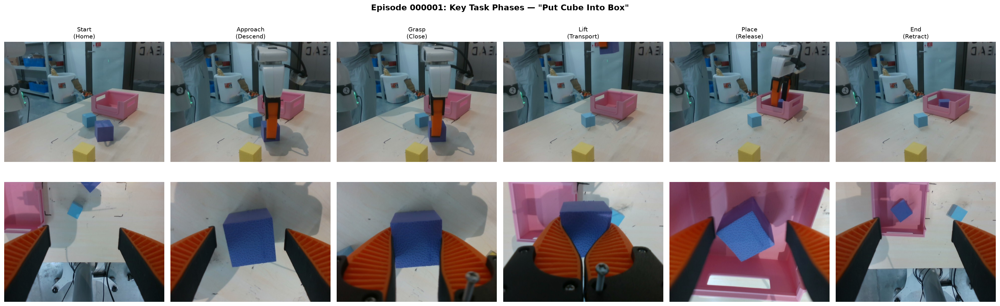
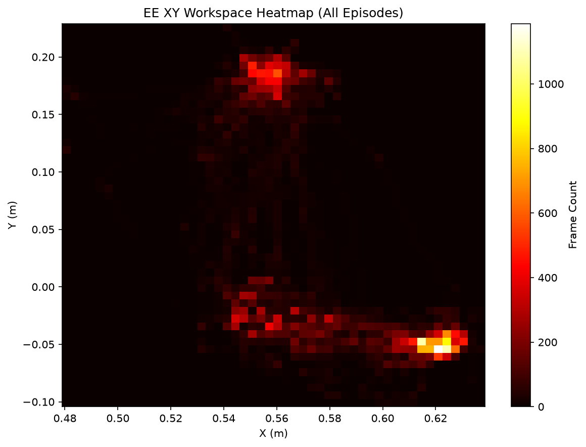
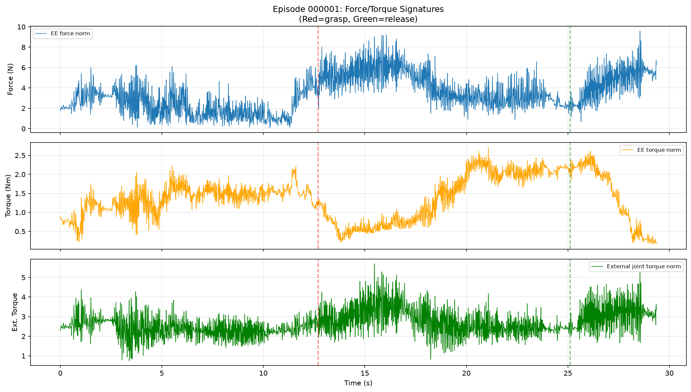
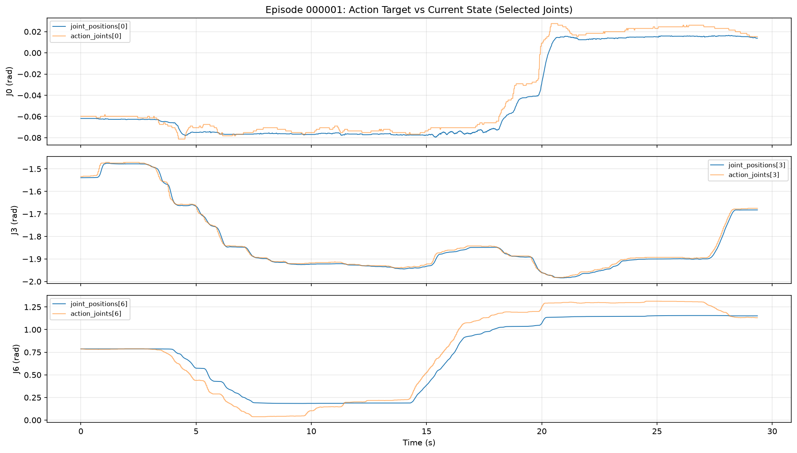
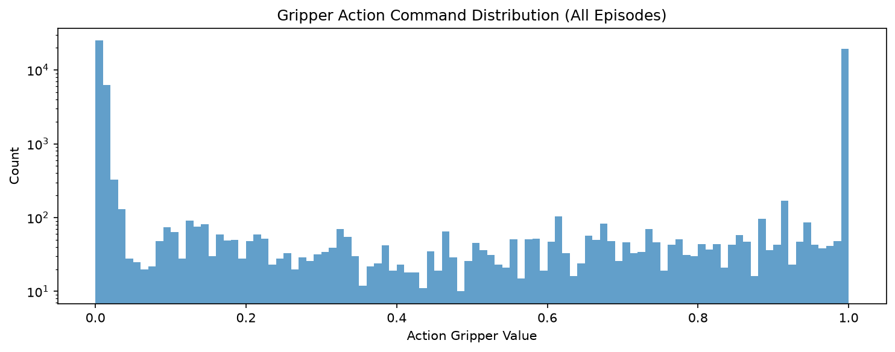
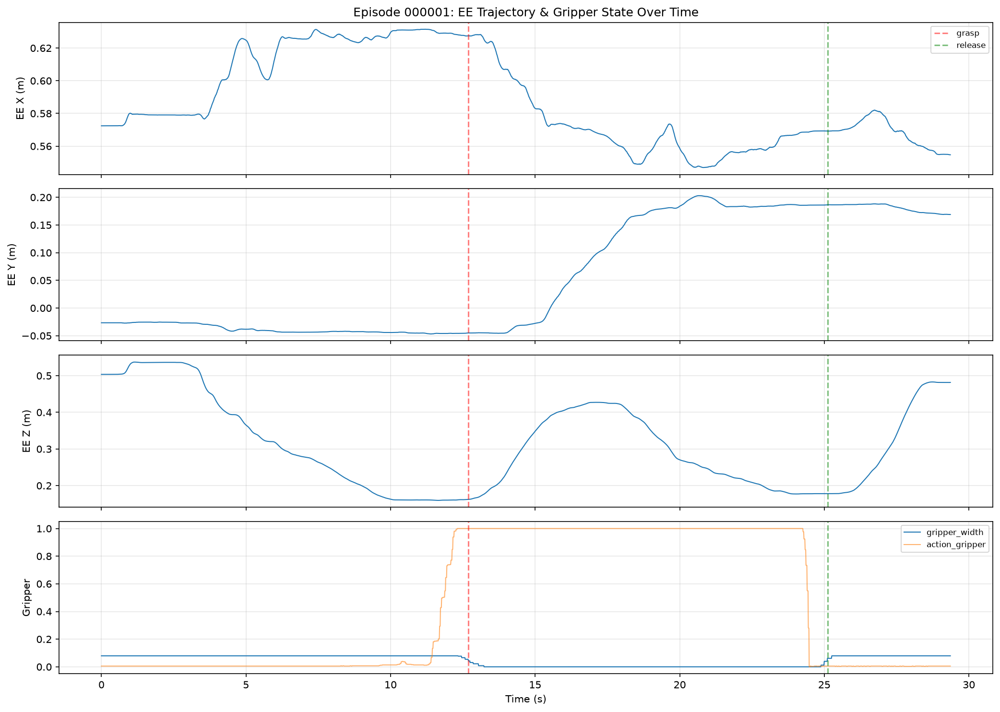
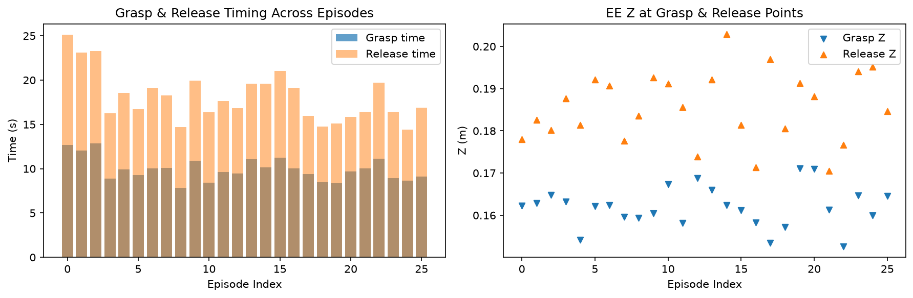
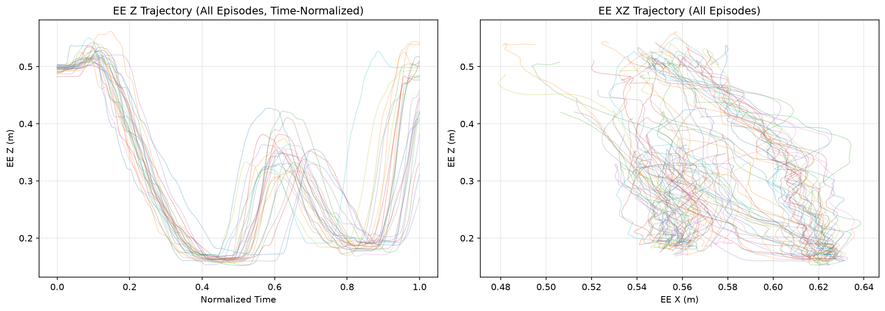
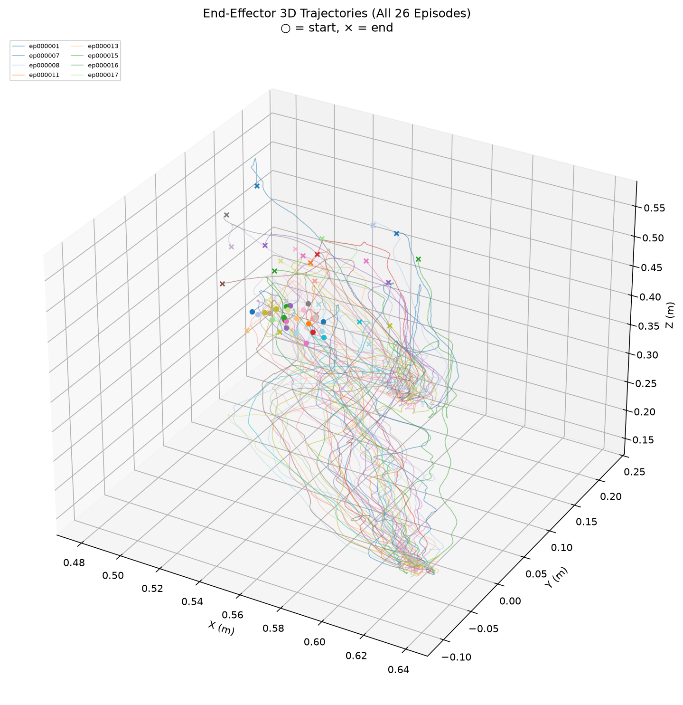

# "Put Cube Into Box" 训练数据深度分析

> **数据路径**: `/B/Dta/put_cube_into_box/put_cube_into_box_hdf5/`
> **任务**: 用 Franka Emika Panda 7-DoF 机械臂夹取方块放入盒子
> **目标**: 为 VLA (Vision-Language-Action) 模型训练提供数据质量评估与特征分析

---

## 1. 数据集总览

### 1.1 基本统计

| 指标 | 值 |
|------|-----|
| 总 episode 数（meta.json） | 56 |
| 实际可用 episode 数 | 26 (筛选后) |
| Episode 编号 | 1, 7, 8, 11, 13, 15–17, 19–21, 24, 27, 29, 33–34, 38, 43–47, 50–52, 55 |
| 缺失 episode 数 | 30 (编号不连续, 推测被质量筛选剔除) |
| 总时长 | 551.7 秒 ≈ 9.2 分钟 |
| 总数据量 | 2,687 MB ≈ 2.6 GB |
| 机器人 | Franka Emika Panda (7-DoF) |
| 相机数 | 2 (全局 global + 腕部 wrist) |
| 任务描述 | `"put cube into box"` |

### 1.2 数据采集频率

| 数据流 | 标称频率 | 实测频率 (mean ± std) |
|--------|---------|---------------------|
| Robot State | 100 Hz | 99.6 ± 0.1 Hz |
| Global Camera | 30 Hz | 30.0 ± 0.0 Hz |
| Wrist Camera | 30 Hz | 30.0 ± 0.0 Hz |

**时间戳特征**:
- 时间戳从 ~0 开始（非 epoch 时间戳）, 表明已做偏移归零处理
- State 帧间隔: 10.04 ± 0.09 ms, 非常稳定
- Camera 帧间隔: 33.37 ± 0.07 ms (global), 33.38 ± 0.10 ms (wrist)
- 双目同步差: mean = 2.60 ms, max = 6.26 ms, 同步质量良好
- State/Camera 帧数比: 3.32 (接近理论值 100/30 ≈ 3.33)

### 1.3 每 Episode 统计

| 指标 | Min | Max | Mean | Std |
|------|-----|-----|------|-----|
| 时长 (s) | 15.8 | 29.4 | 21.2 | 3.1 |
| State 帧数 | 1,573 | 2,925 | 2,115 | — |
| Camera 帧数 (global) | 473 | 880 | 636 | — |
| Camera 帧数 (wrist) | 475 | 880 | 636 | — |
| 文件大小 (MB) | 76.7 | 154.2 | 103.4 | — |

---

## 2. 数据结构分析

### 2.1 HDF5 文件结构

每个 episode 是一个独立的 HDF5 文件, 内部结构如下:

```
episode_XXXXXX.hdf5
├── camera_global/
│   ├── color_image_jpeg    (N_cam,)     object   # JPEG 编码的 RGB 图像
│   ├── depth_image         (N_cam, 480, 640)  uint16  # 深度图
│   └── timestamps          (N_cam,)     float64
├── camera_wrist/
│   ├── color_image_jpeg    (N_cam,)     object
│   ├── depth_image         (N_cam, 480, 640)  uint16
│   └── timestamps          (N_cam,)     float64
└── robot_state/
    ├── timestamps          (N_state,)   float64
    ├── joint_positions     (N_state, 7) float64  # 7个关节角度 (rad)
    ├── joint_velocities    (N_state, 7) float64  # 7个关节角速度 (rad/s)
    ├── joint_torques       (N_state, 7) float64  # 7个关节力矩
    ├── joint_torques_external (N_state, 7) float64  # 外部力矩(接触检测)
    ├── ee_pos              (N_state, 3) float64  # 末端执行器位置 (m)
    ├── ee_quat             (N_state, 4) float64  # 末端执行器四元数
    ├── ee_force            (N_state, 3) float64  # 末端力 (N)
    ├── ee_torque           (N_state, 3) float64  # 末端力矩 (Nm)
    ├── gripper_width       (N_state, 1) float64  # 夹爪宽度 (m)
    ├── action_joints       (N_state, 7) float64  # 关节动作指令
    └── action_gripper      (N_state, 1) float64  # 夹爪动作指令
```

其中 $N_\text{cam}$ 为相机帧数 (~636), $N_\text{state}$ 为状态帧数 (~2115).

### 2.2 存储结构分析

以 episode_000001 (880 cam frames, 2925 state frames, 149.9MB) 为例:

| 数据 | 原始大小 | 压缩后大小 | 压缩方式 | 压缩比 |
|------|---------|-----------|---------|-------|
| Global depth | 515.6 MB | 42.5 MB | LZF | 8.2% |
| Wrist depth | 515.6 MB | 44.9 MB | LZF | 8.7% |
| Global JPEG | — | ~32.7 MB | JPEG (预编码) | — |
| Wrist JPEG | — | ~32.3 MB | JPEG (预编码) | — |
| Robot state (all) | ~1.1 MB | ~1.1 MB | 无压缩 | 100% |

**结论**: 深度图是存储主体 (~58%), 其次是 JPEG 彩色图 (~43%). 机器人状态数据占比极小 (<1%). 深度图的 LZF 压缩率约 12:1, 效果显著.

### 2.3 图像数据

- **分辨率**: 640 × 480 (RGB + Depth)
- **彩色图**: JPEG 编码存储, 解码后为 RGB 三通道, 单帧约 38–39 KB
- **深度图**: uint16 原始值存储 (LZF 压缩), 无效像素 (depth=0) 约占 12%

**深度值量纲分析**:
- Global depth: 非零值范围 [285, 19410]
- Wrist depth: 非零值范围 [154, 32600] (部分 65535 为无效)
- 若以 mm 为单位: Global 范围 [0.285m, 19.4m] — 偏大, 但 19m 可能是背景远处
- 若以 0.1mm 为单位: Global 范围 [0.029m, 1.94m] — 合理的桌面场景深度

> **推断**: 深度值单位很可能是 **0.1 mm** (即 10000 = 1 m), 对应有效场景深度约 3cm–2m. 也可能是 mm 单位, 但远处背景值偏大 (19m 是否合理取决于实际场景). 建议在使用时通过标定参数确认.

### 2.4 关键帧示意

下图展示了 episode_000001 在六个关键任务阶段的全局相机和腕部相机画面:



阶段依次为: 起始位置 → 接近下降 → 夹取闭合 → 抬升搬运 → 放置释放 → 返回收回.

---

## 3. 机器人状态分析

### 3.1 关节空间

#### 关节角度 ($q_i$, rad)

| 关节 | Min | Max | Mean | Std | 范围宽度 |
|------|-----|-----|------|-----|---------|
| $q_0$ | -0.139 | 0.151 | -0.016 | 0.055 | 0.289 |
| $q_1$ | -0.142 | 0.479 | 0.197 | 0.168 | 0.620 |
| $q_2$ | -0.169 | 0.430 | 0.071 | 0.144 | 0.599 |
| $q_3$ | -2.144 | -1.475 | -1.875 | 0.146 | 0.669 |
| $q_4$ | -0.161 | 0.241 | -0.001 | 0.070 | 0.402 |
| $q_5$ | 1.506 | 2.469 | 2.055 | 0.259 | 0.963 |
| $q_6$ | -0.057 | 1.342 | 0.568 | 0.375 | 1.398 |

**特点**:
- $q_3$ (肘关节) 始终为负值 (~-1.9 rad ≈ -109°), 说明肘部保持弯曲姿态
- $q_5$ (腕关节1) 活动范围最大 (~55°), 是任务中最活跃的关节之一
- $q_6$ (腕关节2/旋转) 范围最宽 (1.398 rad ≈ 80°), 与夹取方向调整相关
- 各关节均未接近 Franka 的关节极限, 操作在安全工作空间内

#### 关节速度 ($\dot{q}_i$, rad/s)

| 关节 | Max |$\dot{q}|$ | Mean |$\dot{q}|$ |
|------|----------------|----------------|
| $q_0$ | 0.243 | 0.027 |
| $q_1$ | 0.548 | 0.118 |
| $q_2$ | 0.598 | 0.064 |
| $q_3$ | 0.688 | 0.080 |
| $q_4$ | 0.793 | 0.058 |
| $q_5$ | 0.967 | 0.162 |
| $q_6$ | 1.058 | 0.160 |

速度整体较低 (最大 ~1 rad/s, 远低于 Franka 的 ~2.6 rad/s 极限), 体现为 **平稳的遥操作或预编程运动**.

### 3.2 笛卡尔空间 (末端执行器)

#### 工作空间

```
EE Position Workspace:
  X: [0.479, 0.639] m  (width: 0.160 m)  — 前后方向
  Y: [-0.104, 0.229] m (width: 0.333 m)  — 左右方向
  Z: [0.152, 0.562] m  (width: 0.410 m)  — 上下方向
```



从热力图可以看出:
- **Y 方向** 密度分布呈双峰: 方块拾取区 (Y ≈ -0.05m) 和 盒子放置区 (Y ≈ +0.18m)
- **X 方向** 集中在 0.55–0.63m, 表明方块和盒子都在机器人前方相近距离
- 高密度区域对应运动的"停留"阶段 (夹取/放置前的精确对位)

#### 末端速度

| Episode | Max Speed | Mean Speed |
|---------|-----------|------------|
| ep001 | 0.247 m/s | 0.052 m/s |
| ep007 | 0.310 m/s | 0.058 m/s |
| ep008 | 0.312 m/s | 0.058 m/s |
| ep011 | 0.287 m/s | 0.072 m/s |
| ep013 | 0.270 m/s | 0.069 m/s |

平均末端速度约 5–7 cm/s, 峰值不超过 31 cm/s, 属于精细操作的典型速度范围.

#### 末端朝向

四元数统计: mean ≈ [0.980, 0.135, -0.011, -0.004]

$q_x$ 分量接近 1, 表明末端几乎始终保持 **向下抓取** 的姿态 (绕 X 轴旋转约 180°, 使夹爪朝下). $q_y$ 的小变化 (std=0.135) 对应在夹取和放置时的轻微俯仰调整.

### 3.3 力/力矩传感



| 阶段 | 外部力矩范数 (mean) |
|------|------------------|
| 夹取前 (t≈11s) | 2.33 |
| 夹取中 (t≈13s) | 2.91 |
| 抬升中 (t≈15s) | 3.36 |
| 放置中 (t≈24s) | 2.34 |

外部力矩在 **抬升阶段** 最大 (因为承载方块重力), 但变化幅度不大 (~2.3→3.4), 说明方块质量较轻. 力/力矩数据可作为接触检测的辅助信号, 但对于纯视觉-语言-动作 (VLA) 模型训练, 通常不直接使用.

---

## 4. 动作 (Action) 语义分析

### 4.1 关节动作 (action_joints)

**action_joints 与 joint_positions 的关系**:

| 对比 | MAE (rad) |
|------|-----------|
| $a_t$ vs $q_t$ (当前状态) | 0.040 |
| $a_t$ vs $q_{t+1}$ (下一状态) | 0.040 |
| $a_t$ vs $q_{t+10}$ (10步后) | 0.037 |
| $a_t$ vs $q_{t+20}$ (20步后) | 0.035 |
| $a_t$ vs $q_{t+50}$ (50步后) | 0.038 |



**关键发现**:
- action_joints 并非简单的 "下一步目标" (next-step target), 因为 $a_t$ 与 $q_{t+1}$ 的 MAE 并未显著小于与 $q_t$ 的 MAE
- action_joints 更像是一个 **前瞻性目标位置** (lookahead target), 约领先当前状态 20–50 步 (0.2–0.5 秒), MAE 在 $k \approx 20$ 时最低
- action_joints 的范围略大于 joint_positions (例如 $q_4$: action范围 [-0.264, 0.311] vs state范围 [-0.161, 0.241]), 表明目标位置可超出当前已达到的范围

> **对 VLA 训练的含义**: 使用 action_joints 作为训练标签时, 模型学到的是一个 **几百毫秒的前瞻指令**, 而非即时目标. 这对 flow matching 式的连续动作预测是合适的, 因为它允许平滑的轨迹规划. 但如果使用 delta action 模式, 需注意 delta 计算的基准.

### 4.2 夹爪动作 (action_gripper)

```
Action Gripper 值分布:
  [0.00, 0.01): 45.5%  — 闭合指令
  [0.01, 0.05): 12.4%  — 过渡区
  [0.05, 0.50):  3.0%  — 中间值
  [0.50, 0.99):  4.1%  — 过渡区
  [0.99, 1.00]: 35.0%  — 张开指令
```



夹爪指令为 **连续值** (范围 [0, 1]), 但分布高度双峰化:
- 0 附近 (~45%): 闭合夹爪
- 1 附近 (~35%): 张开夹爪
- 中间过渡 (~20%): 对应夹爪开合动作的过渡帧

> **注意**: action_gripper 并非简单的 {0, 1} 二值信号. 中间值来自控制指令的渐变过渡. 对于 VLA 模型训练, 这种连续过渡提供了比离散 open/close 更丰富的梯度信号. 但如果用 FAST 离散化方案, 可考虑将夹爪指令二值化以简化.

### 4.3 夹爪宽度 (gripper_width)

实测夹爪宽度 (state observation):
```
  闭合 (<5mm):  23.7%
  过渡 (5–60mm):  4.2%
  张开 (60–81mm): 60.9%
```

Franka 夹爪最大宽度 ~80mm. 张开时约 70–81mm, 闭合时约 0mm. 每个 episode 恰好有 **1 次闭合事件** 和 **1 次张开事件**, 对应清晰的 "抓取→释放" 行为模式.

---

## 5. 任务结构与阶段分析

### 5.1 典型任务流程

通过分析末端位置轨迹和夹爪状态, 每个 episode 呈现出清晰的五阶段结构:




各阶段时间分析 (以 episode_000001 为例, 总时长 29.4s):

| 阶段 | 时间区间 | 持续 | EE 运动特征 |
|------|---------|------|-----------|
| Home → Approach | 0–11.7s | ~11.7s | Z: 0.50→0.16m (下降 34cm) |
| Approach → Grasp | 11.7–12.7s | ~1.0s | 精确对位 + 闭合 |
| Grasp → Lift+Transport | 12.7–25.1s | ~12.4s | Z: 0.16→0.50→0.18m, Y: -0.05→+0.19m |
| Place → Retract | 25.1–29.4s | ~4.3s | 释放 + Z 回升 |

### 5.2 夹取与释放位置统计

| 指标 | Grasp Position (mean ± std) | Release Position (mean ± std) |
|------|---------------------------|------------------------------|
| X (m) | 0.622 ± 0.004 | 0.559 ± 0.007 |
| Y (m) | -0.048 ± 0.005 | 0.186 ± 0.011 |
| Z (m) | 0.162 ± 0.005 | 0.185 ± 0.008 |

**夹取→释放的 3D 位移**: mean = 0.244 m, 其中 Y 方向位移最大 (0.235 m), 表明方块和盒子主要沿 Y 轴 (左右) 排列.

**位置一致性**: Grasp 位置的 std 仅 4–5mm, Release 位置的 std 为 7–11mm, 说明:
- 方块的初始位置在各 episode 间变化很小 (可能是固定摆放或仅有微小变化)
- 盒子位置也相对固定, 但释放精度略低于夹取精度

> **对 VLA 泛化性的影响**: 夹取/释放位置的变异性较低 (仅 mm 级), 意味着该数据集的 **空间多样性有限**. 模型可能会过拟合到特定的方块-盒子空间布局. 若要提升泛化能力, 建议在不同位置摆放方块和盒子以增加数据多样性.

### 5.3 夹取与释放时间统计

```
夹取时间: mean = 9.94s ± 1.28s
释放时间: mean = 18.11s ± 2.73s
持有时长: mean = 8.17s
```



夹取时间分布的 std 较小 (1.28s), 表明操作者有一致的 approach 策略. 释放时间 std 较大 (2.73s), 可能与搬运路径的变异有关.

### 5.4 起止位置一致性

```
起始 EE 位置: mean = [0.558, -0.028, 0.496] m, std = [0.010, 0.014, 0.005] m
结束 EE 位置: mean = [0.533, 0.098, 0.450] m, std = [0.020, 0.072, 0.067] m
```

- 所有 episode 的起始位置高度一致 (std < 1.4 cm), 说明有统一的 home 位置
- 结束位置的 Y 和 Z std 较大 (~7cm), 说明 episode 结束时机器人并未完全回到 home 位置

---

## 6. 跨 Episode 变异性分析

### 6.1 轨迹多样性





从归一化时间轴上的 Z 轨迹叠加图可以看出:
- **下降阶段** (t_norm ≈ 0–0.4): 所有轨迹高度一致, 呈单调下降
- **抬升-搬运阶段** (t_norm ≈ 0.5–0.8): 轨迹出现分叉, 主要体现在抬升高度和搬运路径的差异
- **放置-返回阶段** (t_norm ≈ 0.8–1.0): 变异性最大, 与结束位置的多样性一致

### 6.2 关节空间一致性

| 关节 | 起始位置 Std (rad) | 结束位置 Std (rad) |
|------|-------------------|-------------------|
| $q_0$ | 0.030 | 0.052 |
| $q_1$ | 0.032 | 0.078 |
| $q_2$ | 0.035 | 0.134 |
| $q_3$ | 0.041 | 0.103 |
| $q_4$ | 0.051 | 0.074 |
| $q_5$ | 0.033 | 0.144 |
| $q_6$ | 0.067 | 0.162 |

起始位置 std 均 < 0.07 rad (< 4°), 确认了统一的初始姿态. 结束位置 std 约为起始的 2–4 倍.

### 6.3 运动平滑性

```
Joint jerk (mean abs): 1.7 – 2.2 (across episodes)
EE acceleration norm:  1.16 – 1.39 m/s²
```

运动整体平滑, 无明显的急加急停. 这对于 flow matching 类的动作生成模型是有利的, 因为平滑轨迹更易于通过连续流场来拟合.

---

## 7. 数据质量评估

### 7.1 数据完整性

| 检查项 | 结果 |
|--------|------|
| NaN 值 | 所有 26 episodes, 全部字段均无 NaN |
| Inf 值 | 所有 26 episodes, 全部字段均无 Inf |
| 四元数范数 | 均为 1.000000, 无异常 |
| 时间戳单调性 | 所有 episode 时间戳严格递增 |
| 帧数一致性 | Global/Wrist camera 帧数差异 ≤ 2 帧 |

### 7.2 数据质量总结

**优势**:
- 采集频率稳定, 帧间隔 std 极小 (< 0.1 ms)
- 双目相机同步良好 (max diff < 7 ms)
- 数据无缺失/异常值, 质量可靠
- 运动平滑, 适合连续动作预测
- 每个 episode 有清晰的任务阶段结构

**潜在问题**:
- **Episode 数量有限** (仅 26 个可用, 总计 ~9 分钟), 对于 VLA 模型训练可能不足
- **空间多样性低**: 方块/盒子位置几乎固定 (std < 1cm), 模型可能过拟合特定空间布局
- **缺失率高**: meta.json 声称 56 个 episode, 实际仅 26 个 (46%), 30 个被过滤
- **结束姿态不一致**: 部分 episode 未返回标准 home 位置
- **无语言指令变体**: 所有 episode 的 task 字段均为 `"put cube into box"`, 缺乏指令多样性

---

## 8. VLA 训练适配性分析

### 8.1 数据格式对接

该数据为自定义 HDF5 格式, 与 InternVLA-A1.5 使用的 LeRobot 格式不同. 对接时需注意:

| 数据字段 | 当前格式 | LeRobot 所需 | 转换建议 |
|----------|---------|-------------|---------|
| 图像 | JPEG 编码 object | 视频文件或解码后张量 | 解码→存为 mp4 或直接解码加载 |
| 关节状态 | (N, 7) float64 | `observation.state` | 按需选择子集 + 归一化 |
| 动作 | `action_joints` (N, 7) + `action_gripper` (N, 1) | `action` (N, D) | 拼接为 8-dim 向量 |
| 深度图 | uint16 | 通常不用于 VLA | 可选用, 需标定后转 metric |

### 8.2 Action Mode 选择

根据 action 语义分析:

- **Absolute action** (`action_mode=abs`): 直接使用 `action_joints` 作为目标关节角. 优点是物理含义清晰; 缺点是不同起始位置的泛化可能受限.
- **Delta action** (`action_mode=delta`): 计算 `action_joints[t] - joint_positions[t]` 作为增量. 此数据中 delta 平均约 0.04 rad (2.3°). 注意 action 并非精确的 next-step target, delta 中包含了前瞻偏差.

> **建议**: 对于该数据集, 因为空间多样性低, abs 和 delta 的差异不大. 但如果后续混合多场景数据, delta mode 可能有更好的泛化性.

### 8.3 关键训练超参考量

基于数据特征, 以下参数值得关注:

| 参数 | 建议值 | 依据 |
|------|--------|------|
| `action_chunk_size` | 50–100 | Action 有 ~20–50 步前瞻性, chunk 覆盖 0.5–1s |
| `camera_names` | `["global", "wrist"]` | 双视角提供互补信息 |
| `image_size` | 256×256 或 224×224 | 原始 640×480, 需 resize+pad |
| `state_dim` | 7 (joints) 或 8 (joints+gripper) | gripper_width 提供握持状态 |
| `action_dim` | 8 (7 joints + 1 gripper) | 拼接 action_joints + action_gripper |
| `fps` (training) | 30 (与 camera 对齐) 或 10 (下采样) | 100Hz state 需下采样至 camera 频率 |

### 8.4 数据增强建议

鉴于该数据集的空间多样性有限, 建议:

1. **色彩抖动** (Color Jitter): 增强视觉鲁棒性
2. **随机裁剪+缩放**: 模拟不同视角
3. **多数据集混合**: 与其他 pick-and-place 数据集 (如 LIBERO, RoboTwin) 混合训练
4. **时间下采样随机化**: 训练时随机跳帧, 增强时间鲁棒性

---

## 9. 关键图表索引

| 图表 | 文件 | 说明 |
|------|------|------|
| 任务阶段合成图 | [ep001_key_phases_composite.png](asset/ep001_key_phases_composite.png) | 6个关键帧, 双视角 |
| EE 轨迹时间序列 | [ep001_ee_gripper_timeline.png](asset/ep001_ee_gripper_timeline.png) | XYZ + 夹爪随时间变化 |
| 关节角度时间序列 | [ep001_joint_positions.png](asset/ep001_joint_positions.png) | 7-DoF 关节角随时间变化 |
| 3D 轨迹叠加图 | [ee_3d_trajectories.png](asset/ee_3d_trajectories.png) | 26 episodes 的 EE 3D 轨迹 |
| 工作空间热力图 | [ee_workspace_heatmap.png](asset/ee_workspace_heatmap.png) | EE XY 平面密度分布 |
| 动作 vs 状态对比 | [ep001_action_vs_state.png](asset/ep001_action_vs_state.png) | action_joints 与 joint_positions 关系 |
| 力/力矩信号 | [ep001_force_torque.png](asset/ep001_force_torque.png) | 接触阶段力信号变化 |
| 夹爪指令分布 | [gripper_action_distribution.png](asset/gripper_action_distribution.png) | action_gripper 的双峰分布 |
| 深度图可视化 | [ep001_depth_images.png](asset/ep001_depth_images.png) | 关键帧的深度图 |
| 夹取/释放对比 | [grasp_release_comparison.png](asset/grasp_release_comparison.png) | 跨 episode 的时间与位置对比 |
| 轨迹变异性 | [cross_episode_trajectory_variability.png](asset/cross_episode_trajectory_variability.png) | 归一化时间下的 Z 轨迹叠加 |
| 时长/帧数分布 | [episode_distributions.png](asset/episode_distributions.png) | Episode 时长与帧数直方图 |

---

## 10. 总结

该数据集是一个质量较高但规模较小的 Franka 机器臂 pick-and-place 训练集. 数据采集规范 (100Hz 状态 + 30Hz 双目视觉), 无数据缺失或异常, 任务结构清晰 (approach → grasp → transport → place). 主要限制在于: (1) 仅 26 个 episode (~9 分钟), 数据量偏少; (2) 方块/盒子位置几乎固定, 空间泛化性受限; (3) 语言指令单一. 如用于 VLA 模型微调 (fine-tuning), 该数据集可作为单任务 demo, 但需注意过拟合风险并考虑与其他数据源的混合训练策略.
