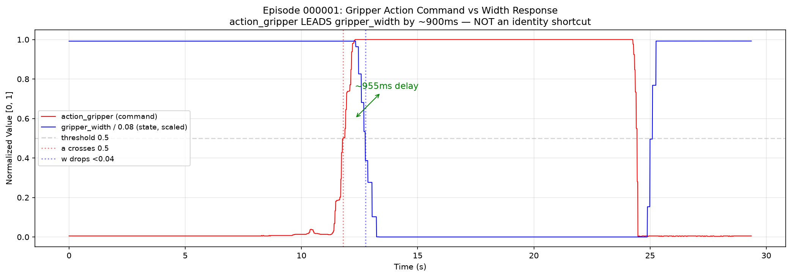
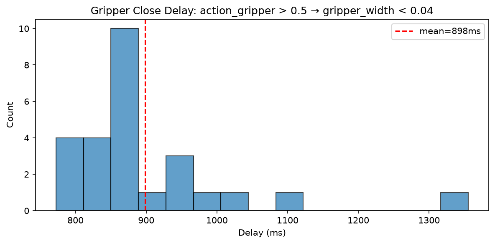
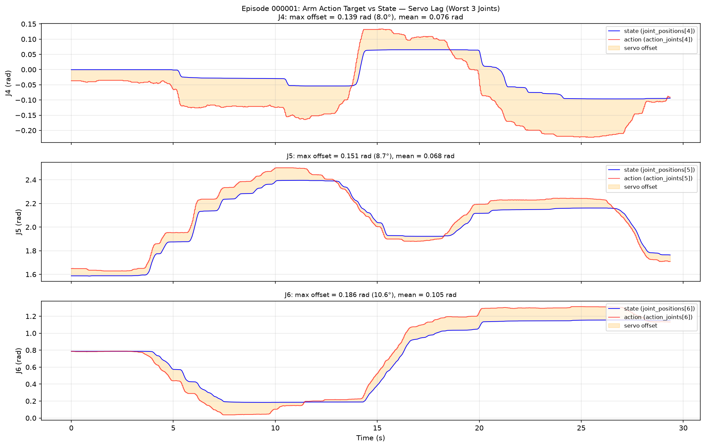
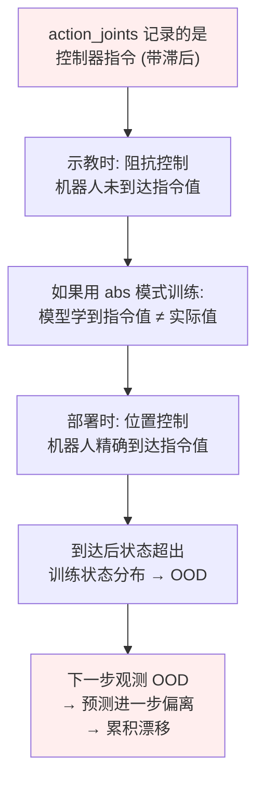
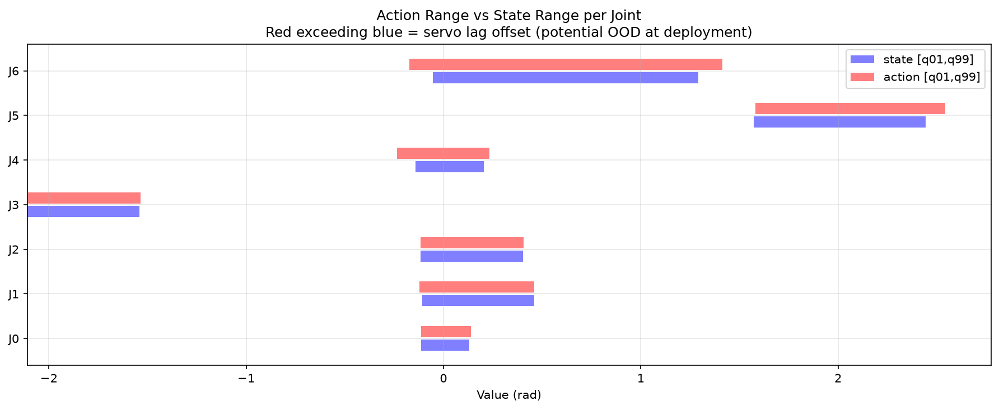
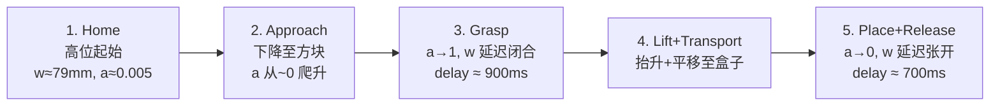

# "Put Cube Into Box" 训练数据深度分析 (V2)

> **数据路径**: `/B/Dta/put_cube_into_box/put_cube_into_box_hdf5/`
> **任务**: 用 Franka Emika Panda 7-DoF 机械臂夹取方块放入盒子
> **目标**: 为 VLA (Vision-Language-Action) 模型训练提供数据质量评估, 重点检验从 Franka 插插座任务中已发现的数据缺陷模式
> **参考文档**: `b/d/Frk/dta_prblm_solv1.markdown` (插插座夹爪恒等缺陷深度分析), `b/d/Frk/olddta_prblm_solv46_1.markdown` (各通道影响分析), `b/d/Frk2/ds2_analyz.md` (插插座数据集分析), `b/d/Frk2/realwrld_debug/` (Franka 真机调试记录)

---

## 0. 与插插座数据对比摘要

在 Franka 插插座任务 (`plug_into_socket_hdf5`) 中已发现的致命数据缺陷:

| 缺陷 | 插插座数据 | 本数据集 (put_cube_into_box) | 严重程度 |
|:---|:---|:---|:---|
| 夹爪恒等捷径 $a_t \equiv 1 - w_t / 0.08$ | **精确成立** (float64: $1.67 \times 10^{-16}$) | **不成立** (R² = 0.78, 见 §2) | 本数据集无此问题 |
| `gripper_width` 是派生量 | **是** (100% bit-exact) | **否** (独立传感器, 见 §2.3) | 本数据集无此问题 |
| 臂关节伺服滞后 | q5/q7 严重 (最佳超前 600ms) | q4/q6 严重 (超前 440–740ms, 见 §3) | **本数据集同样存在** |
| Action 超出 State 包络 | q7 超出 0.115 rad | q4 超出 0.103 rad, q6 超出 0.157 rad (见 §4) | **本数据集更严重** |

**核心结论**: 本数据集的夹爪通道质量**显著优于**插插座数据——`action_gripper` 是独立的控制指令, `gripper_width` 是真实传感器, 二者有约 700–900ms 的物理响应延迟. 但**臂关节的伺服滞后**问题同样存在, 且在 q4 和 q6 上比插插座数据更严重.

---

## 1. 数据集基本信息

### 1.1 概览

| 指标 | 值 |
|------|-----|
| 可用 episode 数 | 26 (meta.json 声称 56, 30 个缺失/已过滤) |
| 总时长 | 551.7 秒 ≈ 9.2 分钟 |
| 总数据量 | 2,687 MB ≈ 2.6 GB |
| Robot State 频率 | 100 Hz (实测 99.6 ± 0.1 Hz) |
| Camera 频率 | 30 Hz (双目: global + wrist) |
| 图像分辨率 | 640 × 480 (JPEG RGB + uint16 Depth) |
| 数据质量 | 全字段无 NaN/Inf, 时间戳严格递增 |

### 1.2 HDF5 文件结构

```
episode_XXXXXX.hdf5
├── camera_global/
│   ├── color_image_jpeg    (N_cam,)     object     # JPEG 编码 RGB
│   ├── depth_image         (N_cam, 480, 640)  uint16  # 深度图 (LZF 压缩)
│   └── timestamps          (N_cam,)     float64
├── camera_wrist/           (同上)
└── robot_state/
    ├── timestamps          (N_state,)   float64
    ├── joint_positions     (N_state, 7) float64     # 关节角度 (rad)
    ├── joint_velocities    (N_state, 7) float64
    ├── joint_torques       (N_state, 7) float64
    ├── joint_torques_external (N_state, 7) float64  # 外部力矩
    ├── ee_pos              (N_state, 3) float64     # EE 位置 (m)
    ├── ee_quat             (N_state, 4) float64     # EE 四元数
    ├── ee_force            (N_state, 3) float64     # EE 力 (N)
    ├── ee_torque           (N_state, 3) float64     # EE 力矩 (Nm)
    ├── gripper_width       (N_state, 1) float64     # 夹爪宽度 (m)
    ├── action_joints       (N_state, 7) float64     # 关节动作指令
    └── action_gripper      (N_state, 1) float64     # 夹爪动作指令
```

---

## 2. 夹爪通道语义验证 (关键检查)

### 2.1 恒等捷径检测: $a_t \stackrel{?}{=} 1 - w_t / W_{\max}$

在插插座数据中, `action_gripper` 与 `gripper_width` 满足 float64 精度的代数恒等关系, 导致模型无法从中学到任何预测性信息. 对本数据集执行同一检测:

| 检验 | 插插座结果 | 本数据集结果 | 判定 |
|:---|:---|:---|:---|
| $\max\|a_t - (1 - w_t/0.08)\|$ | $1.67 \times 10^{-16}$ | **1.00** | **不成立** |
| $R^2(a_t, 1-w_t/0.08)$ | 1.000000 | **0.767** | **不成立** |
| Bit-exact $w = 0.08(1-a)$ | 100.0000% | **18.88%** | **不成立** |
| $\|\text{unique}(a)\|$ vs $\|\text{unique}(w)\|$ | 37857 > 36946 | **4756 > 349** | a 信息量远大于 w |

**结论: 本数据集不存在插插座数据中的夹爪恒等捷径.** $R^2$ 仅为 0.77, 线性拟合斜率为 -11.05 (而非 -12.5), 截距为 0.94 (而非 1.0). 夹爪动作指令与夹爪宽度之间是一个有 **真实物理延迟** 的因果关系, 不是代数恒等.

### 2.2 夹爪动作领先宽度: 独立信号的证据



对 episode_000001 的时间线分析:

| 事件 | 时间 | 说明 |
|:---|:---|:---|
| `action_gripper` 开始从 ~0 爬升 | t ≈ 9.6s | 操作者开始发出闭合指令 |
| `action_gripper` 越过 0.5 | t = 11.80s | 指令过半 |
| `action_gripper` 到达 1.0 | t = 12.33s | 指令饱和 |
| `gripper_width` 开始下降 | t = 12.41s | 夹爪开始响应 (延迟 ~600ms from 0.5) |
| `gripper_width` 降至 < 0.04m | t = 12.75s | 夹爪基本闭合 |

**关键特征: `action_gripper` 有一个从 0 到 1 的连续爬升过程 (持续约 2.7 秒), 而非瞬时跳变.** 这是遥操作/示教器输入的典型特征——操作者逐渐施加闭合命令, 硬件延迟后夹爪才响应.

跨全部 26 个 episode 的延迟统计:

| 事件 | 延迟 (mean ± std) | 范围 |
|:---|:---|:---|
| 闭合: $a > 0.5 \to w < 0.04$ | **898 ± 118 ms** | [772, 1355] ms |
| 闭合: $a > 0.5 \to w < 0.01$ | **1245 ± 118 ms** | [1064, 1668] ms |
| 张开: $a < 0.5 \to w > 0.05$ | **703 ± 103 ms** | [572, 1100] ms |



### 2.3 `gripper_width` 是真实传感器 (非派生量)

| 指标 | 插插座数据 | 本数据集 | 判定 |
|:---|:---|:---|:---|
| 连续帧逐位不变 | 71.69% | **96.33%** | 更高, 但特征不同 (见下) |
| 唯一值 / episode | 36946 (全局) | **~20** (每 episode) | 低分辨率传感器 |
| 非零变化中位值 | $1.66 \times 10^{-8}$ m | $4.81 \times 10^{-7}$ m | 高一个数量级 |
| $w = 0$ 精确 | 16.52% | **20.98%** | 相近 |
| $w < 0$ 帧 | 0% | **11.18%** | 有负值 (传感器噪声) |
| 帧间过渡统计 | a 和 w 完全同步 | a 变化 513 帧, w 不变; w 变化 62 帧, a 不变 | **独立变化** |

本数据集的 `gripper_width` 呈现出 **阶梯状量化** 的特征: 每个 episode 仅有约 20 个唯一值, 宽度在固定水平之间跳跃 (如 79.35mm → 66.08mm → 54.49mm → 30.96mm → ...). 这符合 Franka Hand 的低频位置报告特性, 证实是 **真实传感器读数** 而非 `action_gripper` 的仿射派生量.

**决定性证据**:
- `action_gripper` 改变时 (513 帧), `gripper_width` 不动 → **a 领先 w**
- `gripper_width` 改变时 (62 帧), `action_gripper` 已经到位 → **w 滞后于 a**
- $w < 0$ 存在 (最小值 $-1.44 \times 10^{-6}$ m) → 传感器零漂, 派生量不会有负值

### 2.4 对 VLA 训练的影响

与插插座数据不同, 本数据集的夹爪通道对 VLA 训练是**基本健康**的:

| 维度 | 插插座评估 | 本数据集评估 |
|:---|:---|:---|
| 模型能否从视觉学习夹爪时机? | **不能** (z_a ≡ -z_w) | **能** (z_a 与 z_w 相关但不恒等, R²=0.78) |
| 复制状态能否解决夹爪 loss? | 84% 方差被复制解释 | **负值** (copy-MSE = 3.77 > 1.0, 复制反而更差) |
| 夹爪维在 chunk 内是否可复制? | h=0 完美, h=10 R²=0.99 | h=0 R²=-2.77, **不可复制** |
| 部署时是否退化为不动点? | **是** (a ≡ 0.17 不动) | **不会** (a 包含独立的指令信息) |

**夹爪 copy-R² = -2.77 (负值)** 意味着用 "复制当前宽度" 作为预测比预测常数均值还差. 这是好消息——模型 **必须** 从其他信号 (视觉/语言/历史) 学习夹爪动作, 无法走捷径.

---

## 3. 臂关节伺服滞后分析 (关键问题)

### 3.1 同帧 Action vs State

| 关节 | R²(a,s) | max\|a-s\| (rad) | mean\|a-s\| (rad) | corr(offset, vel) | 严重程度 |
|:---|:---|:---|:---|:---|:---|
| q0 | 0.9859 | 0.045 (2.6°) | 0.007 | +0.10 | 低 |
| q1 | 0.9849 | 0.098 (5.6°) | 0.015 | +0.51 | 中 |
| q2 | 0.9972 | 0.077 (4.4°) | 0.004 | +0.16 | 低 |
| q3 | 0.9980 | 0.065 (3.7°) | 0.006 | +0.17 | 低 |
| **q4** | **0.5577** | **0.162 (9.3°)** | **0.064** | +0.14 | **高** |
| **q5** | 0.9598 | **0.165 (9.4°)** | **0.065** | +0.25 | **高** |
| **q6** | 0.9234 | **0.272 (15.6°)** | **0.119** | +0.19 | **极高** |



**q4、q5、q6 存在显著的伺服滞后.** q6 的最大偏置达 15.6°, 均值也有 6.8°. 这意味着 `action_joints` 记录的是**控制器下发的指令**, 而非机器人实际到达的位置.

### 3.2 最佳时间超前分析

通过扫描 $a_t$ 与 $q_{t+k}$ 的 R², 找到每个关节指令到达位的最佳延迟:

| 关节 | 最佳超前 $k$ | 延迟 | R² 提升 |
|:---|:---|:---|:---|
| q0 | 0 | 0 ms | — (已很高) |
| q1 | 16 | **160 ms** | 0.985 → 0.997 |
| q2 | 0 | 0 ms | — |
| q3 | 0 | 0 ms | — |
| **q4** | **74** | **740 ms** | 0.558 → 0.634 |
| **q5** | 21 | **210 ms** | 0.960 → 0.973 |
| **q6** | 44 | **440 ms** | 0.923 → 0.944 |

q4 的最佳超前达 **740ms**, 且即使在最佳超前下 R² 也仅有 0.634, 说明 q4 的动作指令与状态之间不仅有延迟, 还有显著的跟踪误差.

**与插插座数据对比**: 插插座中 q5/q7 延迟 600ms, q6 延迟 280ms. 本数据集 q4 延迟更大 (740ms), q6 也有 440ms, 整体严重程度相近.

### 3.3 伺服滞后的后果



这正是插插座真机实验中 q7 一路跌到 0.458/0.40 的根因 (见 `b/d/Frk2/realwrld_debug/grperr_1.markdown`). **本数据集在 q4 和 q6 上面临同样的风险.**

---

## 4. Action 超出 State 包络 (OOD 风险)

### 4.1 逐关节分析



| 关节 | Action 超出 State 下界 | Action 超出 State 上界 | OOD 帧占比 | 风险 |
|:---|:---|:---|:---|:---|
| q0 | 0.003 rad | 0.015 rad | 0.5% | 低 |
| q1 | 0.009 rad | 0 | 0.1% | 低 |
| q2 | 0 | 0.003 rad | 0 | 低 |
| q3 | 0 | 0.004 rad | 0 | 低 |
| **q4** | **0.103 rad (5.9°)** | 0.070 rad (4.0°) | **11.5%** | **高** |
| **q5** | 0.047 rad | **0.088 rad (5.0°)** | **7.9%** | **高** |
| **q6** | **0.147 rad (8.4°)** | **0.157 rad (9.0°)** | **7.2%** | **极高** |

**q4**: 10.62% 的 action 帧低于 state 的历史最小值. 这意味着如果模型在 abs 模式下学到这些目标, 部署时机器人将被送到训练中从未观测到的关节角度.

**q6**: 两端都超出 ~0.15 rad (约 8.5°), 7.2% 的帧属于 OOD. 这是本数据集中最严重的 OOD 风险关节.

### 4.2 Delta Action 统计

若使用 `action_mode=delta`, 增量为 $\delta_t = a_t - s_t$:

| 关节 | $\delta$ mean | $\delta$ std | $\|\delta\|$ mean | $\delta$ range |
|:---|:---|:---|:---|:---|
| q0 | +0.006 | 0.007 | 0.007 | [-0.032, +0.045] |
| q1 | -0.006 | 0.021 | 0.015 | [-0.098, +0.060] |
| q2 | +0.003 | 0.008 | 0.004 | [-0.077, +0.073] |
| q3 | +0.004 | 0.006 | 0.006 | [-0.047, +0.065] |
| **q4** | **-0.027** | **0.067** | **0.064** | [-0.162, +0.129] |
| **q5** | **+0.046** | 0.057 | **0.065** | [-0.109, +0.165] |
| **q6** | +0.008 | **0.127** | **0.119** | [-0.272, +0.219] |

q4 的 delta 均值为 -0.027 rad, 这是一个系统性偏置 (非零均值), 在 delta 模式下会导致部署时关节持续向一个方向漂移. q6 的 delta std 最大 (0.127 rad), 反映了该关节在示教中最活跃但跟踪最差.

---

## 5. 任务结构与时序分析

### 5.1 任务流程



### 5.2 关键时间节点

| 事件 | 时间 (mean ± std) | 说明 |
|:---|:---|:---|
| Action 闭合指令开始爬升 (a > 0.01) | 7.0 ± 1.9 s | 操作者开始施加夹取指令 |
| Action 越过 0.5 (闭合过半) | 9.1 ± 1.2 s | 指令过半 |
| Width 开始下降 (夹爪响应) | ~10.0 ± 1.3 s | 硬件延迟后响应 |
| Width < 0.01 (完全闭合) | ~10.4 s | 夹住方块 |
| Action 释放指令开始 (a < 0.5) | ~18.1 ± 2.7 s | 操作者发出释放 |
| Width > 0.05 (夹爪张开) | ~18.8 s | 方块被释放 |

### 5.3 位置特征

| 位置 | X (m) | Y (m) | Z (m) | Std (mm) |
|:---|:---|:---|:---|:---|
| 起始 (Home) | 0.558 | -0.028 | 0.496 | 5–14 |
| 夹取点 | 0.622 | -0.048 | 0.162 | 4–5 |
| 释放点 | 0.559 | +0.186 | 0.185 | 7–11 |
| 结束 | 0.533 | +0.098 | 0.450 | 20–72 |

**夹取→释放 3D 位移**: 0.244 m, 主要沿 Y 轴 (+0.235 m).

夹取位置 std 仅 4–5mm, 释放位置 std 7–11mm. **空间多样性极低**, 方块和盒子位置几乎固定.

---

## 6. Copy-Shortcut 量化 (训练侧影响评估)

### 6.1 逐维度 "复制基线" 分析

模拟 30Hz 下采样 (最近邻对齐), 计算 "直接复制当前状态作为动作预测" 的 MSE (z-score 空间, 均值预测 MSE = 1.0):

| 维度 | 均值预测 MSE | 复制 MSE | 复制 R² | 判定 |
|:---|:---|:---|:---|:---|
| q0 | 1.00 | 0.013 | 0.987 | 几乎可复制 |
| q1 | 1.00 | 0.015 | 0.985 | 几乎可复制 |
| q2 | 1.00 | 0.003 | 0.997 | 几乎可复制 |
| q3 | 1.00 | 0.002 | 0.998 | 几乎可复制 |
| **q4** | 1.00 | **0.503** | **0.497** | 约半数可复制 |
| q5 | 1.00 | 0.036 | 0.964 | 大部分可复制 |
| q6 | 1.00 | 0.054 | 0.946 | 大部分可复制 |
| **grip** | 1.00 | **3.767** | **-2.767** | **不可复制** (好!) |
| **8D avg** | **1.00** | **0.549** | — | **45.1% 可被复制节省** |

**与插插座数据对比**: 插插座数据中 8D 平均复制可节省 **70%** 的 loss, 其中夹爪贡献 10.5pp. 本数据集仅节省 **45%**, 且夹爪维 **不可复制** (R² = -2.77). 这意味着模型在本数据集上有更强的动机去使用视觉信号.

### 6.2 Chunk 内复制衰减

| 前瞻步数 $h$ | Gripper copy R² | Arm mean copy R² |
|:---|:---|:---|
| 0 | -2.77 (不可复制) | 0.911 |
| 1 | -2.75 | 0.904 |
| 5 | -2.70 | 0.871 |
| 10 | -2.63 | 0.821 |
| 20 | -2.49 | 0.697 |
| 49 | -2.09 | 0.234 |

**夹爪维在任何 chunk 位置都不可复制** — 这与插插座数据截然不同 (插插座 h=0 处 R²=1.0). 但**臂关节在 chunk 前部仍高度可复制** (h=10 处 arm R²=0.82), 这意味着如果 chunk 前缀被执行 ($n_{\text{exec}}$=10), 模型仍可能依赖状态复制而非视觉来预测前 10 步的臂关节动作.

---

## 7. 训练适配性评估与建议

### 7.1 数据语义门禁评估

如果对本数据集运行 `b/d/Frk/dta_prblm_solv1.markdown` 中提出的 6 项门禁:

| 门禁 | 插插座结果 | 本数据集预期结果 |
|:---|:---|:---|
| G1: R²(action, state) < 0.90 | **FAIL** (grip R²=1.0) | **PASS** (grip R²=-2.77), **FAIL** (q2: 0.997, q3: 0.998) |
| G2: 逐位恒等检测 | **FAIL** (grip 100%) | **PASS** (grip 18.9%, arm 0%) |
| G3: 派生量检测 | **FAIL** (w 是 a 的派生) | **PASS** (w 有独立信息) |
| G4: Chunk 内捷径强度 | **FAIL** ($n_{exec}$=10 处 R²=0.99) | **PASS** (grip R²=-2.63), **边缘** (arm R²=0.82) |
| G5: Action ⊆ State 范围 | **FAIL** (q7) | **FAIL** (q4, q5, q6) |
| G6: 传感器真实性 | **FAIL** (w 71.69% 不变, 1.66e-8 分辨率) | **边缘** (w 96.33% 不变, 但有负值, 步长 4.8e-7) |

**夹爪通道全部 PASS**, 臂关节 G1 和 G5 存在问题.

### 7.2 问题与建议汇总

#### 问题 1: 臂关节伺服滞后 (严重程度: 高)

- **表现**: q4 (R²=0.56, 超前 740ms), q6 (R²=0.92, 超前 440ms) 的 action 是带伺服滞后的控制器指令
- **部署风险**: abs 模式下, 机器人到达指令值后状态 OOD, 引发累积漂移
- **建议**: 使用 **未来状态重标注** — $\text{action}_t := \text{state}_{t+1}$ 作为动作定义, 消除 action-state 偏置. q4/q6 可用各自最佳超前 (74/44 帧) 作为重标注参考

#### 问题 2: 空间多样性极低 (严重程度: 中)

- **表现**: 夹取位置 std 4–5mm, 释放位置 std 7–11mm
- **部署风险**: 模型过拟合特定布局, 方块/盒子位置变化时失效
- **建议**: (1) 增大数据集, 变换方块/盒子位置; (2) 图像增广 (`image_transforms.enable=true`); (3) 与其他 pick-and-place 数据混合训练

#### 问题 3: 数据量偏少 (严重程度: 中)

- **表现**: 仅 26 episodes, ~9 分钟
- **建议**: 作为 fine-tuning 数据可接受, 但应配合预训练权重和较小的学习率

#### 问题 4: `gripper_width` 存在负值 (严重程度: 低)

- **表现**: 11.18% 的帧 $w < 0$ (最小值 $-1.44 \times 10^{-6}$ m), 传感器零漂
- **建议**: 转换时 clamp 到 $[0, w_{\max}]$

#### 问题 5: Action gripper 连续爬升特征 (注意项)

- **表现**: `action_gripper` 从 0 到 1 的爬升持续约 2.7 秒 (非瞬时跳变), 中间值占 ~20%
- **影响**: 如果训练 binary (open/close) 分类头, 需要定义合理的二值化阈值和过渡区处理
- **建议**: 对于 flow matching 回归头, 连续值是可接受的; 对于 FAST 离散化, 可考虑将爬升区间也离散编码

### 7.3 推荐的训练配置

| 参数 | 建议值 | 依据 |
|:---|:---|:---|
| `action_mode` | `abs` (需重标注) 或 `delta` | abs 需配合未来状态重标注消除伺服滞后; delta 的 q4 有系统偏置 -0.027 rad |
| `action_dim` | 8 (7 joints + 1 gripper) | — |
| `state_dim` | 8 (7 joints + 1 gripper_width) | gripper_width 是真实传感器, 提供闭合状态信息 |
| `fps` | 30 (与 camera 对齐) 或降采样至 10–15 | 100Hz state 需下采样 |
| `image_transforms.enable` | **true** | 数据空间多样性低, 必须开图像增广 |
| `tokenize_state` | true | 夹爪 state 不会造成捷径 (不同于插插座) |
| `state_dropout_dims` | `()` (无需) | 夹爪维无恒等捷径, 不需要 state dropout |
| `action_chunk_size` | 50 | — |
| W_MAX (标定) | 0.0808 (从数据中观测) | 用于归一化, 不应硬编码 0.08 |

### 7.4 验收方案

| 层级 | 测试 | 通过条件 | 说明 |
|:---|:---|:---|:---|
| L0 数据 | 语义门禁 G1–G6 | G2/G3/G4 PASS, G5 PASS (重标注后) | 见 §7.1 |
| L1 离线 | 冻结宽度测试 | 固定 $w=0.079$ m 连喂 100 步, 策略应在若干步后仍输出 $a \geq 0.5$ | 验证夹爪未走捷径 |
| L1 离线 | 开环回放 MAE | 优于 "复制状态" 基线 | grip 基线 copy-MSE=3.77, arm 基线 copy-MSE=0.09 |
| L2 真机 | 夹爪闭合 | 300 步内至少 1 次夹爪闭合 | — |
| L2 真机 | 关节不越界 | q4/q6 保持在训练状态分布内 | 检测伺服滞后 OOD |

---

## 8. 与插插座数据的系统性对比

| 维度 | 插插座 (plug_into_socket) | 放方块 (put_cube_into_box) |
|:---|:---|:---|
| **Episode 数** | 100 | 26 |
| **总时长** | 37 分钟 | 9 分钟 |
| **频率** | 100Hz state + 30Hz cam | 100Hz state + 30Hz cam |
| **夹爪恒等捷径** | **致命** (R²=1.0) | **无** (R²=0.78, 有物理延迟) |
| **gripper_width 性质** | 派生量 | **真实传感器** |
| **夹爪 copy-shortcut** | 84% 可复制 | **-277% (不可复制)** |
| **臂关节伺服滞后** | q5/q7 严重 | **q4/q6 严重** |
| **Action ⊆ State** | q7 超出 0.115 rad | **q6 超出 0.157 rad (更严重)** |
| **力/力矩** | 有, 含去皮参数 | 有, 无去皮 |
| **任务复杂度** | 单阶段 (插入) | 多阶段 (抓取+搬运+放置) |
| **空间多样性** | EE 跨度 6.9×19.3×33.9 cm | EE 跨度 16.0×33.3×41.0 cm (更大) |
| **夹爪事件** | ~0 次/集 (已抓住) | 2 次/集 (抓+放) |
| **VLA 训练适合度** | **差** (夹爪退化) | **中等** (臂滞后需修, 其余健康) |

---

## 9. 关键图表索引

| 图表 | 文件 | 说明 |
|:---|:---|:---|
| 夹爪 action vs width 延迟 | [gripper_action_vs_width_delay.png](asset/gripper_action_vs_width_delay.png) | 证明 a 领先 w 约 900ms, 非恒等 |
| 臂关节伺服滞后 | [arm_servo_lag.png](asset/arm_servo_lag.png) | q4/q5/q6 的 action-state 偏置 |
| Action vs State 范围对比 | [action_vs_state_range.png](asset/action_vs_state_range.png) | q4/q6 action 超出 state 包络 |
| 夹爪闭合延迟分布 | [gripper_close_delay_dist.png](asset/gripper_close_delay_dist.png) | 26 episodes 的闭合延迟直方图 |
| 3D 轨迹叠加图 | [ee_3d_trajectories.png](asset/ee_3d_trajectories.png) | 所有 episode 的 EE 轨迹 |
| 工作空间热力图 | [ee_workspace_heatmap.png](asset/ee_workspace_heatmap.png) | EE XY 密度分布 |
| EE 时间序列 | [ep001_ee_gripper_timeline.png](asset/ep001_ee_gripper_timeline.png) | XYZ + 夹爪随时间变化 |
| 关键帧合成图 | [ep001_key_phases_composite.png](asset/ep001_key_phases_composite.png) | 6 阶段双视角 |
| 关节角度序列 | [ep001_joint_positions.png](asset/ep001_joint_positions.png) | 7-DoF 关节角 |
| 跨 episode 变异性 | [cross_episode_trajectory_variability.png](asset/cross_episode_trajectory_variability.png) | Z 轨迹叠加 |

---

## 10. 总结

本数据集的夹爪通道**不存在**插插座数据中的致命恒等捷径——`action_gripper` 是独立的操作者指令, `gripper_width` 是真实传感器, 二者有约 700–900ms 的物理延迟. 模型在夹爪维上 **必须依赖视觉和上下文信号** 来学习抓取时机, 无法走状态复制的捷径. 这是本数据集相对于插插座数据的最大优势.

然而, **臂关节的伺服滞后问题** 与插插座数据同出一辙: q4 和 q6 的 action 目标分别超出 state 包络 0.10 和 0.16 rad, 存在部署时 OOD 漂移的风险. 建议在用于 VLA 训练前, 将 action 重标注为未来状态值, 以消除 action-state 语义错配.

其他注意事项: 数据量偏少 (26 episodes / 9 分钟), 空间多样性低 (夹取位置 std < 5mm), 建议配合图像增广和多数据集混合使用.

---

## 参考

**本文依据的检查脚本逻辑** 源自 `b/d/Frk/dta_prblm_solv1.markdown` §7.2 提出的 6 项数据准入门禁, 以及 `b/d/Frk/olddta_prblm_solv46_1.markdown` 中的各通道影响分析框架. 所有数值结论均在本机对 `/B/Dta/put_cube_into_box/put_cube_into_box_hdf5/` 全部 26 个 episode 直接运行 Python 脚本得到.
