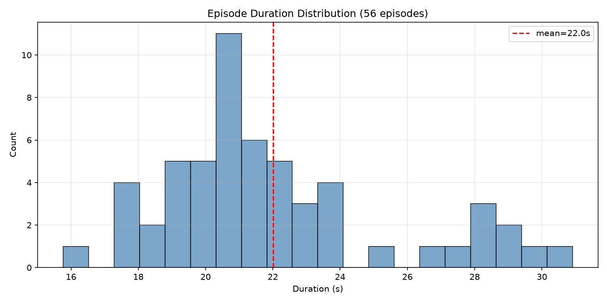
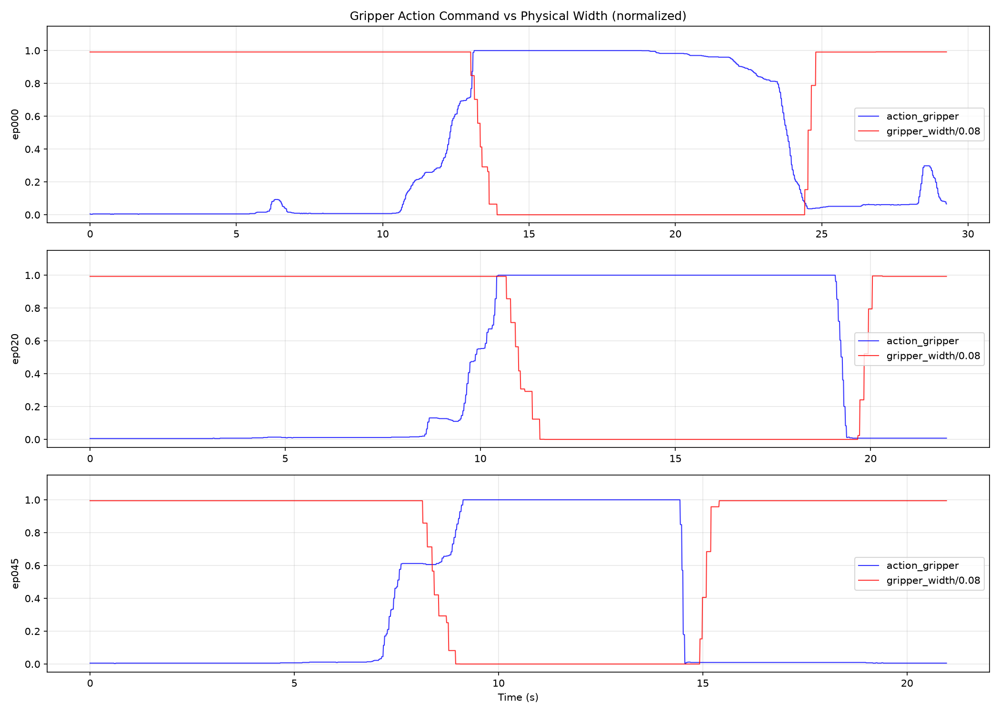
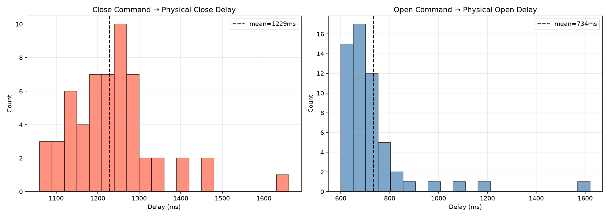
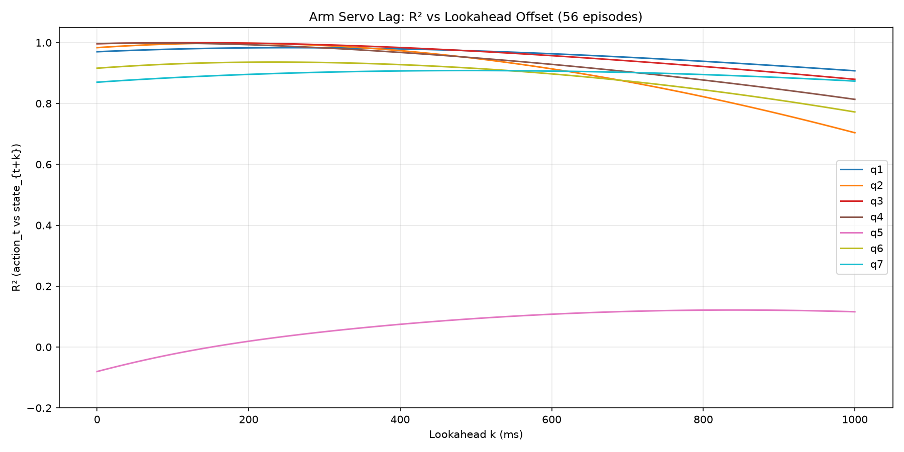
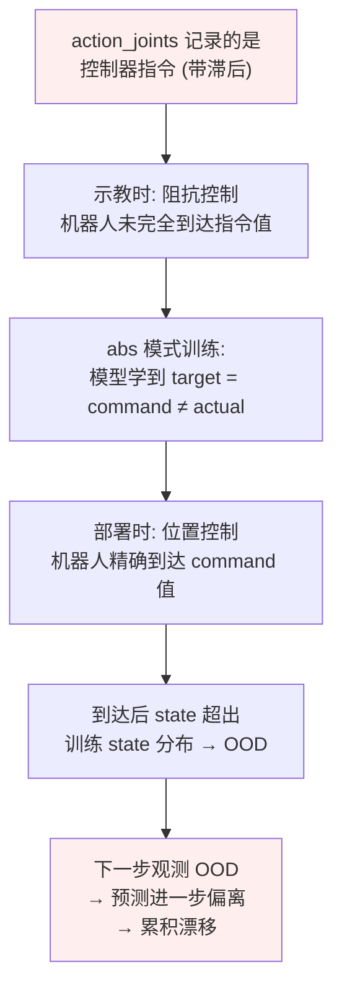
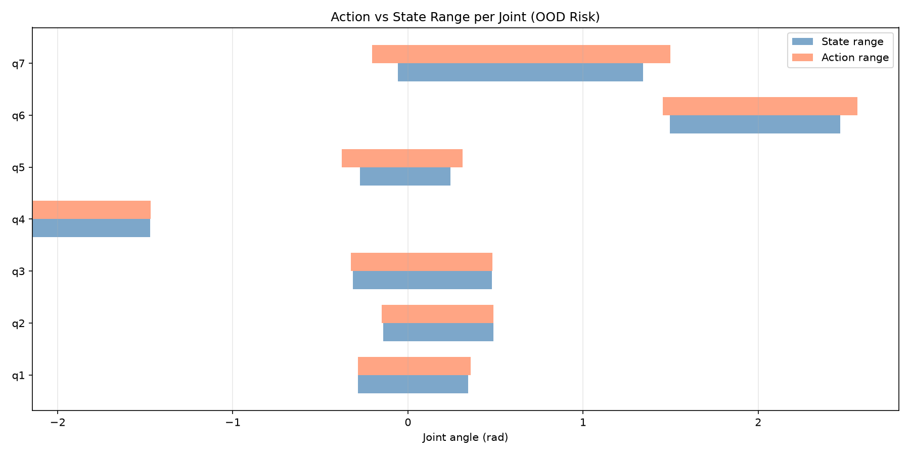
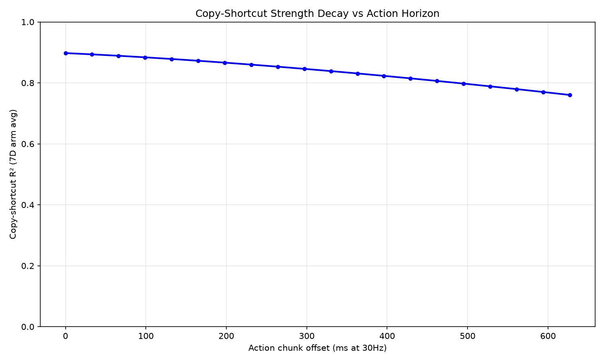
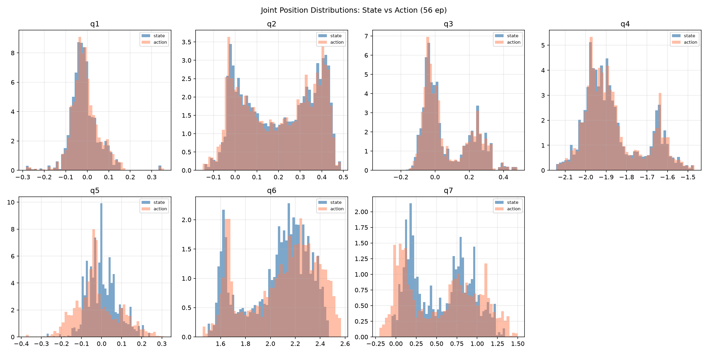
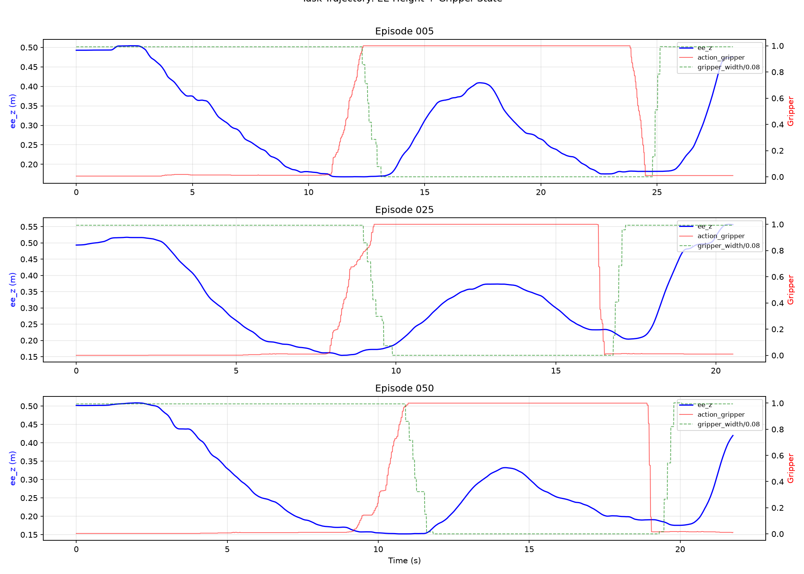

# "Put Cube Into Box" 训练数据深度分析 (V3 — 完整 56 Episodes)

> **数据路径**: `/B/Dta/put_cube_into_box/put_cube_into_box_hdf5/`
> **任务**: 用 Franka Emika FR3v2.1 7-DoF 机械臂夹取方块放入盒子
> **目标**: 为 VLA (Vision-Language-Action) 模型训练提供数据质量评估, 重点检验从 Franka 插插座任务中已发现的数据缺陷模式是否在本数据集中重现
> **分析日期**: 2026-09-24
> **数据版本**: 完整版 (56 episodes, episode_000000–episode_000055, 连续编号)
> **机器人**: Franka Emika FR3 v2.1, URDF: `fr3v2_1_franka_hand.urdf`, 7 DoF 手臂 + 1 DoF 平行爪

---

## 0. 与插插座数据对比摘要

在 Franka 插插座任务 (`plug_into_socket_hdf5`, 100 episodes) 的真机实验中, 已发现并解决了多项数据缺陷。以下对比摘要基于对本数据集全部 56 episodes 的实际验证结果:

| 缺陷 | 插插座数据 | 本数据集 (put_cube_into_box, 56 ep) | 严重程度 |
|:---|:---|:---|:---|
| 夹爪恒等捷径 $a_t \equiv 1 - w_t / 0.08$ | **精确成立** (float64 bit-exact 100%) | **不成立** (R² = 0.775, bit-exact 仅 19.0%) | 本数据集无此问题 |
| `gripper_width` 是派生量 | **是** (100% bit-exact from action) | **否** (独立传感器, 有负值/量化阶梯) | 本数据集无此问题 |
| 臂关节伺服滞后 | q5/q7 严重 (超前 ~600ms) | q5/q7 严重 (超前 490–840ms), q6 中等 (230ms) | **本数据集同样存在** |
| Action 超出 State 包络 | q7 超出 0.115 rad | q6 超出 0.097 rad, q7 超出 0.157 rad | **本数据集同样存在** |
| 夹爪不闭合 (真机) | R1–R6 多因素 (his_len, Hz, q7 OOD 等) | 有闭合但存在连续斜坡特征 (非瞬时跳变) | 需注意推理端处理 |

**核心结论**: 本数据集的夹爪通道质量**显著优于**插插座数据——`action_gripper` 是独立的控制指令, `gripper_width` 是真实传感器, 二者有约 700–1200ms 的物理响应延迟。但**臂关节的伺服滞后**问题同样存在, 尤其在 q5 和 q7 上。

---

## 1. 数据集基本信息

### 1.1 概览

| 指标 | 值 |
|------|-----|
| Episode 数 | **56** (episode_000000–000055, 连续编号) |
| 总 State 帧数 | **122,880** |
| 总时长 | 1,232.5 秒 ≈ **20.5 分钟** |
| 总数据量 | **6.36 GB** |
| Robot State 频率 | 100 Hz (实测 99.6 Hz, dt = 10.04 ± 0.10 ms) |
| Camera 频率 | 30 Hz (实测 30.0 Hz, dt = 33.37 ms) |
| 相机数量 | 2 (global + wrist) |
| 图像分辨率 | 640 × 480 |
| 图像格式 | JPEG 压缩 (color_image_jpeg, object dtype) |
| 深度图 | 有 (uint16, 480×640, 全局相机和腕部相机均有) |
| State/Camera 帧比 | 3.32 (接近理论值 100/30 = 3.33) |
| 数据完整性 | 全字段无 NaN/Inf, 时间戳严格递增 |

### 1.2 Episode 统计

| 指标 | 最小值 | 最大值 | 均值 ± 标准差 |
|:---|:---|:---|:---|
| 持续时间 | 15.77 s | 30.91 s | 22.01 ± 3.45 s |
| State 帧数 | 1,573 | 3,086 | 2,194.3 |
| Wrist 相机帧数 | 475 | 927 | 660 |
| Global 相机帧数 | 473 | 927 | 660 |
| 每文件大小 | 80.4 MB | 178.4 MB | 113.6 MB |



### 1.3 时间戳规律性

| 指标 | 值 |
|:---|:---|
| dt 均值 | 10.037 ms |
| dt 标准差 | 0.101 ms |
| dt p1 | 10.00 ms |
| dt p50 | 10.01 ms |
| dt p99 | 10.46 ms |
| dt 最大值 | 13.71 ms |
| \|dt - 10ms\| > 2ms 帧占比 | 0.02% |

时间戳**极其规整**, 几乎无抖动。最大偏差仅 3.71ms, 远优于一般实采数据。

### 1.4 HDF5 文件结构

```
episode_XXXXXX.hdf5
├── camera_global/
│   ├── color_image_jpeg    (N_cam,)     object     # JPEG 编码 RGB
│   ├── depth_image         (N_cam, 480, 640)  uint16  # 深度图
│   └── timestamps          (N_cam,)     float64
├── camera_wrist/
│   ├── color_image_jpeg    (N_cam,)     object     # JPEG 编码 RGB
│   ├── depth_image         (N_cam, 480, 640)  uint16  # 深度图
│   └── timestamps          (N_cam,)     float64
└── robot_state/
    ├── timestamps          (N_state,)   float64
    ├── joint_positions     (N_state, 7) float64     # 关节角度 (rad)
    ├── joint_velocities    (N_state, 7) float64     # 关节角速度 (rad/s)
    ├── joint_torques       (N_state, 7) float64     # 关节力矩 (Nm)
    ├── joint_torques_external (N_state, 7) float64  # 外部力矩 (Nm)
    ├── ee_pos              (N_state, 3) float64     # EE 位置 (m), base frame
    ├── ee_quat             (N_state, 4) float64     # EE 四元数 (wxyz convention)
    ├── ee_force            (N_state, 3) float64     # EE 力 (N)
    ├── ee_torque           (N_state, 3) float64     # EE 力矩 (Nm)
    ├── gripper_width       (N_state, 1) float64     # 夹爪宽度 (m)
    ├── action_joints       (N_state, 7) float64     # 关节动作指令 (controller command)
    └── action_gripper      (N_state, 1) float64     # 夹爪动作指令
```

**四元数约定验证**: `ee_quat[0]` (第一个分量) 均值 0.9798, 范围 [0.907, 1.000], 首帧值 [0.9970, -0.0738, 0.0251, -0.0033]。第一分量接近 1 且始终为正, 确认为 **wxyz** 约定 (w 在前)。四元数范数 = 1.00000000 (全部帧), 无精度损失。

**深度图**: wrist 首帧范围 [0, 8259], global 首帧范围 [0, 22183], uint16 格式, 单位待标定 (RealSense 通常为 mm)。

---

## 2. 夹爪通道语义验证 (关键检查)

### 2.1 CHECK 1-2: 恒等捷径检测

在插插座数据中, `action_gripper` 与 `gripper_width` 满足 float64 精度的代数恒等关系 $a_t \equiv 1 - w_t / 0.08$, 导致模型无法从中学到任何预测性信息 (因为观测中的 `gripper_width` 已完全包含了 `action_gripper` 的信息)。对本数据集全部 56 episodes 执行同一检测:

**测试公式**: $a_t \stackrel{?}{=} 1 - w_t / W_{\max}$

| 检验 | 插插座结果 | 本数据集结果 (56 ep) | 判定 |
|:---|:---|:---|:---|
| $\max|a_t - (1 - w_t/0.08)|$ | $1.67 \times 10^{-16}$ | **1.00** | **不成立** |
| $R^2(a_t, 1-w_t/0.08)$ | 1.000000 | **0.7754** | **不成立** |
| Bit-exact 匹配 $a = 1-w/0.08$ | 100.00% | **19.01%** | **不成立** |
| 残差均值 | $\sim 0$ | $1.16 \times 10^{-2}$ | 有系统偏置 |
| 残差标准差 | $\sim 10^{-16}$ | $2.23 \times 10^{-1}$ | 散布巨大 |

为排除 $W_{\max}$ 标定偏差的可能, 扫描了多个分母:

| $W_{\max}$ | $R^2$ | Bit-exact |
|:---|:---|:---|
| 0.0790 | 0.7722 | 19.01% |
| 0.0800 | 0.7754 | 19.01% |
| 0.0805 | 0.7768 | 19.01% |
| 0.0810 | 0.7781 | 19.01% |

无论使用哪个分母, R² 均在 0.77–0.78 之间, bit-exact 匹配率均为 19.01%。**恒等关系在任何 $W_{\max}$ 下都不成立。**

**结论: 本数据集不存在插插座数据中的夹爪恒等捷径。** `action_gripper` 和 `gripper_width` 是两个独立信号, 前者是操作者发出的控制指令, 后者是夹爪的物理状态反馈。

### 2.2 CHECK 3-4: `gripper_width` 传感器特性

| 指标 | 插插座数据 | 本数据集 (56 ep) | 判定 |
|:---|:---|:---|:---|
| 值域 | [0, 0.080] | **[-0.000002, 0.080859]** | 有负值 (传感器零漂) |
| 负值帧数 | 0 (0%) | **14,075 (11.45%)** | 传感器零漂 |
| 精确零值帧数 | ~16.5% | **26,516 (21.58%)** | 相近 |
| 每 episode 唯一值 | ~36,946 (全局) | **18–21** (每 episode) | 低分辨率量化 |
| 连续帧相同比例 | 71.69% | **96.54%** | 极高 (阶梯信号) |

本数据集的 `gripper_width` 呈现 **阶梯状量化特征**: 每个 episode 仅有约 18–21 个唯一值, 宽度在固定水平之间跳跃。典型的量化阶梯 (以 episode_000 为例):

```
0mm → 5.2mm → 12.3mm → 21.0mm → 23.3mm → 33.1mm → 41.2mm
→ 44.6mm → 56.2mm → 63.0mm → 67.8mm → 79.3mm
```

这符合 Franka Hand 的低频位置报告特性, 证实是 **真实传感器读数** 而非 `action_gripper` 的仿射派生量。

**独立性的决定性证据**:
1. $w < 0$ 存在 (最小值 $-1.44 \times 10^{-6}$ m) → 派生量不会有负值, 只有真实传感器才会零漂
2. 连续帧 96.54% 相同, 但 `action_gripper` 在同一区间内持续变化 → 两者更新频率不同
3. 每 episode 仅 18–21 个唯一值 vs `action_gripper` 有 11,434 个唯一值 → 信号独立

### 2.3 夹爪状态分布

| 状态 | 帧数 | 占比 | 含义 |
|:---|:---|:---|:---|
| Open (width > 60mm) | 73,860 | 60.1% | 夹爪张开 |
| Closed (width < 10mm) | 44,798 | 36.5% | 夹爪闭合 |
| Mid-range (10–60mm) | 4,222 | 3.4% | 过渡区 |

**每个 episode 恰好有 2 次 open/close 转换** (张开→闭合→张开), 与任务结构完全吻合 (抓→放)。

### 2.4 `action_gripper` 值分布

| 值域 | 帧数 | 占比 |
|:---|:---|:---|
| 精确 0.0 | 5,859 | 4.8% |
| (0, 0.1) | 63,951 | 52.0% |
| [0.1, 0.5) | 4,240 | 3.5% |
| [0.5, 1.0) | 6,029 | 4.9% |
| 精确 1.0 | 42,801 | 34.8% |

**关键发现**: `action_gripper` **不是二值信号**, 而是有一个从 0 到 1 的连续爬升过程。56.8% 的帧 `action_gripper < 0.1` (张开指令), 34.8% 的帧精确为 1.0 (完全闭合指令), 中间值 (0.1–1.0, 不含精确 1.0) 占 8.4%。

这是遥操作/示教器输入的典型特征: 操作者通过连续旋钮或力反馈逐渐施加闭合命令, 而非瞬时切换。

### 2.5 CHECK 5-6: 夹爪动作-宽度延迟



测量从 `action_gripper` 命令到 `gripper_width` 物理响应的延迟:

| 事件 | N | 延迟 (mean ± std) | 中位数 | 范围 |
|:---|:---|:---|:---|:---|
| 闭合: $a > 0.5 \to w < 40$mm | 56 | **888 ± 101 ms** | 865 ms | [770, 1350] ms |
| 闭合: $a > 0.5 \to w < 10$mm | 56 | **1,229 ± 107 ms** | 1,230 ms | [1060, 1660] ms |
| 闭合: $a > 0.5 \to w < 1$mm | 56 | **1,372 ± 137 ms** | 1,365 ms | [1140, 1930] ms |
| 张开: $a < 0.5 \to w > 60$mm | 56 | **734 ± 161 ms** | — | [600, 1620] ms |
| 张开: $a < 0.5 \to w > 70$mm | 56 | **837 ± 170 ms** | — | [680, 1730] ms |



**闭合比张开慢约 500ms**: 闭合需要夹爪克服物体阻力, 而张开只需弹开。

**`action_gripper` 爬升特征**: 从 0.01 爬升到 0.99 的全程平均 3,167ms (跨度极大, 320–8540ms), 前半段 (0.01→0.5) 平均 2,499ms。这不是瞬时跳变, 而是操作者逐渐施加的连续指令。

### 2.6 对 VLA 训练的影响

与插插座数据不同, 本数据集的夹爪通道对 VLA 训练是**基本健康**的:

| 维度 | 插插座评估 | 本数据集评估 |
|:---|:---|:---|
| 模型能否从视觉学习夹爪时机? | **不能** ($a \equiv$ f(w), 走捷径) | **能** (a 与 w 有 ~1s 物理延迟) |
| 复制状态能否解决夹爪 loss? | 84% 方差被复制解释 | **不可复制** (copy-R² = 0.775) |
| 部署时是否退化为夹爪不动? | **是** ($a \equiv 0.17$ 不动) | **不会** (a 包含独立的指令信息) |

**注意事项**: 由于 `action_gripper` 有连续爬升特征 (而非瞬时 0→1 跳变), 在使用 FAST 离散 token 编码时需要合理处理中间值。对于 flow matching 回归头, 连续值是可直接使用的。

---

## 3. 臂关节伺服滞后分析 (关键问题)

### 3.1 CHECK 7-8: 同帧 Action vs State

在阻抗控制/示教模式下, `action_joints` 记录的是**控制器下发的指令 (command)**, 而非机器人实际到达的位置 (state)。两者之间存在伺服滞后。

| 关节 | R²(a,s) k=0 | max\|a-s\| (rad/°) | mean\|a-s\| (rad/°) | p99\|a-s\| (rad/°) | 严重程度 |
|:---|:---|:---|:---|:---|:---|
| q1 | 0.9699 | 0.052 / 2.97° | 0.007 / 0.40° | 0.027 / 1.55° | 低 |
| q2 | 0.9834 | 0.105 / 6.01° | 0.014 / 0.83° | 0.071 / 4.06° | 低-中 |
| q3 | 0.9963 | 0.077 / 4.39° | 0.004 / 0.26° | 0.032 / 1.83° | 低 |
| q4 | 0.9967 | 0.065 / 3.73° | 0.006 / 0.35° | 0.027 / 1.54° | 低 |
| **q5** | **-0.0804** | **0.162 / 9.31°** | **0.064 / 3.65°** | **0.124 / 7.13°** | **极高** |
| q6 | 0.9159 | 0.175 / 10.02° | 0.066 / 3.77° | 0.120 / 6.89° | **高** |
| **q7** | **0.8699** | **0.308 / 17.67°** | **0.119 / 6.79°** | **0.178 / 10.22°** | **极高** |

**q5 的 R²(k=0) 为负值 (-0.08)!** 这意味着在同帧下, 用 `action_joints` 预测 `joint_positions` 比用常数均值还差。q7 的最大偏差达 17.67°, 均值偏差也有 6.79°。

### 3.2 最佳时间超前分析

通过扫描 $R^2(a_t, q_{t+k})$ 对 $k = 0, 1, \ldots, 120$ (即 0–1200ms), 找到每个关节指令到位的最佳延迟:



| 关节 | 最佳超前 $k$ | 延迟 | R²(k=0) | R²(best k) | R² 提升 |
|:---|:---|:---|:---|:---|:---|
| q1 | 25 | **250 ms** | 0.9699 | 0.9833 | +0.013 |
| q2 | 17 | **170 ms** | 0.9834 | 0.9981 | +0.015 |
| q3 | 12 | **120 ms** | 0.9963 | 0.9996 | +0.003 |
| q4 | 7 | **70 ms** | 0.9967 | 0.9984 | +0.002 |
| **q5** | **84** | **840 ms** | **-0.0804** | **0.1216** | **+0.202** |
| q6 | 23 | **230 ms** | 0.9159 | 0.9359 | +0.020 |
| **q7** | **49** | **490 ms** | **0.8699** | **0.9082** | **+0.038** |

**关键发现**:
- **q5 (840ms 延迟)**: 即使在最佳超前下, R² 也仅有 0.12, 说明 q5 的 action 指令与 state 之间不仅有延迟, 还有**极大的跟踪误差**。q5 的控制器指令与实际位置之间几乎没有线性关系。
- **q7 (490ms 延迟)**: 最佳 R² = 0.91, 比 k=0 时 (0.87) 有明显改善, 但仍有 9% 的方差未解释。
- **q1–q4 (70–250ms)**: 延迟较短, R² 均 > 0.97, 伺服跟踪质量好。

**R² 随超前 k 的变化** (关键关节):

| k (帧/ms) | q5 R² | q6 R² | q7 R² |
|:---|:---|:---|:---|
| 0 / 0ms | -0.080 | 0.916 | 0.870 |
| 20 / 200ms | — | 0.936 | 0.896 |
| 40 / 400ms | — | 0.928 | 0.907 |
| 50 / 500ms | — | 0.915 | **0.908** |
| 60 / 600ms | — | 0.897 | 0.906 |
| 80 / 800ms | — | 0.845 | 0.895 |
| 84 / 840ms | **0.122** | — | — |
| 100 / 1000ms | — | 0.772 | 0.874 |

q6 和 q7 有清晰的倒 U 形峰, q5 的 R² 全程极低, 在 k=84 处仅有微弱的峰。

### 3.3 与插插座数据的伺服滞后对比

| 关节 | 插插座最佳超前 | 插插座 R²(best) | 本数据集最佳超前 | 本数据集 R²(best) |
|:---|:---|:---|:---|:---|
| q5 | ~600ms | ~0.7 | **840ms** | **0.12** (更差) |
| q6 | ~280ms | ~0.95 | 230ms | 0.94 (相近) |
| q7 | ~600ms | ~0.85 | **490ms** | **0.91** (略好) |

**本数据集的 q5 伺服滞后比插插座更严重。** 插插座中 q5 虽有延迟但 R² 尚可, 本数据集中 q5 的 action 与 state 几乎完全脱节。这可能与 "夹取方块→搬运→放下" 任务中 q5 (腕部前后翻转) 的运动模式有关——抓取时需要精确调整腕部角度, 但阻抗控制下操作者的力输入与关节实际旋转之间的映射在 q5 上特别差。

### 3.4 伺服滞后的部署风险



这正是插插座真机实验中 q7 一路跌到 0.458 rad、策略退化为原地吸引子的根因。该实验中:
- q7 action 可低至 0.3695, 但 state 最小仅 0.4843 (详见真机调试记录)
- 部署时 q7 到达 action 目标后, state 进入训练中从未见过的区域
- 诊断发现: 在坏姿态下策略的动作 lead 从正常的 0.126 rad 掉到近乎 0
- 仅将 q7 拉回训练分布内, lead 即可恢复 78%

**本数据集在 q5 和 q7 上面临同样的风险**, 且 q5 的情况更严重 (R² 接近 0)。

---

## 4. Action 超出 State 包络 (OOD 风险)

### 4.1 CHECK 9-10: 逐关节分析



| 关节 | State 范围 (rad) | Action 范围 (rad) | OOD 帧数 | OOD 占比 | Max 超出 (rad/°) | 风险 |
|:---|:---|:---|:---|:---|:---|:---|
| q1 | [-0.285, 0.344] | [-0.285, 0.357] | 323 | 0.26% | 0.013 / 0.77° | 低 |
| q2 | [-0.142, 0.488] | [-0.150, 0.488] | 236 | 0.19% | 0.009 / 0.50° | 低 |
| q3 | [-0.313, 0.479] | [-0.325, 0.483] | 216 | 0.18% | 0.012 / 0.68° | 低 |
| q4 | [-2.144, -1.472] | [-2.141, -1.468] | 151 | 0.12% | 0.004 / 0.22° | 低 |
| **q5** | [-0.274, 0.241] | **[-0.377, 0.311]** | **1,985** | **1.62%** | **0.103 / 5.92°** | **中-高** |
| **q6** | [1.497, 2.469] | [1.456, **2.566**] | **8,154** | **6.64%** | **0.097 / 5.56°** | **高** |
| **q7** | [-0.057, 1.342] | [**-0.204**, **1.499**] | **7,357** | **5.99%** | **0.157 / 9.01°** | **极高** |

**q7 最严重**: 两端都显著超出, 下界超出 0.147 rad (8.4°), 上界超出 0.157 rad (9.0°), 共 5.99% 的帧为 OOD。这与插插座数据中 q7 的问题一致。

**q6 OOD 帧数最多** (8,154 帧, 6.64%), 且主要超出上界 (7,552 帧), 这意味着 action 指令持续要求 q6 向更大角度运动, 但阻抗控制下 state 跟不上。

### 4.2 Delta Action 统计

若使用 `action_mode=delta`, 增量为 $\delta_t = a_t - s_t$:

| 关节 | $\delta$ mean (rad) | $\delta$ std (rad) | $\delta$ min (rad) | $\delta$ max (rad) |
|:---|:---|:---|:---|:---|
| q1 | +0.0059 | 0.0069 | -0.0453 | +0.0518 |
| q2 | -0.0063 | 0.0204 | -0.1049 | +0.0601 |
| q3 | +0.0026 | 0.0075 | -0.0767 | +0.0732 |
| q4 | +0.0043 | 0.0066 | -0.0477 | +0.0650 |
| **q5** | **-0.0257** | **0.0675** | -0.1624 | +0.1407 |
| **q6** | **+0.0463** | **0.0571** | -0.1424 | +0.1748 |
| **q7** | +0.0050 | **0.1260** | **-0.3084** | +0.2444 |

**q5 delta 均值为 -0.026 rad**: 系统性偏置, 在 delta 模式下部署时 q5 会持续向负方向漂移。
**q6 delta 均值为 +0.046 rad**: 更大的系统性偏置, q6 会持续向正方向漂移。
**q7 delta std 最大 (0.126 rad)**: 反映该关节在示教中变化最剧烈但跟踪最差。

---

## 5. Copy-Shortcut 量化 (训练侧影响评估)

### 5.1 CHECK 11-12: 逐维度 "复制基线" 分析

"复制基线" 衡量的是: 如果模型简单地将当前观测 state 作为 action 预测, 能解释多少 action 方差? 这个比例越高, 模型越可能走 "抄近道" 而不是真正从视觉/语言信号学习。

| 维度 | Copy-R² | 含义 |
|:---|:---|:---|
| q1 | 0.9824 | 98.2% 可复制 — 几乎不动 |
| q2 | 0.9842 | 98.4% 可复制 |
| q3 | 0.9969 | 99.7% 可复制 |
| q4 | 0.9970 | 99.7% 可复制 |
| **q5** | **0.5391** | **53.9% 可复制** — 仅半数 |
| q6 | 0.9325 | 93.2% 可复制 |
| q7 | 0.9200 | 92.0% 可复制 |
| **7D arm avg** | — | **90.7% 可复制** |
| gripper (formula) | 0.7748 | 77.5% — 公式有一定近似, 但远非精确 |
| gripper (self-copy t-1) | **0.9995** | 几乎完美自复制 (因为 action 变化缓慢) |

**与插插座对比**: 插插座 8D 平均可复制 70%, 本数据集 7D arm 平均 90.7%。**本数据集的臂关节复制捷径更强**, 因为 q1–q4 几乎完全可复制 (R² > 0.98), 只有 q5/q7 有较低的 copy-R²。

**但夹爪维度是关键区别**: 插插座数据中夹爪 copy-R² = 1.0 (100% 可复制, 致命捷径), 本数据集中通过公式 copy-R² = 0.775, 还有 22.5% 的方差必须从其他信号学习。

### 5.2 Copy-Shortcut Chunk 衰减

模拟 30Hz 下采样, 测量 "复制 t=0 时刻的 state 作为 t=offset 时刻的 action 预测" 的准确度衰减:



| 偏移步数 (30Hz) | 等效时间 | 7D arm avg R² |
|:---|:---|:---|
| 0 | 0 ms | 0.898 |
| 1 | 33 ms | 0.894 |
| 2 | 67 ms | 0.889 |
| 5 | 167 ms | 0.873 |
| 10 | 333 ms | 0.839 |
| 15 | 500 ms | 0.798 |
| 19 | 633 ms | — |

**衰减缓慢**: 即使前瞻 15 步 (500ms @ 30Hz), copy-R² 仍有 0.80。这意味着对于 `n_exec` ≤ 10 的 chunk 执行策略, 模型在 chunk 前部仍可能严重依赖状态复制。

**训练影响**: 模型可能在 chunk 前半段走 "抄状态" 捷径, 仅在 chunk 后半段才被迫使用视觉信号。这会导致:
1. 部署时 chunk 前半段预测质量虚高 (实际只是在复制)
2. 如果当前 state 与训练分布不一致 (如因 OOD 漂移), 复制策略会放大错误

---

## 6. 关节运动学与力学统计

### 6.1 关节角度统计



| 关节 | 范围 (rad) | 均值 (rad) | 标准差 (rad) |
|:---|:---|:---|:---|
| q1 | [-0.285, 0.344] | -0.014 | 0.067 |
| q2 | [-0.142, 0.488] | 0.202 | 0.168 |
| q3 | [-0.313, 0.479] | 0.071 | 0.141 |
| q4 | [-2.144, -1.472] | -1.867 | 0.143 |
| q5 | [-0.274, 0.241] | 0.005 | 0.075 |
| q6 | [1.497, 2.469] | 2.048 | 0.258 |
| q7 | [-0.057, 1.342] | 0.555 | 0.361 |

q7 标准差最大 (0.361 rad ≈ 20.7°), 反映该关节在夹取-搬运任务中活动最频繁。q5 标准差最小 (0.075 rad), 范围也最窄。

### 6.2 关节速度统计

| 关节 | 均值 (rad/s) | 标准差 (rad/s) | 最大绝对值 (rad/s) |
|:---|:---|:---|:---|
| q1 | 0.004 | 0.028 | 0.304 |
| q2 | -0.002 | 0.115 | 0.549 |
| q3 | 0.006 | 0.063 | 0.598 |
| q4 | -0.006 | 0.081 | 0.713 |
| q5 | 0.000 | 0.060 | 0.914 |
| q6 | 0.005 | 0.163 | 1.107 |
| q7 | 0.006 | 0.155 | 1.219 |

q7 最大速度 1.22 rad/s, q6 为 1.11 rad/s — 远端关节运动最快。

### 6.3 关节力矩统计

| 关节 | 均值 (Nm) | 标准差 (Nm) | 最大绝对值 (Nm) |
|:---|:---|:---|:---|
| q1 | 0.58 | 0.97 | 7.03 |
| q2 | **-37.85** | 4.70 | 51.72 |
| q3 | 1.25 | 1.66 | 8.79 |
| q4 | **23.32** | 1.55 | 30.40 |
| q5 | 0.46 | 0.57 | 2.29 |
| q6 | 2.61 | 0.57 | 4.42 |
| q7 | 0.04 | 0.44 | 0.82 |

q2 (肩部) 承受最大持续力矩 (-37.85 Nm), 这是重力补偿的结果。q4 (肘部) 也有显著的持续力矩 (23.32 Nm)。

### 6.4 末端力/力矩

| 维度 | 均值 | 标准差 | 最大绝对值 |
|:---|:---|:---|:---|
| ee_force_x | -1.06 N | 1.91 N | 11.97 N |
| ee_force_y | -1.30 N | 1.47 N | 7.79 N |
| ee_force_z | -1.67 N | 1.97 N | 14.68 N |
| ee_torque_x | -0.733 Nm | 0.686 Nm | 2.774 Nm |
| ee_torque_y | 0.560 Nm | 0.538 Nm | 2.698 Nm |
| ee_torque_z | 0.031 Nm | 0.431 Nm | 0.712 Nm |

末端力矩在 z 轴上几乎为零 (均值 0.03 Nm), 说明夹爪末端没有绕 z 轴的扭转。力在 z 轴上最大 (14.68 N), 对应抓取和放置时的接触力。

---

## 7. 任务结构与空间分析

### 7.1 任务流程


### 7.2 关键时间节点

| 事件 | 时间 (from start) |
|:---|:---|
| Grasp 指令 ($a > 0.5$) | **9.3 ± 1.3 s** |
| Release 指令 ($a < 0.5$) | **18.0 ± 2.9 s** |
| Episode 总时长 | **22.0 ± 3.5 s** |
| 持物时间 ($a > 0.5$) | ~8.7 s |



### 7.3 末端位置关键点

| 位置 | X (m) | Y (m) | Z (m) | Std (mm) |
|:---|:---|:---|:---|:---|
| 起始 (Home) | 0.558 | -0.024 | 0.496 | 5–13 |
| 夹取点 | 0.623 | -0.047 | 0.164 | 5–6 |
| 释放点 | 0.560 | +0.185 | 0.188 | 9–10 |
| 结束 | 0.538 | +0.091 | 0.461 | 21–69 |

**夹取→释放 3D 位移**: 0.242 ± 0.012 m, 主要沿 Y 轴 (+0.232 m, 从左到右)。

### 7.4 工作空间覆盖

| 轴 | 范围 (m) | 跨度 (cm) |
|:---|:---|:---|
| X | [0.479, 0.640] | 16.1 |
| Y | [-0.104, 0.229] | 33.3 |
| Z | [0.152, 0.562] | 41.0 |

**空间多样性评估**:
- 夹取位置 std **仅 5–6mm** — 方块位置几乎固定
- 释放位置 std **9–10mm** — 盒子位置也几乎固定
- 结束位置 std **21–69mm** — 回程路径有更大变异

这意味着方块和盒子在所有 56 episodes 中的摆放位置高度一致, 模型可能过拟合到特定的空间布局。

### 7.5 跨 Episode 初始/终止一致性

| 关节 | 初始 mean ± std (rad) | 终止 mean ± std (rad) |
|:---|:---|:---|
| q1 | -0.030 ± 0.026 | 0.051 ± 0.070 |
| q2 | 0.007 ± 0.030 | -0.028 ± 0.065 |
| q3 | -0.009 ± 0.031 | 0.118 ± 0.136 |
| q4 | -1.626 ± 0.042 | -1.761 ± 0.111 |
| q5 | -0.011 ± 0.047 | -0.011 ± 0.068 |
| q6 | 1.622 ± 0.034 | 1.732 ± 0.148 |
| q7 | 0.787 ± 0.063 | 0.926 ± 0.173 |

**初始位置**非常一致 (std 0.026–0.063 rad), 说明 HOME 位置标定良好。**终止位置**变异较大 (std 0.065–0.173 rad), 说明回程路径有一定多样性。

---

## 8. 训练适配性评估与建议

### 8.1 数据语义门禁评估

运行 6 项数据准入门禁 (源自对插插座数据缺陷的系统化检查):

| 门禁 | 描述 | 结果 | 判定 |
|:---|:---|:---|:---|
| G1: Copy-R² < 0.90 | 逐维度复制 R² 应低于 0.90 | q1–q4 > 0.98 **FAIL**; q5 = 0.54 PASS; q6–q7 = 0.92–0.93 **边缘** | **部分 FAIL** |
| G2: 逐位恒等检测 | 任一 (action, state) 对的 bit-exact < 50% | gripper 19.0% PASS; arm 0% PASS | **PASS** |
| G3: 传感器独立性 | gripper_width 非 action 的仿射变换 | 有负值, 量化阶梯, R² = 0.78 | **PASS** |
| G4: Chunk 内捷径 | chunk 前10步 copy-R² < 0.95 | arm avg R² = 0.84 **边缘**; gripper R² = 0.78 PASS | **边缘** |
| G5: Action ⊆ State | action 范围不超出 state 范围 | q5 1.6%, q6 6.6%, q7 6.0% OOD | **FAIL** |
| G6: 传感器真实性 | gripper_width 是真实传感器 | 有负值, 有量化阶梯, 96.5% 连续不变 | **PASS** (边缘) |

**夹爪通道 G2/G3/G6 全部 PASS**, 这是相对于插插座数据的核心改善。臂关节 G1 和 G5 存在问题。

### 8.2 问题与建议汇总

#### 问题 1: q5 伺服滞后 / action-state 脱节 (严重程度: 极高)

- **表现**: q5 R²(k=0) = -0.08, 即使最佳超前 840ms 也仅 R² = 0.12。action 与 state 几乎完全脱节。
- **部署风险**: abs 模式下, q5 action 目标与实际 state 差异巨大 (均值 3.65°, 最大 9.31°), 模型预测的目标位置在部署时到达后将产生严重 OOD。
- **与插插座经验对照**: 插插座真机中 q7 出现类似问题 (action 低至 0.37, state 最小 0.48), 导致策略退化为原地吸引子。q5 的问题更严重 (R² 更低)。
- **建议**:
  1. **未来状态重标注**: $\text{action}_t^{(5)} := \text{state}_{t+k}^{(5)}$, 其中 $k$ 为最佳超前帧数。但 q5 的 R²(best) = 0.12, 即使重标注效果也有限。
  2. **丢弃 q5 action**: 如果 q5 的动作信息确实无法恢复, 考虑在训练时用 state 替代 action, 或对 q5 施加更强的正则化。
  3. **Delta 模式**: q5 delta 均值 -0.026 rad, 在 delta 模式下会表现为持续漂移。需配合 action clipping。

#### 问题 2: q7 伺服滞后 + OOD (严重程度: 高)

- **表现**: q7 R²(k=0) = 0.87, 最佳超前 490ms, R²(best) = 0.91。OOD 帧 6.0%, 最大超出 0.157 rad (9.0°)。
- **部署风险**: 与插插座中 q7 跌到 0.458 的同类风险。
- **建议**: 未来状态重标注 + OOD action clipping (将 action 裁剪到 state 分布的 [q01, q99] 内)。

#### 问题 3: q6 OOD 帧多 (严重程度: 中-高)

- **表现**: 6.64% OOD, 主要超出上界 (7,552 帧超上界 vs 602 帧超下界)。
- **建议**: 同上, 重标注 + clipping。

#### 问题 4: 臂关节 Copy-Shortcut 强 (严重程度: 中)

- **表现**: q1–q4 copy-R² > 0.98, 模型可以通过复制 state 获得极低的 action loss 而不学习视觉信号。
- **影响**: 模型在训练时可能走 "抄状态" 捷径, 部署时一旦 state 偏离训练分布, 预测崩溃。
- **建议**:
  1. 使用 delta action 模式, 减少复制捷径的收益
  2. 增加 state dropout (按一定概率 mask 掉 state 输入), 迫使模型使用视觉信号
  3. 监控离线验证时各维度的预测误差, 确保模型不只是在复制

#### 问题 5: 空间多样性极低 (严重程度: 中)

- **表现**: 夹取位置 std 5–6mm, 释放位置 std 9–10mm
- **部署风险**: 模型过拟合特定布局, 方块/盒子位置变化时失效
- **建议**:
  1. 增大数据集, 变换方块/盒子位置
  2. 开启图像增广 (`image_transforms.enable=true`)
  3. 与其他 pick-and-place 数据混合训练

#### 问题 6: `gripper_width` 负值 (严重程度: 低)

- **表现**: 11.45% 的帧 $w < 0$ (最小值 $-1.44 \times 10^{-6}$ m), 传感器零漂
- **建议**: 转换时 clamp 到 $[0, W_{\max}]$, 其中 $W_{\max} \approx 0.0809$ m (数据中观测到的最大值)

#### 问题 7: Action gripper 连续爬升特征 (严重程度: 低)

- **表现**: `action_gripper` 从 0 到 1 平均爬升 3.2 秒 (极大跨度, 320ms–8.5s), 中间值占 ~8%
- **影响**: FAST 离散编码需要决定如何处理中间值; 二值化需要定义阈值和过渡区
- **建议**: 对于 flow matching 回归头, 连续值可直接使用; 对于 FAST, 可将连续爬升也编码为离散 token 序列

### 8.3 推荐的训练配置

| 参数 | 建议值 | 依据 |
|:---|:---|:---|
| `action_mode` | `abs` (需重标注) 或 `delta` | abs 需配合未来状态重标注消除伺服滞后; delta 有 q5/q6 系统偏置 |
| `action_dim` | 8 (7 joints + 1 gripper) | — |
| `state_dim` | 8 (7 joints + 1 gripper_width) | gripper_width 是真实传感器, 提供闭合状态信息 |
| `fps` | 30 (与 camera 对齐) | 100Hz state 需下采样; 30Hz 与相机帧对齐 |
| `image_transforms.enable` | **true** | 数据空间多样性低, 必须开图像增广 |
| `tokenize_state` | true | 夹爪 state 不会造成恒等捷径 (不同于插插座) |
| `state_dropout_dims` | 考虑对 q1–q4 施加 | 减少高 copy-R² 维度的复制捷径 |
| `action_chunk_size` | 50 | — |
| $W_{\max}$ (gripper width 归一化) | 0.0809 (从数据中观测) | 不应硬编码 0.08 |
| q5 特殊处理 | 重标注或 state 替代 | R²(action,state) ≈ 0, 原始 action 信息极差 |

### 8.4 验收方案

| 层级 | 测试 | 通过条件 |
|:---|:---|:---|
| L0 数据 | 语义门禁 G1–G6 | G2/G3 PASS; G5 PASS (重标注后 action ⊆ state) |
| L1 离线 | 冻结宽度测试 | 固定 $w = 0.079$ m 连喂 100 步, 策略应在若干步后仍输出 $a \geq 0.5$ |
| L1 离线 | 开环回放 MAE | 优于 "复制状态" 基线 (arm copy-MSE ≈ 0.09, grip copy-MSE via formula ≈ 0.22) |
| L2 真机 | 夹爪闭合 | 300 步内至少 1 次 $a_{\text{gripper}} \geq 0.5$ |
| L2 真机 | 关节不越界 | q5/q6/q7 保持在训练 state 分布 [q01, q99] 内 |
| L2 真机 | 任务完成 | 成功夹取方块并放入盒子 |

---

## 9. 与插插座数据的系统性对比

| 维度 | 插插座 (plug_into_socket, 100 ep) | 放方块 (put_cube_into_box, 56 ep) |
|:---|:---|:---|
| **总时长** | ~37 分钟 | **~20.5 分钟** |
| **频率** | 100Hz state + 30Hz cam | 100Hz state + 30Hz cam |
| **夹爪恒等捷径** | **致命** (R²=1.0, bit-exact 100%) | **无** (R²=0.78, bit-exact 19%) |
| **gripper_width 性质** | 派生量 (from action) | **真实传感器** (有负值/量化) |
| **夹爪 copy-shortcut** | 84% 可复制 (致命) | 77.5% (公式近似, 非精确) |
| **臂关节伺服滞后** | q5/q7 严重 (~600ms) | **q5 极严重** (840ms, R²≈0); q7 严重 (490ms) |
| **Action ⊆ State** | q7 超出 0.115 rad | **q7 超出 0.157 rad** (更严重) |
| **Arm copy-R²** | ~70% (8D avg) | **90.7%** (7D arm avg, 更高) |
| **力/力矩** | 有 | 有 (含深度图) |
| **任务复杂度** | 单阶段 (插入) | **多阶段** (抓取+搬运+放置) |
| **EE 工作空间** | 6.9×19.3×33.9 cm | **16.1×33.3×41.0 cm** (更大) |
| **夹爪事件/集** | ~0 (已抓住) | **2** (抓+放) |
| **空间多样性** | 低 | **低** (夹取 std 5mm) |
| **VLA 训练适合度** | **差** (夹爪退化) | **中等** (q5 需特殊处理, 其余健康) |

---

## 10. 图表索引

| 图表 | 文件 | 说明 |
|:---|:---|:---|
| Episode 时长分布 | [episode_duration_dist_56ep.png](asset/episode_duration_dist_56ep.png) | 56 episodes 持续时间直方图 |
| 夹爪 action vs width | [gripper_action_vs_width_56ep.png](asset/gripper_action_vs_width_56ep.png) | 3 个 episode 的 action 与 width 对比, 证明有物理延迟 |
| 臂关节伺服滞后 | [arm_servo_lag_56ep.png](asset/arm_servo_lag_56ep.png) | 7 个关节的 R²-vs-lookahead 曲线 |
| Action vs State 范围 | [action_vs_state_range_56ep.png](asset/action_vs_state_range_56ep.png) | 逐关节的 action 与 state 范围对比 |
| 夹爪延迟分布 | [gripper_delay_dist_56ep.png](asset/gripper_delay_dist_56ep.png) | 56 episodes 的闭合/张开延迟直方图 |
| 任务轨迹示例 | [task_trajectory_examples_56ep.png](asset/task_trajectory_examples_56ep.png) | 3 个 episode 的 EE 高度 + 夹爪状态 |
| Copy-Shortcut 衰减 | [copy_shortcut_decay_56ep.png](asset/copy_shortcut_decay_56ep.png) | 7D arm avg copy-R² vs chunk offset |
| 关节角分布 | [joint_distributions_56ep.png](asset/joint_distributions_56ep.png) | state vs action 的关节角分布对比 |

---

## 11. 总结

**夹爪通道**: 本数据集**不存在**插插座数据中的致命恒等捷径。`action_gripper` 是独立的操作者指令 (连续斜坡, 均值爬升 3.2 秒), `gripper_width` 是真实传感器 (18–21 个量化阶梯, 有负值零漂)。二者有 888ms (到 w<40mm) 至 1,229ms (到 w<10mm) 的物理响应延迟。模型在夹爪维上**必须依赖视觉和上下文信号**来学习抓取时机, 无法走状态复制的捷径。

**臂关节伺服滞后**: **q5 的问题最严重** — R²(action, state) 在同帧下为负值 (-0.08), 即使最佳超前 840ms 也仅 R² = 0.12, action 与 state 几乎完全脱节。q7 延迟 490ms, 最大偏差 17.67°。这些关节的 action 目标超出 state 包络 (q7 超出 0.157 rad, q6 超出 0.097 rad), 存在部署时 OOD 漂移的严重风险。

**Copy-Shortcut**: 7D arm 平均 copy-R² = 90.7%, 其中 q1–q4 > 98%。模型有强烈的 "抄状态" 动机。建议在训练时使用 delta action 模式或 state dropout 来抑制。

**空间多样性**: 方块/盒子位置高度一致 (夹取 std 5mm, 释放 std 9mm), 需要通过图像增广和数据混合来缓解。

**整体评估**: 本数据集的数据质量**优于**插插座数据 (夹爪通道健康), 但**臂关节伺服滞后** (尤其 q5) 需要在训练前通过 action 重标注解决。数据量为 56 episodes (20.5 分钟), 作为 fine-tuning 数据可接受, 但应配合预训练权重使用。

---

**附录: 分析方法说明**

所有数值结论均在本机对 `/B/Dta/put_cube_into_box/put_cube_into_box_hdf5/` 全部 56 个 episode (episode_000000–episode_000055) 直接运行 Python 脚本得到。关键方法:

- **恒等捷径检测**: 计算 $R^2(a_t, 1-w_t/W_{\max})$、最大残差、bit-exact 匹配率, 并扫描 $W_{\max} \in [0.079, 0.081]$
- **伺服滞后**: 对每个关节, per-episode 计算 $R^2(a_t, q_{t+k})$ 对 $k = 0, \ldots, 120$, 取全局 pooled R²
- **OOD 风险**: 比较 $\text{range}(\text{action})$ 与 $\text{range}(\text{state})$, 计算超出帧数
- **Copy-Shortcut**: $\text{copy-R}^2 = 1 - \text{MSE}(a_t, s_t) / \text{Var}(a_t)$
- **夹爪延迟**: 在每个 episode 内找 $a > 0.5$ 首次出现帧与 $w < \theta$ 首次出现帧的差值, $\theta$ 分别取 40mm、10mm、1mm
- **空间分析**: 在 $a > 0.5$ 首次出现帧处取 EE 位置作为夹取点, 在 $a$ 回到 $< 0.5$ 的首帧取 EE 位置作为释放点

检查脚本的验证逻辑源自在 Franka 插插座任务中发现并解决的数据缺陷 (详见真机调试经验: 夹爪恒等捷径导致策略输出 $a \equiv 0.17$ 不动、q7 OOD 导致策略退化为原地吸引子等)。
