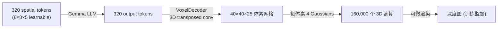
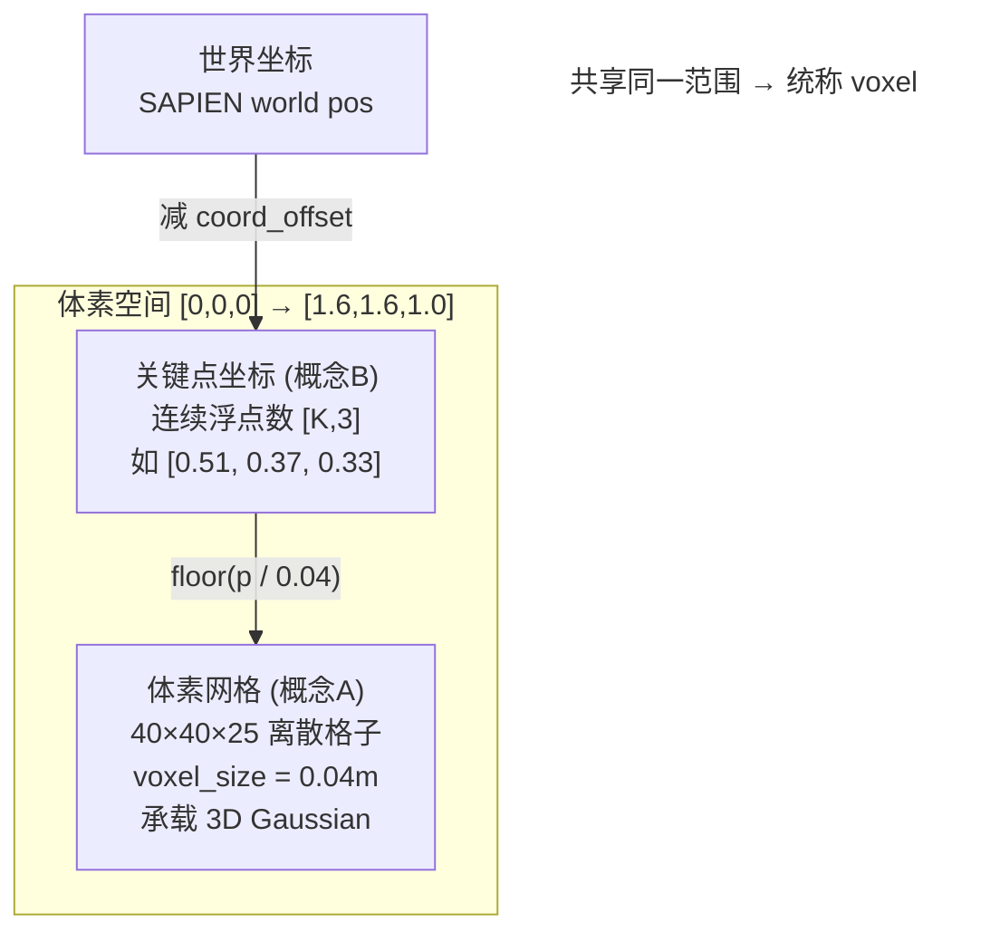
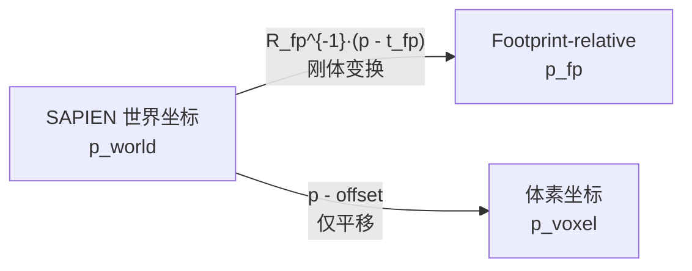

# 3D 表示与坐标系

> **定位**：为 InternVLA-A1.5 + GeoPredict 融合项目的开发者提供 3D 表示方式和坐标系的背景知识，回答「体素坐标系和体素网格为什么都叫 voxel」「为什么要有两种坐标系」等常见疑问。所有结论均有代码或文献依据。

---

## 0. 本文讨论的五种数据

本文涉及 **五种** 常被混用的 3D 相关数据。其中「体素坐标系关键点」和「footprint 坐标系关键点」是 **3D 关键点** 在两种不同参考系下的实例，并非独立的传感器类型。

| # | 数据 | 本质 | 在本项目中的角色 |
|:--|:---|:---|:---|
| 1 | **3D 点云** | 稠密无序 3D 点集合 `[N, 3]` | **不直接使用**；GeoPredict 用深度图代替 |
| 2 | **体素网格** | 离散 3D 规则格子 `[D, H, W]` | GeoPredict **训练时** VoxelDecoder 内部生成；推理不参与 |
| 3 | **3D 关键点** | 稀疏语义 3D 坐标 `[K, 3]` | TrackEncoder 的历史输入与监督 GT |
| 4 | **体素坐标系 3D 关键点** | 3D 关键点在 `[0, 1.6]³` 工作空间中的表示 | kptsim GT / 方案 A（推荐） |
| 5 | **footprint 坐标系 3D 关键点** | 3D 关键点相对机器人 URDF 根节点的表示 | Pinocchio Phase 1 / `get_keypoints_aloha` |

---

## 1. 3D 表示三剑客：点云、体素、关键点

在计算机视觉与机器人学中，描述 3D 空间信息有三种主流数据结构。它们的核心区别在于 **信息密度** 和 **结构化程度**。

### 1.1 3D 点云（Point Cloud）

由大量无序的 3D 点 $(x, y, z)$ 组成的集合，每个点可附带颜色、法向量等属性。通常由深度传感器（LiDAR、RGB-D 相机、立体视觉）直接采集。

| 属性 | 说明 |
|:---|:---|
| 数据量 | 一帧通常数万到数百万个点 |
| 结构 | **无序、无拓扑**——点与点之间没有显式的连接关系 |
| 典型格式 | `[N, 3]` 或 `[N, 6]`（含 RGB） |
| 代表工作 | PointNet (Qi et al., CVPR 2017)、PointNet++ (Qi et al., NeurIPS 2017) |

**示例**：用 RealSense 深度相机扫描桌面，得到约 30 万个点，每个点记录了桌面、杯子、键盘等物体表面的空间位置。

**本项目关系**：

- GeoPredict **不把原始点云作为模型输入**。训练数据加载的是 **深度图**（RoboCasa：`agentview_*_depth/step_XXXX.npy`，224×224），见 [`robocasa_dataset.py`](../../../GeoPredict/data_processing/robocasa_dataset.py) L91-96。
- [`lift_to_3d()`](../../../GeoPredict/models/utils.py) L26-56 在深度渲染 loss 中做 **像素级反投影**（深度 + 内外参 → 3D），并非持久化的 `[N, 3]` 点云文件。
- itvlaGp stack_b3 主线：**2D 图像 + 稀疏 3D 关键点**（TrackEncoder）；RoboTwin 训练设 `use_depth_loss=False`（[`robotwin_dataset.py`](../../../GeoPredict/data_processing/robotwin_dataset.py) L175），**不输入点云也不跑 VoxelDecoder**。

### 1.2 体素（Voxel）

将 3D 空间离散化为 **规则的立方体网格**（类比 2D 图像的像素 pixel），每个体素记录该格子内是否有物体或某种特征值。"Voxel" = **Vol**ume + Pi**xel**。

| 属性 | 说明 |
|:---|:---|
| 数据量 | $N^3$ 增长（$64^3 \approx 26$ 万，$256^3 \approx 1677$ 万） |
| 结构 | **规则网格**——有明确的空间邻域关系，可直接用 3D 卷积处理 |
| 典型格式 | `[D, H, W]` 占用网格（occupancy grid）或 `[D, H, W, C]` 特征网格 |
| 代表工作 | VoxNet (Maturana & Scherer, IROS 2015)、3D U-Net (Cicek et al., MICCAI 2016) |
| 主要挑战 | 立方级内存开销，高分辨率不可行；稀疏体素（Minkowski Engine, Choy et al., CVPR 2019）只存非空体素来缓解 |
| **来源（本项目）** | **模型解码生成（训练时）**；非传感器直接采集 |

**示例**：将 $1.6 \times 1.6 \times 1.0\,\text{m}$ 的工作空间以 $0.04\,\text{m}$ 分辨率离散化，得到 $40 \times 40 \times 25 = 40{,}000$ 个体素。这正是 GeoPredict VoxelDecoder 的输出分辨率（见 §2.1）。

**本项目关系**：

- 体素网格是 GeoPredict **训练时** Spatial Query → VoxelDecoder 解码得到的 **内部表征**，用于组织 3D Gaussian 并渲染深度做监督。
- **推理阶段不运行** VoxelDecoder / GaussianRenderer（论文 Sec 3：预测模块仅训练时使用）。
- 真机 **无法直接录制** $40 \times 40 \times 25$ 占用网格；若需启用完整 depth loss，应采集 **标定深度图 + 相机内外参**，而非体素网格本身。

### 1.3 3D 关键点（3D Keypoint）

从物体或骨架上提取的 **少量具有语义意义的代表性 3D 坐标**。每个关键点通常有一个语义名称（如关节、末端执行器、物体角点）。

| 属性 | 说明 |
|:---|:---|
| 数据量 | **极少**——通常几个到几十个点 |
| 结构 | **有序、有语义标签**——通常有明确的骨架/拓扑关系 |
| 典型格式 | `[K, 3]`，$K$ 为关键点数量 |
| 代表工作 | OpenPose (Cao et al., CVPR 2017)、kPAM (Manuelli et al., RSS 2019)、GeoPredict (Gu et al., arXiv:2512.16811, CVPR 2026) |

**示例**：本项目 kptsim 数据中，双臂 ALOHA 机器人每帧提取 14 个关键点（每臂 6 个 link + 1 个 TCP），shape 为 `[14, 3]`，flat 存储为 `[42]`。

同一组 3D 关键点可以表达在不同坐标系下（体素坐标 §3.2、footprint 坐标 §3.1），数值不同但语义相同。

### 1.4 对比总结

| 维度 | 点云 | 体素 | 3D 关键点 |
|:---|:---|:---|:---|
| 点数量级 | $10^4 \sim 10^6$ | $10^4 \sim 10^7$（$N^3$） | $10^0 \sim 10^2$ |
| 结构 | 无序集合 | 规则网格 | 有序、有语义标签 |
| 信息类型 | 表面几何（稠密） | 空间占用/特征（稠密） | 语义位置（极稀疏） |
| 来源 | 传感器直接采集 | 从点云体素化，或 **模型生成（本项目）** | FK 计算、姿态估计、人工标注 |
| 典型处理 | PointNet 等集合网络 | 3D 卷积 | MLP / Transformer |
| 内存开销 | 中等 | 高（立方级） | 极低 |
| 语义密度 | 低（每个点无语义） | 低 | 高（每个点有明确含义） |
| **本项目是否使用** | **否** | 仅 GeoPredict 完整训练 | **是**（TrackEncoder） |

三种表示并不互斥，但在不同管线中的参与程度不同：

- **完整 GeoPredict 训练**：同时使用 **体素网格**（3D Gaussian Splatting 的几何载体）和 **3D 关键点**（轨迹预测 + track-guided refinement），两者共享体素坐标参考系。
- **itvlaGp 融合路径（stack_b3）**：使用 **体素坐标 3D 关键点** + TrackEncoder；**未使用** VoxelDecoder / 3DGS 分支（RoboTwin 无深度 GT，`use_depth_loss=False`）。

---

## 2. 本项目中的 "voxel"：体素网格 vs 体素坐标系

在 GeoPredict 和 itvlaGp 的代码/文档中，"voxel" 一词被用于 **两个相关但不同的概念**。

### 2.1 概念 A：真实的离散体素网格

GeoPredict 的 3D Gaussian Splatting 模块确实使用了一个 **离散化的体素网格** 来组织 3D 高斯基元。这是 **模型内部生成** 的中间表示，不是传感器采集的数据。

**架构链路**：



代码依据：

| 组件 | 文件 | 代码 |
|:---|:---|:---|
| 粗网格 8×8×5 | [`geopredict.py`][gp] L124 | `self.grid_x, self.grid_y, self.grid_z = 8, 8, 5` |
| VoxelDecoder → 40×40×25 | [`head.py`][hd] L44 | `F.interpolate(x, size=(40, 40, 25))` |
| 体素中心坐标 | [`utils.py`][ut] L4-23 | `get_voxel_means_torch([0,0,0,1.6,1.6,1.0], [40,40,25])` |
| 工作空间范围 | [`geopredict.py`][gp] L325 | `[0.0, 0.0, 0.0, 1.6, 1.6, 1.0]` |
| 体素尺寸 | [`geopredict.py`][gp] L368 | `voxel_size = 0.04` |
| 关键点→体素索引 | [`utils.py`][ut] L59-72 | `floor((points - pcr_min) / voxel_size).long()` |

[gp]: /home/luogang/SRC/Robot/GeoPredict/models/geopredict.py
[hd]: /home/luogang/SRC/Robot/GeoPredict/models/head.py
[ut]: /home/luogang/SRC/Robot/GeoPredict/models/utils.py

这是一个真正的离散网格：$40 \times 40 \times 25 = 40{,}000$ 个格子，每个格子 $0.04 \times 0.04 \times 0.04\,\text{m}$，覆盖 $1.6 \times 1.6 \times 1.0\,\text{m}$ 工作空间。模型在训练时用关键点查找所在的体素格子，然后对该格子及其邻域的高斯做 track-guided refinement（[`geopredict.py`][gp] L361）。**真机部署时不运行此模块**。

### 2.2 概念 B：连续的体素坐标系

kptsim 数据中的关键点坐标是 **连续浮点数**（如 `[0.51, 0.37, 0.33]`），并非量化到 $0.04\,\text{m}$ 网格的离散值。

#### kptsim（固定底座 ALOHA / RoboTwin）

仅做平移变换：

$$\mathbf{p}_{\text{voxel}} = \mathbf{p}_{\text{world}} - \mathbf{o}_{\text{offset}}$$

其中 $\mathbf{o}_{\text{offset}}$ 由全数据集 bbox 自动计算（[`keypoint_extractor.py`](../../../GeoPredict/b/script/kpt/keypoint_extractor.py) L130-142），使变换后的坐标落入 $[0, 1.6] \times [0, 1.6] \times [0, 1.0]$。

#### RoboCasa 预训练（移动底座）

变换链更复杂（[`test_robocasa.py`](../../../GeoPredict/tools/test_robocasa.py) L180-188）：

$$\mathbf{p}_{\text{voxel}} = \mathbf{R}_{\text{base}}^\top \cdot (\mathbf{p}_{\text{world}} - \mathbf{t}_{\text{base}}) - \mathbf{o}_{\text{fixed}}$$

其中 $\mathbf{t}_{\text{base}}, \mathbf{R}_{\text{base}}$ 来自移动底座 `mobilebase0_support` 的每帧位姿，$\mathbf{o}_{\text{fixed}} = [-0.5, -0.8, 0]$ 为固定偏移。详见 [`3dkptraj_1.md`](../../../GeoPredict/b/d/3dkptraj_1.md) §2.3。

#### 对比

| 维度 | RoboCasa 预训练 | kptsim（ALOHA 固定底座） |
|:---|:---|:---|
| **变换** | 底座旋转 + 平移 + 固定偏移 | 仅平移（`world - offset`） |
| **offset** | 固定 `[-0.5, -0.8, 0]` | 自动 `compute_auto_offset()` |
| **底座** | 移动，每帧更新 base pose | 固定，`footprint` 不动 |
| **目标范围** | $[0, 1.6]^2 \times [0, 1.0]$ | 同左 |
| **关键点数 K** | 8（7 link + 1 EEF） | 14（双臂各 6 link + 1 TCP） |

两者 **共享同一数值范围**（GeoPredict 硬编码工作空间），所以都叫「体素坐标」，但 **变换链并不相同**。固定底座真机/仿真可简化为 kptsim 的纯平移；移动底座需像 RoboCasa 一样每帧更新 base pose。

代码依据（[`coord_transform.py`](../../../GeoPredict/b/script/kpt/coord_transform.py)）：

```python
# L12-18: 自动计算 offset，使工作空间中心对齐体素空间中心 [0.8, 0.8, 0.5]
def compute_auto_offset(global_min, global_max, target_center=VOXEL_CENTER):
    workspace_center = (global_min + global_max) / 2.0
    return (workspace_center - target_center).astype(np.float32)

# L21-22: 仅做减法，不量化
def apply_offset(keypoints, offset):
    return (keypoints - offset).astype(np.float32)
```

常量定义（[`config.py`](../../../GeoPredict/b/script/kpt/config.py) L60-62）：

```python
VOXEL_RANGE_MIN = np.array([0.0, 0.0, 0.0], dtype=np.float32)
VOXEL_RANGE_MAX = np.array([1.6, 1.6, 1.0], dtype=np.float32)
VOXEL_CENTER = (VOXEL_RANGE_MIN + VOXEL_RANGE_MAX) / 2  # [0.8, 0.8, 0.5]
```

### 2.3 为什么都叫 "voxel"

两个概念共用 "voxel" 这个名称，是因为它们 **共享同一个参考系**：

1. **坐标范围相同**：关键点的连续坐标和体素网格都定义在 $[0, 0, 0] \to [1.6, 1.6, 1.0]$ 这个工作空间内。

2. **关键点必须落在体素网格范围内**：GeoPredict 训练时，`get_voxel_indices_torch()` 需要将连续关键点坐标映射到离散体素索引，用于 track-guided Gaussian refinement。如果关键点坐标超出体素网格的 `[0, 1.6]^2 × [0, 1.0]` 范围，索引计算无效。

3. **RoboCasa 预训练建立了这一约定**：GeoPredict 在 RoboCasa 数据集上预训练时，关键点（8 个，RoboCasa 配置）和体素网格使用同一坐标空间。kptsim 提取沿用了这一 **数值范围** 约定（14 个关键点，ALOHA 配置），用 `coord_offset` 将 RoboTwin 的世界坐标对齐到同一范围——但 kptsim 的变换链（纯平移）与 RoboCasa（含底座旋转）不同，见 §2.2 对比表。

用一个类比来说明：

> 就像我们说某个像素的坐标是 `(324.7, 156.2)`——这是一个连续值，但它位于 $640 \times 480$ 像素网格定义的坐标系中。我们把它叫做"像素坐标"，而非"格子坐标"。同理，GeoPredict 的关键点坐标是连续值，但位于 $40 \times 40 \times 25$ 体素网格定义的坐标系中，所以叫做"体素坐标"。

下图总结了两个概念的关系（kptsim 固定底座情形）：



---

## 3. 两种坐标系：footprint-relative vs 体素坐标

在 itvlaGp 项目中，3D 关键点有两种坐标系可选。理解它们的区别和存在理由，对训练/推理的正确对齐至关重要。

### 3.1 Footprint-relative 坐标系

**定义**：以 ALOHA 机器人 URDF 中的 `footprint` link（固定基座根节点）为原点，用其旋转的逆做刚体变换。

$$\mathbf{p}_{\text{fp}} = \mathbf{R}_{\text{fp}}^{-1} \cdot (\mathbf{p}_{\text{world}} - \mathbf{t}_{\text{fp}})$$

代码实现（[`inference.py`](../../evaluation/RoboTwin/inference.py) L60-86 `get_keypoints_aloha`）：

```python
fp_pos = np.asarray(footprint_pose.p, dtype=np.float64)              # 平移
fp_rot_inv = Rotation.from_quat([q[1],q[2],q[3],q[0]]).inv().as_matrix()  # 旋转逆
keypoints[i] = (fp_rot_inv @ (world_pos - fp_pos)).astype(np.float32)
```

**来源**：itvlaGp 最初使用 Pinocchio FK 库从关节角计算关键点（[`generate_aloha_keypoints.py`](../../util_scripts/generate_aloha_keypoints.py)）。Pinocchio 的 `forwardKinematics` 天然输出相对于 URDF 根节点（即 footprint）的坐标。

**特点**：
- 坐标相对于机器人自身，不随机器人在世界中的绝对位置变化（固定底座时）
- 对 `footprint` link 是否有旋转敏感——ALOHA 的 footprint 有 $90°$ 的 Z 轴旋转（[`config.py`](../../../GeoPredict/b/script/kpt/config.py) L14: `ROBOT_ROOT_QUAT = [0.707, 0, 0, 0.707]`）
- EEF 使用 `left_camera` / `right_camera` link（腕部相机，非 TCP）

**真机获取**：关节编码器读数 → 机器人 SDK / Pinocchio FK → 相对 `footprint` 的 link 位置。无需工作空间 offset 标定，但 EEF 语义与 kptsim 不同。

### 3.2 体素坐标系（Voxel coordinates）

**定义**：将世界坐标减去全局偏移量，使其落入 GeoPredict 的体素工作空间（kptsim 固定底座情形）。

$$\mathbf{p}_{\text{voxel}} = \mathbf{p}_{\text{world}} - \mathbf{o}_{\text{offset}}$$

代码实现（[`inference.py`](../../evaluation/RoboTwin/inference.py) L126-145 `get_keypoints_kptsim_voxel`）：

```python
world_pos = np.asarray(link.get_pose().p, dtype=np.float64)
keypoints[i] = (world_pos - offset).astype(np.float32)
# EEF 使用 robot.get_left/right_tcp_pose()，非 left_camera/right_camera
```

**来源**：GeoPredict 论文 (Gu et al., arXiv:2512.16811) 的 3D Gaussian Splatting 模块在这个坐标系下工作。kptsim 提取管线将 SAPIEN FK 的输出对齐到该空间。

**特点**：
- 仅做平移（无旋转，固定底座），坐标系姿态与世界系一致
- 范围被约束在 $[0, 1.6] \times [0, 1.6] \times [0, 1.0]$（`validate_range` 验证）
- 与 GeoPredict RoboCasa 预训练分布一致
- EEF 使用 `fl_eef_tcp` / `fr_eef_tcp`（TCP 位置，含 $0.12\,\text{m}$ gripper bias，[`eef_calculator.py`](../../../GeoPredict/b/script/kpt/eef_calculator.py)）

**真机获取**：FK 得世界坐标 → 减预先标定的 `coord_offset` → 验证落入 `[0, 1.6]³`。工作空间布局固定后 offset 一次性标定；EEF 定义必须与训练一致。

### 3.3 为什么要有两种坐标系

两种坐标系来自 **不同的技术栈**，各有其合理性：

| 维度 | Footprint-relative | 体素坐标 |
|:---|:---|:---|
| **起源** | Pinocchio FK 库的自然输出 | GeoPredict 3D Gaussian 模块的要求 |
| **变换** | 刚体变换（旋转 + 平移） | 仅平移（固定底座；移动底座见 §2.2） |
| **坐标范围** | 无固定范围，取决于机器人构型 | 固定在 $[0, 1.6]^2 \times [0, 1.0]$ |
| **与预训练对齐** | 仅与 Pinocchio FK Phase 1 对齐 | 与 GeoPredict RoboCasa 预训练对齐 |
| **旋转敏感** | 是（包含 footprint 旋转逆） | 否（坐标轴与世界系平行） |
| **EEF 定义** | `left_camera` / `right_camera` | `fl_eef_tcp` / `fr_eef_tcp` |

**在本项目（InternVLA-A1.5 + GeoPredict 融合）中选择体素坐标（方案 A）的理由**：

1. kptsim 数据已经过 SAPIEN FK + 自动 offset + 范围验收，原样使用避免二次变换误差
2. TrackEncoder 从 GeoPredict RoboCasa 预训练初始化，该预训练使用体素空间坐标；方案 A 与预训练分布一致
3. 体素坐标仅涉及平移，更简单且不依赖 footprint 旋转——减少了一个隐式依赖

**注意**：选择体素坐标后，**推理时必须同步更新**关键点提取方式——使用 `get_keypoints_kptsim_voxel`（world − offset）而非 `get_keypoints_aloha`（footprint-relative），否则训练/推理不一致会导致性能下降。详见 [wrmup.md](../itrnVLA15_GeoP_3dtrj_3cn4_wrmup.md) §10。

### 3.4 两种坐标系的变换关系



两种坐标之间 **不能** 简单互转（除非知道 footprint 的世界位姿和 coord_offset），因为：

- Footprint-relative 涉及旋转，体素坐标（固定底座）不涉及
- 两者的原点和朝向都不同
- 两者的 EEF 语义也不同（camera link vs TCP link）

因此在注入数据时必须 **选定一种坐标系并全程保持一致**，而非混用。

---

## 4. 真机场景：五种数据的获取与适用性

本节回答五种数据在 **真实机器人** 上如何获取、适用于什么场景、适合做什么任务、各有什么优缺点。有代码/论文依据的结论直接引用；通用机器人常识会标注来源。

### 4.0 总览对比

| 数据 | 真机如何获取 | 本项目是否直接使用 | 典型任务 | 优点 | 缺点 |
|:---|:---|:---|:---|:---|:---|
| **3D 点云** | RGB-D / LiDAR + 标定反投影 | **否**（用深度图代替） | 场景重建、避障、抓取规划 | 稠密几何、覆盖全场景 | 数据量大、需精确标定、点无语义、遮挡敏感 |
| **体素网格** | **非传感器采集**；训练时 VoxelDecoder 内部解码 | 仅 GeoPredict 完整训练 | 3DGS 深度监督、几何一致性 | 规则结构、可 3D 卷积、邻域明确 | 固定工作空间、立方内存、**推理不用** |
| **3D 关键点** | 关节编码器 + URDF FK；或外部跟踪 | **是**（TrackEncoder 输入/GT） | 运动学轨迹预测、操作先验 | 极稀疏、有语义、带宽低 | 依赖精确运动学模型、不含场景信息 |
| **体素坐标系关键点** | FK 得世界坐标 → 减 `coord_offset` | **是**（kptsim / 方案 A） | 与 GeoPredict 预训练对齐的操作 | 与 3DGS 同参考系、固定底座实现简单 | 需工作区标定、EEF 定义须一致、移动底座需每帧 base 变换 |
| **footprint 关键点** | 关节编码器 → Pinocchio/SDK FK | itvlaGp Phase 1 管线 | 机器人本体相对运动 | 与 URDF/SDK 自然对齐 | 含 footprint 旋转；EEF 与 kptsim 不同，**不可混用于体素 GT 训练的 checkpoint** |

### 4.1 3D 点云

**真机获取方式**：

1. **RGB-D 相机**（如 Intel RealSense、Stereolabs ZED）：同步采集 RGB + 深度，经相机内参将每个像素反投影为 3D 点 $(x, y, z)$。论文 limitations 指出 GT 深度在真实场景中需深度相机等硬件（[`paper_code_analyz.md`](../../../GeoPredict/b/d/paper/paper_code_analyz.md) §8.2 #5）。
2. **LiDAR**：直接输出 3D 点云，适合大尺度场景，但成本高、对透明/反光物体效果差。
3. **多视角立体视觉**：无专用深度传感器时，通过标定多相机三角化获得稀疏/稠密点云。

**适用场景与任务**：环境建模、碰撞检测、物体 6DoF 位姿估计、导航与抓取规划等需要 **稠密场景几何** 的任务。

**优缺点**：

| 优点 | 缺点 |
|:---|:---|
| 覆盖完整可见表面，信息丰富 | 单帧可达 $10^5$–$10^6$ 点，存储与计算开销大 |
| 不依赖机器人 URDF | 需要精确的外参/内参标定 |
| 通用 CV/机器人管线成熟 | 每个点无语义标签；遮挡与反光导致空洞 |

**本项目关系**：GeoPredict 存储并加载 **深度图**（`.npy`），不存储点云文件；`lift_to_3d()` 仅在 loss 计算中临时反投影。itvlaGp 主线 **不输入点云**。

### 4.2 体素网格

**真机获取方式**：

- **无法作为传感器数据直接采集**。GeoPredict 在训练中由 Spatial Query token 经 VoxelDecoder 解码为 $40 \times 40 \times 25$ 特征网格（[`geopredict.py`](../../../GeoPredict/models/geopredict.py) L323-327），再展开为 160,000 个 3D Gaussian 基元。
- **间接监督**：渲染预测深度 vs 环境相机 GT 深度（Smooth L1 loss）。论文 Implementation Details：深度监督仅用于两个 $224 \times 224$ 环境相机（[`sec/4_experiments.tex`](../../../GeoPredict/b/d/paper/TeX_Source/sec/4_experiments.tex) L142）。
- 真机若要复现完整 GeoPredict 训练，需采集 **标定深度图 + 相机内外参**（RoboCasa 中对应 `cams.npy` 与 `agentview_*_depth/`），而非体素网格本身。

**适用场景与任务**：需要 **固定工作空间内 3D 几何一致性** 的操作任务（GeoPredict 的 3DGS 分支）；训练时为 action policy 提供几何辅助监督。

**优缺点**：

| 优点 | 缺点 |
|:---|:---|
| 规则网格，可直接 3D 卷积 / 转置卷积 | 分辨率固定（$0.04\,\text{m}$），细节受限 |
| 与关键点共享坐标系，便于 track-guided refinement | 工作空间硬编码 $1.6 \times 1.6 \times 1.0\,\text{m}$ |
| 训练时通过深度渲染提供强几何监督 | **推理零开销**（模块不参与推理，见论文 Sec 3） |
| track-guided refinement 高效聚焦交互区域 | 真机无直接 GT，需深度相机 + 标定 |

**本项目关系**：itvlaGp stack_b3 设 `use_depth_loss=False`，**不使用** VoxelDecoder 分支。

### 4.3 3D 关键点

**真机获取方式**（按优先级）：

1. **正运动学（FK）—— 本项目主要方式**：
   - 读取关节编码器角度 → URDF/DH 模型 FK → 各 link / EEF 的 3D 位置。
   - **仿真/RoboTwin**：SAPIEN FK（[`keypoint_extractor.py`](../../../GeoPredict/b/script/kpt/keypoint_extractor.py)）或 Pinocchio FK（[`generate_aloha_keypoints.py`](../../util_scripts/generate_aloha_keypoints.py)）。
   - **RoboCasa**：MuJoCo `get_body_xpos` + 底座变换（[`test_robocasa.py`](../../../GeoPredict/tools/test_robocasa.py) L180-194）。
   - **真机**：论文在 DISCOVER 单臂上跟踪 $K=7$（6 joints + 1 EEF）（[`sec/4_experiments.tex`](../../../GeoPredict/b/d/paper/TeX_Source/sec/4_experiments.tex) L142）。代码分析文档指出真机通常需 **精确运动学模型或外部跟踪系统**（[`paper_code_analyz.md`](../../../GeoPredict/b/d/paper/paper_code_analyz.md) §8.2 #3）。

2. **外部跟踪**（通用方案，非本项目默认）：动作捕捉（MoCap）、ArUco/AprilTag 标记、多目视觉骨架估计等——精度高但部署复杂。

**适用场景与任务**：

- 编码机器人 **运动历史**（TrackEncoder 输入 `his_kpts`，最多 1000 步）
- 监督 **当前/未来关键点轨迹**（MSE loss，horizon $H=50$）
- 长序列操作中的 **运动学先验**（论文 Sec 3.1）

**优缺点**：

| 优点 | 缺点 |
|:---|:---|
| 仅 $K$ 个点（7–14），极低带宽 | 不含场景/物体几何信息 |
| 每个点有明确语义（link 名） | FK 误差随关节角累积；需精确 URDF |
| 直接表达机器人构型与运动趋势 | 真机 EEF 定义（TCP vs camera）须与训练一致 |

### 4.4 体素坐标系 3D 关键点

**真机获取方式**：

1. 用 §4.3 的方法得到各 link/EEF 的 **世界坐标** $\mathbf{p}_{\text{world}}$。
2. 减去预先标定的 `coord_offset`：$\mathbf{p}_{\text{voxel}} = \mathbf{p}_{\text{world}} - \mathbf{o}_{\text{offset}}$（[`coord_transform.py`](../../../GeoPredict/b/script/kpt/coord_transform.py)）。
3. 用 `validate_range()` 确认坐标落入 $[0, 1.6] \times [0, 1.6] \times [0, 1.0]$。
4. EEF 必须使用与训练一致的 TCP 定义（kptsim：`compute_tcp_position()` + `GRIPPER_BIAS=0.12`，[`config.py`](../../../GeoPredict/b/script/kpt/config.py) L45）。

**offset 标定**：工作空间布局固定后 **一次性标定**。kptsim 做法是对全数据集 FK 结果取 bbox，自动计算使中心对齐 `[0.8, 0.8, 0.5]` 的 offset（[`compute_auto_offset`](../../../GeoPredict/b/script/kpt/coord_transform.py)）。真机可类似地采集若干姿态下的 FK 世界坐标，计算 offset 并写入 `keypoints_meta.json`。

**移动底座注意**：若机器人底座可移动，不能只用固定 offset，需像 RoboCasa 一样每帧更新 $\mathbf{R}_{\text{base}}, \mathbf{t}_{\text{base}}$（§2.2）。

**适用场景与任务**：

- 与 GeoPredict RoboCasa 预训练 **分布对齐** 的 fine-tune / 推理（itvlaGp 方案 A）
- 需要 track-guided refinement 或体素索引映射的完整 GeoPredict 训练
- 固定工作空间的桌面操作

**优缺点**：

| 优点 | 缺点 |
|:---|:---|
| 与 3DGS 体素网格共享参考系 | 工作空间布局变化需重新标定 offset |
| 固定底座下仅平移，实现简单 | EEF 必须是 TCP（非 camera link） |
| 数值范围有界，便于验收 | 与 footprint 坐标不可直接互换 |

### 4.5 footprint 坐标系 3D 关键点

**真机获取方式**：

1. 关节编码器 → Pinocchio / 机器人 SDK 的 `forwardKinematics` → 各 link 相对 `footprint` frame 的 3D 坐标（[`generate_aloha_keypoints.py`](../../util_scripts/generate_aloha_keypoints.py)）。
2. 若已有世界坐标，运行时变换：$\mathbf{p}_{\text{fp}} = \mathbf{R}_{\text{fp}}^{-1}(\mathbf{p}_{\text{world}} - \mathbf{t}_{\text{fp}})$（[`inference.py`](../../evaluation/RoboTwin/inference.py) L74-84）。
3. EEF 使用 `left_camera` / `right_camera` link（非 TCP）。

**适用场景与任务**：

- 机器人 **本体-centric** 的策略（关心相对基座的运动，而非绝对工作空间位置）
- Pinocchio 数据管线、itvlaGp Phase 1 FK 注入
- 不需要与 GeoPredict 体素预训练对齐的场景

**优缺点**：

| 优点 | 缺点 |
|:---|:---|
| 与 URDF / SDK 输出自然一致，无需工作空间 offset | 含 footprint 旋转（ALOHA 有 90° Z 旋转） |
| 固定底座时不随世界绝对位置变化 | EEF 语义（camera）与 kptsim（TCP）不同 |
| Phase 1 数据生成简单 | **不可** 用于已用 kptsim 体素 GT 训练的 checkpoint |

### 4.6 真机实验佐证（GeoPredict 论文）

GeoPredict 在 **DISCOVER 机械臂** 上验证了上述范式（体素坐标关键点 + 深度监督 + TrackEncoder）在真机上的有效性（[`sec/4_experiments.tex`](../../../GeoPredict/b/d/paper/TeX_Source/sec/4_experiments.tex) §4.5）：

| 设置 | 内容 |
|:---|:---|
| 平台 | DISCOVER 单臂，$K=7$（6 joints + 1 EEF） |
| 相机 | 2 个环境相机 + 1 个腕部相机；深度监督用于 2 个环境相机 |
| 训练 | 三类任务各 50 条专家轨迹 |
| 评估 | 每类 20 次 trial |

| 任务类别 | GeoPredict | π₀ 基线 |
|:---|:---|:---|
| Spatial Generalization（未见过的放置位置） | **85.0%** | 60.0% |
| Geometry Generalization（未见过的物体尺寸） | **95.0%** | 50.0% |
| Visual Robustness（背景干扰物） | **90.0%** | 35.0% |

这说明在需要 **精确 3D 空间推理** 的真机任务中，关键点轨迹 + 几何监督的训练范式显著优于纯 2D VLA 基线。注意：论文 **未公开** DISCOVER 平台上关键点的具体 FK 实现细节，但结合仿真管线和 §8.2 的分析，标准做法为关节编码器 + 运动学模型。

---

## 5. 参考文献

| 来源 | 内容 |
|:---|:---|
| Qi et al., "PointNet: Deep Learning on Point Sets for 3D Classification and Segmentation", CVPR 2017 | 3D 点云深度学习开创性工作 |
| Maturana & Scherer, "VoxNet: A 3D Convolutional Neural Network for Real-Time Object Recognition", IROS 2015 | 体素网格 + 3D CNN |
| Choy et al., "4D Spatio-Temporal ConvNets: Minkowski Convolutional Neural Networks", CVPR 2019 | 稀疏体素处理 |
| Cao et al., "Realtime Multi-Person 2D Pose Estimation using Part Affinity Fields", CVPR 2017 | OpenPose 关键点检测 |
| Manuelli et al., "kPAM: KeyPoint Affordances for Category-Level Robotic Manipulation", RSS 2019 | 机器人操作中的关键点表示 |
| Gu et al., "GeoPredict: Leveraging Predictive Kinematics and 3D Gaussian Geometry for Precise VLA Manipulation", arXiv:2512.16811, CVPR 2026 Highlight | 本项目的 3D Gaussian + 关键点轨迹预测 |
| [`GeoPredict/models/utils.py`](../../../GeoPredict/models/utils.py) | `get_voxel_means_torch`, `get_voxel_indices_torch`, `lift_to_3d` |
| [`GeoPredict/models/geopredict.py`](../../../GeoPredict/models/geopredict.py) L325, L361 | 体素网格初始化, track-guided refinement |
| [`GeoPredict/data_processing/robocasa_dataset.py`](../../../GeoPredict/data_processing/robocasa_dataset.py) | 深度图与 keypoints.npy 加载 |
| [`GeoPredict/data_processing/robotwin_dataset.py`](../../../GeoPredict/data_processing/robotwin_dataset.py) | RoboTwin 数据加载, `use_depth_loss=False` |
| [`GeoPredict/b/script/kpt/coord_transform.py`](../../../GeoPredict/b/script/kpt/coord_transform.py) | 体素坐标变换 `apply_offset`, `validate_range` |
| [`GeoPredict/b/script/kpt/config.py`](../../../GeoPredict/b/script/kpt/config.py) L60-62 | `VOXEL_RANGE_MIN/MAX/CENTER` |
| [`GeoPredict/tools/test_robocasa.py`](../../../GeoPredict/tools/test_robocasa.py) L180-194 | RoboCasa 体素坐标变换（含底座旋转） |
| [`GeoPredict/b/d/3dkptraj_1.md`](../../../GeoPredict/b/d/3dkptraj_1.md) §2.3 | RoboCasa vs RoboTwin 坐标系差异 |
| [`GeoPredict/b/d/paper/paper_code_analyz.md`](../../../GeoPredict/b/d/paper/paper_code_analyz.md) §5, §8 | 数据流水线与真机局限 |
| [`itvlaGp/evaluation/RoboTwin/inference.py`](../../evaluation/RoboTwin/inference.py) L60-86, L126-145 | `get_keypoints_aloha`, `get_keypoints_kptsim_voxel` |
| [`itvlaGp/util_scripts/generate_aloha_keypoints.py`](../../util_scripts/generate_aloha_keypoints.py) | Pinocchio FK, footprint-relative 输出 |

---

*撰写日: 2026-08-12 | 修订: 2026-08-12 | 对应代码库: itvlaGp + GeoPredict*


internalVLA.1.5 + GeoPredict(3D 轨迹预测)   81      58
internalVLA.1.5                            71      56
lingbotVLA.2.0                              78      22
