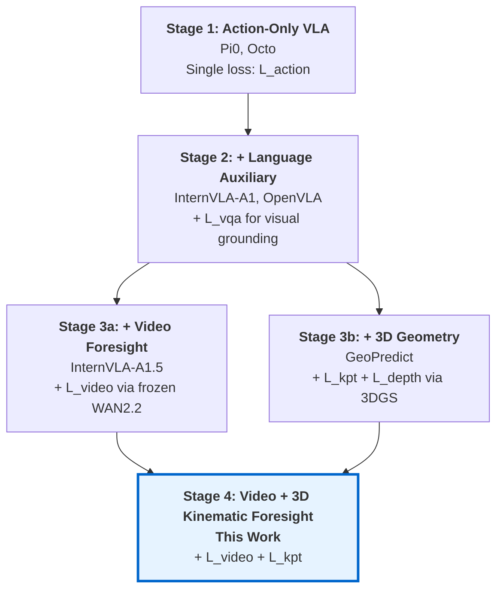
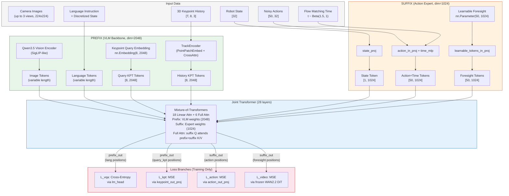
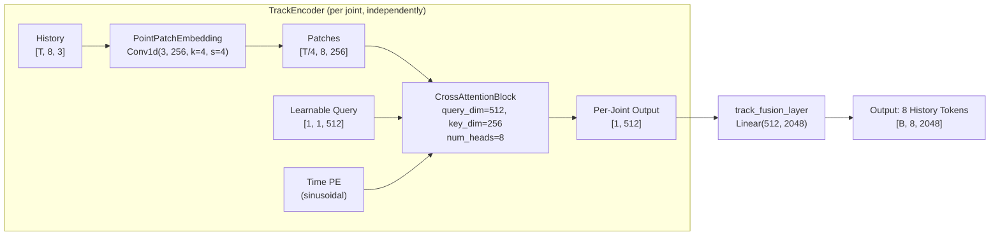
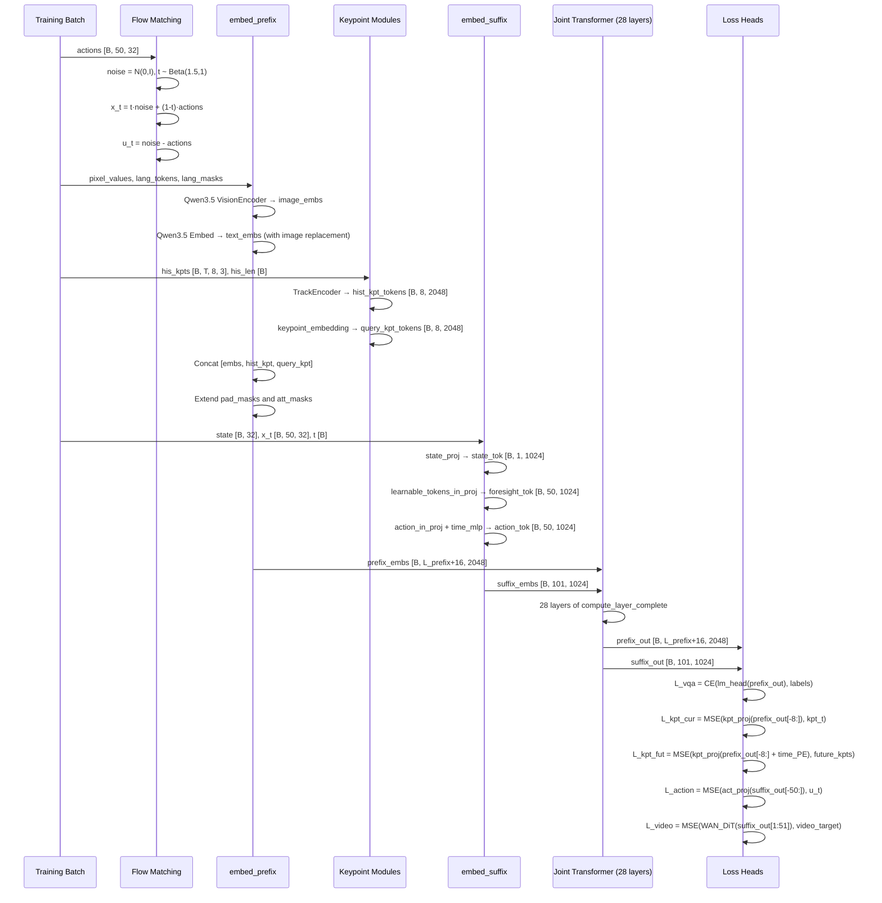
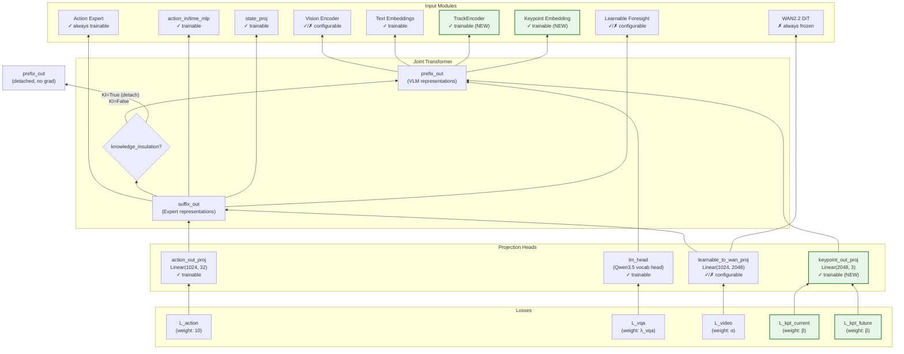
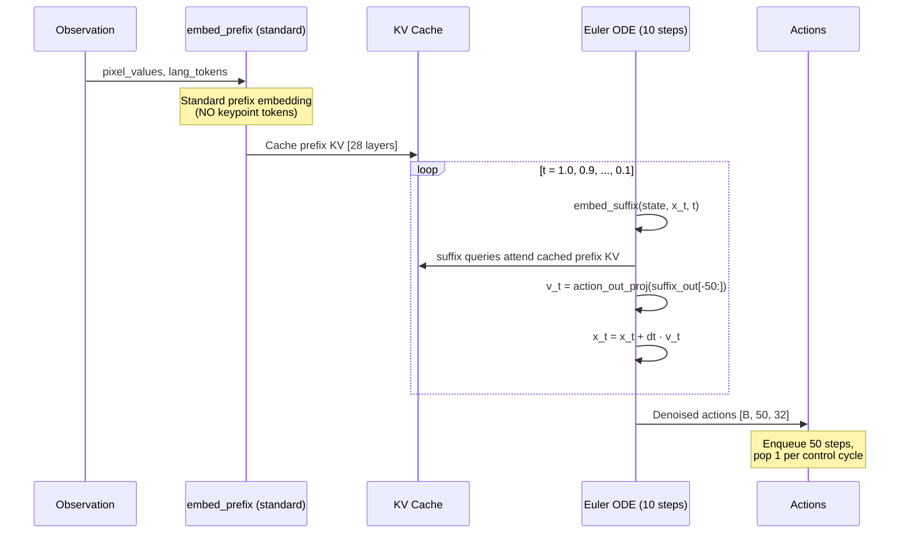
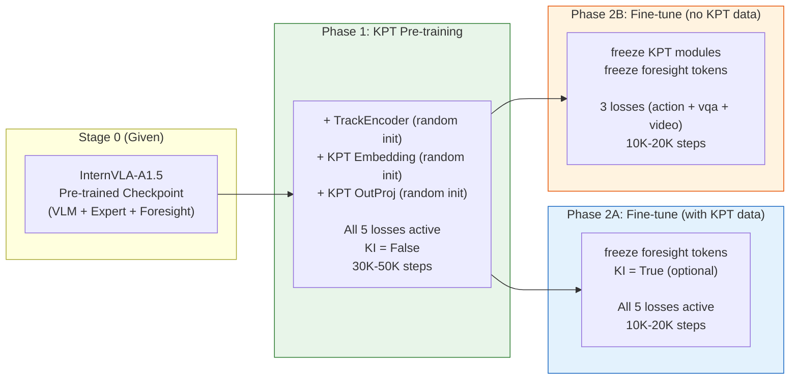

# InternVLA-A1.5 + GeoPredict 3D Keypoint Trajectory Predictor: Fusion Design and Implementation

> **Target**: Integrate GeoPredict's 3D Keypoint Trajectory-Level Kinematic Predictor into InternVLA-A1.5, providing explicit 3D kinematic awareness as a training-time auxiliary supervision signal to improve robot manipulation success rates.

---

## Table of Contents

1. [Motivation and Background](#1-motivation-and-background)
2. [Complementarity Analysis: Why These Two](#2-complementarity-analysis-why-these-two)
3. [Architecture Overview](#3-architecture-overview)
4. [Module Design](#4-module-design)
5. [Token Sequence and Attention Mask](#5-token-sequence-and-attention-mask)
6. [Training Forward Pass](#6-training-forward-pass)
7. [Loss Formulation](#7-loss-formulation)
8. [Backward Pass and Gradient Flow](#8-backward-pass-and-gradient-flow)
9. [Inference Path](#9-inference-path)
10. [Training Strategy](#10-training-strategy)
11. [Data Pipeline](#11-data-pipeline)
12. [Configuration Changes](#12-configuration-changes)
13. [Code Modification Guide](#13-code-modification-guide)
14. [Success Rate Improvement Analysis](#14-success-rate-improvement-analysis)
15. [Alternative Approaches and Trade-offs](#15-alternative-approaches-and-trade-offs)
16. [References](#16-references)

---

## 1. Motivation and Background

### 1.1 The Problem: Implicit 3D Understanding in VLA Policies

Current Vision-Language-Action (VLA) policies, including InternVLA-A1.5, learn to map visual observations and language instructions to robot actions primarily through 2D visual features. While InternVLA-A1.5's latent foresight mechanism (via frozen WAN2.2-5B video prediction) provides implicit future scene prediction, the model lacks explicit awareness of the robot's 3D kinematic structure — where each joint is in space, and where it should move.

This implicit 3D understanding leads to three failure modes:

1. **Spatial confusion**: The policy struggles with novel object positions because it has memorized visual patterns rather than learning geometric reasoning.
2. **Geometry generalization failure**: Different object shapes break visual-pattern matching, even when the required manipulation strategy is kinematically identical.
3. **Long-horizon drift**: Without explicit trajectory-level planning, action chunks can be locally smooth but globally inconsistent, especially over multi-step tasks.

### 1.2 GeoPredict's Solution: 3D Keypoint Trajectory Prediction

GeoPredict ([Li et al., 2025](https://github.com/geopredict)) demonstrates that adding explicit 3D geometric supervision during training — predicting 3D keypoint trajectories and rendering depth maps via differentiable Gaussian splatting — dramatically improves VLA policy success rates:

- **RoboCasa**: +10.1% average (42.3% $\to$ 52.4%), with +32.0% on OpenDoubleDoor
- **LIBERO-Long**: +6.4% (87.6% $\to$ 94.0%)
- **Real-world geometry generalization**: +45% (50% $\to$ 95%)

Critically, these gains come with **zero inference overhead** — all 3D prediction modules are discarded at inference time. The improvement is purely from better learned representations.

### 1.3 InternVLA-A1.5's Strengths

InternVLA-A1.5 ([Zhu et al., 2025](https://arxiv.org/abs/2607.04988)) brings several advantages that GeoPredict's Pi0 backbone lacks:

- **Hybrid linear/full attention** via Qwen3.5's Gated DeltaNet layers — O(1) recurrent state for efficient long-context processing
- **Latent video foresight** via frozen WAN2.2-5B — scene-level future prediction
- **VQA co-training** preserving language understanding and compositional generalization
- **FAST action tokens** providing discrete action vocabulary alongside continuous flow matching
- **Larger-scale pretraining** (1.2M episodes + 3M VQA samples)

The goal is to combine GeoPredict's explicit 3D kinematic awareness with InternVLA-A1.5's richer backbone, achieving complementary improvements.

---

## 2. Complementarity Analysis: Why These Two

### 2.1 Horizontal Comparison: What Each System Predicts About the Future

| Dimension | InternVLA-A1.5 (Latent Video Foresight) | GeoPredict (3D Keypoint Trajectory) |
|---|---|---|
| **What is predicted** | Future video frames in WAN's latent space | Future 3D positions of 8 robot joints |
| **Prediction space** | Compressed image latent ($\mathbb{R}^{C \times T' \times H' \times W'}$) | Explicit 3D ($\mathbb{R}^{T \times 8 \times 3}$) |
| **Temporal horizon** | ~4 future frames within one action chunk | 50 future timesteps (= full action chunk) |
| **Supervision source** | Frozen WAN2.2-5B DiT (internet video pretrained) | Ground truth joint positions (from FK or sim) |
| **Information type** | Scene-level (what the world looks like) | Robot-level (where the robot moves) |
| **Strong for** | Contact prediction, visual servoing, appearance-based planning | Collision avoidance, reaching, kinematic consistency |
| **Weak for** | Kinematic perturbations (LIBERO-Plus Robot: 55.1%) | Scene-level visual changes (no pixel-level supervision) |

The two prediction modalities are **orthogonal**: video foresight captures *scene dynamics* while keypoint trajectories capture *robot kinematics*. Their weaknesses don't overlap.

### 2.2 Vertical Analysis: Evolution of Auxiliary Supervision in VLA



This work represents the natural convergence of two parallel evolution paths: latent scene-level foresight and explicit 3D kinematic prediction. By combining them, the model receives supervision at multiple abstraction levels:

- **Token level**: VQA + FAST tokens (language grounding)
- **Scene level**: Video velocity field (latent future prediction)
- **Kinematic level**: 3D keypoint trajectories (robot motion planning)
- **Action level**: Flow matching velocity field (continuous control)

### 2.3 Ablation Evidence for Complementarity

From InternVLA-A1.5's ablation (Table 8 in paper):
- Removing video loss: LIBERO-Plus drops -6.8%, DOMINO drops -2.4%
- The foresight value is primarily in **out-of-distribution generalization**

From GeoPredict's ablation (Table 2 in paper):
- Depth supervision alone contributes +7.1% over Pi0 baseline
- Adding keypoint trajectory prediction adds another +3.0%
- Track-guided refinement adds +1.3% on top

Since InternVLA-A1.5 already has video foresight (scene-level) and GeoPredict's gains come primarily from 3D geometry (robot-level), the contributions are expected to be **additive** rather than redundant.

---

## 3. Architecture Overview

### 3.1 Fused Architecture Diagram




### 3.2 Key Design Decision: Keypoint Tokens in Prefix

The 16 new keypoint tokens (8 history + 8 query) are placed in the **PREFIX** (VLM backbone, dim=2048), appended after the existing image and language tokens. This is critical for three reasons:

**Reason 1: Dimension compatibility.** The TrackEncoder in GeoPredict outputs tokens at dim=2048, which matches Qwen3.5-2B's `hidden_size` exactly. Placing them in the suffix (dim=1024) would require a lossy dimension reduction.

**Reason 2: Automatic cross-attention.** In InternVLA-A1.5's `compute_layer_complete` (at [`modeling_internvla_a1_5.py:119-335`](src/lerobot/policies/internvla_a1_5/modeling_internvla_a1_5.py#L119-L335)), suffix (expert) queries attend to all prefix K/V in full attention layers:

```python
# Line 276-278: suffix queries attend to [prefix_kv, suffix_kv]
k_for_suffix = torch.cat([prefix_key_for_suffix, suffix_key], dim=2)
v_for_suffix = torch.cat([prefix_value_for_suffix, suffix_value], dim=2)
```

By placing keypoint tokens in the prefix, the action expert **automatically** gains 3D kinematic awareness through this existing cross-attention — no changes to `compute_layer_complete` needed.

**Reason 3: VLM feature enrichment.** Prefix tokens attend to each other (causal). The keypoint query tokens attend to image, language, AND history keypoint tokens. This forces the VLM to build features that are informative for 3D keypoint prediction, enriching the representations available to all downstream consumers.

### 3.3 Dimension Reference

| Component | InternVLA-A1.5 | GeoPredict | Fused |
|---|---|---|---|
| VLM / Prefix hidden_size | 2048 (Qwen3.5-2B) | 2048 (Gemma 2B) | 2048 |
| Action Expert / Suffix hidden_size | 1024 | 1024 | 1024 |
| head_dim | 256 | 256 | 256 |
| num_attention_heads | 8 | 8 | 8 |
| num_kv_heads | 2 (GQA) | 1 (GQA) | 2 (keep Qwen3.5) |
| num_layers | 28 (24 Gated DeltaNet + 4 repeated groups = 6 full + 18 linear) | 18 (all full attn) | 28 (keep Qwen3.5) |
| TrackEncoder output_dim | N/A | 2048 | 2048 (direct port) |
| keypoint_out_proj | N/A | Linear(2048, 3) | Linear(2048, 3) |
| Num keypoint joints | N/A | 8 | 8 (configurable) |

The dimension match between Qwen3.5-2B and Gemma 2B means GeoPredict's keypoint modules can be ported with **zero dimension adaptation**.

---

## 4. Module Design

### 4.1 TrackEncoder: 3D Keypoint History Encoding

The TrackEncoder compresses a variable-length history of 3D joint positions into 8 compact tokens (one per joint). It is ported directly from GeoPredict ([`GeoPredict/models/keypoints.py:150-213`](../../../GeoPredict/models/keypoints.py#L150-L213)).



**Architecture details:**

- **PointPatchEmbedding** ([`keypoints.py:8-49`](../../../GeoPredict/models/keypoints.py#L8-L49)): A 1D convolution `Conv1d(in_dim=3, embed_dim=256, kernel_size=4, stride=4)` applied along the time axis for each joint independently. This reduces temporal resolution by 4$\times$, converting raw 3D positions into patch embeddings. Input shape: $[B, T, 8, 3]$, output shape: $[B, T/4, 8, 256]$.

- **CrossAttentionBlock** ([`keypoints.py:111-147`](../../../GeoPredict/models/keypoints.py#L111-L147)): For each of the 8 joints, a single learnable query token ($\mathbf{q} \in \mathbb{R}^{1 \times 512}$, `nn.Parameter`) cross-attends to the temporal patches of that joint. Sinusoidal time embeddings (`TimeEmbedding`) are added to the keys to encode temporal position. The cross-attention uses 8 heads with head_dim = 64.

- **Fusion projection**: `track_fusion_layer = Linear(512, 2048)` maps each joint's compressed representation to the VLM hidden dimension. Final output: $[B, 8, 2048]$.

**Adaptation for Qwen3.5**: No changes needed. The TrackEncoder operates *before* tokens enter the transformer, so it is agnostic to the backbone's attention mechanism (hybrid linear/full vs. standard).

### 4.2 Keypoint Query Tokens

Eight learnable embedding tokens, one per robot joint:

$$\mathbf{E}_{kpt} = \text{nn.Embedding}(J, d_{vlm}) \quad \text{where } J=8, \; d_{vlm}=2048$$

These query tokens participate in the transformer forward pass, attending to all earlier prefix tokens (images, language, history keypoints) via the causal attention mask. After the transformer, their output representations are used to predict current and future 3D joint positions.

This is the same design as GeoPredict ([`geopredict.py:174-178`](../../../GeoPredict/models/geopredict.py#L174-L178)):
```python
joint_token = self.keypoint_embedding.weight.unsqueeze(0).repeat(current_batch_size, 1, 1)
```

### 4.3 Keypoint Output Projection

A single shared linear head maps query token representations to 3D coordinates:

$$\text{keypoint\_out\_proj} = \text{Linear}(d_{vlm}, 3) \quad \text{where } d_{vlm}=2048$$

This head is shared between current and future prediction (Section 4.4), following GeoPredict's parameter-efficient design.

### 4.4 Future Trajectory Prediction via Time-Conditioned Reuse

The future keypoint trajectory over the full action chunk horizon (50 timesteps) is predicted by **reusing** the same query token outputs and projection head, differentiated only by sinusoidal time positional embeddings:

$$\hat{\mathbf{p}}_{j,t} = \text{keypoint\_out\_proj}\!\left(\mathbf{h}_j^{kpt} + \mathbf{e}_t^{future}\right)$$

where:
- $\hat{\mathbf{p}}_{j,t} \in \mathbb{R}^3$ is the predicted 3D position of joint $j$ at future timestep $t$
- $\mathbf{h}_j^{kpt} \in \mathbb{R}^{2048}$ is the query keypoint token output from the transformer
- $\mathbf{e}_t^{future} \in \mathbb{R}^{2048}$ is the precomputed sinusoidal position embedding for timestep $t$

The future position embeddings use sinusoidal encoding with base frequency 100 (matching GeoPredict's [`geopredict.py:298-312`](../../../GeoPredict/models/geopredict.py#L298-L312)):

$$\mathbf{e}_t^{future}[2i] = \sin\!\left(\frac{t}{100^{2i/d}}\right), \quad \mathbf{e}_t^{future}[2i+1] = \cos\!\left(\frac{t}{100^{2i/d}}\right)$$

These are registered as a non-trainable buffer: `register_buffer("future_kpt_pos_embed", ...)` of shape $[C, d_{vlm}]$ where $C=50$ is the chunk size.

**Parameter efficiency**: The entire trajectory prediction adds only one `Linear(2048, 3)` layer (6,147 parameters) beyond the TrackEncoder and embedding. The temporal differentiation comes from the position embeddings (no parameters), and the shared head amortizes across all 50 $\times$ 8 = 400 individual position predictions.

---

## 5. Token Sequence and Attention Mask

### 5.1 Fused Token Sequence Layout


```
PREFIX (VLM backbone, dim=2048):
┌──────────────────────────────────────────────────────────────────────────┐
│  Image Tokens (variable)  │  Language Tokens (variable)  │  Hist KPT (8)  │  Query KPT (8)  │
│  att_mask: [1,1,1,...]    │  att_mask: [1,1,1,...]       │  att: [1,0..0]  │  att: [1,0..0]  │
│  (causal - each = block)  │  (causal - each = block)     │  (bidirectional │  (bidirectional  │
│                           │                              │   within group) │   within group)  │
└──────────────────────────────────────────────────────────────────────────┘

SUFFIX (Action Expert, dim=1024):
┌──────────────────────────────────────────────────────────────────────────┐
│  State (1)  │  Learnable Foresight (50)  │  Action+Time (50)  │
│  att: [1]   │  att: [1, 0, ..., 0]       │  att: [1, 0, ..., 0]  │
│             │  (bidirectional within)     │  (bidirectional within)  │
└──────────────────────────────────────────────────────────────────────────┘
```

### 5.2 Attention Mask Construction

InternVLA-A1.5 uses a **cumsum-based block causality** mechanism ([`modeling_internvla_a1_5.py`](src/lerobot/policies/internvla_a1_5/modeling_internvla_a1_5.py), function `make_att_2d_masks`):

- `att_mask = 1` starts a **new block** (cannot be attended by later blocks)
- `att_mask = 0` continues the current block (bidirectional within)

The 2D attention mask is computed as:

$$M_{ij} = \begin{cases} 1 & \text{if } \text{cumsum}(att)[i] \geq \text{cumsum}(att)[j] \text{ AND } pad\_mask[j] = 1 \\ 0 & \text{otherwise} \end{cases}$$

For the new keypoint tokens, we set:
- **History KPT group**: `att_mask = [1, 0, 0, 0, 0, 0, 0, 0]` — first token starts new block, remaining 7 continue it. All 8 see each other (bidirectional) and all earlier prefix tokens.
- **Query KPT group**: `att_mask = [1, 0, 0, 0, 0, 0, 0, 0]` — same structure. All 8 see each other, all earlier prefix tokens, and the history KPT group.

### 5.3 Resulting Attention Pattern

| Token type | $\leftarrow$ Image | $\leftarrow$ Language | $\leftarrow$ Hist KPT | $\leftarrow$ Query KPT | $\leftarrow$ Suffix |
|---|:---:|:---:|:---:|:---:|:---:|
| **Image** | Causal | $\times$ | $\times$ | $\times$ | $\times$ |
| **Language** | $\checkmark$ | Causal | $\times$ | $\times$ | $\times$ |
| **Hist KPT** | $\checkmark$ | $\checkmark$ | Bidirectional | $\times$ | $\times$ |
| **Query KPT** | $\checkmark$ | $\checkmark$ | $\checkmark$ | Bidirectional | $\times$ |
| **Suffix** | $\checkmark$ | $\checkmark$ | $\checkmark$ | $\checkmark$ | Block-causal |

This matches GeoPredict's group structure where History KPT = Group 1, Query KPT = Group 2, and Action = Group 4.

### 5.4 FAST Token Blocking

InternVLA-A1.5's `block_action_attend_fast_tokens` mechanism ([`modeling_internvla_a1_5.py:1145-1151`](src/lerobot/policies/internvla_a1_5/modeling_internvla_a1_5.py#L1145-L1151)) blocks suffix queries from attending to FAST action token positions in the prefix. The `fast_token_mask` must be extended with 16 zeros to cover the new keypoint positions (keypoint tokens should NOT be blocked from suffix attention):

```python
# In forward(), extend fast_token_mask to cover new prefix length
fast_token_mask_ext = torch.cat([
    fast_token_mask,  # [B, L_original_prefix]
    torch.zeros(B, 2 * num_joints, device=device, dtype=torch.bool)  # [B, 16]
], dim=1)
```

---

## 6. Training Forward Pass

### 6.1 Complete Data Flow



### 6.2 Step-by-Step Forward (Pseudo-code)

The following describes the modifications to `InternVLAA15.forward` (at [`modeling_internvla_a1_5.py:1099-1246`](src/lerobot/policies/internvla_a1_5/modeling_internvla_a1_5.py#L1099-L1246)):

```python
def forward(self, pixel_values, image_grid_thw, lang_tokens, lang_masks,
            state, actions, labels=None, fast_token_mask=None,
            video_frames=None, video_mask=None,
            his_kpts=None, his_len=None,        # NEW
            kpt_t=None, future_kpts=None,        # NEW
            kpt_mask=None,                        # NEW
            noise=None, time=None):
    
    # Step 1: Flow matching noise sampling (UNCHANGED)
    if noise is None:
        noise = self.sample_noise(actions.shape, actions.device)
    if time is None:
        time = self.sample_time(actions.shape[0], actions.device)
    time_expanded = time[:, None, None]
    x_t = time_expanded * noise + (1 - time_expanded) * actions
    u_t = noise - actions

    # Step 2: Embed prefix WITH keypoint tokens (MODIFIED)
    prefix_embs, prefix_pad_masks, prefix_att_masks = self.embed_prefix(
        pixel_values, image_grid_thw, lang_tokens, lang_masks, labels,
        his_kpts=his_kpts, his_len=his_len  # NEW args
    )

    # Step 3: Embed suffix (UNCHANGED)
    suffix_embs, suffix_pad_masks, suffix_att_masks = self.embed_suffix(state, x_t, time)

    # Step 4: Build attention mask (MODIFIED for extended prefix)
    pad_masks = torch.cat([prefix_pad_masks, suffix_pad_masks], dim=1)
    att_masks = torch.cat([prefix_att_masks, suffix_att_masks], dim=1)
    att_2d_masks = make_att_2d_masks(pad_masks, att_masks)
    
    # Extend fast_token_mask to cover keypoint positions (NEW)
    if self.config.block_action_attend_fast_tokens and self.config.enable_keypoint_predictor:
        kpt_extension = torch.zeros(B, 2 * self.config.num_keypoint_joints,
                                     device=device, dtype=torch.bool)
        fast_token_mask_ext = torch.cat([fast_token_mask, kpt_extension], dim=1)
    else:
        fast_token_mask_ext = fast_token_mask
    # Block suffix from attending to FAST tokens (existing logic with extended mask)
    
    # Step 5: Position IDs (auto-extends for longer prefix)
    # Step 6: Joint transformer forward (UNCHANGED mechanism)
    (prefix_out, suffix_out), _ = self.qwen3_5_with_expert.forward(...)

    # Step 7: Compute losses
    # L_vqa (UNCHANGED) ...
    # L_action (UNCHANGED) ...
    # L_video (UNCHANGED) ...

    # Step 8: Keypoint losses (NEW)
    if self.config.enable_keypoint_predictor and kpt_t is not None:
        num_j = self.config.num_keypoint_joints
        query_kpt_out = prefix_out[:, -num_j:]  # [B, 8, 2048]
        
        # Current keypoint loss
        pred_kpt = self.keypoint_out_proj(query_kpt_out)  # [B, 8, 3]
        loss_kpt_current = F.mse_loss(pred_kpt, kpt_t, reduction='mean')
        
        # Future keypoint loss
        B_kpt = query_kpt_out.shape[0]
        kpt_rep = query_kpt_out.unsqueeze(1).expand(-1, C, -1, -1)  # [B,50,8,2048]
        fut_pe = self.future_kpt_pos_embed[:C].unsqueeze(0).unsqueeze(2)  # [1,50,1,2048]
        kpt_future_in = kpt_rep + fut_pe  # [B,50,8,2048]
        kpt_future_flat = kpt_future_in.reshape(B_kpt * C, num_j, -1)
        future_pred = self.keypoint_out_proj(kpt_future_flat).reshape(B_kpt, C, num_j, 3)
        loss_kpt_future = F.mse_loss(future_pred, future_kpts, reduction='mean')
        
        # Apply mask for samples without keypoint data
        if kpt_mask is not None:
            mask_f = kpt_mask.float().mean()
            loss_kpt_current = loss_kpt_current * mask_f
            loss_kpt_future = loss_kpt_future * mask_f
    else:
        loss_kpt_current = torch.tensor(0.0, device=actions.device)
        loss_kpt_future = torch.tensor(0.0, device=actions.device)

    return (loss_action, loss_vqa, video_loss,
            loss_kpt_current, loss_kpt_future,  # NEW
            loss_per_token, token_mask)
```

---

## 7. Loss Formulation

### 7.1 Complete Loss Function

The total training loss combines five components:

$$\mathcal{L}_{total} = \underbrace{10 \cdot \mathcal{L}_{action}}_{\text{flow matching}} + \underbrace{\lambda_{vqa} \cdot \mathcal{L}_{vqa}}_{\text{language grounding}} + \underbrace{\alpha \cdot \mathcal{L}_{video}}_{\text{scene foresight}} + \underbrace{\beta \cdot (\mathcal{L}_{kpt}^{cur} + \mathcal{L}_{kpt}^{fut})}_{\text{kinematic foresight (NEW)}}$$

where:
- $\mathcal{L}_{action}$: Flow matching velocity MSE, weight 10 (hardcoded in InternVLA-A1.5)
- $\mathcal{L}_{vqa}$: Cross-entropy on subtask + FAST tokens, $\lambda_{vqa} = 1.0$
- $\mathcal{L}_{video}$: Video flow matching MSE via frozen WAN2.2 DiT, $\alpha = 1.0$
- $\mathcal{L}_{kpt}^{cur}$: Current keypoint position MSE, $\beta = 1.0$
- $\mathcal{L}_{kpt}^{fut}$: Future keypoint trajectory MSE, $\beta = 1.0$ (shared weight)

### 7.2 Individual Loss Definitions

**Current Keypoint Loss:**

$$\mathcal{L}_{kpt}^{cur} = \frac{1}{B \cdot J \cdot 3} \sum_{b=1}^{B} \sum_{j=1}^{J} \|\hat{\mathbf{p}}_{j}^{cur} - \mathbf{p}_{j}^{gt}\|_2^2$$

where $\hat{\mathbf{p}}_{j}^{cur} = \text{keypoint\_out\_proj}(\mathbf{h}_j^{kpt})$, $J = 8$ is the number of joints, $\mathbf{p}_{j}^{gt} \in \mathbb{R}^3$ is the ground truth 3D position of joint $j$.

**Future Keypoint Trajectory Loss:**

$$\mathcal{L}_{kpt}^{fut} = \frac{1}{B \cdot C \cdot J \cdot 3} \sum_{b=1}^{B} \sum_{t=1}^{C} \sum_{j=1}^{J} \|\hat{\mathbf{p}}_{j,t}^{fut} - \mathbf{p}_{j,t}^{gt}\|_2^2$$

where $\hat{\mathbf{p}}_{j,t}^{fut} = \text{keypoint\_out\_proj}(\mathbf{h}_j^{kpt} + \mathbf{e}_t^{future})$, $C = 50$ is the chunk size. Note $\mathbf{e}_t^{future}$ is a frozen sinusoidal buffer, not a trainable parameter.

### 7.3 Loss Weighting Rationale

The keypoint loss weight $\beta = 1.0$ is chosen because:
1. **GeoPredict uses $\beta = 1.0$** alongside action loss weight 1.0, and this balance is empirically validated.
2. **InternVLA-A1.5 uses 10$\times$ action loss** — so the effective ratio of action:keypoint is 10:1, which naturally prevents the auxiliary task from dominating.
3. The keypoint losses are MSE on 3D coordinates in meters, which are typically $O(1)$ in magnitude, comparable to the flow matching velocity MSE.

### 7.4 Per-Sample Masking

Not all training samples have 3D keypoint annotations (e.g., VQA-only samples, or robot datasets without FK data). A per-sample boolean mask `kpt_mask` (shape $[B]$) controls which samples contribute to the keypoint losses:

$$\mathcal{L}_{kpt} = \frac{\sum_{b=1}^{B} m_b \cdot (\mathcal{L}_{kpt,b}^{cur} + \mathcal{L}_{kpt,b}^{fut})}{\sum_{b=1}^{B} m_b + \epsilon}$$

where $m_b \in \{0, 1\}$ is the mask value for sample $b$. This is analogous to the existing `video_mask` mechanism for the WAN loss.

---

## 8. Backward Pass and Gradient Flow

### 8.1 Gradient Flow Diagram




### 8.2 Knowledge Insulation Interaction

InternVLA-A1.5's knowledge insulation (KI) mechanism (`knowledge_insulation` config, [`modeling_internvla_a1_5.py:269`](src/lerobot/policies/internvla_a1_5/modeling_internvla_a1_5.py#L269)) detaches prefix K/V before suffix cross-attention, preventing action loss gradients from flowing back to the VLM prefix.

This interacts with keypoint tokens in an important way:

| KI Setting | Action loss $\to$ KPT tokens | KPT losses $\to$ VLM backbone | Recommendation |
|---|---|---|---|
| **KI = False** (default) | $\checkmark$ Gradients flow | $\checkmark$ Gradients flow | Pre-training: bidirectional supervision enriches both |
| **KI = True** | $\times$ Detached | $\checkmark$ Gradients flow | Fine-tuning: clean separation, KPT tokens learn from own losses only |

When `KI = False`:
- Action loss gradients flow through suffix $\to$ cross-attention $\to$ prefix $\to$ keypoint tokens
- KPT losses directly supervise keypoint tokens through prefix_out
- **Result**: Keypoint representations are optimized for both 3D prediction AND action quality — bidirectional benefit

When `KI = True`:
- Action loss gradients are blocked at the prefix boundary (`.detach()`)
- KPT losses are the sole supervisor of keypoint tokens
- **Result**: Cleaner separation, avoids VLM destabilization during fine-tuning

### 8.3 Freezing Strategy

| Module | Pre-training (Phase 1) | Fine-tuning with KPTs (Phase 2A) | Fine-tuning without KPTs (Phase 2B) |
|---|---|---|---|
| Qwen3.5 VLM backbone | Trainable | Trainable (lower LR) | Trainable |
| Vision encoder | **Frozen** | **Frozen** | **Frozen** |
| Action expert + projections | Trainable | Trainable | Trainable |
| Learnable foresight tokens | Trainable | **Frozen** | **Frozen** |
| learnable_to_wan_proj | Trainable | **Frozen** | **Frozen** |
| WAN DiT + VAE | **Frozen** | **Frozen** | **Frozen** |
| TrackEncoder | Trainable (higher LR) | Trainable | **Frozen** (no data) |
| keypoint_embedding | Trainable | Trainable | **Frozen** |
| keypoint_out_proj | Trainable | Trainable | **Frozen** |
| future_kpt_pos_embed | **Frozen** (buffer) | **Frozen** | **Frozen** |

Implementation in `set_requires_grad` (around [`modeling_internvla_a1_5.py:606`](src/lerobot/policies/internvla_a1_5/modeling_internvla_a1_5.py#L606)):

```python
if self.config.freeze_keypoint_modules:
    for p in self.track_encoder.parameters():
        p.requires_grad = False
    self.keypoint_embedding.weight.requires_grad = False
    for p in self.keypoint_out_proj.parameters():
        p.requires_grad = False
```

### 8.4 Gradient Flow Through Hybrid Attention Layers

Qwen3.5's architecture alternates between **Gated DeltaNet** (linear attention) and **full attention** layers. The gradient behavior differs:

- **In linear attention layers** (18 of 28): Prefix and suffix run **independently**. Keypoint token gradients only flow through VLM-side linear attention. No cross-pathway gradients.

- **In full attention layers** (6 of 28): Suffix queries attend to prefix K/V (including keypoint tokens). Here:
  - Forward: action expert reads keypoint representations
  - Backward (KI=False): action loss $\to$ suffix output $\to$ attention gradient $\to$ prefix K/V $\to$ keypoint token representations
  - Backward (KI=True): prefix K/V is detached, so action loss stops at the suffix

The keypoint losses always have a **direct gradient path** through all 28 layers (via `prefix_out`), independent of the suffix pathway. This ensures robust supervision regardless of KI setting.

---

## 9. Inference Path

### 9.1 Mode A: Zero-Overhead Default (Recommended)

When `include_keypoints_at_inference = False` (default):



**Why this works without keypoint tokens**: The keypoint auxiliary task acts as a **training-time regularizer** that improves the quality of learned VLM features. After training, image and language tokens carry richer 3D-aware representations, even without the keypoint tokens present. This is empirically validated by GeoPredict (all 3D modules are discarded at inference) and is analogous to how dropout improves features at test time despite being inactive.

**Overhead**: Exactly zero — identical to the unmodified InternVLA-A1.5 inference path.

### 9.2 Mode B: Enhanced Inference with Keypoint History

When `include_keypoints_at_inference = True` AND keypoint history is available from robot joint encoders:

```python
def sample_actions(self, pixel_values, image_grid_thw, lang_tokens, lang_masks,
                   state, fast_token_mask=None,
                   his_kpts=None, his_len=None):  # NEW optional args
    
    # Embed prefix with keypoint tokens (if enabled and available)
    prefix_embs, prefix_pad_masks, prefix_att_masks = self.embed_prefix(
        pixel_values, image_grid_thw, lang_tokens, lang_masks,
        his_kpts=his_kpts, his_len=his_len
    )
    # ... rest of sample_actions unchanged ...
    # KV cache now contains keypoint token K/V
    # Denoising steps automatically benefit from enriched prefix
```

**Overhead**: +16 prefix tokens per sample. For a typical prefix of ~400 tokens, this is a ~4% increase in sequence length. The TrackEncoder forward pass (one Conv1d + one cross-attention per joint) is negligible compared to the VLM forward pass.

**When to use Mode B**: Real-robot deployment where joint encoder readings are available and can be converted to 3D positions via forward kinematics (FK). The FK computation is standard and adds sub-millisecond latency.

---

## 10. Training Strategy

### 10.1 Staged Training Overview



### 10.2 Phase 1: Keypoint Pre-training

**Starting point**: InternVLA-A1.5 pre-trained checkpoint (after Stage 2 of the original training).

**Initialization**:
- All existing modules: loaded from checkpoint
- TrackEncoder, keypoint_embedding, keypoint_out_proj: **random initialization** (Xavier uniform for linear layers, truncated normal for embeddings)

**Training config**:
```
learning_rate (backbone): 2.5e-5
learning_rate (keypoint modules): 5e-5  # 2× higher for randomly initialized
weight_decay: 0.01
warmup_steps: 1000
decay_steps: 30000
decay_lr: 2.5e-6
grad_clip: 1.0
knowledge_insulation: False  # allow bidirectional supervision
freeze_vision_encoder: True
freeze_learnable_tokens: False
freeze_keypoint_modules: False
```

**Data requirements**: Robot datasets with 3D keypoint annotations. Sources:
1. **Simulation**: Direct from MuJoCo/Isaac Gym via `sim.get_body_xpos()`
2. **Pre-computed FK**: Offline computation from joint encoders + URDF
3. **Mixed**: Keypoint data for robot samples, zeros + mask for VQA

**Separate parameter groups** for differentiated LR:
```python
param_groups = [
    {"params": backbone_params, "lr": 2.5e-5, "weight_decay": 0.01},
    {"params": keypoint_params, "lr": 5e-5, "weight_decay": 0.01},
]
```

### 10.3 Phase 2A: Fine-tuning with Keypoint Data

When the target domain has 3D keypoint annotations:

```
learning_rate: 5e-6  (lower for fine-tuning)
warmup_steps: 500
freeze_learnable_tokens: True  (standard for InternVLA-A1.5 fine-tuning)
freeze_keypoint_modules: False  (continue adapting to new embodiment)
knowledge_insulation: True  (optional, prevents VLM destabilization)
kpt_loss_weight: 1.0
duration: 10K-20K steps
```

### 10.4 Phase 2B: Fine-tuning without Keypoint Data

When the target domain lacks 3D keypoint annotations:

```
freeze_keypoint_modules: True  (no supervision available)
freeze_learnable_tokens: True
kpt_loss_weight: 0.0  (or equivalently, kpt_mask = all False)
include_keypoints_at_inference: False
duration: 10K-20K steps
```

The model benefits from Phase 1's improved representations even without keypoint tokens at fine-tuning or inference.

---

## 11. Data Pipeline

### 11.1 New Transform: Extract3DKeypointTransformFn

A new data transform is added to the InternVLA-A1.5 transform pipeline (in [`transform_internvla_a1_5.py`](src/lerobot/policies/internvla_a1_5/transform_internvla_a1_5.py)):

```python
@DataTransformFn.register_subclass("extract_3d_keypoints")
@dataclass
class Extract3DKeypointTransformFn(DataTransformFn):
    num_joints: int = 8
    max_history: int = 1000
    chunk_size: int = 50
    keypoint_source: str = "none"  # "precomputed", "state_fk", "none"

    def __call__(self, data: DataDict) -> DataDict:
        if self.keypoint_source == "precomputed":
            # Load from pre-computed .npy files (GeoPredict format)
            # his_kpts: [max_history, num_joints, 3]
            # kpt_t: [num_joints, 3]
            # future_kpts: [chunk_size, num_joints, 3]
            ...
        elif self.keypoint_source == "state_fk":
            # Compute 3D positions via forward kinematics from state
            ...
        else:
            # No keypoints: produce zeros + False mask
            data["his_kpts"] = torch.zeros(self.max_history, self.num_joints, 3)
            data["his_len"] = torch.tensor(0)
            data["kpt_t"] = torch.zeros(self.num_joints, 3)
            data["future_kpts"] = torch.zeros(self.chunk_size, self.num_joints, 3)
            data["kpt_mask"] = torch.tensor(False)
            return data
        
        data["kpt_mask"] = torch.tensor(True)
        return data
```

### 11.2 Transform Pipeline Integration

Insert `Extract3DKeypointTransformFn` **after** `NormalizeTransformFn` and **before** `ComposeFieldsTransform` in the dataset config's `data_transforms.inputs` list (at [`configuration_internvla_a1_5.py:36-64`](src/lerobot/policies/internvla_a1_5/configuration_internvla_a1_5.py#L36-L64)):

```python
data_transforms: TransformGroup = field(
    default_factory=lambda: TransformGroup(
        inputs=[
            DeltaActionTransformFn(),
            ResizeImagesWithPadFn(...),
            RemapImageKeyTransformFn(),
            ExtractVideoFramesTransformFn(),
            NormalizeTransformFn(),
            Extract3DKeypointTransformFn(),   # <-- NEW: after normalize, before compose
            ComposeFieldsTransform(),
            FASTInternVLAA15ActionTokenizerTransformFn(),
            ...
        ]
    )
)
```

### 11.3 UnifyInputs Extension

Modify `UnifyInternVLAA15InputsTransformFn.__call__` (at [`configuration_internvla_a1_5.py:118-150`](src/lerobot/policies/internvla_a1_5/configuration_internvla_a1_5.py#L118-L150)) to include keypoint fields:

```python
return {
    ...existing fields...,
    "his_kpts": data.get("his_kpts", torch.zeros(1000, 8, 3)),
    "his_len": data.get("his_len", torch.tensor(0)),
    "kpt_t": data.get("kpt_t", torch.zeros(8, 3)),
    "future_kpts": data.get("future_kpts", torch.zeros(50, 8, 3)),
    "kpt_mask": data.get("kpt_mask", torch.tensor(False)),
}
```

### 11.4 Keypoint Data Format

Following GeoPredict's format ([`robocasa_dataset.py`](../../../GeoPredict/data_processing/robocasa_dataset.py)):

| Field | Shape | Description |
|---|---|---|
| `his_kpts` | `[max_T, J, 3]` | History 3D positions, zero-padded to `max_T=1000` |
| `his_len` | scalar | Actual history length (0 to 999) |
| `kpt_t` | `[J, 3]` | Current step's 3D joint positions |
| `future_kpts` | `[C, J, 3]` | Future C=50 steps' 3D joint positions |
| `kpt_mask` | bool | Whether this sample has valid keypoint data |

Here $J = 8$ (7 arm links + gripper end-effector), and 3D coordinates are in the robot base frame, typically within $[0, 1.6]^2 \times [0, 1.0]$ meters.

### 11.5 3D Keypoint Sources

| Source | How to Obtain | Accuracy | Availability |
|---|---|---|---|
| **MuJoCo sim** | `sim.data.get_body_xpos(link_name)` | Exact | All MuJoCo environments |
| **Isaac Gym** | `gym.get_rigid_body_states()` | Exact | All Isaac Gym environments |
| **URDF + joint encoders** | Forward kinematics via `kinpy` / `pybullet` | High (up to calibration) | All robots with known URDF |
| **Depth + keypoint detection** | 3D lifting from depth maps | Moderate | Requires depth cameras |
| **Motion capture** | External tracking | High | Requires MoCap system |

For the initial implementation, **simulation data with direct FK** is the recommended starting point, as it provides exact ground truth with minimal engineering effort.

---

## 12. Configuration Changes

### 12.1 New InternVLAA15Config Fields

Add to [`configuration_internvla_a1_5.py:250-345`](src/lerobot/policies/internvla_a1_5/configuration_internvla_a1_5.py#L250-L345):

```python
# ---- 3D Keypoint Trajectory Predictor ----
enable_keypoint_predictor: bool = False    # Master switch
num_keypoint_joints: int = 8               # Number of robot joints to track
kpt_loss_weight: float = 1.0              # Weight for keypoint losses (β)
freeze_keypoint_modules: bool = False      # Freeze TrackEncoder + embeddings + projection
include_keypoints_at_inference: bool = False  # Include KPT tokens in inference prefix

# TrackEncoder hyperparameters
keypoint_track_input_dim: int = 3          # xyz per joint
keypoint_track_patch_size: int = 4         # Temporal patch size
keypoint_track_embed_dim: int = 256        # Patch embedding dim
keypoint_track_query_dim: int = 512        # Cross-attention query dim
keypoint_track_num_heads: int = 8          # Number of attention heads
keypoint_track_ff_dim: int = 1024          # FFN hidden dim
keypoint_history_max_len: int = 1000       # Max history length (padded)
```

### 12.2 New Dataset Config Fields

Add to `InternVLAA15DatasetConfig`:

```python
enable_keypoint_data: bool = False
keypoint_source: str = "none"       # "precomputed", "state_fk", "none"
num_keypoint_joints: int = 8
keypoint_history_max_len: int = 1000
```

### 12.3 Validation

In `InternVLAA15Config.__post_init__`:

```python
if self.enable_keypoint_predictor:
    if self.num_keypoint_joints <= 0:
        raise ValueError("num_keypoint_joints must be > 0")
    if self.kpt_loss_weight < 0:
        raise ValueError("kpt_loss_weight must be >= 0")
    if self.include_keypoints_at_inference and self.inference_backend == "optimized":
        raise ValueError("Optimized backend does not support keypoint inference tokens")
```

---

## 13. Code Modification Guide

### 13.1 New File

**`src/lerobot/policies/internvla_a1_5/keypoints.py`**

Port from [`GeoPredict/models/keypoints.py`](../../../GeoPredict/models/keypoints.py):
- `PointPatchEmbedding` (lines 8-49)
- `TimeEmbedding` (lines 52-71)
- `MultiHeadAttention` (lines 74-108)
- `CrossAttentionBlock` (lines 111-147)
- `TrackEncoder` (lines 150-213)

Also port `get_1d_sincos_pos_embed` from [`GeoPredict/models/geopredict.py:57-71`](../../../GeoPredict/models/geopredict.py#L57-L71).

Replace `einops.rearrange` with native PyTorch operations to minimize dependencies.

### 13.2 Modified Files

| File | Changes |
|---|---|
| [`modeling_internvla_a1_5.py`](src/lerobot/policies/internvla_a1_5/modeling_internvla_a1_5.py) | `__init__`: add keypoint modules (TrackEncoder, embedding, projection, buffer). `embed_prefix`: accept `his_kpts`/`his_len`, encode and append keypoint tokens. `forward`: compute keypoint losses, extend return. `sample_actions`: optionally include keypoint tokens. `set_requires_grad`: add freeze logic. |
| [`configuration_internvla_a1_5.py`](src/lerobot/policies/internvla_a1_5/configuration_internvla_a1_5.py) | Add keypoint config fields (Section 12.1, 12.2). Add validation. Add `Extract3DKeypointTransformFn` to transform pipeline. Extend `UnifyInternVLAA15InputsTransformFn`. |
| [`transform_internvla_a1_5.py`](src/lerobot/policies/internvla_a1_5/transform_internvla_a1_5.py) | Add `Extract3DKeypointTransformFn` class. |
| [`lerobot_train.py`](src/lerobot/scripts/lerobot_train.py) | Add `loss_kpt_current` and `loss_kpt_future` to metrics tracking. |
| [`modeling_internvla_a1_5_optimized.py`](src/lerobot/policies/internvla_a1_5/modeling_internvla_a1_5_optimized.py) | Add validation: reject `include_keypoints_at_inference=True` with optimized backend. |

### 13.3 Checkpoint Compatibility

Add keypoint module prefixes to the checkpoint exclusion list if needed (similar to WAN exclusion at [`modeling_internvla_a1_5.py:1426-1437`](src/lerobot/policies/internvla_a1_5/modeling_internvla_a1_5.py#L1426-L1437)):

```python
# In InternVLAA15Policy:
_checkpoint_excluded_prefixes = (
    "model.wan_video_model.",
    # Optionally exclude keypoint modules from checkpoints
    # if they should be loaded separately:
    # "model.track_encoder.",
    # "model.keypoint_embedding.",
    # "model.keypoint_out_proj.",
)
```

For the recommended approach, **include** keypoint modules in checkpoints (they are small: ~5M parameters total).

### 13.4 Parameter Count Impact

| Module | Parameters | % of InternVLA-A1.5 total (~2.5B) |
|---|---|---|
| TrackEncoder | ~3.2M | 0.13% |
| keypoint_embedding (8 × 2048) | 16K | <0.01% |
| keypoint_out_proj (2048 × 3 + 3) | 6.1K | <0.01% |
| future_kpt_pos_embed (50 × 2048) | 102K (buffer, non-trainable) | N/A |
| **Total new trainable** | **~3.2M** | **~0.13%** |

The integration adds negligible parameter overhead while providing substantial representational benefit.

---

## 14. Success Rate Improvement Analysis

### 14.1 Theoretical Justification

**A. Explicit 3D geometric grounding prevents spatial confusion.**

InternVLA-A1.5's action expert receives 3D information only implicitly through image features processed by the VLM. The flow matching action head predicts velocity fields in action space without explicit awareness of where the robot's joints are in 3D. The keypoint trajectory predictor forces the model to build an internal 3D representation of the kinematic chain. GeoPredict's experiments show this yields +25% on spatial generalization in real-world settings.

**B. Complementary future prediction modalities.**

The existing latent video foresight captures **scene-level** future (what the world will look like), while keypoint trajectory prediction captures **robot-level** future (where the robot should move). These are complementary:

| Failure Mode | Video Foresight Helps? | Keypoint Trajectory Helps? |
|---|---|---|
| Visual appearance change | $\checkmark$ (visual encoding) | $\times$ (kinematic only) |
| Object position change | Partially | $\checkmark$ (3D awareness) |
| Object shape change | Partially | $\checkmark$ (geometry reasoning) |
| Long-horizon drift | Limited (4 frames) | $\checkmark$ (50-step trajectory) |
| Robot perturbation | $\times$ (scene-level) | $\checkmark$ (kinematic chain) |

InternVLA-A1.5's LIBERO-Plus results show weakness on Robot perturbations (55.1% vs pi0.5's 73.6%), precisely where keypoint trajectory prediction should help most.

**C. Multi-task learning regularization.**

Adding auxiliary objectives that share the transformer backbone is well-established to improve primary task performance through feature regularization. The keypoint prediction task provides a structured inductive bias that guides features toward 3D spatial awareness. This benefits action prediction even when keypoint tokens are absent at inference (Mode A).

**D. Training-only overhead, zero inference cost.**

The default inference path adds zero overhead. All improvement comes from better learned representations during training. This means the approach provides a "free lunch" at deployment time.

### 14.2 Expected Improvement Estimates

Based on GeoPredict's ablation data (Table 2) and InternVLA-A1.5's baseline performance:

| Benchmark | InternVLA-A1.5 Baseline | Expected w/ KPT Predictor | Basis for Estimate |
|---|---|---|---|
| LIBERO (avg) | 98.9% | ~99.2% | Near ceiling, marginal gain |
| RoboTwin | 93.2% | ~95% | GeoPredict shows +3% from KPT alone |
| LIBERO-Plus (Robot) | 55.1% | ~65% | Kinematic awareness helps perturbation robustness |
| LIBERO-Plus (avg) | 84.8% | ~88% | +3-4% from 3D grounding |
| DOMINO (zero-shot) | 27.7% | ~30% | Geometry generalization benefit |
| Long-horizon tasks | Variable | +5-10% | 50-step trajectory provides planning coherence |

These estimates are conservative and assume only the keypoint trajectory predictor (without the full 3DGS depth module).

### 14.3 When This Approach May NOT Help

- **Tasks requiring fine manipulation** where joint-level keypoints lack sufficient spatial resolution (e.g., in-hand dexterous manipulation with multi-finger hands)
- **Environments where FK is unavailable** and keypoint data must be estimated from vision (introduces noise)
- **Very small datasets** where the additional auxiliary task may cause overfitting before providing regularization benefit

---

## 15. Alternative Approaches and Trade-offs

### 15.1 Full GeoPredict Integration (KPT + 3DGS)

**What**: Also integrate the Predictive 3D Gaussian Geometry module (VoxelDecoder, GaussianRenderer, track-guided refinement).

| Pros | Cons |
|---|---|
| Full geometric supervision (depth + keypoints) | Much more complex integration |
| +7.1% from depth alone (GeoPredict ablation) | Requires depth map GT data |
| Track-guided refinement couples KPT and geometry | VoxelDecoder (ConvTranspose3d) adds ~15M parameters |
| | Differentiable Gaussian rasterization requires CUDA custom ops |
| | InternVLA-A1.5 already has scene-level supervision via WAN |

**Verdict**: The keypoint-only integration captures the majority of the benefit with much lower complexity. The 3DGS module is most valuable when depth GT is readily available and the WAN video foresight is not used. Since InternVLA-A1.5 already has WAN video foresight, the 3DGS depth module is partially redundant. **Recommended as a second-phase enhancement if keypoint-only proves insufficient.**

### 15.2 Keypoint Tokens in Suffix Instead of Prefix

**What**: Place history + query keypoint tokens in the suffix (action expert, dim=1024) instead of prefix.

| Pros | Cons |
|---|---|
| Closer coupling with action generation | Requires dimension reduction (2048 → 1024) |
| Simpler attention mask (no prefix modification) | Keypoints don't enrich VLM features |
| | Breaks GeoPredict's validated design (prefix placement) |
| | VQA loss cannot supervise keypoint-aware features |

**Verdict**: Suffix placement loses the representational benefits of enriching VLM features. **Not recommended.**

### 15.3 Replacing Foresight Tokens with Keypoint Tokens

**What**: Remove the 50 learnable foresight tokens (WAN supervision) and replace with keypoint query tokens.

| Pros | Cons |
|---|---|
| Eliminates WAN dependency entirely | Loses scene-level foresight |
| Simplifies the suffix sequence | Video foresight benefits OOD generalization (-6.8% on LIBERO-Plus) |
| | Keypoints capture only robot pose, not environment dynamics |

**Verdict**: Video foresight and keypoint foresight are complementary. Removing video foresight to add keypoints is a downgrade. **Not recommended.**

### 15.4 Depth-Only Supervision (No Keypoints)

**What**: Add only the 3DGS depth rendering module, without the keypoint trajectory predictor.

| Pros | Cons |
|---|---|
| GeoPredict shows +7.1% from depth alone | Requires depth map GT (harder to obtain) |
| Richer 3D scene understanding | CUDA custom ops for Gaussian splatting |
| No need for FK or joint positions | Higher parameter count (~15M) |
| | Partially overlaps with WAN video foresight |

**Verdict**: Viable but higher engineering cost and data requirements than keypoint-only. **Consider as alternative if depth data is abundant.**

---

## 16. References

1. **InternVLA-A1.5**: Zhu et al., "InternVLA-A1.5: Unifying Understanding, Latent Foresight, and Action for Compositional Generalization", arXiv:2607.04988, 2025. [Paper](https://arxiv.org/abs/2607.04988) | [GitHub](https://github.com/InternRobotics/InternVLA-A-series) | [Model](https://huggingface.co/InternRobotics/InternVLA-A1.5-base)
2. **GeoPredict**: Li et al., "GeoPredict: Teaching VLA Models to Ground Actions via Geometry Prediction", 2025. [GitHub](https://github.com/geopredict)
3. **Pi0**: Black et al., "π0: A Vision-Language-Action Flow Model for General Robot Control", 2024.
4. **Qwen3.5**: Qwen Team, "Qwen3.5 Technical Report", 2025.
5. **WAN2.2**: Wang et al., "Wan: Open and Advanced Large-Scale Video Generative Models", 2025.
6. **Flow Matching**: Lipman et al., "Flow Matching for Generative Modeling", ICLR 2023.
7. **FAST**: Pertsch et al., "Fast: Efficient Action Tokenization for Vision-Language-Action Models", 2024.
8. **GeoPredict Code Analysis**: [`GeoPredict/b/d/paper/paper_code_analyz.md`](../../../GeoPredict/b/d/paper/paper_code_analyz.md)
9. **InternVLA-A1.5 Code Analysis**: [`b/d/p/paper_code_analyz.md`](b/d/p/paper_code_analyz.md)
