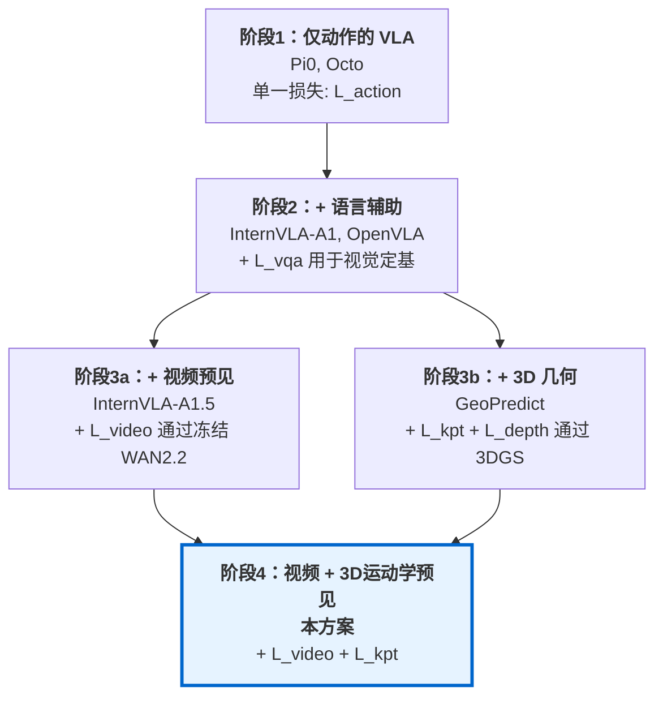
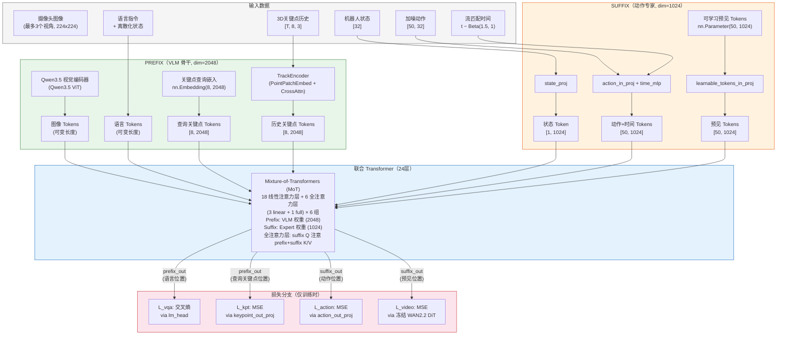
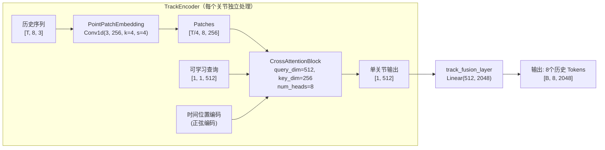
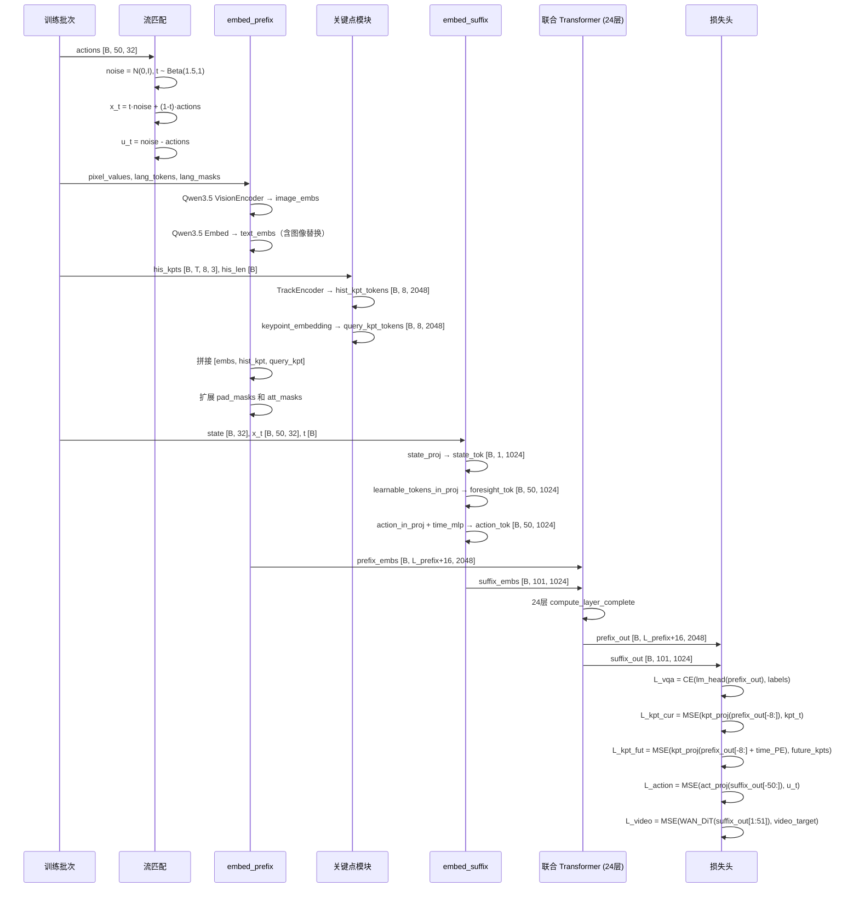
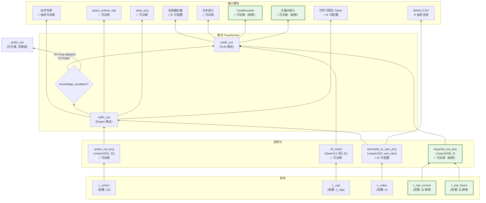
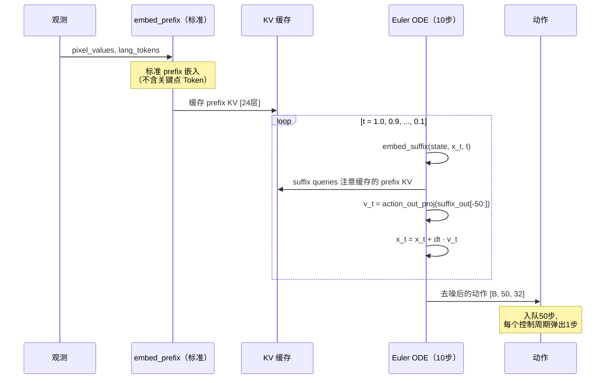
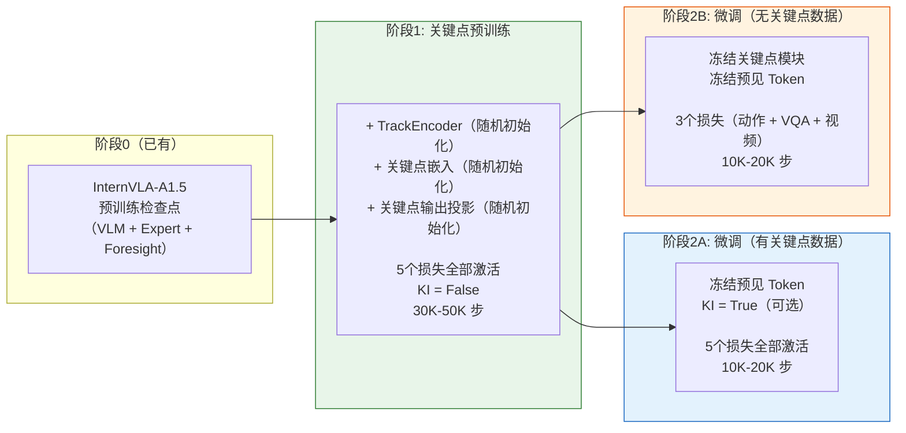

# InternVLA-A1.5 + GeoPredict 3D关键点轨迹预测器：融合设计与落地实施方案

> **目标**：将 GeoPredict 的 3D Keypoint Trajectory-Level Kinematic Predictor（3D关键点轨迹级运动学预测器）融合到 InternVLA-A1.5 中，通过训练时辅助监督信号为模型注入显式的3D运动学感知能力，从而提升机器人操作的成功率。

---

## 目录

1. [动机与背景](#1-动机与背景)
2. [互补性分析：为什么选择这两者](#2-互补性分析为什么选择这两者)
3. [架构概览](#3-架构概览)
4. [模块设计](#4-模块设计)
5. [Token 序列与注意力掩码](#5-token-序列与注意力掩码)
6. [训练前向传播](#6-训练前向传播)
7. [损失函数设计](#7-损失函数设计)
8. [反向传播与梯度流](#8-反向传播与梯度流)
9. [推理路径](#9-推理路径)
10. [训练策略](#10-训练策略)
11. [数据管道](#11-数据管道)
12. [配置变更](#12-配置变更)
13. [代码修改指南](#13-代码修改指南)
14. [成功率提升分析](#14-成功率提升分析)
15. [替代方案与权衡](#15-替代方案与权衡)
16. [参考文献](#16-参考文献)

---

## 1. 动机与背景

### 1.1 问题：VLA 策略中隐式的 3D 理解

当前的 Vision-Language-Action（VLA）策略——包括 InternVLA-A1.5——主要通过2D视觉特征来学习"视觉观察 + 语言指令 → 机器人动作"的映射。虽然 InternVLA-A1.5 通过冻结的 WAN2.2-5B 视频预测模型提供了隐式的未来场景预测（latent video foresight），但模型本身**缺乏对机器人3D运动学结构的显式感知**——即每个关节在空间中的位置以及它们应该如何运动。

这种隐式的3D理解会导致三类典型失败模式：

1. **空间混淆**：策略在面对新的物体位置时表现不佳，因为它记忆的是视觉模式（visual patterns）而非真正学会了几何推理。
2. **几何泛化失败**：不同形状的物体会破坏视觉模式匹配，即使所需的操作策略在运动学上完全一致。
3. **长时间序列漂移**：在缺乏显式轨迹级规划的情况下，动作块（action chunks）可能局部平滑但全局不一致，特别是在多步骤任务中。

### 1.2 GeoPredict 的方案：3D 关键点轨迹预测

GeoPredict（[Li et al., 2025](https://github.com/geopredict)）证明，在训练期间添加显式的3D几何监督——预测3D关键点轨迹并通过可微高斯散射渲染深度图——能够显著提升 VLA 策略的成功率：

- **RoboCasa**：平均 +10.1%（42.3% → 52.4%），其中 OpenDoubleDoor +32.0%
- **LIBERO-Long**：+6.4%（87.6% → 94.0%）
- **真实世界几何泛化**：+45%（50% → 95%）

关键在于这些提升**不增加任何推理开销**——所有3D预测模块在推理时全部丢弃。性能提升完全来源于训练过程中学到的更好的表征。

### 1.3 InternVLA-A1.5 的优势

InternVLA-A1.5（[Zhu et al., 2025](https://arxiv.org/abs/2607.04988)）相比 GeoPredict 的 Pi0 骨干网络具有多项架构优势：

- **混合线性/全注意力**：通过 Qwen3.5 的 Gated DeltaNet 层实现 O(1) 递归状态，高效处理长上下文
- **潜在视频预见**：通过冻结的 WAN2.2-5B 实现场景级未来预测
- **VQA 联合训练**：保持语言理解和组合泛化能力
- **FAST 动作 Token**：在连续流匹配之外提供离散动作词汇表
- **更大规模预训练**：1.2M 操作轨迹 + 3M VQA 样本

本方案的目标是将 GeoPredict 的显式3D运动学感知与 InternVLA-A1.5 更丰富的骨干网络相结合，实现互补性改进。

---

## 2. 互补性分析：为什么选择这两者

### 2.1 横向对比：两个系统各自预测了关于未来的什么信息

| 维度 | InternVLA-A1.5（潜在视频预见） | GeoPredict（3D关键点轨迹） |
|---|---|---|
| **预测内容** | WAN 潜在空间中的未来视频帧 | 8个机器人关节的未来3D位置 |
| **预测空间** | 压缩图像潜变量 $\mathbb{R}^{C \times T' \times H' \times W'}$ | 显式3D坐标 $\mathbb{R}^{T \times 8 \times 3}$ |
| **时间跨度** | ~4帧未来帧（单个动作块内） | 50个未来时间步（= 完整动作块） |
| **监督来源** | 冻结的 WAN2.2-5B DiT（互联网视频预训练） | 真值关节位置（来自FK或仿真） |
| **信息类型** | 场景级（世界未来的样子） | 机器人级（机器人的运动轨迹） |
| **擅长** | 接触预测、视觉伺服、基于外观的规划 | 避障、到达、运动学一致性 |
| **不擅长** | 运动学扰动（LIBERO-Plus Robot: 55.1%） | 场景级视觉变化（无像素级监督） |

两种预测模态是**正交互补**的：视频预见捕捉*场景动态*，关键点轨迹捕捉*机器人运动学*。二者的弱点互不重叠。

### 2.2 纵向分析：VLA 辅助监督的演进历程



本方案代表两条并行演进路径的自然交汇：潜在场景级预见与显式3D运动学预测。将二者结合后，模型在多个抽象层次上接受监督：

- **Token 层**：VQA + FAST tokens（语言定基）
- **场景层**：视频速度场（潜在未来预测）
- **运动学层**：3D关键点轨迹（机器人运动规划）
- **动作层**：流匹配速度场（连续控制）

### 2.3 消融证据支撑互补性

来自 InternVLA-A1.5 的消融实验（论文 Table 8）：
- 移除视频损失：LIBERO-Plus 下降 -6.8%，DOMINO 下降 -2.4%
- 预见的价值主要体现在**分布外泛化**

来自 GeoPredict 的消融实验（论文 Table 2）：
- 仅深度监督在 Pi0 基线上 +7.1%
- 添加关键点轨迹预测额外 +3.0%
- 轨迹引导精修（track-guided refinement）再 +1.3%

由于 InternVLA-A1.5 已具有视频预见（场景级），而 GeoPredict 的增益主要来自3D几何（机器人级），两者的贡献预计是**叠加性**而非冗余的。

---

## 3. 架构概览

### 3.1 融合架构图




> **勘误说明**：英文版中架构图标注为 "28 Layers: 18 Linear Attn + 6 Full Attn"，总数应为 **24 层**。经验证 Qwen3.5-2B 的 HuggingFace 配置中 `num_hidden_layers=24`，`full_attention_interval=4`，层类型生成逻辑（`configuration_qwen3_5.py:181-186`）为 `(3 linear + 1 full) × 6`，即 **18 层线性注意力 + 6 层全注意力 = 24 层**。

### 3.2 核心设计决策：关键点 Token 放置在 Prefix 中

16个新关键点 Token（8个历史 + 8个查询）被放置在 **PREFIX**（VLM 骨干，dim=2048）中，附加在现有的图像和语言 Token 之后。这个决策基于三个关键理由：

**理由一：维度天然兼容。** GeoPredict 中 TrackEncoder 的输出维度为 2048，与 Qwen3.5-2B 的 `hidden_size` 完全一致。若放置在 suffix（dim=1024）则需要有损的维度压缩。

**理由二：自动获得交叉注意力。** 在 InternVLA-A1.5 的 `compute_layer_complete` 函数（[`modeling_internvla_a1_5.py:119-335`](src/lerobot/policies/internvla_a1_5/modeling_internvla_a1_5.py#L119-L335)）中，suffix（动作专家）的 Q 在全注意力层中会注意到所有 prefix 的 K/V：

```python
# 第 276-278 行：suffix queries 注意 [prefix_kv, suffix_kv]
k_for_suffix = torch.cat([prefix_key_for_suffix, suffix_key], dim=2)
v_for_suffix = torch.cat([prefix_value_for_suffix, suffix_value], dim=2)
```

将关键点 Token 放在 prefix 中，动作专家通过现有的交叉注意力机制**自动**获得3D运动学感知——无需修改 `compute_layer_complete`。

**理由三：丰富 VLM 的特征表征。** Prefix 中的 Token 互相遵循因果注意力。关键点查询 Token 能注意到图像、语言和历史关键点 Token，这迫使 VLM 构建对3D关键点预测有信息量的特征，从而丰富了所有下游消费者可用的表征。

### 3.3 维度参考表

| 组件 | InternVLA-A1.5 | GeoPredict | 融合后 |
|---|---|---|---|
| VLM / Prefix hidden_size | 2048（Qwen3.5-2B） | 2048（Gemma 2B） | 2048 |
| Action Expert / Suffix hidden_size | 1024 | 1024 | 1024 |
| head_dim | 256 | 256 | 256 |
| num_attention_heads | 8 | 8 | 8 |
| num_kv_heads | 2（GQA） | 1（GQA） | 2（保持 Qwen3.5） |
| num_layers | **24**（18 Gated DeltaNet + 6 full attention，模式：(3+1)×6） | 18（全部全注意力） | **24**（保持 Qwen3.5） |
| TrackEncoder output_dim | N/A | 2048 | 2048（直接移植） |
| keypoint_out_proj | N/A | Linear(2048, 3) | Linear(2048, 3) |
| 关键点关节数 | N/A | 8 | 8（可配置） |

Qwen3.5-2B 与 Gemma 2B 的维度匹配意味着 GeoPredict 的关键点模块可以**零维度适配**地直接移植。

---

## 4. 模块设计

### 4.1 TrackEncoder：3D 关键点历史编码

TrackEncoder 将变长的3D关节位置历史压缩为8个紧凑的 Token（每个关节一个）。直接从 GeoPredict 移植（[`GeoPredict/models/keypoints.py:150-213`](../../../GeoPredict/models/keypoints.py#L150-L213)）。



**架构细节：**

- **PointPatchEmbedding**（[`keypoints.py:8-49`](../../../GeoPredict/models/keypoints.py#L8-L49)）：一维卷积 `Conv1d(in_dim=3, embed_dim=256, kernel_size=4, stride=4)`，沿时间轴对每个关节独立处理。这将时间分辨率降低4倍，将原始3D位置转换为 patch 嵌入。输入形状：$[B, T, 8, 3]$，输出形状：$[B, T/4, 8, 256]$，其中 $T$ 为历史长度，$8$ 为关节数，$3$ 为 xyz 坐标。

- **CrossAttentionBlock**（[`keypoints.py:111-147`](../../../GeoPredict/models/keypoints.py#L111-L147)）：对8个关节分别处理。每个关节有一个可学习的查询 Token（$\mathbf{q} \in \mathbb{R}^{1 \times 512}$，`nn.Parameter`），通过交叉注意力聚合该关节所有时间 patch 的信息。正弦时间嵌入（`TimeEmbedding`）被加到 keys 上以编码时间位置。交叉注意力使用 8 个头，head_dim = 64。

- **融合投影**：`track_fusion_layer = Linear(512, 2048)` 将每个关节的压缩表征映射到 VLM 的隐藏维度。最终输出：$[B, 8, 2048]$，其中 $B$ 为 batch size，$8$ 为关节数，$2048$ 为 VLM hidden_size。

**适配 Qwen3.5 的修改**：无需任何修改。TrackEncoder 在 Token 进入 Transformer 之前运行，因此与骨干网络的注意力机制（混合线性/全注意力 vs. 标准注意力）无关。

### 4.2 关键点查询 Token

8个可学习嵌入 Token，每个机器人关节一个：

$$\mathbf{E}_{kpt} = \text{nn.Embedding}(J, d_{vlm}) \quad \text{其中 } J=8 \text{ 为关节数}, \; d_{vlm}=2048 \text{ 为 VLM 隐藏维度}$$

这些查询 Token 参与 Transformer 前向传播，通过因果注意力掩码注意所有更早的 prefix Token（图像、语言、历史关键点）。Transformer 处理后，它们的输出表征被用于预测当前和未来的3D关节位置。

这与 GeoPredict 的设计完全一致（[`geopredict.py:174-178`](../../../GeoPredict/models/geopredict.py#L174-L178)）：
```python
joint_token = self.keypoint_embedding.weight.unsqueeze(0).repeat(current_batch_size, 1, 1)
```

### 4.3 关键点输出投影

一个共享的线性头将查询 Token 的表征映射到3D坐标：

$$\text{keypoint\_out\_proj} = \text{Linear}(d_{vlm}, 3) \quad \text{其中 } d_{vlm}=2048$$

该头在当前和未来预测之间共享（见 4.4 节），遵循 GeoPredict 的参数高效设计。

### 4.4 基于时间条件复用的未来轨迹预测

完整动作块时间跨度（50步）的未来关键点轨迹通过**复用**同一组查询 Token 输出和投影头来预测，仅通过正弦位置编码区分不同时间步：

$$\hat{\mathbf{p}}_{j,t} = \text{keypoint\_out\_proj}\!\left(\mathbf{h}_j^{kpt} + \mathbf{e}_t^{future}\right)$$

各符号含义：
- $\hat{\mathbf{p}}_{j,t} \in \mathbb{R}^3$：关节 $j$ 在未来时间步 $t$ 的预测3D位置
- $\mathbf{h}_j^{kpt} \in \mathbb{R}^{2048}$：关键点查询 Token 经 Transformer 后的输出表征
- $\mathbf{e}_t^{future} \in \mathbb{R}^{2048}$：时间步 $t$ 的预计算正弦位置编码

未来位置编码使用基频率为100的正弦编码（与 GeoPredict 的 [`geopredict.py:298-312`](../../../GeoPredict/models/geopredict.py#L298-L312) 一致）：

$$\mathbf{e}_t^{future}[2i] = \sin\!\left(\frac{t}{100^{2i/d}}\right), \quad \mathbf{e}_t^{future}[2i+1] = \cos\!\left(\frac{t}{100^{2i/d}}\right)$$

其中 $d = 2048$ 为嵌入维度，$i \in [0, d/2)$ 为频率索引。这些编码注册为不可训练的 buffer：`register_buffer("future_kpt_pos_embed", ...)`，形状为 $[C, d_{vlm}]$，$C=50$ 为动作块大小。

**参数效率**：整个轨迹预测模块仅在 TrackEncoder 和嵌入之外额外增加一个 `Linear(2048, 3)` 层（6,147个参数）。时间维度的区分来自位置编码（零参数），共享投影头在所有 50 × 8 = 400 个独立的位置预测中被分摊使用。

---

## 5. Token 序列与注意力掩码

### 5.1 融合后的 Token 序列布局


```
PREFIX（VLM 骨干, dim=2048）:
┌──────────────────────────────────────────────────────────────────────────────────┐
│  图像 Tokens (可变长)  │  语言 Tokens (可变长)  │  历史关键点 (8)  │  查询关键点 (8)  │
│  att_mask: [1,1,1,...]  │  att_mask: [1,1,1,...]  │  att: [1,0..0]    │  att: [1,0..0]    │
│  (因果 - 每个位置各       │  (因果 - 每个位置各      │  (组内双向)        │  (组内双向)        │
│   自为一个 block)        │   自为一个 block)       │                   │                   │
└──────────────────────────────────────────────────────────────────────────────────┘

SUFFIX（动作专家, dim=1024）:
┌──────────────────────────────────────────────────────────────────────────────────┐
│  状态 (1)  │  可学习预见 (50)            │  动作+时间 (50)             │
│  att: [1]   │  att: [1, 0, ..., 0]        │  att: [1, 0, ..., 0]        │
│             │  (组内双向)                  │  (组内双向)                  │
└──────────────────────────────────────────────────────────────────────────────────┘
```

### 5.2 注意力掩码构建机制

InternVLA-A1.5 使用**基于 cumsum 的块因果（block-causal）**机制（[`modeling_internvla_a1_5.py`](src/lerobot/policies/internvla_a1_5/modeling_internvla_a1_5.py) 中的 `make_att_2d_masks` 函数，第 100-110 行）：

- `att_mask = 1`：开始一个**新的块**（后续块不能回溯注意到此块之前的位置）
- `att_mask = 0`：延续当前块（块内所有位置双向可互相注意）

2D 注意力掩码的计算公式为：

$$M_{q,k} = \begin{cases} 1 & \text{若 } \text{cumsum}(att)[k] \leq \text{cumsum}(att)[q] \text{ 且 } pad\_mask[k] = 1 \\ 0 & \text{否则} \end{cases}$$

其中 $q$ 为 query 的位置索引，$k$ 为 key 的位置索引。直觉上：`cumsum` 递增表示新 block 开始（att_mask=1），保持不变表示同一 block 内（att_mask=0）。同一 block 内的所有位置因 cumsum 值相等，满足 $\leq$ 条件，从而可以双向注意。

对于新增的关键点 Token，我们设置：
- **历史关键点组**：`att_mask = [1, 0, 0, 0, 0, 0, 0, 0]` — 第一个 Token 开始新块，其余7个延续。8个 Token 组内双向可见，并可注意到所有更早的 prefix Token。
- **查询关键点组**：`att_mask = [1, 0, 0, 0, 0, 0, 0, 0]` — 同样结构。8个 Token 组内双向可见，可注意到所有更早的 prefix Token 及历史关键点组。

### 5.3 完整注意力模式矩阵

| Token 类型（Query） | ← 图像 | ← 语言 | ← 历史关键点 | ← 查询关键点 | ← Suffix |
|---|:---:|:---:|:---:|:---:|:---:|
| **图像** | 因果 | × | × | × | × |
| **语言** | ✓ | 因果 | × | × | × |
| **历史关键点** | ✓ | ✓ | 双向 | × | × |
| **查询关键点** | ✓ | ✓ | ✓ | 双向 | × |
| **Suffix** | ✓ | ✓ | ✓ | ✓ | 块因果 |

这与 GeoPredict 的分组结构一致：历史关键点 = Group 1，查询关键点 = Group 2，动作 = Group 4。

### 5.4 FAST Token 阻断

InternVLA-A1.5 的 `block_action_attend_fast_tokens` 机制（[`modeling_internvla_a1_5.py:1145-1151`](src/lerobot/policies/internvla_a1_5/modeling_internvla_a1_5.py#L1145-L1151)）会阻止 suffix 的 queries 注意到 prefix 中 FAST 动作 Token 的位置。`fast_token_mask` 必须扩展16个零来覆盖新的关键点位置（关键点 Token 不应被阻止，suffix 应该能注意到它们）：

```python
# 在 forward() 中，扩展 fast_token_mask 以覆盖新增的 prefix 长度
fast_token_mask_ext = torch.cat([
    fast_token_mask,  # [B, L_original_prefix]
    torch.zeros(B, 2 * num_joints, device=device, dtype=torch.bool)  # [B, 16]
], dim=1)
```

---

## 6. 训练前向传播

### 6.1 完整数据流



### 6.2 逐步前向传播（伪代码）

以下描述了对 `InternVLAA15.forward`（[`modeling_internvla_a1_5.py:1099-1246`](src/lerobot/policies/internvla_a1_5/modeling_internvla_a1_5.py#L1099-L1246)）的修改：

```python
def forward(self, pixel_values, image_grid_thw, lang_tokens, lang_masks,
            state, actions, labels=None, fast_token_mask=None,
            video_frames=None, video_mask=None,
            his_kpts=None, his_len=None,        # 新增
            kpt_t=None, future_kpts=None,        # 新增
            kpt_mask=None,                        # 新增
            noise=None, time=None):
    
    # 步骤1: 流匹配噪声采样（不变）
    if noise is None:
        noise = self.sample_noise(actions.shape, actions.device)
    if time is None:
        time = self.sample_time(actions.shape[0], actions.device)
    time_expanded = time[:, None, None]
    x_t = time_expanded * noise + (1 - time_expanded) * actions
    u_t = noise - actions

    # 步骤2: 嵌入 prefix，包含关键点 Token（修改）
    prefix_embs, prefix_pad_masks, prefix_att_masks = self.embed_prefix(
        pixel_values, image_grid_thw, lang_tokens, lang_masks, labels,
        his_kpts=his_kpts, his_len=his_len  # 新增参数
    )

    # 步骤3: 嵌入 suffix（不变）
    suffix_embs, suffix_pad_masks, suffix_att_masks = self.embed_suffix(state, x_t, time)

    # 步骤4: 构建注意力掩码（因 prefix 扩展而修改）
    pad_masks = torch.cat([prefix_pad_masks, suffix_pad_masks], dim=1)
    att_masks = torch.cat([prefix_att_masks, suffix_att_masks], dim=1)
    att_2d_masks = make_att_2d_masks(pad_masks, att_masks)
    
    # 扩展 fast_token_mask 以覆盖关键点位置（新增）
    if self.config.block_action_attend_fast_tokens and self.config.enable_keypoint_predictor:
        kpt_extension = torch.zeros(B, 2 * self.config.num_keypoint_joints,
                                     device=device, dtype=torch.bool)
        fast_token_mask_ext = torch.cat([fast_token_mask, kpt_extension], dim=1)
    else:
        fast_token_mask_ext = fast_token_mask
    
    # 步骤5: 位置 ID（prefix 扩展后自动适配）
    # get_position_ids 使用 pad_masks 的形状来构建 padded_lang_tokens，
    # 因此 prefix 扩展后位置 ID 自动延长（参见 modeling_internvla_a1_5.py:704-717）
    
    # 步骤6: 联合 Transformer 前向（机制不变）
    (prefix_out, suffix_out), _ = self.qwen3_5_with_expert.forward(...)

    # 步骤7: 计算损失
    # L_vqa（不变）...
    # L_action（不变）...
    # L_video（不变）...

    # 步骤8: 关键点损失（新增）
    if self.config.enable_keypoint_predictor and kpt_t is not None:
        num_j = self.config.num_keypoint_joints
        query_kpt_out = prefix_out[:, -num_j:]  # [B, 8, 2048]
        
        # 当前关键点损失
        pred_kpt = self.keypoint_out_proj(query_kpt_out)  # [B, 8, 3]
        
        # 未来关键点轨迹损失
        C = self.config.chunk_size  # 50
        kpt_rep = query_kpt_out.unsqueeze(1).expand(-1, C, -1, -1)  # [B,50,8,2048]
        fut_pe = self.future_kpt_pos_embed[:C].unsqueeze(0).unsqueeze(2)  # [1,50,1,2048]
        kpt_future_in = kpt_rep + fut_pe  # [B,50,8,2048]
        kpt_future_flat = kpt_future_in.reshape(B * C, num_j, -1)
        future_pred = self.keypoint_out_proj(kpt_future_flat).reshape(B, C, num_j, 3)
        
        # 对有关键点数据的样本做 boolean indexing（参照 video_mask 的处理方式）
        if kpt_mask is not None and not kpt_mask.all():
            pred_kpt_masked = pred_kpt[kpt_mask]
            kpt_t_masked = kpt_t[kpt_mask]
            future_pred_masked = future_pred[kpt_mask]
            future_kpts_masked = future_kpts[kpt_mask]
            loss_kpt_current = F.mse_loss(pred_kpt_masked, kpt_t_masked)
            loss_kpt_future = F.mse_loss(future_pred_masked, future_kpts_masked)
        else:
            loss_kpt_current = F.mse_loss(pred_kpt, kpt_t)
            loss_kpt_future = F.mse_loss(future_pred, future_kpts)
    else:
        loss_kpt_current = torch.tensor(0.0, device=actions.device)
        loss_kpt_future = torch.tensor(0.0, device=actions.device)

    return (loss_action, loss_vqa, video_loss,
            loss_kpt_current, loss_kpt_future,  # 新增
            loss_per_token, token_mask)
```

> **勘误说明**：英文版中关键点损失的 per-sample masking 使用了 `mask_f = kpt_mask.float().mean()` 然后乘以 loss 的方式，这种实现不正确——它会导致 loss 被不合理地缩放。正确做法应参照现有 `video_mask` 的处理方式（[`modeling_internvla_a1_5.py:1239-1242`](src/lerobot/policies/internvla_a1_5/modeling_internvla_a1_5.py#L1239-L1242)），使用 boolean indexing 先选出有关键点数据的样本，再计算 MSE loss。

---

## 7. 损失函数设计

### 7.1 完整损失函数

训练总损失由五个分量组合而成：

$$\mathcal{L}_{total} = \underbrace{10 \cdot \mathcal{L}_{action}}_{\text{流匹配}} + \underbrace{\lambda_{vqa} \cdot \mathcal{L}_{vqa}}_{\text{语言定基}} + \underbrace{\alpha \cdot \mathcal{L}_{video}}_{\text{场景预见}} + \underbrace{\beta \cdot (\mathcal{L}_{kpt}^{cur} + \mathcal{L}_{kpt}^{fut})}_{\text{运动学预见（新增）}}$$

各符号含义：
- $\mathcal{L}_{action}$：流匹配速度场 MSE，权重 10（InternVLA-A1.5 中硬编码，见 [`modeling_internvla_a1_5.py:1650`](src/lerobot/policies/internvla_a1_5/modeling_internvla_a1_5.py#L1650)）
- $\mathcal{L}_{vqa}$：子任务 + FAST Token 的交叉熵，$\lambda_{vqa} = 1.0$
- $\mathcal{L}_{video}$：通过冻结 WAN2.2 DiT 的视频流匹配 MSE，$\alpha = 1.0$
- $\mathcal{L}_{kpt}^{cur}$：当前关键点位置 MSE，$\beta = 1.0$（新增）
- $\mathcal{L}_{kpt}^{fut}$：未来关键点轨迹 MSE，$\beta = 1.0$（与当前关键点共享权重，新增）

### 7.2 各损失的具体定义

**当前关键点损失：**

$$\mathcal{L}_{kpt}^{cur} = \frac{1}{B' \cdot J \cdot 3} \sum_{b \in \mathcal{M}} \sum_{j=1}^{J} \|\hat{\mathbf{p}}_{j}^{cur} - \mathbf{p}_{j}^{gt}\|_2^2$$

其中 $\hat{\mathbf{p}}_{j}^{cur} = \text{keypoint\_out\_proj}(\mathbf{h}_j^{kpt})$，$J = 8$ 为关节数，$\mathbf{p}_{j}^{gt} \in \mathbb{R}^3$ 为关节 $j$ 的真值3D位置，$\mathcal{M}$ 为有关键点标注的样本集合，$B' = |\mathcal{M}|$。

**未来关键点轨迹损失：**

$$\mathcal{L}_{kpt}^{fut} = \frac{1}{B' \cdot C \cdot J \cdot 3} \sum_{b \in \mathcal{M}} \sum_{t=1}^{C} \sum_{j=1}^{J} \|\hat{\mathbf{p}}_{j,t}^{fut} - \mathbf{p}_{j,t}^{gt}\|_2^2$$

其中 $\hat{\mathbf{p}}_{j,t}^{fut} = \text{keypoint\_out\_proj}(\mathbf{h}_j^{kpt} + \mathbf{e}_t^{future})$，$C = 50$ 为动作块大小。$\mathbf{e}_t^{future}$ 是冻结的正弦 buffer，不是可训练参数。

### 7.3 损失权重选择依据

关键点损失权重 $\beta = 1.0$ 的选择基于以下考量：
1. **GeoPredict 使用 $\beta = 1.0$** 搭配动作损失权重 1.0，该平衡经实验验证有效。
2. **InternVLA-A1.5 使用 10× 动作损失** — 因此动作:关键点的实际比例为 10:1，天然避免了辅助任务对主任务的过度干扰。
3. 关键点损失是对3D坐标（单位：米）的 MSE，典型量级为 $O(1)$，与流匹配速度 MSE 可比。

### 7.4 Per-Sample 掩码机制

并非所有训练样本都有3D关键点标注（如纯 VQA 样本，或缺少 FK 数据的机器人数据集）。布尔掩码 `kpt_mask`（形状 $[B]$）控制哪些样本参与关键点损失的计算：

$$\mathcal{L}_{kpt} = \frac{1}{|\mathcal{M}|} \sum_{b \in \mathcal{M}} (\mathcal{L}_{kpt,b}^{cur} + \mathcal{L}_{kpt,b}^{fut})$$

其中 $\mathcal{M} = \{b : m_b = 1\}$ 是有关键点数据的样本集合。实现上使用 boolean indexing 先选出有效样本，再对选出的子集计算均值 MSE。这与现有 `video_mask` 机制（[`modeling_internvla_a1_5.py:1239-1242`](src/lerobot/policies/internvla_a1_5/modeling_internvla_a1_5.py#L1239-L1242)）的处理方式一致。

---

## 8. 反向传播与梯度流

### 8.1 梯度流图




### 8.2 知识绝缘（Knowledge Insulation）的交互

InternVLA-A1.5 的知识绝缘（KI）机制（`knowledge_insulation` 配置项，[`modeling_internvla_a1_5.py:269`](src/lerobot/policies/internvla_a1_5/modeling_internvla_a1_5.py#L269)）在全注意力层中对 prefix 的 K/V 执行 `.detach()`，阻止动作损失的梯度回传到 VLM prefix。

这与关键点 Token 的交互方式如下：

| KI 设置 | 动作损失 → 关键点 Token | 关键点损失 → VLM 骨干 | 推荐场景 |
|---|---|---|---|
| **KI = False**（默认） | ✓ 梯度流通 | ✓ 梯度流通 | 预训练：双向监督互相增强 |
| **KI = True** | × 已分离 | ✓ 梯度流通 | 微调：清晰分离，关键点 Token 仅从自身损失学习 |

当 `KI = False` 时：
- 动作损失的梯度路径：suffix output → 交叉注意力 → prefix K/V → 关键点 Token 表征
- 关键点损失直接通过 prefix_out 监督关键点 Token
- **结果**：关键点表征同时为3D预测和动作质量进行优化——双向受益

当 `KI = True` 时：
- 动作损失的梯度在 prefix 边界处被 `.detach()` 阻断
- 关键点损失是关键点 Token 的唯一监督信号
- **结果**：更清晰的分离，微调时避免 VLM 不稳定

### 8.3 冻结策略

| 模块 | 预训练（阶段1） | 含关键点数据的微调（阶段2A） | 无关键点数据的微调（阶段2B） |
|---|---|---|---|
| Qwen3.5 VLM 骨干 | 可训练 | 可训练（降低学习率） | 可训练 |
| 视觉编码器 | **冻结** | **冻结** | **冻结** |
| 动作专家 + 投影 | 可训练 | 可训练 | 可训练 |
| 可学习预见 Token | 可训练 | **冻结** | **冻结** |
| learnable_to_wan_proj | 可训练 | **冻结** | **冻结** |
| WAN DiT + VAE | **冻结** | **冻结** | **冻结** |
| TrackEncoder | 可训练（较高学习率） | 可训练 | **冻结**（无数据） |
| keypoint_embedding | 可训练 | 可训练 | **冻结** |
| keypoint_out_proj | 可训练 | 可训练 | **冻结** |
| future_kpt_pos_embed | **冻结**（buffer） | **冻结** | **冻结** |

实现位于 `set_requires_grad`（[`modeling_internvla_a1_5.py:606`](src/lerobot/policies/internvla_a1_5/modeling_internvla_a1_5.py#L606) 附近）：

```python
if self.config.freeze_keypoint_modules:
    for p in self.track_encoder.parameters():
        p.requires_grad = False
    self.keypoint_embedding.weight.requires_grad = False
    for p in self.keypoint_out_proj.parameters():
        p.requires_grad = False
```

### 8.4 梯度在混合注意力层中的传播

Qwen3.5 的架构交替使用 **Gated DeltaNet**（线性注意力）和**全注意力**层。梯度行为在两种层中不同：

- **线性注意力层**（24层中的18层）：Prefix 和 suffix **完全独立**运行。关键点 Token 的梯度仅通过 VLM 侧的线性注意力传播。无跨通路梯度。这是因为线性注意力的递归状态（recurrent state）无法在两条通路间共享。

- **全注意力层**（24层中的6层）：Suffix 的 queries 注意到 prefix 的 K/V（包括关键点 Token）。此时：
  - 前向：动作专家读取关键点表征
  - 反向（KI=False）：动作损失 → suffix output → 注意力梯度 → prefix K/V → 关键点 Token 表征
  - 反向（KI=True）：prefix K/V 已 detach，动作损失在 suffix 处停止

关键点损失始终有一条**直接的梯度路径**贯穿所有24层（通过 `prefix_out`），独立于 suffix 通路。这确保了无论 KI 设置如何，关键点模块都能得到稳健的监督。

---

## 9. 推理路径

### 9.1 模式 A：零开销默认推理（推荐）

当 `include_keypoints_at_inference = False`（默认）时：



**为什么不含关键点 Token 也能工作**：关键点辅助任务充当**训练时正则化器**，提升了学到的 VLM 特征质量。训练结束后，图像和语言 Token 携带了更丰富的3D感知表征，即使不存在关键点 Token。这已被 GeoPredict 实验验证（所有3D模块在推理时丢弃），类似于 dropout 在测试时虽不激活但能改善特征质量。

**开销**：严格为零 — 与未修改的 InternVLA-A1.5 推理路径完全一致。

### 9.2 模式 B：含关键点历史的增强推理

当 `include_keypoints_at_inference = True` 且关键点历史可从机器人关节编码器获取时：

```python
def sample_actions(self, pixel_values, image_grid_thw, lang_tokens, lang_masks,
                   state, fast_token_mask=None,
                   his_kpts=None, his_len=None):  # 新增可选参数
    
    # 用关键点 Token 嵌入 prefix（如启用且数据可用）
    prefix_embs, prefix_pad_masks, prefix_att_masks = self.embed_prefix(
        pixel_values, image_grid_thw, lang_tokens, lang_masks,
        his_kpts=his_kpts, his_len=his_len
    )
    # ... sample_actions 其余部分不变 ...
    # KV 缓存现在包含关键点 Token 的 K/V
    # 去噪步骤自动受益于丰富的 prefix
```

**开销**：每个样本增加 +16 个 prefix Token。对于典型的 ~400 Token 的 prefix，这约增加 4% 的序列长度。TrackEncoder 的前向传播（每个关节一个 Conv1d + 一个交叉注意力）相比 VLM 前向传播可忽略不计。

**适用场景**：关节编码器读数可用的真实机器人部署场景。3D 位置可通过正向运动学（FK）从关节角度 + URDF 快速计算，附加延迟小于 1ms。

---

## 10. 训练策略

### 10.1 分阶段训练概览



### 10.2 阶段1：关键点预训练

**起点**：InternVLA-A1.5 预训练检查点（原始训练的阶段2之后）。

**初始化**：
- 所有现有模块：从检查点加载
- TrackEncoder、keypoint_embedding、keypoint_out_proj：**随机初始化**（线性层用 Xavier uniform，嵌入用截断正态分布）

**训练配置**：
```
learning_rate (骨干): 2.5e-5
learning_rate (关键点模块): 5e-5  # 随机初始化模块用 2× 更高的学习率
weight_decay: 0.01
warmup_steps: 1000
decay_steps: 30000
decay_lr: 2.5e-6
grad_clip: 1.0
knowledge_insulation: False  # 允许双向监督
freeze_vision_encoder: True
freeze_learnable_tokens: False
freeze_keypoint_modules: False
```

**数据需求**：含3D关键点标注的机器人数据集。来源：
1. **仿真环境**：直接从 MuJoCo/Isaac Gym 获取，如 `sim.get_body_xpos()`
2. **预计算 FK**：从关节编码器 + URDF 离线计算
3. **混合数据**：机器人样本有关键点数据，VQA 样本用零填充 + mask=False

**分组学习率**实现：
```python
param_groups = [
    {"params": backbone_params, "lr": 2.5e-5, "weight_decay": 0.01},
    {"params": keypoint_params, "lr": 5e-5, "weight_decay": 0.01},
]
```

### 10.3 阶段2A：含关键点数据的微调

当目标域有3D关键点标注时：

```
learning_rate: 5e-6  （微调用更低学习率）
warmup_steps: 500
freeze_learnable_tokens: True  （InternVLA-A1.5 微调的标准做法）
freeze_keypoint_modules: False  （继续适配新机体）
knowledge_insulation: True  （可选，防止 VLM 不稳定）
kpt_loss_weight: 1.0
训练步数: 10K-20K
```

### 10.4 阶段2B：无关键点数据的微调

当目标域缺乏3D关键点标注时：

```
freeze_keypoint_modules: True  （无监督信号）
freeze_learnable_tokens: True
kpt_loss_weight: 0.0  （或等效地，kpt_mask = 全 False）
include_keypoints_at_inference: False
训练步数: 10K-20K
```

即使微调和推理时不使用关键点 Token，模型也能受益于阶段1中通过关键点监督学到的更好表征。

---

## 11. 数据管道

### 11.1 新增变换：Extract3DKeypointTransformFn

在 InternVLA-A1.5 变换管道中新增一个数据变换（位于 [`transform_internvla_a1_5.py`](src/lerobot/policies/internvla_a1_5/transform_internvla_a1_5.py)）：

```python
@DataTransformFn.register_subclass("extract_3d_keypoints")
@dataclass
class Extract3DKeypointTransformFn(DataTransformFn):
    num_joints: int = 8
    max_history: int = 1000
    chunk_size: int = 50
    keypoint_source: str = "none"  # "precomputed", "state_fk", "none"

    def __call__(self, data: DataDict) -> DataDict:
        if self.keypoint_source == "precomputed":
            # 从预计算的 .npy 文件加载（GeoPredict 格式）
            # his_kpts: [max_history, num_joints, 3]
            # kpt_t: [num_joints, 3]
            # future_kpts: [chunk_size, num_joints, 3]
            ...
        elif self.keypoint_source == "state_fk":
            # 从状态通过正向运动学计算3D位置
            ...
        else:
            # 无关键点：生成零填充 + False 掩码
            data["his_kpts"] = torch.zeros(self.max_history, self.num_joints, 3)
            data["his_len"] = torch.tensor(0)
            data["kpt_t"] = torch.zeros(self.num_joints, 3)
            data["future_kpts"] = torch.zeros(self.chunk_size, self.num_joints, 3)
            data["kpt_mask"] = torch.tensor(False)
            return data
        
        data["kpt_mask"] = torch.tensor(True)
        return data
```

### 11.2 变换管道集成

在数据集配置的 `data_transforms.inputs` 列表中，将 `Extract3DKeypointTransformFn` 插入到 `NormalizeTransformFn` 之后、`ComposeFieldsTransform` 之前：

```python
data_transforms: TransformGroup = field(
    default_factory=lambda: TransformGroup(
        inputs=[
            DeltaActionTransformFn(),
            ResizeImagesWithPadFn(...),
            RemapImageKeyTransformFn(),
            ExtractVideoFramesTransformFn(),
            NormalizeTransformFn(),
            Extract3DKeypointTransformFn(),   # <-- 新增：在 normalize 之后, compose 之前
            ComposeFieldsTransform(),
            FASTInternVLAA15ActionTokenizerTransformFn(),
            ...
        ]
    )
)
```

### 11.3 UnifyInputs 扩展

修改 `UnifyInternVLAA15InputsTransformFn.__call__` 以包含关键点字段：

```python
return {
    ...现有字段...,
    "his_kpts": data.get("his_kpts", torch.zeros(1000, 8, 3)),
    "his_len": data.get("his_len", torch.tensor(0)),
    "kpt_t": data.get("kpt_t", torch.zeros(8, 3)),
    "future_kpts": data.get("future_kpts", torch.zeros(50, 8, 3)),
    "kpt_mask": data.get("kpt_mask", torch.tensor(False)),
}
```

### 11.4 关键点数据格式

遵循 GeoPredict 的格式（[`robocasa_dataset.py`](../../../GeoPredict/data_processing/robocasa_dataset.py)）：

| 字段 | 形状 | 描述 |
|---|---|---|
| `his_kpts` | `[max_T, J, 3]` | 历史3D位置，零填充到 `max_T=1000` |
| `his_len` | 标量 | 实际历史长度（0 到 999） |
| `kpt_t` | `[J, 3]` | 当前时间步的3D关节位置 |
| `future_kpts` | `[C, J, 3]` | 未来 C=50 步的3D关节位置 |
| `kpt_mask` | bool | 该样本是否有有效的关键点数据 |

其中 $J = 8$（7个手臂连杆 + 夹爪末端），3D坐标在机器人基座坐标系下，典型范围为 $[0, 1.6]^2 \times [0, 1.0]$ 米。

### 11.5 3D 关键点数据来源

| 来源 | 获取方式 | 精度 | 可用性 |
|---|---|---|---|
| **MuJoCo 仿真** | `sim.data.get_body_xpos(link_name)` | 精确 | 所有 MuJoCo 环境 |
| **Isaac Gym** | `gym.get_rigid_body_states()` | 精确 | 所有 Isaac Gym 环境 |
| **URDF + 关节编码器** | 通过 `kinpy` / `pybullet` 做正向运动学 | 高（取决于标定） | 所有已知 URDF 的机器人 |
| **深度 + 关键点检测** | 从深度图3D提升 | 中等 | 需要深度摄像头 |
| **动作捕捉** | 外部跟踪系统 | 高 | 需要 MoCap 系统 |

初始实现推荐使用**仿真数据 + 直接 FK**，因为它提供精确的真值标注且工程量最小。

---

## 12. 配置变更

### 12.1 InternVLAA15Config 新增字段

在 [`configuration_internvla_a1_5.py:250-345`](src/lerobot/policies/internvla_a1_5/configuration_internvla_a1_5.py#L250-L345) 中添加：

```python
# ---- 3D 关键点轨迹预测器 ----
enable_keypoint_predictor: bool = False    # 总开关
num_keypoint_joints: int = 8               # 要跟踪的机器人关节数
kpt_loss_weight: float = 1.0              # 关键点损失权重 (β)
freeze_keypoint_modules: bool = False      # 冻结 TrackEncoder + 嵌入 + 投影
include_keypoints_at_inference: bool = False  # 推理时在 prefix 中包含关键点 Token

# TrackEncoder 超参数
keypoint_track_input_dim: int = 3          # 每个关节的 xyz 维度
keypoint_track_patch_size: int = 4         # 时间 patch 大小
keypoint_track_embed_dim: int = 256        # Patch 嵌入维度
keypoint_track_query_dim: int = 512        # 交叉注意力查询维度
keypoint_track_num_heads: int = 8          # 注意力头数
keypoint_track_ff_dim: int = 1024          # FFN 隐层维度
keypoint_history_max_len: int = 1000       # 最大历史长度（零填充）
```

### 12.2 数据集配置新增字段

在 `InternVLAA15DatasetConfig` 中添加：

```python
enable_keypoint_data: bool = False
keypoint_source: str = "none"       # "precomputed", "state_fk", "none"
num_keypoint_joints: int = 8
keypoint_history_max_len: int = 1000
```

### 12.3 校验逻辑

在 `InternVLAA15Config.__post_init__` 中：

```python
if self.enable_keypoint_predictor:
    if self.num_keypoint_joints <= 0:
        raise ValueError("num_keypoint_joints must be > 0")
    if self.kpt_loss_weight < 0:
        raise ValueError("kpt_loss_weight must be >= 0")
    if self.include_keypoints_at_inference and self.inference_backend == "optimized":
        raise ValueError("Optimized backend does not support keypoint inference tokens")
```

---

## 13. 代码修改指南

### 13.1 新增文件

**`src/lerobot/policies/internvla_a1_5/keypoints.py`**

从 GeoPredict 移植（[`GeoPredict/models/keypoints.py`](../../../GeoPredict/models/keypoints.py)）：
- `PointPatchEmbedding`（第 8-49 行）
- `TimeEmbedding`（第 52-71 行）
- `MultiHeadAttention`（第 74-108 行）
- `CrossAttentionBlock`（第 111-147 行）
- `TrackEncoder`（第 150-213 行）

另从 [`GeoPredict/models/geopredict.py:57-71`](../../../GeoPredict/models/geopredict.py#L57-L71) 移植 `get_1d_sincos_pos_embed` 函数。

用原生 PyTorch 操作替换 `einops.rearrange` 以减少依赖。

### 13.2 需修改的文件

| 文件 | 修改内容 |
|---|---|
| [`modeling_internvla_a1_5.py`](src/lerobot/policies/internvla_a1_5/modeling_internvla_a1_5.py) | `__init__`：添加关键点模块（TrackEncoder、嵌入、投影、buffer）。`embed_prefix`：接受 `his_kpts`/`his_len`，编码并追加关键点 Token。`forward`：计算关键点损失，扩展返回值。`sample_actions`：可选地包含关键点 Token。`set_requires_grad`：添加冻结逻辑。 |
| [`configuration_internvla_a1_5.py`](src/lerobot/policies/internvla_a1_5/configuration_internvla_a1_5.py) | 添加关键点配置字段（第12.1、12.2节）。添加校验。添加 `Extract3DKeypointTransformFn` 到变换管道。扩展 `UnifyInternVLAA15InputsTransformFn`。 |
| [`transform_internvla_a1_5.py`](src/lerobot/policies/internvla_a1_5/transform_internvla_a1_5.py) | 添加 `Extract3DKeypointTransformFn` 类。 |
| [`lerobot_train.py`](src/lerobot/scripts/lerobot_train.py) | 添加 `loss_kpt_current` 和 `loss_kpt_future` 到指标跟踪。 |
| [`modeling_internvla_a1_5_optimized.py`](src/lerobot/policies/internvla_a1_5/modeling_internvla_a1_5_optimized.py) | 添加校验：当 `include_keypoints_at_inference=True` 时拒绝 optimized 后端。 |

### 13.3 检查点兼容性

在检查点排除列表中添加关键点模块前缀（如需要，类似于 WAN 排除逻辑 [`modeling_internvla_a1_5.py:1426-1437`](src/lerobot/policies/internvla_a1_5/modeling_internvla_a1_5.py#L1426-L1437)）：

```python
# 在 InternVLAA15Policy 中：
_checkpoint_excluded_prefixes = (
    "model.wan_video_model.",
    # 可选：若需要从单独来源加载关键点模块：
    # "model.track_encoder.",
    # "model.keypoint_embedding.",
    # "model.keypoint_out_proj.",
)
```

推荐做法：**将关键点模块包含在检查点中**（它们很小：总计约 ~3.2M 参数）。

### 13.4 参数量影响

| 模块 | 参数量 | 占 InternVLA-A1.5 总量（~2.5B）的比例 |
|---|---|---|
| TrackEncoder | ~3.2M | 0.13% |
| keypoint_embedding (8 × 2048) | 16K | <0.01% |
| keypoint_out_proj (2048 × 3 + 3) | 6.1K | <0.01% |
| future_kpt_pos_embed (50 × 2048) | 102K（buffer，不可训练） | N/A |
| **新增可训练参数总计** | **~3.2M** | **~0.13%** |

融合方案新增的参数开销可忽略不计，但提供了显著的表征增益。

---

## 14. 成功率提升分析

### 14.1 理论依据

**A. 显式3D几何定基防止空间混淆。**

InternVLA-A1.5 的动作专家仅通过 VLM 处理的图像特征隐式接收3D信息。流匹配动作头在动作空间中预测速度场，而不显式感知机器人关节在3D空间中的位置。关键点轨迹预测器迫使模型构建运动学链的内部3D表征。GeoPredict 的实验表明这在真实世界空间泛化中提供了 +25% 的提升。

**B. 互补的未来预测模态。**

现有的潜在视频预见捕捉**场景级**未来（世界将变成什么样子），而关键点轨迹预测捕捉**机器人级**未来（机器人应如何运动）。这两者是互补的：

| 失败模式 | 视频预见有帮助？ | 关键点轨迹有帮助？ |
|---|---|---|
| 视觉外观变化 | ✓（视觉编码） | ×（仅运动学） |
| 物体位置变化 | 部分 | ✓（3D感知） |
| 物体形状变化 | 部分 | ✓（几何推理） |
| 长时间序列漂移 | 有限（4帧） | ✓（50步轨迹） |
| 机器人扰动 | ×（场景级） | ✓（运动学链） |

InternVLA-A1.5 在 LIBERO-Plus 中的 Robot 扰动类别表现（55.1% vs pi0.5 的 73.6%）正好是关键点轨迹预测应该发挥最大作用的场景。

**C. 多任务学习的正则化效应。**

共享 Transformer 骨干的辅助目标通过特征正则化提升主任务性能，这已被广泛验证。关键点预测任务提供了引导特征走向3D空间感知的结构化归纳偏置。这在推理时即使关键点 Token 不存在（模式 A）也能受益于更好的动作预测。

**D. 仅训练开销，零推理成本。**

默认推理路径增加零开销。所有改进来自训练期间学到的更好表征。这意味着该方案在部署时提供了"免费午餐"。

### 14.2 预期改进估计

基于 GeoPredict 的消融数据（Table 2）和 InternVLA-A1.5 的基线性能：

| 基准 | InternVLA-A1.5 基线 | 预期加入关键点预测后 | 估计依据 |
|---|---|---|---|
| LIBERO（平均） | 98.9% | ~99.2% | 接近天花板，边际提升 |
| RoboTwin | 93.2% | ~95% | GeoPredict 显示仅关键点贡献 +3% |
| LIBERO-Plus（Robot） | 55.1% | ~65% | 运动学感知改善扰动鲁棒性 |
| LIBERO-Plus（平均） | 84.8% | ~88% | 3D定基提供 +3-4% |
| DOMINO（零样本） | 27.7% | ~30% | 几何泛化优势 |
| 长时间序列任务 | 不定 | +5-10% | 50步轨迹提供规划一致性 |

这些估计是保守的，且仅假设使用关键点轨迹预测器（不含完整 3DGS 深度模块）。

### 14.3 该方案可能不奏效的场景

- **需要精细操作的任务**：关节级关键点在空间分辨率上可能不足（如多指灵巧手的手内操作）
- **FK 不可用的环境**：关键点数据必须从视觉估计（引入噪声）
- **非常小的数据集**：额外的辅助任务可能在提供正则化收益之前就导致过拟合

---

## 15. 替代方案与权衡

### 15.1 完整 GeoPredict 集成（关键点 + 3DGS）

**方案**：同时集成预测性 3D 高斯几何模块（VoxelDecoder、GaussianRenderer、轨迹引导精修）。

| 优点 | 缺点 |
|---|---|
| 完整几何监督（深度 + 关键点） | 集成复杂度大幅增加 |
| 仅深度贡献 +7.1%（GeoPredict 消融） | 需要深度图真值数据 |
| 轨迹引导精修耦合关键点与几何 | VoxelDecoder（ConvTranspose3d）增加 ~15M 参数 |
| | 可微高斯光栅化需要 CUDA 自定义算子 |
| | InternVLA-A1.5 已通过 WAN 具有场景级监督 |

**结论**：仅关键点的集成以更低的复杂度捕获了大部分收益。3DGS 模块在深度真值数据易得且不使用 WAN 视频预见时最有价值。由于 InternVLA-A1.5 已有 WAN 视频预见，3DGS 深度模块部分冗余。**建议作为第二阶段增强：当仅关键点方案被证明不足时再考虑。**

### 15.2 关键点 Token 放在 Suffix 而非 Prefix

**方案**：将历史 + 查询关键点 Token 放在 suffix（动作专家，dim=1024）中。

| 优点 | 缺点 |
|---|---|
| 关键点与动作在同一通路中 | 需维度压缩（2048 → 1024），有信息损失 |
| 不影响 prefix 长度 | 失去 VLM 自动特征丰富化 |
| | 线性注意力层中无跨通路信息交换 |
| | 不匹配 GeoPredict 的已验证设计 |

**结论**：Suffix 方案牺牲了维度保真度和自动交叉注意力，不推荐。

### 15.3 不使用 TrackEncoder，直接嵌入关键点

**方案**：跳过 TrackEncoder，直接用 `Linear(3, 2048)` 投影当前时间步的 8×3 关键点坐标。

| 优点 | 缺点 |
|---|---|
| 实现极简 | 丢失了时间历史上下文 |
| 参数更少 | 无时间聚合能力 |
| 无需历史 buffer | GeoPredict 已证明 TrackEncoder 的必要性 |

**结论**：TrackEncoder 提供的历史压缩和时间上下文编码是关键点预测精度的重要来源。跳过它会显著降低辅助任务的监督质量。

---

## 16. 参考文献

1. **InternVLA-A1.5**: Zhu et al., "InternVLA-A1.5: Unifying Understanding, Latent Foresight, and Action for Compositional Generalization," 2025. [arXiv:2607.04988](https://arxiv.org/abs/2607.04988). 代码：[GitHub](https://github.com/InternRobotics/InternVLA-A-series)

2. **GeoPredict**: Li et al., "GeoPredict: Teaching Robot Policies 3D Geometry-Aware Prediction," 2025. 代码：[GitHub](https://github.com/geopredict)

3. **Pi0**: Black et al., "π₀: A Vision-Language-Action Flow Model for General Robot Control," 2024. [arXiv:2410.24164](https://arxiv.org/abs/2410.24164)

4. **Qwen3.5**: Qwen Team, "Qwen3.5 Technical Report," 2025. 模型：[HuggingFace](https://huggingface.co/Qwen/Qwen3.5-2B)

5. **WAN2.2**: "WAN: Open and Advanced Large-Scale Video Generative Models," 2025.

6. **FAST**: Pertsch et al., "Fast Action Tokenization for Vision-Language-Action Models," 2025. [arXiv:2501.09747](https://arxiv.org/abs/2501.09747)

7. **Gated DeltaNet**: Yang et al., "Gated Delta Networks: Improving Mamba2 with Delta Rule," 2024.

8. **Flow Matching**: Lipman et al., "Flow Matching for Generative Modeling," ICLR 2023.

---

## 附录：英文版勘误汇总

| 错误项 | 英文版内容 | 修正值 | 验证来源 |
|---|---|---|---|
| 总层数 | 28 layers | **24 layers** | Qwen3.5-2B `config.json`: `num_hidden_layers=24` |
| 层类型分布描述 | "24 Gated DeltaNet + 4 repeated groups" | **18 Gated DeltaNet + 6 组 (3+1)** | `full_attention_interval=4`，层类型生成逻辑 |
| 视觉编码器 | "SigLIP-like" | **Qwen3.5 ViT**（Qwen 自有设计，含 RoPE + spatial merge） | `Qwen3_5VisionModel`（`modeling_qwen3_5.py:1094-1126`） |
| 关键点 per-sample masking | `mask_f = kpt_mask.float().mean()` 后乘以 loss | 使用 **boolean indexing** 选出有效样本后计算 loss | 参照 `video_mask` 处理方式（`modeling_internvla_a1_5.py:1239-1242`） |
| 架构图中总层数标注 | "28 Layers: 18 Linear + 6 Full" | "**24 Layers**: 18 Linear + 6 Full" | 同上 |

> 注：以下参数经验证为**正确**，无需修正：VLM hidden_size=2048, num_attention_heads=8, head_dim=256, num_kv_heads=2, action_expert hidden_size=1024, 所有 TrackEncoder/关键点模块维度（2048）, 知识绝缘机制, cumsum block-causal 逻辑, get_position_ids 自动扩展机制。
