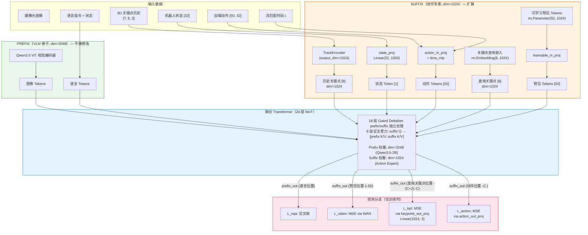
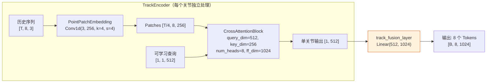
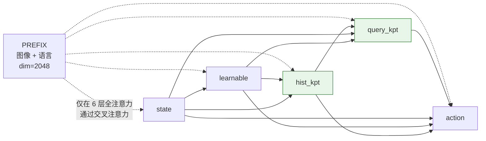
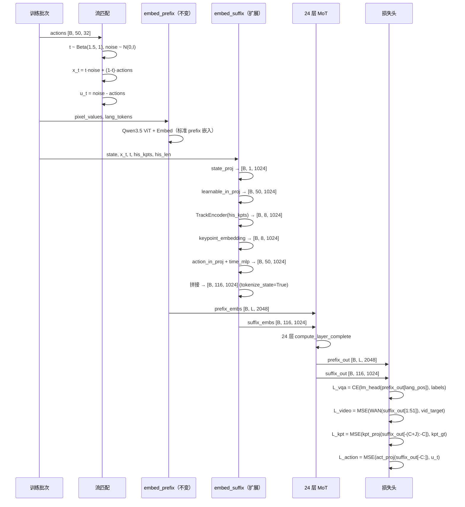
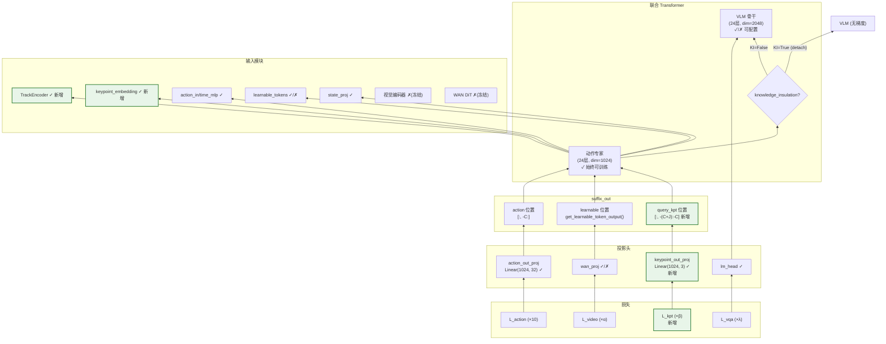
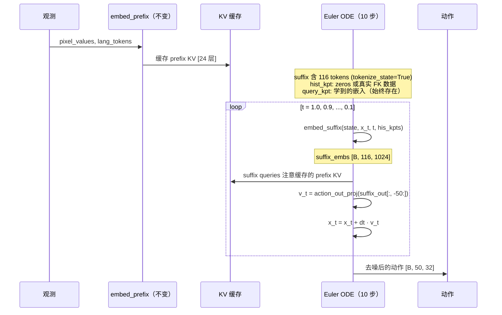
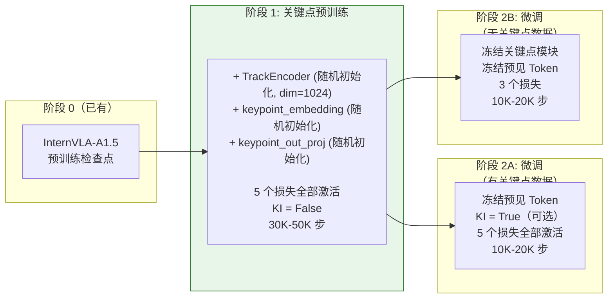

# InternVLA-A1.5 + GeoPredict 3D 关键点轨迹预测器融合方案 v2（Suffix-Based）

> **目标**：将 GeoPredict 的 3D Keypoint Trajectory-Level Kinematic Predictor 融合到 InternVLA-A1.5 的 **动作专家（Suffix）** 通路中，通过训练时辅助监督为动作专家注入显式3D运动学感知能力，提升成功率。
>
> **与 v1 方案的核心差异**：v1 将关键点 Token 放在 PREFIX（VLM 骨干，dim=2048）中；v2 将其放在 **SUFFIX（动作专家，dim=1024）** 中。这一改变带来了更优的信息传递路径、更低的计算开销和更清晰的架构职责分离。

---

## 目录

1. [动机与 v1 方案的不足](#1-动机与-v1-方案的不足)
2. [互补性分析](#2-互补性分析)
3. [架构概览](#3-架构概览)
4. [模块设计](#4-模块设计)
5. [Token 序列与注意力掩码](#5-token-序列与注意力掩码)
6. [训练前向传播](#6-训练前向传播)
7. [损失函数设计](#7-损失函数设计)
8. [反向传播与梯度流](#8-反向传播与梯度流)
9. [推理路径](#9-推理路径)
10. [训练策略](#10-训练策略)
11. [数据管道](#11-数据管道)
12. [配置变更](#12-配置变更)
13. [代码修改指南](#13-代码修改指南)
14. [成功率提升分析](#14-成功率提升分析)
15. [v1 vs v2 对比总结](#15-v1-vs-v2-对比总结)
16. [参考文献](#16-参考文献)

---

## 1. 动机与 v1 方案的不足

### 1.1 背景回顾

InternVLA-A1.5 是一个统一视觉理解、潜在视频预见和连续动作生成的 VLA 策略。它采用 **Mixture-of-Transformers（MoT）** 架构，将 Qwen3.5-2B VLM 骨干（prefix 通路，dim=2048）与 460M 动作专家（suffix 通路，dim=1024）联合处理。在 24 层 Transformer 中，18 层为 Gated DeltaNet 线性注意力（prefix/suffix **完全独立**处理），6 层为全注意力（suffix Q 注意到 prefix+suffix 的 K/V）。

GeoPredict 证明，在训练期间添加 3D 关键点轨迹预测辅助任务能够显著提升 VLA 策略的成功率（RoboCasa +10.1%，LIBERO-Long +6.4%，真实世界 +45%），且所有 3D 预测模块在推理时可全部丢弃。

### 1.2 v1 方案（Prefix-Based）及其不足

v1 方案（[itrnVLA15_GeoP_3dtrj_1cn.md](itrnVLA15_GeoP_3dtrj_1cn.md)）将 16 个关键点 Token（8 个历史 + 8 个查询）放在 **PREFIX** 中，追加在图像和语言 Token 之后。

**v1 的不足之处：**

**(1) 信息传递路径受限**

在 MoT 架构中，18/24 层为线性注意力层，prefix 和 suffix 在这些层中**完全独立**处理（[`modeling_internvla_a1_5.py:148-181`](src/lerobot/policies/internvla_a1_5/modeling_internvla_a1_5.py#L148-L181)）：

```python
if layer_type == "linear_attention":
    # prefix 和 suffix 各自独立通过自己的 linear_attn
    for i, hidden_states in enumerate(inputs_embeds):
        layer = models[i].layers[layer_idx]
        hidden_states = layer.linear_attn(hidden_states=hidden_states, ...)
```

这意味着 v1 中放在 prefix 的关键点 Token，在 **18 层线性注意力** 中与动作 Token 之间**完全没有信息交换**。动作专家只能在 6 层全注意力层通过交叉注意力间接获取关键点信息。

**(2) 维度不匹配导致浪费**

prefix 使用 dim=2048，而关键点预测本质上是机器人专属任务。在2048维空间中运算关键点 Token，计算量是在1024维空间的约4倍（每层的注意力和 FFN 复杂度与 $d^2$ 成正比），却未带来相应的信息增益。

**(3) 污染 prefix 序列**

在 prefix 中添加 16 个 Token 增加了所有 prefix 消费者（VQA loss、视觉编码、因果注意力）的计算量和内存开销。特别是 `embed_prefix`（[`modeling_internvla_a1_5.py:677-717`](src/lerobot/policies/internvla_a1_5/modeling_internvla_a1_5.py#L677-L717)）中 `att_masks = pad_masks.clone()` 使每个 prefix 位置都形成独立的因果 block，16 个额外 Token 导致因果掩码矩阵增加 $O(16L)$ 个元素（$L$ 为原 prefix 长度）。

**(4) 架构职责不清**

关键点预测是机器人运动学相关的任务，与通用 VLM 的语言理解能力无关。将其放在 VLM 骨干中模糊了"视觉-语言理解"与"机器人运动控制"之间的职责边界。

### 1.3 v2 方案的核心思路

**将关键点 Token 移入 SUFFIX（动作专家通路），使其与动作 Token 共享同一处理路径。** 这带来三个关键优势：

1. **在全部 24 层中都有信息传递**：suffix 内的所有 Token 共享 Gated DeltaNet 的递归状态，关键点信息在 18 层线性注意力中通过递归状态直接传递给动作 Token，在 6 层全注意力中通过自注意力传递。
2. **计算效率**：关键点 Token 在 dim=1024 的专家中处理，计算量是 prefix (dim=2048) 的约 1/4。
3. **架构一致**：运动学预测和动作预测都在机器人专属的动作专家中完成。

---

## 2. 互补性分析

> 本节与 v1 方案基本一致，简述核心论点。

### 2.1 两种预见模态的正交互补

| 维度 | InternVLA-A1.5（潜在视频预见） | GeoPredict（3D 关键点轨迹） |
|---|---|---|
| **预测内容** | WAN 潜在空间中的未来视频帧 | 8 个关节的未来 3D 位置 |
| **预测空间** | 压缩图像潜变量 $\mathbb{R}^{C \times T' \times H' \times W'}$ | 显式 3D 坐标 $\mathbb{R}^{T \times 8 \times 3}$ |
| **信息层次** | 场景级（世界的未来样子） | 机器人级（机器人的运动轨迹） |
| **优势场景** | 接触预测、视觉伺服 | 避障、到达、运动学一致性 |

两者的弱点互不重叠，预期收益具有**叠加性**。

### 2.2 消融证据

- InternVLA-A1.5 消融（论文 Table 8）：移除视频损失在 LIBERO-Plus 下降 -6.8%
- GeoPredict 消融（论文 Table 2）：关键点轨迹预测在 Pi0 基线上额外贡献 +3.0%
- InternVLA-A1.5 在 LIBERO-Plus Robot 扰动类别仅 55.1%，正是3D运动学感知应发挥最大作用的场景

---

## 3. 架构概览

### 3.1 融合架构图（v2 Suffix-Based）



### 3.2 关键设计决策：关键点 Token 放入 Suffix

**决策**：16 个关键点 Token（8 个历史 + 8 个查询）放入 SUFFIX，位于 learnable tokens 之后、action tokens 之前。

**理由一：线性注意力层的递归状态共享。**

这是 v2 最关键的优势。在 `compute_layer_complete`（[`modeling_internvla_a1_5.py:148-181`](src/lerobot/policies/internvla_a1_5/modeling_internvla_a1_5.py#L148-L181)）中，线性注意力层对 suffix 的处理是通过 Gated DeltaNet 的递归状态完成的。所有 suffix Token 共享同一递归状态链：

$$\mathbf{s}_t = \alpha_t \odot \mathbf{s}_{t-1} + \beta_t \odot (\mathbf{k}_t \otimes \mathbf{v}_t)$$

其中 $\mathbf{s}_t$ 为第 $t$ 个 Token 处的递归状态（hidden state），$\alpha_t$ 为遗忘门（gating），$\beta_t$ 为输入门，$\mathbf{k}_t, \mathbf{v}_t$ 为当前 Token 的 key/value。

当关键点 Token 位于 suffix 中时，它们的信息被编码到递归状态中，所有后续 Token（包括 action tokens）通过读取递归状态自动获得关键点信息。这在 **18 层线性注意力** 中都有效。

相比之下，v1 中关键点在 prefix 中，prefix 和 suffix 的递归状态完全独立，action tokens 只能在 6 层全注意力中通过交叉注意力获取关键点信息。

**理由二：维度天然匹配动作专家。**

动作专家的 `hidden_size=1024`，关键点预测作为机器人运动学任务，1024 维足以表达。TrackEncoder 的 `output_dim` 是可配置参数（[`GeoPredict/models/keypoints.py:154`](../../../GeoPredict/models/keypoints.py#L154)），直接设为 1024 即可。

**理由三：保留现有提取逻辑。**

通过将关键点 Token 插入 learnable 和 action 之间（而非首尾），**动作 Token 的提取逻辑不受影响**：
- `suffix_out[:, -chunk_size:]` 提取 action tokens（[`modeling_internvla_a1_5.py:1227`](src/lerobot/policies/internvla_a1_5/modeling_internvla_a1_5.py#L1227)）——action 始终在 suffix 末尾，反向索引天然正确
- `get_learnable_token_output`（[`modeling_internvla_a1_5.py:977-980`](src/lerobot/policies/internvla_a1_5/modeling_internvla_a1_5.py#L977-L980)）需要修复其硬编码 `start=1` 的问题（见 6.3 节），但这是现有代码的已有 bug，与关键点插入无关

### 3.3 维度参考表

| 组件 | v1 (Prefix-Based) | v2 (Suffix-Based) |
|---|---|---|
| 关键点处理通路 | VLM prefix (dim=2048) | Action Expert suffix (dim=1024) |
| TrackEncoder output_dim | 2048 | **1024** |
| track_fusion_layer | Linear(512, 2048) | **Linear(512, 1024)** |
| keypoint_embedding | nn.Embedding(8, 2048) | **nn.Embedding(8, 1024)** |
| keypoint_out_proj | Linear(2048, 3) | **Linear(1024, 3)** |
| future_kpt_pos_embed | buffer (50, 2048) | **buffer (50, 1024)** |
| suffix 序列长度 | 100/101（不变） | **116/117**（+16） |
| prefix 序列长度 | 增加 16 | **不变** |

---

## 4. 模块设计

### 4.1 TrackEncoder（适配 dim=1024）

从 GeoPredict 移植（[`GeoPredict/models/keypoints.py:150-213`](../../../GeoPredict/models/keypoints.py#L150-L213)），仅修改 `output_dim=1024`：



**与 v1 的区别**：仅 `track_fusion_layer` 从 `Linear(512, 2048)` 改为 `Linear(512, 1024)`。TrackEncoder 内部的 PointPatchEmbedding、CrossAttentionBlock 保持不变（它们的内部维度 embed_dim=256、query_dim=512 独立于输出维度）。

**实例化**：`self.track_encoder = TrackEncoder(output_dim=1024)`，而非 GeoPredict 中的默认 `TrackEncoder()`（默认 output_dim=2048）。

**参数量**：约 3.5M（主要是 CrossAttentionBlock 中的线性层和 track_fusion_layer）。由于 track_fusion_layer 缩小（512×1024 vs 512×2048），比 v1 减少约 0.5M 参数。

### 4.2 关键点查询嵌入

$$\mathbf{E}_{kpt} = \text{nn.Embedding}(J, d_{expert}) \quad \text{其中 } J = 8, \; d_{expert} = 1024$$

8 个可学习嵌入向量，每个对应一个机器人关节。经 Transformer 处理后，它们的输出表征用于预测当前和未来的 3D 关节位置。维度从 v1 的 2048 降为 1024，与动作专家一致。

### 4.3 关键点输出投影

$$\text{keypoint\_out\_proj} = \text{Linear}(d_{expert}, 3) = \text{Linear}(1024, 3)$$

共享于当前和未来关键点预测。在当前预测中，直接作用于查询 Token 的输出；在未来预测中，作用于加了正弦时间编码的查询 Token 输出（见 4.4 节）。

### 4.4 基于时间条件复用的未来轨迹预测

与 v1 相同的复用机制，但维度适配到 1024：

$$\hat{\mathbf{p}}_{j,t} = \text{keypoint\_out\_proj}\!\left(\mathbf{h}_j^{kpt} + \mathbf{e}_t^{future}\right)$$

各符号含义：
- $\hat{\mathbf{p}}_{j,t} \in \mathbb{R}^3$：关节 $j$ 在未来时间步 $t$ 的预测 3D 位置
- $\mathbf{h}_j^{kpt} \in \mathbb{R}^{1024}$：关键点查询 Token 经 Transformer 后的 **suffix** 输出表征
- $\mathbf{e}_t^{future} \in \mathbb{R}^{1024}$：预计算正弦位置编码（冻结 buffer）

位置编码生成方式沿用 GeoPredict（[`geopredict.py:57-71`](../../../GeoPredict/models/geopredict.py#L57-L71)），基频率 base=100（[`geopredict.py:114`](../../../GeoPredict/models/geopredict.py#L114)），适配到 1024 维：

$$\mathbf{e}_t^{future}[2i] = \sin\!\left(\frac{t}{100^{2i/d}}\right), \quad \mathbf{e}_t^{future}[2i+1] = \cos\!\left(\frac{t}{100^{2i/d}}\right)$$

其中 $d = 1024$，$i \in [0, 512)$。注册为不可训练的 buffer：`register_buffer("future_kpt_pos_embed", ...)`，形状 $[C, 1024]$，$C = 50$。

---

## 5. Token 序列与注意力掩码

### 5.1 Suffix Token 序列布局（v2）

```
原始 SUFFIX（tokenize_state=True 时 100 tokens，False 时 101 tokens）:

tokenize_state=True（默认，状态编码到 prefix 语言 Token 中）:
┌──────────────────────────────────────────────────────────┐
│  可学习预见 (50)            │  动作+时间 (50)            │
│  att: [1, 0, ..., 0]        │  att: [1, 0, ..., 0]       │
└──────────────────────────────────────────────────────────┘

tokenize_state=False:
┌──────────────────────────────────────────────────────────────────────┐
│  状态 (1)  │  可学习预见 (50)       │  动作+时间 (50)            │
│  att: [1]   │  att: [1, 0, ..., 0]   │  att: [1, 0, ..., 0]       │
└──────────────────────────────────────────────────────────────────────┘

v2 SUFFIX（tokenize_state=True 时 116 tokens，False 时 117 tokens）:

tokenize_state=True（默认）:
┌────────────────────────────────────────────────────────────────────────────┐
│ 可学习预见(50)      │ 历史关键点(8)  │ 查询关键点(8)  │ 动作+时间(50)      │
│ att:[1,0,...,0]      │ att:[1,0,..,0]  │ att:[1,0,..,0]  │ att:[1,0,...,0]      │
│ pos: 0-49            │ pos: 50-57      │ pos: 58-65      │ pos: 66-115          │
│ cum: 1               │ cum: 2          │ cum: 3          │ cum: 4               │
└────────────────────────────────────────────────────────────────────────────┘

tokenize_state=False:
┌────────────────────────────────────────────────────────────────────────────────────┐
│  状态(1) │ 可学习预见(50)      │ 历史关键点(8)  │ 查询关键点(8)  │ 动作+时间(50)      │
│  att:[1]  │ att:[1,0,...,0]      │ att:[1,0,..,0]  │ att:[1,0,..,0]  │ att:[1,0,...,0]      │
│  pos: 0   │ pos: 1-50           │ pos: 51-58      │ pos: 59-66      │ pos: 67-116          │
│  cum: 1   │ cum: 2              │ cum: 3          │ cum: 4          │ cum: 5               │
└────────────────────────────────────────────────────────────────────────────────────┘
```

> **关键细节**：`tokenize_state` 默认为 `True`（[`configuration_internvla_a1_5.py:314`](src/lerobot/policies/internvla_a1_5/configuration_internvla_a1_5.py#L314)），此时 `embed_suffix` 中 state token 的嵌入被**条件跳过**（[`modeling_internvla_a1_5.py:924`](src/lerobot/policies/internvla_a1_5/modeling_internvla_a1_5.py#L924)：`if not self.config.tokenize_state`）。suffix 的绝对位置索引取决于该配置，不应硬编码。

**关键：插入位置在 learnable 和 action 之间**——这是一个精心选择的位置，利用**从尾部反向索引**来保证正确性：

1. `suffix_out[:, -C:]` 提取 action tokens（C=chunk_size=50）→ 动作损失提取**不变**
2. `suffix_out[:, -(C+J):-C]` 提取 query_kpt tokens（J=num_keypoint_joints=8）→ **新增**
3. learnable tokens 的提取需适配 `tokenize_state`（见 6.3 节详细分析）

**为什么用反向索引**：由于 `[... | hist_kpt(J) | query_kpt(J) | action(C)]` 三者始终固定在 suffix 末尾，从尾部反向计算的位置**不受 `tokenize_state` 和 `num_learnable_tokens` 变化的影响**。这比绝对位置 `suffix_out[:, 59:67]` 更鲁棒。

### 5.2 att_masks 构建

att_masks 的构建在 `embed_suffix` 中是**增量拼接**的（原始代码即是 `att_masks += [1] + [0] * (n-1)` 的逐段追加），因此不依赖绝对位置：

```python
att_masks = []

# 条件添加 state（仅当 tokenize_state=False）
if not self.config.tokenize_state:
    att_masks += [1]                              # state: 新 block

att_masks += [1] + [0] * (num_lt - 1)             # learnable: 50 tokens, 组内双向

# 新增
if self.config.enable_keypoint_predictor:
    att_masks += [1] + [0] * (J - 1)              # hist_kpt: 8 tokens, 组内双向
    att_masks += [1] + [0] * (J - 1)              # query_kpt: 8 tokens, 组内双向

att_masks += [1] + [0] * (chunk_size - 1)          # action: 50 tokens, 组内双向

# tokenize_state=True 时:  长度 = 50 + 8 + 8 + 50 = 116, 4 个 block boundary
# tokenize_state=False 时: 长度 = 1 + 50 + 8 + 8 + 50 = 117, 5 个 block boundary
```

### 5.3 cumsum 与 block-causal 注意力分析

通过 `make_att_2d_masks`（[`modeling_internvla_a1_5.py:100-110`](src/lerobot/policies/internvla_a1_5/modeling_internvla_a1_5.py#L100-L110)）：

$$M_{q,k} = \mathbb{1}\!\left[\text{cumsum}(att)[k] \leq \text{cumsum}(att)[q]\right] \wedge \text{pad\_mask}[k]$$

block 的 cumsum 值和注意力关系（以 `tokenize_state=True` 默认配置为例，4 个 block）：

| Block | Token 类型 | cumsum 值 | 可注意到的 blocks |
|---|---|---|---|
| 1 | learnable (50 tokens) | 1 | 组内双向 |
| 2 | hist_kpt (8 tokens) | 2 | learnable + 组内双向 |
| 3 | query_kpt (8 tokens) | 3 | learnable + hist_kpt + 组内双向 |
| 4 | action (50 tokens) | 4 | **全部** + 组内双向 |

> 当 `tokenize_state=False` 时，state token 在最前面增加一个 block（cumsum=1），后续所有 block 的 cumsum 值各加 1，注意力关系不变（state 可被所有后续 block 注意到）。

**注意力模式矩阵（suffix 内部，tokenize_state=True）：**

| Query ↓ \ Key → | learnable | hist_kpt | query_kpt | action |
|---|:---:|:---:|:---:|:---:|
| **learnable** | 双向 | × | × | × |
| **hist_kpt** | ✓ | 双向 | × | × |
| **query_kpt** | ✓ | ✓ | 双向 | × |
| **action** | ✓ | ✓ | ✓ | 双向 |

**再加上 prefix 的交叉注意力**（仅在 6 层全注意力中）：所有 suffix tokens 都能注意到 prefix 中的图像和语言 tokens。

### 5.4 信息流分析

这个注意力结构具有精心设计的**信息流向**：



**关键信息流**：

1. **query_kpt ← learnable**：关键点查询从预见 tokens 获得场景级未来预测上下文，有助于更准确的轨迹预测
2. **query_kpt ← hist_kpt**：关键点查询从历史 tokens 获得时间上下文
3. **action ← query_kpt**：动作 tokens 从关键点查询获得 3D 运动学感知——这是融合的核心目标
4. **action ← hist_kpt**：动作 tokens 也直接获得历史运动学信息
5. **learnable × → hist_kpt/query_kpt**：视频预见（WAN 监督）不需要 3D 关键点信息，避免不必要的干扰

### 5.5 在线性注意力层中的递归状态信息传递

在 18 层线性注意力中，suffix 的 Gated DeltaNet 递归状态按 Token 顺序更新：

以 `tokenize_state=True`（默认）为例：

$$\mathbf{s}_0 \xrightarrow[\text{50 tokens}]{\text{learnable}} \mathbf{s}_{50} \xrightarrow[\text{8 tokens}]{\text{hist\_kpt}} \mathbf{s}_{58} \xrightarrow[\text{8 tokens}]{\text{query\_kpt}} \mathbf{s}_{66} \xrightarrow[\text{50 tokens}]{\text{action}} \mathbf{s}_{116}$$

（当 `tokenize_state=False` 时，state token 在最前面，所有下标加 1。）

其中 $\mathbf{s}_t$ 为处理到位置 $t$ 时的递归状态。每个 Token 通过：
- **写入**：将自己的 K/V 信息编码到状态中
- **读取**：基于自己的 Q 从累积状态中检索信息

这意味着 action tokens 在**每一层线性注意力**中都能通过递归状态**隐式获取**来自 hist_kpt 和 query_kpt 的信息。这是 v2 相比 v1 的**核心优势**——v1 中线性注意力层对关键点信息完全不透明。

### 5.6 PREFIX 注意力掩码——不做修改

v2 方案**完全不修改 prefix**。`embed_prefix` 中 `att_masks = pad_masks.clone()` 的逻辑保持不变（每个 prefix token 形成独立因果 block）。prefix 长度不增加，VQA loss 计算不受影响。

---

## 6. 训练前向传播

### 6.1 修改后的 embed_suffix

对 `embed_suffix`（[`modeling_internvla_a1_5.py:917-975`](src/lerobot/policies/internvla_a1_5/modeling_internvla_a1_5.py#L917-L975)）进行扩展，新增关键点 Token 的嵌入：

```python
def embed_suffix(self, state, noisy_actions, timestep,
                 his_kpts=None, his_len=None):        # ← 新增参数
    """Build suffix: [state?] [learnable(N)] [hist_kpt(J)] [query_kpt(J)] [action(C)].
    
    state token 仅在 tokenize_state=False 时存在。
    hist_kpt/query_kpt 仅在 enable_keypoint_predictor=True 时存在。
    """
    embs = []
    pad_masks = []
    att_masks = []

    # ---- 状态 Token（条件添加，不变）----
    if not self.config.tokenize_state:
        state_emb = self.state_proj(state)
        embs.append(state_emb[:, None, :])             # [B, 1, 1024]
        pad_masks.append(ones(B, 1))
        att_masks += [1]

    # ---- 可学习预见 Tokens（不变）----
    lt_emb = self.learnable_tokens_in_proj(self.learnable_tokens)
    lt_emb = lt_emb[None].expand(B, -1, -1)           # [B, 50, 1024]
    embs.append(lt_emb)
    pad_masks.append(ones(B, 50))
    att_masks += [1] + [0] * 49

    # ---- 历史关键点 Tokens（新增）----
    if self.config.enable_keypoint_predictor:
        J = self.config.num_keypoint_joints
        if his_kpts is not None:
            hist_kpt_emb = self.track_encoder(his_kpts, his_len)  # [B, J, 1024]
        else:
            hist_kpt_emb = torch.zeros(B, J, 1024, device=device, dtype=dtype)
        embs.append(hist_kpt_emb)
        pad_masks.append(ones(B, J))
        att_masks += [1] + [0] * (J - 1)

        # ---- 查询关键点 Tokens（新增）----
        query_kpt_emb = self.keypoint_embedding.weight[None].expand(B, -1, -1)  # [B, J, 1024]
        embs.append(query_kpt_emb)
        pad_masks.append(ones(B, J))
        att_masks += [1] + [0] * (J - 1)

    # ---- 动作+时间 Tokens（不变）----
    action_emb = self.action_in_proj(noisy_actions)
    time_emb = create_sinusoidal_pos_embedding(timestep, ...)
    action_time_emb = mlp(cat([action_emb, time_emb], dim=2))  # [B, 50, 1024]
    embs.append(action_time_emb)
    pad_masks.append(ones(B, 50))
    att_masks += [1] + [0] * 49

    embs = torch.cat(embs, dim=1)          # tokenize_state=True: [B, 116, 1024] 或 [B, 100, 1024]
                                           # tokenize_state=False: [B, 117, 1024] 或 [B, 101, 1024]
    pad_masks = torch.cat(pad_masks, dim=1)
    att_masks = tensor(att_masks)[None].expand(B, -1)

    return embs, pad_masks, att_masks
```

### 6.2 训练前向传播数据流



### 6.3 从 suffix_out 提取各类 Token

suffix_out 的形状因 `tokenize_state` 和 `enable_keypoint_predictor` 配置而异：

| 配置组合 | suffix 长度 |
|---|---|
| tokenize_state=True, enable_kpt=True（默认） | 116 |
| tokenize_state=True, enable_kpt=False | 100 |
| tokenize_state=False, enable_kpt=True | 117 |
| tokenize_state=False, enable_kpt=False | 101 |

**提取策略：统一使用从尾部反向索引**，避免因 `tokenize_state` 导致的位置偏移错误：

```python
C = self.config.chunk_size            # 50
J = self.config.num_keypoint_joints   # 8

# 动作 Token — 始终在 suffix 末尾，提取方式不变
action_out    = suffix_out[:, -C:]                # [B, 50, 1024]

# 查询关键点 Token — 紧贴 action 之前（新增）
query_kpt_out = suffix_out[:, -(C + J) : -C]     # [B, 8, 1024]

# 可学习预见 Token — 需适配 get_learnable_token_output（见下文）
learnable_out = self.get_learnable_token_output(suffix_out)  # [B, 50, 1024]
```

**`get_learnable_token_output` 需要修改**。现有代码（[`modeling_internvla_a1_5.py:977-980`](src/lerobot/policies/internvla_a1_5/modeling_internvla_a1_5.py#L977-L980)）硬编码 `start = 1` 来跳过 state token：

```python
# 现有代码（假设 state token 始终在 position 0）
def get_learnable_token_output(self, suffix_out):
    start = 1  # skip state token
    end = 1 + self.config.num_learnable_tokens
    return suffix_out[:, start:end]
```

当 `tokenize_state=True`（默认）时 suffix 没有 state token，position 0 就是第一个 learnable token，hardcode `start=1` 会跳过它。虽然这是**现有代码的问题**，但 v2 中因为在 learnable 和 action 之间插入了关键点 token，使得原本"少取一个 learnable、多取一个 action"的偏差被放大。修改方案：

```python
def get_learnable_token_output(self, suffix_out):
    state_offset = 0 if self.config.tokenize_state else 1
    start = state_offset
    end = state_offset + self.config.num_learnable_tokens
    return suffix_out[:, start:end]
```

或者同样使用反向索引（更鲁棒）：

```python
def get_learnable_token_output(self, suffix_out):
    # learnable tokens 紧跟在 suffix 开头（或 state 之后）
    # 但它们不在尾部的固定结构中，所以用正向偏移更自然
    state_offset = 0 if self.config.tokenize_state else 1
    N = self.config.num_learnable_tokens
    return suffix_out[:, state_offset : state_offset + N]
```

### 6.4 forward 方法修改点

对 `InternVLAA15.forward`（[`modeling_internvla_a1_5.py:1099-1246`](src/lerobot/policies/internvla_a1_5/modeling_internvla_a1_5.py#L1099-L1246)）的修改：

```python
def forward(self, ...,
            his_kpts=None, his_len=None,        # 新增
            kpt_t=None, future_kpts=None,        # 新增
            kpt_mask=None,                        # 新增
            ...):

    # 步骤 1-2: 流匹配噪声 + prefix 嵌入（不变）
    ...

    # 步骤 3: suffix 嵌入（传入关键点参数）
    suffix_embs, suffix_pad_masks, suffix_att_masks = self.embed_suffix(
        state, x_t, time,
        his_kpts=his_kpts, his_len=his_len      # ← 新增
    )

    # 步骤 4-6: 掩码构建、位置 ID、联合 Transformer（自动适配新长度）
    ...
    (prefix_out, suffix_out), _ = self.qwen3_5_with_expert.forward(...)

    # 步骤 7: VQA 损失（不变，使用 prefix_out）
    # 步骤 8: 动作损失（不变，使用 suffix_out[:, -C:]）
    # 步骤 9: 视频损失（需修改 get_learnable_token_output，见 6.3 节）

    # 步骤 10: 关键点损失（新增）
    if self.config.enable_keypoint_predictor and kpt_t is not None:
        C = self.config.chunk_size
        J = self.config.num_keypoint_joints
        # 从尾部反向索引：query_kpt 紧贴 action 之前
        query_kpt_out = suffix_out[:, -(C + J) : -C]          # [B, 8, 1024]
        query_kpt_out = query_kpt_out.to(dtype=torch.float32)

        # 当前关键点损失
        pred_kpt = self.keypoint_out_proj(query_kpt_out)       # [B, 8, 3]

        # 未来关键点轨迹损失
        C = self.config.chunk_size  # 50
        kpt_rep = query_kpt_out.unsqueeze(1).expand(-1, C, -1, -1)  # [B,50,8,1024]
        fut_pe = self.future_kpt_pos_embed[:C].unsqueeze(0).unsqueeze(2)  # [1,50,1,1024]
        kpt_future_in = kpt_rep + fut_pe                          # [B,50,8,1024]
        future_pred = self.keypoint_out_proj(
            kpt_future_in.reshape(-1, J, 1024)
        ).reshape(B, C, J, 3)                                     # [B,50,8,3]

        # Per-sample masking（boolean indexing，与 video_mask 一致）
        if kpt_mask is not None and not kpt_mask.all():
            pred_kpt = pred_kpt[kpt_mask]
            kpt_t = kpt_t[kpt_mask]
            future_pred = future_pred[kpt_mask]
            future_kpts = future_kpts[kpt_mask]

        loss_kpt_current = F.mse_loss(pred_kpt, kpt_t)
        loss_kpt_future = F.mse_loss(future_pred, future_kpts)
    else:
        loss_kpt_current = torch.tensor(0.0, device=device)
        loss_kpt_future = torch.tensor(0.0, device=device)

    return (loss_action, loss_vqa, video_loss,
            loss_kpt_current, loss_kpt_future,    # 新增返回
            loss_per_token, token_mask)
```

---

## 7. 损失函数设计

### 7.1 完整损失函数

$$\mathcal{L}_{total} = \underbrace{10 \cdot \mathcal{L}_{action}}_{\text{流匹配}} + \underbrace{\lambda_{vqa} \cdot \mathcal{L}_{vqa}}_{\text{语言定基}} + \underbrace{\alpha \cdot \mathcal{L}_{video}}_{\text{场景预见}} + \underbrace{\beta \cdot (\mathcal{L}_{kpt}^{cur} + \mathcal{L}_{kpt}^{fut})}_{\text{运动学预见（新增）}}$$

各分量定义：
- $\mathcal{L}_{action}$：流匹配速度场 MSE，权重 10（硬编码，[`modeling_internvla_a1_5.py:1650`](src/lerobot/policies/internvla_a1_5/modeling_internvla_a1_5.py#L1650)）
- $\mathcal{L}_{vqa}$：语言 Token 交叉熵，$\lambda_{vqa} = 1.0$
- $\mathcal{L}_{video}$：冻结 WAN2.2 DiT 的视频 MSE，$\alpha = 1.0$
- $\mathcal{L}_{kpt}^{cur}$：当前关键点 MSE，$\beta = 1.0$（新增）
- $\mathcal{L}_{kpt}^{fut}$：未来轨迹 MSE，$\beta = 1.0$（与当前共享权重，新增）

### 7.2 当前关键点损失

$$\mathcal{L}_{kpt}^{cur} = \frac{1}{B' \cdot J \cdot 3} \sum_{b \in \mathcal{M}} \sum_{j=1}^{J} \|\hat{\mathbf{p}}_j^{cur} - \mathbf{p}_j^{gt}\|_2^2$$

其中：
- $\hat{\mathbf{p}}_j^{cur} = \text{keypoint\_out\_proj}(\mathbf{h}_j^{kpt})$，$\mathbf{h}_j^{kpt}$ 取自 **suffix_out** 的反向位置 $-(C + J) + j - 1$（即 `suffix_out[:, -(C+J):-C]` 的第 $j$ 个 token）
- $\mathcal{M} = \{b : \text{kpt\_mask}[b] = \text{True}\}$ 为有关键点标注的样本集合
- $B' = |\mathcal{M}|$

### 7.3 未来关键点轨迹损失

$$\mathcal{L}_{kpt}^{fut} = \frac{1}{B' \cdot C \cdot J \cdot 3} \sum_{b \in \mathcal{M}} \sum_{t=1}^{C} \sum_{j=1}^{J} \|\hat{\mathbf{p}}_{j,t}^{fut} - \mathbf{p}_{j,t}^{gt}\|_2^2$$

其中 $\hat{\mathbf{p}}_{j,t}^{fut} = \text{keypoint\_out\_proj}(\mathbf{h}_j^{kpt} + \mathbf{e}_t^{future})$，$C = 50$。

### 7.4 per-sample masking

使用 boolean indexing（与 `video_mask` 处理方式一致，[`modeling_internvla_a1_5.py:1239-1242`](src/lerobot/policies/internvla_a1_5/modeling_internvla_a1_5.py#L1239-L1242)）：

```python
if kpt_mask is not None and not kpt_mask.all():
    pred_kpt = pred_kpt[kpt_mask]         # 仅选出有标注的样本
    kpt_t_gt = kpt_t[kpt_mask]
    future_pred = future_pred[kpt_mask]
    future_gt = future_kpts[kpt_mask]
loss_kpt_current = F.mse_loss(pred_kpt, kpt_t_gt)
loss_kpt_future  = F.mse_loss(future_pred, future_gt)
```

---

## 8. 反向传播与梯度流

### 8.1 梯度流图



### 8.2 关键梯度路径分析

**路径 1：关键点损失 → 动作专家（直接路径，始终存在）**

$$\mathcal{L}_{kpt} \xrightarrow{\text{keypoint\_out\_proj}} \text{suffix\_out}[:, -(C{+}J){:}{-}C] \xrightarrow[\text{24层}]{\text{Expert 权重}} \text{TrackEncoder + keypoint\_embedding}$$

关键点损失的梯度直接通过 suffix_out 反向传播到动作专家的所有 24 层权重，以及 TrackEncoder 和 keypoint_embedding。这是一条**无条件的直接路径**。

**路径 2：关键点损失 → VLM 骨干（间接路径，受 KI 控制）**

| KI 设置 | 路径是否存在 | 机制 |
|---|---|---|
| **KI = False** | ✓ | 在 6 层全注意力中，suffix Q 注意 prefix K/V 时，prefix K/V **未 detach**，梯度通过交叉注意力回传到 VLM |
| **KI = True** | ✗ | prefix K/V 在送入 suffix 注意力前被 `.detach()`（[`modeling_internvla_a1_5.py:269-274`](src/lerobot/policies/internvla_a1_5/modeling_internvla_a1_5.py#L269-L274)），阻断梯度 |

**路径 3：动作损失 → 关键点模块（通过递归状态）**

在线性注意力层中，action tokens 的损失梯度反向传播时，会经过递归状态到达更早的 suffix tokens（包括 hist_kpt 和 query_kpt）。这意味着动作损失**也会间接优化关键点模块**，使关键点表征向有利于动作预测的方向调整。

这是 **v2 独有的优势**——v1 中线性注意力层 prefix/suffix 完全独立，动作损失不会通过线性注意力影响 prefix 中的关键点 Token。

### 8.3 v1 vs v2 梯度路径对比

| 梯度路径 | v1 (Prefix-Based) | v2 (Suffix-Based) |
|---|---|---|
| kpt_loss → VLM 骨干 | **直接**（通过 prefix_out） | **间接**（仅通过 6 层交叉注意力，受 KI 控制） |
| kpt_loss → 动作专家 | ✗ 无路径 | **直接**（通过 suffix_out） |
| action_loss → 关键点模块 | 仅 6 层交叉注意力（KI=False） | **24 层**（18 层递归状态 + 6 层交叉注意力） |
| kpt_loss → TrackEncoder | 通过 VLM 24 层 | 通过 Expert 24 层 |

**核心差异**：v2 中动作损失与关键点损失共享动作专家的全部 24 层权重，形成**更紧密的双向优化**。关键点表征不仅为3D预测优化，也同时为动作质量优化——因为它们在同一通路中。

### 8.4 知识绝缘（Knowledge Insulation）的建议设置

| 阶段 | KI 设置 | 理由 |
|---|---|---|
| 预训练 | **False** | 允许关键点+动作损失通过交叉注意力路径也更新 VLM 表征 |
| 微调 | **True** | 防止微调时的辅助任务梯度扰动已收敛的 VLM 权重 |

### 8.5 冻结策略

| 模块 | 预训练（阶段1） | 含关键点微调（阶段2A） | 无关键点微调（阶段2B） |
|---|---|---|---|
| Qwen3.5 VLM 骨干 | 可训练 | 可训练（低学习率） | 可训练 |
| 视觉编码器 | **冻结** | **冻结** | **冻结** |
| 动作专家 + 投影 | 可训练 | 可训练 | 可训练 |
| 可学习预见 Token | 可训练 | **冻结** | **冻结** |
| WAN DiT + VAE | **冻结** | **冻结** | **冻结** |
| TrackEncoder | 可训练（高学习率） | 可训练 | **冻结** |
| keypoint_embedding | 可训练 | 可训练 | **冻结** |
| keypoint_out_proj | 可训练 | 可训练 | **冻结** |

---

## 9. 推理路径

### 9.1 推理模式概述

v2 方案提供两种推理模式：

| 模式 | suffix 长度 | 关键点 Token 存在？ | 额外开销 | 适用场景 |
|---|---|---|---|---|
| **标准模式**（推荐） | 116/117 | 是（zeros 或真实 FK 数据） | suffix +16 tokens | 所有场景 |
| **极简模式** | 100/101 | 否（完全省略） | 零 | 极端延迟敏感 |

> 注：suffix 长度取决于 `tokenize_state`。默认 `True` 时为 116/100，`False` 时为 117/101。

**推荐使用标准模式**，原因：保持训练/推理的 suffix 序列结构一致，避免 RoPE 位置编码偏移导致的性能退化。

### 9.2 标准模式推理流程



**denoise_step 的修改**（[`modeling_internvla_a1_5.py:835-880`](src/lerobot/policies/internvla_a1_5/modeling_internvla_a1_5.py#L835-L880)）：

```python
def denoise_step(self, state, prefix_pad_masks, past_key_values,
                 max_prefix_position_ids, x_t, timestep,
                 fast_mask=None,
                 his_kpts=None, his_len=None):        # ← 新增可选参数

    # embed_suffix 现在接受关键点参数
    suffix_embs, suffix_pad_masks, suffix_att_masks = self.embed_suffix(
        state, x_t, timestep,
        his_kpts=his_kpts, his_len=his_len            # ← 新增
    )

    suffix_len = suffix_pad_masks.shape[1]  # 116/117（标准）或 100/101（极简），取决于 tokenize_state
    # ... 其余不变 ...

    # 位置 ID 自动适配新长度
    position_ids = (
        torch.arange(1, suffix_len + 1).repeat(3, 1, 1).to(max_prefix_position_ids)
        + max_prefix_position_ids
    )

    # ... 前向传播 ...
    suffix_out = outputs_embeds[1]
    suffix_out = suffix_out[:, -self.config.chunk_size:]  # 仍取最后 50 个 = action tokens
    return self.action_out_proj(suffix_out)
```

注意 `suffix_out[:, -self.config.chunk_size:]` 的提取逻辑**无需修改**——因为 action tokens 始终在 suffix 末尾。

### 9.3 RoPE 位置一致性分析

**为什么标准模式不会引起位置偏移问题**：

在 `denoise_step` 中（[`modeling_internvla_a1_5.py:860-863`](src/lerobot/policies/internvla_a1_5/modeling_internvla_a1_5.py#L860-L863)），suffix 的 position_ids 从 `max_prefix_position_ids + 1` 开始连续递增。以 `tokenize_state=True`（默认）为例，suffix 从 100 变为 116 tokens 时：

- 训练时 action tokens 的 position_ids：`[prefix_len + 67, ..., prefix_len + 116]`
- 标准推理时 action tokens 的 position_ids：`[prefix_len + 67, ..., prefix_len + 116]`（相同）
- 极简推理时 action tokens 的 position_ids：`[prefix_len + 51, ..., prefix_len + 100]`（偏移 -16）

标准模式保持完全一致；极简模式存在 16 位偏移，可能导致轻微性能退化（RoPE 的相对位置编码虽有一定鲁棒性，但差异仍可测量）。

### 9.4 极简模式的实现方式（可选）

若需极简模式，在 `embed_suffix` 中当 `include_keypoints_at_inference=False` 且 `not self.training` 时，跳过关键点 Token 的嵌入。为缓解 RoPE 位置偏移：

```python
if not self.training and not self.config.include_keypoints_at_inference:
    # 跳过 hist_kpt 和 query_kpt 的嵌入
    pass  # suffix 保持 100/101 tokens（取决于 tokenize_state）
```

建议配合训练时的 keypoint token dropout（以概率 $p$ 随机省略关键点 tokens），但这会引入 batch 内 suffix 长度不一致的问题（需零填充），增加工程复杂度。**因此推荐标准模式**。

### 9.5 推理开销定量分析

标准模式的额外开销（以 `tokenize_state=True` 为例）：
- suffix 从 100 → 116 tokens，增加 16%
- 每个 Euler 步的额外计算：16 tokens × 24 层 × dim=1024 的注意力+FFN
- 对于 10 步 Euler ODE：共 160 额外 token-layer 计算
- 原始：100 × 24 × 10 = 24,000 token-layer 计算
- 新增：16 × 24 × 10 = 3,840 token-layer 计算（+16%）

相比 prefix KV 缓存的一次性计算（~400 tokens × 24 layers × dim=2048），suffix 的增量开销可忽略不计。

---

## 10. 训练策略

### 10.1 分阶段训练



### 10.2 阶段 1 配置

```
learning_rate (backbone): 2.5e-5
learning_rate (keypoint modules): 5e-5    # 随机初始化用 2× 学习率
weight_decay: 0.01
warmup_steps: 1000
knowledge_insulation: False
freeze_vision_encoder: True
freeze_learnable_tokens: False
freeze_keypoint_modules: False
kpt_loss_weight: 1.0
```

### 10.3 数据混合处理

当 batch 中混合了有/无关键点标注的样本时：
- 无关键点数据的样本：`his_kpts` 填零，`kpt_mask=False`
- TrackEncoder 仍然处理这些零输入（产生近零输出），保持 suffix 长度一致
- 关键点损失通过 `kpt_mask` 的 boolean indexing 仅对有标注的样本计算

这与现有 `video_mask` 的处理方式完全一致——混合数据集中部分样本无视频帧，通过 mask 控制损失计算（[`modeling_internvla_a1_5.py:1236-1244`](src/lerobot/policies/internvla_a1_5/modeling_internvla_a1_5.py#L1236-L1244)）。

---

## 11. 数据管道

### 11.1 新增变换：Extract3DKeypointTransformFn

与 v1 方案相同，在变换管道中新增关键点数据提取变换。注册为 `DataTransformFn` 的子类，插入到 `NormalizeTransformFn` 之后。

### 11.2 数据字段

| 字段 | 形状 | 描述 |
|---|---|---|
| `his_kpts` | `[max_T, J, 3]` | 历史 3D 位置，零填充到 max_T=1000 |
| `his_len` | 标量 | 实际历史长度 |
| `kpt_t` | `[J, 3]` | 当前时间步 3D 关节位置 |
| `future_kpts` | `[C, J, 3]` | 未来 C=50 步的 3D 位置 |
| `kpt_mask` | bool | 该样本是否有有效关键点数据 |

其中 $J = 8$（7 个手臂连杆 + 夹爪末端），坐标在机器人基座坐标系下。

### 11.3 数据来源

与 v1 相同：仿真环境直接获取、URDF + 关节编码器做 FK、或从深度图估计。推荐使用仿真+FK。

---

## 12. 配置变更

### 12.1 InternVLAA15Config 新增字段

在 [`configuration_internvla_a1_5.py:250-345`](src/lerobot/policies/internvla_a1_5/configuration_internvla_a1_5.py#L250-L345) 中添加：

```python
# ---- 3D 关键点轨迹预测器 ----
enable_keypoint_predictor: bool = False
num_keypoint_joints: int = 8
kpt_loss_weight: float = 1.0
freeze_keypoint_modules: bool = False
include_keypoints_at_inference: bool = True  # 标准模式: True, 极简模式: False

# TrackEncoder 超参数（适配 suffix dim=1024）
keypoint_track_input_dim: int = 3
keypoint_track_patch_size: int = 4
keypoint_track_embed_dim: int = 256
keypoint_track_query_dim: int = 512
keypoint_track_num_heads: int = 8
keypoint_track_ff_dim: int = 1024
keypoint_history_max_len: int = 1000
```

注意 `include_keypoints_at_inference` 默认为 **True**（标准模式），这是 v2 的推荐默认值。

### 12.2 校验逻辑

```python
if self.enable_keypoint_predictor:
    if self.num_keypoint_joints <= 0:
        raise ValueError("num_keypoint_joints must be > 0")
    if self.kpt_loss_weight < 0:
        raise ValueError("kpt_loss_weight must be >= 0")
```

---

## 13. 代码修改指南

### 13.1 新增文件

**`src/lerobot/policies/internvla_a1_5/keypoints.py`**

从 GeoPredict 移植，修改 `output_dim` 默认值：
- `PointPatchEmbedding`（[`keypoints.py:8-49`](../../../GeoPredict/models/keypoints.py#L8-L49)）
- `TimeEmbedding`（[`keypoints.py:52-71`](../../../GeoPredict/models/keypoints.py#L52-L71)）
- `MultiHeadAttention`（[`keypoints.py:74-108`](../../../GeoPredict/models/keypoints.py#L74-L108)）
- `CrossAttentionBlock`（[`keypoints.py:111-147`](../../../GeoPredict/models/keypoints.py#L111-L147)）
- `TrackEncoder`（[`keypoints.py:150-213`](../../../GeoPredict/models/keypoints.py#L150-L213)）：修改默认 `output_dim=1024`
- `get_1d_sincos_pos_embed`（[`geopredict.py:57-71`](../../../GeoPredict/models/geopredict.py#L57-L71)）：生成 `(50, 1024)` 的 buffer

用原生 PyTorch 替换 `einops.rearrange`。

### 13.2 需修改的文件

| 文件 | 修改内容 |
|---|---|
| [`modeling_internvla_a1_5.py`](src/lerobot/policies/internvla_a1_5/modeling_internvla_a1_5.py) | (1) `__init__`（L539-638）：添加 TrackEncoder/embedding/projection/buffer。(2) `embed_suffix`（L917-975）：新增 hist_kpt 和 query_kpt Token 的嵌入逻辑。(3) `forward`（L1099-1246）：计算关键点损失，扩展返回值。(4) `denoise_step`（L835-880）：传入 his_kpts 参数。(5) `sample_actions`（L761-833）：传入 his_kpts 参数。(6) `set_requires_grad` / `_setup_wan_grad`（L606-896）：添加冻结逻辑。(7) `get_learnable_token_output`（L977-980）：修复 `start` 偏移为动态 `state_offset`。 |
| [`configuration_internvla_a1_5.py`](src/lerobot/policies/internvla_a1_5/configuration_internvla_a1_5.py) | 添加关键点配置字段。 |
| [`transform_internvla_a1_5.py`](src/lerobot/policies/internvla_a1_5/transform_internvla_a1_5.py) | 添加 `Extract3DKeypointTransformFn`。扩展 UnifyInputs。 |
| [`lerobot_train.py`](src/lerobot/scripts/lerobot_train.py) | 添加 `loss_kpt_current`/`loss_kpt_future` 到指标跟踪。 |

### 13.3 不需修改的代码

以下模块/函数**无需任何修改**（这是 v2 设计的重要优势）：

| 代码 | 不需修改的原因 |
|---|---|
| `embed_prefix`（L677-717） | prefix 完全不变 |
| `make_att_2d_masks`（L100-110） | 通用 cumsum 逻辑，自动适配新 att_masks |
| `compute_layer_complete`（L119-335） | prefix/suffix 分离处理逻辑不变；suffix 内 token 数量变化由掩码控制 |
| ~~`get_learnable_token_output`（L977-980）~~ | **需要修改**：现有硬编码 `start=1` 在 `tokenize_state=True`（默认）时跳过第一个 learnable token，需改为动态 `state_offset`（见 6.3 节） |
| `get_position_ids`（L704-717） | 仅处理 prefix，suffix position_ids 在 denoise_step 中独立计算 |
| `_compute_fast_token_mask` | FAST mask 仅作用于 prefix，与 suffix 中的关键点无关 |

### 13.4 参数量影响

| 模块 | 参数量 | 与 v1 的差异 |
|---|---|---|
| TrackEncoder (output_dim=1024) | ~3.0M | v1 约 3.5M（track_fusion_layer 更小） |
| keypoint_embedding (8 × 1024) | 8K | v1: 16K |
| keypoint_out_proj (1024 × 3 + 3) | 3.1K | v1: 6.1K |
| future_kpt_pos_embed (50 × 1024) | 51K (buffer) | v1: 102K (buffer) |
| **新增可训练参数总计** | **~3.0M** | **v1: ~3.5M** |

v2 的新增参数量比 v1 更少（因为 dim=1024 vs dim=2048），且所有新增参数都属于 suffix 通路。

---

## 14. 成功率提升分析

### 14.1 v2 相比 v1 的额外优势

在 v1 已论证的基础上（显式 3D 定基、互补未来预测、多任务正则化），v2 还有：

**更强的动作-关键点耦合**

v2 中动作和关键点 tokens 在**全部 24 层**中共享处理路径（18 层通过递归状态，6 层通过自注意力）。v1 中仅 6 层有交互。这意味着：
- 动作 tokens 能更充分地利用关键点信息
- 关键点表征在优化过程中更直接地为动作质量服务
- 双向梯度路径在 24 层中都有效

**无 prefix 长度增加**

v1 增加 16 个 prefix tokens 会略微降低推理速度（prefix 缓存更大，每步注意力计算量增加）。v2 的 prefix 完全不变。

### 14.2 预期改进估计

| 基准 | InternVLA-A1.5 基线 | 预期 v2 融合后 | 关键改进来源 |
|---|---|---|---|
| LIBERO（平均） | 98.9% | ~99.2% | 天花板效应 |
| RoboTwin | 93.2% | ~95% | 关键点轨迹提供运动学一致性 |
| LIBERO-Plus（Robot） | 55.1% | ~65-70% | 显式运动学感知改善扰动鲁棒性 |
| LIBERO-Plus（平均） | 84.8% | ~88-90% | 3D 定基 + 运动学感知 |
| DOMINO（零样本） | 27.7% | ~30% | 几何泛化 |

v2 在 LIBERO-Plus Robot 类别的预期收益高于 v1，因为 suffix-based 的更紧密耦合使动作专家更直接地受益于 3D 运动学信息。

### 14.3 该方案可能不奏效的场景

- **需要极精细操作的任务**（如多指灵巧手内操作）：8 个关节级关键点的空间分辨率可能不足
- **FK 不可用的环境**：需从视觉估计关键点，引入噪声
- **dim=1024 表达力不足**：若关键点预测的辅助任务需要更高维度的表征，suffix dim=1024 可能成为瓶颈（但 GeoPredict 中 action expert 也是 dim=1024，已验证可行）

---

## 15. v1 vs v2 对比总结

| 设计维度 | v1 (Prefix-Based) | v2 (Suffix-Based) |
|---|---|---|
| **关键点 Token 位置** | PREFIX (dim=2048) | **SUFFIX (dim=1024)** |
| **与动作 Token 的信息传递** | 仅 6/24 层（全注意力交叉注意力） | **24/24 层**（18 层递归状态 + 6 层自注意力） |
| **计算维度** | 2048（VLM 规格） | **1024**（Expert 规格，约 1/4 FLOPs per token） |
| **prefix 长度** | +16 tokens | **不变** |
| **suffix 长度** | 不变 (100/101) | **+16 tokens (116/117)** |
| **suffix_out 提取** | 不变 | action: **不变**（`[:, -C:]`）；learnable: **需修改** `get_learnable_token_output` 的 `state_offset`；query_kpt: **新增**（`[:, -(C+J):-C]`） |
| **kpt_loss → VLM** | 直接（通过 prefix_out） | 间接（仅通过交叉注意力） |
| **kpt_loss → Expert** | 无直接路径 | **直接**（通过 suffix_out） |
| **action_loss → kpt 模块** | 仅 6 层交叉注意力 | **24 层递归状态 + 交叉注意力** |
| **FAST mask 处理** | 需扩展 mask 覆盖新 prefix tokens | **无需修改**（关键点在 suffix） |
| **embed_prefix 修改** | 需要（添加关键点嵌入逻辑） | **无需修改** |
| **compute_layer_complete** | 无需修改 | **无需修改** |
| **新增参数量** | ~3.5M | **~3.0M** |
| **推理开销（标准模式）** | 增加 prefix 16 tokens (dim=2048) | 增加 suffix 16 tokens (dim=1024) |
| **推理开销（极简模式）** | 零（但需训练时 dropout） | 零（但有 RoPE 位置偏移风险） |
| **架构一致性** | 运动学任务在 VLM 中 | **运动学任务在 Expert 中**（职责清晰） |

**总结**：v2 在信息传递（24 层 vs 6 层）、计算效率（dim=1024 vs 2048）、架构清晰性（Expert 中处理 Expert 任务）上全面优于 v1。唯一的权衡是 VLM 骨干的3D感知增强效果更间接——但这恰恰通过知识绝缘（KI）的灵活配置来控制：KI=False 时仍然能通过交叉注意力更新 VLM；KI=True 时专注于动作专家的提升。

---

## 16. 参考文献

1. **InternVLA-A1.5**: Zhu et al., "InternVLA-A1.5: Unifying Understanding, Latent Foresight, and Action for Compositional Generalization," 2025. [arXiv:2607.04988](https://arxiv.org/abs/2607.04988)

2. **GeoPredict**: Li et al., "GeoPredict: Teaching Robot Policies 3D Geometry-Aware Prediction," 2025.

3. **Pi0**: Black et al., "π₀: A Vision-Language-Action Flow Model for General Robot Control," 2024. [arXiv:2410.24164](https://arxiv.org/abs/2410.24164)

4. **Qwen3.5**: Qwen Team, "Qwen3.5 Technical Report," 2025.

5. **Gated DeltaNet**: Yang et al., "Gated Delta Networks: Improving Mamba2 with Delta Rule," 2024.

6. **Flow Matching**: Lipman et al., "Flow Matching for Generative Modeling," ICLR 2023.

7. **WAN2.2**: "WAN: Open and Advanced Large-Scale Video Generative Models," 2025.

8. **FAST**: Pertsch et al., "Fast Action Tokenization for Vision-Language-Action Models," 2025. [arXiv:2501.09747](https://arxiv.org/abs/2501.09747)

---

## 附录 A：v2 suffix Token 位置速查表

**`tokenize_state=True`（默认配置）：**

| Token 类型 | 位置索引 | 反向索引 | 数量 | att_mask | cumsum |
|---|---|---|---|---|---|
| learnable | 0–49 | -116:-66 | 50 | [1, 0×49] | 1 |
| hist_kpt | 50–57 | -(C+2J):-(C+J) | 8 | [1, 0×7] | 2 |
| query_kpt | 58–65 | -(C+J):-C | 8 | [1, 0×7] | 3 |
| action | 66–115 | -C: | 50 | [1, 0×49] | 4 |
| **总计** | | | **116** | | |

**`tokenize_state=False`：**

| Token 类型 | 位置索引 | 反向索引 | 数量 | att_mask | cumsum |
|---|---|---|---|---|---|
| state | 0 | — | 1 | [1] | 1 |
| learnable | 1–50 | — | 50 | [1, 0×49] | 2 |
| hist_kpt | 51–58 | -(C+2J):-(C+J) | 8 | [1, 0×7] | 3 |
| query_kpt | 59–66 | -(C+J):-C | 8 | [1, 0×7] | 4 |
| action | 67–116 | -C: | 50 | [1, 0×49] | 5 |
| **总计** | | | **117** | | |

> 其中 C=chunk_size=50, J=num_keypoint_joints=8。

**提取代码（对所有 `tokenize_state` 配置通用）：**

```python
C = self.config.chunk_size            # 50
J = self.config.num_keypoint_joints   # 8

action_out    = suffix_out[:, -C:]                # [B, 50, 1024]  — 动作损失
query_kpt_out = suffix_out[:, -(C+J) : -C]       # [B, 8, 1024]   — 关键点损失
learnable_out = self.get_learnable_token_output(suffix_out)  # [B, 50, 1024]  — 视频损失
```
