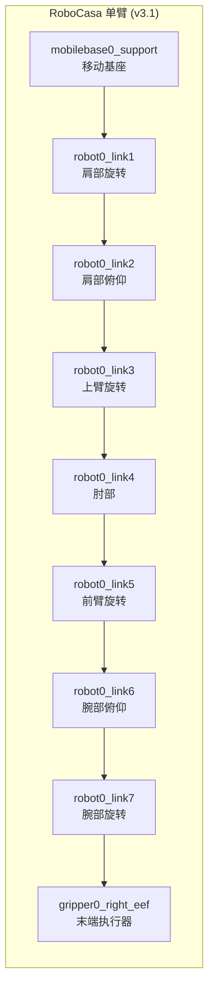
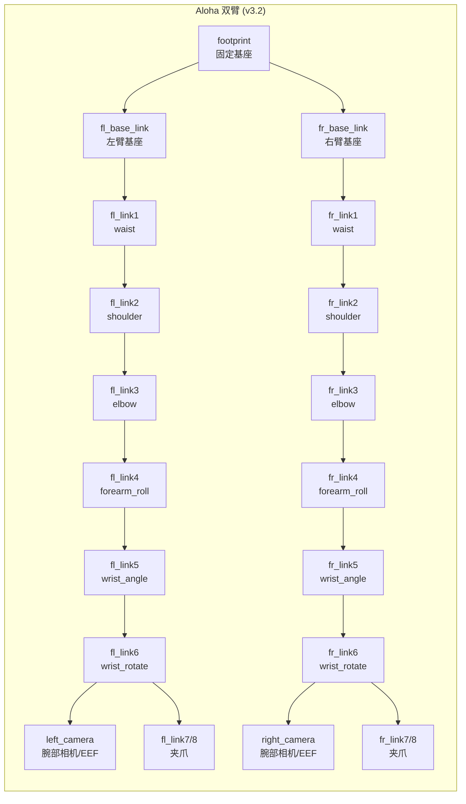
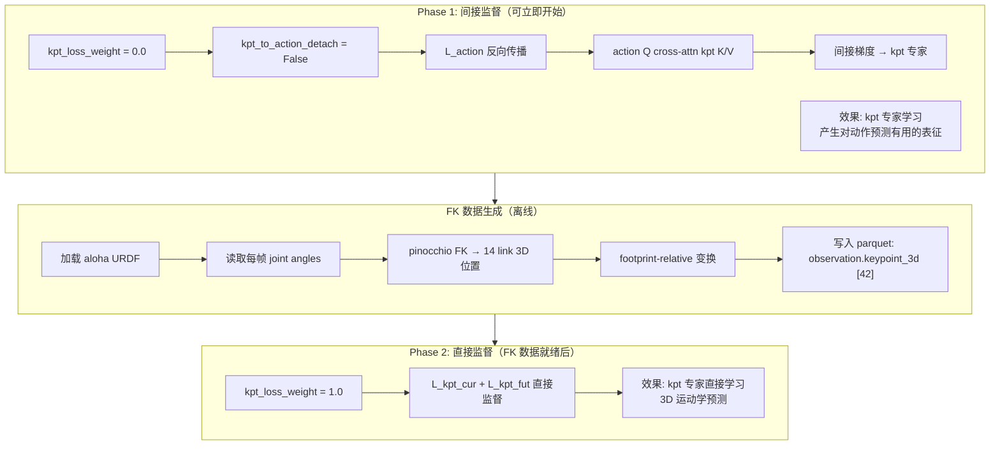
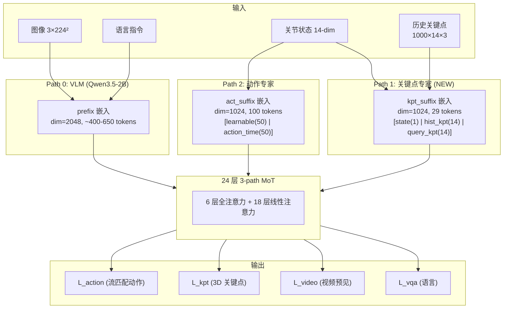
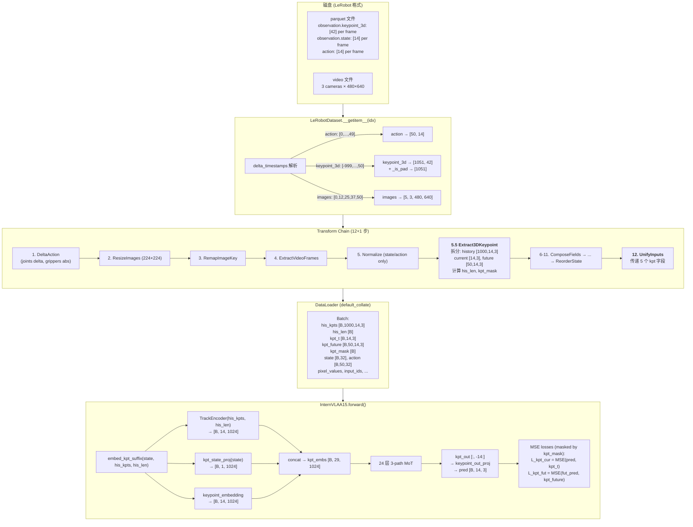
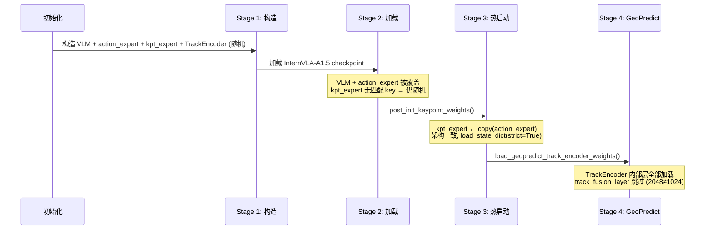
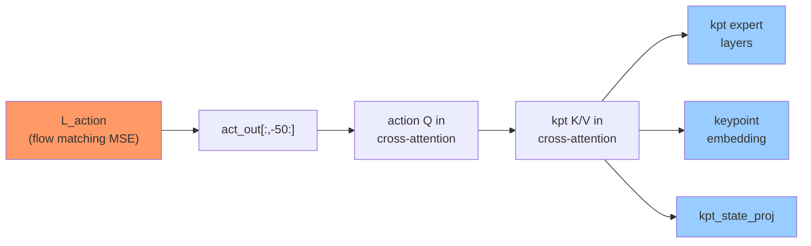
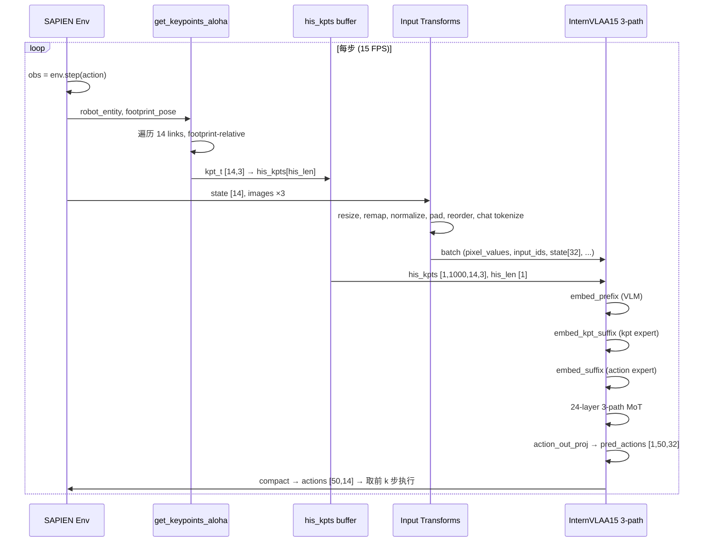

# InternVLA-A1.5 + GeoPredict 3D 关键点轨迹预测器融合方案 v3.2 — RoboTwin Aloha 双臂适配版

> **基于**：[v3.1 三路径 MoT 通用方案](itrnVLA15_GeoP_3dtrj_3cn2.md)（4148 行）
>
> **适配目标**：RoboTwin 2.0 `stack_bowls_three` 数据集（aloha 双臂固定底座机器人，SAPIEN 仿真器）
>
> **核心变更**：将原方案从单臂 RoboCasa 移动机器人 (MuJoCo, J=8, state=8-dim EEF pose) 适配到 aloha 双臂固定基座 (SAPIEN, J=14, state=14-dim joint angles)
>
> **本文档性质**：设计方案，不含实际代码实现。代码实现参照本文和 v3.1 方案。

---

## 目录

0. [文档说明与变更摘要](#0-文档说明与变更摘要)
1. [兼容性深度分析](#1-兼容性深度分析)
2. [适配设计决策](#2-适配设计决策)
3. [适配后的架构](#3-适配后的架构)
4. [关键点数据管道](#4-关键点数据管道)
5. [模型修改](#5-模型修改)
6. [权重初始化](#6-权重初始化)
7. [SAPIEN 关键点提取（推理时）](#7-sapien-关键点提取推理时)
8. [训练策略与配置](#8-训练策略与配置)
9. [评测兼容性](#9-评测兼容性)
10. [与原方案 v3.1 的完整差异对照表](#10-与原方案-v31-的完整差异对照表)
11. [代码修改清单](#11-代码修改清单)
12. [附录](#12-附录)

---

## 0. 文档说明与变更摘要

### 0.1 与原方案 v3.1 的关系

v3.1 方案（[itrnVLA15_GeoP_3dtrj_3cn2.md](itrnVLA15_GeoP_3dtrj_3cn2.md)）定义了三路径 MoT 架构（VLM + 关键点专家 + 动作专家）的**通用设计**，但其中所有具体示例、关键点定义、FK 函数和数据管道均基于 **RoboCasa 单臂移动机器人**（MuJoCo 仿真器，7-DOF 臂 + EEF = 8 关键点，EEF pose 8-dim 状态）。

本文档 v3.2 是 v3.1 的**数据集适配版**，将通用设计落地到具体的 RoboTwin `stack_bowls_three` 数据集。**不改变 v3.1 的架构原理**（三路径 MoT、交叉注意力、知识绝缘、流匹配），只改变与数据集/机器人相关的具体参数和实现。

### 0.2 目标数据集: stack_bowls_three

| 属性 | 值 | 来源 |
|:-----|:---|:-----|
| 数据集路径 | `/mnt/r/DATA/RoboTwin-Clean/stack_bowls_three/` | 本地 |
| LeRobot 格式 | v3.0 | `meta/info.json` |
| 机器人类型 | `aloha`（双臂固定基座） | `robot_type` 字段 |
| 仿真器 | SAPIEN（RoboTwin 2.0） | 数据采集环境 |
| URDF | `arx5_description_isaac.urdf`（aloha-agilex） | [RoboTwin assets](file:///mnt/r/share/zwy/Projects/RoboTwin/assets/embodiments/aloha-agilex/urdf/) |
| Episode 数 | 50 | `total_episodes` |
| 总帧数 | 23,550 | `total_frames` |
| 平均帧/Episode | 471 | 计算 |
| FPS | 15 | `fps` |
| `observation.state` | float32, shape `[14]` | 左6关节+左夹爪+右6关节+右夹爪 |
| `action` | float32, shape `[14]` | 同 state 布局 |
| 相机 | 3 路: `cam_high`, `cam_left_wrist`, `cam_right_wrist` | 480×640, AV1 |
| **3D 关键点** | **无** | 无 `observation.keypoint_3d` 列 |
| 深度图 | **无** | `video.is_depth_map: false` |

### 0.3 关键变更摘要

| 维度 | v3.1 (RoboCasa 单臂) | **v3.2 (Aloha 双臂)** | 变更类型 |
|:-----|:-----|:-----|:---:|
| 关键点数 J | 8 | **14** (7 per arm) | 参数 |
| 关键点 link 名称 | `robot0_link1-7` + `gripper0_right_eef` | `fl_link1-6` + `left_camera` + `fr_link1-6` + `right_camera` | 重新定义 |
| kpt_suffix tokens | 17 = 1+8+8 | **29** = 1+14+14 | 参数 |
| 仿真器 API | MuJoCo `get_body_xpos()` | SAPIEN `find_link_by_name().get_pose().p` | 重写 |
| 坐标系 | 移动基座相对 + `ori_trans=[-0.5,-0.8,0]` | footprint-relative (无 ori_trans) | 重新定义 |
| 状态维度 | 8 (EEF pose) | 14 (joint angles) | 数据 |
| 动作维度 | 12 (单臂 OSC) | 14 (双臂 joint) → reorder→16 → pad→32 | 数据 |
| 关键点数据 | 假设有 `observation.keypoint_3d` | **无 GT → 两阶段策略** | 策略 |
| Parquet 形状 | `[24]` = 8×3 | `[42]` = 14×3 | 参数 |
| `keypoint_embedding` | `nn.Embedding(8, 1024)` | `nn.Embedding(14, 1024)` | 参数 |
| 完整序列长度 | P + 117 | **P + 129** | 参数 |

---

## 1. 兼容性深度分析

本章逐项分析 v3.1 方案与 `stack_bowls_three` 数据集的不兼容之处，每项附代码级证据。

### 1.1 机器人结构对比

#### 1.1.1 运动学结构





**URDF 来源**：[`/mnt/r/share/zwy/Projects/RoboTwin/assets/embodiments/aloha-agilex/urdf/arx5_description_isaac.urdf`](file:///mnt/r/share/zwy/Projects/RoboTwin/assets/embodiments/aloha-agilex/urdf/arx5_description_isaac.urdf)

**关键差异**：
- RoboCasa 单臂有 7 个旋转关节（`link1`-`link7`），aloha 每臂仅 6 个（`link1`-`link6`）
- RoboCasa 有独立的 EEF body (`gripper0_right_eef`)，aloha 的 EEF 实际是 `fl_link6` 的子 link（腕部相机 `left_camera` 附在 `fl_link6` 上，偏移 xyz="0.07 0.032 0.065"）
- aloha 是双臂，两条臂结构相同但前缀不同（`fl_` vs `fr_`）

#### 1.1.2 URDF Link/Joint 完整映射

来自 URDF 和 [`config.yml`](file:///mnt/r/share/zwy/Projects/RoboTwin/assets/embodiments/aloha-agilex/config.yml)（lines 7-20）：

```yaml
arm_joints_name: [
  ["fl_joint1","fl_joint2","fl_joint3","fl_joint4","fl_joint5","fl_joint6"],
  ["fr_joint1","fr_joint2","fr_joint3","fr_joint4","fr_joint5","fr_joint6"]
]
ee_joints: ["fl_joint6", "fr_joint6"]
move_group: ["fl_link6","fr_link6"]
gripper_name:
  - base: "fl_joint7"
    mimic: [["fl_joint8", 1., 0.]]
  - base: "fr_joint7"
    mimic: [["fr_joint8", 1., 0.]]
robot_pose: [[0, -0.65, 0.0, 0.707, 0, 0, 0.707]]   # 90° Z-rotation
global_trans_matrix: [[1,0,0],[0,-1,0],[0,0,-1]]
```

左臂 link/joint 映射（URDF 行号参考）：

| Joint | Type | Parent → Child | Origin (xyz) |
|:------|:-----|:------|:-------------|
| `fl_base_joint` | fixed | `footprint` → `fl_base_link` | `0.2305, 0.297, 0.782` |
| `fl_joint1` | revolute (Z) | `fl_base_link` → `fl_link1` | `0, 0, 0.058` |
| `fl_joint2` | revolute (Y) | `fl_link1` → `fl_link2` | `0.025, 0.001, 0.042` |
| `fl_joint3` | revolute (Y) | `fl_link2` → `fl_link3` | `-0.264, 0.004, 0` |
| `fl_joint4` | revolute (Y) | `fl_link3` → `fl_link4` | `0.246, 0, -0.06` |
| `fl_joint5` | revolute (Z) | `fl_link4` → `fl_link5` | `0.068, 0.002, -0.086` |
| `fl_joint6` | revolute (X) | `fl_link5` → `fl_link6` | `0.031, 0, 0.086` |
| `fl_joint7` | prismatic (Y) | `fl_link6` → `fl_link7` | 夹爪手指 1 |
| `fl_joint8` | prismatic (-Y) | `fl_link6` → `fl_link8` | 夹爪手指 2 (mimic) |
| `left_camera_joint` | fixed | `fl_link6` → `left_camera` | `0.07, 0.032, 0.065` |

右臂相同结构，前缀 `fr_`，基座偏移 `0.2315, -0.3063, 0.781`。

#### 1.1.3 状态语义差异

| 维度 | v3.1 (RoboCasa) | v3.2 (aloha) |
|:-----|:------|:------|
| 总维度 | 8 | 14 |
| 含义 | EEF pos(3) + axisangle(3) + gripper_qpos(2) | left_j1-j6(6) + left_grip(1) + right_j1-j6(6) + right_grip(1) |
| 来源 | `obs["robot0_eef_pos"]` + `_quat2axisangle(obs["robot0_eef_quat"])` + `obs["robot0_gripper_qpos"]` | `observation["joint_action"]["vector"]` (14-dim) |
| 物理单位 | 米 + 弧度 + 归一化 | 弧度 + 归一化 |
| FK 关系 | 不是 FK 直接输入（EEF pose 是 FK 的输出） | **是 FK 的直接输入**（关节角 → 各 link 3D 位置） |

**关键发现**：aloha 的 state 本身就是 joint angles，这是 FK 的**直接输入**。相比 RoboCasa（state = EEF pose，需要模拟器的 `get_body_xpos()` 获取中间 link 位置），aloha 可以直接通过 URDF + joint angles 计算所有 link 的 3D 位置。这使得**离线 FK 生成关键点数据**成为可能且高效。

**对 `kpt_state_proj: Linear(32, 1024)` 的影响**：该投影层的输入语义从 EEF pose 变为 joint angles。虽然维度不变（始终 32-dim padded），但投影需要学习的映射完全不同。GeoPredict 原始的 state 投影权重（为 EEF pose 训练的）不适用于 joint angles——但我们设计中 `kpt_state_proj` 是随机初始化的（非 GeoPredict 权重），因此不受影响。

### 1.2 仿真器 API 对比

| 操作 | v3.1 (MuJoCo) | v3.2 (SAPIEN) |
|:-----|:------|:------|
| 获取 link 位置 | `env.sim.data.get_body_xpos("robot0_link1")` → `[3]` world pos | `entity.find_link_by_name("fl_link1").get_pose().p` → `[3]` world pos |
| 获取基座姿态 | `body_id = env.sim.model.body_name2id("mobilebase0_support")`; `body_pos = env.sim.data.xpos[body_id]`; `body_rot = env.sim.data.xmat[body_id].reshape(3,3)` | `footprint = entity.find_link_by_name("footprint")`; `pose = footprint.get_pose()` → `.p` (pos) + `.q` (quat wxyz) |
| 获取关节角 | `obs["robot0_eef_pos"]` 等（非直接关节角） | `entity.get_qpos()` → 完整关节配置向量 |
| 驱动目标 | N/A | `joint.get_drive_target()[0]` → 单关节驱动目标值 |

**代码来源**：
- MuJoCo 版: [`GeoPredict/tools/test_robocasa.py:180-194`](../../GeoPredict/tools/test_robocasa.py#L180-L194)
- SAPIEN 版: [`RoboTwin/envs/robot/robot.py:198,248,366,571`](file:///mnt/r/share/zwy/Projects/RoboTwin/envs/robot/robot.py)

**GeoPredict 原始 `get_keypoints()`** (MuJoCo):

```python
def get_keypoints(env, body_pos, body_rot):
    ori_trans = np.array([-0.5, -0.8, -0.0], dtype=np.float32)
    keypoint = None
    for j in range(1, 9):
        pos_name = "gripper0_right_eef" if j == 8 else f"robot0_link{j}"
        pos = env.sim.data.get_body_xpos(pos_name)       # MuJoCo world pos
        pos = body_rot.T @ (pos - body_pos)                # → base-relative
        pos = pos - ori_trans                               # → 中心化
        if keypoint is None: keypoint = pos
        else: keypoint = np.hstack((keypoint, pos))
    return keypoint.reshape(8, 3)
```

此函数在 v3.2 中需**完全重写**为 SAPIEN 版本（见 §7）。

### 1.3 数据集对比

| 特征 | v3.1 假设 (RoboCasa GeoPredict) | stack_bowls_three 实际 |
|:-----|:------|:------|
| `observation.state` | `[8]` EEF pose | `[14]` joint angles |
| `action` | `[12]` OSC 控制 | `[14]` joint control |
| `observation.keypoint_3d` | `[24]` = 8×3 展平 | **不存在** |
| 深度图 | 有 (left_depth, right_depth) | **无** |
| 相机数 | 3 (left, right, wrist) | 3 (cam_high, cam_left_wrist, cam_right_wrist) |
| 格式 | GeoPredict 自定义 (.npy) | LeRobot v3.0 (parquet + mp4) |

v3.1 的数据流图（§15.11, line 2757）标注 `observation.state: [8]` 和 `action: [12]`，与 aloha 的 `[14]` 和 `[14]` 不符。v3.2 需更新所有此类维度标注。

### 1.4 维度流追踪（端到端）

#### State 流

```
observation.state: [14]                    ← 数据集 parquet
  ↓ PadStateAndActionTransformFn
observation.state: [32]                    ← 右侧零填充 (dim 14-31 = 0)
  ↓ ReorderStateActionTransform (aloha.yaml state_reorder)
observation.state: [32]                    ← 重排后布局:
                                              [0-5]: left_joints (6)
                                              [6]:   0 (gap)
                                              [7]:   left_gripper (1)
                                              [8-13]: right_joints (6)
                                              [14]:  0 (gap)
                                              [15]:  right_gripper (1)
                                              [16-31]: 0 (padding)
  ↓ _encode_state (tokenize_state=True 时)
"State: 118 200 195 72 135 113 128 255 ..."   ← /3 然后 256-bin 离散化
                                              14 个有效值 + 18 个 128 (零→中间 bin)
  ↓ InternVLAA15ChatProcessorTransformFn
→ 嵌入 user_text → Qwen3.5 tokenizer → input_ids [650]

  同时 (tokenize_state=True 模式下):
  ↓ kpt_state_proj: Linear(32, 1024)           ← kpt 专家独立的 state 投影
→ [B, 1, 1024]                                 ← kpt_suffix 的第一个 token
```

**注意**：当 `tokenize_state=True`（默认），动作专家的 `state_proj` 不被创建（[`modeling_internvla_a1_5.py:561`](src/lerobot/policies/internvla_a1_5/modeling_internvla_a1_5.py#L561)），动作专家 suffix 不含 state token。但 **kpt 专家始终包含 state token**（不受 `tokenize_state` 影响），因为 joint angles 对 FK/关键点预测至关重要。

#### State 离散化精度分析

`_encode_state`（[`transform_internvla_a1_5.py:100`](src/lerobot/policies/internvla_a1_5/transform_internvla_a1_5.py#L100)）硬编码 `/3` 缩放：

```python
state_np = state.cpu().numpy() / 3    # 硬编码，不可配
discretized = np.digitize(state_np, bins=np.linspace(-1, 1, 257)[:-1]) - 1
```

Aloha 关节角范围（来自 `stats.json`）：

| 关节 | min | max | /3 后 min | /3 后 max | 是否越界 |
|:-----|:---:|:---:|:---:|:---:|:---:|
| left_waist | -1.26 | 2.50 | -0.42 | 0.83 | 正常 |
| left_shoulder | -0.74 | 1.86 | -0.25 | 0.62 | 正常 |
| left_elbow | -1.55 | 2.93 | -0.52 | 0.98 | 正常 |
| left_forearm_roll | -1.99 | 2.22 | -0.66 | 0.74 | 正常 |
| left_wrist_angle | -1.65 | 2.49 | -0.55 | 0.83 | 正常 |
| left_wrist_rotate | -1.81 | 2.34 | -0.60 | 0.78 | 正常 |
| left_gripper | 0.0 | 1.0 | 0.0 | 0.33 | 正常 |
| right_elbow | -1.45 | **3.66** | -0.48 | **1.22** | **越界→bin 255** |
| right_gripper | 0.0 | 1.0 | 0.0 | 0.33 | 正常 |

**结论**：`right_elbow` 最大值 3.66 经 `/3` 后为 1.22，超出 [-1, 1] 区间 → 截断到 bin 255。精度损失约 22% 的范围。**这不是阻断性问题**：(1) 状态已通过 `kpt_state_proj` 以连续值形式单独送入 kpt 专家，不受离散化影响；(2) VLM 的离散化 state 仅用于辅助理解，少量截断可接受。

#### Action 流

```
action: [50, 14]                           ← 数据集 (chunk_size=50 future steps)
  ↓ DeltaActionTransformFn
action: [50, 14]                           ← 关节维度 delta (减 state), 夹爪维度 abs
                                              mask = [T,T,T,T,T,T, F, T,T,T,T,T,T, F]
  ↓ NormalizeTransformFn (mean_std)
action: [50, 14]                           ← z-score 归一化
  ↓ PadStateAndActionTransformFn
action: [50, 32]                           ← 零填充
  ↓ ReorderStateActionTransform
action: [50, 32]                           ← 重排: 同 state 布局
  ↓ flow matching (model.forward)
noise ~ N(0,I), t ~ Beta(1.5, 1)
x_t = t·noise + (1-t)·actions             ← [B, 50, 32]
u_t = noise - actions                      ← [B, 50, 32] 速度目标
  ↓ action_in_proj: Linear(32, 1024)
→ [B, 50, 1024]                            ← 进入动作专家
  ↓ 24 层 MoT → action_out_proj: Linear(1024, 32)
→ pred_vel [B, 50, 32]                    ← 预测速度
  ↓ compact_reordered_dual_arm_actions (推理时)
→ action [50, 14]                          ← 取 indices [0:6, 7, 8:14, 15] → 14 dim
```

**结论**：action 的 pad/reorder/compact 管道已存在于 InternVLA-A1.5，完全兼容双臂 aloha，**无需架构改动**。

### 1.5 完整兼容性问题清单

| # | 类别 | 问题 | 严重程度 | v3.2 解决方案 | 详见 |
|:--:|:---:|:-----|:---:|:------|:---:|
| 1 | 结构 | 单臂 J=8 → 双臂 J=14 | **高** | `num_keypoint_joints=14` | §2.1 |
| 2 | 结构 | 状态语义: EEF pose → joint angles | 中 | `kpt_state_proj` 随机初始化，自动适应 | §5.3 |
| 3 | 结构 | 动作维度: 12 → 14 | 低 | 已被 pad/reorder 管道处理 | §1.4 |
| 4 | 结构 | 坐标系: 移动基座+offset → 固定基座 | 中 | footprint-relative，无 `ori_trans` | §2.2 |
| 5 | API | MuJoCo `get_body_xpos` → SAPIEN `get_pose().p` | **高** | 重写 `get_keypoints_aloha()` | §7.1 |
| 6 | API | Link 名称不同 | **高** | `fl_link1-6+left_camera` / `fr_link1-6+right_camera` | §2.1 |
| 7 | 数据 | 无 `observation.keypoint_3d` | **高** | 两阶段策略: Phase 1 间接监督 + Phase 2 FK 生成 | §2.3 |
| 8 | 数据 | 数据流图维度错误 | 低 | 更新所有维度标注 | §1.4 |
| 9 | 数据 | 状态离散化 `/3` 精度 | 低 | 不修改（22% 范围截断可接受） | §1.4 |
| 10 | 维度 | kpt_suffix: 17 → 29 tokens | 中 | 自动适配 (config-driven) | §3.2 |
| 11 | 维度 | `keypoint_embedding`: 8 → 14 | 中 | Xavier 重新初始化 | §6.3 |
| 12 | 维度 | Parquet 形状: `[24]` → `[42]` | 中 | FK 生成时使用正确形状 | §4.2 |
| 13 | 推理 | `inference.py` 不提供 `his_kpts` | 中 | 添加 SAPIEN FK 实时累积 | §7.3 |
| 14 | 推理 | `get_keypoints()` 需完全重写 | **高** | 新函数 `get_keypoints_aloha()` | §7.1 |

---

## 2. 适配设计决策

### 2.1 关键点数量: J=14

#### 2.1.1 方案对比

| 方案 | J | 每臂点数 | kpt_suffix | 显存增量 | 优势 | 劣势 |
|:-----|:--:|:---:|:---:|:---:|:------|:------|
| **A: 完整双臂** | **14** | **7** | **29** | +12 tokens/sample | 完整运动链覆盖，类比 GeoPredict 7+1 设计 | suffix 较长 |
| B: 精简双臂 | 12 | 6 | 25 | +8 tokens/sample | 去掉 EEF token 简化 | 缺少末端信息 |
| C: 匹配原方案 | 8 | 4 | 17 | +0 | token 数不变 | 每臂仅 4 点，丢失运动链信息 |

**选择方案 A (J=14)**，理由：

1. **类比一致性**：GeoPredict 对 RoboCasa 7-DOF 臂用 8 点（7 links + 1 EEF）。Aloha 6-DOF 臂用 7 点（6 links + 1 EEF），双臂 = 14。每臂的"关节数+EEF"覆盖方式完全一致。

2. **TrackEncoder 无限制**：TrackEncoder 在 [`keypoints.py:192`](../../GeoPredict/models/keypoints.py#L192) 的 `for point_idx in range(num_points)` 循环中动态获取 `num_points = patches.size(2)`，处理 14 个关节与处理 8 个完全一致——只是循环多走 6 次。所有内部层（`query_dim=512`）不依赖 J。

3. **Config-driven 适配**：模型代码中所有 J 引用均读取 `self.config.num_keypoint_joints`（[fusion doc §14.1, line 1880](itrnVLA15_GeoP_3dtrj_3cn2.md#L1880)）。只需改一个配置字段。

4. **显存可控**：kpt_suffix 从 17 增到 29（+12 tokens），在总序列 P+129 ≈ 530-780 中占比约 2%。以 `kpt_expert_hidden_size=1024` 计，额外激活显存 ≈ 12 × 1024 × 4 bytes × B = 48KB/sample（极小）。

#### 2.1.2 双臂关键点映射表

14 个关键点按序排列，前 7 个为左臂，后 7 个为右臂：

| 序号 i | URDF Link | SAPIEN 查询名 | 物理含义 | URDF 关节 |
|:--:|:---|:---|:---|:---|
| 0 | `fl_link1` | `"fl_link1"` | 左臂 waist 旋转 | `fl_joint1` (revolute Z) |
| 1 | `fl_link2` | `"fl_link2"` | 左臂 shoulder 俯仰 | `fl_joint2` (revolute Y) |
| 2 | `fl_link3` | `"fl_link3"` | 左臂 elbow | `fl_joint3` (revolute Y) |
| 3 | `fl_link4` | `"fl_link4"` | 左臂 forearm roll | `fl_joint4` (revolute Y) |
| 4 | `fl_link5` | `"fl_link5"` | 左臂 wrist angle | `fl_joint5` (revolute Z) |
| 5 | `fl_link6` | `"fl_link6"` | 左臂 wrist rotate / EE base | `fl_joint6` (revolute X) |
| 6 | `left_camera` | `"left_camera"` | 左臂末端执行器 (腕部相机) | fixed on `fl_link6` |
| 7 | `fr_link1` | `"fr_link1"` | 右臂 waist 旋转 | `fr_joint1` (revolute Z) |
| 8 | `fr_link2` | `"fr_link2"` | 右臂 shoulder 俯仰 | `fr_joint2` (revolute Y) |
| 9 | `fr_link3` | `"fr_link3"` | 右臂 elbow | `fr_joint3` (revolute Y) |
| 10 | `fr_link4` | `"fr_link4"` | 右臂 forearm roll | `fr_joint4` (revolute Y) |
| 11 | `fr_link5` | `"fr_link5"` | 右臂 wrist angle | `fr_joint5` (revolute Z) |
| 12 | `fr_link6` | `"fr_link6"` | 右臂 wrist rotate / EE base | `fr_joint6` (revolute X) |
| 13 | `right_camera` | `"right_camera"` | 右臂末端执行器 (腕部相机) | fixed on `fr_link6` |

### 2.2 坐标系: footprint-relative

#### 2.2.1 坐标变换公式

RoboTwin 中 aloha 机器人通过 URDF 根 link `footprint` 放置于场景中，场景放置姿态由 `config.yml` 的 `robot_pose` 定义：

```yaml
robot_pose: [[0, -0.65, 0.0, 0.707, 0, 0, 0.707]]   # x, y, z, qw, qx, qy, qz
```

这表示机器人放置在世界坐标 $(0, -0.65, 0)$，绕 Z 轴旋转 90°。

**footprint-relative 变换**：

$$\mathbf{p}_{rel} = \mathbf{R}_{fp}^{-1} \cdot (\mathbf{p}_{world} - \mathbf{t}_{fp})$$

其中：
- $\mathbf{p}_{world}$: link 在 SAPIEN 世界坐标系中的位置 (`link.get_pose().p`)
- $\mathbf{t}_{fp}$: `footprint` link 的世界坐标位置
- $\mathbf{R}_{fp}$: `footprint` link 的世界坐标旋转矩阵（从 quaternion 转换）

#### 2.2.2 与 GeoPredict 的对比

| 维度 | GeoPredict (RoboCasa) | v3.2 (aloha) |
|:-----|:------|:------|
| 参考 link | `mobilebase0_support` | `footprint` |
| 额外偏移 | `ori_trans = [-0.5, -0.8, 0.0]` | 无（直接 footprint-relative） |
| 基座运动 | 移动基座 → 每帧变化 | 固定基座 → 全 episode 恒定 |
| 坐标范围 | 约 $[-1.5, 1.5]$ 米（受臂展限制） | 约 $[-0.5, 1.0]$ 米（受臂展和基座偏移限制） |

**aloha 不需要 `ori_trans`**：

- RoboCasa 的 `ori_trans = [-0.5, -0.8, 0.0]` 是为了将移动基座的工作空间居中化（因为基座位置可能变化）
- Aloha 的固定基座意味着所有关键点坐标自然有界。从 `footprint` 到各 link 的偏移已在 URDF 中定义，不需额外平移
- 如果需要归一化，可以通过 kpt_loss_weight 或未来的 z-score 归一化处理

### 2.3 训练策略: 两阶段

#### 2.3.1 为什么需要两阶段

`stack_bowls_three` 数据集**没有**3D 关键点标注（无 `observation.keypoint_3d` 列）。但它**有**joint angles（`observation.state`），可以通过 FK 计算关键点。因此策略分两阶段：



#### 2.3.2 Aloha 的 FK 优势

| 对比 | RoboCasa (v3.1) | Aloha (v3.2) |
|:-----|:------|:------|
| State → FK 可行性 | 不可行（state = EEF pose，非关节角） | **可行**（state = joint angles = FK 输入） |
| 关键点获取方式 | 必须运行 MuJoCo 模拟器 | 纯数学计算（URDF + joint angles） |
| 离线生成 | 需要 `robocasa` + `robosuite` 环境 | 仅需 `pinocchio` + URDF 文件 |
| 精度 | 模拟器精确值 | FK 精确值（与模拟器等价） |

#### 2.3.3 Phase 1 间接梯度路径分析

当 `kpt_loss_weight=0.0` 且 `kpt_to_action_detach=False`：

$$\frac{\partial \mathcal{L}_{action}}{\partial \theta_{kpt}} = \frac{\partial \mathcal{L}_{action}}{\partial \mathbf{v}_{action}} \cdot \frac{\partial \mathbf{v}_{action}}{\partial \mathbf{Q}_{action}} \cdot \frac{\partial \mathbf{Q}_{action}}{\partial (\mathbf{K}_{kpt}, \mathbf{V}_{kpt})} \cdot \frac{\partial (\mathbf{K}_{kpt}, \mathbf{V}_{kpt})}{\partial \theta_{kpt}}$$

其中：
- $\mathbf{v}_{action}$: 动作专家的预测速度
- $\mathbf{Q}_{action}$: 动作专家在全注意力层对 kpt 路径的 query
- $\mathbf{K}_{kpt}, \mathbf{V}_{kpt}$: kpt 专家提供给动作专家的 key/value
- $\theta_{kpt}$: kpt 专家的参数

这条间接路径使 kpt 专家被"拉向"产生对动作预测有用的 K/V 表征，虽然梯度信号较弱，但足以启动 kpt 专家的表征学习。

### 2.4 推理策略: SAPIEN FK 实时提取

推理时的 RoboTwin 环境提供 SAPIEN API，可以在每步 action 执行后直接查询所有 link 的 3D 位置：

```
每步推理循环:
  1. 执行 action → env.step(action)
  2. 获取 observation（含 joint_action, cameras）
  3. 调用 get_keypoints_aloha(env) → kpt_t [14, 3]
  4. 追加 kpt_t 到 his_kpts buffer [1000, 14, 3]
  5. 模型推理: infer(state, images, his_kpts, his_len, ...) → next action chunk
```

修改 [`inference.py`](evaluation/RoboTwin/inference.py) 添加 `get_keypoints_aloha()` 函数和历史缓冲区管理。详见 §7。

---

## 3. 适配后的架构

### 3.1 三路径 MoT 总览

架构原理与 v3.1 完全一致，仅关键点路径的参数改变：



| 路径 | 功能 | 维度 | Token 数 | 层数 | **v3.2 变更** |
|:-----|:------|:---:|:---:|:---:|:------|
| Path 0: VLM | 视觉-语言理解 | 2048 | ~400-650 | 24 | 无变更 |
| Path 1: 关键点专家 | 3D 运动学预测 | 1024 | **29** | 24 | 从 17 → 29 tokens |
| Path 2: 动作专家 | 连续动作生成 | 1024 | 100/101 | 24 | 无变更 |

### 3.2 Token 布局

#### 3.2.1 Path 1 kpt_suffix（v3.2 适配版）

```
KPT_SUFFIX（始终 29 tokens, 不受 tokenize_state 影响）:
┌──────────────────────────────────────────────────────────────────────────────────────────────┐
│  状态(1)  │  历史关键点(14)                         │  查询关键点(14)                       │
│  att:[1]  │  att:[1,0,...,0] (14个,首位1后13个0)     │  att:[1,0,...,0] (14个,首位1后13个0)   │
│  cum:P+1  │  cum:P+2                                │  cum:P+3                              │
└──────────────────────────────────────────────────────────────────────────────────────────────┘

Token 说明:
- 状态 Token (1 个): 32-dim padded/reordered state → kpt_state_proj: Linear(32, 1024) → [B, 1, 1024]
- 历史关键点 Tokens (14 个): TrackEncoder(his_kpts [B,1000,14,3], his_len [B]) → [B, 14, 1024]
- 查询关键点 Tokens (14 个): nn.Embedding(14, 1024) → [B, 14, 1024]   可学习嵌入
```

**与 v3.1 的差异**：仅 Token 数量从 17 → 29，内部每个组件的生成逻辑不变。

#### 3.2.2 完整序列拼接

```
tokenize_state=True（默认）:
[PREFIX(P) | KPT_SUFFIX(29) | ACT_SUFFIX(100)]
总长度: P + 129

tokenize_state=False:
[PREFIX(P) | KPT_SUFFIX(29) | ACT_SUFFIX(101)]
总长度: P + 130

对比 v3.1:
tokenize_state=True: P + 117 → P + 129 (+12)
tokenize_state=False: P + 118 → P + 130 (+12)
```

### 3.3 注意力掩码

#### 3.3.1 cumsum 分析（v3.2 版）

```
位置:  [0  1  ...  P-1 | P  P+1 P+2..P+14 P+15..P+28 | P+29 .. P+78  P+79 .. P+128]
路径:  [←— PREFIX ——→   | ←———— KPT_SUFFIX (29) ————→  | ←——— ACT_SUFFIX (100) ————→]
att:   [1  1  ...  1    | 1   1   0×13      1    0×13   | 1     0×49    1     0×49     ]
cumsum:[1  2  ...  P    | P+1 P+2           P+3          | P+4          P+5              ]
        ↑                  ↑   ↑            ↑              ↑            ↑
     prefix tokens       kpt  hist_kpt    query_kpt      learnable   action
                        state  block       block          block       block
```

注意力规则与 v3.1 完全一致（因为 cumsum block 数量不变，只是 block 内 token 数不同）：

| Query 路径 | → Key 路径 | 可注意？ | 理由 |
|:-----------|:-----------|:--------:|:-----|
| VLM → 关键点专家 | **否** | cumsum_k ≥ P+1 > P ≥ cumsum_q |
| VLM → 动作专家 | **否** | cumsum_k ≥ P+4 > P ≥ cumsum_q |
| 关键点专家 → VLM | **是** | cumsum_k ≤ P < P+1 ≤ cumsum_q |
| 关键点专家 → 动作专家 | **否** | cumsum_k ≥ P+4 > P+3 ≥ cumsum_q |
| 动作专家 → VLM | **是** | cumsum_k ≤ P < P+4 ≤ cumsum_q |
| 动作专家 → 关键点专家 | **是** | cumsum_k ≤ P+3 < P+4 ≤ cumsum_q |

`make_att_2d_masks` 函数**无需修改**。

#### 3.3.2 2D 注意力矩阵可视化

```
          ┌────────────────────────────────────────────────────────────────────────┐
          │      PREFIX (P)      │   KPT (29)          │   ACT (100/101)          │
          │  img  | lang | state │ st|hist_kpt|qry_kpt │ (st)| learn |  action   │
          │       |      |       │   | (14)   | (14)   │     |       |           │
  ────────┼──────────────────────┼─────────────────────┼──────────────────────────┤
  PREFIX  │                      │                     │                          │
    img   │  因果（下三角）      │       ✗              │          ✗               │
    lang  │                      │                     │                          │
    state │                      │                     │                          │
  ────────┼──────────────────────┼─────────────────────┼──────────────────────────┤
  KPT     │                      │                     │                          │
    state │      全部 ✓          │  self                │          ✗               │
  hist(14)│      全部 ✓          │  st + bidir(14)      │          ✗               │
  qry(14) │      全部 ✓          │  全部 + bidir(14)    │          ✗               │
  ────────┼──────────────────────┼─────────────────────┼──────────────────────────┤
  ACT     │                      │                     │                          │
   (st)   │      全部 ✓          │   全部 ✓             │  self                    │
   learn  │      全部 ✓          │   全部 ✓             │  (st) + bidir            │
   action │      全部 ✓          │   全部 ✓             │  全部 + bidir            │
  ────────┴──────────────────────┴─────────────────────┴──────────────────────────┘
```

### 3.4 显存影响分析

J=14 vs J=8 的额外开销：

| 组件 | J=8 (v3.1) | J=14 (v3.2) | 增量 |
|:-----|:---:|:---:|:---:|
| kpt_suffix tokens/sample | 17 | 29 | +12 |
| `keypoint_embedding` 参数 | 8×1024 = 8K | 14×1024 = 14K | +6K params |
| `his_kpts` 每样本内存 | 1000×8×3×4 = 96 KB | 1000×14×3×4 = 168 KB | +72 KB |
| `kpt_future` 每样本内存 | 50×8×3×4 = 4.8 KB | 50×14×3×4 = 8.4 KB | +3.6 KB |
| 每层注意力激活 (Q/K/V) | 17×1024 = 17K | 29×1024 = 29K | +12K/layer |
| 24 层总增量 | - | - | ≈ +1.1 MB/sample (bf16) |
| **Batch=8 总增量** | - | - | **≈ 9 MB** |

**结论**：显存增量极小（<10MB），远低于 VLM prefix（~2GB）和 action expert（~1GB）。对 bs=8 的训练配置无影响。

---

## 4. 关键点数据管道

### 4.1 FK 生成方案（离线）

#### 4.1.1 为什么选择离线 FK

| 方案 | 优势 | 劣势 |
|:-----|:------|:------|
| **离线 FK 生成**（推荐） | 一次计算，永久复用；训练时零额外开销；与 LeRobot delta_timestamps 无缝集成 | 需要预处理脚本；修改数据集 |
| 在线 FK (DataTransformFn) | 不修改数据集 | 每个 worker 加载 URDF；FK 计算延长数据加载；与 delta_timestamps 不兼容（只能处理单帧） |
| SAPIEN 模拟器回放 | 精确一致 | 需要完整 RoboTwin 环境；速度极慢 |

#### 4.1.2 FK 计算流程

```python
import pinocchio as pin
import numpy as np

ALOHA_URDF = "/mnt/r/share/zwy/Projects/RoboTwin/assets/embodiments/aloha-agilex/urdf/arx5_description_isaac.urdf"

KEYPOINT_LINKS = [
    # 左臂 7 个
    "fl_link1", "fl_link2", "fl_link3", "fl_link4", "fl_link5", "fl_link6", "left_camera",
    # 右臂 7 个
    "fr_link1", "fr_link2", "fr_link3", "fr_link4", "fr_link5", "fr_link6", "right_camera",
]

def compute_fk_keypoints(joint_angles_14, model, data, frame_ids, fp_placement):
    """从 14-dim 关节角计算 14 个关键点的 footprint-relative 3D 位置。
    
    Args:
        joint_angles_14: [14] — [left_j1-j6, left_grip, right_j1-j6, right_grip]
        model: pinocchio model (从 URDF 加载)
        data: pinocchio data
        frame_ids: list[int], 14 个 frame ID (预计算)
        fp_placement: footprint link 的 SE3 变换 (预计算)
    Returns:
        keypoints: [14, 3] — footprint-relative 坐标
    """
    # 构建 pinocchio 关节配置向量
    # 注意: URDF 中的 joint 顺序可能与 state 的 14-dim 布局不同
    # 需要根据 URDF 的 joint 索引映射
    q = np.zeros(model.nq)
    # 映射 joint_angles_14 到 pinocchio 的 q 向量
    # left arm: joint_angles_14[0:6] → q 中对应 fl_joint1-6 的索引
    # left gripper: joint_angles_14[6] → q 中对应 fl_joint7 的索引
    # right arm: joint_angles_14[7:13] → q 中对应 fr_joint1-6 的索引
    # right gripper: joint_angles_14[13] → q 中对应 fr_joint7 的索引
    # (具体映射需根据 URDF 的 joint 排列确定)
    
    pin.forwardKinematics(model, data, q)
    pin.updateFramePlacements(model, data)
    
    keypoints = np.zeros((14, 3), dtype=np.float32)
    fp_inv = fp_placement.inverse()  # footprint 的逆变换
    
    for i, fid in enumerate(frame_ids):
        world_placement = data.oMf[fid]              # SE3: world → frame
        rel_placement = fp_inv * world_placement      # SE3: footprint → frame
        keypoints[i] = rel_placement.translation      # [3] footprint-relative 位置
    
    return keypoints
```

#### 4.1.3 URDF Joint 映射注意事项

aloha URDF 定义了整个平台（含 4 条臂 + 底座），pinocchio 加载后的 joint 索引顺序由 URDF 中的 `<joint>` 出现顺序决定。实际映射需要在脚本中通过 `model.getJointId("fl_joint1")` 等 API 确定每个 joint 在 `q` 向量中的位置。

**关键对应关系**：
- `observation.state[0:6]` = `[fl_joint1, ..., fl_joint6]` 的驱动目标值
- `observation.state[6]` = `fl_joint7` (left gripper) 的值
- `observation.state[7:13]` = `[fr_joint1, ..., fr_joint6]` 的驱动目标值
- `observation.state[13]` = `fr_joint7` (right gripper) 的值

来源：[`RoboTwin/envs/_base_task.py:485-494`](file:///mnt/r/share/zwy/Projects/RoboTwin/envs/_base_task.py) + [`RoboTwin/envs/robot/robot.py:494-506`](file:///mnt/r/share/zwy/Projects/RoboTwin/envs/robot/robot.py)

#### 4.1.4 批量处理脚本模板

```python
# generate_keypoints.py (模板, 非最终代码)
"""为 stack_bowls_three 数据集离线生成 3D 关键点标注。"""

import pinocchio as pin
import pandas as pd
import numpy as np
from pathlib import Path

DATASET_ROOT = Path("/mnt/r/DATA/RoboTwin-Clean/stack_bowls_three")
URDF_PATH = "/mnt/r/share/zwy/Projects/RoboTwin/assets/embodiments/aloha-agilex/urdf/arx5_description_isaac.urdf"
J = 14  # 关键点数

# 1. 加载 URDF 并预计算 frame IDs
model = pin.buildModelFromUrdf(URDF_PATH)
data = model.createData()
frame_ids = [model.getFrameId(name) for name in KEYPOINT_LINKS]
fp_frame_id = model.getFrameId("footprint")

# 2. 计算 footprint 的零配置位置 (固定基座，与 q 无关)
q_zero = np.zeros(model.nq)
pin.forwardKinematics(model, data, q_zero)
pin.updateFramePlacements(model, data)
fp_placement = data.oMf[fp_frame_id]

# 3. 遍历所有 parquet chunk，计算并添加关键点列
for chunk_file in sorted((DATASET_ROOT / "data").rglob("*.parquet")):
    df = pd.read_parquet(chunk_file)
    
    keypoints_list = []
    for _, row in df.iterrows():
        state = np.array(row["observation.state"], dtype=np.float64)
        kpts = compute_fk_keypoints(state, model, data, frame_ids, fp_placement)
        keypoints_list.append(kpts.flatten().tolist())  # [42]
    
    df["observation.keypoint_3d"] = keypoints_list
    df.to_parquet(chunk_file)  # 覆盖写入

# 4. 更新 info.json 添加 feature 声明
# (见 §4.2)
```

### 4.2 LeRobot 数据集格式扩展

#### 4.2.1 新增 Parquet 列

```
observation.keypoint_3d    dtype: float32    shape: [42]
```

$14 \times 3 = 42$ 个浮点数，按关键点序号展平：
```
[fl_link1_x, fl_link1_y, fl_link1_z,
 fl_link2_x, fl_link2_y, fl_link2_z,
 ...
 left_camera_x, left_camera_y, left_camera_z,
 fr_link1_x, fr_link1_y, fr_link1_z,
 ...
 right_camera_x, right_camera_y, right_camera_z]
```

#### 4.2.2 info.json features 声明

在 `meta/info.json` 的 `features` 字段中新增：

```json
{
  "observation.keypoint_3d": {
    "dtype": "float32",
    "shape": [42],
    "names": [
      "fl_link1_x", "fl_link1_y", "fl_link1_z",
      "fl_link2_x", "fl_link2_y", "fl_link2_z",
      "fl_link3_x", "fl_link3_y", "fl_link3_z",
      "fl_link4_x", "fl_link4_y", "fl_link4_z",
      "fl_link5_x", "fl_link5_y", "fl_link5_z",
      "fl_link6_x", "fl_link6_y", "fl_link6_z",
      "left_camera_x", "left_camera_y", "left_camera_z",
      "fr_link1_x", "fr_link1_y", "fr_link1_z",
      "fr_link2_x", "fr_link2_y", "fr_link2_z",
      "fr_link3_x", "fr_link3_y", "fr_link3_z",
      "fr_link4_x", "fr_link4_y", "fr_link4_z",
      "fr_link5_x", "fr_link5_y", "fr_link5_z",
      "fr_link6_x", "fr_link6_y", "fr_link6_z",
      "right_camera_x", "right_camera_y", "right_camera_z"
    ]
  }
}
```

### 4.3 delta_timestamps 集成

与 v3.1 §15.3 完全一致，仅 reshape 维度改变：

```python
@property
def keypoint_3d_delta_indices(self) -> list[int] | None:
    if not self.enable_keypoint_predictor:
        return None
    H = self.keypoint_history_max_len  # 1000
    C = self.chunk_size                # 50
    return list(range(-H + 1, C + 1))  # 1051 indices: [-999, ..., 0, ..., 50]
```

`__getitem__` 返回：
```
observation.keypoint_3d:          [1051, 42]   ← 时序堆叠
observation.keypoint_3d_is_pad:   [1051]       ← bool
```

### 4.4 Extract3DKeypointTransformFn 适配

**唯一改动**：`num_joints` 默认值 8 → 14，或通过 config 配置注入。

```python
@DataTransformFn.register_subclass("extract_3d_keypoint")
@dataclass
class Extract3DKeypointTransformFn(DataTransformFn):
    num_joints: int = 14          # v3.2: 14 for aloha dual-arm (was 8)
    history_max_len: int = 1000
    chunk_size: int = 50
    # ... 其余逻辑与 v3.1 §15.4 完全一致
```

拆分后的 v3.2 数据形状：

| 字段 | v3.1 Shape | **v3.2 Shape** | 说明 |
|:-----|:---:|:---:|:------|
| `observation.his_kpts` | `[1000, 8, 3]` | **`[1000, 14, 3]`** | 零填充历史 buffer |
| `observation.his_len` | scalar long | scalar long | 有效历史帧数 |
| `observation.kpt_t` | `[8, 3]` | **`[14, 3]`** | 当前帧关键点 |
| `observation.kpt_future` | `[50, 8, 3]` | **`[50, 14, 3]`** | 未来关键点轨迹 |
| `observation.kpt_mask` | scalar bool | scalar bool | 有效性掩码 |

### 4.5 UnifyInputs 更新

与 v3.1 §15.7 一致，传递 5 个 kpt 字段。VQA 样本的零填充中 J 改为 14：

```python
# VQA 样本零填充（v3.2 版）
H, J, C = 1000, 14, 50   # J: 8 → 14
result["observation.his_kpts"]   = torch.zeros(H, J, 3)
result["observation.his_len"]    = torch.tensor(0, dtype=torch.long)
result["observation.kpt_t"]      = torch.zeros(J, 3)
result["observation.kpt_future"] = torch.zeros(C, J, 3)
result["observation.kpt_mask"]   = torch.tensor(False)
```

### 4.6 Collation 形状表（J=14 版）

| 字段 | 样本 Shape | Batch Shape | 每样本大小 | Batch=8 大小 |
|:-----|:------|:------|:---:|:---:|
| `observation.his_kpts` | `[1000, 14, 3]` | `[B, 1000, 14, 3]` | 168 KB | 1.3 MB |
| `observation.his_len` | `[]` (scalar) | `[B]` | 8 B | 64 B |
| `observation.kpt_t` | `[14, 3]` | `[B, 14, 3]` | 168 B | 1.3 KB |
| `observation.kpt_future` | `[50, 14, 3]` | `[B, 50, 14, 3]` | 8.4 KB | 67 KB |
| `observation.kpt_mask` | `[]` (scalar) | `[B]` | 1 B | 8 B |
| **总计** | - | - | **~177 KB** | **~1.4 MB** |

对比 3 张 RGB 图像（~588 KB/sample）和 video_frames（~980 KB/sample），关键点数据的内存开销仍然极小。

### 4.7 完整端到端数据流图



---

## 5. 模型修改

### 5.1 配置字段更新

仅需修改一个配置字段：

```python
# InternVLAA15Config (v3.2 适配)
num_keypoint_joints: int = 14     # v3.1: 8 → v3.2: 14
```

所有其他配置字段**不变**：

```python
enable_keypoint_predictor: bool = False     # 启用时设为 True
kpt_loss_weight: float = 1.0               # Phase 1: 设为 0.0; Phase 2: 恢复
kpt_future_loss_weight: float = 1.0
kpt_expert_hidden_size: int = 1024
kpt_expert_intermediate_size: int = 3072
knowledge_insulation_kpt: bool = False
kpt_to_action_detach: bool = False          # Phase 1: 必须 False
ki_kpt_gradient_scale: float = 0.0
freeze_keypoint_modules: bool = False
vlm_lr_scale: float = 1.0
action_expert_lr_scale: float = 1.0
kpt_expert_lr_scale: float = 1.0
track_encoder_lr_scale: float = 1.0
init_kpt_expert_from_action: bool = True
geopredict_checkpoint_path: str | None = None
keypoint_track_input_dim: int = 3
keypoint_track_patch_size: int = 4
keypoint_track_embed_dim: int = 256
keypoint_track_query_dim: int = 512
keypoint_track_num_heads: int = 8
keypoint_track_ff_dim: int = 1024
keypoint_history_max_len: int = 1000
keypoint_noise_sigma: float = 0.0
```

### 5.2 embed_kpt_suffix 适配

`embed_kpt_suffix` 中所有 J 引用读取 `self.config.num_keypoint_joints`，代码逻辑**无需修改**，形状自动适配：

```python
def embed_kpt_suffix(self, state, his_kpts=None, his_len=None):
    B = state.shape[0]
    device = state.device
    dtype = self.kpt_state_proj.weight.dtype
    J = self.config.num_keypoint_joints    # 14 (was 8)

    embs, pad_masks, att_masks = [], [], []

    # ---- 状态 Token (1 个, 不变) ----
    state_emb = self.kpt_state_proj(state)               # [B, 1024]
    embs.append(state_emb[:, None, :])                    # [B, 1, 1024]
    pad_masks.append(torch.ones(B, 1, device=device))
    att_masks += [1]

    # ---- 历史关键点 Tokens (J=14 个) ----
    if his_kpts is not None:
        hist_kpt_emb = self.track_encoder(his_kpts, his_len)  # [B, 14, 1024]
    else:
        hist_kpt_emb = torch.zeros(B, J, 1024, device=device, dtype=dtype)
    embs.append(hist_kpt_emb)
    pad_masks.append(torch.ones(B, J, device=device))
    att_masks += [1] + [0] * (J - 1)                     # [1, 0, ..., 0] × 14

    # ---- 查询关键点 Tokens (J=14 个) ----
    query_kpt_emb = self.keypoint_embedding.weight[None].expand(B, -1, -1)  # [B, 14, 1024]
    embs.append(query_kpt_emb)
    pad_masks.append(torch.ones(B, J, device=device))
    att_masks += [1] + [0] * (J - 1)                     # [1, 0, ..., 0] × 14

    kpt_embs      = torch.cat(embs, dim=1)                # [B, 29, 1024]
    kpt_pad_masks = torch.cat(pad_masks, dim=1)           # [B, 29]
    kpt_att_masks = torch.tensor(att_masks, device=device)[None].expand(B, -1)  # [B, 29]

    return kpt_embs, kpt_pad_masks, kpt_att_masks
```

### 5.3 kpt_state_proj 语义分析

`kpt_state_proj: Linear(32, 1024)` 的输入在 v3.2 中语义完全改变：

| 输入位置 | v3.1 (RoboCasa 8-dim) | v3.2 (Aloha 14-dim, 重排后) |
|:---:|:------|:------|
| [0:3] | EEF position (x,y,z) | left_joint 1-3 (waist, shoulder, elbow) |
| [3:6] | EEF axisangle (rx,ry,rz) | left_joint 4-6 (forearm, wrist_angle, wrist_rotate) |
| [6] | gripper_qpos[0] | **0 (gap)** |
| [7] | gripper_qpos[1] | left_gripper |
| [8:14] | 0 (padding) | right_joint 1-6 |
| [14] | 0 | **0 (gap)** |
| [15] | 0 | right_gripper |
| [16:31] | 0 | 0 (padding) |

**影响**：`kpt_state_proj` 是随机初始化的（不来自 GeoPredict 也不来自 action expert），因此语义变化不影响加载。投影层在训练中会自动学习 joint angles → 1024-dim 表征的映射。

**设计优势**：joint angles 是 FK 的**直接输入**。`kpt_state_proj` 理论上可以学到一个隐式的 FK 近似（从关节角推断关键点位置的某种表征），即使 `kpt_loss_weight=0`，间接梯度也会引导它学到对动作预测有用的空间表征。

### 5.4 Loss 计算

Loss 计算代码**无需修改**，J 从 config 动态读取：

```python
if self.config.enable_keypoint_predictor and kpt_t is not None:
    J = self.config.num_keypoint_joints                   # 14
    query_kpt_out = kpt_out[:, -J:]                       # [B, 14, 1024]
    query_kpt_out = query_kpt_out.to(dtype=torch.float32)

    pred_kpt = self.keypoint_out_proj(query_kpt_out)      # [B, 14, 3]

    C = self.config.chunk_size                            # 50
    kpt_rep = query_kpt_out.unsqueeze(1).expand(-1, C, -1, -1)  # [B, 50, 14, 1024]
    fut_pe = self.future_kpt_pos_embed[:C][None, :, None, :]    # [1, 50, 1, 1024]
    future_pred = self.keypoint_out_proj(
        (kpt_rep + fut_pe).reshape(-1, J, 1024)
    ).reshape(B, C, J, 3)                                 # [B, 50, 14, 3]

    if kpt_mask is not None and not kpt_mask.all():
        pred_kpt    = pred_kpt[kpt_mask]
        kpt_t       = kpt_t[kpt_mask]                     # [B', 14, 3]
        future_pred = future_pred[kpt_mask]
        future_kpts = future_kpts[kpt_mask]

    loss_kpt_current = F.mse_loss(pred_kpt, kpt_t)
    loss_kpt_future  = F.mse_loss(future_pred, future_kpts)
```

`keypoint_out_proj: Linear(1024, 3)` 对每个关键点独立投影，不依赖 J。

### 5.5 Loss 公式

与 v3.1 完全一致：

$$\mathcal{L}_{total} = \underbrace{10 \cdot \mathcal{L}_{action}}_{\text{flow matching}} + \underbrace{\lambda_{vqa} \cdot \mathcal{L}_{vqa}}_{\text{language}} + \underbrace{\alpha \cdot \mathcal{L}_{video}}_{\text{scene foresight}} + \underbrace{\beta \cdot (\mathcal{L}_{kpt}^{cur} + \gamma \cdot \mathcal{L}_{kpt}^{fut})}_{\text{kinematic foresight}}$$

Phase 1 配置下 $\beta = 0$，运动学预见项被禁用。

---

## 6. 权重初始化

### 6.1 四阶段初始化（不变）

与 v3.1 §5 完全一致：



### 6.2 TrackEncoder 权重复用分析

TrackEncoder 的 per-joint 处理完全 J-agnostic：

| 权重 Key | GeoPredict Shape | v3.2 Shape | 可加载？ |
|:---------|:---:|:---:|:---:|
| `queries` | [1, 1, 512] | [1, 1, 512] | **是** |
| `point_patch_embed.conv.weight` | [256, 3, 4] | [256, 3, 4] | **是** |
| `point_patch_embed.conv.bias` | [256] | [256] | **是** |
| `cross_attention_block.*` | 512/256 dims | 512/256 dims | **是** |
| `linear_transform.*` | 512/1024 dims | 512/1024 dims | **是** |
| `final_norm.*` | [512] | [512] | **是** |
| `track_fusion_layer.weight` | **[2048, 512]** | **[1024, 512]** | **否** |
| `track_fusion_layer.bias` | **[2048]** | **[1024]** | **否** |

J 从 8 变为 14 **不影响权重加载**：`PointPatchEmbedding.forward()` 中 J 来自 `patches.size(2)`（输入张量），`CrossAttentionBlock` 的 query/key 维度不依赖 J。for 循环从 8 次变为 14 次，但每次迭代使用的权重是共享的。

**结论**：所有 query_dim=512 内部权重（~3M 参数）可直接从 GeoPredict checkpoint 加载。仅 `track_fusion_layer`（512→1024）需随机初始化，因 output_dim 不同。这与 J=8 时完全一致。

### 6.3 keypoint_embedding 重新初始化

| 模块 | v3.1 (J=8) | v3.2 (J=14) | 可从 GeoPredict 加载？ |
|:-----|:---:|:---:|:---:|
| `keypoint_embedding` | `nn.Embedding(8, 1024)` | `nn.Embedding(14, 1024)` | 否（尺寸+维度均不匹配：GeoPredict 是 `nn.Embedding(8, 2048)`） |

v3.2 的 `keypoint_embedding` 始终随机初始化（Xavier uniform），在训练中学习每个关键点的"查询向量"。

### 6.4 kpt_state_proj

`kpt_state_proj: Linear(32, 1024)` 在 v3.1 和 v3.2 中形状完全一致（32→1024），但语义不同（§5.3）。由于 v3.1 中此模块也是随机初始化的（不来自任何 checkpoint），**不影响加载流程**。

---

## 7. SAPIEN 关键点提取（推理时）

### 7.1 get_keypoints_aloha() 函数设计

```python
import numpy as np
from scipy.spatial.transform import Rotation

# 14 个关键点对应的 SAPIEN link 名称
ALOHA_KEYPOINT_LINKS = [
    # 左臂 7 个
    "fl_link1", "fl_link2", "fl_link3", "fl_link4", "fl_link5", "fl_link6", "left_camera",
    # 右臂 7 个
    "fr_link1", "fr_link2", "fr_link3", "fr_link4", "fr_link5", "fr_link6", "right_camera",
]

def get_keypoints_aloha(robot_entity, footprint_pose=None):
    """从 SAPIEN 环境提取 aloha 双臂 14 个关键点的 3D 坐标。
    
    Args:
        robot_entity: SAPIEN ArticulationBase (aloha robot, 可为 left_entity 或整体)
                      注意: aloha-agilex 在 dual_arm_embodied=True 时是单一 entity
        footprint_pose: sapien.Pose, footprint link 的世界坐标姿态
                        首帧获取后缓存（固定基座不变）
    Returns:
        keypoints: np.ndarray [14, 3], footprint-relative 坐标
    """
    keypoints = np.zeros((14, 3), dtype=np.float32)
    
    if footprint_pose is None:
        fp_link = robot_entity.find_link_by_name("footprint")
        footprint_pose = fp_link.get_pose()
    
    # footprint 逆变换矩阵
    fp_pos = footprint_pose.p                    # [3]
    fp_rot = Rotation.from_quat(
        [footprint_pose.q[1], footprint_pose.q[2], footprint_pose.q[3], footprint_pose.q[0]]
    ).as_matrix()  # SAPIEN quaternion is wxyz → scipy expects xyzw
    fp_rot_inv = fp_rot.T
    
    for i, link_name in enumerate(ALOHA_KEYPOINT_LINKS):
        link = robot_entity.find_link_by_name(link_name)
        world_pos = link.get_pose().p             # [3] world 坐标
        keypoints[i] = fp_rot_inv @ (world_pos - fp_pos)   # → footprint-relative
    
    return keypoints
```

### 7.2 与 GeoPredict get_keypoints() 的对比

| 维度 | GeoPredict (MuJoCo) | v3.2 (SAPIEN) |
|:-----|:------|:------|
| API 调用 | `env.sim.data.get_body_xpos(name)` | `entity.find_link_by_name(name).get_pose().p` |
| 遍历 links | 8 个: `robot0_link{1-7}` + `gripper0_right_eef` | 14 个: `fl_link{1-6}` + `left_camera` + `fr_link{1-6}` + `right_camera` |
| 基座 | 移动: `mobilebase0_support` (每帧更新 pos/rot) | 固定: `footprint` (首帧获取后缓存) |
| 偏移 | `ori_trans = [-0.5, -0.8, 0.0]` | 无 |
| 旋转获取 | `env.sim.data.xmat[body_id].reshape(3,3)` | `Rotation.from_quat(pose.q[1:4]+pose.q[0:1])` |
| 输出形状 | `[8, 3]` | `[14, 3]` |

### 7.3 inference.py 修改点

需在 [`evaluation/RoboTwin/inference.py`](evaluation/RoboTwin/inference.py) 中添加：

**1. 导入和常量**:
```python
from scipy.spatial.transform import Rotation
ALOHA_KEYPOINT_LINKS = [...]   # 14 个 link 名称
```

**2. 初始化关键点缓冲区**（在 eval 循环开始时）:
```python
H = 1000
J = 14
his_kpts = np.zeros((H, J, 3), dtype=np.float32)
his_len = 0
footprint_pose = None   # 首帧获取后缓存
```

**3. 每步关键点提取**（在 `env.step(action)` 之后）:
```python
# 获取当前关键点
if footprint_pose is None:
    robot_entity = task_env.robot.left_entity  # aloha-agilex 单 entity 模式
    footprint_pose = robot_entity.find_link_by_name("footprint").get_pose()

kpt_t = get_keypoints_aloha(robot_entity, footprint_pose)  # [14, 3]

# 追加到历史 buffer
if his_len < H:
    his_kpts[his_len] = kpt_t
else:
    his_kpts = np.roll(his_kpts, -1, axis=0)
    his_kpts[-1] = kpt_t
his_len = min(his_len + 1, H)
```

**4. 送入模型推理**:
```python
his_kpts_tensor = torch.from_numpy(his_kpts).unsqueeze(0).to(device)  # [1, 1000, 14, 3]
his_len_tensor = torch.tensor([his_len], dtype=torch.long, device=device)  # [1]

# 传入 policy.select_action() 或 model.infer()
actions = policy.infer(
    ...,
    his_kpts=his_kpts_tensor,
    his_len=his_len_tensor,
)
```

**注意**：`inference.py:235` 设置 `config.action_loss_only = True`（跳过 WAN），但 `enable_keypoint_predictor` 从 checkpoint 的 `config.json` 读取，3 路径推理自动启用。如果 checkpoint 中 `enable_keypoint_predictor=True`，则推理时的 kpt 路径运行并为 action 专家提供 K/V，即使不计算 kpt loss。

---

## 8. 训练策略与配置

### 8.1 Phase 1: 无 GT 关键点

**场景**：stack_bowls_three 数据集尚未生成 FK 关键点数据。

```yaml
# 配置
enable_keypoint_predictor: true
num_keypoint_joints: 14
kpt_loss_weight: 0.0              # 无 GT，不计算 kpt loss
kpt_to_action_detach: false        # 保留间接梯度路径
knowledge_insulation_kpt: false    # kpt 专家可被 VLM 看到
```

**训练效果**：
- kpt 专家通过 L_action 的间接梯度获得弱监督
- TrackEncoder 的 `his_kpts` 全部为零（无数据）→ 输出零嵌入 → kpt 专家主要从 VLM prefix 学习表征
- `keypoint_embedding` 的可学习查询向量被 action loss 间接训练
- kpt 专家为 action 专家提供的 K/V 逐步改善

**间接梯度流向**:



### 8.2 Phase 2: FK GT 关键点

**前提**：已运行 FK 生成脚本（§4.1），数据集中有 `observation.keypoint_3d: [42]`。

```yaml
# 配置
enable_keypoint_predictor: true
num_keypoint_joints: 14
kpt_loss_weight: 1.0              # 启用直接监督
kpt_future_loss_weight: 1.0
kpt_to_action_detach: false        # 保留双向梯度
knowledge_insulation_kpt: true     # 可选：隔离 kpt loss → VLM 的梯度
ki_kpt_gradient_scale: 0.0
```

### 8.3 Per-module LR（不变: 4 组）

与 v3.1 §14.3 一致：

| 组 | 参数前缀 | 推荐 LR scale (Phase 1) | 推荐 LR scale (Phase 2) |
|:---|:---|:---:|:---:|
| vlm_backbone | 其余所有 | 0.0 (冻结) | 0.0 或 0.05 |
| action_expert | `model.action_expert_layers.` | 1.0 | 1.0 |
| kpt_expert | `model.kpt_expert_layers.` | 1.0 | 1.0 |
| track_encoder | `model.track_encoder.` | 1.0 | 2.0 (快速适应) |

### 8.4 Knowledge Insulation 推荐配置

| Phase | `knowledge_insulation` (act→VLM) | `knowledge_insulation_kpt` (kpt→VLM) | `kpt_to_action_detach` |
|:---:|:---:|:---:|:---:|
| Phase 1 (kpt_loss=0) | True | False | **False** |
| Phase 2 (kpt_loss>0) | True | True (可选) | False |

Phase 1 中 `kpt_to_action_detach` **必须为 False**，否则 kpt 专家完全收不到梯度（kpt loss=0 且 action→kpt 梯度也被切断）。

### 8.5 显存预算（J=14 vs J=8 对比）

| 配置 | J=8 (v3.1) | J=14 (v3.2) | 差异 |
|:-----|:---:|:---:|:---:|
| kpt 专家参数 | ~300M | ~300M | 无变化（24 层参数与 J 无关） |
| keypoint_embedding | 8K params | 14K params | +6K |
| TrackEncoder 参数 | ~3M | ~3M | 无变化（per-joint 共享权重） |
| kpt_suffix 激活 (per layer) | 17×1024 | 29×1024 | +12K/layer |
| his_kpts 数据 (per sample) | 96 KB | 168 KB | +72 KB |
| **总显存增量 (bs=8)** | - | - | **< 10 MB** |

**结论**：J=14 的额外显存开销可忽略不计。

---

## 9. 评测兼容性

### 9.1 inference.py 改动清单

| 改动项 | 位置 | 内容 |
|:-------|:-----|:------|
| 新增函数 | 文件顶部 | `get_keypoints_aloha(robot_entity, footprint_pose)` |
| 常量定义 | 文件顶部 | `ALOHA_KEYPOINT_LINKS = [...]` |
| 缓冲区初始化 | eval 循环开始 | `his_kpts = np.zeros((1000, 14, 3))` |
| 每步提取 | `env.step()` 之后 | 调用 `get_keypoints_aloha()` 并追加到 buffer |
| 模型调用 | `policy.infer()` | 传入 `his_kpts`, `his_len` |

### 9.2 eval.sh 无需修改

`eval.sh` 仅传递 checkpoint 路径和任务配置。3 路径推理是否启用由 checkpoint 的 `config.json` 中的 `enable_keypoint_predictor` 控制，自动生效。

### 9.3 推理数据流



---

## 10. 与原方案 v3.1 的完整差异对照表

### 10.1 配置字段差异

| 字段 | v3.1 值 | v3.2 值 | 变更理由 |
|:-----|:---:|:---:|:------|
| `num_keypoint_joints` | 8 | **14** | 双臂 7+7 |
| 其他所有字段 | - | - | 不变 |

### 10.2 数据维度差异

| 数据项 | v3.1 | v3.2 | 变更理由 |
|:-------|:---:|:---:|:------|
| `observation.state` | `[8]` | `[14]` | aloha 14 关节 |
| `action` | `[12]` | `[14]` | aloha 14 控制 |
| `observation.keypoint_3d` | `[24]` = 8×3 | `[42]` = 14×3 | J=14 |
| kpt_suffix length | 17 = 1+8+8 | 29 = 1+14+14 | J=14 |
| `keypoint_embedding` | `(8, 1024)` | `(14, 1024)` | J=14 |
| `his_kpts` | `[1000, 8, 3]` | `[1000, 14, 3]` | J=14 |
| `kpt_t` | `[8, 3]` | `[14, 3]` | J=14 |
| `kpt_future` | `[50, 8, 3]` | `[50, 14, 3]` | J=14 |
| 完整序列 (tokenize_state=True) | P + 117 | P + 129 | +12 tokens |

### 10.3 代码修改差异

| 组件 | v3.1 需编写 | v3.2 额外需求 |
|:-----|:------|:------|
| `get_keypoints()` | MuJoCo 版 (RoboCasa) | **重写为 SAPIEN 版 (aloha 14 links)** |
| `Extract3DKeypointTransformFn` | `num_joints=8` | `num_joints=14` (或 config 注入) |
| `UnifyInputs` VQA 零填充 | J=8 | J=14 |
| `inference.py` | 无 kpt 支持 | 添加 `get_keypoints_aloha` + buffer |
| FK 生成脚本 | 无 (依赖模拟器数据) | **新增离线 FK 脚本** (pinocchio) |
| `info.json` features | 24 个 names | 42 个 names |

### 10.4 不变项确认

以下组件在 v3.2 中**完全不变**：

- [x] 三路径 MoT 架构原理
- [x] Path 0 (VLM) 和 Path 2 (动作专家) 的所有代码
- [x] `kpt_state_proj: Linear(32, 1024)` 形状
- [x] `keypoint_out_proj: Linear(1024, 3)` 形状
- [x] TrackEncoder 内部权重形状 (query_dim=512)
- [x] 注意力掩码 cumsum 机制和 block 数量
- [x] 知识绝缘 (Knowledge Insulation) 逻辑
- [x] Loss 合成公式和代码
- [x] 四阶段权重初始化流程
- [x] `make_att_2d_masks` 函数
- [x] `compute_layer_complete` 三路径逻辑
- [x] Per-module LR 分组策略
- [x] delta_timestamps 机制
- [x] 12 步变换链的 1-5, 6-11, 12 步（仅 5.5 步参数改变）

---

## 11. 代码修改清单

### 11.1 新增文件

| 文件 | 内容 |
|:-----|:------|
| `scripts/generate_aloha_keypoints.py` | 离线 FK 生成脚本（pinocchio + aloha URDF → parquet） |

### 11.2 需修改文件列表

| 文件 | 修改摘要 |
|:-----|:------|
| `src/lerobot/policies/internvla_a1_5/configuration_internvla_a1_5.py` | `num_keypoint_joints` 默认值或运行时设置为 14 |
| `src/lerobot/policies/internvla_a1_5/transform_internvla_a1_5.py` | `Extract3DKeypointTransformFn.num_joints` = 14 |
| `src/lerobot/policies/internvla_a1_5/configuration_internvla_a1_5.py` | `UnifyInternVLAA15VQAInputsTransformFn` 中 J=14 零填充 |
| `evaluation/RoboTwin/inference.py` | 新增 `get_keypoints_aloha()` + kpt buffer 管理 |
| `meta/info.json` (数据集) | 新增 `observation.keypoint_3d` feature 声明 |
| `data/chunk-*/file-*.parquet` (数据集) | 新增 `observation.keypoint_3d: [42]` 列 |

---

## 12. 附录

### 附录 A: Aloha URDF 运动链详表

**左臂完整运动链**（URDF `arx5_description_isaac.urdf`）：

```
footprint (root, fixed)
  └─ base_link (box_joint, fixed, offset [0, 0, 0.15])
  └─ fl_base_link (fl_base_joint, fixed, offset [0.2305, 0.297, 0.782])
      └─ fl_link1 (fl_joint1, revolute Z, offset [0, 0, 0.058])
          └─ fl_link2 (fl_joint2, revolute Y, offset [0.025, 0.001, 0.042])
              └─ fl_link3 (fl_joint3, revolute Y, offset [-0.264, 0.004, 0])
                  └─ fl_link4 (fl_joint4, revolute Y, offset [0.246, 0, -0.06])
                      └─ fl_link5 (fl_joint5, revolute Z, offset [0.068, 0.002, -0.086])
                          └─ fl_link6 (fl_joint6, revolute X, offset [0.031, 0, 0.086])
                              ├─ fl_link7 (fl_joint7, prismatic Y, gripper finger 1)
                              ├─ fl_link8 (fl_joint8, prismatic -Y, gripper finger 2)
                              └─ left_camera (left_camera_joint, fixed, offset [0.07, 0.032, 0.065])
```

右臂同构，前缀 `fr_`，基座偏移 `[0.2315, -0.3063, 0.781]`。

### 附录 B: FK 生成脚本模板

详见 §4.1.4 的完整代码模板。

**关键要点**：
1. `pinocchio.buildModelFromUrdf(URDF_PATH)` 加载整个 aloha-agilex URDF
2. 用 `model.getJointId("fl_joint1")` 确定 joint 在 `q` 向量中的索引
3. 用 `model.getFrameId("fl_link1")` 确定 frame 在 `data.oMf` 中的索引
4. footprint 是固定 link，其 placement 不随 `q` 变化

### 附录 C: RoboTwin SAPIEN API 速查

| 操作 | API |
|:-----|:------|
| 获取 link by name | `entity.find_link_by_name("fl_link1")` |
| 获取 link 世界 pose | `link.get_pose()` → `.p` (xyz) + `.q` (wxyz quat) |
| 获取所有 link | `entity.get_links()` |
| 获取关节角 (实际) | `entity.get_qpos()` |
| 获取驱动目标 | `joint.get_drive_target()[0]` |
| 获取 active joints | `entity.get_active_joints()` |
| 获取 joint by name | `entity.find_joint_by_name("fl_joint1")` |

**来源**：[`RoboTwin/envs/robot/robot.py`](file:///mnt/r/share/zwy/Projects/RoboTwin/envs/robot/robot.py)

### 附录 D: 维度流全链路追踪表

```
disk → getitem → transform → collate → model.forward → loss

observation.state:
  [14] → pad[32] → reorder[32] → {_encode_state → text tokens}
                                  {kpt_state_proj → [1,1024]}
                                  {state_proj → [1,1024] if tokenize_state=False}

action:
  [50,14] → delta[50,14] → norm[50,14] → pad[50,32] → reorder[50,32]
         → {FAST tokenize → text tokens}
         → {flow matching: x_t, u_t [50,32]}
         → action_in_proj → [50,1024] → 24-layer MoT → action_out_proj → pred[50,32]

observation.keypoint_3d (Phase 2):
  [42] → delta_timestamps → [1051,42] → Extract3DKeypoint:
           his_kpts[1000,14,3] + kpt_t[14,3] + kpt_future[50,14,3]
         → {TrackEncoder(his_kpts, his_len) → [14,1024]}
         → {keypoint_embedding → [14,1024]}
         → kpt_embs[29,1024] → 24-layer MoT → kpt_out[:,-14:] → keypoint_out_proj → pred[14,3]

images:
  [5,3,480,640] → resize[5,3,224,224] → remap → extract video frames
               → Qwen3VL visual encoder → pixel_values → embed_prefix
```

---

## 参考

- [v3.1 融合方案](itrnVLA15_GeoP_3dtrj_3cn2.md) — 三路径 MoT 通用设计
- [v3.1 微调手册](itrnVLA15_GeoP_3dtrj_3cn2_sft_rbt2.md) — 微调实施手册
- [GeoPredict](../../GeoPredict/) — 3D 关键点轨迹预测器
- [RoboTwin](file:///mnt/r/share/zwy/Projects/RoboTwin/) — 仿真平台
- [InternVLA-A1.5 论文](https://arxiv.org/abs/2607.04988) — InternVLA-A1.5 原始论文
- [aloha URDF](file:///mnt/r/share/zwy/Projects/RoboTwin/assets/embodiments/aloha-agilex/urdf/arx5_description_isaac.urdf) — aloha-agilex 机器人定义
