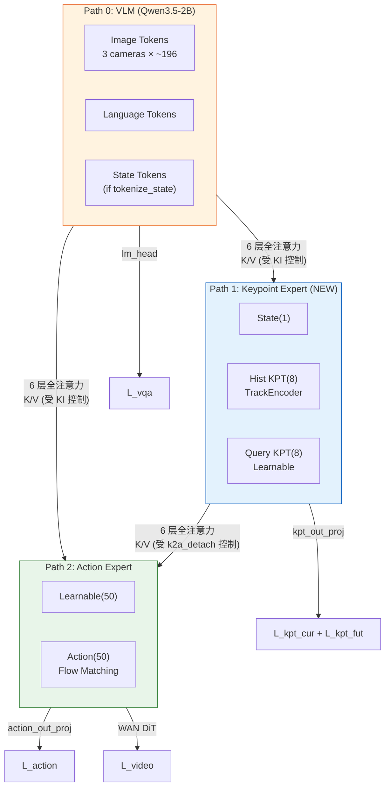
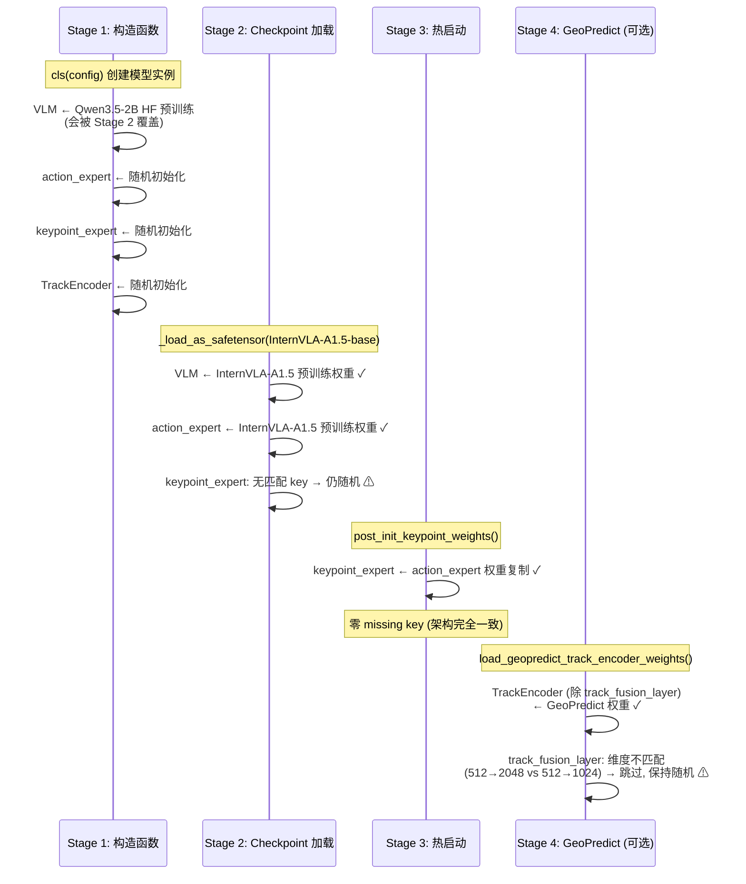
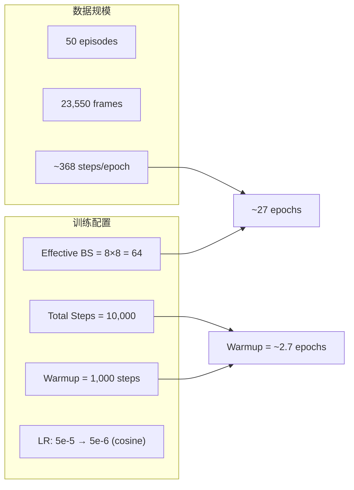

# 3D 融合版 InternVLA-A1.5 在 RoboTwin stack_bowls_three 上的微调实施手册

> **目标**：在三路径 MoT 融合架构（[itrnVLA15_GeoP_3dtrj_3cn2.md](itrnVLA15_GeoP_3dtrj_3cn2.md) v3.1）的代码**实现并通过单元测试**后，基于 [InternVLA-A1.5-base](https://huggingface.co/InternRobotics/InternVLA-A1.5-base) + [GeoPredict-Robocasa](https://huggingface.co/Jingjing0601/GeoPredict-Robocasa) 权重，在 RoboTwin 2.0 仿真平台的 `stack_bowls_three`（三碗堆叠）单任务数据集上进行 fine-tune，然后在 RoboTwin 仿真环境中评测该 checkpoint 的成功率。
>
> **与非融合版手册的关系**：本手册是 [reprd_rbtwn_stackb3.md](p/reprd_rbtwn_stackb3.md)（非融合版 InternVLA-A1.5 微调手册）的**3D 融合版对应物**。环境准备和数据准备在该手册基础上增量修改；训练脚本和监控因新增了关键点专家路径、per-module LR 分组、5 分量 loss 等而有显著差异。**本手册新增了"预调阶段"**（§3），通过 3 次 600 步短训练确定最优超参配置。
>
> 本手册分两部分：**Part A 是可执行的分步操作手册**（先写后执行）；**Part B 是执行记录**——按时间顺序记录所有实际执行的操作、遇到的每一个报错的根因分析与修复方式、以及全部新增/修改/删除文件清单，最后给出最终结果。

---

## 目录

- [Part A：实施手册](#part-a实施手册)
  - [0. 关键结论与设计依据](#0-关键结论与设计依据)
  - [1. 环境准备](#1-环境准备)
  - [2. 数据准备](#2-数据准备)
  - [3. 预调阶段（Pre-tuning, 3×600 步）](#3-预调阶段pre-tuning-3600-步)
  - [4. 训练启动脚本](#4-训练启动脚本)
  - [5. 训练执行与监控](#5-训练执行与监控)
  - [6. 评测](#6-评测)
  - [7. 已知陷阱与对策](#7-已知陷阱与对策)
  - [8. 进阶：FK 关键点数据生成 Pipeline](#8-进阶fk-关键点数据生成-pipeline)
- [Part B：执行记录](#part-b执行记录)
  - [时间线 / 操作日志](#时间线--操作日志)
  - [问题记录](#问题记录报错--根因--修复--验证)
  - [文件变更清单](#文件变更清单)
  - [关键路径速查](#关键路径速查)
  - [最终结果](#最终结果)

---

## Part A：实施手册

### 0. 关键结论与设计依据

#### 0.1 为什么需要独立的微调方案

3D 融合版模型与非融合版有 5 项关键差异，使得不能直接复用非融合版的训练脚本：

| 维度 | 非融合版（2 路径） | 3D 融合版（3 路径） |
|---|---|---|
| 架构 | VLM + Action Expert | VLM + **Keypoint Expert** + Action Expert |
| 可训练参数 | ~2.6B | ~2.9B（+~300M kpt expert + ~3M TrackEncoder） |
| Loss 分量 | 3 个（action, vqa, video） | **5 个**（+ kpt_current, kpt_future） |
| 优化器 | 单一 LR，`self.parameters()` | **4 组 per-module LR**，`list[dict]` |
| 配置字段 | ~50 个 | ~77 个（+27 个融合相关字段） |

这些差异意味着新的启动脚本、新的监控指标、新的超参调优维度，以及新的潜在故障模式。

#### 0.2 架构差异摘要（三路径 MoT）



| 路径 | 功能 | 维度 | Token 数 | 层数 | 参数量 |
|---|---|---|---|---|---|
| **Path 0: VLM** | 视觉-语言理解 | 2048 | ~400-650 | 24 | ~2.0B |
| **Path 1: 关键点专家**（新增） | 3D 运动学预测 | 1024 | 17 | 24 | ~300M |
| **Path 2: 动作专家** | 连续动作生成 | 1024 | 100/101 | 24 | ~300M |
| **TrackEncoder**（新增） | 历史轨迹编码 | 512→1024 | — | — | ~3M |

> 详细架构设计见 [itrnVLA15_GeoP_3dtrj_3cn2.md §2](itrnVLA15_GeoP_3dtrj_3cn2.md#2-三路径-mot-架构概览)。

#### 0.3 权重初始化路径（4 阶段）

3D 融合版的权重初始化比非融合版复杂，涉及 4 个阶段：



| 模块 | 最终权重来源 | 说明 |
|---|---|---|
| VLM（含 vision encoder） | InternVLA-A1.5-base | Stage 2 覆盖 Stage 1 |
| Action Expert（24 层） | InternVLA-A1.5-base | Stage 2 直接加载 |
| Keypoint Expert（24 层） | Action Expert 复制 | Stage 3 热启动 |
| TrackEncoder（除 fusion layer） | GeoPredict-Robocasa | Stage 4 选择性加载 (~3M params) |
| TrackEncoder.track_fusion_layer | 随机初始化 | output_dim 不匹配 (2048→1024) |
| kpt_state_proj, keypoint_embedding, kpt_out_proj | 随机初始化 | 新模块，无可用权重 |

> 详细初始化策略见 [itrnVLA15_GeoP_3dtrj_3cn2.md §5](itrnVLA15_GeoP_3dtrj_3cn2.md#5-权重初始化策略)。

#### 0.4 关键点数据策略

`stack_bowls_three` 数据集**没有 3D 关键点标注**。数据只包含：

| 特征 | 维度 | 用途 |
|---|---|---|
| `observation.state` | [14] | 双臂关节角度 + 夹爪 |
| `action` | [14] | 目标关节角度 |
| `observation.images.*` | 3 路视频 | cam_high, cam_left_wrist, cam_right_wrist |

关键点专家需要的数据（`his_kpts`, `kpt_t`, `future_kpts`）均不存在。有三种应对策略：

| 策略 | 方案 | 优点 | 缺点 | 推荐度 |
|---|---|---|---|---|
| **Option 1** | `kpt_loss_weight=0.0` + `kpt_to_action_detach=False` | 无需额外数据；kpt 专家通过 action loss 间接梯度获弱监督 | 关键点预测无直接监督，质量不可控 | **推荐（本次使用）** |
| Option 2 | FK 正运动学从 joint states 计算 3D 关键点 | 提供直接 kpt 监督 | 需要 URDF、FK 库、数据预处理 pipeline | 进阶（见 §8） |
| Option 3 | GeoPredict 推理生成关键点 | 使用预训练模型生成高质量关键点 | 依赖 GeoPredict 推理 pipeline，复杂度高 | 未来 |

**Option 1 的梯度路径分析**：

当 `kpt_loss_weight=0.0` 且 `kpt_to_action_detach=False` 时，关键点专家**仍然参与前向传播**：

$$\mathcal{L}_{action} \xrightarrow{\text{act\_out}} \text{act Q} \xrightarrow[\text{6 层全注意力}]{\text{交叉注意力}} \text{kpt K/V} \xrightarrow{\text{kpt k\_proj, v\_proj}} \text{kpt Expert 全部权重}$$

也就是说，action loss 的梯度通过 6 个全注意力层的交叉注意力机制，回传到关键点专家的 `k_proj` 和 `v_proj` 权重，进而通过链式法则更新关键点专家的全部 24 层权重。这使得关键点专家学习产生**对动作预测有用的**表征，即使没有直接的 3D 关键点监督。

> 这对应融合设计文档 §11.4 微调推荐配置矩阵中的"仅动作微调"行：`kpt_loss_weight=0.0, freeze_keypoint_modules=False`。

#### 0.5 显存预算分析

非融合版基线（来自 [reprd_rbtwn_stackb3.md Part B](p/reprd_rbtwn_stackb3.md#最终结果)）：

| 配置 | per-GPU bs | 显存 | 结果 |
|---|---|---|---|
| 8×H200, action_loss_only=false (WAN), 3 cam | 32 | >139 GB | OOM |
| 8×H200, action_loss_only=false (WAN), 3 cam | 16 | ~135.7 GB | 稳定 |

3D 融合版额外开销：

| 组件 | 参数量 | bf16 权重 | AdamW 状态 (fp32) | 小计 |
|---|---|---|---|---|
| Keypoint Expert (24 层) | ~300M | ~600 MB | ~2.4 GB | ~3.0 GB |
| TrackEncoder | ~3M | ~6 MB | ~24 MB | ~30 MB |
| kpt_state_proj + embedding + out_proj | <1M | ~2 MB | ~8 MB | ~10 MB |
| kpt suffix 激活 (17 tokens × bs) | — | — | — | ~50 MB (bs=8) |
| **总计额外** | ~304M | ~608 MB | ~2.43 GB | **~3.1 GB** |

**显存预测**：

| 配置 | 预估显存/卡 | H200 余量 | 可行性 |
|---|---|---|---|
| bs=8, `action_loss_only=true` (无 WAN) | ~127 GB | ~16 GB | 舒适 |
| bs=8, `action_loss_only=false` (有 WAN) | ~139 GB | ~4 GB | **紧张** |
| bs=4, `action_loss_only=false` (有 WAN) | ~125 GB | ~18 GB | 安全 |
| bs=8, `action_loss_only=true` + `gradient_checkpointing` | ~118 GB | ~25 GB | 可尝试 bs=16 |

> 以上预测基于线性外推，实际显存受 prefix 长度波动、PyTorch 内存碎片等因素影响。**预调阶段（§3）将实测确认。**

#### 0.6 Per-module LR 分组设计

非融合版 InternVLA-A1.5 的 [`get_optim_params()`](../../src/lerobot/policies/internvla_a1_5/modeling_internvla_a1_5.py#L1439) 返回 `self.parameters()`——所有可训练参数共享同一学习率。

3D 融合版**重写**此方法（[itrnVLA15_GeoP_3dtrj_3cn2.md §14.3.2](itrnVLA15_GeoP_3dtrj_3cn2.md#1432-v31-的-get_optim_params-实现)），返回 `list[dict]`，支持 4 组独立 LR：

| 组 | 匹配前缀 | LR 计算 | 保守微调推荐 | 说明 |
|---|---|---|---|---|
| **vlm_backbone** | 其余所有参数 | `base_lr × vlm_lr_scale` | 5e-5 × **0.0** = 0 | VLM 冻结（LR=0），避免灾难性遗忘 |
| **action_expert** | `model.action_expert_layers.` | `base_lr × action_expert_lr_scale` | 5e-5 × **1.0** = 5e-5 | 正常学习率 |
| **kpt_expert** | `model.kpt_expert_layers.` | `base_lr × kpt_expert_lr_scale` | 5e-5 × **1.0** = 5e-5 | 正常学习率 |
| **track_encoder** | `model.track_encoder.` | `base_lr × track_encoder_lr_scale` | 5e-5 × **1.0** = 5e-5 | 正常学习率 |

> **重要注意**：当 `vlm_lr_scale=0.0` 时，`lerobot_train.py` 日志中的 `lr=` 字段显示的是 `optimizer.param_groups[0]["lr"]`（即 VLM 组），会显示 `0.0e+0`。这是**预期行为**，不代表训练未进行。验证方法见 §3.3。

训练循环的消费路径（无需修改，自动支持）：

```
policy.get_optim_params()  →  list[dict]
    ↓
factory.py: cfg.optimizer.build(params)  →  AdamW(param_groups=[...])
    ↓
每组独立 LR + weight_decay
    ↓
scheduler 只影响 warmup/decay 比例，各组 LR 按比例缩放
```

---

### 1. 环境准备

#### 1.1 创建虚拟环境

3D 融合版使用独立的虚拟环境 `/mnt/r/VENV/ivla15_geop/`，以避免影响已验证可工作的非融合版环境。创建方式：从 `/mnt/r/VENV/ivla15/` 完整复制。

```bash
# 复制 venv（保留所有已安装包和编译后的扩展）
cp -a /mnt/r/VENV/ivla15 /mnt/r/VENV/ivla15_geop

# 修复 venv 内部的路径引用
# Python venv 的 activate 脚本和 pip shebang 硬编码了原始路径
sed -i "s|/mnt/r/VENV/ivla15|/mnt/r/VENV/ivla15_geop|g" \
  /mnt/r/VENV/ivla15_geop/bin/activate \
  /mnt/r/VENV/ivla15_geop/bin/activate.csh \
  /mnt/r/VENV/ivla15_geop/bin/activate.fish \
  /mnt/r/VENV/ivla15_geop/pyvenv.cfg

# 修复 pip 等可执行文件的 shebang
find /mnt/r/VENV/ivla15_geop/bin -type f -exec \
  sed -i "s|/mnt/r/VENV/ivla15/|/mnt/r/VENV/ivla15_geop/|g" {} \;

# 激活新 venv
source /mnt/r/VENV/ivla15_geop/bin/activate
```

> **为什么不用 `python -m venv --system-site-packages`**：该方式只创建空 venv 并链接系统 Python，不会复制 `pip install` 的第三方包（如 flash-attn, causal-conv1d 等编译后的 CUDA 扩展）。复制整个 venv 最安全。

#### 1.2 额外依赖安装

GeoPredict 的 TrackEncoder 使用了 `einops`（已在 ivla15 中安装）。为确保完整性，检查并安装可能需要的额外包：

```bash
source /mnt/r/VENV/ivla15_geop/bin/activate

# 检查 einops 是否存在
python -c "import einops; print('einops:', einops.__version__)"

# 如果有缺失的包（通常不需要，但以防万一）
# pip install einops  # 如果上面报 ImportError
```

> 3D 融合版的 TrackEncoder 代码（ported from [GeoPredict/models/keypoints.py](../../../SRC/Robot/GeoPredict/models/keypoints.py)）只依赖 `torch` 和 `einops`（`rearrange`），无其他额外依赖。

#### 1.3 Transformers patch 验证

新 venv 需要重新应用 Qwen3.5 自定义模型 patch（原 venv 的 patch 已随文件复制）：

```bash
TRANSFORMERS_DIR=/mnt/r/VENV/ivla15_geop/lib/python3.11/site-packages/transformers/

# 检查 patch 是否已存在（复制 venv 时应自动带过来）
if [ -f "${TRANSFORMERS_DIR}/models/qwen3_5/modeling_qwen3_5.py" ]; then
    echo "Transformers patch already present."
else
    echo "Applying transformers patch..."
    cp -r src/lerobot/policies/pi0/transformers_replace/models ${TRANSFORMERS_DIR}
    cp -r src/lerobot/policies/pi05/transformers_replace/models ${TRANSFORMERS_DIR}
    cp -r src/lerobot/policies/internvla_a1_5/transformers_replace/models ${TRANSFORMERS_DIR}
    echo "Done."
fi
```

#### 1.4 下载 GeoPredict 权重

GeoPredict-Robocasa checkpoint 需要从 HuggingFace 下载。存放路径：`/mnt/r/CKPT/GeoPredict/`。

```bash
mkdir -p /mnt/r/CKPT/GeoPredict

# 仅下载 GeoPredict_robocasa.pth (6.54 GB)，跳过 pi0_base.pth 等无关文件
huggingface-cli download Jingjing0601/GeoPredict-Robocasa \
  --local-dir /mnt/r/CKPT/GeoPredict \
  --include "GeoPredict_robocasa.pth"

# 验证
ls -lh /mnt/r/CKPT/GeoPredict/GeoPredict_robocasa.pth
# 预期：约 6.54 GB
```

> **是否必须下载？** 使用 Option 1（kpt_loss_weight=0）时，GeoPredict 权重用于 Stage 4 初始化 TrackEncoder 的内部模块（`queries`, `cross_attention_block`, `linear_transform`, `final_norm`，共 ~3M 参数），跳过 `track_fusion_layer`（维度不匹配）。即使 TrackEncoder 在本次微调中只接收间接梯度（通过 action loss 的反传路径），使用预训练权重比随机初始化有更好的起点。若不下载，设 `geopredict_checkpoint_path` 为空，TrackEncoder 全部随机初始化。

#### 1.5 环境变量约定

```bash
export HF_HOME=/mnt/r/CKPT/hf_home
export HF_LEROBOT_HOME=${HF_HOME}/lerobot
export VENV_ROOT=/mnt/r/VENV/ivla15_geop
```

#### 1.6 环境验证

```bash
source /mnt/r/VENV/ivla15_geop/bin/activate

python -c "
import torch; print('torch:', torch.__version__, '| CUDA:', torch.version.cuda)
import transformers; print('transformers:', transformers.__version__)
import lerobot; print('lerobot:', lerobot.__version__)
import torchcodec; print('torchcodec:', torchcodec.__version__)
import flash_attn; print('flash_attn:', flash_attn.__version__)
import einops; print('einops:', einops.__version__)
print('GPU count:', torch.cuda.device_count())
for i in range(torch.cuda.device_count()):
    print(f'  GPU{i}: {torch.cuda.get_device_name(i)} ({torch.cuda.get_device_properties(i).total_mem / 1024**3:.0f}GB)')
"
```

预期输出：

```
torch: 2.10.0+cu128 | CUDA: 12.8
transformers: 5.2.0
lerobot: 1.0.0
torchcodec: 0.10.0
flash_attn: 2.8.3
einops: 0.8.2
GPU count: 8
  GPU0: NVIDIA H200 (143GB)
  ...
```

---

### 2. 数据准备

#### 2.1 复用已有 v3.0 数据

非融合版微调手册已完成数据集格式转换（v2.1→v3.0）和 symlink 创建。验证 symlink 仍然有效：

```bash
export HF_HOME=/mnt/r/CKPT/hf_home

# 验证 symlink 链
ls -la ${HF_HOME}/lerobot/robotwin/stack_bowls_three
# 预期 → /mnt/r/DATA/RoboTwin-Clean-v30/stack_bowls_three_v30

# 验证 info.json
python3 -c "
import json
info = json.load(open('data/robotwin/stack_bowls_three/meta/info.json'))
print('version:', info['codebase_version'])   # v3.0
print('robot_type:', info['robot_type'])       # aloha
print('episodes:', info['total_episodes'])     # 50
print('frames:', info['total_frames'])         # 23550
"
```

#### 2.2 复用已有归一化统计量

外部统计量已在非融合版微调中计算完毕。3D 融合版使用相同的 action/state 归一化，无需重新计算：

```bash
ls -la ${HF_HOME}/lerobot/stats/aloha/abs/agg_1repos_1c27ca3df3/stats.json
# 预期存在，14 维 action/state 统计量
```

#### 2.3 关键点数据说明

**本次微调不需要关键点数据。** 训练代码在 `forward()` 中处理 `his_kpts=None` 的逻辑（[itrnVLA15_GeoP_3dtrj_3cn2.md §10.1](itrnVLA15_GeoP_3dtrj_3cn2.md#101-embed_kpt_suffix新增--关键点专家) line 1260）：

```python
if his_kpts is not None:
    hist_kpt_emb = self.track_encoder(his_kpts, his_len)  # [B, J, 1024]
else:
    hist_kpt_emb = torch.zeros(B, J, 1024, device=device, dtype=dtype)
```

当 `his_kpts=None` 时，历史关键点嵌入用全零张量替代。关键点专家的 8 个查询 Token 仍然使用可学习嵌入（`keypoint_embedding`），通过 24 层 Transformer 处理并与 VLM 和 Action Expert 进行交叉注意力交互。

由于 `kpt_loss_weight=0.0`，`forward()` 中的关键点 loss 计算分支（[§10.4](itrnVLA15_GeoP_3dtrj_3cn2.md#104-forward-方法完整修改) line 1416: `if self.config.enable_keypoint_predictor and kpt_t is not None`）不会被触发——`kpt_t` 在数据中不存在，为 `None`。

**数据 transform pipeline 无需修改**。现有 `UnifyInternVLAA15InputsTransformFn` 不处理关键点数据，3D 融合版的 `Extract3DKeypointTransformFn`（[§15.2](itrnVLA15_GeoP_3dtrj_3cn2.md)）仅在数据集包含关键点字段时才需加入。

---

### 3. 预调阶段（Pre-tuning, 3×600 步）

预调阶段是本手册**核心新增章节**，通过 3 次短训练快速确定最优配置，避免正式训练中浪费 GPU 时间。

#### 3.1 目标与计划总览

| Run | 主要目标 | `action_loss_only` | `batch_size` | `vlm_lr_scale` | 关键验证项 |
|---|---|---|---|---|---|
| **1** | 最大 batch size + 初始化验证 | `true` (无 WAN) | 8 起步, OOM 则 4 | 0.0 | 显存、kpt==act 权重验证、LR 分组验证 |
| **2** | LR 敏感性扫描 | `true` | Run 1 确定的值 | 0.0 vs 0.05 | loss 收敛速度对比、grad_norm 稳定性 |
| **3** | 完整 pipeline + 系统验证 | `false` (有 WAN) | 根据 Run 1/2 调整 | 最优值 | checkpoint 保存、wandb 日志、GPU 利用率 |

每 run 600 步，预计每 run 约 15-20 分钟（取决于 batch size 和是否启用 WAN）。

#### 3.2 预调脚本

创建 `launch/internvla_a15_geop_pretune_robotwin_stackb3.sh`：

```bash
#!/usr/bin/env bash
set -euo pipefail

###############################################################################
# Pre-tuning script for 3D-fused InternVLA-A1.5 on RoboTwin stack_bowls_three.
#
# Short 600-step runs to determine optimal batch_size, LR, and verify system.
# Based on launch/internvla_a15_finetune_robotwin_stackb3_venv.sh with
# 3D fusion config additions from b/d/itrnVLA15_GeoP_3dtrj_3cn2.md §14.1.
#
# Usage:
#   PRETUNE_RUN=1 bash launch/internvla_a15_geop_pretune_robotwin_stackb3.sh
#   PRETUNE_RUN=2 VLM_LR_SCALE=0.05 bash launch/...
#   PRETUNE_RUN=3 ACTION_LOSS_ONLY=false BATCH_SIZE=4 bash launch/...
###############################################################################

################################# ENV config ##################################

export HF_HOME="${HF_HOME:-/mnt/r/CKPT/hf_home}"
export HF_LEROBOT_HOME="${HF_LEROBOT_HOME:-${HF_HOME}/lerobot}"

VENV_ROOT="${VENV_ROOT:-/mnt/r/VENV/ivla15_geop}"
source "${VENV_ROOT}/bin/activate"

export WANDB_MODE=offline
export USE_LIBUV=${USE_LIBUV:-0}

export MASTER_ADDR=${MASTER_ADDR:-"127.0.0.1"}
export MASTER_PORT=${MASTER_PORT:-36100}

export CUDA_VISIBLE_DEVICES="${CUDA_VISIBLE_DEVICES:-0,1,2,3,4,5,6,7}"
PROC_PER_NODE="${PROC_PER_NODE:-8}"
NODE_COUNT="${NODE_COUNT:-1}"
NODE_RANK="${NODE_RANK:-0}"
NUM_PROCESSES=$((NODE_COUNT * PROC_PER_NODE))

export CUDA_HOME="/usr/local/cuda-12.8"
export LD_LIBRARY_PATH="$CUDA_HOME/lib64:${LD_LIBRARY_PATH:-}"
export LD_LIBRARY_PATH="${VENV_ROOT}/lib:${LD_LIBRARY_PATH}"

export PYTHONUNBUFFERED=1
export OMP_NUM_THREADS=1
export MKL_NUM_THREADS=1
export TOKENIZERS_PARALLELISM=false

############################## TRAINING config ################################

SCRIPT_DIR="$(cd "$(dirname "${BASH_SOURCE[0]}")" && pwd)"
PROJ_ROOT="$(cd "${SCRIPT_DIR}/.." && pwd)"
cd "${PROJ_ROOT}"

POLICY="internvla_a1_5"
PRETRAINED_PATH="${PRETRAINED_PATH:-/mnt/r/CKPT/InternVLA-A1.5-base}"
VLM_MODEL_PATH="${VLM_MODEL_PATH:-Qwen/Qwen3.5-2B}"
WAN_CHECKPOINT_PATH="${WAN_CHECKPOINT_PATH:-/mnt/r/CKPT/Wan2.2-TI2V-5B}"
WAN_CONFIG_PATH="${WAN_CONFIG_PATH:-/mnt/r/CKPT/Wan2.2-TI2V-5B}"
WAN_VAE_PATH="${WAN_VAE_PATH:-/mnt/r/CKPT/Wan2.2-TI2V-5B/Wan2.2_VAE.pth}"

DATASET_REPO_ID="${DATASET_REPO_ID:-robotwin/stack_bowls_three}"
ACTION_TYPE=abs
USE_EXTERNAL_STATS=true
EXTERNAL_STATS_PATH="${EXTERNAL_STATS_PATH:-${HF_HOME}/lerobot/stats/aloha/${ACTION_TYPE}/agg_1repos_1c27ca3df3/stats.json}"

# ---- Pre-tuning overrides ----
PRETUNE_RUN="${PRETUNE_RUN:-1}"
STEPS="${STEPS:-600}"
BATCH_SIZE="${BATCH_SIZE:-8}"
SAVE_FREQ="${SAVE_FREQ:-300}"
LOG_FREQ="${LOG_FREQ:-10}"

# ---- 3D Fusion config ----
ACTION_LOSS_ONLY="${ACTION_LOSS_ONLY:-true}"
VLM_LR_SCALE="${VLM_LR_SCALE:-0.0}"
KPT_EXPERT_LR_SCALE="${KPT_EXPERT_LR_SCALE:-1.0}"
TRACK_ENCODER_LR_SCALE="${TRACK_ENCODER_LR_SCALE:-1.0}"
GEOPREDICT_CKPT="${GEOPREDICT_CKPT:-/mnt/r/CKPT/GeoPredict/GeoPredict_robocasa.pth}"

BASE_OUTPUT_DIR="outputs/${POLICY}"
JOB_NAME="${JOB_NAME:-$(date +'%Y_%m_%d_%H_%M_%S')-geop-pretune-run${PRETUNE_RUN}-bs${BATCH_SIZE}-vlmlr${VLM_LR_SCALE}}"
OUTPUT_DIR="${BASE_OUTPUT_DIR}/${JOB_NAME}"

echo "=== Pre-tuning Run ${PRETUNE_RUN} ==="
echo "BATCH_SIZE=${BATCH_SIZE}  VLM_LR_SCALE=${VLM_LR_SCALE}  ACTION_LOSS_ONLY=${ACTION_LOSS_ONLY}"
echo "OUTPUT_DIR=${OUTPUT_DIR}"

ARGS=(
    # ---- Accelerate / distributed ----
    --multi_gpu
    --num_processes="${NUM_PROCESSES}"
    --num_machines="${NODE_COUNT}"
    --machine_rank="${NODE_RANK}"
    --main_process_ip="${MASTER_ADDR}"
    --main_process_port="${MASTER_PORT}"
    src/lerobot/scripts/lerobot_train.py

    # ---- Output ----
    --output_dir="${OUTPUT_DIR}"
    --num_workers=8
    --job_name="${JOB_NAME}"

    # ---- Policy (base, same as non-fused) ----
    --policy.type=${POLICY}
    --policy.repo_id=lerobot_lab/${POLICY}
    --policy.pretrained_path=${PRETRAINED_PATH}
    --policy.push_to_hub=false
    --policy.gradient_checkpointing=false
    --policy.dtype=bfloat16
    --policy.optimizer_lr=5e-5
    --policy.scheduler_warmup_steps=100
    --policy.scheduler_decay_steps=${STEPS}
    --policy.scheduler_decay_lr=5e-6
    --policy.freeze_vision_encoder=false
    --policy.train_expert_only=false
    --policy.vlm_model_name_or_path=${VLM_MODEL_PATH}
    --policy.enable_vqa_loss=true
    --policy.tokenize_state=true
    --policy.video_loss_only=false
    --policy.video_loss_weight=1
    --policy.freeze_learnable_tokens=true
    --policy.num_learnable_tokens=50
    --policy.wan_checkpoint_path=${WAN_CHECKPOINT_PATH}
    --policy.wan_config_path=${WAN_CONFIG_PATH}
    --policy.vae_path=${WAN_VAE_PATH}

    # ---- Policy (3D Fusion, v3.1 新增) ----
    --policy.enable_keypoint_predictor=true
    --policy.kpt_loss_weight=0.0
    --policy.kpt_future_loss_weight=1.0
    --policy.action_loss_weight=10.0
    --policy.kpt_to_action_detach=false
    --policy.knowledge_insulation=true
    --policy.knowledge_insulation_kpt=true
    --policy.ki_gradient_scale=0.0
    --policy.ki_kpt_gradient_scale=0.0
    --policy.freeze_keypoint_modules=false
    --policy.vlm_lr_scale=${VLM_LR_SCALE}
    --policy.action_expert_lr_scale=1.0
    --policy.kpt_expert_lr_scale=${KPT_EXPERT_LR_SCALE}
    --policy.track_encoder_lr_scale=${TRACK_ENCODER_LR_SCALE}
    --policy.init_kpt_expert_from_action=true
    --policy.action_loss_only=${ACTION_LOSS_ONLY}

    # ---- Dataset ----
    --dataset.type="$POLICY"
    --dataset.repo_id="$DATASET_REPO_ID"
    --dataset.action_mode="$ACTION_TYPE"
    --dataset.use_external_stats="$USE_EXTERNAL_STATS"
    --dataset.external_stats_path=${EXTERNAL_STATS_PATH}
    --dataset.dist_loading=false
    --dataset.tokenize_state=true
    --dataset.use_fast_action_tokens=true

    # ---- Training ----
    --seed=42
    --batch_size=${BATCH_SIZE}
    --steps=${STEPS}
    --save_freq=${SAVE_FREQ}
    --log_freq=${LOG_FREQ}

    # ---- Logging ----
    --wandb.enable=true
    --wandb.project=${POLICY}
    --wandb.mode=offline
)

# GeoPredict 权重路径（如果文件存在则传入）
if [ -f "${GEOPREDICT_CKPT}" ]; then
    ARGS+=(--policy.geopredict_checkpoint_path=${GEOPREDICT_CKPT})
    echo "GeoPredict checkpoint: ${GEOPREDICT_CKPT}"
else
    echo "WARNING: GeoPredict checkpoint not found at ${GEOPREDICT_CKPT}. TrackEncoder will use random init."
fi

accelerate launch "${ARGS[@]}"
```

> 与正式训练脚本的区别：`STEPS=600`、`warmup=100`、`SAVE_FREQ=300`、`LOG_FREQ=10`（更频繁日志以便快速判断）。

#### 3.3 Run 1：确定最大 batch size + 初始化验证

**目标**：在 `action_loss_only=true`（无 WAN，降低显存占用）下确定 3D 融合版的最大 per-GPU batch size。

**操作**：

```bash
source /mnt/r/VENV/ivla15_geop/bin/activate
export HF_HOME=/mnt/r/CKPT/hf_home
cd /home/physical/SRC/Robot/InternVLA-A-series

# Run 1: bs=8, 无 WAN
PRETUNE_RUN=1 BATCH_SIZE=8 ACTION_LOSS_ONLY=true \
  bash launch/internvla_a15_geop_pretune_robotwin_stackb3.sh
```

**监控**：

1. **显存**：另一个终端运行 `watch -n 2 nvidia-smi`，记录稳态显存占用（前 50 步后稳定）。
2. **OOM 处理**：如果 bs=8 OOM，改为 bs=4 重试：
   ```bash
   PRETUNE_RUN=1 BATCH_SIZE=4 ACTION_LOSS_ONLY=true \
     bash launch/internvla_a15_geop_pretune_robotwin_stackb3.sh
   ```

3. **权重初始化验证**（在训练启动后的前几步日志中确认，或另外运行验证脚本）：

   ```bash
   # 单独验证脚本（在训练外运行）
   source /mnt/r/VENV/ivla15_geop/bin/activate
   cd /home/physical/SRC/Robot/InternVLA-A-series
   
   python3 -c "
   import torch
   from lerobot.policies.internvla_a1_5.modeling_internvla_a1_5 import InternVLAA15Policy
   from lerobot.policies.internvla_a1_5.configuration_internvla_a1_5 import InternVLAA15Config
   
   config = InternVLAA15Config(
       enable_keypoint_predictor=True,
       init_kpt_expert_from_action=True,
       vlm_model_name_or_path='Qwen/Qwen3.5-2B',
       pretrained_path='/mnt/r/CKPT/InternVLA-A1.5-base',
   )
   policy = InternVLAA15Policy(config)
   
   # 验证 kpt expert == action expert
   kpt = policy.model.qwen3_5_with_expert.keypoint_expert
   act = policy.model.qwen3_5_with_expert.action_expert
   for name, p in kpt.named_parameters():
       act_p = dict(act.named_parameters())[name]
       assert torch.equal(p.data, act_p.data), f'Mismatch: {name}'
   print('✓ Keypoint expert weights == Action expert weights (hot-start verified)')
   
   # 验证 per-module LR 分组
   param_groups = policy.get_optim_params()
   print(f'\\nOptimizer param groups ({len(param_groups)}):')
   for i, pg in enumerate(param_groups):
       print(f'  Group {i} ({pg.get(\"name\", \"unnamed\")}): lr={pg[\"lr\"]:.2e}, params={len(pg[\"params\"])}')
   assert len(param_groups) == 4, f'Expected 4 groups, got {len(param_groups)}'
   for pg in param_groups:
       assert len(pg['params']) > 0, f'Group {pg[\"name\"]} has 0 params!'
   print('✓ All 4 param groups have non-empty parameter lists')
   "
   ```

   预期输出：
   ```
   ✓ Keypoint expert weights == Action expert weights (hot-start verified)

   Optimizer param groups (4):
     Group 0 (vlm_backbone): lr=0.00e+00, params=XXX
     Group 1 (action_expert): lr=5.00e-05, params=XXX
     Group 2 (kpt_expert): lr=5.00e-05, params=XXX
     Group 3 (track_encoder): lr=5.00e-05, params=XXX
   ✓ All 4 param groups have non-empty parameter lists
   ```

   > **关键检查**：如果 `kpt_expert` 组的 params 数为 0，说明 `get_optim_params` 中的前缀匹配规则与实际参数名不一致。此时应打印 `policy.named_parameters()` 中所有以 `keypoint_expert` 相关的 key，对照融合文档 §14.3.2 修正前缀。

**记录**：填入 §3.6 汇总表。

#### 3.4 Run 2：学习率敏感性扫描

**目标**：对比不同 `vlm_lr_scale` 值对 loss 收敛速度的影响。

**操作**：使用 Run 1 确定的 batch size，运行两个 600 步训练：

```bash
# Config A: vlm_lr_scale=0.0 (VLM 完全冻结 via LR=0)
PRETUNE_RUN=2a BATCH_SIZE=<Run1最优> VLM_LR_SCALE=0.0 ACTION_LOSS_ONLY=true \
  bash launch/internvla_a15_geop_pretune_robotwin_stackb3.sh

# Config B: vlm_lr_scale=0.05 (VLM 轻微更新)
PRETUNE_RUN=2b BATCH_SIZE=<Run1最优> VLM_LR_SCALE=0.05 ACTION_LOSS_ONLY=true \
  bash launch/internvla_a15_geop_pretune_robotwin_stackb3.sh
```

**对比指标**：

| 指标 | Config A (vlm_lr=0) | Config B (vlm_lr=0.05) | 优选 |
|---|---|---|---|
| `loss_action` @ step 600 | | | 越低越好 |
| `loss_action` 下降速率 | | | 越快越好 |
| `grad_norm` 均值 | | | <10 为稳定 |
| `grad_norm` 最大值 | | | <100 为安全 |

> **预期**：对于 50 episodes 的小数据集，`vlm_lr_scale=0.0`（保守微调）应该更稳定。`vlm_lr_scale=0.05` 可能收敛更快但有灾难性遗忘风险。

#### 3.5 Run 3：完整 pipeline + 系统验证

**目标**：启用 WAN video loss（`action_loss_only=false`），测试完整 5 分量 loss pipeline。

**操作**：

```bash
# 使用 Run 2 最优的 VLM_LR_SCALE，启用 WAN
# batch size 可能需要下调（WAN 额外占用 ~10GB）
PRETUNE_RUN=3 BATCH_SIZE=<调整后> VLM_LR_SCALE=<Run2最优> \
  ACTION_LOSS_ONLY=false \
  bash launch/internvla_a15_geop_pretune_robotwin_stackb3.sh
```

**验证清单**：

- [ ] **Checkpoint 保存**：`ls outputs/internvla_a1_5/<job>/checkpoints/000300/pretrained_model/config.json` 存在
  - 检查 `config.json` 中 `enable_keypoint_predictor: true`
  - 检查 `model.safetensors` 大小（预期 ~6-7GB，比非融合版 ~5.4GB 多 ~1GB）
- [ ] **WandB 日志**：`ls outputs/internvla_a1_5/<job>/wandb/` 有 `run-*` 目录
  - 日志应包含：`loss`, `loss_action`, `loss_video`, `loss_vqa`, `loss_fast`, `loss_subtask`, `grad_norm`, `lr`
  - 若融合代码实现了 kpt 日志：还应有 `loss_kpt_current=0.000`, `loss_kpt_future=0.000`
- [ ] **GPU 利用率**：`nvidia-smi` 显示所有 8 卡均在使用
- [ ] **训练稳定性**：600 步内 loss 持续下降，grad_norm < 100
- [ ] **显存**：记录稳态峰值，判断正式训练是否可用此 batch size

**决策**：如果 bs=8 + WAN 可行（显存 < 140GB），正式训练用 `action_loss_only=false`；否则二选一：
- (a) bs=4 + WAN（保留 video loss，降低 effective BS）
- (b) bs=8 + `action_loss_only=true`（放弃 video loss，保持高 throughput）

#### 3.6 预调结果汇总表

| Run | Config | BS | 实际显存 | iters/s | loss@600 | loss_action@600 | grad_norm | 结论 |
|---|---|---|---|---|---|---|---|---|
| 1 | bs=8, no WAN, vlm_lr=0.0 | | | | | | | |
| 2a | bs=?, no WAN, vlm_lr=0.0 | | | | | | | |
| 2b | bs=?, no WAN, vlm_lr=0.05 | | | | | | | |
| 3 | bs=?, with WAN, vlm_lr=? | | | | | | | |

**正式训练配置决定**（根据预调结果填写）：

| 参数 | 决定值 | 依据 |
|---|---|---|
| `batch_size` | | Run 1 |
| `action_loss_only` | | Run 3 |
| `vlm_lr_scale` | | Run 2 |
| `gradient_checkpointing` | | Run 1 (如需) |

---

### 4. 训练启动脚本

#### 4.1 完整脚本

创建 `launch/internvla_a15_geop_finetune_robotwin_stackb3_venv.sh`：

```bash
#!/usr/bin/env bash
set -euo pipefail

###############################################################################
# venv-based fine-tune script for 3D-fused InternVLA-A1.5 (three-path MoT)
# on RoboTwin stack_bowls_three.
#
# Based on launch/internvla_a15_finetune_robotwin_stackb3_venv.sh with
# 3D fusion config additions from b/d/itrnVLA15_GeoP_3dtrj_3cn2.md §14.1.
#
# Key differences from non-fused script:
#   - Uses venv /mnt/r/VENV/ivla15_geop/ (not ivla15)
#   - Enables 3D keypoint predictor (enable_keypoint_predictor=true)
#   - Per-module LR via vlm_lr_scale, action_expert_lr_scale, etc.
#   - Knowledge insulation enabled for both action and kpt paths
#   - kpt_loss_weight=0.0 (no keypoint GT in dataset)
#   - Batch size and action_loss_only determined by pre-tuning phase
#
# Usage:
#   source /mnt/r/VENV/ivla15_geop/bin/activate
#   bash launch/internvla_a15_geop_finetune_robotwin_stackb3_venv.sh
#
# See b/d/itrnVLA15_GeoP_3dtrj_3cn2_sft_rbt2.md for full context.
###############################################################################

################################# ENV config ##################################

export HF_HOME="${HF_HOME:-/mnt/r/CKPT/hf_home}"
export HF_LEROBOT_HOME="${HF_LEROBOT_HOME:-${HF_HOME}/lerobot}"

VENV_ROOT="${VENV_ROOT:-/mnt/r/VENV/ivla15_geop}"
source "${VENV_ROOT}/bin/activate"

export WANDB_MODE=offline
export USE_LIBUV=${USE_LIBUV:-0}

export MASTER_ADDR=${MASTER_ADDR:-"127.0.0.1"}
export MASTER_PORT=${MASTER_PORT:-36200}
echo "MASTER_ADDR=${MASTER_ADDR}, MASTER_PORT=${MASTER_PORT}"

export CUDA_VISIBLE_DEVICES="${CUDA_VISIBLE_DEVICES:-0,1,2,3,4,5,6,7}"
PROC_PER_NODE="${PROC_PER_NODE:-8}"
NODE_COUNT="${NODE_COUNT:-1}"
NODE_RANK="${NODE_RANK:-0}"
NUM_PROCESSES=$((NODE_COUNT * PROC_PER_NODE))

export CUDA_HOME="/usr/local/cuda-12.8"
export LD_LIBRARY_PATH="$CUDA_HOME/lib64:${LD_LIBRARY_PATH:-}"
export LD_LIBRARY_PATH="${VENV_ROOT}/lib:${LD_LIBRARY_PATH}"

export PYTHONUNBUFFERED=1
export OMP_NUM_THREADS=1
export MKL_NUM_THREADS=1
export TOKENIZERS_PARALLELISM=false

############################## TRAINING config ################################

SCRIPT_DIR="$(cd "$(dirname "${BASH_SOURCE[0]}")" && pwd)"
PROJ_ROOT="$(cd "${SCRIPT_DIR}/.." && pwd)"
echo "SCRIPT_DIR = ${SCRIPT_DIR}"
echo "PROJ_ROOT  = ${PROJ_ROOT}"

cd "${PROJ_ROOT}"

# 1. policy & model paths
POLICY="internvla_a1_5"
PRETRAINED_PATH="${PRETRAINED_PATH:-/mnt/r/CKPT/InternVLA-A1.5-base}"
VLM_MODEL_PATH="${VLM_MODEL_PATH:-Qwen/Qwen3.5-2B}"
WAN_CHECKPOINT_PATH="${WAN_CHECKPOINT_PATH:-/mnt/r/CKPT/Wan2.2-TI2V-5B}"
WAN_CONFIG_PATH="${WAN_CONFIG_PATH:-/mnt/r/CKPT/Wan2.2-TI2V-5B}"
WAN_VAE_PATH="${WAN_VAE_PATH:-/mnt/r/CKPT/Wan2.2-TI2V-5B/Wan2.2_VAE.pth}"
GEOPREDICT_CKPT="${GEOPREDICT_CKPT:-/mnt/r/CKPT/GeoPredict/GeoPredict_robocasa.pth}"

# 2. dataset config
DATASET_REPO_ID="${DATASET_REPO_ID:-robotwin/stack_bowls_three}"
ACTION_TYPE=abs
USE_EXTERNAL_STATS=true
EXTERNAL_STATS_PATH="${EXTERNAL_STATS_PATH:-${HF_HOME}/lerobot/stats/aloha/${ACTION_TYPE}/agg_1repos_1c27ca3df3/stats.json}"

echo "DATASET_REPO_ID=${DATASET_REPO_ID}"
echo "EXTERNAL_STATS_PATH=${EXTERNAL_STATS_PATH}"

# 3. output & training config
# *** 以下 4 个参数由预调阶段（§3）决定，此处为占位默认值 ***
BATCH_SIZE="${BATCH_SIZE:-8}"                  # 由 Run 1 确定
ACTION_LOSS_ONLY="${ACTION_LOSS_ONLY:-true}"   # 由 Run 3 确定
VLM_LR_SCALE="${VLM_LR_SCALE:-0.0}"           # 由 Run 2 确定

BASE_OUTPUT_DIR="outputs/${POLICY}"
PRETRAINED_DETAIL="a15_geop_base"
JOB_NAME="${JOB_NAME:-$(date +'%Y_%m_%d_%H_%M_%S')-${POLICY}-geop-robotwin-stack_bowls_three-${ACTION_TYPE}-${PRETRAINED_DETAIL}-finetune}"
OUTPUT_DIR="${BASE_OUTPUT_DIR}/${JOB_NAME}"

STEPS="${STEPS:-10000}"
SAVE_FREQ="${SAVE_FREQ:-2500}"
LOG_FREQ="${LOG_FREQ:-50}"

echo "STEPS=${STEPS} BATCH_SIZE=${BATCH_SIZE} ACTION_LOSS_ONLY=${ACTION_LOSS_ONLY} VLM_LR_SCALE=${VLM_LR_SCALE}"
echo "OUTPUT_DIR=${OUTPUT_DIR}"

ARGS=(
    # ---- Accelerate / distributed ----
    --multi_gpu
    --num_processes="${NUM_PROCESSES}"
    --num_machines="${NODE_COUNT}"
    --machine_rank="${NODE_RANK}"
    --main_process_ip="${MASTER_ADDR}"
    --main_process_port="${MASTER_PORT}"
    src/lerobot/scripts/lerobot_train.py

    # ---- Output ----
    --output_dir="${OUTPUT_DIR}"
    --num_workers=8
    --job_name="${JOB_NAME}"

    # ---- Policy (base config, inherited from non-fused) ----
    --policy.type=${POLICY}
    --policy.repo_id=lerobot_lab/${POLICY}
    --policy.pretrained_path=${PRETRAINED_PATH}
    --policy.push_to_hub=false
    --policy.gradient_checkpointing=false
    --policy.dtype=bfloat16
    --policy.optimizer_lr=5e-5
    --policy.scheduler_warmup_steps=1000
    --policy.scheduler_decay_steps=${STEPS}
    --policy.scheduler_decay_lr=5e-6
    --policy.freeze_vision_encoder=false
    --policy.train_expert_only=false
    --policy.vlm_model_name_or_path=${VLM_MODEL_PATH}
    --policy.enable_vqa_loss=true
    --policy.tokenize_state=true
    --policy.video_loss_only=false
    --policy.video_loss_weight=1
    --policy.freeze_learnable_tokens=true
    --policy.num_learnable_tokens=50
    --policy.wan_checkpoint_path=${WAN_CHECKPOINT_PATH}
    --policy.wan_config_path=${WAN_CONFIG_PATH}
    --policy.vae_path=${WAN_VAE_PATH}

    # ---- Policy (3D Fusion v3.1 config) ----
    --policy.enable_keypoint_predictor=true
    --policy.action_loss_weight=10.0
    --policy.kpt_loss_weight=0.0
    --policy.kpt_future_loss_weight=1.0
    --policy.kpt_to_action_detach=false
    --policy.knowledge_insulation=true
    --policy.knowledge_insulation_kpt=true
    --policy.ki_gradient_scale=0.0
    --policy.ki_kpt_gradient_scale=0.0
    --policy.freeze_keypoint_modules=false
    --policy.vlm_lr_scale=${VLM_LR_SCALE}
    --policy.action_expert_lr_scale=1.0
    --policy.kpt_expert_lr_scale=1.0
    --policy.track_encoder_lr_scale=1.0
    --policy.init_kpt_expert_from_action=true
    --policy.action_loss_only=${ACTION_LOSS_ONLY}

    # ---- Dataset ----
    --dataset.type="$POLICY"
    --dataset.repo_id="$DATASET_REPO_ID"
    --dataset.action_mode="$ACTION_TYPE"
    --dataset.use_external_stats="$USE_EXTERNAL_STATS"
    --dataset.external_stats_path=${EXTERNAL_STATS_PATH}
    --dataset.dist_loading=false
    --dataset.tokenize_state=true
    --dataset.use_fast_action_tokens=true

    # ---- Training ----
    --seed=42
    --batch_size=${BATCH_SIZE}
    --steps=${STEPS}
    --save_freq=${SAVE_FREQ}
    --log_freq=${LOG_FREQ}

    # ---- Logging ----
    --wandb.enable=true
    --wandb.project=${POLICY}
    --wandb.mode=offline
)

# GeoPredict 权重路径
if [ -f "${GEOPREDICT_CKPT}" ]; then
    ARGS+=(--policy.geopredict_checkpoint_path=${GEOPREDICT_CKPT})
    echo "GeoPredict checkpoint: ${GEOPREDICT_CKPT}"
else
    echo "WARNING: GeoPredict checkpoint not found. TrackEncoder uses random init."
fi

accelerate launch "${ARGS[@]}"
```

#### 4.2 配置对比表

| 配置项 | 非融合版脚本 | 融合文档保守推荐 (§11.4) | 本脚本 | 说明 |
|---|---|---|---|---|
| Venv | `/mnt/r/VENV/ivla15` | — | `/mnt/r/VENV/ivla15_geop` | 独立环境 |
| `enable_keypoint_predictor` | N/A (false) | true | **true** | 启用三路径 |
| `kpt_loss_weight` | N/A | 1.0 | **0.0** | 无关键点 GT |
| `kpt_to_action_detach` | N/A | false | **false** | 保留间接梯度 |
| `knowledge_insulation` | false | true | **true** | 保守策略 |
| `knowledge_insulation_kpt` | N/A | true | **true** | 保守策略 |
| `ki_gradient_scale` | N/A | 0.0 | **0.0** | 完全阻断 action→VLM 梯度 |
| `vlm_lr_scale` | N/A (1.0) | 0.0 | **0.0** | VLM 冻结 (via LR=0) |
| `action_expert_lr_scale` | N/A (1.0) | 1.0 | **1.0** | 正常 LR |
| `kpt_expert_lr_scale` | N/A | 1.0 | **1.0** | 正常 LR |
| `track_encoder_lr_scale` | N/A | 1.0 | **1.0** | 正常 LR |
| `init_kpt_expert_from_action` | N/A | true | **true** | 热启动 |
| `action_loss_only` | false | — | **TBD** | 由 Run 3 决定 |
| `batch_size` | 16 | — | **TBD** | 由 Run 1 决定 |
| `freeze_learnable_tokens` | true | true | **true** | 保持一致 |
| `optimizer_lr` | 5e-5 | — | **5e-5** | 基准 LR |
| `steps` | 10000 | — | **10000** | 与非融合版对齐 |

#### 4.3 超参数分析

假设 `batch_size=8`（待 Run 1 确认）：



| 超参数 | 值 | 说明 |
|---|---|---|
| `batch_size` | 8 (per GPU, TBD) | 受 kpt expert 额外显存影响 |
| effective batch size | 64 | 8 GPUs × 8 |
| `steps` | 10,000 | 总训练步数 |
| `optimizer_lr` | 5e-5 | 基准 LR（VLM 组实际为 0） |
| `scheduler_warmup_steps` | 1,000 | 线性 warmup |
| `scheduler_decay_steps` | 10,000 | Cosine decay |
| `scheduler_decay_lr` | 5e-6 | 最低 LR |
| `optimizer_betas` | (0.9, 0.95) | AdamW 默认 |
| `optimizer_weight_decay` | 0.01 | 默认 |
| `grad_clip_norm` | 1.0 | 梯度裁剪范数 |
| `save_freq` | 2,500 | 每 2.5k 步保存 |
| `log_freq` | 50 | 每 50 步记录日志 |

#### 4.4 Loss 组成分析

完整 loss 公式（[itrnVLA15_GeoP_3dtrj_3cn2.md §11.1](itrnVLA15_GeoP_3dtrj_3cn2.md#111-完整损失函数)）：

$$\mathcal{L}_{total} = \underbrace{10 \cdot \mathcal{L}_{action}}_{\text{流匹配}} + \underbrace{\lambda_{vqa} \cdot \mathcal{L}_{vqa}}_{\text{语言定基}} + \underbrace{\alpha \cdot \mathcal{L}_{video}}_{\text{场景预见}} + \underbrace{\beta \cdot (\mathcal{L}_{kpt}^{cur} + \gamma \cdot \mathcal{L}_{kpt}^{fut})}_{\text{运动学预见}}$$

其中 $\beta = \text{kpt\_loss\_weight}$, $\gamma = \text{kpt\_future\_loss\_weight}$。

本次微调实际 loss（$\beta=0$）：

$$\mathcal{L}_{total} = 10 \cdot \mathcal{L}_{action} + 1 \cdot \mathcal{L}_{vqa} + \begin{cases} 1 \cdot \mathcal{L}_{video} & \text{if action\_loss\_only=false} \\ 0 & \text{if action\_loss\_only=true} \end{cases}$$

| Loss 分量 | 权重 | 来源 | 监控指标 | 本次状态 |
|---|---|---|---|---|
| $\mathcal{L}_{action}$ | 10.0 | Flow matching MSE on action tokens | `loss_action` | 活跃 |
| $\mathcal{L}_{vqa}$ | 1.0 | VQA/FAST token CE loss | `loss_vqa` | 活跃 |
| $\mathcal{L}_{video}$ | 1.0 | WAN video prediction loss | `loss_video` | 取决于 action_loss_only |
| $\mathcal{L}_{kpt}^{cur}$ | **0.0** | Keypoint current frame MSE | `loss_kpt_current` | **= 0**（无 GT） |
| $\mathcal{L}_{kpt}^{fut}$ | **0.0** | Keypoint future trajectory MSE | `loss_kpt_future` | **= 0**（无 GT） |

#### 4.5 Per-module LR 配置说明

训练时各模块的实际 LR（假设 `optimizer_lr=5e-5`）：

| 模块 | LR Scale | 实际 LR | 来自哪些 Loss 的梯度 | 梯度路径 |
|---|---|---|---|---|
| VLM 骨干 | 0.0 | **0** | L_vqa (直接) | 虽然 VQA loss 有梯度到 VLM，但 LR=0 使更新量为 0 |
| Action Expert | 1.0 | 5e-5 | L_action (24 层直接), L_video (24 层直接) | 正常训练 |
| Keypoint Expert | 1.0 | 5e-5 | L_action (6 层间接, via cross-attn) | kpt_to_action_detach=False |
| TrackEncoder | 1.0 | 5e-5 | L_action (间接, 经 kpt expert 链式) | 间接梯度，从 action loss 经 kpt expert 回传 |

> **为什么 VLM LR=0 而不是 `train_expert_only=True`？** `train_expert_only=True` 会在 `requires_grad` 层面冻结 VLM，阻断所有梯度路径。而 `vlm_lr_scale=0.0` 保留了梯度计算（KI 机制仍然需要 VLM 参数参与计算图），只是优化器不更新 VLM 权重。当 `knowledge_insulation=True` 时，VLM K/V 在送入 action 注意力前被 `detach()`，所以即使保留了 `requires_grad`，action loss 的梯度也无法到达 VLM。

---

### 5. 训练执行与监控

#### 5.1 启动训练

```bash
tmux new -s geop_train

source /mnt/r/VENV/ivla15_geop/bin/activate
export HF_HOME=/mnt/r/CKPT/hf_home
cd /home/physical/SRC/Robot/InternVLA-A-series

# 用预调阶段确定的参数覆盖默认值
BATCH_SIZE=<Run1最优> VLM_LR_SCALE=<Run2最优> ACTION_LOSS_ONLY=<Run3决定> \
  bash launch/internvla_a15_geop_finetune_robotwin_stackb3_venv.sh
```

#### 5.2 日志监控

训练日志格式（每 50 步）：

```
HH:MM:SS << HH:MM:SS | X.XX iters/s | step=NNNNN loss=X.XXX loss_action=X.XXX loss_video=X.XXX loss_vqa=X.XXX grad_norm=X.XXX lr=X.Xe-X
```

3D 融合版新增指标（如果融合代码实现了 kpt 日志）：

```
... loss_kpt_current=0.000 loss_kpt_future=0.000 ...
```

关键指标监控：

| 指标 | 正常范围 | 异常信号 | 说明 |
|---|---|---|---|
| `loss` | 持续下降，最终 < 0.5 | 上升或 NaN | 总 loss |
| `loss_action` | 下降最快，最终 < 0.1 | 持续震荡 | 主任务 |
| `loss_video` | 缓慢下降 | 大幅跳变 | 仅 action_loss_only=false |
| `loss_vqa` | 相对稳定 | 突然增大 | 语言理解保持 |
| `loss_kpt_current` | **恒定 0** | 非零 | 配置错误 |
| `loss_kpt_future` | **恒定 0** | 非零 | 配置错误 |
| `grad_norm` | < 10 | > 100 | 不稳定 |
| `lr` | **0.0e+0** | — | 见 §5.3 |
| `iters/s` | 稳定 | 突然下降 | 可能 OOM 或 IO 瓶颈 |

#### 5.3 LR 日志解读注意事项

**日志中的 `lr` 字段显示 `0.0e+0` 是正常的。**

原因：[`lerobot_train.py`](../../src/lerobot/scripts/lerobot_train.py) 记录的是 `optimizer.param_groups[0]["lr"]`，即**第一组参数**（VLM backbone）的学习率。当 `vlm_lr_scale=0.0` 时，该组 LR 恒为 0。

验证其他组的实际 LR：

```bash
# 在训练进行中，另一个终端检查 wandb offline 日志
# 或在训练脚本中添加一次性打印：
python3 -c "
import torch
# 加载训练中的 optimizer state
state = torch.load('outputs/internvla_a1_5/<job>/checkpoints/last/training_state.pt', map_location='cpu')
for i, pg in enumerate(state['optimizer']['param_groups']):
    print(f'  Group {i}: lr={pg[\"lr\"]:.2e}')
"
```

#### 5.4 Checkpoint 管理

3D 融合版 checkpoint 比非融合版**大约 1 GB**：

| 模型版本 | `model.safetensors` 大小 | 说明 |
|---|---|---|
| 非融合版 | ~5.4 GB | VLM + Action Expert |
| 3D 融合版 | ~6.4 GB | + Keypoint Expert (~600MB) + TrackEncoder (~6MB) |

Checkpoint 目录结构与非融合版相同：

```
checkpoints/
├── 010000/                    # step 10000 (final)
│   ├── pretrained_model/
│   │   ├── config.json        # 包含 enable_keypoint_predictor=true
│   │   ├── model.safetensors  # ~6.4 GB
│   │   └── stats.json
│   └── training_state.pt
├── 007500/
├── 005000/
├── 002500/
└── last -> 010000/
```

磁盘需求：4 个 checkpoint × ~6.4 GB = ~26 GB（不含 optimizer state）。

#### 5.5 预期吞吐量与时长

| 配置 | 估计 iters/s | 10k 步时长 | 说明 |
|---|---|---|---|
| bs=8, no WAN | ~1.0 | ~2.8h | kpt 路径增加 ~11% 计算 |
| bs=8, with WAN | ~0.8 | ~3.5h | WAN forward 额外开销 |
| bs=4, with WAN | ~1.0 | ~2.8h | 更小 batch 但 WAN 开销相对减少 |

> 非融合版参考：bs=16, with WAN, ~0.9 iters/s, 10k 步 ~3.1h。

---

### 6. 评测

#### 6.1 推理兼容性说明

3D 融合版 checkpoint 的推理**无需修改 eval.sh 或 inference.py**。原因：

1. [`inference.py`](../../evaluation/RoboTwin/inference.py) 中 `load_policy()` 强制 `config.action_loss_only = True`（跳过 WAN 加载）。但 `action_loss_only` 只控制 WAN 分支，不影响关键点专家路径。

2. 关键点专家路径由 `config.enable_keypoint_predictor` 控制。加载 3D 融合 checkpoint 时，`config.json` 中 `enable_keypoint_predictor=true`，模型自动创建三路径架构。

3. 推理调用链：`sample_actions()` → `denoise_step()` → `compute_layer_suffix_only()`（[融合文档 §13.3](itrnVLA15_GeoP_3dtrj_3cn2.md#133-compute_layer_suffix_only-三路径推理)）自动处理 kpt + act 两条 suffix 路径。

#### 6.2 推理时 kpt 路径行为

推理时没有历史关键点数据（`his_kpts=None`）。`embed_kpt_suffix(state, his_kpts=None)` 创建零初始化的 kpt 嵌入。关键点专家仍然通过 24 层 Transformer 处理，产生 K/V 供 action 专家交叉注意力使用。

实际效果取决于训练中关键点专家学到了什么：
- **kpt_to_action_detach=False** 时，训练中 action loss 通过交叉注意力间接更新了 kpt 专家的 K/V 投影权重。推理时 kpt 专家的 K/V 输出对 action 专家可能提供有用的上下文。
- 如果 kpt 专家的贡献为负（降低成功率），可以在评测时设置 `enable_keypoint_predictor=false` 进行对比实验。

#### 6.3 运行评测

```bash
source /mnt/r/VENV/ivla15_geop/bin/activate
export HF_HOME=/mnt/r/CKPT/hf_home
cd /home/physical/SRC/Robot/InternVLA-A-series

CKPT_PATH=outputs/internvla_a1_5/<geop_job_name>/checkpoints/last/pretrained_model

# demo_clean 评测
bash evaluation/RoboTwin/eval.sh \
  ${CKPT_PATH} \
  outputs/robotwin_eval/geop_stack_bowls_three \
  demo_clean \
  46 \
  abs \
  50

# 结果统计
python util_scripts/robotwin_result_stats.py \
  outputs/robotwin_eval/geop_stack_bowls_three
```

#### 6.4 结果对比

| 模型 | 训练步数 | BS | 成功率 (demo_clean) | 说明 |
|---|---|---|---|---|
| 非融合版 (baseline) | 10,000 | 16 | *待评测* | [reprd_rbtwn_stackb3.md](p/reprd_rbtwn_stackb3.md) |
| **3D 融合版** | 10,000 | TBD | *待评测* | 本手册 |
| 3D 融合版 (kpt disabled at eval) | 10,000 | TBD | *待评测* | 消融对比 |

> 如果 3D 融合版成功率与非融合版持平或更高，说明关键点专家路径（即使没有直接 kpt 监督）至少没有负面影响。如果显著更低，应检查 kpt 专家初始化和间接梯度路径是否正常工作。

---

### 7. 已知陷阱与对策

#### 7.1 继承自非融合版（速查表）

以下 12 项问题在非融合版微调中已遇到并解决，3D 融合版同样适用。详见 [reprd_rbtwn_stackb3.md §6](p/reprd_rbtwn_stackb3.md#6-已知陷阱与对策来自-libero-复现经验)。

| # | 问题 | 对策 |
|---|---|---|
| 1 | `torchcodec` 版本不兼容 (0.15→0.10) | venv 中已安装 0.10.0 |
| 2 | Transformers patch 缺失 | §1.3 验证步骤 |
| 3 | `USE_LIBUV=0` TCPStore 挂死 | 脚本中已设置 |
| 4 | `nohup & disown` 杀 DDP 子进程 | 使用 tmux |
| 5 | `HF_HOME` 未设置 | 脚本中显式 export |
| 6 | WAN 路径用 HF id 触发下载 | 显式指定本地路径 |
| 7 | 数据集 glob 不匹配 | `DATASET_REPO_ID` 写死 |
| 8 | Stats 路径不一致 | 显式指定 `EXTERNAL_STATS_PATH` |
| 9 | RoboTwin submodule 未初始化 | `git submodule update --init` |
| 10 | TASK_NAMES index 变化 | 运行前验证 index=46 |
| 11 | RoboTwin 渲染依赖 (EGL/Vulkan) | 安装系统依赖或 `xvfb-run` |
| 12 | `dist_loading=true` + 小数据集 | 使用 `dist_loading=false` |

#### 7.2 3D 融合版特有问题

**#13: kpt expert 权重初始化验证失败**

- **症状**：训练第一步 loss 异常大（如 `loss_action > 50`），或 grad_norm 爆炸。
- **根因**：`post_init_keypoint_weights()` 未被调用，kpt expert 仍为随机初始化。随机权重在交叉注意力中产生噪声 K/V，干扰 action expert。
- **检测**：§3.3 中的验证脚本。
- **修复**：检查 `_load_as_safetensor` 是否正确调用了 `post_init_keypoint_weights`；检查 `init_kpt_expert_from_action=true`。

**#14: per-module LR 前缀匹配错误 → kpt expert 参数落入 VLM 组**

- **症状**：kpt expert 的 LR 实际为 0（与 VLM 组一起），训练中 kpt expert 权重不变。
- **根因**：`get_optim_params()` 中的参数名前缀与 `Policy.named_parameters()` 的实际路径不一致。例如融合文档设计使用 `model.kpt_expert_layers.`，但实际路径可能是 `model.qwen3_5_with_expert.keypoint_expert.`。
- **检测**：§3.3 验证脚本中打印 4 组的 params 数量。如果 `kpt_expert` 组 params=0，说明前缀不匹配。
- **修复**：打印实际参数名 `for n, _ in policy.named_parameters(): print(n)`，修正 `get_optim_params` 中的前缀。

**#15: 显存不足（OOM）**

- **症状**：CUDA OOM，通常在第一步 forward 的 `lm_head` 或 WAN forward。
- **根因**：kpt expert 额外 ~3-4GB 挤压了显存余量。
- **检测**：`nvidia-smi` 显示显存 > 140GB。
- **修复**：(a) 降低 batch_size；(b) `gradient_checkpointing=true`；(c) `action_loss_only=true`（跳过 WAN）。

**#16: GeoPredict track_fusion_layer 维度不匹配**

- **症状**：加载 GeoPredict 权重时报 shape mismatch 错误。
- **根因**：GeoPredict 的 `track_fusion_layer` 是 `Linear(512, 2048)`，但我们的 TrackEncoder 需要 `Linear(512, 1024)`。
- **检测**：`load_geopredict_track_encoder_weights` 应自动跳过 `track_fusion_layer`（[融合文档 §4.4](itrnVLA15_GeoP_3dtrj_3cn2.md#44-geopredict-权重复用方案)）。如果未跳过，`strict=False` 的 `load_state_dict` 会将其列为 missing key。
- **修复**：确认加载函数过滤了包含 `track_fusion_layer` 的 key。

**#17: 日志 LR 显示为 0**

- **症状**：训练日志中 `lr=0.0e+0`，看似训练未进行。
- **根因**：§5.3 已说明——`optimizer.param_groups[0]` 是 VLM 组，`vlm_lr_scale=0.0`。
- **检测**：§5.3 的验证方法。
- **修复**：非故障，是预期行为。可在训练脚本中添加启动时打印所有 param groups 的 LR。

**#18: DDP `find_unused_parameters` 报错**

- **症状**：DDP 报错 "Expected to have finished reduction in the prior iteration"。
- **根因**：当 `kpt_loss_weight=0` 且 `kpt_to_action_detach=True`（注意：我们推荐 `False`）时，`kpt_out_proj` 等模块可能没有参与 loss 计算图，导致 DDP 发现"未使用的参数"。
- **检测**：查看 [`lerobot_train.py`](../../src/lerobot/scripts/lerobot_train.py) 中 `DistributedDataParallel` 的 `find_unused_parameters` 设置（应为 `True`）。
- **修复**：确保 `find_unused_parameters=True`（当前代码默认如此）。

**#19: `kpt_to_action_detach=True` 且 `kpt_loss_weight=0` → kpt expert 无任何监督**

- **症状**：kpt expert 权重在训练中不变（始终等于初始化时从 action expert 复制的值）。
- **根因**：`kpt_to_action_detach=True` 切断了 action loss 到 kpt expert 的间接梯度路径。`kpt_loss_weight=0` 没有直接 kpt loss。两条路径都被切断，kpt expert 无法收到任何梯度。虽然优化器仍有 LR>0 的 kpt 组，但 `.grad` 全为 0。
- **检测**：训练后对比 kpt expert 权重与初始化时的 action expert 权重是否完全一致。
- **修复**：**始终使用 `kpt_to_action_detach=False`**（当 `kpt_loss_weight=0` 时）。

---

### 8. 进阶：FK 关键点数据生成 Pipeline

> 本节为**未来增强方案**，不在本次微调中实施。当间接梯度监督不足以让 kpt expert 学到有用表征时，可通过以下 pipeline 为数据集生成 3D 关键点标注。

#### 8.1 为什么需要关键点 GT

| 监督模式 | 优点 | 缺点 |
|---|---|---|
| 间接（kpt_loss=0, via action loss） | 无需额外数据；简单 | kpt expert 表征质量不可控；无法监控 kpt 预测准确度 |
| 直接（kpt_loss>0, FK 生成 GT） | kpt expert 学习准确的 3D 表征；可监控 kpt 误差 | 需要 URDF + FK 计算 pipeline；需修改数据加载 |

#### 8.2 FK 计算方案

aloha 机器人的 14 维关节角度可通过正运动学（Forward Kinematics）计算各关节的 3D 位置。本仓库已有 FK 工具（[`lerobot_find_joint_limits.py`](../../src/lerobot/scripts/lerobot_find_joint_limits.py)）使用 `RobotKinematics.forward_kinematics()` 从关节角度计算末端执行器 3D 位置。

对于 `num_keypoint_joints=8`（默认），可选择以下 8 个关键点：

| 关键点 | 物理含义 | 获取方式 |
|---|---|---|
| 0-2 | 左臂 shoulder, elbow, wrist | FK(left_arm_joints[0:3]) |
| 3 | 左手末端执行器 | FK(left_arm_joints[0:6]) |
| 4-6 | 右臂 shoulder, elbow, wrist | FK(right_arm_joints[0:3]) |
| 7 | 右手末端执行器 | FK(right_arm_joints[0:6]) |

**预处理脚本**（伪代码）：

```python
for episode in dataset:
    keypoints_all = []
    for frame in episode:
        state = frame["observation.state"]  # [14]
        left_joints = state[:7]
        right_joints = state[7:]
        kpts = compute_fk_8_points(left_joints, right_joints, urdf_path)  # [8, 3]
        keypoints_all.append(kpts)
    # 保存 [T, 8, 3] 到数据集
```

#### 8.3 关键点格式约定

| 字段 | Shape | 说明 |
|---|---|---|
| `his_kpts` | `[T_hist, J, 3]` | 历史 T_hist 步的 8 关节 3D 位置 |
| `his_len` | scalar | 实际历史步数 |
| `kpt_t` | `[J, 3]` | 当前帧 8 关节 3D 位置 |
| `future_kpts` | `[C, J, 3]` | 未来 C=50 步的 8 关节 3D 位置 |

其中 $J=8$（`num_keypoint_joints`），$C=50$（`chunk_size`），坐标系为机器人 base frame。

#### 8.4 数据 pipeline 改动

1. **数据集列**：新增 `observation.keypoint_3d: [T, 8, 3]` 列到 parquet
2. **Transform**：新增 `Extract3DKeypointTransformFn`（[融合文档 §15.2](itrnVLA15_GeoP_3dtrj_3cn2.md)），从数据列提取 `his_kpts`, `kpt_t`, `future_kpts`
3. **Stats**：无需额外计算（关键点使用原始 3D 坐标，不归一化）

#### 8.5 带 kpt loss 的再训练配置

```bash
# 关键改动
--policy.kpt_loss_weight=1.0         # 启用 kpt loss
--policy.kpt_future_loss_weight=1.0  # cur 和 fut 等权
# 可选：kpt 专家更高 LR（因为需要快速学习准确的 3D 预测）
--policy.kpt_expert_lr_scale=2.0
--policy.track_encoder_lr_scale=2.0
```

观察 `loss_kpt_current` 和 `loss_kpt_future` 的数值量级。如果远大于 `loss_action`（注意 action 有 10× 系数），应降低 `kpt_loss_weight`；反之则提高。

---

## Part B：执行记录

> 以下内容按实际执行时间顺序填写。

### 时间线 / 操作日志

| 时间 (UTC) | 操作 | 结果 |
|---|---|---|
| | 创建 venv `/mnt/r/VENV/ivla15_geop/` | |
| | 下载 GeoPredict 权重 | |
| | 验证环境（torch, transformers, einops, GPU） | |
| | Pre-tune Run 1: bs=8, no WAN, vlm_lr=0.0 | |
| | Pre-tune Run 2a: vlm_lr=0.0 | |
| | Pre-tune Run 2b: vlm_lr=0.05 | |
| | Pre-tune Run 3: with WAN | |
| | 正式训练启动 | |
| | 训练完成 | |
| | RoboTwin 评测 | |

### 问题记录（报错 → 根因 → 修复 → 验证）

> 按遇到顺序编号。

### 文件变更清单

| 文件 / 路径 | 操作 | 原因 |
|---|---|---|
| `/mnt/r/VENV/ivla15_geop/` | 新增 | 3D 融合版独立虚拟环境 |
| `/mnt/r/CKPT/GeoPredict/GeoPredict_robocasa.pth` | 新增 | GeoPredict TrackEncoder 权重 |
| `launch/internvla_a15_geop_pretune_robotwin_stackb3.sh` | 新增 | 预调阶段脚本 |
| `launch/internvla_a15_geop_finetune_robotwin_stackb3_venv.sh` | 新增 | 正式训练脚本 |
| `outputs/internvla_a1_5/<geop_pretune_runs>/` | 新增 | 预调阶段输出 |
| `outputs/internvla_a1_5/<geop_job>/` | 新增 | 正式训练输出 |

### 关键路径速查

| 用途 | 路径 |
|---|---|
| 虚拟环境 | `/mnt/r/VENV/ivla15_geop/` |
| Base 权重 | `/mnt/r/CKPT/InternVLA-A1.5-base/` |
| GeoPredict 权重 | `/mnt/r/CKPT/GeoPredict/GeoPredict_robocasa.pth` |
| WAN 权重 | `/mnt/r/CKPT/Wan2.2-TI2V-5B/` |
| 训练用数据（v3.0） | `data/robotwin/stack_bowls_three` → `/mnt/r/DATA/RoboTwin-Clean-v30/stack_bowls_three_v30/` |
| External stats | `/mnt/r/CKPT/hf_home/lerobot/stats/aloha/abs/agg_1repos_1c27ca3df3/stats.json` |
| 预调脚本 | `launch/internvla_a15_geop_pretune_robotwin_stackb3.sh` |
| 正式训练脚本 | `launch/internvla_a15_geop_finetune_robotwin_stackb3_venv.sh` |
| 融合设计文档 | `b/d/itrnVLA15_GeoP_3dtrj_3cn2.md` |
| 非融合版微调手册 | `b/d/p/reprd_rbtwn_stackb3.md` |
| 评测手册 | `b/d/p/reprd_rbtwn_stackb3_eval.md` |

### 最终结果

| 指标 | 值 |
|---|---|
| 预调阶段 |  |
| - 最优 batch_size | |
| - 最优 vlm_lr_scale | |
| - action_loss_only 决定 | |
| 正式训练 |  |
| - 总步数 | |
| - 显存峰值 | |
| - 吞吐 (iters/s) | |
| - 墙钟时长 | |
| - 最终 loss | |
| - Checkpoints | |
| 评测 |  |
| - demo_clean 成功率 | |
| - vs 非融合版对比 | |
