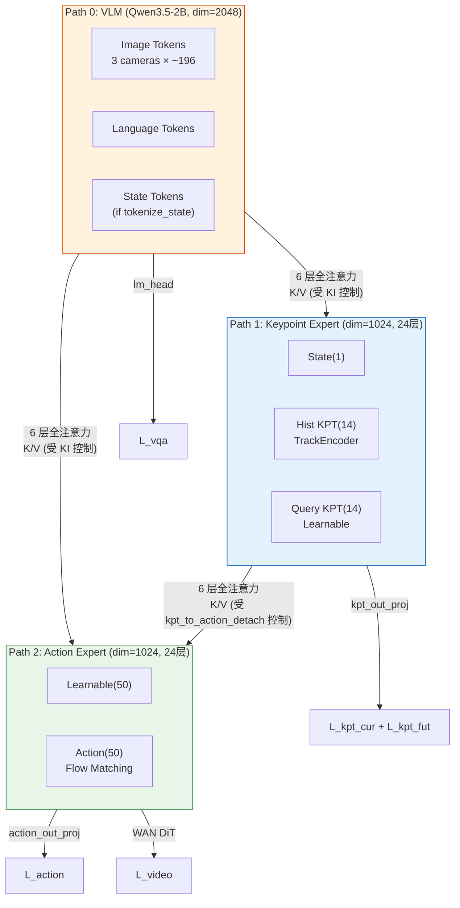
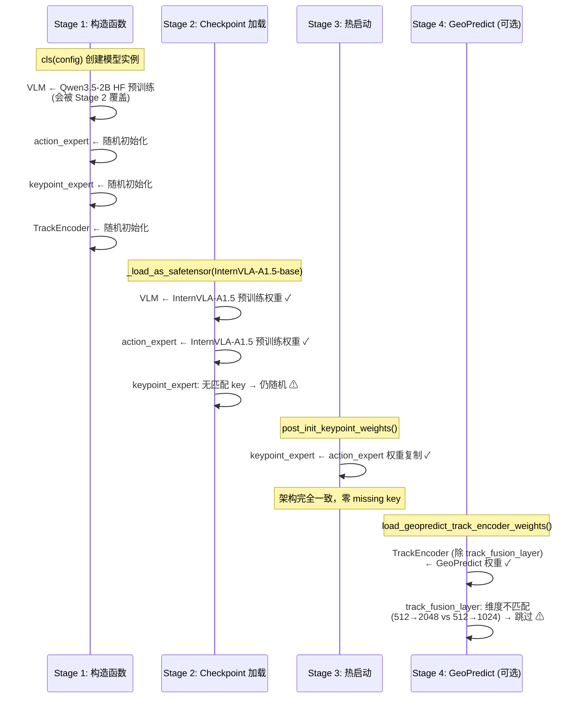
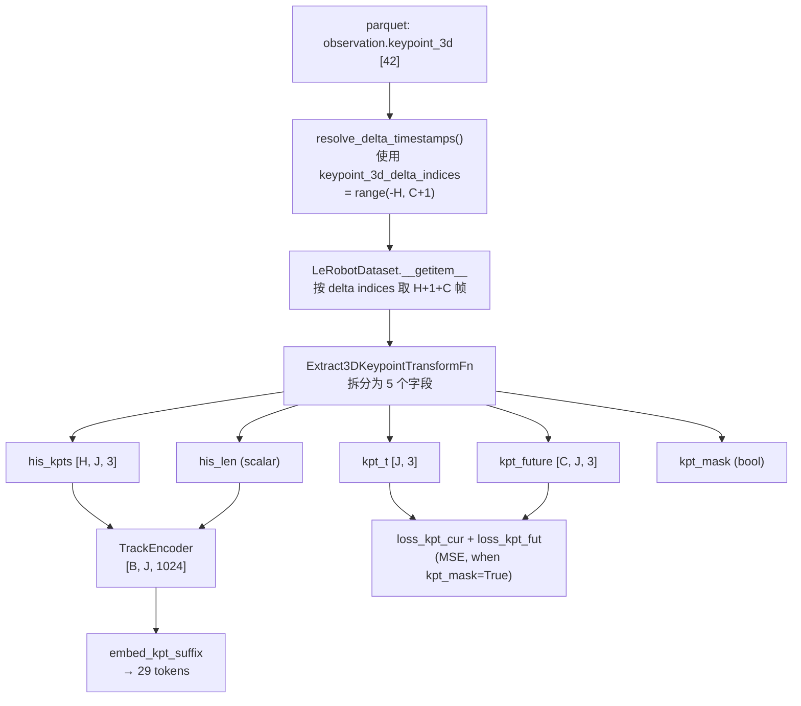

# GeoPredict 融合版 InternVLA-A1.5 在 RoboTwin stack_bowls_three 上的微调实施手册 v2

> **目标**：在三路径 MoT 融合架构（[itrnVLA15_GeoP_3dtrj_3cn2_rbt2stak3.md](itrnVLA15_GeoP_3dtrj_3cn2_rbt2stak3.md) v3.2）的代码**已实现并通过全部 71 项单元测试**后，基于 [InternVLA-A1.5-base](https://huggingface.co/InternRobotics/InternVLA-A1.5-base) + [GeoPredict-Robocasa](https://huggingface.co/Jingjing0601/GeoPredict-Robocasa) 权重，在 RoboTwin 2.0 仿真平台的 `stack_bowls_three`（三碗堆叠）单任务数据集上进行 fine-tune，然后在 RoboTwin 仿真环境中评测 checkpoint 的成功率。
>
> **与 v1 手册的关系**：本手册（v2）是 [itrnVLA15_GeoP_3dtrj_3cn2_sft_rbt2.md](itrnVLA15_GeoP_3dtrj_3cn2_sft_rbt2.md)（v1）的**修正版**。v1 基于 v3.1 设计文档、在代码实现前撰写，存在多处与实际代码不一致的错误（J=8 应为 J=14、CLI flag 名称错误、缺少关键 dataset 配置项、FK pipeline 标注为"未来"但已实现等）。本手册以**当前已验证可运行的代码**为准，所有命令和参数均经过冒烟测试验证。
>
> **与非融合版手册的关系**：本手册是 [reprd_rbtwn_stackb3.md](p/reprd_rbtwn_stackb3.md)（非融合版 InternVLA-A1.5 微调手册）的**3D 融合版对应物**。
>
> 本手册分两部分：**Part A 是可执行的分步操作手册**（先写后执行）；**Part B 是执行记录**。

---

## 目录

- [Part A：实施手册](#part-a实施手册)
  - [0. 关键结论与设计依据](#0-关键结论与设计依据)
  - [1. 环境准备](#1-环境准备)
  - [2. 数据准备](#2-数据准备)
  - [3. 预调探索阶段](#3-预调探索阶段)
  - [4. 训练启动脚本](#4-训练启动脚本)
  - [5. 训练执行与监控](#5-训练执行与监控)
  - [6. 评测](#6-评测)
  - [7. 已知陷阱与对策](#7-已知陷阱与对策)
  - [8. FK 关键点数据生成 Pipeline](#8-fk-关键点数据生成-pipeline)
- [Part B：执行记录](#part-b执行记录)

---

## Part A：实施手册

### 0. 关键结论与设计依据

#### 0.1 为什么需要独立的微调方案

3D 融合版模型与非融合版有 5 项关键差异，使得不能直接复用非融合版的训练脚本：

| 维度 | 非融合版（2 路径） | 3D 融合版（3 路径） |
|---|---|---|
| 架构 | VLM + Action Expert | VLM + **Keypoint Expert** + Action Expert |
| 可训练参数 | ~2.6B | ~2.9B（+~300M kpt expert + ~3M TrackEncoder） |
| Loss 分量 | 3 个（action, vqa, video） | **5~7 个**（+ kpt_current, kpt_future, fast, subtask） |
| 优化器 | 单一 LR，`self.parameters()` | **5 组 per-module LR**，`list[dict]` |
| 配置字段 | ~50 个 | ~77 个（+27 个融合相关字段） |
| 训练模式 | 仅一种 | **Phase 1**（Kpt Expert 预热）+ **Phase 2**（Action 训练）— 课程学习 |

#### 0.2 架构差异摘要（三路径 MoT，J=14）



| 路径 | 功能 | 维度 | Token 数 | 层数 | 参数量 |
|---|---|---|---|---|---|
| **Path 0: VLM** | 视觉-语言理解 | 2048 | ~400-650 | 24 | ~2.0B |
| **Path 1: 关键点专家** | 3D 运动学预测 | 1024 | **29** = state(1)+hist(14)+query(14) | 24 | ~300M |
| **Path 2: 动作专家** | 连续动作生成 | 1024 | 100/101 | 24 | ~300M |
| **TrackEncoder** | 历史轨迹编码 | 512→1024 | — | — | ~3M |

> ⚠️ **v1 手册勘误**：v1 手册使用 J=8（17 tokens），这是基于 v3.1 设计文档的默认值。实际 aloha 双臂机器人有 2 × (6 关节链接 + 1 腕部相机) = **14 个关键点**，kpt_suffix 共 **29** 个 token。
>
> 详细架构设计见 [itrnVLA15_GeoP_3dtrj_3cn2_rbt2stak3.md §2](itrnVLA15_GeoP_3dtrj_3cn2_rbt2stak3.md)。

#### 0.3 权重初始化路径（4 阶段）



| 模块 | 最终权重来源 | 说明 |
|---|---|---|
| VLM（含 vision encoder） | InternVLA-A1.5-base | Stage 2 覆盖 Stage 1 |
| Action Expert（24 层） | InternVLA-A1.5-base | Stage 2 直接加载 |
| Keypoint Expert（24 层） | Action Expert 复制 | Stage 3 `post_init_keypoint_weights()` |
| TrackEncoder（除 fusion layer） | GeoPredict-Robocasa | Stage 4 选择性加载 (~3M params) |
| TrackEncoder.track_fusion_layer | 随机初始化 | output_dim 不匹配 (2048→1024) |
| kpt_state_proj, keypoint_embedding, kpt_out_proj | 随机初始化 | 新模块，无可用权重 |

> ⚠️ **Phase 2 初始化路径不同**：Phase 2 使用 Phase 1 的输出 checkpoint 作为 `pretrained_path`（而非 InternVLA-A1.5-base），且 **`init_kpt_expert_from_action=false`**（否则 Stage 3 会用 action expert 权重覆盖 Phase 1 训练好的 kpt expert），也**不需要** `geopredict_checkpoint_path`（track encoder 已在 Phase 1 checkpoint 中）。

#### 0.4 训练阶段策略：Phase 1（Kpt Expert 预热）与 Phase 2（Action 训练）

本手册采用**两阶段课程学习**策略，两个 Phase **均使用 FK GT 数据** (`stack_bowls_three_kpt`)，但训练重心不同：

| | Phase 1: Kpt Expert 预热 | Phase 2: Action 训练 |
|---|---|---|
| **训练目标** | Kpt Expert 学习准确的 3D 关键点预测 | Action Expert 学习精准的动作 chunk |
| **数据集** | `stack_bowls_three_kpt`（FK 增强） | `stack_bowls_three_kpt`（同） |
| **Checkpoint 来源** | InternVLA-A1.5-base | **Phase 1 输出 checkpoint** |
| **VLM 状态** | 冻结（`train_expert_only=true`） | 冻结（同） |
| **`action_loss_weight`** | **5.0**（降低） | **10.0**（恢复默认） |
| **`kpt_loss_weight`** | **10.0**（= 2× action） | **2.5**（= action/4） |
| **`action_expert_lr_scale`** | **0.1**（低 LR，最小化改变） | **1.0**（恢复正常） |
| **`kpt_expert_lr_scale`** | **1.0**（正常 LR） | **1.0**（同 action） |
| **`init_kpt_expert_from_action`** | **true** | **false** ⚠️ |
| **`geopredict_checkpoint_path`** | 设置（加载 TrackEncoder 权重） | **不设置**（已在 Phase 1 ckpt 中） |
| **`--dataset.enable_keypoint_predictor`** | **true** | **true** |
| **`--dataset.num_keypoint_joints`** | **14** | **14** |
| **可监控 kpt 精度** | 是（`loss_kpt_cur`, `loss_kpt_fut` 应下降） | 是（应维持低位或继续下降） |

**设计理由**：

1. **Phase 1 聚焦 kpt expert**：`kpt_loss_weight` (10.0) = 2× `action_loss_weight` (5.0)，且 action expert 的 LR 为正常值的 1/10，确保 kpt expert 获得主导性的学习信号，action expert 仅做微弱调整。
2. **Phase 2 聚焦 action expert**：`action_loss_weight` (10.0) = 4× `kpt_loss_weight` (2.5)，action expert LR 恢复正常，在 Phase 1 预热好的 kpt 表征基础上学习动作预测。
3. **VLM 全程冻结**：`train_expert_only=true` 将 VLM 所有参数设为 `requires_grad=False`，不进入 optimizer，**节省约 24 GB 的 AdamW 优化器状态**。这比 `vlm_lr_scale=0.0` 更彻底——后者仍会计算 VLM 梯度、占用显存。

**Phase 1 梯度分析**：

- **Kpt Expert（主导）**：直接 MSE 监督 $\xrightarrow{\text{kpt\_loss\_weight=10.0}}$ 强梯度
- **Action Expert（抑制）**：action loss 梯度存在，但 LR=5e-6（`action_expert_lr_scale=0.1`），仅做最小调整
- **VLM**：`requires_grad=False`，零梯度

**Phase 2 梯度分析**：

- **Action Expert（主导）**：action loss $\xrightarrow{\text{action\_loss\_weight=10.0}}$ 强梯度，LR=5e-5（恢复正常）
- **Kpt Expert（辅助）**：kpt loss 继续提供 3D 监督（`kpt_loss_weight=2.5`），防止 kpt 表征退化
- **VLM**：`requires_grad=False`，零梯度

> ⚠️ **`enable_vqa_loss=true` 的必要性**：即使 VLM 冻结，也必须保持 `enable_vqa_loss=true`。这是因为当 `enable_vqa_loss=false` 时，代码中的 loss 公式变为 `loss = loss_fm_action + video_loss_weight × loss_video + loss_kpt`——**`action_loss_weight` 乘子不会被应用**（[modeling_internvla_a1_5.py:2497](../../src/lerobot/policies/internvla_a1_5/modeling_internvla_a1_5.py#L2497)），导致 action loss 以隐含系数 1.0 参与总 loss，Phase 间的权重比例设计将完全失效。保持 `enable_vqa_loss=true` + `train_expert_only=true` 时，VQA loss 虽然被计算，但 VLM 的 `requires_grad=False` 阻止了任何梯度传播，不影响 VLM 权重。

#### 0.5 显存预算分析

非融合版基线（来自 [reprd_rbtwn_stackb3.md Part B](p/reprd_rbtwn_stackb3.md)）：

| 配置 | per-GPU bs | 显存 | 结果 |
|---|---|---|---|
| 8×H200, action_loss_only=false (WAN), 3 cam | 16 | ~135.7 GB | 稳定 |

3D 融合版额外开销（J=14, 29 tokens）：

| 组件 | 参数量 | bf16 权重 | AdamW 状态 (fp32) | 小计 |
|---|---|---|---|---|
| Keypoint Expert (24 层) | ~300M | ~600 MB | ~2.4 GB | ~3.0 GB |
| TrackEncoder | ~3M | ~6 MB | ~24 MB | ~30 MB |
| kpt_state_proj + embedding + out_proj | <1M | ~2 MB | ~8 MB | ~10 MB |
| kpt suffix 激活 (29 tokens × bs) | — | — | — | ~85 MB (bs=8) |
| **总计额外** | ~304M | ~608 MB | ~2.43 GB | **~3.1 GB** |

> 注意：v1 手册按 17 tokens 估算激活开销为 ~50 MB，实际 29 tokens 约为 ~85 MB (bs=8)。差异不大，不影响可行性判断。

**`train_expert_only=true` 的显存优势**：VLM (~2.0B params) 的 `requires_grad=False` 使其完全不进入 optimizer（`get_optim_params()` 在 [modeling_internvla_a1_5.py:2198](../../src/lerobot/policies/internvla_a1_5/modeling_internvla_a1_5.py#L2198) 过滤掉 `requires_grad=False` 的参数），节省 AdamW fp32 状态约 **24 GB**（2B × 12 bytes/param）。同时 VLM 的反向传播也被跳过，减少激活内存。

| 配置 | 预估显存/卡 | H200 余量 | 可行性 |
|---|---|---|---|
| bs=8, `action_loss_only=true`, **`train_expert_only=true`** | **~103 GB** | **~40 GB** | ✅ 很舒适 |
| bs=8, `action_loss_only=true` (无 WAN, VLM 可训练) | ~127 GB | ~16 GB | 舒适 |
| bs=8, `action_loss_only=false` (有 WAN, VLM 可训练) | ~139 GB | ~4 GB | **紧张** |

#### 0.6 Per-module LR 分组设计（5 组）

> ⚠️ **v1 手册勘误**：v1 手册描述 4 组 LR 分组，实际代码 `get_optim_params()` ([modeling_internvla_a1_5.py:2174-2224](../../src/lerobot/policies/internvla_a1_5/modeling_internvla_a1_5.py#L2174)) 使用 **5 组**。

当 `enable_keypoint_predictor=True` 且任意 LR scale ≠ 1.0 时，`get_optim_params()` 返回 `list[dict]`：

| 组 | 匹配模块 | LR 计算 |
|---|---|---|
| **track_encoder** | `model.track_encoder` | `base_lr × track_encoder_lr_scale` |
| **kpt_expert** | `model.kpt_state_proj`, `model.keypoint_embedding`, `model.keypoint_out_proj`, `model.qwen3_5_with_expert.keypoint_expert`（排除 track_encoder 的参数） | `base_lr × kpt_expert_lr_scale` |
| **action_expert** | `model.qwen3_5_with_expert.action_expert` | `base_lr × action_expert_lr_scale` |
| **vlm** | `model.qwen3_5_with_expert.qwen3_5` | `base_lr × vlm_lr_scale` |
| **other** | 所有剩余参数 | `base_lr` |

参数分组优先级（`for p in self.parameters()` 循环中）：

1. 首先检查 `track_encoder` 参数（最高优先级）
2. 然后检查 `kpt_param_ids`（5 个 kpt 模块的并集，减去已分入 track_encoder 的）
3. 然后检查 `action_param_ids`
4. 然后检查 `vlm_param_ids`
5. 剩余 → `other_params`

> ⚠️ 当 `train_expert_only=true` 时，VLM 参数的 `requires_grad=False`，在 [modeling_internvla_a1_5.py:2198](../../src/lerobot/policies/internvla_a1_5/modeling_internvla_a1_5.py#L2198) 被过滤掉，**不会进入任何 optimizer group**。此时 `vlm_lr_scale` 的值无关紧要。

**Phase 1 (Kpt Expert 预热) LR 配置**：

| 组 | LR Scale | 实际 LR | 角色 |
|---|---|---|---|
| **vlm** | N/A（`train_expert_only=true`，不在 optimizer 中） | 0 | 冻结 |
| **action_expert** | **0.1** | **5e-6** | 最小化改变 |
| **kpt_expert** | **1.0** | 5e-5 | **主要学习对象** |
| **track_encoder** | 1.0 | 5e-5 | 学习轨迹编码 |
| **other** | 1.0 | 5e-5 | 正常 |

**Phase 2 (Action 训练) LR 配置**：

| 组 | LR Scale | 实际 LR | 角色 |
|---|---|---|---|
| **vlm** | N/A（同 Phase 1） | 0 | 冻结 |
| **action_expert** | **1.0** | 5e-5 | **恢复正常，主要学习对象** |
| **kpt_expert** | 1.0 | 5e-5 | 同 action（维持 kpt 表征） |
| **track_encoder** | 1.0 | 5e-5 | 同 |
| **other** | 1.0 | 5e-5 | 同 |

> **日志注意**：`lerobot_train.py` 显示的 `lr=` 是 `optimizer.param_groups[0]["lr"]`。当 `train_expert_only=true` 时，VLM 参数不在 optimizer 中，第一组变为 track_encoder 或 kpt_expert（取决于参数遍历顺序），`lr` 应显示为 `5.0e-5`。如果显示为 `0.0e+0`，说明 `train_expert_only` 未生效或 VLM 参数仍意外进入了 optimizer。验证方法见 §5.3。

---

### 1. 环境准备

#### 1.1 虚拟环境

使用已验证的 venv `/mnt/r/VENV/itrnvla15rbt/`（在冒烟测试中已确认可用）：

```bash
source /mnt/r/VENV/itrnvla15rbt/bin/activate
```

> v1 手册使用假设路径 `/mnt/r/VENV/ivla15_geop/`，本手册使用实际可用的 venv。

#### 1.2 pinocchio + URDF（FK 关键点生成所需）

两个 Phase 均使用 FK 增强数据集，数据生成需要 pinocchio 库和 aloha URDF 文件：

```bash
source /mnt/r/VENV/itrnvla15rbt/bin/activate

# 检查 pinocchio
python -c "import pinocchio; print('pinocchio:', pinocchio.__version__)"

# 如果缺失
# pip install pin  # pinocchio Python bindings

# 验证 URDF 存在
ls /mnt/r/share/zwy/Projects/RoboTwin/assets/embodiments/aloha-agilex/urdf/arx5_description_isaac.urdf
```

#### 1.3 Transformers patch 验证

```bash
TRANSFORMERS_DIR=/mnt/r/VENV/itrnvla15rbt/lib/python3.11/site-packages/transformers/

if [ -f "${TRANSFORMERS_DIR}/models/qwen3_5/modeling_qwen3_5.py" ]; then
    echo "Transformers patch already present."
else
    echo "Applying transformers patch..."
    cd /home/physical/SRC/Robot/InternVLA-A-series
    cp -r src/lerobot/policies/pi0/transformers_replace/models ${TRANSFORMERS_DIR}
    cp -r src/lerobot/policies/pi05/transformers_replace/models ${TRANSFORMERS_DIR}
    cp -r src/lerobot/policies/internvla_a1_5/transformers_replace/models ${TRANSFORMERS_DIR}
    echo "Done."
fi
```

#### 1.4 GeoPredict 权重下载

```bash
mkdir -p /mnt/r/CKPT/GeoPredict

huggingface-cli download Jingjing0601/GeoPredict-Robocasa \
  --local-dir /mnt/r/CKPT/GeoPredict \
  --include "GeoPredict_robocasa.pth"

ls -lh /mnt/r/CKPT/GeoPredict/GeoPredict_robocasa.pth
# 预期：约 6.54 GB
```

#### 1.5 环境变量约定

```bash
export HF_HOME=/mnt/r/CKPT/hf_home
export HF_LEROBOT_HOME=${HF_HOME}/lerobot
export VENV_ROOT=/mnt/r/VENV/itrnvla15rbt
```

#### 1.6 环境验证

```bash
source /mnt/r/VENV/itrnvla15rbt/bin/activate

python -c "
import torch; print('torch:', torch.__version__, '| CUDA:', torch.version.cuda)
import transformers; print('transformers:', transformers.__version__)
import lerobot; print('lerobot:', lerobot.__version__)
import torchcodec; print('torchcodec:', torchcodec.__version__)
import flash_attn; print('flash_attn:', flash_attn.__version__)
import einops; print('einops:', einops.__version__)
print('GPU count:', torch.cuda.device_count())
for i in range(torch.cuda.device_count()):
    print(f'  GPU{i}: {torch.cuda.get_device_name(i)} ({torch.cuda.get_device_properties(i).total_mem / 1024**3:.0f}GB)')
"
```

预期输出：

```
torch: 2.10.0+cu128 | CUDA: 12.8
transformers: 5.2.0
lerobot: 1.0.0
torchcodec: 0.10.0      ← 必须 0.10.0，不是 0.15.0（见 #E1）
flash_attn: 2.8.3
einops: 0.8.2
```

---

### 2. 数据准备

两个 Phase 均使用同一个 FK 增强数据集 `stack_bowls_three_kpt`。

#### 2.1 FK 关键点数据生成

使用 `util_scripts/generate_aloha_keypoints.py` 从 14 维关节角度计算 14 个 3D 关键点位置：

```bash
source /mnt/r/VENV/itrnvla15rbt/bin/activate
cd /home/physical/SRC/Robot/InternVLA-A-series

python util_scripts/generate_aloha_keypoints.py \
  --source data/robotwin/stack_bowls_three \
  --dest data/robotwin/stack_bowls_three_kpt
```

> 详细 FK pipeline 说明见 §8。已验证结果：23550 帧处理完成，`observation.keypoint_3d [42]`（14 joints × 3 coords），关键点距原点距离 0.84-1.23m。

> **关于生成结果的文件数量**：生成的 `_kpt` 数据集中，`data/chunk-000/` 下只有 1 个 parquet 文件（`file-000.parquet`），`videos/observation.images.cam_*/chunk-000/` 下每个 camera 也只有 1 个 mp4 文件（`file-000.mp4`）。这是 **LeRobot v2 格式的正常结构**——所有 50 个 episode 的 23550 帧数据合并存储在同一个 parquet 中，通过 `episode_index` + `frame_index` 列索引定位到具体帧；视频同理，所有 episode 的帧拼接在同一个 mp4 里。原始数据集 `stack_bowls_three` 也是相同结构（1 parquet + 3 个 mp4）。`_kpt` 版的视频文件是从原始数据集直接复制的，parquet 仅多出 `observation.keypoint_3d` 列。

创建 FK 数据集的 HF_LEROBOT_HOME symlink：

```bash
export HF_HOME=/mnt/r/CKPT/hf_home
ln -sf $(realpath data/robotwin/stack_bowls_three_kpt) \
  ${HF_HOME}/lerobot/robotwin/stack_bowls_three_kpt
```

验证生成结果：

```bash
python3 -c "
import json, pyarrow.parquet as pq

info = json.load(open('data/robotwin/stack_bowls_three_kpt/meta/info.json'))
print('keypoint_3d declared:', 'observation.keypoint_3d' in info.get('features', {}))
print('version:', info['codebase_version'])   # v3.0
print('robot_type:', info['robot_type'])       # aloha
print('episodes:', info['total_episodes'])     # 50
print('frames:', info['total_frames'])         # 23550

pf = pq.read_table('data/robotwin/stack_bowls_three_kpt/data/chunk-000/episode_000000.parquet')
kpt = pf['observation.keypoint_3d']
print(f'keypoint shape per frame: {len(kpt[0])}')  # 预期 42 = 14×3
print(f'total frames: {len(kpt)}')
"
```

#### 2.2 外部统计量

两个 Phase 共用相同的 action/state 归一化统计量，无需重新计算：

```bash
ls -la ${HF_HOME}/lerobot/stats/aloha/abs/agg_1repos_1c27ca3df3/stats.json
```

---

### 3. 预调探索阶段

预调阶段是本手册**核心章节**。使用 **8 次 200-400 步短训练**，分别覆盖 Phase 1（Kpt Expert 预热）和 Phase 2（Action 训练）两种配置，系统地探索超参空间。

> ⚠️ **前提**：§2.1 的 FK 关键点数据已生成完毕。所有探索 run 均使用 FK 增强数据集 `stack_bowls_three_kpt`。

#### 3.1 探索策略

| 阶段 | Run | 主要目标 | 关键超参 | 关键验证项 |
|---|---|---|---|---|
| Phase 1 | P1-1 | 最大 BS + 初始化 + VLM 冻结验证 | `train_expert_only=true`, bs=8 | 显存、权重初始化、VLM 不在 optimizer |
| Phase 1 | P1-2 | kpt_loss_weight 敏感性 | 5.0 / 10.0 / 20.0 | kpt loss 下降速率 vs action loss 稳定性 |
| Phase 1 | P1-3 | action_expert_lr_scale 敏感性 | 0.05 / 0.1 / 0.2 | action loss 稳定、kpt loss 不受干扰 |
| Phase 1 | P1-4 | Phase 1 收敛验证 | 最优组合 400 步 | kpt loss 是否充分下降 |
| Phase 2 | P2-1 | Phase 2 基线 | P1 ckpt, action_w=10, kpt_w=2.5 | action loss 下降、kpt loss 维持 |
| Phase 2 | P2-2 | action/kpt weight ratio | action_w/kpt_w 比值调整 | loss 平衡 |
| Phase 2 | P2-3 | WAN 启用可行性 | action_loss_only=false | 显存、loss_video |
| Phase 2 | P2-4 | 最优组合验证 | 综合最优 400 步 | 综合性能 |

每 run 200-400 步，单卡（`CUDA_VISIBLE_DEVICES=0`），预计每 run 约 5-10 分钟。

#### 3.2 探索脚本基础模板（Phase 1）

以下为 Phase 1 探索 run 共用的命令基础结构：

```bash
source /mnt/r/VENV/itrnvla15rbt/bin/activate
cd /home/physical/SRC/Robot/InternVLA-A-series

HF_LEROBOT_HOME=/mnt/r/CKPT/hf_home/lerobot \
CUDA_VISIBLE_DEVICES=0 \
accelerate launch --num_processes=1 \
  src/lerobot/scripts/lerobot_train.py \
  --policy.type=internvla_a1_5 \
  --policy.pretrained_path=/mnt/r/CKPT/InternVLA-A1.5-base \
  --policy.push_to_hub=false \
  --policy.dtype=bfloat16 \
  --policy.optimizer_lr=5e-5 \
  --policy.scheduler_warmup_steps=50 \
  --policy.scheduler_decay_steps=400 \
  --policy.scheduler_decay_lr=5e-6 \
  --policy.vlm_model_name_or_path=Qwen/Qwen3.5-2B \
  --policy.enable_vqa_loss=true \
  --policy.tokenize_state=true \
  --policy.freeze_learnable_tokens=true \
  --policy.num_learnable_tokens=50 \
  --policy.action_loss_only=true \
  --policy.train_expert_only=true \
  --policy.enable_keypoint_predictor=true \
  --policy.num_keypoint_joints=14 \
  --policy.init_kpt_expert_from_action=true \
  --policy.action_loss_weight=5.0 \
  --policy.kpt_loss_weight=10.0 \
  --policy.kpt_future_loss_weight=1.0 \
  --policy.kpt_to_action_detach=false \
  --policy.knowledge_insulation=true \
  --policy.knowledge_insulation_kpt=true \
  --policy.action_expert_lr_scale=0.1 \
  --policy.kpt_expert_lr_scale=1.0 \
  --policy.track_encoder_lr_scale=1.0 \
  --dataset.type=internvla_a1_5 \
  --dataset.repo_id=robotwin/stack_bowls_three_kpt \
  --dataset.enable_keypoint_predictor=true \
  --dataset.num_keypoint_joints=14 \
  --dataset.action_mode=abs \
  --dataset.use_external_stats=true \
  --dataset.external_stats_path=/mnt/r/CKPT/hf_home/lerobot/stats/aloha/abs/agg_1repos_1c27ca3df3/stats.json \
  --dataset.dist_loading=false \
  --dataset.tokenize_state=true \
  --dataset.use_fast_action_tokens=true \
  --seed=42 \
  --log_freq=10 \
  --wandb.enable=false \
  # ---- 以下参数因 run 而异 ----
  --steps=400 \
  --batch_size=2 \
  --save_freq=200 \
  --output_dir=outputs/explore/<RUN_NAME> \
  --policy.geopredict_checkpoint_path=/mnt/r/CKPT/GeoPredict/GeoPredict_robocasa.pth
```

> ⚠️ **CLI flag 命名**：训练参数使用**扁平 flag**（`--steps`, `--batch_size`, `--output_dir`, `--save_freq`, `--log_freq`），**不是** `--training.*`。这是 v1 手册的重要勘误项（见 #21）。

> ⚠️ **`--policy.push_to_hub=false`**：必须显式设置，否则会因缺少有效 HuggingFace hub repo_id 而报 `ValueError`（见 #22）。

#### 3.3 Phase 1 探索（Kpt Expert 预热）

##### Run P1-1：最大 Batch Size + 初始化 + VLM 冻结验证

**目标**：确定 `action_loss_only=true` + `train_expert_only=true` 下的最大 per-GPU batch size，验证权重初始化和 VLM 冻结。

```bash
HF_LEROBOT_HOME=/mnt/r/CKPT/hf_home/lerobot \
CUDA_VISIBLE_DEVICES=0 \
accelerate launch --num_processes=1 \
  src/lerobot/scripts/lerobot_train.py \
  --policy.type=internvla_a1_5 \
  --policy.pretrained_path=/mnt/r/CKPT/InternVLA-A1.5-base \
  --policy.push_to_hub=false \
  --policy.dtype=bfloat16 \
  --policy.optimizer_lr=5e-5 \
  --policy.scheduler_warmup_steps=50 \
  --policy.scheduler_decay_steps=200 \
  --policy.scheduler_decay_lr=5e-6 \
  --policy.vlm_model_name_or_path=Qwen/Qwen3.5-2B \
  --policy.enable_vqa_loss=true \
  --policy.tokenize_state=true \
  --policy.freeze_learnable_tokens=true \
  --policy.num_learnable_tokens=50 \
  --policy.action_loss_only=true \
  --policy.train_expert_only=true \
  --policy.enable_keypoint_predictor=true \
  --policy.num_keypoint_joints=14 \
  --policy.init_kpt_expert_from_action=true \
  --policy.action_loss_weight=5.0 \
  --policy.kpt_loss_weight=10.0 \
  --policy.kpt_future_loss_weight=1.0 \
  --policy.kpt_to_action_detach=false \
  --policy.knowledge_insulation=true \
  --policy.knowledge_insulation_kpt=true \
  --policy.action_expert_lr_scale=0.1 \
  --policy.kpt_expert_lr_scale=1.0 \
  --policy.track_encoder_lr_scale=1.0 \
  --policy.geopredict_checkpoint_path=/mnt/r/CKPT/GeoPredict/GeoPredict_robocasa.pth \
  --dataset.type=internvla_a1_5 \
  --dataset.repo_id=robotwin/stack_bowls_three_kpt \
  --dataset.enable_keypoint_predictor=true \
  --dataset.num_keypoint_joints=14 \
  --dataset.action_mode=abs \
  --dataset.use_external_stats=true \
  --dataset.external_stats_path=/mnt/r/CKPT/hf_home/lerobot/stats/aloha/abs/agg_1repos_1c27ca3df3/stats.json \
  --dataset.dist_loading=false \
  --dataset.tokenize_state=true \
  --dataset.use_fast_action_tokens=true \
  --seed=42 \
  --steps=200 \
  --batch_size=8 \
  --save_freq=200 \
  --log_freq=10 \
  --output_dir=outputs/explore/p1_1_bs8_expert_only \
  --wandb.enable=false
```

**监控**：

1. `watch -n 2 nvidia-smi` 记录显存（预期比之前更低：`train_expert_only=true` 节省 ~24 GB optimizer state）
2. 若 OOM，改 `--batch_size=4` 重试
3. 检查启动日志中 `post_init_keypoint_weights` 的成功信息
4. **验证 VLM 冻结**：检查 optimizer 参数组数量和各组参数量
5. **验证 kpt loss 出现**：`loss_kpt_cur` 和 `loss_kpt_fut` 应为正数且下降趋势

**验证 VLM 不在 optimizer 中**（训练完成后执行）：

```bash
python3 -c "
import torch
state = torch.load('outputs/explore/p1_1_bs8_expert_only/checkpoints/last/training_state.pt', map_location='cpu')
for i, pg in enumerate(state['optimizer']['param_groups']):
    n_params = len(pg['params'])
    print(f'  Group {i}: lr={pg[\"lr\"]:.2e}, n_params={n_params}')
# 预期：VLM 组的参数数为 0 或 VLM 组不存在
"
```

##### Run P1-2：kpt_loss_weight 敏感性

使用 Run P1-1 确定的 batch size，对比不同 `kpt_loss_weight`（`action_loss_weight` 固定为 5.0）：

```bash
# Config A: kpt_loss_weight=5.0 (kpt = action, 1:1)
#   --policy.kpt_loss_weight=5.0
#   --output_dir=outputs/explore/p1_2a_kptw5

# Config B: kpt_loss_weight=10.0 (kpt = 2× action, 默认推荐)
#   --policy.kpt_loss_weight=10.0
#   --output_dir=outputs/explore/p1_2b_kptw10

# Config C: kpt_loss_weight=20.0 (kpt = 4× action, 强 kpt)
#   --policy.kpt_loss_weight=20.0
#   --output_dir=outputs/explore/p1_2c_kptw20
```

**对比指标**：

| 指标 | A (kpt:act=1:1) | B (kpt:act=2:1) | C (kpt:act=4:1) |
|---|---|---|---|
| `loss_kpt_cur` @ step 400 | | | |
| `loss_kpt_fut` @ step 400 | | | |
| `loss_action` 变化幅度 | | | |
| `grad_norm` 稳定性 | | | |

> **选择原则**：kpt loss 应明显下降（收敛），同时 action loss 不应大幅恶化。过高的 `kpt_loss_weight` 可能导致 grad_norm 不稳定。

##### Run P1-3：action_expert_lr_scale 敏感性

确认 action expert 在 Phase 1 的 LR 低到何种程度既不干扰 kpt 训练，又能保持合理的 action 表征：

```bash
# Config A: action_expert_lr_scale=0.05 (极低，几乎冻结)
#   --policy.action_expert_lr_scale=0.05
#   --output_dir=outputs/explore/p1_3a_actlr005

# Config B: action_expert_lr_scale=0.1 (默认推荐)
#   --policy.action_expert_lr_scale=0.1
#   --output_dir=outputs/explore/p1_3b_actlr01

# Config C: action_expert_lr_scale=0.2 (较高)
#   --policy.action_expert_lr_scale=0.2
#   --output_dir=outputs/explore/p1_3c_actlr02
```

**对比指标**：

| 指标 | A (lr_s=0.05) | B (lr_s=0.1) | C (lr_s=0.2) |
|---|---|---|---|
| `loss_action` @ step 400 | | | |
| `loss_kpt_cur` @ step 400 | | | |
| action loss 波动程度 | | | |

> **选择原则**：Phase 1 中 action expert 的权重变化应最小化。如果 `loss_action` 在 Phase 1 中大幅波动，说明 action expert LR 过高。

##### Run P1-4：Phase 1 收敛验证

使用 P1-2、P1-3 确定的最优超参，跑 400 步验证 kpt loss 是否充分收敛：

```bash
# 使用 P1-2 确定的 kpt_loss_weight
# 使用 P1-3 确定的 action_expert_lr_scale
# --steps=400
# --output_dir=outputs/explore/p1_4_convergence
```

**验证清单**：

- [ ] `loss_kpt_cur` 下降 > 50%
- [ ] `loss_kpt_fut` 下降 > 30%
- [ ] `loss_action` 变化幅度 < 30%
- [ ] `grad_norm` 无爆炸（< 20）
- [ ] 此 run 的 checkpoint 将作为 Phase 2 的 `pretrained_path`

#### 3.4 Phase 2 探索（Action 训练）

> **前提**：Phase 1 探索完成，P1-4 的 checkpoint 可用。

Phase 2 与 Phase 1 的**关键差异**：
1. **Checkpoint 来源**：Phase 1 输出 checkpoint（不再是 InternVLA-A1.5-base）
2. **`init_kpt_expert_from_action=false`**：⚠️ **绝对不能设为 true**（见 #23）
3. **不设 `geopredict_checkpoint_path`**：track encoder 已在 Phase 1 checkpoint 中
4. **权重比例反转**：`action_loss_weight` (10.0) >> `kpt_loss_weight` (2.5)
5. **`action_expert_lr_scale=1.0`**：action expert LR 恢复正常

##### Run P2-1：Phase 2 基线

```bash
HF_LEROBOT_HOME=/mnt/r/CKPT/hf_home/lerobot \
CUDA_VISIBLE_DEVICES=0 \
accelerate launch --num_processes=1 \
  src/lerobot/scripts/lerobot_train.py \
  --policy.type=internvla_a1_5 \
  --policy.pretrained_path=outputs/explore/p1_4_convergence/checkpoints/last/pretrained_model \
  --policy.push_to_hub=false \
  --policy.dtype=bfloat16 \
  --policy.optimizer_lr=5e-5 \
  --policy.scheduler_warmup_steps=50 \
  --policy.scheduler_decay_steps=400 \
  --policy.scheduler_decay_lr=5e-6 \
  --policy.vlm_model_name_or_path=Qwen/Qwen3.5-2B \
  --policy.enable_vqa_loss=true \
  --policy.tokenize_state=true \
  --policy.freeze_learnable_tokens=true \
  --policy.num_learnable_tokens=50 \
  --policy.action_loss_only=true \
  --policy.train_expert_only=true \
  --policy.enable_keypoint_predictor=true \
  --policy.num_keypoint_joints=14 \
  --policy.init_kpt_expert_from_action=false \
  --policy.action_loss_weight=10.0 \
  --policy.kpt_loss_weight=2.5 \
  --policy.kpt_future_loss_weight=1.0 \
  --policy.kpt_to_action_detach=false \
  --policy.knowledge_insulation=true \
  --policy.knowledge_insulation_kpt=true \
  --policy.action_expert_lr_scale=1.0 \
  --policy.kpt_expert_lr_scale=1.0 \
  --policy.track_encoder_lr_scale=1.0 \
  --dataset.type=internvla_a1_5 \
  --dataset.repo_id=robotwin/stack_bowls_three_kpt \
  --dataset.enable_keypoint_predictor=true \
  --dataset.num_keypoint_joints=14 \
  --dataset.action_mode=abs \
  --dataset.use_external_stats=true \
  --dataset.external_stats_path=/mnt/r/CKPT/hf_home/lerobot/stats/aloha/abs/agg_1repos_1c27ca3df3/stats.json \
  --dataset.dist_loading=false \
  --dataset.tokenize_state=true \
  --dataset.use_fast_action_tokens=true \
  --seed=42 \
  --steps=400 \
  --batch_size=2 \
  --save_freq=200 \
  --log_freq=10 \
  --output_dir=outputs/explore/p2_1_action_baseline \
  --wandb.enable=false
```

**验证清单**：

- [ ] `loss_action` **下降**（Phase 2 的主要训练信号）
- [ ] `loss_kpt_cur` 和 `loss_kpt_fut` **维持低位**或继续轻微下降（不应大幅回升）
- [ ] `loss_kpt_cur` 初始值 ≈ Phase 1 结束时的值（验证 `init_kpt_expert_from_action=false` 正确保留了 Phase 1 训练成果）
- [ ] 无 NaN，无崩溃

##### Run P2-2：action_loss_weight / kpt_loss_weight 比值调整

```bash
# Config A: action:kpt = 2:1 (较温和)
#   --policy.action_loss_weight=10.0 --policy.kpt_loss_weight=5.0
#   --output_dir=outputs/explore/p2_2a_ratio2

# Config B: action:kpt = 4:1 (默认推荐)
#   --policy.action_loss_weight=10.0 --policy.kpt_loss_weight=2.5
#   --output_dir=outputs/explore/p2_2b_ratio4

# Config C: action:kpt = 8:1 (弱 kpt 维持)
#   --policy.action_loss_weight=10.0 --policy.kpt_loss_weight=1.25
#   --output_dir=outputs/explore/p2_2c_ratio8
```

**对比指标**：

| 指标 | A (2:1) | B (4:1) | C (8:1) |
|---|---|---|---|
| `loss_action` @ step 400 | | | |
| `loss_kpt_cur` 是否维持低位 | | | |
| `loss_kpt_fut` 是否维持低位 | | | |
| `grad_norm` 稳定性 | | | |

> **选择原则**：kpt loss 不应大幅回升（说明 kpt 表征退化），action loss 应有明显下降。

##### Run P2-3：WAN 启用可行性

```bash
# 修改 P2-1 基线：
#   --policy.action_loss_only=false
#   --policy.wan_checkpoint_path=/mnt/r/CKPT/Wan2.2-TI2V-5B
#   --policy.wan_config_path=/mnt/r/CKPT/Wan2.2-TI2V-5B
#   --policy.vae_path=/mnt/r/CKPT/Wan2.2-TI2V-5B/Wan2.2_VAE.pth
#   --batch_size=<可能需要降低>
#   --output_dir=outputs/explore/p2_3_wan
```

**验证清单**：

- [ ] `loss_video` 出现且有限
- [ ] 显存 < 143 GB (H200)
- [ ] 所有 loss 分量均正常打印

##### Run P2-4：最优组合验证

综合 P2 探索结果，用最优配置做一次 400 步验证：

```bash
# 使用 P2-2 确定的 action/kpt weight ratio
# 使用 P2-3 确定的 action_loss_only
# --output_dir=outputs/explore/p2_4_best_combo
```

#### 3.5 决策矩阵

根据探索结果填写正式训练配置：

| 参数 | Phase 1 值 | Phase 2 值 | 依据 |
|---|---|---|---|
| `batch_size` | | 同 Phase 1 | P1-1 |
| `train_expert_only` | true | true | 设计要求 |
| `action_loss_only` | true | 由 P2-3 决定 | P2-3 |
| `kpt_loss_weight` | 由 P1-2 决定 | 由 P2-2 决定 | P1-2, P2-2 |
| `action_loss_weight` | 5.0 | 10.0 | 设计要求 |
| `action_expert_lr_scale` | 由 P1-3 决定 | 1.0 | P1-3 |
| Phase 1 步数 | 由 P1-4 决定 | — | P1-4 |

#### 3.6 探索结果汇总表

| Run | Config 摘要 | BS | 显存 | iters/s | loss@end | loss_action@end | loss_kpt_cur | loss_kpt_fut | grad_norm |
|---|---|---|---|---|---|---|---|---|---|
| P1-1 | bs=8, expert_only | | | | | | | | |
| P1-2a | kpt_w=5 | | | | | | | | |
| P1-2b | kpt_w=10 | | | | | | | | |
| P1-2c | kpt_w=20 | | | | | | | | |
| P1-3a | act_lr=0.05 | | | | | | | | |
| P1-3b | act_lr=0.1 | | | | | | | | |
| P1-3c | act_lr=0.2 | | | | | | | | |
| P1-4 | convergence | | | | | | | | |
| P2-1 | action baseline | | | | | | | | |
| P2-2a | ratio 2:1 | | | | | | | | |
| P2-2b | ratio 4:1 | | | | | | | | |
| P2-2c | ratio 8:1 | | | | | | | | |
| P2-3 | WAN on | | | | | | | | |
| P2-4 | best combo | | | | | | | | |

---

### 4. 训练启动脚本

#### 4.1 Phase 1 正式训练脚本（Kpt Expert 预热）

基于 `launch/internvla_a15_finetune_robotwin_stackb3_venv.sh` 结构，添加 3D 融合 + 课程学习配置：

```bash
#!/usr/bin/env bash
set -euo pipefail

###############################################################################
# Phase 1 fine-tune: Kpt Expert Warm-up
#
# 训练目标：Kpt Expert 学习准确的 3D 关键点预测
# 策略：kpt_loss_weight (10.0) = 2× action_loss_weight (5.0)
#       action expert LR 极低 (0.1×)，最小化改变
#       VLM 完全冻结 (train_expert_only=true)
#
# 数据集：FK 增强版 stack_bowls_three_kpt（含 observation.keypoint_3d）
###############################################################################

################################# ENV config ##################################

export HF_HOME="${HF_HOME:-/mnt/r/CKPT/hf_home}"
export HF_LEROBOT_HOME="${HF_LEROBOT_HOME:-${HF_HOME}/lerobot}"

VENV_ROOT="${VENV_ROOT:-/mnt/r/VENV/itrnvla15rbt}"
source "${VENV_ROOT}/bin/activate"

export WANDB_MODE=offline
export USE_LIBUV=${USE_LIBUV:-0}

export MASTER_ADDR=${MASTER_ADDR:-"127.0.0.1"}
export MASTER_PORT=${MASTER_PORT:-36200}

export CUDA_VISIBLE_DEVICES="${CUDA_VISIBLE_DEVICES:-0,1,2,3,4,5,6,7}"
PROC_PER_NODE="${PROC_PER_NODE:-8}"
NODE_COUNT="${NODE_COUNT:-1}"
NODE_RANK="${NODE_RANK:-0}"
NUM_PROCESSES=$((NODE_COUNT * PROC_PER_NODE))

export CUDA_HOME="/usr/local/cuda-12.8"
export LD_LIBRARY_PATH="$CUDA_HOME/lib64:${LD_LIBRARY_PATH:-}"
export LD_LIBRARY_PATH="${VENV_ROOT}/lib:${LD_LIBRARY_PATH}"

export PYTHONUNBUFFERED=1
export OMP_NUM_THREADS=1
export MKL_NUM_THREADS=1
export TOKENIZERS_PARALLELISM=false

############################## TRAINING config ################################

SCRIPT_DIR="$(cd "$(dirname "${BASH_SOURCE[0]}")" && pwd)"
PROJ_ROOT="$(cd "${SCRIPT_DIR}/.." && pwd)"
cd "${PROJ_ROOT}"

POLICY="internvla_a1_5"
PRETRAINED_PATH="${PRETRAINED_PATH:-/mnt/r/CKPT/InternVLA-A1.5-base}"
VLM_MODEL_PATH="${VLM_MODEL_PATH:-Qwen/Qwen3.5-2B}"
GEOPREDICT_CKPT="${GEOPREDICT_CKPT:-/mnt/r/CKPT/GeoPredict/GeoPredict_robocasa.pth}"

DATASET_REPO_ID="${DATASET_REPO_ID:-robotwin/stack_bowls_three_kpt}"
ACTION_TYPE=abs
USE_EXTERNAL_STATS=true
EXTERNAL_STATS_PATH="${EXTERNAL_STATS_PATH:-${HF_HOME}/lerobot/stats/aloha/${ACTION_TYPE}/agg_1repos_1c27ca3df3/stats.json}"

# ---- 以下参数由预调阶段（§3）决定 ----
BATCH_SIZE="${BATCH_SIZE:-8}"
ACTION_LOSS_ONLY="${ACTION_LOSS_ONLY:-true}"

# ---- Phase 1 课程学习参数 ----
ACTION_LOSS_WEIGHT="${ACTION_LOSS_WEIGHT:-5.0}"
KPT_LOSS_WEIGHT="${KPT_LOSS_WEIGHT:-10.0}"
ACTION_EXPERT_LR_SCALE="${ACTION_EXPERT_LR_SCALE:-0.1}"

BASE_OUTPUT_DIR="outputs/${POLICY}"
JOB_NAME="${JOB_NAME:-$(date +'%Y_%m_%d_%H_%M_%S')-${POLICY}-geop-phase1-kpt-warmup-stackb3-${ACTION_TYPE}}"
OUTPUT_DIR="${BASE_OUTPUT_DIR}/${JOB_NAME}"

STEPS="${STEPS:-5000}"
SAVE_FREQ="${SAVE_FREQ:-1000}"
LOG_FREQ="${LOG_FREQ:-50}"

echo "=== Phase 1: Kpt Expert Warm-up ==="
echo "STEPS=${STEPS}  BATCH_SIZE=${BATCH_SIZE}"
echo "ACTION_LOSS_WEIGHT=${ACTION_LOSS_WEIGHT}  KPT_LOSS_WEIGHT=${KPT_LOSS_WEIGHT}"
echo "ACTION_EXPERT_LR_SCALE=${ACTION_EXPERT_LR_SCALE}"
echo "OUTPUT_DIR=${OUTPUT_DIR}"

ARGS=(
    --multi_gpu
    --num_processes="${NUM_PROCESSES}"
    --num_machines="${NODE_COUNT}"
    --machine_rank="${NODE_RANK}"
    --main_process_ip="${MASTER_ADDR}"
    --main_process_port="${MASTER_PORT}"
    src/lerobot/scripts/lerobot_train.py

    # ---- Output ----
    --output_dir="${OUTPUT_DIR}"
    --num_workers=8
    --job_name="${JOB_NAME}"

    # ---- Policy (base) ----
    --policy.type=${POLICY}
    --policy.repo_id=lerobot_lab/${POLICY}
    --policy.pretrained_path=${PRETRAINED_PATH}
    --policy.push_to_hub=false
    --policy.gradient_checkpointing=false
    --policy.dtype=bfloat16
    --policy.optimizer_lr=5e-5
    --policy.scheduler_warmup_steps=500
    --policy.scheduler_decay_steps=${STEPS}
    --policy.scheduler_decay_lr=5e-6
    --policy.vlm_model_name_or_path=${VLM_MODEL_PATH}
    --policy.enable_vqa_loss=true
    --policy.tokenize_state=true
    --policy.video_loss_only=false
    --policy.video_loss_weight=1
    --policy.freeze_learnable_tokens=true
    --policy.num_learnable_tokens=50

    # ---- VLM 冻结 ----
    --policy.train_expert_only=true

    # ---- Policy (3D Fusion, Phase 1: Kpt Expert 预热) ----
    --policy.enable_keypoint_predictor=true
    --policy.num_keypoint_joints=14
    --policy.action_loss_weight=${ACTION_LOSS_WEIGHT}
    --policy.kpt_loss_weight=${KPT_LOSS_WEIGHT}
    --policy.kpt_future_loss_weight=1.0
    --policy.kpt_to_action_detach=false
    --policy.knowledge_insulation=true
    --policy.knowledge_insulation_kpt=true
    --policy.ki_gradient_scale=0.0
    --policy.ki_kpt_gradient_scale=0.0
    --policy.freeze_keypoint_modules=false
    --policy.action_expert_lr_scale=${ACTION_EXPERT_LR_SCALE}
    --policy.kpt_expert_lr_scale=1.0
    --policy.track_encoder_lr_scale=1.0
    --policy.init_kpt_expert_from_action=true
    --policy.action_loss_only=${ACTION_LOSS_ONLY}

    # ---- Dataset (FK 增强版，两个 Phase 均使用) ----
    --dataset.type="${POLICY}"
    --dataset.repo_id="${DATASET_REPO_ID}"
    --dataset.enable_keypoint_predictor=true
    --dataset.num_keypoint_joints=14
    --dataset.action_mode="${ACTION_TYPE}"
    --dataset.use_external_stats="${USE_EXTERNAL_STATS}"
    --dataset.external_stats_path=${EXTERNAL_STATS_PATH}
    --dataset.dist_loading=false
    --dataset.tokenize_state=true
    --dataset.use_fast_action_tokens=true

    # ---- Training ----
    --seed=42
    --batch_size=${BATCH_SIZE}
    --steps=${STEPS}
    --save_freq=${SAVE_FREQ}
    --log_freq=${LOG_FREQ}

    # ---- Logging ----
    --wandb.enable=true
    --wandb.project=${POLICY}
    --wandb.mode=offline
)

if [ -f "${GEOPREDICT_CKPT}" ]; then
    ARGS+=(--policy.geopredict_checkpoint_path=${GEOPREDICT_CKPT})
    echo "GeoPredict checkpoint: ${GEOPREDICT_CKPT}"
else
    echo "WARNING: GeoPredict checkpoint not found. TrackEncoder uses random init."
fi

accelerate launch "${ARGS[@]}"
```

> **Phase 1 关键特征**：`train_expert_only=true`（VLM 冻结）、`action_loss_weight=5.0`（低于默认 10.0）、`kpt_loss_weight=10.0`（= 2× action）、`action_expert_lr_scale=0.1`（action expert 仅微调）、数据集为 FK 增强版。

#### 4.2 Phase 2 正式训练脚本（Action 训练）

Phase 2 与 Phase 1 的**关键差异**（完整脚本见下）：

```bash
#!/usr/bin/env bash
set -euo pipefail

###############################################################################
# Phase 2 fine-tune: Action Training
#
# 训练目标：Action Expert 学习精准的动作 chunk 预测
# 策略：action_loss_weight (10.0) = 4× kpt_loss_weight (2.5)
#       action expert LR 恢复正常 (1.0×)
#       kpt expert LR = action expert LR
#       VLM 完全冻结 (train_expert_only=true)
#
# ⚠️ Checkpoint 来源：Phase 1 输出，不是 InternVLA-A1.5-base
# ⚠️ init_kpt_expert_from_action=false（保护 Phase 1 训练成果）
# ⚠️ 不设 geopredict_checkpoint_path（已在 Phase 1 ckpt 中）
###############################################################################

################################# ENV config ##################################

export HF_HOME="${HF_HOME:-/mnt/r/CKPT/hf_home}"
export HF_LEROBOT_HOME="${HF_LEROBOT_HOME:-${HF_HOME}/lerobot}"

VENV_ROOT="${VENV_ROOT:-/mnt/r/VENV/itrnvla15rbt}"
source "${VENV_ROOT}/bin/activate"

export WANDB_MODE=offline
export USE_LIBUV=${USE_LIBUV:-0}

export MASTER_ADDR=${MASTER_ADDR:-"127.0.0.1"}
export MASTER_PORT=${MASTER_PORT:-36200}

export CUDA_VISIBLE_DEVICES="${CUDA_VISIBLE_DEVICES:-0,1,2,3,4,5,6,7}"
PROC_PER_NODE="${PROC_PER_NODE:-8}"
NODE_COUNT="${NODE_COUNT:-1}"
NODE_RANK="${NODE_RANK:-0}"
NUM_PROCESSES=$((NODE_COUNT * PROC_PER_NODE))

export CUDA_HOME="/usr/local/cuda-12.8"
export LD_LIBRARY_PATH="$CUDA_HOME/lib64:${LD_LIBRARY_PATH:-}"
export LD_LIBRARY_PATH="${VENV_ROOT}/lib:${LD_LIBRARY_PATH}"

export PYTHONUNBUFFERED=1
export OMP_NUM_THREADS=1
export MKL_NUM_THREADS=1
export TOKENIZERS_PARALLELISM=false

############################## TRAINING config ################################

SCRIPT_DIR="$(cd "$(dirname "${BASH_SOURCE[0]}")" && pwd)"
PROJ_ROOT="$(cd "${SCRIPT_DIR}/.." && pwd)"
cd "${PROJ_ROOT}"

POLICY="internvla_a1_5"

# ⚠️ CRITICAL: Phase 1 checkpoint, NOT InternVLA-A1.5-base
PRETRAINED_PATH="${PRETRAINED_PATH:-outputs/internvla_a1_5/<Phase1_JOB>/checkpoints/last/pretrained_model}"

VLM_MODEL_PATH="${VLM_MODEL_PATH:-Qwen/Qwen3.5-2B}"
# ⚠️ NO GEOPREDICT_CKPT — track encoder already in Phase 1 checkpoint

DATASET_REPO_ID="${DATASET_REPO_ID:-robotwin/stack_bowls_three_kpt}"
ACTION_TYPE=abs
USE_EXTERNAL_STATS=true
EXTERNAL_STATS_PATH="${EXTERNAL_STATS_PATH:-${HF_HOME}/lerobot/stats/aloha/${ACTION_TYPE}/agg_1repos_1c27ca3df3/stats.json}"

BATCH_SIZE="${BATCH_SIZE:-8}"
ACTION_LOSS_ONLY="${ACTION_LOSS_ONLY:-true}"

# ---- Phase 2 课程学习参数 ----
ACTION_LOSS_WEIGHT="${ACTION_LOSS_WEIGHT:-10.0}"
KPT_LOSS_WEIGHT="${KPT_LOSS_WEIGHT:-2.5}"

BASE_OUTPUT_DIR="outputs/${POLICY}"
JOB_NAME="${JOB_NAME:-$(date +'%Y_%m_%d_%H_%M_%S')-${POLICY}-geop-phase2-action-train-stackb3-${ACTION_TYPE}}"
OUTPUT_DIR="${BASE_OUTPUT_DIR}/${JOB_NAME}"

STEPS="${STEPS:-10000}"
SAVE_FREQ="${SAVE_FREQ:-2500}"
LOG_FREQ="${LOG_FREQ:-50}"

echo "=== Phase 2: Action Training ==="
echo "PRETRAINED_PATH=${PRETRAINED_PATH}"
echo "STEPS=${STEPS}  BATCH_SIZE=${BATCH_SIZE}"
echo "ACTION_LOSS_WEIGHT=${ACTION_LOSS_WEIGHT}  KPT_LOSS_WEIGHT=${KPT_LOSS_WEIGHT}"
echo "OUTPUT_DIR=${OUTPUT_DIR}"

ARGS=(
    --multi_gpu
    --num_processes="${NUM_PROCESSES}"
    --num_machines="${NODE_COUNT}"
    --machine_rank="${NODE_RANK}"
    --main_process_ip="${MASTER_ADDR}"
    --main_process_port="${MASTER_PORT}"
    src/lerobot/scripts/lerobot_train.py

    --output_dir="${OUTPUT_DIR}"
    --num_workers=8
    --job_name="${JOB_NAME}"

    --policy.type=${POLICY}
    --policy.repo_id=lerobot_lab/${POLICY}
    --policy.pretrained_path=${PRETRAINED_PATH}
    --policy.push_to_hub=false
    --policy.gradient_checkpointing=false
    --policy.dtype=bfloat16
    --policy.optimizer_lr=5e-5
    --policy.scheduler_warmup_steps=1000
    --policy.scheduler_decay_steps=${STEPS}
    --policy.scheduler_decay_lr=5e-6
    --policy.vlm_model_name_or_path=${VLM_MODEL_PATH}
    --policy.enable_vqa_loss=true
    --policy.tokenize_state=true
    --policy.video_loss_only=false
    --policy.video_loss_weight=1
    --policy.freeze_learnable_tokens=true
    --policy.num_learnable_tokens=50

    # ---- VLM 冻结 (同 Phase 1) ----
    --policy.train_expert_only=true

    # ---- Policy (3D Fusion, Phase 2: Action 训练) ----
    --policy.enable_keypoint_predictor=true
    --policy.num_keypoint_joints=14
    --policy.action_loss_weight=${ACTION_LOSS_WEIGHT}
    --policy.kpt_loss_weight=${KPT_LOSS_WEIGHT}
    --policy.kpt_future_loss_weight=1.0
    --policy.kpt_to_action_detach=false
    --policy.knowledge_insulation=true
    --policy.knowledge_insulation_kpt=true
    --policy.ki_gradient_scale=0.0
    --policy.ki_kpt_gradient_scale=0.0
    --policy.freeze_keypoint_modules=false
    --policy.action_expert_lr_scale=1.0
    --policy.kpt_expert_lr_scale=1.0
    --policy.track_encoder_lr_scale=1.0
    --policy.init_kpt_expert_from_action=false
    --policy.action_loss_only=${ACTION_LOSS_ONLY}

    # ---- Dataset (同 Phase 1) ----
    --dataset.type="${POLICY}"
    --dataset.repo_id="${DATASET_REPO_ID}"
    --dataset.enable_keypoint_predictor=true
    --dataset.num_keypoint_joints=14
    --dataset.action_mode="${ACTION_TYPE}"
    --dataset.use_external_stats="${USE_EXTERNAL_STATS}"
    --dataset.external_stats_path=${EXTERNAL_STATS_PATH}
    --dataset.dist_loading=false
    --dataset.tokenize_state=true
    --dataset.use_fast_action_tokens=true

    --seed=42
    --batch_size=${BATCH_SIZE}
    --steps=${STEPS}
    --save_freq=${SAVE_FREQ}
    --log_freq=${LOG_FREQ}

    --wandb.enable=true
    --wandb.project=${POLICY}
    --wandb.mode=offline
)

# ⚠️ Phase 2 不设置 geopredict_checkpoint_path（已在 Phase 1 ckpt 中, 见 #24）

accelerate launch "${ARGS[@]}"
```

> ⚠️ **Phase 2 三大安全检查**：
> 1. `pretrained_path` 指向 Phase 1 输出 checkpoint（**不是** InternVLA-A1.5-base）
> 2. `init_kpt_expert_from_action=false`（否则 Phase 1 训练好的 kpt expert 被覆盖，见 #23）
> 3. 不设置 `geopredict_checkpoint_path`（否则覆盖 Phase 1 训练好的 track encoder，见 #24）

> ⚠️ 两个 Phase **必须**同时设置 `--policy.enable_keypoint_predictor=true` **和** `--dataset.enable_keypoint_predictor=true`。这两个 flag 在独立的配置类上（`InternVLAA15Config` 和 `InternVLAA15DatasetConfig`），**没有自动同步**。缺少 dataset flag 会导致 transform pipeline 不拆分 `observation.keypoint_3d` → 5 个字段，模型运行时崩溃（见 #20）。

#### 4.3 配置对比表

| 配置项 | 非融合版 | Phase 1 (Kpt 预热) | Phase 2 (Action 训练) |
|---|---|---|---|
| Venv | `/mnt/r/VENV/ivla15` | `/mnt/r/VENV/itrnvla15rbt` | 同 Phase 1 |
| `pretrained_path` | InternVLA-A1.5-base | InternVLA-A1.5-base | **Phase 1 checkpoint** |
| `train_expert_only` | false | **true** | **true** |
| `enable_keypoint_predictor` (policy) | N/A | **true** | **true** |
| `enable_keypoint_predictor` (dataset) | N/A | **true** | **true** |
| `num_keypoint_joints` (policy+dataset) | N/A | **14** | **14** |
| `action_loss_weight` | 10.0 | **5.0** | **10.0** |
| `kpt_loss_weight` | N/A | **10.0** (= 2× action) | **2.5** (= action/4) |
| `action_expert_lr_scale` | 1.0 | **0.1** | **1.0** |
| `kpt_expert_lr_scale` | 1.0 | **1.0** | **1.0** |
| `init_kpt_expert_from_action` | N/A | **true** | **false** ⚠️ |
| `geopredict_checkpoint_path` | N/A | 设置 | **不设置** ⚠️ |
| `kpt_to_action_detach` | N/A | false | false |
| `knowledge_insulation` | false | **true** | **true** |
| `push_to_hub` | false | **false** | **false** |
| `dataset.repo_id` | stack_bowls_three | **stack_bowls_three_kpt** | **stack_bowls_three_kpt** |
| `enable_vqa_loss` | true | **true** | **true** |
| Stats 路径 | `use_external_stats` | `use_external_stats` | `use_external_stats` |

#### 4.4 Loss 组成分析

完整 loss 公式（`enable_vqa_loss=true` 路径，[modeling_internvla_a1_5.py:2476](../../src/lerobot/policies/internvla_a1_5/modeling_internvla_a1_5.py#L2476)）：

$$\mathcal{L}_{total} = \underbrace{w_{act} \cdot \mathcal{L}_{action}}_{\text{流匹配}} + \underbrace{\lambda_{vqa} \cdot \mathcal{L}_{vqa}}_{\text{语言定基 (死分量)}} + \underbrace{\alpha \cdot \mathcal{L}_{video}}_{\text{场景预见}} + \underbrace{w_{kpt} \cdot (\mathcal{L}_{kpt}^{cur} + \gamma \cdot \mathcal{L}_{kpt}^{fut})}_{\text{运动学预见}}$$

其中 $w_{act}$ = `action_loss_weight`，$w_{kpt}$ = `kpt_loss_weight`，$\alpha$ = `video_loss_weight`（`action_loss_only=true` 时为 0），$\gamma$ = `kpt_future_loss_weight`。

> ⚠️ `$\mathcal{L}_{vqa}$` 在 `train_expert_only=true` 时是**死分量**：VLM 参数 `requires_grad=False`，VQA loss 的梯度无法传播到任何可训练参数。但 `enable_vqa_loss=true` 必须保留，否则 `action_loss_weight` 乘子不会被应用（见 §0.4 和 #25）。

**Phase-specific loss**：

| Phase | $w_{act}$ | $w_{kpt}$ | 实际 loss | 主导信号 |
|---|---|---|---|---|
| Phase 1 | **5.0** | **10.0** | $5 \cdot \mathcal{L}_{action} + 10 \cdot (\mathcal{L}_{kpt}^{cur} + \mathcal{L}_{kpt}^{fut})$ | **kpt loss** |
| Phase 2 | **10.0** | **2.5** | $10 \cdot \mathcal{L}_{action} + 2.5 \cdot (\mathcal{L}_{kpt}^{cur} + \mathcal{L}_{kpt}^{fut})$ | **action loss** |

| Loss 分量 | 监控指标 | Phase 1 预期 | Phase 2 预期 |
|---|---|---|---|
| $\mathcal{L}_{action}$ | `loss_action` | 大致稳定（LR 低） | **主要下降信号** |
| $\mathcal{L}_{vqa}$ | `loss_vqa` | 存在但 VLM 冻结 | 同 Phase 1 |
| $\mathcal{L}_{video}$ | `loss_video` | 取决于 action_loss_only | 同 Phase 1 |
| $\mathcal{L}_{kpt}^{cur}$ | `loss_kpt_cur` | **应下降**（主导信号） | 维持低位或轻微下降 |
| $\mathcal{L}_{kpt}^{fut}$ | `loss_kpt_fut` | **应下降** | 维持低位或轻微下降 |

#### 4.5 超参数分析

假设 `batch_size=8`（待 P1-1 确认），8 GPU：

| 超参数 | Phase 1 | Phase 2 | 说明 |
|---|---|---|---|
| effective batch size | 64 | 64 | 8 GPUs × 8 |
| `steps` | **5,000** | **10,000** | Phase 1 较短（预热） |
| 每 epoch 步数 | ~368 | ~368 | 23550 frames / 64 |
| 总 epoch 数 | ~14 | ~27 | steps / 368 |
| `optimizer_lr` | 5e-5 | 5e-5 | 基准 LR |
| action expert 实际 LR | **5e-6** | 5e-5 | Phase 1: ×0.1 |
| kpt expert 实际 LR | 5e-5 | 5e-5 | 两阶段相同 |
| VLM 实际 LR | **0** | **0** | `train_expert_only=true` |
| `scheduler_warmup_steps` | 500 | 1,000 | Phase 1 较短，warmup 也较短 |
| `scheduler_decay_lr` | 5e-6 | 5e-6 | cosine decay 最低值 |
| `grad_clip_norm` | 1.0 | 1.0 | 梯度裁剪范数 |

---

### 5. 训练执行与监控

#### 5.1 启动训练

```bash
tmux new -s geop_train

source /mnt/r/VENV/itrnvla15rbt/bin/activate
export HF_HOME=/mnt/r/CKPT/hf_home
cd /home/physical/SRC/Robot/InternVLA-A-series

# ---- Phase 1: Kpt Expert 预热 ----
BATCH_SIZE=<P1-1最优> ACTION_LOSS_ONLY=<P1-4决定> \
  bash launch/internvla_a15_geop_phase1_finetune_stackb3.sh

# ---- Phase 2: Action 训练 (Phase 1 完成后) ----
PRETRAINED_PATH=outputs/internvla_a1_5/<Phase1_JOB>/checkpoints/last/pretrained_model \
BATCH_SIZE=<同上> ACTION_LOSS_ONLY=<P2-3决定> \
  bash launch/internvla_a15_geop_phase2_finetune_stackb3.sh
```

#### 5.2 日志监控

训练日志格式（每 `log_freq` 步）：

```
HH:MM:SS << HH:MM:SS | X.XX iters/s | step=NNNNN loss=X.XXX loss_action=X.XXX loss_video=X.XXX loss_vqa=X.XXX loss_kpt_cur=X.XXXX loss_kpt_fut=X.XXXX grdn=X.XXX lr=X.Xe-X
```

> kpt loss 使用 4 位小数（`:.4f`），其他 loss 使用 3 位小数（`:.3f`）。这是 `lerobot_train.py` 中 `AverageMeter` 的格式设置。

关键指标监控：

| 指标 | Phase 1 (Kpt 预热) 预期 | Phase 2 (Action 训练) 预期 | 异常信号 |
|---|---|---|---|
| `loss` | 下降（kpt 主导） | 下降（action 主导） | NaN 或持续上升 |
| `loss_action` | **大致稳定**（LR=5e-6，变化 < 30%） | **主要下降信号**（→ < 0.15） | Phase 1 大幅波动 = action LR 过高 |
| `loss_kpt_cur` | **显著下降** (0.4→0.05) | **维持低位或轻微下降** | Phase 2 大幅回升 = init_kpt_from_action 误设为 true (#23) |
| `loss_kpt_fut` | **显著下降** (0.5→0.13) | **维持低位或轻微下降** | 同上 |
| `loss_video` | action_loss_only 时为 0 | 同 Phase 1 | 大幅跳变 |
| `loss_vqa` | 存在但 VLM 冻结（死分量） | 同 Phase 1 | 突然增大（不影响训练但可能说明数据问题） |
| `grad_norm` | < 15 | < 15 | > 100 |
| `lr` | **5.0e-5**（第一组 = kpt expert） | **5.0e-5**（第一组 = kpt/action expert） | = 0.0e+0 则 VLM 未被冻结、仍在 optimizer 中 |

#### 5.3 LR 日志解读

**`train_expert_only=true` 时 LR 应为 `5.0e-5`**：VLM 参数不在 optimizer 中，第一组变为 expert 组。如果 `lr=0.0e+0`，说明 VLM 参数意外进入了 optimizer，需检查 `train_expert_only` 是否生效。

`lerobot_train.py` 记录 `optimizer.param_groups[0]["lr"]`，即第一组参数的 LR。验证所有组的实际 LR：

```bash
python3 -c "
import torch
state = torch.load('outputs/internvla_a1_5/<job>/checkpoints/last/training_state.pt', map_location='cpu')
for i, pg in enumerate(state['optimizer']['param_groups']):
    print(f'  Group {i}: lr={pg[\"lr\"]:.2e}')
"
```

#### 5.4 Checkpoint 管理

| 模型版本 | `model.safetensors` 大小 |
|---|---|
| 非融合版 | ~5.4 GB |
| 3D 融合版 | ~6.4 GB（+ Keypoint Expert ~600MB + TrackEncoder ~6MB） |

磁盘需求：4 个 checkpoint × ~6.4 GB = ~26 GB（不含 optimizer state）。

验证 checkpoint 包含 kpt 配置：

```bash
python3 -c "
import json
cfg = json.load(open('outputs/.../checkpoints/last/pretrained_model/config.json'))
print('enable_keypoint_predictor:', cfg.get('enable_keypoint_predictor'))
print('num_keypoint_joints:', cfg.get('num_keypoint_joints'))
"
```

#### 5.5 预期吞吐量

| 配置 | 估计 iters/s | 10k 步时长 |
|---|---|---|
| bs=8, no WAN | ~1.0 | ~2.8h |
| bs=8, with WAN | ~0.8 | ~3.5h |
| bs=4, with WAN | ~1.0 | ~2.8h |

---

### 6. 评测

#### 6.1 推理关键点集成

3D 融合版 `evaluation/RoboTwin/inference.py` 已集成运行时关键点采集。加载 checkpoint 时自动检测 `enable_keypoint_predictor`：

```python
# inference.py L424: 从 checkpoint config 自动检测
use_kpt = getattr(config, "enable_keypoint_predictor", False)
```

当 `use_kpt=True` 时：

1. **初始化**：创建 `his_kpts` 缓冲区 `[H, 14, 3]`（H=`keypoint_history_max_len`，默认 1000）
2. **每步采集**：调用 `get_keypoints_aloha(robot_entity)` 获取 14 个关节 link 的 3D 位置（footprint-relative 坐标系，通过 SAPIEN API）
3. **传入 policy**：`batch["observation.his_kpts"]` 和 `batch["observation.his_len"]` 注入到 `predict_action_chunk()` 调用中

14 个关键点来自 `ALOHA_KEYPOINT_LINKS`（[inference.py:45-48](../../evaluation/RoboTwin/inference.py#L45)）：

```
fl_link1, fl_link2, fl_link3, fl_link4, fl_link5, fl_link6, left_camera,
fr_link1, fr_link2, fr_link3, fr_link4, fr_link5, fr_link6, right_camera
```

> 注意：推理时的关键点是通过 SAPIEN 仿真环境的 API 实时获取的，与训练时的 FK 计算（通过 pinocchio + URDF）方法不同，但结果等价。

#### 6.2 运行评测

```bash
source /mnt/r/VENV/itrnvla15rbt/bin/activate
export HF_HOME=/mnt/r/CKPT/hf_home
cd /home/physical/SRC/Robot/InternVLA-A-series

CKPT_PATH=outputs/internvla_a1_5/<job>/checkpoints/last/pretrained_model

bash evaluation/RoboTwin/eval.sh \
  ${CKPT_PATH} \
  outputs/robotwin_eval/geop_stack_bowls_three \
  demo_clean \
  46 \
  abs \
  50

python util_scripts/robotwin_result_stats.py \
  outputs/robotwin_eval/geop_stack_bowls_three
```

#### 6.3 结果对比模板

| 模型 | 训练步数 | Phase | action_w / kpt_w | 成功率 (demo_clean) |
|---|---|---|---|---|
| 非融合版 (baseline) | 10,000 | — | N/A | |
| **Phase 1 only** (Kpt 预热) | 5,000 | 1 | 5.0 / 10.0 | |
| **Phase 1 → Phase 2** (完整课程) | 5k + 10k | 1→2 | → 10.0 / 2.5 | |
| Phase 2 (kpt disabled at eval) | 5k + 10k | 1→2 | 同上 | |

> **消融实验**：
> 1. 对 Phase 2 checkpoint 分别以 `enable_keypoint_predictor=true/false` 跑评测，对比关键点路径的实际贡献。修改方法：在 `inference.py` 中临时设 `use_kpt = False`。
> 2. 对比"仅 Phase 1"和"Phase 1 → Phase 2"的评测结果，验证课程学习的有效性。

---

### 7. 已知陷阱与对策

#### 7.1 继承自非融合版

以下 12 项在非融合版微调中已遇到并解决，3D 融合版同样适用。详见 [reprd_rbtwn_stackb3.md §6](p/reprd_rbtwn_stackb3.md)。

| # | 问题 | 对策 |
|---|---|---|
| 1 | `torchcodec` 版本不兼容 (0.15→0.10) | venv 中已安装 0.10.0 |
| 2 | Transformers patch 缺失 | §1.3 验证步骤 |
| 3 | `USE_LIBUV=0` TCPStore 挂死 | 脚本中已设置 |
| 4 | `nohup & disown` 杀 DDP 子进程 | 使用 tmux |
| 5 | `HF_HOME` 未设置 | 脚本中显式 export |
| 6 | WAN 路径用 HF id 触发下载 | 显式指定本地路径 |
| 7 | 数据集 glob 不匹配 | `DATASET_REPO_ID` 写死 |
| 8 | Stats 路径不一致 | 显式指定 `EXTERNAL_STATS_PATH` |
| 9 | RoboTwin submodule 未初始化 | `git submodule update --init` |
| 10 | TASK_NAMES index 变化 | 运行前验证 index=46 |
| 11 | RoboTwin 渲染依赖 (EGL/Vulkan) | 安装系统依赖或 `xvfb-run` |
| 12 | `dist_loading=true` + 小数据集 | 使用 `dist_loading=false` |

#### 7.2 3D 融合版特有问题

**#13: kpt expert 权重初始化验证失败**

- **症状**：训练第一步 loss 异常大（如 `loss_action > 50`），grad_norm 爆炸
- **根因**：`post_init_keypoint_weights()` 未被调用，kpt expert 仍为随机初始化
- **修复**：确认 `init_kpt_expert_from_action=true`，检查启动日志中的初始化信息

**#14: per-module LR 前缀匹配错误 → kpt expert 参数落入错误组**

- **症状**：kpt expert 的 LR 不符合预期
- **根因**：`get_optim_params()` 使用 5 组分组，优先级为 track_encoder > kpt_modules > action > vlm > other。实际参数名路径：
  - `model.track_encoder.*`
  - `model.qwen3_5_with_expert.keypoint_expert.*`
  - `model.qwen3_5_with_expert.action_expert.*`
  - `model.qwen3_5_with_expert.qwen3_5.*`
- **检测**：打印参数组大小验证

**#15: OOM**

- **症状**：CUDA OOM
- **修复**：降低 batch_size → `gradient_checkpointing=true` → `action_loss_only=true`

**#16: GeoPredict track_fusion_layer 维度不匹配**

- **症状**：加载 GeoPredict 权重时报 shape mismatch
- **根因**：GeoPredict `Linear(512, 2048)` vs 本项目 `Linear(512, 1024)`
- **修复**：`load_geopredict_track_encoder_weights` 自动跳过 `track_fusion_layer`

**#17: 日志 LR 显示异常**

- **旧行为**（`vlm_lr_scale=0.0` 时）：`lr=0.0e+0` 是正常的，因为第一组是 VLM 组
- **新行为**（`train_expert_only=true` 时）：`lr` 应为 `5.0e-5`（第一组是 expert 组）。若显示 `0.0e+0`，说明 VLM 意外进入了 optimizer
- **修复**：确认 `train_expert_only=true` 生效，见 §5.3

**#18: DDP find_unused_parameters**

- **症状**：DDP 报 "Expected to have finished reduction"
- **修复**：确保 `find_unused_parameters=True`（当前默认）

**#19: `kpt_to_action_detach=True` + `kpt_loss_weight=0` → kpt expert 零梯度**

- **症状**：kpt expert 权重训练后不变
- **根因**：detach 切断间接路径，`kpt_loss=0` 无直接路径。双路径均被切断
- **修复**：Phase 1 **必须** `kpt_to_action_detach=False`

#### 7.3 新发现的问题（实现过程中确认）

**#20: 缺少 `--dataset.enable_keypoint_predictor=true` 导致 Phase 2 崩溃** ⚠️ 高危

- **症状**：Phase 2 训练时 `KeyError: 'his_kpts'` 或模型收到 `kpt_t=None` 而 `kpt_loss_weight>0`
- **根因**：`InternVLAA15Config`（policy）和 `InternVLAA15DatasetConfig`（dataset）各自有独立的 `enable_keypoint_predictor` 字段，**没有自动同步机制**。只设 policy 的不会触发 dataset 的 `Extract3DKeypointTransformFn`，transform pipeline 不会将 `observation.keypoint_3d` 拆分为 5 个字段
- **修复**：Phase 2 必须同时设置：
  ```
  --policy.enable_keypoint_predictor=true
  --policy.num_keypoint_joints=14
  --dataset.enable_keypoint_predictor=true
  --dataset.num_keypoint_joints=14
  ```

**#21: CLI flag 名称错误** ⚠️ 高危

- **症状**：`error: unrecognized arguments: --training.num_train_steps=20`
- **根因**：`lerobot_train.py` 使用 `draccus` 解析 `TrainPipelineConfig`，训练参数是**顶层字段**（扁平 flag），不在 `training` 命名空间下
- **正确 flag**：
  - ✅ `--steps=10000`（不是 ~~`--training.num_train_steps`~~）
  - ✅ `--batch_size=8`（不是 ~~`--training.batch_size`~~）
  - ✅ `--output_dir=...`（不是 ~~`--training.output_dir`~~）
  - ✅ `--save_freq=2500`（不是 ~~`--training.save_freq`~~）
  - ✅ `--log_freq=50`（不是 ~~`--training.log_freq`~~）

**#22: 缺少 `--policy.push_to_hub=false`**

- **症状**：`ValueError: 'policy.repo_id' argument missing`
- **根因**：默认 `push_to_hub=True`，验证时要求 `repo_id` 是有效的 HuggingFace hub 路径
- **修复**：所有训练命令加 `--policy.push_to_hub=false`

**#E1: torchcodec 版本不兼容**

- **症状**：`pip install -e .` 安装 torchcodec 0.15.0，导致运行时报错
- **修复**：`pip install torchcodec==0.10.0`

**#E2: kpt loss 未显示在日志中** (已修复)

- **症状**：Phase 2 训练成功但日志中无 `loss_kpt_cur` / `loss_kpt_fut`
- **根因**：`lerobot_train.py` 的 `update_policy()` 未提取 `output_dict` 中的 kpt loss 字段；`train_metrics` 未注册对应的 `AverageMeter`
- **修复**：在 `lerobot_train.py` 中添加 8 行代码：
  - L129-132: 提取 `loss_kpt_current` / `loss_kpt_future` 到 `train_metrics`
  - L320-322: 当 `enable_keypoint_predictor=True` 时注册 `AverageMeter("loss_kpt_cur", ":.4f")` 和 `AverageMeter("loss_kpt_fut", ":.4f")`
- **状态**：已合入当前代码

#### 7.4 课程学习特有问题

**#23: Phase 2 覆盖 Phase 1 训练好的 kpt expert** ⚠️ 高危

- **症状**：Phase 2 开始时 `loss_kpt_cur` 突然跳回 ~0.4（Phase 1 初始水平），之前下降到 ~0.05 的训练成果消失
- **根因**：Phase 2 的 `init_kpt_expert_from_action=true` 触发 `post_init_keypoint_weights()` 将 action expert 权重**无条件复制**到 kpt expert，覆盖了 Phase 1 训练好的 kpt expert 权重
- **修复**：Phase 2 **必须**设置 `--policy.init_kpt_expert_from_action=false`
- **检测**：Phase 2 第一步的 `loss_kpt_cur` 应与 Phase 1 最终值接近（~0.05），若跳回 ~0.4 即为此问题

**#24: Phase 2 重新加载 GeoPredict 权重覆盖 Phase 1 训练好的 track encoder** ⚠️ 中危

- **症状**：Phase 2 的 track encoder 质量退化，kpt loss 在前几百步回升
- **根因**：Phase 2 脚本设置了 `geopredict_checkpoint_path`，导致 `load_geopredict_track_encoder_weights()`（Stage 4）用 GeoPredict 原始权重覆盖 Phase 1 checkpoint 中已微调过的 track encoder
- **修复**：Phase 2 脚本**不设置** `--policy.geopredict_checkpoint_path`（track encoder 已在 Phase 1 checkpoint 的 `model.safetensors` 中）

**#25: `enable_vqa_loss=false` 导致 `action_loss_weight` 乘子失效** ⚠️ 高危

- **症状**：Phase 间的 action loss 梯度量级与预期不符；`action_loss_weight=5.0` 和 `action_loss_weight=10.0` 的效果没有区别
- **根因**：当 `enable_vqa_loss=false` 时，[modeling_internvla_a1_5.py:2497](../../src/lerobot/policies/internvla_a1_5/modeling_internvla_a1_5.py#L2497) 的 loss 公式为 `loss = loss_fm_action + video_loss_weight * video_loss + loss_kpt`——**不乘以 `action_loss_weight`**，action loss 以隐含系数 1.0 参与总 loss
- **修复**：两个 Phase 都必须设置 `--policy.enable_vqa_loss=true`。即使 VLM 冻结（`train_expert_only=true`），VQA loss 的梯度不会传播到 VLM，但 `enable_vqa_loss=true` 确保 `action_loss_weight` 乘子被正确应用

---

### 8. FK 关键点数据生成 Pipeline

> v1 手册标注此节为"未来增强方案"。实际上 FK pipeline **已完整实现并通过测试**。

#### 8.1 FK 数据在课程学习中的角色

两个 Phase 均使用 FK 数据（`stack_bowls_three_kpt`），但训练重心不同：

| | Phase 1（Kpt Expert 预热） | Phase 2（Action 训练） |
|---|---|---|
| kpt expert 学什么 | **准确的 3D 运动学预测**（主目标） | 维持 3D 预测能力（辅助目标） |
| action expert 学什么 | 微弱调整（LR 极低） | **精准的动作 chunk 预测**（主目标） |
| FK 数据用途 | MSE 直接监督 kpt expert | 继续提供 kpt 监督 + 通过 kpt K/V 辅助 action |

课程学习的优势：Phase 1 确保 kpt expert 先学到有物理意义的 3D 运动学表征，Phase 2 再让 action expert 在这些高质量 K/V 的辅助下学习动作预测。

#### 8.2 pinocchio + URDF 设置

```bash
pip install pin  # pinocchio Python bindings

# 验证 URDF
python3 -c "
import pinocchio as pin
model = pin.buildModelFromUrdf(
    '/mnt/r/share/zwy/Projects/RoboTwin/assets/embodiments/aloha-agilex/urdf/arx5_description_isaac.urdf'
)
print(f'DoF: {model.nq}, frames: {model.nframes}')
for i, frame in enumerate(model.frames):
    print(f'  {i}: {frame.name}')
"
```

#### 8.3 生成命令

```bash
source /mnt/r/VENV/itrnvla15rbt/bin/activate
cd /home/physical/SRC/Robot/InternVLA-A-series

python util_scripts/generate_aloha_keypoints.py \
  --source data/robotwin/stack_bowls_three \
  --dest data/robotwin/stack_bowls_three_kpt
```

脚本功能：

1. 复制源数据集到 `--dest`（不修改原始数据）
2. 使用 pinocchio 加载 aloha URDF，定位 14 个关键点 link 的 frame ID
3. 对每帧的 `observation.state [14]` 执行 FK，计算 footprint-relative 3D 坐标
4. 将结果写入 `observation.keypoint_3d [42]`（14×3，flat）列
5. 更新 `meta/info.json` 声明新特征

14 个关键点 link（[generate_aloha_keypoints.py:47-50](../../util_scripts/generate_aloha_keypoints.py#L47)）：

```python
KEYPOINT_LINKS = [
    "fl_link1", "fl_link2", "fl_link3", "fl_link4", "fl_link5", "fl_link6", "left_camera",
    "fr_link1", "fr_link2", "fr_link3", "fr_link4", "fr_link5", "fr_link6", "right_camera",
]
```

> `observation.state[0:6]` / `[7:13]` 是左/右臂 6 个旋转关节的角度，`state[6]` / `[13]` 是夹爪（不影响上述 14 个 link 的位置）。

**已验证结果**：
- 23550 帧（50 episodes）全部处理
- 关键点距 footprint 原点距离：0.84 ~ 1.23 m（物理合理）
- `observation.keypoint_3d` 维度：[42] = 14 joints × 3 coords

#### 8.4 输出验证

```bash
python3 -c "
import pyarrow.parquet as pq
import numpy as np

pf = pq.read_table('data/robotwin/stack_bowls_three_kpt/data/chunk-000/episode_000000.parquet')
kpt_col = pf['observation.keypoint_3d']

for i in range(min(3, len(kpt_col))):
    arr = np.array(kpt_col[i].as_py()).reshape(14, 3)
    dists = np.linalg.norm(arr, axis=1)
    print(f'Frame {i}: min_dist={dists.min():.3f}m, max_dist={dists.max():.3f}m')
"
```

#### 8.5 FK 数据在训练中的流转



其中 $H$ = `keypoint_history_max_len`（默认 1000），$C$ = `chunk_size`（默认 50），$J = 14$。

`keypoint_3d_delta_indices` 由 `InternVLAA15Config.keypoint_3d_delta_indices` 属性计算（[configuration_internvla_a1_5.py:570-588](../../src/lerobot/policies/internvla_a1_5/configuration_internvla_a1_5.py#L570)）：

```python
return list(range(-h, c + 1))  # H + 1 + C indices: [-H, ..., -1, 0, 1, ..., C]
```

---

## Part B：执行记录

> 以下内容按实际执行时间顺序填写。

### 时间线 / 操作日志

| 时间 (UTC) | 操作 | 结果 |
|---|---|---|
| | 验证 venv `/mnt/r/VENV/itrnvla15rbt/` | |
| | FK 关键点生成 (`generate_aloha_keypoints.py`) | |
| | **Phase 1 探索** | |
| | Explore P1-1: bs=8, expert_only, 初始化验证 | |
| | Explore P1-2a/b/c: kpt_loss_weight sweep (5/10/20) | |
| | Explore P1-3a/b/c: action_expert_lr_scale sweep (0.05/0.1/0.2) | |
| | Explore P1-4: convergence check (400 steps) | |
| | **Phase 2 探索** | |
| | Explore P2-1: action baseline (P1 ckpt, act_w=10, kpt_w=2.5) | |
| | Explore P2-2a/b/c: action/kpt ratio sweep | |
| | Explore P2-3: WAN on | |
| | Explore P2-4: best combo | |
| | **正式训练** | |
| | Phase 1 正式训练启动 (Kpt Expert 预热) | |
| | Phase 1 完成 | |
| | Phase 2 正式训练启动 (Action 训练, 使用 P1 ckpt) | |
| | Phase 2 完成 | |
| | RoboTwin 评测 | |

### 问题记录（报错 → 根因 → 修复 → 验证）

> 按遇到顺序编号。

### 文件变更清单

| 文件 / 路径 | 操作 | 原因 |
|---|---|---|
| `data/robotwin/stack_bowls_three_kpt/` | 新增 | FK 增强数据集 |
| `launch/internvla_a15_geop_phase1_finetune_stackb3.sh` | 新增 | Phase 1 训练脚本 |
| `launch/internvla_a15_geop_phase2_finetune_stackb3.sh` | 新增 | Phase 2 训练脚本 |
| `outputs/explore/` | 新增 | 探索阶段输出 |
| `outputs/internvla_a1_5/<job>/` | 新增 | 正式训练输出 |

### 关键路径速查

| 用途 | 路径 |
|---|---|
| 虚拟环境 | `/mnt/r/VENV/itrnvla15rbt/` |
| Base 权重 | `/mnt/r/CKPT/InternVLA-A1.5-base/` |
| GeoPredict 权重 | `/mnt/r/CKPT/GeoPredict/GeoPredict_robocasa.pth` |
| WAN 权重 | `/mnt/r/CKPT/Wan2.2-TI2V-5B/` |
| 数据 (两个 Phase 共用) | `data/robotwin/stack_bowls_three_kpt` |
| External stats | `/mnt/r/CKPT/hf_home/lerobot/stats/aloha/abs/agg_1repos_1c27ca3df3/stats.json` |
| v3.2 设计文档 | `b/d/itrnVLA15_GeoP_3dtrj_3cn2_rbt2stak3.md` |
| v1 微调手册 | `b/d/itrnVLA15_GeoP_3dtrj_3cn2_sft_rbt2.md` |
| 非融合版微调手册 | `b/d/p/reprd_rbtwn_stackb3.md` |

### 最终结果

| 指标 | 值 |
|---|---|
| **探索阶段** | |
| - 最优 batch_size | |
| - Phase 1 最优 kpt_loss_weight | |
| - Phase 1 最优 action_expert_lr_scale | |
| - Phase 2 最优 action/kpt weight ratio | |
| - action_loss_only 决定 | |
| **Phase 1 正式训练 (Kpt 预热)** | |
| - 步数 | |
| - 显存峰值 | |
| - 吞吐 (iters/s) | |
| - 墙钟时长 | |
| - 最终 loss_kpt_cur | |
| - 最终 loss_kpt_fut | |
| - 最终 loss_action | |
| **Phase 2 正式训练 (Action 训练)** | |
| - 步数 | |
| - 显存峰值 | |
| - 吞吐 (iters/s) | |
| - 墙钟时长 | |
| - 最终 loss_action | |
| - 最终 loss_kpt_cur | |
| - 最终 loss_kpt_fut | |
| **评测** | |
| - demo_clean 成功率 (Phase 2 ckpt) | |
| - demo_clean 成功率 (Phase 1 only) | |
| - vs 非融合版对比 | |
