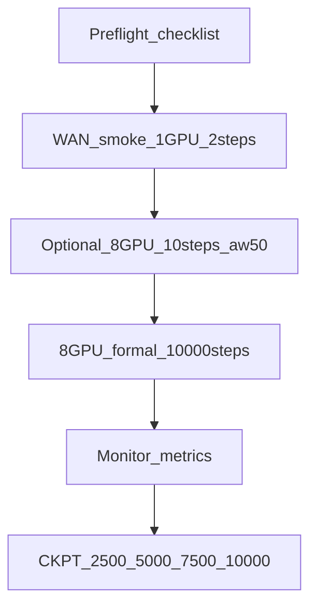

# Phase 2 正式训练计划 (0807) — Action + Video + Kpt (aw50, 10k)

> **Part A**：可执行微调计划（本文 §0–§6）  
> **Part B**：执行记录模板（本文 §7–§11，训练启动后填写）
>
> **引用链**：[itrnVLA15_GeoP_3dtrj_3cn2_sft_rbt2_2LOG_p2.md](itrnVLA15_GeoP_3dtrj_3cn2_sft_rbt2_2LOG_p2.md) → [LOG_p2_0805.md](itrnVLA15_GeoP_3dtrj_3cn2_sft_rbt2_2LOG_p2_0805.md) → [LOG_p2_itnvla15rbt20.md](itrnVLA15_GeoP_3dtrj_3cn2_sft_rbt2_2LOG_p2_itnvla15rbt20.md) → **本文**

---

## 0. 摘要与变更对照

### 0.1 目标

在自包含虚拟环境 `/tmp/itnvla15rbt20/` 中，从 **Phase 1 Step 300 checkpoint** 启动 GeoP 3D 融合版 Phase 2 微调：Action + WAN Video + 3D Kpt 联合训练，`stack_bowls_three_kpt` 数据集，8×H200。

### 0.2 相对 0805 的变更（仅 3 项）

| 参数 | 0805 | 0807 | 说明 |
|------|------|------|------|
| `action_loss_weight` | 10.0 | **50.0** | ★ 用户指定 |
| `steps` | 20000 | **10000** | ★ 用户指定 |
| 虚拟环境 | `/tmp/itrnvla15rbt2/` | **`/tmp/itnvla15rbt20/`** | ★ 自包含 venv |

### 0.3 相对 0805 保持不变

| 参数 | 值 |
|------|-----|
| `pretrained_path` | Phase 1 Step 300（**非** 0805 的 20k ckpt） |
| `action_loss_only` | false（启用 WAN video loss） |
| `kpt_loss_weight` | 1.0 |
| `kpt_future_loss_weight` | 1.0 |
| `video_loss_weight` | 1.0 |
| `batch_size` (per GPU) | 16（有效 BS=128） |
| `save_freq` | 2500 → ckpt: **2500 / 5000 / 7500 / 10000** |
| `log_freq` | 50 |
| `optimizer_lr` | 5e-5 |
| `scheduler_warmup_steps` | 1000 |
| `scheduler_decay_lr` | 5e-6 |
| `init_kpt_expert_from_action` | false |
| `geopredict_checkpoint_path` | 不设置 |
| `train_expert_only` | true |
| 其余 KI / per-module LR / dataset 字段 | 同 0805 launch 脚本 |

---

## 1. 完整训练配置

### Phase 1 checkpoint 来源

```
outputs/internvla_a1_5/2026_08_04_05_41_51-internvla_a1_5-geop-phase1-kpt-warmup-stackb3-abs/checkpoints/000300/pretrained_model
```

Phase 1 Step 300 终态（参考）：kpt_cur=0.0011, kpt_fut=0.0037, action=0.095, grad_norm=3.51

### 0807 超参表

| 参数 | 值 | 备注 |
|------|-----|------|
| GPU | 8×H200 (140 GB each) | `CUDA_VISIBLE_DEVICES=0,1,2,3,4,5,6,7` |
| batch_size (per GPU) | 16 | 有效 BS=128 |
| pretrained_path | Phase 1 Step 300 | 见上 |
| train_expert_only | true | VLM 冻结 |
| action_loss_only | false | WAN video loss 启用 |
| **action_loss_weight** | **50.0** | ★ 0807 变更（0805 为 10.0） |
| kpt_loss_weight | 1.0 | 不变 |
| kpt_future_loss_weight | 1.0 | 不变 |
| video_loss_weight | 1.0 | 不变 |
| action_expert_lr_scale | 1.0 | 不变 |
| kpt_expert_lr_scale | 1.0 | 不变 |
| track_encoder_lr_scale | 1.0 | 不变 |
| optimizer_lr | 5e-5 | 不变 |
| scheduler_warmup_steps | 1000 | 不变 |
| **scheduler_decay_steps** | **10000** | 随 steps 同步 |
| scheduler_decay_lr | 5e-6 | 不变 |
| **steps** | **10000** | ★ 0807 变更（0805 为 20000） |
| save_freq | 2500 | 不变 |
| log_freq | 50 | 不变 |
| seed | 42 | 不变 |
| init_kpt_expert_from_action | false | 保护 Phase 1 kpt expert |
| geopredict_checkpoint_path | 不设置 | track encoder 已在 Phase 1 ckpt 中 |
| knowledge_insulation | true | 不变 |
| knowledge_insulation_kpt | true | 不变 |
| wandb | offline | 不变 |

### 数据集

| 字段 | 值 |
|------|-----|
| repo_id | `robotwin/stack_bowls_three_kpt` |
| action_mode | abs |
| enable_keypoint_predictor | true |
| num_keypoint_joints | 14 |
| use_external_stats | true |
| external_stats_path | `/tmp/hf_home/lerobot/stats/aloha/abs/agg_1repos_1c27ca3df3/stats.json` |
| dist_loading | false |

---

## 2. 环境与路径（itnvla15rbt20）

| 用途 | 路径 |
|------|------|
| **虚拟环境** | `/tmp/itnvla15rbt20/` (~11G) |
| venv 备份 tar | `/tmp/itnvla15rbt20_080714.tar` |
| 项目根目录 | `/tmp/SRC/InternVLA-A-series/` |
| Phase 1 checkpoint | 见 §1 |
| 3D kpt 数据集 | `/tmp/robotwin2/stack_bowls_three_kpt/` |
| HF 数据集 symlink | `/tmp/hf_home/lerobot/robotwin/stack_bowls_three_kpt` → 上 |
| External stats | `/tmp/hf_home/lerobot/stats/aloha/abs/agg_1repos_1c27ca3df3/stats.json` |
| WAN 权重 | `/tmp/hf_home/hub/Wan2.2-TI2V-5B/` |
| **正式训练脚本** | `launch/internvla_a15_geop_phase2_finetune_stackb3_0807.sh` |
| **WAN smoke 脚本** | `launch/internvla_a15_geop_phase2_wan_smoke_itnvla15rbt20.sh` |
| 训练日志（建议） | `outputs/internvla_a1_5/train_0807_geop_phase2.log` |

### 2.1 启动前环境变量

```bash
export HF_HOME=/tmp/hf_home
export HF_LEROBOT_HOME=/tmp/hf_home/lerobot
export VENV_ROOT=/tmp/itnvla15rbt20
export LD_LIBRARY_PATH="/usr/local/nvidia/lib64:${VENV_ROOT}/lib:${VENV_ROOT}/lib/pulseaudio"
export USE_LIBUV=0
export WANDB_MODE=offline
export CUDA_VISIBLE_DEVICES=0,1,2,3,4,5,6,7
export PYTHONUNBUFFERED=1
export OMP_NUM_THREADS=1
export MKL_NUM_THREADS=1
export TOKENIZERS_PARALLELISM=false
```

### 2.2 venv 自包含边界

- venv tar 含 Python 二进制、pip 包、FFmpeg 共享库（`lib/` + `lib/pulseaudio/`）
- **editable install** 仍指向 `/tmp/SRC/InternVLA-A-series/src`（`.pth` 文件）
- 换机器或 tar 解压后需执行（详见 [LOG_p2_itnvla15rbt20.md §3.2](itrnVLA15_GeoP_3dtrj_3cn2_sft_rbt2_2LOG_p2_itnvla15rbt20.md)）：
  ```bash
  chmod +x /tmp/itnvla15rbt20/bin/*
  pip install -e /tmp/SRC/InternVLA-A-series --no-deps
  # + transformers patch
  find .../wandb/bin -exec chmod +x {} \;
  find .../triton/backends/nvidia/bin -exec chmod +x {} \;
  ```

### 2.3 LD_LIBRARY_PATH 说明

itnvla15rbt20 **不依赖** `/opt/conda/lib`（FFmpeg 已内嵌于 venv）。0805 的 itrnvla15rbt2 需 conda FFmpeg；0807 改用：

```
/usr/local/nvidia/lib64 : /tmp/itnvla15rbt20/lib : /tmp/itnvla15rbt20/lib/pulseaudio
```

---

## 3. 改良项与风险

### 3.1 现有脚本与配置缺口（已配套修改）

| 问题 | 说明 | 配套修改 |
|------|------|----------|
| 0805 launch 脚本过时 | 指向 `itrnvla15rbt2`，`action_loss_weight=10`，`steps=20000` | ✅ 新建 `launch/internvla_a15_geop_phase2_finetune_stackb3_0807.sh` |
| smoke100 配置不一致 | `action_loss_only=true`，无 WAN，`kpt_loss_weight=2.5` | ✅ 新建 WAN smoke 脚本；正式训练前必须跑 WAN smoke |
| scheduler_decay_steps | 须与 steps 一致 | launch 脚本 `--policy.scheduler_decay_steps=${STEPS}` → 10000 |
| JOB_NAME 命名 | 0805 后缀 `-20k` 易混淆 | 0807 后缀 `-aw50-kptw1-10k` |

### 3.2 `action_loss_weight=50` 的影响

总 loss 计算（`modeling_internvla_a1_5.py`）：

```python
loss = (
    self.config.action_loss_weight * loss_fm_action   # 50×
    + self.config.lambda_vqa * loss_vlm
    + self.config.video_loss_weight * video_loss
    + loss_kpt
)
```

| 影响 | 说明 |
|------|------|
| 日志 `loss_action` | **未加权**，可与 0805 直接对比 |
| 日志 `loss` 总量 | 预期升高（action 项 ×5） |
| `grad_norm` | 预期显著升高（0805 step100 @ weight=10: grad_norm≈7.8） |
| action:kpt 有效比 | 10:1 → **50:1**，action 梯度主导更强 |
| LR | **保持不变**（5e-5）；若 grad_norm 持续 >20 或出现 NaN，记录于 §8 再决策 |

### 3.3 0805 已知陷阱（继承）

| # | 陷阱 | 预防 |
|---|------|------|
| 8 | smoke 后残留 `CUDA_VISIBLE_DEVICES=0` | 正式训练前显式设 `0,1,2,3,4,5,6,7` |
| 9 | wandb-core / triton ptxas 无执行权限 | `chmod +x`（tar 解压后重做） |
| 7 | 缺 `policy.repo_id` | launch 脚本已含 `repo_id` + `push_to_hub=false` |
| 3 | torchcodec FFmpeg | itnvla15rbt20 已内嵌；验证 `import torchcodec` |

---

## 4. 启动前 Checklist

逐项执行，全部 ✅ 后再启动正式训练：

```bash
# 1. venv + CUDA
export VENV_ROOT=/tmp/itnvla15rbt20
export LD_LIBRARY_PATH="/usr/local/nvidia/lib64:${VENV_ROOT}/lib:${VENV_ROOT}/lib/pulseaudio"
${VENV_ROOT}/bin/python -c "import torch,torchcodec,lerobot; print('cuda', torch.cuda.device_count())"
# 期望: cuda 8

# 2. WAN 权重 (~32GB)
ls /tmp/hf_home/hub/Wan2.2-TI2V-5B/Wan2.2_VAE.pth
# 缺失则 snapshot_download（见 0805 §#4）

# 3. 数据集 symlink
ls /tmp/hf_home/lerobot/robotwin/stack_bowls_three_kpt/meta/info.json

# 4. Phase 1 ckpt
ls outputs/internvla_a1_5/2026_08_04_05_41_51-internvla_a1_5-geop-phase1-kpt-warmup-stackb3-abs/checkpoints/000300/pretrained_model/model.safetensors

# 5. stats
ls /tmp/hf_home/lerobot/stats/aloha/abs/agg_1repos_1c27ca3df3/stats.json

# 6. 磁盘（4 ckpt × ~6GB + wandb）
df -h /tmp

# 7. 二进制权限
chmod +x ${VENV_ROOT}/bin/*
find ${VENV_ROOT}/lib/python3.11/site-packages/wandb/bin -exec chmod +x {} \; 2>/dev/null || true
find ${VENV_ROOT}/lib/python3.11/site-packages/triton/backends/nvidia/bin -exec chmod +x {} \; 2>/dev/null || true
```

---

## 5. 0805 参考基线（对比用）

0805 第 3 次训练（`action_loss_weight=10`，20000 steps）关键指标：

| Step | action | video | kpt_cur | kpt_fut | grad_norm |
|------|--------|-------|---------|---------|-----------|
| 100 | 0.088 | 0.732 | 0.0011 | 0.0034 | 7.806 |
| 2500 | — | — | — | — | — |
| 20000 | 0.002 | 0.088 | 0.0007 | 0.0017 | 0.875 |

0807 监控时重点对比 **同 step 的 `loss_action`（未加权）** 与 **`grad_norm`**。

---

## 6. 执行流程



### 6.1 Step 1 — WAN Smoke Test（必须）

单卡 2 step，确认 `loss_video > 0`、`loss_kpt_cur/fut > 0`：

```bash
export HF_HOME=/tmp/hf_home HF_LEROBOT_HOME=/tmp/hf_home/lerobot
export VENV_ROOT=/tmp/itnvla15rbt20
export LD_LIBRARY_PATH="/usr/local/nvidia/lib64:${VENV_ROOT}/lib:${VENV_ROOT}/lib/pulseaudio"
export CUDA_VISIBLE_DEVICES=0
cd /tmp/SRC/InternVLA-A-series
bash launch/internvla_a15_geop_phase2_wan_smoke_itnvla15rbt20.sh
```

### 6.2 Step 2 — 可选：8 卡 aw50 短跑

验证 `action_loss_weight=50` 下无 NaN/OOM：

```bash
export CUDA_VISIBLE_DEVICES=0,1,2,3,4,5,6,7
STEPS=10 LOG_FREQ=5 SAVE_FREQ=10 \
  bash launch/internvla_a15_geop_phase2_finetune_stackb3_0807.sh
```

### 6.3 Step 3 — 正式训练（10000 steps）

```bash
export HF_HOME=/tmp/hf_home HF_LEROBOT_HOME=/tmp/hf_home/lerobot
export VENV_ROOT=/tmp/itnvla15rbt20
export LD_LIBRARY_PATH="/usr/local/nvidia/lib64:${VENV_ROOT}/lib:${VENV_ROOT}/lib/pulseaudio"
export USE_LIBUV=0 WANDB_MODE=offline
export CUDA_VISIBLE_DEVICES=0,1,2,3,4,5,6,7
export MASTER_PORT=36500   # 避免与历史 run 冲突

cd /tmp/SRC/InternVLA-A-series
nohup bash launch/internvla_a15_geop_phase2_finetune_stackb3_0807.sh \
  > outputs/internvla_a1_5/train_0807_geop_phase2.log 2>&1 &
```

### 6.4 监控命令

```bash
tail -f outputs/internvla_a1_5/train_0807_geop_phase2.log
grep 'step:' outputs/internvla_a1_5/train_0807_geop_phase2.log | tail -20
nvidia-smi
```

---

## Part B：执行记录（训练启动后填写）

---

## 7. 时间线 / 操作日志

| 时间 (UTC+8) | 操作 | 结果 |
|---|---|---|
| 2026-08-07 14:38 | Preflight checklist | venv/cuda/dataset/ckpt/stats ✅；WAN ❌ 缺失 |
| 2026-08-07 14:38 | chmod +x venv 二进制 | wandb/triton/bin ✅ |
| 2026-08-07 14:38–14:39 | 下载 WAN2.2-TI2V-5B | `snapshot_download` 32GB ✅（见 #1） |
| 2026-08-07 14:39–14:41 | WAN smoke test（1 GPU, 2 step） | ✅ loss_video>0, kpt>0（见 §9） |
| 2026-08-07 14:41 | 8 卡正式训练启动 | OUTPUT_DIR 见 §10；step 50 @ 14:45 ✅ |
| 2026-08-07 15:24 | step 2500 checkpoint | ✅ |
| 2026-08-07 16:18 | step 5000 checkpoint | ✅ |
| 2026-08-07 16:59 | step 7500 checkpoint | ✅ |
| 2026-08-07 17:42 | **step 10000 完成** | 墙钟 ~3h；`End of training` ✅ |

---

## 8. 问题记录（报错 → 根因 → 修复 → 验证）

### #1: WAN 权重缺失

- **报错**: `ls: cannot access '.../Wan2.2_VAE.pth': No such file or directory`
- **根因**: 本机 `/tmp/hf_home/hub/Wan2.2-TI2V-5B/` 未下载（0805 在其他环境下载过）
- **修复**: 使用 `huggingface_hub.snapshot_download('Wan-AI/Wan2.2-TI2V-5B', local_dir='/tmp/hf_home/hub/Wan2.2-TI2V-5B')`
- **验证**: 32GB 下载完成，`Wan2.2_VAE.pth` 2.7G 存在；日志 `outputs/internvla_a1_5/wan_download_0807.log`

### #2: （无其他报错，训练正常启动）

0805 已知陷阱在本 run 中已预防：
- `CUDA_VISIBLE_DEVICES=0,1,2,3,4,5,6,7` 显式设置
- venv 二进制已 chmod +x
- launch 脚本含 `repo_id` + `push_to_hub=false`

---

## 9. 训练轨迹

| Step | loss | action | video | kpt_cur | kpt_fut | grad_norm | lr | epoch |
|------|------|--------|-------|---------|---------|-----------|-----|-------|
| 50 | 10.351 | 0.092 | 0.948 | 0.0010 | 0.0033 | 27.960 | 1.3e-6 | 0.27 |
| 100 | 9.936 | 0.087 | 0.798 | 0.0011 | 0.0034 | 25.246 | 3.8e-6 | 0.54 |
| 2500 | 5.288 | 0.008 | 0.137 | 0.0009 | 0.0022 | 10.892 | 4.3e-5 | 13.86 |
| 5000 | 5.085 | 0.004 | 0.123 | 0.0008 | 0.0020 | 7.238 | 2.7e-5 | 27.45 |
| 7500 | 5.007 | 0.003 | 0.116 | 0.0008 | 0.0020 | 5.346 | 1.1e-5 | 41.04 |
| **10000** | **4.991** | **0.002** | **0.117** | **0.0008** | **0.0019** | **4.338** | **5.0e-6** | **54.35** |

**WAN smoke（单卡 2 step, aw50）**:

| Step | loss | action | video | kpt_cur | kpt_fut | grad_norm |
|------|------|--------|-------|---------|---------|-----------|
| 1 | 9.638 | 0.073 | 0.517 | 0.0013 | 0.0018 | 122.731 |
| 2 | 8.520 | 0.057 | 0.527 | 0.0886 | 0.0866 | 53.646 |

---

## 10. Checkpoint 验证

| Step | 路径 | 大小 | action | kpt_cur | grad_norm |
|------|------|------|--------|---------|-----------|
| 2500 | `checkpoints/002500/pretrained_model` | 5.9G | 0.008 | 0.0009 | 10.892 |
| 5000 | `checkpoints/005000/pretrained_model` | 5.9G | 0.004 | 0.0008 | 7.238 |
| 7500 | `checkpoints/007500/pretrained_model` | 5.9G | 0.003 | 0.0008 | 5.346 |
| **10000** | **`checkpoints/010000/pretrained_model`** | **5.9G** | **0.002** | **0.0008** | **4.338** |

**OUTPUT_DIR**:
```
outputs/internvla_a1_5/2026_08_07_06_41_32-internvla_a1_5-geop-phase2-action-video-aw50-kptw1-stackb3-abs-10k
```

**训练日志**: `outputs/internvla_a1_5/train_0807_geop_phase2.log`

### 文件变更清单

| 文件 / 路径 | 操作 | 原因 |
|---|---|---|
| `/tmp/hf_home/hub/Wan2.2-TI2V-5B/` | 新增 (~32GB) | Preflight 发现 WAN 缺失，0807 需 video loss |
| `outputs/internvla_a1_5/wan_download_0807.log` | 新增 | WAN 下载日志 |
| `outputs/internvla_a1_5/wan_smoke_0807.log` | 新增 | WAN smoke  stdout |
| `outputs/internvla_a1_5/train_0807_geop_phase2.log` | 新增 | 正式训练 stdout |
| `outputs/internvla_a1_5/2026_08_07_06_41_32-...-10k/` | 新增 | 正式训练输出目录 |

### 启动命令（正式训练）

```bash
export HF_HOME=/tmp/hf_home HF_LEROBOT_HOME=/tmp/hf_home/lerobot
export VENV_ROOT=/tmp/itnvla15rbt20
export LD_LIBRARY_PATH="/usr/local/nvidia/lib64:${VENV_ROOT}/lib:${VENV_ROOT}/lib/pulseaudio"
export USE_LIBUV=0 WANDB_MODE=offline
export CUDA_VISIBLE_DEVICES=0,1,2,3,4,5,6,7
export MASTER_PORT=36500
cd /tmp/SRC/InternVLA-A-series
nohup bash launch/internvla_a15_geop_phase2_finetune_stackb3_0807.sh \
  > outputs/internvla_a1_5/train_0807_geop_phase2.log 2>&1 &
```

---

## 11. 最终结果

**完成时间**: 2026-08-07 09:42 UTC（墙钟 ~3h，06:41–09:42）

**推荐 checkpoint**: `checkpoints/010000/pretrained_model`（或 `checkpoints/last`）

### 与 0805 对比（终态）

| 指标 | 0805 (aw10, 20k) | 0807 (aw50, 10k) |
|------|------------------|------------------|
| action | 0.002 | 0.002 |
| video | 0.088 | 0.117 |
| kpt_cur | 0.0007 | 0.0008 |
| grad_norm | 0.875 | 4.338 |
| steps | 20000 | 10000 |

- `loss_action`（未加权）收敛至相同量级（0.002），说明 aw50 未破坏 action 学习
- `grad_norm` 全程高于 0805（aw50 预期效应），但无 NaN/OOM，训练稳定
- `loss_video` 略高于 0805 终态（0.117 vs 0.088），可能因步数较少或 aw50 间接影响

### 后续

- RoboTwin 仿真评测：加载 `checkpoints/010000/pretrained_model`
- 可选：与 0805 step 10000  checkpoint 对比评测
