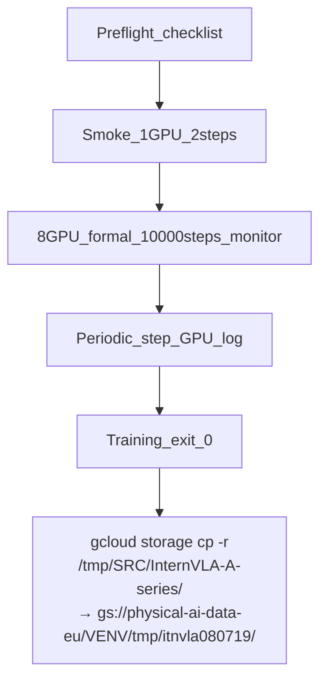

# Phase 2 正式训练计划 (080719) — Action + Kpt Only（VLM/WAN 冻结，无 VLM/WAN loss）

> **Part A**：可执行微调计划（本文 §0–§6）  
> **Part B**：执行记录（本文 §7–§11，训练过程中填写）
>
> **引用链**：[LOG_p2.md](itrnVLA15_GeoP_3dtrj_3cn2_sft_rbt2_2LOG_p2.md) → … → [LOG_p2_080718.md](itrnVLA15_GeoP_3dtrj_3cn2_sft_rbt2_2LOG_p2_080718.md) → **本文**
>
> **说明**：080718 计划作废——虽 `train_expert_only=true` 冻结了 VLM 权重，但仍开启 `enable_vqa_loss` 与 `video_loss_weight=0.1`，错误地计算了 VLM/WAN loss；且 `freeze_learnable_tokens=true` 与「其余均可训练」目标不符。080719 为本轮正确配置。

---

## 0. 摘要与变更对照

### 0.1 目标

在 `/tmp/itnvla15rbt20/` 中，从 **Phase 1 Step 300 checkpoint** 启动 GeoP Phase 2 微调：**仅 Action + 3D Kpt 直接监督**；VLM 与 WAN **加载并冻结**，**不计算 loss、不反传梯度**；其余模块（含 learnable tokens）均可训练。数据集 `stack_bowls_three_kpt`，8×H200，10000 steps。

### 0.2 相对 080718 的修正（核心）

| 参数 | 080718（作废） | **080719** |
|------|----------------|------------|
| `enable_vqa_loss` | true | **false** |
| `use_fast_action_tokens` | true | **false** |
| `video_loss_weight` | 0.1 | **0.0** |
| `freeze_learnable_tokens` | true | **false** |
| `train_expert_only` | true | true（不变，VLM 冻结） |
| `action_loss_only` | false | false（不变，**加载** WAN） |
| `freeze_wan_dit` | true | true（不变，WAN 冻结） |
| `action_loss_weight` | 10.0 | 10.0 |
| `kpt_loss_weight` | 0.1 | 0.1 |
| `kpt_future_loss_weight` | 0.1 | 0.1 |

### 0.3 模块 train / freeze / loss 矩阵

| 模块 | 加载 | 权重更新 | 参与 loss |
|------|------|----------|-----------|
| Qwen3.5 VLM（visual + LM + lm_head） | 是 | **否**（`train_expert_only=true`） | **否**（`enable_vqa_loss=false`） |
| WAN DiT + VAE | 是 | **否**（`freeze_wan_dit=true`） | **否**（`video_loss_weight=0.0`） |
| action_expert + action 投影层 | 是 | **是** | action flow matching |
| keypoint_expert + track_encoder + kpt 投影 | 是 | **是** | kpt MSE |
| learnable_tokens + in_proj + to_wan_proj | 是 | **是** | 仅间接（经 action 路径；无 video loss） |

### 0.4 总 loss 公式

```python
loss = (
    10.0 * loss_action
    + 0.1 * (loss_kpt_cur + 0.1 * loss_kpt_fut)
)
# 无 loss_vlm，无 loss_video
```

有效权重比（action : kpt_cur : kpt_fut）：**100 : 0.1 : 0.01**（与 080718 的 kpt 权重相同，但去掉了 VLM/video 项）。

---

## 1. 完整训练配置

### Phase 1 checkpoint

```
outputs/internvla_a1_5/2026_08_04_05_41_51-internvla_a1_5-geop-phase1-kpt-warmup-stackb3-abs/checkpoints/000300/pretrained_model
```

### 080719 超参表

| 参数 | 值 |
|------|-----|
| GPU | 8×H200 |
| batch_size | 16 |
| **train_expert_only** | **true** |
| **enable_vqa_loss** | **false** |
| **use_fast_action_tokens** | **false** |
| **action_loss_only** | **false**（加载 WAN，不跳过构造） |
| **freeze_wan_dit** | **true** |
| **video_loss_weight** | **0.0** |
| **freeze_learnable_tokens** | **false** |
| action_loss_weight | 10.0 |
| kpt_loss_weight | 0.1 |
| kpt_future_loss_weight | 0.1 |
| steps | 10000 |
| save_freq | 2500 |
| optimizer_lr | 5e-5 |
| scheduler_warmup_steps | 1000 |
| scheduler_decay_steps | 10000 |
| scheduler_decay_lr | 5e-6 |
| init_kpt_expert_from_action | false |
| knowledge_insulation / _kpt | true |

---

## 2. 环境与路径

| 用途 | 路径 |
|------|------|
| venv | `/tmp/itnvla15rbt20/` |
| WAN（加载但不训） | `/tmp/hf_home/hub/Wan2.2-TI2V-5B/` |
| 数据集 | `/tmp/hf_home/lerobot/robotwin/stack_bowls_three_kpt` |
| stats | `/tmp/hf_home/lerobot/stats/aloha/abs/agg_1repos_1c27ca3df3/stats.json` |
| **正式脚本** | `launch/internvla_a15_geop_phase2_finetune_stackb3_080719.sh` |
| **监控 + GCS 上传脚本** | `launch/internvla_a15_geop_phase2_finetune_stackb3_080719_monitor.sh` |
| **smoke 脚本** | `launch/internvla_a15_geop_phase2_smoke_080719.sh` |
| **训练日志** | `outputs/internvla_a1_5/train_080719_geop_phase2.log` |
| **监控日志** | `outputs/internvla_a1_5/monitor_080719_geop_phase2.log` |
| **GCS 上传日志** | `outputs/gcloud_upload_itnvla080719.log` |
| **GCS 目标** | `gs://physical-ai-data-eu/VENV/tmp/itnvla080719/` |

### 环境变量

```bash
export HF_HOME=/tmp/hf_home HF_LEROBOT_HOME=/tmp/hf_home/lerobot
export VENV_ROOT=/tmp/itnvla15rbt20
export LD_LIBRARY_PATH="/usr/local/nvidia/lib64:${VENV_ROOT}/lib:${VENV_ROOT}/lib/pulseaudio"
export USE_LIBUV=0 WANDB_MODE=offline
export CUDA_VISIBLE_DEVICES=0,1,2,3,4,5,6,7
export MASTER_PORT=36503
```

---

## 3. 风险与注意点

| 风险 | 说明 |
|------|------|
| WAN 占显存但不参与训练 | `action_loss_only=false` 会加载 WAN 权重；仅增加显存，无 video 梯度 |
| learnable tokens 无直接 video 监督 | `video_loss_weight=0` → foresight tokens 仅通过 action expert 路径间接更新 |
| kpt 权重 0.1 | 与 080718 相同，kpt 直接监督弱，主要靠 action↔kpt 交叉注意力间接监督 |
| 080718 若已跑完 | 其 checkpoint 含错误 loss 语义下的训练轨迹；080719 应独立 OUTPUT_DIR 重训 |
| 代码依赖 | `video_loss_weight==0` 时跳过 `_compute_video_loss` forward（见 `modeling_internvla_a1_5.py` patch） |

---

## 4. Checklist

```bash
export VENV_ROOT=/tmp/itnvla15rbt20
export LD_LIBRARY_PATH="/usr/local/nvidia/lib64:${VENV_ROOT}/lib:${VENV_ROOT}/lib/pulseaudio"
${VENV_ROOT}/bin/python -c "import torch,torchcodec,lerobot; print('cuda', torch.cuda.device_count())"
ls /tmp/hf_home/hub/Wan2.2-TI2V-5B/Wan2.2_VAE.pth
ls /tmp/hf_home/lerobot/robotwin/stack_bowls_three_kpt/meta/info.json
ls outputs/internvla_a1_5/2026_08_04_05_41_51-internvla_a1_5-geop-phase1-kpt-warmup-stackb3-abs/checkpoints/000300/pretrained_model/model.safetensors
pgrep -af lerobot_train || echo "no train procs"
```

---

## 5. 参考基线

| Run | loss 组成 | 备注 |
|-----|-----------|------|
| 080718 | action + vlm + video + kpt | **作废**（VLM/WAN loss 不应存在） |
| 080719 | action + kpt only | 本文 |

080718 @step50 参考（仅供对比 grad 规模）：loss≈5.8, action≈0.09, video≈0.95, grad_norm≈5.3。080719 预期 **无 loss_vqa/loss_video 日志项或恒为 0**，总 loss 与 grad_norm 应低于 080718。

---

## 6. 执行流程

1. Preflight checklist
2. Smoke（1 GPU, 2 step）：确认 `loss_vqa=0`、`loss_video=0`、`loss_action>0`
3. 8 GPU 正式训练 10000 steps（**推荐带监控脚本**，训练成功后自动上传 GCS）
4. 记录 Part B



### Smoke 命令

```bash
cd /tmp/SRC/InternVLA-A-series
bash launch/internvla_a15_geop_phase2_smoke_080719.sh
```

### 正式训练命令（推荐：监控 + 训练结束自动 GCS 上传）

```bash
cd /tmp/SRC/InternVLA-A-series
nohup bash launch/internvla_a15_geop_phase2_finetune_stackb3_080719_monitor.sh \
  >> outputs/internvla_a1_5/monitor_080719_geop_phase2.log 2>&1 &
```

监控脚本行为：

| 阶段 | 行为 |
|------|------|
| 训练中 | 每 **300s**（`POLL_SEC`）向 `monitor_080719_geop_phase2.log` 追加最新 `step:`、GPU 显存/利用率、`lerobot_train.py` 进程数 |
| 训练成功退出 | 调用内层训练脚本的 `GCS_UPLOAD_ON_SUCCESS=true`，执行 `gcloud storage cp -r` |
| 训练失败 | **不上传** GCS，监控日志记录 exit code |

GCS 上传（训练成功时自动执行，也可手动重跑）：

```bash
gcloud storage cp -r /tmp/SRC/InternVLA-A-series/ \
  gs://physical-ai-data-eu/VENV/tmp/itnvla080719/
```

- **本地路径**: `/tmp/SRC/InternVLA-A-series/`
- **目标路径**: `gs://physical-ai-data-eu/VENV/tmp/itnvla080719/InternVLA-A-series/`
- **上传日志**: `outputs/gcloud_upload_itnvla080719.log`

### 仅训练（无监控/GCS，调试用）

```bash
cd /tmp/SRC/InternVLA-A-series
nohup bash launch/internvla_a15_geop_phase2_finetune_stackb3_080719.sh \
  > outputs/internvla_a1_5/train_080719_geop_phase2.log 2>&1 &
```

如需在纯训练脚本上启用上传：`GCS_UPLOAD_ON_SUCCESS=true bash launch/internvla_a15_geop_phase2_finetune_stackb3_080719.sh`

### 6.1 监控命令

```bash
# 训练 stdout（lerobot step / loss）
tail -f outputs/internvla_a1_5/train_080719_geop_phase2.log

# 周期性监控快照（step + GPU）
tail -f outputs/internvla_a1_5/monitor_080719_geop_phase2.log

# 最近 20 个 step
grep 'step:' outputs/internvla_a1_5/train_080719_geop_phase2.log | tail -20

# 确认 080719 特有：无 vlm/video loss
grep -E 'loss_vqa|loss_video' outputs/internvla_a1_5/train_080719_geop_phase2.log | tail -10

nvidia-smi
pgrep -af lerobot_train
```

---

## Part B：执行记录

---

## 7. 时间线 / 操作日志

| 时间 (UTC+8) | 操作 | 结果 |
|---|---|---|
| 2026-08-07 20:23 | Preflight：检查 venv/WAN/数据集/Phase1 ckpt/gcloud/8×H200 | 全部路径存在；GPU 0–7 空闲 |
| 2026-08-07 20:24 | Preflight：`import torch,lerobot`（需 `LD_LIBRARY_PATH` 含 venv lib） | cuda=8；单独 `import torchcodec` 失败（见 §8 #1），训练脚本不受影响 |
| 2026-08-07 20:25 | Smoke：`bash launch/internvla_a15_geop_phase2_smoke_080719.sh` | **PASS** step1–2；`loss_video=0`，`loss_fast=0`；`loss_action>0`；日志 `outputs/internvla_a1_5/smoke_080719.log` |
| 2026-08-07 20:26 | 正式训练启动（monitor wrapper） | **RUNNING**；`OUTPUT_DIR=outputs/internvla_a1_5/2026_08_07_12_25_57-internvla_a1_5-geop-phase2-action-kpt-only-stackb3-abs-10k` |
| 2026-08-07 20:29 | 首个 log step（step 50） | loss=0.092 action=0.092 loss_video=0 loss_fast=0；ETA≈2h36m @1.06 it/s |
| 2026-08-07 22:29 | step 10000 完成 | loss=0.002 action=0.002 grdn=0.091；耗时≈2h01m；ckpt 002500/5000/7500/010000 |
| 2026-08-07 22:34 | GCS 上传完成 | `gs://physical-ai-data-eu/VENV/tmp/itnvla080719/InternVLA-A-series/`；日志 `outputs/gcloud_upload_itnvla080719.log` |

**Launch 脚本**:
- `launch/internvla_a15_geop_phase2_finetune_stackb3_080719.sh`（纯训练）
- `launch/internvla_a15_geop_phase2_finetune_stackb3_080719_monitor.sh`（**推荐**：监控 + 训练结束 GCS 上传）
- `launch/internvla_a15_geop_phase2_smoke_080719.sh`

**日志**:
- 训练: `outputs/internvla_a1_5/train_080719_geop_phase2.log`
- 监控: `outputs/internvla_a1_5/monitor_080719_geop_phase2.log`
- GCS: `outputs/gcloud_upload_itnvla080719.log`

---

## 8. 问题记录

### #1 Preflight `torchcodec` import 失败（非阻塞）

| 项 | 内容 |
|----|------|
| **现象** | `python -c "import torchcodec"` → `CXXABI_1.3.15 not found`（libopenvino / libavutil） |
| **根因** | checklist 原命令未设完整 `LD_LIBRARY_PATH`；且 venv 内 FFmpeg/torchcodec 与系统 libstdc++ 版本不完全匹配 |
| **影响** | **无**——smoke 与正式训练均正常；080719 不使用 video dataloader 的 torchcodec 解码路径 |
| **Fix** | 无需改代码；Preflight 改用与 launch 脚本一致的 `LD_LIBRARY_PATH`；跳过单独 `import torchcodec` |

（训练过程中继续追加）

---

## 9. 训练轨迹

| Step | loss | action | kpt_cur | kpt_fut | grad_norm | loss_vqa | loss_video |
|------|------|--------|---------|---------|-----------|----------|------------|
| 1 | 0.067 | 0.067 | 0.0018 | 0.0023 | 2.115 | 0 | 0 |
| 2 | 0.121 | 0.095 | 0.2390 | 0.2397 | 2.543 | 0 | 0 |
| 50 | 0.092 | 0.092 | 0.0012 | 0.0035 | 0.533 | 0 | 0 |
| 10000 | 0.002 | 0.002 | 0.0001 | 0.0034 | 0.091 | 0 | 0 |

---

## 10. Checkpoint 验证

**OUTPUT_DIR**:

```
outputs/internvla_a1_5/2026_08_07_12_25_57-internvla_a1_5-geop-phase2-action-kpt-only-stackb3-abs-10k
```

预期 checkpoint: 002500 / 005000 / 007500 / 010000（save_freq=2500）— **已全部生成**，`last -> 010000`

推荐推理 checkpoint: `checkpoints/010000/pretrained_model`

---

## 11. 最终结果

080719 Phase2 微调 **成功完成**（Action + Kpt only，无 VLM/video loss）。

| 项 | 值 |
|----|-----|
| 训练 exit code | 0 |
| 总步数 | 10000 |
| 最终 loss_action | 0.002 |
| loss_video / loss_fast | 全程 0 |
| 训练 wall time | ≈2h01m |

### GCS 备份

训练成功结束后，监控脚本会自动执行：

```bash
gcloud storage cp -r /tmp/SRC/InternVLA-A-series/ gs://physical-ai-data-eu/VENV/tmp/itnvla080719/
```

| 项 | 值 |
|----|-----|
| 本地路径 | `/tmp/SRC/InternVLA-A-series/` |
| GCS 路径 | `gs://physical-ai-data-eu/VENV/tmp/itnvla080719/InternVLA-A-series/` |
| 上传日志 | `outputs/gcloud_upload_itnvla080719.log` |
| 上传时间 | 2026-08-07 22:30–22:35 (UTC+8) |
| 上传结果 | **成功**（~4.5min，~2.1 GiB/s） |

---

# Part C：080719_2 续训（step 10000 → 20000）

> 从 Part B 080719 run 的 step 10000 checkpoint **原生 resume**，再训 10000 步至总 step 20000；GCS 目标 `itnvla080719_2`。

---

## 12. 摘要与配置对照

### 12.1 目标

在 `/tmp/itnvla15rbt20/` 中，从 **080719 step 10000 checkpoint** resume，继续 **Action + Kpt only** 微调至 **step 20000**；每 2500 步保存；训练成功后上传至 `gs://physical-ai-data-eu/VENV/tmp/itnvla080719_2/`。

### 12.2 相对 Part B（080719 首轮）的变更

| 参数 | 080719 首轮 | **080719_2 续训** |
|------|-------------|-------------------|
| 启动方式 | 新 run（`pretrained_path=Phase1 ckpt`） | **`--resume=true`** |
| 起始 step | 0 | **10000**（自动恢复） |
| `steps` | 10000 | **20000** |
| `save_freq` | 2500 | 2500 |
| 新 checkpoint | 002500–010000 | **012500 / 015000 / 017500 / 020000** |
| OUTPUT_DIR | 同上 run 目录 | **同一目录** |
| MASTER_PORT | 36503 | **36505** |
| GCS | itnvla080719 | **itnvla080719_2** |
| loss 配置 | Action+Kpt only | **不变**（从 train_config 加载） |

### 12.3 Resume 起点

```
outputs/internvla_a1_5/2026_08_07_12_25_57-internvla_a1_5-geop-phase2-action-kpt-only-stackb3-abs-10k/checkpoints/010000/pretrained_model/train_config.json
```

---

## 13. 时间线 / 操作日志

| 时间 (UTC+8) | 操作 | 结果 |
|---|---|---|
| 2026-08-07 22:52 | Preflight：ckpt 010000 完整、8×H200 空闲、无 lerobot 训练进程 | PASS |
| 2026-08-07 22:54 | Resume smoke：`bash launch/internvla_a15_geop_phase2_smoke_080719_resume.sh` | **PASS**；resume 从 step 10000→10002；`save_checkpoint=false` 未污染 ckpt；日志 `smoke_080719_2_resume.log` |
| 2026-08-07 22:58 | 正式续训启动（monitor wrapper） | **RUNNING**；`cfg.steps=20000`；首 log step 10.1K；ETA≈2h49m |
| | step 20000 完成 | |
| | GCS 上传完成 (itnvla080719_2) | |

**Launch 脚本**:
- `launch/internvla_a15_geop_phase2_finetune_stackb3_080719_resume_20k.sh`
- `launch/internvla_a15_geop_phase2_finetune_stackb3_080719_resume_20k_monitor.sh`（**推荐**）
- `launch/internvla_a15_geop_phase2_smoke_080719_resume.sh`

**日志**:
- 训练: `outputs/internvla_a1_5/train_080719_2_geop_phase2.log`
- 监控: `outputs/internvla_a1_5/monitor_080719_2_geop_phase2.log`
- GCS: `outputs/gcloud_upload_itnvla080719_2.log`

### 正式续训命令

```bash
cd /tmp/SRC/InternVLA-A-series
nohup bash launch/internvla_a15_geop_phase2_finetune_stackb3_080719_resume_20k_monitor.sh \
  >> outputs/internvla_a1_5/monitor_080719_2_geop_phase2.log 2>&1 &
```

---

## 14. 问题记录

（续训过程中填写）

---

## 15. 训练轨迹

| Step | loss | action | kpt_cur | kpt_fut | grad_norm | loss_vqa | loss_video |
|------|------|--------|---------|---------|-----------|----------|------------|
| 10000 | 0.002 | 0.002 | 0.0001 | 0.0034 | 0.091 | 0 | 0 |
| 12500 | | | | | | 0 | 0 |
| 15000 | | | | | | 0 | 0 |
| 17500 | | | | | | 0 | 0 |
| 20000 | | | | | | 0 | 0 |

---

## 16. Checkpoint 验证

**OUTPUT_DIR**（与 080719 首轮相同）:

```
outputs/internvla_a1_5/2026_08_07_12_25_57-internvla_a1_5-geop-phase2-action-kpt-only-stackb3-abs-10k
```

预期新增 checkpoint: **012500 / 015000 / 017500 / 020000**（6 位 padding）；`last -> 020000`

---

## 17. GCS 备份（itnvla080719_2）

```bash
gcloud storage cp -r /tmp/SRC/InternVLA-A-series/ gs://physical-ai-data-eu/VENV/tmp/itnvla080719_2/
```

| 项 | 值 |
|----|-----|
| 本地路径 | `/tmp/SRC/InternVLA-A-series/` |
| GCS 路径 | `gs://physical-ai-data-eu/VENV/tmp/itnvla080719_2/InternVLA-A-series/` |
| 上传日志 | `outputs/gcloud_upload_itnvla080719_2.log` |
| 上传时间 | （填写） |
| 上传结果 | （填写） |
