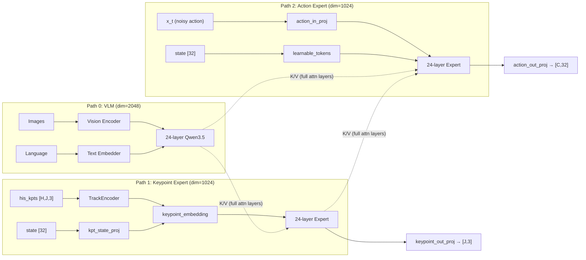
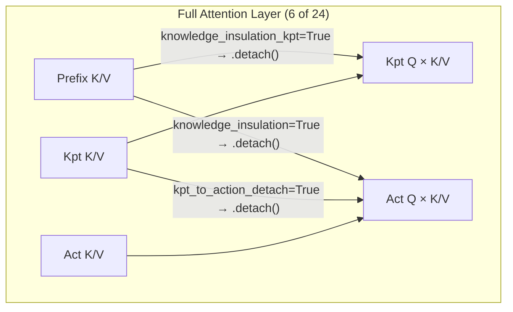
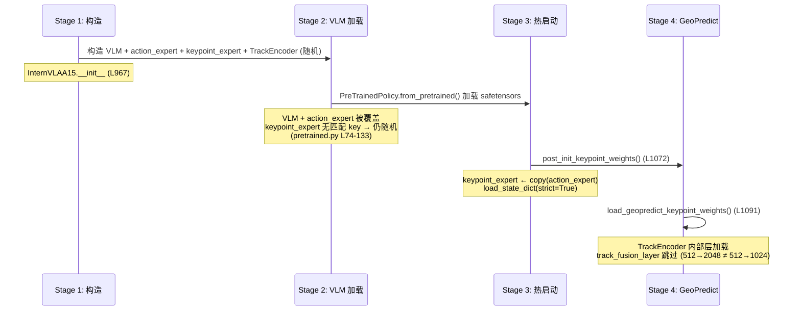
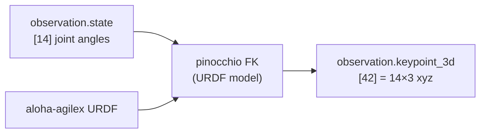
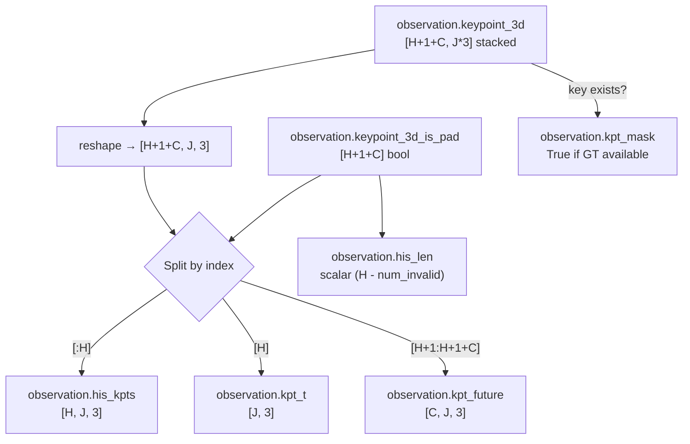
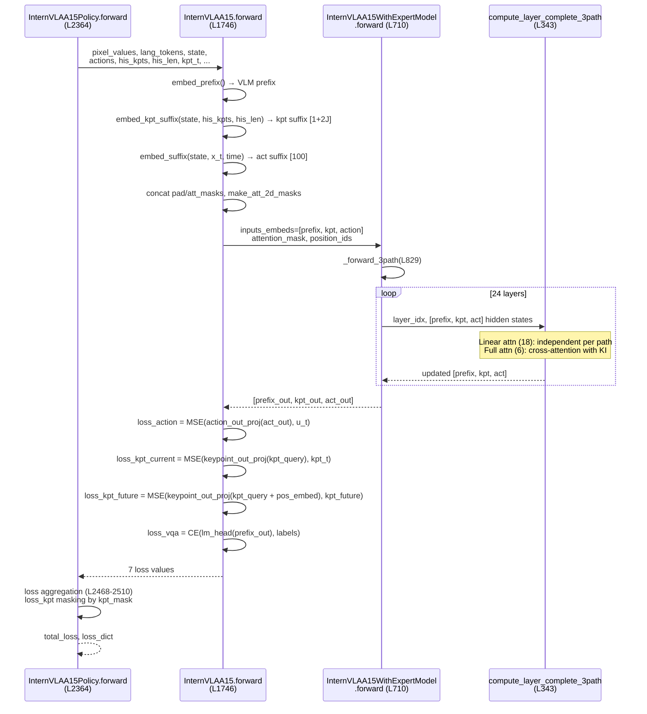
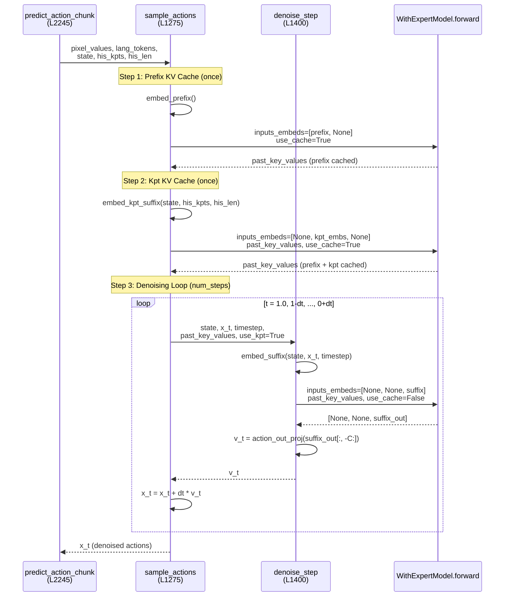

# InternVLA-A1.5 + GeoPredict 3D Keypoint Fusion: Three-Path MoT Design & Training Manual v3.3

> **自包含文档**: 合并并修正 v3.1 (通用设计) / v3.2 (Aloha 双臂适配) / sft_rbt2_2 (SFT 训练手册) 三份文档, 基于 2026-08-10 代码库状态验证。所有行号、属性名、配置字段均经过代码核实。
>
> **前版文档**: [v3.1](itrnVLA15_GeoP_3dtrj_3cn2.md) | [v3.2](itrnVLA15_GeoP_3dtrj_3cn2_rbt2stak3.md) | [sft_rbt2_2](itrnVLA15_GeoP_3dtrj_3cn2_sft_rbt2_2.md)

---

## 目录

- [1. 概述](#1-概述)
- [2. 类层级](#2-类层级-class-hierarchy)
- [3. 模块清单](#3-模块清单-module-inventory)
- [4. Token 布局](#4-token-布局-token-layout)
- [5. 注意力掩码](#5-注意力掩码-attention-masks)
- [6. compute_layer_complete_3path](#6-compute_layer_complete_3path)
- [7. Knowledge Insulation](#7-knowledge-insulation-ki)
- [8. Loss 计算](#8-loss-计算)
- [9. 权重初始化](#9-权重初始化-4-stages)
- [10. Per-Module LR](#10-per-module-lr-5-组)
- [11. 配置字段完整表](#11-配置字段完整表)
- [12. J=8 → J=14 变更](#12-j8--j14-变更)
- [13. FK 关键点生成](#13-fk-关键点生成-offline)
- [14. SAPIEN 运行时关键点](#14-sapien-运行时关键点-推理)
- [15. 数据管道](#15-数据管道-data-pipeline)
- [16. 课程学习策略](#16-课程学习策略)
- [17. Phase 1 训练脚本](#17-phase-1-训练脚本)
- [18. Phase 2 训练脚本](#18-phase-2-训练脚本)
- [19. Loss 监控](#19-loss-监控)
- [20. 推理路径](#20-推理路径-forward-call-chain)
- [21. 已知问题与对策](#21-已知问题与对策)
- [22. 配置对比表](#22-配置对比表)
- [附录 A: Token 位置速查表](#附录-a-token-位置速查表-j14)
- [附录 B: GeoPredict Checkpoint Key 映射表](#附录-b-geopredict-checkpoint-key-映射表)
- [附录 C: Aloha URDF 运动链](#附录-c-aloha-urdf-运动链)
- [附录 D: 维度流全链路追踪](#附录-d-维度流全链路追踪-j14)

---

## Part I: 架构与设计

### 1. 概述

InternVLA-A1.5 是一个 Vision-Language-Action (VLA) 机器人策略, 使用 Qwen3.5-2B VLM 骨干 + 轻量级动作专家 (action expert) 构成 **两路径 Mixture-of-Transformers (MoT)** 架构。本设计将其扩展为 **三路径 MoT**, 通过增加关键点专家 (keypoint expert) 路径, 融合 GeoPredict 的 3D 关键点轨迹预测能力。

**三路径 MoT 架构**:

| 路径 | 模块 | 维度 | 功能 |
|:---|:---|:---:|:---|
| Path 0 (VLM prefix) | `Qwen3_5ForConditionalGeneration` | 2048 | 处理图像 + 语言, 生成场景理解 |
| Path 1 (Keypoint expert suffix) | `Qwen3_5TextModel` | 1024 | 编码 3D 关键点历史 → 预测当前/未来关键点位置 |
| Path 2 (Action expert suffix) | `Qwen3_5TextModel` | 1024 | 处理噪声动作 → 预测动作速度 (flow matching) |

24 个 Transformer 层: 18 层 Gated DeltaNet (线性注意力, 各路径独立) + 6 层 full attention (路径间交叉注意力)。

**为什么增加关键点路径**: GeoPredict 证明 3D 关键点轨迹预测为机器人操作提供有用的运动学归纳偏置。通过将其作为 MoT 中的并行路径, action expert 可在 full-attention 层中 attend to keypoint expert 的 K/V, 获得运动学预见 (kinematic foresight), 而无需修改 VLM 骨干。



---

### 2. 类层级 (Class Hierarchy)

> ⚠️ **旧文档缺失**: 三份旧文档均未清晰描述此三级嵌套结构。

```
InternVLAA15Policy (L2096, PreTrainedPolicy)
│   _checkpoint_excluded_prefixes = ("model.wan_video_model.",)    # L2108
│   forward(): 训练入口, 聚合所有 loss (L2364)
│   select_action() / predict_action_chunk(): 推理入口 (L2237, L2245)
│   get_optim_params(): 5 个参数组 (L2174)
│   state_dict(): 保存时剥离 WAN 权重 (L2161)
│
└── self.model = InternVLAA15 (L967, nn.Module)
    │   embed_prefix(): VLM 前缀嵌入
    │   embed_suffix(): action expert 后缀 [state/learnable, action] (L1502)
    │   embed_kpt_suffix(): keypoint expert 后缀 [state, history, query] (L1562)
    │   forward(): 训练 forward, 计算所有 loss 分量 (L1746)
    │   sample_actions(): 推理 flow-matching 循环 (L1275)
    │   denoise_step(): 单步去噪 (L1400)
    │   post_init_keypoint_weights(): Stage 3 权重初始化 (L1072)
    │   load_geopredict_keypoint_weights(): Stage 4 TrackEncoder 初始化 (L1091)
    │   set_requires_grad(): 冻结逻辑 (L1101)
    │
    ├── self.qwen3_5_with_expert = InternVLAA15WithExpertModel (L601)
    │   │   forward(): 分发到 2-path 或 3-path (L710)
    │   │   _forward_3path(): 24 层循环 + gradient checkpointing (L829)
    │   │
    │   ├── self.qwen3_5 = Qwen3_5ForConditionalGeneration           # L614
    │   │   └── self.language_model: Qwen3_5TextModel (24 layers, dim=2048)
    │   ├── self.action_expert = Qwen3_5TextModel                    # L651, dim=1024
    │   └── self.keypoint_expert = Qwen3_5TextModel | None           # L684, dim=1024
    │
    ├── self.action_in_proj = Linear(32, 1024)                       # L994
    ├── self.action_out_proj = Linear(1024, 32)                      # L995
    ├── self.state_proj = Linear(32, 1024)                           # L998, if tokenize_state=False
    │
    │   # Keypoint 模块 (enable_keypoint_predictor=True 时):
    ├── self.track_encoder = TrackEncoder(..., output_dim=1024)      # L1007
    ├── self.kpt_state_proj = Linear(32, 1024)                       # L1018
    ├── self.keypoint_embedding = Embedding(J, 1024)                 # L1019
    ├── self.keypoint_out_proj = Linear(1024, 3)                     # L1020
    └── self.future_kpt_pos_embed: Buffer [C, 1024] sinusoidal       # L1024
```

> ⚠️ **命名修正**: 旧文档使用 `model.kpt_expert_layers.*` 和 `model.action_expert_layers.*` 等名称, 这些属性**不存在**。正确路径:
>
> | 旧文档名称 | 实际属性路径 |
> |:---|:---|
> | `model.kpt_expert_layers.*` | `model.qwen3_5_with_expert.keypoint_expert.*` |
> | `model.action_expert_layers.*` | `model.qwen3_5_with_expert.action_expert.*` |
> | `model.layers.*` (VLM) | `model.qwen3_5_with_expert.qwen3_5.*` |
> | `model.embed_tokens.*` | `model.qwen3_5_with_expert.qwen3_5.language_model.embed_tokens.*` |

---

### 3. 模块清单 (Module Inventory)

| 模块 | 属性路径 | 类型 | 维度/形状 | 定义位置 | 说明 |
|:---|:---|:---|:---|:---|:---|
| VLM backbone | `model.qwen3_5_with_expert.qwen3_5` | `Qwen3_5ForConditionalGeneration` | dim=2048 | [L614](src/lerobot/policies/internvla_a1_5/modeling_internvla_a1_5.py#L614) | 24 层, 含 vision encoder |
| VLM text model | `.qwen3_5.language_model` | `Qwen3_5TextModel` | dim=2048 | (内部) | 18 DeltaNet + 6 full attn |
| Action expert | `.action_expert` | `Qwen3_5TextModel` | dim=1024 | [L651](src/lerobot/policies/internvla_a1_5/modeling_internvla_a1_5.py#L651) | 24 层, embed_tokens=None |
| Keypoint expert | `.keypoint_expert` | `Qwen3_5TextModel` / `None` | dim=1024 | [L684](src/lerobot/policies/internvla_a1_5/modeling_internvla_a1_5.py#L684) | 24 层; None if disabled |
| Action input proj | `model.action_in_proj` | `Linear` | 32→1024 | [L994](src/lerobot/policies/internvla_a1_5/modeling_internvla_a1_5.py#L994) | |
| Action output proj | `model.action_out_proj` | `Linear` | 1024→32 | [L995](src/lerobot/policies/internvla_a1_5/modeling_internvla_a1_5.py#L995) | 预测速度 |
| State proj (act) | `model.state_proj` | `Linear` | 32→1024 | [L998](src/lerobot/policies/internvla_a1_5/modeling_internvla_a1_5.py#L998) | 仅 tokenize_state=False |
| TrackEncoder | `model.track_encoder` | `TrackEncoder` | query_dim=512, out=1024 | [L1007](src/lerobot/policies/internvla_a1_5/modeling_internvla_a1_5.py#L1007) | from keypoints.py |
| Kpt state proj | `model.kpt_state_proj` | `Linear` | 32→1024 | [L1018](src/lerobot/policies/internvla_a1_5/modeling_internvla_a1_5.py#L1018) | kpt suffix state token |
| Keypoint embedding | `model.keypoint_embedding` | `Embedding` | (J, 1024) | [L1019](src/lerobot/policies/internvla_a1_5/modeling_internvla_a1_5.py#L1019) | J=num_keypoint_joints |
| Keypoint out proj | `model.keypoint_out_proj` | `Linear` | 1024→3 | [L1020](src/lerobot/policies/internvla_a1_5/modeling_internvla_a1_5.py#L1020) | 预测 xyz |
| Future kpt pos | `model.future_kpt_pos_embed` | Buffer | [C, 1024] | [L1024](src/lerobot/policies/internvla_a1_5/modeling_internvla_a1_5.py#L1024) | sincos positional |
| Learnable tokens | `model.learnable_tokens` | `Parameter` | [1, 50, 1024] | (init) | 视频预见 tokens |
| WAN video model | `model.wan_video_model` | `WanVideoModel` | — | [L1038](src/lerobot/policies/internvla_a1_5/modeling_internvla_a1_5.py#L1038) | 从 ckpt 中排除 |

---

### 4. Token 布局 (Token Layout)

#### 4.1 Keypoint Expert Suffix (`embed_kpt_suffix`, [L1562](src/lerobot/policies/internvla_a1_5/modeling_internvla_a1_5.py#L1562))

$J$ = `num_keypoint_joints` (8 for RoboCasa, 14 for Aloha 双臂)。总 token 数 = $1 + 2J$。

| Token 类型 | 数量 | att_mask 值 | 来源 |
|:---|:---:|:---|:---|
| state | 1 | `[1]` | `kpt_state_proj(state)` → $[B, 1, 1024]$ |
| history track | $J$ | `[1, 0×(J-1)]` | `track_encoder(his_kpts, his_len)` → $[B, J, 1024]$ |
| query | $J$ | `[1, 0×(J-1)]` | `keypoint_embedding.weight` → $[B, J, 1024]$ |

- $J=14$ (Aloha): $1 + 14 + 14 = $ **29 tokens** (kpt_suffix)
- $J=8$ (RoboCasa): $1 + 8 + 8 = $ **17 tokens** (kpt_suffix)

#### 4.2 Action Expert Suffix (`embed_suffix`, [L1502](src/lerobot/policies/internvla_a1_5/modeling_internvla_a1_5.py#L1502))

`tokenize_state=True` (默认): **100 tokens**

| Token 类型 | 数量 | att_mask 值 | 来源 |
|:---|:---:|:---|:---|
| learnable | 50 | `[1, 0×49]` | `learnable_tokens_in_proj(learnable_tokens)` |
| action | 50 | `[1, 0×49]` | `action_in_proj(x_t)` + time embedding |

`tokenize_state=False`: **101 tokens** (首位增加 1 个 state token)

#### 4.3 完整序列 (tokenize_state=True, J=14)

```
[←── PREFIX (P tokens) ──→|←── KPT_SUFFIX (29 tokens) ──→|←── ACT_SUFFIX (100 tokens) ──→]
[        VLM Path 0       |      Keypoint Path 1          |       Action Path 2            ]
```

总长 = $P + 29 + 100 = P + 129$

Position IDs:
- Prefix: VLM 计算的 `prefix_position_ids`
- kpt_suffix: `max_prefix_pos + 1` 起连续递增
- act_suffix: `max_prefix_pos + kpt_len + 1` 起连续递增

---

### 5. 注意力掩码 (Attention Masks)

#### 5.1 `make_att_2d_masks` ([L105](src/lerobot/policies/internvla_a1_5/modeling_internvla_a1_5.py#L105))

```python
def make_att_2d_masks(pad_masks, att_masks):
    cumsum = torch.cumsum(att_masks, dim=1)
    att_2d_masks = cumsum[:, None, :] <= cumsum[:, :, None]
    pad_2d_masks = pad_masks[:, None, :] * pad_masks[:, :, None]
    return att_2d_masks & pad_2d_masks
```

cumsum-based block-causal masks: `att_mask=1` 的 token 开始新 block; 同 block 内的 token 可互相 attend (causal 方向)。

#### 5.2 三路径注意力规则

在 **full-attention 层** (6/24 层) 中, 跨路径注意力遵循:
- **VLM prefix**: 仅 self-attention (不可见 kpt/action)
- **Keypoint expert**: attends to `[prefix, keypoint]` (block-causal within kpt)
- **Action expert**: attends to `[prefix, keypoint, action]` (block-causal within action)

在 **linear-attention 层** (18/24 层) 中, 各路径独立运行 (无跨路径注意力)。

#### 5.3 att_mask 拼接示例 (J=14, tokenize_state=True)

```
prefix_att_masks:  [由 VLM tokenizer 生成, 长度 P]
kpt_att_masks:     [1, 1,0,0,...,0(×13), 1,0,0,...,0(×13)]  # 长度 29 = 1+14+14, 3 个 block
act_att_masks:     [1,0,0,...,0(×49), 1,0,0,...,0(×49)]      # 长度 100, 2 个 block
full_att_masks:    concat([prefix, kpt, act])
```

cumsum 后形成 block-causal 2D mask, 保证各路径只能 attend to 自身和前面的路径。

---

### 6. `compute_layer_complete_3path` ([L343](src/lerobot/policies/internvla_a1_5/modeling_internvla_a1_5.py#L343))

三路径 MoT 核心执行函数。签名:

```python
def compute_layer_complete_3path(
    layer_idx, inputs_embeds, attention_mask, position_ids,
    qwen3_5, keypoint_expert, action_expert,
    prefix_len: int, kpt_len: int,
    knowledge_insulation: bool = False,
    knowledge_insulation_kpt: bool = False,
    kpt_to_action_detach: bool = False,
    use_sdpa: bool = False,
    linear_attn_mask: torch.Tensor | None = None,
):
```

#### 6.1 Linear Attention 层 (18/24 层)

各模型独立运行 DeltaNet 层, 无跨路径交互:

```python
models = [qwen3_5.language_model, keypoint_expert, action_expert]
for i, hidden_states in enumerate(inputs_embeds):
    layer = models[i].layers[layer_idx]
    residual = hidden_states
    hidden_states = layer.input_layernorm(hidden_states)
    hidden_states = layer.linear_attn(hidden_states, ...)  # Gated DeltaNet
    hidden_states = residual + hidden_states
    hidden_states = layer.post_attention_layernorm(hidden_states)
    hidden_states = layer.mlp(hidden_states) + after_first_residual
```

#### 6.2 Full Attention 层 (6/24 层)

跨路径交叉注意力, 包含 Knowledge Insulation:

1. 各模型分别计算 Q, K, V, gate
2. 拼接为 joint_query, joint_key, joint_value
3. 应用共享 RoPE
4. 按 segment 边界 `[prefix_len, kpt_len, action_len]` 拆分回各路径
5. **Prefix**: self-attention only (`prefix_attn_mask`)
6. **Keypoint**: attention to `[prefix_K/V (可选 detach), kpt_K/V]`
7. **Action**: attention to `[prefix_K/V (可选 detach), kpt_K/V (可选 detach), action_K/V]`
8. 拼接输出, 各模型分别 apply `o_proj` + gate + residual + MLP

```python
# Keypoint expert 的注意力 (L498-504)
prefix_key_for_kpt = prefix_key.detach() if knowledge_insulation_kpt else prefix_key
prefix_value_for_kpt = prefix_value.detach() if knowledge_insulation_kpt else prefix_value
k_for_kpt = torch.cat([prefix_key_for_kpt, kpt_key], dim=2)
v_for_kpt = torch.cat([prefix_value_for_kpt, kpt_value], dim=2)
kpt_att_output = _run_attn(kpt_query, k_for_kpt, v_for_kpt, kpt_attn_mask)

# Action expert 的注意力 (L506-514)
prefix_key_for_action = prefix_key.detach() if knowledge_insulation else prefix_key
kpt_key_for_action = kpt_key.detach() if kpt_to_action_detach else kpt_key
k_for_action = torch.cat([prefix_key_for_action, kpt_key_for_action, action_key], dim=2)
v_for_action = torch.cat([prefix_value_for_action, kpt_value_for_action, action_value], dim=2)
action_att_output = _run_attn(action_query, k_for_action, v_for_action, action_attn_mask)
```

> 另有 2-path 版本 `compute_layer_complete` ([L124](src/lerobot/policies/internvla_a1_5/modeling_internvla_a1_5.py#L124)), 当 `enable_keypoint_predictor=False` 时使用。

---

### 7. Knowledge Insulation (KI)

#### 7.1 实现状态

**已实现 (Hard KI)**: 使用 `.detach()` 切断梯度流

| Config 字段 | 功能 | 代码位置 |
|:---|:---|:---|
| `knowledge_insulation` | action expert 查询时 detach prefix K/V | [L507-508](src/lerobot/policies/internvla_a1_5/modeling_internvla_a1_5.py#L507) |
| `knowledge_insulation_kpt` | keypoint expert 查询时 detach prefix K/V | [L499-500](src/lerobot/policies/internvla_a1_5/modeling_internvla_a1_5.py#L499) |
| `kpt_to_action_detach` | action expert 查询时 detach kpt expert K/V | [L509-510](src/lerobot/policies/internvla_a1_5/modeling_internvla_a1_5.py#L509) |

**未实现 (Dead Config)**: 以下配置字段在 `configuration_internvla_a1_5.py` 中定义, 但在 `modeling_internvla_a1_5.py` 中**从未被引用**:

| Config 字段 | 定义位置 | 默认值 | 实现状态 |
|:---|:---|:---:|:---|
| `ki_gradient_scale` | config [L455](src/lerobot/policies/internvla_a1_5/configuration_internvla_a1_5.py#L455) | 0.0 | ❌ 未实现 — 无 soft gradient scaling |
| `ki_kpt_gradient_scale` | config [L456](src/lerobot/policies/internvla_a1_5/configuration_internvla_a1_5.py#L456) | 0.0 | ❌ 未实现 — 无 soft gradient scaling |

> ⚠️ v3.1 文档描述了 "Soft KI" (连续梯度缩放 0~1) 作为已实现功能, 但实际代码**只有 hard boolean detach**。

#### 7.2 梯度流图 (3-path full-attention layers)



---

### 8. Loss 计算

#### 8.1 Loss 组成

`InternVLAA15.forward()` ([L1746](src/lerobot/policies/internvla_a1_5/modeling_internvla_a1_5.py#L1746)) 返回 7 个值:

| 分量 | 类型 | Shape | 计算位置 | 说明 |
|:---|:---|:---|:---|:---|
| `loss_action` | MSE | $[B, C, D]$ | [L1930-1933](src/lerobot/policies/internvla_a1_5/modeling_internvla_a1_5.py#L1930) | target velocity $u_t$ vs predicted $v_t$ |
| `loss_vqa` | CE | $[B]$ | [L1907-1924](src/lerobot/policies/internvla_a1_5/modeling_internvla_a1_5.py#L1907) | VLM lm_head next-token prediction |
| `video_loss` | MSE | scalar | [L1936-1947](src/lerobot/policies/internvla_a1_5/modeling_internvla_a1_5.py#L1936) | WAN DiT flow matching |
| `loss_per_token` | CE | $[B, S]$ | [L1913](src/lerobot/policies/internvla_a1_5/modeling_internvla_a1_5.py#L1913) | per-token CE for logging |
| `token_mask` | bool | $[B, S]$ | [L1916](src/lerobot/policies/internvla_a1_5/modeling_internvla_a1_5.py#L1916) | valid label mask |
| `loss_kpt_current` | MSE | $[B]$ | [L1959-1961](src/lerobot/policies/internvla_a1_5/modeling_internvla_a1_5.py#L1959) | 当前帧关键点预测 vs `kpt_t` |
| `loss_kpt_future` | MSE | $[B]$ | [L1974-1976](src/lerobot/policies/internvla_a1_5/modeling_internvla_a1_5.py#L1974) | 未来关键点预测 vs `kpt_future` |

**Future keypoint 预测** ([L1963-1970](src/lerobot/policies/internvla_a1_5/modeling_internvla_a1_5.py#L1963)):
使用 `future_kpt_pos_embed` (sinusoidal) 为每个未来时间步添加位置偏移:
```python
future_kpt_tokens = kpt_query_out.unsqueeze(1) + future_pos[None, :, None, :]  # [B, C, J, D]
future_kpt_pred = keypoint_out_proj(future_kpt_tokens.reshape(B*C, J, -1)).reshape(B, C, J, 3)
```

#### 8.2 Total Loss 聚合

`InternVLAA15Policy.forward()` ([L2364](src/lerobot/policies/internvla_a1_5/modeling_internvla_a1_5.py#L2364)) 聚合:

**当 `enable_vqa_loss=True` ([L2468-2481](src/lerobot/policies/internvla_a1_5/modeling_internvla_a1_5.py#L2468)):**

$$\mathcal{L}_{total} = \underbrace{w_{act} \cdot \mathcal{L}_{action}}_{\text{flow matching}} + \underbrace{\lambda_{vqa} \cdot \mathcal{L}_{vqa}}_{\text{language}} + \underbrace{w_{vid} \cdot \mathcal{L}_{video}}_{\text{scene foresight}} + \underbrace{w_{kpt} \cdot (\mathcal{L}_{kpt}^{cur} + \gamma \cdot \mathcal{L}_{kpt}^{fut})}_{\text{kinematic foresight}}$$

其中 $w_{act}$ = `action_loss_weight` (默认 10.0), $\lambda_{vqa}$ = `lambda_vqa` (默认 1.0), $w_{vid}$ = `video_loss_weight` (默认 1.0), $w_{kpt}$ = `kpt_loss_weight` (默认 1.0), $\gamma$ = `kpt_future_loss_weight` (默认 1.0)。

**当 `enable_vqa_loss=False` ([L2494-2497](src/lerobot/policies/internvla_a1_5/modeling_internvla_a1_5.py#L2494)):**

$$\mathcal{L}_{total} = \mathcal{L}_{action} + w_{vid} \cdot \mathcal{L}_{video} + w_{kpt} \cdot (\mathcal{L}_{kpt}^{cur} + \gamma \cdot \mathcal{L}_{kpt}^{fut})$$

> ⚠️ **关键差异**: 当 `enable_vqa_loss=False` 时, `action_loss_weight` 乘子**不被应用** — action loss 以隐含系数 1.0 参与总 loss。如需 `action_loss_weight` 生效, **必须** `enable_vqa_loss=True`。

#### 8.3 Keypoint Loss 掩码

[L2446-2465](src/lerobot/policies/internvla_a1_5/modeling_internvla_a1_5.py#L2446): kpt loss 使用 `kpt_mask` 进行逐样本掩码:

```python
if kpt_mask is not None and kpt_mask.any():
    loss_kpt_cur = loss_kpt_current[kpt_mask].mean()
    loss_kpt_fut = loss_kpt_future[kpt_mask].mean()
else:
    loss_kpt_cur = zero  # Phase 1: 无 GT, kpt loss = 0
    loss_kpt_fut = zero  # 但 kpt expert 仍通过 action cross-attention 获得间接梯度
loss_kpt = kpt_loss_weight * (loss_kpt_cur + kpt_future_loss_weight * loss_kpt_fut)
```

---

### 9. 权重初始化 (4 Stages)



**Stage 2** (`PreTrainedPolicy.from_pretrained`, pretrained.py [L74](src/lerobot/policies/pretrained.py#L74)):
- 调用 `_load_as_safetensor` ([L135](src/lerobot/policies/pretrained.py#L135)) 加载 `model.safetensors`
- `strict=False`, 允许 missing keys (如 keypoint_expert 的所有 key)

**Stage 3** (`post_init_keypoint_weights`, [L1072](src/lerobot/policies/internvla_a1_5/modeling_internvla_a1_5.py#L1072)):
- Guard: `enable_keypoint_predictor AND init_kpt_expert_from_action`
- 将 action_expert 的 state_dict 复制到 keypoint_expert (`strict=True`)
- 两个 expert 架构完全一致 (同 hidden_size, 同层数), 必定 shape-compatible

**Stage 4** (`load_geopredict_keypoint_weights`, [L1091](src/lerobot/policies/internvla_a1_5/modeling_internvla_a1_5.py#L1091)):
- 调用 `load_geopredict_track_encoder_weights()` (keypoints.py [L331](src/lerobot/policies/internvla_a1_5/keypoints.py#L331))
- 跳过 `track_fusion_layer` (GeoPredict 用 `Linear(512, 2048)`, 本项目用 `Linear(512, 1024)`)
- 其余 TrackEncoder 权重 (~3M params, 99.8%) 全部加载

---

### 10. Per-Module LR (5 组)

#### 10.1 `get_optim_params()` ([L2174](src/lerobot/policies/internvla_a1_5/modeling_internvla_a1_5.py#L2174))

> ⚠️ **修正**: v3.1 和 v3.2 文档声称 4 组, 实际代码是 **5 组**。sft_rbt2_2 正确地指出了 5 组。

当 `enable_keypoint_predictor=True` 且任意 LR scale ≠ 1.0 时, 参数分为 5 组:

| 组 | 包含的参数 | LR 计算 | 说明 |
|:---|:---|:---|:---|
| `track_encoder_params` | `model.track_encoder.*` | `base_lr × track_encoder_lr_scale` | TrackEncoder only |
| `kpt_expert_params` | `model.kpt_state_proj.*`, `model.keypoint_embedding.*`, `model.keypoint_out_proj.*`, `model.qwen3_5_with_expert.keypoint_expert.*` | `base_lr × kpt_expert_lr_scale` | kpt 模块 (不含 TrackEncoder) |
| `action_params` | `model.qwen3_5_with_expert.action_expert.*` | `base_lr × action_expert_lr_scale` | Action expert |
| `vlm_params` | `model.qwen3_5_with_expert.qwen3_5.*` | `base_lr × vlm_lr_scale` | VLM backbone |
| `other_params` | `action_in_proj`, `action_out_proj`, `learnable_tokens`, `learnable_tokens_in_proj`, `learnable_to_wan_proj` 等 | `base_lr` (1.0) | 投影层等 |

> ⚠️ **修正**: 旧文档声称使用**字符串前缀匹配**分组。实际代码使用 **`id(p)` 身份匹配**:
> ```python
> kpt_modules = [model.track_encoder, model.kpt_state_proj, model.keypoint_embedding,
>                model.keypoint_out_proj, model.qwen3_5_with_expert.keypoint_expert]
> kpt_param_ids = {id(p) for m in kpt_modules for p in m.parameters()}
> # 分类循环中, track_encoder 优先于 kpt_param_ids
> for p in self.parameters():
>     if not p.requires_grad: continue
>     pid = id(p)
>     if any(pid == id(tp) for tp in model.track_encoder.parameters()):
>         track_encoder_params.append(p)  # track_encoder 优先
>     elif pid in kpt_param_ids:
>         kpt_expert_params.append(p)     # 其余 kpt 模块
>     elif pid in action_param_ids: ...   # action expert
>     elif pid in vlm_param_ids: ...      # VLM
>     else: other_params.append(p)        # 其他
> ```

#### 10.2 `train_expert_only=True` 时的行为

当 `train_expert_only=True` ([L1107](src/lerobot/policies/internvla_a1_5/modeling_internvla_a1_5.py#L1107)):
- VLM 所有参数 `requires_grad=False`
- VLM 参数从未进入 optimizer (被 `if not p.requires_grad: continue` 过滤)
- 日志中 `lr` 显示的是第一组 (通常是 `track_encoder` 或 `kpt_expert`), 应为 `5.0e-5`
- 若显示 `0.0e+0`, 说明 VLM 参数意外进入了 optimizer, 需检查 `train_expert_only` 是否生效

#### 10.3 `freeze_keypoint_modules=True` 时的行为

[L1112-1125](src/lerobot/policies/internvla_a1_5/modeling_internvla_a1_5.py#L1112): 冻结所有 kpt 模块:
```python
kpt_modules = [self.track_encoder, self.kpt_state_proj, self.keypoint_embedding,
               self.keypoint_out_proj, self.qwen3_5_with_expert.keypoint_expert]
for module in kpt_modules:
    module.eval()
    for params in module.parameters():
        params.requires_grad = False
```

---

### 11. 配置字段完整表

#### 11.1 Keypoint 相关字段 (`InternVLAA15Config`, config [L340](src/lerobot/policies/internvla_a1_5/configuration_internvla_a1_5.py#L340))

| 字段 | 行号 | 默认值 | 说明 | 状态 |
|:---|:---:|:---:|:---|:---:|
| `enable_keypoint_predictor` | L440 | `False` | Master toggle | ✅ |
| `num_keypoint_joints` | L441 | `8` | $J$: 8 (RoboCasa) or 14 (Aloha) | ✅ |
| `action_loss_weight` | L444 | `10.0` | $w_{act}$: 替代原硬编码 10× | ✅ |
| `kpt_loss_weight` | L445 | `1.0` | $w_{kpt}$: kpt loss 整体权重 | ✅ |
| `kpt_future_loss_weight` | L446 | `1.0` | $\gamma$: future vs current 权重 | ✅ |
| `kpt_expert_hidden_size` | L449 | `1024` | kpt expert 隐藏维度 | ✅ |
| `kpt_expert_intermediate_size` | L450 | `3072` | kpt expert FFN 中间维度 | ✅ |
| `knowledge_insulation_kpt` | L453 | `False` | detach prefix K/V for kpt expert | ✅ |
| `kpt_to_action_detach` | L454 | `False` | detach kpt K/V for action expert | ✅ |
| `ki_gradient_scale` | L455 | `0.0` | soft KI: action→VLM | ❌ 死代码 |
| `ki_kpt_gradient_scale` | L456 | `0.0` | soft KI: kpt→VLM | ❌ 死代码 |
| `freeze_keypoint_modules` | L458 | `False` | 冻结所有 kpt 模块 | ✅ |
| `vlm_lr_scale` | L461 | `1.0` | VLM LR 缩放 | ✅ |
| `action_expert_lr_scale` | L462 | `1.0` | Action expert LR 缩放 | ✅ |
| `kpt_expert_lr_scale` | L463 | `1.0` | Kpt expert LR 缩放 | ✅ |
| `track_encoder_lr_scale` | L464 | `1.0` | TrackEncoder LR 缩放 | ✅ |
| `init_kpt_expert_from_action` | L467 | `True` | Stage 3: 从 action expert 热启动 | ✅ |
| `geopredict_checkpoint_path` | L468 | `None` | Stage 4: GeoPredict ckpt 路径 | ✅ |
| `keypoint_track_input_dim` | L471 | `3` | TrackEncoder input dim | ✅ |
| `keypoint_track_patch_size` | L472 | `4` | TrackEncoder patch size | ✅ |
| `keypoint_track_embed_dim` | L473 | `256` | TrackEncoder embed dim | ✅ |
| `keypoint_track_query_dim` | L474 | `512` | TrackEncoder query dim | ✅ |
| `keypoint_track_num_heads` | L475 | `8` | TrackEncoder attention heads | ✅ |
| `keypoint_track_ff_dim` | L476 | `1024` | TrackEncoder FFN dim | ✅ |
| `keypoint_history_max_len` | L477 | `1000` | $H$: 历史帧最大长度 | ✅ |
| `keypoint_noise_sigma` | L479 | `0.0` | kpt_t 训练噪声 | ❌ 死代码 |

#### 11.2 Dataset Config 对应字段 (`InternVLAA15DatasetConfig`, config [L38](src/lerobot/policies/internvla_a1_5/configuration_internvla_a1_5.py#L38))

| 字段 | 默认值 | 说明 |
|:---|:---:|:---|
| `enable_keypoint_predictor` | `False` | 控制 transform pipeline 是否拆分 keypoint_3d |
| `num_keypoint_joints` | `8` | 决定 Extract3DKeypointTransformFn 的 J |
| `keypoint_history_max_len` | `1000` | 决定 delta_timestamps 中的 H |

> ⚠️ Policy 和 Dataset 的 `enable_keypoint_predictor` / `num_keypoint_joints` **没有自动同步**, 必须在 CLI 中分别设置:
> ```
> --policy.enable_keypoint_predictor=true  --policy.num_keypoint_joints=14
> --dataset.enable_keypoint_predictor=true  --dataset.num_keypoint_joints=14
> ```

#### 11.3 其他相关非 keypoint 字段

| 字段 | 行号 | 默认值 | 说明 |
|:---|:---:|:---:|:---|
| `train_expert_only` | L398 | `False` | 冻结 VLM |
| `knowledge_insulation` | L410 | `False` | action→VLM hard KI |
| `enable_vqa_loss` | L401 | `True` | 启用 VQA loss (影响 action_loss_weight) |
| `action_loss_only` | L432 | `False` | 跳过 WAN 加载 |
| `freeze_vision_encoder` | L397 | `False` | 冻结 vision encoder |
| `tokenize_state` | L403 | `True` | state 离散化为 text tokens |
| `lambda_vqa` | L402 | `1.0` | VQA loss 权重 |
| `video_loss_weight` | L430 | `1.0` | video loss 权重 |

---

## Part II: Aloha 双臂适配

### 12. J=8 → J=14 变更

Aloha 双臂机器人每臂 7 个关键点 (link1-6 + camera), 共 $J=14$。所有维度变化均由 `num_keypoint_joints=14` 驱动:

| 组件 | RoboCasa ($J=8$) | Aloha ($J=14$) | 代码位置 |
|:---|:---:|:---:|:---|
| `keypoint_embedding` | `Embedding(8, 1024)` | `Embedding(14, 1024)` | [L1019](src/lerobot/policies/internvla_a1_5/modeling_internvla_a1_5.py#L1019) |
| TrackEncoder input | `[B, 8, H, 3]` | `[B, 14, H, 3]` | [L284](src/lerobot/policies/internvla_a1_5/keypoints.py#L284) |
| kpt_suffix tokens | $1+2\times 8=17$ | $1+2\times 14=29$ | [L1562](src/lerobot/policies/internvla_a1_5/modeling_internvla_a1_5.py#L1562) |
| `keypoint_out_proj` | `Linear(1024, 3)` (不变) | `Linear(1024, 3)` (不变) | [L1020](src/lerobot/policies/internvla_a1_5/modeling_internvla_a1_5.py#L1020) |
| `observation.state` dim | varies | 14 (7 joints × 2 arms) | dataset |
| `Extract3DKeypointTransformFn` | `num_joints=8` | `num_joints=14` | [L688](src/lerobot/policies/internvla_a1_5/transform_internvla_a1_5.py#L688) |
| Total kpt data per frame | $8\times 3=24$ floats | $14\times 3=42$ floats | |
| `keypoint_3d_delta_indices` | 1051 indices | 1051 indices (不变) | [L570](src/lerobot/policies/internvla_a1_5/configuration_internvla_a1_5.py#L570) |

**总序列长度变化** (tokenize_state=True):
- RoboCasa: $P + 17 + 100 = P + 117$
- Aloha: $P + 29 + 100 = P + 129$
- 差异仅 12 tokens, 对 GPU 内存影响可忽略

---

### 13. FK 关键点生成 (Offline)

> 脚本: [util_scripts/generate_aloha_keypoints.py](util_scripts/generate_aloha_keypoints.py)

#### 13.1 原理

Aloha 数据集的 `observation.state` 直接就是 14 维关节角度 (7 per arm), 可直接作为 Forward Kinematics (FK) 输入。通过 URDF 模型 + pinocchio 库, 将关节角度转换为 3D 关键点坐标 (footprint-relative)。



#### 13.2 关节到关键点映射

```python
# 14 keypoint links, left arm (7) then right arm (7)
KEYPOINT_LINKS = [
    "fl_link1", "fl_link2", "fl_link3", "fl_link4", "fl_link5", "fl_link6", "left_camera",
    "fr_link1", "fr_link2", "fr_link3", "fr_link4", "fr_link5", "fr_link6", "right_camera",
]

# 12 driven joints (state[0:6] → left arm, state[7:13] → right arm)
LEFT_ARM_JOINTS = ["fl_joint1", "fl_joint2", "fl_joint3", "fl_joint4", "fl_joint5", "fl_joint6"]
RIGHT_ARM_JOINTS = ["fr_joint1", "fr_joint2", "fr_joint3", "fr_joint4", "fr_joint5", "fr_joint6"]
```

`state[6]` 和 `state[13]` 是夹爪 (gripper) 角度, **不影响** 14 个关键点中的任何一个 (camera 和 link6 是固连的, 与夹爪无关), 因此不喂给 FK。

#### 13.3 使用方法

```bash
python util_scripts/generate_aloha_keypoints.py \
    --source /path/to/stack_bowls_three \
    --dest /path/to/stack_bowls_three_fk
```

脚本会:
1. 复制源数据集到 `--dest` (不修改原始数据)
2. 对每帧的 `observation.state` 执行 FK, 生成 `[42]` 维的关键点坐标 (14 joints × 3 xyz, footprint-relative)
3. 写入 parquet 文件的新列 `observation.keypoint_3d`
4. 更新 `meta/info.json` 声明新 feature

---

### 14. SAPIEN 运行时关键点 (推理)

> ⚠️ **已实现**: v3.2 将此描述为设计方案, 但实际代码已完成实现。

#### 14.1 `get_keypoints_aloha()` ([inference.py L51](evaluation/RoboTwin/inference.py#L51))

```python
ALOHA_KEYPOINT_LINKS = [
    "fl_link1", "fl_link2", "fl_link3", "fl_link4", "fl_link5", "fl_link6", "left_camera",
    "fr_link1", "fr_link2", "fr_link3", "fr_link4", "fr_link5", "fr_link6", "right_camera",
]

def get_keypoints_aloha(robot_entity, footprint_pose=None):
    """Extract 14 keypoint 3D positions (footprint-relative) from SAPIEN aloha robot.
    Returns: keypoints [14, 3], footprint_pose (for caching)."""
    if footprint_pose is None:
        fp_link = robot_entity.find_link_by_name("footprint")
        footprint_pose = fp_link.get_pose()
    fp_pos = np.asarray(footprint_pose.p, dtype=np.float64)
    fp_rot_inv = Rotation.from_quat([q[1], q[2], q[3], q[0]]).inv().as_matrix()
    keypoints = np.zeros((14, 3), dtype=np.float32)
    for i, link_name in enumerate(ALOHA_KEYPOINT_LINKS):
        link = robot_entity.find_link_by_name(link_name)
        world_pos = np.asarray(link.get_pose().p, dtype=np.float64)
        keypoints[i] = (fp_rot_inv @ (world_pos - fp_pos)).astype(np.float32)
    return keypoints, footprint_pose
```

注意: 推理时直接从 SAPIEN 仿真环境的 `robot_entity` 读取 link 位姿, **不需要** pinocchio 也不需要 FK 计算。这与离线生成 (§13) 使用 pinocchio FK 不同 — 推理时仿真器已经计算了 FK, 我们只需查询结果。

#### 14.2 历史缓冲区管理 ([inference.py L426-457](evaluation/RoboTwin/inference.py#L426))

```python
use_kpt = getattr(config, "enable_keypoint_predictor", False)
if use_kpt:
    J = getattr(config, "num_keypoint_joints", 14)
    H = getattr(config, "keypoint_history_max_len", 1000)
    his_kpts = np.zeros((H, J, 3), dtype=np.float32)
    his_len = 0
    footprint_pose = None

# In the env step loop:
if use_kpt:
    kpt_t, footprint_pose = get_keypoints_aloha(robot_entity, footprint_pose)
    if his_len < H:
        his_kpts[his_len] = kpt_t      # 填充 (前 H 步)
    else:
        his_kpts = np.roll(his_kpts, -1, axis=0)  # 滚动 (满窗口后)
        his_kpts[-1] = kpt_t
    his_len = min(his_len + 1, H)

# Feed to policy:
batch["observation.his_kpts"] = torch.from_numpy(his_kpts).unsqueeze(0)
batch["observation.his_len"] = torch.tensor([his_len], dtype=torch.long)
```

滚动窗口策略: 前 $H$ 步为填充阶段 (`his_len < H`), 新帧直接写入 `his_kpts[his_len]`; 满窗口后, `np.roll` 将所有帧前移一格, 新帧写入末尾。

> ⚠️ **footprint_pose 缓存**: `get_keypoints_aloha` 在首次调用时查询 footprint link 位姿并缓存。Aloha 是固定底座, footprint 不移动, 缓存安全。

---

### 15. 数据管道 (Data Pipeline)

#### 15.1 `keypoint_3d_delta_indices` ([config L569-588](src/lerobot/policies/internvla_a1_5/configuration_internvla_a1_5.py#L569))

LeRobot 的 `delta_timestamps` 机制用相对帧偏移从数据集中查询多时间步数据。对于 keypoint_3d 列:

```python
@property
def keypoint_3d_delta_indices(self) -> list[int] | None:
    if not self.enable_keypoint_predictor:
        return None
    h = self.keypoint_history_max_len   # default 1000
    c = self.chunk_size                 # default 50
    return list(range(-h, c + 1))       # H + 1 + C = 1051 indices
```

这生成 `[-1000, -999, ..., -1, 0, 1, ..., 50]` 共 1051 个索引:
- `[-H, ..., -1]` → 历史 H 帧 (H=1000)
- `[0]` → 当前帧
- `[1, ..., C]` → 未来 C 帧 (C=50, 即 chunk_size)

对于超出 episode 边界的索引, `LeRobotDataset._get_query_indices` 将其 clamp 到最近有效帧, 并在 `keypoint_3d_is_pad` 中标记为 `True`。

#### 15.2 `Extract3DKeypointTransformFn` ([transform L656-733](src/lerobot/policies/internvla_a1_5/transform_internvla_a1_5.py#L656))

注册名: `"extract_3d_keypoint"`

将 delta_timestamps 查询得到的 stacked 数据拆分为 5 个模型输入字段:



**历史帧打包约定**: 无效帧 (被 clamp 到 episode 起始的) 位于 `hist_window` 的**前端** (对应最负的偏移量)。`Extract3DKeypointTransformFn` 将有效帧移到 `his_kpts` 缓冲区的**前端** (零填充在后端), 匹配 GeoPredict/TrackEncoder 的 `points[i, :length]` 约定。

**Phase 1 零填充**: 当数据集没有 `observation.keypoint_3d` 列时 (Phase 1, FK 数据生成前), 所有 5 个输出均为零/False:

```python
if key not in data:
    data["observation.his_kpts"] = torch.zeros(h, j, 3)
    data["observation.his_len"] = torch.tensor(0, dtype=torch.long)
    data["observation.kpt_t"] = torch.zeros(j, 3)
    data["observation.kpt_future"] = torch.zeros(c, j, 3)
    data["observation.kpt_mask"] = torch.tensor(False)
```

#### 15.3 `UnifyInternVLAA15InputsTransformFn` ([transform L136-193](src/lerobot/policies/internvla_a1_5/transform_internvla_a1_5.py#L136))

在 `extract_3d_keypoint` 之后运行, 将所有 kpt 字段透传 (passthrough) 到 batch。当 kpt 字段不存在时 (即 `enable_keypoint_predictor=False`), 不进行零填充 — 模型代码中的 `use_kpt` 检查会跳过所有 kpt 逻辑。

---

## Part III: 训练与部署

### 16. 课程学习策略

> ⚠️ **术语冲突修正**: v3.2 和 sft_rbt2_2 对 "Phase 1" / "Phase 2" 的含义**不同**。

#### 16.1 方案 A: sft_rbt2_2 课程 (推荐)

| 阶段 | 名称 | FK 数据 | kpt_loss_weight | action_loss_weight | 冻结策略 | 目标 |
|:---:|:---|:---:|:---:|:---:|:---|:---|
| Phase 1 | Kpt Expert 热身 | ✅ 有 | **10.0** | 1.0 | `train_expert_only=True` | 训 kpt 预测能力 |
| Phase 2 | Action 训练 | ✅ 有 | 1.0 | **10.0** | `freeze_keypoint_modules=True` (可选) | 训动作预测, kpt 作辅助 |

**Phase 1 重点**: 高 kpt_loss_weight 驱动 kpt expert 快速收敛。action expert 同时训练但 loss 权重较低。VLM frozen (`train_expert_only=True`)。

**Phase 2 重点**: 切换到高 action_loss_weight。可选冻结 kpt 模块 (`freeze_keypoint_modules=True`) 防止 kpt 预测退化, 此时 action expert 仍可通过 cross-attention 读取 kpt K/V。

#### 16.2 方案 B: v3.2 课程 (替代)

| 阶段 | 名称 | FK 数据 | 说明 |
|:---:|:---|:---:|:---|
| Phase 1 | 间接监督 | ❌ 无 | 无 kpt GT, kpt expert 仅通过 action cross-attention 获得间接梯度 |
| Phase 2 | 直接监督 | ✅ 有 | 有 kpt GT, kpt loss 直接监督 kpt expert |

方案 B 的 Phase 1 可在**无 FK 数据**时立即开始训练 (kpt_mask=False, loss_kpt=0), kpt expert 通过 `kpt_to_action_detach=False` 时的跨路径梯度间接学习。Phase 2 需要先运行 §13 的 FK 生成脚本。

#### 16.3 两方案对比

| 维度 | 方案 A | 方案 B |
|:---|:---|:---|
| 需要 FK 数据 | 两阶段都需要 | 仅 Phase 2 需要 |
| kpt expert 收敛 | 更快 (直接监督) | 较慢 (Phase 1 间接) |
| 适用场景 | 已有 FK 管道 | FK 管道尚未就绪 |
| 推荐度 | ✅ 推荐 | 作为过渡方案 |

---

### 17. Phase 1 训练脚本 (方案 A: Kpt 热身)

```bash
#!/bin/bash
# Phase 1: Keypoint Expert Warmup
# 高 kpt_loss_weight=10, 低 action_loss_weight=1
# VLM frozen (train_expert_only=True)

CKPT="InternRobotics/InternVLA-A1.5-base"
DATASET="your_dataset_with_fk_keypoints"
OUTPUT_DIR="outputs/phase1_kpt_warmup"
STEPS=6000

accelerate launch \
    --num_processes 2 \
    --mixed_precision bf16 \
    src/lerobot/scripts/lerobot_train.py \
    --policy.type=internvla_a1_5 \
    --policy.pretrained_path=$CKPT \
    \
    --policy.enable_keypoint_predictor=true \
    --policy.num_keypoint_joints=14 \
    --policy.init_kpt_expert_from_action=true \
    --policy.geopredict_checkpoint_path=/path/to/geopredict.pth \
    \
    --policy.train_expert_only=true \
    --policy.action_loss_only=true \
    --policy.freeze_learnable_tokens=true \
    --policy.freeze_keypoint_modules=false \
    \
    --policy.knowledge_insulation=true \
    --policy.knowledge_insulation_kpt=true \
    --policy.kpt_to_action_detach=false \
    \
    --policy.kpt_loss_weight=10.0 \
    --policy.kpt_future_loss_weight=1.0 \
    --policy.action_loss_weight=1.0 \
    --policy.enable_vqa_loss=false \
    --policy.action_mode=delta \
    \
    --policy.track_encoder_lr_scale=1.0 \
    --policy.kpt_expert_lr_scale=1.0 \
    --policy.action_expert_lr_scale=1.0 \
    --policy.vlm_lr_scale=1.0 \
    \
    --dataset.type=internvla_a1_5 \
    --dataset.repo_id=$DATASET \
    --dataset.enable_keypoint_predictor=true \
    --dataset.num_keypoint_joints=14 \
    --dataset.action_mode=delta \
    \
    --training.lr=5e-5 \
    --training.steps=$STEPS \
    --training.batch_size=4 \
    --training.grad_accumulation_steps=2 \
    --training.save_steps=2000 \
    --training.output_dir=$OUTPUT_DIR
```

> ⚠️ **`enable_vqa_loss=false` 的影响**: 此设置下 `action_loss_weight` **不会被应用**, action loss 以隐含系数 1.0 参与 total loss (见 [L2494-2497](src/lerobot/policies/internvla_a1_5/modeling_internvla_a1_5.py#L2494))。因此 Phase 1 的实际 loss 构成为:
>
> $$\mathcal{L} = 1.0 \cdot \mathcal{L}_{action} + 10.0 \cdot (\mathcal{L}_{kpt}^{cur} + 1.0 \cdot \mathcal{L}_{kpt}^{fut})$$
>
> 如需 `action_loss_weight` 生效, 必须设置 `enable_vqa_loss=true`。

> ⚠️ **Dataset 和 Policy 配置必须分别设置**: `enable_keypoint_predictor` 和 `num_keypoint_joints` 在 Policy 和 Dataset config 中没有自动同步。

---

### 18. Phase 2 训练脚本 (方案 A: Action 训练)

```bash
#!/bin/bash
# Phase 2: Action Training
# 高 action_loss_weight=10, 低 kpt_loss_weight=1
# 从 Phase 1 checkpoint 继续

CKPT="outputs/phase1_kpt_warmup/checkpoints/006000/pretrained_model"
DATASET="your_dataset_with_fk_keypoints"
OUTPUT_DIR="outputs/phase2_action_training"
STEPS=6000

accelerate launch \
    --num_processes 2 \
    --mixed_precision bf16 \
    src/lerobot/scripts/lerobot_train.py \
    --policy.type=internvla_a1_5 \
    --policy.pretrained_path=$CKPT \
    \
    --policy.enable_keypoint_predictor=true \
    --policy.num_keypoint_joints=14 \
    --policy.init_kpt_expert_from_action=false \
    --policy.geopredict_checkpoint_path=null \
    \
    --policy.train_expert_only=true \
    --policy.action_loss_only=true \
    --policy.freeze_learnable_tokens=true \
    --policy.freeze_keypoint_modules=true \
    \
    --policy.knowledge_insulation=true \
    --policy.knowledge_insulation_kpt=true \
    --policy.kpt_to_action_detach=false \
    \
    --policy.kpt_loss_weight=1.0 \
    --policy.kpt_future_loss_weight=1.0 \
    --policy.action_loss_weight=10.0 \
    --policy.enable_vqa_loss=true \
    --policy.lambda_vqa=1.0 \
    --policy.action_mode=delta \
    \
    --dataset.type=internvla_a1_5 \
    --dataset.repo_id=$DATASET \
    --dataset.enable_keypoint_predictor=true \
    --dataset.num_keypoint_joints=14 \
    --dataset.action_mode=delta \
    \
    --training.lr=5e-5 \
    --training.steps=$STEPS \
    --training.batch_size=4 \
    --training.grad_accumulation_steps=2 \
    --training.save_steps=2000 \
    --training.output_dir=$OUTPUT_DIR
```

**Phase 2 关键差异**:
- `init_kpt_expert_from_action=false` — kpt expert 已在 Phase 1 训练, 不需要从 action expert 复制
- `geopredict_checkpoint_path=null` — TrackEncoder 已在 Phase 1 加载, 不需要重新加载
- `freeze_keypoint_modules=true` — 冻结 kpt 路径, 防止 action 训练导致 kpt 退化
- `enable_vqa_loss=true` — 启用 VQA loss, 使 `action_loss_weight=10.0` 生效

---

### 19. Loss 监控

#### 19.1 WandB 日志 Keys

| Key | 含义 | Phase 1 期望 | Phase 2 期望 |
|:---|:---|:---|:---|
| `loss` | total loss | 由 kpt loss 主导 | 由 action loss 主导 |
| `loss_action` | flow matching action loss | 缓慢下降 | 快速下降 |
| `loss_kpt_current` | 当前帧 kpt MSE | 快速下降 | 稳定或微升 |
| `loss_kpt_future` | 未来 kpt MSE | 较慢下降 | 稳定 |
| `loss_vqa` | VLM language loss | 0 (关闭) | > 0 (开启时) |
| `loss_video` | WAN video loss | 0 (action_loss_only) | 0 (action_loss_only) |
| `lr` | 学习率 | 应为 5e-5 | 应为 5e-5 |

#### 19.2 诊断检查

1. **`lr = 0`**: 说明 VLM 参数意外进入了 optimizer 且被冻结。检查 `train_expert_only` 是否生效 — 正常时 VLM 参数 `requires_grad=False`, 不进入 optimizer, 第一组应为 kpt 或 action params
2. **`loss_kpt_current` 不下降**: 检查 `kpt_mask` 是否为 True (需有 FK GT 数据), 检查 `enable_keypoint_predictor=True` 在 policy **和** dataset config 中均设置
3. **`loss_action` Phase 2 不下降**: 检查 `enable_vqa_loss=True` 以使 `action_loss_weight` 生效
4. **梯度爆炸**: kpt expert 从 action expert 热启动后, 初始 loss 可能较大; 建议使用 gradient clipping (`training.grad_clip_norm=1.0`)

---

### 20. 推理路径 (Forward Call Chain)

#### 20.1 训练 Forward



#### 20.2 推理 Forward (Flow Matching Denoising Loop)



**KV 缓存策略**:
- **Prefix KV**: 计算一次, 缓存在 `past_key_values` 中。24 层 VLM 均生成 K/V cache。
- **Kpt suffix KV**: 计算一次, 追加到 `past_key_values`。keypoint_expert 的 24 层 K/V 被缓存。
- **Action suffix**: 每个 denoising step 重新计算 (`use_cache=False`)。action expert 查询缓存中的 prefix + kpt K/V。

三路径推理中, `denoise_step` 调用 `forward(inputs_embeds=[None, None, suffix_embs])` — 只有 action expert 实际运行, VLM 和 kpt expert 通过 `past_key_values` 提供 K/V。

---

## Part IV: 运维

### 21. 已知问题与对策

| # | 问题 | 类型 | 影响 | 对策 |
|:---:|:---|:---:|:---|:---|
| 1 | `ki_gradient_scale`, `ki_kpt_gradient_scale` 是死代码 | Config | 设置无效, Soft KI 未实现 | 使用 hard boolean `knowledge_insulation*` |
| 2 | `keypoint_noise_sigma` 是死代码 | Config | 设置无效 | 不设置, 等待实现 |
| 3 | Policy/Dataset `enable_keypoint_predictor` 不同步 | Config | 一方设置另一方遗漏导致静默失败 | CLI 中 **两处都设** |
| 4 | `enable_vqa_loss=False` → `action_loss_weight` 无效 | Loss | Phase 1 的 action loss 被隐含系数 1.0 固定 | 用 `enable_vqa_loss=True` 使其生效 |
| 5 | TrackEncoder `track_fusion_layer` shape 不兼容 | Init | GeoPredict 512→2048, 本项目 512→1024 | 自动跳过, 随机初始化此层 |
| 6 | 旧文档属性名错误 | Docs | `kpt_expert_layers` 等不存在 | 本文档已修正 |
| 7 | 旧文档 optimizer 组数错误 | Docs | 声称 4 组, 实际 5 组 | 本文档已修正 (§10) |
| 8 | `his_kpts` 满窗口后 `np.roll` 性能 | Perf | H=1000 时每步 roll 一次 | 可用 ring buffer 优化, 但当前对推理速度影响可忽略 |
| 9 | 推理 KV cache 内存 | Perf | 3-path 比 2-path 多 29 token 的 KV cache | J=14 时仅增 ~2% KV cache 大小, 可忽略 |
| 10 | Phase 2 `freeze_keypoint_modules` 后 kpt loss 不更新 | 预期行为 | kpt loss 在 log 中保持不变 | 正常 — kpt 被冻结 |
| 11 | future_kpt_pos_embed 是 sinusoidal buffer | Design | 不可训练 | 设计选择, 不是 bug |
| 12 | `num_keypoint_joints` 须与数据集 GT 一致 | Config | 不一致会导致 reshape 失败 | 确保 FK 生成和 config 使用相同 J |
| 13 | 推理时不使用 kpt_t / kpt_future | 预期 | 推理只输入 his_kpts, 不输出 kpt 预测 | 推理路径不计算 kpt loss |

---

### 22. 配置对比表

| 配置项 | Non-Fusion (基线) | Phase 1 (Kpt 热身) | Phase 2 (Action 训练) |
|:---|:---:|:---:|:---:|
| `enable_keypoint_predictor` | `false` | **`true`** | **`true`** |
| `num_keypoint_joints` | — | `14` | `14` |
| `init_kpt_expert_from_action` | — | **`true`** | `false` |
| `geopredict_checkpoint_path` | — | `/path/to/ckpt` | `null` |
| `train_expert_only` | `true` | `true` | `true` |
| `action_loss_only` | `true` | `true` | `true` |
| `freeze_keypoint_modules` | — | `false` | **`true`** |
| `knowledge_insulation` | `true` | `true` | `true` |
| `knowledge_insulation_kpt` | — | `true` | `true` |
| `kpt_to_action_detach` | — | `false` | `false` |
| `kpt_loss_weight` | — | **`10.0`** | `1.0` |
| `kpt_future_loss_weight` | — | `1.0` | `1.0` |
| `action_loss_weight` | `10.0` | `1.0` | **`10.0`** |
| `enable_vqa_loss` | `false` | `false` | **`true`** |
| `action_mode` | `delta` | `delta` | `delta` |
| LR | `5e-5` | `5e-5` | `5e-5` |
| Dataset `enable_keypoint_predictor` | `false` | **`true`** | **`true`** |
| Dataset `num_keypoint_joints` | — | `14` | `14` |

---

## 附录

### 附录 A: Token 位置速查表 (J=14)

以 `tokenize_state=True`, `J=14`, `chunk_size=50` 为例:

```
Position:  0  ...  P-1  |  P    P+1 ... P+14   P+15 ... P+28  |  P+29 ... P+78   P+79 ... P+128
           ←── PREFIX ──→  ←── KPT SUFFIX (29 tokens) ───────→  ←── ACT SUFFIX (100 tokens) ──→
                           state(1)  history(14)  query(14)      learnable(50)    action(50)
att_mask:  [prefix...]     1   1,0×13    1,0×13                  1,0×49           1,0×49
Path:      Path 0 (VLM)    Path 1 (Keypoint Expert)              Path 2 (Action Expert)
```

| 段 | Token 类型 | 起始位置 | 长度 | att_mask pattern |
|:---|:---|:---:|:---:|:---|
| Prefix | VLM (img+lang) | 0 | P | 由 tokenizer 生成 |
| Kpt State | `kpt_state_proj(state)` | P | 1 | `[1]` |
| Kpt History | `track_encoder(his_kpts)` | P+1 | 14 | `[1, 0×13]` |
| Kpt Query | `keypoint_embedding.weight` | P+15 | 14 | `[1, 0×13]` |
| Act Learnable | `learnable_tokens` | P+29 | 50 | `[1, 0×49]` |
| Act Action | `action_in_proj(x_t)+time` | P+79 | 50 | `[1, 0×49]` |

---

### 附录 B: GeoPredict Checkpoint Key 映射表

`load_geopredict_track_encoder_weights()` ([keypoints.py L331](src/lerobot/policies/internvla_a1_5/keypoints.py#L331)) 的映射:

| GeoPredict Key Prefix | InternVLA TrackEncoder Key | 是否加载 | 说明 |
|:---|:---|:---:|:---|
| `keypoint_encoder.queries` | `queries` | ✅ | `[1, 1, 512]` 可学习查询 |
| `keypoint_encoder.point_patch_embed.*` | `point_patch_embed.*` | ✅ | Conv1d, embed_dim=256 |
| `keypoint_encoder.cross_attention_block.*` | `cross_attention_block.*` | ✅ | query_dim=512, key_dim=256 |
| `keypoint_encoder.linear_transform.*` | `linear_transform.*` | ✅ | 512→1024→512 MLP |
| `keypoint_encoder.final_norm.*` | `final_norm.*` | ✅ | LayerNorm(512) |
| `keypoint_encoder.track_fusion_layer.*` | `track_fusion_layer.*` | ❌ | GeoPredict: 512→**2048**, InternVLA: 512→**1024** |

可加载子模块前缀 (代码定义):
```python
_LOADABLE_SUBMODULE_PREFIXES = (
    "queries",
    "point_patch_embed.",
    "cross_attention_block.",
    "linear_transform.",
    "final_norm.",
)
```

---

### 附录 C: Aloha URDF 运动链

#### C.1 关键点链路 (14 links)

| 索引 | Link 名称 | 臂 | 类型 | 驱动关节 |
|:---:|:---|:---:|:---|:---|
| 0 | `fl_link1` | 左 | 关节 1 (waist) | `fl_joint1` |
| 1 | `fl_link2` | 左 | 关节 2 (shoulder) | `fl_joint2` |
| 2 | `fl_link3` | 左 | 关节 3 (elbow) | `fl_joint3` |
| 3 | `fl_link4` | 左 | 关节 4 (forearm roll) | `fl_joint4` |
| 4 | `fl_link5` | 左 | 关节 5 (wrist angle) | `fl_joint5` |
| 5 | `fl_link6` | 左 | 关节 6 (wrist rotate) | `fl_joint6` |
| 6 | `left_camera` | 左 | EEF proxy (固连 link6) | — |
| 7 | `fr_link1` | 右 | 关节 1 (waist) | `fr_joint1` |
| 8 | `fr_link2` | 右 | 关节 2 (shoulder) | `fr_joint2` |
| 9 | `fr_link3` | 右 | 关节 3 (elbow) | `fr_joint3` |
| 10 | `fr_link4` | 右 | 关节 4 (forearm roll) | `fr_joint4` |
| 11 | `fr_link5` | 右 | 关节 5 (wrist angle) | `fr_joint5` |
| 12 | `fr_link6` | 右 | 关节 6 (wrist rotate) | `fr_joint6` |
| 13 | `right_camera` | 右 | EEF proxy (固连 link6) | — |

#### C.2 State 到 Joint 映射

```
observation.state[0:6]  → [fl_joint1, fl_joint2, fl_joint3, fl_joint4, fl_joint5, fl_joint6]  (左臂)
observation.state[6]    → left gripper (不影响 14 个关键点, FK 忽略)
observation.state[7:13] → [fr_joint1, fr_joint2, fr_joint3, fr_joint4, fr_joint5, fr_joint6]  (右臂)
observation.state[13]   → right gripper (不影响 14 个关键点, FK 忽略)
```

#### C.3 坐标系

所有关键点坐标相对于 `footprint` link (固定底座), 即 **footprint-relative coordinates**:
```python
keypoint_in_footprint = fp_rot_inv @ (keypoint_world_pos - footprint_world_pos)
```

---

### 附录 D: 维度流全链路追踪 (J=14)

从原始数据到模型输出的完整维度追踪:

```
Raw Dataset:
  observation.state:        [14]              (7 joints × 2 arms)
  observation.keypoint_3d:  [42]              (14 joints × 3 xyz, per frame)

After delta_timestamps query (keypoint_3d_delta_indices → 1051 indices):
  observation.keypoint_3d:  [1051, 42]        stacked across time
  observation.keypoint_3d_is_pad: [1051]      bool padding mask

After Extract3DKeypointTransformFn:
  observation.his_kpts:     [1000, 14, 3]     H=1000, J=14
  observation.his_len:      []                scalar (0 to 1000)
  observation.kpt_t:        [14, 3]           current frame GT
  observation.kpt_future:   [50, 14, 3]       C=50 future frames GT
  observation.kpt_mask:     []                bool

After collation (batch):
  observation.his_kpts:     [B, 1000, 14, 3]
  observation.his_len:      [B]
  observation.kpt_t:        [B, 14, 3]
  observation.kpt_future:   [B, 50, 14, 3]
  observation.kpt_mask:     [B]

embed_kpt_suffix(state, his_kpts, his_len):
  kpt_state_proj:           [B, 14] → Linear(32,1024) → [B, 1, 1024]    (state token)
  track_encoder:            [B, 1000, 14, 3] → TrackEncoder → [B, 14, 1024]  (history tokens)
  keypoint_embedding:       Embedding(14, 1024) → [B, 14, 1024]          (query tokens)
  concat:                   [B, 29, 1024]                                 (kpt_suffix)

embed_suffix(state, x_t, time):
  learnable_tokens:         [B, 50, 1024]                                (learnable)
  action_in_proj:           [B, 50, 32] → Linear(32,1024) → [B, 50, 1024] + time_emb
  concat:                   [B, 100, 1024]                               (act_suffix)

InternVLAA15WithExpertModel._forward_3path:
  VLM path:                 [B, P, 2048]      (24 layers, dim=2048)
  Kpt path:                 [B, 29, 1024]     (24 layers, dim=1024)
  Act path:                 [B, 100, 1024]    (24 layers, dim=1024)

Output projections:
  kpt_query_out:            [B, 14, 1024]     (last J tokens of kpt_suffix)
  keypoint_out_proj:        [B, 14, 1024] → Linear(1024,3) → [B, 14, 3]  (pred_kpt_current)
  future_kpt_pred:          [B, 14, 1024] + pos_embed[C,1024] → reshape → [B, 50, 14, 3]
  action_out:               [B, 50, 1024] → Linear(1024,32) → [B, 50, 32] (pred velocity)

TrackEncoder 内部维度:
  input:                    [B, 1000, 14, 3]
  PointPatchEmbedding:      Conv1d(3, 256, kernel=4, stride=4)
                            [B, 1000, 14, 3] → patches [B, 250, 14, 256]
  CrossAttentionBlock:      query_dim=512, key_dim=256, 8 heads
                            per joint: queries [B, 1, 512] × patches [B, 250, 256]
  linear_transform:         512 → 1024 → 512 MLP
  final_norm:               LayerNorm(512)
  track_fusion_layer:       Linear(512, 1024)
  output:                   [B, 14×1, 1024] = [B, 14, 1024]
```

---

> **文档版本**: v3.3 | 基于 2026-08-10 代码库状态 | 合并自 v3.1 + v3.2 + sft_rbt2_2
>
> **参考代码**: [modeling_internvla_a1_5.py](src/lerobot/policies/internvla_a1_5/modeling_internvla_a1_5.py) (2510 lines) | [configuration_internvla_a1_5.py](src/lerobot/policies/internvla_a1_5/configuration_internvla_a1_5.py) (589 lines) | [keypoints.py](src/lerobot/policies/internvla_a1_5/keypoints.py) | [transform_internvla_a1_5.py](src/lerobot/policies/internvla_a1_5/transform_internvla_a1_5.py) (734 lines) | [inference.py](evaluation/RoboTwin/inference.py) | [generate_aloha_keypoints.py](util_scripts/generate_aloha_keypoints.py)

