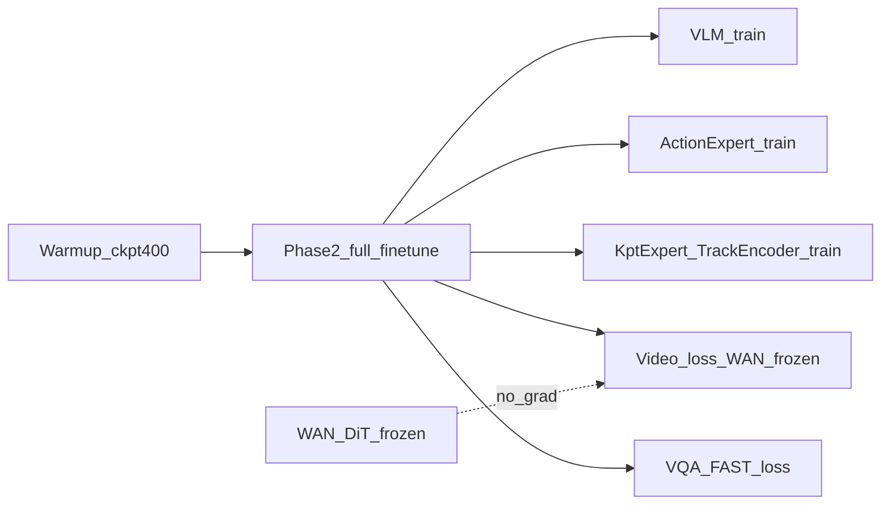

# InternVLA-A1.5 + GeoPredict 3D 轨迹融合版：RoboTwin stack_bowls_three Phase 2 微调（8×H200 本机落地）

> **文档定位**: 在 [v3.4 设计手册](itrnVLA15_GeoP_3dtrj_3cn4.md)、[Warmup 8G 手册](itrnVLA15_GeoP_3dtrj_3cn4_wrmup8G.md) 与 [Warmup 实施日志](itrnVLA15_GeoP_3dtrj_3cn4_wrmup8G_LOG.md) 基础上，给出 **本机 8×H200** 上对 RoboTwin 2.0 `stack_bowls_three`（kptsim 体素 GT 数据）做 **Phase 2 全量微调** 的完整可执行方案。
>
> **前置**: Phase 1 Warmup 已在本机跑通（[`wrmup8G_LOG`](itrnVLA15_GeoP_3dtrj_3cn4_wrmup8G_LOG.md)）；本方案 **固定从 Warmup ckpt@400 出发**。
>
> **训练策略**: 对齐 [`launch/internvla_a15_finetune.sh`](../launch/internvla_a15_finetune.sh) / [`launch/internvla_a15_finetune_robotwin.sh`](../launch/internvla_a15_finetune_robotwin.sh) 的标准 A1.5 finetune 超参（VLM + Action + Video + VQA/FAST 全训），叠加 GeoP 关键点分支；**仅 WAN DiT 冻结**，其余可训练模块均更新。
>
> **本机约束**:
> - 虚拟环境 **`/tmp/itnvla15rbt20/`** 自包含
> - 源码 **`/tmp/SRC/InternVLA-A-series/`**（`pip install -e`）
> - 数据 **`/tmp/rbt2stk3kptsim0811/stack_bowls_three_kptsim_lrbv30/`**
> - 视频解码：**torchcodec 0.10.0+cu128 + nvidia-npp-cu12**

---

## 目录

- [0. 阅读指南与本方案定位](#0-阅读指南与本方案定位)
- [1. 训练目标与 Loss 设计](#1-训练目标与-loss-设计)
- [2. 本机路径常量表](#2-本机路径常量表)
- [3. Phase 1→2 衔接与冻结/训练矩阵](#3-phase-12-衔接与冻结训练矩阵)
- [4. Phase 2 超参详解](#4-phase-2-超参详解)
- [5. 前置条件（继承 Warmup）](#5-前置条件继承-warmup)
- [6. WAN 权重下载](#6-wan-权重下载)
- [7. 数据与 norm_stat](#7-数据与-norm_stat)
- [8. Preflight 验收清单](#8-preflight-验收清单)
- [9. Smoke 测试](#9-smoke-测试)
- [10. 8 卡正式训练 10000 step](#10-8-卡正式训练-10000-step)
- [11. GPU 满负载与监控](#11-gpu-满负载与监控)
- [12. Loss 监控与 Checkpoint 选择](#12-loss-监控与-checkpoint-选择)
- [13. RoboTwin 2.0 评测衔接](#13-robotwin-20-评测衔接)
- [14. 故障排查](#14-故障排查)
- [附录 A：Launch 脚本模式说明](#附录-alaunch-脚本模式说明)
- [附录 B：Launch 脚本全文](#附录-blaunch-脚本全文)
- [附录 C：配置矩阵 Warmup vs Phase2 vs finetune](#附录-c配置矩阵-warmup-vs-phase2-vs-finetune)
- [附录 D：执行 LOG 模板](#附录-d执行-log-模板)

---

## 0. 阅读指南与本方案定位

### 0.1 与参考文档的关系

| 文档 | 内容 | 本方案继承点 |
|:---|:---|:---|
| [itrnVLA15_GeoP_3dtrj_3cn4.md](itrnVLA15_GeoP_3dtrj_3cn4.md) | GeoP 三路径 MoT 架构、Loss 设计 | kpt 分支 CLI、推理路径 |
| [itrnVLA15_GeoP_3dtrj_3cn4_wrmup8G.md](itrnVLA15_GeoP_3dtrj_3cn4_wrmup8G.md) | Phase 1 Warmup 本机手册 | venv 自包含、torchcodec、路径常量 |
| [itrnVLA15_GeoP_3dtrj_3cn4_wrmup8G_LOG.md](itrnVLA15_GeoP_3dtrj_3cn4_wrmup8G_LOG.md) | Warmup 实测日志 | **ckpt@400 路径**、收敛曲线 |
| [itrnVLA15_GeoP_3dtrj_3cn2_sft_rbt2_2.md](itrnVLA15_GeoP_3dtrj_3cn2_sft_rbt2_2.md) | cn2 FK 数据两阶段 SFT | GeoP kpt loss 权重模板、eval 流程 |
| [LOG_p2_080719](itrnVLA15_GeoP_3dtrj_3cn2_sft_rbt2_2LOG_p2_080719.md) | 080719 Action+Kpt only | **本方案不采用**（VLM 冻结 / video_loss=0） |
| [`internvla_a15_finetune.sh`](../launch/internvla_a15_finetune.sh) | 标准 A1.5 finetune 模板 | 全训 flags、scheduler、loss 权重 |
| [`internvla_a15_finetune_robotwin_stackb3_venv.sh`](../launch/internvla_a15_finetune_robotwin_stackb3_venv.sh) | 8×H200 单任务 10k | BS=16、save_freq=2500、WAN 加载 |

### 0.2 本方案 vs 080719 vs 标准 finetune



| 维度 | 080719（作废） | 标准 finetune | **本方案 Phase 2** |
|:---|:---|:---|:---|
| 起点 | 旧 Phase1 ckpt | InternVLA-A1.5-base | **Warmup ckpt@400** |
| VLM | 冻结 | 训练 | **训练** |
| WAN DiT | 加载但不训 | 冻结（默认） | **冻结（显式）** |
| video loss | 0 | 1 | **1** |
| VQA/FAST | 关 | 开 | **开** |
| Kpt 分支 | 开 | 无 | **开** |
| 数据 GT | FK `_kpt` | 原始 | **kptsim 体素 lrbv30** |

### 0.3 为何选用 ckpt@400 而非 @300

[`wrmup8G_LOG`](itrnVLA15_GeoP_3dtrj_3cn4_wrmup8G_LOG.md) 中 Warmup 400 step 轨迹：

| Step | loss_kpt_cur | loss_action |
|:---:|:---:|:---:|
| 300 | 0.0016 | 0.103 |
| **400** | **0.0015** | **0.099** |

@400 为 Warmup **终点 checkpoint**，kpt 与 action loss 均略优于 @300。本方案 **显式固定** 从 `checkpoints/000400/pretrained_model` 续训。

---

## 1. 训练目标与 Loss 设计

Phase 2 在已收敛的 Keypoint Expert（Warmup 产出）基础上，对 **stack_bowls_three** 任务做端到端策略微调：

1. **Action**：flow-matching 动作 chunk 预测（主任务）。
2. **Video foresight**：WAN 分支提供 latent video 监督（WAN DiT **不参与梯度**）。
3. **VQA/FAST**：Qwen3.5 语言 token + FAST 离散动作 token 监督。
4. **Keypoint**：3D 轨迹当前/未来关键点监督（kptsim 体素坐标 GT）。

有效 loss（`enable_vqa_loss=true`，action 由 `action_loss_weight` 放大）：

\[
\mathcal{L} = 10 \cdot \mathcal{L}_{action} + \mathcal{L}_{vqa/fast} + \mathcal{L}_{video} + 2.5 \cdot \left(\mathcal{L}_{kpt}^{cur} + 1.0 \cdot \mathcal{L}_{kpt}^{fut}\right)
\]

其中 \(\mathcal{L}_{vqa/fast}\)、\(\mathcal{L}_{video}\) 的具体组合与权重以 [`modeling_internvla_a1_5.py`](../src/lerobot/policies/internvla_a1_5/modeling_internvla_a1_5.py) 实现为准（`video_loss_weight=1`，`use_fast_action_tokens=true`）。

---

## 2. 本机路径常量表

实施前在 shell 中一次性定义：

```bash
export VENV=/tmp/itnvla15rbt20
export PROJ=/tmp/SRC/InternVLA-A-series
export HF_HOME=${VENV}/var/hf_home
export HF_LEROBOT_HOME=${VENV}/var/datasets
export DATA_ROOT=${HF_LEROBOT_HOME}/stack_bowls_three_kptsim_lrbv30
export NORM_STATS=${DATA_ROOT}/norm_stat.json
export WAN_DIR=${HF_HOME}/hub/Wan2.2-TI2V-5B
export WARMUP_JOB=2026_08_11_03_04_19-internvla_a1_5-geop-phase1-kpt-warmup-kptsim-voxel-8g
export WARMUP_CKPT=${PROJ}/outputs/internvla_a1_5/${WARMUP_JOB}/checkpoints/000400/pretrained_model
```

| 用途 | 路径 |
|:---|:---|
| venv | `/tmp/itnvla15rbt20/` |
| 源码（editable） | `/tmp/SRC/InternVLA-A-series/` |
| 数据实体 | `/tmp/rbt2stk3kptsim0811/stack_bowls_three_kptsim_lrbv30/` |
| HF 缓存 + 权重 | `/tmp/itnvla15rbt20/var/hf_home/` |
| LeRobot 注册根 | `/tmp/itnvla15rbt20/var/datasets/` |
| norm_stat | `.../lrbv30/norm_stat.json` |
| **Warmup ckpt@400** | `.../checkpoints/000400/pretrained_model` |
| WAN 权重 | `${HF_HOME}/hub/Wan2.2-TI2V-5B/` |
| Phase 2 Launch | `launch/internvla_a15_geop_phase2_finetune_kptsim_8g.sh` |
| 训练输出 | `${PROJ}/outputs/internvla_a1_5/<JOB_NAME>/` |

> venv 自包含原则、torchcodec 修复、Transformers patch 等 **继承** [wrmup8G §1–§4](itrnVLA15_GeoP_3dtrj_3cn4_wrmup8G.md)，本文不重复展开。

---

## 3. Phase 1→2 衔接与冻结/训练矩阵

### 3.1 三大安全检查（GeoP 特有）

| # | 配置 | Warmup | Phase 2 |
|:---:|:---|:---:|:---:|
| 1 | `pretrained_path` | InternVLA-A1.5-base | **Warmup ckpt@400** |
| 2 | `init_kpt_expert_from_action` | **true** | **false** |
| 3 | `geopredict_checkpoint_path` | 设置 GeoPredict | **不设** |

违反 #2 会覆盖已训练的 Kpt Expert；违反 #3 会覆盖 Warmup 已写入 checkpoint 的 TrackEncoder。

### 3.2 冻结 vs 训练

| 模块 | Phase 2 | 配置 |
|:---|:---|:---|
| **WAN DiT** | **冻结** | `freeze_wan_dit=true`（config 默认 true；launch 显式写出） |
| WAN VAE | 加载、前向用 | 随 WAN checkpoint |
| **VLM (Qwen3.5-2B)** | **训练** | `train_expert_only=false` |
| **Action Expert** | **训练** | 同上 |
| **Kpt Expert + TrackEncoder** | **训练** | `freeze_keypoint_modules=false` |
| **Learnable foresight tokens** | **冻结** | `freeze_learnable_tokens=true`（与 finetune 一致） |
| Vision encoder | 训练 | `freeze_vision_encoder=false` |

### 3.3 Warmup vs Phase 2 关键差异

| 配置 | Warmup | Phase 2 |
|:---|:---:|:---:|
| `pretrained_path` | base | **ckpt@400** |
| `train_expert_only` | true | **false** |
| `action_loss_only` | true（无 WAN） | **false**（加载 WAN） |
| `enable_vqa_loss` | false | **true** |
| `knowledge_insulation` | true | **false** |
| `init_kpt_expert_from_action` | true | **false** |
| `geopredict_checkpoint_path` | 设置 | **不设** |
| `kpt_loss_weight` | 10.0 | **1.0** |
| `action_loss_weight` | 2.0 | **10.0** |

---

## 4. Phase 2 超参详解

### 4.1 来源映射

| 类别 | 参数 | 值 | 来源 |
|:---|:---|:---|:---|
| 起点 | `pretrained_path` | Warmup ckpt@400 | wrmup8G_LOG |
| 优化 | `optimizer_lr` | 5e-5 | finetune.sh |
| | `scheduler_warmup_steps` | 1000 | stackb3_venv |
| | `scheduler_decay_steps` | 10000 | stackb3_venv |
| | `scheduler_decay_lr` | 5e-6 | finetune.sh |
| 全训 | `train_expert_only` | false | finetune.sh |
| | `enable_vqa_loss` | true | finetune.sh |
| | `use_fast_action_tokens` | true | finetune.sh |
| | `knowledge_insulation` | false | finetune.sh |
| Video | `action_loss_only` | false | finetune.sh |
| | `video_loss_weight` | 1 | finetune.sh |
| | `freeze_wan_dit` | **true** | 用户要求 |
| | `freeze_learnable_tokens` | true | finetune.sh |
| GeoP | `enable_keypoint_predictor` | true | cn4 |
| | `init_kpt_expert_from_action` | false | §3.1 |
| | `action_loss_weight` | 10.0 | cn2 Phase 2 |
| | `kpt_loss_weight` | 1.0 | cn2 Phase 2 |
| | `kpt_future_loss_weight` | 1.5 | cn2 Phase 2 |
| 数据 | `repo_id` | stack_bowls_three_kptsim_lrbv30 | wrmup8G |
| | `external_stats_path` | norm_stat.json | wrmup8G |
| | `video_backend` | torchcodec | wrmup8G |
| | `dist_loading` | false | stackb3_venv |
| 规模 | `batch_size` | 16/GPU | stackb3_venv（BS=32 OOM） |
| | `steps` | 10000 | stackb3_venv |
| | `save_freq` | 2500 | stackb3_venv |
| | `log_freq` | 50 | stackb3_venv |
| | `num_workers` | 12 | wrmup8G 8 卡 |
| | GPU | 8× H200 | 本机 |

### 4.2 有效 batch 与显存

- 每卡 BS=16 × 8 GPU → **有效 BS=128**
- [`stackb3_venv`](../launch/internvla_a15_finetune_robotwin_stackb3_venv.sh) 注释：BS=32 在 H200 + WAN + 3 相机下 OOM（~127 GB + lm_head 分配失败）
- Phase 2 加载 WAN 且 `video_loss_weight=1`，显存高于 Warmup；**默认 BS=16**，OOM 时降至 12 或 8

---

## 5. 前置条件（继承 Warmup）

Phase 2 **假定** [wrmup8G](itrnVLA15_GeoP_3dtrj_3cn4_wrmup8G.md) Phase 0–5 已完成。快速复验：

```bash
VENV=/tmp/itnvla15rbt20
PROJ=/tmp/SRC/InternVLA-A-series

# 1. venv + editable
test -x ${VENV}/bin/python
test -L ${PROJ} || test -d ${PROJ}

# 2. 数据 symlink
test -f ${VENV}/var/datasets/stack_bowls_three_kptsim_lrbv30/meta/info.json

# 3. Warmup ckpt@400
test -f ${PROJ}/outputs/internvla_a1_5/2026_08_11_03_04_19-internvla_a1_5-geop-phase1-kpt-warmup-kptsim-voxel-8g/checkpoints/000400/pretrained_model/model.safetensors

# 4. torchcodec cu128
${VENV}/bin/python -c "import torchcodec; print(torchcodec.__version__)"
# 期望: 0.10.0+cu128

# 5. GPU
${VENV}/bin/python -c "import torch; print('cuda', torch.cuda.device_count())"
# 期望: cuda 8
```

未通过项 → 回到 [wrmup8G §4–§7](itrnVLA15_GeoP_3dtrj_3cn4_wrmup8G.md) 修复。

---

## 6. WAN 权重下载

Warmup 使用 `action_loss_only=true`，**未下载 WAN**。Phase 2 须在 venv 内补齐：

```bash
VENV=/tmp/itnvla15rbt20
export HF_HOME=${VENV}/var/hf_home
WAN_DIR=${HF_HOME}/hub/Wan2.2-TI2V-5B
mkdir -p "${WAN_DIR}"

${VENV}/bin/python <<'PY'
import os
from huggingface_hub import snapshot_download

hf_home = os.environ["HF_HOME"]
wan_dir = os.path.join(hf_home, "hub", "Wan2.2-TI2V-5B")
snapshot_download(
    "Wan-AI/Wan2.2-TI2V-5B",
    local_dir=wan_dir,
)
print("WAN downloaded to:", wan_dir)
PY
```

验收：

```bash
test -f ${WAN_DIR}/Wan2.2_VAE.pth
test -d ${WAN_DIR}
du -sh ${WAN_DIR}
```

> WAN 体积约数十 GB，首次下载需稳定网络；缓存必须落在 `${VENV}/var/hf_home/`，禁止 `$HOME/.cache`。

---

## 7. 数据与 norm_stat

### 7.1 数据集

| 项 | 值 |
|:---|:---|
| 实体路径 | `/tmp/rbt2stk3kptsim0811/stack_bowls_three_kptsim_lrbv30/` |
| LeRobot `repo_id` | `stack_bowls_three_kptsim_lrbv30` |
| Episodes / Frames | 50 / 23550 |
| 关键点列 | `observation.keypoint_3d` shape `[42]`（14 joints × 3，**体素坐标**） |
| norm_stat | 数据集根目录 `norm_stat.json`（14 维 state/action z-score） |

与 cn2 FK 数据（`stack_bowls_three_kpt`）的区别：**GT 来源**为 kptsim 体素注入，非 pinocchio FK；训练 CLI 与 collate 路径相同。

### 7.2 Layer 1 快速检查

```bash
VENV=/tmp/itnvla15rbt20
DATA=${VENV}/var/datasets/stack_bowls_three_kptsim_lrbv30

${VENV}/bin/python <<PY
import json, pyarrow.parquet as pq
info = json.load(open("${DATA}/meta/info.json"))
print("episodes:", info.get("total_episodes"), "frames:", info.get("total_frames"))
pf = pq.read_table("${DATA}/data/chunk-000/file-000.parquet", columns=["observation.keypoint_3d"])
kpt = pf["observation.keypoint_3d"][0].as_py()
print("keypoint_3d len:", len(kpt), "sample:", kpt[:3])
PY
```

---

## 8. Preflight 验收清单

```bash
VENV=/tmp/itnvla15rbt20
PROJ=/tmp/SRC/InternVLA-A-series
export HF_HOME=${VENV}/var/hf_home
export LD_LIBRARY_PATH="/usr/local/nvidia/lib64:${VENV}/lib:\
${VENV}/lib/python3.11/site-packages/torch/lib:\
${VENV}/lib/python3.11/site-packages/nvidia/cuda_runtime/lib:\
${VENV}/lib/python3.11/site-packages/nvidia/cuda_nvrtc/lib:\
${VENV}/lib/python3.11/site-packages/nvidia/npp/lib:${LD_LIBRARY_PATH:-}"

echo "=== Preflight Phase 2 ==="

# 1. Python 环境
${VENV}/bin/python -c "import torch, lerobot; print('torch', torch.__version__, 'cuda', torch.cuda.device_count())"

# 2. WAN
test -f ${HF_HOME}/hub/Wan2.2-TI2V-5B/Wan2.2_VAE.pth && echo "WAN OK"

# 3. 数据
test -f ${VENV}/var/datasets/stack_bowls_three_kptsim_lrbv30/meta/info.json && echo "DATA OK"

# 4. Warmup ckpt@400
WARMUP_CKPT=${PROJ}/outputs/internvla_a1_5/2026_08_11_03_04_19-internvla_a1_5-geop-phase1-kpt-warmup-kptsim-voxel-8g/checkpoints/000400/pretrained_model
test -f ${WARMUP_CKPT}/model.safetensors && echo "WARMUP_CKPT OK"

# 5. kpt config in checkpoint
${VENV}/bin/python -c "
import json; c=json.load(open('${WARMUP_CKPT}/config.json'))
assert c.get('enable_keypoint_predictor')==True, c
print('enable_keypoint_predictor OK')
"

# 6. 无残留训练进程
pgrep -af lerobot_train || echo "no train procs (OK)"

# 7. Launch 脚本
test -x ${PROJ}/launch/internvla_a15_geop_phase2_finetune_kptsim_8g.sh && echo "LAUNCH OK" || echo "LAUNCH missing — 见附录 B 创建"

echo "=== Preflight done ==="
```

---

## 9. Smoke 测试

Launch 脚本支持三级模式（见 [附录 A](#附录-alaunch-脚本模式说明)）。

### 9.1 WAN Smoke（1 GPU × 2 step）

验证 WAN 加载 + `freeze_wan_dit=true` 不报错：

```bash
cd /tmp/SRC/InternVLA-A-series
WAN_SMOKE=1 LOG_FILE=/tmp/phase2_wan_smoke_kptsim.log \
  bash launch/internvla_a15_geop_phase2_finetune_kptsim_8g.sh
```

**期望**：
- exit 0
- 日志含 WAN 加载信息
- step 1–2 出现 `loss_action`、`loss_video`（可能还有 `loss_vqa`/`loss_fast`、`loss_kpt_cur`）
- `post_check: video_decode_error=0 using_zeros=0`

### 9.2 Phase 2 Smoke（1 GPU × 100 step）

```bash
cd /tmp/SRC/InternVLA-A-series
SMOKE=1 LOG_FILE=/tmp/phase2_smoke100_kptsim.log \
  bash launch/internvla_a15_geop_phase2_finetune_kptsim_8g.sh
```

**期望**：
- 四项 loss 均 > 0（与 080719 不同，**本方案含 vqa/video loss**）
- `loss_kpt_cur` 保持低位（Warmup 已收敛，通常 < 0.01）
- `video_decode_error=0`，`using_zeros=0`
- 约 3–5 min 完成

### 9.3 Smoke 判据汇总

| 判据 | WAN Smoke | Phase2 Smoke 100 |
|:---|:---:|:---:|
| exit code | 0 | 0 |
| loss_action > 0 | ✅ | ✅ |
| loss_video > 0 | ✅ | ✅ |
| loss_vqa 或 loss_fast > 0 | ✅ | ✅ |
| loss_kpt_cur > 0 | ✅ | ✅ |
| video_decode_error | 0 | 0 |
| using_zeros | 0 | 0 |

---

## 10. 8 卡正式训练 10000 step

### 10.1 启动命令

```bash
cd /tmp/SRC/InternVLA-A-series

# 前台 + tee（推荐首次）
LOG_FILE=/tmp/phase2_kptsim_8g_10k.log \
  bash launch/internvla_a15_geop_phase2_finetune_kptsim_8g.sh

# 或后台
nohup bash launch/internvla_a15_geop_phase2_finetune_kptsim_8g.sh \
  >> /tmp/phase2_kptsim_8g_10k.log 2>&1 &
echo $! > /tmp/phase2_kptsim_8g.pid
```

### 10.2 正式配置摘要

| 项 | 值 |
|:---|:---|
| GPU | 8× H200（`CUDA_VISIBLE_DEVICES=0-7`） |
| batch_size | 16 / GPU（有效 128） |
| steps | 10000 |
| save_freq | 2500 → ckpt @ 2500/5000/7500/10000 |
| num_workers | 12 |
| video_backend | torchcodec |
| wandb | offline |

### 10.3 预期墙钟

参考 [`stackb3_venv`](../launch/internvla_a15_finetune_robotwin_stackb3_venv.sh) 与同架构 RoboTwin 单任务 finetune：**约 2–3 小时**（含 WAN video forward，低于 Warmup 的 ~18 min/400 step 不可直接类比）。

---

## 11. GPU 满负载与监控

### 11.1 利用率策略

| 策略 | 说明 |
|:---|:---|
| BS=16/GPU | stackb3_venv 在 H200 上实测可行；有效 BS=128 |
| num_workers=12 | 与 Warmup 8 卡一致，喂满 GPU |
| OMP_NUM_THREADS=1 | 避免 CPU 线程争抢 |
| torchcodec | CPU worker 内高速解码；禁止 pyav 长训 |
| dist_loading=false | 50 ep 单任务，8 rank 分片过稀疏 |

### 11.2 监控命令

```bash
# 训练日志
tail -f /tmp/phase2_kptsim_8g_10k.log

# 最近 step
grep 'step:' /tmp/phase2_kptsim_8g_10k.log | tail -20

# 四项 loss
grep -E 'loss_action|loss_video|loss_vqa|loss_fast|loss_kpt' /tmp/phase2_kptsim_8g_10k.log | tail -10

# GPU
watch -n 5 nvidia-smi

# 进程
pgrep -af lerobot_train
```

### 11.3 OOM 降级

```bash
BATCH_SIZE=12 bash launch/internvla_a15_geop_phase2_finetune_kptsim_8g.sh
# 仍 OOM → BATCH_SIZE=8
```

---

## 12. Loss 监控与 Checkpoint 选择

### 12.1 收敛参考

本方案含 video/vqa loss，**总 loss 绝对值**与 080719（仅 action+kpt）不可直接对比。关注：

| 指标 | 期望趋势 |
|:---|:---|
| `loss_action` | 随 step 下降 |
| `loss_kpt_cur` | 维持低位（Warmup 已收敛） |
| `loss_video` | 非零、逐步下降或稳定 |
| `loss_vqa` / `loss_fast` | 非零 |
| `grad_norm` | 无持续爆炸 |

### 12.2 Checkpoint

正式 run 输出目录示例：

```
${PROJ}/outputs/internvla_a1_5/<timestamp>-internvla_a1_5-geop-phase2-finetune-kptsim-voxel-8g-10k/
├── checkpoints/
│   ├── 002500/pretrained_model/
│   ├── 005000/pretrained_model/
│   ├── 007500/pretrained_model/
│   ├── 010000/pretrained_model/   ← 推荐评测起点
│   └── last/ -> 010000
└── wandb/offline-run-*/
```

验证 checkpoint 含 GeoP 配置：

```bash
CKPT=.../checkpoints/010000/pretrained_model
${VENV}/bin/python -c "
import json
c = json.load(open('${CKPT}/config.json'))
print('enable_keypoint_predictor:', c.get('enable_keypoint_predictor'))
print('num_keypoint_joints:', c.get('num_keypoint_joints'))
print('freeze_wan_dit:', c.get('freeze_wan_dit'))
"
```

---

## 13. RoboTwin 2.0 评测衔接

### 13.1 推理路径

- 入口：[`evaluation/RoboTwin/inference.py`](../evaluation/RoboTwin/inference.py)
- 脚本：[`evaluation/RoboTwin/eval.sh`](../evaluation/RoboTwin/eval.sh)
- 加载 checkpoint 时自动读取 `enable_keypoint_predictor`

### 13.2 坐标系对齐（重要）

- **训练 GT**：kptsim **体素坐标**（方案 A，见 [wrmup.md §10](itrnVLA15_GeoP_3dtrj_3cn4_wrmup.md)）
- **推理 runtime**：SAPIEN `get_keypoints_aloha()` footprint-relative 坐标

部署前须确认 inference 侧关键点与训练坐标系一致，否则 kpt 分支 KV 语义错位。详见 [cn4 §14](itrnVLA15_GeoP_3dtrj_3cn4.md)。

### 13.3 评测命令模板（路径本地化）

```bash
VENV=/tmp/itnvla15rbt20
PROJ=/tmp/SRC/InternVLA-A-series
export HF_HOME=${VENV}/var/hf_home
export LD_LIBRARY_PATH="/usr/local/nvidia/lib64:${VENV}/lib:${LD_LIBRARY_PATH:-}"

CKPT=${PROJ}/outputs/internvla_a1_5/<Phase2_JOB>/checkpoints/010000/pretrained_model

cd ${PROJ}
bash evaluation/RoboTwin/eval.sh \
  ${CKPT} \
  outputs/robotwin_eval/geop_stack_bowls_three_kptsim \
  demo_clean \
  46 \
  abs \
  50
```

### 13.4 低延迟部署（可选）

真机/高频控制可切换 optimized backend（跳过 WAN 加载）：

```python
config.inference_backend = "optimized"
config.action_loss_only = True
```

---

## 14. 故障排查

| 现象 | 可能原因 | 对策 |
|:---|:---|:---|
| `FileNotFoundError: Wan2.2_VAE.pth` | Warmup 未下载 WAN | §6 |
| TrackEncoder 被覆盖 | 误设 `geopredict_checkpoint_path` | 删除该 CLI；从 ckpt@400 重训 |
| Kpt Expert 被 re-init | `init_kpt_expert_from_action=true` | 改为 false |
| `--multi_gpu` 单进程报错 | Smoke 模式 NUM_PROCESSES=1 | launch 已条件化；见 wrmup8G_LOG Error 1 |
| OOM @ BS=16 | WAN + video loss + 3 相机 | `BATCH_SIZE=12` 或 8 |
| `video_decode_error` > 0 | torchcodec / LD 路径 | [wrmup8G §2](itrnVLA15_GeoP_3dtrj_3cn4_wrmup8G.md) |
| `using_zeros` > 0 | 解码静默失败 | 同上；禁止 pyav 长训 |
| loss 无 video/vqa | 误用 080719 launch | 使用本方案 launch |
| 从 base 而非 ckpt@400 训练 | PRETRAINED_PATH 错 | 检查 §2 常量 |

---

## 附录 A：Launch 脚本模式说明

脚本路径：[`launch/internvla_a15_geop_phase2_finetune_kptsim_8g.sh`](../launch/internvla_a15_geop_phase2_finetune_kptsim_8g.sh)

| 模式 | 环境变量 | GPU | BS | STEPS | 用途 |
|:---|:---|:---:|:---:|:---:|:---|
| WAN Smoke | `WAN_SMOKE=1` | 1 | 2 | 2 | WAN 加载验证 |
| Phase2 Smoke | `SMOKE=1` | 1 | 2 | 100 | 全 loss 通路验证 |
| 正式 | （默认） | 8 | 16 | 10000 | 生产微调 |

可覆盖环境变量：`WARMUP_CKPT`、`WAN_DIR`、`BATCH_SIZE`、`STEPS`、`LOG_FILE`、`JOB_NAME`。

---

## 附录 B：Launch 脚本全文

保存为 [`launch/internvla_a15_geop_phase2_finetune_kptsim_8g.sh`](../launch/internvla_a15_geop_phase2_finetune_kptsim_8g.sh)：

```bash
#!/usr/bin/env bash
set -euo pipefail

###############################################################################
# GeoP Phase 2 fine-tune — kptsim voxel GT, 8×H200
# venv (self-contained): /tmp/itnvla15rbt20/
# code (editable):       /tmp/SRC/InternVLA-A-series/
# See: b/d/itrnVLA15_GeoP_3dtrj_3cn4_sft_rbt2.md
#
# Starting checkpoint: Warmup ckpt@400 (NOT InternVLA-A1.5-base)
# Training: full finetune (VLM + experts + kpt), WAN DiT frozen only
# Hyperparams: aligned with internvla_a15_finetune_robotwin.sh + stackb3_venv
#
# Usage:
#   bash launch/internvla_a15_geop_phase2_finetune_kptsim_8g.sh
#   WAN_SMOKE=1 bash launch/internvla_a15_geop_phase2_finetune_kptsim_8g.sh
#   SMOKE=1 bash launch/internvla_a15_geop_phase2_finetune_kptsim_8g.sh
###############################################################################

VENV_ROOT="${VENV_ROOT:-/tmp/itnvla15rbt20}"
PROJ_ROOT="${PROJ_ROOT:-/tmp/SRC/InternVLA-A-series}"
PYTHON="${PYTHON:-${VENV_ROOT}/bin/python}"

export HF_HOME="${HF_HOME:-${VENV_ROOT}/var/hf_home}"
export HF_LEROBOT_HOME="${HF_LEROBOT_HOME:-${VENV_ROOT}/var/datasets}"
export WANDB_MODE="${WANDB_MODE:-offline}"
export USE_LIBUV="${USE_LIBUV:-0}"
export PYTHONUNBUFFERED=1
export OMP_NUM_THREADS="${OMP_NUM_THREADS:-1}"
export MKL_NUM_THREADS="${MKL_NUM_THREADS:-1}"
export TOKENIZERS_PARALLELISM=false

export LD_LIBRARY_PATH="/usr/local/nvidia/lib64:${VENV_ROOT}/lib:\
${VENV_ROOT}/lib/python3.11/site-packages/torch/lib:\
${VENV_ROOT}/lib/python3.11/site-packages/nvidia/cuda_runtime/lib:\
${VENV_ROOT}/lib/python3.11/site-packages/nvidia/cuda_nvrtc/lib:\
${VENV_ROOT}/lib/python3.11/site-packages/nvidia/npp/lib:${LD_LIBRARY_PATH:-}"

export MASTER_ADDR="${MASTER_ADDR:-127.0.0.1}"
export MASTER_PORT="${MASTER_PORT:-36202}"

WARMUP_JOB="${WARMUP_JOB:-2026_08_11_03_04_19-internvla_a1_5-geop-phase1-kpt-warmup-kptsim-voxel-8g}"
WARMUP_CKPT="${WARMUP_CKPT:-${PROJ_ROOT}/outputs/internvla_a1_5/${WARMUP_JOB}/checkpoints/000400/pretrained_model}"

WAN_DIR="${WAN_DIR:-${HF_HOME}/hub/Wan2.2-TI2V-5B}"
VLM_MODEL_PATH="${VLM_MODEL_PATH:-Qwen/Qwen3.5-2B}"

POLICY="internvla_a1_5"
DATA_REPO_ID="stack_bowls_three_kptsim_lrbv30"
NORM_STATS="${NORM_STATS:-${HF_LEROBOT_HOME}/${DATA_REPO_ID}/norm_stat.json}"
DIST_LOADING="${DIST_LOADING:-false}"

WAN_SMOKE="${WAN_SMOKE:-0}"
SMOKE="${SMOKE:-0}"

if [[ "${WAN_SMOKE}" == "1" ]]; then
  export CUDA_VISIBLE_DEVICES="${CUDA_VISIBLE_DEVICES:-0}"
  PROC_PER_NODE="${PROC_PER_NODE:-1}"
  BATCH_SIZE="${BATCH_SIZE:-2}"
  STEPS="${STEPS:-2}"
  NUM_WORKERS="${NUM_WORKERS:-2}"
  SAVE_FREQ="${SAVE_FREQ:-2}"
  LOG_FREQ="${LOG_FREQ:-1}"
  SCHEDULER_WARMUP="${SCHEDULER_WARMUP:-1}"
  WANDB_ENABLE="${WANDB_ENABLE:-false}"
  JOB_SUFFIX="geop-phase2-wan-smoke-kptsim-voxel"
elif [[ "${SMOKE}" == "1" ]]; then
  export CUDA_VISIBLE_DEVICES="${CUDA_VISIBLE_DEVICES:-0}"
  PROC_PER_NODE="${PROC_PER_NODE:-1}"
  BATCH_SIZE="${BATCH_SIZE:-2}"
  STEPS="${STEPS:-100}"
  NUM_WORKERS="${NUM_WORKERS:-4}"
  SAVE_FREQ="${SAVE_FREQ:-100}"
  LOG_FREQ="${LOG_FREQ:-10}"
  SCHEDULER_WARMUP="${SCHEDULER_WARMUP:-50}"
  WANDB_ENABLE="${WANDB_ENABLE:-false}"
  JOB_SUFFIX="geop-phase2-smoke100-kptsim-voxel"
else
  export CUDA_VISIBLE_DEVICES="${CUDA_VISIBLE_DEVICES:-0,1,2,3,4,5,6,7}"
  PROC_PER_NODE="${PROC_PER_NODE:-8}"
  BATCH_SIZE="${BATCH_SIZE:-16}"
  STEPS="${STEPS:-10000}"
  NUM_WORKERS="${NUM_WORKERS:-12}"
  SAVE_FREQ="${SAVE_FREQ:-2500}"
  LOG_FREQ="${LOG_FREQ:-50}"
  SCHEDULER_WARMUP="${SCHEDULER_WARMUP:-1000}"
  WANDB_ENABLE="${WANDB_ENABLE:-true}"
  JOB_SUFFIX="geop-phase2-finetune-kptsim-voxel-8g-10k"
fi

NODE_COUNT="${NODE_COUNT:-1}"
NODE_RANK="${NODE_RANK:-0}"
NUM_PROCESSES=$((NODE_COUNT * PROC_PER_NODE))

cd "${PROJ_ROOT}"

JOB_NAME="${JOB_NAME:-$(date +'%Y_%m_%d_%H_%M_%S')-${POLICY}-${JOB_SUFFIX}}"
OUTPUT_DIR="${OUTPUT_DIR:-${PROJ_ROOT}/outputs/${POLICY}/${JOB_NAME}}"
LOG_FILE="${LOG_FILE:-${OUTPUT_DIR}.log}"

echo "VENV_ROOT=${VENV_ROOT}"
echo "PROJ_ROOT=${PROJ_ROOT}"
echo "HF_HOME=${HF_HOME}"
echo "HF_LEROBOT_HOME=${HF_LEROBOT_HOME}"
echo "WARMUP_CKPT=${WARMUP_CKPT}"
echo "WAN_DIR=${WAN_DIR}"
echo "WAN_SMOKE=${WAN_SMOKE} SMOKE=${SMOKE} PROC=${NUM_PROCESSES} BS=${BATCH_SIZE} STEPS=${STEPS}"

LAUNCH_ARGS=()
if [[ "${NUM_PROCESSES}" -gt 1 ]]; then
  LAUNCH_ARGS+=(--multi_gpu)
fi
LAUNCH_ARGS+=(
  --num_processes="${NUM_PROCESSES}"
  --num_machines="${NODE_COUNT}"
  --machine_rank="${NODE_RANK}"
  --main_process_ip="${MASTER_ADDR}"
  --main_process_port="${MASTER_PORT}"
)

ARGS=(
  "${LAUNCH_ARGS[@]}"
  src/lerobot/scripts/lerobot_train.py
  --output_dir="${OUTPUT_DIR}"
  --job_name="${JOB_NAME}"
  --num_workers="${NUM_WORKERS}"
  --policy.type="${POLICY}"
  --policy.repo_id=lerobot_lab/"${POLICY}"
  --policy.push_to_hub=false
  --policy.pretrained_path="${WARMUP_CKPT}"
  --policy.gradient_checkpointing=false
  --policy.dtype=bfloat16
  --policy.optimizer_lr=5e-5
  --policy.scheduler_warmup_steps="${SCHEDULER_WARMUP}"
  --policy.scheduler_decay_steps="${STEPS}"
  --policy.scheduler_decay_lr=5e-6
  --policy.freeze_vision_encoder=false
  --policy.train_expert_only=false
  --policy.vlm_model_name_or_path="${VLM_MODEL_PATH}"
  --policy.enable_vqa_loss=true
  --policy.tokenize_state=true
  --policy.knowledge_insulation=false
  --policy.video_loss_only=false
  --policy.video_loss_weight=1
  --policy.action_loss_only=false
  --policy.freeze_wan_dit=true
  --policy.freeze_learnable_tokens=true
  --policy.num_learnable_tokens=50
  --policy.wan_checkpoint_path="${WAN_DIR}"
  --policy.wan_config_path="${WAN_DIR}"
  --policy.vae_path="${WAN_DIR}/Wan2.2_VAE.pth"
  --policy.enable_keypoint_predictor=true
  --policy.num_keypoint_joints=14
  --policy.action_loss_weight=10.0
  --policy.kpt_loss_weight=1.0
  --policy.kpt_future_loss_weight=1.5
  --policy.kpt_to_action_detach=false
  --policy.freeze_keypoint_modules=false
  --policy.action_expert_lr_scale=1.0
  --policy.kpt_expert_lr_scale=1.0
  --policy.track_encoder_lr_scale=1.0
  --policy.init_kpt_expert_from_action=false
  --dataset.type="${POLICY}"
  --dataset.repo_id="${DATA_REPO_ID}"
  --dataset.enable_keypoint_predictor=true
  --dataset.num_keypoint_joints=14
  --dataset.action_mode=abs
  --dataset.tokenize_state=true
  --dataset.use_fast_action_tokens=true
  --dataset.use_external_stats=true
  --dataset.external_stats_path="${NORM_STATS}"
  --dataset.dist_loading="${DIST_LOADING}"
  --dataset.video_backend=torchcodec
  --seed=42
  --batch_size="${BATCH_SIZE}"
  --steps="${STEPS}"
  --save_freq="${SAVE_FREQ}"
  --log_freq="${LOG_FREQ}"
  --wandb.enable="${WANDB_ENABLE}"
  --wandb.project="${POLICY}"
  --wandb.mode=offline
)

mkdir -p "$(dirname "${LOG_FILE}")"
set -o pipefail
"${PYTHON}" -m accelerate.commands.launch "${ARGS[@]}" 2>&1 | tee "${LOG_FILE}"
train_exit=${PIPESTATUS[0]}

decode_err=$(grep -c '\[video_decode_error\]' "${LOG_FILE}" || true)
zero_frames=$(grep -c 'using_zeros' "${LOG_FILE}" || true)
echo "post_check: video_decode_error=${decode_err} using_zeros=${zero_frames} exit=${train_exit}"
if [[ "${decode_err}" -ne 0 || "${zero_frames}" -ne 0 ]]; then
  echo "WARNING: video decode failures — see wrmup8G.md Appendix A" >&2
fi
exit "${train_exit}"
```

安装：

```bash
chmod +x /tmp/SRC/InternVLA-A-series/launch/internvla_a15_geop_phase2_finetune_kptsim_8g.sh
```

---

## 附录 C：配置矩阵 Warmup vs Phase2 vs finetune

| 配置项 | Warmup | **Phase 2（本方案）** | finetune_robotwin |
|:---|:---:|:---:|:---:|
| `pretrained_path` | base | **ckpt@400** | base |
| `train_expert_only` | true | **false** | false |
| `action_loss_only` | true | false | false |
| `enable_vqa_loss` | false | **true** | true |
| `video_loss_weight` | 1* | 1 | 1 |
| `freeze_wan_dit` | N/A | **true** | true（默认） |
| `freeze_learnable_tokens` | true | true | true |
| `knowledge_insulation` | true | **false** | false |
| `enable_keypoint_predictor` | true | true | false |
| `init_kpt_expert_from_action` | true | **false** | N/A |
| `geopredict_checkpoint_path` | 设置 | **不设** | N/A |
| `action_loss_weight` | 2.0 | 10.0 | 1（默认） |
| `kpt_loss_weight` | 10.0 | 1.0 | N/A |
| `batch_size` | 16 | 16 | 16 |
| `steps` | 400 | **10000** | 10000 |
| `dataset` | lrbv30 kptsim | lrbv30 kptsim | stack_bowls_three |

\* Warmup 设 `action_loss_only=true`，WAN 未加载，`video_loss_weight` 不生效。

---

## 附录 D：执行 LOG 模板

> 正式跑通后在此文件旁新建 `itrnVLA15_GeoP_3dtrj_3cn4_sft_rbt2_LOG.md` 填写。

| 时间 | 操作 | 结果 |
|:---|:---|:---|
| | Preflight §8 | |
| | WAN 下载 §6 | |
| | WAN_SMOKE | |
| | SMOKE=1 100 step | |
| | 8 GPU 10k 正式 | |
| | Checkpoint @10000 | |
| | RoboTwin eval | |

**错误记录**：

| # | 现象 | 根因 | Fix |
|:---:|:---|:---|:---|
| 1 | | | |

---

> **参考**: [modeling_internvla_a1_5.py](../src/lerobot/policies/internvla_a1_5/modeling_internvla_a1_5.py) | [wrmup8G](itrnVLA15_GeoP_3dtrj_3cn4_wrmup8G.md) | [wrmup8G_LOG](itrnVLA15_GeoP_3dtrj_3cn4_wrmup8G_LOG.md) | [finetune_robotwin](../launch/internvla_a15_finetune_robotwin.sh) | [stackb3_venv](../launch/internvla_a15_finetune_robotwin_stackb3_venv.sh)

*文档版本: sft_rbt2-v1.0 | 2026-08-11*
