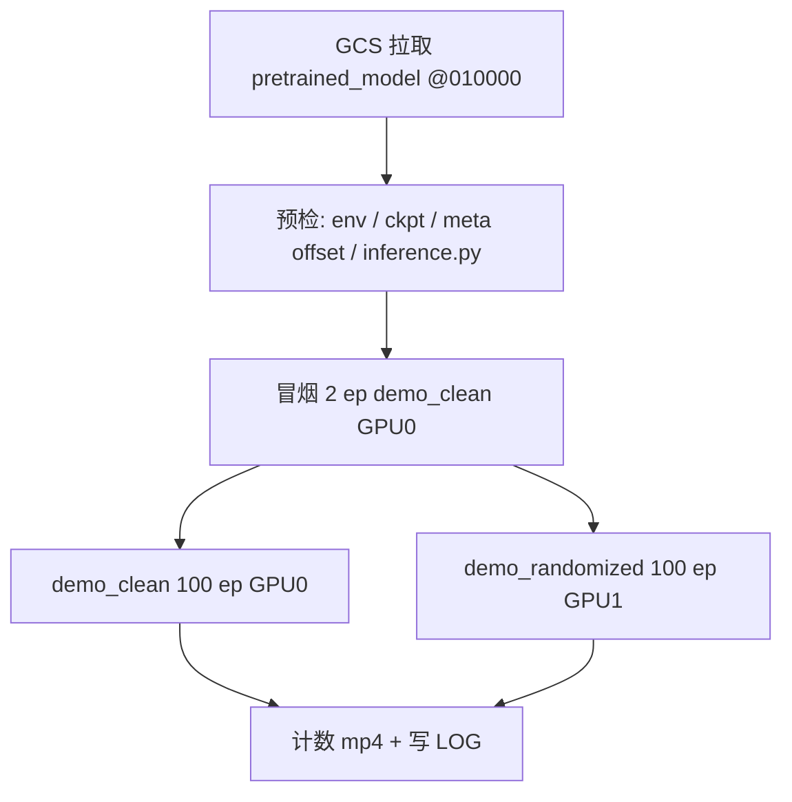
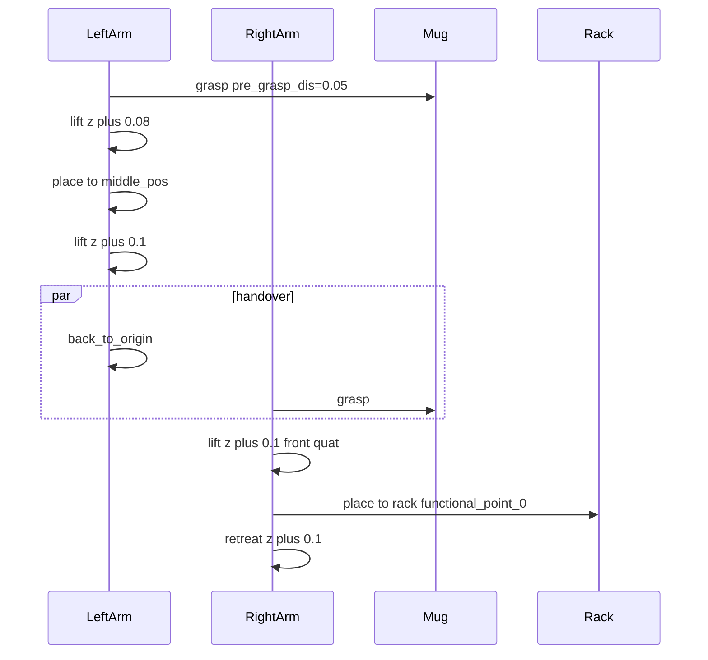
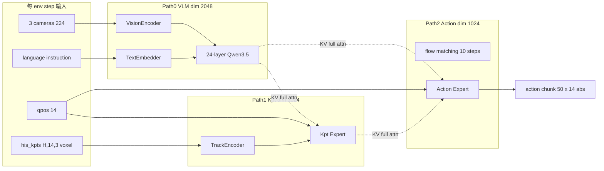
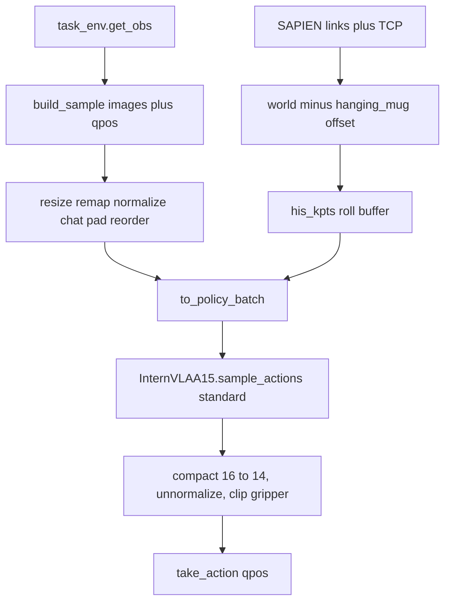

# InternVLA-A1.5 + GeoPredict：RoboTwin 2.0 `hanging_mug` 本机评测落地方案与操作手册

> **文档定位**：在本机（GCP Blackwell 开发机）上，用 [RoboTwin 2.0](https://robotwin-platform.github.io/) 的 **`hanging_mug`** 任务，评估 GCS 上 hanging_mug Phase 2 训练 **第 10000 步** checkpoint。本手册给出可执行步骤、坐标系对齐约束、预检/冒烟/正式评测命令，以及与 `stack_bowls_three` 评测的差异。
>
> **本次评测对象**（用户指定）：
>
> `gs://physical-ai-data-eu/VENV/tmp/2026_08_26_01_24_16-internvla_a1_5-geop-phase2-finetune-kptsim-voxel-8g-10k/checkpoints/010000/pretrained_model/`
>
> **本机代码库**：`/home/luogang/SRC/Robot/itvlaGp/`  
> **Python 环境（必须复用）**：conda **`itvlaGp`**，解释器 `/home/luogang/miniforge3/envs/itvlaGp/bin/python`（Python 3.10.20）。与本机 `stack_bowls_three` 评测同一套，**不要新建**，也不要用 `ivla15` / `RoboTwin`。详见 [§5.1](#51-python-虚拟环境必须复用-conda-itvlagp)。  
> **RoboTwin 源码**：`/home/luogang/share/zwy/Projects/RoboTwin/`（仓库内 `third_party/RoboTwin` 符号链接）  
> **执行日志（评测时追加）**：[`itrnVLA15_GeoP_3dtrj_3cn4_sft_rbt2_hngMg_evalLOG.md`](itrnVLA15_GeoP_3dtrj_3cn4_sft_rbt2_hngMg_evalLOG.md)

**参考文档与出处**：

| 来源 | 用途 |
|:---|:---|
| [`itrnVLA15_GeoP_3dtrj_3cn4_rbt2stkb3_eval6000_10kLOG.md`](itrnVLA15_GeoP_3dtrj_3cn4_rbt2stkb3_eval6000_10kLOG.md) | 本机 `stack_bowls_three` 010k 评测实测：体素 kpt 改造、`load_stats` 修复、双 GPU 命令、SIGHUP/磁盘坑 |
| [`reprd_rbtwn_stackb3_itvlagp_3cn2_eval6000_2.md`](reprd_rbtwn_stackb3_itvlagp_3cn2_eval6000_2.md) | V2 评估手册：预检、冒烟、`inference.py` 约束、故障手册 |
| [`itrnVLA15_GeoP_3dtrj_3cn4_sft_rbt2.md`](itrnVLA15_GeoP_3dtrj_3cn4_sft_rbt2.md) §13 | stack_bowls Phase 2 评测衔接（坐标系必须对齐） |
| [`itrnVLA15_GeoP_3dtrj_3cn4_sft_rbt2_hngMg.md`](itrnVLA15_GeoP_3dtrj_3cn4_sft_rbt2_hngMg.md) §13 | hanging_mug 评测衔接：`task_idx=10`、**必须传本任务 meta**、禁止 `eval.sh` 默认调用 |
| [`itrnVLA15_GeoP_3dtrj_3cn4_wrmup1G_hngMg.md`](itrnVLA15_GeoP_3dtrj_3cn4_wrmup1G_hngMg.md) §1 / §9 | hanging_mug 体素 offset、kptsim schema、推理对齐 |
| [`evaluation/RoboTwin/inference.py`](../evaluation/RoboTwin/inference.py) | 本机评测入口（已含体素 kpt + `load_stats` mean/std 兼容） |
| RoboTwin [`envs/hanging_mug.py`](file:///home/luogang/share/zwy/Projects/RoboTwin/envs/hanging_mug.py) | 任务成功条件与 expert 脚本 |

---

## 目录

- [0. 方案概览](#0-方案概览)
- [1. hanging_mug 任务与成功条件](#1-hanging_mug-任务与成功条件)
- [2. Checkpoint 与训练/推理坐标系](#2-checkpoint-与训练推理坐标系)
- [3. 推理架构与数据流](#3-推理架构与数据流)
- [4. 与 stack_bowls 评测的硬差异](#4-与-stack_bowls-评测的硬差异)
- [5. 本机环境与代码状态](#5-本机环境与代码状态)
  - [5.1 Python 虚拟环境（必须复用 conda `itvlaGp`）](#51-python-虚拟环境必须复用-conda-itvlagp)
- [6. 从 GCS 下载 step-010000](#6-从-gcs-下载-step-010000)
- [7. 全流程预检](#7-全流程预检)
- [8. 冒烟测试（2 episode）](#8-冒烟测试2-episode)
- [9. 正式评估（demo_clean + demo_randomized）](#9-正式评估demo_clean--demo_randomized)
- [10. 进度监控与结果汇总](#10-进度监控与结果汇总)
- [11. 关键约束](#11-关键约束)
- [12. 故障排除](#12-故障排除)
- [13. 附录](#13-附录)
- [Part B：执行记录模板](#part-b执行记录模板)

---

## 0. 方案概览

### 0.1 评估目标

在 RoboTwin 2.0 的 **`hanging_mug`**（挂杯子：左臂抓取 → 交接 → 右臂挂到杯架）上，评估 hanging_mug Phase 2 微调 **step 10000** 的 itvlaGp 3-path MoT 策略，输出 `demo_clean`（Easy）与 `demo_randomized`（Hard）各 100 episode 成功率。

该 checkpoint 在 **kptsim 体素坐标** 上训练（`repo_id=hanging_mug_kptsim_lrbv30`）。推理时必须把 SAPIEN 实时 3D 关键点变到**同一体素空间**，否则 keypoint expert 的 KV 语义与训练错位，3-path 融合失效。此约束已在 stack_bowls 本机评测中验证（[10kLOG](itrnVLA15_GeoP_3dtrj_3cn4_rbt2stkb3_eval6000_10kLOG.md) Problem #2；[hngMg §13.2](itrnVLA15_GeoP_3dtrj_3cn4_sft_rbt2_hngMg.md)）。

### 0.2 评估配置一览

| 维度 | 值 |
|:---|:---|
| **代码库** | `/home/luogang/SRC/Robot/itvlaGp/` |
| **Python 环境** | conda **`itvlaGp`**（`/home/luogang/miniforge3/envs/itvlaGp`，Python 3.10.20）。本机 stack_bowls 评测同一套，见 [§5.1](#51-python-虚拟环境必须复用-conda-itvlagp) |
| **GCS job** | `gs://physical-ai-data-eu/VENV/tmp/2026_08_26_01_24_16-internvla_a1_5-geop-phase2-finetune-kptsim-voxel-8g-10k/` |
| **评测步数** | **010000**（`pretrained_model/` 共 4 文件，**5.89 GiB**） |
| **本机 ckpt 落地** | `${REPO_ROOT}/outputs-gcs/hanging_mug_p2_010k/checkpoints/010000/pretrained_model/` |
| **训练数据** | `hanging_mug_kptsim_lrbv30`（体素 GT，50 ep / 16889 frames） |
| **kpt meta（本机）** | `/home/luogang/share/zwy/Projects/DATA/RoboTwin-Clean/hanging_mug_kptsim_lrbv30/meta/keypoints_meta.json` |
| **任务** | `hanging_mug`，`TASK_NAMES` 索引 **10** |
| **步数上限** | 900（`task_config/_eval_step_limit.yml`；stack_bowls 为 1200） |
| **推理后端** | **`standard`**（optimized 不支持 `his_kpts`） |
| **kpt 坐标** | **`voxel`**（\(\mathbf{p}_{\text{kpt}}=\mathbf{p}_{\text{world}}-\mathbf{o}\)） |
| **动作模式** | `abs` |
| **dtype** | `bfloat16` |
| **infer-horizon** | 20 |
| **每配置 episode** | 100 |
| **GPU** | 双卡并行：clean → GPU0，randomized → GPU1 |
| **输出** | `outputs/robotwin/itvlaGp_hngMg_p2_010k/` |
| **一键脚本** | [`b/s/itrnVLA15_GeoP_3dtrj_3cn4_sft_rbt2_eval.sh`](../s/itrnVLA15_GeoP_3dtrj_3cn4_sft_rbt2_eval.sh)（默认即本手册 hanging_mug @010000；其它任务改 `--task-name` / `--ckpt`） |

### 0.3 工作流



**不要**用 `evaluation/RoboTwin/eval.sh` 作为主路径：它不传 `--kpt-meta-path` / `--dtype`，且 `DEFAULT_KPT_META_PATH` 写死为 **stack_bowls** 的 meta（[hngMg §13.1](itrnVLA15_GeoP_3dtrj_3cn4_sft_rbt2_hngMg.md)）。一律 **直接调用 `inference.py`**。

---

## 1. hanging_mug 任务与成功条件

源码：RoboTwin [`envs/hanging_mug.py`](file:///home/luogang/share/zwy/Projects/RoboTwin/envs/hanging_mug.py)。官方说明见 [RoboTwin 任务文档](https://robotwin-platform.github.io/)。

### 1.1 任务语义

桌面上随机摆放一只马克杯（`039_mug`，10 种外形 id）和一个静态杯架（`040_rack`）。策略需：

1. **左臂**接近并抓住杯子；
2. 把杯子送到中间交接位；
3. **右臂**接手；
4. 将杯子挂到杯架的功能点上，右爪张开。

这是 **双臂交接 + 精细挂放**，与 `stack_bowls_three`（同臂堆叠三只碗）的失败模式不同：交接失败、挂偏、右爪未张开都会判失败。

### 1.2 Expert 脚本（seed 验证）

评测每个 seed 前，`inference.py` 先跑 `play_once()`（运动规划 expert），仅 **plan 成功且 `check_success()` 为真** 的 seed 才交给策略。Expert 流程（`play_once`）：



`demo_randomized` 下 expert 更常失败，扫描的 seed 数会多于 100。这是正常现象（V2 手册 §11.9）。偶发 `AssertionError: target_pose cannot be None for move action` 已被 `try/except` 跳过（[10kLOG](itrnVLA15_GeoP_3dtrj_3cn4_rbt2stkb3_eval6000_10kLOG.md) 结论段）。

### 1.3 成功判定 `check_success()`

记杯子功能点世界坐标为 \(\mathbf{p}_{\text{mug}}^{\text{fp}}\)，杯架位姿为 \(\mathbf{p}_{\text{rack}}\)，杯架功能点为 \(\mathbf{p}_{\text{rack}}^{\text{fp}}\)，中点 \(\mathbf{m}=(\mathbf{p}_{\text{rack}}+\mathbf{p}_{\text{rack}}^{\text{fp}})/2\)，容差 \(\varepsilon=0.02\,\mathrm{m}\)：

\[
\text{success} \iff
\bigl|(\mathbf{p}_{\text{mug}}^{\text{fp}}-\mathbf{m})_{xy}\bigr| < \varepsilon
\ \land\
p_{\text{mug},z}^{\text{fp}} > 0.86
\ \land\
\text{right gripper open}
\]

即：杯子功能点在杯架中点的 XY 容差内、高度足够、右爪打开。策略 rollout 中 `task_env.eval_success` 为真即提前结束该 episode（上限 900 步）。

### 1.4 域随机化

| 配置 | 文件 | 含义 |
|:---|:---|:---|
| `demo_clean` | `task_config/demo_clean.yml` | 无域随机化（Easy） |
| `demo_randomized` | `task_config/demo_randomized.yml` | 背景/杂物/桌高 \(\pm 0.03\,\mathrm{m}\)/光照等（Hard） |

语言指令用 `--instruction-type unseen`（`inference.py` 默认）。

---

## 2. Checkpoint 与训练/推理坐标系

### 2.1 GCS 上已核实的目录（2026-08-26 列举）

```
gs://physical-ai-data-eu/VENV/tmp/2026_08_26_01_24_16-internvla_a1_5-geop-phase2-finetune-kptsim-voxel-8g-10k/
├── phase2_hngMg_8g_10k.log
├── wandb/
└── checkpoints/
    ├── 002500/
    ├── 005000/
    ├── 007500/
    └── 010000/
        ├── pretrained_model/     ← 本次评测
        └── training_state/       ← 评测不需要，勿下载
```

`pretrained_model/`（**仅这 4 个文件**，共 5.89 GiB）：

| 文件 | 大小 | 作用 |
|:---|---:|:---|
| `config.json` | 3598 B | 策略配置 |
| `model.safetensors` | 5.89 GiB | 权重 |
| `stats.json` | 11038 B | 评测反标准化（`aloha.observation.state` / `aloha.action`） |
| `train_config.json` | 12694 B | 训练超参溯源 |

**不要**下载 `training_state/`（优化器状态，体积大且评测无用）。

从 GCS 读取的关键字段（2026-08-26）：

| 字段 | 值 |
|:---|:---|
| `type` | `internvla_a1_5` |
| `enable_keypoint_predictor` | `true` |
| `num_keypoint_joints` | 14 |
| `action_mode`（dataset） | `abs` |
| `dtype` | `bfloat16` |
| `chunk_size` | 50 |
| `tokenize_state` | `true`（policy 与 dataset） |
| `inference_backend`（config 内） | `standard`（仍须 CLI 再强制一次） |
| `action_loss_only`（config 内） | `false`（训练配置；`inference.py` 加载时强制 `True` 以跳过 WAN） |
| `knowledge_insulation` / `_kpt` | `false`（与 hanging_mug Phase 2 一致） |
| `dataset.repo_id` | `hanging_mug_kptsim_lrbv30` |
| `steps` | 10000 |
| `external_stats_path` | `/tmp/itnvla15rbt20/var/datasets/hanging_mug_kptsim_lrbv30/norm_stat.json`（**远端路径，本机不存在**） |

### 2.2 体素坐标（方案 A）

训练 GT 与 Warmup 相同（[wrmup1G_hngMg §1.3](itrnVLA15_GeoP_3dtrj_3cn4_wrmup1G_hngMg.md)）。记世界系关键点为 \(\mathbf{p}_{\text{world}}\)，任务专属 offset 为 \(\mathbf{o}\)：

\[
\mathbf{p}_{\text{kpt}} = \mathbf{p}_{\text{world}} - \mathbf{o},\quad
\mathbf{o}_{\text{hanging\_mug}} = [-0.7718,\ -1.0504,\ 0.4779]
\]

本机 `keypoints_meta.json` 精确值为 `[-0.7718292474746704, -1.0503931045532227, 0.47788965702056885]`。变换后范围约 \([0.422,1.178]\times[0.392,1.208]\times[0.185,0.815]\)，落在体素盒 \([0,1.6]^2\times[0,1.0]\) 内。

**14 个关键点**（与 stack_bowls 同名、**不同 offset**）：

| Index | Name | 含义 |
|:---:|:---|:---|
| 0–5 | `fl_link1` … `fl_link6` | 左臂连杆 |
| 6 | `fl_eef_tcp` | 左臂 TCP（`gripper_bias=0.12\,\mathrm{m}`） |
| 7–12 | `fr_link1` … `fr_link6` | 右臂连杆 |
| 13 | `fr_eef_tcp` | 右臂 TCP |

EEF **不是** `left_camera` / `right_camera`（那是旧 `get_keypoints_aloha` 的 footprint 路径）。

### 2.3 为何不能用默认 meta

[`inference.py`](../evaluation/RoboTwin/inference.py) 中：

```55:57:evaluation/RoboTwin/inference.py
DEFAULT_KPT_META_PATH = Path(
    "/home/luogang/share/zwy/Projects/DATA/RoboTwin-Clean/stack_bowls_three_kptsim_lrbv30/meta/keypoints_meta.json"
)
```

| 任务 | \(\mathbf{o}\) |
|:---|:---|
| hanging_mug（正确） | \([-0.772,\ -1.050,\ 0.478]\) |
| stack_bowls_three（默认，错误） | \([-0.812,\ -1.024,\ 0.505]\) |

差值约 \([0.040,\ -0.027,\ -0.027]\,\mathrm{m}\)。TrackEncoder 看到的是平移后的轨迹，kpt expert 无法泛化。

更糟的是：`train_config.json` 的 `external_stats_path` 指向 **远端** `/tmp/itnvla15rbt20/...`。本机自动解析会失败，于是落入 `DEFAULT_KPT_META_PATH`（stack_bowls）。**必须显式** `--kpt-meta-path` 指向 hanging_mug meta。

---

## 3. 推理架构与数据流

### 3.1 三路径 MoT（评测时）

与 [cn4](itrnVLA15_GeoP_3dtrj_3cn4.md) / [sft_rbt2](itrnVLA15_GeoP_3dtrj_3cn4_sft_rbt2.md) 一致。评测加载时 `action_loss_only=True`，**不加载 WAN**。



推理 **不输入** `kpt_t` / `kpt_future`，**不输出**预测关键点；kpt 路径只通过 KV cache 服务 action expert（[hngMg §13.2](itrnVLA15_GeoP_3dtrj_3cn4_sft_rbt2_hngMg.md)）。

### 3.2 Runtime 关键点提取（已在本机落地）

stack_bowls 评测已改 [`inference.py`](../evaluation/RoboTwin/inference.py)（[10kLOG](itrnVLA15_GeoP_3dtrj_3cn4_rbt2stkb3_eval6000_10kLOG.md)）：

- `get_keypoints_kptsim_voxel(robot_entity, robot_wrapper, coord_offset)`：连杆世界坐标减 offset；index 6/13 用 `get_left_tcp_pose()` / `get_right_tcp_pose()`
- CLI：`--kpt-coord-mode voxel`、`--kpt-meta-path`
- 每步写入滚动缓冲 `his_kpts[H,14,3]`，`H=1000`，随 `his_len` 传给 `predict_action_chunk`



动作后处理与 stack_bowls 相同：`compact_reordered_dual_arm_actions` 去掉重排序后的 6/14/15 维 → 14 维；`stats.json` 的 `aloha.action` mean/std 反标准化；gripper clip 到 \([0,1]\)。

`stats.json` 通常只有 `mean`/`std`/`q01`/`q99`、没有 `min`/`max`。`load_stats` 已按需读取并把 q01/q99 作为 min/max fallback（[10kLOG Problem #1](itrnVLA15_GeoP_3dtrj_3cn4_rbt2stkb3_eval6000_10kLOG.md)）。

### 3.3 静态组件职责

| 组件 | 文件 | 评测职责 |
|:---|:---|:---|
| `InternVLAA15Policy` | `modeling_internvla_a1_5.py` | `predict_action_chunk` → `sample_actions` |
| `TrackEncoder` | `keypoints.py` | 编码 `his_kpts` |
| `InternVLAA15Optimized` | `modeling_internvla_a1_5_optimized.py` | **禁止**：无 `his_kpts` 参数 |
| `inference.py` | `evaluation/RoboTwin/inference.py` | env、seed 验证、体素 kpt、动作后处理、写 mp4 |
| `hanging_mug` | RoboTwin `envs/hanging_mug.py` | 场景、expert、`check_success` |

### 3.4 梯度 / 冻结（评测无反向）

评测 `policy.eval()` + `torch.no_grad()`。WAN 因 `action_loss_only=True` 不加载。权重全部冻结，只做前向。

---

## 4. 与 stack_bowls 评测的硬差异

| 维度 | stack_bowls_three（已跑） | **hanging_mug（本文）** |
|:---|:---|:---|
| `task_idx` | **46** | **10** |
| 步数上限 | 1200 | **900** |
| Checkpoint | 本机 `itvlaGp0801116/p2/010000` | **GCS job `2026_08_26_01_24_16-...-10k` @010000** |
| 训练数据 | `stack_bowls_three_kptsim_lrbv30` | `hanging_mug_kptsim_lrbv30` |
| \(\mathbf{o}\) | \([-0.812,-1.024,0.505]\) | **\([-0.772,-1.050,0.478]\)** |
| `--kpt-meta-path` | stack_bowls meta | **hanging_mug meta（禁止默认）** |
| 成功条件 | 三碗 XY/Z 对齐 + 双爪开 | 杯功能点对杯架中点 + 右爪开 |
| 输出目录 | `itvlaGp0801116_p2_010k` | `itvlaGp_hngMg_p2_010k` |
| 实测成功率（对照） | clean 81% / rand 57% | **待测** |

`eval.sh` 默认 `TASK_IDX=44`（`stack_blocks_three`），两任务都不要用默认值。

[hngMg §12](itrnVLA15_GeoP_3dtrj_3cn4_sft_rbt2_hngMg.md) 提醒：stack_bowls Open-loop 上 @2500 可能优于 @10000。本次按用户指定评 **@10000**；若成功率异常偏低，可再下 002500/005000 对照。

---

## 5. 本机环境与代码状态

### 5.1 Python 虚拟环境（必须复用 conda `itvlaGp`）

本机评测 **只使用** miniforge conda 环境 **`itvlaGp`**。它是 2026-08-05 为本仓库 RoboTwin 评估专门创建的（见 [V2 手册 §3](reprd_rbtwn_stackb3_itvlagp_3cn2_eval6000_2.md)、[V2 LOG](reprd_rbtwn_stackb3_itvlagp_3cn2_eval6000_2LOG.md)），之后所有本机 GeoP 评测都复用它，包括 `stack_bowls_three` step-010000 体素评测（[10kLOG](itrnVLA15_GeoP_3dtrj_3cn4_rbt2stkb3_eval6000_10kLOG.md)）。**不要新建 conda/venv，也不要切到别的环境。**

本机已核实（2026-08-26）：

| 项 | 值 |
|:---|:---|
| 环境名 | `itvlaGp` |
| 前缀 | `/home/luogang/miniforge3/envs/itvlaGp` |
| 解释器 | `/home/luogang/miniforge3/envs/itvlaGp/bin/python` |
| Python | **3.10.20**（conda-forge） |
| torch | `2.11.0+cu128` |
| transformers | **5.2.0** + Qwen3.5 补丁（`from transformers.models.qwen3_5 import Qwen3_5ForConditionalGeneration` 成功） |
| sapien | `3.0.0b1` |
| GeoP | `lerobot.policies.internvla_a1_5.keypoints.TrackEncoder` 可导入 |

激活（非交互 shell / tmux 里必须先 `source conda.sh`，否则 `conda activate` 可能找不到命令）：

```bash
source /home/luogang/miniforge3/etc/profile.d/conda.sh
conda activate itvlaGp
# 确认解释器，必须是下面这一条：
which python
# /home/luogang/miniforge3/envs/itvlaGp/bin/python
```

`eval.sh` 已改为 `CONDA_ENV=${CONDA_ENV:-itvlaGp}`，但 hanging_mug **仍不要走 `eval.sh`**（缺 `--kpt-meta-path` / `--dtype`）。直接 `conda activate itvlaGp` 后调 `inference.py`。

**为什么必须是 3.10 的 `itvlaGp`，而不是 CLAUDE.md 写的 3.11 / `internvla_a1_5`？** 官方模板环境名 `internvla_a1_5` **本机不存在**。参考环境 `ivla15`（基线 InternVLA-A1.5，无 GeoP）用的是 3.10；RoboTwin 的 SAPIEN `3.0.0b1` 与 mplib 0.2.1 也按 3.10 编译。`itvlaGp` 就是按 `ivla15` 的 Python 版本新建、再装上 GeoP / Qwen3.5 补丁 / flash-attn / CuRobo sm_120 的那一套（[V2 §3.1](reprd_rbtwn_stackb3_itvlagp_3cn2_eval6000_2.md)）。

本机其它环境 **不要用于本次评测**：

| 环境 | 路径 / 类型 | 为何不用 |
|:---|:---|:---|
| **`itvlaGp`** | `/home/luogang/miniforge3/envs/itvlaGp` | **用这个** |
| `ivla15` | conda | 基线 InternVLA-A1.5 评测环境。无 GeoP：`TrackEncoder` 导入失败（`No module named 'lerobot.policies.internvla_a1_5.keypoints'`） |
| `RoboTwin` | conda | 仿真 / kptsim 抽点环境，没有本仓库的 GeoP policy 包 |
| `geopredict` | conda | GeoPredict 原项目，不是 itvlaGp 推理栈 |
| `internvla_a1_5` | （不存在） | 上游 `eval.sh` 旧默认名；本机从未创建 |
| `/tmp/itnvla15rbt20` | 远端 8G 训练 venv | 只存在于 8 卡训练机；本机无此路径。checkpoint 的 `external_stats_path` 仍指向它，**不能**当本机 Python |
| `/mnt/r/VENV/ivla15` | 旧训练机 venv | 见 [基线评测手册](p/reprd_rbtwn_stackb3_eval.md)；本机无此路径 |

### 5.2 依赖与代码状态

本机已完成 stack_bowls 评测，**无需重建 conda、无需重装依赖**。预期仍成立：

| 项 | 期望 |
|:---|:---|
| conda `itvlaGp` | Python 3.10.20，解释器见 §5.1 |
| torch | 2.11.0+cu128，2× RTX PRO 6000 |
| transformers | **5.2.0** + Qwen3.5 补丁 |
| flash-attn / fla / SAPIEN / CuRobo sm_120 | 可 import |
| `third_party/RoboTwin` | → `/home/luogang/share/zwy/Projects/RoboTwin` |
| `expert_success` 在 `close_env` 前 | 已修 |
| `get_keypoints_kptsim_voxel` | 已落地 |
| `load_stats` mean/std | 已修 |
| hanging_mug meta | 本机已有 |
| 磁盘 | 建议 ≥ 20 GB（ckpt 6 GB + 视频/日志） |

评测前仍跑 §7 预检，因 GCS 新 ckpt 与 transformers 漂移都可能出问题。

---

## 6. 从 GCS 下载 step-010000

### 6.1 常量

```bash
export REPO_ROOT=/home/luogang/SRC/Robot/itvlaGp
export CONDA_ROOT=/home/luogang/miniforge3
export CONDA_ENV=itvlaGp
export GCS_JOB=gs://physical-ai-data-eu/VENV/tmp/2026_08_26_01_24_16-internvla_a1_5-geop-phase2-finetune-kptsim-voxel-8g-10k
export CKPT=${REPO_ROOT}/outputs-gcs/hanging_mug_p2_010k/checkpoints/010000/pretrained_model
export KPT_META=/home/luogang/share/zwy/Projects/DATA/RoboTwin-Clean/hanging_mug_kptsim_lrbv30/meta/keypoints_meta.json
export OUT=${REPO_ROOT}/outputs/robotwin/itvlaGp_hngMg_p2_010k
export PYTHONPATH="${REPO_ROOT}/src:${REPO_ROOT}/third_party/RoboTwin:${PYTHONPATH:-}"
export TOKENIZERS_PARALLELISM=false

source ${CONDA_ROOT}/etc/profile.d/conda.sh
conda activate ${CONDA_ENV}
# which python → /home/luogang/miniforge3/envs/itvlaGp/bin/python
```

### 6.2 权限

本机已有 `gcloud`（`/snap/bin/gcloud`）。若 `ls` 报 403：

```bash
gcloud auth login --no-launch-browser
gcloud storage ls "${GCS_JOB}/checkpoints/010000/pretrained_model/"
```

详细 bootstrap 见 [hngMg §1.0](itrnVLA15_GeoP_3dtrj_3cn4_sft_rbt2_hngMg.md)。账号需对桶 `physical-ai-data-eu` 有 `storage.objects.get` / `list`。

### 6.3 下载（约 5.89 GiB）

```bash
mkdir -p "${CKPT}"
gcloud storage cp --recursive \
  "${GCS_JOB}/checkpoints/010000/pretrained_model/"* \
  "${CKPT}/"

ls -lh "${CKPT}"
# 期望: config.json  stats.json  train_config.json  model.safetensors (~5.9G)
```

校验：

```bash
python3 - << 'PY'
import json
from pathlib import Path
ckpt = Path("/home/luogang/SRC/Robot/itvlaGp/outputs-gcs/hanging_mug_p2_010k/checkpoints/010000/pretrained_model")
for name in ("config.json", "model.safetensors", "stats.json", "train_config.json"):
    p = ckpt / name
    assert p.exists() and p.stat().st_size > 0, name
c = json.load(open(ckpt / "config.json"))
t = json.load(open(ckpt / "train_config.json"))
assert c["enable_keypoint_predictor"] is True
assert c["num_keypoint_joints"] == 14
assert t["dataset"]["repo_id"] == "hanging_mug_kptsim_lrbv30"
assert t["dataset"]["action_mode"] == "abs"
st = json.load(open(ckpt / "stats.json"))
assert "mean" in st["aloha"]["observation.state"] and "std" in st["aloha"]["action"]
print("CKPT OK, model.safetensors bytes =", (ckpt / "model.safetensors").stat().st_size)
PY
```

`model.safetensors` 必须恰好约 `6321129804` 字节；若出现 `*.gstmp`，等传输完成后再评测。

---

## 7. 全流程预检

```bash
# 先 export 第 6.1 节全部变量（含 conda activate itvlaGp）
cd /home/luogang/SRC/Robot/itvlaGp

echo "=== hanging_mug eval preflight ==="

echo -n "[0] python interpreter: "
python -c "import sys; p=sys.executable; print(p); assert p.endswith('/envs/itvlaGp/bin/python'), p"

echo -n "[1] conda itvlaGp: "
conda info --envs | grep -q "itvlaGp" && echo OK || echo FAIL

echo -n "[2] torch+cuda: "
python -c "import torch; assert torch.cuda.is_available(); print(f'OK {torch.__version__} nGPU={torch.cuda.device_count()}')" || echo FAIL

echo -n "[3] transformers 5.2.0: "
python -c "import transformers; assert transformers.__version__=='5.2.0'; print('OK')" || echo FAIL

echo -n "[4] Qwen3.5 patch: "
python -c "from transformers.models.qwen3_5 import Qwen3_5ForConditionalGeneration; print('OK')" || echo FAIL

echo -n "[5] flash-attn: "
python -c "import flash_attn; print('OK', flash_attn.__version__)" || echo FAIL

echo -n "[6] fla: "
python -c "import fla; print('OK')" || echo FAIL

echo -n "[7] sapien: "
python -c "import sapien; print('OK', sapien.__version__)" || echo FAIL

echo -n "[8] curobo kinematics: "
python -c "from curobo.curobolib import kinematics; print('OK')" || echo FAIL

echo -n "[9] scipy Rotation: "
python -c "from scipy.spatial.transform import Rotation; print('OK')" || echo FAIL

echo -n "[10] RoboTwin link: "
ls third_party/RoboTwin/envs/hanging_mug.py >/dev/null && echo OK || echo FAIL

echo -n "[11] ckpt files: "
ls "${CKPT}/config.json" "${CKPT}/model.safetensors" "${CKPT}/stats.json" >/dev/null && echo OK || echo FAIL

echo -n "[12] ckpt kpt+hanging_mug: "
python -c "
import json
c=json.load(open('${CKPT}/config.json'))
t=json.load(open('${CKPT}/train_config.json'))
assert c.get('enable_keypoint_predictor') is True
assert t['dataset']['repo_id']=='hanging_mug_kptsim_lrbv30'
print('OK')
" || echo FAIL

echo -n "[13] hanging_mug meta offset: "
python -c "
import json
m=json.load(open('${KPT_META}'))
o=m['coord_offset']
assert abs(o[0]+0.7718)<1e-3 and abs(o[1]+1.0504)<1e-3
assert m['keypoint_names'][6]=='fl_eef_tcp'
print('OK', [round(x,4) for x in o])
" || echo FAIL

echo -n "[14] inference voxel+expert_success: "
python -c "
src=open('evaluation/RoboTwin/inference.py').read()
assert 'def get_keypoints_kptsim_voxel' in src
assert 'expert_success' in src
assert '--kpt-meta-path' in src
idx=src.find('episode_info = task_env.play_once()')
chunk=src[idx:idx+800]
cs=ce=None
for i,line in enumerate(chunk.splitlines()):
    if line.strip().startswith('#'): continue
    if 'check_success' in line and cs is None: cs=i
    if 'close_env' in line and ce is None: ce=i
assert cs is not None and ce is not None and cs<ce
print('OK')
" || echo FAIL

echo -n "[15] disk: "
df -h / | awk 'NR==2{print $4\" free\"}'
```

全部通过后再冒烟。第 13 项失败表示 meta 不是 hanging_mug。第 14 项失败表示体素改造丢失，按 [10kLOG](itrnVLA15_GeoP_3dtrj_3cn4_rbt2stkb3_eval6000_10kLOG.md) / V2 手册 §1 恢复。

冒烟时日志必须出现：

`Using kptsim voxel keypoints from .../hanging_mug_kptsim_lrbv30/meta/keypoints_meta.json offset=[-0.7718, -1.0504, 0.4779]`

若路径含 `stack_bowls_three`，**立刻停**，检查是否漏传 `--kpt-meta-path`。

---

## 8. 冒烟测试（2 episode）

```bash
# export 第 6.1 节变量（必须已 conda activate itvlaGp）
mkdir -p ${REPO_ROOT}/outputs/logs
cd ${REPO_ROOT}/third_party/RoboTwin

CUDA_VISIBLE_DEVICES=0 python -u ${REPO_ROOT}/evaluation/RoboTwin/inference.py \
  --ckpt-path "${CKPT}" \
  --video-dir "${OUT}/smoke/demo_clean/hanging_mug" \
  --task-config demo_clean \
  --task-idx 10 \
  --action-mode abs \
  --infer-horizon 20 \
  --inference-backend standard \
  --num-episodes 2 \
  --dtype bfloat16 \
  --kpt-coord-mode voxel \
  --kpt-meta-path "${KPT_META}" \
  2>&1 | tee ${REPO_ROOT}/outputs/logs/smoke_itvlaGp_hngMg_p2_010k.log
```

**通过标准**：

| 检查 | 期望 |
|:---|:---|
| 退出码 | 0 |
| AttributeError / `is_left_gripper_open` | 无 |
| 日志 offset | hanging_mug `[-0.7718, -1.0504, 0.4779]` |
| 首帧 kpt 值域 | 大致落在 \([0,1.6]^3\)（容差 ±0.05） |
| mp4 | ≥ 2（`success_*.mp4` 或 `failure_*.mp4`） |
| Success rate 行 | 有（2 ep 成功率可为 0/50/100%，只验证通路） |

失败按 §12 排查，不要直接开 100 ep。

---

## 9. 正式评估（demo_clean + demo_randomized）

### 9.1 后台运行

**禁止**在会退出的 Cursor/IDE shell 里裸 `nohup ... &`（会被 SIGHUP 杀掉，见 V2 / 2LOG2 Problem #1）。用 **tmux** 或 Cursor **持久化后台**（`block_until_ms=0`）。`inference.py` 启动时会 `shutil.rmtree(video_dir)`，中断后不可用同一目录直接重跑。

### 9.2 demo_clean（GPU 0）

```bash
# export 第 6.1 节变量（必须已 conda activate itvlaGp）
mkdir -p ${REPO_ROOT}/outputs/logs
cd ${REPO_ROOT}/third_party/RoboTwin

CUDA_VISIBLE_DEVICES=0 python -u ${REPO_ROOT}/evaluation/RoboTwin/inference.py \
  --ckpt-path "${CKPT}" \
  --video-dir "${OUT}/robotwin/demo_clean/hanging_mug" \
  --task-config demo_clean \
  --task-idx 10 \
  --action-mode abs \
  --infer-horizon 20 \
  --inference-backend standard \
  --num-episodes 100 \
  --dtype bfloat16 \
  --kpt-coord-mode voxel \
  --kpt-meta-path "${KPT_META}" \
  > ${REPO_ROOT}/outputs/logs/eval_itvlaGp_hngMg_p2_010k_demo_clean.log 2>&1
```

### 9.3 demo_randomized（GPU 1）

同上，将 `CUDA_VISIBLE_DEVICES=1`、`--task-config demo_randomized`、`--video-dir` 与日志文件中的 `demo_clean` 换成 `demo_randomized`。

### 9.4 时间估算

`hanging_mug` 上限 900 步（stack_bowls 1200）。stack_bowls 双卡约 2.5–3 h。本任务量级 **2–3 h**，randomized 因 expert seed 扫描更慢。用 `tee`/`>` 写完整日志，不要 `| tail`（会丢掉 seed 验证错误）。

---

## 10. 进度监控与结果汇总

### 10.1 进度

```bash
OUT=/home/luogang/SRC/Robot/itvlaGp/outputs/robotwin/itvlaGp_hngMg_p2_010k
for cfg in demo_clean demo_randomized; do
  S=$(ls ${OUT}/robotwin/${cfg}/hanging_mug/success_*.mp4 2>/dev/null | wc -l)
  F=$(ls ${OUT}/robotwin/${cfg}/hanging_mug/failure_*.mp4 2>/dev/null | wc -l)
  T=$((S+F))
  echo "${cfg}: ${T}/100  ${S}S/${F}F  $([ $T -gt 0 ] && python3 -c "print(f'{$S*100/$T:.1f}%')")"
done
nvidia-smi --query-gpu=index,utilization.gpu,memory.used --format=csv,noheader
df -h / | tail -1
```

### 10.2 汇总

```bash
# 需已 conda activate itvlaGp（§6.1）
cd /home/luogang/SRC/Robot/itvlaGp
python util_scripts/robotwin_result_stats.py outputs/robotwin/itvlaGp_hngMg_p2_010k
```

脚本按 `demo_clean` / `demo_randomized` 子目录统计 `success_*` / `failure_*`。也可手动 `ls .../success_*.mp4 | wc -l`。

### 10.3 对照（不可直接比绝对值）

| Run | 任务 | demo_clean | demo_randomized |
|:---|:---|---:|---:|
| InternVLA-A1.5 base（V2 手册） | stack_bowls_three | 71% | 54% |
| itvlaGp0801116 @10k 体素（[10kLOG](itrnVLA15_GeoP_3dtrj_3cn4_rbt2stkb3_eval6000_10kLOG.md)） | stack_bowls_three | **81%** | **57%** |
| **本文 @10k GCS** | **hanging_mug** | 待测 | 待测 |

不同任务、不同训练 run，只比「本任务 clean vs randomized 降幅」和失败视频模式（未抓到、交接掉落、挂偏、右爪未开）。

---

## 11. 关键约束

| 约束 | 原因 |
|:---|:---|
| `--task-idx 10` | `hanging_mug`；46 是 stack_bowls，44 是 stack_blocks |
| `--kpt-coord-mode voxel` | 训练是体素 GT |
| `--kpt-meta-path` = hanging_mug meta | 默认是 stack_bowls offset |
| `--inference-backend standard` | optimized 的 `sample_actions` 无 `his_kpts`（[sft_rbt2LOG Error 3](itrnVLA15_GeoP_3dtrj_3cn4_sft_rbt2LOG.md)） |
| `--action-mode abs` | 与 `train_config` 一致 |
| `--dtype bfloat16` | `eval.sh` 不传则变成 float32 |
| 直接调 `inference.py` | `eval.sh` 缺 meta 与 dtype |
| 不同 `video-dir` | 启动会 `rmtree` 输出目录 |
| 持久化后台 | 避免 SIGHUP |
| 只下 `pretrained_model/` | 不必下 `training_state/` |
| conda **`itvlaGp`**（§5.1） | `ivla15` 无 TrackEncoder；`RoboTwin` 无 GeoP policy；本机无 `internvla_a1_5` |

---

## 12. 故障排除

| 现象 | 根因 | 修复 |
|:---|:---|:---|
| 日志 offset 是 `[-0.8117, -1.0236, 0.5046]` | 用了 stack_bowls 默认 meta | 显式 `--kpt-meta-path` hanging_mug |
| `Could not resolve kptsim keypoints_meta.json` | 未传 meta 且远端 `external_stats_path` 不存在 | 同上 |
| `KeyError: 'min'` | 旧 `load_stats` | 当前代码已兼容 mean/std；确认未回退 |
| `AttributeError: is_left_gripper_open` | `check_success` 在 `close_env` 后 | `expert_success` 须在 close 前 |
| `sample_actions() got unexpected keyword argument 'his_kpts'` | optimized backend | `--inference-backend standard` |
| `CUDA error: no kernel image` | CuRobo 无 sm_120 | 按 V2 §3.8 / §11.2 重编译 |
| GCS 403 | 未登录或无桶权限 | `gcloud auth login --no-launch-browser` |
| `model.safetensors_.gstmp` | 下载未完成 | 等传输结束再改名/重下 |
| 进程秒退、无 mp4 | SIGHUP | tmux / 持久化后台 |
| `no space left on device` | 磁盘满 | `pip cache purge`；先确认 ≥20 GB |
| `python: can't open file '../../evaluation/...'` | symlink 相对路径 | 用 `${REPO_ROOT}/evaluation/RoboTwin/inference.py` |
| seed 很慢、成功率行很久才出现 | expert 在扫 seed | 正常，尤其 randomized |
| `target_pose cannot be None` | expert 规划失败 | 已捕获并跳过该 seed |
| transformers API 错 | 版本漂移 | 锁 5.2.0 并重打 Qwen3.5 补丁 |
| `No module named 'lerobot.policies.internvla_a1_5.keypoints'` | 进了 `ivla15` / `RoboTwin` / 系统 python | `source miniforge3/etc/profile.d/conda.sh && conda activate itvlaGp`，确认 `which python` 含 `/envs/itvlaGp/` |
| `conda: command not found` 或 activate 无效 | 非交互 shell 未 hook conda | 先 `source /home/luogang/miniforge3/etc/profile.d/conda.sh` |
| 成功率相对 stack_bowls 差很多 | 任务更难 / @10k 过拟合 | 可再评 GCS 上 002500/005000 |

---

## 13. 附录

### 13.1 本机路径速查

| 项 | 路径 |
|:---|:---|
| **Python 环境** | conda `itvlaGp` → `/home/luogang/miniforge3/envs/itvlaGp/bin/python` |
| conda 根 | `/home/luogang/miniforge3`（`source .../etc/profile.d/conda.sh`） |
| GCS job | `gs://physical-ai-data-eu/VENV/tmp/2026_08_26_01_24_16-internvla_a1_5-geop-phase2-finetune-kptsim-voxel-8g-10k/` |
| 本机 ckpt | `outputs-gcs/hanging_mug_p2_010k/checkpoints/010000/pretrained_model/` |
| hanging_mug meta | `/home/luogang/share/zwy/Projects/DATA/RoboTwin-Clean/hanging_mug_kptsim_lrbv30/meta/keypoints_meta.json` |
| 评测输出 | `outputs/robotwin/itvlaGp_hngMg_p2_010k/` |
| 日志 | `outputs/logs/eval_itvlaGp_hngMg_p2_010k_demo_{clean,randomized}.log` |
| 执行 LOG | [`itrnVLA15_GeoP_3dtrj_3cn4_sft_rbt2_hngMg_evalLOG.md`](itrnVLA15_GeoP_3dtrj_3cn4_sft_rbt2_hngMg_evalLOG.md) |
| RoboTwin | `third_party/RoboTwin` → `/home/luogang/share/zwy/Projects/RoboTwin/` |

### 13.2 一键命令备忘

```bash
# 激活评测环境（必须）
source /home/luogang/miniforge3/etc/profile.d/conda.sh
conda activate itvlaGp

# 下载 ckpt
gcloud storage cp --recursive \
  gs://physical-ai-data-eu/VENV/tmp/2026_08_26_01_24_16-internvla_a1_5-geop-phase2-finetune-kptsim-voxel-8g-10k/checkpoints/010000/pretrained_model/* \
  /home/luogang/SRC/Robot/itvlaGp/outputs-gcs/hanging_mug_p2_010k/checkpoints/010000/pretrained_model/

# 冒烟 / 正式：见 §8 / §9，或一键脚本
#   bash b/s/itrnVLA15_GeoP_3dtrj_3cn4_sft_rbt2_eval.sh
#   bash b/s/itrnVLA15_GeoP_3dtrj_3cn4_sft_rbt2_eval.sh --until smoke
# 核心四参数（脚本默认已带）:
#   --task-idx 10
#   --kpt-coord-mode voxel
#   --kpt-meta-path .../hanging_mug_kptsim_lrbv30/meta/keypoints_meta.json
#   --inference-backend standard
```

### 13.3 代码无需再改（相对 stack_bowls 评测后的仓库）

| 项 | 状态 |
|:---|:---|
| `get_keypoints_kptsim_voxel` | 已有；offset 来自 CLI meta |
| `load_stats` | 已兼容无 min/max |
| `expert_success` 顺序 | 已修 |
| `eval.sh` | **不要作为 hanging_mug 主路径**（缺 meta/dtype） |
| 模型 / TrackEncoder | 与坐标系解耦，无需改 |

若未来给 `eval.sh` 增加 `KPT_META_PATH` / `DTYPE` 传参，可减少手工 CLI，但不能改 `DEFAULT_KPT_META_PATH` 为 hanging_mug，以免破坏 stack_bowls 评测。

---

## Part B：执行记录模板

评测过程写入 [`itrnVLA15_GeoP_3dtrj_3cn4_sft_rbt2_hngMg_evalLOG.md`](itrnVLA15_GeoP_3dtrj_3cn4_sft_rbt2_hngMg_evalLOG.md)，结构对齐 [10kLOG](itrnVLA15_GeoP_3dtrj_3cn4_rbt2stkb3_eval6000_10kLOG.md)。

| 项 | 值 |
|:---|:---|
| **Conda 环境** | `itvlaGp`（`/home/luogang/miniforge3/envs/itvlaGp/bin/python`） |

### 时间线

| 时间 | 操作 | 结果 |
|:---|:---|:---|
| | GCS 列举 + 下载 @010000 | |
| | 预检 15 项 | |
| | 冒烟 2 ep | |
| | demo_clean 100 ep | |
| | demo_randomized 100 ep | |

### 问题记录

| # | 现象 | 根因 | 修复 | 验证 |
|:---:|:---|:---|:---|:---|
| 1 | | | | |

### 最终结果

| 配置 | 成功 | 失败 | Success Rate |
|:---|---:|---:|:---|
| demo_clean | | | |
| demo_randomized | | | |

---

> **文档版本**: hngMg-eval-v1.1 | 撰写日 2026-08-26（v1.1 补全 conda `itvlaGp` 选型）  
> **GCS job**: `2026_08_26_01_24_16-internvla_a1_5-geop-phase2-finetune-kptsim-voxel-8g-10k` @ **010000**  
> **参考**: [10kLOG](itrnVLA15_GeoP_3dtrj_3cn4_rbt2stkb3_eval6000_10kLOG.md) | [sft_rbt2 §13](itrnVLA15_GeoP_3dtrj_3cn4_sft_rbt2.md) | [sft_rbt2_hngMg §13](itrnVLA15_GeoP_3dtrj_3cn4_sft_rbt2_hngMg.md) | [wrmup1G_hngMg](itrnVLA15_GeoP_3dtrj_3cn4_wrmup1G_hngMg.md) | [V2 评估手册](reprd_rbtwn_stackb3_itvlagp_3cn2_eval6000_2.md) | [inference.py](../evaluation/RoboTwin/inference.py) | [RoboTwin hanging_mug.py](file:///home/luogang/share/zwy/Projects/RoboTwin/envs/hanging_mug.py)
