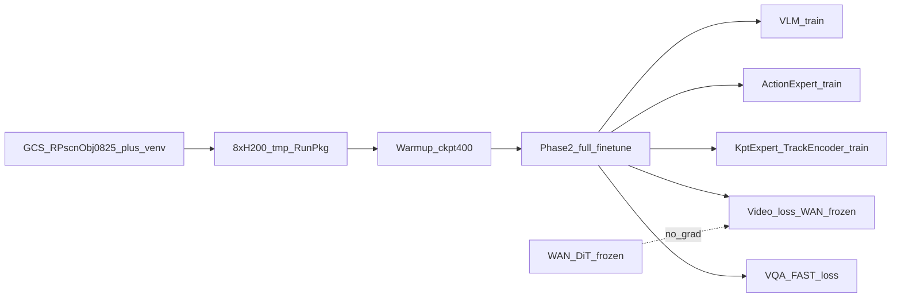
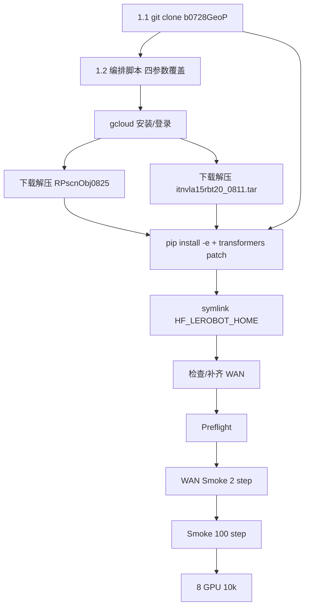

# InternVLA-A1.5 + GeoPredict 3D 轨迹融合版：RoboTwin scan_object Phase 2 微调（8×H200 GCS 落地）

> **文档定位**: 在 [hanging_mug GCS Phase 2 手册](itrnVLA15_GeoP_3dtrj_3cn4_sft_rbt2_hngMg.md)、[stack_bowls Phase 2 本机手册](itrnVLA15_GeoP_3dtrj_3cn4_sft_rbt2.md)、[scan_object 1G Warmup 手册](itrnVLA15_GeoP_3dtrj_3cn4_wrmup1G_scnObj.md) 与 [Warmup 实施日志](itrnVLA15_GeoP_3dtrj_3cn4_wrmup1G_scnObj_LOG.md) 基础上，给出 **远端 8×H200 VM** 上从 GCS 拉取 `RPscnObj0825`（数据 + Warmup ckpt@400）/venv、从 **GitHub** 克隆源码，对 RoboTwin 2.0 `scan_object`（kptsim 体素 GT）做 **Phase 2 全量微调** 的完整可执行方案。
>
> **前置**: Phase 1 Warmup 已在开发机跑通（[`wrmup1G_scnObj_LOG`](itrnVLA15_GeoP_3dtrj_3cn4_wrmup1G_scnObj_LOG.md)）；RunPkg 已上传至 `gs://physical-ai-data-eu/VENV/tmp/RP/RPscnObj0825.tar.zst`（约 7.3 GiB）。本方案 **固定从包内 Warmup ckpt@400 出发**。
>
> **训练策略**: 与 [sft_rbt2](itrnVLA15_GeoP_3dtrj_3cn4_sft_rbt2.md) / [hngMg](itrnVLA15_GeoP_3dtrj_3cn4_sft_rbt2_hngMg.md) 对齐——标准 A1.5 finetune 超参（VLM + Action + Video + VQA/FAST 全训），叠加 GeoP 关键点分支；**仅 WAN DiT 冻结**，其余可训练模块均更新。
>
> **远端约束**:
> - 虚拟环境 **`/tmp/itnvla15rbt20/`** 从 GCS `gs://physical-ai-data-eu/VENV/tmp/itnvla15rbt20_0811.tar` 下载解压（自包含，含 WAN / torchcodec）
> - 源码 **`/tmp/SRC/itvlaGp/`** 从 [lgautel/InternVLA-A-series](https://github.com/lgautel/InternVLA-A-series) 分支 **`b0728GeoP`** 克隆后 `pip install -e`
> - 数据 **`/tmp/RunPkg/Dta/scan_object_kptsim_lrbv30/`**（GCS RunPkg `RPscnObj0825`）
> - Warmup ckpt **`/tmp/RunPkg/Ckp/warmup_scan_object_kptsim_400step/checkpoints/000400/pretrained_model`**
> - 视频解码：**torchcodec 0.10.0+cu128 + nvidia-npp-cu12**（venv 内已验证；1G Warmup 用过的 `pyav` 仅作降级）
> - 一键编排（clone 之后、不含评测）：[`b/s/itrnVLA15_GeoP_3dtrj_3cn4_sft_rbt2.sh`](../s/itrnVLA15_GeoP_3dtrj_3cn4_sft_rbt2.sh)（脚本默认是 hanging_mug，**必须**覆盖 `--gcs-pkg` / `--data-repo-id` / `--data-dst-rel` / `--ckpt-dst-rel`；可选 `--log-dir` / `--gpus` / `--cuda-visible-devices`）

---

## 目录

- [0. 阅读指南与本方案定位](#0-阅读指南与本方案定位)
- [1. 第三方工程师：从零到 8 卡 10k（推荐路径）](#1-第三方工程师从零到-8-卡-10k推荐路径)
  - [1.0 机器与账号前提](#10-机器与账号前提)
  - [1.1 克隆源码](#11-克隆源码)
  - [1.2 一键编排命令（直接粘贴）](#12-一键编排命令直接粘贴)
  - [1.3 分阶段命令（排障用）](#13-分阶段命令排障用)
  - [1.4 手动逐步落地（与编排脚本等价）](#14-手动逐步落地与编排脚本等价)
- [2. 训练目标与 Loss 设计](#2-训练目标与-loss-设计)
- [3. 远端路径常量表](#3-远端路径常量表)
- [4. Phase 1→2 衔接与冻结/训练矩阵](#4-phase-12-衔接与冻结训练矩阵)
- [5. Phase 2 超参详解](#5-phase-2-超参详解)
- [6. WAN 权重（跳过或补齐）](#6-wan-权重跳过或补齐)
- [7. 数据与 norm_stat](#7-数据与-norm_stat)
- [8. Preflight 验收清单](#8-preflight-验收清单)
- [9. Smoke 测试](#9-smoke-测试)
- [10. 8 卡正式训练 10000 step](#10-8-卡正式训练-10000-step)
- [11. GPU 满负载与监控](#11-gpu-满负载与监控)
- [12. Loss 监控与 Checkpoint 选择](#12-loss-监控与-checkpoint-选择)
- [13. RoboTwin 2.0 评测衔接](#13-robotwin-20-评测衔接)
- [14. 故障排查](#14-故障排查)
- [附录 A：编排脚本 / Launch 覆盖表](#附录-a编排脚本--launch-覆盖表)
- [附录 B：配置矩阵 Warmup vs Phase2](#附录-b配置矩阵-warmup-vs-phase2)
- [附录 C：执行 LOG 模板](#附录-c执行-log-模板)

---

## 0. 阅读指南与本方案定位

### 0.1 与参考文档的关系

| 文档 | 内容 | 本方案继承点 |
|:---|:---|:---|
| [itrnVLA15_GeoP_3dtrj_3cn4.md](itrnVLA15_GeoP_3dtrj_3cn4.md) | GeoP 三路径 MoT 架构、Loss 设计 | kpt 分支 CLI、推理路径 |
| [itrnVLA15_GeoP_3dtrj_3cn4_sft_rbt2.md](itrnVLA15_GeoP_3dtrj_3cn4_sft_rbt2.md) | stack_bowls 本机 8×H200 Phase 2 | **超参、冻结矩阵、Smoke/10k 流程** |
| [itrnVLA15_GeoP_3dtrj_3cn4_sft_rbt2_hngMg.md](itrnVLA15_GeoP_3dtrj_3cn4_sft_rbt2_hngMg.md) | hanging_mug GCS 落地 | **VM 流程、编排脚本、venv/GCS 约定** |
| [itrnVLA15_GeoP_3dtrj_3cn4_sft_rbt2LOG.md](itrnVLA15_GeoP_3dtrj_3cn4_sft_rbt2LOG.md) | stack_bowls Phase 2 实测 | 墙钟、OOM 降级、ckpt@2500 评测经验 |
| [itrnVLA15_GeoP_3dtrj_3cn4_wrmup1G_scnObj.md](itrnVLA15_GeoP_3dtrj_3cn4_wrmup1G_scnObj.md) | scan_object 单卡 Warmup 手册 | 任务专属 offset / `repo_id` / 推理 meta / ep42 |
| [itrnVLA15_GeoP_3dtrj_3cn4_wrmup1G_scnObj_LOG.md](itrnVLA15_GeoP_3dtrj_3cn4_wrmup1G_scnObj_LOG.md) | scan_object Warmup 400 step 日志 | **ckpt@400 路径**、收敛曲线 |
| [itrnVLA15_GeoP_3dtrj_3cn4_wrmup8G.md](itrnVLA15_GeoP_3dtrj_3cn4_wrmup8G.md) | 8×H200 venv 自包含约定 | torchcodec、`LD_LIBRARY_PATH` |
| [`b/s/itrnVLA15_GeoP_3dtrj_3cn4p2_uplod.sh`](../s/itrnVLA15_GeoP_3dtrj_3cn4p2_uplod.sh) | RunPkg 打包上传 | GCS URI、包内 `Dta/` + `Ckp/` |
| [`internvla_a15_geop_phase2_finetune_kptsim_8g.sh`](../launch/internvla_a15_geop_phase2_finetune_kptsim_8g.sh) | Phase 2 launch | `DATA_REPO_ID` / `OUTPUT_DIR`（正式 10k 随 `LOG_DIR`）/ `PROC_PER_NODE` |
| [`b/s/itrnVLA15_GeoP_3dtrj_3cn4_sft_rbt2.sh`](../s/itrnVLA15_GeoP_3dtrj_3cn4_sft_rbt2.sh) | VM 编排（不含评测） | `--data-repo-id` 驱动 `LOG_DIR`；`--gpus` / `--cuda-visible-devices` |

### 0.2 本方案 vs hanging_mug Phase 2 vs 1G Warmup



| 维度 | 1G Warmup（scnObj） | hanging_mug Phase 2 | **本方案 scan_object Phase 2** |
|:---|:---|:---|:---|
| 机器 | 开发机 1× GPU | 远端 8×H200 | **远端 8×H200（GCS 落地）** |
| 起点 | InternVLA-A1.5-base | hanging_mug ckpt@400 | **包内 scan_object ckpt@400** |
| VLM | 冻结（`train_expert_only`） | 训练 | **训练** |
| WAN DiT | 未加载 | 冻结 | **冻结** |
| video loss | 0 | 1 | **1** |
| VQA/FAST | 关 | 开 | **开** |
| Kpt 分支 | 开 | 开 | **开** |
| 数据 | `scan_object_kptsim_lrbv30` | `hanging_mug_kptsim_lrbv30` | **`scan_object_kptsim_lrbv30`** |
| `video_backend` | `pyav`（缺 `libnvrtc`） | torchcodec | **torchcodec**（venv 已验证） |

### 0.3 为何固定 ckpt@400

[`wrmup1G_scnObj_LOG`](itrnVLA15_GeoP_3dtrj_3cn4_wrmup1G_scnObj_LOG.md) 中 Warmup 400 step 轨迹：

| Step | loss_kpt_cur | loss_action | 备注 |
|:---:|:---:|:---:|:---|
| 300 | 0.0023 | 0.128 | LOG 曾推荐；**不在 RunPkg 内** |
| 370 | 0.0016 | 0.132 | `loss_kpt_cur` 最低；无独立 ckpt |
| **400** | **0.0019** | **0.136** | **包内唯一 Warmup ckpt；本方案固定起点** |

kpt 已从 0.52 降至 ~0.002 并饱和。RunPkg 只打了 `checkpoints/000400`，本方案 **显式固定** 从 `000400/pretrained_model` 续训，与 [sft_rbt2](itrnVLA15_GeoP_3dtrj_3cn4_sft_rbt2.md) / [hngMg](itrnVLA15_GeoP_3dtrj_3cn4_sft_rbt2_hngMg.md) 的「终点 checkpoint 续训」一致。

### 0.4 与 hanging_mug / stack_bowls 的硬差异（实施前必读）

| 项 | stack_bowls（sft_rbt2） | hanging_mug（hngMg） | scan_object（本文） |
|:---|:---|:---|:---|
| 代码 | 本机 `/tmp/SRC/InternVLA-A-series` | GitHub `b0728GeoP` → `/tmp/SRC/itvlaGp` | **同 hanging_mug** |
| RunPkg | 无 | `RunPkg_hngMg0825.tar.zst` | **`RPscnObj0825.tar.zst`** |
| 数据 | `/tmp/rbt2stk3kptsim0811/...` | `Dta/hanging_mug_kptsim_lrbv30` | **`Dta/scan_object_kptsim_lrbv30`** |
| Warmup ckpt | 8G job `...kptsim-voxel-8g/000400` | `Ckp/warmup_hanging_mug_.../000400` | **`Ckp/warmup_scan_object_kptsim_400step/checkpoints/000400`** |
| `repo_id` | `stack_bowls_three_kptsim_lrbv30` | `hanging_mug_kptsim_lrbv30`（50 ep / 16889 frames） | **`scan_object_kptsim_lrbv30`（50 ep / 8463 frames）** |
| `task_idx` | 46 | 10 | **41** |
| \(\mathbf{o}\) | `[-0.812, -1.024, 0.505]` | `[-0.772, -1.050, 0.478]` | **`[-0.675, -1.035, 0.622]`** |
| 推理 meta | 默认 stack_bowls | `--kpt-meta-path` hanging_mug | **必须** `--kpt-meta-path` 指向 scan_object |
| venv | 本机已有 | GCS `itnvla15rbt20_0811.tar` | **同 hanging_mug** |
| caveat | 无 | 无 | **ep42 右 TCP 相邻帧 0.125 m**（演示轨迹，非 FK 错误） |

三任务 offset / norm stats / lrbv30 **均独立，禁止混用**。编排脚本默认值是 hanging_mug：漏传覆盖参数会静默训错任务。

---

## 1. 第三方工程师：从零到 8 卡 10k（推荐路径）

本节是 **唯一必须读完再动手** 的操作章。按顺序粘贴即可。超参、Loss、冻结矩阵见 §2–§5；评测见 §13（**不在**一键脚本内）。



### 1.0 机器与账号前提

| 项 | 要求 |
|:---|:---|
| VM | 远端 **8× H200**（或至少 8 张能被 `torch.cuda.device_count()` 看到的 GPU） |
| 磁盘 | `/tmp` 至少 **~80 GiB 空闲**（venv tar + RunPkg 7.3G + WAN 数十 GB + 训练输出） |
| 账号 | 能读桶 `physical-ai-data-eu`（`storage.objects.get` / `list`） |
| GitHub | 能 clone [lgautel/InternVLA-A-series](https://github.com/lgautel/InternVLA-A-series) 分支 `b0728GeoP`（私有仓需 SSH key 或 PAT） |
| HuggingFace | venv 内一般已有 WAN；若 §6 要补下载，需 `hf auth login` |
| 工具 | `git`、`bash`、`sudo`（装 gcloud / zstd 时可能需要）；`gcloud` 没有也没关系，编排脚本会装 |

SSH 登录 VM 后先确认 GPU：

```bash
nvidia-smi -L
# 期望看到 8 张卡
df -h /tmp
```

### 1.1 克隆源码

仓库：[https://github.com/lgautel/InternVLA-A-series.git](https://github.com/lgautel/InternVLA-A-series.git)  
分支：**`b0728GeoP`**  
落地路径：**`/tmp/SRC/itvlaGp`**

**公有 / 已配好 HTTPS 凭证：**

```bash
mkdir -p /tmp/SRC
if [[ ! -d /tmp/SRC/itvlaGp/.git ]]; then
  git clone -b b0728GeoP https://github.com/lgautel/InternVLA-A-series.git /tmp/SRC/itvlaGp
else
  cd /tmp/SRC/itvlaGp
  git fetch origin
  git checkout b0728GeoP
  git pull --ff-only origin b0728GeoP || true
fi
cd /tmp/SRC/itvlaGp
git rev-parse --abbrev-ref HEAD
# 期望: b0728GeoP
test -f b/s/itrnVLA15_GeoP_3dtrj_3cn4_sft_rbt2.sh && echo "ORCH SCRIPT OK"
```

**私有仓走 SSH（示例）：**

```bash
mkdir -p /tmp/SRC
git clone -b b0728GeoP git@github.com:lgautel/InternVLA-A-series.git /tmp/SRC/itvlaGp
cd /tmp/SRC/itvlaGp
```

> RunPkg **不含源码**。必须先 clone，再跑编排脚本（脚本用「本脚本上两级」当 `PROJ_ROOT`，因此要在仓库内执行，或显式 `--proj-root`）。

### 1.2 一键编排命令（直接粘贴）

编排脚本默认任务是 **hanging_mug**。下面四条覆盖 **缺一不可**，否则会去拉 hanging_mug 包、训错数据。

```bash
cd /tmp/SRC/itvlaGp

bash b/s/itrnVLA15_GeoP_3dtrj_3cn4_sft_rbt2.sh \
  --gcs-pkg gs://physical-ai-data-eu/VENV/tmp/RP/RPscnObj0825.tar.zst \
  --data-repo-id scan_object_kptsim_lrbv30 \
  --data-dst-rel Dta/scan_object_kptsim_lrbv30 \
  --ckpt-dst-rel Ckp/warmup_scan_object_kptsim_400step/checkpoints/000400
```

未指定 `--log-dir` 时，编排脚本在解析完 `--data-repo-id` 后自动设 **`LOG_DIR=/tmp/scan_object_kptsim_lrbv30`**（日志与 10k checkpoint 均在此目录下）。若同一 VM 上并行多任务，可显式 `--log-dir /tmp/phase2_scnObj` 隔离。

启动后立刻看横幅，确认这些行：

```
GCS_PKG      : gs://physical-ai-data-eu/VENV/tmp/RP/RPscnObj0825.tar.zst
DATA_REPO_ID : scan_object_kptsim_lrbv30
WARMUP_CKPT  : /tmp/RunPkg/Ckp/warmup_scan_object_kptsim_400step/checkpoints/000400/pretrained_model
LOG_DIR      : /tmp/scan_object_kptsim_lrbv30
TRAIN_GPUS   : 8 (launch 默认 CUDA_VISIBLE_DEVICES=0-7)
```

横幅标题可能仍写 `Phase 2 SFT 编排`——**以 GCS_PKG / DATA_REPO_ID / LOG_DIR 为准**。

| 阶段 | 脚本做什么 | 大约耗时 |
|:---|:---|:---|
| gcloud | 安装 CLI + 登录（GCE 服务账号通常跳过登录） | 1–10 min |
| runpkg | `gcloud storage cp` + 解压 `RPscnObj0825.tar.zst` | ~1–2 min（7.3G） |
| venv | 下载解压 `itnvla15rbt20_0811.tar` | 视网络，十几分钟级 |
| install | `pip install -e` + Qwen3.5 transformers patch | 数分钟 |
| symlink | `HF_LEROBOT_HOME/scan_object_kptsim_lrbv30` → RunPkg 数据 | 秒级 |
| wan | 检查 `Wan2.2_VAE.pth`，缺则 `snapshot_download` | 已有则跳过 |
| data-check | episodes/frames/`keypoint_3d`/offset | 秒级 |
| preflight | torch / lerobot 路径 / WAN / ckpt / 8 GPU | 秒级 |
| wan-smoke | 1 GPU × 2 step | 数分钟 |
| smoke | 1 GPU × 100 step | 3–5 min |
| train | **8 GPU × 10000 step** | **约 4 小时** |

脚本 **不含** §13 RoboTwin 评测。

**编排脚本写入的日志文件**（均在 `LOG_DIR` 下）：

| 阶段 | 文件名 |
|:---|:---|
| WAN Smoke | `wan_smoke.log` |
| Smoke 100 | `smoke100.log` |
| 正式 10k | `8g_10k.log` |

**10k checkpoint 目录**（与 `8g_10k.log` 同级）：

```
${LOG_DIR}/<timestamp>-itvlaGp_p2_8g10k_scan_object_kptsim_lrbv30/checkpoints/
```

**GPU 个数（可选）**：默认 8 卡、物理 GPU `0-7`。若只用 6 卡：

```bash
# 物理 GPU 0–5
bash b/s/itrnVLA15_GeoP_3dtrj_3cn4_sft_rbt2.sh \
  --gcs-pkg gs://physical-ai-data-eu/VENV/tmp/RP/RPscnObj0825.tar.zst \
  --data-repo-id scan_object_kptsim_lrbv30 \
  --data-dst-rel Dta/scan_object_kptsim_lrbv30 \
  --ckpt-dst-rel Ckp/warmup_scan_object_kptsim_400step/checkpoints/000400 \
  --gpus 6

# 或指定物理序号（例如 2–7）
bash b/s/itrnVLA15_GeoP_3dtrj_3cn4_sft_rbt2.sh \
  --gcs-pkg gs://physical-ai-data-eu/VENV/tmp/RP/RPscnObj0825.tar.zst \
  --data-repo-id scan_object_kptsim_lrbv30 \
  --data-dst-rel Dta/scan_object_kptsim_lrbv30 \
  --ckpt-dst-rel Ckp/warmup_scan_object_kptsim_400step/checkpoints/000400 \
  --gpus 6 --cuda-visible-devices 2,3,4,5,6,7
```

`--gpus` 会自动设置 `PROC_PER_NODE` 与 `EXPECT_GPUS`（Preflight 校验）；未设 `--cuda-visible-devices` 时，`--gpus N` 对应 `0,1,...,N-1`。

**等价环境变量写法**（与 CLI 二选一即可）：

```bash
cd /tmp/SRC/itvlaGp
export GCS_PKG=gs://physical-ai-data-eu/VENV/tmp/RP/RPscnObj0825.tar.zst
export DATA_REPO_ID=scan_object_kptsim_lrbv30
export DATA_DST_REL=Dta/scan_object_kptsim_lrbv30
export CKPT_DST_REL=Ckp/warmup_scan_object_kptsim_400step/checkpoints/000400
# LOG_DIR 可省略，默认 /tmp/scan_object_kptsim_lrbv30
bash b/s/itrnVLA15_GeoP_3dtrj_3cn4_sft_rbt2.sh
```

### 1.3 分阶段命令（排障用）

先看脚本会干什么（不下载、不训练）：

```bash
cd /tmp/SRC/itvlaGp
bash b/s/itrnVLA15_GeoP_3dtrj_3cn4_sft_rbt2.sh \
  --gcs-pkg gs://physical-ai-data-eu/VENV/tmp/RP/RPscnObj0825.tar.zst \
  --data-repo-id scan_object_kptsim_lrbv30 \
  --data-dst-rel Dta/scan_object_kptsim_lrbv30 \
  --ckpt-dst-rel Ckp/warmup_scan_object_kptsim_400step/checkpoints/000400 \
  --dry-run
```

只做到 Preflight（适合第一次上机）：

```bash
cd /tmp/SRC/itvlaGp
bash b/s/itrnVLA15_GeoP_3dtrj_3cn4_sft_rbt2.sh \
  --gcs-pkg gs://physical-ai-data-eu/VENV/tmp/RP/RPscnObj0825.tar.zst \
  --data-repo-id scan_object_kptsim_lrbv30 \
  --data-dst-rel Dta/scan_object_kptsim_lrbv30 \
  --ckpt-dst-rel Ckp/warmup_scan_object_kptsim_400step/checkpoints/000400 \
  --until preflight
```

Preflight 通过后再跑 Smoke + 10k（跳过已完成的下载）：

```bash
cd /tmp/SRC/itvlaGp
bash b/s/itrnVLA15_GeoP_3dtrj_3cn4_sft_rbt2.sh \
  --gcs-pkg gs://physical-ai-data-eu/VENV/tmp/RP/RPscnObj0825.tar.zst \
  --data-repo-id scan_object_kptsim_lrbv30 \
  --data-dst-rel Dta/scan_object_kptsim_lrbv30 \
  --ckpt-dst-rel Ckp/warmup_scan_object_kptsim_400step/checkpoints/000400 \
  --from wan-smoke
```

只做落地、不训练：

```bash
cd /tmp/SRC/itvlaGp
bash b/s/itrnVLA15_GeoP_3dtrj_3cn4_sft_rbt2.sh \
  --gcs-pkg gs://physical-ai-data-eu/VENV/tmp/RP/RPscnObj0825.tar.zst \
  --data-repo-id scan_object_kptsim_lrbv30 \
  --data-dst-rel Dta/scan_object_kptsim_lrbv30 \
  --ckpt-dst-rel Ckp/warmup_scan_object_kptsim_400step/checkpoints/000400 \
  --skip-wan-smoke --skip-smoke --skip-train
```

已存在的 RunPkg/venv 强制重下：加 `--force`。

`gcloud auth login` 需要把浏览器授权码贴回终端。GCE 已挂服务账号且能 `ls gs://physical-ai-data-eu/VENV/tmp/` 时会自动跳过。

WAN 补下载若报 HuggingFace 鉴权：

```bash
source /tmp/itnvla15rbt20/bin/activate
hf auth login
# 然后从 wan 阶段续跑:
cd /tmp/SRC/itvlaGp
bash b/s/itrnVLA15_GeoP_3dtrj_3cn4_sft_rbt2.sh \
  --gcs-pkg gs://physical-ai-data-eu/VENV/tmp/RP/RPscnObj0825.tar.zst \
  --data-repo-id scan_object_kptsim_lrbv30 \
  --data-dst-rel Dta/scan_object_kptsim_lrbv30 \
  --ckpt-dst-rel Ckp/warmup_scan_object_kptsim_400step/checkpoints/000400 \
  --from wan
```

### 1.4 手动逐步落地（与编排脚本等价）

仅在不想用编排脚本、或需要对照排障时使用。日常请走 §1.2。

#### 1.4.0 gcloud CLI

新开虚机常常没有 `gcloud`。可把 [hngMg §1.0](itrnVLA15_GeoP_3dtrj_3cn4_sft_rbt2_hngMg.md#10-gcloud-cli-检查安装与登录) 的 `bootstrap_gcloud.sh` 存成 `/tmp/bootstrap_gcloud.sh` 后执行；或直接让编排脚本的 `gcloud` 阶段处理。探测前缀：

```bash
gcloud storage ls gs://physical-ai-data-eu/VENV/tmp/RP/ | head
# 应能看到 RPscnObj0825.tar.zst
```

登录注意：不要 `sudo gcloud auth login`；tarball 安装后若找不到命令：`source ~/.bashrc` 或 `export PATH="$HOME/google-cloud-sdk/bin:$PATH"`。

#### 1.4.1 GCS 与 GitHub 资产一览

| 资产 | 来源 | 落地路径 | 说明 |
|:---|:---|:---|:---|
| RunPkg 归档 | `gs://physical-ai-data-eu/VENV/tmp/RP/RPscnObj0825.tar.zst` | `/tmp/RunPkg/` | **仅**数据 + Warmup ckpt@400；约 **7.3 GiB**（7749988484 bytes，开发机已校验） |
| 自包含 venv | `gs://physical-ai-data-eu/VENV/tmp/itnvla15rbt20_0811.tar` | `/tmp/itnvla15rbt20/` | `gcloud storage cp` + `tar -xf`；含 WAN / torchcodec |
| 源码 | [github.com/lgautel/InternVLA-A-series](https://github.com/lgautel/InternVLA-A-series) 分支 `b0728GeoP` | `/tmp/SRC/itvlaGp/` | `git clone -b b0728GeoP` + `pip install -e`；**不从 GCS 取代码** |

RunPkg 包内结构：

```
RunPkg/
├── Dta/scan_object_kptsim_lrbv30/     # LeRobot v3.0 + norm_stat + keypoints_meta
└── Ckp/warmup_scan_object_kptsim_400step/checkpoints/000400/
    └── pretrained_model/              # Warmup ckpt@400
```

> RunPkg **不含**源码、`ckpts/`（InternVLA-A1.5-base / GeoPredict）和 `third_party/RoboTwin`。Phase 2 训练不需要 base/GeoPredict（已写入 Warmup ckpt）；评测前 `git submodule update --init third_party/RoboTwin`（§13）。

#### 1.4.2 下载并解压 RunPkg

```bash
GCS_PKG=gs://physical-ai-data-eu/VENV/tmp/RP/RPscnObj0825.tar.zst
LOCAL_TAR=/tmp/RPscnObj0825.tar.zst

gcloud storage cp "${GCS_PKG}" "${LOCAL_TAR}"
tar --zstd -xf "${LOCAL_TAR}" -C /tmp/
rm -f "${LOCAL_TAR}"

test -f /tmp/RunPkg/Dta/scan_object_kptsim_lrbv30/meta/info.json && echo "DATA OK"
test -f /tmp/RunPkg/Ckp/warmup_scan_object_kptsim_400step/checkpoints/000400/pretrained_model/model.safetensors \
  && echo "WARMUP_CKPT OK"
```

若 `tar` 不支持 `--zstd`：先 `sudo apt-get install -y zstd`，再 `zstd -dc "${LOCAL_TAR}" | tar -xf - -C /tmp/`。

#### 1.4.3 下载并解压 venv

```bash
GCS_VENV=gs://physical-ai-data-eu/VENV/tmp/itnvla15rbt20_0811.tar
LOCAL_TAR=/tmp/itnvla15rbt20_0811.tar

gcloud storage cp "${GCS_VENV}" "${LOCAL_TAR}"
tar -xf "${LOCAL_TAR}" -C /tmp/
chmod +x /tmp/itnvla15rbt20/bin/*
rm -f "${LOCAL_TAR}"

VENV=/tmp/itnvla15rbt20
test -x ${VENV}/bin/python && echo "VENV OK"
${VENV}/bin/python -c "import torch; print('torch', torch.__version__, 'cuda', torch.cuda.device_count())"
# 期望: torch 2.10.0+cu128, cuda 8
${VENV}/bin/python -c "import torchcodec; print(torchcodec.__version__)"
# 期望: 0.10.0+cu128
```

#### 1.4.4 editable 安装 + Transformers patch

```bash
VENV=/tmp/itnvla15rbt20
PROJ=/tmp/SRC/itvlaGp
cd "${PROJ}"

${VENV}/bin/pip install -e "${PROJ}"
chmod +x launch/internvla_a15_geop_phase2_finetune_kptsim_8g.sh 2>/dev/null || true

TF_DIR="$(${VENV}/bin/python -c "import transformers, os; print(os.path.dirname(transformers.__file__))")"
for pol in pi0 pi05 internvla_a1_5; do
  src="${PROJ}/src/lerobot/policies/${pol}/transformers_replace/models"
  if [[ -d "${src}" ]]; then
    cp -r "${src}" "${TF_DIR}/"
  fi
done

${VENV}/bin/python -c "import lerobot, inspect; print(inspect.getfile(lerobot))"
# 期望路径落在 /tmp/SRC/itvlaGp/
```

GCS 拉来的 venv 里旧 `pip install -e` 路径会失效，**必须重新** `pip install -e`。

#### 1.4.5 数据 symlink 到 HF_LEROBOT_HOME

```bash
VENV=/tmp/itnvla15rbt20
export HF_LEROBOT_HOME=${VENV}/var/datasets
mkdir -p "${HF_LEROBOT_HOME}"
ln -sfn /tmp/RunPkg/Dta/scan_object_kptsim_lrbv30 \
  ${HF_LEROBOT_HOME}/scan_object_kptsim_lrbv30
test -f ${HF_LEROBOT_HOME}/scan_object_kptsim_lrbv30/meta/info.json && echo "SYMLINK OK"
test -f ${HF_LEROBOT_HOME}/scan_object_kptsim_lrbv30/norm_stat.json && echo "NORM OK"
```

> 若 venv 里仍有 `stack_bowls_three_kptsim_lrbv30` 或 `hanging_mug_kptsim_lrbv30` symlink，**保留即可**，不要删；训练靠 `DATA_REPO_ID` 选择数据集。

#### 1.4.6 落地后目录布局

```
/tmp/RunPkg/
├── Dta/scan_object_kptsim_lrbv30/          # 数据实体（GCS RPscnObj0825）
└── Ckp/warmup_scan_object_kptsim_400step/checkpoints/000400/
    └── pretrained_model/                   # Warmup ckpt@400
/tmp/SRC/itvlaGp/                           # 源码（lgautel/b0728GeoP）
/tmp/itnvla15rbt20/                         # 自包含 venv
├── bin/python
├── var/hf_home/                            # HF_HOME（WAN、Qwen）
│   └── hub/Wan2.2-TI2V-5B/
└── var/datasets/                           # HF_LEROBOT_HOME
    └── scan_object_kptsim_lrbv30 -> /tmp/RunPkg/Dta/scan_object_kptsim_lrbv30
/tmp/scan_object_kptsim_lrbv30/             # 默认 LOG_DIR（可用 --log-dir 改）
├── wan_smoke.log
├── smoke100.log
├── 8g_10k.log
└── <timestamp>-itvlaGp_p2_8g10k_scan_object_kptsim_lrbv30/
    └── checkpoints/                        # 正式 10k 产出
```

---

## 2. 训练目标与 Loss 设计

Phase 2 在已收敛的 Keypoint Expert（scan_object Warmup 产出）基础上，对 **scan_object** 做端到端策略微调：

1. **Action**：flow-matching 动作 chunk 预测（主任务）。
2. **Video foresight**：WAN 分支提供 latent video 监督（WAN DiT **不参与梯度**）。
3. **VQA/FAST**：Qwen3.5 语言 token + FAST 离散动作 token 监督。
4. **Keypoint**：3D 轨迹当前/未来关键点监督（kptsim 体素坐标 GT）。

有效 loss（`enable_vqa_loss=true`，action 由 `action_loss_weight` 放大）：

\[
\mathcal{L} = 10 \cdot \mathcal{L}_{action} + \mathcal{L}_{vqa/fast} + \mathcal{L}_{video} + 1.0 \cdot \left(\mathcal{L}_{kpt}^{cur} + 1.5 \cdot \mathcal{L}_{kpt}^{fut}\right)
\]

其中：

- \(\mathcal{L}_{action}\)：flow-matching 动作损失，权重 `action_loss_weight=10.0`。
- \(\mathcal{L}_{vqa/fast}\)：语言 token + FAST 离散动作 token 损失（`enable_vqa_loss=true`，`use_fast_action_tokens=true`）。
- \(\mathcal{L}_{video}\)：WAN 潜空间视频监督，`video_loss_weight=1`。
- \(\mathcal{L}_{kpt}^{cur}\) / \(\mathcal{L}_{kpt}^{fut}\)：当前帧 \(K=14\) 关键点 MSE 与未来 \(H=50\) 步 MSE；`kpt_loss_weight=1.0`，`kpt_future_loss_weight=1.5`。

具体组合以 [`modeling_internvla_a1_5.py`](../src/lerobot/policies/internvla_a1_5/modeling_internvla_a1_5.py) 为准。超参与 [sft_rbt2 §1 / §4](itrnVLA15_GeoP_3dtrj_3cn4_sft_rbt2.md) 相同。

---

## 3. 远端路径常量表

实施前在 shell 中一次性定义（手动跑 launch 时用）：

```bash
export VENV=/tmp/itnvla15rbt20
export PROJ=/tmp/SRC/itvlaGp
export HF_HOME=${VENV}/var/hf_home
export HF_LEROBOT_HOME=${VENV}/var/datasets
export DATA_ROOT=${HF_LEROBOT_HOME}/scan_object_kptsim_lrbv30
export NORM_STATS=${DATA_ROOT}/norm_stat.json
export WAN_DIR=${HF_HOME}/hub/Wan2.2-TI2V-5B
export WARMUP_CKPT=/tmp/RunPkg/Ckp/warmup_scan_object_kptsim_400step/checkpoints/000400/pretrained_model
export KPT_META=${DATA_ROOT}/meta/keypoints_meta.json
```

| 用途 | 路径 |
|:---|:---|
| venv | `/tmp/itnvla15rbt20/`（GCS `itnvla15rbt20_0811.tar` 解压） |
| 源码（editable，`b0728GeoP`） | `/tmp/SRC/itvlaGp/` |
| 数据实体 | `/tmp/RunPkg/Dta/scan_object_kptsim_lrbv30/` |
| HF 缓存 + 权重 | `/tmp/itnvla15rbt20/var/hf_home/` |
| LeRobot 注册根 | `/tmp/itnvla15rbt20/var/datasets/` |
| norm_stat | `.../scan_object_kptsim_lrbv30/norm_stat.json` |
| 推理 meta | `.../meta/keypoints_meta.json` |
| **Warmup ckpt@400** | `/tmp/RunPkg/Ckp/warmup_scan_object_kptsim_400step/checkpoints/000400/pretrained_model` |
| WAN 权重 | `${HF_HOME}/hub/Wan2.2-TI2V-5B/` |
| Phase 2 Launch | `launch/internvla_a15_geop_phase2_finetune_kptsim_8g.sh` |
| 编排脚本 | `b/s/itrnVLA15_GeoP_3dtrj_3cn4_sft_rbt2.sh` |
| 编排日志目录 | `/tmp/<DATA_REPO_ID>/`（默认 `/tmp/scan_object_kptsim_lrbv30/`） |
| 编排日志文件 | `${LOG_DIR}/wan_smoke.log`、`smoke100.log`、`8g_10k.log` |
| **10k checkpoint** | `${LOG_DIR}/<JOB_NAME>/checkpoints/`（`JOB_NAME` 形如 `YYYY_MM_DD_HH_MM_SS-itvlaGp_p2_8g10k_scan_object_kptsim_lrbv30`） |

> venv 自包含原则、torchcodec 修复、Transformers patch 等 **继承** [wrmup8G §1–§4](itrnVLA15_GeoP_3dtrj_3cn4_wrmup8G.md)，本文不重复展开。
>
> 编排脚本在 `stage_train` 会向 launch 传入 `JOB_NAME`、`OUTPUT_DIR`（=`${LOG_DIR}/${JOB_NAME}`）、`LOG_FILE`（=`${LOG_DIR}/8g_10k.log`）。launch 脚本据此把 checkpoint 写到 `LOG_DIR` 内，而非 `${PROJ}/outputs/...`。

Launch 侧对应环境变量：`VENV_ROOT=${VENV}`、`PROJ_ROOT=${PROJ}`（见 [附录 A](#附录-a编排脚本--launch-覆盖表)）。

---

## 4. Phase 1→2 衔接与冻结/训练矩阵

### 4.1 三大安全检查（GeoP 特有）

| # | 配置 | Warmup | Phase 2 |
|:---:|:---|:---:|:---:|
| 1 | `pretrained_path` | InternVLA-A1.5-base | **scan_object Warmup ckpt@400** |
| 2 | `init_kpt_expert_from_action` | **true** | **false** |
| 3 | `geopredict_checkpoint_path` | 设置 GeoPredict | **不设** |

违反 #2 会覆盖已训练的 Kpt Expert；违反 #3 会覆盖 Warmup 已写入 checkpoint 的 TrackEncoder。launch 脚本已满足 #2/#3；#1 靠 `WARMUP_CKPT` 指向包内路径。

### 4.2 冻结 vs 训练

| 模块 | Phase 2 | 配置 |
|:---|:---|:---|
| **WAN DiT** | **冻结** | `freeze_wan_dit=true` |
| WAN VAE | 加载、前向用 | 随 WAN checkpoint |
| **VLM (Qwen3.5-2B)** | **训练** | `train_expert_only=false` |
| **Action Expert** | **训练** | 同上 |
| **Kpt Expert + TrackEncoder** | **训练** | `freeze_keypoint_modules=false` |
| **Learnable foresight tokens** | **冻结** | `freeze_learnable_tokens=true` |
| Vision encoder | 训练 | `freeze_vision_encoder=false` |

### 4.3 Warmup vs Phase 2 关键差异

| 配置 | scan_object Warmup | Phase 2 |
|:---|:---:|:---:|
| `pretrained_path` | base | **ckpt@400** |
| `train_expert_only` | true | **false** |
| `action_loss_only` | true（无 WAN） | **false**（加载 WAN） |
| `enable_vqa_loss` | false | **true** |
| `knowledge_insulation` | true | **false** |
| `init_kpt_expert_from_action` | true | **false** |
| `geopredict_checkpoint_path` | 设置 | **不设** |
| `kpt_loss_weight` | 10.0 | **1.0** |
| `action_loss_weight` | 2.0 | **10.0** |
| `video_backend` | pyav | **torchcodec** |

---

## 5. Phase 2 超参详解

### 5.1 来源映射

与 [sft_rbt2 §4](itrnVLA15_GeoP_3dtrj_3cn4_sft_rbt2.md) 相同，仅数据与起点不同：

| 类别 | 参数 | 值 | 来源 |
|:---|:---|:---|:---|
| 起点 | `pretrained_path` | scan_object Warmup ckpt@400 | 上传校验 / scnObj_LOG |
| 优化 | `optimizer_lr` | 5e-5 | finetune.sh |
| | `scheduler_warmup_steps` | 1000 | stackb3_venv |
| | `scheduler_decay_steps` | 10000 | stackb3_venv |
| | `scheduler_decay_lr` | 5e-6 | finetune.sh |
| 全训 | `train_expert_only` | false | finetune.sh |
| | `enable_vqa_loss` | true | finetune.sh |
| | `use_fast_action_tokens` | true | finetune.sh |
| | `knowledge_insulation` | false | finetune.sh |
| Video | `action_loss_only` | false | finetune.sh |
| | `video_loss_weight` | 1 | finetune.sh |
| | `freeze_wan_dit` | **true** | sft_rbt2 |
| | `freeze_learnable_tokens` | true | finetune.sh |
| GeoP | `enable_keypoint_predictor` | true | cn4 |
| | `init_kpt_expert_from_action` | false | §4.1 |
| | `action_loss_weight` | 10.0 | cn2 Phase 2 |
| | `kpt_loss_weight` | 1.0 | cn2 Phase 2 |
| | `kpt_future_loss_weight` | 1.5 | cn2 Phase 2 |
| 数据 | `repo_id` | **scan_object_kptsim_lrbv30** | scnObj |
| | `external_stats_path` | 本任务 `norm_stat.json` | scnObj |
| | `video_backend` | torchcodec | wrmup8G |
| | `dist_loading` | false | stackb3_venv |
| 规模 | `batch_size` | 16/GPU | stackb3_venv（BS=32 OOM） |
| | `steps` | 10000 | stackb3_venv |
| | `save_freq` | 2500 | stackb3_venv |
| | `log_freq` | 50 | stackb3_venv |
| | `num_workers` | 12 | wrmup8G 8 卡 |
| | GPU | 8× H200 | 远端 VM |

### 5.2 有效 batch 与显存

- 每卡 BS=16 × 8 GPU → **有效 BS=128**
- [`sft_rbt2LOG`](itrnVLA15_GeoP_3dtrj_3cn4_sft_rbt2LOG.md)：同架构 stack_bowls Phase 2 在 H200 上 BS=16 可行，墙钟约 4.1 h / 10k
- scan_object 帧数更少（8463 vs hanging_mug 16889 vs stack_bowls 23550），吞吐应相近；**默认 BS=16**，OOM 时降至 12 或 8

---

## 6. WAN 权重（跳过或补齐）

Warmup 使用 `action_loss_only=true`，**未加载 WAN**。Phase 2 必须有 Wan2.2-TI2V-5B。`itnvla15rbt20_0811.tar` 内 venv 在 stack_bowls Phase 2 时已包含 WAN。先检查：

```bash
VENV=/tmp/itnvla15rbt20
export HF_HOME=${VENV}/var/hf_home
WAN_DIR=${HF_HOME}/hub/Wan2.2-TI2V-5B
test -f ${WAN_DIR}/Wan2.2_VAE.pth && echo "WAN already present" && du -sh ${WAN_DIR}
```

若缺失，先登录 HuggingFace，再在 venv 内补齐（缓存必须落在 `${VENV}/var/hf_home/`，禁止 `$HOME/.cache`）：

```bash
source /tmp/itnvla15rbt20/bin/activate
hf auth login
mkdir -p "${WAN_DIR}"
${VENV}/bin/python <<'PY'
import os
from huggingface_hub import snapshot_download

hf_home = os.environ["HF_HOME"]
wan_dir = os.path.join(hf_home, "hub", "Wan2.2-TI2V-5B")
snapshot_download("Wan-AI/Wan2.2-TI2V-5B", local_dir=wan_dir)
print("WAN downloaded to:", wan_dir)
PY
```

验收：`test -f ${WAN_DIR}/Wan2.2_VAE.pth`。体积约数十 GB。

---

## 7. 数据与 norm_stat

### 7.1 数据集

| 项 | 值 |
|:---|:---|
| 实体路径 | `/tmp/RunPkg/Dta/scan_object_kptsim_lrbv30/` |
| LeRobot `repo_id` | `scan_object_kptsim_lrbv30` |
| Episodes / Frames | 50 / **8463** |
| 关键点列 | `observation.keypoint_3d` shape `[42]`（14 joints × 3，**体素坐标**） |
| `coord_offset` \(\mathbf{o}\) | `[-0.675, -1.035, 0.622]`（`keypoints_meta.json` 更精确为 `[-0.6748, -1.0345, 0.6219]`） |
| norm_stat | 数据集根目录 `norm_stat.json`（14 维 state/action z-score，**任务专属**） |
| caveat | episode 42 右 TCP 相邻帧位移 0.125 m（演示轨迹，非 FK 错误） |

与 stack_bowls / hanging_mug 同构：`observation.state` / `action` 各 14 维；三路视频 `cam_high` / `cam_left_wrist` / `cam_right_wrist`。**禁止**使用另外两个任务的 `norm_stat.json` / `keypoints_meta.json`。

体素变换：记 \(\mathbf{p}_{\text{world}}\) 为 SAPIEN FK 世界坐标，

\[
\mathbf{p}_{\text{kpt}} = \mathbf{p}_{\text{world}} - \mathbf{o}
\]

本任务变换后范围约 \([0.323, 1.277]\times[0.376, 1.224]\times[0.157, 0.843]\)，落在 GeoPredict 体素盒内。

### 7.2 Layer 1 快速检查

```bash
VENV=/tmp/itnvla15rbt20
DATA=${VENV}/var/datasets/scan_object_kptsim_lrbv30

${VENV}/bin/python <<PY
import json, pyarrow.parquet as pq
info = json.load(open("${DATA}/meta/info.json"))
print("episodes:", info.get("total_episodes"), "frames:", info.get("total_frames"))
pf = pq.read_table("${DATA}/data/chunk-000/file-000.parquet", columns=["observation.keypoint_3d"])
kpt = pf["observation.keypoint_3d"][0].as_py()
print("keypoint_3d len:", len(kpt), "sample:", kpt[:3])
meta = json.load(open("${DATA}/meta/keypoints_meta.json"))
print("coord_offset:", meta.get("coord_offset"))
PY
```

期望：episodes=50，frames=8463，`keypoint_3d` len=42，offset 接近 `[-0.675, -1.035, 0.622]`。

---

## 8. Preflight 验收清单

编排脚本 `--until preflight` 已覆盖下列检查。手动复核：

```bash
VENV=/tmp/itnvla15rbt20
PROJ=/tmp/SRC/itvlaGp
export HF_HOME=${VENV}/var/hf_home
export LD_LIBRARY_PATH="/usr/local/nvidia/lib64:${VENV}/lib:\
${VENV}/lib/python3.11/site-packages/torch/lib:\
${VENV}/lib/python3.11/site-packages/nvidia/cuda_runtime/lib:\
${VENV}/lib/python3.11/site-packages/nvidia/cuda_nvrtc/lib:\
${VENV}/lib/python3.11/site-packages/nvidia/npp/lib:${LD_LIBRARY_PATH:-}"

echo "=== Preflight Phase 2 scan_object ==="

# 1. Python 环境
${VENV}/bin/python -c "import torch, lerobot; print('torch', torch.__version__, 'cuda', torch.cuda.device_count())"

# 2. editable 指向 GitHub clone
${VENV}/bin/python -c "import lerobot, inspect; p=inspect.getfile(lerobot); print(p); assert 'itvlaGp' in p"

# 3. WAN
test -f ${HF_HOME}/hub/Wan2.2-TI2V-5B/Wan2.2_VAE.pth && echo "WAN OK"

# 4. 数据
test -f ${VENV}/var/datasets/scan_object_kptsim_lrbv30/meta/info.json && echo "DATA OK"
test -f ${VENV}/var/datasets/scan_object_kptsim_lrbv30/norm_stat.json && echo "NORM OK"

# 5. Warmup ckpt@400（RunPkg Ckp/）
WARMUP_CKPT=/tmp/RunPkg/Ckp/warmup_scan_object_kptsim_400step/checkpoints/000400/pretrained_model
test -f ${WARMUP_CKPT}/model.safetensors && echo "WARMUP_CKPT OK"

# 6. kpt config in checkpoint
${VENV}/bin/python -c "
import json; c=json.load(open('${WARMUP_CKPT}/config.json'))
assert c.get('enable_keypoint_predictor')==True, c
print('enable_keypoint_predictor OK')
"

# 7. 无残留训练进程
pgrep -af lerobot_train || echo "no train procs (OK)"

# 8. Launch 脚本
test -x ${PROJ}/launch/internvla_a15_geop_phase2_finetune_kptsim_8g.sh && echo "LAUNCH OK"

# 9. GPU
${VENV}/bin/python -c "import torch; assert torch.cuda.device_count()==8; print('GPU 8 OK')"

echo "=== Preflight done ==="
```

未通过项：数据/ckpt 回到 §1.4.2；源码回到 §1.1 / §1.4.4；venv/torchcodec 回到 [wrmup8G §2 / 附录 A](itrnVLA15_GeoP_3dtrj_3cn4_wrmup8G.md)；WAN 回到 §6。

---

## 9. Smoke 测试

Launch 脚本支持三级模式（见 [附录 A](#附录-a编排脚本--launch-覆盖表)）。**每次启动都必须导出 scan_object 覆盖变量**，否则会落到默认 `stack_bowls_three_kptsim_lrbv30`。

走编排脚本时 Smoke 已包含在 §1.2 里。下面是手动调用 launch：

```bash
export VENV_ROOT=/tmp/itnvla15rbt20
export PROJ_ROOT=/tmp/SRC/itvlaGp
export DATA_REPO_ID=scan_object_kptsim_lrbv30
export WARMUP_CKPT=/tmp/RunPkg/Ckp/warmup_scan_object_kptsim_400step/checkpoints/000400/pretrained_model
cd "${PROJ_ROOT}"
```

### 9.1 WAN Smoke（1 GPU × 2 step）

走编排脚本时日志为 `${LOG_DIR}/wan_smoke.log`。手动调用 launch：

```bash
mkdir -p /tmp/scan_object_kptsim_lrbv30
WAN_SMOKE=1 LOG_FILE=/tmp/scan_object_kptsim_lrbv30/wan_smoke.log \
  bash launch/internvla_a15_geop_phase2_finetune_kptsim_8g.sh
```

**期望**：

- exit 0
- 日志含 `DATA_REPO_ID=scan_object_kptsim_lrbv30` 与 WAN 加载信息
- step 1–2 出现 `loss_action`、`loss_video`（可能还有 `loss_vqa`/`loss_fast`、`loss_kpt_cur`）
- `post_check: video_decode_error=0 using_zeros=0`

从 Warmup ckpt@400 加载时 WAN DiT / `learnable_to_wan_proj` 大量 Missing keys **是预期**（Warmup 未训 WAN，权重从 hub 单独加载）。

### 9.2 Phase 2 Smoke（1 GPU × 100 step）

走编排脚本时日志为 `${LOG_DIR}/smoke100.log`。手动调用 launch：

```bash
SMOKE=1 LOG_FILE=/tmp/scan_object_kptsim_lrbv30/smoke100.log \
  bash launch/internvla_a15_geop_phase2_finetune_kptsim_8g.sh
```

**期望**：

- 四项 loss 均 > 0
- `loss_kpt_cur` 保持低位（Warmup 已收敛，通常 < 0.01）
- `video_decode_error=0`，`using_zeros=0`
- 约 3–5 min 完成

### 9.3 Smoke 判据汇总

| 判据 | WAN Smoke | Phase2 Smoke 100 |
|:---|:---:|:---:|
| exit code | 0 | 0 |
| `DATA_REPO_ID` 为 scan_object | ✅ | ✅ |
| loss_action > 0 | ✅ | ✅ |
| loss_video > 0 | ✅ | ✅ |
| loss_vqa 或 loss_fast > 0 | ✅ | ✅ |
| loss_kpt_cur > 0 | ✅ | ✅ |
| video_decode_error | 0 | 0 |
| using_zeros | 0 | 0 |

---

## 10. 8 卡正式训练 10000 step

### 10.1 启动命令

**推荐**：用 §1.2 编排脚本一次性跑完（含 Smoke）。若 Smoke 已通过、只跑 10k：

```bash
cd /tmp/SRC/itvlaGp
bash b/s/itrnVLA15_GeoP_3dtrj_3cn4_sft_rbt2.sh \
  --gcs-pkg gs://physical-ai-data-eu/VENV/tmp/RP/RPscnObj0825.tar.zst \
  --data-repo-id scan_object_kptsim_lrbv30 \
  --data-dst-rel Dta/scan_object_kptsim_lrbv30 \
  --ckpt-dst-rel Ckp/warmup_scan_object_kptsim_400step/checkpoints/000400 \
  --from train
```

仅用 6 卡正式训练（物理 GPU 0–5）：

```bash
cd /tmp/SRC/itvlaGp
bash b/s/itrnVLA15_GeoP_3dtrj_3cn4_sft_rbt2.sh \
  --gcs-pkg gs://physical-ai-data-eu/VENV/tmp/RP/RPscnObj0825.tar.zst \
  --data-repo-id scan_object_kptsim_lrbv30 \
  --data-dst-rel Dta/scan_object_kptsim_lrbv30 \
  --ckpt-dst-rel Ckp/warmup_scan_object_kptsim_400step/checkpoints/000400 \
  --from train \
  --gpus 6
```

手动调用 launch（继续使用 §9 已 export 的变量；**不经编排脚本时** checkpoint 默认落在 `${PROJ}/outputs/...`，除非显式设 `OUTPUT_DIR`）：

```bash
cd /tmp/SRC/itvlaGp

LOG_DIR=/tmp/scan_object_kptsim_lrbv30
JOB_NAME="$(date +'%Y_%m_%d_%H_%M_%S')-itvlaGp_p2_8g10k_scan_object_kptsim_lrbv30"
LOG_FILE=${LOG_DIR}/8g_10k.log \
OUTPUT_DIR=${LOG_DIR}/${JOB_NAME} \
  bash launch/internvla_a15_geop_phase2_finetune_kptsim_8g.sh
```

后台：

```bash
mkdir -p /tmp/scan_object_kptsim_lrbv30
JOB_NAME="$(date +'%Y_%m_%d_%H_%M_%S')-itvlaGp_p2_8g10k_scan_object_kptsim_lrbv30"
nohup env \
  VENV_ROOT=/tmp/itnvla15rbt20 \
  PROJ_ROOT=/tmp/SRC/itvlaGp \
  DATA_REPO_ID=scan_object_kptsim_lrbv30 \
  WARMUP_CKPT=/tmp/RunPkg/Ckp/warmup_scan_object_kptsim_400step/checkpoints/000400/pretrained_model \
  LOG_FILE=/tmp/scan_object_kptsim_lrbv30/8g_10k.log \
  OUTPUT_DIR=/tmp/scan_object_kptsim_lrbv30/${JOB_NAME} \
  JOB_NAME=${JOB_NAME} \
  bash /tmp/SRC/itvlaGp/launch/internvla_a15_geop_phase2_finetune_kptsim_8g.sh \
  >> /tmp/scan_object_kptsim_lrbv30/8g_10k.log 2>&1 &
echo $! > /tmp/scan_object_kptsim_lrbv30/8g_10k.pid
```

启动后立刻确认 `${LOG_DIR}/8g_10k.log` 头部：`DATA_REPO_ID=scan_object_kptsim_lrbv30`、`WARMUP_CKPT` 含 `warmup_scan_object`，且 `OUTPUT_DIR=` 落在 `LOG_DIR` 下。

### 10.2 正式配置摘要

| 项 | 值 |
|:---|:---|
| GPU | 8× H200（默认 `CUDA_VISIBLE_DEVICES=0-7`；可用 `--gpus` / `--cuda-visible-devices` 覆盖） |
| batch_size | 16 / GPU（有效 128；6 卡时有效 96） |
| steps | 10000 |
| save_freq | 2500 → ckpt @ 2500/5000/7500/10000 |
| num_workers | 12 |
| video_backend | torchcodec |
| wandb | offline |
| `repo_id` | scan_object_kptsim_lrbv30 |
| checkpoint 目录 | `${LOG_DIR}/<JOB_NAME>/checkpoints/` |
| 训练日志 | `${LOG_DIR}/8g_10k.log` |

### 10.3 预期墙钟

参考 [sft_rbt2LOG](itrnVLA15_GeoP_3dtrj_3cn4_sft_rbt2LOG.md) 同架构 8 卡 10k：**约 4 小时**（stack_bowls 实测 4 h 11 min，~0.80 it/s）。scan_object 帧数更少，量级相同。

---

## 11. GPU 满负载与监控

### 11.1 利用率策略

| 策略 | 说明 |
|:---|:---|
| BS=16/GPU | stack_bowls Phase 2 在 H200 上实测可行；有效 BS=128 |
| num_workers=12 | 与 Warmup 8 卡一致，喂满 GPU |
| OMP_NUM_THREADS=1 | 避免 CPU 线程争抢 |
| torchcodec | CPU worker 内高速解码；禁止 pyav 长训（仅解码失败时降级） |
| dist_loading=false | 50 ep 单任务，8 rank 分片过稀疏 |

### 11.2 监控命令

编排脚本默认 `LOG_DIR=/tmp/scan_object_kptsim_lrbv30`：

```bash
LOG_DIR=/tmp/scan_object_kptsim_lrbv30
LOG=${LOG_DIR}/8g_10k.log

tail -f "${LOG}"
grep 'step:' "${LOG}" | tail -20
grep -E 'loss_action|loss_video|loss_vqa|loss_fast|loss_kpt' "${LOG}" | tail -10
grep -E 'DATA_REPO_ID=|OUTPUT_DIR=' "${LOG}" | head -5
watch -n 5 nvidia-smi
pgrep -af lerobot_train
```

`DATA_REPO_ID=` 必须是 `scan_object_kptsim_lrbv30`；`OUTPUT_DIR=` 应在 `${LOG_DIR}/` 下。若看到 `hanging_mug` 或 `stack_bowls_three`，立刻停训，检查 §1.2 四条覆盖是否漏传。

训练结束后编排脚本会打印 `checkpoint 目录: ${LOG_DIR}/<JOB_NAME>`，可直接 `ls` 该路径下的 `checkpoints/`。

### 11.3 OOM / 解码降级

```bash
cd /tmp/SRC/itvlaGp
bash b/s/itrnVLA15_GeoP_3dtrj_3cn4_sft_rbt2.sh \
  --gcs-pkg gs://physical-ai-data-eu/VENV/tmp/RP/RPscnObj0825.tar.zst \
  --data-repo-id scan_object_kptsim_lrbv30 \
  --data-dst-rel Dta/scan_object_kptsim_lrbv30 \
  --ckpt-dst-rel Ckp/warmup_scan_object_kptsim_400step/checkpoints/000400 \
  --from train \
  --batch-size 12
# 仍 OOM → --batch-size 8
```

仅当 torchcodec 报 `video_decode_error` / `using_zeros` 时，临时改 launch 内 `--dataset.video_backend=pyav`（不作为默认）。

---

## 12. Loss 监控与 Checkpoint 选择

### 12.1 收敛参考

本方案含 video/vqa loss，**总 loss 绝对值**不可与 1G Warmup（仅 action+kpt）直接对比。关注：

| 指标 | 期望趋势 |
|:---|:---|
| `loss_action` | 随 step 下降 |
| `loss_kpt_cur` | 维持低位（Warmup 已收敛，~0.002） |
| `loss_video` | 非零、逐步下降或稳定 |
| `loss_vqa` / `loss_fast` | 非零 |
| `grad_norm` | 无持续爆炸 |

stack_bowls Phase 2 实测（[sft_rbt2LOG §1.5](itrnVLA15_GeoP_3dtrj_3cn4_sft_rbt2LOG.md)）：step 2500→10000 训练 weighted loss 持续下降，但 **Open-loop action MSE 从 @2500 起变差**。scan_object 正式跑完后应对 002500/005000/007500/010000 做同样对比，**不要默认用 @10000**。

### 12.2 Checkpoint

正式 run 输出目录（编排脚本默认 `LOG_DIR=/tmp/scan_object_kptsim_lrbv30`）：

```
${LOG_DIR}/<timestamp>-itvlaGp_p2_8g10k_scan_object_kptsim_lrbv30/
├── checkpoints/
│   ├── 002500/pretrained_model/
│   ├── 005000/pretrained_model/
│   ├── 007500/pretrained_model/
│   ├── 010000/pretrained_model/
│   └── last/ -> 010000
└── wandb/offline-run-*/
```

同目录上一级还有训练日志 `${LOG_DIR}/8g_10k.log`。查找最新 run：

```bash
ls -1dt /tmp/scan_object_kptsim_lrbv30/*itvlaGp_p2_8g10k_scan_object_kptsim_lrbv30 | head -1
```

验证 checkpoint 含 GeoP 配置：

```bash
CKPT=.../checkpoints/002500/pretrained_model
${VENV}/bin/python -c "
import json
c = json.load(open('${CKPT}/config.json'))
print('enable_keypoint_predictor:', c.get('enable_keypoint_predictor'))
print('num_keypoint_joints:', c.get('num_keypoint_joints'))
print('freeze_wan_dit:', c.get('freeze_wan_dit'))
"
```

---

## 13. RoboTwin 2.0 评测衔接

编排脚本 **不跑评测**。训练结束后按本节操作。

### 13.1 推理路径与 submodule

- 入口：[`evaluation/RoboTwin/inference.py`](../evaluation/RoboTwin/inference.py)
- 脚本：[`evaluation/RoboTwin/eval.sh`](../evaluation/RoboTwin/eval.sh) **不传** `--kpt-meta-path`，scan_object **不要直接用 eval.sh 默认调用**
- `TASK_NAMES[41] = scan_object`
- 克隆仓库后需 init submodule：

```bash
cd /tmp/SRC/itvlaGp
git submodule update --init third_party/RoboTwin
```

### 13.2 坐标系对齐（重要）

- **训练 GT**：kptsim **体素坐标**（方案 A），\(\mathbf{p}_{\text{kpt}} = \mathbf{p}_{\text{world}} - \mathbf{o}\)
- **本任务** \(\mathbf{o} \approx [-0.675,\ -1.035,\ 0.622]\)，写在 `keypoints_meta.json`
- [`inference.py`](../evaluation/RoboTwin/inference.py) 的 `DEFAULT_KPT_META_PATH` **写死**为开发机上的 `stack_bowls_three_kptsim_lrbv30/meta/keypoints_meta.json`。远端该路径通常不存在；即便存在，offset 也是错的。

评估 `scan_object` 时必须显式传入本任务 meta，运行时走 `get_keypoints_kptsim_voxel`（EEF 为 `fl_eef_tcp` / `fr_eef_tcp`）。**不要**用 `get_keypoints_aloha` 的 footprint-relative 坐标。

推理仍 **不输入** `kpt_t`/`kpt_future`，**不输出**预测关键点；kpt expert 仅通过 attention 服务 action expert。

### 13.3 评测命令（直接调 inference.py）

```bash
VENV=/tmp/itnvla15rbt20
PROJ=/tmp/SRC/itvlaGp
export HF_HOME=${VENV}/var/hf_home
export LD_LIBRARY_PATH="/usr/local/nvidia/lib64:${VENV}/lib:${LD_LIBRARY_PATH:-}"
export PYTHONPATH="${PROJ}/src:${PROJ}/third_party/RoboTwin:${PYTHONPATH:-}"

CKPT=/tmp/scan_object_kptsim_lrbv30/<JOB_NAME>/checkpoints/002500/pretrained_model
KPT_META=/tmp/RunPkg/Dta/scan_object_kptsim_lrbv30/meta/keypoints_meta.json
OUT=${PROJ}/outputs/robotwin_eval/geop_scan_object_kptsim

cd ${PROJ}/third_party/RoboTwin
${VENV}/bin/python ${PROJ}/evaluation/RoboTwin/inference.py \
  --ckpt-path "${CKPT}" \
  --video-dir "${OUT}" \
  --task-config demo_clean \
  --task-idx 41 \
  --action-mode abs \
  --kpt-coord-mode voxel \
  --kpt-meta-path "${KPT_META}" \
  --inference-backend standard
```

`--inference-backend standard` 是必须的：GeoP ckpt 默认 optimized backend 不支持 kpt 输入（[sft_rbt2LOG Error 3](itrnVLA15_GeoP_3dtrj_3cn4_sft_rbt2LOG.md)）。

优先评测 **@2500 与 @5000**（stack_bowls Open-loop 经验），再视需要评 @10000。

### 13.4 低延迟部署（可选）

真机/高频控制可切换 optimized backend（跳过 WAN 加载），但 **会丢掉 kpt 分支**：

```python
config.inference_backend = "optimized"
config.action_loss_only = True
```

GeoP 评测不要用这条路径。

---

## 14. 故障排查

| 现象 | 可能原因 | 对策 |
|:---|:---|:---|
| 横幅 `DATA_REPO_ID=hanging_mug_...` | 漏传四条覆盖 | 停训，重跑 §1.2 |
| `DATA_REPO_ID=stack_bowls_three_...` | 直接跑 launch 未 export | §9 四个环境变量；确认日志头 |
| 解压后找不到 scan_object 数据 | 下了 hanging_mug 包 | 确认 `GCS_PKG` 是 `RPscnObj0825.tar.zst` |
| `FileNotFoundError: Wan2.2_VAE.pth` | venv 未含 WAN | §6 + `hf auth login` |
| TrackEncoder 被覆盖 | 误设 `geopredict_checkpoint_path` | 删除该 CLI；从 ckpt@400 重训 |
| Kpt Expert 被 re-init | `init_kpt_expert_from_action=true` | 改为 false |
| `import lerobot` 路径不对 | 未 clone / 未 `pip install -e` | §1.1 / §1.4.4 |
| launch 脚本不存在 | 未 checkout `b0728GeoP` | `git checkout b0728GeoP` |
| `--multi_gpu` 单进程报错 | Smoke 模式 NUM_PROCESSES=1 | launch 已条件化 |
| OOM @ BS=16 | WAN + video loss + 3 相机 | `--batch-size 12` 或 8 |
| `video_decode_error` > 0 | torchcodec / LD 路径 | [wrmup8G §2](itrnVLA15_GeoP_3dtrj_3cn4_wrmup8G.md)；最后才 pyav |
| `using_zeros` > 0 | 解码静默失败 | 同上 |
| 推理效果差 / 坐标错 | 用了 stack_bowls 或 hanging_mug meta | `--kpt-meta-path` 指向 scan_object；`--task-idx 41` |
| `Could not resolve kptsim keypoints_meta.json` | 未传 meta 且默认路径不存在 | §13.3 |
| `RoboTwin is not initialized` | 未 init submodule | `git submodule update --init third_party/RoboTwin` |
| 从 base 而非 ckpt@400 训练 | `WARMUP_CKPT` 错 | 检查 §3 常量 |
| shebang / `Permission denied` | tar 解压后 bin 无执行位 | `chmod +x /tmp/itnvla15rbt20/bin/*` |
| venv 路径不对 | tar 未解压到 `/tmp` | 确认 `/tmp/itnvla15rbt20/bin/python` |
| `gcloud: command not found` | 未装 CLI 或 PATH 未刷新 | 编排脚本 gcloud 阶段；或 `source ~/.bashrc` |
| GCS `403` / `AccessDenied` | 未登录或账号无桶权限 | `gcloud auth login --no-launch-browser` |
| Preflight `GPU` 断言失败 | `--gpus` 大于可见卡数 | 调小 `--gpus` 或检查 `nvidia-smi -L` |
| `--gpus` 与 `--cuda-visible-devices` 数量不一致 | 参数冲突 | 保证列表长度等于 N，或只传其一 |
| checkpoint 落在 `${PROJ}/outputs/...` | 手动 launch 未设 `OUTPUT_DIR` | 设 `OUTPUT_DIR=${LOG_DIR}/${JOB_NAME}`，或走编排脚本 |
| 找不到 checkpoint | 仍在旧路径 `outputs/internvla_a1_5/` 查找 | 改查 `${LOG_DIR}/*itvlaGp_p2_8g10k_*/checkpoints/` |
| 多任务日志互相覆盖 | 共用默认 `LOG_DIR` | 各任务显式 `--log-dir` 隔离 |
| HuggingFace 401 | WAN 需补下且未登录 | `source /tmp/itnvla15rbt20/bin/activate && hf auth login` |

---

## 附录 A：编排脚本 / Launch 覆盖表

### A.1 编排脚本（推荐入口）

脚本：[`b/s/itrnVLA15_GeoP_3dtrj_3cn4_sft_rbt2.sh`](../s/itrnVLA15_GeoP_3dtrj_3cn4_sft_rbt2.sh)

阶段顺序：`gcloud → runpkg → venv → install → symlink → wan → data-check → preflight → wan-smoke → smoke → train`

**scan_object 必须覆盖**（脚本默认是 hanging_mug）：

| CLI | scan_object 值 | 说明 |
|:---|:---|:---|
| `--gcs-pkg` | `gs://physical-ai-data-eu/VENV/tmp/RP/RPscnObj0825.tar.zst` | 必须 |
| `--data-repo-id` | `scan_object_kptsim_lrbv30` | 必须；同时决定默认 `LOG_DIR` |
| `--data-dst-rel` | `Dta/scan_object_kptsim_lrbv30` | 必须 |
| `--ckpt-dst-rel` | `Ckp/warmup_scan_object_kptsim_400step/checkpoints/000400` | 必须 |
| `--log-dir` | 默认 `/tmp/scan_object_kptsim_lrbv30` | 多任务并行时建议自定义 |
| `--gpus` | 默认 `8` | 正式 10k 卡数；同步 `EXPECT_GPUS` |
| `--cuda-visible-devices` | 未设时 `--gpus N` → `0..N-1` | 例：`--gpus 6 --cuda-visible-devices 2,3,4,5,6,7` |
| `--batch-size` / `--steps` | 默认 launch 内 16 / 10000 | 仅正式 10k |

完整粘贴命令见 [§1.2](#12-一键编排命令直接粘贴)。`bash b/s/itrnVLA15_GeoP_3dtrj_3cn4_sft_rbt2.sh --help` 列出全部选项。

**编排脚本 → launch 传递（正式 10k）**：

| 编排变量 | launch 环境变量 | 说明 |
|:---|:---|:---|
| `LOG_DIR/8g_10k.log` | `LOG_FILE` | 训练主日志 |
| `${LOG_DIR}/${TRAIN_JOB_NAME}` | `OUTPUT_DIR` | checkpoint 根目录 |
| `itvlaGp_p2_8g10k_${DATA_REPO_ID}` | `JOB_NAME` | 带时间戳前缀 |
| `--gpus N` | `PROC_PER_NODE` | 多卡进程数 |
| `--cuda-visible-devices` | `CUDA_VISIBLE_DEVICES` | 物理 GPU 映射 |

### A.2 Launch 脚本

脚本：[`launch/internvla_a15_geop_phase2_finetune_kptsim_8g.sh`](../launch/internvla_a15_geop_phase2_finetune_kptsim_8g.sh)

| 模式 | 环境变量 | GPU | BS | STEPS | 用途 |
|:---|:---|:---:|:---:|:---:|:---|
| WAN Smoke | `WAN_SMOKE=1` | 1 | 2 | 2 | WAN 加载验证 |
| Phase2 Smoke | `SMOKE=1` | 1 | 2 | 100 | 全 loss 通路验证 |
| 正式 | （默认） | 8 | 16 | 10000 | 生产微调 |

scan_object **必须覆盖**（默认仍是 stack_bowls）：

| 变量 | scan_object 值 |
|:---|:---|
| `VENV_ROOT` | `/tmp/itnvla15rbt20` |
| `PROJ_ROOT` | `/tmp/SRC/itvlaGp` |
| `DATA_REPO_ID` | `scan_object_kptsim_lrbv30` |
| `WARMUP_CKPT` | `/tmp/RunPkg/Ckp/warmup_scan_object_kptsim_400step/checkpoints/000400/pretrained_model` |

可选覆盖：`WAN_DIR`、`BATCH_SIZE`、`STEPS`、`LOG_FILE`、`JOB_NAME`、`OUTPUT_DIR`、`PROC_PER_NODE`、`CUDA_VISIBLE_DEVICES`。

**`OUTPUT_DIR` 解析规则**（[`launch/internvla_a15_geop_phase2_finetune_kptsim_8g.sh`](../launch/internvla_a15_geop_phase2_finetune_kptsim_8g.sh)）：

| 模式 | `OUTPUT_DIR` 默认 |
|:---|:---|
| `WAN_SMOKE=1` / `SMOKE=1` | `${PROJ_ROOT}/outputs/${POLICY}/${JOB_NAME}` |
| 正式 10k，已设 `OUTPUT_DIR` | 使用传入值（编排脚本会显式传入 `${LOG_DIR}/${JOB_NAME}`） |
| 正式 10k，仅设 `LOG_FILE` | `dirname(LOG_FILE)/${JOB_NAME}` |
| 正式 10k，均未设 | `${PROJ_ROOT}/outputs/${POLICY}/${JOB_NAME}` |

不新建第二份 launch 脚本，避免与 stack_bowls / hanging_mug 分叉。

---

## 附录 B：配置矩阵 Warmup vs Phase2

| 配置项 | scan_object Warmup | **Phase 2（本方案）** |
|:---|:---:|:---:|
| `pretrained_path` | base | **ckpt@400** |
| `train_expert_only` | true | **false** |
| `action_loss_only` | true | false |
| `enable_vqa_loss` | false | **true** |
| `video_loss_weight` | 不生效 | 1 |
| `freeze_wan_dit` | N/A | **true** |
| `freeze_learnable_tokens` | true | true |
| `knowledge_insulation` | true | **false** |
| `enable_keypoint_predictor` | true | true |
| `init_kpt_expert_from_action` | true | **false** |
| `geopredict_checkpoint_path` | 设置 | **不设** |
| `action_loss_weight` | 2.0 | 10.0 |
| `kpt_loss_weight` | 10.0 | 1.0 |
| `batch_size` | 16 | 16 |
| `steps` | 400 | **10000** |
| `dataset` | scan_object_kptsim_lrbv30 | scan_object_kptsim_lrbv30 |
| `video_backend` | pyav | **torchcodec** |

\* Warmup 设 `action_loss_only=true`，WAN 未加载，`video_loss_weight` 不生效。

---

## 附录 C：执行 LOG 模板

> 正式跑通后在此文件旁新建 `itrnVLA15_GeoP_3dtrj_3cn4_sft_rbt2_scnObj_LOG.md` 填写。

| 时间 | 操作 | 结果 |
|:---|:---|:---|
| | GitHub clone §1.1 | |
| | 编排脚本 §1.2（四参数覆盖） | |
| | gcloud 登录 | |
| | GCS `RPscnObj0825` 解压 | |
| | GCS venv tar 解压 | |
| | `pip install -e` + patch | |
| | 数据 symlink | |
| | Preflight §8 | |
| | WAN 检查/下载 §6 | |
| | WAN_SMOKE | |
| | SMOKE=1 100 step | |
| | 8 GPU 10k 正式 | |
| | Checkpoint 选择 | |
| | RoboTwin eval task_idx=41 | |

**错误记录**：

| # | 现象 | 根因 | Fix |
|:---:|:---|:---|:---|
| 1 | | | |

---

> **参考**: [modeling_internvla_a1_5.py](../src/lerobot/policies/internvla_a1_5/modeling_internvla_a1_5.py) | [sft_rbt2](itrnVLA15_GeoP_3dtrj_3cn4_sft_rbt2.md) | [sft_rbt2LOG](itrnVLA15_GeoP_3dtrj_3cn4_sft_rbt2LOG.md) | [sft_rbt2_hngMg](itrnVLA15_GeoP_3dtrj_3cn4_sft_rbt2_hngMg.md) | [wrmup1G_scnObj](itrnVLA15_GeoP_3dtrj_3cn4_wrmup1G_scnObj.md) | [wrmup1G_scnObj_LOG](itrnVLA15_GeoP_3dtrj_3cn4_wrmup1G_scnObj_LOG.md) | [wrmup8G](itrnVLA15_GeoP_3dtrj_3cn4_wrmup8G.md) | [上传脚本](../s/itrnVLA15_GeoP_3dtrj_3cn4p2_uplod.sh) | [VM 编排脚本](../s/itrnVLA15_GeoP_3dtrj_3cn4_sft_rbt2.sh) | [Phase 2 launch](../launch/internvla_a15_geop_phase2_finetune_kptsim_8g.sh)

*文档版本: sft_rbt2-scnObj-v1.1 | 2026-08-26*
