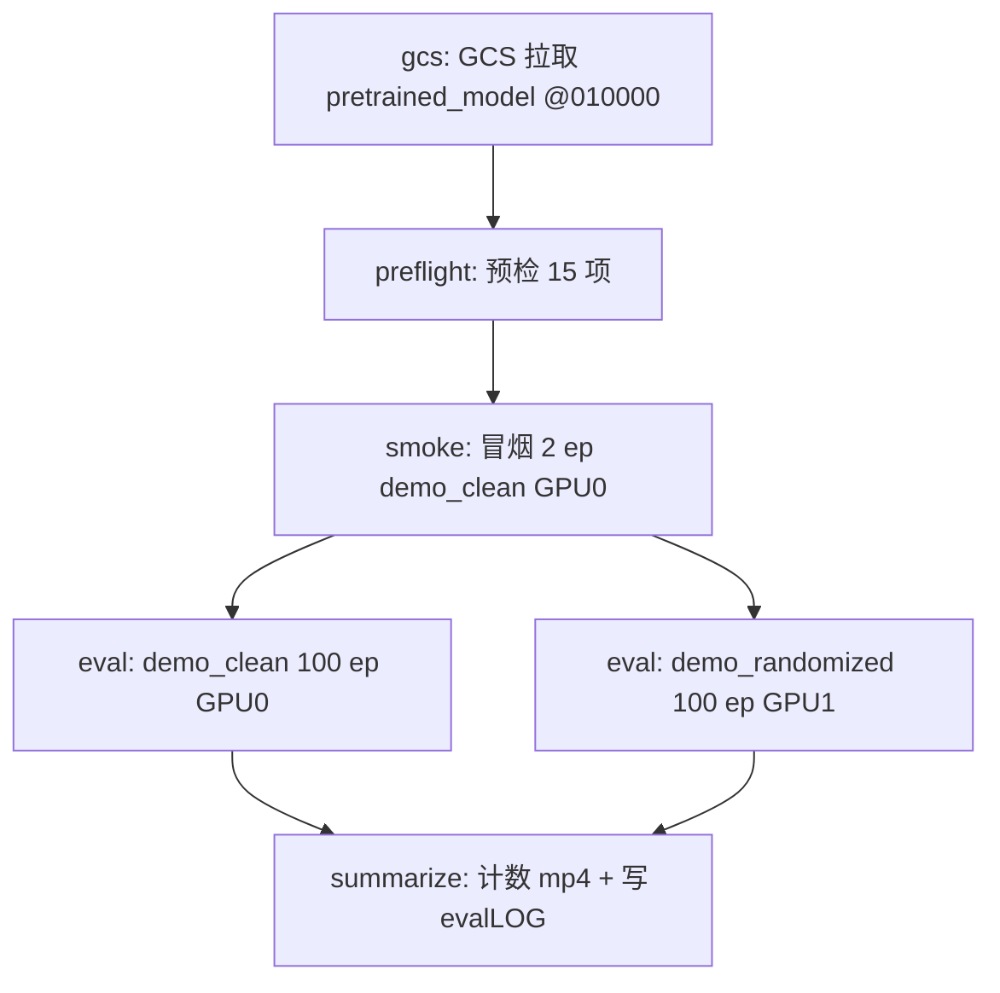
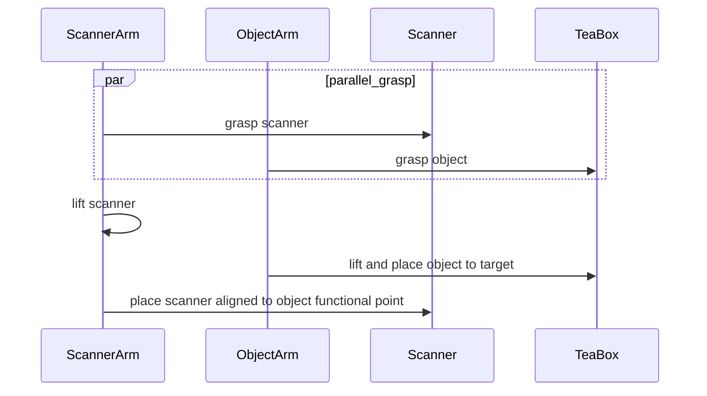

# InternVLA-A1.5 + GeoPredict：RoboTwin 2.0 `scan_object` 本机评测落地方案与操作手册

> **文档定位**：在本机（GCP Blackwell 开发机）上，用 [RoboTwin 2.0](https://robotwin-platform.github.io/) 的 **`scan_object`** 任务，评估 GCS 上 scan_object Phase 2 训练 **第 10000 步** checkpoint。本手册给出可执行步骤、坐标系对齐约束，并**完整说明**如何通过 [`b/s/itrnVLA15_GeoP_3dtrj_3cn4_sft_rbt2_eval.sh`](../s/itrnVLA15_GeoP_3dtrj_3cn4_sft_rbt2_eval.sh) 一键编排评测。
>
> **本次评测对象**（用户指定）：
>
> `gs://physical-ai-data-eu/VENV/tmp/2026_08_26_07_15_45-itvlaGp_p2_8g10k_scan_object_kptsim_lrbv30/checkpoints/010000/pretrained_model/`
>
> **本机代码库**：`/home/luogang/SRC/Robot/itvlaGp/`  
> **Python 环境（必须复用）**：conda **`itvlaGp`**，解释器 `/home/luogang/miniforge3/envs/itvlaGp/bin/python`（Python 3.10.20）。与 `stack_bowls_three` / `hanging_mug` 本机评测同一套，详见 [§5.1](#51-python-虚拟环境必须复用-condaitvlagp)。  
> **RoboTwin 源码**：`/home/luogang/share/zwy/Projects/RoboTwin/`（仓库内 `third_party/RoboTwin` 符号链接）  
> **执行日志（评测时追加）**：[`itrnVLA15_GeoP_3dtrj_3cn4_sft_rbt2_scnObj_evalLOG.md`](itrnVLA15_GeoP_3dtrj_3cn4_sft_rbt2_scnObj_evalLOG.md)

**参考文档与出处**：

| 来源 | 用途 |
|:---|:---|
| [`itrnVLA15_GeoP_3dtrj_3cn4_rbt2stkb3_eval6000_10kLOG.md`](itrnVLA15_GeoP_3dtrj_3cn4_rbt2stkb3_eval6000_10kLOG.md) | stack_bowls 010k 体素评测实测、`load_stats` 修复、双 GPU 坑 |
| [`itrnVLA15_GeoP_3dtrj_3cn4_sft_rbt2_hngMg_eval.md`](itrnVLA15_GeoP_3dtrj_3cn4_sft_rbt2_hngMg_eval.md) | hanging_mug 本机评测手册（同结构、同 eval.sh 用法） |
| [`itrnVLA15_GeoP_3dtrj_3cn4_sft_rbt2_hngMg_evalLOG.md`](itrnVLA15_GeoP_3dtrj_3cn4_sft_rbt2_hngMg_evalLOG.md) | hanging_mug @010k 实测：clean 9% / rand 4% |
| [`itrnVLA15_GeoP_3dtrj_3cn4_sft_rbt2_scnObj.md`](itrnVLA15_GeoP_3dtrj_3cn4_sft_rbt2_scnObj.md) §13 | scan_object Phase 2 评测衔接、`task_idx=41`、禁止 `eval.sh` |
| [`itrnVLA15_GeoP_3dtrj_3cn4_wrmup1G_scnObj.md`](itrnVLA15_GeoP_3dtrj_3cn4_wrmup1G_scnObj.md) §1 | scan_object 体素 offset、kptsim schema |
| [`itrnVLA15_GeoP_3dtrj_3cn4_sft_rbt2_eval.sh`](../s/itrnVLA15_GeoP_3dtrj_3cn4_sft_rbt2_eval.sh) | **本手册主入口**：GCS 下载 → 预检 → 冒烟 → 双卡正式评测 → 写 LOG |
| [`evaluation/RoboTwin/inference.py`](../evaluation/RoboTwin/inference.py) | 底层推理（eval.sh 内部调用） |
| RoboTwin [`envs/scan_object.py`](file:///home/luogang/share/zwy/Projects/RoboTwin/envs/scan_object.py) | 任务成功条件与 expert 脚本 |

---

## 目录

- [0. 方案概览](#0-方案概览)
- [1. scan_object 任务与成功条件](#1-scan_object-任务与成功条件)
- [2. Checkpoint 与训练/推理坐标系](#2-checkpoint-与训练推理坐标系)
- [3. 推理架构（简述）](#3-推理架构简述)
- [4. 与其它任务评测的硬差异](#4-与其它任务评测的硬差异)
- [5. 本机环境与代码状态](#5-本机环境与代码状态)
- [6. 一键评测：`eval.sh` 完整用法（核心）](#6-一键评测evalsh-完整用法核心)
  - [6.1 推荐：全流程一条命令](#61-推荐全流程一条命令)
  - [6.2 命令行参数逐项解释](#62-命令行参数逐项解释)
  - [6.3 环境变量等价写法](#63-环境变量等价写法)
  - [6.4 分阶段命令](#64-分阶段命令)
  - [6.5 脚本内部阶段与产物](#65-脚本内部阶段与产物)
- [7. 进度监控与结果汇总](#7-进度监控与结果汇总)
- [8. 关键约束](#8-关键约束)
- [9. 故障排除](#9-故障排除)
- [10. 附录](#10-附录)
- [Part B：执行记录模板](#part-b执行记录模板)

---

## 0. 方案概览

### 0.1 评估目标

在 RoboTwin 2.0 的 **`scan_object`**（双臂协作：抓取扫描仪 + 物体，将物体放到扫描位并对齐扫描）上，评估 scan_object Phase 2 微调 **step 10000** 的 itvlaGp 3-path MoT 策略，输出 `demo_clean`（Easy）与 `demo_randomized`（Hard）各 100 episode 成功率。

该 checkpoint 在 **kptsim 体素坐标** 上训练（`repo_id=scan_object_kptsim_lrbv30`）。推理时必须把 SAPIEN 实时 3D 关键点变到**同一体素空间**（\(\mathbf{p}_{\text{kpt}}=\mathbf{p}_{\text{world}}-\mathbf{o}\)），否则 keypoint expert 的 KV 语义与训练错位。此约束已在 stack_bowls 本机评测中验证（[10kLOG](itrnVLA15_GeoP_3dtrj_3cn4_rbt2stkb3_eval6000_10kLOG.md) Problem #2）。

> **关于 @10000**：训练手册 [scnObj §12.1](itrnVLA15_GeoP_3dtrj_3cn4_sft_rbt2_scnObj.md) 指出 stack_bowls 上 Open-loop MSE 在 @2500 后可能变差。本次按用户指定评 **@010000**；若成功率异常偏低，可用同一 `eval.sh` 改 `--ckpt-step 002500` / `005000` / `007500` 对照（见 [§6.4.4](#644-评测其它-checkpoint-步数)）。

### 0.2 评估配置一览

| 维度 | 值 |
|:---|:---|
| **代码库** | `/home/luogang/SRC/Robot/itvlaGp/` |
| **Python 环境** | conda **`itvlaGp`**（见 [§5.1](#51-python-虚拟环境必须复用-condaitvlagp)） |
| **GCS job** | `gs://physical-ai-data-eu/VENV/tmp/2026_08_26_07_15_45-itvlaGp_p2_8g10k_scan_object_kptsim_lrbv30/` |
| **评测步数** | **010000**（`pretrained_model/` 4 文件，**5.89 GiB**） |
| **本机 ckpt 落地** | `${REPO_ROOT}/outputs-gcs/scan_object_p2_010k/checkpoints/010000/pretrained_model/` |
| **训练数据** | `scan_object_kptsim_lrbv30`（体素 GT，50 ep / **8463** frames） |
| **kpt meta（本机）** | `/home/luogang/share/zwy/Projects/DATA/RoboTwin-Clean/scan_object_kptsim_lrbv30/meta/keypoints_meta.json` |
| **任务** | `scan_object`，`TASK_NAMES` 索引 **41** |
| **步数上限** | **500**（`task_config/_eval_step_limit.yml`；hanging_mug 900，stack_bowls 1200） |
| **推理后端** | **`standard`** |
| **kpt 坐标** | **`voxel`**，\(\mathbf{o}\approx[-0.675,-1.035,0.622]\) |
| **动作模式** | `abs` |
| **dtype** | `bfloat16` |
| **infer-horizon** | 20 |
| **每配置 episode** | 100 |
| **GPU** | 双卡并行：clean → GPU0，randomized → GPU1 |
| **输出** | `outputs/robotwin/itvlaGp_scnObj_p2_010k/` |
| **一键脚本** | [`b/s/itrnVLA15_GeoP_3dtrj_3cn4_sft_rbt2_eval.sh`](../s/itrnVLA15_GeoP_3dtrj_3cn4_sft_rbt2_eval.sh) |

### 0.3 工作流（由 eval.sh 自动编排）



**不要**用 `evaluation/RoboTwin/eval.sh` 作为主路径：它不传 `--kpt-meta-path` / `--dtype`，且 `DEFAULT_KPT_META_PATH` 写死为 **stack_bowls** 的 meta。一律通过 **`itrnVLA15_GeoP_3dtrj_3cn4_sft_rbt2_eval.sh`** 调用 `inference.py`。

---

## 1. scan_object 任务与成功条件

源码：RoboTwin [`envs/scan_object.py`](file:///home/luogang/share/zwy/Projects/RoboTwin/envs/scan_object.py)。

### 1.1 任务语义

桌面上随机摆放一只 **扫描仪**（`024_scanner`，5 种 id）和一个 **茶盒物体**（`112_tea-box`，6 种 id），左右位置随机。策略需：

1. **双臂并行**抓取扫描仪与物体（哪侧抓扫描仪由扫描仪 x 坐标决定）；
2. 抬起并移动物体到目标放置位；
3. 将扫描仪对准物体功能点，完成扫描对齐；
4. **结束时双爪均闭合**（与 hanging_mug「右爪张开」不同）。

这是 **双臂并行抓取 + 扫描对齐**，失败模式包括：单侧抓取失败、物体未到位、扫描仪未对准、步数耗尽。

### 1.2 Expert 脚本（seed 验证）

评测每个 seed 前，`inference.py` 先跑 `play_once()`，仅 **plan 成功且 `check_success()` 为真** 的 seed 才交给策略。



### 1.3 成功判定 `check_success()`

记物体位置 \(\mathbf{p}_{\text{obj}}\)，扫描仪功能点 \(\mathbf{p}_{\text{scan}}^{\text{fp}}\)（含姿态），沿扫描轴投影距离 \(d\)，对齐后物体投影点 \(\mathbf{p}_{\text{proj}}\)，容差 \(\varepsilon=0.025\,\mathrm{m}\)：

\[
\text{success} \iff
\|\mathbf{p}_{\text{proj}} - \mathbf{p}_{\text{scan}}^{\text{fp},xyz}\|_\infty < \varepsilon
\ \land\ 0 < d < 0.07
\ \land\ \text{left gripper close}
\ \land\ \text{right gripper close}
\]

策略 rollout 中 `task_env.eval_success` 为真即提前结束该 episode（上限 **500** 步）。

### 1.4 域随机化

| 配置 | 文件 | 含义 |
|:---|:---|:---|
| `demo_clean` | `task_config/demo_clean.yml` | 无域随机化（Easy） |
| `demo_randomized` | `task_config/demo_randomized.yml` | 背景/杂物/桌高/光照等（Hard） |

---

## 2. Checkpoint 与训练/推理坐标系

### 2.1 GCS 上已核实的目录（2026-08-27 列举）

```
gs://physical-ai-data-eu/VENV/tmp/2026_08_26_07_15_45-itvlaGp_p2_8g10k_scan_object_kptsim_lrbv30/
├── 8g_10k.log
├── wandb/
└── checkpoints/
    ├── 002500/
    ├── 005000/
    ├── 007500/
    └── 010000/
        ├── pretrained_model/     ← 本次评测
        └── training_state/       ← 评测不需要，勿下载
```

`pretrained_model/`（**仅 4 个文件**，共 5.89 GiB）：

| 文件 | 大小 | 作用 |
|:---|---:|:---|
| `config.json` | 3598 B | 策略配置 |
| `model.safetensors` | 5.89 GiB | 权重 |
| `stats.json` | 11009 B | 评测反标准化 |
| `train_config.json` | 12659 B | 训练超参溯源 |

从 GCS 读取的关键字段：

| 字段 | 值 |
|:---|:---|
| `enable_keypoint_predictor` | `true` |
| `num_keypoint_joints` | 14 |
| `dataset.repo_id` | `scan_object_kptsim_lrbv30` |
| `dataset.action_mode` | `abs` |
| `dtype` | `bfloat16` |
| `steps` | 10000 |
| `external_stats_path` | `/tmp/itnvla15rbt20/var/datasets/scan_object_kptsim_lrbv30/norm_stat.json`（**远端路径，本机不存在**） |

`model.safetensors` 字节数：**6321129804**（与 hanging_mug / stack_bowls 同量级）。

### 2.2 体素坐标（方案 A）

\[
\mathbf{p}_{\text{kpt}} = \mathbf{p}_{\text{world}} - \mathbf{o},\quad
\mathbf{o}_{\text{scan\_object}} = [-0.6748,\ -1.0345,\ 0.6219]
\]

本机 `keypoints_meta.json` 精确值为 `[-0.674829..., -1.034456..., 0.621856...]`。EEF 索引 6/13 为 `fl_eef_tcp` / `fr_eef_tcp`（TCP，非 camera）。

### 2.3 为何不能用默认 meta

[`inference.py`](../evaluation/RoboTwin/inference.py) 中 `DEFAULT_KPT_META_PATH` 写死为 **stack_bowls_three** 的 meta。`train_config.json` 的 `external_stats_path` 指向远端 `/tmp/itnvla15rbt20/...`，本机自动解析会失败并落入错误 offset。**必须**通过 eval.sh 的 `--kpt-meta-path`（或脚本按 `--task-name` 自动拼路径）显式指定 scan_object meta。

| 任务 | \(\mathbf{o}\) |
|:---|:---|
| **scan_object（正确）** | \([-0.675,\ -1.035,\ 0.622]\) |
| stack_bowls_three（默认，错误） | \([-0.812,\ -1.024,\ 0.505]\) |
| hanging_mug（错误） | \([-0.772,\ -1.050,\ 0.478]\) |

---

## 3. 推理架构（简述）

与 hanging_mug / stack_bowls 相同：**3-path MoT**（VLM + Kpt Expert + Action Expert），评测时 `action_loss_only=True` 不加载 WAN，`standard` backend 传入 `his_kpts[H,14,3]`。详见 [hngMg_eval §3](itrnVLA15_GeoP_3dtrj_3cn4_sft_rbt2_hngMg_eval.md) 与 [scnObj §13.2](itrnVLA15_GeoP_3dtrj_3cn4_sft_rbt2_scnObj.md)。

本机 `inference.py` 已含 `get_keypoints_kptsim_voxel()`、`load_stats` mean/std 兼容、`expert_success` 顺序修复，**scan_object 无需再改代码**。

---

## 4. 与其它任务评测的硬差异

| 维度 | stack_bowls_three | hanging_mug | **scan_object（本文）** |
|:---|:---|:---|:---|
| `task_idx` | 46 | 10 | **41** |
| 步数上限 | 1200 | 900 | **500** |
| \(\mathbf{o}\) | \([-0.812,-1.024,0.505]\) | \([-0.772,-1.050,0.478]\) | **\([-0.675,-1.035,0.622]\)** |
| 训练 frames | ~37k | 16889 | **8463** |
| 成功条件 | 三碗堆叠 + 双爪开 | 挂杯 + 右爪开 | **扫描对齐 + 双爪闭** |
| eval.sh 默认 GCS | 无（需 `--gcs-job`） | 内置默认 job | **需显式 `--gcs-job`** |
| 输出 RUN_ID | `itvlaGp_stkb3_p2_010k` | `itvlaGp_hngMg_p2_010k` | **`itvlaGp_scnObj_p2_010k`** |
| hanging_mug @010k 实测 | clean 81% / rand 57% | clean 9% / rand 4% | **待测** |

`eval.sh` 默认 `TASK_IDX=44`（`stack_blocks_three`），三任务都**不要**用该默认值。

---

## 5. 本机环境与代码状态

### 5.1 Python 虚拟环境（必须复用 conda `itvlaGp`）

本机评测 **只使用** miniforge conda 环境 **`itvlaGp`**（2026-08-05 为本仓库 RoboTwin 评估创建；stack_bowls / hanging_mug 评测已验证）。**不要新建 conda/venv，也不要切到 `ivla15` / `RoboTwin`。**

| 项 | 值 |
|:---|:---|
| 环境名 | `itvlaGp` |
| 解释器 | `/home/luogang/miniforge3/envs/itvlaGp/bin/python` |
| Python | 3.10.20 |
| torch | 2.11.0+cu128 |
| transformers | 5.2.0 + Qwen3.5 补丁 |
| GeoP | `TrackEncoder` 可导入 |

eval.sh 启动时会 `source conda.sh && conda activate itvlaGp`，无需手动激活（除非你要在 shell 里单独调试 `inference.py`）。

### 5.2 依赖与代码状态

| 项 | 期望 |
|:---|:---|
| `third_party/RoboTwin` | → `/home/luogang/share/zwy/Projects/RoboTwin` |
| `get_keypoints_kptsim_voxel` | 已落地 |
| `load_stats` mean/std | 已修 |
| scan_object meta | 本机已有 |
| 磁盘 | 建议 ≥ 20 GB（ckpt 6 GB + 视频/日志） |

---

## 6. 一键评测：`eval.sh` 完整用法（核心）

脚本路径：[`b/s/itrnVLA15_GeoP_3dtrj_3cn4_sft_rbt2_eval.sh`](../s/itrnVLA15_GeoP_3dtrj_3cn4_sft_rbt2_eval.sh)

内部阶段顺序：`gcs` → `preflight` → `smoke` → `eval` → `summarize`

> **运行环境**：建议在 **tmux** 或持久化 shell 中执行正式 100 ep（约 1.5–2.5 h，步数上限 500 比 hanging_mug 短）。`inference.py` 启动时会 `rmtree(video_dir)`，中断后不可用同一目录直接续跑。

### 6.1 推荐：全流程一条命令

在仓库根目录执行（**复制即用**）：

```bash
cd /home/luogang/SRC/Robot/itvlaGp

bash b/s/itrnVLA15_GeoP_3dtrj_3cn4_sft_rbt2_eval.sh \
  --reset-log \
  --task-name scan_object \
  --task-idx 41 \
  --gcs-job gs://physical-ai-data-eu/VENV/tmp/2026_08_26_07_15_45-itvlaGp_p2_8g10k_scan_object_kptsim_lrbv30 \
  --ckpt-step 010000 \
  --expect-repo-id scan_object_kptsim_lrbv30 \
  --expect-offset -0.6748,-1.0345,0.6219 \
  --kpt-meta /home/luogang/share/zwy/Projects/DATA/RoboTwin-Clean/scan_object_kptsim_lrbv30/meta/keypoints_meta.json \
  --out /home/luogang/SRC/Robot/itvlaGp/outputs/robotwin/itvlaGp_scnObj_p2_010k \
  --eval-log /home/luogang/SRC/Robot/itvlaGp/b/d/itrnVLA15_GeoP_3dtrj_3cn4_sft_rbt2_scnObj_evalLOG.md
```

**这条命令会依次**：

1. 从 GCS 下载 `checkpoints/010000/pretrained_model/` 到 `outputs-gcs/scan_object_p2_010k/...`（若本地已完整则跳过）；
2. 跑 15 项预检（conda、torch、transformers、ckpt、meta offset、inference.py 体素改造等）；
3. GPU0 冒烟 2 ep `demo_clean`；
4. GPU0 `demo_clean` + GPU1 `demo_randomized` 各 100 ep（并行）；
5. 统计 mp4、写 [`scnObj_evalLOG.md`](itrnVLA15_GeoP_3dtrj_3cn4_sft_rbt2_scnObj_evalLOG.md)，控制台全文写入 `outputs/logs/run_itvlaGp_scnObj_p2_010k.log`。

若 ckpt 已下载，可加 `--skip-gcs` 跳过 GCS 阶段。

### 6.2 命令行参数逐项解释

下表对应 [§6.1](#61-推荐全流程一条命令) 中显式传入的参数，以及 eval.sh 的其它常用选项。CLI 优先于同名环境变量。

#### 6.2.1 本次 scan_object @010000 必传 / 推荐传参

| 参数 | 本次值 | 含义 |
|:---|:---|:---|
| `--reset-log` | （开关） | **覆盖**已有 `evalLOG`，新建时间线与配置表。不加则在旧 LOG 末尾追加「再次运行」段。 |
| `--task-name` | `scan_object` | RoboTwin 任务名。脚本据此自动设置 slug `scnObj`、`RUN_ID`、默认 ckpt 路径、`EVAL_LOG` 文件名。 |
| `--task-idx` | `41` | `inference.py` 的 `TASK_NAMES[41]`。必须与 `--task-name` 一致，否则脚本报错退出。 |
| `--gcs-job` | `gs://.../2026_08_26_07_15_45-itvlaGp_p2_8g10k_scan_object_kptsim_lrbv30` | GCS 训练 job 根目录（含 `checkpoints/` 的上一级）。scan_object **无内置默认**（hanging_mug 才有），必须显式传。 |
| `--ckpt-step` | `010000` | 使用 `checkpoints/010000/pretrained_model/`。改此值可评 002500/005000/007500。 |
| `--expect-repo-id` | `scan_object_kptsim_lrbv30` | 预检第 12 项：校验 `train_config.json` 的 `dataset.repo_id` 与训练数据一致。 |
| `--expect-offset` | `-0.6748,-1.0345,0.6219` | 预检第 13 项：校验 `keypoints_meta.json` 的 `coord_offset`（容差 1e-3）。防止误用 stack_bowls / hanging_mug meta。 |
| `--kpt-meta` | `.../scan_object_kptsim_lrbv30/meta/keypoints_meta.json` | 传给 `inference.py --kpt-meta-path`。体素 offset 来源。**不传**时脚本按 `KPT_DATA_ROOT` + 任务名自动拼路径（本机默认即此路径）。 |
| `--out` | `outputs/robotwin/itvlaGp_scnObj_p2_010k` | 评测输出根目录。其下生成 `smoke/` 与 `robotwin/demo_{clean,randomized}/scan_object/`。 |
| `--eval-log` | `b/d/itrnVLA15_GeoP_3dtrj_3cn4_sft_rbt2_scnObj_evalLOG.md` | 执行记录 markdown（时间线、问题、最终结果）。不传时 `--task-name scan_object` 会自动落到 `..._scnObj_evalLOG.md`。 |

#### 6.2.2 推理与评测规模（本次用默认值，一般可省略）

| 参数 | 默认 | 含义 |
|:---|:---|:---|
| `--configs` | `demo_clean,demo_randomized` | 逗号分隔的 RoboTwin 任务配置。顺序与 `--gpus` 一一对应。 |
| `--gpus` | `0,1` | 逗号分隔 GPU id。`demo_clean`→GPU0，`demo_randomized`→GPU1。 |
| `--smoke-gpu` | `0`（= `--gpus` 第一项） | 冒烟测试使用的 GPU。 |
| `--num-episodes` | `100` | 每个配置的正式评测 episode 数。 |
| `--smoke-episodes` | `2` | 冒烟 episode 数。 |
| `--action-mode` | `abs` | 与训练 `train_config` 一致。 |
| `--dtype` | `bfloat16` | 推理精度。`eval.sh` 旧版不传会变 float32，**必须 bfloat16**。 |
| `--infer-horizon` | `20` | 每次 policy 推理使用的动作步数（环境 step 循环内）。 |
| `--inference-backend` | `standard` | GeoP **必须** `standard`；`optimized` 无 `his_kpts` 参数。 |
| `--kpt-coord-mode` | `voxel` | 体素坐标 \(\mathbf{p}_{\text{world}}-\mathbf{o}\)。 |
| `--instruction-type` | `unseen` | RoboTwin 语言指令域。 |
| `--seed` | `42` | `inference.py` 随机种子。 |
| `--resize-size` | `224` | 相机 resize 边长。 |

#### 6.2.3 路径与环境（本机一般可省略）

| 参数 | 默认（本机） | 含义 |
|:---|:---|:---|
| `--repo-root` | `/home/luogang/SRC/Robot/itvlaGp` | 代码库根。 |
| `--conda-root` | `/home/luogang/miniforge3` | miniforge 安装路径。 |
| `--conda-env` | `itvlaGp` | 评测用 conda 环境名。 |
| `--log-dir` | `outputs/logs` | `smoke_*.log`、`eval_*_demo_*.log`、`run_*.log` 目录。 |
| `--kpt-data-root` | `/home/luogang/share/zwy/Projects/DATA/RoboTwin-Clean` | 未传 `--kpt-meta` 时拼 `${ROOT}/${task}_${variant}/meta/...`。 |
| `--kpt-variant` | `kptsim_lrbv30` | meta 目录后缀。 |
| `--min-disk-gb` | `20` | 预检磁盘下限（GB）。 |

#### 6.2.4 阶段控制与其它开关

| 参数 | 含义 |
|:---|:---|
| `--from STAGE` | 从某阶段开始。`STAGE` ∈ `gcs` \| `preflight` \| `smoke` \| `eval` \| `summarize`。 |
| `--until STAGE` | 做到某阶段为止。 |
| `--skip-gcs` | 跳过 GCS 下载；要求 `--ckpt` 本地已完整。 |
| `--skip-smoke` | 跳过冒烟。 |
| `--skip-eval` | 跳过正式 100 ep（只预检或只汇总时用）。 |
| `--force-download` | 本地 ckpt 已存在也重新从 GCS 拉取。 |
| `--sequential` | 多配置串行评测（默认双卡并行）。 |
| `--keep-going` | 冒烟失败仍继续正式评测（调试用，不推荐）。 |
| `--dry-run` | 只打印将执行的命令，不下载、不推理、不写 LOG 正文。 |
| `--print-config` | 解析 CLI/环境变量后打印全部变量并退出。 |
| `--list-tasks` | 打印 `task_idx` 与任务名对照表并退出。 |
| `--status` | 只统计已有 mp4、更新 evalLOG 汇总，不跑推理。 |
| `-h` / `--help` | 打印用法摘要。 |

### 6.3 环境变量等价写法

CLI 与环境变量同名（大写下划线），**CLI 优先**。例如：

```bash
export TASK_NAME=scan_object
export TASK_IDX=41
export GCS_JOB=gs://physical-ai-data-eu/VENV/tmp/2026_08_26_07_15_45-itvlaGp_p2_8g10k_scan_object_kptsim_lrbv30
export CKPT_STEP=010000
export EXPECT_REPO_ID=scan_object_kptsim_lrbv30
export EXPECT_OFFSET=-0.6748,-1.0345,0.6219
export OUT=/home/luogang/SRC/Robot/itvlaGp/outputs/robotwin/itvlaGp_scnObj_p2_010k
export EVAL_LOG=/home/luogang/SRC/Robot/itvlaGp/b/d/itrnVLA15_GeoP_3dtrj_3cn4_sft_rbt2_scnObj_evalLOG.md

bash b/s/itrnVLA15_GeoP_3dtrj_3cn4_sft_rbt2_eval.sh --reset-log
```

未显式传的变量由脚本按 `--task-name scan_object` 自动推导：

| 自动推导项 | 值 |
|:---|:---|
| `CKPT` | `${REPO_ROOT}/outputs-gcs/scan_object_p2_010k/checkpoints/010000/pretrained_model` |
| `GCS_CKPT` | `${GCS_JOB}/checkpoints/010000/pretrained_model` |
| `RUN_ID` | `itvlaGp_scnObj_p2_010k` |
| `KPT_META` | `${KPT_DATA_ROOT}/scan_object_kptsim_lrbv30/meta/keypoints_meta.json` |
| `RUN_LOG` | `outputs/logs/run_itvlaGp_scnObj_p2_010k.log` |

### 6.4 分阶段命令

#### 6.4.1 先检查配置（不跑评测）

```bash
cd /home/luogang/SRC/Robot/itvlaGp

bash b/s/itrnVLA15_GeoP_3dtrj_3cn4_sft_rbt2_eval.sh \
  --task-name scan_object \
  --gcs-job gs://physical-ai-data-eu/VENV/tmp/2026_08_26_07_15_45-itvlaGp_p2_8g10k_scan_object_kptsim_lrbv30 \
  --expect-offset -0.6748,-1.0345,0.6219 \
  --print-config
```

确认 `TASK_IDX=41`、`CKPT`、`KPT_META`、`EVAL_LOG` 路径正确后再跑全流程。

#### 6.4.2 只下载 + 预检

```bash
bash b/s/itrnVLA15_GeoP_3dtrj_3cn4_sft_rbt2_eval.sh \
  --task-name scan_object \
  --gcs-job gs://physical-ai-data-eu/VENV/tmp/2026_08_26_07_15_45-itvlaGp_p2_8g10k_scan_object_kptsim_lrbv30 \
  --expect-offset -0.6748,-1.0345,0.6219 \
  --until preflight
```

#### 6.4.3 只跑到冒烟（推荐正式 100 ep 前）

```bash
bash b/s/itrnVLA15_GeoP_3dtrj_3cn4_sft_rbt2_eval.sh \
  --reset-log \
  --task-name scan_object \
  --gcs-job gs://physical-ai-data-eu/VENV/tmp/2026_08_26_07_15_45-itvlaGp_p2_8g10k_scan_object_kptsim_lrbv30 \
  --expect-offset -0.6748,-1.0345,0.6219 \
  --until smoke
```

**冒烟通过标准**（脚本自动检查）：

| 检查 | 期望 |
|:---|:---|
| 退出码 | 0 |
| 日志 offset | `scan_object` meta，`[-0.6748, -1.0345, 0.6219]` |
| 日志行 | `Using kptsim voxel keypoints from .../scan_object_kptsim_lrbv30/...` |
| 无 | `AttributeError`、`his_kpts`、`stack_bowls_three` 出现在 offset 行 |
| mp4 | ≥ 2（`success_*.mp4` 或 `failure_*.mp4`） |

#### 6.4.4 评测其它 checkpoint 步数

同一 GCS job 下还有 `002500` / `005000` / `007500`。只改 `--ckpt-step` 与输出目录即可：

```bash
bash b/s/itrnVLA15_GeoP_3dtrj_3cn4_sft_rbt2_eval.sh \
  --task-name scan_object \
  --gcs-job gs://physical-ai-data-eu/VENV/tmp/2026_08_26_07_15_45-itvlaGp_p2_8g10k_scan_object_kptsim_lrbv30 \
  --ckpt-step 005000 \
  --expect-offset -0.6748,-1.0345,0.6219 \
  --out /home/luogang/SRC/Robot/itvlaGp/outputs/robotwin/itvlaGp_scnObj_p2_005k \
  --eval-log /home/luogang/SRC/Robot/itvlaGp/b/d/itrnVLA15_GeoP_3dtrj_3cn4_sft_rbt2_scnObj_evalLOG_005k.md \
  --skip-gcs
```

> `--skip-gcs` 前提是对应步数的 `pretrained_model/` 已在 `outputs-gcs/scan_object_p2_005k/...` 或你通过 `--ckpt` 指到本地路径。若本地无该步 ckpt，去掉 `--skip-gcs` 让脚本从 GCS 下载。

#### 6.4.5 本地 ckpt 已存在：跳过 GCS

```bash
bash b/s/itrnVLA15_GeoP_3dtrj_3cn4_sft_rbt2_eval.sh \
  --reset-log \
  --task-name scan_object \
  --expect-offset -0.6748,-1.0345,0.6219 \
  --ckpt /home/luogang/SRC/Robot/itvlaGp/outputs-gcs/scan_object_p2_010k/checkpoints/010000/pretrained_model \
  --skip-gcs
```

#### 6.4.6 只汇总已有结果

```bash
bash b/s/itrnVLA15_GeoP_3dtrj_3cn4_sft_rbt2_eval.sh \
  --task-name scan_object \
  --out /home/luogang/SRC/Robot/itvlaGp/outputs/robotwin/itvlaGp_scnObj_p2_010k \
  --status
```

#### 6.4.7 干跑（检查将执行的命令）

```bash
bash b/s/itrnVLA15_GeoP_3dtrj_3cn4_sft_rbt2_eval.sh \
  --task-name scan_object \
  --gcs-job gs://physical-ai-data-eu/VENV/tmp/2026_08_26_07_15_45-itvlaGp_p2_8g10k_scan_object_kptsim_lrbv30 \
  --expect-offset -0.6748,-1.0345,0.6219 \
  --dry-run
```

### 6.5 脚本内部阶段与产物

| 阶段 | 脚本函数 | 主要动作 | 产物 |
|:---|:---|:---|:---|
| `gcs` | `stage_gcs` | `gcloud storage cp` 4 个 ckpt 文件 | `outputs-gcs/scan_object_p2_010k/.../pretrained_model/` |
| `preflight` | `stage_preflight` | 15 项检查 | 失败则写 evalLOG 并 `exit 1` |
| `smoke` | `stage_smoke` | GPU0，`demo_clean`，2 ep | `outputs/logs/smoke_itvlaGp_scnObj_p2_010k.log`；`OUT/smoke/demo_clean/scan_object/*.mp4` |
| `eval` | `stage_eval` | GPU0 clean + GPU1 randomized，各 100 ep | `outputs/logs/eval_itvlaGp_scnObj_p2_010k_demo_{clean,randomized}.log`；`OUT/robotwin/.../*.mp4` |
| `summarize` | `stage_summarize` | 计数 success/failure mp4；可选 `robotwin_result_stats.py` | 更新 **evalLOG** 的「最终结果」表 |

底层 `inference.py` 调用形态（由脚本拼装，**无需手写**）：

```bash
CUDA_VISIBLE_DEVICES=<gpu> python -u evaluation/RoboTwin/inference.py \
  --ckpt-path "${CKPT}" \
  --video-dir "${OUT}/robotwin/<config>/scan_object" \
  --task-config <demo_clean|demo_randomized> \
  --task-idx 41 \
  --action-mode abs \
  --infer-horizon 20 \
  --inference-backend standard \
  --num-episodes <N> \
  --dtype bfloat16 \
  --kpt-coord-mode voxel \
  --kpt-meta-path "${KPT_META}"
```

---

## 7. 进度监控与结果汇总

### 7.1 进度（评测进行中）

```bash
OUT=/home/luogang/SRC/Robot/itvlaGp/outputs/robotwin/itvlaGp_scnObj_p2_010k
for cfg in demo_clean demo_randomized; do
  S=$(ls ${OUT}/robotwin/${cfg}/scan_object/success_*.mp4 2>/dev/null | wc -l)
  F=$(ls ${OUT}/robotwin/${cfg}/scan_object/failure_*.mp4 2>/dev/null | wc -l)
  T=$((S+F))
  echo "${cfg}: ${T}/100  ${S}S/${F}F"
done
nvidia-smi --query-gpu=index,utilization.gpu,memory.used --format=csv,noheader
```

也可：

```bash
bash b/s/itrnVLA15_GeoP_3dtrj_3cn4_sft_rbt2_eval.sh \
  --task-name scan_object \
  --out outputs/robotwin/itvlaGp_scnObj_p2_010k \
  --status
```

### 7.2 日志位置

| 类型 | 路径 |
|:---|:---|
| **执行 LOG（主）** | `b/d/itrnVLA15_GeoP_3dtrj_3cn4_sft_rbt2_scnObj_evalLOG.md` |
| 控制台完整日志 | `outputs/logs/run_itvlaGp_scnObj_p2_010k.log` |
| 冒烟 inference | `outputs/logs/smoke_itvlaGp_scnObj_p2_010k.log` |
| 正式 inference | `outputs/logs/eval_itvlaGp_scnObj_p2_010k_demo_{clean,randomized}.log` |

### 7.3 对照（不可直接比绝对值）

| Run | 任务 | demo_clean | demo_randomized |
|:---|:---|---:|---:|
| itvlaGp0801116 @10k 体素 | stack_bowls_three | 81% | 57% |
| GCS hanging_mug @10k | hanging_mug | 9% | 4% |
| **本文 scan_object @10k** | **scan_object** | 待测 | 待测 |

不同任务难度与训练数据量不同，只比「本任务 clean vs randomized 降幅」与失败视频模式。

---

## 8. 关键约束

| 约束 | 原因 |
|:---|:---|
| `--task-name scan_object` + `--task-idx 41` | 46=stack_bowls，10=hanging_mug，44=stack_blocks |
| `--gcs-job` 指向 **scan_object** job | eval.sh 仅 hanging_mug 有内置 GCS 默认 |
| `--expect-offset -0.6748,-1.0345,0.6219` | 预检防止 meta 混用（脚本对 scan_object 未内置 offset） |
| `--kpt-coord-mode voxel`（默认） | 训练是体素 GT |
| `--inference-backend standard`（默认） | optimized 无 `his_kpts` |
| `--dtype bfloat16`（默认） | 与训练一致 |
| 用 `itrnVLA15_GeoP_3dtrj_3cn4_sft_rbt2_eval.sh` | 不要直接用 `evaluation/RoboTwin/eval.sh` |
| conda **`itvlaGp`** | `ivla15` 无 TrackEncoder |
| 持久化 shell / tmux | 避免 SIGHUP 杀正式评测 |
| 不同 `video-dir` / `--out` | `inference.py` 启动会 `rmtree` 输出目录 |

---

## 9. 故障排除

| 现象 | 根因 | 修复 |
|:---|:---|:---|
| 日志 offset 是 `[-0.8117, ...]` 或 `[-0.7718, ...]` | 用了 stack_bowls / hanging_mug meta | `--kpt-meta` 指向 scan_object；检查 `--expect-offset` |
| `Could not resolve kptsim keypoints_meta.json` | 未传 meta 且远端 `external_stats_path` 不存在 | 显式 `--kpt-meta` |
| 预检 [12] repo_id 失败 | 下了错误任务的 ckpt | 确认 `--gcs-job` 为 scan_object job |
| `sample_actions() got unexpected keyword argument 'his_kpts'` | optimized backend | `--inference-backend standard` |
| GCS 403 | 未登录或无桶权限 | `gcloud auth login --no-launch-browser` |
| 进程秒退、无 mp4 | SIGHUP | tmux / 持久化后台 |
| `No module named 'lerobot.policies.internvla_a1_5.keypoints'` | 进了 `ivla15` | 用 eval.sh（自动 `conda activate itvlaGp`） |
| 成功率极低 | @10000 过拟合或任务更难 | 改 `--ckpt-step 002500` / `005000` 对照 |
| 冒烟日志无 voxel 行 | 体素改造丢失 | 恢复 `inference.py` 体素路径（见 10kLOG） |

---

## 10. 附录

### 10.1 本机路径速查

| 项 | 路径 |
|:---|:---|
| **Python 环境** | conda `itvlaGp` → `/home/luogang/miniforge3/envs/itvlaGp/bin/python` |
| GCS job | `gs://physical-ai-data-eu/VENV/tmp/2026_08_26_07_15_45-itvlaGp_p2_8g10k_scan_object_kptsim_lrbv30/` |
| 本机 ckpt | `outputs-gcs/scan_object_p2_010k/checkpoints/010000/pretrained_model/` |
| scan_object meta | `/home/luogang/share/zwy/Projects/DATA/RoboTwin-Clean/scan_object_kptsim_lrbv30/meta/keypoints_meta.json` |
| 评测输出 | `outputs/robotwin/itvlaGp_scnObj_p2_010k/` |
| 执行 LOG | `b/d/itrnVLA15_GeoP_3dtrj_3cn4_sft_rbt2_scnObj_evalLOG.md` |
| 评测脚本 | `b/s/itrnVLA15_GeoP_3dtrj_3cn4_sft_rbt2_eval.sh` |
| RoboTwin | `third_party/RoboTwin` → `/home/luogang/share/zwy/Projects/RoboTwin/` |

### 10.2 `task_idx` 查询

```bash
bash b/s/itrnVLA15_GeoP_3dtrj_3cn4_sft_rbt2_eval.sh --list-tasks | grep scan_object
# 41  scan_object
```

---

## Part B：执行记录模板

评测过程由 eval.sh 写入 [`itrnVLA15_GeoP_3dtrj_3cn4_sft_rbt2_scnObj_evalLOG.md`](itrnVLA15_GeoP_3dtrj_3cn4_sft_rbt2_scnObj_evalLOG.md)，结构对齐 [hngMg_evalLOG](itrnVLA15_GeoP_3dtrj_3cn4_sft_rbt2_hngMg_evalLOG.md)。

### 时间线

| 时间 | 操作 | 结果 |
|:---|:---|:---|
| | `eval.sh` 全流程 @010000 | |
| | GCS 下载 | |
| | 预检 15 项 | |
| | 冒烟 2 ep | |
| | demo_clean 100 ep | |
| | demo_randomized 100 ep | |

### 问题记录

| # | 现象 | 根因 | 修复 | 验证 |
|:---:|:---|:---|:---|:---|
| 1 | | | | |

### 最终结果

| 配置 | 成功 | 失败 | Success Rate |
|:---|---:|---:|:---|
| demo_clean | | | |
| demo_randomized | | | |

---

> **文档版本**: scnObj-eval-v1.0 | 撰写日 2026-08-27  
> **GCS job**: `2026_08_26_07_15_45-itvlaGp_p2_8g10k_scan_object_kptsim_lrbv30` @ **010000**  
> **参考**: [10kLOG](itrnVLA15_GeoP_3dtrj_3cn4_rbt2stkb3_eval6000_10kLOG.md) | [hngMg_eval](itrnVLA15_GeoP_3dtrj_3cn4_sft_rbt2_hngMg_eval.md) | [sft_rbt2_scnObj](itrnVLA15_GeoP_3dtrj_3cn4_sft_rbt2_scnObj.md) | [eval.sh](../s/itrnVLA15_GeoP_3dtrj_3cn4_sft_rbt2_eval.sh) | [scan_object.py](file:///home/luogang/share/zwy/Projects/RoboTwin/envs/scan_object.py)
