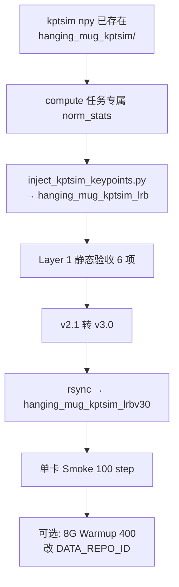
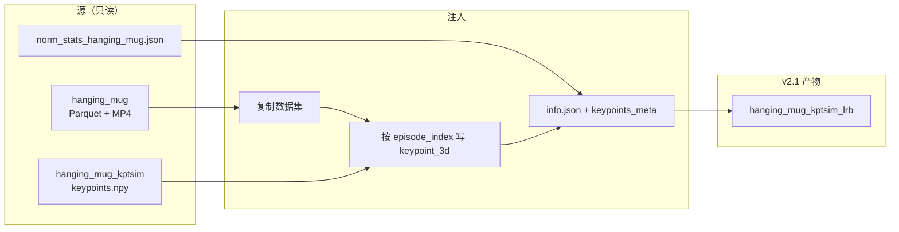

# InternVLA-A1.5 + GeoPredict：Keypoint Expert 单卡 Warmup — `hanging_mug`

> **文档定位**: 在 [v3.4 设计手册](itrnVLA15_GeoP_3dtrj_3cn4.md) 与 [kptsim Warmup 方案](itrnVLA15_GeoP_3dtrj_3cn4_wrmup.md) 基础上，给出 **RoboTwin 2.0 `hanging_mug`** 任务上、**单卡（1G）** 对 Keypoint Expert 做 Phase 1 Warmup 的完整可执行方案。
>
> **数据前提**: kptsim 3D GT 已由 GeoPredict SAPIEN FK 提取完成（2026-08-25），见 [`GeoPredict/b/d/3dkptraj_1_scnObj_hngMg_LOG.md`](../../GeoPredict/b/d/3dkptraj_1_scnObj_hngMg_LOG.md)。本文 **不重跑提取**。官方 `validate_all` **PASS**。
>
> **范围**: 注入 → Layer 1 验收 → v2.1→v3.0 → lrbv30 持久化 → 单卡 Smoke 100 step。不修改模型代码。正式 8 卡 Warmup 见 [wrmup8G](itrnVLA15_GeoP_3dtrj_3cn4_wrmup8G.md)（改 `DATA_REPO_ID`）。

---

## 目录

- [0. 阅读指南](#0-阅读指南)
- [1. 任务与数据资产](#1-任务与数据资产)
- [2. 与 stack_bowls_three 的硬差异](#2-与-stack_bowls_three-的硬差异)
- [3. Phase 0：前置检查](#3-phase-0前置检查)
- [4. Phase 1：计算 norm stats 并注入](#4-phase-1计算-norm-stats-并注入)
- [5. Phase 2：Layer 1 静态验收（6 项）](#5-phase-2layer-1-静态验收6-项)
- [6. Phase 3：v2.1 → v3.0 + lrbv30 持久化](#6-phase-3v21--v30--lrbv30-持久化)
- [7. Phase 4：权重（复用已有）](#7-phase-4权重复用已有)
- [8. Phase 5：单卡 Smoke 100 step](#8-phase-5单卡-smoke-100-step)
- [9. Phase 2 衔接与推理对齐](#9-phase-2-衔接与推理对齐)
- [10. 故障排查](#10-故障排查)
- [附录 A：路径常量表](#附录-a路径常量表)
- [附录 B：Smoke CLI 全文](#附录-bsmoke-cli-全文)

---

## 0. 阅读指南

### 0.1 与参考文档的关系

| 文档 | 内容 | 本文用法 |
|:---|:---|:---|
| [itrnVLA15_GeoP_3dtrj_3cn4.md](itrnVLA15_GeoP_3dtrj_3cn4.md) | 三路径 MoT 架构、配置字段 | 交叉引用，不重写 |
| [itrnVLA15_GeoP_3dtrj_3cn4_wrmup.md](itrnVLA15_GeoP_3dtrj_3cn4_wrmup.md) | kptsim 注入方案、Loss、CLI 模板 | 方案 A（体素坐标原样） |
| [itrnVLA15_GeoP_3dtrj_3cn4_wrmup1G_LOG.md](itrnVLA15_GeoP_3dtrj_3cn4_wrmup1G_LOG.md) | `stack_bowls_three` 单卡落地顺序与收敛判据 | **执行顺序模板** |
| [itrnVLA15_GeoP_3dtrj_3cn4_wrmup8G.md](itrnVLA15_GeoP_3dtrj_3cn4_wrmup8G.md) | 8×H200、torchcodec、lrbv30 约定 | 路径约定 + 可选 8 卡升级 |
| [GeoPredict `3dkptraj_1_scnObj_hngMg_LOG.md`](../../GeoPredict/b/d/3dkptraj_1_scnObj_hngMg_LOG.md) | `hanging_mug` kptsim 提取日志 | GT 溯源、offset |

姐妹手册：[scan_object 1G Warmup](itrnVLA15_GeoP_3dtrj_3cn4_wrmup1G_scnObj.md)。**两任务 offset / norm stats / lrbv30 均独立，禁止混用。**

### 0.2 核心源码锚点

| 文件 | 职责 |
|:---|:---|
| [`util_scripts/inject_kptsim_keypoints.py`](../util_scripts/inject_kptsim_keypoints.py) | 将 `keypoints.npy` 写入 `observation.keypoint_3d [42]` |
| [`transform_internvla_a1_5.py`](../src/lerobot/policies/internvla_a1_5/transform_internvla_a1_5.py) | `Extract3DKeypointTransformFn`（运行时拆分，不落盘） |
| [`configuration_internvla_a1_5.py`](../src/lerobot/policies/internvla_a1_5/configuration_internvla_a1_5.py) | `keypoint_3d_delta_indices`、Policy/Dataset flag |
| [`modeling_internvla_a1_5.py`](../src/lerobot/policies/internvla_a1_5/modeling_internvla_a1_5.py) | 三路径 MoT、kpt loss |
| [`keypoints.py`](../src/lerobot/policies/internvla_a1_5/keypoints.py) | `TrackEncoder`、GeoPredict 权重加载 |
| [`evaluation/RoboTwin/inference.py`](../evaluation/RoboTwin/inference.py) | 运行时体素关键点；**默认 meta 仍指向 stack_bowls_three** |
| [GeoPredict `b/script/kpt/`](../../GeoPredict/b/script/kpt/) | SAPIEN FK 提取（本文不重跑） |

### 0.3 Warmup 目标

Phase 1 Warmup 在 **有 3D 关键点 GT**（kptsim 体素坐标）的监督下：

1. 初始化 keypoint expert（Stage 3：从 action expert 拷贝）与 TrackEncoder（Stage 4：加载 GeoPredict RoboCasa 权重）。
2. 让 kpt expert 从 `[图像 + 语言 + 历史轨迹 + state]` 预测当前/未来 3D 关键点。
3. 单卡 Smoke 确认 `loss_kpt_current > 0` 且下降，再视需要升级 8 卡 400 step。

有效 loss（`enable_vqa_loss=false`，`action_loss_only=true`）：

\[
\mathcal{L} = 2.0 \cdot \mathcal{L}_{\text{action}} + 10.0 \cdot \left(\mathcal{L}_{\text{kpt}}^{\text{cur}} + 0.2 \cdot \mathcal{L}_{\text{kpt}}^{\text{fut}}\right)
\]

其中 \(\mathcal{L}_{\text{kpt}}^{\text{fut}}\) 的 \(0.2\) 来自 `kpt_future_loss_weight=2.0` 相对 `kpt_loss_weight=10.0`（\(2/10=0.2\)）。\(\mathcal{L}_{\text{kpt}}^{\text{cur}}\) 是当前帧 \(K=14\) 个关键点的 MSE；\(\mathcal{L}_{\text{kpt}}^{\text{fut}}\) 是未来 \(H=50\) 步的 MSE。详见 [wrmup.md §5](itrnVLA15_GeoP_3dtrj_3cn4_wrmup.md)。

### 0.4 执行总览



---

## 1. 任务与数据资产

### 1.1 RoboTwin 任务

| 项 | 值 |
|:---|:---|
| 任务名 | `hanging_mug`（挂杯子：精细放置） |
| `TASK_NAMES` 索引 | **10**（[`inference.py`](../evaluation/RoboTwin/inference.py)） |
| 机器人 | ALOHA-Agilex 双臂，`robot_type=aloha` |
| 仿真 | RoboTwin 2.0 / SAPIEN |

### 1.2 已有资产（只读，勿原地改写）

| 资产 | 路径 | 说明 |
|:---|:---|:---|
| LeRobot 主数据 | `/home/luogang/share/zwy/Projects/DATA/RoboTwin-Clean/hanging_mug/` | v2.1，50 ep，**16889** frames，15 fps |
| kptsim 关键点 GT | `/home/luogang/share/zwy/Projects/DATA/RoboTwin-Clean/hanging_mug_kptsim/` | 50 ep，`keypoints.npy` `[T, 42]`，2026-08-25 提取；`validate_all` PASS |
| URDF | `/home/luogang/share/zwy/Projects/RoboTwin/assets/embodiments/aloha-agilex/urdf/arx5_description_isaac.urdf` | 提取溯源 |
| 注入脚本 | `util_scripts/inject_kptsim_keypoints.py` | 已落地，任务无关 |

主数据特征与 `stack_bowls_three` 同构：`observation.state` / `action` 各 14 维；三路视频 `cam_high` / `cam_left_wrist` / `cam_right_wrist`（480×640 AV1）。**没有** `observation.keypoint_3d` 列，必须注入。

相邻帧最大关键点位移 \(0.042\,\mathrm{m}\)（ep38），低于 `validate_all` 的 \(0.05\,\mathrm{m}\) 阈值。无 scan_object ep42 类 caveat。

### 1.3 kptsim Schema

```
hanging_mug_kptsim/
├── episode_000000/keypoints.npy   # float32 [T, 42]
├── ...
├── episode_000049/keypoints.npy
├── keypoints_meta.json
└── vis/
```

**关键点索引**（\(K=14\)，与 stack_bowls_three 相同）：

| Index | Name | 含义 |
|:---:|:---|:---|
| 0–5 | `fl_link1` ~ `fl_link6` | 左臂 6 link |
| 6 | `fl_eef_tcp` | 左臂 TCP（`gripper_bias=0.12\,\mathrm{m}`） |
| 7–12 | `fr_link1` ~ `fr_link6` | 右臂 6 link |
| 13 | `fr_eef_tcp` | 右臂 TCP |

坐标系为 GeoPredict **体素空间**。记 \(\mathbf{p}_{\text{world}}\) 为 SAPIEN FK 世界坐标，\(\mathbf{o}\) 为该任务自动 offset：

\[
\mathbf{p}_{\text{kpt}} = \mathbf{p}_{\text{world}} - \mathbf{o}
\]

本任务（来自 `keypoints_meta.json`）：

\[
\mathbf{o} = [-0.7718,\ -1.0504,\ 0.4779]
\]

变换后范围：min \([0.422,\ 0.392,\ 0.185]\)，max \([1.178,\ 1.208,\ 0.815]\)，均在 \([0, 1.6]\times[0, 1.6]\times[0, 1.0]\) 内。

### 1.4 本文将生成的产物（尚不存在）

| 产物 | 路径 |
|:---|:---|
| 任务专属 norm stats | `/home/luogang/SRC/Robot/GeoPredict/ckpts/robotwin_norm_stats_hanging_mug.json` |
| 注入 v2.1 | `/home/luogang/share/zwy/Projects/DATA/RoboTwin-Clean/hanging_mug_kptsim_lrb/` |
| **训练用 v3.0（推荐）** | `/home/luogang/share/zwy/Projects/DATA/RoboTwin-Clean/hanging_mug_kptsim_lrbv30/` |
| LeRobot `repo_id` | `hanging_mug_kptsim_lrbv30` |

---

## 2. 与 stack_bowls_three 的硬差异

**禁止**把 `stack_bowls_three` 或 `scan_object` 的 offset、norm stats、`keypoints_meta.json`、lrbv30 路径套到本任务。

| 维度 | `hanging_mug`（本文） | `stack_bowls_three`（对照） | `scan_object` |
|:---|:---|:---|:---|
| 总帧数 | **16889** | 23550 | 8463 |
| \(\mathbf{o}\) | \([-0.772,\ -1.050,\ 0.478]\) | \([-0.812,\ -1.024,\ 0.505]\) | \([-0.675,\ -1.035,\ 0.622]\) |
| 体素 min | \([0.422,\ 0.392,\ 0.185]\) | \([0.405,\ 0.365,\ 0.253]\) | \([0.323,\ 0.376,\ 0.157]\) |
| 体素 max | \([1.178,\ 1.208,\ 0.815]\) | \([1.195,\ 1.235,\ 0.747]\) | \([1.277,\ 1.224,\ 0.843]\) |
| `TASK_NAMES` | **10** | 46 | 41 |
| `validate_all` | **PASS**（最大步长 \(0.042\,\mathrm{m}\)） | PASS | ep42 超 5 cm，数据仍可用 |
| norm stats | **必须新算** `..._hanging_mug.json` | `robotwin_norm_stats.json` | 独立文件 |

每个任务的 \(\mathbf{o}\) 由**该任务全体**关键点世界系包围盒中心对齐到体素中心 \([0.8,\ 0.8,\ 0.5]\) 自动计算。混用 offset 会使训练 GT 与推理 `world - o` 差一个常向量，kpt expert 无法泛化。

`GeoPredict/ckpts/robotwin_norm_stats.json` 是对 `stack_bowls_three` 的 14 维 z-score。关节角分布随任务变化，**必须**对本任务 parquet 重算。

---

## 3. Phase 0：前置检查

### 3.1 软件环境

```bash
conda activate itvlaGp
cd /home/luogang/SRC/Robot/itvlaGp
# Transformers Qwen3.5 patch 若尚未打过，见 CLAUDE.md
```

kptsim 已生成，**无需** `conda activate RoboTwin` 或重跑 `b/script/kpt/run_extract.py`。

### 3.2 资产存在性

```bash
test -f /home/luogang/share/zwy/Projects/DATA/RoboTwin-Clean/hanging_mug/meta/info.json && echo "SRC OK"
test -f /home/luogang/share/zwy/Projects/DATA/RoboTwin-Clean/hanging_mug_kptsim/keypoints_meta.json && echo "KPTSIM OK"
test -f /home/luogang/SRC/Robot/itvlaGp/util_scripts/inject_kptsim_keypoints.py && echo "INJECT OK"
test -f /home/luogang/SRC/Robot/itvlaGp/ckpts/InternVLA-A1.5-base/model.safetensors && echo "BASE OK"
test -f /home/luogang/SRC/Robot/itvlaGp/ckpts/GeoPredict_robocasa.pth && echo "GEOP OK"
```

若权重缺失，按 [wrmup1G_LOG Phase 4](itrnVLA15_GeoP_3dtrj_3cn4_wrmup1G_LOG.md) 下载到 `itvlaGp/ckpts/`，**不要**重新下载到 `$HOME/.cache` 覆盖 8G venv 约定以外的路径。

### 3.3 路径常量（实施时一次性 export）

```bash
export REPO=/home/luogang/SRC/Robot/itvlaGp
export CLEAN=/home/luogang/share/zwy/Projects/DATA/RoboTwin-Clean
export TASK=hanging_mug
export SRC=${CLEAN}/${TASK}
export KPTSIM=${CLEAN}/${TASK}_kptsim
export DEST_LRB=${CLEAN}/${TASK}_kptsim_lrb
export DEST_V30=${CLEAN}/${TASK}_kptsim_lrbv30
export NORM_RAW=/home/luogang/SRC/Robot/GeoPredict/ckpts/robotwin_norm_stats_hanging_mug.json
export PRETRAINED_PATH=${REPO}/ckpts/InternVLA-A1.5-base
export GEOPREDICT_CKPT=${REPO}/ckpts/GeoPredict_robocasa.pth
```

---

## 4. Phase 1：计算 norm stats 并注入

### 4.1 任务专属归一化统计

参考 [GeoPredict `tools/compute_robotwin_norm_stats.py`](../../GeoPredict/tools/compute_robotwin_norm_stats.py)。对全部 50 个 episode 的 parquet 逐维统计 `observation.state` 与 `action`（各 **14 维**）：

\[
\tilde{x} = \frac{x - \mu}{\sigma + \epsilon},\qquad \epsilon = 10^{-6}
\]

```bash
cd /home/luogang/SRC/Robot/GeoPredict
python tools/compute_robotwin_norm_stats.py \
  --dataset_dir /home/luogang/share/zwy/Projects/DATA/RoboTwin-Clean/hanging_mug \
  --output ./ckpts/robotwin_norm_stats_hanging_mug.json
```

**不要**用默认输出路径 `ckpts/robotwin_norm_stats.json`（那是 stack_bowls_three），也不要复用 `robotwin_norm_stats_scan_object.json`。

### 4.2 方案 A 注入（体素坐标原样）

脚本复制主数据到 `--dest`，按 episode 把 `keypoints.npy` 写入 `observation.keypoint_3d`，并把 GeoPredict 的 `state`/`actions` 键重映射为 `observation.state`/`action` 写入 `norm_stat.json`。

```bash
cd /home/luogang/SRC/Robot/itvlaGp
conda activate itvlaGp

python util_scripts/inject_kptsim_keypoints.py \
  --source /home/luogang/share/zwy/Projects/DATA/RoboTwin-Clean/hanging_mug \
  --kptsim_dir /home/luogang/share/zwy/Projects/DATA/RoboTwin-Clean/hanging_mug_kptsim \
  --dest /home/luogang/share/zwy/Projects/DATA/RoboTwin-Clean/hanging_mug_kptsim_lrb \
  --norm_stats_path /home/luogang/SRC/Robot/GeoPredict/ckpts/robotwin_norm_stats_hanging_mug.json \
  --coord_mode voxel \
  --force
```

预期：

- 50 episodes，16889 frames
- XYZ 约 min `[0.422, 0.392, 0.185]`，max `[1.178, 1.208, 0.815]`
- 产物含 `observation.keypoint_3d`、`meta/info.json`（`keypoint_coord_mode=voxel`）、`norm_stat.json`、`meta/keypoints_meta.json`



`Extract3DKeypointTransformFn` **不在此步运行**。它只在训练 DataLoader 中把 delta 堆叠的 `[H+1+C, 42]` 拆成 `his_kpts` / `kpt_t` / `kpt_future` 等字段。

---

## 5. Phase 2：Layer 1 静态验收（6 项）

注入后立即运行，**不**依赖训练环境。检查逻辑同 [wrmup.md §14.2](itrnVLA15_GeoP_3dtrj_3cn4_wrmup.md)，路径改为本任务。

### Check 1：info.json feature

```bash
python3 -c "
import json
DEST = '/home/luogang/share/zwy/Projects/DATA/RoboTwin-Clean/hanging_mug_kptsim_lrb'
info = json.load(open(f'{DEST}/meta/info.json'))
feat = info['features']['observation.keypoint_3d']
assert feat['dtype'] == 'float32'
assert feat['shape'] == [42]
assert feat['names'][0] == 'fl_link1_x' and feat['names'][-1] == 'fr_eef_tcp_z'
assert info['keypoint_coord_mode'] == 'voxel'
assert len(info['keypoint_coord_offset']) == 3
assert info['total_episodes'] == 50 and info['total_frames'] == 16889
print('Check 1 PASS')
"
```

### Check 2：行数对齐 + 数值匹配

```bash
python3 -c "
import numpy as np, pandas as pd
from pathlib import Path
DEST = Path('/home/luogang/share/zwy/Projects/DATA/RoboTwin-Clean/hanging_mug_kptsim_lrb')
KPTSIM = Path('/home/luogang/share/zwy/Projects/DATA/RoboTwin-Clean/hanging_mug_kptsim')
for i in range(50):
    df = pd.read_parquet(DEST / f'data/chunk-000/episode_{i:06d}.parquet')
    kpts = np.load(KPTSIM / f'episode_{i:06d}/keypoints.npy')
    assert len(df) == kpts.shape[0], f'ep {i}: {len(df)} vs {kpts.shape[0]}'
    parquet_kpt = np.stack(df['observation.keypoint_3d'].tolist())
    np.testing.assert_array_almost_equal(parquet_kpt, kpts, decimal=6)
print('Check 2 PASS: 50/50')
"
```

### Check 3：值域（体素盒）

```bash
python3 -c "
import pandas as pd, numpy as np
from pathlib import Path
DEST = Path('/home/luogang/share/zwy/Projects/DATA/RoboTwin-Clean/hanging_mug_kptsim_lrb')
all_k = [np.stack(pd.read_parquet(pq)['observation.keypoint_3d'].tolist())
         for pq in sorted((DEST/'data/chunk-000').glob('*.parquet'))]
k = np.concatenate(all_k).reshape(-1, 3)
print('min', k.min(0), 'max', k.max(0))
assert k.min() >= -0.01 and k.max() <= 1.61
print('Check 3 PASS')
"
```

### Check 4：norm_stat 键名

```bash
python3 -c "
import json
DEST = '/home/luogang/share/zwy/Projects/DATA/RoboTwin-Clean/hanging_mug_kptsim_lrb'
d = json.load(open(f'{DEST}/norm_stat.json'))
assert 'observation.state' in d and 'action' in d
assert 'state' not in d and 'actions' not in d
assert len(d['observation.state']['mean']) == 14
assert json.load(open(f'{DEST}/meta/stats.json')) == d
print('Check 4 PASS')
"
```

### Check 5：溯源

```bash
python3 -c "
import json
from pathlib import Path
DEST = Path('/home/luogang/share/zwy/Projects/DATA/RoboTwin-Clean/hanging_mug_kptsim_lrb')
meta = json.load(open(DEST / 'meta' / 'keypoints_meta.json'))
assert meta['K'] == 14
assert meta['keypoint_names'][6] == 'fl_eef_tcp'
assert meta['dataset_dir'].rstrip('/').endswith('hanging_mug')
print('Check 5 PASS, offset=', meta['coord_offset'])
"
```

### Check 6：原列完整

```bash
python3 -c "
import pandas as pd, numpy as np
DEST = '/home/luogang/share/zwy/Projects/DATA/RoboTwin-Clean/hanging_mug_kptsim_lrb'
df = pd.read_parquet(f'{DEST}/data/chunk-000/episode_000000.parquet')
for col in ['observation.state','action','timestamp','frame_index','episode_index','index','task_index','observation.keypoint_3d']:
    assert col in df.columns, col
assert np.stack(df['observation.state'].tolist()).shape[1] == 14
print('Check 6 PASS')
"
```

六项全部 PASS 后再做 v3.0 转换。

---

## 6. Phase 3：v2.1 → v3.0 + lrbv30 持久化

注入产物仍是 `codebase_version=v2.1`。itvlaGp 训练管线要求 **v3.0**（见 [wrmup1G_LOG Phase 3](itrnVLA15_GeoP_3dtrj_3cn4_wrmup1G_LOG.md) 的 `BackwardCompatibilityError`）。

### 6.1 转换

```bash
cd /home/luogang/SRC/Robot/itvlaGp
conda activate itvlaGp
export HF_LEROBOT_HOME=/home/luogang/.cache/huggingface/lerobot
mkdir -p ${HF_LEROBOT_HOME}/robotwin

ln -sfn /home/luogang/share/zwy/Projects/DATA/RoboTwin-Clean/hanging_mug_kptsim_lrb \
  ${HF_LEROBOT_HOME}/robotwin/hanging_mug_kptsim

python src/lerobot/datasets/v30/convert_dataset_v21_to_v30.py \
  --repo-id=robotwin/hanging_mug_kptsim \
  --root=/home/luogang/.cache/huggingface/lerobot \
  --push-to-hub=false \
  --force-conversion
```

转换产物：`${HF_LEROBOT_HOME}/robotwin/hanging_mug_kptsim_v30/`

- parquet 合并为 `data/chunk-000/file-000.parquet`（16889 行，含 `observation.keypoint_3d`）
- `codebase_version: v3.0`

复制溯源（转换脚本不会带上）：

```bash
V30=${HF_LEROBOT_HOME}/robotwin/hanging_mug_kptsim_v30
LRB=/home/luogang/share/zwy/Projects/DATA/RoboTwin-Clean/hanging_mug_kptsim_lrb
cp ${LRB}/meta/keypoints_meta.json ${V30}/meta/
cp ${LRB}/norm_stat.json ${V30}/
```

### 6.2 持久化到 share 盘

```bash
SRC=/home/luogang/.cache/huggingface/lerobot/robotwin/hanging_mug_kptsim_v30
DEST=/home/luogang/share/zwy/Projects/DATA/RoboTwin-Clean/hanging_mug_kptsim_lrbv30
rsync -a "$SRC/" "$DEST/"
test -f ${DEST}/meta/info.json && test -f ${DEST}/norm_stat.json && test -f ${DEST}/meta/keypoints_meta.json
```

训练 **只依赖** `hanging_mug_kptsim_lrbv30/`（parquet + video + meta + `norm_stat.json`），不再读外部 npy。

### 6.3 Layer 2：Dataset 加载

LeRobot 路径约定（[wrmup8G §5](itrnVLA15_GeoP_3dtrj_3cn4_wrmup8G.md) / [1G LOG §6.3](itrnVLA15_GeoP_3dtrj_3cn4_wrmup1G_LOG.md)）：

- `HF_LEROBOT_HOME` = lrbv30 的**父目录**
- `repo_id` = 目录名 `hanging_mug_kptsim_lrbv30`

**勿**使用 `--dataset.root` 直接指数据目录：`factory.py` 的 `find_info_json_path_for_repo` 会拼 `root/repo_id/meta/info.json`。

```bash
cd /home/luogang/SRC/Robot/itvlaGp
conda activate itvlaGp
export HF_LEROBOT_HOME=/home/luogang/share/zwy/Projects/DATA/RoboTwin-Clean

python -c "
from lerobot.datasets.lerobot_dataset import LeRobotDataset
ds = LeRobotDataset('hanging_mug_kptsim_lrbv30')
print('episodes', ds.num_episodes, 'frames', ds.num_frames)
item = ds[0]
assert 'observation.keypoint_3d' in item
print('keypoint_3d', item['observation.keypoint_3d'].shape)
assert ds.num_episodes == 50 and ds.num_frames == 16889
print('Layer 2 PASS')
"
```

预期：`keypoint_3d` 为 `torch.Size([42])`。

---

## 7. Phase 4：权重（复用已有）

| 权重 | 用途 | 路径 |
|:---|:---|:---|
| InternVLA-A1.5-base | VLM + action expert | `/home/luogang/SRC/Robot/itvlaGp/ckpts/InternVLA-A1.5-base` |
| GeoPredict_robocasa.pth | TrackEncoder Stage 4 | `/home/luogang/SRC/Robot/itvlaGp/ckpts/GeoPredict_robocasa.pth` |

Warmup 初始化四阶段（[wrmup.md §5.4](itrnVLA15_GeoP_3dtrj_3cn4_wrmup.md)）：随机 init → `from_pretrained` → `init_kpt_expert_from_action=true` → `load_geopredict_track_encoder_weights`。`track_fusion_layer`（512→1024）shape 不匹配会 skip，属预期。

---

## 8. Phase 5：单卡 Smoke 100 step

### 8.1 配置要点

| 项 | 值 | 说明 |
|:---|:---|:---|
| GPU | `CUDA_VISIBLE_DEVICES=0`，`--num_processes=1` | 1G |
| `batch_size` | 2 | 与 1G LOG 一致 |
| `steps` | 100 | |
| `action_loss_only` | true | 不加载 WAN |
| `enable_vqa_loss` | false | |
| `enable_keypoint_predictor` | **policy 与 dataset 同时 true** | 缺一则 transform 不拆分 |
| `num_keypoint_joints` | 14 | 两处一致 |
| `init_kpt_expert_from_action` | true | Warmup 必须；Phase 2 改为 false |
| `tokenize_state` | true（两处） | |
| `video_backend` | `pyav` | 若已按 wrmup8G 修好 torchcodec cu128，可改为 `torchcodec` |
| `external_stats_path` | **lrbv30 内** `norm_stat.json` | 不是 GeoPredict 原始 json |
| `repo_id` | `hanging_mug_kptsim_lrbv30` | |

完整 CLI 见 [附录 B](#附录-bsmoke-cli-全文)。

本任务 16889 帧，介于 `scan_object`（8463）与 `stack_bowls_three`（23550）之间。Smoke 100 step 足够验证通路；正式 400 step 的 steps/epoch 约为 \(16889 / (2 \times 1) \approx 8445\) 步/epoch（单卡 BS=2），8 卡 BS=16 时约 \(16889/128 \approx 132\) 步/epoch。

### 8.2 收敛判据

参考 [wrmup1G_LOG](itrnVLA15_GeoP_3dtrj_3cn4_wrmup1G_LOG.md)（stack_bowls_three 数量级，本任务曲线形状应类似）：

| 判据 | 预期 |
|:---|:---|
| TrackEncoder | 日志 `loaded N keys`（约 26，skip fusion layer） |
| step 10 `loss_kpt_current` | **> 0**（若 = 0 则 kpt 未接入） |
| step 50–100 `loss_kpt_current` | 明显低于 step 10（参考 0.4 → 0.01 量级） |
| NaN / OOM | 无 |
| `video_decode_error` / `using_zeros` | 均为 0 |

`using_zeros` 表示视频解码静默失败、全黑帧喂 VLM——极隐蔽。Smoke 后：

```bash
grep -c '\[video_decode_error\]' outputs/internvla_a1_5/smoke_hanging_mug_kptsim_100step.log
grep -c 'using_zeros' outputs/internvla_a1_5/smoke_hanging_mug_kptsim_100step.log
```

### 8.3 可选：8 卡正式 Warmup 400 step

Smoke PASS 后，按 [wrmup8G](itrnVLA15_GeoP_3dtrj_3cn4_wrmup8G.md) 在 `/tmp/itnvla15rbt20` 环境中：

1. 将 `hanging_mug_kptsim_lrbv30` 拷到/链到 `${VENV}/var/datasets/`
2. 把 [`launch/internvla_a15_geop_phase1_kpt_warmup_kptsim_8g.sh`](../launch/internvla_a15_geop_phase1_kpt_warmup_kptsim_8g.sh) 的 `DATA_REPO_ID` 改为 `hanging_mug_kptsim_lrbv30`
3. 跑 400 step；checkpoint 建议选 kpt loss 饱和附近（stack_bowls 经验约 step 300）

本文不展开 8 卡 bootstrap。

---

## 9. Phase 2 衔接与推理对齐

### 9.1 三大安全检查（进入 Action+Kpt 联合微调前）

| # | 配置 | Warmup | Phase 2 |
|:---:|:---|:---:|:---|
| 1 | `pretrained_path` | InternVLA-A1.5-base | **本任务 Warmup checkpoint** |
| 2 | `init_kpt_expert_from_action` | **true** | **false** |
| 3 | `geopredict_checkpoint_path` | 设置 | **不设**（避免覆盖已训 TrackEncoder） |

Phase 2 继续使用 **同一** `hanging_mug_kptsim_lrbv30`，坐标方案保持 voxel。

### 9.2 推理必须传入本任务 meta

[`inference.py`](../evaluation/RoboTwin/inference.py) 的 `DEFAULT_KPT_META_PATH` **写死**为 `stack_bowls_three_kptsim_lrbv30/meta/keypoints_meta.json`。若未显式传路径，voxel 模式会用错 \(\mathbf{o}\)。

评估 `hanging_mug` 时：

```bash
# task_idx=10
--kpt-coord-mode voxel \
--kpt-meta-path /home/luogang/share/zwy/Projects/DATA/RoboTwin-Clean/hanging_mug_kptsim_lrbv30/meta/keypoints_meta.json
```

运行时走 `get_keypoints_kptsim_voxel`：\(\mathbf{p}_{\text{voxel}} = \mathbf{p}_{\text{world}} - \mathbf{o}\)，EEF 为 `fl_eef_tcp` / `fr_eef_tcp`（与训练 GT 一致）。**不要**用 `get_keypoints_aloha` 的 footprint-relative + `left_camera`/`right_camera`。

推理仍 **不输入** `kpt_t`/`kpt_future`，**不输出**预测关键点；kpt expert 仅通过 attention 服务 action expert（v3.4 §20）。

---

## 10. 故障排查

| 现象 | 可能原因 | 对策 |
|:---|:---|:---|
| `loss_kpt_current` 恒为 0 | 无 `observation.keypoint_3d`；Policy/Dataset 未同时开 kpt | 检查注入与两处 `enable_keypoint_predictor` |
| Layer 2 `BackwardCompatibilityError` | 仍指向 v2.1 lrb | 确认 `repo_id` 指向 lrbv30 |
| `find_info_json_path_for_repo` 找不到 | `--dataset.root` 指了数据根 | 改用 `HF_LEROBOT_HOME=父目录` + `repo_id=目录名` |
| TrackEncoder loaded 0 keys | ckpt 路径错误 | 检查 `geopredict_checkpoint_path` |
| 推理效果差 | 用了 stack_bowls 或 scan_object 的 meta | `--kpt-meta-path` 指向本任务 |
| `using_zeros` | 视频解码失败 | 见 wrmup8G torchcodec；Smoke 可暂用 pyav |
| Check 2 行数不齐 | kptsim 与 parquet episode 错位 | 核对 `keypoints_meta.json` 的 `dataset_dir` |
| OOM | batch 过大 | `batch_size` 2→1 |

---

## 附录 A：路径常量表

| 用途 | 路径 |
|:---|:---|
| 项目 | `/home/luogang/SRC/Robot/itvlaGp` |
| 主数据（只读） | `.../RoboTwin-Clean/hanging_mug/` |
| kptsim GT（只读） | `.../RoboTwin-Clean/hanging_mug_kptsim/` |
| 注入 v2.1 | `.../hanging_mug_kptsim_lrb/` |
| **训练 v3.0** | `.../hanging_mug_kptsim_lrbv30/` |
| `HF_LEROBOT_HOME` | `.../RoboTwin-Clean` |
| `repo_id` | `hanging_mug_kptsim_lrbv30` |
| 原始 norm（注入输入） | `GeoPredict/ckpts/robotwin_norm_stats_hanging_mug.json` |
| 训练 norm | `.../hanging_mug_kptsim_lrbv30/norm_stat.json` |
| 推理 meta | `.../hanging_mug_kptsim_lrbv30/meta/keypoints_meta.json` |
| InternVLA base | `itvlaGp/ckpts/InternVLA-A1.5-base` |
| GeoPredict ckpt | `itvlaGp/ckpts/GeoPredict_robocasa.pth` |
| Smoke 输出 | `outputs/internvla_a1_5/smoke_hanging_mug_kptsim_100step/` |
| `task_idx` | **10** |

---

## 附录 B：Smoke CLI 全文

```bash
cd /home/luogang/SRC/Robot/itvlaGp
conda activate itvlaGp

export HF_LEROBOT_HOME=/home/luogang/share/zwy/Projects/DATA/RoboTwin-Clean
export WANDB_MODE=offline

DATA_ROOT="${HF_LEROBOT_HOME}/hanging_mug_kptsim_lrbv30"
NORM_STATS="${DATA_ROOT}/norm_stat.json"
PRETRAINED_PATH=/home/luogang/SRC/Robot/itvlaGp/ckpts/InternVLA-A1.5-base
GEOPREDICT_CKPT=/home/luogang/SRC/Robot/itvlaGp/ckpts/GeoPredict_robocasa.pth

CUDA_VISIBLE_DEVICES=0 accelerate launch --num_processes=1 \
  src/lerobot/scripts/lerobot_train.py \
  --output_dir=outputs/internvla_a1_5/smoke_hanging_mug_kptsim_100step \
  --policy.type=internvla_a1_5 \
  --policy.push_to_hub=false \
  --policy.dtype=bfloat16 \
  --policy.optimizer_lr=5e-5 \
  --policy.scheduler_warmup_steps=10 \
  --policy.scheduler_decay_steps=100 \
  --policy.scheduler_decay_lr=5e-6 \
  --policy.vlm_model_name_or_path=Qwen/Qwen3.5-2B \
  --policy.pretrained_path="${PRETRAINED_PATH}" \
  --policy.train_expert_only=true \
  --policy.action_loss_only=true \
  --policy.enable_vqa_loss=false \
  --policy.tokenize_state=true \
  --policy.freeze_learnable_tokens=true \
  --policy.enable_keypoint_predictor=true \
  --policy.num_keypoint_joints=14 \
  --policy.action_loss_weight=2.0 \
  --policy.kpt_loss_weight=10.0 \
  --policy.kpt_future_loss_weight=2.0 \
  --policy.knowledge_insulation=true \
  --policy.knowledge_insulation_kpt=true \
  --policy.kpt_to_action_detach=false \
  --policy.action_expert_lr_scale=0.04 \
  --policy.kpt_expert_lr_scale=1.0 \
  --policy.track_encoder_lr_scale=1.0 \
  --policy.init_kpt_expert_from_action=true \
  --policy.geopredict_checkpoint_path="${GEOPREDICT_CKPT}" \
  --dataset.type=internvla_a1_5 \
  --dataset.repo_id=hanging_mug_kptsim_lrbv30 \
  --dataset.enable_keypoint_predictor=true \
  --dataset.num_keypoint_joints=14 \
  --dataset.action_mode=abs \
  --dataset.tokenize_state=true \
  --dataset.use_fast_action_tokens=true \
  --dataset.use_external_stats=true \
  --dataset.external_stats_path="${NORM_STATS}" \
  --dataset.video_backend=pyav \
  --seed=42 \
  --batch_size=2 \
  --steps=100 \
  --save_freq=100 \
  --log_freq=10 \
  --wandb.enable=false
```
