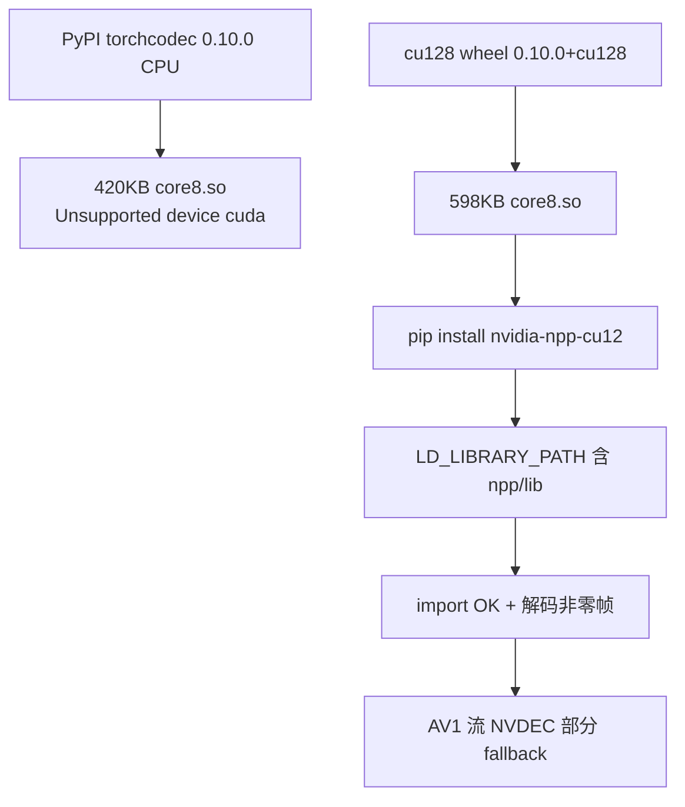
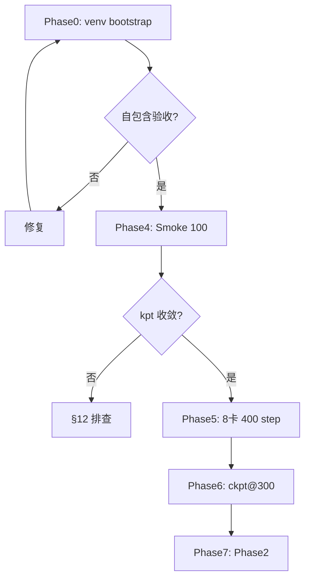

# InternVLA-A1.5 + GeoPredict 3D 轨迹融合版：Keypoint Expert 预热训练（8×H200 本机落地）

> **文档定位**: 在 [v3.4 设计手册](itrnVLA15_GeoP_3dtrj_3cn4.md) 与 [kptsim Warmup 方案](itrnVLA15_GeoP_3dtrj_3cn4_wrmup.md) 基础上，给出 **本机 8×H200** 上对 Keypoint Expert 做 Phase 1 Warmup 的完整可执行方案。
>
> **继承**: [单卡实施日志 wrmup1G_LOG](itrnVLA15_GeoP_3dtrj_3cn4_wrmup1G_LOG.md)（lrbv30 自包含数据、收敛判据）；[历史 Phase 1 LOG_p1](itrnVLA15_GeoP_3dtrj_3cn2_sft_rbt2_2LOG_p1.md)（8 卡 BS=16、400 step、checkpoint@300）。
>
> **本机约束**:
> - 虚拟环境 **`/tmp/itnvla15rbt20/`** 自包含（pip 包、权重、HF 缓存均在 venv 树内）
> - 源码 **`/tmp/SRC/InternVLA-A-series/`** 通过 `pip install -e` 链入 venv（不做 rsync 副本）
> - 数据实体 **`/tmp/rbt2stk3kptsim0811/stack_bowls_three_kptsim_lrbv30/`**（经 venv 内 symlink 注册）
> - 视频解码：**torchcodec 0.10.0+cu128 + nvidia-npp-cu12**（尽量启用 GPU 能力，见 §2）

---

## 目录

- [0. 阅读指南与本机差异](#0-阅读指南与本机差异)
- [1. venv 自包含原则与目录布局](#1-venv-自包含原则与目录布局)
- [2. torchcodec GPU 解码（最小改动）](#2-torchcodec-gpu-解码最小改动)
- [3. 本机路径常量表](#3-本机路径常量表)
- [4. Phase 0：venv Bootstrap](#4-phase-0venv-bootstrap)
- [5. Phase 1：数据注册](#5-phase-1数据注册)
- [6. Phase 2：权重下载](#6-phase-2权重下载)
- [7. Phase 3：数据验收 Layer 1/2](#7-phase-3数据验收-layer-12)
- [8. Phase 4：单卡 Smoke 100 step](#8-phase-4单卡-smoke-100-step)
- [9. Phase 5：8 卡正式 Warmup 400 step](#9-phase-58-卡正式-warmup-400-step)
- [10. Phase 6：监控与 Checkpoint 选择](#10-phase-6监控与-checkpoint-选择)
- [11. Phase 7：Phase 2 衔接](#11-phase-7phase-2-衔接)
- [12. 故障排查](#12-故障排查)
- [附录 A：torchcodec 环境修复详解](#附录-atorchcodec-环境修复详解)
- [附录 B：Launch 脚本全文](#附录-blaunch-脚本全文)
- [附录 C：自包含验收清单](#附录-c自包含验收清单)

---

## 0. 阅读指南与本机差异

### 0.1 与参考文档的关系

| 文档 | 内容 |
|:---|:---|
| [itrnVLA15_GeoP_3dtrj_3cn4_wrmup.md](itrnVLA15_GeoP_3dtrj_3cn4_wrmup.md) | kptsim 注入方案、Loss 设计、Phase 1 超参模板 |
| [itrnVLA15_GeoP_3dtrj_3cn4_wrmup1G_LOG.md](itrnVLA15_GeoP_3dtrj_3cn4_wrmup1G_LOG.md) | 单卡 Smoke 收敛曲线、lrbv30 路径约定、pyav 临时方案 |
| **本文 (wrmup8G)** | **本机 8×H200 + 自包含 venv + torchcodec cu128 + 400 step 正式 Warmup** |

### 0.2 本机 vs 参考环境

| 维度 | wrmup / 1G LOG | **本机 wrmup8G** |
|:---|:---|:---|
| GPU | 1× Blackwell Smoke / 8×H200 模板 | **8× NVIDIA H200（~140 GB/卡）** |
| venv | conda itvlaGp | **`/tmp/itnvla15rbt20`**（自包含 var/） |
| 代码 | 外部 git 路径 | **`/tmp/SRC/InternVLA-A-series`**（`pip install -e`） |
| 数据 | share 盘 lrbv30 | **`/tmp/rbt2stk3kptsim0811/.../lrbv30`** + venv symlink |
| HF/权重 | `~/.cache` 或 `/tmp/hf_home` | **`${VENV}/var/hf_home/`** |
| torchcodec | 1G 临时 pyav | **0.10.0+cu128 + nvidia-npp-cu12** |
| 训练步数 | 1G 仅 Smoke 100 | **Smoke 100 → 正式 400** |

### 0.3 Warmup 目标

Phase 1 Warmup 在 **有 3D 关键点 GT**（kptsim 体素坐标）的监督下：

1. 初始化 keypoint expert（从 action expert 拷贝）与 TrackEncoder（GeoPredict 权重）。
2. 让 kpt expert 从 `[图像 + 语言 + 历史轨迹 + state]` 预测当前/未来 3D 关键点。
3. 产出 **step 300 checkpoint**，供 Phase 2 Action+Kpt 联合微调使用。

有效 loss（`enable_vqa_loss=false`，`action_loss_only=true`）：

\[
\mathcal{L} = 2.0 \cdot \mathcal{L}_{action} + 10.0 \cdot \left(\mathcal{L}_{kpt}^{cur} + 0.2 \cdot \mathcal{L}_{kpt}^{fut}\right)
\]

其中 \(\mathcal{L}_{kpt}^{fut}\) 权重由 `kpt_future_loss_weight=2.0` 相对 `kpt_loss_weight=10.0` 给出（future 项系数 \(2/10=0.2\)）。

---

## 1. venv 自包含原则与目录布局

### 1.1 定义

激活 `/tmp/itnvla15rbt20/` 后，训练所需的 **Python 包、原生库、模型权重、HF 缓存** 均须：

- 落在 venv 树内，或
- 通过 venv 树内的 **symlink** 解析。

**不得**依赖：`$HOME/.cache/huggingface`、conda activate、`/home/a26113/SRC/...`、系统级 ffmpeg/python。

**代码**：保留在 `/tmp/SRC/InternVLA-A-series/`，通过 **`pip install -e`** 开发模式链入 venv；launch 与 `cd` 均指向该路径。

### 1.2 目录树

```
/tmp/SRC/InternVLA-A-series/          # 源码（editable），含 launch/ outputs/
/tmp/rbt2stk3kptsim0811/              # 数据集实体（只读）
  └── stack_bowls_three_kptsim_lrbv30/
/tmp/itnvla15rbt20/                   # 自包含 venv
├── bin/                              # python, pip, ffmpeg, accelerate
├── lib/                              # ffmpeg 8, libstdc++, site-packages, nvidia-*
├── var/
│   ├── hf_home/                      # HF_HOME
│   │   ├── hub/                      # Qwen3.5-2B 等
│   │   └── ckpts/
│   │       ├── InternVLA-A1.5-base/
│   │       └── GeoPredict_robocasa.pth
│   └── datasets/                     # HF_LEROBOT_HOME
│       └── stack_bowls_three_kptsim_lrbv30
│           -> /tmp/rbt2stk3kptsim0811/stack_bowls_three_kptsim_lrbv30
└── pyvenv.cfg
```

### 1.3 路径白名单

| 类别 | 路径 | 说明 |
|:---|:---|:---|
| 项目源码 | `/tmp/SRC/InternVLA-A-series/` | `pip install -e`；`PROJ_ROOT` |
| 训练数据 | `/tmp/rbt2stk3kptsim0811/.../lrbv30` | 实体；经 venv symlink 注册 |
| venv | `/tmp/itnvla15rbt20/` | 全部 pip 包、权重、HF |
| GPU 驱动 | `/usr/local/nvidia/lib64` | OS 层，`LD_LIBRARY_PATH` 白名单 |
| venv 基底 Python | `pyvenv.cfg` → `/opt/conda/bin/python` | 创建 venv 时固定 |

### 1.4 废弃路径（勿混用）

- ~~`/tmp/hf_home/`~~ → `${VENV}/var/hf_home/`
- ~~`/home/a26113/SRC/InternVLA-A-series`~~（训练/launch 不直接引用）
- ~~`HF_LEROBOT_HOME=/tmp/rbt2stk3kptsim0811`~~ → `${VENV}/var/datasets/`
- ~~rsync 代码到 venv 内副本~~

---

## 2. torchcodec GPU 解码（最小改动）

### 2.1 本机实测结论（2026-08-11）

| 组件 | 版本 / 状态 |
|:---|:---|
| torch | 2.10.0+cu128（**不可降级**） |
| torchcodec（当前） | 0.10.0 PyPI **CPU-only** wheel（`core8.so` 420 KB）→ 不支持 `device=cuda` |
| torchcodec（目标） | **0.10.0+cu128**（`core8.so` 598 KB） |
| 缺失 | **nvidia-npp-cu12**（`libnppicc.so.12`） |
| ffmpeg | 8.1.2（venv 内 `${VENV}/lib`，含 `av1_cuvid`） |
| 视频编码 | AV1 / libdav1d / 640×480 |



### 2.2 修复步骤（仅 pip，不动 torch/flash-attn）

```bash
VENV=/tmp/itnvla15rbt20

# 1. cu128 wheel（勿用 PyPI 默认源）
${VENV}/bin/pip install --force-reinstall "torchcodec==0.10.0" \
  --index-url https://download.pytorch.org/whl/cu128

# 2. NPP（cu128 NVDEC 依赖）
${VENV}/bin/pip install nvidia-npp-cu12
```

### 2.3 LD_LIBRARY_PATH（launch 每 job 导出）

```bash
VENV=/tmp/itnvla15rbt20
export LD_LIBRARY_PATH="/usr/local/nvidia/lib64:${VENV}/lib:\
${VENV}/lib/python3.11/site-packages/torch/lib:\
${VENV}/lib/python3.11/site-packages/nvidia/cuda_runtime/lib:\
${VENV}/lib/python3.11/site-packages/nvidia/cuda_nvrtc/lib:\
${VENV}/lib/python3.11/site-packages/nvidia/npp/lib:${LD_LIBRARY_PATH:-}"
```

> `${VENV}/lib` 必需：内含 ffmpeg 8 与 libstdc++，否则 `libtorchcodec_core8.so` 因 openvino CXXABI 加载失败。

### 2.4 训练配置与 GPU 利用率策略

| 策略 | 说明 |
|:---|:---|
| **`--dataset.video_backend=torchcodec`** | 正式配置；禁止 pyav |
| DataLoader worker 内 CPU 解码 | LeRobot 默认 `VideoDecoderCache` 不传 `device=cuda`；cu128 CPU 路径仍远优于 pyav |
| 8 卡算力拉满 | `action_loss_only=true` 不加载 WAN；**BS=16/GPU**（LOG_p1 ~81 GB/卡）；有效 BS=128 |
| AV1 限制 | NVDEC beta 对 libdav1d AV1 有 fallback；**不影响** cu128 作为生产 wheel 选择 |

训练前/后必查：

```bash
grep -c '\[video_decode_error\]' train.log   # 应为 0
grep -c 'using_zeros' train.log              # 应为 0
```

> `using_zeros` 表示解码静默失败、全黑帧喂 VLM——极隐蔽的数据损坏（参见 [reprd_liberop_cam_rb.md](p/reprd_liberop_cam_rb.md) #6）。

---

## 3. 本机路径常量表

实施时可在 shell 中一次性定义：

```bash
export VENV=/tmp/itnvla15rbt20
export PROJ=/tmp/SRC/InternVLA-A-series
export HF_HOME=${VENV}/var/hf_home
export HF_LEROBOT_HOME=${VENV}/var/datasets
export DATA_ROOT=${HF_LEROBOT_HOME}/stack_bowls_three_kptsim_lrbv30
export NORM_STATS=${DATA_ROOT}/norm_stat.json
export PRETRAINED_PATH=${HF_HOME}/ckpts/InternVLA-A1.5-base
export GEOPREDICT_CKPT=${HF_HOME}/ckpts/GeoPredict_robocasa.pth
```

| 用途 | 路径 |
|:---|:---|
| venv | `/tmp/itnvla15rbt20/` |
| 源码（editable） | `/tmp/SRC/InternVLA-A-series/` |
| 数据实体 | `/tmp/rbt2stk3kptsim0811/stack_bowls_three_kptsim_lrbv30/` |
| HF 缓存 + 权重 | `/tmp/itnvla15rbt20/var/hf_home/` |
| LeRobot 注册根 | `/tmp/itnvla15rbt20/var/datasets/` |
| norm_stat | `.../lrbv30/norm_stat.json` |
| Launch 脚本 | `/tmp/SRC/InternVLA-A-series/launch/internvla_a15_geop_phase1_kpt_warmup_kptsim_8g.sh` |
| 训练输出 | `/tmp/SRC/InternVLA-A-series/outputs/internvla_a1_5/<JOB_NAME>/` |

---

## 4. Phase 0：venv Bootstrap

### 4.1 确保源码路径可用

若 `/tmp/SRC/InternVLA-A-series` 尚不存在（editable metadata 已指向该路径但目录缺失）：

```bash
mkdir -p /tmp/SRC
ln -sfn /home/a26113/SRC/InternVLA-A-series /tmp/SRC/InternVLA-A-series
```

> 一次性 bootstrap；之后所有训练命令只依赖 `/tmp/SRC/`。

### 4.2 editable 安装

```bash
VENV=/tmp/itnvla15rbt20
PROJ=/tmp/SRC/InternVLA-A-series

${VENV}/bin/pip install -e "${PROJ}"
```

验证：

```bash
${VENV}/bin/pip show internvla-a1-5 | rg 'Editable|Location'
# Editable project location: /tmp/SRC/InternVLA-A-series
```

### 4.3 创建 venv 内 var/ 布局

```bash
VENV=/tmp/itnvla15rbt20
mkdir -p ${VENV}/var/hf_home/ckpts
mkdir -p ${VENV}/var/datasets
ln -sfn /tmp/rbt2stk3kptsim0811/stack_bowls_three_kptsim_lrbv30 \
  ${VENV}/var/datasets/stack_bowls_three_kptsim_lrbv30
```

### 4.4 torchcodec cu128 + NPP

见 [§2.2](#22-修复步骤仅-pip不动-torchflash-attn)。

### 4.5 Transformers Qwen3.5 patch

```bash
VENV=/tmp/itnvla15rbt20
PROJ=/tmp/SRC/InternVLA-A-series
TRANSFORMERS_DIR=${VENV}/lib/python3.11/site-packages/transformers/

if [[ ! -f "${TRANSFORMERS_DIR}/models/qwen3_5/modeling_qwen3_5.py" ]]; then
  cp -r ${PROJ}/src/lerobot/policies/pi0/transformers_replace/models ${TRANSFORMERS_DIR}
  cp -r ${PROJ}/src/lerobot/policies/pi05/transformers_replace/models ${TRANSFORMERS_DIR}
  cp -r ${PROJ}/src/lerobot/policies/internvla_a1_5/transformers_replace/models ${TRANSFORMERS_DIR}
fi
```

### 4.6 自包含验收

见 [附录 C](#附录-c自包含验收清单)。**未通过不得进入 Phase 4/5。**

---

## 5. Phase 1：数据注册

数据已就绪（v3.0、voxel、`observation.keypoint_3d [42]`），**无需**再运行 `inject_kptsim_keypoints.py`。

LeRobot 路径约定（沿用 [wrmup1G_LOG §6.3](itrnVLA15_GeoP_3dtrj_3cn4_wrmup1G_LOG.md)）：

- `HF_LEROBOT_HOME` = venv 内 datasets 父目录
- `repo_id` = 目录名 `stack_bowls_three_kptsim_lrbv30`

```bash
export HF_LEROBOT_HOME=/tmp/itnvla15rbt20/var/datasets
# 训练 CLI: --dataset.repo_id=stack_bowls_three_kptsim_lrbv30
```

> **勿**使用 `--dataset.root` 直接指数据目录：`factory.py` 的 `find_info_json_path_for_repo` 会拼 `root/repo_id/meta/info.json`，与 `LeRobotDataset(root=数据根)` 语义不一致。

---

## 6. Phase 2：权重下载

全部下载到 venv 内，**禁止**写入 `$HOME/.cache` 或外部 `/tmp/hf_home`。

```bash
VENV=/tmp/itnvla15rbt20
export HF_HOME=${VENV}/var/hf_home
CKPT_DIR=${HF_HOME}/ckpts
mkdir -p "${CKPT_DIR}"

${VENV}/bin/python <<'PY'
import os
from huggingface_hub import hf_hub_download, snapshot_download

hf_home = os.environ["HF_HOME"]
ckpt_dir = os.path.join(hf_home, "ckpts")

hf_hub_download(
    "Jingjing0601/GeoPredict-Robocasa",
    "GeoPredict_robocasa.pth",
    local_dir=ckpt_dir,
)
snapshot_download(
    "InternRobotics/InternVLA-A1.5-base",
    local_dir=os.path.join(ckpt_dir, "InternVLA-A1.5-base"),
)
snapshot_download(
    "Qwen/Qwen3.5-2B",
    cache_dir=os.path.join(hf_home, "hub"),
)
print("done:", ckpt_dir)
PY
```

验收：

```bash
test -f ${HF_HOME}/ckpts/GeoPredict_robocasa.pth
test -f ${HF_HOME}/ckpts/InternVLA-A1.5-base/model.safetensors
ls ${HF_HOME}/hub/models--Qwen--Qwen3.5-2B/snapshots/
```

---

## 7. Phase 3：数据验收 Layer 1/2

### 7.1 Layer 1 静态检查（6 项）

对 `${DATA_ROOT}` 执行（参见 [wrmup.md §14.2](itrnVLA15_GeoP_3dtrj_3cn4_wrmup.md)）：

| # | 检查 | 预期 |
|:---:|:---|:---|
| 1 | `meta/info.json` 声明 `observation.keypoint_3d` float32 [42]、`keypoint_coord_mode=voxel` | PASS |
| 2 | 50 ep 行数与 keypoints 对齐 | PASS |
| 3 | XYZ 在 `[0,1.6]³` | PASS |
| 4 | `norm_stat.json` 键名 `observation.state` / `action` | PASS |
| 5 | `meta/keypoints_meta.json` K=14 | PASS |
| 6 | 原列完整 state dim=14 | PASS |

### 7.2 Layer 2 Dataset 加载

```bash
VENV=/tmp/itnvla15rbt20
export HF_LEROBOT_HOME=${VENV}/var/datasets
export LD_LIBRARY_PATH="..."  # 见 §2.3

${VENV}/bin/python <<'PY'
from lerobot.datasets.lerobot_dataset import LeRobotDataset
ds = LeRobotDataset(repo_id="stack_bowls_three_kptsim_lrbv30",
                    root="/tmp/itnvla15rbt20/var/datasets/stack_bowls_three_kptsim_lrbv30")
row = ds[0]
print("episodes", ds.num_episodes, "frames", ds.num_frames)
print("keypoint_3d", row["observation.keypoint_3d"].shape)
PY
```

预期：`keypoint_3d torch.Size([42])`。

---

## 8. Phase 4：单卡 Smoke 100 step

### 8.1 目的

在 8 卡正式训练前，确认 kpt loss 接入且收敛趋势正常。

### 8.2 命令

```bash
cd /tmp/SRC/InternVLA-A-series
SMOKE=1 LOG_FILE=/tmp/smoke_kptsim_8g_100step.log \
  bash launch/internvla_a15_geop_phase1_kpt_warmup_kptsim_8g.sh
```

等价手动命令要点：

- `CUDA_VISIBLE_DEVICES=0`，`--num_processes=1`
- `batch_size=2`，`steps=100`
- `--dataset.video_backend=torchcodec`
- `--wandb.enable=false`

### 8.3 收敛判据（继承 wrmup1G_LOG）

| 判据 | 预期 |
|:---|:---|
| 初始化 | `loaded 26 keys` from GeoPredict TrackEncoder |
| step 10 `loss_kpt_current` | **> 0** |
| step 50–100 `loss_kpt_current` | 明显低于 step 10（参考：0.4 → 0.01 量级） |
| `video_decode_error` / `using_zeros` | **均为 0** |
| exit code | 0，无 NaN/OOM |

参考曲线（1G LOG，Pinocchio/FK 数据不同但数量级可参考）：

| Step | loss_kpt_cur | loss_kpt_fut |
|:---:|:---:|:---:|
| 10 | 0.40 | 0.51 |
| 50 | 0.015 | 0.07 |
| 100 | 0.004 | 0.038 |

---

## 9. Phase 5：8 卡正式 Warmup 400 step

### 9.1 超参表

| 参数 | 值 | 依据 |
|:---|:---:|:---|
| GPU / 进程 | 8 / 8 | 用满 H200 |
| `batch_size` / GPU | **16** | LOG_p1 H200 验证；OOM→12→8 |
| 有效 batch | 128 | 23550/128 ≈ 184 step/epoch |
| `steps` | **400** | kpt 200–300 步饱和 |
| `num_workers` | **12**/进程 | 224 CPU 核 |
| `save_freq` / `log_freq` | 100 / 10 | |
| `train_expert_only` | true | VLM 冻结 |
| `action_loss_only` | true | 不加载 WAN |
| `enable_vqa_loss` | false | |
| `action_loss_weight` | 2.0 | wrmup kptsim |
| `kpt_loss_weight` | 10.0 | |
| `kpt_future_loss_weight` | 2.0 | |
| `action_expert_lr_scale` | 0.04 | 保护 action |
| `optimizer_lr` | 5e-5 | |
| `scheduler_warmup_steps` | 50 | |
| `scheduler_decay_steps` | 400 | |
| `init_kpt_expert_from_action` | true | |
| `geopredict_checkpoint_path` | 设置 | Phase 2 下载路径 |
| `dataset.video_backend` | **torchcodec** | |

### 9.2 启动

```bash
cd /tmp/SRC/InternVLA-A-series
LOG_FILE=/tmp/warmup_kptsim_8g_400step.log \
  bash launch/internvla_a15_geop_phase1_kpt_warmup_kptsim_8g.sh
```

墙钟预期：LOG_p1 约 **7 分钟**（含加载 + 400 step + 4 次 checkpoint）。

### 9.3 执行流程



---

## 10. Phase 6：监控与 Checkpoint 选择

### 10.1 WandB Keys（offline）

| Key | 含义 |
|:---|:---|
| `loss` | 总 loss |
| `loss_action` | Flow matching action |
| `loss_kpt_current` | 当前帧 kpt MSE |
| `loss_kpt_future` | 未来轨迹 kpt MSE |
| `grad_norm` | 梯度范数 |

### 10.2 参考收敛（LOG_p1，8×H200 FK 数据）

| Step | loss_kpt_cur | loss_kpt_fut | loss_action |
|:---:|:---:|:---:|:---:|
| 10 | 0.544 | 0.534 | 0.277 |
| 100 | 0.003 | 0.017 | 0.118 |
| 200 | 0.001 | 0.005 | 0.103 |
| **300** | **0.001** | **0.004** | **0.095** |
| 400 | 0.001 | 0.003 | 0.089 |

### 10.3 推荐 Checkpoint：**step 300**

理由（与 [LOG_p1](itrnVLA15_GeoP_3dtrj_3cn2_sft_rbt2_2LOG_p1.md) 相同）：

1. kpt loss 已饱和（200→300 降幅 < 0.0002）。
2. LR 尚未触底，Phase 2 重新 warmup 更稳。
3. ~1.6 epoch，避免小数据集过拟合。

输出路径：

```
/tmp/SRC/InternVLA-A-series/outputs/internvla_a1_5/<JOB_NAME>/checkpoints/000300/pretrained_model
```

---

## 11. Phase 7：Phase 2 衔接

Warmup 完成后进入 Action + Kpt 联合微调（参见 [launch/internvla_a15_geop_phase2_finetune_stackb3_080719.sh](../launch/internvla_a15_geop_phase2_finetune_stackb3_080719.sh)）。

### 11.1 三大安全检查

| # | 配置 | Warmup | Phase 2 |
|:---:|:---|:---:|:---:|
| 1 | `pretrained_path` | InternVLA-A1.5-base | **Warmup ckpt@300** |
| 2 | `init_kpt_expert_from_action` | **true** | **false** |
| 3 | `geopredict_checkpoint_path` | 设置 GeoPredict | **不设** |

### 11.2 推理对齐

Warmup 使用 **体素坐标**（方案 A），部署前须对齐 RoboTwin 运行时关键点提取（参见 [wrmup.md §10](itrnVLA15_GeoP_3dtrj_3cn4_wrmup.md)）。

---

## 12. 故障排查

| 现象 | 可能原因 | 对策 |
|:---|:---|:---|
| `import torchcodec` 失败 / CXXABI | 缺 `${VENV}/lib` 在 LD_LIBRARY_PATH | §2.3 |
| `libnppicc.so.12 not found` | 未装 nvidia-npp-cu12 | §2.2 |
| `loss_kpt_current` 恒为 0 | 无 keypoint 列 / flag 未开 | 检查注入、三处 `enable_keypoint_predictor` |
| 日志大量 `video_decode_error` | torchcodec CPU wheel 或 LD 错误 | §2；禁止静默 pyav 长训 |
| OOM @ BS=16 | 偶发 | 降至 12 或 8 |
| editable 找不到源码 | `/tmp/SRC` 缺失 | §4.1 symlink |
| 隐式访问 `$HOME/.cache` | HF_HOME 未 export | §3 路径常量 |
| TrackEncoder 0 keys | GeoPredict 路径错 | 检查 `var/hf_home/ckpts/` |

---

## 附录 A：torchcodec 环境修复详解

### A.1 cu128 vs PyPI wheel

| 变体 | core8.so 大小 | CUDA API | 训练 backend |
|:---|:---:|:---:|:---|
| PyPI 默认 0.10.0 | 420 KB | ❌ | 仅 CPU ffmpeg |
| **0.10.0+cu128** | 598 KB | ✅ | torchcodec（推荐） |

官方兼容：torch 2.10 ↔ torchcodec 0.10（[torchcodec README](https://github.com/meta-pytorch/torchcodec?tab=readme-ov-file#installing-torchcodec)）。

### A.2 验证脚本

```bash
VENV=/tmp/itnvla15rbt20
export LD_LIBRARY_PATH="..."  # §2.3
VIDEO=/tmp/rbt2stk3kptsim0811/stack_bowls_three_kptsim_lrbv30/videos/observation.images.cam_high/chunk-000/file-000.mp4

${VENV}/bin/python <<'PY'
import torchcodec
from torchcodec.decoders import VideoDecoder
print("version:", torchcodec.__version__)
p = "/tmp/rbt2stk3kptsim0811/stack_bowls_three_kptsim_lrbv30/videos/observation.images.cam_high/chunk-000/file-000.mp4"
d = VideoDecoder(p)
f = d.get_frames_played_at(seconds=[0.0, 1.0])
print("CPU decode:", f.data.shape, float(f.data.float().mean()))
PY
```

`mean >> 0` 表示非全黑帧。

### A.3 ldd 诊断

```bash
ldd ${VENV}/lib/python3.11/site-packages/torchcodec/libtorchcodec_core8.so | rg "not found"
```

应无 `not found`（在正确 LD_LIBRARY_PATH 下）。

---

## 附录 B：Launch 脚本全文

保存为 [`launch/internvla_a15_geop_phase1_kpt_warmup_kptsim_8g.sh`](../launch/internvla_a15_geop_phase1_kpt_warmup_kptsim_8g.sh)（`/tmp/SRC/InternVLA-A-series/launch/` 下，与 editable 源码同目录）：

```bash
#!/usr/bin/env bash
set -euo pipefail

###############################################################################
# Phase 1 Kpt Expert Warmup — kptsim voxel GT, 8×H200
# venv:  /tmp/itnvla15rbt20/
# code:  /tmp/SRC/InternVLA-A-series/
# doc:   b/d/itrnVLA15_GeoP_3dtrj_3cn4_wrmup8G.md
#
# SMOKE=1  → 1 GPU, 100 step, batch=2
# default  → 8 GPU, 400 step, batch=16
###############################################################################

VENV_ROOT="${VENV_ROOT:-/tmp/itnvla15rbt20}"
PROJ_ROOT="${PROJ_ROOT:-/tmp/SRC/InternVLA-A-series}"
PYTHON="${PYTHON:-${VENV_ROOT}/bin/python}"

export HF_HOME="${HF_HOME:-${VENV_ROOT}/var/hf_home}"
export HF_LEROBOT_HOME="${HF_LEROBOT_HOME:-${VENV_ROOT}/var/datasets}"
export WANDB_MODE="${WANDB_MODE:-offline}"
export USE_LIBUV="${USE_LIBUV:-0}"
export PYTHONUNBUFFERED=1
export OMP_NUM_THREADS="${OMP_NUM_THREADS:-1}"
export MKL_NUM_THREADS="${MKL_NUM_THREADS:-1}"
export TOKENIZERS_PARALLELISM=false

export LD_LIBRARY_PATH="/usr/local/nvidia/lib64:${VENV_ROOT}/lib:\
${VENV_ROOT}/lib/python3.11/site-packages/torch/lib:\
${VENV_ROOT}/lib/python3.11/site-packages/nvidia/cuda_runtime/lib:\
${VENV_ROOT}/lib/python3.11/site-packages/nvidia/cuda_nvrtc/lib:\
${VENV_ROOT}/lib/python3.11/site-packages/nvidia/npp/lib:${LD_LIBRARY_PATH:-}"

export MASTER_ADDR="${MASTER_ADDR:-127.0.0.1}"
export MASTER_PORT="${MASTER_PORT:-36201}"

SMOKE="${SMOKE:-0}"
if [[ "${SMOKE}" == "1" ]]; then
  export CUDA_VISIBLE_DEVICES="${CUDA_VISIBLE_DEVICES:-0}"
  PROC_PER_NODE="${PROC_PER_NODE:-1}"
  BATCH_SIZE="${BATCH_SIZE:-2}"
  STEPS="${STEPS:-100}"
  NUM_WORKERS="${NUM_WORKERS:-4}"
  SAVE_FREQ="${SAVE_FREQ:-100}"
  LOG_FREQ="${LOG_FREQ:-10}"
  WANDB_ENABLE="${WANDB_ENABLE:-false}"
  JOB_SUFFIX="smoke100-kptsim-voxel"
else
  export CUDA_VISIBLE_DEVICES="${CUDA_VISIBLE_DEVICES:-0,1,2,3,4,5,6,7}"
  PROC_PER_NODE="${PROC_PER_NODE:-8}"
  BATCH_SIZE="${BATCH_SIZE:-16}"
  STEPS="${STEPS:-400}"
  NUM_WORKERS="${NUM_WORKERS:-12}"
  SAVE_FREQ="${SAVE_FREQ:-100}"
  LOG_FREQ="${LOG_FREQ:-10}"
  WANDB_ENABLE="${WANDB_ENABLE:-true}"
  JOB_SUFFIX="geop-phase1-kpt-warmup-kptsim-voxel-8g"
fi

NODE_COUNT="${NODE_COUNT:-1}"
NODE_RANK="${NODE_RANK:-0}"
NUM_PROCESSES=$((NODE_COUNT * PROC_PER_NODE))

POLICY="internvla_a1_5"
DATA_REPO_ID="stack_bowls_three_kptsim_lrbv30"
NORM_STATS="${NORM_STATS:-${HF_LEROBOT_HOME}/${DATA_REPO_ID}/norm_stat.json}"
PRETRAINED_PATH="${PRETRAINED_PATH:-${HF_HOME}/ckpts/InternVLA-A1.5-base}"
GEOPREDICT_CKPT="${GEOPREDICT_CKPT:-${HF_HOME}/ckpts/GeoPredict_robocasa.pth}"

cd "${PROJ_ROOT}"

JOB_NAME="${JOB_NAME:-$(date +'%Y_%m_%d_%H_%M_%S')-${POLICY}-${JOB_SUFFIX}}"
OUTPUT_DIR="${OUTPUT_DIR:-${PROJ_ROOT}/outputs/${POLICY}/${JOB_NAME}}"
LOG_FILE="${LOG_FILE:-${OUTPUT_DIR}.log}"

echo "VENV_ROOT=${VENV_ROOT} PROJ_ROOT=${PROJ_ROOT}"
echo "HF_HOME=${HF_HOME} HF_LEROBOT_HOME=${HF_LEROBOT_HOME}"
echo "SMOKE=${SMOKE} PROC=${NUM_PROCESSES} BS=${BATCH_SIZE} STEPS=${STEPS}"

LAUNCH_ARGS=()
if [[ "${NUM_PROCESSES}" -gt 1 ]]; then
  LAUNCH_ARGS+=(--multi_gpu)
fi
LAUNCH_ARGS+=(
  --num_processes="${NUM_PROCESSES}"
  --num_machines="${NODE_COUNT}"
  --machine_rank="${NODE_RANK}"
  --main_process_ip="${MASTER_ADDR}"
  --main_process_port="${MASTER_PORT}"
)

ARGS=(
  "${LAUNCH_ARGS[@]}"
  src/lerobot/scripts/lerobot_train.py
  --output_dir="${OUTPUT_DIR}" --job_name="${JOB_NAME}" --num_workers="${NUM_WORKERS}"
  --policy.type="${POLICY}" --policy.repo_id=lerobot_lab/"${POLICY}"
  --policy.push_to_hub=false --policy.pretrained_path="${PRETRAINED_PATH}"
  --policy.dtype=bfloat16 --policy.optimizer_lr=5e-5
  --policy.scheduler_warmup_steps=50 --policy.scheduler_decay_steps="${STEPS}"
  --policy.scheduler_decay_lr=5e-6 --policy.vlm_model_name_or_path=Qwen/Qwen3.5-2B
  --policy.enable_vqa_loss=false --policy.tokenize_state=true
  --policy.video_loss_weight=1 --policy.freeze_learnable_tokens=true
  --policy.num_learnable_tokens=50 --policy.train_expert_only=true
  --policy.enable_keypoint_predictor=true --policy.num_keypoint_joints=14
  --policy.action_loss_weight=2.0 --policy.kpt_loss_weight=10.0
  --policy.kpt_future_loss_weight=2.0
  --policy.knowledge_insulation=true --policy.knowledge_insulation_kpt=true
  --policy.kpt_to_action_detach=false --policy.freeze_keypoint_modules=false
  --policy.action_expert_lr_scale=0.04 --policy.kpt_expert_lr_scale=1.0
  --policy.track_encoder_lr_scale=1.0 --policy.init_kpt_expert_from_action=true
  --policy.action_loss_only=true --policy.geopredict_checkpoint_path="${GEOPREDICT_CKPT}"
  --dataset.type="${POLICY}" --dataset.repo_id="${DATA_REPO_ID}"
  --dataset.enable_keypoint_predictor=true --dataset.num_keypoint_joints=14
  --dataset.action_mode=abs --dataset.tokenize_state=true
  --dataset.use_fast_action_tokens=true --dataset.use_external_stats=true
  --dataset.external_stats_path="${NORM_STATS}" --dataset.video_backend=torchcodec
  --seed=42 --batch_size="${BATCH_SIZE}" --steps="${STEPS}"
  --save_freq="${SAVE_FREQ}" --log_freq="${LOG_FREQ}"
  --wandb.enable="${WANDB_ENABLE}" --wandb.project="${POLICY}" --wandb.mode=offline
)

mkdir -p "$(dirname "${LOG_FILE}")"
"${PYTHON}" -m accelerate.commands.launch "${ARGS[@]}" 2>&1 | tee "${LOG_FILE}"
decode_err=$(grep -c '\[video_decode_error\]' "${LOG_FILE}" || true)
zero_frames=$(grep -c 'using_zeros' "${LOG_FILE}" || true)
echo "post_check: video_decode_error=${decode_err} using_zeros=${zero_frames}"
```

安装可执行权限：

```bash
chmod +x /tmp/SRC/InternVLA-A-series/launch/internvla_a15_geop_phase1_kpt_warmup_kptsim_8g.sh
```

---

## 附录 C：自包含验收清单

### C.1 一键检查

```bash
VENV=/tmp/itnvla15rbt20
PROJ=/tmp/SRC/InternVLA-A-series
export HF_HOME=${VENV}/var/hf_home
export HF_LEROBOT_HOME=${VENV}/var/datasets
export LD_LIBRARY_PATH="/usr/local/nvidia/lib64:${VENV}/lib:\
${VENV}/lib/python3.11/site-packages/torch/lib:\
${VENV}/lib/python3.11/site-packages/nvidia/cuda_runtime/lib:\
${VENV}/lib/python3.11/site-packages/nvidia/cuda_nvrtc/lib:\
${VENV}/lib/python3.11/site-packages/nvidia/npp/lib"

${VENV}/bin/python <<PY
import importlib.metadata as im
from pathlib import Path
import torchcodec, flash_attn, transformers, lerobot

# 1. editable 指向 /tmp/SRC
dist = im.distribution("internvla-a1-5")
url = dist.read_text("direct_url.json")
assert "/tmp/SRC/InternVLA-A-series" in url, url

# 2. 源码入口
assert Path("${PROJ}/src/lerobot/scripts/lerobot_train.py").exists()

# 3. venv 内权重（Phase 2 完成后）
assert Path("${VENV}/var/hf_home/ckpts/InternVLA-A1.5-base").exists()
assert Path("${VENV}/var/hf_home/ckpts/GeoPredict_robocasa.pth").exists()

# 4. 数据 symlink
data = Path("${VENV}/var/datasets/stack_bowls_three_kptsim_lrbv30")
assert data.is_symlink() and data.resolve().is_dir()

# 5. torchcodec cu128
v = torchcodec.__version__
assert "cu128" in v or "+cu128" in v or v.startswith("0.10"), v

# 6. transformers patch
assert Path("${VENV}/lib/python3.11/site-packages/transformers/models/qwen3_5/modeling_qwen3_5.py").exists()

print("SELF_CONTAINED OK")
PY
```

### C.2 Checklist

| # | 项 | 命令/路径 |
|:---:|:---|:---|
| 1 | venv python | `/tmp/itnvla15rbt20/bin/python -c "import torch; print(torch.cuda.device_count())"` → 8 |
| 2 | editable | `pip show internvla-a1-5` → `/tmp/SRC/...` |
| 3 | HF_HOME | `echo $HF_HOME` → `.../var/hf_home` |
| 4 | 数据 symlink | `ls -la .../var/datasets/stack_bowls_three_kptsim_lrbv30` |
| 5 | torchcodec | `import torchcodec` OK；版本含 cu128 |
| 6 | npp | `ls .../nvidia/npp/lib/libnppicc.so.12` |
| 7 | 无 HOME 缓存 | `unset HF_HOME` 后仅 `${VENV}/var/hf_home` 可加载 Qwen |

---

## 参考文献

| 来源 | 内容 |
|:---|:---|
| [InternVLA-A1.5 论文](https://arxiv.org/abs/2607.04988) | VLA 基座 |
| [GeoPredict 论文](https://arxiv.org/abs/2512.16811) | TrackEncoder |
| [itrnVLA15_GeoP_3dtrj_3cn4.md](itrnVLA15_GeoP_3dtrj_3cn4.md) | 三路径 MoT v3.4 |
| [itrnVLA15_GeoP_3dtrj_3cn4_wrmup.md](itrnVLA15_GeoP_3dtrj_3cn4_wrmup.md) | kptsim Warmup 方案 |
| [itrnVLA15_GeoP_3dtrj_3cn4_wrmup1G_LOG.md](itrnVLA15_GeoP_3dtrj_3cn4_wrmup1G_LOG.md) | 单卡 Smoke 日志 |
| [itrnVLA15_GeoP_3dtrj_3cn2_sft_rbt2_2LOG_p1.md](itrnVLA15_GeoP_3dtrj_3cn2_sft_rbt2_2LOG_p1.md) | 8 卡 Phase 1 曲线 |
| [torchcodec 兼容表](https://github.com/meta-pytorch/torchcodec?tab=readme-ov-file#installing-torchcodec) | 0.10 ↔ torch 2.10 |

---

*文档版本: wrmup8G-v1.0 | 撰写日: 2026-08-11 | 本机: 8×H200, venv `/tmp/itnvla15rbt20`, 代码 `/tmp/SRC/InternVLA-A-series`*
