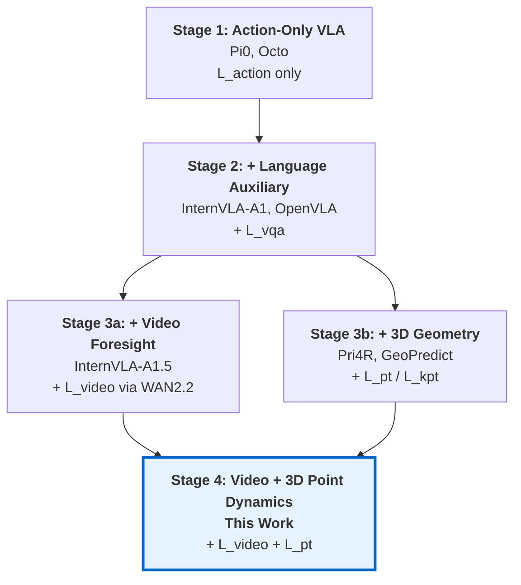
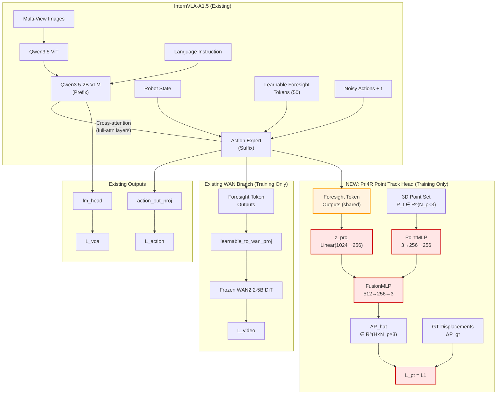
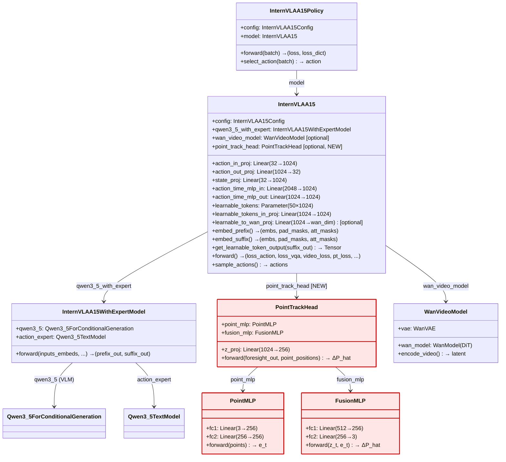
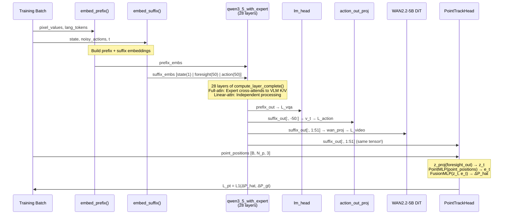
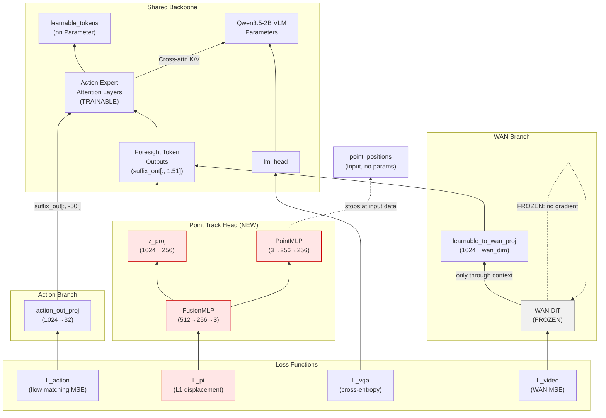
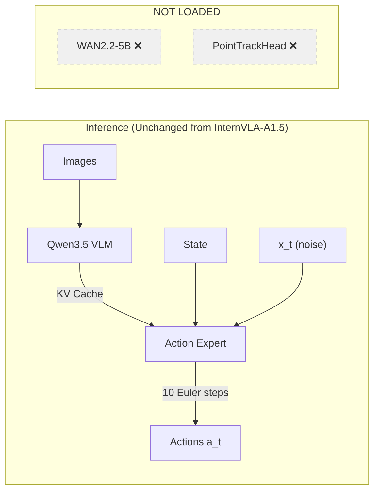

# InternVLA-A1.5 + Pri4R 3D Point Trajectory Supervision: Integration Design and Implementation

> **Target**: Integrate Pri4R's privileged 3D point trajectory supervision (PointMLP + FusionMLP) into InternVLA-A1.5, providing explicit 3D world dynamics awareness as a training-time auxiliary signal, with zero inference overhead, to improve robot manipulation success rates.

---

## Table of Contents

1. [Motivation and Background](#1-motivation-and-background)
2. [Complementarity Analysis: Why Pri4R × InternVLA-A1.5](#2-complementarity-analysis-why-pri4r--internvla-a15)
3. [Architecture Overview](#3-architecture-overview)
4. [Module Design](#4-module-design)
5. [Training Forward Pass](#5-training-forward-pass)
6. [Loss Formulation](#6-loss-formulation)
7. [Backward Pass and Gradient Flow](#7-backward-pass-and-gradient-flow)
8. [Inference Path](#8-inference-path)
9. [Training Strategy and Freeze Schedule](#9-training-strategy-and-freeze-schedule)
10. [Data Pipeline](#10-data-pipeline)
11. [Configuration Changes](#11-configuration-changes)
12. [Code Modification Guide](#12-code-modification-guide)
13. [Success Rate Improvement Analysis](#13-success-rate-improvement-analysis)
14. [Alternative Approaches and Trade-offs](#14-alternative-approaches-and-trade-offs)
15. [Verification and Testing Plan](#15-verification-and-testing-plan)
16. [References](#16-references)

---

## 1. Motivation and Background

### 1.1 The Problem: Insufficient 3D Geometric Grounding

InternVLA-A1.5 ([Zhu et al., 2025](https://arxiv.org/abs/2607.04988)) achieves state-of-the-art VLA performance through its Mixture-of-Transformers (MoT) architecture, flow matching action generation, and latent video foresight via WAN2.2-5B. However, its internal representations remain primarily grounded in 2D visual features. The WAN video foresight mechanism captures **scene-level visual dynamics** (what the scene looks like in the future) but lacks explicit **3D geometric dynamics** (how objects and the robot physically move through metric space).

This limitation manifests in specific failure modes:

1. **Kinematic perturbation vulnerability**: On LIBERO-Plus Robot perturbation, InternVLA-A1.5 achieves only 55.1% vs $\pi_{0.5}$'s 73.6% (Table 6 in paper), suggesting the model's visual foresight does not sufficiently encode robot kinematic awareness.
2. **Long-horizon drift**: Multi-step tasks require sustained understanding of 3D spatial relationships — where objects are and how they move — which 2D video latents encode implicitly but imprecisely.
3. **Contact reasoning**: Predicting the physical consequences of contact (drawer opening angle, door rotation, object displacement) requires metric 3D understanding.

### 1.2 Pri4R's Key Insight

Pri4R ([Kim et al., 2025](https://arxiv.org/abs/2603.01549v2)) introduces **privileged 3D point trajectory supervision**: during training, a lightweight auxiliary head predicts the future 3D displacements of tracked scene surface points. The key contributions relevant to our integration:

- **PointMLP**: A simple per-point MLP encoder ($\mathbb{R}^{N_p \times 3} \to \mathbb{R}^{N_p \times d}$) that preserves per-point identity. Ablation shows replacing it with PointNet (global pooling) causes -8.4% success rate drop because pooling destroys point identity information critical for per-point displacement prediction ([Table VI in Pri4R](https://arxiv.org/html/2603.01549v2)).
- **FusionMLP**: A broadcast-concatenate-MLP that fuses VLM embeddings $z_t \in \mathbb{R}^{H \times d}$ with point features $e_t \in \mathbb{R}^{N_p \times d}$ to predict displacements $\Delta\hat{P} \in \mathbb{R}^{H \times N_p \times 3}$.
- **Privileged information paradigm**: 3D point trajectories are only available during training (from simulation meshes or SpatialTrackerV2 pseudo-labels). At inference, the entire point track head is discarded — **zero overhead**.
- **Representation enrichment mechanism**: The point track loss's gradients flow back through the shared VLM backbone, forcing it to encode world dynamics in its representation space. The action head then benefits from these enriched representations without ever seeing point data.

### 1.3 Quantitative Evidence from Pri4R

Pri4R demonstrates consistent improvements across three VLA backbones (from [Section 4 of Pri4R paper](https://arxiv.org/html/2603.01549v2)):

| Benchmark | Backbone | Baseline | + Pri4R | Gain |
|---|---|---|---|---|
| LIBERO Average | OpenVLA-OFT | 92.7 | 96.3 | +3.6 |
| LIBERO-Long | OpenVLA-OFT | 85.5 | 95.3 | **+9.8** |
| RoboCasa Average | OpenVLA-OFT | 33.1 | 46.3 | **+13.2** |
| RoboCasa Average | $\pi_{0.5}$ | 52.9 | 57.0 | +4.1 |

Notably, the largest gains appear on long-horizon tasks (LIBERO-Long) and challenging manipulation tasks (RoboCasa), exactly where 3D geometric understanding matters most.

---

## 2. Complementarity Analysis: Why Pri4R × InternVLA-A1.5

### 2.1 What Each System Predicts About the Future

| Dimension | InternVLA-A1.5 (WAN Video Foresight) | Pri4R (3D Point Trajectories) |
|---|---|---|
| **Prediction space** | Image latent $\mathbb{R}^{C \times T' \times H' \times W'}$ | Metric 3D $\mathbb{R}^{H \times N_p \times 3}$ |
| **Spatial density** | Dense (all pixels) | Sparse (1024 points) |
| **Temporal density** | Sparse (4 keyframes) | Dense (every timestep) |
| **Information type** | Scene appearance (what it looks like) | Scene geometry (where things are and move) |
| **Strong for** | Visual perturbation robustness, appearance-based planning | Contact reasoning, kinematic consistency, collision avoidance |
| **Weak for** | Kinematic perturbations (55.1% on LIBERO-Plus Robot) | Purely visual tasks (no pixel-level supervision) |
| **Supervision source** | Frozen WAN2.2-5B DiT (internet video pretrained) | Ground truth 3D positions (simulation or depth cameras) |

The two prediction modalities are **complementary**: video foresight captures *scene-level visual dynamics* while point trajectories capture *metric 3D geometric dynamics*. Their weaknesses don't overlap.

### 2.2 Evolution of Auxiliary Supervision in VLA



This integration represents the convergence of two parallel evolution paths. The resulting model receives supervision at **four abstraction levels**:

| Level | Loss | What it teaches |
|---|---|---|
| Token | $L_\text{vqa}$ (cross-entropy) | Language grounding, compositional understanding |
| Scene | $L_\text{video}$ (flow matching MSE) | Future visual appearance, scene dynamics |
| Geometry | $L_\text{pt}$ (L1 displacement) | 3D world dynamics, metric spatial reasoning |
| Action | $L_\text{action}$ (flow matching MSE) | Continuous motor control |

### 2.3 Why Point Trajectories Are the Best Geometric Supervision Signal

Pri4R's systematic ablation ([Table III in paper](https://arxiv.org/html/2603.01549v2)) compares different geometric supervision signals on RoboCasa with OpenVLA-OFT:

| Supervision Signal | Success Rate | $\Delta$ | Properties |
|---|---|---|---|
| Baseline (none) | 33.1 | — | — |
| Goal point set | 33.8 | +0.7 | temporally sparse, 3D, spatially sparse |
| 2D point track | 37.0 | +3.9 | temporally dense, 2D only, spatially sparse |
| Depth map | 42.3 | +8.3 | temporally dense, 3D, spatially redundant |
| **3D point track (Pri4R)** | **46.3** | **+13.2** | temporally dense, 3D, spatially sparse |

3D point tracks uniquely combine all three desirable properties:
- **Temporal density**: per-step prediction, not just goal state
- **Metric 3D geometry**: in the same coordinate frame as robot actions
- **Spatial sparsity**: 1024 points vs millions of pixels, efficient gradient signal

Critically, 3D point displacements ($\Delta P \in \mathbb{R}^{H \times N_p \times 3}$) are in the **same metric space** as robot actions (both are 3D displacements measured in meters per timestep), creating a natural alignment that makes $\omega_{pt} = 1.0$ an optimal balance point without careful tuning.

### 2.4 What to Track: Robot + Scene Points

From the same ablation in Pri4R:

| Points tracked | $\Delta$ Success Rate |
|---|---|
| Only scene points | +2.1 |
| Only robot points | +10.7 |
| Both (Pri4R) | +13.2 |

Tracking robot body points provides the dominant signal (+10.7 alone), but adding scene points provides an additional +2.5 through interaction dynamics. Our integration uses **both robot and scene surface points** following Pri4R's design.

---

## 3. Architecture Overview

### 3.1 High-Level Fusion Architecture



**Key design decision**: The point track head taps into the **same foresight token outputs** as the WAN video branch. This is intentional — both auxiliary tasks supervise the same concept (future world dynamics) from different perspectives (2D visual vs 3D geometric), sharing the representation forces the model to learn a unified, richer world model.

### 3.2 Suffix Token Structure (Unchanged)

The suffix token sequence remains identical to standard InternVLA-A1.5:

```
[state(1)] [learnable_foresight(50)] [action_time(50)]
```

No new tokens are added to the prefix or suffix. The point track head operates **entirely on the outputs** of the existing suffix tokens — it is a read-only consumer of foresight token representations, not a new input channel.

### 3.3 Attention Mask (Unchanged)

The attention mask pattern in the suffix is unchanged:

| Block | Attends to |
|---|---|
| `state(1)` | Prefix (VLM context), itself |
| `learnable(50)` | Prefix, state, each other |
| `action_time(50)` | Prefix, state, learnable, each other |

The point track head operates post-attention, on the final hidden states, so no mask modifications are needed.

### 3.4 Static Architecture: Class Diagram

The following class diagram shows how the new `PointTrackHead` integrates into the existing InternVLA-A1.5 class hierarchy. Red classes are new additions; all others are existing.



**Key relationships**:
- `InternVLAA15` conditionally owns `PointTrackHead` (only when `config.enable_point_track=True`), just as it conditionally owns `WanVideoModel` (only when `config.action_loss_only=False`). See `__init__()` at line 541 of `modeling_internvla_a1_5.py`.
- `PointTrackHead` is a self-contained module with no dependency on `WanVideoModel` or `InternVLAA15WithExpertModel` — it only consumes the `suffix_out` tensor produced by the joint forward pass.
- The existing `get_learnable_token_output()` method (line 977) returns `suffix_out[:, 1:1+num_learnable_tokens]`, which serves as the input to both `learnable_to_wan_proj` (for video loss) and `PointTrackHead.z_proj` (for point track loss).

### 3.5 Concrete Example: Tensor Shapes Through the Pipeline

To make the architecture concrete, here is a worked example with typical dimensions (batch=4, 2 cameras at 224×224, chunk_size=50, $N_p$=32):

| Stage | Tensor | Shape | Notes |
|---|---|---|---|
| **Input** | `pixel_values` | [4, 2, 3, 224, 224] | 2 camera views |
| | `lang_tokens` | [4, 650] | Tokenized instruction + state + FAST tokens |
| | `state` | [4, 14] | 7-DOF arm + 7-DOF gripper |
| | `actions` | [4, 50, 14] | Ground truth action chunk |
| | `point_positions` | [4, 32, 3] | **NEW**: 32 tracked 3D points |
| | `point_displacements` | [4, 50, 32, 3] | **NEW**: GT displacements |
| **Embedding** | `prefix_embs` | [4, ~700, 1536] | VLM hidden size = 1536 (Qwen3.5-2B) |
| | `suffix_embs` | [4, 101, 1024] | Expert hidden size = 1024 |
| **Joint Forward** | `prefix_out` | [4, ~700, 1536] | VLM final hidden states |
| | `suffix_out` | [4, 101, 1024] | Expert final hidden states |
| **Extraction** | `foresight_out` | [4, 50, 1024] | `suffix_out[:, 1:51]` |
| | `action_out` | [4, 50, 1024] | `suffix_out[:, -50:]` |
| **Point Track** | `z_t = z_proj(foresight_out)` | [4, 50, 256] | Projected to $d_{pt}$ |
| | `e_t = PointMLP(point_positions)` | [4, 32, 256] | Per-point features |
| | `z_exp (broadcast)` | [4, 50, 32, 256] | Expanded for fusion |
| | `e_exp (broadcast)` | [4, 50, 32, 256] | Expanded for fusion |
| | `fused (concat)` | [4, 50, 32, 512] | Concatenated |
| | `ΔP_hat` | [4, 50, 32, 3] | Predicted displacements |
| **Loss** | `L_pt = L1(ΔP_hat, ΔP_gt)` | scalar | Mean over all elements |

---

## 4. Module Design

### 4.1 PointMLP: Per-Point 3D Encoder

**Purpose**: Encode each 3D point's spatial coordinates into a feature vector, preserving per-point identity.

```python
class PointMLP(nn.Module):
    """Per-point 3D coordinate encoder.
    
    Input:  points [B, N_p, 3]   — 3D positions of tracked points
    Output: e_t    [B, N_p, d_pt] — per-point feature vectors
    """
    def __init__(self, in_dim: int = 3, hidden_dim: int = 256):
        super().__init__()
        self.fc1 = nn.Linear(in_dim, hidden_dim)
        self.fc2 = nn.Linear(hidden_dim, hidden_dim)
    
    def forward(self, points: Tensor) -> Tensor:
        x = F.silu(self.fc1(points))
        return self.fc2(x)
```

**Design rationale**:
- **No global pooling**: Each point is encoded independently. Pri4R's ablation shows replacing PointMLP with PointNet (max-pooling) causes -8.4% success rate because pooling destroys per-point identity critical for displacement prediction.
- **Simple 2-layer MLP**: Replacing with Point Transformer yields only +3.0% over PointMLP but at much higher compute cost. The MLP's role is as a **gradient conduit**, not as a complex feature extractor.
- **SiLU activation**: Consistent with the rest of InternVLA-A1.5's activation choices (Qwen3.5 uses SiLU in its MLP layers).

**Parameters**: $3 \times 256 + 256 + 256 \times 256 + 256 = 66{,}816$ (~130KB in bf16).

### 4.2 FusionMLP: Broadcast-Concatenate-MLP Feature Fusion

**Purpose**: Fuse VLM embeddings (projected foresight token outputs) with point features to predict per-point displacements at each timestep.

```python
class FusionMLP(nn.Module):
    """Broadcast-concatenate-MLP fusion for displacement prediction.
    
    Input:  z_t [B, H, d_pt]    — projected foresight token outputs
            e_t [B, N_p, d_pt]  — per-point features from PointMLP
    Output: ΔP  [B, H, N_p, 3]  — predicted 3D displacements
    """
    def __init__(self, d_pt: int = 256, out_dim: int = 3):
        super().__init__()
        self.fc1 = nn.Linear(2 * d_pt, d_pt)
        self.fc2 = nn.Linear(d_pt, out_dim)
    
    def forward(self, z_t: Tensor, e_t: Tensor) -> Tensor:
        B, H, d = z_t.shape
        N_p = e_t.shape[1]
        
        # Broadcast: z_t → [B, H, N_p, d], e_t → [B, H, N_p, d]
        z_exp = z_t[:, :, None, :].expand(B, H, N_p, d)
        e_exp = e_t[:, None, :, :].expand(B, H, N_p, d)
        
        # Concatenate and predict
        fused = torch.cat([z_exp, e_exp], dim=-1)  # [B, H, N_p, 2d]
        return self.fc2(F.silu(self.fc1(fused)))     # [B, H, N_p, 3]
```

**Broadcast mechanism illustrated** ($B$=batch size, $H$=action horizon, $N_p$=number of tracked points, $d$=$d_{pt}$=point track hidden dim):

$$z_t \in \mathbb{R}^{B \times H \times d} \xrightarrow{\text{expand}} \mathbb{R}^{B \times H \times N_p \times d}$$

$$e_t \in \mathbb{R}^{B \times N_p \times d} \xrightarrow{\text{expand}} \mathbb{R}^{B \times H \times N_p \times d}$$

$$\text{concat} \to \mathbb{R}^{B \times H \times N_p \times 2d} \xrightarrow{\text{MLP}} \mathbb{R}^{B \times H \times N_p \times 3}$$

This ensures every point at every timestep receives the global scene context from $z_t$, and every timestep's prediction is conditioned on the point's initial spatial feature from $e_t$.

**Parameters**: $512 \times 256 + 256 + 256 \times 3 + 3 = 131{,}843$ (~260KB in bf16).

### 4.3 PointTrackHead: Container Module

```python
class PointTrackHead(nn.Module):
    """Pri4R-style point track prediction head.
    
    Takes foresight token outputs and 3D point positions,
    predicts per-point displacements over the action horizon.
    Discarded at inference time.
    """
    def __init__(self, expert_hidden_size: int = 1024, d_pt: int = 256):
        super().__init__()
        self.point_mlp = PointMLP(in_dim=3, hidden_dim=d_pt)
        self.z_proj = nn.Linear(expert_hidden_size, d_pt)
        self.fusion_mlp = FusionMLP(d_pt=d_pt, out_dim=3)
    
    def forward(
        self,
        foresight_out: Tensor,   # [B, H, expert_hidden_size]
        point_positions: Tensor, # [B, N_p, 3]
    ) -> Tensor:
        z_t = self.z_proj(foresight_out)       # [B, H, d_pt]
        e_t = self.point_mlp(point_positions)  # [B, N_p, d_pt]
        return self.fusion_mlp(z_t, e_t)       # [B, H, N_p, 3]
```

**Total parameters**: $66{,}816 + 262{,}400 + 131{,}843 = 461{,}059$ (~900KB in bf16). This is negligible compared to the Action Expert (~460M params) or VLM (~2.8B params).

**GPU memory for intermediates** (batch=4, H=50, $N_p$=32, $d_{pt}$=256, bf16):
- Broadcast-concat tensor: $4 \times 50 \times 32 \times 512 \times 2$ bytes = 6.5MB
- After first linear: $4 \times 50 \times 32 \times 256 \times 2$ = 3.3MB
- Peak ~10MB. Negligible.

With $N_p$=1024 (full Pri4R setting), peak intermediate memory becomes ~330MB in bf16, still manageable. We recommend starting with $N_p$=32 (robot keypoints only) for initial experiments, then scaling to $N_p$=1024 (robot + scene) for maximum performance.

### 4.4 Dimension Choice Analysis: Why $d_{pt} = 256$

| $d_{pt}$ | PointMLP Params | FusionMLP Peak Memory (B=4, $N_p$=1024) | Expected Quality |
|---|---|---|---|
| 64 | 16K | ~80MB | Lower — may underfit displacement patterns |
| **256** | **67K** | **~330MB** | **Good balance — recommended default** |
| 512 | 264K | ~660MB | Slight improvement, 2× memory |
| 1024 | 1.1M | ~1.3GB | Matches Pri4R's original $d = d_\text{VLM}$, highest fidelity but heavy |

The choice of $d_{pt} = 256$ trades a small capacity reduction for a 4× memory savings compared to matching the Expert's hidden size (1024). Since the PointMLP's primary role is as a **gradient conduit** (not a complex feature extractor), the smaller dimension is sufficient.

---

## 5. Training Forward Pass

### 5.1 Complete Forward Data Flow

The training forward pass extends InternVLA-A1.5's existing forward method (`InternVLAA15.forward()` at line 1099 of `modeling_internvla_a1_5.py`) with a new point track loss branch.



### 5.2 Pseudo-code for Modified Forward

```python
def forward(self, pixel_values, image_grid_thw, lang_tokens, lang_masks,
            state, actions, labels=None, fast_token_mask=None,
            video_frames=None, video_mask=None,
            point_positions=None, point_displacements=None,  # NEW
            point_track_mask=None,                            # NEW
            noise=None, time=None):
    
    # === Existing flow matching setup ===
    noise = self.sample_noise(actions.shape, actions.device) if noise is None else noise
    time = self.sample_time(actions.shape[0], actions.device) if time is None else time
    x_t = time[:, None, None] * noise + (1 - time[:, None, None]) * actions
    u_t = noise - actions
    
    # === Existing embedding ===
    prefix_embs, prefix_pad_masks, prefix_att_masks = self.embed_prefix(...)
    suffix_embs, suffix_pad_masks, suffix_att_masks = self.embed_suffix(state, x_t, time)
    
    # === Existing joint forward (28 layers) ===
    prefix_out, suffix_out = qwen3_5_with_expert.forward(
        inputs_embeds=[prefix_embs, suffix_embs], ...
    )
    
    # === Existing losses ===
    loss_vqa = cross_entropy(lm_head(prefix_out), labels)        # VLM branch
    v_t = action_out_proj(suffix_out[:, -chunk_size:])
    loss_action = MSE(u_t, v_t)                                   # Action branch
    loss_video = _compute_video_loss(video_frames, suffix_out[:, 1:51])  # WAN branch
    
    # === NEW: Point track loss ===
    if self.config.enable_point_track and point_positions is not None:
        has_pts = point_track_mask.any() if point_track_mask is not None else True
        if has_pts:
            learnable_out_pt = self.get_learnable_token_output(suffix_out)  # [B, 50, 1024]
            learnable_out_pt = learnable_out_pt.to(dtype=torch.float32)
            # Apply mask (e.g., skip VQA-only samples)
            if point_track_mask is not None:
                learnable_out_pt = learnable_out_pt[point_track_mask]
                point_positions = point_positions[point_track_mask]
                point_displacements = point_displacements[point_track_mask]
            # Predict and compute loss
            disp_pred = self.point_track_head(learnable_out_pt, point_positions)
            pt_loss = F.l1_loss(disp_pred, point_displacements, reduction="mean")
        else:
            pt_loss = torch.tensor(0.0, device=actions.device)
    else:
        pt_loss = torch.tensor(0.0, device=actions.device)
    
    return loss_action, loss_vqa, video_loss, pt_loss, loss_per_token, token_mask
```

### 5.3 Critical Implementation Detail: Shared Foresight Token Outputs

The `get_learnable_token_output(suffix_out)` call at line 977 returns `suffix_out[:, 1:1+50]`. This is the **same tensor slice** used by `_compute_video_loss()` at line 1238. When both video and point track losses are active:

```python
# Both use the SAME suffix_out slice
learnable_out_video = self.get_learnable_token_output(suffix_out)  # for WAN
learnable_out_pt    = self.get_learnable_token_output(suffix_out)  # for point track
# These are the same tensor — gradients from both losses accumulate
```

This is by design: the shared representation creates a unified world dynamics encoding that captures both visual and geometric futures. The WAN branch provides dense 2D appearance supervision, while the point track head provides sparse 3D metric supervision. Both gradient signals enrich the foresight tokens' learned representations.

---

## 6. Loss Formulation

### 6.1 Individual Loss Terms

**Action loss** (flow matching MSE):

$$L_\text{action} = \text{MSE}(u_t, v_t) = \frac{1}{H \cdot d_a} \sum_{h=1}^{H} \sum_{j=1}^{d_a} (u_t^{h,j} - v_t^{h,j})^2$$

where:
- $H$ = action horizon / chunk size (`config.chunk_size`, default 50 timesteps)
- $d_a$ = action dimension (`config.max_action_dim`, typically 14 for 7-DOF bimanual)
- $u_t = \epsilon - a$ is the target velocity field ($\epsilon$ is sampled noise, $a$ is the ground truth action chunk)
- $v_t = \text{action\_out\_proj}(\text{suffix\_out}_{[-H:]})$ is the predicted velocity (line 1229)
- The flow matching interpolation is $x_t = t \cdot \epsilon + (1-t) \cdot a$ where $t \in [0,1]$ is a random scalar per sample (line 1125)

**VQA loss** (cross-entropy):

$$L_\text{vqa} = -\frac{1}{|\mathcal{V}|} \sum_{i \in \mathcal{V}} \log p(\text{token}_i | \text{context}_{<i})$$

where $\mathcal{V}$ is the set of valid label positions (subtask text + FAST action tokens), computed via `labels[:, 1:] != -100` at line 1213.

**Video loss** (WAN flow matching MSE):

$$L_\text{video} = \text{MSE}(\hat{v}_\text{video}, u_\text{video})$$

where $u_\text{video} = \epsilon_\text{video} - x_\text{clean}$ is the video velocity target and $\hat{v}_\text{video}$ is the WAN DiT's prediction conditioned on projected foresight tokens.

**Point track loss** (L1 displacement, NEW):

$$L_\text{pt} = \frac{1}{H \cdot N_p \cdot 3} \sum_{h=1}^{H} \sum_{i=1}^{N_p} \|\Delta\hat{P}^{h,i} - \Delta P_\text{gt}^{h,i}\|_1$$

where:
- $\Delta\hat{P}^{h,i} = \text{FusionMLP}(z_t^h, e_t^i) \in \mathbb{R}^3$ is the predicted displacement of point $i$ at timestep $h$
- $\Delta P_\text{gt}^{h,i} = P^{h+1,i} - P^{h,i} \in \mathbb{R}^3$ is the ground truth displacement
- $z_t^h$ is the $h$-th projected foresight token output
- $e_t^i$ is the $i$-th point feature from PointMLP

**Why L1 rather than L2**: Pri4R uses L1 loss for displacement prediction. Displacements are small values (millimeter to centimeter scale) and L1 is more robust to outliers from occasional large motions. InternVLA-A1.5 already uses L1 loss in FAST action token supervision (analogous to Pri4R's action loss).

### 6.2 Total Loss

**Pre-training Stage 2** (all losses active):

$$L = \beta \cdot L_\text{action} + \lambda_\text{vqa} \cdot L_\text{vqa} + \alpha \cdot L_\text{video} + \omega_\text{pt} \cdot L_\text{pt}$$

where:
- $\beta$ = action loss weight (hardcoded as `10` at line 1650 of `modeling_internvla_a1_5.py`)
- $\lambda_\text{vqa}$ = VQA loss weight (`config.lambda_vqa`, default 1.0)
- $\alpha$ = video foresight loss weight (`config.video_loss_weight`, default 1.0)
- $\omega_\text{pt}$ = **NEW**: point track loss weight (`config.point_track_loss_weight`, default 1.0)

**Fine-tuning** (with `action_loss_only=True`, no WAN):

$$L = \beta \cdot L_\text{action} + \lambda_\text{vqa} \cdot L_\text{vqa} + \omega_\text{pt} \cdot L_\text{pt}$$

**Fine-tuning** (with WAN still active):

$$L = \beta \cdot L_\text{action} + \lambda_\text{vqa} \cdot L_\text{vqa} + \alpha \cdot L_\text{video} + \omega_\text{pt} \cdot L_\text{pt}$$

### 6.3 Weight Choice Justification

| Weight | Value | Justification |
|---|---|---|
| $\omega_\text{pt}$ | 1.0 | Pri4R ablation shows $\omega_{pt}=1.0$ is optimal ($\pi_{0.5}$ on RoboCasa: 57.0%). $\omega_{pt}=0.1$ gives 54.7%, $\omega_{pt}=10.0$ gives 50.7%. The natural alignment between displacement space and action space makes 1.0 a balanced default. |
| $\beta$ | 10 | Existing InternVLA-A1.5 default for flow matching action loss. |
| $\alpha$ | 1.0 | Existing InternVLA-A1.5 default for video loss weight. |
| $\lambda_\text{vqa}$ | 1.0 | Existing InternVLA-A1.5 default. |

---

## 7. Backward Pass and Gradient Flow

### 7.1 Complete Gradient Flow Diagram



### 7.2 Gradient Paths for $L_\text{pt}$

The point track loss generates gradients along the following paths. In the notation below, $\xrightarrow{\nabla}$ denotes the backward gradient flow direction (opposite to forward computation), and $\theta_X$ denotes the trainable parameters of module $X$.

**Path 1: Through FusionMLP → z_proj → Foresight Token Outputs → Expert → VLM**

$$L_\text{pt} \xrightarrow{\nabla} \text{FusionMLP} \xrightarrow{\nabla} \text{z\_proj} \xrightarrow{\nabla} \text{suffix\_out}_{[1:51]} \xrightarrow{\nabla} \text{Expert Layers} \xrightarrow{\nabla} \text{VLM (via cross-attn K/V)}$$

This is the primary gradient conduit. The Expert's attention layers process the foresight tokens jointly with the VLM prefix, so gradients flow from foresight token outputs through the Expert's Q/K/V/gate projections, and in full-attention layers (every 4th layer: layers 3, 7, 11, ..., 27 in the 28-layer stack), further to the VLM's parameters via the cross-attention mechanism (see `compute_layer_complete` at line 268).

**Path 2: Through PointMLP (short, terminates at input)**

$$L_\text{pt} \xrightarrow{\nabla} \text{FusionMLP} \xrightarrow{\nabla} \text{PointMLP} \xrightarrow{\text{stops}} \text{point\_positions (input data)}$$

This path only updates the PointMLP's parameters. It does not reach the VLM or Expert.

### 7.3 Key Gradient Flow Behaviors

**When `knowledge_insulation=False` (default)**:

In full-attention layers (`compute_layer_complete`, line 268), expert queries attend to VLM K/V **without** `.detach()`. Therefore:

$$\frac{\partial L_\text{pt}}{\partial \theta_\text{VLM}} \neq 0$$

The point track loss can update VLM parameters through the attention cross-connection. This is the desired behavior — it enriches the VLM's representations with 3D geometric information.

**When `knowledge_insulation=True`**:

In full-attention layers, VLM K/V is `.detach()`-ed before expert attention (line 274):

$$\frac{\partial L_\text{pt}}{\partial \theta_\text{VLM}} = 0 \text{ (through attention path)}$$

However, $L_\text{vqa}$ still updates VLM parameters through the lm_head path. And $L_\text{pt}$ still updates the Expert's own parameters. In this mode, the point track loss enriches only the Expert's representations, not the VLM's — which may be desirable if the VLM is already well-pretrained and we want to preserve its general capabilities.

**When `freeze_learnable_tokens=True` (typical during fine-tuning)**:

The learnable token **parameters** ($\theta_\text{tokens}$) and their input projection ($\theta_\text{in\_proj}$) have `requires_grad=False`. But the computation:

```
token_emb = learnable_tokens_in_proj(learnable_tokens)  # fixed input
suffix_embs = [state_emb, token_emb, action_time_emb]   # token_emb is constant
# ... through 28 Expert layers with attention ...
foresight_out = suffix_out[:, 1:51]                       # output is differentiable!
```

The output `foresight_out` is still differentiable w.r.t. the Expert's attention layer parameters (Q/K/V/gate/MLP weights). The Expert processes the fixed foresight token embeddings through its attention layers, and those attention weights ARE trainable. Therefore:

$$\frac{\partial L_\text{pt}}{\partial \theta_\text{Expert}} \neq 0 \quad \text{even when } \theta_\text{tokens} \text{ is frozen}$$

This means the point track loss provides useful gradient signal to the Expert even during fine-tuning with frozen foresight tokens.

### 7.4 Gradient Flow Comparison: All Four Losses

| Loss | Updates VLM? | Updates Expert? | Updates Foresight Tokens? | Updates Point Track Head? | Updates WAN? |
|---|---|---|---|---|---|
| $L_\text{vqa}$ | ✅ (via lm_head) | ❌ (prefix only) | ❌ | ❌ | ❌ |
| $L_\text{action}$ | ✅ (if no KI) / ❌ (if KI) | ✅ | ✅ (if not frozen) | ❌ | ❌ |
| $L_\text{video}$ | ✅ (if no KI) / ❌ (if KI) | ✅ | ✅ (if not frozen) | ❌ | ❌ (frozen) |
| $L_\text{pt}$ | ✅ (if no KI) / ❌ (if KI) | ✅ | ✅ (if not frozen) | ✅ | ❌ |

**KI = knowledge insulation**

The key insight: $L_\text{pt}$ has the **same gradient pathway as $L_\text{video}$** through the shared foresight tokens, but adds a completely independent set of trainable parameters (PointMLP, z_proj, FusionMLP). The two losses provide complementary supervision without interference.

---

## 8. Inference Path

### 8.1 Inference Architecture (Zero Overhead)

At inference time, the point track head is **completely absent** from the computation graph:



When `enable_point_track=False` in the inference config, the `PointTrackHead` module is never instantiated — zero GPU memory, zero latency.

When `enable_point_track=True` but running inference (calling `sample_actions()` or `predict_action_chunk()`), the point track head exists in memory but is never called. The `sample_actions()` method (line 761) only invokes `denoise_step()` which produces action predictions, never touching the point track head.

For production deployment, set `enable_point_track=False` and `action_loss_only=True` (exactly like standard InternVLA-A1.5 deployment). The checkpoint loading will silently ignore the point track head weights if they exist in the checkpoint.

### 8.2 Optimized Inference Backend Compatibility

The optimized inference backend (`InternVLAA15Optimized` in `modeling_internvla_a1_5_optimized.py`) requires `action_loss_only=True` and uses CUDA Graph capture for the denoising loop. Since the point track head is never called during inference, **no modifications are needed** for the optimized backend. It remains fully compatible.

---

## 9. Training Strategy and Freeze Schedule

### 9.1 Recommended Training Pipeline

The integration follows InternVLA-A1.5's existing two-stage training, with the point track head added in Stage 2:

```mermaid
gantt
    title Training Pipeline
    dateFormat X
    axisFormat %s
    
    section Stage 1: VLM Transfer
    VLM cross-entropy (L_vqa) : 0, 300
    No Expert, no WAN, no PT  : 0, 300
    
    section Stage 2: Foresight + Action + PT
    L_action (flow matching)  : 300, 900
    L_video (WAN foresight)   : 300, 900
    L_pt (point tracks) [NEW] : 300, 900
    L_vqa (continued)         : 300, 900
    
    section Fine-tuning
    L_action + L_pt + L_vqa   : 900, 960
    Foresight tokens frozen   : 900, 960
```



**Stage 1: VLM Transferring** (300K steps, batch 1024)
- Unchanged from InternVLA-A1.5
- VLM trains with cross-entropy on subtask text + FAST action tokens
- No Expert, no WAN, no Point Track Head
- Point track data not needed in this stage

**Stage 2: Foresight + Action + Point Track** (600K steps, batch 1024)
- Add Point Track Head alongside existing Expert + WAN
- Total loss: $L = 10 L_\text{action} + L_\text{vqa} + L_\text{video} + \omega_\text{pt} L_\text{pt}$
- All modules trainable (including foresight token parameters)
- Point track data required for all robot training samples

**Fine-tuning** (60K steps, batch 128, cosine LR decay)
- Foresight tokens: **frozen** (`freeze_learnable_tokens=True`)
- Point Track Head: **trainable** (gradient flows through Expert attention)
- WAN: can be kept or dropped (`action_loss_only` optional)
- If dropping WAN: $L = 10 L_\text{action} + L_\text{vqa} + \omega_\text{pt} L_\text{pt}$
- Point track data required

### 9.2 Complete Freeze Schedule

| Component | Stage 1 | Stage 2 (Pretrain) | Fine-tuning | Inference |
|---|---|---|---|---|
| VLM (Qwen3.5) | Trainable | Trainable | Per config | N/A |
| Vision Encoder | Per config | Per config | Per config | N/A |
| lm_head | Trainable | Trainable | Trainable | N/A |
| Action Expert | Not present | Trainable | Trainable | N/A |
| Learnable token params | Not present | **Trainable** | **Frozen** | N/A |
| Learnable token in_proj | Not present | Trainable | Frozen | N/A |
| action_in_proj / out_proj | Not present | Trainable | Trainable | N/A |
| state_proj | Not present | Trainable | Trainable | N/A |
| WAN DiT | Not present | **Frozen** | Not loaded or frozen | Not loaded |
| WAN VAE | Not present | Frozen | Not loaded | Not loaded |
| learnable_to_wan_proj | Not present | Trainable | Frozen or not loaded | Not loaded |
| **PointMLP** | Not present | **Trainable** | **Trainable** | Not loaded |
| **FusionMLP** | Not present | **Trainable** | **Trainable** | Not loaded |
| **z_proj** | Not present | **Trainable** | **Trainable** | Not loaded |

### 9.3 Alternative Fine-tuning Strategy: Point Track as WAN Replacement

An interesting training variant: use point track supervision **instead of** WAN video loss during fine-tuning. This eliminates the need to load the 5B WAN model during fine-tuning, saving ~10GB GPU memory while still providing auxiliary world dynamics supervision:

```
Fine-tuning with PT replacing WAN:
  action_loss_only=True  (no WAN loaded)
  enable_point_track=True
  freeze_learnable_tokens=True
  
  L = 10 * L_action + L_vqa + ω_pt * L_pt
```

This is viable because:
1. The foresight tokens have already learned world dynamics representation from WAN in Stage 2
2. The point track loss provides complementary 3D geometric supervision that continues to enrich the Expert's representations
3. GPU memory savings of ~10GB from not loading WAN
4. Training speed improvement from not computing WAN forward/backward

---

## 10. Data Pipeline

### 10.1 Point Track Data Format

The point track data must be pre-computed offline and stored alongside the LeRobot dataset. Two new data fields per sample:

| Field | Shape | Type | Description |
|---|---|---|---|
| `observation.point_positions` | $[N_p, 3]$ | float32 | 3D world-frame positions of $N_p$ tracked points at current timestep |
| `observation.point_displacements` | $[H, N_p, 3]$ | float32 | Ground truth displacements $\Delta P^{h,i} = P^{h+1,i} - P^{h,i}$ for each of $H$ future timesteps |

where $H$ = `chunk_size` = 50 and $N_p$ = `num_tracked_points` (default 32 for robot keypoints, up to 1024 for full scene).

### 10.2 Point Track Data Construction (Offline)

#### Simulation (MuJoCo-based environments: LIBERO, RoboTwin, etc.)


Steps:
1. **Export scene mesh**: All objects + robot + table surfaces
2. **Crop**: Robot-centered 3D bounding box
3. **Sample $N_p$ points**: Uniformly on mesh faces, storing face indices and barycentric coordinates for consistent tracking
4. **Track**: At each timestep, retrieve same points using invariant face indices + barycentric coordinates
5. **Compute displacements**: $\Delta P^{h,i} = P^{h+1,i} - P^{h,i}$

#### Real-World Data


Steps:
1. **Segment**: Use SAM2 or similar to identify robot and objects (foreground) vs background
2. **Sample**: Dense on foreground, sparse on background, totaling $N_p$ 2D pixels
3. **Track**: Run SpatialTrackerV2 on RGB-D video to get per-point 3D trajectories
4. **Convert**: Same displacement format as simulation

Both pipelines produce identical output: `point_positions` and `point_displacements` in the formats specified above.

### 10.3 Transform Pipeline

A new transform function `ExtractPointTracksTransformFn` handles loading and preprocessing point track data:

```python
@DataTransformFn.register_subclass("extract_point_tracks")
@dataclass
class ExtractPointTracksTransformFn(DataTransformFn):
    num_tracked_points: int = 32
    chunk_size: int = 50

    def __call__(self, data: DataDict) -> DataDict:
        pos_key = "observation.point_positions"
        disp_key = "observation.point_displacements"
        
        if pos_key in data and disp_key in data:
            data[pos_key] = data[pos_key].float()
            data[disp_key] = data[disp_key].float()
        else:
            # Zero placeholders for samples without point track data
            data[pos_key] = torch.zeros(self.num_tracked_points, 3, dtype=torch.float32)
            data[disp_key] = torch.zeros(
                self.chunk_size, self.num_tracked_points, 3, dtype=torch.float32
            )
        return data
```

This transform is inserted into the pipeline between `ExtractVideoFramesTransformFn` and `NormalizeTransformFn`, conditional on `enable_point_track=True` in the dataset config.

### 10.4 Data Unification

The `UnifyInternVLAA15InputsTransformFn` and `UnifyInternVLAA15VQAInputsTransformFn` must be updated to include point track keys in their output dictionaries. VQA samples always receive zero tensors for point tracks (they have no robot demonstrations).

---

## 11. Configuration Changes

### 11.1 New Config Fields in `InternVLAA15Config`

Add after the existing WAN configuration fields (line 344 in `configuration_internvla_a1_5.py`):

```python
# Point Track supervision (Pri4R-style, training-only)
enable_point_track: bool = False          # Enable point track auxiliary loss
num_tracked_points: int = 32              # N_p: number of tracked 3D points
point_track_dim: int = 256                # d_pt: PointMLP/FusionMLP hidden dimension
point_track_loss_weight: float = 1.0      # ω_pt: weight of L_pt in total loss
freeze_point_track_head: bool = False     # Freeze PointMLP + FusionMLP + z_proj
```

### 11.2 New Config Fields in `InternVLAA15DatasetConfig`

```python
enable_point_track: bool = False          # Whether dataset contains point track data
num_tracked_points: int = 32              # Expected number of tracked points
```

### 11.3 Configuration Example: Pre-training with Point Tracks

```bash
# launch/internvla_a15_pretrain_with_pt.sh
accelerate launch src/lerobot/scripts/lerobot_train.py \
    --policy.type=internvla_a1_5 \
    --policy.enable_point_track=True \
    --policy.num_tracked_points=32 \
    --policy.point_track_dim=256 \
    --policy.point_track_loss_weight=1.0 \
    --policy.action_loss_only=False \
    --policy.freeze_learnable_tokens=False \
    --dataset.enable_point_track=True \
    --dataset.num_tracked_points=32 \
    ...
```

### 11.4 Configuration Example: Fine-tuning (PT replaces WAN)

```bash
# launch/internvla_a15_finetune_pt.sh
accelerate launch src/lerobot/scripts/lerobot_train.py \
    --policy.type=internvla_a1_5 \
    --policy.enable_point_track=True \
    --policy.num_tracked_points=32 \
    --policy.point_track_loss_weight=1.0 \
    --policy.action_loss_only=True \
    --policy.freeze_learnable_tokens=True \
    --dataset.enable_point_track=True \
    ...
```

---

## 12. Code Modification Guide

### 12.1 New File

**`src/lerobot/policies/internvla_a1_5/point_track_head.py`** — Contains `PointMLP`, `FusionMLP`, and `PointTrackHead` classes. Full pseudo-code in Section 4.

### 12.2 Modified Files Summary

#### `src/lerobot/policies/internvla_a1_5/modeling_internvla_a1_5.py`

| Location | Change |
|---|---|
| `InternVLAA15.__init__()` (after line 594) | Conditionally construct `self.point_track_head` |
| `InternVLAA15._setup_wan_grad()` (after line 896) | Add freeze logic for point track head |
| `InternVLAA15.forward()` signature (line 1099) | Add `point_positions`, `point_displacements`, `point_track_mask` params |
| `InternVLAA15.forward()` return (line 1246) | Add `pt_loss` to return tuple (5-tuple → 6-tuple) |
| `InternVLAA15.forward()` body (after line 1244) | Compute point track loss |
| `InternVLAA15Policy.forward()` (line 1572) | Extract point track data from batch, handle 6-tuple, add `pt_loss` to total loss and `loss_dict` |

#### `src/lerobot/policies/internvla_a1_5/configuration_internvla_a1_5.py`

| Location | Change |
|---|---|
| `InternVLAA15Config` (after line 344) | Add `enable_point_track`, `num_tracked_points`, `point_track_dim`, `point_track_loss_weight`, `freeze_point_track_head` |
| `InternVLAA15DatasetConfig` (after line 34) | Add `enable_point_track`, `num_tracked_points`; insert `ExtractPointTracksTransformFn` in `__post_init__` |
| `UnifyInternVLAA15InputsTransformFn.__call__()` (line 138) | Add `observation.point_positions` and `observation.point_displacements` to output dict |
| `UnifyInternVLAA15VQAInputsTransformFn.__call__()` (line 166) | Add zero-tensor point track keys to output dict |

#### `src/lerobot/policies/internvla_a1_5/transform_internvla_a1_5.py`

| Location | Change |
|---|---|
| After `ExtractVideoFramesTransformFn` | Add new `ExtractPointTracksTransformFn` class |

### 12.3 Detailed Code Walkthrough: Where and How to Modify

This section traces the exact code paths that must be modified, with line numbers referencing `modeling_internvla_a1_5.py`.

#### 12.3.1 Model Construction (`__init__`, lines 541–604)

The existing `__init__` constructs all model sub-modules in sequence. The WAN-related modules are conditionally built at lines 576–594 (guarded by `not config.action_loss_only`). The point track head should be constructed after this block, with an independent guard:

```python
# After line 594 (after WAN construction block, before line 596)
# Note: enable_point_track is orthogonal to action_loss_only.
# PT can work with or without WAN.
if config.enable_point_track:
    from .point_track_head import PointTrackHead
    self.point_track_head = PointTrackHead(
        expert_hidden_size=action_expert_hidden_size,
        d_pt=config.point_track_dim,
    )
```

**Why here**: The `action_expert_hidden_size` variable (line 556) is already available. The call to `self.set_requires_grad()` and `self._setup_wan_grad()` at lines 603–604 comes after all module construction, so the new module will be included in the gradient setup pass.

#### 12.3.2 Freeze Logic (`_setup_wan_grad`, lines 882–896)

The method `_setup_wan_grad()` manages which parameters are frozen. It currently handles learnable tokens (lines 883–886), WAN VAE (line 889–890), WAN DiT (lines 891–893), and WAN projection (lines 894–896). Add point track freeze logic at the end:

```python
# After line 896 (at the end of _setup_wan_grad)
if hasattr(self, 'point_track_head') and self.config.freeze_point_track_head:
    for p in self.point_track_head.parameters():
        p.requires_grad = False
```

**Why `hasattr` guard**: When `enable_point_track=False`, the `point_track_head` attribute doesn't exist. This mirrors how WAN code guards on `config.action_loss_only`.

#### 12.3.3 Training Forward (`forward`, lines 1099–1246)

**Signature change** (line 1099): Add three new parameters to the method signature:

```python
def forward(
    self,
    pixel_values, image_grid_thw, lang_tokens, lang_masks,
    state, actions,
    labels=None, fast_token_mask=None,
    video_frames=None, video_mask=None,
    point_positions=None,       # NEW: [B, N_p, 3]
    point_displacements=None,   # NEW: [B, H, N_p, 3]
    point_track_mask=None,      # NEW: [B] bool
    noise=None, time=None,
) -> tuple[Tensor, Tensor, Tensor, Tensor, Tensor, Tensor]:  # 5-tuple → 6-tuple
```

**Point track loss computation** (after line 1244, the video loss block). Insert the new loss branch that mirrors the video loss pattern:

```python
# After the video_loss block (line 1244)
# Point track loss — same pattern as video loss block
if self.config.enable_point_track and point_positions is not None:
    has_pts = point_track_mask.any() if point_track_mask is not None else True
    if has_pts:
        learnable_out_pt = self.get_learnable_token_output(suffix_out)
        learnable_out_pt = learnable_out_pt.to(dtype=torch.float32)
        if point_track_mask is not None:
            learnable_out_pt = learnable_out_pt[point_track_mask]
            point_positions = point_positions[point_track_mask]
            point_displacements = point_displacements[point_track_mask]
        disp_pred = self.point_track_head(learnable_out_pt, point_positions)
        pt_loss = F.l1_loss(disp_pred, point_displacements, reduction="mean")
    else:
        pt_loss = torch.tensor(0.0, device=actions.device)
else:
    pt_loss = torch.tensor(0.0, device=actions.device)
```

**Key code parallels to notice**:
- `get_learnable_token_output(suffix_out)` at line 977 returns `suffix_out[:, 1:1+50]` — the same slice used by the video loss at line 1238. This is the shared foresight representation.
- The `point_track_mask` follows the same masking pattern as `video_mask` (lines 1239–1241). In mixed batches (robot + VQA), only robot samples have point track data. VQA samples (where `vqa_type=1`) get masked out.
- The `.to(dtype=torch.float32)` cast mirrors the same cast done for the video branch (line 1238) and action branch (line 1228). Computation is in bf16 through the transformer; loss computation is in fp32 for numerical stability.

**Return value** (line 1246): Change from 5-tuple to 6-tuple:

```python
return loss_action, loss_vqa, video_loss, pt_loss, loss_per_token, token_mask
```

#### 12.3.4 Policy Forward (`InternVLAA15Policy.forward`, lines 1572–1678)

This method extracts batch data, calls `self.model.forward()`, and aggregates the total loss. Three modifications:

**1. Extract point track data from batch** (after line 1581):

```python
# After line 1581 (after prepare_action)
point_positions = batch.get("observation.point_positions")
point_displacements = batch.get("observation.point_displacements")
```

**2. Pass to model forward and unpack 6-tuple** (lines 1592–1599):

```python
# Replace the 5-value unpack at line 1592
losses, losses_vlm, video_loss, pt_loss, loss_per_token, token_mask = self.model.forward(
    pixel_values, image_grid_thw, lang_tokens, lang_masks,
    state, actions,
    labels=labels,
    fast_token_mask=fast_token_mask,
    video_frames=video_frames,
    video_mask=video_mask,
    point_positions=point_positions,
    point_displacements=point_displacements,
    point_track_mask=video_mask,  # reuse: robot samples have both video and PT data
)
```

**Why reuse `video_mask` as `point_track_mask`**: Both video frames and point track data come from robot demonstration samples. VQA-only samples (`vqa_type=1`) have neither. A separate mask could be added if datasets exist where point tracks are available but video frames are not, but for the standard case, reusing `video_mask` is sufficient and avoids adding a new batch key.

**3. Add `pt_loss` to total loss** (lines 1649–1654):

```python
loss = (
    10 * loss_fm_action
    + self.config.lambda_vqa * loss_vlm
    + self.config.video_loss_weight * video_loss
    + self.config.point_track_loss_weight * pt_loss   # NEW
)
```

And add to `loss_dict`:

```python
loss_dict = {
    ...
    "loss_point_track": pt_loss.item(),   # NEW
}
```

**Important**: The same addition must be made in the `else` branch at lines 1668–1677 (when `enable_vqa_loss=False`).

#### 12.3.5 Gradient Flow Through `compute_layer_complete` (lines 119–330)

No modifications needed here, but understanding this function is essential for verifying that $L_\text{pt}$ gradients reach the VLM. In full-attention layers (every 4th layer in the 28-layer stack), the cross-attention mechanism at lines 268–296 determines whether VLM parameters receive gradients from the suffix:

```python
# Line 268-274: THE critical gradient gateway
if knowledge_insulation:
    prefix_key_for_suffix = prefix_key.detach()    # blocks gradient
    prefix_value_for_suffix = prefix_value.detach() # blocks gradient
else:
    prefix_key_for_suffix = prefix_key     # gradient flows through
    prefix_value_for_suffix = prefix_value # gradient flows through
```

When `knowledge_insulation=False` (default), the Expert's suffix queries attend to VLM prefix K/V **with gradients flowing through**. This means:

$$\frac{\partial L_\text{pt}}{\partial \theta_\text{VLM}} = \frac{\partial L_\text{pt}}{\partial \text{suffix\_out}} \cdot \frac{\partial \text{suffix\_out}}{\partial \text{prefix\_KV}} \cdot \frac{\partial \text{prefix\_KV}}{\partial \theta_\text{VLM}} \neq 0$$

The attention computation at lines 280–296 uses `F.scaled_dot_product_attention` or eager attention to compute suffix attention outputs using both prefix and suffix K/V. The backward pass through this attention distributes $L_\text{pt}$ gradients to both the Expert's QKV projection weights and (transitively) the VLM's weights that produced `prefix_key` and `prefix_value`.

### 12.4 Checkpoint Handling

The point track head weights should be **included** in training checkpoints (so fine-tuning can resume from a pretrained checkpoint with the head). At inference time, there are two approaches:

1. **Recommended**: Set `enable_point_track=False` in inference config. The head module is never constructed, and its weights in the checkpoint are silently ignored by PyTorch's state dict loading.

2. **Alternative**: Add `"model.point_track_head."` to `_checkpoint_excluded_prefixes` to exclude the head from saved checkpoints entirely. This saves disk space but prevents resuming fine-tuning with the head.

---

## 13. Success Rate Improvement Analysis

### 13.1 Expected Gains

Based on Pri4R's results and InternVLA-A1.5's architecture, we predict the following improvements:

| Benchmark | InternVLA-A1.5 Baseline | Expected with + Pri4R PT | Rationale |
|---|---|---|---|
| LIBERO Average | 98.9 | ~99.2 (+0.3) | Already near ceiling; marginal gains |
| LIBERO-Plus | 84.8 | ~88–90 (+3–5) | OOD generalization benefits most from richer 3D representations |
| LIBERO-Plus Robot | 55.1 | ~62–68 (+7–13) | **Largest expected gain**: 3D point tracking explicitly encodes robot kinematics, addressing the main weakness |
| RoboTwin | 93.2 | ~95–96 (+2–3) | Precise manipulation benefits from metric 3D awareness |
| DOMINO (zero-shot) | 27.7 | ~30–32 (+2–4) | Dynamic object interaction benefits from 3D dynamics prediction |

### 13.2 Why the Combination Should Be Additive

The synergy between WAN video foresight and Pri4R point tracks operates at different levels:

1. **Different representation spaces**: WAN operates in compressed image latent space ($\mathbb{R}^{C \times T' \times H' \times W'}$). Point tracks operate in metric 3D space ($\mathbb{R}^{H \times N_p \times 3}$). There is no representational overlap that would cause diminishing returns.

2. **Different failure mode coverage**:
   - WAN foresight helps with visual perturbations (Background +4.1, Noise +6.6 on LIBERO-Plus vs no foresight)
   - Pri4R point tracks help with kinematic perturbations (LIBERO-Plus Robot is InternVLA-A1.5's weakest dimension)

3. **Shared gradient pathway, complementary signals**: Both losses flow through the same foresight token outputs, but provide orthogonal supervision. The foresight tokens must encode information sufficient for BOTH visual future prediction AND 3D geometric future prediction, forcing a richer, more general world model.

4. **Pri4R's "slower start, faster convergence" pattern**: Pri4R's training dynamics show initial slowdown (first ~20K steps) as the model handles the added objective, followed by rapid acceleration, reaching baseline peak 2.7× faster. This suggests the geometric supervision accelerates learning rather than competing with action learning.

### 13.3 Task Categories Where Gains Are Expected

Based on Pri4R's per-task analysis and InternVLA-A1.5's ablation:

| Task Type | Expected Gain | Mechanism |
|---|---|---|
| **Long-horizon manipulation** | High (+5–10%) | Point tracks provide per-step spatial grounding over the full 50-step horizon, preventing drift |
| **Contact-rich tasks** (levers, buttons, drawers) | High (+10–20%) | 3D point displacements directly encode contact dynamics (door rotation angle, lever movement) |
| **Kinematic perturbation robustness** | High (+7–13%) | Robot body point tracking provides explicit kinematic awareness |
| **Visual perturbation robustness** | Low–Medium (+1–3%) | Already well-covered by WAN video foresight |
| **Near-ceiling tasks** (LIBERO 90%+) | Low (+0–1%) | Saturated by existing approach |

### 13.4 Risk Analysis

| Risk | Likelihood | Impact | Mitigation |
|---|---|---|---|
| Video and PT losses conflict | Low | Medium | Both are prediction tasks on the same future; monitor loss curves for divergence |
| GPU memory overflow with $N_p$=1024 | Medium | Low | Start with $N_p$=32 (robot keypoints), scale up gradually |
| Point track data quality issues | Medium | High | Validate displacement distributions; ensure coordinate frame alignment |
| $\omega_\text{pt}$ sensitivity | Low | Medium | Pri4R shows robustness across 0.1–10.0 range; 1.0 is safe default |

---

## 14. Alternative Approaches and Trade-offs

### 14.1 Alternative z_t Source: Separate Cross-Attention Module

Instead of reusing foresight token outputs, add a new cross-attention embedding module (following Pri4R's approach for $\pi$ series):

```python
# Alternative: dedicated cross-attention for z_t extraction
class PointTrackEmbedding(nn.Module):
    def __init__(self, vlm_hidden_size, d_pt, num_queries=50):
        self.queries = nn.Parameter(torch.randn(num_queries, d_pt))
        self.cross_attn = nn.MultiheadAttention(d_pt, num_heads=4)
        self.kv_proj = nn.Linear(vlm_hidden_size, d_pt)
    
    def forward(self, vlm_prefix_out):
        kv = self.kv_proj(vlm_prefix_out)
        z_t, _ = self.cross_attn(self.queries, kv, kv)
        return z_t
```

| Aspect | Foresight Token Reuse (Recommended) | Separate Cross-Attention |
|---|---|---|
| **Synergy with WAN** | ✅ Shared representation, complementary signals | ❌ Independent pathway, no synergy |
| **Additional parameters** | ~461K (point track head only) | ~461K + ~500K (cross-attention module) |
| **Complexity** | Low (reuse existing infrastructure) | Medium (new module, new gradient path) |
| **Modularity** | Depends on foresight tokens existing | Fully independent, can work without WAN |
| **Best for** | When WAN foresight is also active | When WAN is absent (pure action training) |

**Verdict**: Foresight token reuse is recommended because (a) InternVLA-A1.5 always has foresight tokens in its architecture, (b) the synergy with WAN provides additional gains, and (c) it's simpler to implement.

### 14.2 Alternative z_t Source: Action Token Outputs

Use `suffix_out[:, -50:]` (action token outputs) instead of foresight tokens:

| Aspect | Foresight Tokens (Recommended) | Action Tokens |
|---|---|---|
| **Semantic alignment** | ✅ Designed for world dynamics | ⚠️ Designed for action prediction |
| **Gradient interference** | Low (separate task from action prediction) | Medium (competes with flow matching on same outputs) |
| **Temporal ordering** | Implicit (learned through WAN video supervision) | Explicit (each token = one timestep) |

**Verdict**: Foresight tokens are preferred because they are architecturally designed for world dynamics modeling, creating a natural fit for point trajectory prediction.

### 14.3 Alternative: Dedicated Point Track Tokens

Add a new set of learnable tokens specifically for point track prediction:

```
[state(1)] [foresight(50)] [pt_tokens(50)] [action_time(50)]  → 151 tokens total
```

| Aspect | Shared Foresight (Recommended) | Dedicated PT Tokens |
|---|---|---|
| **Suffix length** | 101 (unchanged) | 151 (+50% longer) |
| **Compute overhead** | Zero additional attention | +50% attention compute for suffix |
| **Representation independence** | Shared with video task | Fully independent |
| **Parameters** | ~461K | ~461K + 50×1024 + projection = ~570K |

**Verdict**: Shared foresight tokens are preferred because (a) the compute overhead of 50 additional suffix tokens is non-trivial, and (b) sharing the representation between video and point track tasks is a feature, not a limitation.

### 14.4 Horizontal Analysis: Comparison with Other 3D Geometric Supervision Methods for VLA

Several concurrent works have explored 3D geometric supervision for VLA models. We compare them horizontally to justify why Pri4R's approach is the best fit for InternVLA-A1.5.

| Method | Geometric Signal | Supervision | Training-Only? | Backbone | Key Results |
|---|---|---|---|---|---|
| **Pri4R** (Kim et al. 2025) | 3D point trajectories ($\mathbb{R}^{H \times N_p \times 3}$) | L1 displacement | ✅ Yes | OpenVLA-OFT, $\pi_{0.5}$ | +13.2 on RoboCasa |
| **GeoPredict** (Li et al. 2025) | 3D point trajectories ($\mathbb{R}^{H \times N_p \times 3}$) | L2 displacement | ✅ Yes | $\pi_0$ | +7.2 on LIBERO |
| **SpatialForcing** (Chen et al. 2025) | 3D flow fields ($\mathbb{R}^{H \times W \times 3}$) | Force attention masking | ❌ Modified inference | $\pi_0$, Octo | +12.4 on LIBERO |
| **3D Diffuser Actor** (Ke et al. 2024) | Depth + 3D features | 3D denoising diffusion | ❌ Intrinsic | N/A (specialized) | Strong on RLBench |
| **Render and Diffuse** (Ze et al. 2024) | Multi-view depth render | Rendered goal images | ❌ Inference pipeline | Varies | Specialized for 3D manip. |

**Why Pri4R over SpatialForcing for InternVLA-A1.5**:

SpatialForcing modifies the attention pattern at inference by injecting 3D optical flow as spatial biases into the denoising head's attention layers. While effective (+12.4% on LIBERO-Long), it has fundamental incompatibilities with InternVLA-A1.5:

1. **Inference overhead**: SpatialForcing requires computing 3D flow fields at every inference step, which contradicts InternVLA-A1.5's design goal of zero-overhead inference. Pri4R's privileged paradigm is fully discarded at inference.
2. **Architecture mismatch**: SpatialForcing assumes spatial attention maps in the action denoiser ($\pi_0$'s diffusion head attends over spatial tokens). InternVLA-A1.5's Action Expert uses a 1D token sequence with flow matching (not diffusion), making spatial attention injection non-trivial to adapt.
3. **3D data requirement at inference**: SpatialForcing needs depth cameras or stereo depth estimation at inference time. InternVLA-A1.5 is designed to work with RGB cameras only at deployment.

**Why Pri4R over GeoPredict**:

Both Pri4R and GeoPredict use 3D point trajectory supervision. Key differences:

| Aspect | Pri4R | GeoPredict |
|---|---|---|
| Loss function | L1 | L2 |
| Points tracked | Robot + Scene ($N_p$=1024) | Robot keypoints only ($N_p$=32) |
| Feature extraction | PointMLP (per-point, no pooling) | Learned queries + cross-attention |
| Reported gains | +13.2 (RoboCasa), +9.8 (LIBERO-Long) | +7.2 (LIBERO) |
| Backbone tested | OpenVLA-OFT (SigLIP-based), $\pi_{0.5}$ | $\pi_0$ |

Pri4R's PointMLP (no pooling) consistently outperforms architectures with global pooling by 5–8% ([Table VI in Pri4R](https://arxiv.org/html/2603.01549v2)). For InternVLA-A1.5, we adopt Pri4R's PointMLP approach but allow starting with $N_p$=32 for computational efficiency, scaling to $N_p$=1024 when data is available.

### 14.5 Ablation Analysis: Expected Contribution of Each Component

Based on Pri4R's ablation studies and our integration design, we predict the contribution of each component:

| Component | Expected Contribution | Evidence |
|---|---|---|
| **PointMLP (no pooling)** | Critical, ~60% of total gain | Pri4R: PointNet (pooling) gives only 33.9% vs PointMLP 46.3% on RoboCasa. -8.4% from pooling. Per-point identity is essential. |
| **FusionMLP (broadcast-concat)** | Important, ~20% of total gain | Cross-attention fusion gives 43.5% vs FusionMLP 46.3% (Table V). Broadcast ensures every time-point pair is fused. |
| **Robot body points** | Dominant signal, ~80% of point gain | Only-robot gives +10.7, only-scene gives +2.1, both gives +13.2 (Table IV). |
| **L1 loss (vs L2)** | Minor, ~5% | L1 is more robust to outlier displacements but similar overall. |
| **Shared foresight tokens as $z_t$** | Novel to our design | Not directly ablated in Pri4R (they use cross-attention from VLM). Our design adds WAN synergy — predict both via the same shared intermediate. |
| **$\omega_{pt}=1.0$** | Optimal | $\omega_{pt}=0.1 \to 54.7\%$, $\omega_{pt}=1.0 \to 57.0\%$, $\omega_{pt}=10.0 \to 50.7\%$ (Table VII). Natural alignment between displacement and action spaces. |

**Predicted ablation for our integration on LIBERO-Plus Robot** (InternVLA-A1.5 baseline: 55.1%):

| Variant | Expected SR | Notes |
|---|---|---|
| Baseline (InternVLA-A1.5) | 55.1% | No geometric supervision |
| + PT Head (robot points only, $N_p$=32) | ~63% | Dominant kinematic signal |
| + PT Head (robot + scene, $N_p$=32) | ~65% | Scene dynamics add ~2% |
| + PT Head (robot + scene, $N_p$=1024) | ~67% | More scene coverage |
| + PT Head + WAN frozen off | ~60% | Loses video synergy, still gains from PT |
| + PT Head + knowledge insulation | ~62% | VLM doesn't benefit from PT gradients |
| + PT Head with PointNet (pooling) | ~58% | ~50% of gain lost from destroying per-point identity |

---

## 15. Verification and Testing Plan

### 15.1 Unit Tests

**Test 1: PointTrackHead Shape Correctness**
```python
def test_point_track_head_shapes():
    head = PointTrackHead(expert_hidden_size=1024, d_pt=256)
    foresight_out = torch.randn(4, 50, 1024)
    point_positions = torch.randn(4, 32, 3)
    output = head(foresight_out, point_positions)
    assert output.shape == (4, 50, 32, 3)
```

**Test 2: Differentiability**
```python
def test_point_track_head_grad():
    head = PointTrackHead(expert_hidden_size=1024, d_pt=256)
    foresight_out = torch.randn(4, 50, 1024, requires_grad=True)
    point_positions = torch.randn(4, 32, 3)
    output = head(foresight_out, point_positions)
    output.sum().backward()
    assert foresight_out.grad is not None
    assert head.z_proj.weight.grad is not None
    assert head.point_mlp.fc1.weight.grad is not None
```

### 15.2 Integration Tests

**Test 3: Full Forward-Backward with Point Track Loss**
1. Instantiate `InternVLAA15` with `enable_point_track=True`
2. Create mock batch including `observation.point_positions` and `observation.point_displacements`
3. Run `forward()`, assert `pt_loss` is finite and positive
4. Run `loss.backward()`, assert no NaN gradients

**Test 4: Gradient Flow with Frozen Foresight Tokens**
1. Set `freeze_learnable_tokens=True`
2. Run forward-backward with point track loss
3. Assert `learnable_tokens.grad is None` (frozen)
4. Assert Expert attention layer grads are not None (gradient flows through Expert)

**Test 5: VQA Sample Handling**
1. Create batch with `vqa_type=1` (VQA-only samples)
2. Assert `loss_point_track == 0.0` (VQA samples should not contribute to point track loss)

### 15.3 Data Pipeline Tests

**Test 6: Transform Pipeline**
1. Create mock sample with point track fields
2. Run through full transform pipeline
3. Assert output shapes: `point_positions [N_p, 3]`, `point_displacements [H, N_p, 3]`

**Test 7: Missing Data Handling**
1. Create mock sample without point track fields
2. Run through transform pipeline
3. Assert zero tensors are generated with correct shapes

### 15.4 End-to-End Verification

**Test 8: Training Convergence**
1. Train for 200 steps on synthetic data where point displacements are a simple deterministic function of foresight token outputs (e.g., linear transform)
2. Assert `loss_point_track` decreases monotonically after initial transient
3. This verifies the complete gradient path from loss → PointTrackHead → foresight outputs → Expert → optimizer

**Test 9: Memory Profiling**
1. Run training step with `enable_point_track=True`, batch_size=4
2. Measure peak GPU memory delta vs baseline (expect <100MB increase for $N_p$=32)
3. Measure forward time delta (expect <5% increase)

**Test 10: Checkpoint Save/Load**
1. Save checkpoint with `enable_point_track=True`
2. Load checkpoint with `enable_point_track=False` — assert loads without error (head weights ignored)
3. Load checkpoint with `enable_point_track=True` — assert head weights restored correctly

---

## 16. References

1. **InternVLA-A1.5**: Zhu et al., "InternVLA-A1.5: Unifying Understanding, Latent Foresight, and Action for Compositional Generalization", arXiv:2607.04988, 2025. [Paper](https://arxiv.org/abs/2607.04988) | [Code](https://github.com/InternRobotics/InternVLA-A-series) | [Model](https://huggingface.co/InternRobotics/InternVLA-A1.5-base)

2. **Pri4R**: Kim et al., "Pri4R: Learning World Dynamics for Vision-Language-Action Models with Privileged 4D Representation", arXiv:2603.01549v2, 2025. [Paper](https://arxiv.org/abs/2603.01549v2) | [Project](https://jiiiisoo.github.io/Pri4R/)

3. **Vapnik & Vashist**: "A New Learning Paradigm: Learning Using Privileged Information", Neural Networks, 2009. — The foundational privileged information paradigm that Pri4R builds upon.

4. **SpatialTrackerV2**: Used for real-world 3D point tracking from RGB-D video. [Paper](https://arxiv.org/abs/2404.04319)

5. **WAN2.2**: The frozen video generation model used for InternVLA-A1.5's latent foresight supervision.

6. **Flow Matching**: Lipman et al., "Flow Matching for Generative Modeling", ICLR 2023. — The action generation framework used by both InternVLA-A1.5 and $\pi_0$.

7. **SpatialForcing**: Chen et al., "SpatialForcing: Injecting Spatial Awareness into VLA via 3D Flow Fields", 2025. — Discussed in Section 14.4. Modifies inference attention with 3D flow biases; not suitable for InternVLA-A1.5 due to inference overhead.

8. **GeoPredict**: Li et al., "GeoPredict: Teaching VLAs with 3D Geometric World Model", 2025. — Discussed in Section 14.4. Concurrent work using 3D point trajectory supervision with $\pi_0$; we adopt Pri4R's PointMLP-based approach for its superior per-point identity preservation.

---

## Appendix A: Complete Configuration Reference

```python
@dataclass
class InternVLAA15Config(PreTrainedConfig):
    # ... existing fields ...
    
    # Point Track supervision (Pri4R-style, training-only)
    enable_point_track: bool = False
    num_tracked_points: int = 32
    point_track_dim: int = 256
    point_track_loss_weight: float = 1.0
    freeze_point_track_head: bool = False
```

## Appendix B: Quick-Start Implementation Checklist

- [ ] Create `src/lerobot/policies/internvla_a1_5/point_track_head.py` with `PointMLP`, `FusionMLP`, `PointTrackHead`
- [ ] Add config fields to `InternVLAA15Config` in `configuration_internvla_a1_5.py`
- [ ] Add dataset config fields to `InternVLAA15DatasetConfig`
- [ ] Add `ExtractPointTracksTransformFn` to `transform_internvla_a1_5.py`
- [ ] Update `UnifyInternVLAA15InputsTransformFn` and `UnifyInternVLAA15VQAInputsTransformFn`
- [ ] Modify `InternVLAA15.__init__()` to conditionally create `point_track_head`
- [ ] Modify `InternVLAA15._setup_wan_grad()` for point track freeze logic
- [ ] Modify `InternVLAA15.forward()` to compute `pt_loss`
- [ ] Modify `InternVLAA15Policy.forward()` to integrate `pt_loss` into total loss
- [ ] Pre-compute point track data for target datasets
- [ ] Run unit tests, integration tests, and convergence verification
- [ ] Train and evaluate
