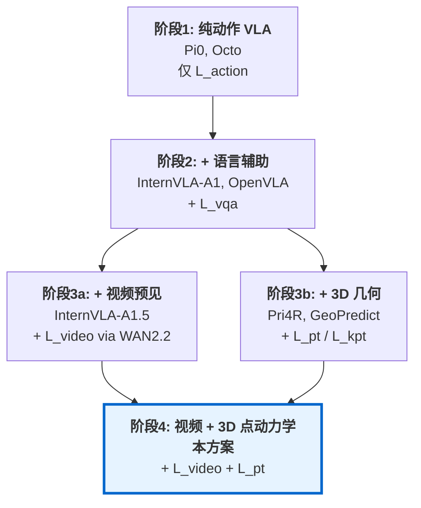
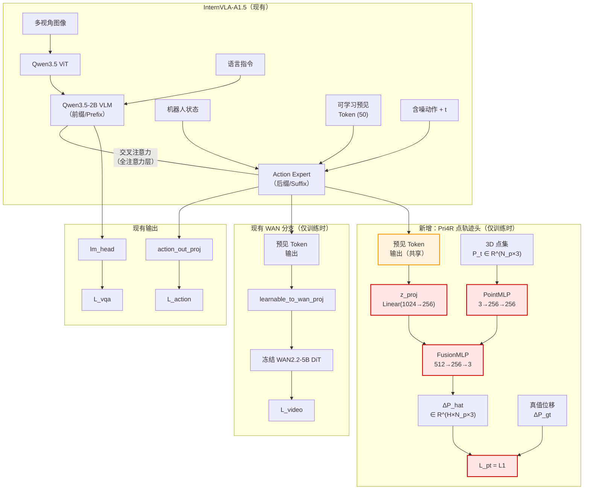
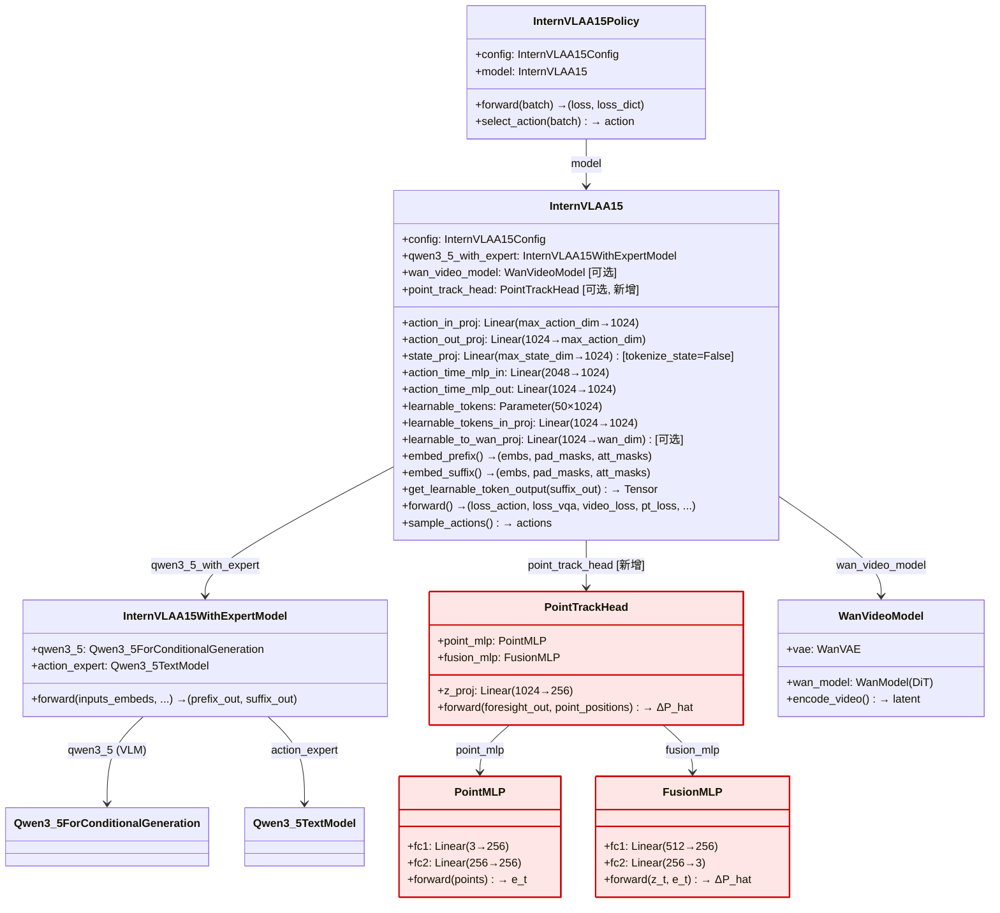
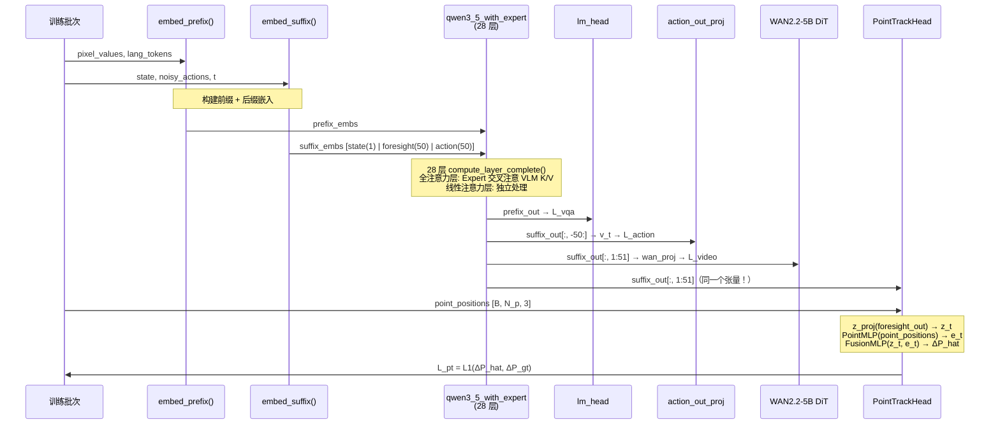
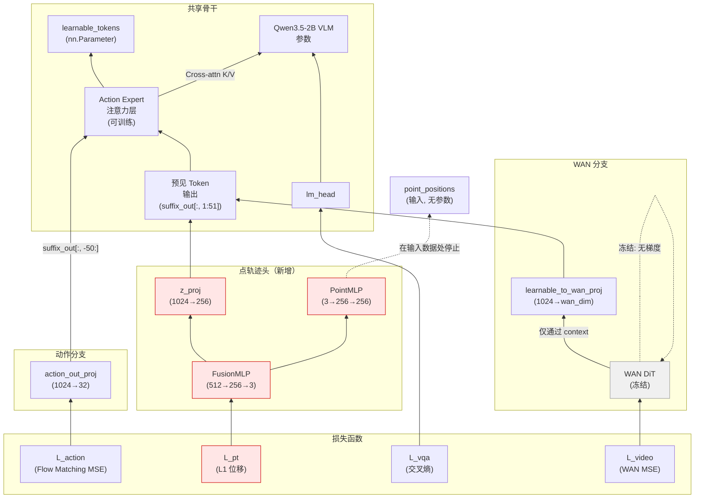
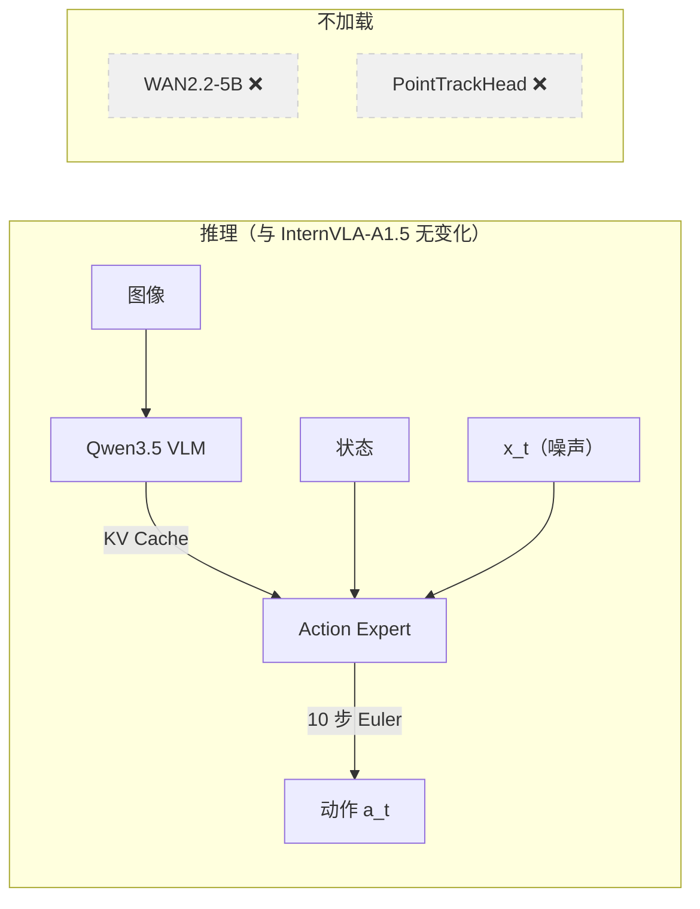

# InternVLA-A1.5 + Pri4R 3D 点轨迹监督：整合设计与落地实施方案

> **目标**：将 Pri4R 的特权 3D 点轨迹监督（PointMLP + FusionMLP）整合到 InternVLA-A1.5 中，在训练阶段为模型提供显式的 3D 世界动力学感知，推理时零开销，以提升机器人操作的成功率。

---

## 目录

1. [动机与背景](#1-动机与背景)
2. [互补性分析：为什么选择 Pri4R × InternVLA-A1.5](#2-互补性分析为什么选择-pri4r--internvla-a15)
3. [架构总览](#3-架构总览)
4. [模块设计](#4-模块设计)
5. [训练前向传播](#5-训练前向传播)
6. [损失函数设计](#6-损失函数设计)
7. [反向传播与梯度流](#7-反向传播与梯度流)
8. [推理路径](#8-推理路径)
9. [训练策略与冻结调度](#9-训练策略与冻结调度)
10. [数据流水线](#10-数据流水线)
11. [配置变更](#11-配置变更)
12. [代码修改指南](#12-代码修改指南)
13. [成功率提升分析](#13-成功率提升分析)
14. [替代方案与横纵向对比](#14-替代方案与横纵向对比)
15. [验证与测试计划](#15-验证与测试计划)
16. [参考文献](#16-参考文献)

---

## 1. 动机与背景

### 1.1 问题：3D 几何接地不足

InternVLA-A1.5（[Zhu et al., 2025](https://arxiv.org/abs/2607.04988)）通过混合 Transformer（MoT）架构、流匹配（Flow Matching）动作生成和基于 WAN2.2-5B 的潜在视频预见实现了 SOTA 级别的 VLA 性能。然而其内部表征主要建立在 2D 视觉特征上。WAN 视频预见机制捕获的是**场景级视觉动态**（场景未来长什么样），但缺乏显式的**3D 几何动态**（物体和机器人在度量空间中如何运动）。

这一局限性导致了若干特定的失败模式：

1. **运动学扰动脆弱性**：在 LIBERO-Plus Robot 扰动测试中，InternVLA-A1.5 仅达到 55.1%，而 $\pi_{0.5}$ 达到 73.6%（论文表 6），这表明模型的视觉预见未能充分编码机器人运动学意识。
2. **长时域漂移**：多步骤任务需要持续理解 3D 空间关系——物体在哪里以及如何运动——而 2D 视频潜变量仅能隐式且不精确地编码这些信息。
3. **接触推理**：预测接触的物理后果（抽屉开合角度、门的旋转、物体位移）需要度量级的 3D 理解。

### 1.2 Pri4R 的核心洞察

Pri4R（[Kim et al., 2025](https://arxiv.org/abs/2603.01549v2)）引入了**特权 3D 点轨迹监督**：在训练期间，一个轻量级辅助头预测场景表面被追踪点的未来 3D 位移。与本次整合相关的关键贡献：

- **PointMLP**：一个简单的逐点 MLP 编码器（$\mathbb{R}^{N_p \times 3} \to \mathbb{R}^{N_p \times d}$），保留每个点的独立身份。消融实验显示，将 PointMLP 替换为 PointNet（全局池化）会导致成功率下降 8.4%，因为池化操作破坏了逐点位移预测所必需的点身份信息（[Pri4R 论文 Table VI](https://arxiv.org/html/2603.01549v2)）。
- **FusionMLP**：一个广播-拼接-MLP 结构，将 VLM 嵌入 $z_t \in \mathbb{R}^{H \times d}$ 与点特征 $e_t \in \mathbb{R}^{N_p \times d}$ 融合后预测位移 $\Delta\hat{P} \in \mathbb{R}^{H \times N_p \times 3}$。
- **特权信息范式**：3D 点轨迹仅在训练时可用（来自仿真场景网格或 SpatialTrackerV2 伪标签）。推理时，整个点轨迹头被丢弃——**零开销**。
- **表征增强机制**：点轨迹损失的梯度回传至共享的 VLM 骨干网络，迫使其在表征空间中编码世界动力学信息。动作头随后受益于这些丰富的表征，而无需在推理时看到任何点数据。

### 1.3 Pri4R 的量化证据

Pri4R 在三个 VLA 骨干网络上展示了一致的提升（摘自 [Pri4R 论文第 4 节](https://arxiv.org/html/2603.01549v2)）：

| 基准测试 | 骨干网络 | 基线 | + Pri4R | 提升 |
|---|---|---|---|---|
| LIBERO Average | OpenVLA-OFT | 92.7 | 96.3 | +3.6 |
| LIBERO-Long | OpenVLA-OFT | 85.5 | 95.3 | **+9.8** |
| RoboCasa Average | OpenVLA-OFT | 33.1 | 46.3 | **+13.2** |
| RoboCasa Average | $\pi_{0.5}$ | 52.9 | 57.0 | +4.1 |

值得注意的是，最大的提升出现在长时域任务（LIBERO-Long）和高难度操作任务（RoboCasa）上，恰恰是 3D 几何理解最重要的场景。

---

## 2. 互补性分析：为什么选择 Pri4R × InternVLA-A1.5

### 2.1 两种系统对未来的预测

| 维度 | InternVLA-A1.5（WAN 视频预见） | Pri4R（3D 点轨迹） |
|---|---|---|
| **预测空间** | 图像潜空间 $\mathbb{R}^{C \times T' \times H' \times W'}$ | 度量 3D 空间 $\mathbb{R}^{H \times N_p \times 3}$ |
| **空间密度** | 稠密（所有像素） | 稀疏（1024 个点） |
| **时间密度** | 稀疏（4 个关键帧） | 稠密（每个时间步） |
| **信息类型** | 场景外观（看起来什么样） | 场景几何（物体在哪里、怎么移动） |
| **擅长** | 视觉扰动鲁棒性、基于外观的规划 | 接触推理、运动学一致性、碰撞规避 |
| **薄弱点** | 运动学扰动（LIBERO-Plus Robot 仅 55.1%） | 纯视觉任务（无像素级监督） |
| **监督源** | 冻结的 WAN2.2-5B DiT（互联网视频预训练） | 真值 3D 位置（仿真或深度相机） |

两种预测模态具有**互补性**：视频预见捕获*场景级视觉动态*，而点轨迹捕获*度量级 3D 几何动态*。二者的薄弱点不重叠。

### 2.2 VLA 中辅助监督信号的演进



本次整合代表了两条平行演进路径的交汇。整合后的模型在**四个抽象层级**接受监督：

| 层级 | 损失 | 教给模型什么 |
|---|---|---|
| 文本 | $L_\text{vqa}$（交叉熵） | 语言接地、组合理解 |
| 场景 | $L_\text{video}$（Flow Matching MSE） | 未来视觉外观、场景动态 |
| 几何 | $L_\text{pt}$（L1 位移） | 3D 世界动力学、度量空间推理 |
| 动作 | $L_\text{action}$（Flow Matching MSE） | 连续运动控制 |

### 2.3 为什么点轨迹是最佳的几何监督信号

Pri4R 的系统性消融（[论文 Table III](https://arxiv.org/html/2603.01549v2)）比较了不同几何监督信号在 RoboCasa + OpenVLA-OFT 上的效果：

| 监督信号 | 成功率 | $\Delta$ | 特性 |
|---|---|---|---|
| 基线（无） | 33.1 | — | — |
| 目标点集 | 33.8 | +0.7 | 时间稀疏、3D、空间稀疏 |
| 2D 点轨迹 | 37.0 | +3.9 | 时间稠密、仅 2D、空间稀疏 |
| 深度图 | 42.3 | +8.3 | 时间稠密、3D、空间冗余 |
| **3D 点轨迹（Pri4R）** | **46.3** | **+13.2** | 时间稠密、3D、空间稀疏 |

3D 点轨迹独特地同时具备三个理想特性：
- **时间稠密**：逐时间步预测，而非仅预测目标状态
- **度量级 3D 几何**：与机器人动作处于同一坐标系
- **空间稀疏**：1024 个点 vs 百万级像素，梯度信号高效

关键是，3D 点位移（$\Delta P \in \mathbb{R}^{H \times N_p \times 3}$，其中 $H$ 为动作时域，$N_p$ 为追踪点数）与机器人动作处于**相同的度量空间**（均为米/时间步为单位的 3D 位移），这种天然对齐使得损失权重 $\omega_{pt} = 1.0$ 无需精细调参即可达到最优平衡。

### 2.4 追踪什么：机器人 + 场景点

来自 Pri4R 的同一消融实验：

| 追踪的点 | 成功率提升 $\Delta$ |
|---|---|
| 仅场景点 | +2.1 |
| 仅机器人本体点 | +10.7 |
| 两者兼有（Pri4R） | +13.2 |

追踪机器人本体点提供了主导信号（单独 +10.7），但添加场景点通过交互动力学提供了额外的 +2.5 增益。本方案遵循 Pri4R 的设计，同时使用**机器人本体和场景表面点**。

---

## 3. 架构总览

### 3.1 高层融合架构



**核心设计决策**：点轨迹头接入的是与 WAN 视频分支**相同的预见 Token 输出**。这是有意为之——两个辅助任务从不同视角（2D 视觉 vs 3D 几何）监督同一概念（未来世界动态），共享表征迫使模型学习一个统一的、更丰富的世界模型。

### 3.2 Suffix Token 结构

Suffix 的 token 序列取决于 `config.tokenize_state` 的设置（`configuration_internvla_a1_5.py` L314，默认 `True`）：

**当 `tokenize_state=False` 时**（state 以投影向量加入 suffix）：
```
[state(1)] [learnable_foresight(50)] [action_time(50)]  → 共 101 tokens
```

**当 `tokenize_state=True` 时**（state 被文本化后加入 prefix，默认行为）：
```
[learnable_foresight(50)] [action_time(50)]  → 共 100 tokens
```

参见 `embed_suffix()` 方法（`modeling_internvla_a1_5.py` L917）：当 `tokenize_state=False` 时，L924-932 将 state 通过 `state_proj` 投影后作为第一个 token 添加；否则跳过此步骤。

> **注意**：`get_learnable_token_output()` 方法（L977）始终从 `start=1` 开始切片（`suffix_out[:, 1:1+50]`），这**假定了 `tokenize_state=False`**（即 suffix 的第一个 token 是 state，需要跳过）。当 `tokenize_state=True` 时，suffix 的第一个 token 就是第一个 learnable token，`start=1` 会跳过它。在本方案的后续设计中，我们以 `tokenize_state=False` 为基准描述（与方法的 docstring 一致），但实现时需确认实际训练配置。

无论哪种情况，点轨迹头**不在前缀或后缀中添加新 token**。它完全在现有 suffix token 的输出上操作——是预见 token 表征的只读消费者，而非新的输入通道。

### 3.3 注意力掩码（不变）

Suffix 中的注意力掩码模式保持不变：

| 块 | 可以注意到 |
|---|---|
| `state(1)` | 前缀（VLM 上下文），自身 |
| `learnable(50)` | 前缀，state，彼此之间 |
| `action_time(50)` | 前缀，state，learnable，彼此之间 |

点轨迹头在注意力之后、在最终隐藏状态上操作，因此不需要修改掩码。

### 3.4 静态架构：类图

下图展示了新增的 `PointTrackHead` 如何嵌入 InternVLA-A1.5 的现有类层级结构。红色标注的是新增类；其余为已有类。



**关键关系说明**：
- `InternVLAA15` 有条件地持有 `PointTrackHead`（仅当 `config.enable_point_track=True`），类似于它有条件地持有 `WanVideoModel`（仅当 `config.action_loss_only=False`）。参见 `__init__()` 在 `modeling_internvla_a1_5.py` L541。
- `PointTrackHead` 是一个自包含模块，不依赖于 `WanVideoModel` 或 `InternVLAA15WithExpertModel`——它仅消费联合前向传播产生的 `suffix_out` 张量。
- 现有的 `get_learnable_token_output()` 方法（L977）返回 `suffix_out[:, 1:1+num_learnable_tokens]`，同时服务于 `learnable_to_wan_proj`（视频损失）和 `PointTrackHead.z_proj`（点轨迹损失）。

### 3.5 具体示例：流水线中的张量形状

为使架构具体化，以下是一个使用典型维度的完整示例（batch=4，2 个相机 224×224，chunk_size=50，$N_p$=32）：

> **符号说明**：$B$=批大小，$H$=动作时域（chunk_size），$N_p$=追踪点数，$d_{pt}$=点轨迹隐藏维度。
> 注意：`config.max_action_dim=32`（config L266），模型投影层使用这个最大维度。在 `InternVLAA15Policy.forward()` L1601-1602 处，会按实际数据集的动作维度截取：`losses = losses[:, :, :original_action_dim]`。下表中 `state` 和 `actions` 使用 `max_action_dim=32` 的模型投影维度。

| 阶段 | 张量 | 形状 | 说明 |
|---|---|---|---|
| **输入** | `pixel_values` | [4, 2, 3, 224, 224] | 2 个相机视角 |
| | `lang_tokens` | [4, ~650] | 分词后的指令 + state + FAST token |
| | `state` | [4, 14] | 实际 7-DOF 手臂 + 7-DOF 夹爪（数据集相关） |
| | `actions` | [4, 50, 14] | 真值动作块（数据集实际维度） |
| | `point_positions` | [4, 32, 3] | **新增**：32 个被追踪的 3D 点 |
| | `point_displacements` | [4, 50, 32, 3] | **新增**：真值位移 |
| **嵌入** | `prefix_embs` | [4, ~700, 1536] | VLM 隐藏维度=1536（Qwen3.5-2B） |
| | `suffix_embs` | [4, 101, 1024] | Expert 隐藏维度=1024（tokenize_state=False 时） |
| **联合前向** | `prefix_out` | [4, ~700, 1536] | VLM 最终隐藏状态 |
| | `suffix_out` | [4, 101, 1024] | Expert 最终隐藏状态 |
| **提取** | `foresight_out` | [4, 50, 1024] | `suffix_out[:, 1:51]` |
| | `action_out` | [4, 50, 1024] | `suffix_out[:, -50:]` |
| **点轨迹** | `z_t = z_proj(foresight_out)` | [4, 50, 256] | 投影到 $d_{pt}$ |
| | `e_t = PointMLP(point_positions)` | [4, 32, 256] | 逐点特征 |
| | `z_exp`（广播） | [4, 50, 32, 256] | 扩展用于融合 |
| | `e_exp`（广播） | [4, 50, 32, 256] | 扩展用于融合 |
| | `fused`（拼接） | [4, 50, 32, 512] | 拼接后 |
| | `ΔP_hat` | [4, 50, 32, 3] | 预测的位移 |
| **损失** | `L_pt = L1(ΔP_hat, ΔP_gt)` | 标量 | 所有元素的均值 |

---

## 4. 模块设计

### 4.1 PointMLP：逐点 3D 编码器

**用途**：将每个 3D 点的位置独立编码为特征向量，保留逐点身份。

```python
class PointMLP(nn.Module):
    """Per-point MLP encoder. No global pooling — preserves point identity."""
    def __init__(self, in_dim: int = 3, hidden_dim: int = 256):
        super().__init__()
        self.fc1 = nn.Linear(in_dim, hidden_dim)
        self.fc2 = nn.Linear(hidden_dim, hidden_dim)
    
    def forward(self, points: Tensor) -> Tensor:
        x = F.silu(self.fc1(points))
        return self.fc2(x)
```

**设计理由**：
- **不做全局池化**：每个点独立编码。Pri4R 消融显示，将 PointMLP 替换为 PointNet（max-pooling）导致成功率下降 8.4%，因为池化操作破坏了逐点位移预测所需的点身份信息。
- **简单的两层 MLP**：替换为 Point Transformer 仅比 PointMLP 高 +3.0%，但计算代价大得多。PointMLP 的角色是**梯度传导通道**，而非复杂的特征提取器。
- **SiLU 激活函数**：与 InternVLA-A1.5 其余部分的激活选择一致（Qwen3.5 的 MLP 层使用 SiLU）。

**参数量**：$3 \times 256 + 256 + 256 \times 256 + 256 = 66{,}816$（bf16 下约 130KB）。

### 4.2 FusionMLP：广播-拼接-MLP 特征融合

**用途**：将 VLM 嵌入（投影后的预见 token 输出）与点特征融合，预测每个点在每个时间步的位移。

```python
class FusionMLP(nn.Module):
    """Broadcast-concatenate-MLP fusion for displacement prediction.
    
    Input:  z_t [B, H, d_pt]    — 投影后的预见 token 输出
            e_t [B, N_p, d_pt]  — 来自 PointMLP 的逐点特征
    Output: ΔP  [B, H, N_p, 3]  — 预测的 3D 位移
    """
    def __init__(self, d_pt: int = 256, out_dim: int = 3):
        super().__init__()
        self.fc1 = nn.Linear(2 * d_pt, d_pt)
        self.fc2 = nn.Linear(d_pt, out_dim)
    
    def forward(self, z_t: Tensor, e_t: Tensor) -> Tensor:
        B, H, d = z_t.shape
        N_p = e_t.shape[1]
        
        # 广播：z_t → [B, H, N_p, d], e_t → [B, H, N_p, d]
        z_exp = z_t[:, :, None, :].expand(B, H, N_p, d)
        e_exp = e_t[:, None, :, :].expand(B, H, N_p, d)
        
        # 拼接并预测
        fused = torch.cat([z_exp, e_exp], dim=-1)  # [B, H, N_p, 2d]
        return self.fc2(F.silu(self.fc1(fused)))     # [B, H, N_p, 3]
```

**广播机制图解**（$B$=批大小，$H$=动作时域，$N_p$=追踪点数，$d$=$d_{pt}$=点轨迹隐藏维度）：

$$z_t \in \mathbb{R}^{B \times H \times d} \xrightarrow{\text{expand}} \mathbb{R}^{B \times H \times N_p \times d}$$

$$e_t \in \mathbb{R}^{B \times N_p \times d} \xrightarrow{\text{expand}} \mathbb{R}^{B \times H \times N_p \times d}$$

$$\text{concat} \to \mathbb{R}^{B \times H \times N_p \times 2d} \xrightarrow{\text{MLP}} \mathbb{R}^{B \times H \times N_p \times 3}$$

这确保了每个点在每个时间步都接收到来自 $z_t$ 的全局场景上下文，并且每个时间步的预测都以该点来自 $e_t$ 的初始空间特征为条件。

**参数量**：$512 \times 256 + 256 + 256 \times 3 + 3 = 131{,}843$（bf16 下约 260KB）。

### 4.3 PointTrackHead：容器模块

```python
class PointTrackHead(nn.Module):
    """Pri4R-style point track prediction head.
    
    接收预见 token 输出和 3D 点位置，
    预测动作时域内的逐点位移。
    推理时被丢弃。
    """
    def __init__(self, expert_hidden_size: int = 1024, d_pt: int = 256):
        super().__init__()
        self.point_mlp = PointMLP(in_dim=3, hidden_dim=d_pt)
        self.z_proj = nn.Linear(expert_hidden_size, d_pt)
        self.fusion_mlp = FusionMLP(d_pt=d_pt, out_dim=3)
    
    def forward(
        self,
        foresight_out: Tensor,   # [B, H, expert_hidden_size]
        point_positions: Tensor, # [B, N_p, 3]
    ) -> Tensor:
        z_t = self.z_proj(foresight_out)       # [B, H, d_pt]
        e_t = self.point_mlp(point_positions)  # [B, N_p, d_pt]
        return self.fusion_mlp(z_t, e_t)       # [B, H, N_p, 3]
```

**总参数量**：$66{,}816 + 262{,}400 + 131{,}843 = 461{,}059$（bf16 下约 900KB）。相较于 Action Expert（约 460M 参数）或 VLM（约 2.8B 参数），这几乎可以忽略不计。

**GPU 中间张量内存**（batch=4，H=50，$N_p$=32，$d_{pt}$=256，bf16）：
- 广播拼接张量：$4 \times 50 \times 32 \times 512 \times 2$ 字节 = 6.5MB
- 经过第一个线性层后：$4 \times 50 \times 32 \times 256 \times 2$ = 3.3MB
- 峰值约 10MB，可忽略不计。

当使用 $N_p$=1024（Pri4R 完整设定）时，峰值中间张量内存约为 330MB（bf16），仍然可控。建议初始实验使用 $N_p$=32（仅机器人关键点），然后扩展到 $N_p$=1024（机器人 + 场景）以获得最大性能。

### 4.4 维度选择分析：为什么 $d_{pt} = 256$

| $d_{pt}$ | PointMLP 参数量 | FusionMLP 峰值内存（B=4，$N_p$=1024） | 预期质量 |
|---|---|---|---|
| 64 | 16K | ~80MB | 偏低——可能欠拟合位移模式 |
| **256** | **67K** | **~330MB** | **良好平衡——推荐默认值** |
| 512 | 264K | ~660MB | 略有提升，2× 内存 |
| 1024 | 1.1M | ~1.3GB | 匹配 Pri4R 原始的 $d = d_\text{VLM}$，最高保真度但内存开销大 |

选择 $d_{pt} = 256$ 以微小的容量降低换取相对于匹配 Expert 隐藏维度（1024）时 4× 的内存节省。由于 PointMLP 的主要角色是**梯度传导通道**（而非复杂特征提取器），较小的维度已经足够。

---

## 5. 训练前向传播

### 5.1 完整的前向数据流

训练前向传播在 InternVLA-A1.5 的现有 forward 方法（`InternVLAA15.forward()` 在 `modeling_internvla_a1_5.py` L1099）基础上增加一条新的点轨迹损失分支。



### 5.2 修改后的 forward 伪代码

```python
def forward(self, pixel_values, image_grid_thw, lang_tokens, lang_masks,
            state, actions, labels=None, fast_token_mask=None,
            video_frames=None, video_mask=None,
            point_positions=None, point_displacements=None,  # 新增
            point_track_mask=None,                            # 新增
            noise=None, time=None):
    
    # === 现有的 Flow Matching 设置 ===
    noise = self.sample_noise(actions.shape, actions.device) if noise is None else noise
    time = self.sample_time(actions.shape[0], actions.device) if time is None else time
    x_t = time[:, None, None] * noise + (1 - time[:, None, None]) * actions
    u_t = noise - actions
    
    # === 现有的嵌入 ===
    prefix_embs, prefix_pad_masks, prefix_att_masks = self.embed_prefix(...)
    suffix_embs, suffix_pad_masks, suffix_att_masks = self.embed_suffix(state, x_t, time)
    
    # === 现有的联合前向（28 层） ===
    prefix_out, suffix_out = qwen3_5_with_expert.forward(
        inputs_embeds=[prefix_embs, suffix_embs], ...
    )
    
    # === 现有损失 ===
    loss_vqa = cross_entropy(lm_head(prefix_out), labels)        # VLM 分支
    v_t = action_out_proj(suffix_out[:, -chunk_size:])
    loss_action = MSE(u_t, v_t)                                   # 动作分支
    loss_video = _compute_video_loss(video_frames, suffix_out[:, 1:51])  # WAN 分支
    
    # === 新增：点轨迹损失 ===
    if self.config.enable_point_track and point_positions is not None:
        has_pts = point_track_mask.any() if point_track_mask is not None else True
        if has_pts:
            learnable_out_pt = self.get_learnable_token_output(suffix_out)  # [B, 50, 1024]
            learnable_out_pt = learnable_out_pt.to(dtype=torch.float32)
            # 应用掩码（例如跳过仅 VQA 的样本）
            if point_track_mask is not None:
                learnable_out_pt = learnable_out_pt[point_track_mask]
                point_positions = point_positions[point_track_mask]
                point_displacements = point_displacements[point_track_mask]
            # 预测并计算损失
            disp_pred = self.point_track_head(learnable_out_pt, point_positions)
            pt_loss = F.l1_loss(disp_pred, point_displacements, reduction="mean")
        else:
            pt_loss = torch.tensor(0.0, device=actions.device)
    else:
        pt_loss = torch.tensor(0.0, device=actions.device)
    
    return loss_action, loss_vqa, video_loss, pt_loss, loss_per_token, token_mask
```

### 5.3 关键实现细节：共享预见 Token 输出

`get_learnable_token_output(suffix_out)` 调用（L977）返回 `suffix_out[:, 1:1+50]`。这与 `_compute_video_loss()` 在 L1238 使用的是**同一个张量切片**。当视频损失和点轨迹损失同时激活时：

```python
# 两者使用相同的 suffix_out 切片
learnable_out_video = self.get_learnable_token_output(suffix_out)  # 用于 WAN
learnable_out_pt    = self.get_learnable_token_output(suffix_out)  # 用于点轨迹
# 它们是同一个张量——来自两个损失的梯度会累加
```

这是有意设计的：共享表征创建了一个统一的世界动态编码，同时捕获视觉和几何未来。WAN 分支提供稠密的 2D 外观监督，而点轨迹头提供稀疏的 3D 度量监督。两路梯度信号共同丰富预见 token 的学习表征。

---

## 6. 损失函数设计

### 6.1 各项损失

**动作损失**（Flow Matching MSE）：

$$L_\text{action} = \text{MSE}(u_t, v_t) = \frac{1}{H \cdot d_a} \sum_{h=1}^{H} \sum_{j=1}^{d_a} (u_t^{h,j} - v_t^{h,j})^2$$

其中：
- $H$ = 动作时域 / chunk 大小（`config.chunk_size`，默认 50 个时间步）
- $d_a$ = 动作维度（`config.max_action_dim`，默认 32；实际训练时按数据集截取）
- $u_t = \epsilon - a$ 是目标速度场（$\epsilon$ 为采样噪声，$a$ 为真值动作块）
- $v_t = \text{action\_out\_proj}(\text{suffix\_out}_{[-H:]})$ 是预测的速度（L1229）
- Flow Matching 插值为 $x_t = t \cdot \epsilon + (1-t) \cdot a$，其中 $t \in [0,1]$ 为每个样本的随机标量（L1125）

**VQA 损失**（交叉熵）：

$$L_\text{vqa} = -\frac{1}{|\mathcal{V}|} \sum_{i \in \mathcal{V}} \log p(\text{token}_i | \text{context}_{<i})$$

其中 $\mathcal{V}$ 是有效标签位置集合（子任务文本 + FAST 动作 token），通过 `labels[:, 1:] != -100` 在 L1213 处计算。

**视频损失**（WAN Flow Matching MSE）：

$$L_\text{video} = \text{MSE}(\hat{v}_\text{video}, u_\text{video})$$

其中 $u_\text{video} = \epsilon_\text{video} - x_\text{clean}$ 是视频速度目标，$\hat{v}_\text{video}$ 是以投影后预见 token 为交叉注意力条件的 WAN DiT 预测结果。

**点轨迹损失**（L1 位移，新增）：

$$L_\text{pt} = \frac{1}{H \cdot N_p \cdot 3} \sum_{h=1}^{H} \sum_{i=1}^{N_p} \|\Delta\hat{P}^{h,i} - \Delta P_\text{gt}^{h,i}\|_1$$

其中：
- $\Delta\hat{P}^{h,i} = \text{FusionMLP}(z_t^h, e_t^i) \in \mathbb{R}^3$ 是预测的第 $i$ 个点在第 $h$ 个时间步的位移
- $\Delta P_\text{gt}^{h,i} = P^{h+1,i} - P^{h,i} \in \mathbb{R}^3$ 是真值位移
- $z_t^h$ 是第 $h$ 个投影后的预见 token 输出
- $e_t^i$ 是来自 PointMLP 的第 $i$ 个点特征
- $H$ = 动作时域（chunk_size，默认 50）
- $N_p$ = 追踪点数（默认 32）

**为什么用 L1 而非 L2**：Pri4R 对位移预测使用 L1 损失。位移值较小（毫米到厘米级），L1 对偶尔出现的大幅运动中的离群值更鲁棒。InternVLA-A1.5 已经在 FAST 动作 token 监督中使用了类似 L1 的损失。

### 6.2 总损失

**预训练阶段 2**（所有损失激活）：

$$L = \beta \cdot L_\text{action} + \lambda_\text{vqa} \cdot L_\text{vqa} + \alpha \cdot L_\text{video} + \omega_\text{pt} \cdot L_\text{pt}$$

其中：
- $\beta$ = 动作损失权重（在 `modeling_internvla_a1_5.py` L1650 处硬编码为 `10`）
- $\lambda_\text{vqa}$ = VQA 损失权重（`config.lambda_vqa`，默认 1.0）
- $\alpha$ = 视频预见损失权重（`config.video_loss_weight`，默认 1.0）
- $\omega_\text{pt}$ = **新增**：点轨迹损失权重（`config.point_track_loss_weight`，默认 1.0）

**微调**（`action_loss_only=True`，不加载 WAN）：

$$L = \beta \cdot L_\text{action} + \lambda_\text{vqa} \cdot L_\text{vqa} + \omega_\text{pt} \cdot L_\text{pt}$$

**微调**（WAN 仍然激活）：

$$L = \beta \cdot L_\text{action} + \lambda_\text{vqa} \cdot L_\text{vqa} + \alpha \cdot L_\text{video} + \omega_\text{pt} \cdot L_\text{pt}$$

### 6.3 权重选择依据

| 权重 | 值 | 依据 |
|---|---|---|
| $\omega_\text{pt}$ | 1.0 | Pri4R 消融显示 $\omega_{pt}=1.0$ 为最优（$\pi_{0.5}$ 在 RoboCasa 上 57.0%）。$\omega_{pt}=0.1$ 给出 54.7%，$\omega_{pt}=10.0$ 给出 50.7%。位移空间与动作空间的天然对齐使得 1.0 是无需调参的平衡默认值。 |
| $\beta$ | 10 | InternVLA-A1.5 现有的 Flow Matching 动作损失默认权重。 |
| $\alpha$ | 1.0 | InternVLA-A1.5 现有的视频损失默认权重。 |
| $\lambda_\text{vqa}$ | 1.0 | InternVLA-A1.5 现有默认值。 |

---

## 7. 反向传播与梯度流

### 7.1 完整梯度流图



### 7.2 $L_\text{pt}$ 的梯度路径

点轨迹损失沿以下路径生成梯度。下文中，$\xrightarrow{\nabla}$ 表示反向梯度流方向（与前向计算相反），$\theta_X$ 表示模块 $X$ 的可训练参数。

**路径 1：通过 FusionMLP → z_proj → 预见 Token 输出 → Expert → VLM**

$$L_\text{pt} \xrightarrow{\nabla} \text{FusionMLP} \xrightarrow{\nabla} \text{z\_proj} \xrightarrow{\nabla} \text{suffix\_out}_{[1:51]} \xrightarrow{\nabla} \text{Expert 层} \xrightarrow{\nabla} \text{VLM（通过 cross-attn K/V）}$$

这是主要的梯度传导通道。Expert 的注意力层将预见 token 与 VLM 前缀联合处理，因此梯度从预见 token 输出流经 Expert 的 Q/K/V/gate 投影，并在全注意力层（28 层堆叠中每 4 层一个：第 3、7、11、...、27 层）中，进一步通过交叉注意力机制到达 VLM 参数（参见 `compute_layer_complete` L268）。

**路径 2：通过 PointMLP（短路径，终止于输入）**

$$L_\text{pt} \xrightarrow{\nabla} \text{FusionMLP} \xrightarrow{\nabla} \text{PointMLP} \xrightarrow{\text{停止}} \text{point\_positions（输入数据）}$$

此路径仅更新 PointMLP 的参数，不到达 VLM 或 Expert。

### 7.3 关键梯度流行为

**当 `knowledge_insulation=False` 时（默认）**：

在全注意力层中（`compute_layer_complete`，L268），Expert 查询注意 VLM K/V 时**不做** `.detach()`。具体代码在 L270-271：

```python
# L269-274: 关键的梯度门控点
if knowledge_insulation:
    prefix_key_for_suffix = prefix_key.detach()    # L270: 阻断梯度
    prefix_value_for_suffix = prefix_value.detach() # L271: 阻断梯度
else:
    prefix_key_for_suffix = prefix_key     # L273: 梯度可通过
    prefix_value_for_suffix = prefix_value # L274: 梯度可通过
```

因此：

$$\frac{\partial L_\text{pt}}{\partial \theta_\text{VLM}} \neq 0$$

点轨迹损失可以通过注意力交叉连接更新 VLM 参数。这是期望的行为——它用 3D 几何信息丰富 VLM 的表征。

**当 `knowledge_insulation=True` 时**：

在全注意力层中，VLM K/V 在 Expert 注意之前被 `.detach()` 了（L270-271）：

$$\frac{\partial L_\text{pt}}{\partial \theta_\text{VLM}} = 0 \text{（通过注意力路径）}$$

但 $L_\text{vqa}$ 仍然通过 lm_head 路径更新 VLM 参数。且 $L_\text{pt}$ 仍然更新 Expert 自身的参数。在此模式下，点轨迹损失仅丰富 Expert 的表征而不影响 VLM 的——如果 VLM 已经预训练充分且我们希望保留其通用能力，这可能是可取的。

**当 `freeze_learnable_tokens=True` 时（微调典型设置）**：

可学习 token **参数**（$\theta_\text{tokens}$）及其输入投影（$\theta_\text{in\_proj}$）的 `requires_grad=False`（`_setup_wan_grad` L883-886）。但计算过程：

```
token_emb = learnable_tokens_in_proj(learnable_tokens)  # 固定输入
suffix_embs = [state_emb, token_emb, action_time_emb]   # token_emb 是常量
# ... 经过 28 层 Expert 注意力处理 ...
foresight_out = suffix_out[:, 1:51]                       # 输出是可微分的！
```

输出 `foresight_out` 仍然对 Expert 的注意力层参数（Q/K/V/gate/MLP 权重）可微。Expert 通过其注意力层处理固定的预见 token 嵌入，而这些注意力权重**是可训练的**。因此：

$$\frac{\partial L_\text{pt}}{\partial \theta_\text{Expert}} \neq 0 \quad \text{即使 } \theta_\text{tokens} \text{ 被冻结}$$

这意味着即使在冻结预见 token 的微调阶段，点轨迹损失仍然为 Expert 提供有用的梯度信号。

### 7.4 梯度流对比：四种损失

| 损失 | 更新 VLM？ | 更新 Expert？ | 更新预见 Token？ | 更新点轨迹头？ | 更新 WAN？ |
|---|---|---|---|---|---|
| $L_\text{vqa}$ | ✅（通过 lm_head） | ❌（仅前缀） | ❌ | ❌ | ❌ |
| $L_\text{action}$ | ✅（若无 KI）/ ❌（若有 KI） | ✅ | ✅（若未冻结） | ❌ | ❌ |
| $L_\text{video}$ | ✅（若无 KI）/ ❌（若有 KI） | ✅ | ✅（若未冻结） | ❌ | ❌（冻结） |
| $L_\text{pt}$ | ✅（若无 KI）/ ❌（若有 KI） | ✅ | ✅（若未冻结） | ✅ | ❌ |

**KI = knowledge insulation（知识隔离）**

关键洞察：$L_\text{pt}$ 与 $L_\text{video}$ 拥有**相同的梯度路径**（通过共享的预见 token），但添加了完全独立的可训练参数集（PointMLP、z_proj、FusionMLP）。两个损失提供互补监督而不产生干扰。

---

## 8. 推理路径

### 8.1 推理架构（零开销）

推理时，点轨迹头**完全不在计算图中**：



当推理配置中 `enable_point_track=False` 时，`PointTrackHead` 模块永远不会被实例化——零 GPU 内存、零延迟。

当 `enable_point_track=True` 但执行推理（调用 `sample_actions()` 或 `predict_action_chunk()`）时，点轨迹头存在于内存中但从不被调用。`sample_actions()` 方法（L761）仅调用 `denoise_step()` 产生动作预测，不会触及点轨迹头。

对于生产部署，设置 `enable_point_track=False` 和 `action_loss_only=True`（与标准 InternVLA-A1.5 部署完全一致）。检查点加载时会静默忽略点轨迹头的权重。

### 8.2 优化推理后端兼容性

优化推理后端（`InternVLAA15Optimized`，位于 `modeling_internvla_a1_5_optimized.py`）要求 `action_loss_only=True` 并使用 CUDA Graph 捕获去噪循环。由于点轨迹头在推理时从不被调用，优化后端**无需任何修改**，完全兼容。

---

## 9. 训练策略与冻结调度

### 9.1 推荐训练流水线

整合遵循 InternVLA-A1.5 现有的两阶段训练，在阶段 2 添加点轨迹头：

```mermaid
gantt
    title 训练流水线
    dateFormat X
    axisFormat %s
    
    section 阶段1: VLM 迁移
    VLM 交叉熵 (L_vqa) : 0, 300
    无 Expert, 无 WAN, 无 PT  : 0, 300
    
    section 阶段2: 预见 + 动作 + PT
    L_action (Flow Matching)  : 300, 900
    L_video (WAN 预见)   : 300, 900
    L_pt (点轨迹) [新增] : 300, 900
    L_vqa (继续)         : 300, 900
    
    section 微调
    L_action + L_pt + L_vqa   : 900, 960
    预见 Token 冻结   : 900, 960
```



**阶段 1：VLM 迁移**（300K 步，batch 1024）
- 与 InternVLA-A1.5 保持一致，不做修改
- VLM 通过交叉熵在子任务文本 + FAST 动作 token 上训练
- 无 Expert、无 WAN、无点轨迹头
- 此阶段不需要点轨迹数据

**阶段 2：预见 + 动作 + 点轨迹**（600K 步，batch 1024）
- 在现有 Expert + WAN 的基础上添加点轨迹头
- 总损失：$L = 10 L_\text{action} + L_\text{vqa} + L_\text{video} + \omega_\text{pt} L_\text{pt}$
- 所有模块可训练（包括预见 token 参数）
- 所有机器人训练样本需要点轨迹数据

**微调**（60K 步，batch 128，余弦 LR 衰减）
- 预见 Token：**冻结**（`freeze_learnable_tokens=True`）
- 点轨迹头：**可训练**（梯度通过 Expert 注意力层流动）
- WAN：可保留或丢弃（`action_loss_only` 可选）
- 若丢弃 WAN：$L = 10 L_\text{action} + L_\text{vqa} + \omega_\text{pt} L_\text{pt}$
- 需要点轨迹数据

### 9.2 完整冻结调度表

| 组件 | 阶段 1 | 阶段 2（预训练） | 微调 | 推理 |
|---|---|---|---|---|
| VLM（Qwen3.5） | 可训练 | 可训练 | 按配置 | N/A |
| 视觉编码器 | 按配置 | 按配置 | 按配置 | N/A |
| lm_head | 可训练 | 可训练 | 可训练 | N/A |
| Action Expert | 不存在 | 可训练 | 可训练 | N/A |
| learnable_tokens 参数 | 不存在 | **可训练** | **冻结** | N/A |
| learnable_tokens_in_proj | 不存在 | 可训练 | 冻结 | N/A |
| action_in_proj / out_proj | 不存在 | 可训练 | 可训练 | N/A |
| state_proj | 不存在 | 可训练 | 可训练 | N/A |
| WAN DiT | 不存在 | **冻结** | 不加载或冻结 | 不加载 |
| WAN VAE | 不存在 | 冻结 | 不加载 | 不加载 |
| learnable_to_wan_proj | 不存在 | 可训练 | 冻结或不加载 | 不加载 |
| **PointMLP** | 不存在 | **可训练** | **可训练** | 不加载 |
| **FusionMLP** | 不存在 | **可训练** | **可训练** | 不加载 |
| **z_proj** | 不存在 | **可训练** | **可训练** | 不加载 |

### 9.3 替代微调策略：点轨迹替代 WAN

一个有趣的训练变体：在微调时用点轨迹监督**替代** WAN 视频损失。这免去了微调时加载 5B WAN 模型的需求，节省约 10GB GPU 内存，同时仍提供辅助世界动态监督：

```
以 PT 替代 WAN 的微调：
  action_loss_only=True  （不加载 WAN）
  enable_point_track=True
  freeze_learnable_tokens=True
  
  L = 10 * L_action + L_vqa + ω_pt * L_pt
```

此方案可行的原因：
1. 预见 token 在阶段 2 已经从 WAN 中学习了世界动态表征
2. 点轨迹损失提供互补的 3D 几何监督，继续丰富 Expert 的表征
3. 不加载 WAN 节省约 10GB GPU 内存
4. 免去 WAN 前向/反向计算，训练速度提升

---

## 10. 数据流水线

### 10.1 点轨迹数据格式

点轨迹数据需要离线预计算，并与 LeRobot 数据集一同存储。每个样本新增两个数据字段：

| 字段 | 形状 | 类型 | 描述 |
|---|---|---|---|
| `observation.point_positions` | $[N_p, 3]$ | float32 | 当前时间步 $N_p$ 个被追踪点的世界坐标系 3D 位置 |
| `observation.point_displacements` | $[H, N_p, 3]$ | float32 | 未来 $H$ 个时间步的真值位移 $\Delta P^{h,i} = P^{h+1,i} - P^{h,i}$ |

其中 $H$ = `chunk_size` = 50，$N_p$ = `num_tracked_points`（默认 32 用于机器人关键点，最多 1024 用于完整场景）。

### 10.2 点轨迹数据构建（离线）

#### 仿真环境（MuJoCo 系列：LIBERO、RoboTwin 等）


步骤：
1. **导出场景网格**：所有物体 + 机器人 + 桌面
2. **裁剪**：以机器人为中心的 3D 包围盒
3. **采样 $N_p$ 个点**：在网格面上均匀采样，存储面索引和重心坐标以确保一致追踪
4. **追踪**：在每个时间步，使用不变的面索引 + 重心坐标检索相同的点
5. **计算位移**：$\Delta P^{h,i} = P^{h+1,i} - P^{h,i}$

#### 真实世界数据


步骤：
1. **分割**：使用 SAM2 等识别机器人和物体（前景）与背景
2. **采样**：前景稠密、背景稀疏，共计 $N_p$ 个 2D 像素
3. **追踪**：在 RGB-D 视频上运行 SpatialTrackerV2 获取逐点 3D 轨迹
4. **转换**：与仿真相同的位移格式

两种流水线产生相同的输出：上述指定格式的 `point_positions` 和 `point_displacements`。

### 10.3 Transform 流水线

新增一个 `ExtractPointTracksTransformFn` 处理点轨迹数据的加载和预处理：

```python
@DataTransformFn.register_subclass("extract_point_tracks")
@dataclass
class ExtractPointTracksTransformFn(DataTransformFn):
    num_tracked_points: int = 32
    chunk_size: int = 50

    def __call__(self, data: DataDict) -> DataDict:
        pos_key = "observation.point_positions"
        disp_key = "observation.point_displacements"
        
        if pos_key in data and disp_key in data:
            data[pos_key] = data[pos_key].float()
            data[disp_key] = data[disp_key].float()
        else:
            # 对于没有点轨迹数据的样本，用零张量占位
            data[pos_key] = torch.zeros(self.num_tracked_points, 3, dtype=torch.float32)
            data[disp_key] = torch.zeros(
                self.chunk_size, self.num_tracked_points, 3, dtype=torch.float32
            )
        return data
```

此 transform 插入到 `ExtractVideoFramesTransformFn` 和 `NormalizeTransformFn` 之间，条件是数据集配置中 `enable_point_track=True`。

### 10.4 数据统一

`UnifyInternVLAA15InputsTransformFn` 和 `UnifyInternVLAA15VQAInputsTransformFn` 需要更新，在输出字典中包含点轨迹键。VQA 样本始终接收点轨迹的零张量（它们没有机器人演示数据）。

---

## 11. 配置变更

### 11.1 `InternVLAA15Config` 中的新字段

在现有 WAN 配置字段之后添加（`configuration_internvla_a1_5.py` L344 之后）：

```python
# 点轨迹监督（Pri4R 风格，仅训练时使用）
enable_point_track: bool = False          # 启用点轨迹辅助损失
num_tracked_points: int = 32              # N_p: 追踪的 3D 点数
point_track_dim: int = 256                # d_pt: PointMLP/FusionMLP 隐藏维度
point_track_loss_weight: float = 1.0      # ω_pt: L_pt 在总损失中的权重
freeze_point_track_head: bool = False     # 冻结 PointMLP + FusionMLP + z_proj
```

### 11.2 `InternVLAA15DatasetConfig` 中的新字段

```python
enable_point_track: bool = False          # 数据集是否包含点轨迹数据
num_tracked_points: int = 32              # 期望的追踪点数
```

### 11.3 配置示例：带点轨迹的预训练

```bash
# launch/internvla_a15_pretrain_with_pt.sh
accelerate launch src/lerobot/scripts/lerobot_train.py \
    --policy.type=internvla_a1_5 \
    --policy.enable_point_track=True \
    --policy.num_tracked_points=32 \
    --policy.point_track_dim=256 \
    --policy.point_track_loss_weight=1.0 \
    --policy.action_loss_only=False \
    --policy.freeze_learnable_tokens=False \
    --dataset.enable_point_track=True \
    --dataset.num_tracked_points=32 \
    ...
```

### 11.4 配置示例：微调（PT 替代 WAN）

```bash
# launch/internvla_a15_finetune_pt.sh
accelerate launch src/lerobot/scripts/lerobot_train.py \
    --policy.type=internvla_a1_5 \
    --policy.enable_point_track=True \
    --policy.num_tracked_points=32 \
    --policy.point_track_loss_weight=1.0 \
    --policy.action_loss_only=True \
    --policy.freeze_learnable_tokens=True \
    --dataset.enable_point_track=True \
    ...
```

---

## 12. 代码修改指南

### 12.1 新增文件

**`src/lerobot/policies/internvla_a1_5/point_track_head.py`** — 包含 `PointMLP`、`FusionMLP` 和 `PointTrackHead` 类。完整伪代码见第 4 节。

### 12.2 需修改文件概览

#### `modeling_internvla_a1_5.py`

| 位置 | 变更 |
|---|---|
| `InternVLAA15.__init__()`（L594 之后） | 有条件地构造 `self.point_track_head` |
| `InternVLAA15._setup_wan_grad()`（L896 之后） | 添加点轨迹头的冻结逻辑 |
| `InternVLAA15.forward()` 签名（L1099） | 添加 `point_positions`、`point_displacements`、`point_track_mask` 参数 |
| `InternVLAA15.forward()` 返回值（L1246） | 在返回元组中添加 `pt_loss`（5 元组 → 6 元组） |
| `InternVLAA15.forward()` 函数体（L1244 之后） | 计算点轨迹损失 |
| `InternVLAA15Policy.forward()`（L1572） | 从 batch 中提取点轨迹数据，处理 6 元组，将 `pt_loss` 加入总损失和 `loss_dict` |

#### `configuration_internvla_a1_5.py`

| 位置 | 变更 |
|---|---|
| `InternVLAA15Config`（L344 之后） | 添加 5 个点轨迹配置字段 |
| `InternVLAA15DatasetConfig`（L34 之后） | 添加 2 个数据集配置字段；在 `__post_init__` 中插入 `ExtractPointTracksTransformFn` |
| `UnifyInternVLAA15InputsTransformFn.__call__()`（L138） | 在输出字典中添加点轨迹键 |
| `UnifyInternVLAA15VQAInputsTransformFn.__call__()`（L166） | 在输出字典中添加零张量点轨迹键 |

#### `transform_internvla_a1_5.py`

| 位置 | 变更 |
|---|---|
| `ExtractVideoFramesTransformFn` 之后 | 添加 `ExtractPointTracksTransformFn` 类 |

### 12.3 详细代码走查：在哪里以及如何修改

本节追踪需要修改的确切代码路径，行号引用 `modeling_internvla_a1_5.py`。

#### 12.3.1 模型构造（`__init__`，L541–604）

现有 `__init__` 按顺序构造所有模型子模块。WAN 相关模块在 L576–594 处有条件地构建（由 `not config.action_loss_only` 守卫）。点轨迹头应在此块之后构建，使用独立的条件守卫：

```python
# L594 之后（WAN 构造块之后，L596 之前）
# 注意：enable_point_track 与 action_loss_only 正交。
# PT 可以在有或无 WAN 的情况下工作。
if config.enable_point_track:
    from .point_track_head import PointTrackHead
    self.point_track_head = PointTrackHead(
        expert_hidden_size=action_expert_hidden_size,
        d_pt=config.point_track_dim,
    )
```

**为什么放在这里**：`action_expert_hidden_size` 变量（L556）已经可用。L603-604 的 `self.set_requires_grad()` 和 `self._setup_wan_grad()` 调用在所有模块构造之后，因此新模块会被包含在梯度设置中。

#### 12.3.2 冻结逻辑（`_setup_wan_grad`，L882–896）

`_setup_wan_grad()` 管理哪些参数被冻结。当前处理可学习 token（L883–886）、WAN VAE（L889–890）、WAN DiT（L891–893）和 WAN 投影（L894–896）。在末尾添加点轨迹冻结逻辑：

```python
# L896 之后（_setup_wan_grad 的末尾）
if hasattr(self, 'point_track_head') and self.config.freeze_point_track_head:
    for p in self.point_track_head.parameters():
        p.requires_grad = False
```

**为什么用 `hasattr` 守卫**：当 `enable_point_track=False` 时，`point_track_head` 属性不存在。这与 WAN 代码对 `config.action_loss_only` 的守卫方式一致。

#### 12.3.3 训练前向（`forward`，L1099–1246）

**签名变更**（L1099）：在方法签名中添加三个新参数：

```python
def forward(
    self,
    pixel_values, image_grid_thw, lang_tokens, lang_masks,
    state, actions,
    labels=None, fast_token_mask=None,
    video_frames=None, video_mask=None,
    point_positions=None,       # 新增: [B, N_p, 3]
    point_displacements=None,   # 新增: [B, H, N_p, 3]
    point_track_mask=None,      # 新增: [B] bool
    noise=None, time=None,
) -> tuple[Tensor, Tensor, Tensor, Tensor, Tensor, Tensor]:  # 5 元组 → 6 元组
```

**点轨迹损失计算**（在 L1244 视频损失块之后）。插入新的损失分支，模式与视频损失一致：

```python
# 视频损失块（L1244）之后
# 点轨迹损失——与视频损失块相同的模式
if self.config.enable_point_track and point_positions is not None:
    has_pts = point_track_mask.any() if point_track_mask is not None else True
    if has_pts:
        learnable_out_pt = self.get_learnable_token_output(suffix_out)
        learnable_out_pt = learnable_out_pt.to(dtype=torch.float32)
        if point_track_mask is not None:
            learnable_out_pt = learnable_out_pt[point_track_mask]
            point_positions = point_positions[point_track_mask]
            point_displacements = point_displacements[point_track_mask]
        disp_pred = self.point_track_head(learnable_out_pt, point_positions)
        pt_loss = F.l1_loss(disp_pred, point_displacements, reduction="mean")
    else:
        pt_loss = torch.tensor(0.0, device=actions.device)
else:
    pt_loss = torch.tensor(0.0, device=actions.device)
```

**需要注意的代码并行关系**：
- `get_learnable_token_output(suffix_out)` 在 L977 返回 `suffix_out[:, 1:1+50]`——与视频损失在 L1238 使用的是同一个切片。这就是共享的预见表征。
- `point_track_mask` 遵循与 `video_mask`（L1239–1241）相同的掩码模式。在混合批次（机器人 + VQA）中，只有机器人样本有点轨迹数据。VQA 样本（`vqa_type=1`）被掩码过滤。
- `.to(dtype=torch.float32)` 类型转换与视频分支（L1238）和动作分支（L1228）的处理一致。Transformer 内部计算用 bf16；损失计算用 fp32 以保证数值稳定性。

**返回值**（L1246）：从 5 元组改为 6 元组：

```python
return loss_action, loss_vqa, video_loss, pt_loss, loss_per_token, token_mask
```

#### 12.3.4 策略前向（`InternVLAA15Policy.forward`，L1572–1678）

此方法提取 batch 数据，调用 `self.model.forward()`，并聚合总损失。三处修改：

**1. 从 batch 中提取点轨迹数据**（L1581 之后）：

```python
# L1581 之后（prepare_action 之后）
point_positions = batch.get("observation.point_positions")
point_displacements = batch.get("observation.point_displacements")
```

**2. 传递给模型 forward 并解包 6 元组**（L1592–1599）：

```python
# 替换 L1592 的 5 值解包
losses, losses_vlm, video_loss, pt_loss, loss_per_token, token_mask = self.model.forward(
    pixel_values, image_grid_thw, lang_tokens, lang_masks,
    state, actions,
    labels=labels,
    fast_token_mask=fast_token_mask,
    video_frames=video_frames,
    video_mask=video_mask,
    point_positions=point_positions,
    point_displacements=point_displacements,
    point_track_mask=video_mask,  # 复用：机器人样本同时有视频和 PT 数据
)
```

**为什么复用 `video_mask` 作为 `point_track_mask`**：视频帧和点轨迹数据都来自机器人演示样本。VQA-only 样本（`vqa_type=1`）两者都没有。如果存在仅有点轨迹但无视频帧的数据集，可以添加单独的掩码，但对于标准情况，复用 `video_mask` 足够且避免了新增 batch 键。

**3. 将 `pt_loss` 加入总损失**（L1649–1654）：

```python
loss = (
    10 * loss_fm_action
    + self.config.lambda_vqa * loss_vlm
    + self.config.video_loss_weight * video_loss
    + self.config.point_track_loss_weight * pt_loss   # 新增
)
```

并加入 `loss_dict`：

```python
loss_dict = {
    ...
    "loss_point_track": pt_loss.item(),   # 新增
}
```

**重要**：同样的添加也需要在 L1668–1677 的 `else` 分支中进行（当 `enable_vqa_loss=False` 时）。

#### 12.3.5 通过 `compute_layer_complete` 的梯度流（L119–330）

此处不需要修改，但理解此函数对验证 $L_\text{pt}$ 梯度到达 VLM 至关重要。在全注意力层（28 层堆叠中每 4 层一个）中，L268–296 的交叉注意力机制决定了 VLM 参数是否从 suffix 接收梯度：

```python
# L269-274: 关键的梯度门控点
if knowledge_insulation:
    prefix_key_for_suffix = prefix_key.detach()    # L270: 阻断梯度
    prefix_value_for_suffix = prefix_value.detach() # L271: 阻断梯度
else:
    prefix_key_for_suffix = prefix_key     # L273: 梯度可通过
    prefix_value_for_suffix = prefix_value # L274: 梯度可通过
```

当 `knowledge_insulation=False`（默认）时，Expert 的 suffix 查询注意 VLM prefix K/V 时**梯度可以通过**。这意味着：

$$\frac{\partial L_\text{pt}}{\partial \theta_\text{VLM}} = \frac{\partial L_\text{pt}}{\partial \text{suffix\_out}} \cdot \frac{\partial \text{suffix\_out}}{\partial \text{prefix\_KV}} \cdot \frac{\partial \text{prefix\_KV}}{\partial \theta_\text{VLM}} \neq 0$$

L280–296 的注意力计算使用 `F.scaled_dot_product_attention` 或 eager attention 来计算 suffix 注意力输出。反向传播通过此注意力将 $L_\text{pt}$ 梯度分发到 Expert 的 QKV 投影权重以及（传递地）产生 `prefix_key` 和 `prefix_value` 的 VLM 权重。

### 12.4 检查点处理

点轨迹头权重应**包含**在训练检查点中（以便微调可以从带头的预训练检查点恢复）。推理时有两种方式：

1. **推荐**：在推理配置中设置 `enable_point_track=False`。头模块不会被构造，检查点中的权重被 PyTorch 的 state dict 加载静默忽略。

2. **替代**：将 `"model.point_track_head."` 添加到 `_checkpoint_excluded_prefixes` 中，完全排除头部权重的保存。这节省磁盘空间但阻止了带头的微调恢复。

---

## 13. 成功率提升分析

### 13.1 预期增益

基于 Pri4R 的结果和 InternVLA-A1.5 的架构，我们预测以下提升：

| 基准测试 | InternVLA-A1.5 基线 | 预期 + Pri4R PT | 理由 |
|---|---|---|---|
| LIBERO Average | 98.9 | ~99.2 (+0.3) | 已接近上限；边际增益 |
| LIBERO-Plus | 84.8 | ~88–90 (+3–5) | OOD 泛化从更丰富的 3D 表征中获益最大 |
| LIBERO-Plus Robot | 55.1 | ~62–68 (+7–13) | **最大预期增益**：3D 点追踪显式编码机器人运动学，解决主要弱点 |
| RoboTwin | 93.2 | ~95–96 (+2–3) | 精密操作受益于度量级 3D 感知 |
| DOMINO（零样本） | 27.7 | ~30–32 (+2–4) | 动态物体交互受益于 3D 动态预测 |

### 13.2 为什么组合效果应是累加的

WAN 视频预见与 Pri4R 点轨迹之间的协同效应在不同层面发挥作用：

1. **不同的表征空间**：WAN 在压缩的图像潜空间（$\mathbb{R}^{C \times T' \times H' \times W'}$）中操作。点轨迹在度量 3D 空间（$\mathbb{R}^{H \times N_p \times 3}$）中操作。没有表征重叠会导致边际收益递减。

2. **不同的失败模式覆盖**：
   - WAN 预见帮助应对视觉扰动（LIBERO-Plus 上 Background +4.1、Noise +6.6，对比无预见）
   - Pri4R 点轨迹帮助应对运动学扰动（LIBERO-Plus Robot 是 InternVLA-A1.5 最薄弱的维度）

3. **共享梯度路径、互补信号**：两个损失都流经相同的预见 token 输出，但提供正交的监督。预见 token 必须编码对**视觉未来预测和 3D 几何未来预测都充分的信息**，迫使学习一个更丰富、更通用的世界模型。

4. **Pri4R 的"慢启动、快收敛"模式**：Pri4R 的训练动态显示初始减速（前 ~20K 步），随后快速加速，达到基线峰值的速度快 2.7 倍。这表明几何监督加速了学习而非与动作学习竞争。

### 13.3 预期获益的任务类别

基于 Pri4R 的逐任务分析和 InternVLA-A1.5 的消融：

| 任务类型 | 预期增益 | 机制 |
|---|---|---|
| **长时域操作** | 高（+5–10%） | 点轨迹在完整 50 步时域上提供逐步空间接地，防止漂移 |
| **接触密集型任务**（杠杆、按钮、抽屉） | 高（+10–20%） | 3D 点位移直接编码接触动态（门旋转角度、杠杆运动） |
| **运动学扰动鲁棒性** | 高（+7–13%） | 机器人本体点追踪提供显式运动学感知 |
| **视觉扰动鲁棒性** | 低-中（+1–3%） | 已被 WAN 视频预见良好覆盖 |
| **接近上限的任务**（LIBERO 90%+） | 低（+0–1%） | 现有方法已饱和 |

### 13.4 风险分析

| 风险 | 可能性 | 影响 | 缓解措施 |
|---|---|---|---|
| 视频和 PT 损失冲突 | 低 | 中 | 两者都是对同一未来的预测任务；监控损失曲线是否出现发散 |
| $N_p$=1024 时 GPU 内存溢出 | 中 | 低 | 从 $N_p$=32 开始（机器人关键点），逐步扩展 |
| 点轨迹数据质量问题 | 中 | 高 | 验证位移分布；确保坐标系对齐 |
| $\omega_\text{pt}$ 敏感性 | 低 | 中 | Pri4R 显示在 0.1–10.0 范围内鲁棒；1.0 是安全默认值 |

---

## 14. 替代方案与横纵向对比

### 14.1 替代 z_t 源：独立的交叉注意力模块

不复用预见 token 输出，而是添加一个新的交叉注意力嵌入模块（遵循 Pri4R 对 $\pi$ 系列的方法）：

```python
# 替代方案：为 z_t 提取设置专用交叉注意力
class PointTrackEmbedding(nn.Module):
    def __init__(self, vlm_hidden_size, d_pt, num_queries=50):
        self.queries = nn.Parameter(torch.randn(num_queries, d_pt))
        self.cross_attn = nn.MultiheadAttention(d_pt, num_heads=4)
        self.kv_proj = nn.Linear(vlm_hidden_size, d_pt)
    
    def forward(self, vlm_prefix_out):
        kv = self.kv_proj(vlm_prefix_out)
        z_t, _ = self.cross_attn(self.queries, kv, kv)
        return z_t
```

| 方面 | 预见 Token 复用（推荐） | 独立交叉注意力 |
|---|---|---|
| **与 WAN 的协同** | ✅ 共享表征，互补信号 | ❌ 独立路径，无协同 |
| **额外参数** | ~461K（仅点轨迹头） | ~461K + ~500K（交叉注意力模块） |
| **复杂度** | 低（复用现有基础设施） | 中（新模块，新梯度路径） |
| **模块化** | 依赖于预见 token 的存在 | 完全独立，可在无 WAN 时工作 |
| **最适用于** | WAN 预见也激活的情况 | WAN 不存在时（纯动作训练） |

**结论**：推荐预见 token 复用，因为：(a) InternVLA-A1.5 的架构中始终存在预见 token，(b) 与 WAN 的协同提供额外增益，(c) 实现更简单。

### 14.2 替代 z_t 源：动作 Token 输出

使用 `suffix_out[:, -50:]`（动作 token 输出）替代预见 token：

| 方面 | 预见 Token（推荐） | 动作 Token |
|---|---|---|
| **语义对齐** | ✅ 为世界动态而设计 | ⚠️ 为动作预测而设计 |
| **梯度干扰** | 低（与动作预测任务分离） | 中（在相同输出上与 flow matching 竞争） |
| **时间排序** | 隐式（通过 WAN 视频监督学习） | 显式（每个 token = 一个时间步） |

**结论**：预见 token 更优，因为它们在架构上就是为世界动态建模而设计的，与点轨迹预测天然契合。

### 14.3 替代方案：专用点轨迹 Token

添加一组专门用于点轨迹预测的可学习 token：

```
[state(1)] [foresight(50)] [pt_tokens(50)] [action_time(50)]  → 共 151 tokens
```

| 方面 | 共享预见 Token（推荐） | 专用 PT Token |
|---|---|---|
| **Suffix 长度** | 101（不变） | 151（+50%） |
| **计算开销** | 零额外注意力 | Suffix 注意力计算增加 +50% |
| **表征独立性** | 与视频任务共享 | 完全独立 |
| **参数量** | ~461K | ~461K + 50×1024 + 投影 ≈ 570K |

**结论**：推荐共享预见 token，因为：(a) 50 个额外 suffix token 的计算开销不可忽视，(b) 在视频和点轨迹任务间共享表征是一个特性而非限制。

### 14.4 横向分析：与其他 3D 几何监督方法的对比

多个同期工作探索了 VLA 模型的 3D 几何监督。我们进行横向比较，以论证 Pri4R 的方法最适合 InternVLA-A1.5。

| 方法 | 几何信号 | 监督方式 | 仅训练？ | 骨干网络 | 关键结果 |
|---|---|---|---|---|---|
| **Pri4R**（Kim et al. 2025） | 3D 点轨迹（$\mathbb{R}^{H \times N_p \times 3}$） | L1 位移 | ✅ 是 | OpenVLA-OFT, $\pi_{0.5}$ | RoboCasa +13.2 |
| **GeoPredict**（Li et al. 2025） | 3D 点轨迹（$\mathbb{R}^{H \times N_p \times 3}$） | L2 位移 | ✅ 是 | $\pi_0$ | LIBERO +7.2 |
| **SpatialForcing**（Chen et al. 2025） | 3D 光流场（$\mathbb{R}^{H \times W \times 3}$） | 强制注意力掩码 | ❌ 推理需修改 | $\pi_0$, Octo | LIBERO +12.4 |
| **3D Diffuser Actor**（Ke et al. 2024） | 深度 + 3D 特征 | 3D 去噪扩散 | ❌ 内在 | N/A（专用） | RLBench 上强 |
| **Render and Diffuse**（Ze et al. 2024） | 多视角深度渲染 | 渲染目标图像 | ❌ 推理流水线 | 多种 | 专用于 3D 操作 |

**为什么选 Pri4R 而非 SpatialForcing**：

SpatialForcing 通过在推理时注入 3D 光流作为空间偏置来修改去噪头的注意力模式。虽然有效（LIBERO-Long +12.4%），但与 InternVLA-A1.5 存在根本性不兼容：

1. **推理开销**：SpatialForcing 要求在每个推理步骤都计算 3D 光流场，这与 InternVLA-A1.5 零开销推理的设计目标矛盾。Pri4R 的特权范式在推理时完全丢弃。
2. **架构不匹配**：SpatialForcing 假设动作去噪器中存在空间注意力图（$\pi_0$ 的扩散头在空间 token 上做注意力）。InternVLA-A1.5 的 Action Expert 使用 1D token 序列和 Flow Matching（非扩散），使得空间注意力注入难以适配。
3. **推理时需要 3D 数据**：SpatialForcing 在推理时需要深度相机或立体深度估计。InternVLA-A1.5 被设计为部署时仅使用 RGB 相机。

**为什么选 Pri4R 而非 GeoPredict**：

Pri4R 和 GeoPredict 都使用 3D 点轨迹监督。关键差异：

| 方面 | Pri4R | GeoPredict |
|---|---|---|
| 损失函数 | L1 | L2 |
| 追踪的点 | 机器人 + 场景（$N_p$=1024） | 仅机器人关键点（$N_p$=32） |
| 特征提取 | PointMLP（逐点，无池化） | 可学习查询 + 交叉注意力 |
| 报告增益 | +13.2（RoboCasa），+9.8（LIBERO-Long） | +7.2（LIBERO） |
| 测试骨干 | OpenVLA-OFT（SigLIP 基），$\pi_{0.5}$ | $\pi_0$ |

Pri4R 的 PointMLP（无池化）一致地比带全局池化的架构高出 5–8%（[Pri4R Table VI](https://arxiv.org/html/2603.01549v2)）。对于 InternVLA-A1.5，我们采用 Pri4R 的 PointMLP 方法，但允许从 $N_p$=32 开始以节省计算成本，当数据可用时扩展到 $N_p$=1024。

### 14.5 消融分析：各组件的预期贡献

基于 Pri4R 的消融实验和本方案的整合设计，我们预测各组件的贡献：

| 组件 | 预期贡献 | 证据 |
|---|---|---|
| **PointMLP（无池化）** | 关键，约占总增益的 60% | Pri4R：PointNet（池化）仅给出 33.9% vs PointMLP 46.3%（RoboCasa）。池化导致 -8.4%。逐点身份是必需的。 |
| **FusionMLP（广播-拼接）** | 重要，约占总增益的 20% | 交叉注意力融合给出 43.5% vs FusionMLP 46.3%（Table V）。广播确保每个时间-点对都被融合。 |
| **机器人本体点** | 主导信号，约占点增益的 80% | 仅机器人 +10.7，仅场景 +2.1，两者 +13.2（Table IV）。 |
| **L1 损失（vs L2）** | 微小，约 5% | L1 对离群位移更鲁棒，但整体相似。 |
| **共享预见 Token 作为 $z_t$** | 本方案独创 | Pri4R 中未直接消融（它们使用从 VLM 的交叉注意力）。本设计增加了 WAN 协同效应——通过同一共享中间表征预测两者。 |
| **$\omega_{pt}=1.0$** | 最优 | $\omega_{pt}=0.1 \to 54.7\%$，$\omega_{pt}=1.0 \to 57.0\%$，$\omega_{pt}=10.0 \to 50.7\%$（Table VII）。位移与动作空间的天然对齐。 |

**本方案在 LIBERO-Plus Robot 上的预测消融**（InternVLA-A1.5 基线：55.1%）：

| 变体 | 预期成功率 | 说明 |
|---|---|---|
| 基线（InternVLA-A1.5） | 55.1% | 无几何监督 |
| + PT 头（仅机器人点，$N_p$=32） | ~63% | 主导运动学信号 |
| + PT 头（机器人 + 场景，$N_p$=32） | ~65% | 场景动态增加约 2% |
| + PT 头（机器人 + 场景，$N_p$=1024） | ~67% | 更多场景覆盖 |
| + PT 头 + 关闭 WAN | ~60% | 失去视频协同，但仍从 PT 获益 |
| + PT 头 + knowledge insulation | ~62% | VLM 不从 PT 梯度获益 |
| + PT 头 + PointNet（池化） | ~58% | 由于破坏逐点身份，约 50% 增益丧失 |

---

## 15. 验证与测试计划

### 15.1 单元测试

**测试 1：PointTrackHead 形状正确性**
```python
def test_point_track_head_shapes():
    head = PointTrackHead(expert_hidden_size=1024, d_pt=256)
    foresight_out = torch.randn(4, 50, 1024)
    point_positions = torch.randn(4, 32, 3)
    output = head(foresight_out, point_positions)
    assert output.shape == (4, 50, 32, 3)
```

**测试 2：可微分性**
```python
def test_point_track_head_grad():
    head = PointTrackHead(expert_hidden_size=1024, d_pt=256)
    foresight_out = torch.randn(4, 50, 1024, requires_grad=True)
    point_positions = torch.randn(4, 32, 3)
    output = head(foresight_out, point_positions)
    output.sum().backward()
    assert foresight_out.grad is not None
    assert head.z_proj.weight.grad is not None
    assert head.point_mlp.fc1.weight.grad is not None
```

### 15.2 集成测试

**测试 3：带点轨迹损失的完整前向-反向**
1. 实例化 `InternVLAA15`，设置 `enable_point_track=True`
2. 创建包含 `observation.point_positions` 和 `observation.point_displacements` 的模拟 batch
3. 运行 `forward()`，断言 `pt_loss` 有限且为正
4. 运行 `loss.backward()`，断言无 NaN 梯度

**测试 4：冻结预见 Token 时的梯度流**
1. 设置 `freeze_learnable_tokens=True`
2. 用点轨迹损失运行前向-反向
3. 断言 `learnable_tokens.grad is None`（已冻结）
4. 断言 Expert 注意力层的梯度不为 None（梯度流经 Expert）

**测试 5：VQA 样本处理**
1. 创建 `vqa_type=1` 的 batch（VQA-only 样本）
2. 断言 `loss_point_track == 0.0`（VQA 样本不应对点轨迹损失有贡献）

### 15.3 数据流水线测试

**测试 6：Transform 流水线**
1. 创建包含点轨迹字段的模拟样本
2. 运行完整 transform 流水线
3. 断言输出形状：`point_positions [N_p, 3]`，`point_displacements [H, N_p, 3]`

**测试 7：缺失数据处理**
1. 创建不包含点轨迹字段的模拟样本
2. 运行 transform 流水线
3. 断言生成了正确形状的零张量

### 15.4 端到端验证

**测试 8：训练收敛性**
1. 在合成数据上训练 200 步，其中点位移是预见 token 输出的简单确定性函数（例如线性变换）
2. 断言 `loss_point_track` 在初始瞬态后单调下降
3. 这验证了从损失到 PointTrackHead → 预见输出 → Expert → 优化器的完整梯度路径

**测试 9：内存分析**
1. 以 `enable_point_track=True`、batch_size=4 运行训练步骤
2. 测量相对于基线的 GPU 峰值内存增量（$N_p$=32 时预期 <100MB 增加）
3. 测量前向时间增量（预期 <5% 增加）

**测试 10：检查点保存/加载**
1. 以 `enable_point_track=True` 保存检查点
2. 以 `enable_point_track=False` 加载检查点——断言加载无错误（头部权重被忽略）
3. 以 `enable_point_track=True` 加载检查点——断言头部权重正确恢复

---

## 16. 参考文献

1. **InternVLA-A1.5**: Zhu et al., "InternVLA-A1.5: Unifying Understanding, Latent Foresight, and Action for Compositional Generalization", arXiv:2607.04988, 2025. [Paper](https://arxiv.org/abs/2607.04988) | [Code](https://github.com/InternRobotics/InternVLA-A-series) | [Model](https://huggingface.co/InternRobotics/InternVLA-A1.5-base)

2. **Pri4R**: Kim et al., "Pri4R: Learning World Dynamics for Vision-Language-Action Models with Privileged 4D Representation", arXiv:2603.01549v2, 2025. [Paper](https://arxiv.org/abs/2603.01549v2) | [Project](https://jiiiisoo.github.io/Pri4R/)

3. **Vapnik & Vashist**: "A New Learning Paradigm: Learning Using Privileged Information", Neural Networks, 2009. — Pri4R 所依赖的特权信息范式的奠基之作。

4. **SpatialTrackerV2**: 用于从 RGB-D 视频进行真实世界 3D 点追踪。[Paper](https://arxiv.org/abs/2404.04319)

5. **WAN2.2**: InternVLA-A1.5 潜在预见监督所使用的冻结视频生成模型。

6. **Flow Matching**: Lipman et al., "Flow Matching for Generative Modeling", ICLR 2023. — InternVLA-A1.5 和 $\pi_0$ 使用的动作生成框架。

7. **SpatialForcing**: Chen et al., "SpatialForcing: Injecting Spatial Awareness into VLA via 3D Flow Fields", 2025. — 第 14.4 节讨论。通过 3D 光流偏置修改推理时的注意力；因推理开销不适合 InternVLA-A1.5。

8. **GeoPredict**: Li et al., "GeoPredict: Teaching VLAs with 3D Geometric World Model", 2025. — 第 14.4 节讨论。使用 3D 点轨迹监督的同期工作（基于 $\pi_0$）；本方案采用 Pri4R 的 PointMLP 方法以获得其更优的逐点身份保留能力。

---

## 附录 A：完整配置参考

```python
@dataclass
class InternVLAA15Config(PreTrainedConfig):
    # ... 现有字段 ...
    
    # 点轨迹监督（Pri4R 风格，仅训练时使用）
    enable_point_track: bool = False
    num_tracked_points: int = 32
    point_track_dim: int = 256
    point_track_loss_weight: float = 1.0
    freeze_point_track_head: bool = False
```

## 附录 B：快速启动实施清单

- [ ] 创建 `src/lerobot/policies/internvla_a1_5/point_track_head.py`，包含 `PointMLP`、`FusionMLP`、`PointTrackHead`
- [ ] 在 `configuration_internvla_a1_5.py` 的 `InternVLAA15Config` 中添加配置字段
- [ ] 添加数据集配置字段到 `InternVLAA15DatasetConfig`
- [ ] 在 `transform_internvla_a1_5.py` 中添加 `ExtractPointTracksTransformFn`
- [ ] 更新 `UnifyInternVLAA15InputsTransformFn` 和 `UnifyInternVLAA15VQAInputsTransformFn`
- [ ] 修改 `InternVLAA15.__init__()` 以有条件地创建 `point_track_head`
- [ ] 修改 `InternVLAA15._setup_wan_grad()` 添加点轨迹头冻结逻辑
- [ ] 修改 `InternVLAA15.forward()` 以计算 `pt_loss`
- [ ] 修改 `InternVLAA15Policy.forward()` 将 `pt_loss` 整合到总损失中
- [ ] 为目标数据集预计算点轨迹数据
- [ ] 运行单元测试、集成测试和收敛性验证
- [ ] 训练并评估
