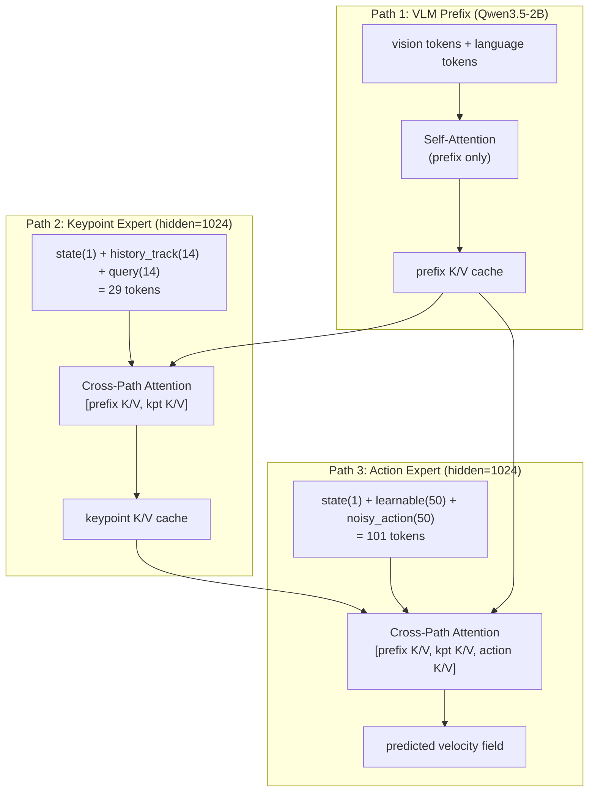

# InternVLA-A1.5 + GeoPredict 3D 关键点轨迹融合版在 RoboTwin 2.0 上的评估实施方案与操作手册

> 本手册详细说明如何在本机（GCP Blackwell 实例）上使用 [RoboTwin 2.0](https://robotwin-platform.github.io/) 仿真平台的 `stack_bowls_three` 任务评估 **InternVLA-A1.5 + GeoPredict 3D 关键点轨迹预测器融合版**（以下简称 **itvlaGp**）的 checkpoint 权重。
>
> **与基线版的核心区别**：itvlaGp 在标准 InternVLA-A1.5 的 2-path（VLM prefix + action expert）架构基础上增加了第三条路径——**关键点专家（keypoint expert）**，形成 **3-path Mixture-of-Transformers (MoT)** 架构。推理时从 SAPIEN 机器人的 14 个关节链接实时提取 3D 关键点，通过 TrackEncoder（移植自 [GeoPredict](https://arxiv.org/abs/2501.01787)）编码历史轨迹，再由关键点专家处理后其 K/V 缓存供动作专家在 flow matching 去噪循环中注意力查询。
>
> **本机配置**：2× NVIDIA RTX PRO 6000 Blackwell Server Edition（96 GB VRAM × 2）、CUDA 12.8.2、Ubuntu on GCP。RoboTwin 2.0 已在 `/home/luogang/share/zwy/Projects/RoboTwin/` 完整安装。
>
> **参考文档**：
> - 基线版评估手册：[`/home/luogang/SRC/Robot/InternVLA-A-series/b/d/p/reprd_rbtwn_stackb3_eval6000.md`](../../../InternVLA-A-series/b/d/p/reprd_rbtwn_stackb3_eval6000.md)
> - itvlaGp 架构设计：[`itrnVLA15_GeoP_3dtrj_3cn2.md`](itrnVLA15_GeoP_3dtrj_3cn2.md)
> - ALOHA 双臂适配：[`itrnVLA15_GeoP_3dtrj_3cn2_rbt2stak3.md`](itrnVLA15_GeoP_3dtrj_3cn2_rbt2stak3.md)
> - 微调实施手册：[`itrnVLA15_GeoP_3dtrj_3cn2_sft_rbt2_2.md`](itrnVLA15_GeoP_3dtrj_3cn2_sft_rbt2_2.md)
> - Phase 2 训练日志：[`itrnVLA15_GeoP_3dtrj_3cn2_sft_rbt2_2LOG_p2.md`](itrnVLA15_GeoP_3dtrj_3cn2_sft_rbt2_2LOG_p2.md)

---

## 目录

- [Part A：评估实施方案与操作手册](#part-a评估实施方案与操作手册)
  - [0. 评估方案概览](#0-评估方案概览)
  - [1. 环境准备](#1-环境准备)
  - [2. itvlaGp 3-path 推理架构深度解读](#2-itvlagp-3-path-推理架构深度解读)
  - [3. 评估代码解读（inference.py 中的关键点支持）](#3-评估代码解读inferencepy-中的关键点支持)
  - [4. 全流程验证检查表](#4-全流程验证检查表)
  - [5. 冒烟测试（2 episode 快速验证）](#5-冒烟测试2-episode-快速验证)
  - [6. 正式评估执行](#6-正式评估执行)
  - [7. 结果汇总与对比分析](#7-结果汇总与对比分析)
  - [8. 关键约束与注意事项](#8-关键约束与注意事项)
  - [9. 故障排除手册](#9-故障排除手册)
  - [10. 附录](#10-附录)
- [Part B：执行记录](#part-b执行记录)
  - [时间线 / 操作日志](#时间线--操作日志)
  - [问题记录](#问题记录报错--根因--修复--验证)
  - [最终结果](#最终结果)

---

## Part A：评估实施方案与操作手册

### 0. 评估方案概览

#### 0.1 评估目标

在 RoboTwin 2.0 的 `stack_bowls_three` 任务上评估 itvlaGp（InternVLA-A1.5 + GeoPredict 3D 关键点轨迹预测器融合版）在 Phase 2 训练 10000 步后的 checkpoint，与基线版 InternVLA-A1.5（无 GeoPredict）对比，验证 3-path MoT 关键点融合架构是否提升操作成功率。

#### 0.2 评估配置一览

| 维度 | 值 |
|------|------|
| **代码库** | `/home/luogang/SRC/Robot/itvlaGp/`（`b0728GeoP` 分支） |
| **Conda 环境** | `itvlaGp`（需新建） |
| **Checkpoint** | `outputs/internvla_a1_5/p2/checkpoints/010000/pretrained_model/` |
| **模型大小** | 5.9 GB（model.safetensors） |
| **架构** | 3-path MoT：VLM Prefix + Keypoint Expert + Action Expert |
| **关键点关节数** | 14（ALOHA 双臂，每臂 7：6 个链接 + 1 个腕部相机） |
| **推理后端** | `standard`（**必须**，optimized 不支持 3-path 关键点推理） |
| **动作模式** | `abs`（**必须**，与训练一致） |
| **RoboTwin 任务** | `stack_bowls_three`（任务索引 **46**） |
| **评测配置** | `demo_clean`（Easy）+ `demo_randomized`（Hard） |
| **每配置 episode 数** | 100 |
| **dtype** | bfloat16 |
| **GPU** | 每个评测使用 1 块 GPU（可双 GPU 并行跑两个配置） |
| **步数上限** | 1200 步/episode（`_eval_step_limit.yml`） |
| **预估时间** | 每配置 ~2.5-3 小时，双 GPU 并行共 ~3 小时 |
| **RoboTwin 平台** | `/home/luogang/share/zwy/Projects/RoboTwin/`（符号链接至 `third_party/RoboTwin`） |

#### 0.3 与基线版评估的关键差异

| 差异点 | 基线版 InternVLA-A1.5 | itvlaGp（GeoPredict 融合版） |
|--------|----------------------|---------------------------|
| 代码库 | `InternVLA-A-series` | `itvlaGp` |
| Conda 环境 | `ivla15` | `itvlaGp` |
| 模型架构 | 2-path MoT（prefix + action） | 3-path MoT（prefix + **keypoint** + action） |
| 推理时 suffix | action suffix 仅 | kpt suffix（29 token）+ action suffix |
| K/V 缓存 | prefix → denoise loop | prefix → keypoint → denoise loop |
| 推理后端 | standard 或 optimized | **仅 standard**（optimized 不支持 3-path） |
| SAPIEN 关键点提取 | 无 | 有（`get_keypoints_aloha()` 提取 14 个关节 3D 坐标） |
| 滚动历史缓冲区 | 无 | `his_kpts[1000, 14, 3]` + `his_len` |
| Checkpoint config | `enable_keypoint_predictor: false` | `enable_keypoint_predictor: true` |
| 额外模块 | 无 | TrackEncoder（~3M params）、kpt_state_proj、keypoint_embedding、keypoint_out_proj |

#### 0.4 RoboTwin 2.0 `stack_bowls_three` 任务简介

- **任务描述**：将 3 个碗依次堆叠到指定目标位置
- **机器人**：ALOHA-AgileX 双臂，14 DOF 关节空间控制
- **相机**：3 个视角（head_camera 俯视、left/right_camera 腕部）
- **成功条件**：3 个碗的 XY 位置对齐（容差 0.04m）、Z 高度分别在目标值 ±0.02m 内、双爪打开
- **步数上限**：1200 步
- **评测配置**：
  - `demo_clean`（Easy）：无域随机化
  - `demo_randomized`（Hard）：物体姿态、光照、桌面纹理/高度、杂物、语言指令 5 轴随机化

---

### 1. 环境准备

> 所有操作在 conda 环境 `itvlaGp` 中进行。

#### 1.1 创建 conda 环境

```bash
conda create -n itvlaGp python=3.10 -y
conda activate itvlaGp
```

> **为什么用 Python 3.10？** 虽然 CLAUDE.md 模板写的是 3.11，但本机验证通过的参考环境 `ivla15` 使用 3.10，且 RoboTwin 的 SAPIEN 3.0.0b1 和 mplib 0.2.1 目标版本为 3.10。`pyproject.toml` 要求 `>=3.10`。

#### 1.2 安装 PyTorch（CUDA 12.8）

```bash
pip install torch torchvision torchaudio --index-url https://download.pytorch.org/whl/cu128
```

验证：

```bash
python -c "import torch; print(f'torch={torch.__version__}, CUDA={torch.version.cuda}, GPU={torch.cuda.get_device_name(0)}')"
# 预期: torch=2.11.0+cu128, CUDA=12.8, GPU=NVIDIA RTX PRO 6000 Blackwell Server Edition
```

#### 1.3 安装 itvlaGp 包（可编辑模式）

```bash
cd /home/luogang/SRC/Robot/itvlaGp
pip install -e ".[all]"
```

这会安装 `pyproject.toml` 中的全部依赖：datasets、diffusers、accelerate、draccus、omegaconf、einops、wandb、imageio、scipy、flash-linear-attention、safetensors 等。

验证：

```bash
python -c "from lerobot.policies.internvla_a1_5.configuration_internvla_a1_5 import InternVLAA15Config; print('InternVLA-A1.5 config OK')"
python -c "from lerobot.policies.internvla_a1_5.keypoints import TrackEncoder; print('TrackEncoder OK')"
```

#### 1.4 锁定 transformers==5.2.0 并打 Qwen3.5 补丁

**关键**：transformers 必须精确为 5.2.0。更高版本（如 5.14.1）会导致 `create_causal_mask()` API 不兼容，补丁后的 `modeling_qwen3_5.py` 无法工作。这在基线版评估中已确认为 Problem #8。

```bash
pip install "transformers==5.2.0"

# 找到 transformers 安装位置
TRANSFORMERS_DIR=$(python -c "import transformers, pathlib; print(pathlib.Path(transformers.__file__).parent)")
echo "Transformers at: ${TRANSFORMERS_DIR}"

# 复制 Qwen3.5 补丁（核心：支持 knowledge insulation、3-path MoT 等自定义 attention）
cp -r src/lerobot/policies/internvla_a1_5/transformers_replace/models/* ${TRANSFORMERS_DIR}/models/

# 顺便复制 pi0/pi05 的补丁（避免间接 import 报错）
cp -r src/lerobot/policies/pi0/transformers_replace/models/* ${TRANSFORMERS_DIR}/models/ 2>/dev/null || true
cp -r src/lerobot/policies/pi05/transformers_replace/models/* ${TRANSFORMERS_DIR}/models/ 2>/dev/null || true
```

验证：

```bash
python -c "from transformers.models.qwen3_5 import Qwen3_5ForConditionalGeneration; print('Qwen3.5 patch OK')"
python -c "import transformers; assert transformers.__version__ == '5.2.0', f'Need 5.2.0, got {transformers.__version__}'"
```

> **为什么需要补丁？** itvlaGp 的 `modeling_internvla_a1_5.py` 导入了 `from transformers.models.qwen3_5 import Qwen3_5ForConditionalGeneration`，并使用了自定义 attention 修改以支持 knowledge insulation、foresight token 和 3-path MoT 的 cross-path K/V 拼接。这些修改不在上游 transformers 中。

#### 1.5 编译安装 flash-attn

**关键**：必须使用 `--no-build-isolation --no-cache-dir` 从源码编译，确保 CUDA kernel 与当前 torch ABI 匹配。使用缓存的 wheel 会导致 `undefined symbol` 运行时错误。编译时间约 15-100 分钟（取决于 MAX_JOBS）。

```bash
export CUDA_HOME=/usr/local/cuda-12.8
MAX_JOBS=16 pip install flash-attn --no-build-isolation --no-cache-dir
```

验证：

```bash
python -c "import flash_attn; print(f'flash-attn {flash_attn.__version__}')"
# 预期: flash-attn 2.8.3.post1
```

> **如果编译失败**：
> - 检查 `nvcc --version` 是否为 12.8
> - 检查 `CUDA_HOME` 是否设置为 `/usr/local/cuda-12.8`
> - 尝试 `MAX_JOBS=4` 降低并行编译任务数减少内存占用
> - 清理旧缓存：`pip cache purge`

#### 1.6 安装 flash-linear-attention 和 causal-conv1d

Qwen3.5 补丁中的 Gated DeltaNet 线性注意力层需要这两个包。

```bash
pip install flash-linear-attention==0.5.2 causal-conv1d==1.6.1 --no-build-isolation
```

验证：

```bash
python -c "import fla; print('flash-linear-attention OK')"
python -c "import causal_conv1d; print('causal-conv1d OK')"
```

#### 1.7 安装 RoboTwin 评估依赖

```bash
cd /home/luogang/SRC/Robot/itvlaGp
pip install -r evaluation/RoboTwin/requirements.txt
```

该文件安装的关键包：

| 包 | 版本 | 用途 |
|----|------|------|
| `sapien` | 3.0.0b1 | SAPIEN 物理引擎（GPU 渲染 + 碰撞） |
| `mplib` | 0.2.1 | 运动规划库（expert policy 使用） |
| `trimesh` | 4.4.3 | 3D mesh 处理 |
| `open3d` | 0.18.0 | 3D 数据处理 |
| `imageio` | 2.34.2 | 视频录制 |
| `h5py` | - | HDF5 数据格式 |
| `moviepy` | - | 视频处理 |
| `tyro` | - | CLI 参数解析 |

额外安装 gymnasium（RoboTwin 的 `_base_task.py` 需要但未列入 requirements.txt）：

```bash
pip install gymnasium
```

#### 1.8 安装 CuRobo（Blackwell sm_120）

CuRobo 是 NVIDIA 的 CUDA 加速运动规划库，仅用于评估中的 **seed 验证阶段**（运行 expert policy 验证 seed 是否可行）。Blackwell GPU（RTX PRO 6000）使用 sm_120 计算能力。

**首先检查现有编译的 CuRobo .so 文件是否已包含 sm_120**（参考环境 `ivla15` 可能已经重编译过）：

```bash
# 检查方法：看 .so 文件中是否有 sm_120
cd /home/luogang/share/zwy/Projects/RoboTwin/envs/curobo
python -c "
import subprocess, glob
so_files = glob.glob('src/curobo/curobolib/*.so')
if not so_files:
    print('WARNING: No .so files found, need full rebuild')
else:
    for f in so_files[:3]:
        r = subprocess.run(['cuobjdump', '--list-elf', f], capture_output=True, text=True)
        has_120 = 'sm_120' in r.stdout
        print(f'{f}: sm_120={has_120}')
"
```

**如果 .so 文件已包含 sm_120**（共享源码路径，`ivla15` 环境的重编译结果可直接复用）：

```bash
cd /home/luogang/share/zwy/Projects/RoboTwin/envs/curobo
pip install -e . --no-build-isolation --no-deps
```

**如果 .so 文件不包含 sm_120**（需要从头重编译，约 10-30 分钟）：

```bash
cd /home/luogang/share/zwy/Projects/RoboTwin/envs/curobo
rm -f src/curobo/curobolib/*.so
rm -rf build
TORCH_CUDA_ARCH_LIST="12.0" MAX_JOBS=32 pip install -e . --no-build-isolation --no-cache-dir --force-reinstall --no-deps
```

> **注意**：CuRobo 以可编辑模式安装在共享源码目录 `/home/luogang/share/zwy/Projects/RoboTwin/envs/curobo/`。重编译 .so 文件会影响所有使用该目录的 conda 环境（`ivla15`、`RoboTwin`、`starVLA` 等）。如果这些环境也需要 sm_120（在同一台 Blackwell 机器上），这不是问题。

验证：

```bash
cd /home/luogang/SRC/Robot/itvlaGp
python -c "import curobo; print('CuRobo OK')"
```

> **如果 import 失败提示 "no kernel image is available for execution on the device"**：需要按上面的重编译步骤操作。

#### 1.9 安装 ffmpeg

```bash
conda install -c conda-forge "ffmpeg>=7" -y
```

验证：

```bash
ffmpeg -version 2>/dev/null | head -1
# 预期: ffmpeg version 7.x 或更高
```

#### 1.10 打 SAPIEN 和 mplib 补丁

RoboTwin 需要对 SAPIEN 的 URDF 加载器和 mplib 的运动规划器做两个补丁：

```bash
conda activate itvlaGp

# ---- 补丁 1：SAPIEN urdf_loader.py — 添加 encoding="utf-8" ----
# 原因：URDF 文件中含有非 ASCII 字符时，默认编码会导致读取错误
SAPIEN_LOCATION=$(pip show sapien | grep 'Location' | awk '{print $2}')/sapien
URDF_LOADER=${SAPIEN_LOCATION}/wrapper/urdf_loader.py
if [ -f "${URDF_LOADER}" ]; then
    sed -i -E 's/("r")(\))( as)/\1, encoding="utf-8") as/g' "${URDF_LOADER}"
    echo "✓ SAPIEN urdf_loader.py patched"
else
    echo "WARNING: urdf_loader.py not found at ${URDF_LOADER}"
fi

# ---- 补丁 2：mplib planner.py — 移除 'or collide' 条件 ----
# 原因：移除运动规划中过于保守的碰撞检测短路条件，否则 expert policy 在某些配置下会放弃规划
MPLIB_LOCATION=$(pip show mplib | grep 'Location' | awk '{print $2}')/mplib
PLANNER=${MPLIB_LOCATION}/planner.py
if [ -f "${PLANNER}" ]; then
    sed -i -E 's/(if np.linalg.norm\(delta_twist\) < 1e-4 )(or collide )(or not within_joint_limit:)/\1\3/g' "${PLANNER}"
    echo "✓ mplib planner.py patched"
else
    echo "WARNING: planner.py not found at ${PLANNER}"
fi
```

验证补丁是否生效：

```bash
# 检查 SAPIEN 补丁
grep 'encoding="utf-8"' ${URDF_LOADER} && echo "SAPIEN patch confirmed" || echo "SAPIEN patch MISSING"

# 检查 mplib 补丁（应该不再包含 'or collide'）
grep 'or collide' ${PLANNER} && echo "mplib patch MISSING" || echo "mplib patch confirmed"
```

#### 1.11 创建 RoboTwin 符号链接

`inference.py` 在代码中硬编码了 `ROBOTWIN_ROOT = REPO_ROOT / "third_party" / "RoboTwin"`（第 20-21 行），因此必须在 `third_party/` 下提供 RoboTwin。本机已在 `/home/luogang/share/zwy/Projects/RoboTwin/` 有完整安装（含 50 个任务环境、3D 资产、已编译的 CuRobo），用符号链接即可：

```bash
cd /home/luogang/SRC/Robot/itvlaGp
mkdir -p third_party
ln -sfn /home/luogang/share/zwy/Projects/RoboTwin third_party/RoboTwin
```

验证：

```bash
ls third_party/RoboTwin/envs/__init__.py && echo "RoboTwin link OK"
ls third_party/RoboTwin/envs/stack_bowls_three.py && echo "stack_bowls_three task OK"
ls third_party/RoboTwin/assets/embodiments/aloha-agilex/ && echo "ALOHA assets OK"
```

#### 1.12 环境变量配置

创建激活脚本便于每次评估前快速配置：

```bash
cat > /home/luogang/SRC/Robot/itvlaGp/activate_itvlaGp.sh << 'ACTIVATE_EOF'
#!/usr/bin/env bash
# itvlaGp 评估环境激活脚本
conda activate itvlaGp
export REPO_ROOT=/home/luogang/SRC/Robot/itvlaGp
export PYTHONPATH="${REPO_ROOT}/src:${REPO_ROOT}/third_party/RoboTwin:${PYTHONPATH:-}"
export HF_HOME="${HOME}/.cache/huggingface"
export TOKENIZERS_PARALLELISM=false
export CUDA_HOME=/usr/local/cuda-12.8
export LD_LIBRARY_PATH="${CUDA_HOME}/lib64:${LD_LIBRARY_PATH:-}"
echo "itvlaGp evaluation environment activated."
echo "  REPO_ROOT=${REPO_ROOT}"
echo "  PYTHONPATH includes src/ and third_party/RoboTwin"
echo "  CUDA_HOME=${CUDA_HOME}"
ACTIVATE_EOF
chmod +x /home/luogang/SRC/Robot/itvlaGp/activate_itvlaGp.sh
```

使用方式：

```bash
source /home/luogang/SRC/Robot/itvlaGp/activate_itvlaGp.sh
```

---

### 2. itvlaGp 3-path 推理架构深度解读

> 本节深入分析 itvlaGp 在推理时的数据流和模型组件交互，帮助理解评估过程中各模块的角色。

#### 2.1 三条路径的结构

itvlaGp 在标准 Qwen3.5-2B VLM 骨干上附加了两个独立的 Expert 模块，共形成三条并行路径：



**注意力规则**（定义于 `compute_layer_complete_3path`，`modeling_internvla_a1_5.py:343-553`）：

| 路径 | Queries 能看到的 K/V | Knowledge Insulation |
|------|---------------------|---------------------|
| VLM Prefix | 仅 prefix 自身 | — |
| Keypoint Expert | prefix（可选 detach）+ kpt 自身 | `knowledge_insulation_kpt=True` → detach prefix K/V |
| Action Expert | prefix（可选 detach）+ kpt（可选 detach）+ action 自身 | `knowledge_insulation=True` → detach prefix K/V |

#### 2.2 关键点 suffix 的构建

关键点 suffix 由 `embed_kpt_suffix()` 方法（`modeling_internvla_a1_5.py:1562-1617`）构建，总共 29 个 token（对于 J=14 关节）：

```
kpt_suffix = [state_token(1), history_track_tokens(14), query_tokens(14)]
```

1. **state_token**（1 个）：机器人关节状态经 `kpt_state_proj(Linear(32→1024))` 投影
2. **history_track_tokens**（14 个）：`TrackEncoder` 对 `his_kpts[H, 14, 3]` 历史轨迹编码，每个关节产生 1 个 1024 维 token
3. **query_tokens**（14 个）：`keypoint_embedding(Embedding(14, 1024))` 的可学习权重，用于查询当前和未来的 3D 关键点位置

#### 2.3 TrackEncoder 架构

`TrackEncoder`（`keypoints.py:244-313`）是从 GeoPredict 移植的核心编码器，将 3D 点轨迹历史编码为固定维度的 per-joint token：

```
输入: his_kpts [B, H, J, 3]  （H 帧历史，J=14 关节，3D 坐标）
  ↓
PointPatchEmbedding: 1D 卷积时间分片 → [B, num_patches, J, 256]
  ↓
CrossAttentionBlock: 可学习 queries 对分片的 cross-attention（附加时间位置编码）
  ↓
linear_transform: Sequential(Linear, ReLU, Dropout, Linear) → [B, J, 512]
  ↓
final_norm: LayerNorm
  ↓
track_fusion_layer: Linear(512→1024) → [B, J, 1024]
  ↓
输出: [B, J*1, 1024]  （J 个 per-joint tokens）
```

> **注意**：GeoPredict 原始的 `track_fusion_layer` 输出维度是 2048，本移植版改为 1024 以匹配 keypoint expert 的 hidden_size。因此权重加载时跳过 `track_fusion_layer`，使用随机初始化 + Phase 1 训练。

#### 2.4 推理数据流（sample_actions）

推理入口是 `InternVLAA15.sample_actions()`（`modeling_internvla_a1_5.py:1274-1398`）。完整数据流：

```
Step 1: 嵌入 VLM prefix（vision + language tokens）→ use_cache=True → prefix K/V cache
  |
Step 2: 构建 kpt suffix（embed_kpt_suffix）
  |→ kpt_state_proj(state) → 1 token
  |→ TrackEncoder(his_kpts, his_len) → 14 tokens
  |→ keypoint_embedding.weight → 14 tokens
  |→ 合并为 29 tokens
  |
Step 3: 前向计算 kpt suffix → inputs_embeds=[None, kpt_embs, None]
  |→ 3-path forward：仅计算 keypoint expert，prefix 从 cache 读取
  |→ kpt K/V cache 追加到 past_key_values
  |→ 此步仅执行 **1 次/env step**
  |
Step 4: Flow Matching 去噪循环（10 步）
  |→ 每步：构建 action suffix（state + learnable + noisy actions = 101 tokens）
  |→ inputs_embeds=[None, None, suffix_embs]
  |→ 3-path forward：仅计算 action expert，prefix+kpt 从 cache 读取
  |→ 读取 outputs_embeds[2][-chunk_size:]
  |→ action_out_proj → velocity field
  |→ 更新 action = action + dt * velocity（Euler 积分）
  |
Step 5: 返回 action chunk [B, chunk_size, action_dim]
```

**性能关键点**：关键点 cache 在每个 env step 只计算 **1 次**（29 tokens），之后在 10 次去噪迭代中复用。这保证了关键点融合不会显著增加推理延迟。

#### 2.5 Optimized 后端为何不支持关键点

`InternVLAA15Optimized`（`modeling_internvla_a1_5_optimized.py`）继承自 `InternVLAA15`，但其 `sample_actions()` 方法（第 422 行）的参数签名中 **没有** `his_kpts` 和 `his_len` 参数。它仅使用 2-path `[prefix, action]` 前向传播，不支持关键点 suffix 的 K/V 缓存构建。使用 optimized 后端会 **静默忽略** 关键点数据，使 keypoint expert 形同虚设，导致评估结果无意义。

**因此，评估 itvlaGp checkpoint 时必须使用 `--inference-backend standard`。**

---

### 3. 评估代码解读（inference.py 中的关键点支持）

> 完整代码在 `evaluation/RoboTwin/inference.py`（526 行）。本节重点解读其中与 GeoPredict 关键点融合相关的部分。

#### 3.1 关键点链接定义

```python
# inference.py:45-48
ALOHA_KEYPOINT_LINKS = [
    "fl_link1", "fl_link2", "fl_link3", "fl_link4", "fl_link5", "fl_link6", "left_camera",
    "fr_link1", "fr_link2", "fr_link3", "fr_link4", "fr_link5", "fr_link6", "right_camera",
]
```

14 个关节链接，每臂 7 个（6 个 ARX5 连杆 + 1 个腕部相机）。与训练数据中的 `util_scripts/generate_aloha_keypoints.py` 使用的链接名称完全一致。

#### 3.2 关键点提取函数

```python
# inference.py:51-77
def get_keypoints_aloha(robot_entity, footprint_pose=None):
    """Extract 14 keypoint 3D positions (footprint-relative) from SAPIEN aloha robot."""
    if footprint_pose is None:
        fp_link = robot_entity.find_link_by_name("footprint")
        footprint_pose = fp_link.get_pose()

    fp_pos = np.asarray(footprint_pose.p, dtype=np.float64)
    q = footprint_pose.q
    from scipy.spatial.transform import Rotation
    fp_rot_inv = Rotation.from_quat([q[1], q[2], q[3], q[0]]).inv().as_matrix()

    keypoints = np.zeros((14, 3), dtype=np.float32)
    for i, link_name in enumerate(ALOHA_KEYPOINT_LINKS):
        link = robot_entity.find_link_by_name(link_name)
        world_pos = np.asarray(link.get_pose().p, dtype=np.float64)
        keypoints[i] = (fp_rot_inv @ (world_pos - fp_pos)).astype(np.float32)

    return keypoints, footprint_pose
```

**核心逻辑**：
1. 获取 `footprint` 链接的 pose（固定底座，首次调用后缓存）
2. 计算 footprint 坐标系的逆旋转矩阵
3. 对每个关键点链接：获取其世界坐标 → 转为 footprint 相对坐标
4. 返回 `[14, 3]` 的关键点数组

> **坐标系约定**：footprint-relative，与训练数据（使用 pinocchio FK 从 `arx5_description_isaac.urdf` 计算）一致。

#### 3.3 推理循环中的关键点集成

```python
# inference.py:424-455（在 infer_once 函数内）
use_kpt = getattr(config, "enable_keypoint_predictor", False)
if use_kpt:
    J = getattr(config, "num_keypoint_joints", 14)
    H = getattr(config, "keypoint_history_max_len", 1000)
    his_kpts = np.zeros((H, J, 3), dtype=np.float32)
    his_len = 0
    footprint_pose = None

while task_env.take_action_cnt < task_env.step_lim:
    observation = task_env.get_obs()
    sample = build_sample(observation, task_env.get_instruction(), dtype)
    sample = input_transforms(sample)
    # ... image recording ...

    if use_kpt:
        robot_entity = task_env.robot.left_entity
        kpt_t, footprint_pose = get_keypoints_aloha(robot_entity, footprint_pose)
        if his_len < H:
            his_kpts[his_len] = kpt_t
        else:
            his_kpts = np.roll(his_kpts, -1, axis=0)
            his_kpts[-1] = kpt_t
        his_len = min(his_len + 1, H)

    if not action_plan:
        batch = to_policy_batch(sample, device, dtype)
        if use_kpt:
            batch["observation.his_kpts"] = torch.from_numpy(his_kpts).unsqueeze(0).to(device=device, dtype=dtype)
            batch["observation.his_len"] = torch.tensor([his_len], dtype=torch.long, device=device)
        with torch.no_grad():
            action_pred = policy.predict_action_chunk(batch)
        # ... action post-processing ...
```

**数据流**：
1. **初始化**：创建 `his_kpts[1000, 14, 3]` 滚动缓冲区和 `his_len` 计数器
2. **每个 env step**：
   - 从 SAPIEN 机器人提取当前 14 个关节的 3D 坐标
   - 追加到滚动缓冲区（超过 1000 帧则滚动丢弃最旧帧）
   - 递增 `his_len`（上限 1000）
3. **每次策略预测**（每 `infer_horizon` 步触发一次）：
   - 将 `his_kpts` 和 `his_len` 打包为 tensor 加入 batch
   - 传递给 `policy.predict_action_chunk(batch)`
   - 模型内部调用 `sample_actions()` 执行 3-path 推理

#### 3.4 动作后处理

动作后处理与基线版完全一致：

1. `compact_reordered_dual_arm_actions()`：将 16 维重排序动作压缩回 14 维（跳过 indices 6, 14, 15）
2. `unnormalize_fn`：使用 `stats.json` 中的 `aloha.action.mean/std` 反标准化
3. 如果 `action_mode=delta`（本次评估不使用），加上当前关节角
4. gripper 值（indices 6, 13）裁剪到 [0, 1]

#### 3.5 关键注意事项

| 注意事项 | 说明 |
|---------|------|
| `robot_entity` 必须有效 | 关键点提取使用 `task_env.robot.left_entity`，如果 `close_env()` 已被调用（会将 `robot` 设为 None），将导致 AttributeError。itvlaGp 版的 `inference.py` 已修复此 bug（`check_success()` 在 `close_env()` 之前调用）。 |
| `his_len` 的含义 | 当 `his_len < H` 时，仅 `his_kpts[:his_len]` 是有效数据，后面是零填充。TrackEncoder 使用 `his_len` 来忽略零填充帧。 |
| 首帧关键点 | 第一个 env step 的 `his_len=1`，只有 1 帧历史。TrackEncoder 的 PointPatchEmbedding 使用 stride=4 的 1D 卷积，因此 <4 帧时实际使用的 patch 数为 1（zero-padded）。 |
| `footprint_pose` 缓存 | ALOHA 底座固定不动，footprint pose 首次提取后缓存，避免重复查询。 |
| dtype 一致性 | `his_kpts` 以 float32 提取，转为 batch tensor 时转换为 dtype（bfloat16）。 |

---

### 4. 全流程验证检查表

> 在开始正式评估前，运行以下 15 项检查确认所有组件就绪。

```bash
conda activate itvlaGp
cd /home/luogang/SRC/Robot/itvlaGp
export REPO_ROOT=/home/luogang/SRC/Robot/itvlaGp
export PYTHONPATH="${REPO_ROOT}/src:${REPO_ROOT}/third_party/RoboTwin:${PYTHONPATH:-}"
export TOKENIZERS_PARALLELISM=false
export CUDA_HOME=/usr/local/cuda-12.8

echo "=== 1. PyTorch + CUDA ==="
python -c "import torch; print(f'torch={torch.__version__}, CUDA={torch.version.cuda}, GPU={torch.cuda.get_device_name(0)}')"

echo "=== 2. transformers 版本（必须 5.2.0）==="
python -c "import transformers; v=transformers.__version__; print(f'transformers={v}'); assert v=='5.2.0', f'FAIL: need 5.2.0, got {v}'"

echo "=== 3. Qwen3.5 补丁 ==="
python -c "from transformers.models.qwen3_5 import Qwen3_5ForConditionalGeneration; print('Qwen3.5 patch OK')"

echo "=== 4. flash-attn ==="
python -c "import flash_attn; print(f'flash-attn {flash_attn.__version__}')"

echo "=== 5. flash-linear-attention + causal-conv1d ==="
python -c "import fla; print('fla OK')"
python -c "import causal_conv1d; print('causal_conv1d OK')"

echo "=== 6. SAPIEN ==="
python -c "import sapien; print(f'SAPIEN {sapien.__version__}')"

echo "=== 7. mplib ==="
python -c "import mplib; print(f'mplib {mplib.__version__}')"

echo "=== 8. CuRobo ==="
python -c "import curobo; print('CuRobo OK')"

echo "=== 9. gymnasium ==="
python -c "import gymnasium; print(f'gymnasium {gymnasium.__version__}')"

echo "=== 10. RoboTwin 环境 ==="
cd ${REPO_ROOT}/third_party/RoboTwin
python -c "from envs import CONFIGS_PATH; print(f'RoboTwin configs: {CONFIGS_PATH}')"
cd ${REPO_ROOT}

echo "=== 11. InternVLA-A1.5 policy ==="
python -c "from lerobot.policies.internvla_a1_5.configuration_internvla_a1_5 import InternVLAA15Config; print('Config OK')"

echo "=== 12. TrackEncoder（GeoPredict 关键点模块）==="
python -c "from lerobot.policies.internvla_a1_5.keypoints import TrackEncoder; print('TrackEncoder OK')"

echo "=== 13. Checkpoint 完整性检查 ==="
python -c "
import json
ckpt='${REPO_ROOT}/outputs/internvla_a1_5/p2/checkpoints/010000/pretrained_model'
with open(f'{ckpt}/config.json') as f: cfg = json.load(f)
assert cfg['type'] == 'internvla_a1_5', f'Bad type: {cfg[\"type\"]}'
assert cfg['enable_keypoint_predictor'] == True, 'keypoint predictor not enabled!'
assert cfg['num_keypoint_joints'] == 14, f'Expected 14 joints, got {cfg[\"num_keypoint_joints\"]}'
assert cfg['action_loss_only'] == True, 'action_loss_only must be True'
print(f'Config OK: type={cfg[\"type\"]}, kpt_enabled=True, joints=14, action_loss_only=True')
with open(f'{ckpt}/stats.json') as f: stats = json.load(f)
assert 'aloha' in stats, 'Missing aloha key in stats.json'
assert len(stats['aloha']['observation.state']['mean']) == 14, f'State dim != 14'
assert len(stats['aloha']['action']['mean']) == 14, f'Action dim != 14'
print(f'Stats OK: aloha key present, state_dim=14, action_dim=14')
"

echo "=== 14. EGL 渲染 ==="
python -c "import sapien; scene = sapien.Scene(); print('EGL rendering OK')"

echo "=== 15. ffmpeg ==="
ffmpeg -version 2>/dev/null | head -1 || echo "WARNING: ffmpeg not in PATH"
```

**预期结果**：15 项全部通过。SAPIEN 可能显示 deprecation 警告，不影响功能。

---

### 5. 冒烟测试（2 episode 快速验证）

> 在投入 100 episode 的多小时正式评估前，先用 2 个 episode 做端到端验证。

#### 5.1 执行冒烟测试

```bash
conda activate itvlaGp
export REPO_ROOT=/home/luogang/SRC/Robot/itvlaGp
export PYTHONPATH="${REPO_ROOT}/src:${REPO_ROOT}/third_party/RoboTwin:${PYTHONPATH:-}"
export TOKENIZERS_PARALLELISM=false
export CUDA_VISIBLE_DEVICES=0

CKPT=${REPO_ROOT}/outputs/internvla_a1_5/p2/checkpoints/010000/pretrained_model
SMOKE_OUT=${REPO_ROOT}/outputs/robotwin/itvlaGp_p2_010k/smoke

mkdir -p ${REPO_ROOT}/outputs/logs

cd ${REPO_ROOT}/third_party/RoboTwin

python -u ${REPO_ROOT}/evaluation/RoboTwin/inference.py \
  --ckpt-path "${CKPT}" \
  --video-dir "${SMOKE_OUT}/robotwin/demo_clean/stack_bowls_three" \
  --task-config demo_clean \
  --task-idx 46 \
  --action-mode abs \
  --infer-horizon 20 \
  --inference-backend standard \
  --num-episodes 2 \
  --dtype bfloat16 \
  2>&1 | tee ${REPO_ROOT}/outputs/logs/smoke_itvlaGp_p2_010k.log
```

#### 5.2 检查冒烟测试结果

```bash
# 检查退出码
echo "Exit code: $?"

# 检查生成的视频文件
ls -la ${SMOKE_OUT}/robotwin/demo_clean/stack_bowls_three/*.mp4 2>/dev/null

# 检查日志中是否有关键点相关的错误
grep -i -E "error|exception|traceback|his_kpts|left_entity" ${REPO_ROOT}/outputs/logs/smoke_itvlaGp_p2_010k.log

# 检查 GPU 使用情况
nvidia-smi
```

**预期结果**：

| 检查项 | 预期 |
|--------|------|
| 退出码 | 0 |
| 视频文件 | 2 个 .mp4（success_1.mp4 或 failure_1.mp4 + success_2.mp4 或 failure_2.mp4） |
| 错误日志 | 无 Error/Exception/Traceback |
| GPU 显存 | 模型加载约 12-15 GB（bfloat16，无 WAN） |
| 运行时间 | 2-5 分钟 |

#### 5.3 冒烟测试排错

如果冒烟测试失败，按以下顺序排查：

1. **段错误 / SAPIEN 崩溃**：检查 EGL 渲染（`python -c "import sapien; sapien.Scene()"`），确认无头服务器环境支持 GPU 渲染
2. **CuRobo sm_120 错误**：如果进程卡住（CPU 高、GPU 0%），检查日志文件中是否有 "no kernel image" 错误。参见 [9.2 CuRobo sm_120 问题](#92-curobo-sm_120-缺失)
3. **关键点提取报错**：检查 `task_env.robot.left_entity` 是否为 None。参见 [9.3 check_success 排序 bug](#93-check_success-排序-bug)
4. **模型加载失败**：检查 config.json 中的 `type` 字段是否为 `internvla_a1_5`，以及 `enable_keypoint_predictor` 是否为 `true`
5. **transformers 版本不匹配**：检查 `python -c "import transformers; print(transformers.__version__)"` 是否为 5.2.0

---

### 6. 正式评估执行

> 冒烟测试通过后，执行正式的 100 episode 评估。双 GPU 可并行运行 demo_clean 和 demo_randomized。

#### 6.1 demo_clean 评估（GPU 0）

```bash
# 终端 1
conda activate itvlaGp
export REPO_ROOT=/home/luogang/SRC/Robot/itvlaGp
export PYTHONPATH="${REPO_ROOT}/src:${REPO_ROOT}/third_party/RoboTwin:${PYTHONPATH:-}"
export TOKENIZERS_PARALLELISM=false
export CUDA_VISIBLE_DEVICES=0

CKPT=${REPO_ROOT}/outputs/internvla_a1_5/p2/checkpoints/010000/pretrained_model
OUT=${REPO_ROOT}/outputs/robotwin/itvlaGp_p2_010k
mkdir -p ${REPO_ROOT}/outputs/logs

cd ${REPO_ROOT}/third_party/RoboTwin

nohup python -u ${REPO_ROOT}/evaluation/RoboTwin/inference.py \
  --ckpt-path "${CKPT}" \
  --video-dir "${OUT}/robotwin/demo_clean/stack_bowls_three" \
  --task-config demo_clean \
  --task-idx 46 \
  --action-mode abs \
  --infer-horizon 20 \
  --inference-backend standard \
  --num-episodes 100 \
  --dtype bfloat16 \
  > ${REPO_ROOT}/outputs/logs/eval_itvlaGp_p2_010k_demo_clean.log 2>&1 &

echo "demo_clean PID: $!"
```

#### 6.2 demo_randomized 评估（GPU 1）

```bash
# 终端 2
conda activate itvlaGp
export REPO_ROOT=/home/luogang/SRC/Robot/itvlaGp
export PYTHONPATH="${REPO_ROOT}/src:${REPO_ROOT}/third_party/RoboTwin:${PYTHONPATH:-}"
export TOKENIZERS_PARALLELISM=false
export CUDA_VISIBLE_DEVICES=1

CKPT=${REPO_ROOT}/outputs/internvla_a1_5/p2/checkpoints/010000/pretrained_model
OUT=${REPO_ROOT}/outputs/robotwin/itvlaGp_p2_010k
mkdir -p ${REPO_ROOT}/outputs/logs

cd ${REPO_ROOT}/third_party/RoboTwin

nohup python -u ${REPO_ROOT}/evaluation/RoboTwin/inference.py \
  --ckpt-path "${CKPT}" \
  --video-dir "${OUT}/robotwin/demo_randomized/stack_bowls_three" \
  --task-config demo_randomized \
  --task-idx 46 \
  --action-mode abs \
  --infer-horizon 20 \
  --inference-backend standard \
  --num-episodes 100 \
  --dtype bfloat16 \
  > ${REPO_ROOT}/outputs/logs/eval_itvlaGp_p2_010k_demo_randomized.log 2>&1 &

echo "demo_randomized PID: $!"
```

#### 6.3 进度监控

```bash
# 终端 3：实时监控进度
watch -n 60 '
echo "===== $(date) ====="
echo ""
echo "--- demo_clean ---"
S=$(ls /home/luogang/SRC/Robot/itvlaGp/outputs/robotwin/itvlaGp_p2_010k/robotwin/demo_clean/stack_bowls_three/success_*.mp4 2>/dev/null | wc -l)
F=$(ls /home/luogang/SRC/Robot/itvlaGp/outputs/robotwin/itvlaGp_p2_010k/robotwin/demo_clean/stack_bowls_three/failure_*.mp4 2>/dev/null | wc -l)
T=$((S+F))
echo "  $T/100 episodes done, $S successes, $F failures"
if [ $T -gt 0 ]; then echo "  Success rate: $(echo "scale=1; $S*100/$T" | bc)%"; fi
echo ""
echo "--- demo_randomized ---"
S=$(ls /home/luogang/SRC/Robot/itvlaGp/outputs/robotwin/itvlaGp_p2_010k/robotwin/demo_randomized/stack_bowls_three/success_*.mp4 2>/dev/null | wc -l)
F=$(ls /home/luogang/SRC/Robot/itvlaGp/outputs/robotwin/itvlaGp_p2_010k/robotwin/demo_randomized/stack_bowls_three/failure_*.mp4 2>/dev/null | wc -l)
T=$((S+F))
echo "  $T/100 episodes done, $S successes, $F failures"
if [ $T -gt 0 ]; then echo "  Success rate: $(echo "scale=1; $S*100/$T" | bc)%"; fi
echo ""
echo "--- GPU Status ---"
nvidia-smi --query-gpu=index,utilization.gpu,memory.used,memory.total --format=csv,noheader
echo ""
echo "--- Disk ---"
df -h / | tail -1
'
```

也可以 tail 日志文件查看详细进度：

```bash
tail -f /home/luogang/SRC/Robot/itvlaGp/outputs/logs/eval_itvlaGp_p2_010k_demo_clean.log
```

#### 6.4 时间估算

| 配置 | 预估时间 | 说明 |
|------|---------|------|
| demo_clean | ~150 分钟（2.5h） | seed 验证通过率高，扫描种子数少 |
| demo_randomized | ~170 分钟（2.8h） | 域随机化导致更多 seed 失败，需扫描更多种子 |
| **双 GPU 并行总时间** | **~170 分钟（2.8h）** | 受限于较慢的 demo_randomized |

> **注意**：itvlaGp 的 3-path 推理（多了 29 个 kpt token 的 K/V 缓存构建）理论上比基线版稍慢，但关键点缓存仅每 env step 计算一次，且 kpt suffix 只有 29 tokens（远小于 prefix 的数百 tokens），因此延迟增加极小（<5%）。

#### 6.5 中断恢复

**重要**：`inference.py` 的 `main()` 函数在启动时会 `shutil.rmtree(args.video_dir)`（第 515-516 行），**删除指定输出目录下的所有内容**。

因此，如果评估中断（如机器重启、OOM、手动 kill），**不能直接重启**——已完成的 episode 视频会被删除。

**应对方案**：

1. **中断前备份**：
   ```bash
   cp -r outputs/robotwin/itvlaGp_p2_010k/robotwin/demo_clean/stack_bowls_three \
         outputs/robotwin/itvlaGp_p2_010k/robotwin/demo_clean/stack_bowls_three_backup
   ```

2. **从中断处继续**：无直接支持。可以修改 `inference.py` 注释掉 `shutil.rmtree` 行（第 516 行），并手动设置 `--seed` 和 `--num-episodes` 参数来跳过已完成的 episode。但这需要小心处理 seed 序列的一致性。

3. **推荐做法**：使用 `nohup` 运行（如 6.1 所示），确保 SSH 断连不影响进程。如果确实需要中断，先备份输出目录。

---

### 7. 结果汇总与对比分析

#### 7.1 使用结果汇总脚本

```bash
cd /home/luogang/SRC/Robot/itvlaGp
python util_scripts/robotwin_result_stats.py outputs/robotwin/itvlaGp_p2_010k
```

输出文件：`outputs/robotwin/itvlaGp_p2_010k/results_robotwin.csv`

#### 7.2 手动计数（备用）

```bash
echo "=== itvlaGp Phase2 Step 10000 Evaluation Results ==="
echo ""
echo "--- demo_clean ---"
S_C=$(ls outputs/robotwin/itvlaGp_p2_010k/robotwin/demo_clean/stack_bowls_three/success_*.mp4 2>/dev/null | wc -l)
F_C=$(ls outputs/robotwin/itvlaGp_p2_010k/robotwin/demo_clean/stack_bowls_three/failure_*.mp4 2>/dev/null | wc -l)
T_C=$((S_C+F_C))
echo "  Successes: ${S_C}"
echo "  Failures:  ${F_C}"
echo "  Total:     ${T_C}"
echo "  Rate:      $(echo "scale=1; ${S_C}*100/${T_C}" | bc)%"
echo ""
echo "--- demo_randomized ---"
S_R=$(ls outputs/robotwin/itvlaGp_p2_010k/robotwin/demo_randomized/stack_bowls_three/success_*.mp4 2>/dev/null | wc -l)
F_R=$(ls outputs/robotwin/itvlaGp_p2_010k/robotwin/demo_randomized/stack_bowls_three/failure_*.mp4 2>/dev/null | wc -l)
T_R=$((S_R+F_R))
echo "  Successes: ${S_R}"
echo "  Failures:  ${F_R}"
echo "  Total:     ${T_R}"
echo "  Rate:      $(echo "scale=1; ${S_R}*100/${T_R}" | bc)%"
```

#### 7.3 与基线版对比

| 模型 | 训练步数 | demo_clean | demo_randomized | 备注 |
|------|---------|------------|-----------------|------|
| InternVLA-A1.5 base (rbtwn2/10000) | 10000 | 71.0% (71/100) | 54.0% (54/100) | 2-path，无关键点 |
| GR00T 0.8B | — | 62.0% | 57.0% | 基线参考 |
| **itvlaGp (p2/010000)** | **10000** | **TBD** | **TBD** | **3-path，关键点融合** |

**分析维度**：

1. **成功率提升**：关键点融合是否提高了 stack_bowls_three 的成功率？
2. **demo_clean vs demo_randomized**：关键点融合在域随机化条件下是否更鲁棒？（关键点是 3D 几何特征，理论上对视觉干扰更不敏感）
3. **失败模式分析**：检查 failure 视频，关注：
   - 是否抓取位置更准确（关键点提供了精确的 3D 位姿信息）
   - 是否堆叠对齐更好
   - 是否出现新的失败模式（如关键点噪声导致的抖动）

#### 7.4 评估其他 checkpoint 步数

p2 训练目录有每 1000 步的 checkpoint（001000 到 010000）：

```bash
ls outputs/internvla_a1_5/p2/checkpoints/
# 001000  002000  003000  004000  005000  006000  007000  008000  009000  010000
```

如需评估其他步数（例如 step 6000）：

```bash
CKPT=${REPO_ROOT}/outputs/internvla_a1_5/p2/checkpoints/006000/pretrained_model
OUT=${REPO_ROOT}/outputs/robotwin/itvlaGp_p2_006k

# 先验证 checkpoint 存在
ls ${CKPT}/config.json ${CKPT}/model.safetensors ${CKPT}/stats.json

# 然后用与 6.1/6.2 相同的 inference.py 命令，替换 CKPT 和 OUT 路径
```

---

### 8. 关键约束与注意事项

#### 8.1 必须使用 standard 推理后端

| 参数 | 要求 | 原因 |
|------|------|------|
| `--inference-backend` | `standard` | `InternVLAA15Optimized` 的 `sample_actions()` 方法（`modeling_internvla_a1_5_optimized.py:422`）不接受 `his_kpts`/`his_len` 参数，仅支持 2-path `[prefix, action]` 前向传播。使用 optimized 会 **静默忽略** 关键点数据。 |

> **如何验证在推理时确实使用了 3-path？** 检查日志中是否有 keypoint 相关的 CUDA 活动。或在 `inference.py` 的 `use_kpt` 分支添加临时打印：
> ```python
> if use_kpt and his_len == 1:
>     print(f"[DEBUG] 3-path inference active: J={J}, H={H}, his_len={his_len}")
> ```

#### 8.2 必须使用 abs 动作模式

Checkpoint 的 `train_config.json` 确认 `action_mode: "abs"`。使用 `delta` 模式会产生无意义的动作输出。

#### 8.3 task_idx 必须为 46

`stack_bowls_three` 在 `TASK_NAMES` 列表（`inference.py:80-131`）中的索引为 **46**。`eval.sh` 的默认值是 44（`stack_blocks_three`），不要使用默认值。

#### 8.4 不要使用 eval.sh 的默认 conda 环境

`eval.sh` 第 7 行硬编码 `CONDA_ENV=internvla_a1_5`（该环境不存在）。推荐 **不使用 eval.sh**，直接在已激活的 `itvlaGp` 环境中调用 `inference.py`（如第 5-6 节所示）。

如果需要使用 eval.sh，必须覆盖环境变量：

```bash
CONDA_ENV=itvlaGp bash evaluation/RoboTwin/eval.sh \
  outputs/internvla_a1_5/p2/checkpoints/010000/pretrained_model \
  outputs/robotwin/itvlaGp_p2_010k/robotwin/demo_clean/stack_bowls_three \
  demo_clean \
  46
```

但由于 eval.sh 会 `cd third_party/RoboTwin` 后使用相对路径 `../../evaluation/RoboTwin/inference.py`，而符号链接解析后物理路径可能导致相对路径计算错误（参见 [9.7 符号链接路径解析](#97-符号链接路径解析问题)），推荐直接调用 `inference.py`。

#### 8.5 video-dir 会被自动删除

`inference.py` 的 `main()` 函数（第 515-516 行）：

```python
if args.video_dir.exists():
    shutil.rmtree(args.video_dir)
```

**始终为不同的评估使用不同的 video-dir 路径**。`demo_clean` 和 `demo_randomized` 使用不同的子目录。

#### 8.6 磁盘空间

当前剩余 263 GB。每 100 episode 评估产生约 100-200 MB 视频。加上日志，总增量 <1 GB。空间充足。

---

### 9. 故障排除手册

#### 9.1 flash-attn ABI 不匹配

**症状**：`ImportError: ... undefined symbol: _ZN3c104cuda...`

**根因**：使用了与当前 torch 版本不匹配的 flash-attn 缓存 wheel。

**修复**：
```bash
pip uninstall flash-attn -y
pip cache purge
MAX_JOBS=16 pip install flash-attn --no-build-isolation --no-cache-dir
```

#### 9.2 CuRobo sm_120 缺失

**症状**：评估卡住（CPU 高占用、GPU 0% 利用率），日志无输出或显示 `CUDA error: no kernel image is available for execution on the device`。

**根因**：CuRobo 的 CUDA kernel 未编译 sm_120（Blackwell 架构）。这通常表现为 seed 验证阶段的 expert rollout 永远无法完成。

**诊断**：
```bash
# 如果进程卡住超过 5 分钟，检查日志
cat outputs/logs/smoke_itvlaGp_p2_010k.log | grep -i "kernel"

# 或直接测试 CuRobo
python -c "
import torch
import curobo
from curobo.types.math import Pose
print(f'CuRobo import OK, torch.cuda.get_device_capability()={torch.cuda.get_device_capability()}')
"
```

**修复**：
```bash
cd /home/luogang/share/zwy/Projects/RoboTwin/envs/curobo
rm -f src/curobo/curobolib/*.so
rm -rf build
TORCH_CUDA_ARCH_LIST="12.0" MAX_JOBS=32 pip install -e . --no-build-isolation --no-cache-dir --force-reinstall --no-deps
```

> 注意：这会修改共享目录中的 .so 文件，影响所有使用该 CuRobo 源码的环境。

#### 9.3 check_success 排序 bug

**症状**：`AttributeError: 'NoneType' object has no attribute 'is_left_gripper_open'` 或关键点提取时 `robot_entity` 为 None。

**根因**：`close_env()` 将 `self.robot` 设为 None，如果在 `check_success()` 之前调用则报错。

**状态**：itvlaGp 的 `inference.py` 已修复此 bug。验证修复（第 405 行先调用 `check_success()`，第 492 行 episode 结束后才调用 `maybe_close_env()`）：

```bash
grep -n "check_success\|close_env" evaluation/RoboTwin/inference.py
# 预期输出：
# 405:    if task_env.plan_success and task_env.check_success():
# 492:    maybe_close_env(task_env, ...)
```

#### 9.4 transformers 版本漂移

**症状**：`TypeError: create_causal_mask() got an unexpected keyword argument 'cache_position'`

**根因**：安装其他包时 transformers 被升级到 5.2.0 以上版本。

**修复**：
```bash
pip install "transformers==5.2.0"
# 重新打补丁
TRANSFORMERS_DIR=$(python -c "import transformers, pathlib; print(pathlib.Path(transformers.__file__).parent)")
cp -r src/lerobot/policies/internvla_a1_5/transformers_replace/models/* ${TRANSFORMERS_DIR}/models/
```

**预防**：在安装其他包时使用 `--no-deps` 避免自动升级 transformers。

#### 9.5 gymnasium 缺失

**症状**：`ModuleNotFoundError: No module named 'gymnasium'`

**修复**：`pip install gymnasium`

#### 9.6 ffmpeg libx264 不匹配

**症状**：`ffmpeg: error while loading shared libraries: libx264.so.138`

**修复**：`conda install -c conda-forge "ffmpeg>=7" -y`

#### 9.7 符号链接路径解析问题

**症状**：`python: can't open file '../../evaluation/RoboTwin/inference.py'`

**根因**：`cd third_party/RoboTwin` 后，shell 可能解析符号链接为物理路径 `/home/luogang/share/zwy/Projects/RoboTwin/`，导致相对路径 `../../` 不再指向 `itvlaGp` 仓库根目录。

**修复**：使用绝对路径调用 `inference.py`（如本手册所有命令所示）：
```bash
python -u ${REPO_ROOT}/evaluation/RoboTwin/inference.py ...
```

#### 9.8 僵尸进程

**症状**：`nvidia-smi` 显示异常的 GPU 显存占用，或前一次评估的进程仍在运行。

**诊断**：
```bash
ps aux | grep inference.py | grep -v grep
```

**修复**：
```bash
kill <PID>
# 或强制终止
kill -9 <PID>
```

**预防**：在启动新评估前，始终检查是否有遗留进程。

#### 9.9 seed 验证异常缓慢

**症状**：进度正常但非常慢（特别是 demo_randomized）。

**原因**：这是正常行为。RoboTwin 对每个 seed 先运行 expert policy 验证成功后才交给被测 policy。在 `demo_randomized` 模式下，域随机化导致更多 seed 的 expert rollout 失败或不稳定，需要扫描更多 seed 才能找到 100 个有效 seed。参考基线评估中：demo_clean 扫描 182 个 seed 找到 100 个有效的，demo_randomized 扫描 207 个。

**诊断**：看日志中 `current seed` 的值增长速度。如果每隔几分钟完成一个 episode 但 seed 号跳跃较大，这是正常的。

#### 9.10 模型加载 OOM

**症状**：`torch.cuda.OutOfMemoryError`

**不太可能发生**：模型仅 5.9 GB（bfloat16），RTX PRO 6000 有 96 GB VRAM。但如果同一 GPU 上有其他进程占用显存：

**修复**：
```bash
# 检查 GPU 显存使用
nvidia-smi

# 确保 CUDA_VISIBLE_DEVICES 设置正确，且无其他进程占用
kill <占用GPU的PID>
```

---

### 10. 附录

#### 10.1 Checkpoint 目录结构

```
outputs/internvla_a1_5/p2/checkpoints/010000/pretrained_model/
├── config.json          # 模型配置（3606 bytes）
│   ├── type: "internvla_a1_5"
│   ├── enable_keypoint_predictor: true
│   ├── num_keypoint_joints: 14
│   ├── action_loss_only: true
│   ├── inference_backend: "standard"
│   ├── knowledge_insulation: true
│   ├── knowledge_insulation_kpt: true
│   └── ...
├── model.safetensors    # 模型权重（5.9 GB）
├── stats.json           # 标准化统计量（11269 bytes）
│   └── aloha:
│       ├── observation.state: {mean, std, min, max}  # dim=14
│       └── action: {mean, std, min, max}             # dim=14
└── train_config.json    # 训练配置（12795 bytes）
    ├── dataset: "robotwin/stack_bowls_three_kpt"
    ├── batch_size: 16
    ├── steps: 10000
    └── resume: true（从 step 2000 恢复）
```

#### 10.2 训练历史简述

itvlaGp 的训练分为两个阶段：

**Phase 1（关键点专家预热）**：400 步，`train_expert_only=true`，冻结 action expert（`action_expert_lr_scale=0.1`），集中训练 keypoint expert + TrackEncoder。kpt_cur loss 从 0.54 降至 0.001（99.8% 下降）。

**Phase 2（联合训练）**：10000 步（从 Phase 1 step 300 的 checkpoint 继续），解冻 action expert（`action_expert_lr_scale=1.0`），联合训练 action + keypoint。中途 step 3000 因磁盘满中断，从 step 2000 恢复继续训练到 10000。action loss 从 0.091 降至 0.003（96.7% 下降），kpt_cur 保持在 0.0006-0.0011 范围。

Phase 2 LOG 推荐 step 5000 checkpoint 为最优。本次评估使用 step 10000 checkpoint。

#### 10.3 TASK_NAMES 索引参考

```
 0: adjust_bottle          25: place_can_basket
 1: beat_block_hammer      26: place_cans_plasticbox
 2: blocks_ranking_rgb     27: place_container_plate
 3: blocks_ranking_size    28: place_dual_shoes
 4: click_alarmclock       29: place_empty_cup
 5: click_bell             30: place_fan
 6: dump_bin_bigbin        31: place_mouse_pad
 7: grab_roller            32: place_object_basket
 8: handover_block         33: place_object_scale
 9: handover_mic           34: place_object_stand
10: hanging_mug            35: place_phone_stand
11: lift_pot               36: place_shoe
12: move_can_pot           37: press_stapler
13: move_pillbottle_pad    38: put_bottles_dustbin
14: move_playingcard_away  39: put_object_cabinet
15: move_stapler_pad       40: rotate_qrcode
16: open_laptop ⚠️         41: scan_object
17: open_microwave         42: shake_bottle
18: pick_diverse_bottles   43: shake_bottle_horizontally
19: pick_dual_bottles      44: stack_blocks_three
20: place_a2b_left         45: stack_blocks_two
21: place_a2b_right        46: stack_bowls_three ← 本次目标
22: place_bread_basket     47: stack_bowls_two
23: place_bread_skillet    48: stamp_seal
24: place_burger_fries     49: turn_switch
```

> ⚠️ `open_laptop`（index 16）存在已知的 `arm_tag` bug，评估全 benchmark 时应跳过。

#### 10.4 关键文件路径速查

| 文件 | 路径 | 作用 |
|------|------|------|
| 评估入口脚本 | `evaluation/RoboTwin/eval.sh` | Shell 包装（不推荐直接使用，见 8.4） |
| 推理脚本 | `evaluation/RoboTwin/inference.py` | 完整评估逻辑，含 GeoPredict 关键点支持 |
| 模型定义 | `src/lerobot/policies/internvla_a1_5/modeling_internvla_a1_5.py` | 3-path MoT 模型 |
| 关键点模块 | `src/lerobot/policies/internvla_a1_5/keypoints.py` | TrackEncoder（移植自 GeoPredict） |
| 优化推理后端 | `src/lerobot/policies/internvla_a1_5/modeling_internvla_a1_5_optimized.py` | **不支持关键点**，不可用 |
| 模型配置 | `src/lerobot/policies/internvla_a1_5/configuration_internvla_a1_5.py` | 含 28 个关键点相关配置字段 |
| 数据变换 | `src/lerobot/policies/internvla_a1_5/transform_internvla_a1_5.py` | Extract3DKeypointTransformFn 等 |
| Checkpoint | `outputs/internvla_a1_5/p2/checkpoints/010000/pretrained_model/` | 待评估权重 |
| 结果统计工具 | `util_scripts/robotwin_result_stats.py` | CSV 结果汇总 |
| RoboTwin 平台 | `third_party/RoboTwin/`（符号链接） | 50 个任务环境 |
| RoboTwin 评估依赖 | `evaluation/RoboTwin/requirements.txt` | SAPIEN、mplib 等 |

#### 10.5 快速命令参考

```bash
# 激活环境
source /home/luogang/SRC/Robot/itvlaGp/activate_itvlaGp.sh

# 2-episode 冒烟测试
cd ${REPO_ROOT}/third_party/RoboTwin && \
python -u ${REPO_ROOT}/evaluation/RoboTwin/inference.py \
  --ckpt-path ${REPO_ROOT}/outputs/internvla_a1_5/p2/checkpoints/010000/pretrained_model \
  --video-dir ${REPO_ROOT}/outputs/robotwin/itvlaGp_p2_010k/smoke/demo_clean/stack_bowls_three \
  --task-config demo_clean --task-idx 46 --action-mode abs --infer-horizon 20 \
  --inference-backend standard --num-episodes 2 --dtype bfloat16

# 100-episode 正式评估（demo_clean, GPU 0）
CUDA_VISIBLE_DEVICES=0 python -u ${REPO_ROOT}/evaluation/RoboTwin/inference.py \
  --ckpt-path ${REPO_ROOT}/outputs/internvla_a1_5/p2/checkpoints/010000/pretrained_model \
  --video-dir ${REPO_ROOT}/outputs/robotwin/itvlaGp_p2_010k/robotwin/demo_clean/stack_bowls_three \
  --task-config demo_clean --task-idx 46 --action-mode abs --infer-horizon 20 \
  --inference-backend standard --num-episodes 100 --dtype bfloat16

# 100-episode 正式评估（demo_randomized, GPU 1）
CUDA_VISIBLE_DEVICES=1 python -u ${REPO_ROOT}/evaluation/RoboTwin/inference.py \
  --ckpt-path ${REPO_ROOT}/outputs/internvla_a1_5/p2/checkpoints/010000/pretrained_model \
  --video-dir ${REPO_ROOT}/outputs/robotwin/itvlaGp_p2_010k/robotwin/demo_randomized/stack_bowls_three \
  --task-config demo_randomized --task-idx 46 --action-mode abs --infer-horizon 20 \
  --inference-backend standard --num-episodes 100 --dtype bfloat16

# 结果汇总
python util_scripts/robotwin_result_stats.py outputs/robotwin/itvlaGp_p2_010k

# 手动计数
ls outputs/robotwin/itvlaGp_p2_010k/robotwin/demo_clean/stack_bowls_three/success_*.mp4 | wc -l
ls outputs/robotwin/itvlaGp_p2_010k/robotwin/demo_clean/stack_bowls_three/failure_*.mp4 | wc -l
```

---

## Part B：执行记录

> 以下为实际执行时按时间顺序记录的操作日志、遇到的问题及修复、最终结果。

### 时间线 / 操作日志

| 时间 | 操作 | 结果 |
|------|------|------|
| | | |

### 问题记录（报错 → 根因 → 修复 → 验证）

| # | 问题描述 | 根因 | 修复方案 | 验证 |
|---|---------|------|---------|------|
| | | | | |

### 最终结果

| 模型 | 训练步数 | demo_clean | demo_randomized |
|------|---------|------------|-----------------|
| InternVLA-A1.5 base | 10000 | 71.0% (71/100) | 54.0% (54/100) |
| **itvlaGp (GeoPredict 融合)** | **10000** | **TBD** | **TBD** |

**评估时间**：

| 配置 | 开始时间 | 结束时间 | 耗时 | GPU |
|------|---------|---------|------|-----|
| demo_clean | | | | GPU 0 |
| demo_randomized | | | | GPU 1 |

**结论**：（待填写）
