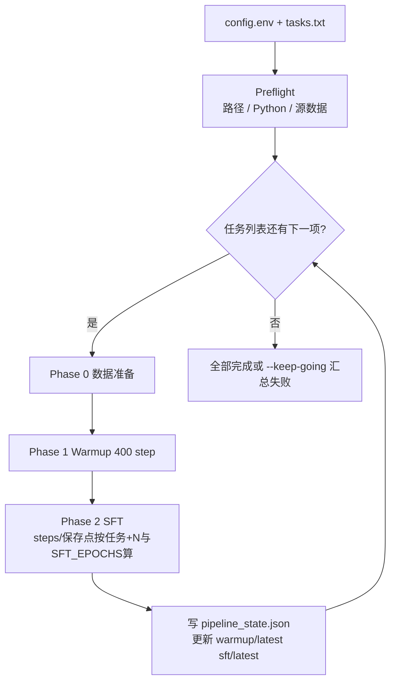
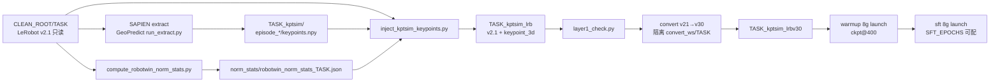
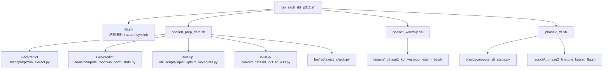

# 循环处理 RoboTwin 2.0 任务列表：数据准备 → Warmup → SFT

> **文档定位**: 把已经在单任务上跑通的三条流水线（SAPIEN 3D 关键点提取、400 step Keypoint Expert warmup、可配置总 epoch 的 SFT）收成一个**可配置、按任务串行、互不覆盖**的编排程序。SFT 的 **总 step 数与 checkpoint 保存点按每个任务的 `total_frames` 与 `SFT_EPOCHS` 单独计算**。
>
> **代码**: [`b/s/rbt/`](../../s/rbt/)（主入口 [`b/s/rbt/run_each_rbt_p012.sh`](../../s/rbt/run_each_rbt_p012.sh)）。
>
> **本机源数据**: `CLEAN_ROOT` 默认为 `/home/a26113/Dta/RoboTwin-Clean/`（**换机器必须改配置**）。该目录下每个子文件夹是一个 RoboTwin 2.0 源任务（LeRobot v2.1）。
>
> **首批任务**: `place_bread_skillet`、`pick_dual_bottles`（[`tasks.batch1.txt`](../../s/rbt/tasks.batch1.txt)）。省略 `--tasks` 时跑这一批。
>
> **原则**: 不重写提取器 / 注入器 / 转换器 / 训练 launch；只做路径隔离、阶段编排、步数换算与验收。训练超参与冻结策略对齐已跑通的 8 卡手册，不另起一套。

---

## 目录

- [0. 阅读指南](#0-阅读指南)
- [1. 目标、输入输出与非目标](#1-目标输入输出与非目标)
- [2. 总体架构](#2-总体架构)
- [3. 路径隔离与可配置目录](#3-路径隔离与可配置目录)
- [4. Phase 0：数据准备](#4-phase-0数据准备)
- [5. Phase 1：400 step Warmup](#5-phase-1400-step-warmup)
- [6. Phase 2：可配置 epoch 的 SFT](#6-phase-2可配置-epoch-的-sft)
- [7. 复用脚本对照表](#7-复用脚本对照表)
- [8. 配置项、CLI 与 Resume](#8-配置项cli-与-resume)
- [9. 落地代码结构](#9-落地代码结构)
- [10. 执行步骤](#10-执行步骤)
- [11. 任务间硬差异](#11-任务间硬差异)
- [12. 评测衔接](#12-评测衔接)
- [13. 故障排查](#13-故障排查)
- [附录 A：Warmup vs SFT 配置矩阵](#附录-awarmup-vs-sft-配置矩阵)
- [附录 B：参考文档与论文](#附录-b参考文档与论文)

---

## 0. 阅读指南

### 0.1 与已有手册的关系

本文**不重复** InternVLA-A1.5 三路径 MoT 架构、SAPIEN FK 运动学推导、或 8 卡 torchcodec 环境搭建。那些内容以原手册为准：

| 主题 | 权威文档 |
|:---|:---|
| SAPIEN 加载 URDF + `set_qpos` + link poses，\(K=14\)，体素坐标 | [GeoPredict `3dkptraj_1.md`](../../../../GeoPredict/b/d/3dkptraj_1.md)，落地日志 [`3dkptraj_1LOG.md`](../../../../GeoPredict/b/d/3dkptraj_1LOG.md)、[`3dkptraj_1_scnObj_hngMg_LOG.md`](../../../../GeoPredict/b/d/3dkptraj_1_scnObj_hngMg_LOG.md) |
| kptsim 注入、Layer-1 验收、v2.1→v3.0 | [`itrnVLA15_GeoP_3dtrj_3cn4_wrmup.md`](../itrnVLA15_GeoP_3dtrj_3cn4_wrmup.md)，任务手册 [`wrmup1G_scnObj`](../itrnVLA15_GeoP_3dtrj_3cn4_wrmup1G_scnObj.md)、[`wrmup1G_hngMg`](../itrnVLA15_GeoP_3dtrj_3cn4_wrmup1G_hngMg.md) |
| 8 卡 Warmup 400 step | [`wrmup8G.md`](../itrnVLA15_GeoP_3dtrj_3cn4_wrmup8G.md)、[`wrmup8G_LOG`](../itrnVLA15_GeoP_3dtrj_3cn4_wrmup8G_LOG.md) |
| Phase 2 超参 / 冻结矩阵 | [`sft_rbt2.md`](../itrnVLA15_GeoP_3dtrj_3cn4_sft_rbt2.md)、[`sft_rbt2_scnObj`](../itrnVLA15_GeoP_3dtrj_3cn4_sft_rbt2_scnObj.md)、[`sft_rbt2_hngMg`](../itrnVLA15_GeoP_3dtrj_3cn4_sft_rbt2_hngMg.md) |
| 三路径 MoT 与配置字段 | [`itrnVLA15_GeoP_3dtrj_3cn4.md`](../itrnVLA15_GeoP_3dtrj_3cn4.md) |

本文只回答：**给定任务名列表，怎样一台机器接一台机器、一个任务接一个任务地跑完 P0→P1→P2，并且不互相覆盖。**

### 0.2 论文出处

- InternVLA-A1.5: [arXiv:2607.04988](https://arxiv.org/abs/2607.04988)
- GeoPredict: [arXiv:2512.16811](https://arxiv.org/abs/2512.16811)

---

## 1. 目标、输入输出与非目标

### 1.1 输入

一个 RoboTwin 2.0 **任务名列表**（文件、逗号分隔、或 `all`）。省略时使用首批列表 [`b/s/rbt/tasks.batch1.txt`](../../s/rbt/tasks.batch1.txt)：

```
place_bread_skillet
pick_dual_bottles
```

任务名必须等于 `CLEAN_ROOT` 下某个**源任务子文件夹**名（含 `meta/info.json` 的 v2.1 数据集），也必须能在 [`evaluation/RoboTwin/inference.py`](../../evaluation/RoboTwin/inference.py) 的 `TASK_NAMES` 中找到（评测时用）。

`CLEAN_ROOT` 默认为 `/home/a26113/Dta/RoboTwin-Clean`，通过 `--config` 里的 `CLEAN_ROOT=` 或环境变量覆盖。不要把 `{task}_kptsim` / `_kptsim_lrb` / `_kptsim_lrbv30` 当成源任务。可用 `--list-tasks` 打印当前 `CLEAN_ROOT` 里识别出的源任务。

### 1.2 每个任务按顺序做的三件事

1. **Phase 0 数据**: 源 v2.1 → SAPIEN FK 抽 3D 关键点 → 任务专属 norm stats → 注入 `observation.keypoint_3d` → Layer-1 验收 → 转 LeRobot v3.0 → 自包含 `{task}_kptsim_lrbv30/`。
2. **Phase 1 Warmup**: 从 InternVLA-A1.5-base 出发，**400 step**，只训 action / kpt expert（VLM 冻结），写出 **ckpt@400**。
3. **Phase 2 SFT**: 从**该任务自己的** ckpt@400 出发；有效 batch 默认 **128**；**总 epoch 数由 `SFT_EPOCHS` 配置**（默认 76）。该任务的 optimizer `steps` 与 checkpoint 保存点由 `total_frames` × `SFT_EPOCHS` 自动换算。

### 1.3 输出（每个任务一份，禁止混用）

| 产物 | 默认位置 |
|:---|:---|
| kptsim npy + `keypoints_meta.json` | `${CLEAN_ROOT}/${TASK}_kptsim/` |
| 注入后 v2.1 | `${CLEAN_ROOT}/${TASK}_kptsim_lrb/` |
| 训练用 v3.0 | `${CLEAN_ROOT}/${TASK}_kptsim_lrbv30/` |
| 原始 GeoPredict 键名 norm stats | `${CKPT_ROOT}/norm_stats/robotwin_norm_stats_${TASK}.json` |
| Warmup ckpt@400 | `${CKPT_ROOT}/${TASK}/warmup/<job>/checkpoints/000400/pretrained_model` |
| SFT checkpoints | `${CKPT_ROOT}/${TASK}/sft/<job>/checkpoints/` |
| 阶段状态 | `${CKPT_ROOT}/${TASK}/pipeline_state.json` |

默认 `CKPT_ROOT=$HOME/Ckp/itvlaGp`。

### 1.4 非目标

- 不并行多个任务（同一 `MASTER_PORT` / GPU 集合）。
- 不下载 WAN / InternVLA-A1.5-base / GeoPredict 权重（必须事先放好）。
- 不跑 RoboTwin 闭环评测（只在 §12 给出衔接命令）。
- 不改模型代码。对 warmup launch 仅做了一处必要补丁：`DATA_REPO_ID` 允许环境变量覆盖（见 §7）。

---

## 2. 总体架构

### 2.1 循环编排



主入口只做四件事：读配置、解析任务列表、对每个任务导出**该任务自己的路径环境变量**、按 `--from` / `--until` 调用三个 phase 脚本。

### 2.2 单任务三阶段数据流



### 2.3 两套 Python（不要混）

| 步骤 | 解释器 | 原因 |
|:---|:---|:---|
| SAPIEN 提取 | `EXTRACT_PYTHON`（RoboTwin / SAPIEN conda） | `sapien` 不在训练 venv 里 |
| norm / inject / convert / train | `TRAIN_PYTHON`（itvlaGp venv，默认 `/tmp/itnvla15rbt20/bin/python`） | LeRobot、torchcodec、accelerate |

提取脚本必须在 **GeoPredict 仓库根** 下调用（`b.script.kpt` 的 `sys.path` 依赖 `__file__` 上溯三级）。

### 2.4 静态组件



编排层**禁止**把 launch 脚本复制一份再改硬编码任务名；一律通过环境变量注入 `DATA_REPO_ID`、`OUTPUT_DIR`、`WARMUP_CKPT`、`STEPS`。

---

## 3. 路径隔离与可配置目录

### 3.1 为什么必须按任务切开

GeoPredict 提取器为**每个数据集单独估计**世界系 → 体素系的平移 \(\mathbf{o}\)（`coord_offset` / 文档里也称 `offset_world_mean`）。`scan_object` 与 `hanging_mug` 的 offset 不同；把 `stack_bowls_three` 的 `keypoints_meta.json` 或 `norm_stat.json` 套到别的任务，warmup 的 kpt loss 会在错误坐标系里拟合，推理时 voxel 反变换也会错。

因此下列对象**禁止跨任务复用**：

- `coord_offset` / `keypoints_meta.json`
- `robotwin_norm_stats_${TASK}.json` 与训练用 `norm_stat.json`
- `{task}_kptsim_lrbv30/`
- warmup ckpt@400（SFT 的 `pretrained_path`）

### 3.2 目录布局

```
${CLEAN_ROOT}/                              # 本机默认 /home/a26113/Dta/RoboTwin-Clean
  ${TASK}/                                  # 源 v2.1，只读；每个子文件夹一个源任务
  ${TASK}_kptsim/                           # SAPIEN 产物（带后缀，--list-tasks 会跳过）
  ${TASK}_kptsim_lrb/                       # 注入后 v2.1
  ${TASK}_kptsim_lrbv30/                    # 训练用 v3.0

${CKPT_ROOT}/                               # 默认 ~/Ckp/itvlaGp
  norm_stats/robotwin_norm_stats_${TASK}.json
  .convert_ws/${TASK}/                      # 转换时短暂存在，成功后删除
  ${TASK}/
    warmup/<timestamp>-internvla_a1_5-geop-kpt-warmup-${TASK}/
      checkpoints/000100 000200 000300 000400/
      wandb/                          # wandb offline, 随本次 run 隔离
    warmup/latest -> <该次 job 目录>
    sft/<timestamp>-internvla_a1_5-geop-kpt-sft-${TASK}/
      checkpoints/<1/4> <2/4> <3/4> <final>/
      wandb/
    sft/latest -> <该次 job 目录>
    logs/phase0_<timestamp>.log  warmup_<timestamp>.log  sft_<timestamp>.log
    pipeline_state.json
```

时间戳写进 **job 目录名、wandb run name（`--job_name`）、日志文件名**。同一任务多次跑（`--no-skip-existing` 或 `--force`）会新建一个时间戳目录，**不会覆盖**上一次的 checkpoint / wandb / 日志；成功结束后只把 `latest` 指到最新一次。不要事先 `mkdir OUTPUT_DIR`：LeRobot 发现目录已存在会 `FileExistsError`。

本仓库训练**不用 TensorBoard**；曲线在 wandb（launch 默认 `mode=offline`），本地文件在该次 `OUTPUT_DIR/wandb/`。

### 3.3 训练如何找到数据（不要用 `--dataset.root`）

已有日志（[`wrmup1G_LOG` Phase 6.3](../itrnVLA15_GeoP_3dtrj_3cn4_wrmup1G_LOG.md)）证明：`--dataset.root=lrbv30` 会被 `factory.py` 再拼一层 `repo_id`，找不到 `info.json`。正确约定：

- `HF_LEROBOT_HOME` = lrbv30 的**父目录**（默认 `V30_ROOT`，通常等于 `CLEAN_ROOT`）
- `--dataset.repo_id=${TASK}_kptsim_lrbv30`

若某台机器习惯把 `HF_LEROBOT_HOME` 设成 venv 的 `var/datasets`，`lib.sh` 的 `ensure_lerobot_home_link` 会在那里建**符号链接**指向真实 lrbv30，绝不拷贝、绝不覆盖已有非链接目录。

### 3.4 转换工作区必须按任务隔离

[`convert_dataset_v21_to_v30.py`](../../src/lerobot/datasets/v30/convert_dataset_v21_to_v30.py) 的行为是：

```text
root := Path(--root) / --repo-id
new_root := root.parent / f"{root.name}_v30"
若 new_root 已存在 → shutil.rmtree(new_root)
```

如果两个任务共用同一个 `--root`（例如都写到 `~/.cache/huggingface/lerobot/robotwin/`），后一个任务的 `--force-conversion` 会删掉前一个任务的 `_v30`。因此 Phase 0 使用：

```text
CONVERT_WORK_ROOT/${TASK}/robotwin/${TASK}_kptsim  → symlink → 该任务 lrb
产物: .../robotwin/${TASK}_kptsim_v30
再 rsync 到 ${CLEAN_ROOT}/${TASK}_kptsim_lrbv30
```

转换脚本**不会**带走 `keypoints_meta.json` 和根目录 `norm_stat.json`，rsync 之后必须从 lrb 再拷一次。

---

## 4. Phase 0：数据准备

### 4.1 顺序约束：先提取，后转 v3.0

提取器只读 v2.1 布局 `data/chunk-000/episode_{idx:06d}.parquet`（见 [`keypoint_extractor.py`](../../../../GeoPredict/b/script/kpt/keypoint_extractor.py) `_read_parquet_states`）。v3.0 会把多个 episode 合并成 `file-000.parquet`，**先转 v3.0 再提取会失败**。

正确顺序：源 v2.1 → 提取 → norm → inject → Layer-1 → 转 v3.0。

### 4.2 提取：SAPIEN FK（方案 B）

对齐 [`3dkptraj_1.md`](../../../../GeoPredict/b/d/3dkptraj_1.md)：

1. 加载 ALOHA-Agilex URDF。
2. 每帧把 `observation.state` 的 14 维关节角写进仿真（`set_qpos`）。
3. 读 12 个 arm link pose + 左右 TCP（`fl_eef_tcp` / `fr_eef_tcp`），\(K=14\)。
4. 估计该任务自己的 \(\mathbf{o}\)，把世界坐标平移到体素盒 \([0,1.6]^3\) 附近。
5. 写出 `episode_NNNNNN/keypoints.npy`，shape `[T, 42]`（14×3 flatten）。

调用（已封装在 `phase0_prep_data.sh`）：

```bash
cd "${GEOPREDICT_ROOT}"
"${EXTRACT_PYTHON}" b/script/kpt/run_extract.py \
  --dataset_dir "${CLEAN_ROOT}/${TASK}" \
  --urdf_path "${URDF_PATH}" \
  --output_dir "${CLEAN_ROOT}/${TASK}_kptsim"
```

**不要**把某个任务的 `--offset` 手工套到另一个任务；让提取器按该任务全局 bbox 自动算。

### 4.3 归一化与注入

`compute_robotwin_norm_stats.py` 写出 GeoPredict 键名 `state` / `actions`。注入脚本再 remap 成 LeRobot 的 `observation.state` / `action`，写入 lrb 根目录的 `norm_stat.json`。

注入 CLI（注意参数名是下划线，不是短横线）：

```bash
"${TRAIN_PYTHON}" util_scripts/inject_kptsim_keypoints.py \
  --source "${CLEAN_ROOT}/${TASK}" \
  --kptsim_dir "${CLEAN_ROOT}/${TASK}_kptsim" \
  --dest "${CLEAN_ROOT}/${TASK}_kptsim_lrb" \
  --norm_stats_path "${CKPT_ROOT}/norm_stats/robotwin_norm_stats_${TASK}.json" \
  --coord_mode voxel \
  --force
```

落盘特征：`observation.keypoint_3d` 的 `shape=[42]`。训练时 `Extract3DKeypointTransformFn` 再拆成历史 / 当前 / 未来关键点，这一步**不在 Phase 0 做**。

### 4.4 Layer-1 验收（通用版）

单任务手册把 6 项检查写成硬编码路径的 `python -c`。循环程序使用 [`b/s/rbt/layer1_check.py`](../../s/rbt/layer1_check.py)，检查项与 [`wrmup1G_scnObj.md` §5](../itrnVLA15_GeoP_3dtrj_3cn4_wrmup1G_scnObj.md) 相同，但路径和 episode 数全部参数化：

| # | 内容 |
|:---:|:---|
| 1 | `info.json` 含 `observation.keypoint_3d`，`shape=[42]`，`coord_mode=voxel` |
| 2 | 每个 episode 的 parquet 与 `keypoints.npy` 行数、数值对齐 |
| 3 | 体素值域约 \([-0.01, 1.61]\)（不是世界系米制） |
| 4 | `norm_stat.json` 键为 `observation.state` / `action` |
| 5 | `keypoints_meta.json` 的 \(K=14\)、TCP 名、`coord_offset` 与 kptsim 一致 |
| 6 | 原列完整（state/action/index/...）且 `cam_high` 仍在 |

相邻 TCP 跳变**只告警不失败**：`scan_object` ep42 右 TCP 约 0.125 是演示轨迹，不是提取错误（见 scnObj 手册附录 C）。

### 4.5 Layer-2

转换后断言 `codebase_version` 含 `3.0`，且 v30 的 `features` 仍有 `observation.keypoint_3d`。训练管线遇到 v2.1 会抛 `BackwardCompatibilityError`。

---

## 5. Phase 1：400 step Warmup

### 5.1 目标

在有 kptsim GT 的前提下，把 keypoint expert 从随机（或从 action expert 拷贝）拉到可用，作为 Phase 2 的起点。用户明确要求使用 **第 400 步** checkpoint，与 [`wrmup8G_LOG`](../itrnVLA15_GeoP_3dtrj_3cn4_wrmup8G_LOG.md) 一致（@400 的 `loss_kpt_cur` / `loss_action` 略优于 @300）。

有效 loss（`enable_vqa_loss=false`，`action_loss_only=true`）：

\[
\mathcal{L}
= 2.0\,\mathcal{L}_{\text{action}}
+ 10.0\left(
    \mathcal{L}_{\text{kpt}}^{\text{cur}}
    + 0.2\,\mathcal{L}_{\text{kpt}}^{\text{fut}}
  \right)
\]

其中 \(0.2 = \texttt{kpt\_future\_loss\_weight} / \texttt{kpt\_loss\_weight} = 2.0 / 10.0\)。\(\mathcal{L}_{\text{kpt}}^{\text{cur}}\) 是当前帧 \(K=14\) 个关键点的 MSE；\(\mathcal{L}_{\text{kpt}}^{\text{fut}}\) 是未来 \(H=50\) 步的 MSE。

### 5.2 起点与冻结

- `pretrained_path` = InternVLA-A1.5-base（**不是**上一个任务的 SFT）
- `init_kpt_expert_from_action=true`
- `geopredict_checkpoint_path` 指向 GeoPredict RoboCasa 权重（TrackEncoder）
- `train_expert_only=true` → VLM 冻结
- `action_loss_only=true` → 不加载 WAN
- KI（knowledge insulation）对 action / kpt 打开
- `action_expert_lr_scale=0.04`（action expert 慢更新，kpt 为主）

这些 flag 已经写在 [`launch/internvla_a15_geop_phase1_kpt_warmup_kptsim_8g.sh`](../../launch/internvla_a15_geop_phase1_kpt_warmup_kptsim_8g.sh) 里。编排器只覆盖：

| 环境变量 | 值 |
|:---|:---|
| `DATA_REPO_ID` | `${TASK}_kptsim_lrbv30` |
| `NORM_STATS` | 该任务 lrbv30 内 `norm_stat.json` |
| `OUTPUT_DIR` | `${CKPT_ROOT}/${TASK}/warmup/<timestamp>-...` |
| `STEPS` | `WARMUP_STEPS`（默认 400） |
| `SAVE_FREQ` | 100（因此一定有 `000400`） |
| `MASTER_PORT` | 36201 |

### 5.3 与旧 8G 手册的一处代码差

原 warmup launch 把 `DATA_REPO_ID` 写死为 `stack_bowls_three_kptsim_lrbv30`。现已改为：

```bash
DATA_REPO_ID="${DATA_REPO_ID:-stack_bowls_three_kptsim_lrbv30}"
```

这是循环程序能复用该 launch 的前提。Phase 2 launch 本来就可以覆盖 `DATA_REPO_ID` / `WARMUP_CKPT` / `STEPS`。

---

## 6. Phase 2：可配置 epoch 的 SFT

### 6.1 目标

在**该任务自己的** warmup ckpt@400 上做全量微调：VLM + action expert + kpt 分支 + VQA/FAST + video loss；**仅 WAN DiT 冻结**。不再使用固定 10000 step；**训练长度 = 可配置的 `SFT_EPOCHS` 个有效 epoch**，每个任务因 `total_frames` 不同而得到不同的总 step 与保存点。

有效 loss 与 Phase 2 手册一致（`action_loss_weight=10`，`kpt_loss_weight=1`，`kpt_future_loss_weight=1.5`，`video_loss_weight=1`，`enable_vqa_loss=true`）。

### 6.2 步数与保存点公式（每任务单独算）

记 \(E\) = `SFT_EPOCHS`（可配置，默认 76），\(N\) = 该任务 `meta/info.json` 的 `total_frames`，\(G\) = `PROC_PER_NODE`，\(B\) = `BATCH_SIZE`，\(M\) = `NODE_COUNT`：

\[
B_{\text{eff}} = G \cdot B \cdot M
\qquad
s_{\text{epoch}} = \left\lceil \frac{N}{B_{\text{eff}}} \right\rceil
\qquad
S = s_{\text{epoch}} \cdot E
\]

**Checkpoint 保存点**（每满 \(E/4\) 个 epoch 存一次，训完再存一次）：

\[
e_{\text{save}} = \max(\lfloor E/4 \rfloor, 1)
\qquad
\text{保存于 epoch } e_{\text{save}},\, 2e_{\text{save}},\, \ldots,\, E
\qquad
\texttt{save\_freq} = s_{\text{epoch}} \cdot e_{\text{save}}
\]

LeRobot 保存条件为 `step % save_freq == 0 or step == steps`（[`lerobot_train.py`](../../src/lerobot/scripts/lerobot_train.py)），故**最后一步 \(S\) 必定落盘**。

\[
\texttt{scheduler\_warmup\_steps} = \min\bigl(1000,\ \max(50,\ \lfloor S/10 \rfloor)\bigr)
\qquad
\texttt{scheduler\_decay\_steps} = S
\]

实现：[`b/s/rbt/compute_sft_steps.py`](../../b/s/rbt/compute_sft_steps.py)。进入 Phase 2 时读取**该任务** `{task}_kptsim_lrbv30/meta/info.json`，传入当前 `SFT_EPOCHS` 与 GPU/batch，得到 `STEPS`、`SAVE_FREQ`、`SAVE_AT_EPOCHS`、`SAVE_STEPS`。

配置 `SFT_EPOCHS` 的方式：

- `config.env`：`SFT_EPOCHS=76`
- CLI：`--sft-epochs 50`
- 环境变量：`export SFT_EPOCHS=50`

Warmup 固定 400 step，`save_freq=100`，与 `SFT_EPOCHS` 无关。

### 6.3 算例（\(B_{\text{eff}}=128\)）

**默认 \(E=76\)**

| 任务 | \(N\) frames | \(s_{\text{epoch}}\) | \(S\) | 保存 epoch | 保存 step |
|:---|---:|---:|---:|:---|:---|
| `place_bread_skillet` | 8277 | 65 | 4940 | 19,38,57,76 | 1235,2470,3705,4940 |
| `pick_dual_bottles` | 6129 | 48 | 3648 | 19,38,57,76 | 912,1824,2736,3648 |

**若 `SFT_EPOCHS=50`**，`place_bread_skillet` 变为：

| \(E\) | \(S\) | \(e_{\text{save}}\) | 保存 epoch | 保存 step |
|---:|---:|---:|:---|:---|
| 50 | 3250 | 12 | 12,24,36,48,50 | 780,1560,2340,3120,3250 |

同一 \(E\) 下，帧数更多的任务 \(S\) 更大、保存 step 也更大；**不同任务不会共用同一套保存点**。

若 GPU 数不是 8，程序按**实际** \(B_{\text{eff}}\) 与当前 `SFT_EPOCHS` 换算，并打警告。

### 6.4 起点与禁止项

- `pretrained_path` = **本任务** warmup `checkpoints/000400/pretrained_model`
- `init_kpt_expert_from_action=false`
- **不设** `geopredict_checkpoint_path`（TrackEncoder 已在 warmup 里加载过，写进 ckpt）
- `train_expert_only=false`，`action_loss_only=false`，`enable_vqa_loss=true`
- `freeze_wan_dit=true`，`freeze_learnable_tokens=true`
- `video_backend=torchcodec`
- Policy 与 Dataset 同时：`enable_keypoint_predictor=true`，`num_keypoint_joints=14`，`tokenize_state=true`

`MASTER_PORT=36202`，避免与刚结束的 warmup（36201）残留进程冲突。

---

## 7. 复用脚本对照表

| 步骤 | 复用对象 | 编排层做的事 |
|:---|:---|:---|
| SAPIEN 提取 | [`GeoPredict/b/script/kpt/run_extract.py`](../../../../GeoPredict/b/script/kpt/run_extract.py) | `cd GEOPREDICT_ROOT`；传 `--dataset_dir` / `--urdf_path` / `--output_dir` |
| norm stats | [`GeoPredict/tools/compute_robotwin_norm_stats.py`](../../../../GeoPredict/tools/compute_robotwin_norm_stats.py) | `--dataset_dir` / `--output`；每任务一个 json |
| 注入 | [`util_scripts/inject_kptsim_keypoints.py`](../../util_scripts/inject_kptsim_keypoints.py) | `--source` `--kptsim_dir` `--dest` `--norm_stats_path` `--force` |
| v2.1→v3.0 | [`src/lerobot/datasets/v30/convert_dataset_v21_to_v30.py`](../../src/lerobot/datasets/v30/convert_dataset_v21_to_v30.py) | 每任务独立 `--root`；rsync；补拷 meta |
| Warmup | [`launch/internvla_a15_geop_phase1_kpt_warmup_kptsim_8g.sh`](../../launch/internvla_a15_geop_phase1_kpt_warmup_kptsim_8g.sh) | 覆盖 `DATA_REPO_ID` `OUTPUT_DIR` `STEPS` |
| SFT | [`launch/internvla_a15_geop_phase2_finetune_kptsim_8g.sh`](../../launch/internvla_a15_geop_phase2_finetune_kptsim_8g.sh) | 每任务调 `compute_sft_steps.py`；覆盖 `STEPS` `SAVE_FREQ` `SCHEDULER_WARMUP` `OUTPUT_DIR` |

新建的只有编排与通用验收：`b/s/rbt/run_each_rbt_p012.sh`、`phase0/1/2_*.sh`、`lib.sh`、`layer1_check.py`、`compute_sft_steps.py`、`discover_source_tasks.py`。

对 launch 的唯一补丁：warmup 的 `DATA_REPO_ID="${DATA_REPO_ID:-stack_bowls_three_kptsim_lrbv30}"`。

---

## 8. 配置项、CLI 与 Resume

### 8.1 机器本地配置

复制 [`b/s/rbt/config.env.example`](../../s/rbt/config.env.example) 为机器私有文件，用 `--config` 传入。`CLEAN_ROOT` 换机器时一定要改。

| 变量 | 含义 | 默认 |
|:---|:---|:---|
| `ITVLAGP_ROOT` | 本仓库 | 脚本上三级（`b/s/rbt` → 仓库根） |
| `GEOPREDICT_ROOT` | GeoPredict 仓库 | 若存在则为 `ITVLAGP_ROOT/../GeoPredict` |
| `ROBOTWIN_ROOT` | RoboTwin（只为 URDF） | 必填（训练阶段） |
| `CLEAN_ROOT` | 源数据根：每个子文件夹一个源任务 | **`/home/a26113/Dta/RoboTwin-Clean`（可覆盖）** |
| `KPTSIM_ROOT` / `LRB_ROOT` / `V30_ROOT` | 三类数据父目录 | 均 `CLEAN_ROOT` |
| `CKPT_ROOT` | warmup / sft / logs / state | `$HOME/Ckp/itvlaGp` |
| `CONVERT_WORK_ROOT` | v21→v30 隔离区 | `${CKPT_ROOT}/.convert_ws` |
| `NORM_STATS_DIR` | 原始键名 stats | `${CKPT_ROOT}/norm_stats` |
| `VENV_ROOT` | 训练 venv | `/tmp/itnvla15rbt20` |
| `TRAIN_PYTHON` | 训练 / inject / convert | `${VENV_ROOT}/bin/python` |
| `EXTRACT_PYTHON` | SAPIEN | 必填（有 sapien 的解释器） |
| `HF_HOME` | 权重缓存 | `${VENV_ROOT}/var/hf_home` |
| `HF_LEROBOT_HOME` | LeRobot 数据根 | `V30_ROOT` |
| `PRETRAINED_PATH` | A1.5-base | `${HF_HOME}/ckpts/InternVLA-A1.5-base` |
| `GEOPREDICT_CKPT` | GeoP RoboCasa | `${HF_HOME}/ckpts/GeoPredict_robocasa.pth` |
| `WAN_DIR` | WAN2.2-TI2V-5B | `${HF_HOME}/hub/Wan2.2-TI2V-5B` |
| `URDF_PATH` | aloha-agilex URDF | `${ROBOTWIN_ROOT}/assets/embodiments/aloha-agilex/urdf/arx5_description_isaac.urdf` |
| `PROC_PER_NODE` / `BATCH_SIZE` / `NODE_COUNT` | 有效 batch 因子 | 8 / 16 / 1 |
| `WARMUP_STEPS` | warmup 步数 | 400 |
| `SFT_EPOCHS` | SFT **总 epoch 数** \(E\)；各任务 steps/保存点据此 + `total_frames` 计算 | **76** |
| `CUDA_VISIBLE_DEVICES` | GPU 列表 | `0,1,...,PROC_PER_NODE-1` |
| `WARMUP_MASTER_PORT` / `SFT_MASTER_PORT` | accelerate 端口 | 36201 / 36202 |

### 8.2 CLI

```bash
bash b/s/rbt/run_each_rbt_p012.sh \
  --config /path/to/config.env

# 只跑数据
bash b/s/rbt/run_each_rbt_p012.sh --config config.env --tasks place_bread_skillet --until phase0

# 数据已有，从 warmup 打到 SFT
bash b/s/rbt/run_each_rbt_p012.sh --config config.env --tasks place_bread_skillet,pick_dual_bottles --from warmup

# 列出 CLEAN_ROOT 下全部源任务
bash b/s/rbt/run_each_rbt_p012.sh --config config.env --list-tasks

# 只训 50 epoch（保存点按 E=50 重算）
bash b/s/rbt/run_each_rbt_p012.sh --config config.env --from warmup --sft-epochs 50

# 预览某任务在 E=76 下的 schedule（不跑训练）
python3 b/s/rbt/compute_sft_steps.py \
  --info /home/a26113/Dta/RoboTwin-Clean/place_bread_skillet_kptsim_lrbv30/meta/info.json \
  --epochs 76 --n-gpus 8 --batch-size 16
```

| 选项 | 作用 |
|:---|:---|
| `--tasks` | 列表文件、逗号分隔、`all`；**省略则用 `tasks.batch1.txt`** |
| `--list-tasks` | 扫描 `CLEAN_ROOT` 源任务子文件夹后退出 |
| `--from` / `--until` | `phase0` \| `warmup` \| `sft` |
| `--gpus N` | 覆盖 `PROC_PER_NODE` 与 `CUDA_VISIBLE_DEVICES=0..N-1` |
| `--sft-epochs N` | 覆盖 `SFT_EPOCHS`（影响所有任务的 SFT 总 epoch 与保存点） |
| `--skip-existing` | 默认：v30 完整则跳过 P0；ckpt@400 存在则跳过 P1；`sft/latest` 存在则跳过 P2 |
| `--no-skip-existing` | 不因已有产物而跳过训练；**仍写新时间戳目录**，旧 run 保留 |
| `--force` | 重做范围内阶段（P0 会重建 lrb/v30；训练仍写新时间戳目录） |
| `--skip-smoke` | 跳过 1 GPU / 1 step smoke |
| `--keep-going` | 单任务失败后继续下一个 |
| `--dry-run` | 打印命令，不跑重计算 |

### 8.3 Resume 语义

`pipeline_state.json` 记录 `phase0` / `warmup` / `sft` 的 `ok` \| `skipped` \| `running` \| `dry_run`。真正是否跳过看**产物**而不是只看 json：

- P0：`lrbv30/meta/info.json` + `norm_stat.json` + `meta/keypoints_meta.json`
- P1：`warmup/latest/checkpoints/000400/pretrained_model/config.json`（若 latest 断了，会 `find` 该任务 warmup 树下的 `000400`）
- P2：`sft/latest` 符号链接存在

同一任务不要开两个编排实例：`${CKPT_ROOT}/${TASK}/.lock` 目录锁。

同一任务要再训一遍时用 `--no-skip-existing`（或 `--force`）。新 run 的 `JOB_STAMP` 会出现在：

- checkpoint 根：`${CKPT_ROOT}/${TASK}/sft/${JOB_STAMP}-internvla_a1_5-geop-kpt-sft-${TASK}/`
- wandb run name 与 `OUTPUT_DIR/wandb/`
- 日志：`${CKPT_ROOT}/${TASK}/logs/{phase0,warmup,sft}_${JOB_STAMP}.log`

旧目录不删；`latest` 在成功结束后改指新 run。

---

## 9. 落地代码结构

```
b/s/rbt/
  run_each_rbt_p012.sh     # 主入口：循环 + preflight + 锁
  lib.sh                   # 路径、state、v30_ready、warmup_ckpt_path、symlink
  phase0_prep_data.sh      # 提取 → stats → inject → Layer-1 → v30
  phase1_warmup.sh         # 调已有 warmup launch
  phase2_sft.sh            # 算步数，调已有 sft launch
  compute_sft_steps.py     # 按任务 info.json + SFT_EPOCHS 算 STEPS / 保存点
  layer1_check.py          # 通用 6 项验收
  discover_source_tasks.py # 扫描 CLEAN_ROOT 源任务子文件夹
  config.env.example
  tasks.batch1.txt         # 首批: place_bread_skillet, pick_dual_bottles
  tasks.example.txt
```

`phase1` / `phase2` 默认先跑 1 GPU 1 step smoke，再跑正式任务；失败即停。

---

## 10. 执行步骤

在目标机器上：

1. 确认 `CLEAN_ROOT`（本机 `/home/a26113/Dta/RoboTwin-Clean`）下源任务为 LeRobot **v2.1**，含 `data/chunk-000/episode_*.parquet`。可用 `--list-tasks` 核对。
2. 确认 `EXTRACT_PYTHON` 能 `import sapien`，`TRAIN_PYTHON` 能跑 `lerobot_train.py`（含 torchcodec）。
3. 确认 A1.5-base、GeoPredict `.pth`、WAN2.2-TI2V-5B 已在配置的路径下。
4. 复制 `b/s/rbt/config.env.example`，至少改 `CLEAN_ROOT` / `ROBOTWIN_ROOT` / `EXTRACT_PYTHON`。
5. 首批不必写列表：省略 `--tasks` 即跑 `place_bread_skillet` 与 `pick_dual_bottles`。
6. 建议先 `--dry-run`，再 `--until phase0` 看 Layer-1 日志，再放开 warmup / sft。
7. 监控 `${CKPT_ROOT}/${TASK}/logs/` 与 `pipeline_state.json`。
8. SFT 结束后用 `sft/latest/checkpoints/` 下最后一个 step 做评测（§12）。

示例（8 卡、跳过 smoke、默认首批）：

```bash
cd "${ITVLAGP_ROOT}"
bash b/s/rbt/run_each_rbt_p012.sh \
  --config /path/to/config.env \
  --gpus 8 \
  --skip-smoke
```

---

## 11. 任务间硬差异

这些差异已经在 scnObj / hngMg 手册里踩过，循环程序用「每任务一份目录」消化，但操作者仍须知道：

| 项 | 说明 |
|:---|:---|
| offset | 每任务自动估计，禁止拷贝 |
| norm stats | 必须从该任务源 v2.1 重算 |
| 帧数 | 决定 \(s_{\text{epoch}}\) 与 \(S\)；与 `SFT_EPOCHS` 共同决定保存点 |
| `TASK_NAMES` 下标 | 首批：`pick_dual_bottles=19`，`place_bread_skillet=23`（历史：hanging_mug=10，scan_object=41，stack_bowls_three=46） |
| TCP 跳变 | 不要用 5 cm 世界系阈值判 Phase 0 失败 |
| 相机键 | RoboTwin 2.0 为 `cam_high` / `cam_left_wrist` / `cam_right_wrist`，不是 `head` |

---

## 12. 评测衔接

本循环**不含**评测。评测时必须显式传入**该任务**的 meta：[`inference.py`](../../evaluation/RoboTwin/inference.py) 的 `DEFAULT_KPT_META_PATH` **写死**为 `stack_bowls_three_kptsim_lrbv30/meta/keypoints_meta.json`。voxel 模式下不传 `--kpt-meta-path` 会用错 \(\mathbf{o}\)。

```bash
CKPT=${CKPT_ROOT}/${TASK}/sft/latest/checkpoints/<last>/pretrained_model
META=${CLEAN_ROOT}/${TASK}_kptsim_lrbv30/meta/keypoints_meta.json

# 首批: pick_dual_bottles=19, place_bread_skillet=23
python evaluation/RoboTwin/inference.py \
  --ckpt-path "${CKPT}" \
  --task-idx <idx> \
  --kpt-coord-mode voxel \
  --kpt-meta-path "${META}"
```

---

## 13. 故障排查

| 现象 | 原因 | 处理 |
|:---|:---|:---|
| 换机器找不到源任务 | `CLEAN_ROOT` 仍指向本机旧路径 | 改 `--config` 里的 `CLEAN_ROOT` 或 `export CLEAN_ROOT=...`；用 `--list-tasks` 核对 |
| 把 `*_kptsim` 当任务名 | 扫到了流水线产物目录 | 源任务是不带后缀、含 `meta/info.json` 的子文件夹 |
| `import sapien` 失败 | 用了训练 venv 做提取 | 设置 `EXTRACT_PYTHON` |
| inject `FileExistsError` | dest 已存在且未 `--force` | 编排在重建时会带 `--force`；或删该任务 lrb |
| Layer-1 Check 3 失败 | 坐标还在世界系 / offset 算错 | 看该任务 `keypoints_meta.json` 的 `transformed_range_*` |
| `BackwardCompatibilityError` | 训练指到了 v2.1 lrb | `repo_id` 必须是 `*_kptsim_lrbv30` |
| factory 找不到 `info.json` | `--dataset.root` 直指数据集 | 只用 `HF_LEROBOT_HOME` + `repo_id` |
| 后一个任务的 v30 消失 | 共用 convert `--root` 被 rmtree | 必须走隔离 `convert_ws/TASK`（本程序已做） |
| 训练 `FileExistsError: Output directory ... already exists` | 事先 `mkdir` 了 `OUTPUT_DIR`，或时间戳撞车 | 编排已改为不预创建该目录；撞车会自动加 `-p$$` |
| 同任务第二次跑覆盖了第一次 | 没用时间戳目录 / 手改 `OUTPUT_DIR` | 用编排生成的 `${JOB_STAMP}-...` 目录；重跑加 `--no-skip-existing` |
| SFT 加载了 A1.5-base | 未传 `WARMUP_CKPT` | 确认 `pipeline_state.json` 与 `warmup/latest` |
| SFT OOM | 把单卡 batch 抬到 128 | 保持每卡 16，让步数随 \(B_{\text{eff}}\) 变 |
| `video_decode_error` / `using_zeros` | torchcodec / npp | 见 [`wrmup8G.md` Appendix A](../itrnVLA15_GeoP_3dtrj_3cn4_wrmup8G.md) |
| 评测关键点漂 | 用了 stack_bowls 的默认 meta | `--kpt-meta-path` 指向本任务 |
| 锁目录残留 | 进程被 kill | 确认无进程后删 `${CKPT_ROOT}/${TASK}/.lock` |

---

## 附录 A：Warmup vs SFT 配置矩阵

摘自 [`sft_rbt2.md` 附录 C](../itrnVLA15_GeoP_3dtrj_3cn4_sft_rbt2.md)，步数一列改为本程序的换算结果。

| 项 | Warmup | Phase 2 SFT |
|:---|:---|:---|
| 起点 | InternVLA-A1.5-base | **本任务** ckpt@400 |
| `train_expert_only` | true | false |
| `action_loss_only` | true | false |
| `enable_vqa_loss` | false | true |
| `freeze_wan_dit` | N/A（不加载） | true |
| `freeze_learnable_tokens` | true | true |
| `knowledge_insulation` | true | false |
| `init_kpt_expert_from_action` | true | false |
| `geopredict_checkpoint_path` | 设置 | 不设 |
| `action_loss_weight` | 2.0 | 10.0 |
| `kpt_loss_weight` | 10.0 | 1.0 |
| `kpt_future_loss_weight` | 2.0 | 1.5 |
| `action_expert_lr_scale` | 0.04 | 1.0 |
| `steps` | 400 | \(s_{\text{epoch}} \cdot E\) |
| `save_freq` | 100（1/4 总 step + 终点） | \(s_{\text{epoch}}\times\lfloor E/4\rfloor\)（每 \(E/4\) epoch + 终点） |
| `job_name` / `OUTPUT_DIR` | 含 `JOB_STAMP` | 含 `JOB_STAMP` |
| `enable_keypoint_predictor` | true（policy **和** dataset） | 同左 |
| `num_keypoint_joints` | 14 | 14 |
| `tokenize_state` | true | true |
| `video_backend` | torchcodec | torchcodec |
| `action_mode` | abs | abs |

---

## 附录 B：参考文档与论文

**论文**

- InternVLA-A1.5: [arXiv:2607.04988](https://arxiv.org/abs/2607.04988)，项目页 https://internrobotics.github.io/internvla-a15.github.io/ ，权重 https://huggingface.co/InternRobotics/InternVLA-A1.5-base
- GeoPredict: [arXiv:2512.16811](https://arxiv.org/abs/2512.16811)，项目页 https://jingjingqian75.github.io/GeoPredict-Page/

**本仓库已落地手册（循环程序直接复用其脚本与超参）**

- 提取：[`GeoPredict/b/d/3dkptraj_1.md`](../../../../GeoPredict/b/d/3dkptraj_1.md) 及两份 LOG
- Warmup 方案与 8G / 1G 任务手册：[`itrnVLA15_GeoP_3dtrj_3cn4_wrmup.md`](../itrnVLA15_GeoP_3dtrj_3cn4_wrmup.md)、[`wrmup8G`](../itrnVLA15_GeoP_3dtrj_3cn4_wrmup8G.md)、[`wrmup1G_scnObj`](../itrnVLA15_GeoP_3dtrj_3cn4_wrmup1G_scnObj.md)、[`wrmup1G_hngMg`](../itrnVLA15_GeoP_3dtrj_3cn4_wrmup1G_hngMg.md)
- SFT：[`sft_rbt2.md`](../itrnVLA15_GeoP_3dtrj_3cn4_sft_rbt2.md)、[`sft_rbt2_scnObj`](../itrnVLA15_GeoP_3dtrj_3cn4_sft_rbt2_scnObj.md)、[`sft_rbt2_hngMg`](../itrnVLA15_GeoP_3dtrj_3cn4_sft_rbt2_hngMg.md)

**远端单任务编排（本循环不替代）**

GCS 上从零拉 venv + RunPkg 再跑 **一个** 任务的 Phase 2，仍用 [`b/s/itrnVLA15_GeoP_3dtrj_3cn4_sft_rbt2.sh`](../../s/itrnVLA15_GeoP_3dtrj_3cn4_sft_rbt2.sh)。本文的 `b/s/rbt/` 面向「本机已有源数据 + 已有 venv，按任务列表把 P0–P2 跑完」。
